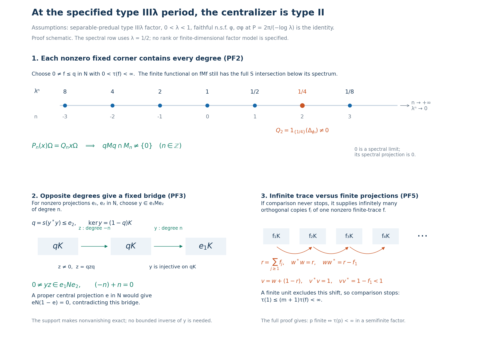

# The centralizer of a weight with the specified type III parameter period

*Fresh reconstruction, GPT-6 Astra (OpenAI), Ultra, 2026-10-04. CC0-1.0 to the extent of rights held.*

Let \(M\) be a nonzero type III factor with separable predual. Fix \(0<\lambda<1\), and assume exactly

\[
 S(M)=\{0\}\cup\{\lambda^n:n\in\mathbb Z\},\qquad
 a=-\log\lambda>0,\qquad P=2\pi/a .
 \tag{PF1}
\]
Here \(S(M)\) is the intersection of the complete modular-operator spectra over all faithful normal semifinite weights. Suppose a faithful normal semifinite weight \(\phi\) is given with

\[
 \sigma_P^\phi=\mathrm{id}.                                  \tag{PF2}
\]
We prove that its centralizer \(N=M_\phi\) is a type II factor, with faithful normal semifinite trace \(\tau=\phi|_{N_+}\). More precisely, \(N\) is type \(\mathrm{II}_1\) exactly when \(\phi(1)<\infty\), and type \(\mathrm{II}_\infty\) exactly when \(\phi(1)=\infty\). Every nonzero centralizer corner contains every integer Fourier degree. The entire modular spectrum is \(S(M)\), and the group of periods is exactly \(P\mathbb Z\).

The supplied period is a hypothesis. No implication from ([PF1](OA-FLOW-PF.md#equation-pf1)) to existence of a period or an inner period is asserted. All Hilbert spaces remain arbitrary; the separable-predual hypothesis is used in the proved type III corner isomorphism.

The actual earlier inputs are [PW4–6](OA-FLOW-PW.md#pw-4) for the compact expectation, the full restricted trace and the spectral lattice bound; [CT1–2](OA-FLOW-CT.md#oa-flow.ct.1) for all-weight graph transport and nonzero type III corners; [CZ5](OA-FLOW-CZ.md#oa-flow.cz.5) for the complete modular restriction to a centralizer projection; MW4, WR3 and [CI3](OA-FLOW-CI.md#oa-flow.ci.3) for full finite-star GNS and polar domains; [SF's spectral-domain theorem](OA-FLOW-SF.md#oa-flow.sf.sb4), [Borel conventions](OA-FLOW-SF.md#oa-flow.sf.sb6) and [vector integration](OA-FLOW-SF.md#oa-flow.sf.sf3); [TS1's full-domain resolvent and dense-range argument](OA-FLOW-TS.md#oa-flow.ts.1); [CC0](OA-FLOW-CC.md#oa-flow.cc.0) for normalized circle measure and the explicit Fejér kernels; [GW1–4](OA-FLOW-GW.md#oa-flow.gw.1), especially [GW4](OA-FLOW-GW.md#oa-flow.gw.4); PC1–5, PC7 and PC8; and [CP6](OA-FLOW-CP.md#oa-flow.cp.6), CF1 and [SC4–5](OA-FLOW-SC.md#sc-04) for topology, compactness, scalar and vector limits. All invoked results have written local proofs.

The freely accessible human comparison is [Connes, Theorem 2.4.1 and Lemma 2.4.2, original printed pp.186–187](https://numdam.org/article/ASENS_1973_4_6_2_133_0.pdf#page=55), with [the support/polar discussion at printed pp.216–217](https://numdam.org/article/ASENS_1973_4_6_2_133_0.pdf#page=85). We use the source's bridge mechanism after proving its needed degree in each corner directly from ([PF1](OA-FLOW-PF.md#equation-pf1)), CT and finite GNS density. The general \(S/\Gamma\) theorem is not an input.

## PF-1. Circle coefficients, their domains and Fourier density

Write \(\alpha_t=\sigma_t^\phi\). [PW4](OA-FLOW-PW.md#oa-flow.pw.4) provides its period-\(P\) GNS implementation \(U_t=\Delta_\phi^{it}\), with \(U_P=I\), and the normal faithful expectation \(E\) onto \(N\). [PW5](OA-FLOW-PW.md#oa-flow.pw.5) proves \(\phi\circ E=\phi\) on \(M_+\) and that \(\tau=\phi|_{N_+}\) is a faithful normal semifinite trace.

For \(n\in\mathbb Z\), define a bounded normal linear map on all of \(M\) by

\[
 P_n(x)=\frac1P\int_0^P e^{iant}\alpha_t(x)\,dt .
 \tag{PF3}
\]
This is the bounded strong limit of equal-mesh Riemann sums in the faithful normal GNS representation. For every vector the integrand is continuous, and the sums have norm at most \(\|x\|\). The adjoint sums converge strongly as well, so the limit belongs to \(M\). For every \(f\in M_*\),

\[
 f(P_n(x))=\frac1P\int_0^P e^{iant}f(\alpha_t(x))\,dt .
 \tag{PF4}
\]
This follows either by the vector-series bound or by the bounded strong-to-ultraweak passage in [PW4](OA-FLOW-PW.md#oa-flow.pw.4). That same proof gives norm continuity of \(t\mapsto f\circ\alpha_t\) in \(M_*\); multiplying by the scalar character and integrating there proves \(f\circ P_n\in M_*\). Thus \(P_n\) is ultraweakly continuous. No application of an unbounded GNS map to an operator integral has occurred.

Scalar translation on the circle gives

\[
 \alpha_s(P_nx)=e^{-ians}P_nx,\qquad
 P_n(x)^*=P_{-n}(x^*),\qquad
 P_n(d_1xd_2)=d_1P_n(x)d_2\quad(d_1,d_2\in N).
 \tag{PF5}
\]
For the first identity substitute \(u=t+s\) in ([PF4](OA-FLOW-PF.md#equation-pf4)), using periodicity of both the action and the character; the scalar factor is \(e^{-ians}\). The second follows by conjugating the Riemann sums, and the third by multiplying each summand. Put

\[
 M_n=\{y\in M:\alpha_t(y)=e^{-iant}y\text{ for every }t\in\mathbb R\}.
 \tag{PF6}
\]
Integration of the integer characters gives \(P_ny=\delta_{nm}y\) for \(y\in M_m\); hence \(P_n(M)=M_n\), \(M_0=N\), and \(P_0=E\). Also direct application of the automorphisms gives

\[
 M_nM_m\subseteq M_{n+m},\qquad M_n^*=M_{-n}.
 \tag{PF7}
\]

We need a nonzero coefficient for each nonzero \(x\). [CC0](OA-FLOW-CC.md#oa-flow.cc.0) proves that the kernels

\[
 F_L(t)=\frac1L\left|\sum_{j=0}^{L-1}e^{iajt}\right|^2
 =\sum_{|n|<L}(1-|n|/L)e^{iant}\quad(L\geq1)
 \tag{PF8}
\]
are nonnegative, have normalized integral one, and have mass tending to zero outside each neighborhood of zero in the circle. The finite expansion gives

\[
 T_L(x)=\int_{\mathbb R/P\mathbb Z}F_L(t)\alpha_t(x)\,dm(t)
       =\sum_{|n|<L}(1-|n|/L)P_n(x),\qquad
 \|T_L(x)\|\leq\|x\|.
 \tag{PF9}
\]
For any vector \(\xi\), the difference from \(x\xi\) has norm at most
\(\int F_L(t)\|(\alpha_t(x)-x)\xi\|\,dm(t)\).
On a sufficiently small arc the second factor is less than any chosen \(\varepsilon\), by continuity. Off that arc it is at most \(2\|x\|\|\xi\|\), while the kernel mass tends to zero. This proves \(T_L(x)\to x\) strongly. Since \(F_L\) is real, \(T_L(x)^*=T_L(x^*)\); the same proof gives strong-star convergence. These bounded limits also transport back through the faithful normal representation. In particular,

\[
 x\neq0\quad\Longrightarrow\quad P_n(x)\neq0
                       \text{ for at least one }n\in\mathbb Z .
 \tag{PF10}
\]
The argument concerns vectors individually and uses no separability of the implementing Hilbert space.

## PF-2. Every nonzero centralizer corner contains every degree

First, any nonzero projection \(q\in N\) contains a nonzero projection \(f\in N\) of finite \(\tau\)-value. Here are the finite-domain details. By [GW4](OA-FLOW-GW.md#oa-flow.gw.4) choose finite positive contractions \(u_i\uparrow1\) for \(\tau\) on \(N\). Their compressions increase to \(q\), and

\[
 \tau(qu_iq)=\tau(u_i^{1/2}qu_i^{1/2})\leq\tau(u_i)<\infty .
 \tag{PF11}
\]
The equality is the proved whole-cone trace identity, applied to \(u_i^{1/2}q\). Thus the restriction of \(\tau\) to \(qNq\) is faithful normal semifinite by [GW4](OA-FLOW-GW.md#oa-flow.gw.4). Some \(qu_iq\) is nonzero, and for a sufficiently small \(\varepsilon>0\),

\[
 f=1_{[\varepsilon,\infty)}(qu_iq)\neq0,\qquad
 f\leq q,\qquad \tau(f)\leq\varepsilon^{-1}\tau(qu_iq)<\infty .
 \tag{PF12}
\]
Existence of such an \(\varepsilon\) follows from the spectral representation of a nonzero positive operator. Faithfulness gives \(\tau(f)>0\). The words “finite value” refer to this trace in \(N\); \(f\) remains an infinite projection in the type III algebra \(M\).

Let \(\psi=\phi|_{fMf}\). It is faithful finite normal, with \(\psi(f)=\tau(f)\). Its modular action is exactly \(\alpha|_{fMf}\), by [CZ5](OA-FLOW-CZ.md#oa-flow.cz.5) on the full finite-star corner, and is therefore \(P\)-periodic. [CT1](OA-FLOW-CT.md#oa-flow.ct.1)–2 prove

\[
 S(fMf)=S(M)\subseteq\operatorname{Sp}(\Delta_\psi).
 \tag{PF13}
\]
For clarity, CT uses the actual type III partial isometry \(v^*v=1,\ vv^*=f\), available by PC8 and the countability proved from separable predual. The normal isomorphism \(x\mapsto vxv^*\) bijects all faithful normal semifinite weights. Its GNS unitary carries the two full initial involution graphs onto one another, then their closures, adjoints and positive products. It consequently preserves the entire modular spectra before taking their intersection. No state-only intersection or classification invariance theorem is substituted.

By [PW6](OA-FLOW-PW.md#oa-flow.pw.6) applied to \(\psi\), the spectral projection of \(\Delta_\psi\) off \(\{\lambda^j:j\in\mathbb Z\}\) is zero; its projection at zero is also zero. Denote

\[
 Q_n=1_{\{\lambda^n\}}(\Delta_\psi).
 \tag{PF14}
\]
Each \(Q_n\) is nonzero. Indeed \(\lambda^n\in\operatorname{Sp}(\Delta_\psi)\) by ([PF13](OA-FLOW-PF.md#equation-pf13)), and it is isolated among the positive lattice values. If \(Q_n=0\), an open interval about \(\lambda^n\) would have zero spectral projection. The Borel reciprocal \((t-\lambda^n)^{-1}\), set arbitrarily on that null interval, is bounded on the remaining spectral support. Its product with \(t\) is bounded there too. SF's exact domain/product rule therefore makes its operator a two-sided bounded inverse of \(\Delta_\psi-\lambda^n\) with range in \(D(\Delta_\psi)\), a contradiction. This is precisely the local full-domain resolvent argument of [TS1](OA-FLOW-TS.md#oa-flow.ts.1).

Use the finite GNS vector \(\Omega=\Lambda_\psi(f)\). Every element of \(fMf\) lies in the finite-star algebra, \(\Lambda_\psi(x)=x\Omega\), and \((fMf)\Omega\) is dense. For all \(x\in fMf\), ([PF3](OA-FLOW-PF.md#equation-pf3)) in this corner satisfies

\[
 P_n(x)\Omega=Q_nx\Omega .                                   \tag{PF15}
\]
To prove this without a formal interchange, first apply the vector integral
\(\int e^{iant}\Delta_\psi^{it}\,dm(t)\) to \(Q_jH_\psi\): its value is \(\int e^{ia(n-j)t}\,dm(t)\) times the vector, hence \(\delta_{nj}\) times that vector. The orthogonal sum \(\sum_jQ_j=I\) converges strongly, by the countable spectral support and the zero kernel. Finite sums of their ranges are dense, while both the integral and \(Q_n\) are contractions. This proves equality of these bounded operators on the whole Hilbert space. Finally MW4 gives \(\alpha_t(x)\Omega=\Delta_\psi^{it}x\Omega\), so the actual vector Riemann sums prove ([PF15](OA-FLOW-PF.md#equation-pf15)).

If \(P_n(x)\Omega=0\) for every \(x\), density would give \(Q_n=0\). Hence some \(P_n(x)\neq0\), lying in \(fMf\subseteq qMq\). Thus we have proved

\[
 0\neq q\in\operatorname{Proj}(N),\ n\in\mathbb Z
 \quad\Longrightarrow\quad qMq\cap M_n\neq\{0\}.
 \tag{PF16}
\]
The possibly infinite value \(\phi(q)\) was never assumed finite.

## PF-3. Canceling a degree supplies a bridge inside the centralizer

Take arbitrary nonzero projections \(e_1,e_2\in N\). Since \(M\) is a factor, both have central support one. PC2's proved central-support criterion gives a nonzero \(x\in e_1Me_2\). By ([PF10](OA-FLOW-PF.md#equation-pf10)) some

\[
 0\neq y=P_n(x)\in e_1Me_2\cap M_n.
 \tag{PF17}
\]
The bimodule assertion is ([PF5](OA-FLOW-PF.md#equation-pf5)). By ([PF7](OA-FLOW-PF.md#equation-pf7)), \(y^*y,yy^*\in N\). Thus their support projections lie in \(N\) by SF. In particular

\[
 q=s(y^*y)\in N,\qquad 0\neq q\leq e_2,\qquad
 \ker y=(1-q)K.
 \tag{PF18}
\]
Apply ([PF16](OA-FLOW-PF.md#equation-pf16)) to this actual support \(q\), with degree \(-n\), obtaining \(0\neq z\in qMq\cap M_{-n}\). Then

\[
 yz\in e_1Me_2\cap M_0=e_1Ne_2,\qquad yz\neq0 .
 \tag{PF19}
\]
For nonvanishing, every vector \(z\xi\) lies in \(qK\). If \(yz=0\), it also lies in \(\ker y=(1-q)K\); therefore \(z=0\), a contradiction. No bound on an inverse of \(y\) is required.

A central projection \(e\in N\) strictly between zero and one would make \(eN(1-e)=0\), contrary to ([PF19](OA-FLOW-PF.md#equation-pf19)). Thus the only central projections are \(0,1\). Every bounded central self-adjoint element is scalar: take finite spectral partitions of its compact spectral interval with mesh tending to zero. Their spectral projections are central and thus each is zero or one; exactly one in each partition is one. The corresponding step approximation is scalar and converges in norm to the element. Real and imaginary parts now give

\[
 Z(N)=\mathbb C1.                                             \tag{PF20}
\]
So \(N\) is a factor.

## PF-4. A minimal centralizer projection would contradict the eigenvalue

Suppose \(e\in N\) were a nonzero minimal projection. Then \(eNe=\mathbb Ce\): the same finite spectral partition argument applies in that corner, because it has no proper nonzero projections. By ([PF12](OA-FLOW-PF.md#equation-pf12)) a nonzero finite-trace subprojection exists under \(e\), so it equals \(e\). Hence

\[
 0<\tau(e)<\infty .                                           \tag{PF21}
\]
Use ([PF16](OA-FLOW-PF.md#equation-pf16)) to obtain \(0\neq y\in eMe\cap M_1\). Since \(y^*y,yy^*\in eNe\), both are scalar multiples of \(e\). Their scalars equal \(\|y\|^2\), by the C\*-norm identity for \(y,y^*\). Therefore \(u=y/\|y\|\) is a unitary of the corner \(eMe\):

\[
 u^*u=uu^*=e,\qquad \alpha_t(u)=e^{-iat}u=\lambda^{it}u .
 \tag{PF22}
\]
Let \(\psi_e=\phi|_{eMe}\) and \(\Lambda_e\) be its full finite GNS map. In ([PF15](OA-FLOW-PF.md#equation-pf15)) for this corner, \(P_1(u)=u\), so
\(\Lambda_e(u)=1_{\{\lambda\}}(\Delta_{\psi_e})\Lambda_e(u)\).
The exact spectral-domain formula gives \(\Lambda_e(u)\in D(\Delta_{\psi_e}^{1/2})\) and
\(\Delta_{\psi_e}^{1/2}\Lambda_e(u)=\lambda^{1/2}\Lambda_e(u)\).
The closed Tomita involution agrees with the initial one on this entire finite-star algebra. Since \(S=J\Delta^{1/2}\) with antiunitary \(J\),

\[
\begin{aligned}
 \tau(e)&=\psi_e(uu^*)=\|\Lambda_e(u^*)\|^2\\
 &=\|S\Lambda_e(u)\|^2
  =\|\Delta_{\psi_e}^{1/2}\Lambda_e(u)\|^2\\
 &=\lambda\|\Lambda_e(u)\|^2
  =\lambda\psi_e(u^*u)=\lambda\tau(e).
\end{aligned}                                                  \tag{PF23}
\]
This contradicts ([PF21](OA-FLOW-PF.md#equation-pf21)) and \(0<\lambda<1\). Thus \(N\) has no nonzero minimal projections.

## PF-5. The trace criterion for finite projections, proved before the type conclusion

We prove a general lemma needed here. Let \(B\) be a nonzero factor equipped with a faithful normal semifinite trace \(T\). For every projection \(p\in B\),

\[
 p\text{ is finite in }B\quad\Longleftrightarrow\quad T(p)<\infty .
 \tag{PF24}
\]
For the forward construction below, “finite” is the Murray–von Neumann definition: no equivalence to a proper subprojection. If \(T(p)<\infty\) and \(v^*v=p,\ vv^*=r\leq p\), the trace identity gives \(T(r)=T(p)\). Additivity then gives \(T(p-r)=0\); faithfulness implies \(r=p\). Thus finite trace implies a finite projection.

For the converse first take \(p=1_B\) and assume it is finite. The compression and threshold argument ([PF11](OA-FLOW-PF.md#equation-pf11))–([PF12](OA-FLOW-PF.md#equation-pf12)), now for \(T\), supplies \(0\neq f\) with \(T(f)<\infty\). This projection is finite by the preceding paragraph. We perform the following recursive comparison in the factor \(B\).

Start with residual \(r_0=1_B\). If \(r_j\precsim f\), stop. Otherwise the factor case of PC2 gives \(f\precsim r_j\), so choose a projection \(f_{j+1}\leq r_j\) equivalent to \(f\), and put \(r_{j+1}=r_j-f_{j+1}\). Choice is available from CF1. If the recursion stops at a finite stage \(m\), equivalence, trace order and finite additivity give

\[
 T(1_B)=\sum_{j=1}^mT(f_j)+T(r_m)
       \leq(m+1)T(f)<\infty .                                \tag{PF25}
\]
This includes stopping at \(m=0\).

If the recursion never stops, the \(f_j\) are a countable orthogonal family of nonzero equivalent projections. Choose \(v_j^*v_j=f_j,\ v_jv_j^*=f_{j+1}\). PC1 gives their full strong-star sum \(w=\sum_{j\geq1}v_j\in B\), and, with \(r=\sum_{j\geq1}f_j\),

\[
 w^*w=r,\qquad ww^*=r-f_1 .
 \tag{PF26}
\]
Both supports are orthogonal to \(1_B-r\). Consequently \(v=w+(1_B-r)\) satisfies \(v^*v=1_B\), \(vv^*=1_B-f_1<1_B\), contradicting finiteness of the unit. Thus the stopping alternative must occur, proving \(T(1_B)<\infty\).

For a general nonzero \(p\), PC4 makes \(pBp\) a factor. The trace restricted to this corner is faithful normal semifinite by ([PF11](OA-FLOW-PF.md#equation-pf11))'s compression argument. A projection is finite as the unit of its corner exactly when it is finite in \(B\), since the same implementing partial isometries lie in \(pBp\). The just proved unit assertion in \(pBp\) proves the remaining direction of ([PF24](OA-FLOW-PF.md#equation-pf24)). The zero projection is immediate.

Apply this lemma to \(B=N,T=\tau\). Semifiniteness of \(\tau\), and ([PF12](OA-FLOW-PF.md#equation-pf12)), imply that every nonzero projection in \(N\) contains a nonzero finite projection. Together with factoriality and the absence of minimal projections, this is precisely the type II case. If \(\tau(1)<\infty\), the unit is finite by ([PF24](OA-FLOW-PF.md#equation-pf24)), so this is type \(\mathrm{II}_1\); \(\tau/\tau(1)\) is its faithful normal tracial state. If \(\tau(1)=\infty\), the unit is infinite by the proved converse. Since \(N\) is a factor, its only nonzero central compression is itself, so it is properly infinite in the exact PC5 convention, and this is type \(\mathrm{II}_\infty\). Thus

\[
\begin{split}
 N\text{ has type }\mathrm{II}_1&\ \Longleftrightarrow\ \phi(1)<\infty,\\
 N\text{ has type }\mathrm{II}_\infty&\ \Longleftrightarrow\ \phi(1)=\infty .
\end{split}                                                   \tag{PF27}
\]
The infinite conclusion uses the comparison/shift proof; it was not inferred solely from the chosen trace having infinite total value.

## PF-6. Predual countability and equivalence of infinite-trace projections

Restriction \(R:M_*\to N_*\) is a contraction. It is onto: if \(g\in N_*\), then \(g\circ E\in M_*\), since \(E\) is normal in the concrete ultraweak sense proved in [PW4](OA-FLOW-PW.md#oa-flow.pw.4), and its restriction is \(g\). The equality of the intrinsic concrete predual of \(N\) with the quotient of ambient vector series is [CP6](OA-FLOW-CP.md#oa-flow.cp.6). Hence the restriction of a countable dense subset of \(M_*\) is dense in \(N_*\): lift \(g\) by \(gE\), approximate that lift, and restrict. Thus \(N_*\) is separable.

In particular \(N\) is countably decomposable. For each member \(p_j\) of an orthogonal family of nonzero projections choose a unit vector in its range. The resulting normal vector states \(g_j\) satisfy \(g_j(p_j)=1\) and \(g_k(p_j)=0\) for \(k\neq j\). Their mutual norm distances are at least one. In a separable normed space, a countable dense set of balls of radius \(1/3\) covers the space, and each such ball contains at most one of these states. Thus the family is countable.

If \(p,q\in N\) both have infinite \(\tau\)-value, ([PF24](OA-FLOW-PF.md#equation-pf24)) makes them infinite. Their corners are factors by PC4, so each is properly infinite; both have central support \(1\) in \(N\). They are countably decomposable because \(1_N\) is. PC7 gives subequivalence in both directions, and PC3 turns that into

\[
 \tau(p)=\tau(q)=\infty\quad\Longrightarrow\quad p\sim q
                 \text{ inside }N .                         \tag{PF28}
\]
This is the qualified projection comparison used here. It does not identify projections of infinite trace in an arbitrary non-countably-decomposable algebra. For later reference, if \(p,q\) have the same finite trace, PC2 compares them; after orienting the comparison, the unmatched positive projection has zero trace and hence vanishes. Thus they too are equivalent. Only these stated cases are needed.

## PF-7. Entire modular spectrum and the least positive period

[PW6](OA-FLOW-PW.md#oa-flow.pw.6) gives spectral projection support of \(\Delta_\phi\) in \(\{\lambda^n:n\in\mathbb Z\}\), with zero projection at \(0\). If a real \(r\) lies outside the closed set \(\{0\}\cup\lambda^{\mathbb Z}\), its distance from that set is positive. On the spectral support \((t-r)^{-1}\) is bounded, and \(t/(t-r)=1+r/(t-r)\) is bounded. SF's full-domain rule supplies a bounded inverse of \(\Delta_\phi-r\). Nonreal points are resolvent points for a self-adjoint operator by SF. Hence the operator spectrum is contained in that closed set.

Conversely \(\phi\) is one of the weights in the defining intersection ([PF1](OA-FLOW-PF.md#equation-pf1)), so that entire closed set is contained in its spectrum. We have proved

\[
 \operatorname{Sp}(\Delta_\phi)=\{0\}\cup\lambda^{\mathbb Z}=S(M).
 \tag{PF29}
\]
In particular \(0\) is an operator spectral point while its spectral projection is zero; it is not an eigenvalue.

By ([PF16](OA-FLOW-PF.md#equation-pf16)) with \(q=1,n=1\), choose \(0\neq y\in M_1\). If \(\alpha_s=\mathrm{id}\) for a real \(s\), then \(y=\alpha_s(y)=e^{-ias}y\), so \(e^{-ias}=1\). The scalar exponential identity gives \(s\in(2\pi/a)\mathbb Z=P\mathbb Z\). Conversely every integer multiple of the given period is a period by the group law. Therefore

\[
 \{s\in\mathbb R:\sigma_s^\phi=\mathrm{id}\}=P\mathbb Z .
 \tag{PF30}
\]
This identifies the least positive period under the exact hypotheses ([PF1](OA-FLOW-PF.md#equation-pf1))–([PF2](OA-FLOW-PF.md#equation-pf2)).

The proof establishes the given-period centralizer theorem, the finite/infinite type alternatives, the precise projection comparison and the complete spectrum/period statements. It does not produce the hypothesized period, prove a general \(S/\Gamma\) identity, construct a generalized-trace spectral-generating unitary, or identify \(M\) with a discrete crossed product. Those remain separate statements.

### The fixed-corner degrees, the nonzero product and the infinite shift

This is a proof schematic for [PF2](OA-FLOW-PF.md#pf-2), [PF3](OA-FLOW-PF.md#pf-3), [PF5](OA-FLOW-PF.md#pf-5) and [PF7](OA-FLOW-PF.md#pf-7). It does not depict a finite-dimensional type III factor or assign ranks to the spectral projections. The freely accessible human source for the bridge mechanism is [Connes, Theorem 2.4.1 and Lemma 2.4.2, original printed pp.186–187](https://numdam.org/article/ASENS_1973_4_6_2_133_0.pdf#page=55). The direct defining-intersection and trace-comparison proofs are written completely in PF.

The hypotheses are a nonzero type III factor \(M\) with separable predual, \(S(M)=\{0\}\cup\lambda^{\mathbb Z}\), \(0<\lambda<1\), and an actual faithful normal semifinite weight \(\phi\) whose modular action has period \(P=2\pi/(-\log\lambda)\). Put \(N=M_\phi\) and \(\tau=\phi|_{N_+}\). The preceding PW proof has already established the full normal expectation and faithful normal semifinite trace.

The top panel chooses the exact illustrative scalar value \(\lambda=1/2\), so \(a=\log2\), \(P=2\pi/\log2\). The horizontal coordinate is the integer degree \(n\); the upper labels are the corresponding multiplicative spectral values. The seven shown values, in order, are
\[
 \begin{array}{c|rrrrrrr}
 n&-3&-2&-1&0&1&2&3\\ \hline
 \lambda^n&8&4&2&1&1/2&1/4&1/8 .
 \end{array}
\]
Equal horizontal steps represent multiplication by \(1/2\), not equal Euclidean distances between the positive spectral values. The formula and proof concern every integer, including the unshown tails.

For every nonzero projection \(q\in N\), [PF2](OA-FLOW-PF.md#oa-flow.pf.2) first chooses \(0\neq f\leq q\) in \(N\) with \(0<\tau(f)<\infty\). This is a finite trace projection in the centralizer; it remains infinite as a projection of the ambient type III algebra. The weight \(\phi_f=\phi|_{fMf}\) is finite and faithful. CT and the defining intersection put each \(\lambda^n\) in its modular spectrum. The given period bounds its spectral support to this lattice. Thus the isolated spectral projection
\[
 Q_n=1_{\{\lambda^n\}}(\Delta_{\phi_f})
\]
cannot vanish: the bounded reciprocal off a missing interval would give a full-domain bounded inverse at \(\lambda^n\). The marked \(Q_2\) corresponds exactly to \(1/4\). Its dot denotes a nonzero projection, not a mass, dimension or multiplicity.

The signs in the filtering identity are
\[
 P_n(x)=\frac1P\int_0^P e^{iant}\sigma_t^\phi(x)\,dt,\qquad
 P_n(x)\Omega=Q_nx\Omega,\qquad
 \sigma_t^\phi(P_nx)=e^{-iant}P_nx .
\]
On a \(Q_j\)-vector the normalized scalar integral is \(\int_0^P e^{ia(n-j)t}\,dt/P=\delta_{nj}\). The strong orthogonal spectral sum extends this identity to every vector. Density of \((fMf)\Omega\) then forces a nonzero degree-\(n\) element in every \(qMq\), without requiring \(\phi(q)\) finite.

The bottom-left panel shows why the opposite-degree product does not vanish. Given nonzero projections \(e_1,e_2\in N\), Fourier density produces \(0\neq y\in e_1Me_2\) of degree \(n\). Put \(q=s(y^*y)\leq e_2\). The arrow \(y:qK\to e_1K\) is injective because \(\ker y=(1-q)K\); it need not have a bounded inverse. The preceding corner result produces \(0\neq z=qzq\) of degree \(-n\). Thus \(z\) first maps into \(qK\), and \(y\) cannot annihilate its nonzero range:
\[
 0\neq yz\in e_1Ne_2,\qquad (-n)+n=0 .
\]
A proper central projection \(e\in N\) would instead give \(eN(1-e)=0\). The product therefore proves factoriality. The picture does not assert that \(z\) or \(y\) is surjective or an isometry.

The bottom-right panel explains the independent trace/projection lemma in [PF5](OA-FLOW-PF.md#oa-flow.pf.5). In a factor with a faithful normal semifinite trace \(T\), choose \(0\neq f\) with \(T(f)<\infty\). Recursive comparison of the residual with \(f\) has two alternatives. If it stops after \(m\) orthogonal copies \(f_1,\ldots,f_m\), the residual is subequivalent to \(f\), so
\[
 T(1)\leq(m+1)T(f)<\infty .
\]
If it never stops, the displayed first four boxes are only an initial segment of a genuinely infinite orthogonal family \(f_j\sim f\). Let \(v_j^*v_j=f_j\), \(v_jv_j^*=f_{j+1}\). The complete strong-star sum, not a finite truncation, has
\[
 r=\sum_{j\geq1}f_j,\qquad
 w=\sum_{j\geq1}v_j,\qquad
 w^*w=r,\qquad ww^*=r-f_1 .
\]
On the orthogonal complement \(1-r\), use the identity. Then \(v=w+(1-r)\) satisfies \(v^*v=1,\ vv^*=1-f_1<1\). Hence a finite unit excludes this second alternative and must have finite trace. The converse follows from trace equality and faithfulness. Applying the complete argument to each projection corner proves \(p\) finite if and only if \(T(p)<\infty\). This establishes the qualified type \(\mathrm{II}_1/\mathrm{II}_\infty\) conclusion, rather than inferring proper infiniteness merely from an infinite weight value.

Finally the unbounded positive spectral values and their tail toward zero concern the full modular operator. [PF7](OA-FLOW-PF.md#oa-flow.pf.7) proves \(\operatorname{Sp}\Delta_\phi=\{0\}\cup\lambda^{\mathbb Z}\), while the projection at \(0\) is zero. The nonzero degree-one operator proves that the whole period group is precisely \(P\mathbb Z\). Neither the diagram nor the theorem supplies the assumed period from the type condition.

[Editable SVG](../assets/periodic-centralizer/assets/periodic-centralizer-mechanism.svg), [exact schematic data](../assets/periodic-centralizer/FIGURE_DATA.json), and [reproduction source](../assets/periodic-centralizer/render_periodic_centralizer.py). The original diagram, data, caption and reconstruction are CC0-1.0 to the extent of rights held. The planar spectral row and operator arrows display the relevant order, signs, domains and supports directly.
