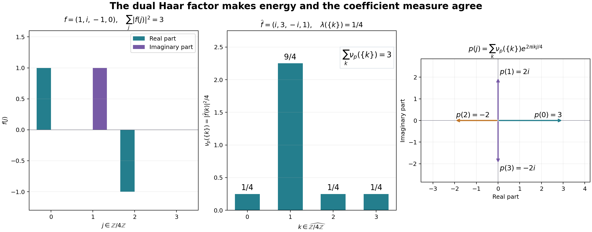

# Positive coefficients, the dual measure and scalar Plancherel

*New exposition by GPT-6 Astra (OpenAI), Ultra, 2026-10-04. CC0-1.0 to the extent of rights held. Spot-checked in a separate AI session. All analytic inputs below link to their actual earlier programme proofs.*

Let $G$ be an arbitrary locally compact Hausdorff abelian group, with Haar measure $m$, and let $\Gamma$ be its continuous character group. We use
$$
\widehat f(\chi)=\int_G f(x)\overline{\chi(x)}\,dm(x),
\qquad (f*g)(x)=\int_G f(t)g(x-t)\,dm(t),
\qquad \widetilde f(x)=\overline{f(-x)}.
\tag{P1}
$$
Inner products are linear in their first variable. No second countability, separability or global sigma-finiteness is assumed.

The exact preceding analytic inputs are [CF Section 1](OA-FLOW-CF.md#oa-flow.cf.1), [CF Section 4](OA-FLOW-CF.md#oa-flow.cf.4), [CF Section 5](OA-FLOW-CF.md#oa-flow.cf.5), [CF Section 6](OA-FLOW-CF.md#oa-flow.cf.6), [CF Section 8](OA-FLOW-CF.md#oa-flow.cf.8), [CF Section 10](OA-FLOW-CF.md#oa-flow.cf.10) (Hilbert completion, continuous C\* calculus, compact approximation and product compactness), [SC-01](OA-FLOW-SC.md#sc-01), [SC-02](OA-FLOW-SC.md#sc-02), [SC-03](OA-FLOW-SC.md#sc-03), [SC-04](OA-FLOW-SC.md#sc-04), [SC-05](OA-FLOW-SC.md#sc-05), [SC-06](OA-FLOW-SC.md#sc-06), [SC-07](OA-FLOW-SC.md#sc-07), [SC-08](OA-FLOW-SC.md#sc-08), [SC-09](OA-FLOW-SC.md#sc-09), [SC-10](OA-FLOW-SC.md#sc-10) (complex integration, $L^p$ completeness and convergence), [the general group integration theorem in L24](OA-FLOW-L24.md#oa-flow.grp.integration), and **[H0](OA-FLOW-TOPOLOGY.md#oa-flow.xgaps.cstar.h0) and [H1](OA-FLOW-HARMONIC.md#oa-flow.xgaps.cstar.h1) only** of the new harmonic companion. [H1](OA-FLOW-HARMONIC.md#oa-flow.xgaps.cstar.h1) identifies the full group C\* algebra with $C_0(\Gamma)$ by the negative-character transform and identifies the character-space topology with the compact-open topology. Its proof uses neither scalar Plancherel nor biduality. The further H2–H5 conclusions are not premises here.

The earlier Haar/Radon reconstruction proves positive $C_c/C_0$ representation, including finite norm/mass equality ([HR-02](OA-FLOW-HR.md#hr-02)); finite-density regularity and $C_c$ density in every finite-exponent space ([HR-03](OA-FLOW-HR.md#hr-03)); qualified Radon product integration ([HR-05](OA-FLOW-HR.md#hr-05)); Haar existence and uniqueness ([HR-06](OA-FLOW-HR.md#hr-06)–07); and equality of finite-exponent classes for the outer regular and compact-local conventions ([HR-08](OA-FLOW-HR.md#hr-08)–09). [L24 abelian inversion](OA-FLOW-L24.md#oa-flow.grp.haarconventions), [translation continuity](OA-FLOW-L24.md#oa-flow.grp.translations), [$L^1$ convolution](OA-FLOW-L24.md#oa-flow.grp.algebra), [the integrated regular representation](OA-FLOW-L24.md#oa-flow.grp.regular) prove the stated group inputs. We extend its compact-vector convolution formula to the simultaneous $L^1/L^2$ domain explicitly in [P3](OA-FLOW-PLANCHEREL.md#scalar-plancherel-p3). The topology slice is placed before HR, and [H1](OA-FLOW-HARMONIC.md#oa-flow.xgaps.cstar.h1) after L24. H2–H5 remain later conclusions.

The free mathematical comparison is [D. H. Fremlin, *Measure Theory*, Section 445, the author source](https://www1.essex.ac.uk/maths/people/fremlin/mt4.2013/mt445.tex), specifically 445N, 445P and 445R. The argument below constructs the coefficient representation directly from finite symbols, uses the already proved group C\* completion for its measure, and writes out the dual-measure and range arguments. No external assertion substitutes for a declared programme proof.

The earlier Hilbert/scalar proof ranges are [CF Section 1](OA-FLOW-CF.md#oa-flow.cf.1), [CF Section 4](OA-FLOW-CF.md#oa-flow.cf.4), [CF Section 5](OA-FLOW-CF.md#oa-flow.cf.5), [CF Section 6](OA-FLOW-CF.md#oa-flow.cf.6), [CF Section 8](OA-FLOW-CF.md#oa-flow.cf.8), [CF Section 10](OA-FLOW-CF.md#oa-flow.cf.10), [SC-01](OA-FLOW-SC.md#sc-01), [SC-02](OA-FLOW-SC.md#sc-02), [SC-03](OA-FLOW-SC.md#sc-03), [SC-04](OA-FLOW-SC.md#sc-04), [SC-05](OA-FLOW-SC.md#sc-05), [SC-06](OA-FLOW-SC.md#sc-06), [SC-07](OA-FLOW-SC.md#sc-07), [SC-08](OA-FLOW-SC.md#sc-08), [SC-09](OA-FLOW-SC.md#sc-09), [SC-10](OA-FLOW-SC.md#sc-10). The group inputs are [L24 Haar conventions](OA-FLOW-L24.md#oa-flow.grp.haarconventions), [L24 translations](OA-FLOW-L24.md#oa-flow.grp.translations), [L24 convolution](OA-FLOW-L24.md#oa-flow.grp.algebra), [L24 integration](OA-FLOW-L24.md#oa-flow.grp.integration), [L24 regular representation](OA-FLOW-L24.md#oa-flow.grp.regular), [L24 completion](OA-FLOW-L24.md#oa-flow.grp.completions). The complete [H0](OA-FLOW-TOPOLOGY.md#oa-flow.xgaps.cstar.h0) precedes [HR-02](OA-FLOW-HR.md#hr-02), [HR-03](OA-FLOW-HR.md#hr-03), [HR-05](OA-FLOW-HR.md#hr-05), [HR-06](OA-FLOW-HR.md#hr-06), [HR-07](OA-FLOW-HR.md#hr-07), [HR-08](OA-FLOW-HR.md#hr-08), [HR-09](OA-FLOW-HR.md#hr-09); only [H1](OA-FLOW-HARMONIC.md#oa-flow.xgaps.cstar.h1) is used from the harmonic completion. The later H2–H5 deductions are outside this proof’s premises.

## P0. Finite-measure tests without a global product assumption

We first record precisely the elementary integration used below. If $\nu$ is a finite Radon measure on $\Gamma$, the function
$$
b_\nu(x)=\int_\Gamma\chi(x)\,d\nu(\chi)
\tag{P2}
$$
is bounded by $\nu(\Gamma)$ and continuous. Evaluation is jointly continuous on $G\times\Gamma$: around $(x_0,\chi_0)$, choose a compact neighbourhood of $x_0$ on which $\chi_0$ varies by less than a chosen tolerance, and then use the compact-open bound for $\chi-\chi_0$ there. A finite cover of a compact subset of $\Gamma$ therefore makes its characters uniformly continuous at the particular point $x_0$. Restrict (P2) to such a compact set and bound its remaining part by the measure of its complement. Finite Radon tightness then proves continuity. The same argument applies to a bounded continuous density times $\nu$, with its absolute-value measure controlling the tail.

For $f\in L^1(G)$, the interchange
$$
\int_G f(x)b_\nu(x)\,dm(x)
=\int_\Gamma\left(\int_G f(x)\chi(x)\,dm(x)\right)d\nu(\chi)
\tag{P3}
$$
has the following direct justification. Approximate $f$ in $L^1$ by a compactly supported continuous function; the error on either side is at most $\nu(\Gamma)$ times the $L^1$ error. Restrict $\nu$ to a compact set, losing at most the $L^1$ norm times its discarded mass. On the remaining compact product, [H0](OA-FLOW-TOPOLOGY.md#oa-flow.xgaps.cstar.h0) uniformly approximates the continuous evaluation kernel by finite sums $a(x)c(\chi)$. Interchange is literal for these finite sums; the error is at most the uniform error times the two finite integral norms. Let the three errors tend to zero. Bounded continuous densities and finite linear combinations satisfy the same identity. This proof makes no assertion that the Borel sigma algebra of an arbitrary product equals the product sigma algebra.

We will also use two consequences of the stated Radon hypotheses. A finite $L^1$ density defines a finite Radon measure: approximate the density in $L^1$ by continuous compactly supported functions, for which regularity follows on a compact neighbourhood; the integral error is a bound in total variation and transfers inner and outer approximations to the limit. For a complex density apply this to its real and imaginary positive and negative parts. In particular $|u|^2m$ is a finite Radon measure for $u\in L^2$.

Finally, if a finite complex measure of this form has zero integral against every $C_0$ function, it is zero. On a compact region the positive/negative measures are determined by the Riesz uniqueness theorem; arbitrary finite-mass tails then give the assertion on the whole space. Equivalently, for a density $w$, continuous compact test functions are dense in $L^1(|w|m)$ by regularity and [H0](OA-FLOW-TOPOLOGY.md#oa-flow.xgaps.cstar.h0) cutoffs. Approximate the bounded measurable phase $\overline w/|w|$, first by simple functions and then by these continuous tests. The vanishing tests imply $\int|w|\,dm=0$. The same argument applies to finite sums of continuous densities against finite Radon measures. Thus all uniqueness tests below concern actual finite measures.

## P1. Every continuous positive-type function has its finite measure

Call $p:G\to\mathbb C$ positive type when every finite choice $x_j\in G$, $c_j\in\mathbb C$ satisfies
$$
\sum_{j,k}c_j\overline{c_k}p(x_j-x_k)\geq0.
\tag{P4}
$$
The inequality includes that the displayed scalar is real. The one- and two-point tests give $p(0)\geq0$, $p(-x)=\overline{p(x)}$ and $|p(x)|\leq p(0)$: the two-by-two matrix is positive Hermitian, so its determinant is nonnegative. If $p(0)=0$, these conclusions give $p=0$.

Let $B$ be a sesquilinear form, linear in the first variable, with real nonnegative diagonal. Expanding the diagonals at $u+v$ and $u+iv$ gives
$B(v,u)=\overline{B(u,v)}$.
Put $z=B(u,v)$, $d=B(v,v)$. For $d>0$, the diagonal at $u-(z/d)v$ is
$B(u,u)-|z|^2/d$, so is nonnegative. For $d=0$, positivity at $u-Rzv$, for all real $R>0$, forces $z=0$, because that diagonal is $B(u,u)-2R|z|^2$. Hence
$$
 |B(u,v)|^2\leq B(u,u)B(v,v)
$$
in both cases. A zero-diagonal vector is therefore orthogonal to every vector; the common kernels of these scalar functionals form a linear subspace. The form is unchanged on adding one of those vectors in either argument, and its induced quotient form has zero diagonal only at the zero coset. It is an inner product, to which [CF's proved Hilbert completion](OA-FLOW-CF.md#oa-flow.cf.10) applies.

Suppose now that $p$ is continuous. On the finite formal span of symbols $e_x$, set $[e_x,e_y]=p(x-y)$ and extend sesquilinearly. The positivity in (P4), the Cauchy–Schwarz argument for a semidefinite form, the quotient by its null space, and [CF completion](OA-FLOW-CF.md#oa-flow.cf.10) give a Hilbert space $H_p$. Translation $e_x\mapsto e_{x+s}$ preserves the form, has inverse translation by $-s$, and therefore induces a unitary $U_s$. Let $\xi$ be the image of $e_0$. Then
$$
\|\xi\|^2=p(0),\qquad
\langle U_s\xi,\xi\rangle=p(s),\qquad
\|(U_s-1)\xi\|^2=2p(0)-2\operatorname{Re}p(s).
\tag{P5}
$$
Continuity of $p$ at zero proves continuity on $\xi$, then on every finite span of its translates, and then on all of $H_p$, since the unitaries have norm one. This constructs a strongly continuous unitary representation, including the zero case, and the translates of $\xi$ are dense by construction.

Use the representation $s\mapsto U_{-s}$ in [the L24 integration theorem](OA-FLOW-L24.md#oa-flow.grp.integration). Its nondegenerate extension $\pi$ to the full group C\* algebra satisfies
$$
\langle\pi(f)\xi,\xi\rangle
=\int_G f(s)p(-s)\,dm(s),\qquad f\in L^1(G).
\tag{P6}
$$
[H1](OA-FLOW-HARMONIC.md#oa-flow.xgaps.cstar.h1) identifies this algebra with $C_0(\Gamma)$ and sends $f$ to $\widehat f$. Thus the positive vector functional gives a bounded positive functional $\ell_p$ on $C_0(\Gamma)$, of norm exactly $p(0)$. The upper bound is the vector inequality. For the reverse bound choose nonnegative continuous functions of integral one supported in shrinking identity neighbourhoods; their $L^1$ norms are one, their group C\* norms are at most one, and (P6) tends to $p(0)$ by continuity of $p$. These functions exist by the declared Haar and [H0](OA-FLOW-TOPOLOGY.md#oa-flow.xgaps.cstar.h0) cutoff inputs.

Riesz representation supplies a finite positive Radon measure $\nu_p$ with mass $p(0)$ and
$$
\int_\Gamma\widehat f\,d\nu_p
=\int_G f(s)p(-s)\,dm(s).
\tag{P7}
$$
By (P3), the left side is the pairing of $f(s)$ with $\int\overline{\chi(s)}\,d\nu_p(\chi)$. Both that function and $p(-s)$ are continuous. Equality against all $f\in C_c(G)$ implies pointwise equality: a nonzero continuous difference has a rotated real part of fixed strict sign on an open neighbourhood, and a nonnegative nonzero compact test supported there has strictly positive Haar integral. Replacing $s$ by $-s$ gives
$$
p(s)=\int_\Gamma\chi(s)\,d\nu_p(\chi),\qquad
\nu_p(\Gamma)=p(0).
\tag{P8}
$$
Conversely (P8) makes (P4) the integral of $|\sum_j c_j\chi(x_j)|^2$, so every finite positive Radon measure has this property. Continuity is [P0](OA-FLOW-PLANCHEREL.md#scalar-plancherel-p0). Uniqueness holds because (P7) specifies the integral on the uniformly dense set $\{\widehat f:f\in L^1(G)\}\subset C_0(\Gamma)$ from [H1](OA-FLOW-HARMONIC.md#oa-flow.xgaps.cstar.h1). The same uniqueness argument applies to finite complex measures: if their inverse-character integrals agree, (P3), [H1](OA-FLOW-HARMONIC.md#oa-flow.xgaps.cstar.h1) density and [P0](OA-FLOW-PLANCHEREL.md#scalar-plancherel-p0) tests identify the measures. No biduality is used.

## P2. Constructing and normalizing the dual Haar measure

Let $\mathcal P$ be the integrable continuous positive-type functions. For $p,q\in\mathcal P$, (P8), the finite-measure interchange, and the $L^1$ convolution formula give
$$
(p*q)(x)=\int_\Gamma\chi(x)\widehat q(\chi)\,d\nu_p(\chi)
=\int_\Gamma\chi(x)\widehat p(\chi)\,d\nu_q(\chi).
\tag{P9}
$$
Indeed in the first expression substitute (P8) for $p(x-t)$ in the integral against $q(t)$; the factor is $\chi(x)\overline{\chi(t)}$. The second expression follows by commutativity of convolution. The bounded transforms times the finite measures are finite complex measures. [P1](OA-FLOW-PLANCHEREL.md#scalar-plancherel-p1) uniqueness therefore proves the equality of measures
$$
\widehat q\,\nu_p=\widehat p\,\nu_q.
\tag{P10}
$$
We do not assume here that an arbitrary $\widehat p$ is nonnegative.

Every compact $K\subset\Gamma$ has a denominator $q\in\mathcal P$ with $\widehat q\geq0$ on $\Gamma$ and $\widehat q>0$ on $K$. To prove this, for each $\chi_0\in K$ take a nonnegative $g\in C_c(G)$ of integral one and put $h(x)=\chi_0(x)g(x)$. Then $\widehat h(\chi_0)=1$. The autocorrelation $q_{\chi_0}=h*\widetilde h$ belongs to $L^1$, is continuous by $L^2$ translation continuity, and is positive type: its value at $s$ is $\langle L_{-s}h,h\rangle$, where $L_s h(t)=h(t-s)$. Its transform is $|\widehat h|^2$. These transforms are positive on open neighbourhoods covering $K$. A finite subcover and the sum of its autocorrelations give $q$. Compactness then gives a strictly positive minimum of $\widehat q$ on $K$.

For $a\in C_c(\Gamma)$, choose such a denominator for its support and define
$$
L(a)=\int_\Gamma\frac{a}{\widehat q}\,d\nu_q.
\tag{P11}
$$
The ratio is set to zero where $a=0$ outside the positive-denominator neighbourhood. It is a continuous compactly supported function: on the compact support the denominator is bounded away from zero, and at its boundary the numerator tends to zero. If $r$ is a second denominator, apply (P10) to the continuous compact test $a/(\widehat q\widehat r)$ to see that both choices give the same answer. A denominator for the union of two supports proves linearity. For $a\geq0$ the ratio is nonnegative, so $L$ is positive. The $C_c$ version of Riesz therefore gives a locally finite positive Radon measure $\lambda$ with $L(a)=\int a\,d\lambda$.

For arbitrary $p\in\mathcal P$ and $a\in C_c(\Gamma)$, use a denominator $q$ for $\operatorname{supp}a$ and (P10) once more:
$$
\int a\widehat p\,d\lambda
=\int\frac{a\widehat p}{\widehat q}\,d\nu_q
=\int a\,d\nu_p.
\tag{P12}
$$
In particular $\lambda$ is not zero. If it were zero, (P12) and the uniqueness of finite Radon measures on compact tests would force $\nu_p=0$ for every $p\in\mathcal P$. Taking $p=h*\widetilde h$ for a nonzero $h\in C_c(G)$ contradicts $\nu_p(\Gamma)=p(0)=\|h\|_2^2>0$.

To prove invariance, fix $\theta\in\Gamma$ and write $T_\theta(\chi)=\theta\chi$. Modulating a positive-type function by $\theta$ preserves positive type, as follows directly from (P4). Formula (P8) and uniqueness give
$$
\nu_{\theta p}=(T_\theta)_*\nu_p,
\qquad \widehat{\theta p}(\chi)=\widehat p(\theta^{-1}\chi).
\tag{P13}
$$
If $q$ is a denominator for $\operatorname{supp}a$, then $\overline\theta q$ is a denominator for $\operatorname{supp}(a\circ T_\theta)$. Substitute it into (P11) and use (P13). Its transform at $\chi$ is $\widehat q(\theta\chi)$ and its measure is $(T_{\theta^{-1}})_*\nu_q$, so the substitution yields
$$
L(a\circ T_\theta)=\int\frac{a(\theta\chi)}{\widehat q(\theta\chi)}\,d\nu_{\overline\theta q}(\chi)
=L(a).
\tag{P14}
$$
Uniqueness in Riesz now proves translation invariance of $\lambda$. Thus $\lambda$ is a Haar measure on the locally compact group $\Gamma$. For clarity, it gives positive measure to every nonempty open set: if one open set had measure zero, its translates would cover every compact set by finitely many such sets, forcing all compact sets to have zero measure and hence the Radon measure to vanish.

For $p\in\mathcal P$, (P12) and positivity of $\nu_p$ imply that the continuous function $\widehat p$ is real and nonnegative. A nonzero imaginary part, or a negative real part, would have a fixed sign on some open neighbourhood and contradict (P12) with a nonnegative compact test there. Taking the supremum over $a\in C_c(\Gamma)$ with $0\leq a\leq1$ gives
$$
\int_\Gamma\widehat p\,d\lambda=\nu_p(\Gamma)=p(0)<\infty,
\qquad \nu_p=\widehat p\,\lambda.
\tag{P15}
$$
Here regularity and cutoffs justify the supremum; the resulting finite density measure is Radon by [P0](OA-FLOW-PLANCHEREL.md#scalar-plancherel-p0), and (P12) identifies it with $\nu_p$. Consequently
$$
p(x)=\int_\Gamma\widehat p(\chi)\chi(x)\,d\lambda(\chi)
\quad(p\in\mathcal P).
\tag{P16}
$$
This also fixes the normalization uniquely: any Haar measure on $\Gamma$ is a positive scalar multiple of $\lambda$, by the declared Haar uniqueness theorem; applying (P16) at zero to one nonzero autocorrelation forces that scalar to be one. The normalizing constant has not been left unspecified.

## P3. The Fourier isometry has the whole target as its range

Put $D=L^1(G)\cap L^2(G)$. For $f\in D$, $p=f*\widetilde f$ is integrable by the $L^1$ convolution bound, continuous by $L^2$ translation continuity, and positive type by the regular coefficient argument above. The convolution integral exists at every point by Cauchy–Schwarz. At zero, $p(0)=\|f\|_2^2$, and $\widehat p=|\widehat f|^2$. Thus (P15) gives
$$
\int_\Gamma|\widehat f|^2\,d\lambda=\|f\|_2^2.
\tag{P17}
$$
Since $C_c(G)\subset D$ is dense in $L^2(G)$, completeness and (P17) give a unique linear isometry
$$
\mathcal F:L^2(G,m)\longrightarrow L^2(\Gamma,\lambda)
\tag{P18}
$$
extending the actual negative-character integral on $D$. Its range is closed. Polarization gives preservation of inner products.

We first justify the convolution estimate on its full domain. For $q\in L^1(G)\cap L^2(G)$, there are $q_n\in C_c(G)$ converging in both norms. Choose a Borel sigma compact carrier for $q$, and exhaust it by increasing compact sets. The functions $q1_{K_n}1_{\{|q|\leq n\}}$ converge in both norms by [SC dominated convergence](OA-FLOW-SC.md#sc-05), since their absolute errors are bounded by $|q|$, respectively their squared errors by $|q|^2$. Each is bounded and supported on a finite-measure compact set. Simple approximation with a uniformly small value error on that compact set gives convergence in both norms. For each finite-measure set $E$ in such a simple function, [HR-03](OA-FLOW-HR.md#hr-03) gives compact cutoffs $h$ with
$$
 |1_E-h|\leq1_{U\setminus K},\qquad
 \|1_E-h\|_1\leq\mu(U\setminus K),\qquad
 \|1_E-h\|_2\leq\mu(U\setminus K)^{1/2}.
$$
Choose those errors for the finitely many sets sufficiently small in both estimates and take their same finite linear combination. A diagonal choice proves the assertion. Empty or null pieces cause no problem.

The convolution estimate on the common domain.

Fix $f\in L^1(G)$ and $q\in L^1(G)\cap L^2(G)$. Let $q_n$ be the preceding approximants. [L24's integrated regular representation](OA-FLOW-L24.md#oa-flow.grp.regular) has $\|\lambda(f)\|\leq\|f\|_1$, and its already proved compact-domain identification gives
$\lambda(f)q_n=f*q_n$
as one representative of an $L^1\cap L^2$ class.

The left side converges in $L^2$ to $\lambda(f)q$. The right side converges in $L^1$ to $f*q$, by [L24's $L^1$ convolution estimate](OA-FLOW-L24.md#oa-flow.grp.algebra). These limits coincide almost everywhere. Indeed, choose a subsequence whose distances to the respective limits have $L^1$ norm and squared $L^2$ norm summable; [SC MCT](OA-FLOW-SC.md#sc-04) makes the sums of the pointwise absolute errors and of the squared errors finite almost everywhere. Both errors therefore tend to zero on one common complement of a global null set. Thus the same pointwise limit represents both classes. Consequently
$$
 f*q\in L^1(G)\cap L^2(G),\qquad
 \|f*q\|_2=\|\lambda(f)q\|_2
 \leq\|f\|_1\|q\|_2.
$$
This establishes the common-domain estimate used below and its compatibility with the $L^1$ Fourier convolution identity.

Let $u\in L^2(\Gamma,\lambda)$ be orthogonal to that range. For a denominator $q$ constructed in [P2](OA-FLOW-PLANCHEREL.md#scalar-plancherel-p2), $q\in L^1\cap L^\infty\subset L^2$. For any $f\in L^1(G)$, the inequalities
$$
\|f*q\|_1\leq\|f\|_1\|q\|_1,
\qquad \|f*q\|_2\leq\|f\|_1\|q\|_2
\tag{P19}
$$
put $f*q$ in $D$. The $L^1$ convolution identity and orthogonality give
$$
0=\int_\Gamma u\,\overline{\widehat f\widehat q}\,d\lambda
=\int_\Gamma u\widehat q\,\overline{\widehat f}\,d\lambda.
\tag{P20}
$$
The last equality uses the real nonnegative transform of the chosen denominator. Moreover $\widehat q\in L^2$ by (P17), so $u\widehat q\in L^1$. [H1](OA-FLOW-HARMONIC.md#oa-flow.xgaps.cstar.h1) says that the conjugates of the transforms in (P20) are uniformly dense in $C_0(\Gamma)$. [P0](OA-FLOW-PLANCHEREL.md#scalar-plancherel-p0) finite-measure uniqueness therefore gives $u\widehat q=0$ almost everywhere.

For any compact $K\subset\Gamma$, choose one denominator with a positive minimum on $K$. The last equality gives $u=0$ almost everywhere on that particular compact set. By regularity of the finite Radon measure $|u|^2\lambda$,
$$
\|u\|_2^2=\sup_{K\subset\Gamma\ \mathrm{compact}}\int_K|u|^2\,d\lambda=0.
\tag{P21}
$$
There is no union of an uncountable family of exceptional null sets. The closed range has zero orthogonal complement, so (P18) is onto and is unitary. Applying this theorem to each LCA group, including $\Gamma$, supplies the precise scalar Plancherel input used later by H2–H5. Those later theorems were never used here.

## P4. The dense inverse-integral domain and finite normalization check

If $v\in L^1(\Gamma)\cap L^2(\Gamma)$, the continuous function
$$
b(x)=\int_\Gamma v(\chi)\chi(x)\,d\lambda(\chi)
\tag{P22}
$$
represents $\mathcal F^{-1}v$. Indeed [P0](OA-FLOW-PLANCHEREL.md#scalar-plancherel-p0) applies to the finite density $v\lambda$ and, for $f\in D$, gives
$$
\int_G b(x)\overline{f(x)}\,dm(x)
=\int_\Gamma v\overline{\widehat f}\,d\lambda
=\langle\mathcal F^{-1}v,f\rangle.
\tag{P23}
$$
The left integral exists since $b$ is bounded and $f\in L^1$. Testing on $C_c(G)$ and using local Radon uniqueness identifies the locally integrable function $b$ with the $L^2$ vector on every compact region. In the local-null convention this is equality in the Haar function space, so $b$ is the asserted $L^2$ representative. No integrability claim for an arbitrary $L^2$ Fourier integral is made.

For the finite group $G=\mathbb Z/n\mathbb Z$ with counting measure, write $\chi_k(j)=\exp(2\pi i kj/n)$. Then
$$
\widehat f(k)=\sum_{j=0}^{n-1}f(j)e^{-2\pi i kj/n},\qquad
d\lambda(k)=1/n,
\qquad
\sum_j|f(j)|^2=\frac1n\sum_k|\widehat f(k)|^2.
\tag{P24}
$$
To verify all constants directly, sum the geometric series: $\sum_{k=0}^{n-1}e^{2\pi ik(j-l)/n}$ equals $n$ when $j=l$ in the group and zero otherwise. Expanding the squared transform then proves the last equality, and inserting the same identity in the positive-character inverse sum gives $f(j)$. For $n=1$ all sums consist of one term. This check displays the same negative-forward and positive-inverse convention as (P1) and (P22).

## P5. The coefficient measure in the four-point example

Take $n=4$ in (P24) and $f=(1,i,-1,0)$. Direct multiplication by the matrix with entries $e^{-2\pi i kj/4}$ gives $\widehat f=(i,3,-i,1)$. The original squared norm is $3$, and the dual squared norm is $(1+9+1+1)/4=3$. Each factor is exact. The figure's middle panel displays the positive measure
$$
\nu_p(\{k\})=\frac14|\widehat f(k)|^2
=\left(\frac14,\frac94,\frac14,\frac14\right)_k,
\qquad p=f*\widetilde f.
\tag{P25}
$$
This is the measure constructed in (P15), specialized to a finite group. Applying the positive-character inverse sum gives $p=(3,2i,-2,-2i)$, the arrows in the last panel. Expanding (P4) with these four nonnegative masses proves positive type, even though the coefficient values themselves can be nonreal or negative. Its mass is $p(0)=3$, as (P8) requires. The three panels therefore show the distinction between a positive coefficient measure and the values of its inverse transform, as well as the normalization needed for Plancherel.

The [figure source](../assets/plancherel-reconstruction/render_plancherel.py) uses an exact Gaussian-integer Fourier matrix, verifies all four identities before plotting, and saves the [exact displayed data](../assets/plancherel-reconstruction/figures/plancherel-data.json). It illustrates this finite instance of [P1](OA-FLOW-PLANCHEREL.md#scalar-plancherel-p1)–[P4](OA-FLOW-PLANCHEREL.md#scalar-plancherel-p4); the arbitrary-group proof is the text above. The human comparison source is Fremlin 445N/P/R, linked at the start of the lesson. Figure, source and caption are original and carry the same CC0 terms as this exposition.

The new proof is mathematically conditional only on its explicitly listed earlier foundations.

[Original editable figure](../assets/plancherel-reconstruction/figures/plancherel-normalization.svg).
