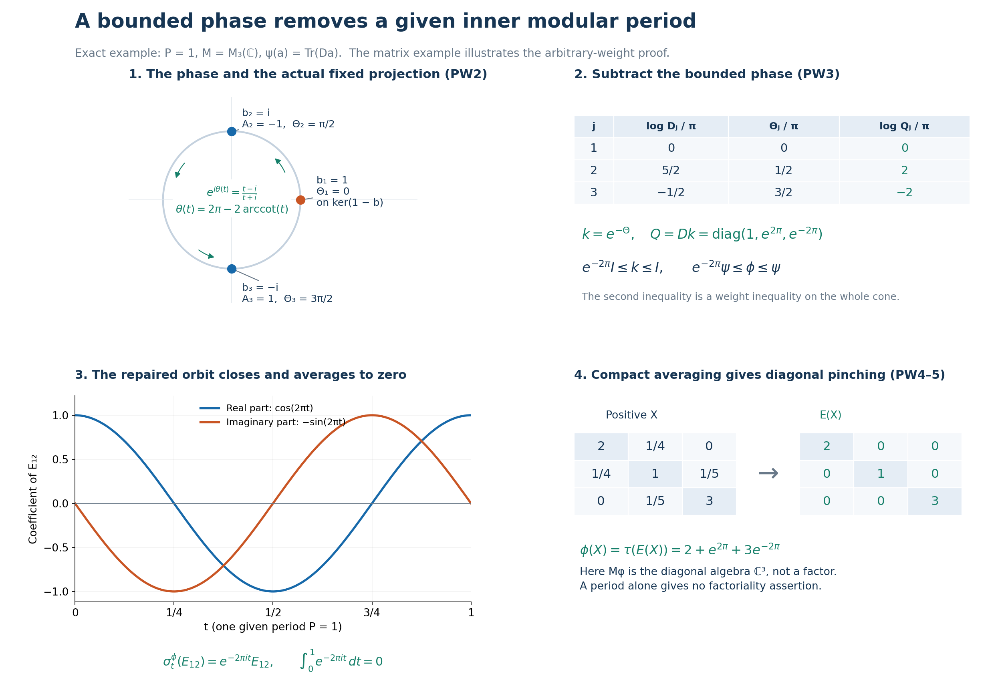

# Converting a given inner modular period into a periodic weight

*Original local reconstruction, GPT-6 Astra (OpenAI), Ultra, 2026-10-04. CC0-1.0 to the extent of rights held.*

Let \(M\subseteq B(K)\) be an arbitrary von Neumann algebra, \(\psi\) a faithful normal semifinite weight, \(P>0\), and \(b\in M\) a specified unitary satisfying

\[
 \sigma_P^\psi(x)=bxb^*\qquad(x\in M).                         \tag{PW1}
\]
Neither \(K\) nor the predual is assumed separable. We construct a bounded invertible centralizer density \(k\), a faithful normal semifinite weight \(\phi=\psi_k\), and a faithful normal conditional expectation \(E:M\to M_\phi\), with

\[
 e^{-2\pi/P}\psi\leq\phi\leq\psi,\qquad
 \sigma_P^\phi=\mathrm{id},\qquad
 \phi\circ E=\phi\text{ on }M_+ .
 \tag{PW2}
\]
The restriction of \(\phi\) to \(M_\phi\) is a faithful normal semifinite trace. The inequalities include infinite values, and all finite domains will be identified. If \(\psi\) is a faithful normal state, a scalar normalization gives a periodic faithful normal state.

The actual earlier proofs are MW4, [CZ0](OA-FLOW-CZ.md#oa-flow.cz.0), [CZ1](OA-FLOW-CZ.md#oa-flow.cz.1), [CZ3](OA-FLOW-CZ.md#oa-flow.cz.3), [CZ4](OA-FLOW-CZ.md#oa-flow.cz.4) and [CZ6](OA-FLOW-CZ.md#oa-flow.cz.6); [SF's full spectral domains](OA-FLOW-SF.md#oa-flow.sf.sb4), [arbitrary-Hilbert scope](OA-FLOW-SF.md#oa-flow.sf.sb5), [Borel and affiliation conventions](OA-FLOW-SF.md#oa-flow.sf.sb6), [bounded strong-to-ultraweak convergence](OA-FLOW-SF.md#oa-flow.sf.sf2) and [vector integration](OA-FLOW-SF.md#oa-flow.sf.sf3); [GW1–4](OA-FLOW-GW.md#oa-flow.gw.1), especially [GW4](OA-FLOW-GW.md#oa-flow.gw.4); [EW3](OA-FLOW-EW.md#oa-flow.ew.3); the complete directed strict-minorant construction [WS3](OA-FLOW-WS.md#oa-flow.weight-sum.ws3); [KT2](OA-FLOW-KT.md#oa-flow.kt.2), [KT5](OA-FLOW-KT.md#oa-flow.kt.5) and [KU1–3](OA-FLOW-KU.md#oa-flow.ku.1); and [CC0's normalized circle measure](OA-FLOW-CC.md#oa-flow.cc.0). The bounded forms and positivity facts use CF6–8; scalar integration and substitution use [SC2](OA-FLOW-SC.md#sc-02), [SC5](OA-FLOW-SC.md#sc-05) and [SC8](OA-FLOW-SC.md#sc-08). These are written local proofs, not external theorem citations.

Normality in the concrete ultraweak topology also uses the complete vector-series and quotient-predual proof [CP6](OA-FLOW-CP.md#oa-flow.cp.6).

The human development source is [Connes, Theorem 1.3.2 and Remark 1.3.3, free original printed pp.152–153](https://numdam.org/article/ASENS_1973_4_6_2_133_0.pdf#page=21). The proof below replaces its centralizer and perturbation imports by CZ and supplies the complete Cayley domains, a chosen bounded phase, and the compact-average argument. The distinct classification steps in [printed pp.218–224](https://numdam.org/article/ASENS_1973_4_6_2_133_0.pdf#page=87) are not premises.

## PW-1. The implementing unitary lies in the center of the old centralizer

Put \(C=M_\psi\). By MW4, \(\psi\circ\sigma_P^\psi=\psi\) on every positive element, including those of infinite weight. Thus ([PW1](OA-FLOW-PW.md#equation-pw1)) gives \(\psi(bab^*)=\psi(a)\) for all \(a\geq0\). [CZ0](OA-FLOW-CZ.md#oa-flow.cz.0)'s converse for a weight-preserving unitary proves \(b\in C\). In detail, that converse proves both right finite-ideal equalities, finite-algebra invariance, and the cyclic finite-extension identity before applying its strip test; no finite-total-mass assumption occurs.

For \(c\in C\), ([PW1](OA-FLOW-PW.md#equation-pw1)) also gives \(bcb^*=\sigma_P^\psi(c)=c\). Consequently

\[
 b\in Z(C).                                                   \tag{PW3}
\]
Here \(C\) is a von Neumann algebra: it is the intersection of the ultraweakly closed fixed spaces of the normal automorphisms, and is closed under multiplication and adjoint. Its center is likewise a von Neumann algebra on \(K\).

## PW-2. A bounded phase from the entire Cayley graph

Write \(N=Z(C)\), and let \(e\) be the projection onto \(\ker(1-b)\). It belongs to \(N\), by the single positive-operator spectral calculus of \((1-b)^*(1-b)\in N\). Since
\(\ker(1-b)=\ker(1-b^*)\), the restriction of \(1-b\) to \(K_0=(1-e)K\) is injective with dense range in \(K_0\). Both \(b\) and \(b^*\) reduce \(K_0\). On this Hilbert space define

\[
 D(A)=\operatorname{Ran}(1-b),\qquad
 A((1-b)\xi)=i(1+b)\xi\quad(\xi\in K_0).                       \tag{PW4}
\]
Injectivity makes the definition unambiguous. The dense domain is the entire stated range, with no closure or bounded-domain convention.

For the first-variable-linear inner product, direct expansion gives

\[
\begin{aligned}
 \langle i(1+b)\xi,(1-b)\eta\rangle
 &=i\big(\langle b\xi,\eta\rangle-\langle\xi,b\eta\rangle\big)\\
 &=\langle(1-b)\xi,i(1+b)\eta\rangle .
\end{aligned}                                                  \tag{PW5}
\]
Thus \(A\) is symmetric. The two shifts act on every vector of the domain as

\[
 (A+i)(1-b)\xi=2i\xi,\qquad
 (A-i)(1-b)\xi=2ib\xi.                                        \tag{PW6}
\]
They are bijections from \(D(A)\) onto \(K_0\), and

\[
 (A+i)^{-1}=\frac{1-b}{2i},\qquad
 (A-i)^{-1}=\frac{(1-b)b^*}{2i}.                              \tag{PW7}
\]
For example, if \(x_n\to x\) and \(Ax_n\to y\), boundedness of the first inverse gives \(x=(A+i)^{-1}(y+ix)\); hence \(x\in D(A)\) and \(Ax=y\). This proves closedness.

For \(v\in D(A^*)\), surjectivity of \(A-i\) supplies \(w\in D(A)\) with \((A-i)w=(A^*-i)v\). Symmetry gives
\[
 v-w\in\ker(A^*-i)=\operatorname{Ran}(A+i)^\perp=\{0\}.
\]
Therefore \(D(A^*)=D(A)\) and \(A^*=A\). The equality of the two domains has been proved, not inferred from formal symmetry. These arguments include the zero Hilbert space \(K_0\).

Let \(\operatorname{arccot}t\in(0,\pi)\), so that \(\cot(\operatorname{arccot}t)=t\), and put

\[
 \theta(t)=2\pi-2\operatorname{arccot}t,\qquad
 \Theta=\theta(A)\text{ on }K_0,\quad \Theta=0\text{ on }eK.
 \tag{PW8}
\]
SF's proved self-adjoint Borel calculus makes this an everywhere defined bounded self-adjoint operator, with \(0\leq\Theta\leq2\pi\). For \(r=\operatorname{arccot}t\),

\[
 e^{i\theta(t)}=e^{-2ir}
   =\frac{\cos r-i\sin r}{\cos r+i\sin r}
   =\frac{t-i}{t+i}.                                         \tag{PW9}
\]
The domain/product rule in SF gives
\[
 e^{i\theta(A)}
 =(A-i)(A+i)^{-1}
 =I-2i(A+i)^{-1}=b|_{K_0}.
\]
Indeed the inverse sends every vector into \(D(A)\), as proved in ([PW7](OA-FLOW-PW.md#equation-pw7)); hence this product has full domain. On \(eK\), both \(e^{i\Theta}\) and \(b\) are the identity. Thus

\[
 e^{i\Theta}=b.                                               \tag{PW10}
\]

We also need \(\Theta\in N\), not merely \(\Theta\in B(K)\). Every unitary in \(N'\) commutes with \(b,e\), preserves \(D(A)\) on \(K_0\), and commutes there with \(A\), directly from ([PW4](OA-FLOW-PW.md#equation-pw4)). SF's spectral covariance therefore makes it commute with every bounded Borel function of \(A\), and thus with \(\Theta\) on all of \(K\). The commutant-unitary argument in SF expresses each commutant element as a linear combination of unitaries. Hence \(\Theta\in(N')'=N\). No normal-operator spectral theorem or unproved joint spectral calculus has been imported.

Every scalar function here is pointwise Borel, with equality of calculi understood modulo spectral-projection-zero sets, as in SF. The separate value \(0\) on the actual projection \(e\) is essential; it is not a choice modulo a Lebesgue-null point.

## PW-3. The corrected weight and all its finite domains

Define

\[
 h=e^{\Theta/P},\qquad k=h^{-1}=e^{-\Theta/P},\qquad
 c_P=e^{-2\pi/P}.
 \tag{PW11}
\]
These bounded positive invertible elements lie in \(Z(C)\), and their single-operator calculus gives

\[
 1\leq h\leq c_P^{-1}1,\quad c_P1\leq k\leq1,\quad
 h^{iP}=b,\quad k^{iP}=b^*.
 \tag{PW12}
\]
The logarithms and all imaginary powers are bounded functions of \(\Theta\); in particular their real-parameter unitary groups are norm continuous.

On the entire positive cone set

\[
 \phi(a)=\psi(k^{1/2}ak^{1/2})\quad(a\in M_+).                 \tag{PW13}
\]
[CZ1](OA-FLOW-CZ.md#oa-flow.cz.1) and [CZ4](OA-FLOW-CZ.md#oa-flow.cz.4) prove that this is faithful normal semifinite and that

\[
 c_P\psi(a)\leq\phi(a)\leq\psi(a)\qquad(a\in M_+).             \tag{PW14}
\]
This uses [CZ1](OA-FLOW-CZ.md#oa-flow.cz.1)'s proved order in the density parameter. It does not assert an operator inequality between \(k^{1/2}ak^{1/2}\) and \(a\), which need not commute. In particular finiteness and infiniteness are preserved in both directions.

For \(\rho=\psi,\phi\), use the standard notation \(F_\rho=\{a\in M_+:\rho(a)<\infty\}\), \(N_\rho=\{x\in M:\rho(x^*x)<\infty\}\), \(A_\rho=N_\rho\cap N_\rho^*\), and \(m_\rho=\operatorname{span}N_\rho^*N_\rho\). Applying ([PW14](OA-FLOW-PW.md#equation-pw14)) to \(x^*x\), and separately to \(xx^*\), proves the exact equalities

\[
 F_\phi=F_\psi,\qquad N_\phi=N_\psi,\qquad
 A_\phi=A_\psi,\qquad m_\phi=m_\psi .                         \tag{PW15}
\]
Let \((H_\psi,\pi,\Lambda_\psi)\) be the old faithful normal GNS representation. [CZ3](OA-FLOW-CZ.md#oa-flow.cz.3) specializes here to the complete new GNS map

\[
 \Lambda_\phi(x)=\Lambda_\psi(xk^{1/2})
  =J_\psi\pi(k^{1/2})J_\psi\Lambda_\psi(x)
       \quad(x\in N_\phi=N_\psi),                            \tag{PW16}
\]
on this same Hilbert space and representation. Right multiplication by \(k^{1/2}\) and \(k^{-1/2}\) preserves \(N_\psi\), by [CZ0](OA-FLOW-CZ.md#oa-flow.cz.0). Their bounded inverse GNS multipliers prove that this map has dense range in all of \(H_\psi\). Thus ([PW16](OA-FLOW-PW.md#equation-pw16)) does not refer to a proper GNS subspace. Its squared norm is \(\phi(x^*x)\), between \(c_P\|\Lambda_\psi(x)\|^2\) and \(\|\Lambda_\psi(x)\|^2\).

For \(z\in m_\psi=m_\phi\), [CZ0](OA-FLOW-CZ.md#oa-flow.cz.0) and [CZ1](OA-FLOW-CZ.md#oa-flow.cz.1) give \(zk,kz\in m_\psi\) and

\[
 \phi_0(z)=\psi_0(zk)=\psi_0(kz).
 \tag{PW17}
\]
This finite linear formula is not used to assign values to products outside \(m_\psi\).

[CZ4](OA-FLOW-CZ.md#oa-flow.cz.4) and the normalization-sensitive balanced-matrix calculation [CZ6](OA-FLOW-CZ.md#oa-flow.cz.6) give respectively

\[
 \sigma_t^\phi(x)=h^{-it}\sigma_t^\psi(x)h^{it},\qquad
 (D\phi:D\psi)_t=h^{-it}.                                    \tag{PW18}
\]
At \(t=P\), ([PW1](OA-FLOW-PW.md#equation-pw1)) and ([PW12](OA-FLOW-PW.md#equation-pw12)) yield \(\sigma_P^\phi(x)=b^*(bxb^*)b=x\). Also

\[
 C\subseteq M_\phi,\qquad h,k\in M_\phi .                     \tag{PW19}
\]
Indeed every \(c\in C\) commutes with \(h\) and is fixed by \(\sigma^\psi\); apply ([PW18](OA-FLOW-PW.md#equation-pw18)). Since \(h^{1/2}k^{1/2}=1\), the reverse perturbation satisfies \(\phi_h(a)=\psi(a)\) on every \(a\geq0\), directly from ([PW13](OA-FLOW-PW.md#equation-pw13)).

If \(M\neq0\) and \(\psi(1)<\infty\), then \(m_0=\phi(1)\) is finite and strictly positive, and

\[
 \widehat\phi=m_0^{-1}\phi,\qquad
 \sigma_t^{\widehat\phi}=\sigma_t^\phi,\qquad
 (D\widehat\phi:D\psi)_t=m_0^{-it}h^{-it}.                     \tag{PW20}
\]
The first modular identity follows from [CZ4](OA-FLOW-CZ.md#oa-flow.cz.4) with a positive scalar density, and the cocycle follows from [CZ6](OA-FLOW-CZ.md#oa-flow.cz.6) with density \(m_0^{-1}k\) relative to \(\psi\). If \(\psi\) is a state, \(c_P\leq m_0\leq1\), so \(\widehat\phi\) is a faithful normal state with the given period. If \(\psi(1)=\infty\), then \(\phi(1)=\infty\); no finite normalization is asserted. On the zero algebra the weight and all assertions except state normalization are interpreted on the zero space.

## PW-4. Compact averages and arbitrary increasing nets

We prove the averaging statement for any faithful normal semifinite \(\rho\) with \(\sigma_P^\rho=\mathrm{id}\). Put \(\alpha_t=\sigma_t^\rho\), \(D=M_\rho\), and use the probability measure \(dt/P\) on \(K_P=\mathbb R/P\mathbb Z\) constructed in [CC0](OA-FLOW-CC.md#oa-flow.cc.0). Work first in the faithful normal GNS representation. MW4 gives \(U_t=\Delta_\rho^{it}\) and \(U_t\Lambda_\rho(x)=\Lambda_\rho(\alpha_t(x))\). Hence \(U_P=I\) on a dense set and on the whole Hilbert space.

For \(x\in M\), define the average by the bounded strong limit of the equal-mesh sums

\[
 E_n(x)=\frac1n\sum_{j=0}^{n-1}\alpha_{jP/n}(x),\qquad
 E(x)\xi=\frac1P\int_0^P\alpha_t(x)\xi\,dt.                   \tag{PW21}
\]
Each vector orbit is continuous by MW4, hence uniformly continuous on this compact interval. Its Riemann sums converge in Hilbert norm to the displayed vector integral (SF3), and \(\|E(x)\|\leq\|x\|\). Consequently \(E(x)\in M\). Applying the same argument to \(x^*\) gives strong-star convergence and \(E(x)^*=E(x^*)\). Transport through the normal GNS isomorphism and its normal inverse gives the same element in the original \(M\). For every normal functional \(f\), bounded strong-to-ultraweak convergence and the scalar Riemann integral give

\[
 f(E(x))=\frac1P\int_0^P f(\alpha_t(x))\,dt.                  \tag{PW22}
\]
The right side also proves representation independence, because the predual separates points.

The map is also ultraweakly continuous in the concrete predual sense. By [CP6](OA-FLOW-CP.md#oa-flow.cp.6), every predual functional in this faithful normal representation is a summable vector series. For one coefficient \(\omega_{\xi,\eta}(x)=\langle x\xi,\eta\rangle\), its pullback by \(\alpha_t\) has vectors \(U_{-t}\xi,U_{-t}\eta\). The norm of the difference at \(t,s\) is at most
\[
 \|(U_{-t}-U_{-s})\xi\|\,\|\eta\|
 +\|\xi\|\,\|(U_{-t}-U_{-s})\eta\|.
\]
Finite sums are norm continuous in \(t\), while the remaining series has uniformly small functional norm by the sum of the products of vector norms. Therefore \(t\mapsto f\circ\alpha_t\) is norm continuous in the Banach predual, for every \(f\in M_*\). Its Riemann sums converge in that space. Equation ([PW22](OA-FLOW-PW.md#equation-pw22)) identifies their limit with \(f\circ E\), so \(f\circ E\in M_*\). This proves ultraweak continuity without appealing to an unstated equivalence between two definitions of normality.

Positivity, unitality and linearity follow from the sums. Complete positivity follows by applying the same sums to each finite matrix over \(M\): each automorphism acts positively on a positive matrix, since it acts on a matrix square root, and bounded strong limits preserve positivity on the finite Hilbert sum. Translation invariance of the scalar circle integral in ([PW22](OA-FLOW-PW.md#equation-pw22)), and normality of \(\alpha_s\), give \(\alpha_s E=E\alpha_s=E\). Thus \(E(M)\subseteq D\), and \(E(d)=d\) for \(d\in D\). In particular \(E^2=E\). For \(d_1,d_2\in D\), multiplication in each sum and bounded strong passage give

\[
 E(d_1xd_2)=d_1E(x)d_2.                                     \tag{PW23}
\]
These establish the conditional-expectation properties.

Here is the compactness argument needed for normality; scalar monotone convergence for arbitrary nets is not being assumed. If a directed increasing family of nonnegative continuous functions \(g_j\) on a compact space has a continuous finite supremum \(g\), then for each \(\varepsilon>0\) the open sets
\(\{t:g_j(t)>g(t)-\varepsilon\}\) cover the space. A finite subcover and a common upper index give \(0\leq g-g_j<\varepsilon\) uniformly for every subsequent index. Thus their integrals increase to \(\int g\).

Apply this to \(g_j(t)=\langle\alpha_t(a_j)\xi,\xi\rangle\), where \(0\leq a_j\uparrow a\) is a bounded increasing net. Normality of each \(\alpha_t\) gives pointwise supremum \(g(t)=\langle\alpha_t(a)\xi,\xi\rangle\), which is continuous. Hence

\[
 \langle E(a_j)\xi,\xi\rangle\uparrow\langle E(a)\xi,\xi\rangle .
 \tag{PW24}
\]
The net \(E(a_j)\) is increasing and bounded. Its supremum has these quadratic coefficients, so it is \(E(a)\). This proves normality for all bounded increasing positive nets.

If \(a\geq0\) and \(E(a)=0\), the continuous nonnegative function \(t\mapsto\langle\alpha_t(a)\xi,\xi\rangle\) has zero integral for every \(\xi\). It is therefore zero everywhere: a positive value would persist on an arc of positive measure. At \(t=0\) this implies \(a=0\). Thus \(E\) is faithful.

## PW-5. Weight preservation including infinity, and the restricted trace

For \(a\geq0\), each positive Riemann average has \(\rho(E_n(a))=\rho(a)\), by whole-cone modular invariance and additivity. If the value is finite, [EW3](OA-FLOW-EW.md#oa-flow.ew.3)'s ultraweak lower semicontinuity gives \(\rho(E(a))\leq\rho(a)\); if it is infinite this inequality is automatic.

For the reverse inequality use precisely [WS3](OA-FLOW-WS.md#oa-flow.weight-sum.ws3), which proves that

\[
 \mathcal D_\rho=\{f\in M_*^+:f\leq r\rho
                    \text{ for some }0<r<1\}
 \text{ is directed},\qquad
 \sup_{f\in\mathcal D_\rho}f(z)=\rho(z)\quad(z\geq0).
 \tag{PW25}
\]
Fix a real number \(L<\rho(a)\). When \(\rho(a)=0\) the desired inequality is already immediate; otherwise take \(0\leq L<\rho(a)\), with \(L\) arbitrarily large when the value is infinite. The continuous functions
\(t\mapsto f(\alpha_t(a))\), \(f\in\mathcal D_\rho\), increase as a directed family and have the constant supremum \(\rho(a)\) at every \(t\). The open sets where they exceed \(L\) cover \(K_P\). A finite subcover and directedness give one \(f\) for which \(f(\alpha_t(a))>L\) everywhere. Since \(f\leq\rho\), ([PW22](OA-FLOW-PW.md#equation-pw22)) implies
\[
 \rho(E(a))\geq f(E(a))
   =\int_{K_P}f(\alpha_t(a))\,dm_{K_P}(t)\geq L .
\]
Letting \(L\uparrow\rho(a)\), or letting \(L\) tend to infinity, proves

\[
 \rho(E(a))=\rho(a)\qquad(a\in M_+).                          \tag{PW26}
\]
This is a full-cone proof. It never interchanges an unbounded weight with an integral, and uses neither a countable decomposition of \(\rho\) nor a countability assumption on \(M\).

Put \(\tau=\rho|_{D_+}\). This restriction is faithful and normal, since increasing suprema in the fixed von Neumann algebra agree with those in \(M\). By [GW4](OA-FLOW-GW.md#oa-flow.gw.4) there are finite positive contractions \(u_i\uparrow1\) in \(M\). Equations ([PW24](OA-FLOW-PW.md#equation-pw24)) and ([PW26](OA-FLOW-PW.md#equation-pw26)) give finite positive contractions \(E(u_i)\uparrow1\) in \(D\). [GW4](OA-FLOW-GW.md#oa-flow.gw.4), now inside \(D\), proves semifiniteness of \(\tau\).

The finite domains have the exact descriptions

\[
 F_\tau=F_\rho\cap D,\quad N_\tau=N_\rho\cap D,\quad
 A_\tau=A_\rho\cap D,\quad m_\tau=m_\rho\cap D.                \tag{PW27}
\]
The first three follow from restriction. To prove the last, \(m_\tau\subseteq m_\rho\cap D\) is immediate. Conversely [GW1](OA-FLOW-GW.md#oa-flow.gw.1) expresses any \(z\in m_\rho\) as a finite complex linear combination of positive finite-weight elements. If \(z\in D\), applying \(E\) leaves \(z\) fixed and, by ([PW26](OA-FLOW-PW.md#equation-pw26)), expresses it as a linear combination of elements of \(F_\tau\). Hence \(z\in m_\tau\).

For completeness, positivity of the integral of
\((\alpha_t(x)-E(x))^*(\alpha_t(x)-E(x))\) gives

\[
 E(x)^*E(x)\leq E(x^*x).                                    \tag{PW28}
\]
To verify the expansion, ([PW21](OA-FLOW-PW.md#equation-pw21)) averages \(\alpha_t(x)\) and its adjoint to \(E(x)\) and \(E(x)^*\); the remaining constant product is unchanged. All integrands are bounded operators. Equations ([PW26](OA-FLOW-PW.md#equation-pw26))–([PW28](OA-FLOW-PW.md#equation-pw28)) imply \(E(N_\rho)=N_\tau\); applying them to \(x^*\) gives \(E(A_\rho)=A_\tau\). The finite positive argument above gives \(E(m_\rho)=m_\tau\), and linearity of the finite extensions gives

\[
 \tau_0(E(z))=\rho_0(z)\qquad(z\in m_\rho).                   \tag{PW29}
\]

The identity automorphism group of \(D\) preserves \(\tau\). If \(a,b\in A_\tau\), they lie in the full \(A_\rho\), and are fixed by \(\alpha_t\). The bounded closed-strip function supplied by [KT2](OA-FLOW-KT.md#oa-flow.kt.2) for \(\rho\) therefore has boundaries \(\tau_0(ab)\) and \(\tau_0(ba)\). Products lie in \(m_\tau\), by ([PW27](OA-FLOW-PW.md#equation-pw27)). This is exactly the full finite-star KMS hypothesis of [KU1](OA-FLOW-KU.md#oa-flow.ku.1)–3 for the identity group on \(D\). Its weight is now proved faithful normal semifinite, so uniqueness gives \(\sigma_t^\tau=\mathrm{id}\). [KT5](OA-FLOW-KT.md#oa-flow.kt.5) then proves

\[
 \tau(x^*x)=\tau(xx^*)\quad(x\in D),                          \tag{PW30}
\]
including every infinite value. Thus \(\tau\) is a faithful normal semifinite trace. Apply this entire construction to \(\rho=\phi\) from [PW3](OA-FLOW-PW.md#oa-flow.pw.3) to obtain ([PW2](OA-FLOW-PW.md#equation-pw2)).

## PW-6. The precise period conclusion and its boundary

For any periodic weight \(\rho\) above, \(U_P=I\) as proved in [PW4](OA-FLOW-PW.md#oa-flow.pw.4). SF's spectral-domain formula, and the absence of a kernel for the modular operator, imply for each vector \(\xi\)

\[
 0=\|(U_P-I)\xi\|^2
  =\int_{(0,\infty)}|\lambda^{iP}-1|^2\,d\mu_\xi^{\Delta_\rho}(\lambda).
 \tag{PW31}
\]
Therefore the spectral projection of \(\Delta_\rho\) off
\(\{e^{2\pi n/P}:n\in\mathbb Z\}\) is zero. To see the last assertion directly, take the union of the sets where \(|\lambda^{iP}-1|\geq1/m\), \(m\geq1\); each has zero vector measure for every \(\xi\), hence zero projection. No assertion that every lattice point occurs is made. Zero may still belong to the operator spectrum as a limit of positive spectral values.

The theorem starts with the actual unitary \(b\) in ([PW1](OA-FLOW-PW.md#equation-pw1)). It supplies a period, not its least positive value, and does not prove that a type assumption produces an inner period. It does not prove that the centralizer is a factor, that its trace is infinite, that all spectral lattice points occur, or that a spectral-generating unitary exists. General \(S/\Gamma\) identities, classification and discrete-decomposition existence require their own complete proofs. These limits persist even though the local construction and the compact expectation hold without separability or factoriality.

### Exact phase cancellation and the compact average

The figure illustrates [PW2](OA-FLOW-PW.md#pw-2)–[PW5](OA-FLOW-PW.md#pw-5). The construction's human source is [Connes, free original Theorem 1.3.2 and Remark 1.3.3, printed pp.152–153](https://numdam.org/article/ASENS_1973_4_6_2_133_0.pdf#page=21). The example and rendering are original expressions of the complete local proof.

Take \(P=1\), \(M=M_3(\mathbb C)\), and
\[
 D=\operatorname{diag}(1,e^{5\pi/2},e^{-\pi/2}),\qquad
 \psi(a)=\operatorname{Tr}(Da).
\]
The Hilbert–Schmidt realization is \(\Lambda_\psi(x)=xD^{1/2}\), with left multiplication as representation. On this entire finite-dimensional Hilbert space, \(Jz=z^*\), \(\Delta z=DzD^{-1}\), and
\[
 S z=D^{-1/2}z^*D^{1/2}=J\Delta^{1/2}z .
\]
Indeed \(S\Lambda_\psi(x)=\Lambda_\psi(x^*)\), and \(\Delta\) is positive on the orthogonal basis of matrix units, with eigenvalues \(D_{ii}/D_{jj}\). These identities give the actual polar decomposition and therefore \(\sigma_t^\psi(a)=D^{it}aD^{-it}\). In particular \(\sigma_1^\psi=\operatorname{Ad}b\), with \(b=\operatorname{diag}(1,i,-i)\). Since the three entries of \(D\) are distinct, a matrix fixed for all real \(t\) has zero off-diagonal entries. Thus \(M_\psi\) is diagonal, and \(b\in Z(M_\psi)\).

The first panel marks the three eigenvalues of \(b\) at their exact circle coordinates. The arrows indicate the positive direction of the selected phase, not a real-time modular orbit. The fixed projection is \(e=E_{11}\). On \((1-e)\mathbb C^3\), the full Cayley operator of [PW2](OA-FLOW-PW.md#oa-flow.pw.2) is the matrix \(\operatorname{diag}(-1,1)\); its phase \(2\pi-2\operatorname{arccot}t\) gives \(\pi/2,3\pi/2\). The separately assigned phase on \(e\mathbb C^3\) is zero. Hence
\[
 \Theta=\operatorname{diag}(0,\pi/2,3\pi/2),\quad
 k=e^{-\Theta}=\operatorname{diag}(1,e^{-\pi/2},e^{-3\pi/2}),\quad
 Q=Dk=\operatorname{diag}(1,e^{2\pi},e^{-2\pi}).
\]
The second panel is an exact table in units of \(\pi\). Its subtraction is legitimate because these matrices are diagonal. The general theorem does not depend on simultaneous diagonalization of unrelated operators. By multiplying the diagonal entries in the definition of the finite matrix trace,
\[
 \phi(a)=\psi(k^{1/2}ak^{1/2})=\operatorname{Tr}(Qa).
\]
In particular \(e^{-2\pi}I\leq k\leq I\) and \(e^{-2\pi}\psi\leq\phi\leq\psi\). The latter is the weight comparison, not a claim that \(k^{1/2}ak^{1/2}\leq a\) for every positive matrix.

The same Hilbert–Schmidt calculation with \(Q\) gives
\[
 \sigma_t^\phi(E_{ij})=e^{2\pi i(n_i-n_j)t}E_{ij},
 \qquad(n_1,n_2,n_3)=(0,1,-1).
\]
Thus \(1\) is a period. In this particular example it is the least positive period, because the \(12\) coefficient requires \(e^{-2\pi it}=1\). This example-specific fact does not strengthen PW's general period conclusion. The third panel plots the real and imaginary parts of precisely this \(12\) coefficient on \(0\leq t\leq1\); its complex trajectory is clockwise. The drawn curves are samples of the displayed exact functions.

Direct scalar integration gives \(\int_0^1e^{2\pi i mt}\,dt=0\) for each nonzero integer \(m\), and value \(1\) for \(m=0\). Since the \(n_i\) are distinct, the compact expectation is \(E(a)=\operatorname{diag}(a_{11},a_{22},a_{33})\). Its fixed algebra is \(\mathbb C^3\), so the ambient matrix algebra is a factor while the centralizer is not. The fourth panel uses
\[
 X=\begin{pmatrix}2&1/4&0\\1/4&1&1/5\\0&1/5&3\end{pmatrix}>0.
\]
For \(z\in\mathbb C^3\), the inequality \(2|z_i||z_j|\leq|z_i|^2+|z_j|^2\) gives
\(\langle Xz,z\rangle\geq(7/4)|z_1|^2+(11/20)|z_2|^2+(14/5)|z_3|^2\). This proves strict positivity without reliance on numerical eigenvalues. With \(\tau=\phi|_{M_\phi}\),
\[
 \phi(X)=\tau(E(X))=2+e^{2\pi}+3e^{-2\pi}.
\]

There is also an exact infinite-weight version, without changing the drawn three-dimensional block. For any set \(I\), use \(M=\ell^\infty(I,M_3(\mathbb C))\) and \(\psi((a_i))=\sum_{i\in I}\operatorname{Tr}(Da_i)\) on positive elements; the sum means the supremum over finite subsets. Additivity follows by taking unions of finite subsets, and normality by commuting the two positive suprema for a bounded increasing net. Faithfulness is coordinatewise; the finite-support identity projections increase to \(1\), so [GW4](OA-FLOW-GW.md#oa-flow.gw.4) proves semifiniteness.

The GNS Hilbert space is the arbitrary sum \(\bigoplus_{i\in I}\mathrm{HS}_3\), with \(\Lambda_\psi(x)_i=x_iD^{1/2}\); the sum and its completeness are those of [GNS Lemma 7.1](OA-FLOW-GNS.md#gns-lemma-7-1). This map is onto: for a square-summable family \((\eta_i)\), put \(x_i=\eta_iD^{-1/2}\). Then \(\sup_i\|x_i\|\leq\|D^{-1/2}\|(\sum_i\|\eta_i\|_{\mathrm{HS}}^2)^{1/2}\), so \(x\in M\), and its finite GNS norm is that sum. Also
\(\|x_i^*D^{1/2}\|_{\mathrm{HS}}\leq\|D^{1/2}\|\|D^{-1/2}\|\|x_iD^{1/2}\|_{\mathrm{HS}}\), by the Hilbert–Schmidt norm inequality for left and right bounded multiplication. Thus \(N_\psi=N_\psi^*=A_\psi\). The finite-star involution is already bounded and everywhere defined on this GNS Hilbert space, by the identical uniform bound in every block. Its formula is the direct sum of \(S\eta=D^{-1/2}\eta^*D^{1/2}\). The bounded positive operator \(\Delta\eta=D\eta D^{-1}\) and \(J\eta=\eta^*\), applied blockwise, give its full polar decomposition exactly as above. The modular group is therefore the blockwise \(D^{it}\) action by MW4. In this particular example every modular-operator domain is the whole direct-sum Hilbert space, even though the weight of the identity can be infinite.

Applying the proved construction gives \(\phi((a_i))=\sum_i\operatorname{Tr}(Qa_i)\) and blockwise diagonal \(E\). On bounded matrix families its finite left ideals are exactly
\[
 N_\psi=\left\{(x_i):\sum_i\|x_iD^{1/2}\|_{\mathrm{HS}}^2<\infty\right\}
 =\left\{(x_i):\sum_i\|x_iQ^{1/2}\|_{\mathrm{HS}}^2<\infty\right\}=N_\phi .
\]
The equality follows termwise from the fixed constants in the proved weight bound. If \(I\) is infinite, both weights of \(1\) are infinite, while ([PW26](OA-FLOW-PW.md#equation-pw26)) still holds on every positive family. This explains the full-cone and non-countability scope; the finite plotted block is not presented as a proof of that scope.

[Editable SVG](../assets/periodic-weight/assets/periodic-phase-and-average.svg), [exact data and separate numerical checks](../assets/periodic-weight/FIGURE_DATA.json), and [reproduction source](../assets/periodic-weight/render_periodic_weight.py). The original example, caption, data and figure are CC0-1.0 to the extent of rights held.
