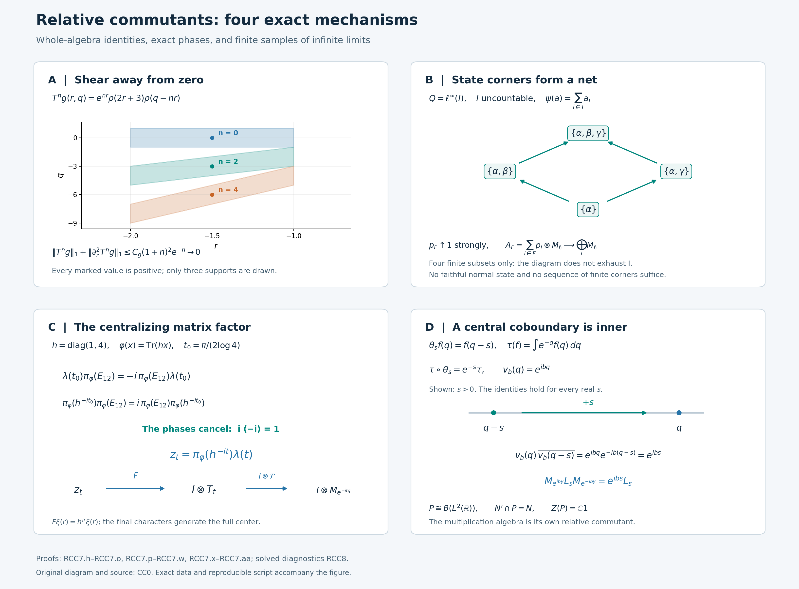

# Relative commutants and central cocycles

A crossed product has two distinguished algebras: its coefficients and the algebra generated after adjoining translations. Their relative commutants need not be the center of the same algebra. We prove the precise identities for modular cores and trace-scaling systems, then recover every automorphism that fixes the coefficients from a cocycle in their center.

The analytic argument begins with a Fourier shear. Exponential decay away from zero forces a scalar function to be constant in one variable. A KMS identity and smoothing then turn that fact into an operator-algebra statement. State corners assemble the result over an arbitrary index set.

## Two relative commutants

Let \(Q\ne0\) be a von Neumann algebra, and let \(\varphi\) be a faithful normal semifinite weight. In a faithful normal representation on \(H\), write
\[
 \begin{gathered}
 C_\varphi(Q)=Q\rtimes_{\sigma^\varphi}\mathbb R
       \subset B(L^2(\mathbb R,H)),\\
 \bigl[\pi_\varphi(x)\xi\bigr](r)
       =\sigma_{-r}^\varphi(x)\xi(r),\qquad
 [\lambda_\varphi(t)\xi](r)=\xi(r-t).
 \end{gathered}
 \tag{RCC0.a}
\]
The [normal regular construction](OA-FLOW-NR.md#oa-flow.nr.4) identifies different faithful normal representations by a normal isomorphism with these generator values. There is no restriction on the dimension of \(H\), the predual, or the center.

The first theorem concerns the coefficient algebra *inside its core*:
\[
 \boxed{\ \pi_\varphi(Q)'\cap C_\varphi(Q)=Z(C_\varphi(Q)).\ }
 \tag{RCC0.b}
\]
The second starts with a specified faithful normal semifinite trace \(\tau\) on \(N\ne0\) and a pointwise strongly continuous normal action \(\theta\) such that
\[
 \tau\circ\theta_s=e^{-s}\tau\quad(s\in\mathbb R).
 \tag{RCC0.c}
\]
Put \(P=N\rtimes_\theta\mathbb R\), with normal coefficient embedding \(i:N\to P\) and translations \(u_s\). We prove
\[
 \boxed{\ i(N)'\cap P=i(Z(N)).\ }
 \tag{RCC0.d}
\]
In this formula the center belongs to \(N\), not necessarily to \(P\). We often identify \(N\) with its image under \(i\). Neither theorem assumes that a coefficient algebra or crossed product is a factor or of type III.

Our scalar Fourier convention is
\[
 (\mathcal Ff)(q)=(2\pi)^{-1/2}
               \int_{\mathbb R}e^{-irq}f(r)\,dr.
 \tag{RCC0.e}
\]
The modular dual action has the negative character
\(\widehat{\sigma^\varphi}_s(\lambda_\varphi(t))=e^{-ist}\lambda_\varphi(t)\).
For double crossing we use the paired Haar measures \(dt\) and \(ds/(2\pi)\), as in [normal double duality](OA-FLOW-ND.md#nd-statement). The zero algebra has the corresponding trivial equalities and unique maps.

## 1. A scalar Fourier identity forces constancy

We begin with a scalar statement. Let \(H:\mathbb R^2\to\mathbb C\) be bounded and continuous. Suppose that for all \(f,g\in C_c^\infty(\mathbb R)\),
\[
 \begin{aligned}
 &\int_{\mathbb R^2}H(q,s)\overline{g(q)}
       \left(\int_{\mathbb R}e^{is(p-q)}f(p)\,dp\right)dq\,ds\\
 &\quad=
 \int_{\mathbb R^2}H(p,s)f(p)
       \left(\int_{\mathbb R}
          e^{i(s-i)(p-q)}\overline{g(q)}\,dq\right)dp\,ds.
 \end{aligned}
 \tag{RCC1.a}
\]
Then
\[
 H(q,s)=H(q,0)\qquad(q,s\in\mathbb R).
 \tag{RCC1.b}
\]
The orders in (RCC1.a) are part of the hypothesis. On the left integrate \(p\) first, and on the right integrate \(q\) first. The [integration-by-parts Fourier bounds](OA-FLOW-RF.md#oa-flow.rf.1) make the remaining two-variable integrals absolutely convergent. No absolute convergence of the unintegrated three-variable products is assumed.

For a test \(\Phi\in C_c^\infty(\mathbb R^2)\), define
\[
 \begin{aligned}
 L_H(\Phi)
   &=\int_{\mathbb R^2}H(q,s)
      \left(\int_{\mathbb R}e^{is(p-q)}\Phi(p,q)\,dp\right)dq\,ds,\\
 R_H(\Phi)
   &=\int_{\mathbb R^2}H(p,s)
      \left(\int_{\mathbb R}e^{i(s-i)(p-q)}
                                      \Phi(p,q)\,dq\right)dp\,ds.
 \end{aligned}
 \tag{RCC1.c}
\]
These functionals are continuous under uniform convergence of derivatives through order two on a fixed compact support. More explicitly, if \(\operatorname{supp}\Phi\subset[-R,R]^2\), splitting \(|s|\le1\) from \(|s|>1\) and integrating twice by parts in the inner variable gives
\[
 |L_H(\Phi)|+|R_H(\Phi)|
 \le C_R\|H\|_\infty
       \max_{|\gamma|\le2}\|\partial^\gamma\Phi\|_\infty.
 \tag{RCC1.d}
\]
On the right the differentiated compact amplitude is \(e^{p-q}\Phi(p,q)\); its derivatives have the stated bound because \(p,q\) remain in the fixed rectangle. The outer \(s\)-bounds are a constant on \([-1,1]\) and a constant times \(s^{-2}\) outside it.

We need the equality \(L_H=R_H\) for every \(\Phi\), not only product tests. Choose a nonnegative smooth compact bump \(\rho\) of integral one, and set \(\rho_\varepsilon(t)=\varepsilon^{-1}\rho(t/\varepsilon)\), using the [explicit smooth cutoffs](OA-FLOW-RF.md#oa-flow.rf.1). The functions
\[
 \Phi_\varepsilon(p,q)
   =\int_{\mathbb R^2}\Phi(u,v)
         \rho_\varepsilon(p-u)\rho_\varepsilon(q-v)\,du\,dv
 \tag{RCC1.e}
\]
converge with all derivatives of order at most two uniformly to \(\Phi\), with supports in one larger rectangle for \(0<\varepsilon\le1\). This follows by putting the derivatives on \(\Phi\) and using their uniform continuity.

For each fixed \(\varepsilon\), the compact integral in (RCC1.e) is approximated by Riemann sums uniformly in \(p,q\), together with those finitely many derivatives. Uniform continuity on the compact set of the integration variables and the output variables gives this assertion for one common mesh. Each Riemann sum is a finite sum of products of one smooth compact function of \(p\) and one of \(q\), and hence is covered by (RCC1.a). First pass to its integral using (RCC1.d), and then let \(\varepsilon\downarrow0\). Thus \(L_H(\Phi)=R_H(\Phi)\) for all two-variable tests.

Introduce a different functional:
\[
 \mathscr K(h)=
   \int_{\mathbb R^2}H(q,s)
       \left(\int_{\mathbb R}e^{isr}h(r,q)\,dr\right)dq\,ds,
 \qquad h\in C_c^\infty(\mathbb R^2).
 \tag{RCC1.f}
\]
For \(|s|\le1\) use the \(L^1\) norm of \(h\); for \(|s|>1\) integrate twice by parts in \(r\). Since each of these two scalar \(s\)-integrals contributes a factor 2,
\[
 |\mathscr K(h)|
 \le 2\|H\|_\infty
       \bigl(\|h\|_{L^1(\mathbb R^2)}
              +\|\partial_r^2h\|_{L^1(\mathbb R^2)}\bigr).
 \tag{RCC1.g}
\]
This explicit bound is all that will be needed about the functional; no distribution structure theorem is invoked.

Apply \(L_H=R_H\) to \(\Phi(p,q)=h(p-q,q)\). On the left substitute \(r=p-q\) in the inner integral. On the right substitute \(r=p-q\) in its inner \(q\)-integral, and then rename the outer \(p\)-variable \(q\). These are changes of variables inside the prescribed inner integrals. They give
\[
 \begin{gathered}
 \mathscr K(h)=\mathscr K(Th),\\
 (Th)(r,q)=e^r h(r,q-r),\qquad
 (T^{-1}h)(r,q)=e^{-r}h(r,q+r).
 \end{gathered}
 \tag{RCC1.h}
\]
Both maps preserve smooth compact tests. In particular the equality can be iterated in either direction.

For every integer \(m\),
\[
 \begin{aligned}
 T^m h(r,q)&=e^{mr}h(r,q-mr),\\
 \partial_r^2T^m h(r,q)
  &=e^{mr}\bigl(
       m^2h+2mh_r-2m^2h_q+h_{rr}\\
  &\hspace{6em}{}-2mh_{rq}+m^2h_{qq}
       \bigr)(r,q-mr).
 \end{aligned}
 \tag{RCC1.i}
\]
Suppose first that \(h\) is supported where \(r\le-\varepsilon\), with \(\varepsilon>0\). The substitution \(q'=q-nr\) has Jacobian one. The integrable compact derivatives in (RCC1.i) therefore give a constant \(C_h\), independent of \(n\), such that
\[
 \|T^nh\|_1+\|\partial_r^2T^nh\|_1
      \le C_h(1+n)^2e^{-n\varepsilon}\longrightarrow0.
 \tag{RCC1.j}
\]
Equations (RCC1.g)–(RCC1.h) imply \(\mathscr K(h)=0\). If \(h\) is supported where \(r\ge\varepsilon\), use \(m=-n\) instead, obtaining the same estimate for \(T^{-n}h\). A smooth partition into the two half-planes now shows
\[
 \mathscr K(h)=0
 \quad\text{if }\operatorname{supp}h\cap(\{0\}\times\mathbb R)
          =\varnothing.
 \tag{RCC1.k}
\]
The decay is a limiting argument. No finite iterate has been claimed to vanish.

Fix \(\eta\in C_c^\infty(\mathbb R)\), and define the bounded continuous function
\[
 h_\eta(s)=\int_{\mathbb R}\eta(q)H(q,s)\,dq.
\]
For \(\chi\in C_c^\infty(\mathbb R\setminus\{0\})\) and \(b\in\mathbb R\), put \(h(r,q)=e^{-ibr}\chi(r)\eta(q)\) in (RCC1.k). With the exact inverse kernel
\(k_\chi(t)=(2\pi)^{-1}\int e^{-itr}\chi(r)\,dr\), we obtain
\[
 0=2\pi\int_{\mathbb R}k_\chi(b-s)h_\eta(s)\,ds
       =2\pi(k_\chi*h_\eta)(b).
 \tag{RCC1.l}
\]
All integrals here are absolutely convergent after the inner Fourier integral, by the rapid decay of \(k_\chi\).

Regard \(h_\eta\) as an element of \(L^\infty(\mathbb R)\), with translation action
\(\alpha_t h(b)=h(b-t)\). Its predual action is translation on \(L^1\), which is norm continuous; this follows first for continuous compact functions and then by \(L^1\) density and translation isometry. Thus the [normal smooth-filter theorem AL7](OA-FLOW-AL.md#equation-al7) applies. Equation (RCC1.l) puts the spectrum of \(h_\eta\) inside \(\{0\}\), and the [proved singleton conclusion](OA-FLOW-SS.md#ss-3) makes it fixed under every translation. AL uses the positive Fourier convention and SS the negative one; the spectral singleton \(\{0\}\) is unchanged by this reflection.

For each fixed translation parameter, the two continuous functions representing the resulting \(L^\infty\) equality agree everywhere: a nonzero continuous difference would be nonzero on an interval of positive measure. It follows that \(h_\eta\) is constant. No intersection of uncountably many full-measure sets is taken.

Hence, for each fixed \(s\),
\[
 \int_{\mathbb R}\eta(q)\bigl(H(q,s)-H(q,0)\bigr)\,dq=0
       \qquad(\eta\in C_c^\infty(\mathbb R)).
 \tag{RCC1.m}
\]
If the continuous difference were nonzero somewhere, one complex rotation would have positive real part on a smaller interval. A nonnegative smooth bump in that interval would contradict (RCC1.m). This proves (RCC1.b).

## 2. A KMS test for a continuous multiplier

For this section, let \(Q\) have a faithful normal state \(\omega\), and use its standard GNS representation on \(H_\omega\), with cyclic vector \(\xi_\omega\). No separability of \(H_\omega\) is assumed. Write \(\sigma=\sigma^\omega\), and let
\[
 C=Q\rtimes_\sigma\mathbb R
\]
act on \(L^2(\mathbb R,H_\omega)\) in the regular convention. Let \(\mathcal F\) be the scalar unitary transform
\[
 (\mathcal Ff)(q)=(2\pi)^{-1/2}\int_{\mathbb R}e^{-irq}f(r)\,dr.
 \tag{RCC2.a}
\]
The [full scalar Fourier theorem](OA-FLOW-FF.md#oa-flow.ff.3) proves its normalization and inverse. Its tensor amplification \(\mathscr F=1_{H_\omega}\otimes\mathcal F\) is unitary on the entire Hilbert tensor product: the isometry and the dense onto range are first checked on finite tensors. The [full \(L^2\) tensor identification](OA-FLOW-L24.md#oa-flow.grp.vectorintegration) realizes this as the whole Hilbert-valued function space. Put
\[
 \Pi(x)=\mathscr F\pi_\omega(x)\mathscr F^*.
\]

**Multiplier lemma.** Suppose \(a:\mathbb R\to Q\) is bounded and norm continuous, and multiplication by \(a(q)\) commutes with \(\Pi(Q)\). Then
\[
 a(q)\in Q_\omega\qquad(q\in\mathbb R).
 \tag{RCC2.b}
\]
The multiplication operator \(M_a\) is defined on all of \(L^2(\mathbb R,H_\omega)\). For each fixed vector its field is continuous with separable image on a countable compact exhaustion. Finite-valued approximation of an arbitrary strongly measurable vector field, and the common bound \(\sup_q\|a(q)\|\), therefore prove strong measurability of its product with \(a\). The same reasoning gives \(M_a^*=M_{a^*}\).

Fix \(x\in Q\) and \(f,g\in C_c^\infty(\mathbb R)\). Throughout, Hilbert inner products are linear in the first variable. Pair \(M_a\Pi(x)=\Pi(x)M_a\) against \(\xi_\omega f,\xi_\omega g\). Fourier inversion gives
\[
 \begin{aligned}
 &\langle\Pi(x)(\xi_\omega f),M_{a^*}(\xi_\omega g)\rangle\\
 &\quad=\frac1{2\pi}\int_{\mathbb R^2}
       \overline{g(q)}\,\omega(a(q)\sigma_{-s}(x))
       \left(\int_{\mathbb R}e^{is(p-q)}f(p)\,dp\right)dq\,ds,\\[2mm]
 &\langle\Pi(x)M_a(\xi_\omega f),\xi_\omega g\rangle\\
 &\quad=\frac1{2\pi}\int_{\mathbb R^2}
       f(p)\,\omega(\sigma_{-s}(x)a(p))
       \left(\int_{\mathbb R}e^{is(p-q)}
                            \overline{g(q)}\,dq\right)dp\,ds .
 \end{aligned}
 \tag{RCC2.c}
\]
For completeness, the integral inverse-Fourier formula for the vector functions used here agrees with the tensor transform. Approximate a strongly measurable \(L^1\cap L^2\) vector function by finite-vector simple functions in both norms. The \(L^1\) error bounds the integral-transform error uniformly, while the tensor transform is an \(L^2\) isometry. An almost-everywhere convergent subsequence of the \(L^2\) approximants identifies the two limits. This applies to the compact continuous fields \(a^*\xi_\omega g\) and \(a\xi_\omega f\).

In the first line of (RCC2.c), the inner \(p\)-transform of \(f\) decays faster than any power of \(s\); the remaining \(q\)-variable has compact support and the coefficient is bounded by \(\|a\|_\infty\|x\|\). In the second line use the inner \(q\)-transform of \(\overline g\). These bounds justify scalar interchange after those inner integrals. They require no derivative of \(a\). The factor \(1/(2\pi)\) is the product of the two inverse-transform factors.

Apply [the state KMS strip and its norm bound](OA-FLOW-KT.md#oa-flow.kt.2) to \(x,a(p)\), with the time variable reversed. It supplies a bounded continuous function on \(-1\le\operatorname{Im}z\le0\), holomorphic in the open strip, such that
\[
 \begin{gathered}
 G(s,p)=\omega(\sigma_{-s}(x)a(p)),\\
 G(s-i,p)=\omega(a(p)\sigma_{-s}(x)),\\
 |G(z,p)|\le\|x\|\,\|a(p)\|.
 \end{gathered}
 \tag{RCC2.d}
\]
Explicitly, if \(G_{x,a(p)}\) is KT's upper-strip function, use \(G(z,p)=G_{x,a(p)}(-z)\). Uniqueness of the strip and its bound applied to differences give
\[
 \sup_{-1\le\operatorname{Im}z\le0}
     |G(z,p)-G(z,p')|
       \le\|x\|\,\|a(p)-a(p')\|.
 \tag{RCC2.e}
\]
In particular its dependence on \(p\) is uniformly continuous on each compact set, throughout the strip.

Put
\[
 b(z)=\int_{\mathbb R}e^{-izq}\overline{g(q)}\,dq.
\]
This is entire. If \(z=s+iy\), \(-1\le y\le0\), integrate by parts against the compact amplitude \(e^{yq}\overline{g(q)}\). For every integer \(m\ge0\), a constant \(B_{g,m}\) gives
\[
 |b(s+iy)|\le B_{g,m}(1+|s|)^{-m}
       \qquad(-1\le y\le0).
 \tag{RCC2.f}
\]
For \(p\) in the compact support of \(f\), the factor \(|e^{i(s+iy)p}|=e^{-yp}\) is uniformly bounded. Thus
\(e^{izp}b(z)G(z,p)\) is bounded by a constant times \((1+|\operatorname{Re}z|)^{-2}\), uniformly in that \(p\)-set and on the closed strip.

Use the [rectangle Cauchy theorem](OA-FLOW-SF.md#oa-flow.sf4.rectangle-cauchy) first between horizontal lines of heights \(-1+\delta\) and \(-\delta\), where \(0<\delta<1/2\), and vertical sides at \(\pm R\). The vertical integrals tend to zero as \(R\to\infty\), by (RCC2.f). The two horizontal integrals therefore agree. Continuity at the strip edges and the same integrable bound permit \(\delta\downarrow0\), giving
\[
 \int_{\mathbb R}e^{isp}b(s)G(s,p)\,ds
  =\int_{\mathbb R}e^{i(s-i)p}b(s-i)G(s-i,p)\,ds.
 \tag{RCC2.g}
\]
The bound is uniform for \(p\in\operatorname{supp}f\), so multiplication by \(f(p)\), integration in \(p\), and the boundary limits are legitimate by scalar dominated convergence.

The two pairings in (RCC2.c) are equal. Replacing their second member by (RCC2.g) gives exactly (RCC1.a), after canceling \(1/(2\pi)\), for
\[
 H(q,s)=\omega(a(q)\sigma_{-s}(x)).
\]
This function is bounded and jointly continuous. For example
\(H(q,s)=\langle\sigma_{-s}(x)\xi_\omega,a(q)^*\xi_\omega\rangle\);
modular strong continuity and norm continuity of \(a\) give joint continuity. Section 1 therefore makes it independent of \(s\).

By [whole-positive modular invariance and GNS covariance](OA-FLOW-MW.md#oa-flow.mw.4), the state is invariant under \(\sigma\). Hence
\[
 \omega\bigl((\sigma_s(a(q))-a(q))x\bigr)=0
       \qquad(x\in Q,\ s,q\in\mathbb R).
 \tag{RCC2.h}
\]
The preceding argument applied to every \(x\in Q\). For fixed \(s,q\), take
\(x=(\sigma_s(a(q))-a(q))^*\). Faithfulness gives \(\sigma_s(a(q))=a(q)\), proving (RCC2.b). Both the range of test elements \(x\) and faithfulness are used in this last step.

## 3. Recovering an ambient relative commutant by smoothing

Retain the faithful-state setting of Section 2, and write \(H=H_\omega\), \(C=C_\omega\). We will prove
\[
 C'\cap\bigl(Q\overline\otimes B(L^2(\mathbb R))\bigr)=Z(C)
       \quad\text{on }H\otimes L^2(\mathbb R).
 \tag{RCC3.a}
\]
Here \(C'\) is the commutant in the full bounded-operator algebra. The ambient tensor algebra in (RCC3.a) is essential.

Let \(X\) belong to the left side, and put \(S=\mathscr F X\mathscr F^*\). Since \(X\) commutes with every translation \(\lambda(t)\), \(S\) commutes with every scalar multiplier \(e^{-itq}\). The [scalar character-generation theorem](OA-FLOW-ND.md#nd-weyl-proof) says that these multipliers generate \(L^\infty(\mathbb R)\), whose multiplication algebra is [maximal abelian](OA-FLOW-ND.md#nd-multiplication). Thus
\[
 [S,1\otimes M_h]=0\quad(h\in L^\infty(\mathbb R)).
 \tag{RCC3.b}
\]
Moreover \(S\) commutes with \(Q'\otimes1\), by the assumed ambient tensor membership and the scalar Fourier conjugation, and with \(\Pi(Q)\), because \(X\in C'\).

For \(\xi,\eta\in H\), define a scalar operator \(S_{\xi,\eta}\) by
\[
 \langle S_{\xi,\eta}f,g\rangle
       =\langle S(\xi\otimes f),\eta\otimes g\rangle
       \qquad(f,g\in L^2(\mathbb R)).
 \tag{RCC3.c}
\]
The [Hilbert representation argument](OA-FLOW-SF.md#oa-flow.shared-foundations.sf-0), applied to the bounded sesquilinear form, gives this operator and
\(\|S_{\xi,\eta}\|\le\|S\|\|\xi\|\|\eta\|\). Equation (RCC3.b) makes it commute with the scalar multiplication algebra. Its maximal abelianness gives a unique class
\[
 S_{\xi,\eta}=M_{b_{\xi,\eta}},\qquad
 b_{\xi,\eta}\in L^\infty(\mathbb R),\qquad
 \|b_{\xi,\eta}\|_\infty\le\|S\|\|\xi\|\|\eta\|.
 \tag{RCC3.d}
\]
The dependence of these classes on \(\xi,\eta\) is sesquilinear. We keep them as \(L^\infty\) classes; no simultaneous representatives for all pairs of vectors are chosen.

To smooth them, define on the original regular variable \(t\)
\[
 [B_r\zeta](t)=e^{irt}\zeta(t).
\]
These unitaries form a strongly continuous group on the entire \(L^2(\mathbb R,H)\). One can first check this on finite tensors by scalar dominated convergence, and then use their common norm bound and tensor density. Their conjugations fix every \(\pi_\omega(x)\) and send \(\lambda(t)\) to \(e^{irt}\lambda(t)\). They therefore normalize \(C\), \(C'\), and the ambient tensor algebra.

In Fourier coordinates, \(\mathscr F B_r\mathscr F^*=1\otimes L_r\), where
\((L_rf)(q)=f(q-r)\). Put
\[
 \beta_r(Y)=(1\otimes L_r)Y(1\otimes L_r)^*.
\]
On the scalar entries of \(S\), this sends \(b(q)\) to \(b(q-r)\). The action is point-ultraweakly continuous on the full operator algebra: strong-star continuity of the unitaries gives continuity on vector functionals, and the [summable vector-series predual](OA-FLOW-CP.md#oa-flow.cp.6) gives it for every normal functional by a finite-head and uniform-tail estimate.

For \(k\in C_c^\infty(\mathbb R)\), the [normal integrated-action theorem](OA-FLOW-AT.md#oa-flow.at.5) defines
\[
 S_k=\int_{\mathbb R}k(r)\beta_r(S)\,dr,\qquad
 \|S_k\|\le\|k\|_1\|S\|.
 \tag{RCC3.e}
\]
This is a weak-star integral. Passing each bounded commutation relation through the integral shows that \(S_k\) still commutes with \(\Pi(Q)\) and \(Q'\otimes1\). Its conjugate
\(X_k=\mathscr F^*S_k\mathscr F\) still belongs to \(C'\) and the ambient tensor algebra.

For every \(q\in\mathbb R\), the formula
\[
 \langle a_k(q)\xi,\eta\rangle
      =\int_{\mathbb R}k(q-v)b_{\xi,\eta}(v)\,dv
 \tag{RCC3.f}
\]
defines a bounded sesquilinear form, of bound
\(\|S\|\|k\|_1\|\xi\|\|\eta\|\), hence a unique operator \(a_k(q)\in B(H)\). The integral pairs an \(L^\infty\) class with an \(L^1\) function and is independent of its representative, for each \(q\) and each pair of vectors. Sesquilinearity is therefore exact without choosing a common exceptional set.

If \(y'\in Q'\), commutation of \(S\) with \(y'\otimes1\) gives the class identity
\[
 b_{y'\xi,\eta}=b_{\xi,(y')^*\eta}.
\]
Insert this into (RCC3.f). It proves \(a_k(q)y'=y'a_k(q)\) for every \(q\). Since \(Q\) is a von Neumann algebra in its faithful normal GNS representation, \(Q''=Q\), so \(a_k(q)\in Q\). The same form estimate gives
\[
 \begin{gathered}
 \|a_k(q)\|\le\|S\|\|k\|_1,\\
 \|a_k(q)-a_k(q')\|
    \le\|S\|\,\|k(q-\cdot)-k(q'-\cdot)\|_1.
 \end{gathered}
 \tag{RCC3.g}
\]
Translation continuity in \(L^1\) proves that \(a_k\) is norm continuous. Thus Section 2's multiplication construction makes \(M_{a_k}\) a bounded operator on the whole \(L^2\) space.

We now identify that operator, rather than merely its formal field. For \(f,g\in L^2(\mathbb R)\), scalar Fubini gives
\[
 \begin{aligned}
 \langle S_k(\xi\otimes f),\eta\otimes g\rangle
   &=\int_{\mathbb R^2}
        k(r)b_{\xi,\eta}(q-r)f(q)\overline{g(q)}\,dq\,dr\\
   &=\int_{\mathbb R}
        \langle a_k(q)\xi,\eta\rangle f(q)\overline{g(q)}\,dq\\
   &=\langle M_{a_k}(\xi\otimes f),\eta\otimes g\rangle .
 \end{aligned}
 \tag{RCC3.h}
\]
An absolute majorant for the double integral has integral at most
\(\|S\|\|\xi\|\|\eta\|\|k\|_1\|f\overline g\|_1\), which is finite by scalar Cauchy–Schwarz. Elementary tensors span a dense subspace of the entire tensor product, so
\[
 S_k=M_{a_k}.
 \tag{RCC3.i}
\]
This proves the needed multiplier-field realization after smoothing on arbitrary \(H\).

Since \(S_k\) commutes with \(\Pi(Q)\), the multiplier lemma proves
\(a_k(q)\in Q_\omega\) for every \(q\). On \([-n,n]\), choose a finite step function \(a_{k,n}\) taking values of \(a_k\) in \(Q_\omega\), with uniform error at most \(1/n\), and put it equal to zero outside that interval. Uniform continuity on the compact interval supplies the finite partition. If \(B=\|S\|\|k\|_1\), its norm is at most \(B\), and for every \(\zeta\in L^2(\mathbb R,H)\),
\[
 \|(M_{a_{k,n}}-M_{a_k})\zeta\|_2^2
 \le \frac{\|\zeta\|_2^2}{n^2}
       +B^2\int_{|q|>n}\|\zeta(q)\|^2\,dq
 \longrightarrow0.
 \tag{RCC3.j}
\]
Each \(M_{a_{k,n}}\) is a finite sum of tensors \(a_j\otimes M_{1_{E_j}}\). Strong closedness of the generated von Neumann algebra therefore gives
\[
 M_{a_k}\in Q_\omega\overline\otimes L^\infty(\mathbb R).
 \tag{RCC3.k}
\]
The finite partitions approximate one continuous field, not a countable dense set in \(H\).

Returning through \(\mathscr F\), the second tensor factor in (RCC3.k) is the algebra generated by translations, by the scalar character theorem. For \(y\in Q_\omega\), the first tensor factor \(y\otimes1\) is exactly \(\pi_\omega(y)\), since \(\sigma_{-t}(y)=y\). Consequently \(X_k\in C\).

Choose nonnegative \(k_n\in C_c^\infty(\mathbb R)\), of integral one and support in \([-1/n,1/n]\). For each normal functional \(F\) on \(B(L^2(\mathbb R,H))\), point-ultraweak continuity gives
\[
 |F(S_{k_n}-S)|
 \le \sup_{|r|\le1/n}|F(\beta_r(S))-F(S)|
 \longrightarrow0.
 \tag{RCC3.l}
\]
Thus \(X_{k_n}\to X\) ultraweakly. Since each \(X_{k_n}\in C\) and \(C\) is ultraweakly closed, \(X\in C\). It already belongs to \(C'\), so \(X\in Z(C)\).

For the converse inclusion, every regular coefficient field \(\pi_\omega(x)\) commutes with \(Q'\otimes1\), since its values belong to \(Q\), and translations commute with that constant algebra as well. The [full tensor-commutant identity](OA-FLOW-ND.md#nd-tensor) gives
\[
 (Q'\otimes1)'=Q\overline\otimes B(L^2(\mathbb R)).
 \tag{RCC3.m}
\]
Hence \(C\) is contained in this tensor algebra, and every element of \(Z(C)\) belongs to its intersection with \(C'\). This proves (RCC3.a), with both inclusions on the full Hilbert space.

## 4. The modular conjugation identifies the other commutant

First take the faithful normal GNS representation of an arbitrary faithful normal semifinite \(\varphi\). Denote its modular objects by \(J_\varphi,\Delta_\varphi\), and identify \(Q\) with its GNS image. [MW4](OA-FLOW-MW.md#oa-flow.mw.4) gives
\[
 \varphi\circ\sigma_t^\varphi=\varphi,\qquad
 \Lambda_\varphi(\sigma_t^\varphi(a))
        =\Delta_\varphi^{it}\Lambda_\varphi(a)
        \quad(a\in\mathfrak n_\varphi).
 \tag{RCC4.a}
\]

We need the actual modular conjugation of the dual weight on the entire regular Hilbert space. [GDW3](OA-FLOW-GDW.md#gdw-3) constructs, for a general action, the unitary
\[
 V_r\Lambda_{\psi_r}(a)
      =\Lambda_\varphi(\alpha_{-r}(a)),
 \qquad \psi_r=\varphi\circ\alpha_{-r}.
 \tag{RCC4.b}
\]
For \(\alpha=\sigma^\varphi\), (RCC4.a) makes \(\psi_r=\varphi\) on the whole positive cone and \(V_r=\Delta_\varphi^{-ir}\) on a dense finite ideal, hence on all of \(H_\varphi\). The relative closed involution is now the ordinary \(S_\varphi\); its antiunitary polar factor is \(J_\varphi\). The real group has modular function \(1\). Substituting these facts in [GDW5's full polar formula](OA-FLOW-GDW.md#gdw-5) gives
\[
 [\mathcal J_\varphi\xi](r)
       =\Delta_\varphi^{-ir}J_\varphi\xi(-r).
 \tag{RCC4.c}
\]
This is an everywhere-defined antiunitary on \(L^2(\mathbb R,H_\varphi)\). The measurability and entire graph identification are part of GDW5: its involution is the closure of the full compact graph core, with both domain inclusions proved. [GDW6](OA-FLOW-GDW.md#gdw-6) identifies this graph with the GNS involution of the complete dual weight, including its whole finite ideal. The modular commutant theorem, proved in [MF06](OA-FLOW-MF06.md#oa-flow.mf06.7) and applied to weights in [MW1](OA-FLOW-MW.md#oa-flow.mw.1), therefore implies
\[
 \mathcal J_\varphi C_\varphi(Q)\mathcal J_\varphi
       =C_\varphi(Q)'.
 \tag{RCC4.d}
\]
Thus (RCC4.c) identifies the commutant of the full generated von Neumann algebra.

The antiunitary spectral identity in [CI3](OA-FLOW-CI.md#oa-flow.ci.3) is
\[
 J_\varphi\Delta_\varphi^{it}
       =\Delta_\varphi^{it}J_\varphi .
 \tag{RCC4.e}
\]
The sign follows from \(J_\varphi\Delta_\varphi^zJ_\varphi
=\Delta_\varphi^{-\overline z}\); for \(z=it\), the exponent is \(it\). Hence \(\mathcal J_\varphi^2=I\). To compute a conjugated coefficient, use (RCC4.c) twice:
\[
 \begin{aligned}
 \bigl[\mathcal J_\varphi\pi_\varphi(x)\mathcal J_\varphi\xi\bigr](r)
 &=\Delta_\varphi^{-ir}J_\varphi
        \sigma_r^\varphi(x)\Delta_\varphi^{ir}J_\varphi\xi(r)\\
 &=\Delta_\varphi^{-ir}J_\varphi
        \Delta_\varphi^{ir}x\Delta_\varphi^{-ir}
        \Delta_\varphi^{ir}J_\varphi\xi(r)\\
 &=J_\varphi xJ_\varphi\,\xi(r).
 \end{aligned}
 \tag{RCC4.f}
\]
All modular powers here are bounded imaginary powers. The commutant theorem for \(Q\) now gives
\[
 \mathcal J_\varphi\pi_\varphi(Q)\mathcal J_\varphi
         =Q'\otimes1.
 \tag{RCC4.g}
\]

For a faithful normal **state** \(\omega\), Section 3 has proved
\[
 C_\omega(Q)'\cap
       \bigl(Q\overline\otimes B(L^2(\mathbb R))\bigr)
          =Z(C_\omega(Q)).
 \tag{RCC4.h}
\]
The GNS space is still arbitrary. Conjugation by \(\mathcal J_\omega\) preserves intersections and commutation. By (RCC4.d), (RCC4.g), and the [tensor commutant formula](OA-FLOW-ND.md#nd-tensor),
\[
 \mathcal J_\omega
       \bigl(\pi_\omega(Q)'\cap C_\omega(Q)\bigr)
       \mathcal J_\omega
  =(Q'\otimes1)'\cap C_\omega(Q)'
  =Z(C_\omega(Q)).
 \tag{RCC4.i}
\]
The same conjugation maps the center of \(C_\omega(Q)\) onto the center of its commutant. These centers are equal, both being \(C_\omega(Q)\cap C_\omega(Q)'\). Applying the involution again proves (RCC0.b) for every algebra with a faithful normal state.

## 5. Arbitrary state corners and a trace-scaling system

**A diagonal reference weight.** For a general \(Q\), [FR1](OA-FLOW-FR.md#oa-flow.fr.1) constructs pairwise orthogonal nonzero projections \(p_i\), indexed by an arbitrary set \(I\), and faithful normal states \(\omega_i\) on \(p_iQp_i\), such that
\[
 \sum_{i\in I}p_i=1\ \text{strongly},\qquad
 \psi(x)=\sum_{i\in I}\omega_i(p_ixp_i)
       \quad(x\in Q_+)
 \tag{RCC5.a}
\]
is faithful normal semifinite. Both sums mean limits over finite subsets. In particular \(\psi(p_i)=1\). The proof constructs the \(p_i\) as supports of normal vector states in successive orthogonal corners, uses maximality to exhaust \(1\), and proves semifiniteness from the finite compressions. It does not claim a faithful state on all of \(Q\).

For each \(i\), the symmetry \(v_i=1-2p_i\) preserves \(\psi\): in every diagonal corner of \(v_ixv_i\), its two signs cancel. This is an equality on the whole positive cone, including infinite values. The converse unitary test in [CZ0](OA-FLOW-CZ.md#oa-flow.cz.0) puts \(v_i\) in \(Q_\psi\), hence \(p_i=(1-v_i)/2\) is in \(Q_\psi\). The [centralizer-corner theorem](OA-FLOW-CZ.md#oa-flow.cz.5) gives
\[
 \sigma_t^\psi(p_i)=p_i,\qquad
 \sigma_t^{\omega_i}(a)=\sigma_t^\psi(a)
           \quad(a\in p_iQp_i).
 \tag{RCC5.b}
\]

**The entire corner core.** Work in any faithful normal representation of \(Q\), and write \(C=C_\psi(Q)\). Then
\[
 e_i=\pi_\psi(p_i)=p_i\otimes1,\qquad
 e_i\lambda_\psi(t)=\lambda_\psi(t)e_i.
 \tag{RCC5.c}
\]
The corner \(e_iCe_i\), on \(L^2(\mathbb R,p_iH)\), is the regular core of \((p_iQp_i,\omega_i)\). Here is the full algebra equality. Finite products of regular generators reduce, using covariance, to linear combinations of \(\pi_\psi(a)\lambda_\psi(t)\). Since \(e_i\) itself is a coefficient and commutes with translations,
\[
 e_i\pi_\psi(a)\lambda_\psi(t)e_i
    =\pi_\psi(p_iap_i)\lambda_\psi(t)e_i .
 \tag{RCC5.d}
\]
These are exactly the compressed regular generators and their linear combinations. Bounded strong density of the generated algebra, followed by compression, proves that every element of \(e_iCe_i\) is in their von Neumann closure. Conversely each displayed compressed generator is in \(e_iCe_i\), so equality follows. The representation of \(p_iQp_i\) on \(p_iH\) is faithful, normal and unital on that space. [NR4](OA-FLOW-NR.md#oa-flow.nr.4) therefore identifies this whole core, with normal inverse, with the core in the state GNS representation. The state theorem from Section 4 applies.

Take \(X\in\pi_\psi(Q)'\cap C\). It commutes with every \(e_i\), and \(X_i=e_iXe_i\) commutes with the coefficient algebra of the corner. Thus \(X_i\in Z(e_iCe_i)\). In particular it commutes with \(\lambda_\psi(t)e_i\), and
\[
 [X,\lambda_\psi(t)]e_i=0\quad(i\in I,t\in\mathbb R).
 \tag{RCC5.e}
\]
For a finite \(F\subset I\) let \(e_F=\sum_{i\in F}e_i\). Then \(e_F\to1\) strongly; applying the bounded operator \([X,\lambda_\psi(t)]\) to \(e_F\xi\to\xi\) proves \([X,\lambda_\psi(t)]=0\) on every vector. Together with its coefficient commutation, this makes \(X\) central in \(C\). The converse inclusion is immediate. Therefore
\[
 \pi_\psi(Q)'\cap C_\psi(Q)=Z(C_\psi(Q)).
 \tag{RCC5.f}
\]

For the originally chosen \(\varphi\), [CORE5](OA-FLOW-CORE.md#core-5) provides a coefficient-preserving normal isomorphism \(J_{\psi,\varphi}:C_\psi(Q)\to C_\varphi(Q)\) with normal inverse. Such an isomorphism transports centers and relative commutation with the named coefficients. It transports (RCC5.f) to (RCC0.b), proving the first theorem without any cardinality restriction. The \(p_i\) were fixed by the modular action, not assumed central in \(Q\).

**Transfer to a specified trace-scaling system.** Now use (RCC0.c), and set \(Q=N^\theta\), the full fixed algebra. Choose any faithful normal semifinite \(\varphi\) on \(Q\), supplied by FR1. The complete [core recognition theorem](OA-FLOW-L30.md#l30-3) gives a normal equivariant isomorphism
\[
 \kappa:C_\varphi(Q)\longrightarrow N,\qquad
 \kappa(\pi_\varphi(x))=x,\qquad
 \kappa(\lambda_\varphi(t))=H_\varphi^{it}.
 \tag{RCC5.g}
\]
Here \(H_\varphi\) is the positive density constructed in that theorem. Its spectral domains and the trace normalization have already been proved there; recognition is onto the entire \(N\). This result holds for any system satisfying (RCC0.c).

Equivariant relabeling of coefficients extends \(\kappa\) to a normal isomorphism of the second crossed products. To see normality concretely, represent \(N\) faithfully on \(K\); its regular representation for \(\theta\) is exactly the regular representation for the dual action on \(C_\varphi(Q)\) with coefficient representation \(n\mapsto\kappa(n)\). This representation is faithful and normal. NR4 compares it normally with any other faithful normal regular representation and supplies the normal inverse. Thus
\[
 C_\varphi(Q)\rtimes_{\widehat{\sigma^\varphi}}\mathbb R
       \ \cong\ N\rtimes_\theta\mathbb R=P.
 \tag{RCC5.h}
\]

Use [ND's full double-duality map](OA-FLOW-ND.md#nd-statement) on the left. Its target is \(Q\overline\otimes B(L^2(\mathbb R))\), and its copy of \(C_\varphi(Q)\) becomes the *regular* core generated by \(\pi_\varphi(Q)\) and \(\lambda_\varphi(t)\). In particular that copy is not replaced by \(Q\otimes1\). Formula (RCC4.g) and the full first theorem, now valid for this \(\varphi\), give
\[
 \begin{aligned}
 C_\varphi(Q)'\cap
     \bigl(Q\overline\otimes B(L^2(\mathbb R))\bigr)
 &=\mathcal J_\varphi
       \bigl(C_\varphi(Q)\cap\pi_\varphi(Q)'\bigr)
       \mathcal J_\varphi\\
 &=Z(C_\varphi(Q)).
 \end{aligned}
 \tag{RCC5.i}
\]
Transport this equality through (RCC5.h) and the double-duality map. The first core is precisely the distinguished \(N\), so we obtain (RCC0.d). The paired measures \(dt,ds/(2\pi)\) agree with ND. If the second regular model uses \(ds\), the scalar \(L^2\) rescaling in [L30, Section 7](OA-FLOW-L30.md#l30-7) carries the same named algebras and generators to it. This changes neither relative commutant.

## 6. Recovering coefficient-fixing automorphisms

Keep the specified trace-scaling system and \(P=N\rtimes_\theta\mathbb R\). Write \(Z=Z(N)\). A **central continuous cocycle** is a strongly continuous map \(c:\mathbb R\to\mathcal U(Z)\) satisfying
\[
 c(s+t)=c(s)\theta_s(c(t)).
 \tag{RCC6.a}
\]
Its value at zero is \(1\), by taking \(s=t=0\) and cancelling the unitary. Pointwise multiplication makes these cocycles an abelian group \(Z^1_\theta\): centrality permits the two factors to be reordered in the cocycle equation; pointwise adjoints give inverses. For \(v\in\mathcal U(Z)\), put
\[
 (\partial v)(s)=v\theta_s(v^*),\qquad
 B^1_\theta=\{\partial v:v\in\mathcal U(Z)\},\qquad
 H^1_\theta=Z^1_\theta/B^1_\theta.
 \tag{RCC6.b}
\]
The automorphisms \(\theta_s\) preserve \(Z\). Direct multiplication proves that \(\partial v\) is a cocycle and that \(\partial(vw)=(\partial v)(\partial w)\). Hence \(B^1_\theta\) is a subgroup, and the quotient is defined.

**The full normal automorphism.** In the regular representation on \(L^2(\mathbb R,K)\), let
\[
 [D_c\xi](r)=c(-r)^*\xi(r),\qquad
 [D_c^*\xi](r)=c(-r)\xi(r).
 \tag{RCC6.c}
\]
Here \(N\) acts faithfully and normally on the arbitrary Hilbert space \(K\). Each fixed-vector orbit of either unitary field is continuous. On a compact interval it is a norm-continuous Hilbert-valued map, so step approximations make it strongly measurable. Apply this first to compactly supported elementary sections, then approximate an arbitrary strongly measurable \(L^2\) section in norm. Pointwise norm preservation and the same estimate for the inverse give inverse isometries on the full space. This is also the complete construction in [NR5](OA-FLOW-NR.md#oa-flow.nr.5); no common null set over all vectors is needed.

The field \(D_c\) commutes with every coefficient \(i(x)\), since \(c(-r)\) is central and \([i(x)\xi](r)=\theta_{-r}(x)\xi(r)\). The ordered cocycle identity gives
\[
 c(-r)^*c(s-r)=\theta_{-r}(c(s)).
 \tag{RCC6.d}
\]
Consequently, on every section,
\[
 D_c i(x)D_c^*=i(x),\qquad
 D_c u_sD_c^*=i(c(s))u_s.
 \tag{RCC6.e}
\]
Conjugation therefore maps \(P\) into itself. Its image contains \(i(N)\) and also
\(u_s=i(c(s)^*)D_cu_sD_c^*\), so it contains all generators. Its restriction
\[
 \alpha_c=\operatorname{Ad}(D_c)|_P
 \tag{RCC6.f}
\]
is onto. Spatial conjugation and its inverse are normal, proving a normal automorphism of the entire crossed product. Centrality gives
\(D_cD_d=D_{cd}\), hence \(\alpha_c\alpha_d=\alpha_{cd}\). The generator formula also makes \(c\mapsto\alpha_c\) injective.

**Every coefficient-fixing automorphism arises this way.** Suppose \(\alpha\in\operatorname{Aut}(P)\) fixes \(i(N)\) pointwise. Define in \(P\)
\[
 b_s=\alpha(u_s)u_s^*.
 \tag{RCC6.g}
\]
For \(x\in N\), covariance and pointwise fixation give
\[
 \begin{aligned}
 b_s i(x)b_s^*
 &=\alpha(u_s)i(\theta_{-s}(x))\alpha(u_s)^*\\
 &=\alpha\bigl(u_si(\theta_{-s}(x))u_s^*\bigr)
 =i(x).
 \end{aligned}
 \tag{RCC6.h}
\]
Thus \(b_s\) is a unitary in \(i(N)'\cap P=i(Z)\), by (RCC0.d). Write \(b_s=i(c(s))\). Multiplying \(\alpha(u_su_t)\) and using \(u_si(z)u_s^*=i(\theta_s(z))\) gives exactly (RCC6.a).

The map \(s\mapsto c(s)\) is strongly continuous. Indeed the original translations are strongly continuous unitary fields. A normal isomorphism preserves strong-star convergence on bounded sets, by the positive-functional and vector-series proof in [ST2](OA-FLOW-ST12.md#oa-flow.st.2). Apply this to \(\alpha\), multiply the two unitary fields in (RCC6.g), and then apply the normal inverse of \(i:N\to i(N)\). These steps give continuity in any faithful normal representation of \(N\). Therefore \(c\in Z^1_\theta\). The two normal automorphisms \(\alpha,\alpha_c\) agree on coefficients and translations, and hence on the full generated algebra. We have proved a group isomorphism
\[
 Z^1_\theta
 \ \cong\
 \{\alpha\in\operatorname{Aut}(P):\alpha|_{i(N)}=\mathrm{id}\}.
 \tag{RCC6.i}
\]
This statement specifies the groups, without assigning an additional topology to the cocycle quotient.

**Exactly the central coboundaries give inner automorphisms.** If
\(\alpha_c=\operatorname{Ad}(w)\) with \(w\in\mathcal U(P)\), its coefficient fixation forces \(w\in i(N)'\cap P=i(Z)\). Write \(w=i(v)\), \(v\in\mathcal U(Z)\). On translations,
\[
 \operatorname{Ad}(i(v))(u_s)
    =i(v\theta_s(v^*))u_s.
 \tag{RCC6.j}
\]
Comparison with (RCC6.e) gives \(c=\partial v\). Conversely this equation proves \(\alpha_{\partial v}=\operatorname{Ad}(i(v))\), since both maps agree on all generators.

The inner automorphisms form a normal subgroup: for any \(\beta\in\operatorname{Aut}(P)\),
\(\beta\operatorname{Ad}(w)\beta^{-1}=\operatorname{Ad}(\beta(w))\).
Thus \(\operatorname{Out}(P)=\operatorname{Aut}(P)/\operatorname{Inn}(P)\) is a group. The homomorphism \(c\mapsto[\alpha_c]\) has kernel precisely \(B^1_\theta\), so it induces the injection
\[
 H^1_\theta(\mathbb R,\mathcal U(Z(N)))
       \hookrightarrow\operatorname{Out}(P),
       \qquad[c]\longmapsto[\alpha_c].
 \tag{RCC6.k}
\]
Its image is exactly the outer classes with a representative fixing \(i(N)\) pointwise: the construction supplies such representatives, and (RCC6.i) recovers a cocycle from every one. This characterizes the image for the whole arbitrary-algebra trace-scaling system.

## 7. Concrete commutants, finite-corner nets and central phases

These models retain the specified coefficient algebra inside its crossed product. Changing that ambient algebra changes the commutant. We use the negative Fourier transform
\[
 (\mathcal F f)(q)=(2\pi)^{-1/2}\int_{\mathbb R}e^{-irq}f(r)\,dr,
 \qquad (T_tf)(r)=f(r-t).
 \tag{RCC7.a}
\]
The full scalar unitary and its inverse are proved in [FF2](OA-FLOW-FF.md#oa-flow.ff.3). Thus \(\mathcal F T_t\mathcal F^*=M_{e^{-itq}}\). Tensoring this unitary with an identity is onto on any Hilbert tensor product: finite sums of elementary tensors are dense on both sides. The faithful normal defining representations used below give the same regular crossed products, with the same specified generators, by [NR4](OA-FLOW-NR.md#oa-flow.nr.4).

**A trace factor can have a large core center.** Let \(K\ne0\) be any Hilbert space and \(Q=B(K)\). For an orthonormal basis \((e_i)_{i\in I}\), put
\[
 \operatorname{Tr}(a)=\sup_{F\subset I,\ F\ {\rm finite}}
       \sum_{i\in F}\langle ae_i,e_i\rangle,\qquad a\in Q_+.
 \tag{RCC7.b}
\]
The proof of the trace in [MIV6](OA-FLOW-MIV.md#miv-6) applies to this arbitrary basis: normality follows by interchanging increasing suprema, faithfulness by testing \(a^{1/2}e_i\), and the trace identity by interchanging the two nonnegative matrix-entry sums for \(\operatorname{Tr}(x^*x)\) and \(\operatorname{Tr}(xx^*)\). If \(p_F\) is the finite coordinate projection, then \(a^{1/2}p_Fa^{1/2}\uparrow a\), with trace at most \(|F|\|a\|\); this proves semifiniteness. The trace identity gives invariance under unitary changes of basis. No countable basis was assumed.

The full trace GNS proof [TD1](OA-FLOW-TD.md#td-1) gives \(\sigma_t^{\operatorname{Tr}}=\mathrm{id}\). In the defining representation on \(K\), the regular generators are consequently \(x\otimes I\) and \(I\otimes T_t\). After (RCC7.a), the characters generate the entire scalar multiplication algebra by [ND's multiplication and character proof](OA-FLOW-ND.md#nd-multiplication). Both generator inclusions give
\[
 C_{\operatorname{Tr}}(Q)=B(K)\,\overline\otimes\,L^\infty(\mathbb R_q),
 \qquad \pi_{\operatorname{Tr}}(Q)=B(K)\otimes I.
 \tag{RCC7.c}
\]
Here and below such equalities refer to the indicated unitary coordinates. By [the arbitrary-Hilbert-space tensor commutant proof](OA-FLOW-ND.md#nd-tensor), the commutant of \(B(K)\otimes I\) in all of \(B(K\otimes L^2(\mathbb R))\) is \(I\otimes B(L^2(\mathbb R))\). If \(I\otimes A\) also belongs to (RCC7.c), it commutes with the central algebra \(I\otimes L^\infty(\mathbb R)\). The scalar multiplication algebra is its own commutant, by ND's same proof, so \(A\) is a multiplier. Conversely every such multiplier is central in (RCC7.c). Hence
\[
 \pi_{\operatorname{Tr}}(Q)'\cap C_{\operatorname{Tr}}(Q)
 =Z(C_{\operatorname{Tr}}(Q))
 =I\otimes L^\infty(\mathbb R_q).
 \tag{RCC7.d}
\]
Even when \(Q\) is a factor, this relative commutant is not merely the scalars.

**The exact centralizing factor for a nontracial matrix weight.** Take \(Q=M_2(\mathbb C)\),
\[
 h=\begin{pmatrix}1&0\\0&4\end{pmatrix},\qquad
 \varphi(x)=\operatorname{Tr}(hx),\qquad
 \sigma_t^\varphi(x)=h^{it}xh^{-it}.
 \tag{RCC7.e}
\]
The last identity is the full weighted-trace GNS calculation in [BC6](OA-FLOW-BC.md#bc-6); it applies to any positive definite matrix density, including this one with \(\varphi(1)=5\). Work in the defining representation on \(\mathbb C^2\). On the entire space \(L^2(\mathbb R_r,\mathbb C^2)\), set
\[
 \begin{aligned}
 (\pi_\varphi(x)\xi)(r)&=h^{-ir}xh^{ir}\xi(r),&
 (\lambda(t)\xi)(r)&=\xi(r-t),\\
 (F\xi)(r)&=h^{ir}\xi(r),&
 (F^*\eta)(r)&=h^{-ir}\eta(r).
 \end{aligned}
 \tag{RCC7.f}
\]
The matrix fields defining \(F,F^*\) are norm continuous and unitary. They preserve measurability and the pointwise vector norm, and their pointwise products are the identity. Thus they are inverse unitaries on the whole \(L^2\) space. Substitution, also used in [CIM6](OA-FLOW-CIM.md#cim-6), gives
\[
 F\pi_\varphi(x)F^*=x\otimes I,\qquad
 F\lambda(t)F^*=h^{it}\otimes T_t.
 \tag{RCC7.g}
\]
These operators generate all of \(M_2\overline\otimes\{T_t:t\in\mathbb R\}''\): multiplying the second generator by \(h^{-it}\otimes I\) gives \(I\otimes T_t\), and the converse inclusion follows from the displayed formulas. Conjugation by \((I\otimes\mathcal F)F\) therefore identifies the entire core normally with \(M_2\overline\otimes L^\infty(\mathbb R_q)\), with a normal inverse.

In the original coordinates the central group is
\[
 \begin{aligned}
 z_t&=\pi_\varphi(h^{-it})\lambda(t),\\
 Fz_tF^*&=I\otimes T_t,\qquad
 (I\otimes\mathcal F)Fz_tF^*(I\otimes\mathcal F^*)
       =I\otimes M_{e^{-itq}}.
 \end{aligned}
 \tag{RCC7.h}
\]
It is a strongly continuous unitary group, and its generated algebra is the entire center by (RCC7.d) and character generation. This can also be checked against a genuinely noncommuting coefficient. With \(E_{12}\) the upper off-diagonal matrix unit,
\[
 \begin{aligned}
 (\pi_\varphi(E_{12})\xi)(r)&=4^{ir}E_{12}\xi(r),\\
 \lambda(t)\pi_\varphi(E_{12})
      &=4^{-it}\pi_\varphi(E_{12})\lambda(t),\\
 \pi_\varphi(h^{-it})\pi_\varphi(E_{12})
      &=4^{it}\pi_\varphi(E_{12})\pi_\varphi(h^{-it}).
 \end{aligned}
 \tag{RCC7.i}
\]
The two phases cancel in \(z_t\pi_\varphi(E_{12})\). The same follows for \(E_{21}\) by adjoints, and diagonal coefficients commute directly. Since the modular action fixes \(h\), \(z_t\) also commutes with every \(\lambda(s)\). At \(t_0=\pi/(2\log4)\), the phase in the second line is \(-i\): \(\lambda(t_0)\) itself is not central.

**An uncountable family really requires a net.** Let \(I\) be uncountable and let \(Q=\ell^\infty(I)\) act diagonally on \(\ell^2(I)\). Denote its singleton projections by \(p_i\). This is a von Neumann algebra: an operator commuting with every \(p_i\) is diagonal, and every bounded diagonal operator is in \(Q\), so \(Q'=Q\). Define
\[
 \psi(a)=\sum_{i\in I}a_i
 :=\sup_{F\subset I,\ F\ {\rm finite}}\sum_{i\in F}a_i,
 \qquad a\in Q_+,\qquad p_F=\sum_{i\in F}p_i.
 \tag{RCC7.j}
\]
Finite sums are normal vector functionals; interchanging their supremum with an increasing positive supremum proves normality of \(\psi\). It is faithful, additive and homogeneous by the finite-subset definition. Since \(p_Fa\uparrow a\) and \(\psi(p_Fa)\le |F|\|a\|\), it is semifinite. Commutativity gives the trace identity. Its full GNS space is \(\ell^2(I)\), with \(\Lambda_\psi(x)=x\) on the finite left ideal \(\ell^2(I)\subset\ell^\infty(I)\). TD1 gives the trivial modular action. Each corner \(p_iQp_i=\mathbb Cp_i\) has the faithful normal state \(\omega_i(cp_i)=c\). Thus this is a concrete instance of [FR1's arbitrary family of state supports](OA-FLOW-FR.md#fr-1). These particular supports are central because \(Q\) is commutative.

For completeness, the normal functionals on \(Q\) are precisely the \(\ell^1(I)\) pairings. By [CP4–6](OA-FLOW-CP.md#oa-flow.cp.4), a normal functional is a restricted vector series with \(\sum_k\|\xi_k\|_2\|\eta_k\|_2<\infty\). Cauchy–Schwarz and nonnegative finite-subset sums give
\[
 \begin{aligned}
 b_i&=\sum_k\xi_k(i)\overline{\eta_k(i)},&
 \sum_{i\in I}|b_i|
   &\le\sum_k\|\xi_k\|_2\|\eta_k\|_2,\\
 \omega(a)&=\sum_{i\in I}b_i a_i.
 \end{aligned}
 \tag{RCC7.k}
\]
The absolute bound justifies the interchange. Conversely, if \(b\in\ell^1(I)\), take \(\xi_i=\sqrt{|b_i|}\) and \(\eta_i=\overline{b_i}/\sqrt{|b_i|}\), both zero when \(b_i=0\). Then \(\omega(a)=\langle a\xi,\eta\rangle\) is normal and has these coefficients. Every \(\ell^1(I)\) family has countable support: for each positive integer \(m\), the set \(\{i:|b_i|\ge1/m\}\) is finite, and their union contains every nonzero entry. A normal state therefore vanishes on some nonzero \(p_i\); no faithful normal state exists on this \(Q\).

Nevertheless the finite-subset net satisfies
\[
 \|(1-p_F)\xi\|_2^2=\sum_{i\notin F}|\xi_i|^2\longrightarrow0
 \quad(\xi\in\ell^2(I)).
 \tag{RCC7.l}
\]
For any sequence of finite subsets \((F_n)\), choose \(i\notin\bigcup_nF_n\). Then \((1-p_{F_n})e_i=e_i\) for every \(n\). Thus a sequence cannot replace this net.

The Fourier core is the concrete tensor product \(Q\overline\otimes L^\infty(\mathbb R)\). On the Hilbert direct sum \(\bigoplus_{i\in I}L^2(\mathbb R)\), it is exactly
\[
 \mathcal D_I=
 \left\{\bigoplus_{i\in I}M_{f_i}:
      f_i\in L^\infty(\mathbb R),\
      \sup_{i\in I}\|f_i\|_\infty<\infty\right\}.
 \tag{RCC7.m}
\]
The tensor-to-sum unitary is defined on finite coordinate tensors and is onto by their density. To verify the whole-algebra assertion, \(\mathcal D_I\) is a von Neumann algebra: commuting with all coordinate projections makes an operator block diagonal, and requiring each block to commute with all scalar multipliers makes it a multiplier by ND's scalar commutant proof. Equivalently, \(\mathcal D_I\) is the commutant of the coordinate projections together with the operators having a scalar multiplier on one coordinate and zero elsewhere. The tensor generators belong to \(\mathcal D_I\). Conversely, for \(A=\bigoplus_iM_{f_i}\), the finite corners
\[
 A_F=\sum_{i\in F}p_i\otimes M_{f_i},\qquad
 \|(A-A_F)\xi\|^2
 \le \left(\sup_i\|f_i\|_\infty\right)^2
       \sum_{i\notin F}\|\xi_i\|_2^2
 \longrightarrow0
 \tag{RCC7.n}
\]
lie in the algebraic tensor product and converge strongly. This proves the reverse inclusion. These are concrete equalities of von Neumann algebras and hence preserve their normal structures; all coordinates are scalar equivalence classes, so no common choice of measurable representatives is required. Since \(\mathcal D_I\) is abelian,
\[
 \pi_\psi(Q)'\cap C_\psi(Q)=Z(C_\psi(Q))=C_\psi(Q)=\mathcal D_I.
 \tag{RCC7.o}
\]
The argument illustrates finite-corner assembly on an arbitrary index set without a measurable-field assertion on an arbitrary Hilbert space.

**Translation: a large relative commutant inside a factor.** Let
\[
 N=L^\infty(\mathbb R,e^{-q}\,dq),\qquad
 \tau(f)=\int_{\mathbb R}f(q)e^{-q}\,dq,\qquad
 (\theta_sf)(q)=f(q-s).
 \tag{RCC7.p}
\]
The weight is defined on the whole positive cone, with infinity allowed. Its restrictions to \([-n,n]\) are normal vector functionals in the faithful multiplication representation on \(L^2(\mathbb R,dq)\), at vectors \(e^{-q/2}1_{[-n,n]}\). Their increasing supremum is normal, is faithful, and is semifinite by the same interval truncations. Commutativity makes it a trace. Scalar substitution, including infinite integrals by monotone convergence, gives
\[
 \tau(\theta_sf)=e^{-s}\tau(f),\qquad f\in N_+.
 \tag{RCC7.q}
\]
The two measures have the same null sets. Thus the stated Lebesgue multiplication representation is faithful and normal; the predual description in [ND](OA-FLOW-ND.md#nd-multiplication) also verifies this directly. Translation unitaries implement \(\theta\), and are strongly continuous by the scalar \(L^2\) translation proof in [FF1](OA-FLOW-FF.md#oa-flow.ff.2). This gives the required continuous action.

On the full regular space \(L^2(\mathbb R_r\times\mathbb R_q,dr\,dq)\),
\[
 \begin{aligned}
 (\pi(f)\xi)(r,q)&=f(q+r)\xi(r,q),&
 (u_s\xi)(r,q)&=\xi(r-s,q),\\
 (W\xi)(y,z)&=\xi(y-z,z),&
 (W^*\eta)(r,q)&=\eta(q+r,q).
 \end{aligned}
 \tag{RCC7.r}
\]
The coordinate map \((r,q)\mapsto(y,z)=(r+q,q)\) has determinant one and the displayed inverse. Scalar change of variables first on nonnegative simple functions and then by monotone convergence shows that \(W\) and \(W^*\) are inverse unitaries on the entire space. A direct substitution yields
\[
 W\pi(f)W^*=M_f\otimes I,\qquad
 Wu_sW^*=L_s\otimes I,\qquad
 (L_s\eta)(y)=\eta(y-s).
 \tag{RCC7.s}
\]
Multipliers and translations generate \(B(L^2(\mathbb R_y))\) by [ND's concrete Weyl-pair proof](OA-FLOW-ND.md#nd-weyl-proof). Consequently the full crossed product is normally isomorphic to that factor:
\[
 W(N\rtimes_\theta\mathbb R)W^*
    =B(L^2(\mathbb R_y))\otimes I_{L^2(\mathbb R_z)}.
 \tag{RCC7.t}
\]
There is no omitted multiplicity. Amplification \(A\mapsto A\otimes I\) is normal by the summable vector-coefficient expansion in an orthonormal basis of the second factor; its inverse is normal by evaluating coefficients at \(\xi\otimes v,\eta\otimes v\) for one fixed unit vector \(v\). CP's vector-series description extends these tests to every normal functional. The scalar multiplication commutant now gives, with \(P=N\rtimes_\theta\mathbb R\),
\[
 \pi(N)'\cap P=\pi(N)\cong Z(N)=N,\qquad Z(P)=\mathbb C1.
 \tag{RCC7.u}
\]
In particular the first algebra in (RCC7.u) is not \(Z(P)\).

For \(b\in\mathbb R\), the norm-continuous central cocycle \(c_b(s)=e^{ibs}1\) is an exact central coboundary:
\[
 v_b(q)=e^{ibq},\qquad
 v_b\,\theta_s(v_b^*)=e^{ibs}1=c_b(s).
 \tag{RCC7.v}
\]
Indeed the product at \(q\) is \(e^{ibq}e^{-ib(q-s)}\). The inner automorphism \(\operatorname{Ad}\pi(v_b)\) fixes \(\pi(N)\) pointwise and sends \(u_s\) to \(c_b(s)u_s\). In (RCC7.s), this is the identity
\[
 M_{e^{iby}}L_sM_{e^{-iby}}=e^{ibs}L_s.
 \tag{RCC7.w}
\]
The regular spatial multiplier from [Section 6](#rcc-6) is \(D_{c_b}\xi(r,q)=e^{ibr}\xi(r,q)\). Under \(W\) it becomes \(M_{e^{iby}}\otimes M_{e^{-ibz}}\). The second factor is in the commutant of (RCC7.t), so it implements the same automorphism as \(\pi(v_b)\). This explicitly distinguishes a spatial implementer from an implementing unitary inside \(P\).

**A shear has a small limit without a zero finite iterate.** To make [Section 1's](#rcc-1) decay mechanism concrete, use the smooth bump proved in [RF1](OA-FLOW-RF.md#rf-1):
\[
 \rho(t)=
 \begin{cases}\exp[-1/(1-t^2)],&|t|<1,\\0,&|t|\ge1,\end{cases}
 \qquad g(r,q)=\rho(2r+3)\rho(q).
 \tag{RCC7.x}
\]
Thus \(g\in C_c^\infty(\mathbb R^2)\) has closed support \([-2,-1]\times[-1,1]\). For the invertible shear \(Tg(r,q)=e^rg(r,q-r)\),
\[
 \begin{aligned}
 (T^ng)(r,q)&=e^{nr}\rho(2r+3)\rho(q-nr),\\
 \operatorname{supp}(T^ng)
   &=\{(r,q):-2\le r\le-1,\ |q-nr|\le1\},\\
 (T^ng)(-3/2,-3n/2)&=e^{-2-3n/2}>0
       \qquad(n=0,1,2,\ldots).
 \end{aligned}
 \tag{RCC7.y}
\]
The support shears but does not disappear. Differentiating twice, with all derivatives of \(g\) on the right evaluated at \((r,q-nr)\), gives
\[
 \partial_r^2(T^ng)=e^{nr}
 \bigl(n^2g+2ng_r-2n^2g_q+g_{rr}-2ng_{rq}+n^2g_{qq}\bigr).
 \tag{RCC7.z}
\]
Substitute \(q'=q-nr\), whose Jacobian in these coordinates is one. On the support \(r\le-1\), so
\[
 \begin{aligned}
 \|T^ng\|_1+\|\partial_r^2(T^ng)\|_1
    &\le C_g(1+n)^2e^{-n}\longrightarrow0,\\
 C_g&=\|g\|_1+2\|g_r\|_1+2\|g_q\|_1
       +\|g_{rr}\|_1+2\|g_{rq}\|_1+\|g_{qq}\|_1.
 \end{aligned}
 \tag{RCC7.aa}
\]
Every term in \(C_g\) is finite. The elementary exponential series proves the displayed limit, for example by bounding \(e^n\) below by its fourth-degree term for \(n\ge1\). This is a bound on actual norms; a finite drawing of some supports is only an illustration of the limit argument.

The first panel shows the exact closed supports for \(n=0,2,4\) in (RCC7.y), each with a nonzero marked center; the decay estimate is (RCC7.aa). The second shows only four members of the directed family of finite subsets, not an exhaustion of the uncountable set; (RCC7.l) and (RCC7.n) prove the full net limits. The third records the exact \(-i\) phase at \(t_0\) and the centralizing product (RCC7.h). The fourth uses the exact translation sign and coboundary (RCC7.v)–(RCC7.w). The [reproducible drawing source](../assets/relative-commutants-central-cocycles/render.py), [coordinates and identities](../assets/relative-commutants-central-cocycles/data.json), and [SVG](../assets/relative-commutants-central-cocycles/rcc-models.svg) retain the mathematical data. Original figure and source: CC0; font terms are retained separately.

## 8. Five solved diagnostics

**Diagnostic A: which commutant is being computed?** For the trace-reference factor \(Q=B(K)\), compare the commutant of the coefficient algebra in all bounded operators with its relative commutant in its core. For the translation system (RCC7.p), compare \(N'\cap P\) with \(Z(P)\).

**Solution.** In Fourier coordinates the first coefficient algebra is \(B(K)\otimes I\). The arbitrary-basis matrix-unit proof in ND gives
\[
 \begin{aligned}
 (B(K)\otimes I)'&=I\otimes B(L^2(\mathbb R)),\\
 (B(K)\otimes I)'\cap
    (B(K)\overline\otimes L^\infty(\mathbb R))
       &=I\otimes L^\infty(\mathbb R).
 \end{aligned}
 \tag{RCC8.a}
\]
The second line follows from scalar maximal abelianness, not from the assertion that \(Q\) is a factor. For the translation system, (RCC7.t) instead places \(N\) as the multiplication algebra inside \(B(L^2(\mathbb R))\), with an identity multiplicity. Therefore \(N'\cap P=N\), while \(Z(P)=\mathbb C1\). The two results have different coefficient algebras and agree with the respective conclusions of [Sections 4–5](#rcc-4).

**Diagnostic B: can a sequence of state corners cover the uncountable example?** Suppose \(I\) is uncountable. Decide whether a faithful normal state on \(\ell^\infty(I)\), or a sequence of finite singleton corners increasing strongly to \(1\), can replace (RCC7.j). Explain how the core is still recovered from these corners.

**Solution.** A normal state has the form \(a\mapsto\sum_i b_i a_i\), where \(b_i\ge0\) and \(\sum_i b_i=1\), by (RCC7.k). Each set \(\{i:b_i\ge1/m\}\) is finite, so the support is countable. A singleton projection outside that support is nonzero and has state value zero. Hence the state cannot be faithful. For a sequence \((F_n)\) of finite sets, an index \(i\) outside \(\bigcup_nF_n\) gives \(\|(1-p_{F_n})e_i\|=1\) for all \(n\); strong convergence fails.

The directed set of all finite subsets avoids both errors. Given any vector \(\xi=(\xi_i)\) in the core Hilbert direct sum and \(\varepsilon>0\), a finite \(F_0\) has \(\sum_{i\notin F_0}\|\xi_i\|_2^2<\varepsilon^2\). For every \(F\supset F_0\), (RCC7.n) then gives
\[
 \|(A-A_F)\xi\|\le\|A\|\varepsilon.
 \tag{RCC8.b}
\]
Each \(A_F\) is in the finite corner, and the bound proves strong convergence of the entire net to every bounded multiplier family \(A\). It does not choose one countable family of corners for all vectors.

**Diagnostic C: is the matrix group generator central?** In (RCC7.e), evaluate the commutation phase of \(\lambda(t_0)\) with \(\pi_\varphi(E_{12})\), where \(t_0=\pi/(2\log4)\). Find a central replacement and its negative-Fourier image.

**Solution.** Since \(4^{-it_0}=-i\), (RCC7.i) gives
\[
 \lambda(t_0)\pi_\varphi(E_{12})
       =-i\,\pi_\varphi(E_{12})\lambda(t_0).
 \tag{RCC8.c}
\]
The right-hand product is nonzero: \(\pi_\varphi(E_{12})\ne0\) and \(\lambda(t_0)\) is unitary. Thus it does not commute. Left multiplication by \(\pi_\varphi(h^{-it_0})\), where \(h^{-it_0}=\operatorname{diag}(1,-i)\), contributes the reciprocal phase \(i\). Their product is one, so \(z_{t_0}=\pi_\varphi(h^{-it_0})\lambda(t_0)\) commutes with both off-diagonal coefficients and with the remaining generators. More generally (RCC7.h) sends \(z_t\) to \(I\otimes M_{e^{-itq}}\). The minus sign follows from the explicit Fourier convention and the translation \(\xi(r)\mapsto\xi(r-t)\); reversing only one of them would change the formula.

**Diagnostic D: why must the coboundary be central?** First show that \(c_b(s)=e^{ibs}1\) for the scalar translation system gives an inner automorphism fixing its coefficients. Then consider \(N_2=M_2(\mathbb C)\overline\otimes L^\infty(\mathbb R)\), with the same translation on the second factor, and
\[
 w(q)=\begin{pmatrix}e^{ibq}&0\\0&1\end{pmatrix},
 \qquad b\ne0.
 \tag{RCC8.d}
\]
Does its coboundary automatically give an automorphism that fixes \(N_2\) pointwise?

**Solution.** In the scalar system every unitary is central. Equation (RCC7.v) shows \(c_b=\partial v_b\), and covariance gives
\(\pi(v_b)u_s\pi(v_b)^*=\pi(v_b\theta_s(v_b^*))u_s=c_b(s)u_s\).
Conjugation by \(\pi(v_b)\) fixes every multiplier, as required.

For the matrix system the trace \(\tau_2(a)=\int e^{-q}\operatorname{Tr}(a(q))\,dq\) is faithful, normal and semifinite: its finite interval restrictions are finite sums of normal vector functionals, they increase to the full weight, and interval cutoffs approximate every positive element with finite weight. The matrix trace identity gives traciality and substitution gives \(\tau_2\theta_s=e^{-s}\tau_2\). Thus it is still a trace-scaling example. Direct multiplication gives
\[
 d_s=w\theta_s(w^*)=
       \begin{pmatrix}e^{ibs}&0\\0&1\end{pmatrix},\qquad
 d_sE_{12}d_s^*=e^{ibs}E_{12}.
 \tag{RCC8.e}
\]
It is a continuous unitary cocycle, but it is noncentral whenever \(bs\notin2\pi\mathbb Z\). Since \(\theta_s(E_{12})=E_{12}\), a proposed map fixing \(N_2\) and replacing \(u_s\) by \(d_su_s\) would change the covariance identity \(u_sE_{12}u_s^*=E_{12}\) into \(d_sE_{12}d_s^*=E_{12}\), which (RCC8.e) disproves. Conjugation by \(\pi(w)\) is of course an inner automorphism, but it sends the coefficient \(E_{12}\) to \(e^{ibq}E_{12}\) and does not fix the coefficient algebra pointwise. The centrality hypothesis in [Section 6](#rcc-6) is doing exactly this work.

**Diagnostic E: does the shear annihilate a test after finitely many steps?** Let \(g\) be (RCC7.x). Suppose a linear functional \(K\) on these smooth compact tests satisfies \(K(Tf)=K(f)\) and
\[
 |K(f)|\le B\bigl(\|f\|_1+\|\partial_r^2f\|_1\bigr)
 \quad(B<\infty).
 \tag{RCC8.f}
\]
Prove \(K(g)=0\), and decide whether the same conclusion follows by declaring a sufficiently high iterate \(T^ng\) to be zero. Which direction is appropriate on positive \(r\)-support?

**Solution.** Every finite iterate is nonzero, since its value at \((-3/2,-3n/2)\) is the positive number in (RCC7.y). Instead use invariance and the derivative estimate:
\[
 |K(g)|=|K(T^ng)|
       \le BC_g(1+n)^2e^{-n}\longrightarrow0.
 \tag{RCC8.g}
\]
The left side is independent of \(n\), so it is zero. This is a limiting argument, not a finite support cancellation.

For an explicit positive-support test take \(g_+(r,q)=g(-r,q)\), supported on \(1\le r\le2\). Then
\[
 \begin{aligned}
 (T^ng_+)(3/2,3n/2)&=e^{-2+3n/2},\\
 (T^{-n}g_+)(r,q)&=e^{-nr}g_+(r,q+nr).
 \end{aligned}
 \tag{RCC8.h}
\]
Forward iteration has a growing marked value. Inverse iteration has the same derivative estimate as (RCC7.aa), with \(g_+\) and \(e^{-nr}\le e^{-n}\). Since \(T^{-1}f(r,q)=e^{-r}f(r,q+r)\) is again a smooth compact test, the assumed invariance applied to \(T^{-1}f\) also gives \(K(T^{-1}f)=K(f)\). Thus inverse iteration proves \(K(g_+)=0\). Negative support uses positive iterates; positive support uses negative iterates. Neither statement turns a finite nonzero test into zero.

## Further reading

M. Takesaki, *Theory of Operator Algebras II*, Chapter XII, Theorem 1.7 and Lemmas 1.8–1.9, printed pp. 370–375, develop the relative-commutant argument through KMS and Fourier analysis. Theorem 1.10(i)–(iii), printed pp. 375–377, treats the central-cocycle description of coefficient-fixing automorphisms. Lemma 6.13(i), printed pp. 449–450, concerns the relative commutant in the noncommutative flow of weights. Here the full arbitrary-algebra conclusions are obtained through state corners, a scalar decay estimate, and matrix-coefficient smoothing on arbitrary Hilbert spaces.

The [normal double-duality theorem](OA-FLOW-ND.md#nd-statement) fixes the embedded copy used in Section 5. The [core recognition theorem](OA-FLOW-L30.md#l30-3) provides its trace-scaling interpretation. [Canonical core automorphisms](OA-FLOW-CIM.md#cim-4) characterize maps preserving both the dual action and the specified trace. The explicit models and solved diagnostics above distinguish these commutants and the central-cocycle classification.
