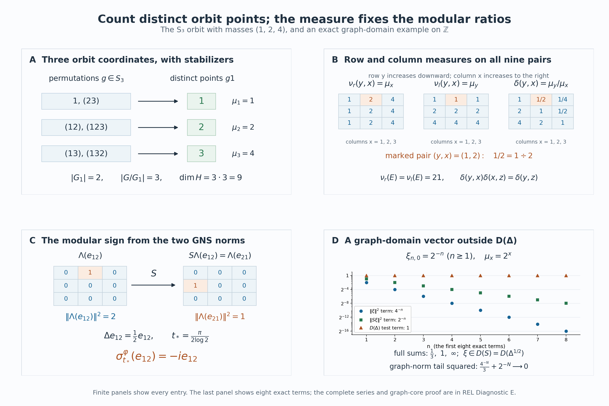

# Countable orbit algebras and their modular weight

*Self-checked by the writing AI. Original exposition and illustration sources: CC0-1.0; earlier and font components retain their recorded terms.*

An orbit may have fewer points than the group elements that reach it. Counting those points gives an operator algebra with a faithful diagonal expectation, even when stabilizers are present. We construct the counting measures first, identify every operator in the algebra by its orbit matrices, and recover the modular operator from the cost of reversing a matrix entry. A three-point example will make the counting and the modular signs visible.

## Setting and conventions

Let a finite or countably infinite group \(G\) act by Borel bijections on a standard Borel space \(X\). Let \(\mu\) be a sigma-finite Borel measure, and assume that every group element preserves its null sets in both directions. We use completed measures for Hilbert spaces and Borel versions for formulas. Write
\[
 E=\{(y,x):y\in Gx\},\qquad H_x=\ell^2(Gx).
\tag{REL0.a}
\]
The standard basis of \(H_x\) is indexed by the **distinct points** of \(Gx\). If \(z\in Gx\), the equality \(Gz=Gx\) gives a specified identity between \(H_z\) and \(H_x\): it keeps each point label fixed. No choice of a group element is involved in this identity.

Inner products are linear in the first variable. Thus the matrix entry of an operator \(T(x)\) is \(\langle T(x)e_z,e_y\rangle\). We allow a finite base, infinite measure, nonergodic actions and nontrivial stabilizers. When \(\mu=0\), the Hilbert space and represented algebras are zero, and all the conclusions below have that interpretation. In the proof we may therefore assume \(\mu\ne0\).

The scalar inputs are the [construction of scalar \(L^2\)](OA-FLOW-SC.md#sc-07) and the [finite Radon–Nikodym theorem](../../OA-MOD/OA-MOD-DC.html#a-finite-radon-nikodym-density-from-hilbert-representation). We explain the sigma-finite extension needed here. Operator fields and the GNS construction will be used with the explicit proof locators given at their point of use.

## 1. Two ways to count an orbit relation

Choose an enumeration \((g_n)\) of \(G\) beginning with its identity. The index set is finite when \(G\) is finite. Put
\[
 D_n=\{x:g_nx\ne g_jx\text{ for every }j<n\},\qquad
 E_n=\{(g_nx,x):x\in D_n\}.
\tag{REL1.a}
\]
These are Borel sets. Indeed a standard Borel space has a countable Borel family \((C_j)\) separating points: take the intersections with a countable base in a Polish realization. Equality of two points is the intersection, over \(j\), of the conditions that both belong to \(C_j\) or both do not. This proves that the diagonal, the graphs of the \(g_n\), and the sets in (REL1.a) are Borel. The \(E_n\) are disjoint and cover \(E\). The formula removes repeated descriptions of the same point, including repetitions caused by stabilizers.

For a nonnegative Borel function \(F\) on \(E\), define
\[
 \begin{aligned}
 \nu_r(F)&=\int_X\sum_{y\in Gx}F(y,x)\,d\mu(x)
          =\sum_n\int_{D_n}F(g_nx,x)\,d\mu(x),\\
 \nu_l(F)&=\int_X\sum_{x\in Gy}F(y,x)\,d\mu(y).
 \end{aligned}
\tag{REL1.b}
\]
The right-hand sum proves measurability. Applying the same argument to \(F(x,y)\) proves it for the left-hand sum. Indicator functions define countably additive measures: interchange two nonnegative series and then use scalar monotone convergence. Approximation by simple functions gives (REL1.b) for every nonnegative measurable function. In particular, inversion \(\iota(y,x)=(x,y)\) satisfies
\[
 \nu_l(F)=\nu_r(F\circ\iota).
\tag{REL1.c}
\]

Choose Borel sets \(B_k\uparrow X\) with \(\mu(B_k)<\infty\). Each \(E_n\cap(X\times B_k)\) has \(\nu_r\)-measure at most \(\mu(B_k)\), and these sets form a countable cover. Inversion gives a corresponding finite-measure cover for \(\nu_l\). Both measures are therefore sigma-finite.

They have the same null sets. If a Borel set \(A\subset E\) is \(\nu_r\)-null, the sets
\(N_n=\{x\in D_n:(g_nx,x)\in A\}\) are \(\mu\)-null. Its first-coordinate projection is \(\bigcup_n g_nN_n\), a Borel null set by nonsingularity. Every nonzero left counting fiber of \(A\) lies over that set, so \(\nu_l(A)=0\). Apply inversion to obtain the converse. This also shows why null changes to a function on \(X\), in either coordinate, make only a null change on \(E\).

### A density with one orbitwise chain rule

For completeness, the finite Radon–Nikodym theorem extends to two sigma-finite measures as follows. Intersect finite-measure covers for the two measures and take successive differences to get a disjoint countable partition on which both are finite. Apply the finite theorem on every piece, then paste the densities. Countable additivity gives the integral identity on the whole space, and testing subsets of the pieces gives uniqueness. For equivalent measures the density is strictly positive and finite almost everywhere. Apply this to \(\nu_l\) and \(\nu_r\) and choose a Borel version
\[
 \delta=\frac{d\nu_l}{d\nu_r},\qquad 0<\delta<\infty\quad\nu_r\text{-almost everywhere}.
\tag{REL1.d}
\]
Borel versions suffice also for completed measures: every completed measurable function is almost everywhere a Borel function, by simple approximation and the definition of completion.

For any Borel \(A\subset X\), the graph \(\{(gx,x):x\in A\}\) has right measure \(\mu(A)\) and left measure \(\mu(gA)\). Hence
\[
 \mu(gA)=\int_A\delta(gx,x)\,d\mu(x).
\tag{REL1.e}
\]
Let \(r_g\) be this derivative of the measure \(A\mapsto\mu(gA)\). The same identity for simple functions, followed by monotone convergence, gives the change-of-variable rule
\[
 \int_{gA}f(y)\,d\mu(y)=\int_A f(gx)r_g(x)\,d\mu(x),\qquad f\ge0.
\tag{REL1.f}
\]
In particular uniqueness of densities gives
\[
 r_{gh}(x)=r_g(hx)r_h(x),\qquad r_e(x)=1,
 \qquad r_g(x)=\delta(gx,x)
\tag{REL1.g}
\]
almost everywhere, for each \(g,h\). For the first equality, integrate its proposed right side over \(A\); (REL1.f) turns the result into \(\int_{hA}r_g\,d\mu=\mu(ghA)\). The positivity and finiteness of \(\delta(gx,x)\) follow from (REL1.d), because a \(\nu_r\)-null set meets each group graph over a \(\mu\)-null set.

There are countably many conditions in (REL1.g). Remove their exceptional Borel sets, all failures of positivity or finiteness on these graphs, and **every group translate** of these exceptional sets. The removed set is still null; its complement \(X_0\) is invariant. For all related triples in \(X_0\) we now have the literal identities
\[
 \delta(z,x)=\delta(z,y)\delta(y,x),\qquad
 \delta(x,x)=1,\qquad \delta(x,y)=\delta(y,x)^{-1}.
\tag{REL1.h}
\]
To check the first, write \(y=hx\) and \(z=gy\), then use (REL1.g) at \(x\) and \(hx\). Their inclusion in \(X_0\) is the reason for removing the invariant saturation. We henceforth work on this invariant conull set and retain the notation \(X\). This replacement changes none of the completed Hilbert spaces or represented algebras.

The density also governs every Borel partial bijection \(T:A\to B\) whose graph lies in \(E\):
\[
 \mu(TC)=\int_C\delta(Tx,x)\,d\mu(x)\qquad(C\subset A\text{ Borel}).
\tag{REL1.i}
\]
Partition \(A\) into the Borel sets where \(T(x)=g_nx\) for the first possible \(n\). On each piece (REL1.e) applies; their images are disjoint because \(T\) is injective. Add the identities. Thus such a partial bijection is nonsingular, and its density is determined by its graph, independently of how it was described by group elements.

## 2. Point-labeled Hilbert spaces and the two coordinate actions

The Hilbert space for the construction is
\[
 H=L^2(E,\nu_r)=\int_X^\oplus\ell^2(Gx)\,d\mu(x).
\tag{REL2.a}
\]
Here is a direct meaning of the displayed field integral. The sections
\[
 s_n(x)=1_{D_n}(x)e_{g_nx}
\tag{REL2.b}
\]
are measurable, orthonormal when nonzero, and total in every fiber. A section is measurable precisely when all its coordinates on the \(s_n\) are measurable. Equivalently it is a sequence \((\eta_n(x))\) in \(\ell^2\), with \(\eta_n=0\) off \(D_n\). This is the range of the coordinate projection
\(P(x)=\operatorname{diag}(1_{D_n}(x))\) in the ordinary countable Hilbert sum of scalar \(L^2(X,\mu)\) spaces. That projection is bounded and selfadjoint, so its range is complete. The map
\[
 \xi\longmapsto\bigl(1_{D_n}(x)\xi(g_nx,x)\bigr)_n
\tag{REL2.c}
\]
is an onto isometry by (REL1.b): its inverse prescribes \(\xi\) on each disjoint Borel graph \(E_n\). This proves all of (REL2.a), including completeness and the measurability convention, without assuming a constant orbit size.

A bounded measurable operator field \(T(x)\in B(H_x)\) means that its matrix coefficients on the \(s_n(x)\) are measurable and its norms are essentially bounded. Its action on sections is measurable by finite coordinate approximation, and
\[
 (T\xi)(\cdot,x)=T(x)\xi(\cdot,x),\qquad
 \|T\|=\mathop{\rm ess\,sup}_{x}\|T(x)\|.
\tag{REL2.d}
\]
The inequality from right to left follows by integration. For the reverse, the norm of each fiber operator is the supremum of its values on normalized nonzero rational finite combinations of the \(s_n(x)\). Their norms and the output norms are measurable. If a fixed bound fails on a set of positive measure, one member of this countable family witnesses the failure on a set of positive measure; intersect with a finite-measure set and use that section as a test vector. This proves the reverse inequality. The same tests show that an operator field giving the zero global operator is zero almost everywhere.

Define
\[
 (\pi(f)\xi)(y,x)=f(y)\xi(y,x),\qquad
 (u_g\xi)(y,x)=\xi(g^{-1}y,x),
 \quad f\in L^\infty(X,\mu),\ g\in G.
\tag{REL2.e}
\]
The first-coordinate null-set assertion after (REL1.c) makes \(\pi\) well defined. Its norm is \(\|f\|_\infty\): the upper estimate is immediate, and diagonal graph vectors supported on finite-measure subsets where \(|f|\) is near its essential supremum give the lower estimate. Thus \(\pi\) is a faithful unital star representation.

It is also normal. For \(\xi\in H\), (REL1.d) rewrites its positive vector functional as
\[
 \langle\pi(f)\xi,\xi\rangle
 =\int_X f(y)\left(\sum_{x\in Gy}
       \frac{|\xi(y,x)|^2}{\delta(y,x)}\right)d\mu(y).
\tag{REL2.f}
\]
The parenthesized function is nonnegative and integrable, with integral \(\|\xi\|^2\). Such integration functionals belong to the predual \(L^1(X,\mu)\); polarization gives the other vector functionals. For a square-summable pair of vector sequences, the resulting \(L^1\) coefficient norms have summable sum by Cauchy–Schwarz. Their sum is therefore again in \(L^1\). The [vector-series description of the predual](OA-FLOW-CP.md#oa-flow.cp.6) proves normality of \(\pi\). Formula (REL2.f) holds first for bounded positive \(f\), which is enough for this argument.

The map \(y\mapsto g^{-1}y\) permutes each orbit, so \(u_g\) is unitary with inverse \(u_{g^{-1}}\). Direct substitution proves
\[
 u_gu_h=u_{gh},\qquad
 u_g\pi(f)u_g^*=\pi(f\circ g^{-1}).
\tag{REL2.g}
\]
Set
\[
 M=\{\pi(L^\infty(X,\mu)),u_g:g\in G\}'',\qquad
 D=\pi(L^\infty(X,\mu)).
\tag{REL2.h}
\]
The double commutant is the von Neumann algebra generated by these operators, by the [bicommutant theorem](../../foundations-of-von-neumann-algebras/the-double-commutant-theorem.html#OA-FND-BI-06).

For later comparison, the other coordinate gives operators
\[
 (m_b\xi)(y,x)=b(x)\xi(y,x),\qquad
 (v_g\xi)(y,x)=\delta(g^{-1}x,x)^{1/2}\xi(y,g^{-1}x).
\tag{REL2.i}
\]
The latter is unitary. In its squared norm, substitute \(x=gz\) by (REL1.f); the change-of-measure factor is \(\delta(gz,z)\), and the displayed square factor becomes \(\delta(z,gz)\), so they cancel. Both sums range over the same point-labeled orbit. Formula (REL1.h) also gives \(v_gv_h=v_{gh}\). Every \(m_b\) and \(v_g\) commutes with both operators in (REL2.e): the \(y\)-permutation changes neither \(b(x)\) nor \(\delta(g^{-1}x,x)\), and the \(x\)-change leaves \(f(y)\) unchanged. Consequently
\[
 \{m_b,v_g:b\in L^\infty(X,\mu),\ g\in G\}\subset M'.
\tag{REL2.j}
\]
The absence of a density in \(u_g\), and its presence in \(v_g\), express the difference between permuting counting fibers and changing their measured base.

## 3. The full orbit-field criterion

A measurable field \(T(x)\in B(H_x)\) is **orbit constant** when, on an invariant conull subset of \(X\),
\[
 T(gx)=T(x)\qquad(g\in G).
\tag{REL3.a}
\]
The equality uses the point-labeled identification \(H_{gx}=H_x\) from the setting. It is an equality of the whole bounded operators. Let \(\mathcal F_{\rm orb}\) denote all essentially bounded measurable fields with this property. We prove
\[
 \boxed{\quad
 M=\left\{\int_X^\oplus T(x)\,d\mu(x):
       T\in\mathcal F_{\rm orb}\right\}.
 \quad}
\tag{REL3.b}
\]
The essential bound and the norm are those of (REL2.d). The theorem includes finite and infinite orbits, variable orbit sizes, and arbitrary stabilizers.

### Decomposition over either coordinate

We use the [whole diagonal-commutant theorem](../../OA-MOD/OA-MOD-DF.html#the-diagonal-commutant-is-exactly-the-decomposable-algebra), specifically its proof by localized frame images. Its hypotheses are a sigma-finite base and a countable measurable family of sections total in every fiber. The sections \(s_n\) in (REL2.b) meet these hypotheses, including where some of them are zero. Thus a bounded operator on \(H\) commutes with every \(m_b\) if and only if it is represented by an essentially bounded measurable field \(T(x)\).

The uniqueness in that proof is useful here. Test a field on
\(1_{A_k}s_n\), where \((A_k)\) is a countable finite-measure partition of \(X\). Equality of the global operators gives equality on these sections off a single null set, and fiberwise density gives equality of the whole fields. The same argument handles any countable family of operator identities. In particular, no intersection of uncountably many conull sets is required.

For the other coordinate, put \(H_l=L^2(E,\nu_l)\) and define
\[
 U:H\longrightarrow H_l,\qquad
 (U\xi)(y,x)=\delta(y,x)^{-1/2}\xi(y,x).
\tag{REL3.c}
\]
The identity \(d\nu_l=\delta\,d\nu_r\) proves that \(U\) is an onto unitary; its inverse multiplies by \(\delta^{1/2}\). This multiplication is between the two specified Hilbert spaces, and need not be a bounded multiplication operator on either space separately. Left counting gives
\[
 H_l=\int_X^\oplus\ell^2(Gy)\,d\mu(y),
\tag{REL3.d}
\]
where the fiber coordinate is now \(x\). The same disjoint first-occurrence graphs give a countable measurable orthonormal family, with zeros allowed. The diagonal-commutant theorem consequently applies over this coordinate too.

The transformed generators are
\[
 \begin{aligned}
 (U\pi(f)U^*\eta)(y,x)&=f(y)\eta(y,x),\\
 (Uu_gU^*\eta)(y,x)
   &=\delta(g^{-1}y,y)^{1/2}\eta(g^{-1}y,x).
 \end{aligned}
\tag{REL3.e}
\]
For the second identity, the multiplier before simplification is
\(\delta(y,x)^{-1/2}\delta(g^{-1}y,x)^{1/2}\);
the chain rule (REL1.h) gives the displayed expression.

### The necessary field conditions and the whole commutant

If \(T\in M\), (REL2.j) makes it commute with every \(m_b\), so the first decomposition above supplies \(T(x)\). Conjugating a decomposable operator by \(v_g\) gives the field
\[
 (v_gTv_g^*)(x)=T(g^{-1}x).
\tag{REL3.f}
\]
To check this identity, substitute (REL2.i) twice: its scalar square-root factors cancel, and the point labels in the fiber are unchanged. The field on the right is measurable. Indeed each of its coefficients is a coefficient of \(T\) evaluated at \(g^{-1}x\), with the point labels reexpressed through the countable first-occurrence enumeration; the equality sets for those labels are Borel. Nonsingularity preserves exceptional null sets and the essential bound.

Since \(T\) commutes with \(v_g\), uniqueness of decomposition proves
\(T(g^{-1}x)=T(x)\) for almost every \(x\). There are only countably many \(g\)'s. Remove their exceptional sets and all their group translates, together with the exceptional sets for the field bound. The complement is invariant and conull, and (REL3.a) holds there for every \(g\). Defining the field to be zero on the removed invariant set gives a measurable version with the asserted literal orbit constancy. This proves one inclusion in (REL3.b).

Now take any \(S\in M'\). Since \(S\) commutes with \(\pi(f)\), (REL3.d) decomposes \(USU^*\) as a field \(B(y)\in B(\ell^2(Gy))\). Its commutation with the second line of (REL3.e), by the same change-of-base calculation and countable uniqueness, gives
\[
 B(gy)=B(y)\qquad(g\in G)
\tag{REL3.g}
\]
on an invariant conull set. Conversely, any essentially bounded measurable field satisfying (REL3.g) commutes with both lines of (REL3.e): the first is scalar on each fiber, and the second changes the measured base while keeping the point labels. Its conjugate by \(U^*\) therefore lies in \(M'\). We have obtained the entire commutant:
\[
 M'=
 U^*\left\{\int_X^\oplus B(y)\,d\mu(y):
        B\text{ is measurable, essentially bounded, and orbit constant}
       \right\}U.
\tag{REL3.h}
\]

For a right field satisfying (REL3.a), define its intrinsic matrix by
\[
 a(y,z)=\langle T(z)e_z,e_y\rangle,\qquad (y,z)\in E.
\tag{REL3.i}
\]
It is measurable: on each first-occurrence graph it is one of the measurable field coefficients. Orbit constancy means that the matrix of \(T(x)\) is \(a(y,z)\) for all \(y,z\in Gx\). Similarly the matrix of \(B(y)\), whose row and column coordinates are \(x,u\in Gy\), is a measurable function \(b(x,u)\) independent of \(y\). For example it can be defined by
\(b(x,u)=\langle B(u)e_u,e_x\rangle\).
All these assertions concern an invariant conull base; equivalence of the counting measures makes its complement null in either realization.

Conjugating the left-field formula back by \(U\) gives the exact formula for \(S\):
\[
 \begin{aligned}
 (S\xi)(y,x)
  &=\delta(y,x)^{1/2}
       \sum_{u\in Gy}b(x,u)\delta(y,u)^{-1/2}\xi(y,u)\\
  &=\sum_{u\in Gx}\delta(u,x)^{1/2}b(x,u)\xi(y,u).
 \end{aligned}
\tag{REL3.j}
\]
The ratio in the first line is
\(\delta(y,x)/\delta(y,u)=\delta(u,x)\), so it is independent of \(y\).
For every \(\xi\in H\), this is an absolutely convergent row sum for almost every \((y,x)\). Indeed \(U\xi\in H_l\), so for almost every \(y\) its \(u\)-coordinates form an \(\ell^2(Gy)\) vector. Each row of the bounded operator \(B(y)\) is in \(\ell^2(Gy)\); Cauchy–Schwarz proves absolute convergence for every row \(x\) at such a \(y\). The exceptional pairs are \(\nu_l\)-null and hence also \(\nu_r\)-null. This argument uses the weighted vector \(U\xi\); it does not assert that the coefficients \(\delta(u,x)^{1/2}b(x,u)\) form an unweighted square-summable row.

### A single-graph proof of the converse

Let \(T\) now be any essentially bounded measurable right field satisfying (REL3.a), and let \(S\in M'\) have the representation just proved. We show \(TS=ST\) on a dense subspace. Fix \(g\in G\) and a bounded measurable function \(f\) supported on a set of finite \(\mu\)-measure. The vector
\[
 \xi_{g,f}(y,x)=f(x)\,1_{\{y=gx\}}
 \quad\text{satisfies}\quad
 \|\xi_{g,f}\|_H^2=\int_X|f(x)|^2\,d\mu(x).
\tag{REL3.k}
\]
Such vectors span a dense subspace of \(H\). In fact \(f\,s_n\), in the coordinate description (REL2.c), is \(\xi_{g_n,f1_{D_n}}\). Finite coordinate truncation, restriction to finite-measure base sets, and scalar value truncation approximate every square-integrable section by finite sums of these vectors.

For \(z\in Gx\), (REL3.j) has just one nonzero input term on this graph:
\[
 (S\xi_{g,f})(z,x)
  =\delta(g^{-1}z,x)^{1/2}
       b(x,g^{-1}z)f(g^{-1}z).
\tag{REL3.l}
\]
Consequently
\[
 \begin{aligned}
 (TS\xi_{g,f})(y,x)
  &=\sum_{z\in Gx}a(y,z)\,
       \delta(g^{-1}z,x)^{1/2}
       b(x,g^{-1}z)f(g^{-1}z)\\
  &=\sum_{u\in Gx}a(y,gu)\,
       \delta(u,x)^{1/2}b(x,u)f(u).
 \end{aligned}
\tag{REL3.m}
\]
The first series converges absolutely for almost every \((y,x)\): \(S\xi_{g,f}\in H\), so its \(z\)-column is square summable for almost every \(x\), and the \(y\)-row of \(T(x)\) is square summable. The second line merely reindexes that absolutely convergent series by the bijection \(z=gu\) of the orbit. Stabilizers do not affect this bijection of point labels.

On the other hand the right field acts on the original graph by
\[
 (T\xi_{g,f})(y,u)=a(y,gu)f(u).
\tag{REL3.n}
\]
Insert this vector into (REL3.j) to obtain
\[
 (ST\xi_{g,f})(y,x)
    =\sum_{u\in Gx}\delta(u,x)^{1/2}
           b(x,u)a(y,gu)f(u).
\tag{REL3.o}
\]
This series is independently absolutely convergent by the proof of (REL3.j), applied to \(T\xi_{g,f}\in H\). Its terms are those in the last line of (REL3.m). Thus the two vectors agree almost everywhere, and hence in \(H\).

For clarity, the pointwise formula (REL3.n) is initially valid off a \(\nu_r\)-null set in its variables \((y,u)\). The two counting measures are equivalent, so for almost every \(y\) it holds for every \(u\in Gy\). It may therefore be inserted into the left-field row sum. The same reasoning justifies the use of (REL3.l) in the right-field sum. There is no exchange of two infinite sums, and no demand for a pointwise common version for uncountably many test vectors. A fixed graph vector uses only the two countable row sums above.

Both \(TS\) and \(ST\) are bounded. Their equality on the dense span of (REL3.k) proves \(TS=ST\) on all of \(H\). Since \(S\in M'\) was arbitrary, the bicommutant theorem gives \(T\in M''=M\). This proves the reverse inclusion in (REL3.b).

One also obtains an exact generator description of the commutant:
\[
 M'=\{m_b,v_g:b\in L^\infty(X,\mu),\ g\in G\}''.
\tag{REL3.p}
\]
Indeed the commutant of the family on the right consists precisely of the right decomposable orbit-constant fields: the diagonal-commutant theorem gives decomposition, and (REL3.f) gives orbit constancy; the converse follows by substitution. By (REL3.b) that commutant is \(M\), and taking commutants proves (REL3.p).

The membership criterion and both descriptions of \(M'\) have now been proved for the full bounded operator algebras, before constructing any weight or modular operator.

## 4. Reading the diagonal: expectation, maximal abelianness and center

By Section 3, every \(T\in M\) has a bounded measurable orbit-constant field \(T(x)\). Define
\[
 f_T(x)=\langle T(x)e_x,e_x\rangle,\qquad
 E_D(T)=\pi(f_T).
\tag{REL4.a}
\]
The identity occurs first in our enumeration, so \(x\mapsto e_x\) is its first measurable section. Thus \(f_T\) is measurable and \(\|f_T\|_\infty\le\|T\|\). Almost-everywhere uniqueness of fields makes the definition independent of representatives.

The map \(E_D:M\to D\) is a faithful normal conditional expectation. We prove all of these assertions. Let
\[
 V:L^2(X,\mu)\longrightarrow H,\qquad
 (V\eta)(y,x)=1_{\{y=x\}}\eta(x).
\tag{REL4.b}
\]
This is an isometry, and direct fiberwise computation shows that \(V^*TV\) is scalar multiplication by \(f_T\) on \(L^2(X,\mu)\). Compression is completely positive: for \([T_{ij}]\ge0\) and vectors \(\eta_i\), its matrix quadratic form is \(\sum_{i,j}\langle T_{ij}V\eta_j,V\eta_i\rangle\ge0\). Scalar multiplication is a faithful normal representation of \(L^\infty\). Transporting the compressed multiplier through the star isomorphism \(f\mapsto\pi(f)\) shows that \(E_D\) is completely positive and unital. This also proves \(\|E_D(T)\|\le\|T\|\).

For \(a,b\in L^\infty(X,\mu)\), the diagonal entry of \(\pi(a)T\pi(b)\) is \(a(x)f_T(x)b(x)\). Hence
\[
 E_D(\pi(a)T\pi(b))=\pi(a)E_D(T)\pi(b),\qquad
 E_D(\pi(a))=\pi(a).
\tag{REL4.c}
\]
So the range is exactly \(D\), and \(E_D\) is idempotent and \(D\)-bimodular.

Normality includes increasing nets, not just sequences. For every \(q\in L^1(X,\mu)_+\), the vector
\(\xi_q(y,x)=1_{\{y=x\}}\sqrt{q(x)}\) belongs to \(H\), and
\[
 \int_X q(x)f_T(x)\,d\mu(x)=\langle T\xi_q,\xi_q\rangle.
\tag{REL4.d}
\]
The right side is normal in \(T\). Every element of \(L^1\) is a linear combination of positive ones, so the coefficient map \(T\mapsto f_T\) is normal by the predual criterion. Compose it with the normal map \(\pi\) to obtain normality of \(E_D\).

If \(T\ge0\), its field is positive almost everywhere. To see this, test its global quadratic form on the countable rational finite sections from (REL2.d), localized on arbitrary finite-measure subsets. A negative fiber quadratic form on a set of positive measure would give a negative global quadratic form. Suppose now \(E_D(T)=0\). Outside a null set,
\(\langle T(x)e_x,e_x\rangle=0\), and positivity implies \(T(x)e_x=0\): the positive-form Cauchy–Schwarz inequality first makes every coefficient \(\langle T(x)e_x,\eta\rangle\) vanish. Remove the invariant saturation of this exceptional set and that of the orbit-constancy and positivity exceptions. For every remaining \(x\) and every \(y\in Gx\),
\[
 T(x)e_y=T(y)e_y=0.
\tag{REL4.e}
\]
The point basis is total, so \(T(x)=0\) almost everywhere and \(T=0\). This proves faithfulness. It also explains why examining one diagonal entry per base point is sufficient: orbit constancy brings all the other entries to that same test.

The expectation is uniquely determined among normal conditional expectations onto \(D\). To prove this, let \(F\) be another one and write \(F(u_g)=\pi(h_g)\). Bimodularity and \(u_g\pi(a)=\pi(a\circ g^{-1})u_g\) give \((a-a\circ g^{-1})h_g=0\) for every bounded \(a\). Testing the countable separating indicators from Section 1 shows that \(h_g\) vanishes away from the Borel fixed-point set \(K_g=\{x:gx=x\}\). On this set \(\pi(1_{K_g})u_g=\pi(1_{K_g})\), as is seen directly in (REL2.e). Apply \(F\) to get \(1_{K_g}h_g=1_{K_g}\). Therefore
\[
 F(u_g)=E_D(u_g)=\pi(1_{K_g}).
\tag{REL4.j}
\]
Bimodularity proves equality on every \(\pi(a)u_g\). The linear span of these operators is a unital star algebra by (REL2.g), and its ultraweak closure is \(M\) by the bicommutant theorem. Normality proves \(F=E_D\) on all of \(M\). Conjugation by \(u_g\) normalizes \(D\); conjugating the expectation and using this uniqueness also gives
\[
 E_D(u_gTu_g^*)=u_gE_D(T)u_g^*.
\tag{REL4.k}
\]

### The whole diagonal commutant

Suppose \(T\in M\) commutes with \(D\). For the countable point-separating Borel family \((C_j)\) from Section 1, the field of
\([T,\pi(1_{C_j})]\) is zero almost everywhere. Remove a common invariant null set for these equalities and the orbit-constant versions. At every remaining fiber,
\[
 (1_{C_j}(z)-1_{C_j}(y))\,
      \langle T(x)e_z,e_y\rangle=0
      \quad(j\ge1,\ y,z\in Gx).
\tag{REL4.f}
\]
If \(y\ne z\), some \(C_j\) separates them. Every off-diagonal entry of \(T(x)\) is therefore zero. For its diagonal entries, orbit constancy gives
\[
 \langle T(x)e_y,e_y\rangle
       =\langle T(y)e_y,e_y\rangle=f_T(y).
\tag{REL4.g}
\]
Thus \(T=\pi(f_T)\). The reverse inclusion holds because \(D\) is abelian, proving
\[
 D'\cap M=D.
\tag{REL4.h}
\]
In particular the diagonal is a maximal abelian subalgebra, whether or not the action is free.

### The center records invariant functions

A central operator lies in \(D\) by (REL4.h). The covariance formula (REL2.g) gives
\[
 Z(M)=\pi\bigl(L^\infty(X,\mu)^G\bigr),\qquad
 L^\infty(X,\mu)^G
 =\{f:f\circ g=f\text{ almost everywhere for every }g\in G\}.
\tag{REL4.i}
\]
Indeed these are exactly the diagonal operators commuting with all the generators \(u_g\). Since \(G\) is countable, an invariant function has a Borel version which is literally invariant on an invariant conull set: remove the saturated union of the equality failures. Thus (REL4.i) can also be read in terms of functions on the orbit relation.

For \(\mu\ne0\), \(M\) is a factor exactly when the action is ergodic, meaning that each invariant measurable set is null or conull. If there is an invariant set which is neither, its indicator supplies a nonscalar central projection. Conversely, under ergodicity the rational sublevel sets of a bounded real invariant function are all null or conull. To see that the function is constant, replace \(\mu\) by an equivalent probability using a strictly positive integrable density; the distribution then has all its rational sublevel probabilities in \(\{0,1\}\), which concentrates it at their common threshold. Apply this to real and imaginary parts. Every central operator is therefore scalar. An equivalent probability exists by assigning positive summable masses to a disjoint finite-measure exhaustion of \(X\), normalizing the resulting integrable step function, and ignoring null pieces.

## 5. The diagonal weight and its complete modular operator

Let \(E_D:M\to D\cong L^\infty(X,\mu)\) be the faithful normal diagonal expectation of [Section 4](OA-FLOW-REL.md#rel-4). Define
\[
 \varphi(A)=\int_X E_D(A)(x)\,d\mu(x),\qquad A\in M_+ .
 \tag{REL5.a}
\]
All infinite values are retained. Choose the increasing finite-measure Borel sets \(B_m\uparrow X\) from Section 1 and put \(p_m=\pi(1_{B_m})\). The functionals
\(A\mapsto\int_{B_m}E_D(A)\,d\mu\) are bounded normal positive functionals, and their supremum is \(\varphi\). Interchanging this supremum with any bounded increasing positive supremum proves normality for arbitrary nets. Faithfulness follows from faithfulness of the expectation and of integration on \(L^\infty(X,\mu)_+\).

Moreover
\(\varphi(p_m)=\mu(B_m)<\infty\) and \(p_m\uparrow1\) strongly. For every \(A\in M\),
\((Ap_m)^*(Ap_m)\le\|A\|^2p_m\), so \(Ap_m\) belongs to the finite left ideal. The finite-algebra elements
\(p_mAp_m=p_m^*(Ap_m)\) converge bounded strongly, hence ultraweakly, to \(A\). Thus \(\varphi\) is semifinite by the [finite-ideal characterization](OA-FLOW-GW.md#oa-flow.gw.4). We have proved that \(\varphi\) is faithful normal semifinite without replacing the measure by a probability measure.

**Every finite ideal and the GNS map.** For \(A\in M\), its orbit-constant field from [Section 3](OA-FLOW-REL.md#rel-3) has the measurable column kernel
\[
 a_A(y,x)=\langle A(x)e_x,e_y\rangle,\qquad (y,x)\in E.
 \tag{REL5.b}
\]
Its other matrix entries are \(A_{y,z}=a_A(y,z)\): the specified point-label identification of the fibers makes \(A(x)=A(z)\) whenever \(z\in Gx\), on a common invariant conull set for this operator. Countability permits that set; no choice of a representative of an orbit is needed.

The expectation applied to a square gives the exact extended equality
\[
 \varphi(A^*A)
    =\int_X\|A(x)e_x\|^2\,d\mu(x)
    =\int_E|a_A(y,x)|^2\,d\nu_r(y,x).
 \tag{REL5.c}
\]
Also
\[
 a_{A^*}(y,x)=\overline{a_A(x,y)},\qquad
 \varphi(AA^*)=\int_E\delta(y,x)|a_A(y,x)|^2\,d\nu_r(y,x).
 \tag{REL5.d}
\]
The first identity uses orbit constancy before taking the matrix adjoint. The second uses the inversion identity \(\iota_*\nu_r=\nu_l=\delta\nu_r\) proved in [Section 1](OA-FLOW-REL.md#rel-1). Both hold even when the displayed integrals are infinite.

Consequently all the finite and null domains are specified by
\[
 \begin{aligned}
 F_\varphi
   &=\left\{A\in M_+:\int_X A_{x,x}\,d\mu(x)<\infty\right\},\\
 \mathfrak n_\varphi
   &=\{A\in M:a_A\in L^2(E,\nu_r)\},\\
 \mathfrak n_\varphi^*
   &=\{A\in M:a_A\in L^2(E,\nu_l)\},\\
 \mathfrak a_\varphi
   &=\mathfrak n_\varphi\cap\mathfrak n_\varphi^*
     =\{A\in M:a_A\in L^2(E,(1+\delta)\nu_r)\},\\
 \mathfrak m_\varphi
   &=\operatorname{span}\mathfrak n_\varphi^*\mathfrak n_\varphi
     =\operatorname{span}F_\varphi,\qquad
 \mathfrak n_\varphi^0=\{0\}.
 \end{aligned}
 \tag{REL5.e}
\]
The algebra and ideal statements, and the unique linear extension \(\varphi_0\) on \(\mathfrak m_\varphi\), are the [proved weight constructions](OA-FLOW-GW.md#oa-flow.gw.1). In this model their full pairing is
\[
 \varphi_0(B^*A)
   =\int_E a_A(y,x)\overline{a_B(y,x)}\,d\nu_r(y,x)
       \quad(A,B\in\mathfrak n_\varphi).
 \tag{REL5.f}
\]
Pointwise column Cauchy–Schwarz and then integral Cauchy–Schwarz justify absolute integrability. Polarization of (REL5.c), with the linear-first inner product, gives the equality. More generally
\(\varphi_0(C)=\int_X E_D(C)\,d\mu\) for \(C\in\mathfrak m_\varphi\): write \(C\) as a finite sum of such products and apply the same absolute bound.

Thus the [GNS construction](OA-FLOW-GW.md#oa-flow.gw.3) admits an isometry
\[
 U_\varphi:H_\varphi\longrightarrow H=L^2(E,\nu_r),
       \qquad U_\varphi\Lambda_\varphi(A)=a_A .
 \tag{REL5.g}
\]
We now prove that it is onto, and at the same time construct the exact core needed for the unbounded involution.

**Finite graph kernels.** Let \(\mathcal C\) consist of bounded Borel functions \(k\) on \(E\) supported on finitely many group graphs, with
\[
 \operatorname{supp}k\subset
   \{(y,x):x\in B,\ y\in C,\ c\le\delta(y,x)\le c^{-1}\},
 \quad \mu(B),\mu(C)<\infty,\quad 0<c\le1 .
 \tag{REL5.h}
\]
The sets \(B,C\) and the bound \(c\) may depend on \(k\). Kernels are identified up to \(\nu_r\)-null sets. Every \(k\in\mathcal C\) is the column kernel of a bounded operator in \(\mathfrak a_\varphi\).

To see this with stabilizers included, choose \(n\) large enough that its supporting group graphs occur among \(g_1,\ldots,g_n\). Use the disjoint first-occurrence graphs \(E_j\) and domains \(D_j\) from (REL1.a), and put
\[
 c_j(x)=1_{D_j}(x)k(g_jx,x),\qquad
 A_k=\sum_{j\le n}\pi(c_j\circ g_j^{-1})u_{g_j}.
 \tag{REL5.i}
\]
The coefficient is taken to be zero outside its prescribed domain. Each term has column kernel \(c_j(x)1_{\{y=g_jx\}}\). The disjoint first-occurrence rule therefore gives \(a_{A_k}=k\), rather than a sum with stabilizer multiplicities. Also
\(\|A_k\|\le\sum_{j\le n}\|c_j\|_\infty\).
Both kernel square integrals are finite: the right counting integral is at most \(n\|k\|_\infty^2\mu(B)\), and the left counting integral is at most \(n\|k\|_\infty^2\mu(C)\). Equations (REL5.c)–(REL5.d) prove \(A_k\in\mathfrak a_\varphi\).

These kernels form a star algebra under their operator realization. Adjoint reverses finitely many graphs and interchanges \(B,C\); the reciprocal identity for \(\delta\) preserves the bounded density interval. A product composes finitely many group graphs, and each coefficient sum has finitely many possible intermediate points. Its source lies in the source set of the second factor, its target in the target set of the first, and its density bounds multiply by the cocycle identity. Thus it again satisfies (REL5.h). The realization is faithful: a zero column kernel has zero value in (REL5.c), and faithfulness of \(\varphi\) forces its operator to be zero.

For an arbitrary measurable \(\xi\) on \(E\), choose a Borel version, as permitted by completion in Section 1, and define
\[
 \begin{aligned}
 F_m={}&\left(\bigcup_{j\le m}E_j\right)
       \ \cap\ \{(y,x):x,y\in B_m\}\\
      &\cap\{(y,x):m^{-1}\le\delta(y,x)\le m\},\\
 \xi_m={}&\xi\,1_{F_m}\,1_{\{|\xi|\le m\}} .
 \end{aligned}
 \tag{REL5.j}
\]
For a finite group the union stops at its last index. These sets increase to \(E\), since \(0<\delta<\infty\) on the chosen invariant conull space. Each \(\xi_m\) belongs to \(\mathcal C\). If \(\xi\in H\), scalar dominated convergence gives \(\xi_m\to\xi\) in \(H\). Hence \(\mathcal C\subset U_\varphi\Lambda_\varphi(\mathfrak a_\varphi)\) is dense in \(H\), proving surjectivity in (REL5.g).

Left multiplication has the exact original representation. For \(A\in\mathfrak n_\varphi\) and \(B\in M\),
\[
 a_{BA}(\,\cdot,x)=B(x)A(x)e_x
                  =B(x)a_A(\,\cdot,x).
 \tag{REL5.k}
\]
Each matrix series is a row pairing with an \(\ell^2\) column and converges absolutely by Cauchy–Schwarz. Its norm is bounded by \(\|B\|\|A(x)e_x\|\), so the field belongs to \(H\). Thus
\(U_\varphi\pi_\varphi(B)U_\varphi^*=B\) on all of \(H\).
The onto GNS identification is an identification of completions; it does not assert that every \(L^2\) kernel itself defines a bounded operator in \(M\). If \(\mu(X)=\infty\), the diagonal kernel \(1_{\{y=x\}}\) is not in \(H\), and no vector \(\Lambda_\varphi(1)\) is being used.

**The closed inversion and its graph core.** On the full finite-star GNS domain the initial Tomita map is
\[
 S_0a_A=a_{A^*}\qquad(A\in\mathfrak a_\varphi).
\]
By (REL5.d), it is a restriction of the maximal conjugate-linear inversion
\[
 \begin{aligned}
 (S\xi)(y,x)&=\overline{\xi(x,y)},\\
 D(S)&=\left\{\xi\in H:
       \int_E\delta(y,x)|\xi(y,x)|^2\,d\nu_r<\infty\right\}.
 \end{aligned}
 \tag{REL5.l}
\]
Indeed inversion gives the precise graph norm
\[
 \|\xi\|^2+\|S\xi\|^2
       =\int_E(1+\delta)|\xi|^2\,d\nu_r.
 \tag{REL5.m}
\]
The right-hand weighted \(L^2\) space is complete: multiplication by \((1+\delta)^{1/2}\) is an onto isometry from it to \(H\). Its norm controls convergence in \(H\) of both \(\xi\) and the inverted vector; uniqueness of limits shows that its embedding
\(\xi\mapsto(\xi,S\xi)\) has closed range in \(H\oplus H\). Thus \(S\) is closed. It is densely defined because it contains \(\mathcal C\), and inversion maps its domain onto itself with \(S^2=1\).

If \(\xi\in D(S)\), the same truncations in (REL5.j) satisfy
\[
 \|\xi-\xi_m\|^2+\|S\xi-S\xi_m\|^2
       =\int_E(1+\delta)|\xi-\xi_m|^2\,d\nu_r
              \longrightarrow0 .
 \tag{REL5.n}
\]
This is dominated convergence for an integrable nonnegative majorant. Hence \(\mathcal C\) is a core for the entire closed graph. Since
\(\mathcal C\subset D(S_0)\subset D(S)\) and \(S_0\subset S\), it follows that
\[
 \overline{S_0}=S .
 \tag{REL5.o}
\]
The argument identifies the closure of the involution on the **whole** finite-star algebra, not only a restriction with an unspecified extension.

Define on \(H\)
\[
 (J\xi)(y,x)=\delta(y,x)^{1/2}\overline{\xi(x,y)} .
 \tag{REL5.p}
\]
It is an everywhere-defined antiunitary involution. For its norm, change variables by inversion:
\[
 \begin{aligned}
 \|J\xi\|^2
   &=\int_E\delta(y,x)|\xi(x,y)|^2\,d\nu_r(y,x)\\
   &=\int_E\delta(x,y)|\xi(y,x)|^2\,d\nu_l(y,x)
     =\|\xi\|^2 .
 \end{aligned}
 \tag{REL5.q}
\]
The reciprocal identity for \(\delta\) gives \(J^2=1\). Multiplication \(Q=M_{\delta^{1/2}}\), with domain \(D(S)\), is positive self-adjoint by the [full multiplication spectral calculus](OA-FLOW-SF.md#oa-flow.sf1.spectral-calculus). Its cutoff proof supplies the entire domain, not just bounded-density kernels. Direct substitution gives \(S=JQ\) on exactly that domain.

Using the [conjugate-linear adjoint definition](OA-FLOW-CI.md#oa-flow.ci.1), the adjoint pairing is bounded in \(\xi\) precisely when \(J\eta\in D(Q)\); its value is \(QJ\eta\). Thus
\[
 \begin{aligned}
 (S^*\eta)(y,x)&=\delta(y,x)\overline{\eta(x,y)},\\
 D(S^*)&=\left\{\eta\in H:
          \int_E\delta^{-1}|\eta|^2\,d\nu_r<\infty\right\}.
 \end{aligned}
 \tag{REL5.r}
\]
In fact \(\|QJ\eta\|^2=\int\delta^{-1}|\eta|^2\,d\nu_r\), again by inversion. This proves both the domain and the value of the adjoint. Multiplying on the actual product domain now gives
\[
 \begin{aligned}
 \Delta_\varphi=S^*S&=M_\delta,\\
 D(\Delta_\varphi)
    &=\left\{\xi\in H:\int_E\delta^2|\xi|^2\,d\nu_r<\infty\right\}.
 \end{aligned}
 \tag{REL5.s}
\]
For the domain, \(S\xi\in D(S^*)\) contributes the integral of \(\delta^2|\xi|^2\); this condition together with \(\xi\in H\) already implies the \(\delta\)-integral by Cauchy–Schwarz. Hence there is no further hidden domain condition. The uniqueness of the polar data in [CI3](OA-FLOW-CI.md#oa-flow.ci.3) identifies (REL5.p) with the GNS modular conjugation.

More generally the full spectral domains and imaginary powers are
\[
 \begin{aligned}
 D(\Delta_\varphi^z)
   &=\left\{\xi\in H:
       \int_E\delta^{\,2\operatorname{Re}z}|\xi|^2\,d\nu_r<\infty\right\},
       &&z\in\mathbb C,\\
 (\Delta_\varphi^{it}\xi)(y,x)
   &=\delta(y,x)^{it}\xi(y,x),&&t\in\mathbb R.
 \end{aligned}
 \tag{REL5.t}
\]
The spectral projection for a Borel set \(B\subset(0,\infty)\) is multiplication by \(1_{\{\delta\in B\}}\). These formulas include reciprocal powers; \(\Delta_\varphi\) is injective but need not have a positive lower bound. The imaginary-power group is strongly continuous by dominated convergence with bound \(4|\xi|^2\).

**The modular automorphisms on every bounded operator.** The [arbitrary faithful normal semifinite modular theorem](OA-FLOW-MW.md#oa-flow.mw.4) applies to the weight and complete GNS identification just proved. Its weight-to-Hilbert-algebra comparison uses the [entire finite-star domain and its closure](OA-FLOW-WR.md#wr-3), and [WR5](OA-FLOW-WR.md#wr-5) transports the closed operators with their full domains. The underlying [bounded-multiplier modular theorem](OA-FLOW-MF06.md#oa-flow.mf06.8) normalizes the full generated von Neumann algebra. Therefore in this concrete GNS realization,
\[
 \sigma_t^\varphi(A)=\Delta_\varphi^{it}A\Delta_\varphi^{-it},
       \qquad A\in M.
 \tag{REL5.u}
\]
This is a normal automorphism of the whole algebra.

We prove the matrix formula at that same scope. On an orbit fiber based at \(x\), \(\Delta_\varphi^{it}\) is the diagonal unitary with entries \(\delta(y,x)^{it}\). For a bounded kernel supported on finitely many group graphs, conjugation therefore multiplies its \(y,z\) entry by
\[
 \delta(y,x)^{it}\delta(z,x)^{-it}=\delta(y,z)^{it}.
 \tag{REL5.v}
\]
The right side is independent of the base point. In particular, with the bounded modulus-one Borel function
\(d_g(y)^{it}=\delta(y,g^{-1}y)^{it}\), the generator formulas are
\[
 \begin{aligned}
 \sigma_t^\varphi(\pi(f))&=\pi(f),\\
 \sigma_t^\varphi(u_g)&=\pi(d_g^{it})u_g .
 \end{aligned}
 \tag{REL5.w}
\]
They also directly check normalization of \(M\), since conjugation by the inverse parameter has the inverse action.

To justify extension of entries by normality, fix \(g,h\in G\). The bounded linear map
\[
 \mathcal E_{g,h}:M\longrightarrow L^\infty(X,\mu),\qquad
 \mathcal E_{g,h}(A)(x)=\langle A(x)e_{hx},e_{gx}\rangle
\]
is normal. Indeed every \(q\in L^1(X,\mu)\) can be written \(q=f\overline{k}\), \(f,k\in L^2(X,\mu)\), and
\[
 \int_Xq(x)\mathcal E_{g,h}(A)(x)\,d\mu(x)
    =\langle A(f(x)e_{hx}),\,k(x)e_{gx}\rangle_H .
 \tag{REL5.x}
\]
These graph vectors are in \(H\), even when the full graph has infinite measure. The displayed identity puts every predual pullback in \(M_*\), proving normality. Multiplication in \(L^\infty(X,\mu)\) by \(\delta(gx,hx)^{it}\) is also normal.

The maps
\(\mathcal E_{g,h}\circ\sigma_t^\varphi\) and
\(A\mapsto\delta(gx,hx)^{it}\mathcal E_{g,h}(A)\)
agree on the finite algebraic span of the generators \(\pi(f)u_g\), by (REL5.v). That span is an algebra closed under adjoints by (REL2.g), and is ultraweakly dense in \(M\) by its definition. Normality of both maps proves their equality for every \(A\in M\). Since \(G\times G\) is countable, for each fixed \(A,t\) all the resulting entry identities hold off a single null set. Remove its countable invariant saturation if needed. Every distinct pair \(y,z\) in an orbit is then included, regardless of stabilizers. We obtain the full formula
\[
 \boxed{\quad
 [\sigma_t^\varphi(A)]_{y,z}
           =\delta(y,z)^{it}A_{y,z}
       \quad(A\in M,\ t\in\mathbb R).
       \quad}
 \tag{REL5.y}
\]
There is no infinite formal kernel multiplication in this extension, and no exceptional-set union over uncountably many test functionals.

In particular \(\delta(x,x)=1\) fixes every diagonal entry. Thus
\(\varphi\circ\sigma_t^\varphi=\varphi\) on the whole positive cone, including infinite values, and for \(A\in\mathfrak n_\varphi\),
\[
 a_{\sigma_t^\varphi(A)}=\delta^{it}a_A
      =\Delta_\varphi^{it}U_\varphi\Lambda_\varphi(A).
 \tag{REL5.z}
\]
The GNS, graph-domain and matrix formulas use the same density \(d\nu_l/d\nu_r\); reversing that density would reverse the modular time. The [reading note](OA-FLOW-REL.md#rel-reading) supplies the human-source context for these orbit and modular constructions.

## 6. A weighted three-point orbit and an infinite orbit

The orbit points determine the matrix size. The measure determines the GNS norm and modular ratios. We separate these two roles in a nonfree finite action, then retain the same coordinates in a genuinely infinite-measure example.

**Three points, six group elements, and three-dimensional fibers.** Let \(X=\{1,2,3\}\), let \(G=S_3\) act by its usual permutations, and give the points the positive masses
\[
 (\mu_1,\mu_2,\mu_3)=(1,2,4),\qquad
 h=\operatorname{diag}(1,2,4).
 \tag{REL6.a}
\]
This is a nonsingular action on a finite standard measure space. It is transitive and not free. For each \(x\), its stabilizer \(G_x\) has two elements and is isomorphic to \(S_2\). The map \(gG_x\mapsto gx\) is a bijection from the three left cosets onto \(X\). Accordingly \(E=X\times X\), each orbit fiber is \(\ell^2(X)\cong\mathbb C^3\), and the full relation Hilbert space has dimension \(9\).

Index the relation matrix by the target \(y\) in the row and the base point \(x\) in the column. The two counting measures and their derivative are
\[
 \nu_r(\{(y,x)\})=\mu_x,\qquad
 \nu_l(\{(y,x)\})=\mu_y,\qquad
 \delta(y,x)=\frac{\mu_y}{\mu_x}.
 \tag{REL6.b}
\]
Thus their complete tables are
\[
 [\nu_r]=
 \begin{pmatrix}1&2&4\\1&2&4\\1&2&4\end{pmatrix},\qquad
 [\nu_l]=
 \begin{pmatrix}1&1&1\\2&2&2\\4&4&4\end{pmatrix},\qquad
 [\delta]=
 \begin{pmatrix}1&1/2&1/4\\2&1&1/2\\4&2&1\end{pmatrix}.
 \tag{REL6.c}
\]
Right counting weights columns; left counting weights rows. Both total measures are \(21\). The cocycle identity is the exact cancellation
\(\delta(y,x)\delta(x,z)=(\mu_y/\mu_x)(\mu_x/\mu_z)=\delta(y,z)\).

Write a vector \(\xi\in H=L^2(E,\nu_r)\) as a three-by-three matrix. Its norm and a unitary to ordinary Hilbert–Schmidt space are
\[
 \|\xi\|_H^2=\sum_{x,y}\mu_x|\xi_{yx}|^2
             =\operatorname{Tr}(\xi h\xi^*),\qquad
 V\xi=\xi h^{1/2}.
 \tag{REL6.d}
\]
The coefficient \(\pi(f)\) is left multiplication by \(\operatorname{diag}(f(1),f(2),f(3))\). The operator \(u_g\) is left multiplication by the permutation matrix \(P_g\), where \(P_ge_x=e_{gx}\). It is unitary on \(H\): for each fixed column \(x\), it permutes the unweighted sum over \(y\). No Radon factor belongs in this left orbit-point permutation.

Let \(e_{yx}\) denote an ordinary matrix unit. If \(g x=y\), then
\[
 e_{yy}P_ge_{xx}=e_{yx}.
 \tag{REL6.e}
\]
Every matrix unit therefore belongs to the generated algebra. Conversely every generator acts by left multiplication, so
\(M=L(M_3(\mathbb C))\cong M_3(\mathbb C)\).
The right-base field of \(L_A\) is \(T(x)=A\) for all three \(x\); every constant matrix field occurs. This verifies the full field criterion of [Section 3](#rel-3) in this example without selecting one representative per orbit.

Under this identification the diagonal expectation and its weight are
\[
 E_D(A)=\operatorname{diag}(A_{11},A_{22},A_{33}),\qquad
 \varphi(A)=A_{11}+2A_{22}+4A_{33}
            =\operatorname{Tr}(hA)\quad(A\ge0).
 \tag{REL6.f}
\]
The expectation is positive, unital and bimodular over diagonal matrices. It is faithful because a positive matrix with zero diagonal has \(A^{1/2}e_x=0\) for all \(x\). Its coordinate functionals are normal, as in [CP6's vector-functional description](OA-FLOW-CP.md#oa-flow.cp.6). Thus it is a faithful normal conditional expectation. The weight is a faithful normal finite functional, with \(\varphi(I)=7\). Its finite left ideal is all of \(M_3\), and its entire GNS space is \(H\), with \(\Lambda_\varphi(A)_{yx}=A_{yx}\), since
\[
 \varphi(A^*A)=\sum_{x,y}\mu_x|A_{yx}|^2.
 \tag{REL6.g}
\]
In particular \(V\Lambda_\varphi(A)=Ah^{1/2}\), the weighted-trace GNS model used in [BC6's matrix calculation](OA-FLOW-BC.md#oa-flow.bc.6).

On all of \(H\), the Tomita map, its polar decomposition and the modular action are
\[
 \begin{aligned}
 (S\xi)_{yx}&=\overline{\xi_{xy}},&
 (\Delta\xi)_{yx}&=\frac{\mu_y}{\mu_x}\xi_{yx},\\
 (J\xi)_{yx}&=\left(\frac{\mu_y}{\mu_x}\right)^{1/2}
                    \overline{\xi_{xy}},&
 S&=J\Delta^{1/2},\\
 \sigma_t^\varphi(A)&=h^{it}Ah^{-it},&
 [\sigma_t^\varphi(A)]_{yz}
   &=\left(\frac{\mu_y}{\mu_z}\right)^{it}A_{yz}.
 \end{aligned}
 \tag{REL6.h}
\]
Indeed transposition and conjugation send \(\Lambda_\varphi(A)\) to \(\Lambda_\varphi(A^*)\). Changing \(x,y\) in the finite sum gives \(\|S\xi\|^2=\sum_{x,y}\mu_y|\xi_{yx}|^2\), so \(S^*S=M_\delta\). The displayed \(J\) is antiunitary, has square \(I\), and gives \(S=J\Delta^{1/2}\). Finally conjugating a left matrix \(A\) by \(M_{\delta^{it}}\) cancels the base-column mass:
\[
 \left(\frac{\mu_y}{\mu_x}\right)^{it}
 A_{yz}
 \left(\frac{\mu_z}{\mu_x}\right)^{-it}
 =\left(\frac{\mu_y}{\mu_z}\right)^{it}A_{yz}.
 \tag{REL6.i}
\]
This independently checks the modular formula of [Section 5](#rel-5). If \(t_*=\pi/(2\log2)\), then
\[
 \sigma_{t_*}^\varphi(e_{12})=-ie_{12},\qquad
 \sigma_{t_*}^\varphi(e_{21})=ie_{21},\qquad
 \sigma_{t_*}^\varphi(e_{13})=-e_{13}.
 \tag{REL6.j}
\]
The weight is not a trace: \(\varphi(e_{12}e_{21})=1\) and \(\varphi(e_{21}e_{12})=2\). It is not invariant under the whole \(S_3\)-action either: if \(g=(12)\), then \(\varphi(P_ge_{11}P_g^*)=2\ne1\). These facts are consistent with modular invariance: \(h\) commutes with its own imaginary powers, so \(\varphi\circ\sigma_t^\varphi=\varphi\).

**An infinite orbit with a semifinite, infinite weight.** Take \(X=\mathbb Z\), \(\mu(\{n\})=2^n\), and let \(G=\mathbb Z\) act by \(m\cdot n=n+m\). The discrete space is standard, every singleton has finite positive measure, and \(\mu(X)=\infty\). Translations are nonsingular, since the only null set is the empty set. The action is transitive and free. Now
\[
 E=\mathbb Z^2,\qquad
 \delta(y,x)=2^{y-x},\qquad
 H=\left\{\xi:\sum_{x,y\in\mathbb Z}2^x|\xi_{yx}|^2<\infty\right\}.
 \tag{REL6.k}
\]
Let \(K=\ell^2(\mathbb Z)\), let \(P_m e_x=e_{x+m}\), and let \(p_F\) project onto the span of the \(e_x\) with \(x\in F\), for finite \(F\subset\mathbb Z\). Exactly as in (REL6.e),
\[
 e_{yy}P_{y-x}e_{xx}=e_{yx}.
\]
The generated algebra is the left copy of \(B(K)\). To check equality, every finite matrix belongs to the generated algebra, and \(p_FAp_F\to A\) strongly for every \(A\in B(K)\), with uniform norm bound \(\|A\|\). Left multiplication converges strongly on \(H\) as well: first check a vector with finitely many nonzero columns, then approximate an arbitrary vector by these, using that uniform bound. Conversely the left copy of \(B(K)\) is a von Neumann algebra. Under the onto unitary \(V\xi=(2^{x/2}\xi_{yx})_{yx}\) it is the usual left action on Hilbert–Schmidt operators, equivalently \(B(K)\otimes I_{\overline K}\). Its commutant consists of right multiplication, as follows by testing the right matrix units on the Hilbert tensor product. The representation is normal: every vector pairing of a left operator is an absolutely convergent series of column-vector pairings, hence is a normal functional by CP6.

The full expectation and weight are
\[
 E_D(A)(x)=\langle Ae_x,e_x\rangle,\qquad
 \varphi(A)=\sum_{x\in\mathbb Z}2^x\langle Ae_x,e_x\rangle
 \quad(A\in B(K)_+).
 \tag{REL6.l}
\]
All sums of nonnegative terms include \(+\infty\). The expectation is normal by coordinate evaluation and faithful by \(A^{1/2}e_x=0\) when its positive diagonal vanishes. The weight is normal: interchange the supremum of finite subsums with an increasing operator supremum, using normality of each vector functional. It is faithful by the same square-root test. Also \(\varphi(p_F)=\sum_{x\in F}2^x<\infty\) and \(p_F\uparrow I\), so [GW4's finite-projection criterion](OA-FLOW-GW.md#oa-flow.gw.4) proves semifiniteness. It is not finite, since \(\varphi(I)=\infty\).

One may write this weight as \(\operatorname{Tr}_h\), where \(he_x=2^xe_x\) and \(\operatorname{Tr}\) is the usual diagonal trace. The unweighted trace has normality, faithfulness and the trace identity, respectively by finite diagonal sums, the square-root test, and
\(\sum_{x,y}|A_{yx}|^2=\sum_{y,x}|A_{yx}|^2\); finite-rank diagonal projections give its semifiniteness. The notation \(\operatorname{Tr}_h(A)\) means the entire cutoff value of [TD6](OA-FLOW-TD.md#td-6):
\[
 \operatorname{Tr}_h(A)
 =\sup_{R>0}\operatorname{Tr}\bigl((h\wedge R)^{1/2}
                       A(h\wedge R)^{1/2}\bigr)
 =\sum_x2^x\langle Ae_x,e_x\rangle.
 \tag{REL6.m}
\]
The last equality is scalar monotone convergence. It does not assign a domain to an unspecified unbounded product.

The exact finite left ideal and GNS map are
\[
 \mathfrak n_\varphi
 =\left\{A\in B(K):\sum_{x,y}2^x|A_{yx}|^2<\infty\right\},
 \qquad \Lambda_\varphi(A)_{yx}=A_{yx}.
 \tag{REL6.n}
\]
The equality follows directly by applying (REL6.l) to \(A^*A\). Finite matrices lie in \(\mathfrak n_\varphi\) and their kernels are dense in \(H\), so this is the entire GNS completion. The identity is not in \(\mathfrak n_\varphi\); no GNS vector \(\Lambda_\varphi(I)\) is present.

The closed Tomita map and modular operator have different exact domains:
\[
 \begin{aligned}
 D(S)=D(\Delta^{1/2})
 &=\left\{\xi\in H:\sum_{x,y}2^y|\xi_{yx}|^2<\infty\right\},\\
 (S\xi)_{yx}&=\overline{\xi_{xy}},\\
 D(\Delta)
 &=\left\{\xi\in H:\sum_{x,y}2^{2y-x}|\xi_{yx}|^2<\infty\right\},\\
 (\Delta\xi)_{yx}&=2^{y-x}\xi_{yx}.
 \end{aligned}
 \tag{REL6.o}
\]
Here is a direct domain and core verification. The flip-conjugation map is closed on the stated domain: convergence in \(H\) implies convergence of each coordinate, so convergence of both \(\xi_n\) and \(S\xi_n\) determines the limit and its flipped coordinates. Equivalently its graph norm is the complete weighted sequence norm
\[
 \|\xi\|_S^2
 =\sum_{x,y}(2^x+2^y)|\xi_{yx}|^2.
 \tag{REL6.p}
\]
Truncation to the rectangles \(\{|x|,|y|\le N\}\) converges in this norm for every \(\xi\in D(S)\), by convergence of the nonnegative double series. Each truncated kernel is a finite linear combination of matrix units, each supported on one translation graph. Thus finite graph kernels are a graph core, not merely a dense subset of \(H\).

For completeness, testing coordinate vectors gives the antilinear adjoint
\[
 (S^*\eta)_{yx}=2^{y-x}\overline{\eta_{xy}},\qquad
 D(S^*)=\left\{\eta\in H:
                  \sum_{x,y}2^{2x-y}|\eta_{yx}|^2<\infty\right\}.
 \tag{REL6.q}
\]
The adjoint-domain condition is exactly that the displayed coordinate sequence belongs to \(H\), after interchanging \(x,y\). Hence \(S^*S=M_\delta\) with the domain in (REL6.o); that domain is contained in \(D(S)\) by \(d\le(1+d^2)/2\) for \(d\ge0\). Multiplication by \(\delta\) on this domain is positive self-adjoint, as is seen by testing its adjoint on individual coordinates. The antiunitary
\[
 (J\xi)_{yx}=2^{(y-x)/2}\overline{\xi_{xy}}
 \tag{REL6.r}
\]
has square \(I\), preserves the \(H\)-norm, and gives \(S=J\Delta^{1/2}\). On \(\Lambda_\varphi(\mathfrak n_\varphi\cap\mathfrak n_\varphi^*)\), the original Tomita map is precisely this flip. It contains the finite graph core just proved and is contained in the closed operator \(S\). Its closure is therefore exactly \(S\).

Consequently the full modular action of [Section 5](#rel-5) is
\[
 [\sigma_t^\varphi(A)]_{yz}=2^{it(y-z)}A_{yz},\qquad
 \sigma_t^\varphi(A)=h^{it}Ah^{-it},\qquad
 \sigma_t^\varphi(P_m)=2^{itm}P_m.
 \tag{REL6.s}
\]
The imaginary powers of \(h\) are bounded unitaries on \(K\). Formula (REL6.i) checks the implementation on every coordinate of every \(A\in B(K)\); boundedness and density of finite coordinate vectors identify the full operators. In contrast to modular invariance, conjugation by the orbit shift rescales the whole weight:
\[
 \varphi(P_mAP_m^*)=2^m\varphi(A)\qquad(A\ge0).
 \tag{REL6.t}
\]
This is the change of summation variable \(x=z+m\) in (REL6.l), valid also at infinite values.

The finite panels show the actual orbit of \(1\), with two permutations reaching each point, and all nine entries of the right measure, left measure and derivative in (REL6.c). The marked entry \((y,x)=(1,2)\) has ratio \(1/2\), so its modular phase at \(t_*=\pi/(2\log2)\) is \(-i\), as in (REL6.j). The infinite panel shows the exact sequence used in Diagnostic E: the terms of \(\|\xi\|_H^2\) are \(4^{-n}\), those of \(\|S\xi\|_H^2\) are \(2^{-n}\), and the proposed \(\Delta\)-norm-squared series has terms \(1\). Only the displayed finite index range is plotted; convergence and divergence are proved by the full geometric-series identities in the diagnostic. For human-source context see [Further reading](#rel-reading). Original diagram, exact data and renderer: CC0-1.0 to the extent of rights held; font terms are separate. [Editable SVG](../assets/countable-orbit-algebras/countable-orbit-algebras.svg), [exact data](../assets/countable-orbit-algebras/data.json), [renderer](../assets/countable-orbit-algebras/render.py), and font terms are included.

## 7. Five solved diagnostics

**Diagnostic A: stabilizers do not create extra orbit coordinates.** In the three-point example, list the permutations sending \(1\) to each point. Compute the orbit-fiber dimension, the effect of mistakenly summing over all group representatives, and \(E_D(u_{(12)})\).

**Solution.** With cycle notation and right-to-left composition, the six permutations split into
\[
 \begin{array}{c|c}
 g1&g\\ \hline
 1&1,\ (23)\\
 2&(12),\ (123)\\
 3&(13),\ (132).
 \end{array}
 \tag{REL7.a}
\]
Thus the orbit fiber has dimension \(3\), and each distinct point would be counted twice by a group-indexed sum. For every \(x\), and every nonnegative function \(F\) on the relation,
\[
 \sum_{g\in S_3}F(gx,x)=2\sum_{y\in X}F(y,x).
 \tag{REL7.b}
\]
It follows that the erroneous right and left measures would both be doubled, with total mass \(42\) instead of \(21\). Their ratio would still be \(\delta\); checking only the derivative does not detect this counting error. On the diagonal the error would give mass \(14\) instead of \(7\). The actual permutation kernel is \(1_{\{y=gx\}}\), without a stabilizer multiplier. The transposition \((12)\) fixes only \(3\), so
\[
 E_D(u_{(12)})=\operatorname{diag}(0,0,1),\qquad
 \varphi(u_{(12)})=4.
 \tag{REL7.c}
\]
Here the finite functional \(\varphi\) is evaluated by its linear extension to all matrices. A three-cycle has zero diagonal and weight value \(0\).

**Diagnostic B: finite does not imply tracial or permutation invariant.** Normalize the finite weight to the state \(\omega=\varphi/7\). Does normalization remove its modular action? Check the sign on \(e_{12}\) without assuming the answer.

**Solution.** Its density is \(h/7\), so
\[
 (h/7)^{it}A(h/7)^{-it}=h^{it}Ah^{-it}.
 \tag{REL7.d}
\]
The scalar powers cancel. Traciality still fails because \(\omega(e_{12}e_{21})=1/7\) while \(\omega(e_{21}e_{12})=2/7\). Permutation invariance still fails because \((12)\) carries \(e_{11}\) to \(e_{22}\). To check the modular ratio directly, (REL6.g) gives \(\|\Lambda_\varphi(e_{12})\|^2=2\), whereas its Tomita image \(\Lambda_\varphi(e_{21})\) has squared norm \(1\). In the orthogonal matrix-unit basis the flip therefore gives \(\Delta e_{12}=(1/2)e_{12}\). At \(t_*=\pi/(2\log2)\),
\((1/2)^{it_*}=\exp(-i\pi/2)=-i\).
The reciprocal ratio would give \(+i\), contradicting this norm computation.

**Diagnostic C: a bounded field need not belong to the orbit algebra.** On the finite orbit, consider the decomposable field \(T(x)=\mu_x I_3\). Decide whether it belongs to \(M\). Determine the commutant of the diagonal algebra inside \(M\).

**Solution.** The field is bounded and positive, and acts on relation matrices by \((T\xi)_{yx}=\mu_x\xi_{yx}\). It is right multiplication by \(h\), so it commutes with every left matrix. But it is not orbit constant: \(T(1)=I_3\), \(T(2)=2I_3\), \(T(3)=4I_3\). If it were left multiplication by \(A\), then testing arbitrary vectors supported in one column \(x\) would force \(A=\mu_xI_3\) for all three \(x\), an impossibility. Thus \(T\in M'\) and \(T\notin M\). Mere decomposability does not replace the full orbit-constant condition.

For \(A\in M_3\), commutation with every diagonal projection \(e_{jj}\) forces \(A_{yx}=0\) whenever \(y\ne x\): compare the \((y,x)\)-entry of \(Ae_{xx}\) with that of \(e_{xx}A\). Conversely diagonal matrices commute. Hence
\[
 D'\cap M=D,\qquad D=\{\operatorname{diag}(a_1,a_2,a_3)\}.
 \tag{REL7.e}
\]
The diagonal is maximal abelian inside \(M\). It is not central in \(M\), since \(e_{11}e_{12}=e_{12}\) while \(e_{12}e_{11}=0\).

**Diagnostic D: an infinite weight can have finite pieces and an exact scaling law.** In the \(\mathbb Z\)-model let \(p_-\) project onto the coordinates \(x\le0\). Compute its weight, compare it with the identity, and verify both the modular phase and the weight scaling of \(P_1\).

**Solution.** Nonnegative summation gives
\[
 \varphi(p_-)=\sum_{x\le0}2^x=2,\qquad
 \varphi(I)=\infty,\qquad
 \varphi(P_1p_-P_1^*)=\sum_{x\le1}2^x=4.
 \tag{REL7.f}
\]
The projection \(p_-\) has infinite Hilbert-space rank but finite \(\varphi\)-weight. The identity is not in the finite left ideal because \(\varphi(I^*I)=\infty\). Semifiniteness follows from the finite-coordinate projections increasing to \(I\), not from the existence of a vector \(\Lambda_\varphi(I)\).

The matrix entries of \(P_1\) vanish except where \(y=z+1\), so (REL6.s) gives \(\sigma_t^\varphi(P_1)=2^{it}P_1\), and its value at \(t_*\) is \(iP_1\). For an arbitrary bounded positive \(A\), reindexing its nonnegative diagonal sum gives
\[
 \varphi(P_1AP_1^*)=\sum_x2^xA_{x-1,x-1}
                  =2\sum_z2^zA_{zz}=2\varphi(A).
 \tag{REL7.g}
\]
This identity includes infinite values; the finite projection calculation is one exact check of its factor.

**Diagnostic E: distinguish the graph domain from the operator domain.** In the infinite model set
\[
 \xi_{n,0}=2^{-n}\quad(n\ge1),\qquad
 \xi_{yx}=0\quad\text{otherwise},
 \tag{REL7.h}
\]
and let \(\xi^{(N)}\) keep only \(1\le n\le N\). Locate \(\xi\) in the domains of \(S\), \(\Delta^{1/2}\), and \(\Delta\), and quantify graph convergence.

**Solution.** The three relevant nonnegative series are
\[
 \begin{aligned}
 \|\xi\|_H^2&=\sum_{n\ge1}4^{-n}=\frac13,\\
 \|S\xi\|_H^2=\|\Delta^{1/2}\xi\|_H^2
     &=\sum_{n\ge1}2^{-n}=1,\\
 \sum_{x,y}2^{2y-x}|\xi_{yx}|^2
     &=\sum_{n\ge1}1=\infty.
 \end{aligned}
 \tag{REL7.i}
\]
Thus \(\xi\in D(S)=D(\Delta^{1/2})\), but \(\xi\notin D(\Delta)\). Its truncations are kernels of the finite graph operators \(\sum_{n=1}^N2^{-n}e_{n0}\). Their exact tail errors are
\[
 \|\xi-\xi^{(N)}\|_H^2=\frac{4^{-N}}3,\qquad
 \|S(\xi-\xi^{(N)})\|_H^2=2^{-N},\qquad
 \|\xi-\xi^{(N)}\|_S^2=\frac{4^{-N}}3+2^{-N}.
 \tag{REL7.j}
\]
Both terms tend to zero, proving graph convergence. On the other hand
\(\|\Delta\xi^{(N)}\|_H^2=N\), so these images cannot converge in \(H\).
The limiting kernel even comes from a bounded operator: let \(v=\sum_{n\ge1}2^{-n}e_n\) and \(Ae_0=v\), \(Ae_x=0\) for \(x\ne0\). Then \(\|A\|=1/\sqrt3\), \(\varphi(A^*A)=1/3\), and \(\varphi(AA^*)=1\). Thus \(A\in\mathfrak n_\varphi\cap\mathfrak n_\varphi^*\), while its GNS vector still need not lie in \(D(\Delta)\). The finite-rectangle argument following (REL6.p) proves the graph-core assertion for every vector of \(D(S)\); this one sequence exposes the distinction concretely.

## Further reading

M. Takesaki, *Theory of Operator Algebras III*, Chapter XIII, §2, printed pp. 14–21, develops the orbit-point construction: Definition 2.1, the two counting measures and their modulus in Lemmas 2.2–2.4 and Corollary 2.5, and the modular realization and orbit-field criterion in Theorem 2.7 and Corollary 2.8. Here the field criterion precedes the diagonal expectation and its weight; the graph-norm truncations then identify the entire Tomita operator directly.

The programme's relation kernels and modular coordinates give a complementary kernel-algebra proof for sigma-finite bases. Its counting measure denoted by \(\nu_s\) is our \(\nu_r\); its \(\nu_r\) is our \(\nu_l\). The derivative, the point-labeled Hilbert fibers and the modular signs agree under that translation. The [diagonal expectation and invariant-measure trace](../../OA-ERGODIC/reader/diagonal-expectations-and-invariant-measures.html#1-compressing-to-the-diagonal) explain how invariant base measures produce traces. The present lesson keeps nonsingular base measures throughout.
