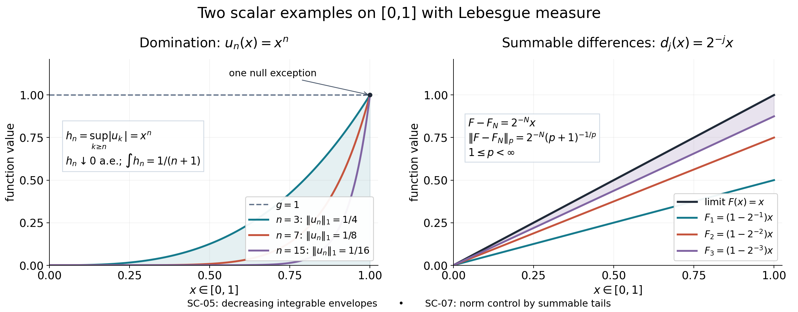

# Scalar measure, convergence and calculus

The scalar convergence theorems below hold on every measure space \((X,\Sigma,\mu)\). Neither completeness of the measure nor \(\sigma\)-finiteness, local finiteness, separability or a topology on \(X\) is assumed. A null exception means a subset of a **measurable** set of measure zero. Representatives are always measurable functions; altering a function arbitrarily on an unmeasurable subset of a null set is not part of our convention.

The earlier common foundation, [CF Section 1](OA-FLOW-CF.md#oa-flow.cf.1), supplies choice, compactness of closed bounded real intervals, boundedness and uniform continuity of continuous functions on such intervals, the real mean value theorem, and norm Riemann integrals of continuous functions with their fundamental theorem. Its elementary real and complex number conventions include order completeness of \(\mathbb R\), limits and the definition of derivative. All measure and \(L^p\) results used here are proved below. Inner products are linear in their first variable.

## SC-00. The elementary scalar operations

We first record a few consequences of those conventions so that the real exponents used in \(L^p\) do not introduce an additional calculus theorem.

**Lemma SC-00.** The chain rule holds for real differentiable functions, including at a point where the inner derivative is zero. For \(x>0\) and \(r\in\mathbb R\), real powers have the usual product laws and derivative
\[
\frac{d}{dx}x^r=rx^{r-1}.
\tag{SC-00a}
\]
For \(r>0\), \(x^r\) extends continuously to \(0\), with value \(0\).

**Proof.** Differentiability of \(F\) at \(y\) says
\(F(y+v)-F(y)=F'(y)v+v\varepsilon(v)\), where \(\varepsilon(v)\to0\), and we set \(\varepsilon(0)=0\). If \(G(t+h)-G(t)=G'(t)h+h\eta(h)\), substitute this increment for \(v\) and divide by \(h\). The increment tends to zero and its quotient by \(h\) is bounded, so the error tends to zero. This proves the chain rule without dividing by the increment. The product rule follows by adding and subtracting \(F(t+h)G(t)\); the derivative of \(1/x\) follows by subtracting its two fractions. Thus the elementary rules used below follow directly from difference quotients.

Let \(L(x)\) be the earlier continuous Riemann integral \(\int_1^x dt/t\), with oriented endpoints. Its fundamental theorem gives \(L'(x)=1/x\). The chain rule shows that \(L(xy)-L(y)\), as a function of \(y>0\) for fixed \(x>0\), has derivative zero. The mean value theorem and its value at \(y=1\) give \(L(xy)=L(x)+L(y)\). Also \(L\) is strictly increasing: its integral on a nonempty compact positive interval is at least the interval length divided by its right endpoint. In particular \(L(2)>0\), \(L(2^n)=nL(2)\), and \(L(2^{-n})=-nL(2)\).

A continuous function crossing a given value takes that value: bisect a closed interval whose endpoint values bracket it, retain a half still bracketing it, and use real completeness and continuity at the common limit. Applying this to \(L\) shows that it maps \((0,\infty)\) onto \(\mathbb R\). Its inverse \(E\) is continuous, since values between \(L(x-\epsilon)\) and \(L(x+\epsilon)\) have inverse values between \(x-\epsilon\) and \(x+\epsilon\). For \(y=L(x)\), the quotient for \(E\) is the reciprocal of the nonzero limiting quotient for \(L\); hence \(E'(y)=x=E(y)\). The product law for \(L\) gives \(E(s+t)=E(s)E(t)\). Define \(x^r=E(rL(x))\). The chain rule proves (SC-00a), and the product laws follow from the laws for \(L,E\). As \(x\downarrow0\), \(L(x)\to-\infty\); the inverse values \(E(t)\to0\) as \(t\to-\infty\), by strict monotonicity and the positive range. This proves the last assertion. \(\square\)

Ordinary nonnegative series below mean the supremum of their finite partial sums. A doubly indexed nonnegative series has the same value under diagonal enumeration: every finite set of indices lies in a finite rectangle, and every such rectangle lies in a finite initial segment of a suitable enumeration. This proves the regrouping fact used in outer-measure covers.

## SC-01. Outer measure and its measurable sets

A \(\sigma\)-algebra contains \(\varnothing\) and is closed under complements and countable unions. A measure on it is a function into \([0,\infty]\), zero on the empty set and countably additive on disjoint sequences. An outer measure \(m^*\) is defined on every subset of a set, is zero on the empty set, is monotone, and is countably subadditive.

**Theorem SC-01.** The sets \(E\) satisfying
\[
m^*(A)=m^*(A\cap E)+m^*(A\setminus E)\quad\text{for every subset }A
\tag{SC-01a}
\]
form a \(\sigma\)-algebra. The restriction of \(m^*\) to them is a complete measure. It suffices to check (SC-01a) for \(m^*(A)<\infty\).

**Proof.** Subadditivity always gives the inequality from left to right, so it remains to prove the reverse inequality. If \(m^*(A)=\infty\), subadditivity already forces the sum on the right to be infinite, proving the final assertion.

The empty set and complements satisfy the criterion. Splitting \(A\) successively by two measurable sets partitions it into four pieces, and gives its outer measure as the sum of the four outer measures. Three of these pieces cover the complement in \(A\) of the intersection of the two sets. Subadditivity therefore proves the reverse inequality for that intersection. Thus intersections, differences and finite unions preserve measurability.

For disjoint measurable \(E_j\), let \(E=\bigcup_jE_j\). Repeated finite splitting gives, for every \(n\),
\[
m^*(A)\ge \sum_{j=1}^n m^*(A\cap E_j)+m^*(A\setminus E).
\]
Taking the supremum over \(n\), and using subadditivity on \(A\cap E=\bigcup_j(A\cap E_j)\), gives the reverse inequality in (SC-01a) for \(E\). General countable unions reduce to disjoint ones by replacing the \(j\)-th set by its difference from the preceding finite union. For disjoint measurable \(E_j\), use \(A=E\) in the same estimate and then subadditivity to obtain \(m^*(E)=\sum_jm^*(E_j)\). Finally, if \(Z\) has outer measure zero, all its subsets do too. Removing any such subset from \(A\) does not change \(m^*(A)\), by monotonicity and subadditivity, so the subset satisfies the criterion and has measure zero. This is completeness. \(\square\)

## SC-02. Real-line Lebesgue measure, with its normalization

Define
\[
\ell^*(A)=\inf\left\{\sum_j(b_j-a_j):
       A\subseteq\bigcup_j[a_j,b_j),\quad a_j,b_j\in\mathbb R,\ a_j\le b_j\right\}.
\tag{SC-02a}
\]
Only countable covers are used; empty intervals allow finite covers. Every subset of \(\mathbb R\) has such a cover, for example by all integer unit intervals. Define Lebesgue measurable sets by the splitting criterion of SC-01, and write \(\ell\) for the resulting complete measure.

**Theorem SC-02.** Formula (SC-02a) is an outer measure. All Borel sets are Lebesgue measurable. Each bounded interval has measure equal to its length, regardless of endpoint inclusion. For \(c\ne0\) and \(t\in\mathbb R\),
\[
\ell^*(cA+t)=|c|\ell^*(A).
\tag{SC-02b}
\]
The affine image of a measurable set is measurable, and has the corresponding scaled measure. The Lebesgue \(\sigma\)-algebra is exactly the completion of the Borel measure.

**Proof.** The empty set and monotonicity are immediate from covers. For subadditivity, the assertion is automatic if the sum of the individual outer measures is infinite. Otherwise, for any \(\epsilon>0\), choose a cover of the \(j\)-th set within \(\epsilon2^{-j}\) of its outer measure. Enumerate all these intervals diagonally. They cover the union, their total length is at most the sum of the outer measures plus \(\epsilon\), and letting \(\epsilon\downarrow0\) proves subadditivity. Each singleton has outer measure zero, by covering it with \([x,x+\epsilon)\). Thus every countable set is null, and adding or deleting a countable set changes no outer measure.

Split each covering interval at a fixed \(d\). Its portions in \((-\infty,d)\) and \([d,\infty)\) are half-open intervals whose lengths sum to the original length. Taking infima of cover lengths gives
\(\ell^*(A)\ge\ell^*(A\cap(-\infty,d))+\ell^*(A\cap[d,\infty))\).
SC-01 proves that all these half-lines are measurable. Their generated \(\sigma\)-algebra contains open intervals, since closed half-lines are countable intersections of open half-lines. Every open subset of \(\mathbb R\) is a union of the rational-endpoint intervals contained in it, a countable family. Rational density follows from the Archimedean property by choosing \(n\) with \(1/n\) smaller than a prescribed interval length and then an integer grid point inside it. The Archimedean property follows from real completeness: a hypothetical supremum of the integers is contradicted by adding one. Consequently the generated \(\sigma\)-algebra contains all Borel sets.

The one-interval cover gives \(\ell^*([a,b))\le b-a\). Conversely, take any countable half-open cover of \([a,b)\), and fix \(\epsilon,\eta>0\) with \(\eta<b-a\). Enlarge its \(j\)-th interval to an open interval with added length at most \(\epsilon2^{-j}\). Compactness gives a finite subcover of \([a,b-\eta]\). For any finite interval cover of a closed interval, its summed lengths are at least that closed interval's length: partition the closed interval at all the finitely many covering endpoints lying in it. Each resulting open cell lies in a covering interval, because a midpoint does and no covering endpoint lies inside the cell. Assign each cell to one such interval; the cells assigned to an interval have total length at most its length. Summing proves the assertion. Our original cover therefore has total length at least \(b-a-\eta-\epsilon\). Let \(\eta,\epsilon\downarrow0\). Null endpoints now give every other bounded interval the same measure.

Translations and positive dilations send half-open covers to half-open covers, multiplying lengths by the dilation. Applying the same argument to the inverse affine map gives equality of outer measures. Reflection sends a half-open interval to an interval with the other endpoint convention; replacing it by a half-open interval changes only its endpoints. The total endpoint set of a countable cover is null, so reflection preserves the outer measure, again using its inverse. This proves (SC-02b). For \(T(x)=cx+t\), apply the splitting criterion for \(E\) to \(T^{-1}A\) and multiply by \(|c|\). Formula (SC-02b) then proves the criterion for \(T(E)\), including infinite outer measures.

For completeness of the Borel description, first let \(E\) be Lebesgue measurable with finite measure. Choose a half-open cover of \(E\) of total length less than \(\ell(E)+1/n\); its union \(B_n\) is Borel. The Borel set \(B=\bigcap_nB_n\) contains \(E\) and has measure \(\ell(E)\), by monotonicity and the cover bound. Splitting \(B\) by \(E\) shows \(\ell(B\setminus E)=0\), since \(\ell(B)<\infty\). Every outer-null set has a Borel null superset: choose cover unions of length less than \(1/n\) and intersect them. Thus \(E\) differs from a Borel set by a subset of a Borel null set. For arbitrary \(E\), do this for \(E\cap[-n,n]\), then take the unions of the resulting Borel supersets and null supersets. Conversely all Borel sets and all subsets of Borel null sets are measurable by SC-01, so the completion is contained in our \(\sigma\)-algebra. \(\square\)

## SC-03. Measurability and simple integration

A real extended function is measurable when its superlevel sets are measurable; equivalently its inverse images of Borel sets in the extended line are measurable. The equivalence follows by complements and countable unions of rational-endpoint intervals, as in SC-02. A complex function is measurable when its real and imaginary parts are.

**Lemma SC-03.** Countable suprema, infima and pointwise limits of measurable real extended functions are measurable. Finite sums, products, absolute values and continuous scalar compositions of finite measurable functions are measurable. Every nonnegative measurable \(f\), possibly infinite, has an increasing sequence of finite-valued nonnegative simple functions tending to it.

**Proof.** For suprema, \(\{\sup_jf_j>a\}=\bigcup_j\{f_j>a\}\). Infima reduce to suprema of negatives; upper and lower limits reduce to these two operations. For a finite list of finite real functions, inverse images of rational open boxes are measurable intersections. Any open set in its Euclidean target is a countable union of rational boxes. Therefore continuous functions of the list are measurable, proving the finite scalar assertions, including complex sums and modulus. Nonnegative extended sums are increasing limits of the sums of the truncations.

An explicit simple approximation is
\[
s_n(x)=2^{-n}\left\lfloor2^n\min(f(x),n)\right\rfloor .
\tag{SC-03a}
\]
Its level sets are measurable, its range is finite, it is below \(f\), and it increases: the truncation level increases and the grid at stage \(n+1\) refines the grid at stage \(n\). At a finite value its error is eventually less than \(2^{-n}\); at an infinite value it equals \(n\). Hence \(s_n\uparrow f\). \(\square\)

For a finite-valued nonnegative simple function, write it on a finite disjoint measurable partition as \(s=\sum_{j=1}^ka_j1_{A_j}\), and define
\[
I(s)=\sum_{j=1}^ka_j\mu(A_j),\qquad 0\cdot\infty=0.
\tag{SC-03b}
\]
Refining two partitions by all their intersections proves independence of the presentation, because measure is finitely additive. The same refinement proves additivity, positive homogeneity and monotonicity for simple functions. For nonnegative measurable \(f\), define
\[
\int f\,d\mu=\sup\{I(s):s\text{ finite-valued nonnegative simple},\ s\le f\}.
\tag{SC-03c}
\]
This is monotone and homogeneous under positive finite scalars; for scalar zero the integral is zero.

If \(N\in\Sigma\) has measure zero, every simple function supported on \(N\) has integral zero. If \(f\) is replaced by zero on \(N\), any simple function below \(f\) may likewise be replaced by zero there without changing its integral. Thus (SC-03c) is unchanged by modifications on measurable null sets. In particular all a.e. arguments below can be carried out after making a common measurable null set zero.

## SC-04. Continuity of measure and monotone convergence

**Theorem SC-04.** Increasing measurable sets satisfy
\(\mu(\bigcup_nA_n)=\lim_n\mu(A_n)\). Decreasing measurable sets satisfy
\(\mu(\bigcap_nA_n)=\lim_n\mu(A_n)\) when \(\mu(A_1)<\infty\).
If \(0\le f_n\uparrow f\) a.e., with all functions measurable, then
\[
\int f\,d\mu=\lim_n\int f_n\,d\mu.
\tag{SC-04a}
\]
Integration is additive for nonnegative measurable functions, and
\[
\int\sum_jh_j\,d\mu=\sum_j\int h_j\,d\mu\quad(h_j\ge0).
\tag{SC-04b}
\]

**Proof.** Decompose an increasing union into its first set and successive differences; countable additivity gives continuity from below. For a decreasing sequence subtract the increasing complements inside \(A_1\) from its finite measure. This proves continuity from above, and explains the finite-measure condition.

In (SC-04a), remove one measurable null set containing all failures of the inequalities and the convergence, and make the functions zero there. Let \(L=\lim_n\int f_n\le\int f\). Take any simple \(s=\sum_ja_j1_{A_j}\le f\) on a disjoint finite partition, and \(0<\theta<1\). The sets \(D_n=\{f_n\ge\theta s\}\) increase and contain every point eventually where \(s>0\). Consequently \(\mu(A_j\cap D_n)\uparrow\mu(A_j)\) for every \(a_j>0\). Since \(f_n\ge\theta s1_{D_n}\),
\[
L\ge\theta\sum_ja_j\mu(A_j).
\]
This is valid for infinite sums as well: a positive coefficient times an infinite limiting measure makes the lower bounds unbounded. Let \(\theta\uparrow1\), then take the supremum over \(s\) in (SC-03c). This gives \(L\ge\int f\).

Apply (SC-03a) to two functions \(f,g\). Their simple approximants \(s_n,t_n\) have \(s_n+t_n\uparrow f+g\). The simple-function additivity and (SC-04a) prove \(\int(f+g)=\int f+\int g\), including infinite values. Apply this to finite partial sums and use (SC-04a) again to obtain (SC-04b). \(\square\)

For a nonnegative function and \(a>0\), monotonicity gives the useful bound
\[
\mu(\{f>a\})\le a^{-1}\int f\,d\mu.
\tag{SC-04c}
\]
Indeed \(a1_{\{f>a\}}\le f\). If the integral is finite, \(\{f=\infty\}\) is measurable and null, by applying this bound to arbitrarily large \(a\). If the integral is zero, every \(\{f>1/n\}\) is null, so \(f=0\) a.e.

## SC-04M. Nonatomic Borel splitting and small positive sets

**Lemma SC-04M.** Let \(\mu\) be a finite measure on the Borel sigma-algebra \(\mathcal B\) of \(X\). A *measure atom* is a Borel set \(A\) with \(\mu(A)>0\) such that every Borel \(D\subset A\) has measure either zero or \(\mu(A)\). Suppose \(\mu\) has no measure atoms. Then every positive Borel \(A\) has a Borel subset \(D\) such that both \(D\) and \(A\setminus D\) have positive measure. For every \(a>0\), that same \(A\) contains a Borel \(E\) with \(0<\mu(E)<a\).

**Proof.** A positive \(A\) is not an atom, so there is a Borel \(D\subset A\) with \(\mu(D)\notin\{0,\mu(A)\}\). Monotonicity and finiteness give \(0<\mu(D)<\mu(A)\). Finite additivity gives \(\mu(A\setminus D)=\mu(A)-\mu(D)>0\), proving the splitting assertion.

Put \(E_0=A\). At each step apply that assertion to \(E_k\), and take as \(E_{k+1}\) whichever of its two positive Borel parts has the smaller measure. Then \(E_{k+1}\subset E_k\) is Borel and
\[
0<\mu(E_{k+1})\le\tfrac12\mu(E_k),\qquad
0<\mu(E_k)\le2^{-k}\mu(A).
\]
Choose a finite integer \(N\) with \(2^{-N}\mu(A)<a\). The positive Borel set \(E_N\) has the required measure. No infinite intersection or exact bisection theorem is used. \(\square\)

If nonatomicity is given for the completed measure, the Borel restriction also has no atoms. Indeed, by the definition of completion every completed-measurable subset of a Borel set \(A\) differs from a Borel subset of \(A\) by a subset of a Borel null set: take a Borel representative and intersect it with \(A\). The representative has the same measure. Consequently a Borel atom would remain an atom after completion. The same representative construction turns a positive proper completed-measurable split of \(A\) into a Borel split with the same two positive masses.

## SC-05. Complex integration, Fatou and dominated convergence

A finite real measurable \(u\) is integrable if \(\int|u|<\infty\), and its integral is \(\int u_+-\int u_-\). A finite complex measurable \(u\) is integrable if \(\int|u|<\infty\), and its integral is the integral of its real part plus \(i\) times that of its imaginary part.

**Lemma SC-05.** Integrable functions form a complex vector space; integration is complex linear and
\[
\left|\int u\,d\mu\right|\le\int|u|\,d\mu.
\tag{SC-05a}
\]
For nonnegative measurable \(f_n\),
\[
\int\liminf_nf_n\,d\mu\le\liminf_n\int f_n\,d\mu.
\tag{SC-05b}
\]
If measurable complex \(u_n\to u\) a.e. and \(|u_n|\le g\) a.e. for a nonnegative measurable \(g\) with finite integral, then \(u,u_n\) are integrable and
\[
\int|u_n-u|\,d\mu\longrightarrow0,\qquad
\int u_n\,d\mu\longrightarrow\int u\,d\mu.
\tag{SC-05c}
\]

**Proof.** Nonnegative additivity proves signed linearity: the identity
\[
(u+v)_++u_-+v_-=(u+v)_-+u_++v_+
\]
has nonnegative integrable terms, so their integral identity may be rearranged. Positive homogeneity and \((-u)_+=u_-\) give real scalar linearity. Apply this to real and imaginary parts to get complex linearity. Closure under addition and scalars follows from \(|u+v|\le|u|+|v|\). If \(\int u\ne0\), multiply \(u\) by a unit complex scalar so that its integral is the nonnegative number \(|\int u|\); the integral of its real part is at most \(\int|u|\). If the integral is zero, the inequality is immediate. This proves (SC-05a).

For (SC-05b), the measurable functions \(v_k=\inf_{n\ge k}f_n\) increase to \(\liminf f_n\). Also \(\int v_k\le\inf_{n\ge k}\int f_n\). Monotone convergence proves the inequality.

For (SC-05c), take the countable union of the measurable null exceptions and the measurable null set where \(g=\infty\), and set everything zero there. Then \(|u|\le g<\infty\) everywhere. Put \(e_n=|u_n-u|\) and \(h_k=\sup_{n\ge k}e_n\). These are measurable, \(0\le h_k\le2g\), and \(h_k\downarrow0\). Thus \(2g-h_k\uparrow2g\). Monotone convergence and nonnegative additivity give
\[
\int h_k=2\int g-\int(2g-h_k)\longrightarrow0.
\]
All subtractions are between finite numbers. For \(n\ge k\), \(\int e_n\le\int h_k\), proving the first limit. Inequality (SC-05a) and linearity give the second. If only the a.e. limit is specified, define it to be zero on the measurable null exceptional set; SC-03 proves that this representative is measurable. \(\square\)

## SC-06. Hölder and Minkowski on every measure space

For \(1\le p<\infty\), \(L^p(\mu)\) consists of finite measurable complex functions with \(\int|f|^p<\infty\), modulo a.e. equality. Put \(\|f\|_p=(\int|f|^p)^{1/p}\). For \(p=\infty\), use the same measurable representatives, with
\[
\|f\|_\infty=\inf\{M\ge0:|f|\le M\text{ a.e.}\}.
\]
If this infimum is finite, the bound holds at the infimum: intersect the full-measure bounds at \(\|f\|_\infty+1/n\). All those exceptions lie in one measurable null set.

**Theorem SC-06.** If \(1/p+1/q=1\), allowing \(p=1,q=\infty\) and the reverse pair, then
\[
\int|fg|\,d\mu\le\|f\|_p\|g\|_q.
\tag{SC-06a}
\]
For every \(1\le p\le\infty\),
\[
\|f+g\|_p\le\|f\|_p+\|g\|_p.
\tag{SC-06b}
\]
The indicated quotient spaces are normed complex vector spaces.

**Proof.** For \(1<p<\infty\) and \(q=p/(p-1)\), the function
\(a\mapsto a^p/p-ab+b^q/q\) has derivative \(a^{p-1}-b\) on \(a>0\), by SC-00. For \(b>0\) it decreases up to \(a=b^{1/(p-1)}\), then increases, by the mean value theorem. Its value there is zero. Continuity at zero, and the immediate case \(b=0\), therefore prove
\[
ab\le a^p/p+b^q/q\quad(a,b\ge0).
\tag{SC-06c}
\]
Normalize \(f,g\) by their positive norms, integrate (SC-06c), then multiply back. If either norm is zero, that function is zero a.e. by (SC-04c) applied to its power, so the product is zero a.e. The endpoint case follows from \(|fg|\le\|g\|_\infty|f|\) off a measurable null set. This proves (SC-06a) for all functions in the stated spaces.

For finite \(p\), first \(|f+g|^p\le2^p(|f|^p+|g|^p)\), so \(f+g\) belongs to \(L^p\) before any division by its norm. For \(1<p<\infty\), set \(w=|f+g|\). Pointwise,
\[
w^p\le (|f|+|g|)w^{p-1}.
\]
The function \(w^{p-1}\) belongs to \(L^q\) and has norm \(\|w\|_p^{p-1}\), since \((p-1)q=p\). Hölder gives
\(\|w\|_p^p\le(\|f\|_p+\|g\|_p)\|w\|_p^{p-1}\).
Divide when \(\|w\|_p>0\); when it is zero the assertion already holds. For \(p=1\), integrate the pointwise triangle inequality. For \(p=\infty\), use the two attained essential bounds off their common measurable null set. Homogeneity follows from the integral definition or the essential bounds. For finite \(p\), zero norm implies a.e. zero by (SC-04c); for \(p=\infty\), intersect the bounds at \(1/n\). These facts also show that the operations and norms are independent of representatives. \(\square\)

## SC-07. Completeness, simple approximation and \(L^2\)

**Theorem SC-07.** Every \(L^p(\mu)\), \(1\le p\le\infty\), is complete. For \(p<\infty\), simple functions supported on measurable sets of finite measure are dense. Every such \(f\) has a representative vanishing outside a \(\sigma\)-finite measurable carrier. Finally
\[
\langle f,g\rangle=\int f\overline g\,d\mu
\tag{SC-07a}
\]
makes \(L^2(\mu)\) a Hilbert space.

**Proof.** Let \((f_n)\) be Cauchy in \(L^p\). Choose a subsequence with
\(\|f_{n_{j+1}}-f_{n_j}\|_p\le2^{-j}\), and choose measurable representatives. For \(p<\infty\), put \(d_j=|f_{n_{j+1}}-f_{n_j}|\). For any \(k\le N\), Minkowski gives
\[
\left\|\sum_{j=k}^Nd_j\right\|_p\le\sum_{j=k}^N2^{-j}.
\]
The finite sums increase, so SC-04 applied to their \(p\)-th powers gives
\[
\int\left(\sum_{j=k}^\infty d_j\right)^p\,d\mu
 \le\left(\sum_{j=k}^\infty2^{-j}\right)^p.
\tag{SC-07b}
\]
In particular \(\sum_jd_j<\infty\) outside a measurable null set, by (SC-04c). At those points the complex sequence \(f_{n_j}(x)\) is Cauchy and has a finite limit, since an absolutely summable sequence of differences is Cauchy in the complete scalar field. Define \(f=0\) on that measurable null set. The limit is measurable by SC-03, and
\[
|f-f_{n_k}|\le\sum_{j=k}^\infty d_j\quad\text{a.e.}
\]
Thus \(f-f_{n_k}\in L^p\) and its norm is at most \(2^{1-k}\). In particular \(f\in L^p\), by Minkowski with one \(f_{n_k}\), and the subsequence converges to it.

For \(p=\infty\), remove the countable union of the measurable null sets on which the attained bounds
\(|f_{n_{j+1}}-f_{n_j}|\le2^{-j}\) fail, together with one null set outside which the first representative is bounded. The subsequence converges uniformly on the remaining set, with the same tail bound \(2^{1-k}\). Its finite bounded limit, set zero on the removed measurable set, is measurable and belongs to \(L^\infty\). Hence the subsequence converges in this norm as well. In both cases, the original Cauchy sequence converges: for a prescribed \(\epsilon>0\), choose a convergent subsequence term beyond the Cauchy index and with distance less than \(\epsilon\) from the limit, then apply the triangle inequality.

For simple density when \(p<\infty\), put
\(A_k=\{1/k<|f|\le k\}\). These sets increase, have
\(\mu(A_k)\le k^p\|f\|_p^p<\infty\), and exhaust \(\{f\ne0\}\), for finite representatives. Dominated convergence applied to \(|f|^p1_{X\setminus A_k}\), dominated by \(|f|^p\), shows \(f1_{A_k}\to f\) in \(L^p\). On \(A_k\), round both real coordinates of \(f\) to a finite square grid of mesh \(\delta\), and set the result zero off \(A_k\). This is a finite-valued measurable simple function \(s\) with
\(\|s-f1_{A_k}\|_p\le\sqrt2\,\delta\,\mu(A_k)^{1/p}\).
First choose \(k\) and then \(\delta\); if \(\mu(A_k)=0\), the zero function already suffices. Also the sets \(\{|f|>1/k\}\) have finite measure and their union is \(\{f\ne0\}\), proving the carrier assertion.

Hölder with \(p=q=2\) ensures the integral in (SC-07a) is finite. Complex linearity, conjugate symmetry and positivity follow from SC-05 and pointwise conjugation; conjugation commutes with integration by its real-imaginary definition. The norm squared is exactly \(\int|f|^2\), and is zero only for the zero a.e. class. The already proved \(L^2\) completeness gives the Hilbert assertion. No basis, projection, tensor or spectral theorem is needed. \(\square\)

**Example SC-07.** On an uncountable set with the full power-set \(\sigma\)-algebra and counting measure, the space is not \(\sigma\)-finite, since finite-measure sets are finite and countable unions of them are countable. Every finite-\(p\) function nevertheless has countable support: each \(\{|f|>1/k\}\) is finite. All the preceding convergence and completeness results apply. The constant function \(1\) belongs to \(L^\infty\) and has an uncountable, non-\(\sigma\)-finite support, so the carrier assertion was correctly restricted to finite \(p\).

## SC-08. The continuous real-line integral and oriented substitution

**Theorem SC-08.** For a continuous complex function \(h\) on \([a,b]\), \(a<b\), its Lebesgue integral agrees with its Riemann integral. If \(H\) is continuously differentiable on that interval, with one-sided derivatives at endpoints, then
\[
\int_a^bH'(x)\,dx=H(b)-H(a).
\tag{SC-08a}
\]
If \(\phi:[a,b]\to\mathbb R\) is continuously differentiable, and \(h\) is continuous on a compact interval containing its image, then
\[
\int_a^b h(\phi(x))\phi'(x)\,dx
       =\int_{\phi(a)}^{\phi(b)}h(y)\,dy.
\tag{SC-08b}
\]
Endpoints on the right are oriented; \(\phi\) need not be injective or monotone. If \(H\in C^1(\mathbb R)\) has compact support, then \(\int_{\mathbb R}H'=0\).

**Proof.** For a real continuous \(h\), uniform continuity makes its oscillation on intervals of a partition tend uniformly to zero as the mesh tends to zero. The step functions using the minimum and maximum on each partition interval bound \(h\), up to finitely many null endpoints, and their integral difference is at most \((b-a)\) times that oscillation. Their integrals are precisely the lower and upper Riemann sums by the interval normalization in SC-02. These squeeze both the Lebesgue integral and the Riemann sums to the same number. Apply this to both coordinates for complex \(h\). Finiteness follows from boundedness and the finite interval length.

For real \(H\), the mean value theorem on each partition interval provides an interior point \(c_j\) with
\[
H(x_j)-H(x_{j-1})=H'(c_j)(x_j-x_{j-1}).
\]
Sum and pass to the limit through the Riemann sums for the continuous derivative. This proves (SC-08a). Treat the real and imaginary parts separately for complex \(H\).

Fix a point \(y_0\) in the interval containing \(\phi([a,b])\), and set \(P(y)=\int_{y_0}^yh\), using oriented integrals. The quotient
\([P(y+v)-P(y)]/v\) differs from \(h(y)\) in modulus by at most the oscillation of \(h\) between \(y\) and \(y+v\). Thus \(P'=h\), with the appropriate one-sided endpoint values. The chain rule SC-00 and (SC-08a) applied to \(P\circ\phi\) prove (SC-08b). One can enlarge the interval slightly and extend \(h\) constantly past either endpoint if an ordinary two-sided derivative is desired there. The extension agrees with all the integrands at issue. For compactly supported \(H\), choose a closed interval whose interior contains its support. Off it \(H'\) is zero, and its two endpoint values are zero, so (SC-08a) gives the final assertion. \(\square\)

## SC-09. Differentiation of scalar integrals under domination

**Theorem SC-09.** Let \(t_0\) be an interior point of a real interval. For every \(t\) near \(t_0\), let \(u(t,\cdot)\) be a finite measurable complex function on the arbitrary measure space \((X,\Sigma,\mu)\). Assume \(u(t_0,\cdot)\) is integrable, the pointwise derivative \(v(x)=\partial_tu(t_0,x)\) exists outside a measurable null set, and for some nonnegative integrable \(g\) and every sufficiently small nonzero real \(h\),
\[
\left|\frac{u(t_0+h,x)-u(t_0,x)}{h}\right|\le g(x)
\quad\text{for a.e. }x.
\tag{SC-09a}
\]
The bound may have a different measurable null exception for each \(h\). Then all nearby \(u(t,\cdot)\) are integrable, the derivative has a measurable integrable representative, and
\[
\left.\frac{d}{dt}\int_Xu(t,x)\,d\mu(x)\right|_{t=t_0}
       =\int_Xv(x)\,d\mu(x).
\tag{SC-09b}
\]

**Proof.** Inequality (SC-09a) and
\(|u(t_0+h)|\le|u(t_0)|+|h|g\) prove integrability for each such \(h\). Choose a sequence of nonzero \(h\)'s tending to zero. Its measurable difference quotients converge to the pointwise derivative outside the given measurable null set; setting the limit zero there gives a measurable representative by SC-03. Intersecting the full-measure bounds for this sequence gives \(|v|\le g\) a.e., hence integrability.

For any sequence \(h_n\ne0\) tending to zero, remove the countably many null exceptions for its bounds and the null exception for the derivative. SC-05 applied to its difference quotients proves that their integrals tend to \(\int v\). By linearity these are exactly the difference quotients of the displayed scalar integral. A complex-valued function of a real variable has a limit if every sequence tending to that point has that limit: if the limit condition failed, choose for each \(n\) a point at distance less than \(1/n\) where the error is at least one fixed positive number. This would be a contradicting sequence. Thus the difference-quotient limit exists, proving (SC-09b). \(\square\)

## SC-10. What the convergence estimates show

On the left the domain is \([0,1]\) with the Lebesgue measure of SC-02. The functions \(u_n(x)=x^n\) tend to zero a.e., are dominated by \(g=1\), and have \(L^1\) norms \(1/(n+1)\). Their decreasing tail envelope is \(x^n\), so SC-05 applies directly. The endpoint \(x=1\) is one null exception. On the right the differences \(d_j(x)=2^{-j}x\), \(j\ge1\), sum to \(x\). Their partial sums \(F_N=(1-2^{-N})x\) have exact errors
\[
\|x-F_N\|_p=2^{-N}(p+1)^{-1/p}\quad(1\le p<\infty).
\tag{SC-10a}
\]
This is a concrete instance of the summable-difference mechanism in SC-07. These pictures illustrate two examples on one finite interval; the theorems were proved on arbitrary measure spaces. Their coordinates, functions and integral values are reproduced by the original [figure source](../assets/scalar-foundation/render_figures.py) and [exact figure data](../assets/scalar-foundation/assets/figure-data.json).

The new prose, proofs, figure and reproduction code are dedicated under CC0-1.0. The free references below are mathematical comparison sources, each with its own rights; their source files are not part of this dedication. Every result asserted above has a proof here or the specifically declared earlier common foundation.

**Free author materials.** Sheldon Axler, [*Measure, Integration & Real Analysis*](https://measure.axler.net/MIRA.pdf), author PDF of 12 June 2026: outer measure and interval normalization, §2A, results 2.2–2.14; monotone convergence, 3.11; dominated convergence, 3.31; Young, Hölder, Minkowski and completeness, 7.8–7.9, 7.14, 7.20–7.24. Its omitted endpoint cases and exercises are proved here. Jiří Lebl, [*Basic Analysis I*](https://www.jirka.org/ra/realanal.pdf), version 6.3, 15 May 2026: chain rule, Proposition 4.1.10; fundamental theorem and oriented change of variables, Theorems 5.3.1, 5.3.3 and 5.3.5. The outer-measure splitting theorem, arbitrary-space complex convergence route and the additional null-set details above are independently expressed first-principles arguments, rather than imported theorems.
