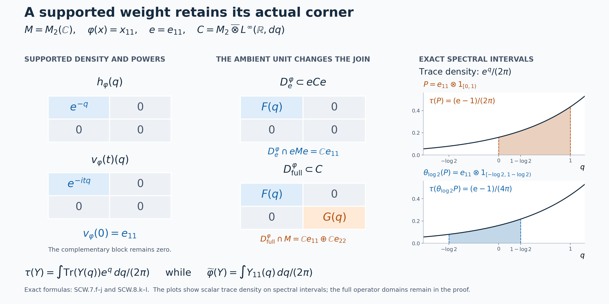

# Supported weights and their coordinates in the continuous core

*Self-checked by the writing AI. Original exposition and illustration sources: CC0-1.0; earlier and font components retain their recorded terms.*

A weight can vanish on a nonzero corner. Its imaginary powers then form a unitary group only on its support, and their value at time zero is that support projection. We construct these powers by a faithful completion, prove that the completion disappears from the answer, and recover both the weight and the core of its support from them. This also determines exactly which commutant belongs to the support corner and which extra block appears in the whole algebra.

## Weights, supports and normalizations

Let \(M\) be an arbitrary von Neumann algebra. Its intrinsic core \(C=C(M)\), coefficient inclusion, dual flow \(\theta\), canonical trace \(\tau\), and whole-cone operator-valued weight \(T\) are constructed in [CORE, Sections 1–8](OA-FLOW-CORE.md#core-7). We identify \(M\) with its coefficient image. Original Haar measure is \(dt\); dual Haar measure is \(ds/(2\pi)\), and the dual character is \(e^{-ist}\). Thus
\[
 C^\theta=M,\qquad \tau\circ\theta_s=e^{-s}\tau.
\]
These are the full [fixed-algebra theorem](OA-FLOW-DA.md#da-fixed) and the normalized trace identity, without factor or countability assumptions.

Throughout, \(\varphi\) is a **normal semifinite weight**, not necessarily faithful, and \(e=s(\varphi)\) is its support. [NWR1 and NWR4](OA-FLOW-NWR.md#nwr-1) prove that \(\varphi(x)=\varphi(exe)\) for \(x\ge0\), and that its restriction \(\varphi_e\) to \(eMe\) is faithful normal semifinite. We write \(M_\varphi=(eMe)_{\varphi_e}\). All corner identities are their support projections. The zero weight, with \(e=0\), is included: its corner is the zero algebra. There is no separability assumption on a faithful representation and no assumption that \(\varphi(e)<\infty\).

Its dual weight is
\[
 \widetilde\varphi(X)=\widehat\varphi(T(X)),\qquad X\in C_+.
\]
The hat is the normal extension to the extended positive cone proved in [EP5](OA-FLOW-EP.md#oa-flow.ep.5). Equalities of weights below include every infinite value. For a positive selfadjoint affiliated operator \(h\) which may have a kernel, its imaginary powers mean the powers on its support, extended by zero on the kernel. In particular \(h^{i0}=s(h)\) in this supported notation. Ordinary spectral calculus at the point zero is not being assigned the value one.

## 1. A faithful completion constructs powers on the support

Choose a faithful normal semifinite weight \(\chi\) on \((1-e)M(1-e)\), using [FR1](OA-FLOW-FR.md#oa-flow.fr.1), and put
\[
 \omega(x)=\varphi(exe)+\chi((1-e)x(1-e)),\qquad x\in M_+.
 \tag{SCW.1.a}
\]
If a corner is zero, omit its summand. The orthogonal completion in [NWR4](OA-FLOW-NWR.md#nwr-4) proves that \(\omega\) is faithful normal semifinite and that \(e\in M_\omega\). In particular it does not use an intersection of unrelated finite ideals. The [centralizer-corner theorem](OA-FLOW-CZ.md#oa-flow.cz.5) gives
\[
 \sigma_t^\omega|_{eMe}=\sigma_t^{\varphi_e}.
 \tag{SCW.1.b}
\]

In the \(\omega\)-chart the core contains the positive nonsingular generator \(h_\omega\), with \(h_\omega^{it}=\lambda^\omega(t)\). The fixedness of \(e\) makes it commute with every \(\lambda^\omega(t)\), hence with the spectral projections of \(h_\omega\), by the [spectral-generator theorem](OA-FLOW-RF.md#oa-flow.rf.5). Define
\[
 h_\varphi=(h_\omega|_{eH})\oplus0_{(1-e)H},\qquad
 v_\varphi(t)=e h_\omega^{it}.
 \tag{SCW.1.c}
\]
Here \(H\) is any faithful normal representation space of the core. The operator domain is \((D(h_\omega)\cap eH)\oplus(1-e)H\); the two reducing summands show directly that it is positive selfadjoint, affiliated with \(C\), and has support \(e\). The family \(v_\varphi\) is strongly-star continuous, with
\[
 v_\varphi(t)v_\varphi(u)=v_\varphi(t+u),\quad
 v_\varphi(t)^*=v_\varphi(-t),\quad
 v_\varphi(0)=e.
 \tag{SCW.1.d}
\]

We prove independence from \(\chi\) before using this notation intrinsically. Fix any faithful normal semifinite reference \(\eta\) on \(M\), and write
\[
 a(t)=(D\omega:D\eta)_t,\qquad u_\varphi^\eta(t)=ea(t).
 \tag{SCW.1.e}
\]
The [faithful transition theorem](OA-FLOW-CORE.md#core-5) identifies (SCW.1.c) in the \(\eta\)-chart as
\[
 v_\varphi(t)=u_\varphi^\eta(t)h_\eta^{it}.
 \tag{SCW.1.f}
\]
All coefficient images in this equation use the fixed inclusion of \(M\).

To see why \(ea(t)\) is independent of the completion, take the balanced faithful weight
\(\Gamma(X)=\omega(x_{11})+\eta(x_{22})\) on \(M_2(M)\), as constructed in [BC1](OA-FLOW-BC.md#oa-flow.bc.1). The projection \(p=\operatorname{diag}(e,1)\) is modular-fixed, by [BC3](OA-FLOW-BC.md#oa-flow.bc.3) and \(e\in M_\omega\). Its restricted weight is
\[
 \Gamma^p(X)=\varphi(x_{11})+\eta(x_{22}),\qquad X\in(pM_2(M)p)_+,
 \tag{SCW.1.g}
\]
which is independent of \(\chi\). [CZ5](OA-FLOW-CZ.md#oa-flow.cz.5) identifies its modular group with the restriction of that of \(\Gamma\). The off-diagonal formula in [BC4](OA-FLOW-BC.md#oa-flow.bc.4), with the indices in the indicated order, gives
\[
 \sigma_t^{\Gamma^p}(eE_{12})=ea(t)E_{12}.
 \tag{SCW.1.h}
\]
Indeed \(\sigma_t^\Gamma(E_{12})=a(t)E_{12}\), and the left support \(eE_{11}\) is fixed. The left side of (SCW.1.h) depends only on (SCW.1.g). Thus \(u_\varphi^\eta(t)\), and consequently \(v_\varphi(t)\), are independent of \(\chi\). Uniqueness of the spectral generator of the group on \(eH\) gives the same assertion for \(h_\varphi\). The chart maps in CORE5–7 identify each construction, so changing \(\eta\) does not change this intrinsic operator either.

The coefficient family is a partial cocycle with different initial and final supports:
\[
 \begin{aligned}
 u_\varphi^\eta(t)u_\varphi^\eta(t)^*&=e,&
 u_\varphi^\eta(t)^*u_\varphi^\eta(t)&=\sigma_t^\eta(e),\\
 u_\varphi^\eta(t+u)&=u_\varphi^\eta(t)\sigma_t^\eta(u_\varphi^\eta(u)).
 \end{aligned}
 \tag{SCW.1.i}
\]
For the initial support use \(a(t)\sigma_t^\eta(e)a(t)^*=\sigma_t^\omega(e)=e\). For the last identity substitute \(ea(t)\), insert \(\sigma_t^\eta(e)\), and use the faithful cocycle law. Thus \(v_\varphi\) is a group in the core corner, while its coefficient in a general faithful chart is a partial cocycle. If \(\varphi=0\), every displayed supported operator is zero, independently of the faithful completion on \(M\).

## 2. The density represents the whole dual weight

The faithful chart gives, for \(x\in eMe\),
\[
 v_\varphi(t)xv_\varphi(t)^*=\sigma_t^{\varphi_e}(x),\qquad
 \theta_s(v_\varphi(t))=e^{-ist}v_\varphi(t),\qquad
 \theta_s(h_\varphi)=e^{-s}h_\varphi.
 \tag{SCW.2.a}
\]
The first identity is (SCW.1.b); the second is the dual action on \(\lambda^\omega(t)\) and fixedness of \(e\). On \(eH\) the second identity identifies all imaginary powers of the third, so spectral uniqueness proves it; both sides vanish on the complementary summand.

For \(h\ge0\) affiliated with a semifinite traced algebra define, as in [TD2](OA-FLOW-TD.md#td-2),
\[
 \tau_h(X)=\sup_{\varepsilon>0}
 \tau\bigl(h_\varepsilon^{1/2}Xh_\varepsilon^{1/2}\bigr),\qquad
 h_\varepsilon=h(1+\varepsilon h)^{-1}.
 \tag{SCW.2.b}
\]
The supremum means the increasing limit as \(\varepsilon\downarrow0\); monotonicity of these scalar trace values follows from the tracial identity with \(X^{1/2}h_\varepsilon X^{1/2}\). It does not assert operator monotonicity of the sandwiched expressions as written.

We claim the normalized whole-cone identity
\[
 \widetilde\varphi(X)=\tau_{h_\varphi}(X)\qquad(X\in C_+).
 \tag{SCW.2.c}
\]
By the full bimodule identity for \(T\), and [EP5](OA-FLOW-EP.md#oa-flow.ep.5)'s extension under compression,
\[
 \widetilde\varphi(X)=\widehat\omega(eT(X)e)
 =\widetilde\omega(eXe).
 \tag{SCW.2.d}
\]
The faithful identity \(\widetilde\omega=\tau_{h_\omega}\) is proved in [CORE2](OA-FLOW-CORE.md#core-2). Put \(b_\varepsilon=h_\omega(1+\varepsilon h_\omega)^{-1}\). Since \(e\) commutes with this operator, the bounded cutoff of \(h_\varphi\) is \(eb_\varepsilon\), and
\[
 \tau(b_\varepsilon^{1/2}eXe b_\varepsilon^{1/2})
 =\tau((eb_\varepsilon)^{1/2}X(eb_\varepsilon)^{1/2}).
 \tag{SCW.2.e}
\]
Taking the same increasing scalar limit in (SCW.2.e) proves (SCW.2.c). This proof retains infinite values; it never cancels or subtracts them. [NWR4](OA-FLOW-NWR.md#nwr-4) proves that this dual is normal semifinite. Its support is \(e\): its restriction to \(eCe\) has the faithful nonsingular density \(h_\varphi|_{eH}\) against the restricted faithful trace, and it vanishes on \(1-e\). Equivalently, use the kernel statement in [TD6](OA-FLOW-TD.md#td-6). No trace-measurability assumption on the affiliated density is made.

## 3. The support corner is exactly the core of the supported algebra

For \(e\ne0\) there is a normal isomorphism with normal inverse
\[
 \begin{aligned}
 K_\varphi:C_{\varphi_e}(eMe)&\longrightarrow eC(M)e,\\
 \pi_{\varphi_e}(x)&\longmapsto x,\\
 \lambda_{\varphi_e}(t)&\longmapsto v_\varphi(t).
 \end{aligned}
 \tag{SCW.3.a}
\]
Here \(C_{\varphi_e}\) is a faithful-weight chart for the algebra \(eMe\). We prove both normality and surjectivity, not just the relations between the proposed generators.

Use the \(\omega\)-chart on \(L^2(\mathbb R,H_M)\), with \(M\) faithfully normally represented on an arbitrary \(H_M\). Since \(e\in M_\omega\), its coefficient field is the constant projection \(e\). Its range is \(L^2(\mathbb R,eH_M)\). The representation of \(eMe\) on \(eH_M\) is faithful and normal: a corner element vanishing there vanishes on both summands of \(H_M\), and increasing bounded positive nets remain strongly convergent upon restriction. On this range the compressed fields are
\[
 [\pi_\omega(x)\xi](r)=\sigma_{-r}^{\varphi_e}(x)\xi(r),\qquad
 [e\lambda_\omega(t)\xi](r)=\xi(r-t).
 \tag{SCW.3.b}
\]
They are the actual regular realization of the domain in (SCW.3.a), by [NR4](OA-FLOW-NR.md#oa-flow.nr.4). Restriction of a corner algebra to its range is a normal faithful representation with normal inverse onto its image. This follows also by adjoining zero on the orthogonal complement; both maps preserve bounded increasing positive suprema.

The finite span of the \(\pi_\omega(a)\lambda_\omega(t)\) is ultraweakly dense in the crossed product: it is the star algebra generated by its defining coefficient algebra and translations. Compressing such terms, since \(e\) commutes with each translation, gives
\[
 e\pi_\omega(a)\lambda_\omega(t)e
 =\pi_\omega(eae)e\lambda_\omega(t).
 \tag{SCW.3.c}
\]
Compression is ultraweakly continuous. Therefore these terms are ultraweakly dense in \(eCe\) and belong to the generated regular corner algebra. That algebra is ultraweakly closed by NR4, so the image is the whole corner. Normality of the construction and its inverse, and uniqueness from these generator values, prove (SCW.3.a). Formula (SCW.2.a) also proves that it intertwines the dual flows.

The normalized trace of this smaller core is exactly
\[
 \tau_{eMe}=\tau|_{eCe}\circ K_\varphi,
 \tag{SCW.3.d}
\]
not a scalar multiple left undetermined by the action. First, the restricted trace is faithful normal semifinite: \(e\) lies in the centralizer of a trace, and [CZ5](OA-FLOW-CZ.md#oa-flow.cz.5) supplies the full corner argument. The operator-valued averages intertwine on all positive elements. Indeed conjugate each bounded interval integral by \(K_\varphi\), use equivariance and the same measure \(ds/(2\pi)\), and then take the extended increasing supremum, as in [CORE6](OA-FLOW-CORE.md#core-6). Consequently \(K_\varphi\) carries the dual of \(\varphi_e\) to \(\widetilde\varphi|_{eCe}\) and its positive generator to \(h_\varphi|_{eH}\).

By (SCW.2.c) that restricted dual is \((\tau|_{eCe})_{h_\varphi}\). The [inverse perturbation identity](OA-FLOW-CORE.md#core-2), applied in this corner where the density is nonsingular, recovers \(\tau|_{eCe}\) by the bounded cutoffs of \(h_\varphi^{-1}\). The same formula defines the canonical trace of the domain. Transport each cutoff and take its whole-cone supremum to obtain (SCW.3.d). For \(e=0\), (SCW.3.a) and (SCW.3.d) mean the unique maps and weights on the zero algebra, so all statements remain valid.

## 4. The center seen by a support and by an equivalent weight

Write \(C=C(M)\), identify \(M\) with its coefficient copy in \(C\), and retain the canonical flow \(\theta\) and trace \(\tau\). For a projection \(p\) in an algebra \(B\), write \(z_B(p)\) for its central support. Let \(\varphi\) be normal semifinite and \(e=s(\varphi)\).

**The two central supports agree.** One has
\[
 z_C(e)=z_M(e).
 \tag{SCW.4.a}
\]
Indeed put \(z=z_M(e)\). Every modular group fixes \(Z(M)\) pointwise, by [NC4](OA-FLOW-NC.md#oa-flow.nc.4). Thus \(z\) commutes with both the coefficient algebra and the translation generators in any faithful core chart; it belongs to \(Z(C)\). Since \(z\ge e\), we have \(z_C(e)\le z\).

For the reverse inequality, the join
\[
 r=\bigvee_{u\in\mathcal U(M)}ueu^*
 \tag{SCW.4.b}
\]
is unchanged by conjugation by every unitary of \(M\). It therefore commutes with every selfadjoint \(a\in M\): commute with \(e^{ita}\), subtract the identity, divide by \(it\), and take the norm limit \(a\) as \(t\to0\). Splitting an arbitrary element into selfadjoint real and imaginary parts proves \(r\in Z(M)\). It dominates \(e\), and every conjugate in the join is below \(z\); therefore \(r=z\). A central projection of \(C\) dominating \(e\) dominates every \(ueu^*\), so it dominates \(z\). Apply this to \(z_C(e)\) to obtain (SCW.4.a).

**The full center of the support corner.** There is a normal isomorphism, with normal inverse,
\[
 \gamma_e:zZ(C)\longrightarrow Z(eCe),\qquad
 \gamma_e(c)=ec.
 \tag{SCW.4.c}
\]
Its source unit is \(z\), and its target unit is \(e\). When \(e=0\), also \(z=0\), and this is the unique map between the two zero algebras.

Here is the full construction for \(e\ne0\), with arbitrary index sets retained. Work in \(zC\), where \(e\) has full central support, and choose a maximal family \((a_i)_{i\in I}\) of nonzero partial isometries such that
\[
 a_0=e,\qquad a_i^*a_i\le e,\qquad
 r_i=a_ia_i^*,\qquad r_ir_j=0\quad(i\ne j).
 \tag{SCW.4.d}
\]
The maximal-family and polar-decomposition arguments are those proved in [PC1–2](OA-FLOW-PC.md#oa-flow.pc.1). More explicitly, unions of chains of such families preserve the conditions and give a maximal family. If \(r=z-\sum_i r_i\) were nonzero, full central support of \(e\) and PC2's criterion \(pCq=0\) if and only if \(z_C(p)z_C(q)=0\) would give a nonzero element of \(rCe\). Its polar partial isometry has initial projection at most \(e\) and nonzero final projection at most \(r\), extending the family. Thus
\[
 \sum_{i\in I}r_i=z\quad\text{strongly}.
 \tag{SCW.4.e}
\]

For \(b\in Z(eCe)\), define
\[
 c_b=\sum_{i\in I}a_i b a_i^*.
 \tag{SCW.4.f}
\]
This is a bounded strong-star sum over the finite subsets of \(I\). Each term is supported on \(r_i\) and has norm at most \(\|b\|\). Orthogonality bounds every finite sum by \(\|b\|\); for a vector \(\xi\), the squared norm of a tail is at most \(\|b\|^2\sum_{i\text{ in the tail}}\|r_i\xi\|^2\), which tends to zero. The same argument applies to adjoints. Strong closedness therefore gives \(c_b\in zC\). This is the arbitrary-cardinality sum used in [PC4](OA-FLOW-PC.md#oa-flow.pc.4).

For \(X\in zC\), the element \(a_i^*Xa_j\) belongs to \(eCe\) and commutes with \(b\). Consequently
\[
 r_i c_bXr_j
   =a_i b(a_i^*Xa_j)a_j^*
   =a_i(a_i^*Xa_j)b a_j^*
   =r_iXc_b r_j.
 \tag{SCW.4.g}
\]
Taking the strong limits of finite row and column sums, using (SCW.4.e), proves \(c_bX=Xc_b\). Thus \(c_b\in zZ(C)\), and the \(i=0\) corner gives \(ec_b=b\).

Conversely, if \(c\in zZ(C)\) and \(ec=0\), then
\(cr_i=a_i c a_i^*=0\) for every \(i\), since \(a_i^*=ea_i^*\). Their strong sum is \(z\), so \(c=0\). Compression is therefore injective, and (SCW.4.f) proves it is onto. Compression visibly preserves products and adjoints on the center, so it is a star isomorphism and \(b\mapsto c_b\) is its inverse.

Normality also retains arbitrary cardinality. In any faithful normal representation of \(C\), the inverse satisfies
\[
 \begin{gathered}
 \langle c_b\xi,\eta\rangle
    =\sum_{i\in I}\langle b a_i^*\xi,a_i^*\eta\rangle,
 \\
 \sum_{i\in I}\|a_i^*\xi\|^2
    =\sum_{i\in I}\|r_i\xi\|^2\le\|\xi\|^2.
 \end{gathered}
 \tag{SCW.4.h}
\]
Only countably many terms of either squared-norm family can be nonzero: for each positive integer \(n\), only finitely many can exceed \(1/n\). Hence the pairing is a normal vector-series functional on \(eCe\), by [CP6](OA-FLOW-CP.md#oa-flow.cp.6). The same estimate applied to a square-summable sequence of pairs \((\xi_j,\eta_j)\) makes the double family square summable; its countable union of supports is still countable. Thus every normal functional pulls back normally through the inverse. Compression pulls vector-series tests back by bounded multiplication by \(e\), so it too is normal. This proves normality on the whole algebras, not just convergence of individual bounded sequences.

The projections \(e,z\) lie in the coefficient algebra and are fixed by \(\theta\). Therefore both algebras in (SCW.4.c) are invariant, and
\[
 \gamma_e(\theta_s(c))=\theta_s(\gamma_e(c))
 \qquad(c\in zZ(C),\ s\in\mathbb R).
 \tag{SCW.4.i}
\]
The inverse is equivariant as well, since the central extension with a prescribed compression is unique. Together with Section 3, this identifies the entire center flow of the support core with the restriction to \(zZ(C)\).

**Comparison by a partial isometry.** Let \(\psi\) also be normal semifinite, put \(f=s(\psi)\), and suppose \(w\in M\) satisfies
\[
 w^*w=e,\qquad ww^*=f,\qquad
 \varphi(x)=\psi(wxw^*)\quad(x\in M_+).
 \tag{SCW.4.j}
\]
All weight values in this hypothesis are in \([0,\infty]\). If \(e=0\), then \(w=0\), \(f=0\), and both weights are zero. All the following support-corner maps and supported powers then have their zero interpretation. Assume \(e\ne0\) for the operator-domain argument.

Fix the faithful n.s.f. reference \(\eta\), and let \(u_\varphi(t)=[D\varphi:D\eta]_t\) and \(u_\psi(t)=[D\psi:D\eta]_t\). These are the same intrinsic partial derivatives as in the [supported derivative theorem](../../OA-MOD/OA-MOD-PC.html#the-six-clause-derivative-and-the-spatial-interface); its proof identifies them with the faithful-completion expressions used here. The exact comparison formula is
\[
 u_\varphi(t)=w^*u_\psi(t)\sigma_t^\eta(w).
 \tag{SCW.4.k}
\]
To verify both its applicability and its order, use the actual [balanced comparison proof](../../OA-MOD/OA-MOD-WC.html#the-balanced-centralizer-records-every-comparison). Its first numerator is \(\psi\), its second is \(\varphi\), and its range projection is \(f\), the identity of the supported centralizer of \(\psi\). Thus its centralizer-projection hypothesis holds without a finite-weight or countability assumption.

More explicitly, on a faithful representation of \(M\), choose a faithful n.s.f. commutant reference \(\kappa\), and write
\[
 A_\varphi=d\varphi/d\kappa,\qquad
 A_\psi=d\psi/d\kappa,\qquad B=d\eta/d\kappa.
\]
The cited proof transports the whole coefficient form through \(w:eH\to fH\), giving \(A_\varphi=w^*A_\psi w\) on the support, with zero extension, and therefore \(A_\varphi^{it}=w^*A_\psi^{it}w\). It also identifies \(u_\rho(t)=A_\rho^{it}B^{-it}\). Since \(B^{it}wB^{-it}=\sigma_t^\eta(w)\), its bounded-operator calculation is
\[
 \begin{aligned}
 u_\varphi(t)
 &=w^*A_\psi^{it}wB^{-it}\\
 &=w^*A_\psi^{it}B^{-it}
       \bigl(B^{it}wB^{-it}\bigr)
 =w^*u_\psi(t)\sigma_t^\eta(w).
 \end{aligned}
 \tag{SCW.4.l}
\]
No inverse of a supported noninjective density on the whole Hilbert space occurs.

In the \(\eta\) chart, the covariance
\(h_\eta^{it}w=\sigma_t^\eta(w)h_\eta^{it}\) now gives
\[
 \begin{aligned}
 v_\varphi(t)
 &=u_\varphi(t)h_\eta^{it}
   =w^*u_\psi(t)h_\eta^{it}w
   =w^*v_\psi(t)w,\\
 v_\psi(t)&=wv_\varphi(t)w^*.
 \end{aligned}
 \tag{SCW.4.m}
\]
For the second equality use the first, \(ww^*=f\), and the two supports \(f\) of \(v_\psi(t)\). At \(t=0\), these formulas give exactly \(e=w^*fw\) and \(f=wew^*\).

**Densities and the whole positive cones.** Define
\[
 \Gamma_w:eCe\longrightarrow fCf,\qquad
 \Gamma_w(X)=wXw^*.
 \tag{SCW.4.n}
\]
It is a unital star isomorphism of these corners, with inverse \(Y\mapsto w^*Yw\). Indeed \(w^*w=e\) and \(ww^*=f\) verify products and the two inverse identities. Both maps are normal by pulling back vector-series functionals through \(w^*\) and \(w\).

On a faithful representation of \(C\), restriction of \(w\) is a unitary \(e\mathcal H\to f\mathcal H\). Equation (SCW.4.m) intertwines the complete strongly continuous unitary groups on these spaces. The [spectral-generator uniqueness theorem](OA-FLOW-RF.md#oa-flow.rf.5) identifies their generators \(\log(h_\varphi|_{e\mathcal H})\) and \(\log(h_\psi|_{f\mathcal H})\) under this unitary. Exponentiating gives the precise affiliated transport
\[
 \Gamma_w(h_\varphi|_e)=h_\psi|_f.
 \tag{SCW.4.o}
\]
This denotes spectral transport, with zero extension outside the indicated supports. In particular, for \(\alpha=1/2\) and \(\alpha=1\),
\[
 \begin{gathered}
 wD\bigl((h_\varphi|_e)^\alpha\bigr)
       =D\bigl((h_\psi|_f)^\alpha\bigr),\\
 (h_\psi|_f)^\alpha w\xi
       =w(h_\varphi|_e)^\alpha\xi,\\
 \xi\in D((h_\varphi|_e)^\alpha).
 \end{gathered}
 \tag{SCW.4.p}
\]
Indeed the spectral measures are conjugate by the restricted unitary, and the integrals of \(\lambda^{2\alpha}\) determining these domains are equal. Thus (SCW.4.o) is an equality with its full domains, not a formal unbounded product.

Since \(w\in M\), \(\theta_s(w)=w\). Consequently
\[
 \Gamma_w\theta_s(X)=\theta_s\Gamma_w(X)
 \qquad(X\in eCe).
 \tag{SCW.4.q}
\]
Composing with the normal support-core identifications of Section 3 gives the normal isomorphism between the two supported cores that sends \(x\in eMe\) to \(wxw^*\) and \(\lambda_\varphi(t)\) to \(\lambda_\psi(t)\). Equation (SCW.4.m) verifies the latter generator image. It also gives supported modular covariance: conjugating \(x\) by \(v_\varphi(t)\) and then by \(w\) is the same as conjugating \(wxw^*\) by \(v_\psi(t)\), so \(\Gamma_w\sigma_t^\varphi=\sigma_t^\psi\Gamma_w\) on \(eMe\).

The canonical trace is preserved on the entire corner positive cone. For \(X\in(eCe)_+\), use the bounded element \(a=wX^{1/2}\). Its squares are \(a^*a=X\) and \(aa^*=wXw^*\). The trace equality, valid including infinity, gives
\[
 \tau(\Gamma_w(X))=\tau(X).
 \tag{SCW.4.r}
\]
More generally, for every \(X\in C_+\),
\[
 \tau(wXw^*)=\tau(eXe).
 \tag{SCW.4.s}
\]
In fact the two successive bounded trace identities give
\(\tau(wXw^*)=\tau(X^{1/2}eX^{1/2})=\tau(eXe)\).

There is also whole-cone transport of the supported dual weights. Put \(h_{\rho,n}=h_\rho\wedge n\) for \(\rho=\varphi,\psi\). The truncation function vanishes at zero, so (SCW.4.o) gives \(h_{\psi,n}=wh_{\varphi,n}w^*\), with zero extension. For every \(X\in C_+\),
\[
 \begin{aligned}
 &h_{\psi,n}^{1/2}wXw^*h_{\psi,n}^{1/2}\\
 &\qquad=w\bigl(h_{\varphi,n}^{1/2}Xh_{\varphi,n}^{1/2}\bigr)w^*.
 \end{aligned}
 \tag{SCW.4.t}
\]
The middle positive operator is in \(eCe\); apply (SCW.4.r). Taking the supremum of these bounded-density weight values, using the [whole-cone tracial density construction](OA-FLOW-TD.md#oa-flow.td.2), proves
\[
 \begin{aligned}
 \tau_{h_\psi}(wXw^*)&=\tau_{h_\varphi}(X),\\
 \widetilde\psi(wXw^*)&=\widetilde\varphi(X)
 \quad(X\in C_+).
 \end{aligned}
 \tag{SCW.4.u}
\]
The second equality uses the previously proved identities
\(\widetilde\rho=\tau_{h_\rho}\). These limits concern the increasing scalar weight values; no claim that the sandwiched operators themselves increase, or subtraction of infinite values, is needed. The corresponding inverse identities follow with \(w^*\).

**One common center flow.** Equivalent projections have the same central support in \(M\), as follows either from [PC2](OA-FLOW-PC.md#oa-flow.pc.2) or directly: a central projection dominating \(e\) commutes with \(w\) and therefore dominates \(ww^*=f\), and the reverse follows using \(w^*\). Thus
\[
 z_M(e)=z_M(f)=z_C(e)=z_C(f)=z.
 \tag{SCW.4.v}
\]
For \(c\in zZ(C)\), centrality and \(we=w\) give
\[
 \Gamma_w(\gamma_e(c))
    =w(ec)w^*=fc=\gamma_f(c).
 \tag{SCW.4.w}
\]
Hence the induced normal isomorphism \(Z(eCe)\to Z(fCf)\) becomes the identity on the common \(zZ(C)\) under the two compression identifications. It is flow equivariant by (SCW.4.i) and (SCW.4.q). Equivalent supported weights therefore see the same restricted center flow, with all the density and whole-cone trace transports above retained.

## 5. Normal translation coordinates classify supported weights

Put
\[
 \mathcal A=L^\infty(\mathbb R,dq),\qquad
 V_t(q)=e^{-itq},\qquad
 (\rho_sF)(q)=F(q+s).
 \tag{SCW.5.a}
\]
These formulas refer to Lebesgue equivalence classes. Translation is a normal automorphism of \(\mathcal A\), by the [full measurable translation proof](OA-FLOW-L31.md#l31-3). We shall identify every normal semifinite weight with a normal equivariant homomorphism from this one scalar algebra.

Let \(\varphi\ne0\), put \(e=s(\varphi)\), and use the supported group \(v_\varphi(t)\) constructed in [Section 1](OA-FLOW-SCW.md#scw-1). It is a strongly continuous unitary group in the algebra \(eC(M)e\), whose identity is \(e\), and
\[
 \theta_s(v_\varphi(t))=e^{-ist}v_\varphi(t).
 \tag{SCW.5.b}
\]
The [normal Haar-coordinate theorem](OA-FLOW-L31.md#l31-2), applied to this corner and the restricted action, gives a faithful normal isomorphism
\[
 J_\varphi:L^\infty(\mathbb R,dp)\longrightarrow
          W^*_{eC(M)e}\{v_\varphi(t):t\in\mathbb R\},
 \qquad J_\varphi(e^{itp})=v_\varphi(t).
 \tag{SCW.5.c}
\]
Here \(W^*_{eC(M)e}\) means the smallest ultraweakly closed star subalgebra containing the indicated elements and the corner identity \(e\). The inverse of \(J_\varphi\) on its image is normal.

The normality assertion in (SCW.5.c) is essential. The cited proof first represents scalar \(L^\infty\) by multiplication, then proves the full normal faithful representation
\(F\mapsto M_F\otimes1_K\) for an arbitrary nonzero Hilbert space \(K\), using finite tensor sums and increasing operator nets. Its Fourier transform sends the actual regular shifts to \(e^{itp}\). In the [normal support-corner model](OA-FLOW-SCW.md#scw-3), \(K\) may be the arbitrary space \(eH_M\) of Section 3; there is no countable multiplicity restriction. This supplies Lebesgue functional calculus, which would not follow from the spectral theorem for an arbitrary selfadjoint operator alone. The Plancherel normalization \(dp/(2\pi)\) and \(dp\) define the same \(L^\infty\) algebra and predual topology.

Reflect the spectral variable:
\[
 R:L^\infty(\mathbb R,dq)\longrightarrow L^\infty(\mathbb R,dp),
 \qquad (RF)(p)=F(-p),\qquad
 \kappa_\varphi=J_\varphi R.
 \tag{SCW.5.d}
\]
Reflection is a normal isomorphism: substitution in the \(L^\infty\)-\(L^1\) pairing gives its predual, also reflection. Thus
\[
 \begin{gathered}
 \kappa_\varphi(1)=e,\qquad
 \kappa_\varphi(V_t)=v_\varphi(t),\\
 \theta_s\kappa_\varphi(F)=\kappa_\varphi(\rho_sF)
                  \qquad(F\in\mathcal A).
 \end{gathered}
 \tag{SCW.5.e}
\]
For the sign, the earlier \(p\)-coordinate obeys
\(\theta_sJ_\varphi(G)=J_\varphi(G(\,\cdot-s))\). Hence
\(F(-(p-s))=F(-p+s)\), giving precisely \(\rho_s\), not its inverse. Alternatively, both sides of (SCW.5.e) are normal maps and agree on every \(V_t\); the [ultraweak density of characters](OA-FLOW-ND.md#nd-weyl-proof) proves their equality on all of \(\mathcal A\). The same argument proves uniqueness of \(\kappa_\varphi\) from its character values. Its range is exactly
\[
 \mathcal A_\varphi=\kappa_\varphi(\mathcal A)
           =W^*_{eC(M)e}\{v_\varphi(t):t\in\mathbb R\}.
 \tag{SCW.5.f}
\]
In this coordinate, the affiliated operator \(-\log h_\varphi\) on the support corner is the coordinate \(q\):
\[
 h_\varphi=\kappa_\varphi(e^{-q}),\qquad
 h_\varphi^{it}=\kappa_\varphi(e^{-itq})=v_\varphi(t).
 \tag{SCW.5.g}
\]
The first expression is unbounded spectral calculus on \(e\), extended by zero on \(1-e\); the second uses the supported imaginary-power convention, including \(h_\varphi^{i0}=e\). Indeed the positive operator obtained by this spectral calculus has precisely the same imaginary powers as \(h_\varphi\) on \(e\); uniqueness of their selfadjoint logarithms proves the first equality.

**Converse, including nonunital maps.** Let
\(\kappa:\mathcal A\to C(M)\) be any normal star homomorphism satisfying
\[
 \theta_s\kappa=\kappa\rho_s,\qquad e=\kappa(1).
 \tag{SCW.5.h}
\]
No injectivity or ambient unitality is assumed. The element \(e\) is a projection, \(\kappa(F)=e\kappa(F)e\), and \(\theta_s(e)=e\). The [full fixed-algebra theorem](OA-FLOW-DA.md#da-fixed), transported to the intrinsic core, gives \(e\in M\).

If \(e=0\), then \(\kappa=0\). If \(e\ne0\), the map is automatically injective. Here is a proof on equivalence classes. Let \(z\) be the supremum of the projections in \(\ker\kappa\). Finite joins remain in this kernel because \(\mathcal A\) is abelian; normality, applied to their increasing finite-join net, gives \(\kappa(z)=0\). If \(F\in\ker\kappa\), then \(\kappa(|F|)=0\), so the projections
\(1_{[1/n,\infty)}(|F|)\le n|F|\) also belong to the kernel. Their supremum is the support of \(F\), and therefore \(F=zF\). Conversely every \(zF\) is in the kernel. Thus
\(\ker\kappa=z\mathcal A\). Equivariance and its inverse at \(-s\) make this ideal translation invariant, whence \(\rho_s(z)=z\) for every \(s\). The [translation-fixed-class proof](OA-FLOW-ND.md#nd-weyl-proof) makes \(z\) constant; as a projection it is either zero or one. The second possibility would give \(\kappa(1)=0\), so \(z=0\). This argument does not require representatives fixed outside one common null set.

Define a positive selfadjoint affiliated operator in \(eC(M)e\) by the spectral measure
\[
 E_h(B)=\kappa\!\left(1_{\{q:e^{-q}\in B\}}\right)
                  \quad(B\subset(0,\infty)\ \text{Borel}),
 \qquad h=\kappa(e^{-q}),
 \tag{SCW.5.i}
\]
and extend it by zero on \(1-e\). Normality makes this spectral measure countably additive. In particular
\[
 E_h([1/n,n])=\kappa(1_{[-\log n,\log n]})\uparrow e
                  \qquad(n\longrightarrow\infty).
 \tag{SCW.5.j}
\]
The resulting operator is densely defined, nonsingular on \(e\), and has support exactly \(e\). Equivariance on spectral projections proves
\[
 \theta_s(h)=e^{-s}h.
 \tag{SCW.5.k}
\]
All these are statements about spectral measures; they do not apply \(\kappa\) to an unbounded element of its bounded domain.

The [trace-density construction](OA-FLOW-TD.md#oa-flow.td.2) and its [semifiniteness and support theorem](OA-FLOW-TD.md#oa-flow.td.6) now give a normal semifinite weight on the whole core,
\[
 \Psi=\tau_h,\qquad s(\Psi)=e,\qquad
 \Psi(X)=\sup_{n\ge1}\tau(h_n^{1/2}Xh_n^{1/2}),
 \quad h_n=h\wedge n,\quad X\in C(M)_+.
 \tag{SCW.5.l}
\]
No trace-measurability of \(h\) is required. The trace identity also writes each scalar term as
\(\tau(X^{1/2}h_nX^{1/2})\), which increases with \(n\). We need no operator-order monotonicity of the other sandwiches.

The weight \(\Psi\) is invariant. Indeed \(\tau\theta_s=e^{-s}\tau\), (SCW.5.k), and bounded spectral transport give, for every \(X\ge0\),
\[
 \begin{aligned}
 \Psi(\theta_s(X))
 &=e^{-s}\sup_n
   \tau\!\left(((e^sh)\wedge n)^{1/2}
                  X((e^sh)\wedge n)^{1/2}\right)\\
 &=e^{-s}\tau_{e^sh}(X)=\tau_h(X).
 \end{aligned}
 \tag{SCW.5.m}
\]
The last equality is scalar homogeneity of trace densities, proved in TD-2. The same supremum argument includes every infinite value.

Apply the [semifinite invariant-weight recognition](OA-FLOW-NWR.md#oa-flow.nwr.3) and [compact-square uniqueness](OA-FLOW-NWR.md#oa-flow.nwr.6) in any faithful core chart. They give a unique normal semifinite \(\varphi\) on \(M\) with
\[
 \widetilde\varphi=\Psi,\qquad s(\varphi)=e.
 \tag{SCW.5.n}
\]
The support assertion is exactly the [support-preserving correspondence](OA-FLOW-L32.md#l32-1). Its identities hold on the whole positive cone, and the intrinsic averaging map makes the conclusion independent of the chosen faithful chart.

By [Section 2](OA-FLOW-SCW.md#scw-2),
\(\tau_{h_\varphi}=\widetilde\varphi=\tau_h\) on that cone. The [uniqueness of the complete trace density](OA-FLOW-TD.md#oa-flow.td.5) yields \(h=h_\varphi\), including their kernels. Their supported imaginary powers agree, so
\(\kappa(V_t)=v_\varphi(t)\); normal character density gives
\(\kappa=\kappa_\varphi\).

Consequently
\[
 \begin{gathered}
 \left\{\text{normal semifinite weights on }M\right\}\\
 \longleftrightarrow\\
 \left\{\begin{array}{c}
 \text{normal star homomorphisms }\kappa:\mathcal A\to C(M)\\
 \theta_s\kappa=\kappa\rho_s\quad(s\in\mathbb R)
 \end{array}\right\}
 \end{gathered}
 \tag{SCW.5.o}
\]
is a bijection, with \(s(\varphi)=\kappa_\varphi(1)\). Every nonzero map is a faithful normal coordinate onto its image and is unital relative to that support corner. The zero weight corresponds to the zero homomorphism: its density, supported powers and all coordinate values are zero. In particular, the zero case is not a faithful embedding of the nonzero scalar algebra into the zero corner. If \(M=0\), this is the entire correspondence.

## 6. Isomorphisms transport the full supported coordinate

Let \(f:M\to N\) be a normal star isomorphism with normal inverse, and write
\[
 \varphi^f=\varphi\circ f^{-1},\qquad
 \Gamma=C(f):C(M)\longrightarrow C(N).
 \tag{SCW.6.a}
\]
Normality and semifiniteness of \(\varphi^f\) follow by transporting positive finite domains, and its support is \(f(e)\) when \(e=s(\varphi)\). The [intrinsic core functor](OA-FLOW-CORE.md#core-8) gives
\[
 \Gamma|_M=f,\qquad
 \Gamma\theta_s^M=\theta_s^N\Gamma,\qquad
 \tau_N\Gamma=\tau_M.
 \tag{SCW.6.b}
\]
The last equality is an equality of weights on the whole positive cone.

For clarity about charts, denote a faithful chart into the intrinsic core by \(I_\eta^M:C_\eta(M)\to C(M)\). This notation distinguishes that chart from the scalar map \(\kappa_\varphi\) of Section 5. The earlier normal map \(K_{f,\eta}\) and chart transition \(J^M_{\zeta,\eta}\) satisfy
\[
 \begin{gathered}
 K_{f,\eta}(\pi_\eta(x))=\pi_{\eta^f}(f(x)),\qquad
 K_{f,\eta}(\lambda_\eta(t))=\lambda_{\eta^f}(t),\\
 \Gamma I_\eta^M=I_{\eta^f}^N K_{f,\eta},\\
 K_{f,\eta}J^M_{\zeta,\eta}
       =J^N_{\zeta^f,\eta^f}K_{f,\zeta}.
 \end{gathered}
 \tag{SCW.6.c}
\]
[CORE's actual chart-square proof](OA-FLOW-CORE.md#core-8) uses the ordered balanced cocycle on translations, then normality and ultraweak generation. Thus these are identities of full normal maps in every faithful chart.

The same construction transports the extended averaging map:
\[
 T_N(\Gamma(X))=\widehat f(T_M(X)),\qquad
 \widetilde{\varphi^f}(\Gamma(X))=\widetilde\varphi(X)
                  \quad(X\in C(M)_+).
 \tag{SCW.6.d}
\]
Here \(T_M,T_N\) have been given values in the identified coefficient algebras, and \(\widehat f\) is their extended-positive transport. To verify the first identity, intertwine the bounded interval averages using (SCW.6.b), then take their extended supremum; normality and the normal inverse transport this supremum. This is the [whole-cone averaging argument](OA-FLOW-CORE.md#core-6). For the second identity,
\(\widehat{\varphi^f}\widehat f=\widehat\varphi\): it is true on bounded positive elements and extends to every extended positive value by the [normal extension theorem](OA-FLOW-EP.md#oa-flow.ep.5). This proves (SCW.6.d) even when either side is infinite.

Transport any positive affiliated \(a\) by its spectral projections. Normality of \(\Gamma\) gives
\(\Gamma(a\wedge n)=\Gamma(a)\wedge n\). Applying (SCW.6.b) to each bounded sandwich in the trace-density formula proves
\[
 (\tau_N)_{\Gamma(a)}(\Gamma(X))
       =(\tau_M)_a(X)\qquad(X\in C(M)_+).
 \tag{SCW.6.e}
\]
This argument allows a kernel and all infinite values. For \(a=h_\varphi\), [Section 2](OA-FLOW-SCW.md#scw-2) and (SCW.6.d) show that the weight on the left is
\(\widetilde{\varphi^f}\) on the whole of \(C(N)_+\), since \(\Gamma\) is onto. Full trace-density uniqueness therefore proves
\[
 \Gamma(h_\varphi)=h_{\varphi^f},\qquad
 \Gamma(v_\varphi(t))=v_{\varphi^f}(t),\qquad
 \Gamma\kappa_\varphi(F)=\kappa_{\varphi^f}(F)
                      \quad(F\in\mathcal A).
 \tag{SCW.6.f}
\]
The middle equality uses the supported spectral convention at zero; the last follows from equality on characters and normality. Thus both the unbounded density and every bounded measurable coordinate are intrinsic and natural.

The normal support-corner identification also commutes with \(f\). Denote the map of [Section 3](OA-FLOW-SCW.md#scw-3) by
\(K_\varphi:C_{\varphi|_{eMe}}(eMe)\to eC(M)e\), and put \(f_e=f|_{eMe}\). Then
\[
 \Gamma|_{eC(M)e}\,K_\varphi
      =K_{\varphi^f}\,
         K_{f_e,\,\varphi|_{eMe}}.
 \tag{SCW.6.g}
\]
Both sides are normal maps, take a coefficient \(x\) to \(f(x)\), and take the corner group operator at \(t\) to \(v_{\varphi^f}(t)\). The normal generation in Section 3 proves equality everywhere. This also transports the restricted canonical traces, by (SCW.6.b). For \(e=0\), interpret the entire diagram as its unique zero-corner diagram.

Finally form both algebras with their correct unit:
\[
 \mathcal A_\varphi=\kappa_\varphi(\mathcal A)\subset eC(M)e,\qquad
 D_e^{\,\varphi}=(eZ(C(M)))\vee_{\,eC(M)e}\mathcal A_\varphi.
 \tag{SCW.6.h}
\]
The first has identity \(e\). By [Section 4](OA-FLOW-SCW.md#scw-4), \(eZ(C(M))\) is the whole center of the support corner, understood as the image of the ambient center under \(z\mapsto ez\). The join in (SCW.6.h) is the smallest ultraweakly closed star subalgebra of \(eC(M)e\) containing these two algebras. Both are zero when \(e=0\).

Since a normal isomorphism maps centers onto centers, (SCW.6.f) and normality in both directions give
\[
 \Gamma(\mathcal A_\varphi)=\mathcal A_{\varphi^f},\qquad
 \Gamma(D_e^{\,\varphi})
      =D_{f(e)}^{\,\varphi^f}.
 \tag{SCW.6.i}
\]
In detail,
\(\Gamma(eZ(C(M)))=f(e)Z(C(N))\), and an onto normal isomorphism carries the defining ultraweakly closed generated algebra onto the corresponding one. These are joins inside the support corners; the extra ambient unit is not adjoined. The full unital joins are natural as well: \(\Gamma(Z(C(M))\vee_{C(M)}\mathcal A_\varphi)=Z(C(N))\vee_{C(N)}\mathcal A_{\varphi^f}\), since \(\Gamma\) also transports the ambient identity. This is a separate join, whose commutant consequence is examined in Section 7.

For another normal isomorphism \(g:N\to P\),
\[
 (\varphi^f)^g=\varphi^{g\circ f},\qquad
 C(g)C(f)=C(g\circ f),\qquad C(\operatorname{id}_M)=\operatorname{id}_{C(M)}.
 \tag{SCW.6.j}
\]
The second and third identities are the earlier core functor identities. Combined with (SCW.6.f) and (SCW.6.i), they prove exact composition for the densities, scalar coordinates, spectral algebras and supported joins, without a choice of complementary weight or faithful chart.

## 7. The spectral commutant and the support that must be retained

Write \(C=C(M)\), identify \(M\) with its coefficient copy, and let \(\varphi\) be a normal semifinite weight with support \(e\). Define its supported centralizer by
\[
 M_\varphi=\{x\in eMe:\sigma_t^\varphi(x)=x
                   \text{ for all }t\in\mathbb R\}.
 \tag{SCW.7.a}
\]
For \(\varphi=0\) this is the zero algebra. Let
\[
 \mathcal A_\varphi=\kappa_\varphi(L^\infty(\mathbb R,dq))
     =W^*_{eCe}\{v_\varphi(t):t\in\mathbb R\}.
 \tag{SCW.7.b}
\]
The identity of this algebra is \(e=v_\varphi(0)\). When \(e=0\), \(\kappa_\varphi\) is the zero map and \(\mathcal A_\varphi=0\); no injective map into the zero corner is asserted.

The supported modular implementation proved above gives the first of the following exact identities:
\[
 \begin{aligned}
 (\mathcal A_\varphi)'\cap eMe&=M_\varphi,\\
 (\mathcal A_\varphi)'\cap M
     &=M_\varphi\oplus(1-e)M(1-e).
 \end{aligned}
 \tag{SCW.7.c}
\]
Indeed for \(x\in eMe\), commutation with every \(v_\varphi(t)\) is equivalent to
\(v_\varphi(t)xv_\varphi(t)^*=x\) for every \(t\), since the unitary group has identity \(e\) in that corner. This is exactly (SCW.7.a). Commutation with the entire generated algebra follows because a commutant is ultraweakly closed.

For the second identity, any commuting \(x\in M\) commutes with \(e\in\mathcal A_\varphi\). Its off-diagonal blocks vanish, so
\(x=exe+(1-e)x(1-e)\). The first block belongs to \(M_\varphi\) by the first identity. Every element of the complementary corner commutes with \(\mathcal A_\varphi\), since its products with that algebra are zero in both orders. This proves both inclusions. At \(e=0\) the formulas read \(0=0\) and \(M=M\); at \(e=1\) the complementary summand disappears.

Form the join with the center inside the actual support corner:
\[
 D_e^\varphi=(eZ(C))\vee_{eCe}\mathcal A_\varphi.
 \tag{SCW.7.d}
\]
The notation means the von Neumann algebra generated inside \(eCe\), with identity \(e\). The central compression \(eZ(C)\) is the center of this corner, as proved in [Section 4](#scw-4). Both generating algebras are abelian and commute, so \(D_e^\varphi\) is abelian. Precisely the following inclusion is asserted:
\[
 D_e^\varphi\cap eMe\ \subseteq\ Z(M_\varphi).
 \tag{SCW.7.e}
\]
To prove it, let \(x\) belong to the left side. Since \(D_e^\varphi\) is abelian, \(x\) commutes with \(\mathcal A_\varphi\), and (SCW.7.c) gives \(x\in M_\varphi\). Every \(a\in M_\varphi\) commutes with \(\mathcal A_\varphi\) by the same formula. It commutes with \(eZ(C)\) as well, because \(a=eae\) and elements of \(Z(C)\) are central. Thus \(a\) commutes with all of \(D_e^\varphi\), in particular with \(x\). This proves centrality in \(M_\varphi\). The proof applies without a countability or factor assumption, and for \(e=0\) both sides are zero. No reverse inclusion is claimed.

**The rank-one model.** Take \(M=M_2(\mathbb C)\), \(\varphi(x)=x_{11}\), \(e=e_{11}\), and \(f=e_{22}=1-e\). The [whole-cone tracial Fourier model](OA-FLOW-CORE.md#core-9), with the change of variable \(q=-p\), is
\[
 \begin{gathered}
 C=M_2\,\overline\otimes\,L^\infty(\mathbb R,dq),\qquad
 (\theta_sY)(q)=Y(q+s),\\
 \tau(Y)=\int_{\mathbb R}\operatorname{Tr}(Y(q))
                   e^q\,\frac{dq}{2\pi}\quad(Y\in C_+).
 \end{gathered}
 \tag{SCW.7.f}
\]
Here and below the coefficient matrix units mean \(e_{ij}\otimes1\). The matrix-field notation is legitimate in this finite-dimensional coefficient model. CORE9 proves the trace formula on the whole positive cone, including infinite integrals; it is not inferred from agreement on elementary tensors.

The faithful completion \(\omega=\operatorname{Tr}\) has core density \(1\otimes e^{-q}\). Compression therefore gives, with zero extension on \(f\),
\[
 \begin{gathered}
 h_\varphi=e_{11}\otimes e^{-q},\qquad
 v_\varphi(t)=e_{11}\otimes e^{-itq},\\
 v_\varphi(0)=e_{11},\qquad
 \kappa_\varphi(F)=e_{11}\otimes F(q).
 \end{gathered}
 \tag{SCW.7.g}
\]
On \(e\mathbb C^2\otimes L^2(\mathbb R,dq/(2\pi))\), the domain of \(h_\varphi\) consists of scalar functions \(\xi\) for which \(e^{-q}\xi\in L^2\). The whole complementary Hilbert subspace is in the domain and is annihilated. Thus the value zero on that subspace is part of the operator, not a missing definition. The supported logarithm has domain \(\{\xi:q\xi\in L^2\}\) on the first subspace and gives the displayed imaginary powers; no logarithm of zero on the complement is used.

For every bounded positive matrix field \(Y\), the full dual-weight identity becomes
\[
 \widetilde\varphi(Y)
   =\tau_{h_\varphi}(Y)
   =\int_{\mathbb R}Y_{11}(q)\,\frac{dq}{2\pi}.
 \tag{SCW.7.h}
\]
For a direct bounded-cutoff verification, \(h_\varphi\wedge n\) has first diagonal entry \(\min(e^{-q},n)\) and second entry zero. Its trace sandwich against \(Y\) has integral
\(\int e^q\min(e^{-q},n)Y_{11}(q)\,dq/(2\pi)\). These nonnegative integrands increase to \(Y_{11}(q)\), proving (SCW.7.h), including infinity. In particular the dual weight vanishes on the complementary corner although the canonical trace is faithful there.

The support algebra \(eMe=\mathbb Ce_{11}\) has trivial modular action. Hence
\[
 \begin{gathered}
 M_\varphi=\mathbb Ce_{11},\qquad
 (\mathcal A_\varphi)'\cap M
       =\mathbb Ce_{11}\oplus\mathbb Ce_{22},\\
 \mathcal A_\varphi=D_e^\varphi
       =e_{11}\otimes L^\infty(\mathbb R),\qquad
 D_e^\varphi\cap eMe=\mathbb Ce_{11}.
 \end{gathered}
 \tag{SCW.7.i}
\]
By CORE9's center calculation, \(Z(C)=1\otimes L^\infty(\mathbb R)\). The join formed instead as a unital algebra in the full core is
\[
 \begin{aligned}
 D_{\mathrm{full}}^\varphi
   &:=Z(C)\vee_C\mathcal A_\varphi\\
   &=\{e_{11}\otimes F+e_{22}\otimes G:
                            F,G\in L^\infty(\mathbb R)\},\\
 D_{\mathrm{full}}^\varphi\cap M
   &=\mathbb Ce_{11}\oplus\mathbb Ce_{22}.
 \end{aligned}
 \tag{SCW.7.j}
\]
Indeed it contains \(e=e\otimes1\), the full identity and hence \(f\), and multiplication by the central functions supplies both diagonal summands. Conversely all its generators lie in the displayed diagonal algebra, proving equality. Its intersection contains \(e_{22}\notin Z(M_\varphi)\). The choice of ambient unit in (SCW.7.d) therefore changes the assertion: the full unital join cannot replace the supported join in (SCW.7.e).

*Figure 1.* The left matrices are the exact supported operators (SCW.7.g), with the complementary diagonal entry zero even at \(t=0\). The middle matrices describe (SCW.7.i)–(SCW.7.j); the orange \(G\) block occurs only in the full unital join, whose intersection with the coefficients therefore adds \(\mathbb Ce_{22}\). The right panels plot the canonical trace density \(e^q/(2\pi)\) on the exact spectral intervals of \(P=e_{11}\otimes1_{[0,1)}\) and \(\theta_{\log2}(P)\). Their supports are respectively \([0,1)\) and \([-\log2,1-\log2)\); the latter trace is half the former. The graph is a scalar coordinate graph, not a picture of an unbounded operator's entire domain. Exact identities and integrals are (SCW.7.f)–(SCW.7.j) and Diagnostic E below. Human-source context for the commutant question is Masamichi Takesaki, *Theory of Operator Algebras II*, Exercise XII.6.8; the supported assertions are proved here. Original [renderer](../assets/supported-intrinsic-core/render.py), [exact data](../assets/supported-intrinsic-core/data.json), [editable SVG](../assets/supported-intrinsic-core/support-and-coordinate.svg), and [terms](../assets/supported-intrinsic-core/TERMS.md) are retained.

## 8. Five diagnostics with complete solutions

**A. What happens at time zero and at the zero weight?** For a normal semifinite \(\varphi\), which identity is correct: \(v_\varphi(0)=1\) or \(v_\varphi(0)=s(\varphi)\)? Determine the spectral algebra, supported join and two commutants when \(\varphi=0\).

**Solution.** The powers are defined as the imaginary powers of the nonsingular restriction of \(h_\varphi\) to its support, extended by zero. Consequently
\[
 v_\varphi(0)=e,\qquad
 v_\varphi(t)^*v_\varphi(t)
   =v_\varphi(t)v_\varphi(t)^*=e.
 \tag{SCW.8.a}
\]
They are unitary in \(eCe\), whose identity is \(e\). They are unitary in the full nonzero core only when \(e=1\). If \(\varphi=0\), then \(e=h_\varphi=v_\varphi(t)=0\), \(\kappa_\varphi\) is the zero homomorphism, and \(\mathcal A_\varphi=D_e^\varphi=M_\varphi=0\). Their supported commutant is zero; the commutant of \(\mathcal A_\varphi=\{0\}\) inside \(M\) is all of \(M\). Thus both formulas (SCW.7.c) still hold. Replacing \(v_\varphi(0)\) by the full identity would falsely turn the zero map into a unital embedding of a nonzero algebra.

**B. Can a complementary weight change the supported symbol?** For \(\varphi(x)=x_{11}\) on \(M_2\), choose arbitrary \(b>0\) and complete it by
\(\omega_b(x)=x_{11}+b x_{22}=\operatorname{Tr}(D_bx)\), where \(D_b=\operatorname{diag}(1,b)\). Compute the symbol and its partial derivative relative to the trace.

**Solution.** The exact finite-matrix calculation in [BC6](OA-FLOW-BC.md#oa-flow.bc.6), and its normal Fourier realization in [CORE10](OA-FLOW-CORE.md#core-10), give
\[
 \begin{gathered}
 h_{\omega_b}(q)=D_b e^{-q},\\
 h_{\omega_b}^{it}(q)=D_b^{it}e^{-itq},\\
 (D\omega_b:D\operatorname{Tr})_t=D_b^{it}.
 \end{gathered}
 \tag{SCW.8.b}
\]
Compression by \(e=e_{11}\) removes the second diagonal entry, so
\[
 \begin{gathered}
 eh_{\omega_b}=e\otimes e^{-q},\\
 eh_{\omega_b}^{it}=e\otimes e^{-itq},\\
 e(D\omega_b:D\operatorname{Tr})_t=e.
 \end{gathered}
 \tag{SCW.8.c}
\]
Every expression is independent of \(b\). The faithful densities and faithful cocycles themselves can change with \(b\); their supported symbols do not. The calculation includes their time-zero value \(e\), and agrees with the whole-cone supported dual weight in (SCW.7.h).

**C. Which commutant is intended when the supported centralizer is nonabelian?** On \(M=M_3(\mathbb C)\), take \(\varphi(x)=x_{11}+x_{22}\) and \(e=e_{11}+e_{22}\). Compute both commutants in (SCW.7.c) and the supported join's intersection with the coefficients.

**Solution.** In the tracial Fourier chart, \(h_\varphi=e\otimes e^{-q}\) and \(\mathcal A_\varphi=e\otimes L^\infty(\mathbb R)\). The restriction of \(\varphi\) to \(eMe\cong M_2\) is the matrix trace, so its modular action is trivial. Thus
\[
 \begin{gathered}
 M_\varphi=eM_3e\cong M_2,\\
 (\mathcal A_\varphi)'\cap eM_3e=eM_3e,\\
 (\mathcal A_\varphi)'\cap M_3
      =eM_3e\oplus\mathbb Ce_{33}.
 \end{gathered}
 \tag{SCW.8.d}
\]
Commutation with \(e\) removes exactly the two rectangular off-diagonal blocks. It does not require the upper-left \(2\times2\) block to be diagonal. Since \(Z(C)=1\otimes L^\infty\), here \(D_e^\varphi=e\otimes L^\infty\) and
\[
 D_e^\varphi\cap eM_3e=\mathbb Ce=Z(M_\varphi).
 \tag{SCW.8.e}
\]
This example has equality in (SCW.7.e); it does not strengthen the general inclusion. The full unital join instead consists of \(e\otimes F+e_{33}\otimes G\); its coefficient intersection adds \(\mathbb Ce_{33}\).

**D. Can the two supports of the coefficient partial cocycle differ?** Continue with \(\varphi(x)=x_{11}\) on \(M_2\), but use the faithful reference \(\eta(x)=\operatorname{Tr}(Bx)\), where
\[
 B=\begin{pmatrix}2&1\\1&2\end{pmatrix},\qquad
 t_0=\frac{\pi}{\log3}.
 \tag{SCW.8.f}
\]
Compute \(u_\varphi(t)=[D\varphi:D\eta]_t\) and its supports at \(t_0\), and compare with \(v_\varphi(t)\).

**Solution.** Complete \(\varphi\) by \(\omega_b\) as in B. The faithful balanced formula is \((D\omega_b:D\eta)_t=D_b^{it}B^{-it}\). Its supported compression is therefore
\[
 \begin{gathered}
 u_\varphi(t)=e_{11}B^{-it},\\
 u_\varphi(t)u_\varphi(t)^*=e_{11},\\
 u_\varphi(t)^*u_\varphi(t)=B^{it}e_{11}B^{-it}
                          =\sigma_t^\eta(e_{11}).
 \end{gathered}
 \tag{SCW.8.g}
\]
The eigenvectors \((1,1)/\sqrt2\) and \((1,-1)/\sqrt2\) of \(B\) have eigenvalues \(3\) and \(1\). At the specified time their imaginary powers are \(-1\) and \(1\), respectively, so
\[
 B^{it_0}=B^{-it_0}
       =\begin{pmatrix}0&-1\\-1&0\end{pmatrix},\qquad
 u_\varphi(t_0)=-e_{12}.
 \tag{SCW.8.h}
\]
Its initial support is \(e_{22}\) and its final support is \(e_{11}\). This does not contradict (SCW.8.a): in the common Fourier model the reference core power is \(h_\eta^{it}=B^{it}\otimes e^{-itq}\), and
\[
 \begin{aligned}
 u_\varphi(t)h_\eta^{it}
    &=(e_{11}B^{-it})(B^{it}\otimes e^{-itq})\\
    &=e_{11}\otimes e^{-itq}=v_\varphi(t).
 \end{aligned}
 \tag{SCW.8.i}
\]
Its two supports are both \(e_{11}\). The coefficient partial cocycle also has the required twisted law, directly:
\[
 (e_{11}B^{-is})\,
   B^{is}(e_{11}B^{-it})B^{-is}
       =e_{11}B^{-i(s+t)}=u_\varphi(s+t).
 \tag{SCW.8.j}
\]
Only adjacent inverse powers have been cancelled; the fixed projection need not commute with \(B\).

**E. What do the coordinate sign and trace normalization predict for a spectral interval?** In the rank-one model, let \(P=\kappa_\varphi(1_{[0,1)})\), and set \(s=\log2\). Find its support as a function of \(q\), the support of \(\theta_s(P)\), and both their canonical-trace and dual-weight values.

**Solution.** The coordinate convention is \(\kappa_\varphi(e^{-itq})=v_\varphi(t)\), so the action is translation of the argument by \(+s\). Therefore
\[
 P=e_{11}\otimes1_{[0,1)}(q),\qquad
 \theta_s(P)=e_{11}\otimes1_{[-s,1-s)}(q).
 \tag{SCW.8.k}
\]
The support of the function moves left by \(s\). It is not the projection support \(s(\varphi)=e_{11}\), which remains fixed. Equations (SCW.7.f) and (SCW.7.h) give the exact values
\[
 \begin{gathered}
 \tau(P)=\frac{\mathrm e-1}{2\pi},\qquad
 \tau(\theta_{\log2}(P))=\frac{\mathrm e-1}{4\pi},\\
 \widetilde\varphi(P)=\widetilde\varphi(\theta_{\log2}(P))
                         =\frac1{2\pi}.
 \end{gathered}
 \tag{SCW.8.l}
\]
Indeed integrating \(e^q\) over \([-s,1-s)\) multiplies its integral over \([0,1)\) by \(e^{-s}\); integrating \(1\) preserves the interval length. Here \(\mathrm e=\exp(1)\) is a scalar, while \(e=e_{11}\) denotes the support projection. Thus the trace scales and the dual weight is invariant, with the same factor \(dq/(2\pi)\) throughout. Omitting that Haar factor changes each finite nonzero value, and using \(q-s\) would reverse the scaling sign.

## Reading and further constructions

Masamichi Takesaki, *Theory of Operator Algebras II*, Exercise XII.6(3), printed page 456, asks for the translation-coordinate correspondence; Exercise XII.6(8), printed page 458, discusses the spectral algebra and centralizer. Those exercises are stated under a separable-factor assumption. Here the complete constructions retain arbitrary algebras and arbitrary Hilbert multiplicity, and distinguish the support corner from its complementary block, including the zero weight.

The proof begins with a faithful completion and proves its independence before constructing the coordinate representation. The normalized whole-cone density identity and normal corner-core isomorphism then determine the trace and center. The coordinate converse uses the earlier full normal-weight recognition theorem. Every mathematical input is proved above or at its linked earlier programme proof; the reading citation is not a substitute for a proof.

The graded algebra of weight-labelled fibers, its integrable sections, intrinsic Hilbert-space representations, and measured-equivalence-relation realizations need their own constructions. The supported spectral coordinates established here provide inputs to those developments.
