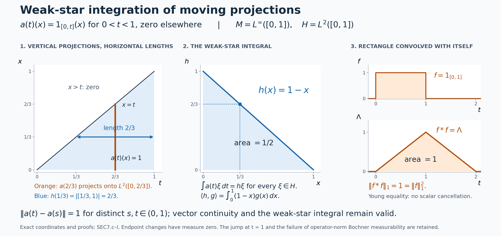

# Integrating graded sections

*Self-checked by the writing AI. Original exposition and illustration sources: CC0-1.0; earlier and font components retain their recorded terms.*

An operator-valued function can vary continuously on every Hilbert-space vector while its values remain a fixed distance apart in operator norm. Such functions occur naturally when the degree of a graded operator varies. We build an integration theory that includes them: normal functionals determine the operator integral, vector integrals control continuity, and scalar norm estimates make the resulting convolution algebra complete.

## The graded spaces and the measure

Let \(M\) be an arbitrary von Neumann algebra with predual \(M_*\). No factor, countability, separability or faithful-state assumption is imposed. The [graded fibers](OA-FLOW-GRD.md#grd-2) are denoted by \(M(t)\), \(t\in\mathbb R\). Choose a faithful normal semifinite weight \(\varphi\); such weights exist by [FR1](OA-FLOW-FR.md#oa-flow.fr.1). Its coordinate map writes every element of \(M(t)\) uniquely as \(a\varphi^{it}\), with \(a\in M\), and is a normal Banach-space isometry. These are degree-labelled symbols, with operations proved in [GRD3](OA-FLOW-GRD.md#grd-3):
\[
\begin{gathered}
 (a\varphi^{is})(b\varphi^{it})
       =a\sigma_s^\varphi(b)\varphi^{i(s+t)},\\
 (a\varphi^{it})^*
       =\sigma_{-t}^\varphi(a^*)\varphi^{-it}.
\end{gathered}
\tag{SEC0.a}
\]
On the total space \(\bigsqcup_tM(t)\) use the topology from the Mackey topology \(\tau(M,M_*)\) on coefficients and the usual topology on degrees. [GRD4–5](OA-FLOW-GRD.md#grd-5) proves that this topology is chart independent and that on norm-bounded subsets it agrees with the intrinsic sigma-strong-star topology, hence with the strong-star topology in every faithful normal representation.

All integrals in the degree variable use completed Lebesgue measure \(dt\). We use [its construction and affine substitutions](OA-FLOW-SC.md#sc-02), [monotone convergence and scalar null-set estimates](OA-FLOW-SC.md#sc-04), [dominated convergence](OA-FLOW-SC.md#sc-05), and [regularity and scalar translations](OA-FLOW-FF.md#oa-flow.ff.2). The [scalar interchange theorem](OA-FLOW-FF.md#scalar-interchange) applies to Borel representatives; completing the measure changes functions only on subsets of Borel null sets. Its nonnegative case shows that these changes have null sections outside a scalar null set, giving the completed version used below. All integral identities are consequently statements about almost-everywhere classes. For \(M=0\), all fibers and the resulting algebra are zero; the arguments below also apply with every coefficient zero.

## 1. Compact carriers for operator sections

A section \(x\) assigns \(x(t)\in M(t)\) to every \(t\). Write \(x(t)=a(t)\varphi^{it}\). We call it **locally Lusin** if, for every bounded closed interval \(I\) and every \(\varepsilon>0\), there is a compact \(K\subset I\) such that
\[
 |I\setminus K|<\varepsilon,
 \qquad a|_K:K\longrightarrow(M,\tau(M,M_*))
       \text{ is continuous}.
\tag{SEC1.a}
\]
The degree map is already continuous, and the chart homeomorphisms from [GRD5](OA-FLOW-GRD.md#grd-5) make this an intrinsic condition on \(x\).

**Proposition 1.1.** A locally Lusin coefficient has a Mackey-Borel representative equal to it almost everywhere. Its norm and all its normal scalar pairings are Lebesgue measurable. Its image on every compact set where it is Mackey continuous is norm bounded.

**Proof.** For each pair \(n,m\ge1\), choose a compact \(K_{n,m}\subset[-n,n]\) as in (SEC1.a) with loss less than \(2^{-m}\). The Borel set
\[
 S=\bigcup_{n,m\ge1}K_{n,m}
\tag{SEC1.b}
\]
is conull: the complement of \(\bigcup_mK_{n,m}\) in \([-n,n]\) has measure at most \(2^{-m}\) for every \(m\). Replace \(a\) by zero off \(S\). For any Mackey-open set \(U\), its inverse image in each \(K_{n,m}\) is relatively open, hence Borel in \(\mathbb R\). The inverse image for the modified coefficient is their countable union, together with \(\mathbb R\setminus S\) when \(0\in U\). This proves the Borel assertion without any countable-base assumption on \(M\).

By [the isometric predual duality](OA-FLOW-CP.md#oa-flow.cp.6),
\[
 \|b\|=\sup_{\omega\in M_*,\ \|\omega\|\le1}|\omega(b)|.
\tag{SEC1.c}
\]
Thus the norm is weak-star lower semicontinuous, and also Mackey lower semicontinuous: its strict superlevel sets are unions of open sets. It is Borel measurable. Normal pairings are Mackey continuous. Composing with the Borel representative and then using completeness of Lebesgue measure proves the assertions for the original coefficient.

Let \(a|_K\) be continuous on compact \(K\). For each \(\omega\in M_*\), the values \(|\omega(a(t))|\), \(t\in K\), are bounded. The closed sets
\[
 B_j=\{\omega\in M_*:\sup_{t\in K}|\omega(a(t))|\le j\}
\tag{SEC1.d}
\]
cover the Banach space \(M_*\). The [complete-metric Baire argument in Lemma 3.2](OA-FLOW-L34.md#oa-flow.l34.3) implies that some \(B_j\) contains an open ball \(B(\omega_0,r)\). Both \(\omega_0\) and \(\omega_0+\eta\) lie in \(B_j\) when \(\|\eta\|<r\), so \(|\eta(a(t))|\le2j\) uniformly on \(K\). Scale \(\eta\) and use (SEC1.c), then let its norm tend to \(r\), to obtain
\[
 \sup_{t\in K}\|a(t)\|\le 2j/r.
\tag{SEC1.e}
\]
The zero predual gives the same conclusion directly. On these bounded images, Mackey continuity can now be tested by the strong-star vector seminorms, by [GRD4–5](OA-FLOW-GRD.md#grd-4). \(\square\)

**Proposition 1.2.** Sums, constant scalar multiples and changes on null sets preserve the locally Lusin condition. So does multiplication by a bounded Lebesgue-measurable scalar function. Uniform norm limits of Mackey-continuous maps on a fixed compact set are Mackey continuous.

**Proof.** For finitely many coefficients intersect their Lusin compacts, assigning each a fraction of the allowed measure loss. Addition and scalar multiplication are continuous in a locally convex topology. For a null modification, remove an open set of arbitrarily small measure containing the exceptional null set; the difference of a compact set and this open set is compact, and the functions agree there.

For a measurable set \(E\subset I\), regularity gives disjoint compact sets \(K_1\subset E\) and \(K_0\subset I\setminus E\) whose union loses arbitrarily small measure. The indicator of \(E\) is continuous on \(K_0\cup K_1\): the two disjoint compact pieces are relatively open as well as closed. Intersect this union with a compact for \(a\). Thus \(1_Ea\) is locally Lusin. Finite linear combinations give finite-valued measurable scalar multipliers.

For a bounded measurable complex function \(f\), use finite square grids in its bounded range to obtain finite-valued measurable \(f_j\) converging uniformly to \(f\). For every \(j\), take a compact on which \(f_ja\) is continuous, with losses forming a summable series smaller than \(\varepsilon/2\). Intersect these compacts and also a Lusin compact for \(a\) losing less than \(\varepsilon/2\). The intersection is compact; (SEC1.e) bounds \(a\) on it. Hence \(f_ja\to fa\) uniformly in norm there.

To justify the final step, a Mackey seminorm has the form
\[
 p_C(b)=\sup_{\omega\in C}|\omega(b)|
       \le B_C\|b\|,
 \qquad B_C=\sup_{\omega\in C}\|\omega\|<\infty,
\tag{SEC1.f}
\]
where \(C\) is an absolutely convex weakly compact subset of \(M_*\). Its norm boundedness is among the compact-set facts proved in [GRD5](OA-FLOW-GRD.md#grd-5). Uniform norm convergence is therefore uniform convergence for every \(p_C\). Given a point and a finite family of seminorm tolerances, choose one approximating map with error below one third of every tolerance, then use its continuity for the middle difference. This proves continuity of the limit. It also finishes the multiplier assertion. \(\square\)

Define \(\mathcal L^1(M(\cdot))\) to be the locally Lusin sections with finite norm integral, modulo equality outside one Lebesgue null set:
\[
 \|x\|_1=\int_{\mathbb R}\|x(t)\|\,dt
         =\int_{\mathbb R}\|a(t)\|\,dt<\infty.
\tag{SEC1.g}
\]
The fiber norm is intrinsic. Normal coordinate changes preserve it pointwise, so the condition and this quantity are chart independent. Propositions 1.1–1.2 give a vector space of sections and a seminorm on representatives. If the seminorm is zero, (SEC1.c) is not needed to choose exceptional sets: the single scalar function \(\|a(t)\|\) vanishes almost everywhere by [SC-04](OA-FLOW-SC.md#sc-04). Hence the section itself is zero outside one null set. The quotient is consequently a normed vector space.

**Corollary 1.3 (bounded support and bounded values).** Every member is an integral-norm limit of locally Lusin coefficients with bounded values and compact support.

**Proof.** Put
\[
 a_n(t)=1_{[-n,n]}(t)1_{\{\|a(t)\|\le n\}}a(t).
\tag{SEC1.h}
\]
The scalar mask is measurable by Proposition 1.1, and Proposition 1.2 makes \(a_n\) locally Lusin. It has norm at most \(n\) and support in \([-n,n]\). At each fixed \(t\), it eventually equals \(a(t)\), and \(\|a-a_n\|\le\|a\|\). Dominated convergence gives \(\|a-a_n\|_1\to0\). The approximants remain operator-valued functions; no finite-valued approximation in the norm of \(M\) has been asserted. \(\square\)

## 2. Completeness from scalar tails

The compact-set condition in Section 1 must survive a norm limit of sections. The following scalar estimate will also be used to prove convolution closure.

**Lemma 2.1 (compact uniform control).** Suppose \(D_j\) are nonnegative measurable functions on a bounded interval \(I\), decreasing to zero almost everywhere, with \(\int_I D_j\to0\). Given \(\varepsilon>0\) and a prescribed null set \(N\), there is a compact \(K\subset I\setminus N\) with \(|I\setminus K|<\varepsilon\) on which \(D_j\to0\) uniformly.

**Proof.** Enlarge \(N\) by the null sets where monotonicity or convergence fails. Choose increasing indices \(j_m\) such that
\[
 \int_I D_{j_m}<\frac{\varepsilon\,2^{-m-3}}{m},
 \qquad m\ge1.
\tag{SEC2.a}
\]
The scalar bound \(|\{D_{j_m}>1/m\}\cap I|\le m\int_I D_{j_m}\) shows that the union \(E\) of these bad sets has measure less than \(\varepsilon/8\). On \(I\setminus(E\cup N)\), one has \(D_j\le1/m\) whenever \(j\ge j_m\). By compact inner regularity choose a compact subset of this measurable set losing less than another \(\varepsilon/2\) of measure. Its total loss is less than \(\varepsilon\), and the displayed bounds prove uniform convergence. \(\square\)

**Theorem 2.2.** The normed space \(\mathcal L^1(M(\cdot))\) is complete.

**Proof.** Take a Cauchy sequence of sections. In one fixed weight chart, choose a subsequence of coefficients \(b_j\) for which
\[
 \sum_{j\ge1}\|b_{j+1}-b_j\|_1<\infty.
\tag{SEC2.b}
\]
Each scalar difference norm is measurable by Section 1. Monotone convergence shows that
\[
 D_j(t)=\sum_{k\ge j}\|b_{k+1}(t)-b_k(t)\|
\tag{SEC2.c}
\]
is finite outside a single null set \(N\), and \(\int D_j\to0\). Outside \(N\), \(b_j(t)\) is a norm-Cauchy sequence in the Banach space \(M\). Define its norm limit to be \(b(t)\), and put \(b(t)=0\) on \(N\). Pointwise outside \(N\),
\[
 \|b(t)-b_j(t)\|\le D_j(t).
\tag{SEC2.d}
\]

We first prove the locally Lusin condition for \(b\), before appealing to measurability of its norm. Fix \(I\) and \(\varepsilon>0\). For every \(j\), choose a Lusin compact for \(b_j\), with the total of all losses less than \(\varepsilon/2\). Their intersection \(K_0\) is compact and has loss less than \(\varepsilon/2\). Apply Lemma 2.1 to \(D_j\) with loss less than \(\varepsilon/2\), excluding \(N\), and call the resulting compact \(K_1\). On \(K_0\cap K_1\), all \(b_j\) are Mackey continuous and (SEC2.d) gives uniform convergence in operator norm. Proposition 1.2 proves that \(b\) is Mackey continuous there. The intersection has loss less than \(\varepsilon\), proving the required condition.

Now \(\|b\|\) and \(\|b-b_j\|\) are measurable. Integrating (SEC2.d) gives
\[
 \|b-b_j\|_1\le\int D_j\longrightarrow0,
 \qquad
 \|b\|_1\le\|b_1\|_1+\int D_1<\infty.
\tag{SEC2.e}
\]
Thus the subsequence converges to the section \(b(t)\varphi^{it}\) in \(\mathcal L^1\). Given \(\delta>0\), the original Cauchy sequence is eventually within \(\delta/2\) of any sufficiently late member, and one such subsequence member is within \(\delta/2\) of \(b\). The triangle inequality proves convergence of the entire sequence. \(\square\)

The proof gives a useful additional principle. If Mackey-continuous coefficients \(c_j\) approximate a coefficient \(c\) pointwise off a scalar null set with
\[
 \|c(t)-c_j(t)\|\le e_j(t),
 \quad e_j\ge0\text{ measurable},
 \quad \sum_j\int e_j<\infty,
\tag{SEC2.f}
\]
then \(c\) is locally Lusin. Indeed use \(D_j=\sum_{k\ge j}e_k\) in Lemma 2.1 and the uniform norm limit argument. This conclusion does not assume beforehand that \(\|c-c_j\|\) is measurable; the scalar majorants supply all measure estimates.

## 3. Integrate through the predual, then compare on vectors

The coefficients of a locally Lusin section need not be measurable for the operator-norm topology of \(M\). Their scalar norm and normal functional evaluations are measurable by Section 1. These are the inputs for the operator integral. Genuine Banach-valued integrals will be used after proving strong measurability of the vector functions involved.

**The integral in a fixed fiber.** Fix a degree \(t\) and put \(E=M(t)\), with the canonical predual \(E_*\) constructed in [GRD2](OA-FLOW-GRD.md#grd-2). More generally the following argument applies to any specified dual Banach space \(E=(E_*)^*\). Let \(k:S\to E\), where \(S\) is \(\mathbb R\) or a finite Cartesian power with completed Lebesgue measure. Suppose that every function \(s\mapsto\ell(k(s))\), \(\ell\in E_*\), is measurable, and that
\[
 \|k(s)\|\le g(s)\quad\text{almost everywhere},\qquad
 0\le g\in L^1(S).
 \tag{SEC3.a}
\]
Every such scalar function is integrable. The rule
\[
 \ell\longmapsto\int_S\ell(k(s))\,ds
 \tag{SEC3.b}
\]
is complex linear and bounded on \(E_*\), with norm at most \(\int_Sg\). Duality therefore gives a unique element, denoted \(\int_S k(s)\,ds\), such that
\[
 \ell\!\left(\int_S k(s)\,ds\right)
   =\int_S\ell(k(s))\,ds
       \quad(\ell\in E_*).
 \tag{SEC3.c}
\]
This is the weak-star integral. In particular, for a locally Lusin fixed-fiber function with integrable norm,
\[
 \left\|\int_S k(s)\,ds\right\|
     \le\int_S\|k(s)\|\,ds.
 \tag{SEC3.d}
\]
For \(M\) the duality used here is proved in [CP6](OA-FLOW-CP.md#oa-flow.cp.6); for \(M(t)\) it is transported by the normal isometric coefficient chart. The integration variable \(s\) does not change the output degree \(t\). No addition of elements from different fibers is involved.

Scalar integration and separation by \(E_*\) prove linearity, invariance under almost-everywhere changes, and additivity over measurable pieces. They also prove dominated weak-star convergence: if \(\ell(k_n(s))\to\ell(k(s))\) almost everywhere for each \(\ell\), with a common integrable bound for \(\|k_n(s)\|\) and \(\|k(s)\|\), then the integrals converge weak-star. For this conclusion the scalar null set may depend on the fixed functional being tested.

**Normal linear and conjugate-linear transport.** A weak-star continuous complex-linear functional on \(E=(E_*)^*\) belongs to \(E_*\): continuity controls it by finitely many predual tests, so it vanishes on their common kernel. It factors through their finite-dimensional image and is consequently a linear combination of those tests. This is the same finite-test argument used in CP6.

Let \(A:E\to F\) be a bounded weak-star continuous complex-linear map between specified dual Banach spaces. Its preadjoint is \(A_*\lambda=\lambda\circ A\), so (SEC3.c) gives
\[
 A\!\left(\int_S k(s)\,ds\right)
       =\int_S A(k(s))\,ds.
 \tag{SEC3.e}
\]
Here the right side exists by the bound \(\|A(k(s))\|\le\|A\|g(s)\).

The same identity holds when \(A\) is bounded, conjugate linear and weak-star continuous. To prove it, define
\[
 (A^\natural\lambda)(x)=\overline{\lambda(Ax)}
       \quad(\lambda\in F_*,\ x\in E).
 \tag{SEC3.f}
\]
This is a complex-linear weak-star continuous functional of \(x\), hence belongs to \(E_*\). Applying (SEC3.c) to it and then conjugating the scalar integral gives
\[
 \begin{aligned}
 \lambda\!\left(A\!\left(\int_S k(s)\,ds\right)\right)
 &=\overline{(A^\natural\lambda)
                    \!\left(\int_S k(s)\,ds\right)}\\
 &=\int_S\lambda(A(k(s)))\,ds.
 \end{aligned}
 \tag{SEC3.g}
\]
All \(\lambda\in F_*\) separate the points of \(F\), proving (SEC3.e) in this case as well. The map \(A^\natural\) is conjugate linear in \(\lambda\); it is not being called a complex-linear preadjoint.

These maps also preserve local Mackey–Lusin measurability. Indeed, if \(K\subset F_*\) is absolutely convex and weakly compact, its image under \(A_*\), or under \(A^\natural\), is absolutely convex and weakly compact in \(E_*\). Weak continuity follows by testing at each fixed \(x\); conjugation in (SEC3.f) preserves continuity. The seminorm identity
\[
 p_K(Ax)=p_{A_*K}(x)
 \quad\text{or}\quad
 p_K(Ax)=p_{A^\natural K}(x)
 \tag{SEC3.h}
\]
proves Mackey continuity on the entire space. Compose on each Lusin compact set to get the stated measurability assertion.

The graded adjoint \(M(t)\to M(-t)\) is a bounded normal conjugate-linear isometry: in a faithful chart it is \(x\mapsto\sigma_{-t}^\varphi(x^*)\), by [GRD3](OA-FLOW-GRD.md#grd-3); the adjoint is ultraweakly continuous by CP6's vector-series formula, and the automorphism is normal. Therefore
\[
 \left(\int_S k(s)\,ds\right)^*
       =\int_S k(s)^*\,ds
       \quad\text{in }M(-t).
 \tag{SEC3.i}
\]
Fixed coefficient charts, fixed left or right multipliers, and each fixed modular automorphism satisfy the linear transport formula for the same reason. For example a normal functional evaluated at \(axb\) is again a square-summable vector series, with its vectors changed by the fixed bounded operators \(a,b\).

**Strong measurability on an arbitrary Hilbert space.** Represent \(M\) faithfully and normally on \(H\); no separability of \(H\) is assumed. Let \(k:\mathbb R\to M\) be locally Lusin. The countable compact-cover construction of Section 1 supplies compact sets \(K_j\) whose union is conull, such that \(k|_{K_j}\) is Mackey continuous. The compact-image norm bound of that section and [GRD4–5](OA-FLOW-GRD.md#grd-5) make each restriction strong-star continuous in this representation. Thus, for every fixed \(\xi\in H\), the two maps
\[
 s\longmapsto k(s)\xi,\qquad
 s\longmapsto k(s)^*\xi
 \tag{SEC3.j}
\]
are continuous on each \(K_j\).

Each of their compact images in the metric space \(H\) is separable: choose a finite \(1/n\)-net for every positive integer \(n\). The closed linear span of the resulting countable union of sets is separable. Outside the null complement of \(\bigcup_jK_j\), it contains the entire vector range. The maps are norm-Borel measurable after setting them to zero on that complement: the inverse image of an open subset of \(H\) is a countable union of relatively open subsets of the compact \(K_j\), with the Borel complement added if needed. With the original null values restored they are measurable for completed Lebesgue measure.

The strong-measurability proof in [L24, Section 4](OA-FLOW-L24.md#oa-flow.grp.vectorintegration) now applies. In a separable essential range, measurable first-nearby-point choices from a countable dense set, followed by finite truncations, give finite-valued measurable approximants almost everywhere. Hence both functions in (SEC3.j) are strongly measurable even when \(H\) itself is not separable.

If \(\int\|k(s)\|\,ds<\infty\), they have integrable vector norms. L24's Bochner integral is therefore available, and
\[
 \begin{aligned}
 \left(\int k(s)\,ds\right)\xi
      &=\int k(s)\xi\,ds,\\
 \left(\int k(s)\,ds\right)^*\xi
      &=\int k(s)^*\xi\,ds.
 \end{aligned}
 \tag{SEC3.k}
\]
For the first identity, test against each \(\eta\in H\); the vector functional belongs to \(M_*\), so its two scalar integrals agree by (SEC3.c). Hilbert-space separation proves equality. The second follows in the same way, or from (SEC3.i). For a fixed graded fiber first apply its coefficient chart; equivalently use its normal embedding into the core and a faithful normal representation of the core. Thus the comparison respects the canonical fiber integral.

The argument also handles products with the implementing unitaries needed below. The [faithful-weight implementation theorem](OA-FLOW-MW.md#oa-flow.mw.4) gives a faithful normal GNS representation with
\(\sigma_s^\varphi(x)=W_sxW_s^*\), where \(W_s\) is strongly continuous. If \(v(s)\) is continuous on a compact restriction, then
\[
 \|W_sv(s)-W_{s_0}v(s_0)\|
 \le\|v(s)-v(s_0)\|+\|(W_s-W_{s_0})v(s_0)\|
 \longrightarrow0.
 \tag{SEC3.l}
\]
The same holds for \(W_s^*\). Apply this to (SEC3.j) on its compact restrictions. Their countable compact images again prove strong measurability of fields such as \(W_s^*k(s)^*\xi\). A bound for \(\|k(s)\|\) supplies the corresponding integrable majorant whenever required.

**Vector translation continuity.** For every strongly measurable \(F:\mathbb R\to H\) with integrable norm,
\[
 \int_{\mathbb R}\|F(r+h)-F(r)\|\,dr\longrightarrow0
       \quad(h\to0).
 \tag{SEC3.m}
\]
For a finite sum \(S=\sum_{j=1}^m1_{A_j}\xi_j\), with the \(A_j\) of finite measure, the left side is at most
\(\sum_j\|\xi_j\|\,|(A_j-h)\mathbin{\triangle}A_j|\).
Each term tends to zero by the [scalar translation proof](OA-FLOW-FF.md#oa-flow.ff.2). That proof obtains finite-measure indicator approximation from Lebesgue regularity and bounded intervals. L24 supplies such finite-valued approximants \(S\) in integral norm for every \(F\). Translation preserves that norm, so
\[
 \|F(\,\cdot+h)-F\|_{L^1(H)}
 \le2\|F-S\|_{L^1(H)}
       +\|S(\,\cdot+h)-S\|_{L^1(H)}.
 \tag{SEC3.n}
\]
First choose \(S\), then decrease \(h\). This proves (SEC3.m).

**The Fubini hypotheses.** We will use vector Fubini only for a strongly measurable function \(F:\mathbb R^2\to H\) with
\[
 \int_{\mathbb R^2}\|F(r,s)\|\,dr\,ds<\infty.
 \tag{SEC3.o}
\]
L24, Proposition 4.3 proves that its iterated Bochner integrals exist almost everywhere and equal its product integral. Its sigma compact carrier condition holds on \(\mathbb R^2\). The proof approximates in integral norm by finite-valued functions and uses scalar Fubini on a summable series of their norm differences, so it applies to arbitrary \(H\).

For operator identities there is a convenient sufficient hypothesis that also controls exceptional sets. Let \(K:\mathbb R^2\to M(t)\) be locally Mackey–Lusin on bounded rectangles and suppose that \(\|K(r,s)\|\le g(r,s)\) almost everywhere, for a measurable integrable scalar \(g\). Countably many compact restrictions cover a conull Borel set, by the same decreasing-loss construction as in Section 1. After setting \(K=0\) off this set, each predual pairing is jointly Borel: its restriction to each compact is continuous, and a countable union of the corresponding Borel pieces gives every inverse image. The scalar norm is measurable as well. The [scalar Fubini proof](OA-FLOW-FF.md#scalar-interchange) then gives
\[
 \int_{\mathbb R^2}K(r,s)\,dr\,ds
 =\int_{\mathbb R}\left(\int_{\mathbb R}K(r,s)\,ds\right)dr
 =\int_{\mathbb R}\left(\int_{\mathbb R}K(r,s)\,dr\right)ds,
 \tag{SEC3.p}
\]
with all three integrals understood weak-star.

To justify the operator statement, the set where \(\int g(r,s)\,ds\) is infinite is one scalar null set, independent of the normal functional. Off it every inner weak-star integral exists by (SEC3.a)–(SEC3.c), since the Borel representative has measurable scalar sections for every functional. Its scalar pairings are measurable functions of \(r\), and its norm is bounded by \(\int g(r,s)\,ds\). The outer weak-star integral exists using that bound, even without a separate assertion of norm measurability of the inner integral. Testing each \(\ell\in M(t)_*\) and applying scalar Fubini proves the first equality; reverse \(r,s\) for the second. If the original field differs on a product-null set, scalar Fubini first removes the null set of rows or columns on which its section need not be null. This single set again does not depend on \(\ell\).

On each compact restriction, coefficient fields applied to a fixed vector, and their adjoints, are continuous with compact metric image. The argument for (SEC3.j) therefore also proves strong measurability of these joint vector fields. Bound (SEC3.o) follows from \(g\|\xi\|\), so (SEC3.p) agrees with the Bochner comparisons whenever they are used.

These statements iterate to further real variables under an integrable scalar norm majorant. For an additional parameter \(u\), if a scalar triple-integral bound makes \(\int\!\int g_u(r,s)\,dr\,ds\) finite outside a null set of \(u\), apply (SEC3.p) for each such \(u\) once local Lusin measurability of \(K_u\) has been proved. This supplies a common parameter exception chosen from the scalar majorant, rather than from an uncountable family of vector or functional tests.

## 4. Convolution stays in the locally Lusin space

Fix a faithful normal semifinite weight \(\varphi\) and write the two sections as \(a(t)\varphi^{it}\) and \(b(t)\varphi^{it}\). Abbreviate \(\sigma_t^\varphi\) to \(\sigma_t\). All operator-valued integrals below are the weak-star integrals of [Section 3](OA-FLOW-SEC.md#sec-3), tested against \(M_*\). The coefficient of their proposed convolution is
\[
 c(t)=(a*b)(t)
     =\int_{\mathbb R}a(s)\sigma_s(b(t-s))\,ds.
 \tag{SEC4.a}
\]
The modular factor is determined by the [ordered graded product](OA-FLOW-GRD.md#grd-3).

We use the [faithful normal modular implementation](OA-FLOW-MW.md#oa-flow.mw.4): represent \(M\) faithfully normally on its weight GNS Hilbert space \(H\), and write
\[
 \sigma_s(x)=W_sxW_s^*,
 \qquad W_sW_r=W_{s+r},
 \tag{SEC4.b}
\]
where \(W\) is strongly continuous. The dimension of \(H\) is unrestricted. This representation preserves the norm and, on bounded sets, identifies the intrinsic sigma-strong-star topology with the concrete strong-star topology by [ST2](OA-FLOW-ST12.md#oa-flow.st.2). The latter agrees there with Mackey topology by [GRD5](OA-FLOW-GRD.md#grd-5).

**Existence at almost every output time.** Fix \(t\) and a bounded closed interval \(I\). Choose Lusin compact restrictions \(K_a\subset I\) for \(a\) and \(K_b\subset t-I\) for \(b\). Then
\(K=K_a\cap(t-K_b)\) is compact, and the measure lost in \(I\) is at most the sum of the two losses. On \(K\), both coefficient images are norm bounded by [Section 1](OA-FLOW-SEC.md#sec-1). The action is jointly strong-star continuous on bounded sets, either by (SEC4.b) or the [bounded action theorem](OA-FLOW-AT.md#oa-flow.at.4). Bounded products are jointly strong-star continuous as well: if \(A_i\to A\) and \(B_i\to B\) strongly-star, with \(\|A_i\|\le R\), then
\[
 \begin{aligned}
 \|(A_iB_i-AB)\xi\|
 &\le R\|(B_i-B)\xi\|\\
 &\quad+\|(A_i-A)B\xi\|\longrightarrow0,
 \end{aligned}
 \tag{SEC4.c}
\]
and the same estimate for \(B_i^*A_i^*\) handles adjoints. Thus
\(s\mapsto a(s)\sigma_s(b(t-s))\) is Mackey continuous on \(K\). Since the losses can be arbitrarily small, this integrand is locally Lusin.

Put \(A(s)=\|a(s)\|\), \(B(s)=\|b(s)\|\). These scalar functions are measurable by Section 1. Its countable compact-cover construction permits Borel representatives after a null modification. The [scalar nonnegative Fubini theorem](OA-FLOW-FF.md#scalar-interchange), with [translation and reflection of Lebesgue measure](OA-FLOW-SC.md#sc-02), gives
\[
 \begin{gathered}
 (A*B)(t)=\int_{\mathbb R}A(s)B(t-s)\,ds,\\
 \int_{\mathbb R}(A*B)(t)\,dt
       =\left(\int_{\mathbb R}A\right)
          \left(\int_{\mathbb R}B\right)
       =\|a\|_1\|b\|_1.
 \end{gathered}
 \tag{SEC4.d}
\]
These statements also hold for the original completed-measure representatives: on any bounded rectangle, the inverse image of a one-dimensional null set under \(s\) or \(t-s\) is null by the same scalar theorem.

Consequently
\[
 N_{a,b}=\{t:(A*B)(t)=\infty\}
 \quad\text{is null}.
 \tag{SEC4.e}
\]
For \(t\notin N_{a,b}\), the locally Lusin integrand in (SEC4.a) has integrable norm, so Section 3 defines its integral in \(M\), with
\(\|c(t)\|\le(A*B)(t)\). Set \(c(t)=0\) on \(N_{a,b}\). At this stage this is a pointwise construction and bound; measurability of \(\|c(t)\|\) will follow from the closure proof below.

Changing \(a\) and \(b\) on scalar null sets \(N_a,N_b\) changes the integrand for a fixed \(t\) only on \(N_a\cup(t-N_b)\), which is null. Thus the integral, wherever it exists, is independent of those modifications. All exceptional sets used here come from scalar norm bounds.

**Bounded coefficients with compact support.** First suppose \(\|a(s)\|\le P\), \(\|b(s)\|\le Q\) for every \(s\), and both coefficients vanish outside compact sets. Choose a compact interval \(I\) containing the support of \(a\). Formula (SEC4.a) then exists for every \(t\), and
\[
 \|c(t)\|\le Q\|a\|_1\qquad(t\in\mathbb R).
 \tag{SEC4.f}
\]
We prove its strong-star continuity at every \(t\).

For \(\xi\in H\), the vector comparison in Section 3 and (SEC4.b) give
\[
 \|(c(t+h)-c(t))\xi\|
 \le P\int_I
    \|(b(t+h-s)-b(t-s))W_s^*\xi\|\,ds.
 \tag{SEC4.g}
\]
The continuous path \(s\mapsto W_s^*\xi\) has compact metric image on \(I\). For \(\delta>0\), choose a finite-valued measurable function
\(\eta_\delta(s)=\sum_{j=1}^m1_{E_j}(s)\eta_j\) with uniform error at most \(\delta\). Such a function is obtained from a finite \(\delta\)-net of the compact image by assigning the first suitable net point; the resulting sets \(E_j\) are measurable. Replacing \(W_s^*\xi\) by \(\eta_\delta(s)\) in (SEC4.g) costs at most
\[
 2PQ|I|\delta.
 \tag{SEC4.h}
\]
For each of its finitely many values, the remaining term is bounded by
\[
 P\int_{\mathbb R}
       \|(b(r+h)-b(r))\eta_j\|\,dr\longrightarrow0.
 \tag{SEC4.i}
\]
Indeed \(r=t-s\) changes the integral over \(E_j\) to one over a measurable subset of \(\mathbb R\), and we enlarge it to the whole line. The vector function \(r\mapsto b(r)\eta_j\) is strongly measurable and integrable on the arbitrary space \(H\), by Section 3. Its integral-norm translation continuity is proved there from [scalar translations](OA-FLOW-FF.md#oa-flow.ff.2) and [vector simple approximation](OA-FLOW-L24.md#oa-flow.grp.vectorintegration). Let \(h\to0\), then \(\delta\downarrow0\). This proves strong continuity.

The adjoints require a separate estimate. Commuting the adjoint with the weak-star integral as in Section 3 gives
\[
 \begin{gathered}
 \|(c(t+h)^*-c(t)^*)\xi\|\\
 \le\int_I
     \|(b(t+h-s)^*-b(t-s)^*)\zeta(s)\|\,ds,\\
 \zeta(s)=W_s^*a(s)^*\xi.
 \end{gathered}
 \tag{SEC4.j}
\]
The function \(\zeta\) is strongly measurable on \(I\): on each of the countably many Lusin compact restrictions of \(a\), it is a continuous \(H\)-valued function with compact metric image. These images lie in a separable closed subspace after taking their countable union, as proved in Section 3; no separability of \(H\) is required. Also \(\|\zeta(s)\|\le P\|\xi\|\), so \(\zeta\in L^1(I,H)\).

Approximate \(\zeta\) in \(L^1(I,H)\) by a finite-valued measurable function \(\sum_j1_{E_j}\zeta_j\). The error in (SEC4.j) is at most
\(2Q\|\zeta-\sum_j1_{E_j}\zeta_j\|_{L^1(I,H)}\).
For each \(\zeta_j\), the remaining integral is bounded by
\[
 \int_{\mathbb R}
       \|(b(r+h)^*-b(r)^*)\zeta_j\|\,dr\longrightarrow0,
 \tag{SEC4.k}
\]
using translation continuity of \(r\mapsto b(r)^*\zeta_j\). First take \(h\to0\), then make the approximation error arbitrarily small. This proves adjoint continuity. The global norm bound (SEC4.f) now makes \(c\) Mackey continuous by GRD5. Thus the convolution of these bounded compactly supported coefficients is locally Lusin, with no assertion that either input is norm measurable as an \(M\)-valued function.

**General coefficients.** Take the bounded compactly supported truncations \(a_n,b_n\) from [Section 1](OA-FLOW-SEC.md#sec-1), and put \(c_n=a_n*b_n\). Each \(c_n\) is everywhere Mackey continuous by the preceding argument. Let \(c\) be the pointwise weak-star convolution already constructed. For \(t\notin N_{a,b}\), subtract the two integrals and split the difference to obtain
\[
 \begin{aligned}
 \|c(t)-c_n(t)\|&\le d_n(t),\\
 d_n&=\|a-a_n\|*\|b\|
           +\|a_n\|*\|b-b_n\|.
 \end{aligned}
 \tag{SEC4.l}
\]
All four functions on the right are already measurable scalar functions. In particular no measurability of the expression on the left has been used. Scalar Tonelli gives
\[
 \int d_n
 =\|a-a_n\|_1\|b\|_1
    +\|a_n\|_1\|b-b_n\|_1
 \longrightarrow0.
 \tag{SEC4.m}
\]
The truncations are scalar masks, so their norms and the difference norms are bounded pointwise by \(A\) and \(B\), respectively. Hence every integral used in (SEC4.l) is finite outside the same \(N_{a,b}\).

Choose a subsequence \(n_k\) with \(\sum_k\int d_{n_k}<\infty\), and form the measurable scalar tails
\[
 D_j(t)=\sum_{k\ge j}d_{n_k}(t).
 \tag{SEC4.n}
\]
The [nonnegative sum and convergence theorem](OA-FLOW-SC.md#sc-04) shows that \(D_j\downarrow0\) outside a scalar null set and that \(\int D_j\to0\). On any bounded closed interval \(J\), the uniform-tail argument of [Section 2](OA-FLOW-SEC.md#sec-2) applies to these scalar functions. More explicitly, choose increasing indices \(j_m\) with
\[
 |\{t\in J:D_{j_m}(t)>1/m\}|<\varepsilon2^{-m-3}.
 \tag{SEC4.o}
\]
Outside the union of these sets, \(D_j\to0\) uniformly. Remove also a small open neighborhood of \(N_{a,b}\) and of the null set where the tails fail. [Lebesgue regularity](OA-FLOW-FF.md#oa-flow.ff.2) gives a compact subset \(K\subset J\) of the remaining set with \(|J\setminus K|<\varepsilon\). On \(K\), (SEC4.l) and \(d_{n_k}\le D_k\) prove uniform convergence \(c_{n_k}\to c\) in operator norm.

For a weakly compact predual set \(L\), its norm bound gives
\[
 \begin{gathered}
 p_L(c_{n_k}(t)-c(t))
 \le\left(\sup_{\omega\in L}\|\omega\|\right)d_{n_k}(t),\\
 \sup_{t\in K}d_{n_k}(t)\longrightarrow0.
 \end{gathered}
 \tag{SEC4.p}
\]
Thus \(c|_K\) is a uniform limit for every Mackey seminorm of continuous maps and is Mackey continuous. This proves the required local Lusin property of \(c\). Only now use Section 1 to conclude measurability of its norm. The pointwise scalar bound and (SEC4.d) yield Young's inequality
\[
 \boxed{\ \|a*b\|_1\le\|a\|_1\|b\|_1.\ }
 \tag{SEC4.q}
\]
Convolution is bilinear on almost-everywhere classes, by linearity of the weak-star integral off the finite union of the relevant scalar exceptional sets. In particular it is a bounded bilinear operation on the Banach space of Section 2.

## 5. Associativity and the section involution

Define the coefficient involution by
\[
 a^\sharp(t)=\sigma_t(a(-t)^*).
 \tag{SEC5.a}
\]
Reflection carries Lusin compact sets to Lusin compact sets. On such a set the coefficient image is norm bounded, so adjoint continuity and the bounded joint action continuity used in Section 4 show that \(a^\sharp\) is locally Mackey–Lusin. Automorphisms are isometric, and reflection preserves Lebesgue measure. Therefore
\[
 \begin{gathered}
 \|a^\sharp(t)\|=\|a(-t)\|,\qquad
 \|a^\sharp\|_1=\|a\|_1,\\
 (a^\sharp)^\sharp(t)
 =\sigma_t\!\left(\sigma_{-t}(a(t)^*)^*\right)
 =a(t).
 \end{gathered}
 \tag{SEC5.b}
\]
This map is conjugate linear and respects almost-everywhere equality. Its modular factor is precisely the [graded adjoint formula](OA-FLOW-GRD.md#grd-3).

**The joint field for three factors.** Let \(a,b,d\) be three integrable coefficients, and set \(A=\|a\|\), \(B=\|b\|\), \(D=\|d\|\). For a fixed output time \(t\), the common operator field is
\[
 H_t(r,s)
    =a(r)\sigma_r(b(s))
             \sigma_{r+s}(d(t-r-s)).
 \tag{SEC5.c}
\]
We verify joint measurability at arbitrary Hilbert multiplicity before interchanging its integrals.

Take a bounded rectangle \(I\times J\). Choose Lusin compacts \(K_a\subset I\), \(K_b\subset J\), and \(K_d\subset t-I-J\). Their inverse images give the compact set
\[
 K=(I\times J)\cap
   \{(r,s):r\in K_a,\ s\in K_b,\ t-r-s\in K_d\}.
 \tag{SEC5.d}
\]
If the respective one-dimensional measure losses are \(\delta_a,\delta_b,\delta_d\), the discarded part of the rectangle has measure at most
\[
 |J|\delta_a+|I|\delta_b
       +\min(|I|,|J|)\delta_d.
 \tag{SEC5.e}
\]
For the third strip, fix \(r\) and integrate over \(s\): the excluded set is a translated reflection of a subset of \((t-I-J)\setminus K_d\), of measure at most \(\delta_d\). This gives \(|I|\delta_d\); interchanging the roles of \(r,s\) gives \(|J|\delta_d\). The first two bounds are rectangle measures. All uses of interchange are the [scalar theorem](OA-FLOW-FF.md#scalar-interchange). Thus the lost measure can be arbitrarily small.

On \(K\), all three coefficient images are bounded and continuous in the strong-star topology. The joint action and product estimates from Section 4 make \(H_t|_K\) strong-star continuous and norm bounded, hence Mackey continuous. Choose such restrictions with successively smaller losses on each rectangle \([-n,n]^2\). Their countable union covers \(\mathbb R^2\) up to a scalar null set. This proves scalar measurability of every \(\omega(H_t)\), and of \(\|H_t\|\), by the same compact-cover argument as Section 1.

It also proves strong measurability of \(H_t(r,s)\xi\) and \(H_t(r,s)^*\xi\) for each fixed \(\xi\in H\). On every compact restriction they are continuous with compact metric image; the countable union of those images is contained in a separable closed linear subspace of \(H\). Extending by zero across the scalar exceptional set gives the simple-function approximants of [L24, Section 4](OA-FLOW-L24.md#oa-flow.grp.vectorintegration). The subspace may depend on \(\xi\); no countable basis or common separable representation of \(M\) is needed. A fixed-\(r\) or fixed-\(s\) slice is locally Lusin by the one-variable restriction argument of Section 4.

Use \(0\cdot\infty=0\) in nonnegative scalar products. The scalar majorant is
\[
 \begin{gathered}
 \|H_t(r,s)\|\le A(r)B(s)D(t-r-s),\\
 G(t)=\iint_{\mathbb R^2}A(r)B(s)D(t-r-s)\,ds\,dr,\\
 \int_{\mathbb R}G(t)\,dt
      =\|a\|_1\|b\|_1\|d\|_1<\infty.
 \end{gathered}
 \tag{SEC5.f}
\]
Its joint measurability and the equality follow from scalar Borel representatives, nonnegative Fubini and translations, as in (SEC4.d), iterated once more. Fix \(t\) outside
\[
 N=\{t:G(t)=\infty\}.
 \tag{SEC5.g}
\]
This is one scalar null set, chosen independently of every vector and normal functional. The weak-star integral of \(H_t\) over \(\mathbb R^2\) exists by its integrable norm bound and \(M=(M_*)^*\), exactly as in Section 3. Its vector integrals exist by the strong measurability just proved and the same bound. [Vector Fubini](OA-FLOW-L24.md#oa-flow.grp.vectorintegration) applies on the sigma-compact carrier \(\mathbb R^2\).

**Both parenthesizations give this integral.** Scalar Fubini first shows
\[
 \int_{\mathbb R} A(r)(B*D)(t-r)\,dr=G(t)<\infty.
 \tag{SEC5.h}
\]
Outside the translated scalar null set where \(b*d\) was assigned its exceptional value, Section 4 gives
\[
 (b*d)(t-r)=\int b(s)\sigma_s(d(t-r-s))\,ds.
\]
For each such \(r\), the fixed normal map \(x\mapsto a(r)\sigma_r(x)\) commutes with the weak-star integral by [Section 3](OA-FLOW-SEC.md#sec-3). Thus the coefficient of \(a*(b*d)\) is
\[
 \int_{\mathbb R}\!\int_{\mathbb R}
          H_t(r,s)\,ds\,dr.
 \tag{SEC5.i}
\]
The outer integral exists by (SEC5.h) and the norm estimate for \(b*d\). Translates of its exceptional null set are null for this fixed \(t\), so arbitrary chosen representatives give the same result.

For \((a*b)*d\), use the variables \(r,u\) and the field
\[
 \begin{aligned}
 \widetilde H_t(r,u)
   &=a(r)\sigma_r(b(u-r))\sigma_u(d(t-u))\\
   &=H_t(r,u-r).
 \end{aligned}
 \tag{SEC5.j}
\]
The same compact-restriction proof applies to the three real coordinates \(r,u-r,t-u\) on any bounded rectangle. Each discarded strip has measure bounded by one side length times the one-dimensional loss, so \(\widetilde H_t\) has the required joint scalar and vector measurability. For each fixed \(r\), the substitution \(u=r+s\) is an ordinary translation. Nonnegative Fubini therefore gives
\[
 \begin{gathered}
 \iint\|\widetilde H_t(r,u)\|\,dr\,du\le G(t),\\
 \int_{\mathbb R}(A*B)(u)D(t-u)\,du=G(t).
 \end{gathered}
 \tag{SEC5.k}
\]
For \(u\) outside the scalar exceptional set of \(a*b\), the fixed right multiplier
\(x\mapsto x\sigma_u(d(t-u))\) passes through its defining integral. Hence \((a*b)*d\) is the integral of \(\widetilde H_t\), with \(r\) integrated first.

For every \(\omega\in M_*\), its pairings with these two fields have the integrable bounds \(\|\omega\|A(r)B(s)D(t-r-s)\) and its translated version. Scalar Fubini and \(u=r+s\) therefore identify the two iterated integrals with the weak-star double integral in (SEC5.i). The equality holds for every \(\omega\) at the already fixed \(t\notin N\): no union of functional-dependent exceptional sets is taken. Equivalently, the qualified vector Fubini theorem gives the same equality on each \(\xi\). The scalar slice-integrability exceptions and the intermediate convolution exceptions are independent of those tests. We conclude
\[
 (a*b)*d=a*(b*d)
       \quad\text{as almost-everywhere classes}.
 \tag{SEC5.l}
\]

**The adjoint reverses convolution.** For almost every \(t\), adjoint commutation and normal-map transport through the weak-star integral give
\[
 \begin{gathered}
 (a*b)^\sharp(t)\\
 =\int_{\mathbb R}
       \sigma_{t+s}(b(-t-s)^*)\,
       \sigma_t(a(s)^*)\,ds.
 \end{gathered}
 \tag{SEC5.m}
\]
The norm of the integrand is at most \(A(s)B(-t-s)\), which is integrable outside the reflected scalar exceptional set from (SEC4.e). Put \(r=t+s\). Then the first factor is \(b^\sharp(r)\), and
\[
 \begin{aligned}
 \sigma_t(a(s)^*)
   &=\sigma_r\!\left(\sigma_{t-r}(a(r-t)^*)\right)\\
   &=\sigma_r(a^\sharp(t-r)).
 \end{aligned}
 \tag{SEC5.n}
\]
Translation of the weak-star integral, checked against normal functionals, now proves
\[
 (a*b)^\sharp=b^\sharp*a^\sharp.
 \tag{SEC5.o}
\]
Conjugate linearity and the two distributive laws follow from scalar linearity of the predual pairings. Together with completeness from Section 2, (SEC4.q), (SEC5.b), (SEC5.l) and (SEC5.o) make \(\mathcal L^1(M(\cdot))\) a Banach involutive algebra.

These operations have the intrinsic formulas
\[
 (xy)(t)=\int_{\mathbb R}x(s)y(t-s)\,ds,\qquad
 x^*(t)=x(-t)^*.
 \tag{SEC5.p}
\]
For each fixed output degree \(t\), changing the weight chart is one fixed normal isometry of the fiber \(M(t)\), so it commutes with its weak-star integral by Section 3. The graded products and adjoints are chart independent by GRD3; the Lusin condition and integral norm are chart independent by Sections 1–2. Thus the constructed algebra does not depend on \(\varphi\). For \(M=0\), every coefficient and integral is zero, giving the zero Banach involutive algebra.

## 6. The section algebra is intrinsic and functorial

Sections 1–2 give the Banach space of integrable locally Lusin sections, modulo almost-everywhere equality. Sections 4–5 construct its convolution and involution in a faithful weight chart. We now show that these operations are independent of that chart, and that normal isomorphisms of algebras transport the entire Banach involutive algebra.

**Changing the faithful weight.** Let \(\varphi,\psi\) be faithful normal semifinite weights on \(M\), and put
\(u(t)=[D\varphi:D\psi]_t\).
The same section has coefficients
\[
 a^\psi(t)=a^\varphi(t)u(t).
 \tag{SEC6.a}
\]
The [whole-space chart theorem](OA-FLOW-GRD.md#grd-5) makes this a homeomorphism of the Mackey total spaces, preserving the degree and the coefficient norm. It therefore preserves local Lusin measurability, integrability and the integral norm. It preserves almost-everywhere equality, with inverse supplied by the adjoint cocycle at the same parameter. Thus it identifies the entire Banach spaces constructed in the two charts.

Fix an output degree \(t\). Right multiplication by \(u(t)\) is now one fixed normal linear isometry on the coefficient algebra, so it commutes with the weak-star integral by Section 3. The [ordered graded product identity](OA-FLOW-GRD.md#grd-3) says pointwise in \(s\) that
\[
 \begin{aligned}
 &[a(s)u(s)]\,\sigma_s^\psi(b(t-s)u(t-s))\\
 &\qquad=a(s)\sigma_s^\varphi(b(t-s))
                   u(s)\sigma_s^\psi(u(t-s))\\
 &\qquad=a(s)\sigma_s^\varphi(b(t-s))u(t).
 \end{aligned}
 \tag{SEC6.b}
\]
The last equality is the cocycle law with parameters \(s,t-s\). Integrating in \(s\) gives
\[
 (a^\psi*_\psi b^\psi)(t)
      =(a*_\varphi b)(t)u(t).
 \tag{SEC6.c}
\]
The scalar majorant is the same in both charts, because the coefficient norms are unchanged:
\(\|a(s)u(s)\|\|b(t-s)u(t-s)\|=\|a(s)\|\|b(t-s)\|\).
Hence the single null set where this majorant has infinite integral can be used for both constructions. Formula (SEC6.c) is an equality of the almost-everywhere section classes.

For the involution, the cocycle law at \(t,-t\) gives
\(\sigma_t^\psi(u(-t)^*)=u(t)\). Modular implementation then gives
\[
 \begin{aligned}
 (a^\psi)^{\sharp_\psi}(t)
 &=\sigma_t^\psi\bigl((a(-t)u(-t))^*\bigr)\\
 &=u(t)\sigma_t^\psi(a(-t)^*)\\
 &=\sigma_t^\varphi(a(-t)^*)u(t)
   =a^{\sharp_\varphi}(t)u(t).
 \end{aligned}
 \tag{SEC6.d}
\]
Thus both operations agree under the coordinate transition. Their Banach-space and involution norms agree as well.

Equivalently, in intrinsic notation their definitions are
\[
 (x*y)(t)=\int_{\mathbb R}^{M(t)}x(s)y(t-s)\,ds,
 \qquad x^\sharp(t)=x(-t)^*.
 \tag{SEC6.e}
\]
The superscript on the integral records its one fixed output fiber. The [canonical normal predual charts](OA-FLOW-GRD.md#grd-2) commute with this integral, so it is precisely the coefficient integral already constructed. The ordered cocycle chain rule makes changes through an intermediate faithful weight equal the direct change. Consequently (SEC6.e), the norm and the almost-everywhere quotient define one intrinsic Banach involutive algebra, denoted \(\Gamma^1(\mathcal F(M))\).

**Transport under a normal isomorphism.** Let \(f:M\to N\) be a normal \(*\)-isomorphism with normal inverse. The [graded functor](OA-FLOW-GRD.md#grd-6) gives, for every \(t\), a normal onto linear isometry
\[
 \begin{aligned}
 F_t(f):M(t)&\longrightarrow N(t),\\
 x\varphi^{it}&\longmapsto
       f(x)(\varphi\circ f^{-1})^{it}.
 \end{aligned}
 \tag{SEC6.f}
\]
It preserves graded products and adjoints, and its total map is a Mackey homeomorphism preserving degree. Define on sections
\
 [\Gamma^1(f)x=F_t(f)(x(t)).
 \tag{SEC6.g}
\]
A Lusin compact restriction for \(x\), followed by this total homeomorphism, is a Lusin compact restriction for its image. The inverse has the same property. Pointwise fiber isometry gives
\[
 \|\Gamma^1(f)x\|_1=\|x\|_1.
 \tag{SEC6.h}
\]
The maps preserve almost-everywhere equality. Their pointwise inverse is \(F_t(f^{-1})\), so (SEC6.g) induces an onto linear isometry of the complete section spaces.

For the product fix \(t\) outside the scalar norm-majorant exceptional set for \(x,y\). The same set works for their images, by (SEC6.h)'s pointwise norm equality. The output map \(F_t(f)\) is fixed while the integration variable \(s\) varies; its normality therefore gives
\
 \begin{aligned}
 [\Gamma^1(f)(x*y)
 &=F_t(f)\!\left(\int^{M(t)}x(s)y(t-s)\,ds\right)\\
 &=\int^{N(t)}F_t(f)(x(s)y(t-s))\,ds\\
 &=\int^{N(t)}
       F_s(f)(x(s))F_{t-s}(f)(y(t-s))\,ds\\
 &=\Gamma^1(f)x*\Gamma^1(f)y.
 \end{aligned}
 \tag{SEC6.i}
\]
The third equality is the graded product identity, not a passage of a varying family of maps through an integral. Similarly, the graded adjoint identity gives
\
 \begin{aligned}
 [\Gamma^1(f)(x^\sharp)
 &=F_t(f)(x(-t)^*)\\
 &=(F_{-t}(f)(x(-t)))^*
   =[\Gamma^1(f)x]^\sharp(t).
 \end{aligned}
 \tag{SEC6.j}
\]
Thus \(\Gamma^1(f)\) is an isometric \(*\)-isomorphism of Banach involutive algebras. In the \(\varphi\) and \(\varphi\circ f^{-1}\) coefficient charts it is simply \(a(t)\mapsto f(a(t))\). Chart independence of (SEC6.f) and of (SEC6.e) makes this description independent of the chosen faithful weight.

**Exact identity and composition.** If \(g:N\to P\) is another normal isomorphism, GRD6 proves
\(F_t(g)F_t(f)=F_t(g\circ f)\) for every degree. Applying this equality to each section value proves
\[
 \begin{aligned}
 \Gamma^1(g)\Gamma^1(f)&=\Gamma^1(g\circ f),\\
 \Gamma^1(\operatorname{id}_M)
      &=\operatorname{id}_{\Gamma^1(\mathcal F(M))},\\
 \Gamma^1(f)^{-1}&=\Gamma^1(f^{-1}).
 \end{aligned}
 \tag{SEC6.k}
\]
These are exact equalities on the almost-everywhere classes. They introduce no scalar choice: the transported weights satisfy
\((\varphi\circ f^{-1})\circ g^{-1}
 =\varphi\circ(g\circ f)^{-1}\).
For the zero algebra every section value is zero and \(\Gamma^1(\mathcal F(0))=\{0\}\); the unique maps satisfy the same formulas. We obtain a functor from arbitrary von Neumann algebras and normal isomorphisms to Banach involutive algebras and isometric \(*\)-isomorphisms.

## 7. Projection-valued sections and scalar convolution

**An integrable operator section without a Bochner integral in the algebra.** Let \(M=L^\infty([0,1],dx)\) act by multiplication on \(H=L^2([0,1],dx)\). This is a faithful von Neumann representation. Indeed suppose \(S\in B(H)\) commutes with every multiplier and put \(g=S1\). For each measurable \(E\subset[0,1]\),
\(S1_E=1_Eg\) and \(\|1_Eg\|_2\le\|S\|\sqrt{|E|}\).
Applying this to \(E=\{|g|>\|S\|+\delta\}\), for \(\delta>0\), proves \(g\in L^\infty\) with \(\|g\|_\infty\le\|S\|\). Thus \(S\) agrees with multiplication by \(g\) on scalar simple functions, and their density in \(L^2\) gives equality everywhere. The multiplier algebra equals its commutant, and hence its bicommutant. Its representation is faithful because a multiplier annihilating \(1\) is zero almost everywhere.

The functional \(\varphi(b)=\int_0^1b(x)\,dx=\langle b1,1\rangle\) is normal by [CP6](OA-FLOW-CP.md#oa-flow.cp.6), faithful by positivity of the scalar integral, and finite with \(\varphi(1)=1\). Commutativity makes it a trace; finiteness makes it semifinite. Its modular action is trivial by [KT5](OA-FLOW-KT.md#oa-flow.kt.5). Define the coefficient and its corresponding graded section by
\[
 a(t)(x)=
 \begin{cases}
  1_{[0,t]}(x),&0<t<1,\\
  0,&t\notin(0,1),
 \end{cases}
 \qquad A(t)=a(t)\varphi^{it}.
 \tag{SEC7.a}
\]
For \(0<t<1\), multiplication by \(a(t)\) is the orthogonal projection onto \(L^2([0,t])\), extended by zero on \((t,1]\). Its operator norm is \(1\). Thus
\[
 \|A\|_1=\int_{\mathbb R}\|a(t)\|\,dt=1.
 \tag{SEC7.b}
\]

For any \(\xi\in H\) and \(s,t\in(0,1)\),
\[
 \|(a(t)-a(s))\xi\|_2^2
   =\int_{\min(s,t)}^{\max(s,t)}|\xi(x)|^2\,dx
      \longrightarrow0\quad(t\to s).
 \tag{SEC7.c}
\]
Absolute continuity of the scalar integral proves this convergence for every vector. All the operators are self-adjoint, so the adjoint orbit has the same estimate. The orbit is also continuous at \(0\), where the right-hand norm is \((\int_0^t|\xi|^2)^{1/2}\), and is zero outside \([0,1]\). At \(1\), however, its left limit is \(\xi\) and its assigned value is zero. It therefore has a jump for every nonzero \(\xi\). The correct assertion is norm continuity of every vector orbit on \(\mathbb R\setminus\{1\}\), including the entire interval \((0,1)\).

The same scalar estimate with any nonnegative \(g\in L^1([0,1])\) in place of \(|\xi|^2\) proves sigma-strong-star continuity on those intervals. On the unit ball this is the Mackey topology by [GRD5](OA-FLOW-GRD.md#grd-5). For a bounded closed interval \(I\) and \(\varepsilon>0\), remove open neighborhoods of \(0\) and \(1\) of total length below \(\varepsilon\). The remainder \(K\subset I\) is compact, and the map \(t\mapsto(a(t),t)\) is continuous there for the Mackey product topology. Thus \(A\) is locally Lusin. This example belongs to the full sectional space of the lesson.

Its coefficient cannot be treated as a Bochner-measurable \(M\)-valued function. If \(s\ne t\) are in \((0,1)\), their interval difference has positive measure and
\[
 \|a(t)-a(s)\|_\infty=1.
 \tag{SEC7.d}
\]
A conull subset of \((0,1)\) is uncountable, so its image is an uncountable \(1\)-separated set. Such a set cannot lie in a separable metric space: assign to each point a member of a fixed countable dense set within distance \(1/3\); distinct points would require distinct members. Hence no conull restriction of the range is norm separable. An almost-everywhere norm limit of finite-valued simple functions has separable essential range, by taking the closure of the countable union of their values. This is also the necessary condition in [L24, Section 4](OA-FLOW-L24.md#oa-flow.grp.vectorintegration). Consequently no change on a null set makes \(a\) strongly measurable in the norm of \(M\), and it has no \(M\)-valued Bochner integral. Its scalar norm is nevertheless measurable and integrable, as (SEC7.b) shows.

**The predual integral is explicit.** The concrete predual is \(L^1([0,1])\), paired by \(\langle b,g\rangle=\int_0^1b(x)g(x)\,dx\). To see that these are exactly the normal tests, [CP6](OA-FLOW-CP.md#oa-flow.cp.6) writes each normal functional as a square-summable vector series. Here its coefficients sum in \(L^1\), by Cauchy–Schwarz. Conversely every \(g\in L^1\) factors as a product of two \(L^2\) functions, one conjugated, and hence defines a vector functional. The functional norm is \(\|g\|_1\), by testing its measurable scalar phase.

For every complex \(g\in L^1([0,1])\), absolute integrability is bounded by \(\|g\|_1\), so [scalar Fubini](OA-FLOW-FF.md#scalar-interchange) gives
\[
 \begin{aligned}
 \int_{\mathbb R}\langle a(t),g\rangle\,dt
 &=\int_0^1\int_0^t g(x)\,dx\,dt\\
 &=\int_0^1(1-x)g(x)\,dx.
 \end{aligned}
 \tag{SEC7.e}
\]
These tests identify the whole weak-star coefficient integral:
\[
 h=\int_{\mathbb R}^{\mathrm{w}^*}a(t)\,dt,
 \qquad h(x)=1-x\quad\text{almost everywhere on }[0,1].
 \tag{SEC7.f}
\]
This is the coefficient integral in the chosen chart. It does not add vectors from different degrees directly into one graded fiber. At a fixed \(x\), the contributing parameters form the horizontal interval \(x\le t<1\), whose length is \(1-x\). Testing with \(g=1\) gives
\[
 \int_0^1h(x)\,dx=\frac12,
 \qquad \|h\|_\infty=1.
 \tag{SEC7.g}
\]
The first number is the area of \(\{(t,x):0<x<t<1\}\); the second is its maximal horizontal section length in the essential-supremum sense.

For each fixed \(\xi\in H\), the function \(t\mapsto a(t)\xi\) is strongly measurable as an \(H\)-valued function. Its restrictions to \([1/n,1-1/n]\), for \(n\ge3\), are continuous with compact metric images; their countable union covers \((0,1)\), and the function is zero elsewhere. Its range is therefore separable, and its norm is bounded by \(1_{(0,1)}(t)\|\xi\|_2\). The genuine vector Bochner integral exists by L24. Testing it against \(\eta\in H\), with \(g=\xi\overline\eta\) in (SEC7.e), proves
\[
 \int_{\mathbb R}a(t)\xi\,dt=h\xi,
 \qquad (h\xi)(x)=(1-x)\xi(x).
 \tag{SEC7.h}
\]
Thus vector Bochner integration and the weak-star operator integral agree exactly, although Bochner integration in the operator norm of \(M\) is unavailable.

**The scalar algebra and the rectangle-to-triangle calculation.** For \(M=\mathbb C\), choose the unit weight \(\varphi(z)=z\) on positive scalars. A section has a scalar coefficient \(f(t)\), and its norm is \(|f(t)|\). The local Lusin condition is ordinary scalar measurability up to null sets. In one direction use a countable compact Lusin cover. In the other, first discard a small set on which a measurable function is unbounded, approximate the remaining bounded function uniformly by finite-valued measurable functions, and choose simultaneous compact restrictions with summably small losses by [Lebesgue regularity](OA-FLOW-FF.md#oa-flow.ff.2). Uniform convergence on their compact intersection proves the scalar Lusin condition. The resulting sectional Banach algebra is therefore exactly the ordinary \(L^1(\mathbb R)\), with
\[
 (f*g)(t)=\int_{\mathbb R}f(s)g(t-s)\,ds,
 \qquad f^\sharp(t)=\overline{f(-t)}.
 \tag{SEC7.i}
\]
The absence of a modular factor here follows from the trivial modular action on \(\mathbb C\), not from omitting the action in the general coefficient formula.

Take \(f=1_{[0,1]}\). The convolution is the length of the interval of possible \(s\)'s:
\[
 \begin{aligned}
 (f*f)(t)&=|[0,1]\cap[t-1,t]|\\
 &=\Lambda(t):=
 \begin{cases}
  t,&0\le t\le1,\\
  2-t,&1\le t\le2,\\
  0,&t\notin[0,2].
 \end{cases}
 \end{aligned}
 \tag{SEC7.j}
\]
The repeated endpoint \(t=1\) has the same value in both lines. Integrating the two linear pieces proves equality in Young's estimate:
\[
 \|f*f\|_1=\int_0^1t\,dt+\int_1^2(2-t)\,dt
          =1=\|f\|_1^2.
 \tag{SEC7.k}
\]
More generally nonnegative scalar \(f,g\in L^1\) attain this equality by Tonelli, since their convolution has no cancellation. The scalar involution gives \(f^\sharp=1_{[-1,0]}\), and
\[
 (f^\sharp*f)(t)=(1-|t|)_+,
 \qquad (f*f)^\sharp(t)=\Lambda(-t).
 \tag{SEC7.l}
\]
These two functions have different supports and arise from different operations. The notation \(r_+=\max(r,0)\) is used in the first formula.

*Figure 1.* Left: the shaded region is exactly \(0\le x\le t\le1\), with endpoints irrelevant to the integrals. Its vertical slice at \(t=2/3\) is the multiplier projection onto \(L^2([0,2/3])\). Its horizontal slice at \(x=1/3\) has length \(2/3=h(1/3)\). Middle: the weak-star integral is the exact multiplier \(h(x)=1-x\), with scalar integral \(1/2\). Right: the indicator \(1_{[0,1]}\) convolves with itself to give \(\Lambda\), whose area is \(1\). All graphs are exact straight-line and indicator formulas, with coordinates and integrals proved in (SEC7.c)–(SEC7.l). The operator-valued function is not being represented as an operator-norm Bochner integral. Human-source context for the sectional construction is the graded-space development in Masamichi Takesaki, *Theory of Operator Algebras II*, Chapter XII, Section 6; all integration assertions used here have their explicit proofs in this lesson and the indicated internal providers. Original [renderer](../assets/integrable-graded-sections/render.py), [data](../assets/integrable-graded-sections/data.json), [editable SVG](../assets/integrable-graded-sections/projections-and-convolution.svg), and [terms](../assets/integrable-graded-sections/TERMS.md) are retained.

## 8. Five diagnostics with complete solutions

**A. Which of the three norms and the scalar area are being integrated?** In the projection example take \(\xi(x)=1\), and compare \(\int\|a(t)\|\,dt\), \(\int\|a(t)\xi\|_2\,dt\), \(\|h\xi\|_2\), and the predual test \(\langle h,1\rangle\). Locate the endpoint discontinuity.

**Solution.** The first value is \(1\). Since \(\|a(t)\xi\|_2=\sqrt t\) on \((0,1)\), the vector norm integral and norm of the vector integral are
\[
 \int_{\mathbb R}\|a(t)\xi\|_2\,dt=\frac23,
 \qquad
 \left\|\int_{\mathbb R}a(t)\xi\,dt\right\|_2
      =\left(\int_0^1(1-x)^2dx\right)^{1/2}
      =\frac1{\sqrt3}.
 \tag{SEC8.a}
\]
The normal functional with density \(1\) instead gives \(\langle h,1\rangle=1/2\). These values concern distinct scalar operations and agree with the corresponding integral norm bounds. As \(t\uparrow1\), \(a(t)\xi\to\xi\); its value at \(1\) is zero. Thus the orbit is not continuous at \(1\). Removing arbitrarily small endpoint neighborhoods for Lusin restrictions, or changing a value at a single point for the almost-everywhere class, does not make the operator-norm measurability obstruction disappear.

**B. Could measurable finite-valued operator approximants recover the projection section?** Let \(b:(0,1)\to M\) have countable range. How many parameters can satisfy \(\|a(t)-b(t)\|<1/2\)? Deduce that finite-valued simple functions cannot converge to \(a\) almost everywhere in operator norm.

**Solution.** For any fixed \(v\in M\), at most one parameter \(t\in(0,1)\) can satisfy \(\|a(t)-v\|<1/2\). Otherwise two distinct projection values would have distance strictly below \(1\), contrary to (SEC7.d). The parameters satisfying the inequality for a countable-range \(b\) therefore form a countable set. For a sequence \(b_n\) of finite-valued simple functions, the union of all these exceptional sets is still countable and hence null. Outside it,
\[
 \|a(t)-b_n(t)\|\ge\frac12\qquad\text{for every }n.
 \tag{SEC8.b}
\]
There is no almost-everywhere norm convergence. The obstruction concerns the operator-valued coefficients; it leaves intact their locally Mackey–Lusin property and every vector Bochner integral (SEC7.h).

**C. What does Young equality look like for two unequal rectangles?** Let \(f=1_{[0,2]}\) and \(g=1_{[0,3]}\). Compute their convolution and its \(L^1\) norm, and determine its involution.

**Solution.** The allowable integration interval is \([0,2]\cap[t-3,t]\), so
\[
 (f*g)(t)=
 \begin{cases}
  t,&0\le t\le2,\\
  2,&2\le t\le3,\\
  5-t,&3\le t\le5,\\
  0,&t\notin[0,5].
 \end{cases}
 \tag{SEC8.c}
\]
At the shared endpoints the formulas agree. The two triangular areas are \(2\) each and the central rectangle has area \(2\). Hence
\(\|f*g\|_1=6=\|f\|_1\|g\|_1\). The involution is the reflected real trapezoid \((f*g)^\sharp(t)=(f*g)(-t)\), supported on \([-5,0]\). It also equals \(g^\sharp*f^\sharp\), as one sees either from the reflection substitution in (SEC7.i) or directly from the overlap of \([-3,0]\) and \([t,t+2]\).

**D. How does a nontrivial modular action change a sectional convolution?** Let \(M=M_2\), \(\varphi(x)=\operatorname{Tr}(Dx)\) with \(D=\operatorname{diag}(4,1)\), and put \(\omega=\log4\), \(L=\pi/\omega\). In this weight chart take
\[
 a(s)=e_{12}1_{[0,L]}(s),\qquad
 b(s)=e_{21}1_{[0,L]}(s).
 \tag{SEC8.d}
\]
Compute \(c=a*b\), its value at \(L\), its norm, and \(a^\sharp\).

**Solution.** The exact matrix modular calculation in [BC6](OA-FLOW-BC.md#oa-flow.bc.6), also checked in [GRD7](OA-FLOW-GRD.md#grd-7), gives \(\sigma_s^\varphi(e_{21})=e^{-i\omega s}e_{21}\). Thus \(c(t)=0\) outside \([0,2L]\); inside that interval put \(\ell=\max(0,t-L)\) and \(u=\min(L,t)\). The coefficient convolution is
\[
 c(t)=e_{11}\int_\ell^u e^{-i\omega s}\,ds
     =\frac{e^{-i\omega\ell}-e^{-i\omega u}}{i\omega}\,e_{11}.
 \tag{SEC8.e}
\]
In particular \(c(L)=-2i e_{11}/\omega\). Omitting the modular action would instead give \(L e_{11}=\pi e_{11}/\omega\). The phases change the integral, not just its notation. Since the interval length runs from \(0\) to \(L\) and back to \(0\),
\[
 \|c\|_1
   =2\int_0^L\frac{2\sin(\omega t/2)}{\omega}\,dt
   =\frac8{\omega^2}
   <\frac{\pi^2}{\omega^2}=\|a\|_1\|b\|_1.
 \tag{SEC8.f}
\]
This is a strict Young inequality caused by phase cancellation. Finally the sectional involution reflects the parameter before applying the graded adjoint:
\[
 a^\sharp(t)=\sigma_t^\varphi(a(-t)^*)
            =e^{-i\omega t}e_{21}1_{[-L,0]}(t).
 \tag{SEC8.g}
\]
The action parameter is \(+t\), as required when taking the adjoint of an element originally of degree \(-t\). All these coefficient functions are bounded and piecewise norm continuous with compact support, so they satisfy the local Lusin and integrability hypotheses directly.

**E. Is a section supported only at zero the convolution identity?** In the scalar algebra let \(d(t)=1_{\{0\}}(t)\). Compare it with \(r_\varepsilon(t)=\varepsilon^{-1}1_{[0,\varepsilon]}(t)\), where \(0<\varepsilon\le1\), by convolving each with \(f=1_{[0,1]}\).

**Solution.** The point-supported function has integral norm zero, so it represents the zero element of \(L^1(\mathbb R)\). Its convolution with \(f\) is zero: the integration variable is restricted to a singleton, which has Lebesgue measure zero. The same argument applies to any graded section supported at a single degree, whatever bounded value is assigned there. A Dirac measure is not that function and is not a nonzero member of the present sectional \(L^1\) space.

In contrast \(\|r_\varepsilon\|_1=1\), and direct overlap lengths give
\[
 (r_\varepsilon*f)(t)=
 \begin{cases}
  t/\varepsilon,&0\le t\le\varepsilon,\\
  1,&\varepsilon\le t\le1,\\
  (1+\varepsilon-t)/\varepsilon,&1\le t\le1+\varepsilon,\\
  0,&t\notin[0,1+\varepsilon].
 \end{cases}
 \tag{SEC8.h}
\]
The two error triangles each have area \(\varepsilon/2\), so
\[
 \|r_\varepsilon*f-f\|_1=\varepsilon\longrightarrow0.
 \tag{SEC8.i}
\]
This calculation verifies approximation for this \(f\). The functions \(r_\varepsilon\) themselves tend pointwise to zero away from zero, but their \(L^1\) norms remain \(1\); they do not converge in \(L^1\) to the point-supported function. Thus a concentrated family of genuine sections and a null section are different objects.

## Further reading

M. Takesaki, *Theory of Operator Algebras II*, Chapter XII, §6, Definition 6.5 and Lemma 6.6, printed pp. 440–441, introduces integrable sections of the graded bundle and their involutive algebra. The compact-carrier, vector-integral and scalar-tail arguments above give the complete proof used here. The next step is to construct graded Hilbert spaces and represent this algebra; that requires additional constructions beyond the sectional algebra theorem.
