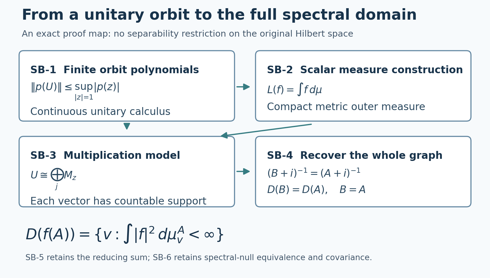

# Operator foundations: spectral domains, normal topology and scalar analysis

*Original exposition and illustration sources are dedicated under CC0-1.0 to the extent of any rights held. Independently reviewed at the stated earlier inputs.*

The two candidates use the following precise foundational boundary: Hilbert completeness and elementary set theory with the maximal principle; scalar Borel measure/integration with monotone and dominated convergence. The spectral multiplication theorem, including its full domains on arbitrary Hilbert spaces, is proved in SB-1–SB-6 below. Concrete von Neumann algebras are characterized by the bicommutant property. Normal functionals mean the continuous functionals for the concrete ultraweak vector-series topology. The lemmas below prove orthogonal projection, the required scalar contour facts, and the extra arbitrary-Hilbert, vector-integral, intrinsic-topology and strip arguments. The scalar-measure inputs are proved in the earlier SC lesson; the maximal principle follows from the earlier CF Section 1 at its explicit choice convention.

The spectral statement used here is proved below through a unitary calculus and explicit scalar measure construction. For the concrete algebra definition see [Jones's author notes, Theorem 3.2.2 and Corollary 3.2.3, printed 12](https://math.berkeley.edu/~vfr/MATH20909/VonNeumann2009.pdf#page=12). The concrete topology terminology agrees with [Shalit's author lecture, Definitions 8–10](https://noncommutativeanalysis.wordpress.com/2017/06/05/introduction-to-von-neumann-algebras-lecture-7-von-neumann-algebras-as-dual-spaces-various-topologies/). No theorem about positive extensions is used below.

## SF-0. Two elementary Hilbert facts

For a closed subspace \(N\) and a vector \(x\), let \(d\) be the distance from \(x\) to \(N\). Choose \(y_n\) in \(N\) with \(\|x-y_n\|^2\leq d^2+1/n\). The parallelogram identity gives \(\|y_n-y_m\|^2\leq2/n+2/m\) because their midpoint lies in \(N\). Completeness and closedness give a limit \(y\) in \(N\) attaining the distance. Variation of \(y\) by a real and then a purely imaginary multiple of any vector in \(N\) shows \(x-y\) is orthogonal to \(N\). This proves the unique orthogonal projection and the corresponding orthogonal decomposition used below.

The adjoint of a densely defined operator is closed. If \(v_n\) tends to \(v\) and \(A^*v_n\) tends to \(w\), pair the adjoint identity with every \(x\in D(A)\) and pass to the limit; the resulting identity is exactly \(v\in D(A^*),\ A^*v=w\). In particular a self-adjoint operator is closed. These are complete local proofs, not additional imports.

**Commutant-unitary test.** Let \(T\) be bounded and commute with every unitary of \(M'\). Since \(M\) is closed under adjoints, taking adjoints of its commutation identities shows that \(M'\) is closed under adjoints as well. For a bounded self-adjoint \(b\in M'\), the norm-convergent series for \(e^{itb}\) belongs to \(M'\): each partial sum commutes with \(M\), and so does its norm limit. Taking adjoints termwise gives \((e^{itb})^*=e^{-itb}\); multiplying the absolutely convergent series and using the binomial identity gives \(e^{itb}e^{-itb}=1\), so it is unitary. Its norm difference quotient tends to \(ib\), as follows by bounding the exponential-series remainder after its linear term by \(O(t^2\|b\|^2)\). Differentiate \(Te^{itb}=e^{itb}T\) in operator norm at zero to obtain \(Tb=bT\). Every \(x\in M'\) is \(b+ic\) for the bounded self-adjoint elements \(b=(x+x^*)/2\), \(c=(x-x^*)/(2i)\) of \(M'\). Hence \(Tx=xT\) for all of \(M'\), and the bicommutant definition gives \(T\in M\).

## SB-0. Exact inputs and conventions

The maximal principle follows from the explicit axiom-of-choice convention by the proof in [CF Section 1](OA-FLOW-CF.md#oa-flow.cf.1). The scalar-measure proof inputs below retain their separate obligations.

We use complex Hilbert spaces with the inner product linear in the first variable, their defining completeness, elementary real/complex arithmetic and metric compactness, and the maximal principle. Orthogonal projection and the closedness of adjoints are proved in SF-0 above. A bounded adjoint can be constructed from the Hilbert representation fact as follows. For a nonzero continuous linear functional, project onto its closed kernel; its orthogonal complement is one-dimensional, since subtracting a suitable multiple of one nonzero complementary vector puts any other vector in the kernel. Evaluating on that vector gives the unique representing vector, with the same norm. Apply this separately to the bounded functional \(x\mapsto\langle Tx,y\rangle\) to obtain \(T^*y\), its linearity and boundedness, and the adjoint identity. We use no independent spectral theorem in this Hilbert input.

The scalar inputs are complete earlier proofs in [Scalar measure, convergence and calculus](OA-FLOW-SC.md), with the following exact section bindings:

- [SC-01–02](OA-FLOW-SC.md#sc-01): the outer-measure theorem, Borel Lebesgue measure and interval length/translation/scaling.
- [SC-03–05](OA-FLOW-SC.md#sc-03) and [SC-07](OA-FLOW-SC.md#sc-07): simple integration, continuity of measures, monotone convergence, countable nonnegative sums, and scalar dominated convergence.
- [SC-00](OA-FLOW-SC.md#sc-00) and [SC-06–07](OA-FLOW-SC.md#sc-06): Hölder, Minkowski, completeness of \(L^p\), simple approximation, and the linear-first \(L^2\) Hilbert structure. Their proofs use only the preceding scalar results; no Hilbert spectral theorem occurs.
- [SC-00](OA-FLOW-SC.md#sc-00), [SC-02](OA-FLOW-SC.md#sc-02), [SC-05](OA-FLOW-SC.md#sc-05) and [SC-08–09](OA-FLOW-SC.md#sc-08): the equality of continuous Lebesgue and Riemann integrals, the fundamental theorem and one-variable substitution, with proofs of the elementary differential facts used there.

These complete scalar proof bodies precede this lesson, at the explicit CF Section 1 and primitive conventions. The substantive spectral and operator steps needed below are proved here. No Tonelli theorem, general Stone–Weierstrass theorem, Gelfand theorem, or Banach algebra spectral-radius theorem is an input.

Write \(\mathbb T=\{z:|z|=1\}\). Normalized circle integration means \(\int_{-\pi}^{\pi}F(e^{it})\,dt/(2\pi)\), using the scalar measure just specified. The elementary exponential/trigonometric identities may be defined by their absolutely convergent power series; uniform convergence of those series and of their derivative series on compact intervals gives the usual derivatives. The scalar fundamental theorem therefore gives
\[
\int_{-\pi}^{\pi} e^{ikt}\,\frac{dt}{2\pi}=\begin{cases}1,&k=0,\\0,&k\in\mathbb Z\setminus\{0\}.\end{cases}
\tag{SB0}
\]
Integrals of squared norms of the finite vector polynomials below mean their finite scalar inner-product expansions; no vector integration theorem is required.

## SB-1. Continuous calculus of a unitary from finite orbit polynomials

Let \(U\) be any unitary on any Hilbert space. For \(N\geq1\), define the vector polynomial
\[
W_Nx(z)=N^{-1/2}\sum_{k=0}^{N-1}z^kU^{-k}x.
\tag{SB1}
\]
Expanding its squared norm and using (SB0) gives \(\|W_Nx\|_2=\|x\|\). The space of these finite vector polynomials has the integral inner product. It satisfies Cauchy–Schwarz by the nonnegativity of \(\|F-aG\|_2^2\), and hence the triangle inequality; no completion of that space is needed. The two endpoints of the finite sum give
\[
W_NUx-zW_Nx=N^{-1/2}(Ux-z^NU^{-(N-1)}x),
\qquad \|W_NUx-zW_Nx\|_2\leq 2N^{-1/2}\|x\|.
\tag{SB2}
\]
Multiplication by \(z\) is an isometry in this norm. Telescoping (SB2) proves, for every positive integer \(r\),
\[
\|W_NU^rx-z^rW_Nx\|_2\leq 2rN^{-1/2}\|x\|.
\]
Apply (SB2) to \(U^{-1}x\), rearrange and multiply by \(z^{-1}\) to obtain the corresponding estimate for \(r=-1\); telescoping gives the same bound with \(|r|\) for every integer \(r\). Therefore, if \(p(z)=\sum_{r=-d}^{d}c_rz^r\),
\[
\begin{aligned}
\|p(U)x\|
&=\|W_Np(U)x\|_2\\
&\leq\|pW_Nx\|_2+\frac{2}{\sqrt N}\sum_r|r c_r|\,\|x\|\\
&\leq\left(\|p\|_{C(\mathbb T)}+\frac{2}{\sqrt N}\sum_r|r c_r|\right)\|x\|.
\end{aligned}
\]
Let \(N\to\infty\). We have proved the exact inequality
\[
\|p(U)\|\leq\sup_{z\in\mathbb T}|p(z)|.
\tag{SB3}
\]
In particular, no choice of a Laurent-polynomial representation of a function changes its operator value.

Here is the needed uniform approximation proof. Put
\[
K_N(t)=\frac1N\left|\sum_{k=0}^{N-1}e^{ikt}\right|^2.
\]
It is a nonnegative trigonometric polynomial and its normalized integral is one, by (SB0). For \(0<\delta\leq|t|\leq\pi\), the geometric-series identity gives
\[
K_N(t)=\frac{\sin^2(Nt/2)}{N\sin^2(t/2)}\leq\frac1{N\sin^2(\delta/2)}.
\tag{SB4}
\]
For continuous \(f\) on the circle, define
\[
f_N(e^{it})=\int_{-\pi}^{\pi}K_N(s)f(e^{i(t-s)})\,\frac{ds}{2\pi}.
\]
Expanding the finite trigonometric sum and changing variables over a full period shows that \(f_N\) is a Laurent polynomial in \(e^{it}\). A change of the initial point of a full-period integral follows by splitting the interval and translating one piece; thus it uses only the scalar substitution already bound in SB-0. Uniform continuity, positivity and unit mass of the kernel give
\[
\|f_N-f\|_\infty\leq\omega_f(\delta)+\frac{2\|f\|_\infty}{N\sin^2(\delta/2)},
\tag{SB5}
\]
where \(\omega_f(\delta)=\sup_{t,|s|\leq\delta}|f(e^{i(t-s)})-f(e^{it})|\). First make \(\delta\) small, then \(N\) large. Thus Laurent polynomials are uniformly dense in \(C(\mathbb T)\), with a proved approximation procedure.

For any uniformly approximating polynomials \(p_n\to f\), (SB3) makes \(p_n(U)\) norm Cauchy. Completeness of \(B(H)\) follows directly here: an operator-norm Cauchy sequence has a limit at each vector by Hilbert completeness; the pointwise limit is linear and bounded, and the uniform Cauchy bound gives convergence in operator norm. Define \(\rho_U(f)\) to be that limit. The result is independent of the approximation. Polynomial multiplication and conjugation, the bounds and continuity of bounded operator multiplication show that
\[
\rho_U:C(\mathbb T)\longrightarrow B(H)
\]
is a contractive unital *-homomorphism taking the coordinate \(z\) to \(U\). If \(f\geq0\), its ordinary continuous square root satisfies \(\rho_U(f)=\rho_U(\sqrt f)^*\rho_U(\sqrt f)\geq0\). This finishes the continuous unitary calculus. Its injectivity on the whole circle is neither claimed nor needed.

## SB-2. A compact metric positive functional has a representing measure

Let \(K\) be compact metric and let \(L:C(K,\mathbb R)\to\mathbb R\) be positive and real-linear. Put \(c=L(1)\geq0\). Since \(-\|f\|_\infty1\leq f\leq\|f\|_\infty1\), positivity gives \(|L(f)|\leq c\|f\|_\infty\). If \(c=0\), \(L=0\) and the zero measure works. The following construction also covers that case.

For an open \(O\subseteq K\), set
\[
m(O)=\sup\{L(f):f\in C(K,\mathbb R),\ 0\leq f\leq1,\ \operatorname{supp}f\subseteq O\}.
\tag{SB6}
\]
The support is closed, hence compact; the zero function is allowed. We have \(m(K)=c\), \(m(\varnothing)=0\), monotonicity, and \(m(O)\leq c\).

We supply the finite partition needed for countable subadditivity. Suppose a compact \(C\) is covered by open sets \(O_j\). At every \(x\in C\), choose a metric ball whose closed double-radius ball lies in one of the \(O_j\); a finite collection of the smaller balls covers \(C\). Continuous distance bumps equal to one on the smaller closed balls and zero outside the larger balls have supports in their assigned \(O_j\). Group them by \(j\), obtaining finitely many \(b_j\geq0\), supported in \(O_j\), with \(b=\sum b_j>0\) on \(C\). Compactness bounds \(b\) below by a positive number on \(C\). If \(0\leq f\leq1\) has support \(C\), put \(f_j=fb_j/b\) where \(b>0\), and zero where \(b=0\). These functions are continuous: near the zero set of \(b\), \(f=0\), because that set is disjoint from the compact support of \(f\). They satisfy \(0\leq f_j\leq1\), \(\operatorname{supp}f_j\subseteq O_j\), and \(\sum f_j=f\).

Apply this to any test function supported in \(O=\bigcup_{j\geq1}O_j\), using a finite subcover of its support. We obtain
\[
m(O)\leq\sum_{j\geq1}m(O_j).
\tag{SB7}
\]
For disjoint open \(O,V\), tests \(f,g\) for them satisfy \(f+g\leq1\) and have union support in \(O\cup V\). Taking independent suprema gives \(m(O\cup V)\geq m(O)+m(V)\). The reverse inequality is (SB7). The same argument gives finite superadditivity on pairwise disjoint open sets.

For every subset \(A\subseteq K\), define
\[
\mu^*(A)=\inf_{O\supseteq A,\ O\text{ open}}m(O).
\tag{SB8}
\]
This is an outer measure: to bound a countable union, choose each open cover within \(\varepsilon2^{-j}\) of its infimum, unite them, apply (SB7), and let \(\varepsilon\downarrow0\). Its value on an open set is \(m(O)\), by monotonicity and the permitted choice of \(O\) itself. Moreover it is additive on sets at positive distance. Indeed, disjoint small metric neighborhoods of two such sets, intersected with any common open cover, and finite superadditivity give the lower bound by their two outer measures. Subadditivity gives the reverse inequality.

We prove that every closed \(F\) is measurable for this outer measure; this is the only extra issue beyond SB-0's outer-measure theorem. For arbitrary \(A\), put
\[
B=A\setminus F,\quad B_n=A\cap\{x:d(x,F)\geq2^{-n}\},\quad C_n=B_{n+1}\setminus B_n\quad(n\geq1).
\]
For \(F=\varnothing\), measurability is immediate; otherwise the distance is the ordinary distance function. We have \(B_n\uparrow B\). Within either parity of \(n\), any finite collection of the shells \(C_n\) is pairwise separated by positive distances: the function \(d(\cdot,F)\) is 1-Lipschitz and the corresponding nonadjacent distance intervals have a positive gap. Repeated separated additivity and the bound \(\mu^*(K)=c\) show that each of the two series \(\sum_{n\text{ even}}\mu^*(C_n)\), \(\sum_{n\text{ odd}}\mu^*(C_n)\) is finite. Since
\[
B=B_N\cup\bigcup_{n\geq N}C_n,
\]
subadditivity gives \(\mu^*(B)\leq\mu^*(B_N)+\sum_{n\geq N}\mu^*(C_n)\). The tail tends to zero, so \(\mu^*(B_N)\to\mu^*(B)\). The sets \(A\cap F\) and \(B_N\) are separated, whence
\[
\mu^*(A)\geq\mu^*(A\cap F)+\mu^*(B_N).
\]
Pass to the limit. This is the required Carathéodory inequality for \(F\). Closed sets and their complements therefore are measurable, as are all Borel sets by SB-0, Theorem 1.1. Let \(\mu\) be the Borel restriction of this finite measure.

It is outer regular by (SB8). For Borel \(B\), apply outer regularity to \(K\setminus B\), choose an open \(O\supseteq K\setminus B\) with measure excess less than \(\varepsilon\), and put \(F=K\setminus O\). This compact set lies in \(B\) and \(\mu(B\setminus F)<\varepsilon\). Thus the precise compact inner regularity needed for continuous density is proved, and \(\mu(K)=c\).

We now prove representation, rather than leave it implicit in the measure construction. If \(0\leq g\leq1\) is continuous and is zero off an open set \(O\), the functions \(g_n=(g-1/n)_+\) have compact supports in \(O\), satisfy \(0\leq g_n\leq1\), and converge uniformly to \(g\). Hence
\[
L(g)\leq m(O)=\mu(O).
\tag{SB9}
\]
Fix continuous \(f\geq0\), \(\delta>0\), and an integer \(m\) with \(f\leq m\delta\). For \(0\leq j<m\), put
\[
h_j=\min(1,(f/\delta-j)_+).
\]
Pointwise \(f=\delta\sum_{j=0}^{m-1}h_j\). Each \(h_j\) is zero off \(\{f>j\delta\}\), and equals one on \(\{f>(j+1)\delta\}\). Consequently (SB9), and testing every function in (SB6) for the latter open set, give
\[
\mu(f>(j+1)\delta)\leq L(h_j)\leq\mu(f>j\delta).
\tag{SB10}
\]
The scalar simple function \(s_\delta=\delta\sum_{j=1}^{m}1_{\{f>j\delta\}}\) satisfies \(s_\delta\leq f\leq s_\delta+\delta\). The lower and upper sums from (SB10) differ by at most \(\delta\mu(K)\). Both \(L(f)\) and \(\int f\,d\mu\) therefore lie in the same interval of length at most \(\delta\mu(K)\). Let \(\delta\downarrow0\). This proves \(L(f)=\int f\,d\mu\). Positive and negative parts give every real continuous \(f\); real and imaginary parts give the corresponding complex-linear identity.

Finally, this measure is unique among finite Borel measures with the integral identity. For open \(O\ne K\), the continuous functions \(a_n(x)=\min(1,n\,d(x,K\setminus O))\) increase to \(1_O\); for \(O=K\), take one. Monotone convergence determines the measure of every open set from its continuous integrals. To see that this determines all Borel sets, use the following explicit pi-lambda argument. For two finite measures of equal total mass, their agreement class is closed under complements and countable disjoint unions. The smallest such class containing the open sets is closed under intersections: first fix an open set and apply the class property to sets whose intersection with it lies in the class; then fix an arbitrary member and repeat. In both steps, complements use differences of nested members, which follow from the class property. Because open sets are intersection-closed, both applications contain the open sets. Closure under intersections and complements gives disjointization of arbitrary countable unions, so the class is the Borel sigma-algebra. Uniqueness follows.

## SB-3. The actual multiplication representation

Apply SB-2 to \(L_x(f)=\langle\rho_U(f)x,x\rangle\) for real \(f\in C(\mathbb T)\). Positivity follows from SB-1. Let \(\mu_x^0\) be the resulting finite regular Borel measure. On the cyclic space \(H_x=\overline{\rho_U(C(\mathbb T))x}\), the map
\[
C(\mathbb T)\longrightarrow H_x,\qquad f\longmapsto\rho_U(f)x
\]
has squared norm \(\int |f|^2\,d\mu_x^0\). Continuous functions are dense in \(L^2(\mu_x^0)\): for a Borel set \(B\), the regularity proved in SB-2 gives compact \(F\subseteq B\subseteq O\) with \(\mu_x^0(O\setminus F)<\varepsilon\). When \(F\) and \(K\setminus O\) are nonempty, the continuous function
\[
a(y)=\frac{d(y,K\setminus O)}{d(y,F)+d(y,K\setminus O)}
\]
is between zero and one, is one on \(F\), and zero off \(O\). For \(F=\varnothing\), take zero; for nonempty \(F\) and \(O=K\), take one. In every case \(\|a-1_B\|_2^2\leq\mu_x^0(O\setminus F)\). Linear combinations approximate simple functions, and the exact simple approximation in SB-0 gives all of \(L^2\). Its completeness, also proved there, extends the map to a unitary onto \(H_x\). Multiplication on the dense continuous functions proves that \(U|_{H_x}\) becomes multiplication by \(z\), and that every \(\rho_U(f)\) becomes multiplication by \(f\).

Each \(H_x\) reduces \(U\) and \(U^*\). A maximal family of nonzero orthogonal such spaces fills \(H\), since a nonzero vector in its orthogonal complement would generate another member. Uniting the cyclic unitaries yields
\[
H\cong\bigoplus_{j\in J}L^2(\mu_j),\qquad U\cong\bigoplus_{j\in J}M_z.
\tag{SB11}
\]
There is no restriction on \(J\). A vector in this Hilbert sum has at most countably many nonzero components: for each \(n\geq1\), finitely many squared norms exceed \(1/n\), and the union of these sets contains every nonzero component. Coordinate completeness and a supremum over finite sums show that the direct sum is complete. The zero Hilbert space uses the empty sum.

For bounded Borel \(f\) on the circle define \(\Phi(f)=\bigoplus_j M_f\) in (SB11), and set \(E(B)=\Phi(1_B)\). These give a unital *-homomorphism and projections with strong countable additivity. More explicitly, if \(v=(v_j)\), the finite measure
\[
\mu_v(B)=\sum_j\int_B|v_j|^2\,d\mu_j
\]
has total mass \(\|v\|^2\). Only countably many terms are nonzero. The identity for simple functions, followed by monotone convergence, gives
\[
\|\Phi(f)v\|^2=\int|f|^2\,d\mu_v.
\tag{SB12}
\]
This proves strong countable additivity and bounded pointwise sequential convergence by scalar dominated convergence. For uniqueness of the Borel extension, continuous distance functions approximate open indicators, the pi-lambda argument in SB-2 gives all Borel indicators, and uniform simple approximation gives every bounded Borel function. Explicitly, partition a bounded square containing the range into finitely many Borel grid cells of side \(1/n\), and replace each value by one corner of its cell. The level sets are Borel and the error is at most \(\sqrt2/n\). Consequently neither the projections nor the calculus depend on the chosen cyclic decomposition.

## SB-4. Exact unbounded domains and the self-adjoint theorem

For clarity, here is how the full domain and Cayley steps apply without any general normal continuous-calculus import. For a finite-valued Borel \(f\), define \(f(E)v=(fv_j)_j\) exactly on
\[
D(f(E))=\left\{v:\int|f|^2\,d\mu_v<\infty\right\}.
\tag{SB13}
\]
Cutoffs \(P_n=E(|f|\leq n)\) have \(P_n\to I\) strongly and \(P_nH\subseteq D(f(E))\). If \(v_m\to v\), \(f(E)v_m\to w\), bounded cutoff multiplication gives \(\Phi(f1_{|f|\leq n})v=P_nw\); monotone convergence proves (SB13), and \(P_n\to I\) identifies the image as \(w\). This proves closedness. The adjoint pairing first gives \(\bar f(E)\subseteq f(E)^*\). Conversely the adjoint pairing tested on \(P_nH\) gives \(\Phi(\bar f1_{|f|\leq n})v=P_nw\); the same squared-integral bound gives the reverse adjoint inclusion, including domains.

The vector measure of an existing image \(g(E)v\) is \(|g|^2\mu_v\), first on indicators and then for all nonnegative integrands. Thus
\[
D(f(E)g(E))=D(g(E))\cap D((fg)(E)),\qquad f(E)g(E)=(fg)(E)
\tag{SB14}
\]
on that domain. The cutoffs \(E(|f|\leq n,|g|\leq n)\) approximate each vector of \(D((fg)(E))\) in its graph norm; hence the closure of the product is \((fg)(E)\). The identical argument with the majorant \(1+|f+g|^2\) proves the sum closure. These arguments also construct integrals and their rules for an arbitrary given strongly countably additive projection measure: first take orthogonal finite simple sums, derive their squared-norm identity, then use uniform approximation and the same cutoffs. No spectral theorem is needed to compare two such measures.

For a self-adjoint \(A\), closedness and
\[
\|(A\pm i)v\|^2=\|Av\|^2+\|v\|^2
\]
show that \(A\pm i\) have closed ranges. Their orthogonal complements are \(\ker(A\mp i)=0\), by the adjoint definition, so both ranges are all of \(H\). Put \(R=(A+i)^{-1}\) and \(U=I-2iR\). The displayed identity and the surjectivity of \(A-i\) show that \(U=(A-i)(A+i)^{-1}\) is unitary. Moreover \(I-U=2iR\) is injective, so its multiplication model has \(E_U(\{1\})=0\).

On the circle minus 1 put \(a(z)=i(1+z)/(1-z)\), and assign \(a(1)=0\). It is real-valued, so \(B=a(E_U)\) is self-adjoint by the adjoint proof above. The function \((a+i)^{-1}\) maps every vector into \(D(B)\), because \(|a/(a+i)|\leq1\). Its two products with \(B+i\) are identities on their full appropriate domains by (SB14). Since the exceptional projection is zero,
\[
(B+i)^{-1}=(I-U)/(2i)=R.
\]
Equality of these inverses implies equality of their ranges and inverse actions: \(D(B)=\operatorname{Ran}R=D(A)\) and \(B=A\). Push the circle projection measure forward under \(a\) to get \(E_A\) on the real line. The change-of-variables identity follows first on indicators, then on simple functions, then by monotone convergence; it therefore gives exactly the domain (SB13) for the coordinate and for every Borel function of \(A\).

For uniqueness, any other projection measure representing \(A\) with this full domain gives the same Cayley operator \(U\), by the arbitrary-projection-measure version of the cutoff rules above. Push it forward under \(c(t)=(t-i)/(t+i)\). Its integrals of Laurent polynomials are the corresponding polynomials of \(U,U^*\); (SB5) gives agreement with \(\rho_U\) on every continuous function on the entire circle. Bounded pointwise convergence and the proved open-set/pi-lambda argument give agreement on all Borel sets. The map \(c\) is a homeomorphism from the real line onto the circle minus 1, with inverse \(a\); neither pushforward has an atom at 1. Thus the two real-line projection measures agree. This uses uniform approximation on the whole circle, and requires neither a spectral-mapping theorem nor a support-on-operator-spectrum argument.

If \(A\geq0\), a nonzero vector in \(E_A([-n,-1/n])H\) would lie in \(D(A)\) and have negative quadratic value. These intervals cover the negative half-line, so its spectral projection is zero. If \(A\) is bounded, the squared-integral identity on a band where \(|t|\geq\|A\|+\varepsilon\) contradicts \(\|Av\|\leq\|A\|\|v\|\) unless that band's projection is zero. A countable union of bounded such bands proves \(E_A(\{|t|>\|A\|\})=0\). This also gives the bounded square roots and their norm bounds used in SB-6. The zero projection at a point is the corresponding kernel, from (SB13); thus positive injectivity means \(E_A(\{0\})=0\), not a positive lower bound. Inverse powers and \(\log A\) are defined on \((0,\infty)\) with arbitrary finite values on the null projection at zero. In particular
\[
D(A^z)=\{v:\int_0^\infty t^{2\operatorname{Re}z}\,d\mu_v^A(t)<\infty\}.
\tag{SB15}
\]
For \(|t^{is}|=1\), bounded multiplication gives the unitary group law, and dominated convergence with bound 4 gives strong continuity. The same domain identity gives its domain preservation. Spectral bands \([1/n,n]\) are full graph cores for every power: the omitted integral of \(1+t^{2\operatorname{Re}z}\) tends to zero. On a fixed band, the power series for \(exp(w\log t)\) and each differentiated series converge uniformly on compact \(w\)-sets. This proves operator-norm entire dependence there. These are exactly the spectral facts used by the two reconstructed lessons.

## SB-5. Retaining the separable reduction without weakening generality

The proof just given already applies on an arbitrary Hilbert space. It can also supply precisely the separable theorem used in the current SF-1, leaving that lemma's reducing-subspace argument intact. A countable orbit under \(R=(A+i)^{-1}\) and \(R^*=(A-i)^{-1}\) spans a separable reducing space. The resolvent adjoint equality follows by pairing the two inverse equations; their commutation follows by subtracting those equations, giving the resolvent identity. A maximal orthogonal collection of these spaces fills \(H\). Its projections \(P_j\) commute with \(R,R^*\), preserve \(\operatorname{Ran}R=D(A)\), and commute there with \(A\), since \(AR=I-iR\).

On \(P_jH\), the restriction \(A_j\) is densely defined because its two imaginary resolvents have dense ranges: the adjoint of either restricted resolvent is the other, whose kernel is zero. The restriction is symmetric, and both imaginary shifts are onto. To check self-adjointness, for \(v\in D(A_j^*)\) solve \((A_j-i)w=(A_j^*-i)v\). The difference \(v-w\) is in \(\ker(A_j^*-i)=\operatorname{Ran}(A_j+i)^\perp=0\). Thus the domains agree.

Apply SB-1–4 to \(A_j\). If a single scalar \(L^2\) multiplication space is wanted in the separable theorem, its orthogonal family of nonzero cyclic spaces is countable: disjoint radius-\(1/3\) balls about one unit vector from each meet distinct members of a fixed countable dense set. A countable sum of the finite measure spaces is a sigma-finite scalar space with multiplication coordinate \(a(z)\). It can be made finite without changing the multiplication model: choose positive constants \(w_j=2^{-j}/(1+\mu_j(\mathbb T))\); replace \(\mu_j\) by \(w_j\mu_j\) and a vector function by \(w_j^{-1/2}\) times itself. The norm and multiplication identities are unchanged. For a finite family use the same formula; the zero space is separate. This verifies the usual separable multiplication formulation rather than only asserting a projection measure.

Finally the full sum domain is
\[
D(A)=\{(v_j):v_j\in D(A_j),\ \sum_j\|A_jv_j\|^2<\infty\}.
\tag{SB16}
\]
One inclusion follows by commuting \(P_j\) through \(A\). Conversely a vector and its proposed image have square-summable components and hence countable support. Finite partial sums converge in both coordinates of the graph; closedness of \(A\) proves the reverse inclusion. This establishes arbitrary-Hilbert scope without assuming a countable decomposition of the whole space.

## SB-6. Borel conventions, affiliation and normal transport

The input to \(f(A)\) is a pointwise Borel function, finite except possibly on a Borel set of spectral projection zero, where a finite value is chosen. Functions have the same calculus precisely when \(E_A(\{f\ne g\})=0\). One direction follows from (SB13). For the other, if the two closed operators agree, cut to the sets where \(|f|,|g|\leq n\) and \(|f-g|\geq1/m\). Every vector in such a spectral subspace lies in both domains; the squared-norm identity forces that projection to be zero. Taking the countable union proves the claim. Equality modulo ordinary Lebesgue-null sets on the real line is not a valid convention for an arbitrary \(A\).

In a scalar summand \(L^2(\mu_j)\), functions and multipliers are identified modulo \(\mu_j\)-null sets. If completed scalar measures are used, every completion-measurable function has a Borel representative: approximate it by measurable simple functions, replace each of the finitely many level sets by a Borel set differing within a Borel null set, and unite the exceptional sets over the sequence. Outside that Borel null union the resulting Borel simple functions converge to the original function. Their convergence set is Borel by the countable Cauchy criterion; define the limit there and zero elsewhere. This proves the representative statement without identifying the completed sigma-algebra with the Borel sigma-algebra.

For a unitary \(W:H\to K\), the conjugated projections \(WE_A(B)W^{-1}\) are strongly countably additive and represent \(WAW^{-1}\) on \(WD(A)\), by simple integrals and graph cutoffs. Spectral uniqueness proves covariance. For antiunitary \(W\), the same argument applies to real functions; general scalar coefficients are conjugated. Thus domains transport and \(Wf(A)W^{-1}=\bar f(WAW^{-1})\) in the antiunitary case. This proves the covariance premise noted but not bound in the original SF-1.

Here a concrete von Neumann algebra is specified by \(M=M''\). Suppose every unitary \(v\in M'\) preserves \(D(A)\) and commutes with \(A\) there. Covariance gives commutation of \(v\) with every \(E_A(B)\). To pass from these unitaries to all of \(M'\), let \(b\in M'\), write \(b=s+it\) with bounded self-adjoint \(s,t\in M'\), and scale each nonzero part to a contraction \(q\). The just-proved bounded self-adjoint calculus gives \(r=(I-q^2)^{1/2}\), commuting with \(q\), and \(u=q+ir\) is unitary with \(q=(u+u^*)/2\). Moreover \(r\in M'\): each \(x\in M\) commutes with \(q\); hence it commutes with its resolvents, their Laurent polynomials, their continuous limits from SB-1, and their bounded Borel limits from SB-3. Thus \(u\in M'\). Each \(b\) is a linear combination of four such unitaries, so \(E_A(B)\in(M')'=M\).

Conversely, if every spectral projection lies in \(M\), a unitary in \(M'\) commutes with bounded simple integrals and with their uniform limits. The squared-integral domain test, or its increasing bounded truncations, shows preservation of \(D(A)\); graph cutoffs show commutation with its action. This proves the two affiliation definitions equivalent. Bounded Borel functions of an affiliated self-adjoint operator lie in \(M\), by the same simple approximation.

For completeness, a bounded operator commuting with a unitary \(U,U^*\) commutes first with its Laurent polynomials, then its continuous calculus, then open projections, all Borel projections by the pi-lambda argument, and finally every bounded Borel function. This is the commutation used in the preceding paragraph and does not require a Fuglede theorem.

Let \(\pi:M\to B(K)\) be a normal unital representation, where normal means continuous for the concrete ultraweak topology generated by the tests \(x\mapsto\sum_j\langle x\xi_j,\eta_j\rangle\) with \(\sum_j\|\xi_j\|^2,\sum_j\|\eta_j\|^2<\infty\). For uniformly bounded strongly convergent operators, each such test converges: finitely many terms converge and the absolute tail is bounded uniformly by the operator bound times \(\sum_{j>N}\|\xi_j\|\|\eta_j\|\), which tends to zero by scalar Cauchy–Schwarz. Thus if \(E_n\uparrow E\) are spectral projections, strong convergence and their uniform bound imply ultraweak convergence, and normality gives \(\pi(E_n)\to\pi(E)\) ultraweakly. Since these are increasing projections,
\[
\|(\pi(E)-\pi(E_n))\eta\|^2=\langle(\pi(E)-\pi(E_n))\eta,\eta\rangle\longrightarrow0.
\]
Disjoint sums now give strong countable additivity of \(B\mapsto\pi(E_A(B))\). Its total projection is \(I\), and zero projections remain zero. This defines the transported self-adjoint operator and all its domains by (SB13). Uniform simple approximation proves the transport identity for bounded Borel functions. A unital *-homomorphism is contractive here without an additional import: for \(x\in M\), the square root of the positive operator \(\|x\|^2I-x^*x\) belongs to \(M\) by the bounded self-adjoint calculus just proved; applying \(\pi\) gives \(\pi(x)^*\pi(x)\leq\|x\|^2I\). In a degenerate representation apply the same argument on the support \(\pi(1)K\). No equality of unbounded products is inferred without its squared-integral domain test.

*Proof map, not a spectral plot. SB-1 controls each finite orbit polynomial by a scalar circle norm; SB-2 constructs its scalar measures; SB-3 makes the unitary multiplication; SB-4 recovers the entire graph of \(A\) through the equal resolvents. The bottom formula is the exact domain test, including unbounded functions. Source and rendering script are retained beside this candidate.*

## SF-1. Spectral domains, reducing sums and covariance

Let \(A\) be self-adjoint on an arbitrary Hilbert space. The identity

\[
\|(A\pm i)v\|^2=\|Av\|^2+\|v\|^2
\]

gives closed range, using closedness of \(A\). Its orthogonal complement is the kernel of \(A\) with the opposite imaginary shift, hence zero. Therefore \(R=(A+i)^{-1},\quad R^*=(A-i)^{-1}\) are bounded and everywhere defined; their resolvent identity shows they commute.

Given a vector, its countable orbit under all monomials in \(R\text{ and }R^*\) spans a separable reducing subspace. A maximal orthogonal family of these subspaces fills the whole Hilbert space: the orthogonal complement, if nonzero, would contain another orbit. Let the resulting projections be \(P_j\). They commute with both resolvents and consequently preserve \(D(A)=\operatorname{Ran}R\) and commute with \(A\) there, because \(AR=1-iR\). The restriction \(A_j\) is densely defined, symmetric and has both imaginary resolvents everywhere defined on \(P_jH\). It is self-adjoint: if \(v\) is in its adjoint domain, solve \((A_j-i)w=(A_j^*-i)v\) and use \(\ker(A_j^*-i)=\operatorname{Ran}(A_j+i)^\perp=\{0\}\) to conclude \(v=w\).

Apply the separable multiplication theorem proved in SB-1–SB-5 above to each restriction. The complete domain of their orthogonal sum is

\[
D(A)=\{v=(v_j):v_j\in D(A_j),\ \sum_j\|A_jv_j\|^2<\infty\}.
\tag{SF1}
\]

The forward inclusion uses \(P_jA=AP_j\). For the reverse inclusion, each vector has at most countably many nonzero components; its finite sums and their \(A\)-images converge, so closedness gives membership in \(D(A)\). This countability concerns one vector, not the dimension of the Hilbert space.

The direct sum of the spectral measures is strongly countably additive, as follows by applying the squared Hilbert norm to each vector and summing its countable components. For every Borel function \(f\), finite off a set of spectral projection zero, its multiplication calculus has exactly

\[
D(f(A))=\{v:\int |f|^2\,d\mu_v^A<\infty\},\qquad
\|f(A)v\|^2=\int |f|^2\,d\mu_v^A,
\quad \mu_v^A(E)=\langle E_A(E)v,v\rangle.
\tag{SF2}
\]

All measures \(\mu_v^A\) are finite. In particular \(e^{itA}\) is a strongly continuous unitary group, preserves \(D(A)\), and has derivative \(iAe^{itA}v\) there: use \(|(e^{itx}-1)/t|\leq|x|\) and dominated convergence in (SF2). Every limit here has a real or complex metric parameter, so applying scalar dominated convergence along sequences suffices.

For self-adjoint operators we use the spectral-projection definition of affiliation: every \(E_A(E)\) belongs to \(M\). Finite Borel simple functions and uniform approximation then put every bounded spectral function in \(M\). A unitary in \(M'\) commutes with those functions and all spectral projections; (SF2) shows that it preserves \(D(A)\), and graph cutoffs give commutation with \(A\) there. Thus all domain commutations needed below are proved from this definition. SB-6 proves that this is equivalent to commutant invariance of the full unbounded graph, using the locally proved spectral covariance. For positive injective \(A\), zero has spectral projection zero; logarithms and inverse powers are consequently meaningful through (SF2), even when zero belongs to the spectrum.

For positive injective \(A\) put \(e_n=1_{[1/n,n]}(A)\). Then \(e_n\) increases strongly to 1, and for \(v\) in \(D(A)\), \(e_nv\) converges to \(v\) together with \(Ae_nv\). This is its full graph core. A normal unital representation \(\pi\) transports the spectral projections to a strongly countably additive spectral measure. Indeed, for disjoint Borel sets \(E_j\), put \(p=E_A(\bigcup_jE_j)\) and \(p_n=\sum_{j=1}^nE_A(E_j)\). The spectral measure gives \(p_n\to p\) strongly, and these projections have norm at most one. Every defining ultraweak vector-series test tends to zero on \(p-p_n\): its finite head converges by strong convergence, and Cauchy–Schwarz bounds its tail uniformly by \((\sum_{j>N}\|\xi_j\|^2)^{1/2}(\sum_{j>N}\|\eta_j\|^2)^{1/2}\). Normality therefore gives \(\pi(p_n)\to\pi(p)\) ultraweakly. Their images are projections with \(\pi(p_n)\leq\pi(p)\), so

\[
 \|(\pi(p)-\pi(p_n))\eta\|^2
 =\langle(\pi(p)-\pi(p_n))\eta,\eta\rangle\longrightarrow0.
\]

Thus \(\pi(p)=\sum_j\pi(E_A(E_j))\) strongly. Total projection \(1\) and zero kernel are preserved because \(\pi(1)=1\) and \(\pi(E_A(\{0\}))=\pi(0)=0\). Uniform approximation of bounded Borel functions by finite Borel simple functions proves transport of every bounded spectral function. These facts do not assert that a normal representation preserves unbounded products without checking their domains.

## SF-2. Bounded concrete convergence and every normal functional

In the concrete ultraweak topology, the defining linear tests have the form

\[
f(x)=\sum_j\langle x\xi_j,\eta_j\rangle,
\qquad \sum_j\|\xi_j\|^2<\infty,\quad\sum_j\|\eta_j\|^2<\infty.
\]

Let \(\omega\) be any continuous linear functional on \(M\) for that topology. Finitely many defining tests control \(\omega\) on a neighborhood of zero. Their common kernel is contained in \(\ker\omega\): otherwise scalar multiples of a vector in that kernel contradict the neighborhood bound. Hence \(\omega\) factors linearly through their finite-dimensional joint range. Extending that finite-dimensional linear functional gives a finite linear combination of the defining tests. Concatenating the series proves

\[
\omega(x)=\sum_j\langle x\alpha_j,\beta_j\rangle,
\qquad \sum_j\|\alpha_j\|\,\|\beta_j\|<\infty.
\tag{SF3}
\]

This uses no positive extension of \(\omega\). If \(\|z_r\|\leq C\) and \(z_r\) tends strongly to zero, then

\[
\omega(z_r^*z_r)=\sum_j\langle z_r\alpha_j,z_r\beta_j\rangle.
\tag{SF4}
\]

The first \(N\) terms tend to zero and the remaining absolute sum is bounded by \(C^2\) times the tail in (SF3), uniformly in \(r\). For \(\omega\) positive this proves its defining \(\sigma\text{-strong}\) seminorm tends to zero. If \(z_r^*\) also tends strongly to zero, repeat for \(z_r^*\) to obtain the \(\sigma\text{-strong-*}\) assertion. This works for arbitrary nets with the stated uniform bound. It never infers uniform boundedness merely from convergence of an arbitrary net.

An intrinsic limit transfers to any normal representation: each vector seminorm there is given by a normal positive functional on \(M\). If the representation has support \(p=\pi(1)\), spectral unitaries on \(pH\) are extended by \(1-p\); their differences and derivatives are zero on the complement. This covers the degenerate case.

## SF-3. Continuous vector integrals without global separability

For a norm-continuous Hilbert-valued function \(F\) on a compact interval, uniform continuity makes its tagged Riemann sums Cauchy: pass to a common refinement and bound the difference by the interval length times the two oscillation bounds. Completeness defines the integral, linearity follows from the sums, and its norm is bounded by the integral of \(\|F\|\). Every bounded linear functional commutes with this integral. Oriented integrals have

\[
\left\|\frac1h\int_t^{t+h}F(r)\,dr-F(t)\right\|
\leq\sup_{r\text{ between }t\text{ and }t+h}\|F(r)-F(t)\|.
\tag{SF5}
\]

Subtracting the integral curve from a curve with continuous norm derivative and applying scalar inner products proves the vector fundamental theorem. No countability of the Hilbert space is involved.

If \(F\) is bounded continuous on the real line and \(p\) is a continuous integrable scalar function, the compact integrals of \(pF\) converge as the interval expands: the norm of a tail is at most \(\sup\|F\|\) times the scalar \(L^1\) tail. This defines the improper vector integrals used below. Their integral norm bound and interchange with inner products follow by the same limit. A general vector Bochner integration theorem is unnecessary.

## SF-4. Scalar analytic facts used for strips

Here holomorphic means complex differentiable at every interior point; continuity of the derivative is not assumed. We give the contour arguments needed in the candidates. Free author treatments of the scalar background are [Vizeff, Lecture 9](https://math.berkeley.edu/~avizeff/complex_analysis_S26/lecture_9.html#Thmthmx1) and [Lecture 11](https://math.berkeley.edu/~avizeff/complex_analysis_S26/lecture_11.html#Thmthmx3). We use positive contour orientation and denominator \(w-z\) consistently.

**Rectangle Cauchy theorem.** Let \(f\) be holomorphic on a neighborhood of a closed rectangle \(R\), and let \(I(R)\) be its boundary integral. Subdivide \(R\) into four congruent rectangles. Their interior edges cancel, so one child has integral modulus at least \(|I(R)|/4\). Continue with that child. The nested rectangles \(R_n\) have diameter and perimeter respectively \(d/2^n\) and \(l/2^n\) and share a limiting point \(z_0\). Differentiability there gives \(f(z)=f(z_0)+f'(z_0)(z-z_0)+o(|z-z_0|)\). The constant and linear terms integrate to zero by direct primitives. Consequently \(|I(R_n)|\leq\varepsilon_n dl/4^n\), where \(\varepsilon_n\) tends to zero. The selection inequality implies \(|I(R)|\leq\varepsilon_n dl\) for every \(n\), hence \(I(R)=0\). This proof needs no continuous derivative and applies also to rectangles chosen within a larger open domain.

**Integral formula and power series.** Let \(z\) lie inside \(R\). Remove a sufficiently small axis-parallel square centered at \(z\). Its complement in \(R\) is the union of four rectangles with disjoint interiors; the previous result applied to \(f(w)/(w-z)\) and cancellation of all shared edges show that the positively oriented outer integral equals the positively oriented small-square integral. On a square of half-side \(\rho\), the integral of \(1/(w-z)\) is \(2\pi i\): the right side has parametrization \(w-z=\rho(1+it),\ -1\leq t\leq1\), whose integral is \(i\pi/2\), and the other three sides give the same result by rotation. The integral of \((f(w)-f(z))/(w-z)\) is bounded by 8 times the maximum of \(|f(w)-f(z)|\) on that square and tends to zero. Thus

\[
f(z)=\frac1{2\pi i}\int_{\partial R}\frac{f(w)}{w-z}\,dw.
\tag{SF6}
\]

For \(R\) centered at \(z_0\), geometric expansion of the kernel is uniform when \(|z-z_0|\) is smaller than the distance from \(z_0\) to its boundary. Termwise integration gives the local power series, with coefficients bounded by the contour length times \(\sup|f|\) divided by \(2\pi\) times the corresponding power of that distance. In particular derivatives of holomorphic functions are holomorphic. Integrating the power series on a smaller circle, and then geometrically expanding its Cauchy kernel, gives the circle Cauchy formula and the sharper coefficient bound \(\sup_{\mathrm{circle}}|f|/r^n\). For a circle inside a horizontal strip, one may first choose a slightly larger centered rectangle still in the strip, so every circle used in the candidates is covered. The first nonzero power-series coefficient makes a zero isolated; this proves the identity theorem on connected domains by the usual open-and-closed propagation of zero neighborhoods.

Here are the additional consequences needed, with proofs. A real harmonic function \(q\) continuous on a closed rectangle has its maximum on the boundary. Add \(\varepsilon\) times the squared Euclidean norm of the coordinate. The result has strictly positive Laplacian, so an interior maximum, whose Hessian has nonpositive trace, is impossible. Let \(\varepsilon\) decrease to zero. For a holomorphic \(f\) the same proof applies to \(|f|^2\), whose Laplacian is \(4|f'|^2\geq0\). This gives the rectangle modulus maximum principle.

If a continuous function on a disk has zero integrals around all sufficiently small axis-parallel rectangles, it is holomorphic. Indeed integrate it from the disk center first horizontally and then vertically. Rectangle cancellation makes local changes of this path harmless. The increment along a two-segment path from \(z\) to \(z+h\) is \(hf(z)\) plus an error bounded by \(\sqrt{2}\,|h|\) times the oscillation of \(f\) nearby. The primitive therefore has derivative \(f\); Cauchy's formula shows its derivative is holomorphic. This is the local rectangular Morera argument, also developed in [Vizeff, Lecture 11, version 2](https://math.berkeley.edu/~avizeff/complex_analysis_S26/lecture_11.html#Thmthmx2).

In particular, a holomorphic function below a real interval, continuous and zero on that interval, extends holomorphically by zero across it. For a crossing rectangle, cut a distance \(\varepsilon\) away from the interval. The integrals on the two sides vanish; continuity and the zero trace remove the intervening pieces as \(\varepsilon\) tends to zero. The preceding rectangle criterion applies, and the local identity theorem makes the extension zero. This proves uniqueness from a real boundary interval without presupposing a strip uniqueness theorem.

These lemmas and the candidates are new local proof text. They establish the displayed consequences of the explicitly retained scalar, spectral and Hilbert foundations; they do not certify every ancestor of those foundations.
