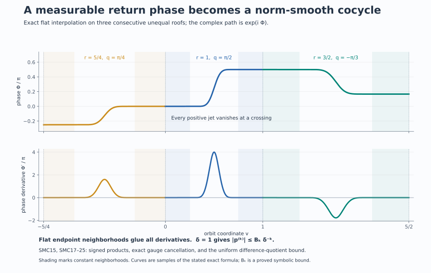

# Norm smoothing of measurable scalar cocycles

## Statement and proof ingredients

Let \(A\ne0\) be an abelian von Neumann algebra with separable predual, and let \(\alpha:\mathbb R\to\operatorname{Aut}(A)\) be a point-ultraweakly continuous ergodic action. A measurable unitary cocycle means a weakly Borel map \(t\mapsto c_t\in\mathcal U(A)\) with
\[
 c_{s+t}=c_s\alpha_s(c_t)\qquad(s,t\in\mathbb R).
 \tag{SMC1}
\]
Weak Borel measurability means that every normal functional has Borel scalar pairing with \(c_t\). Strong continuity, when included in the definition of a cocycle, is more than is needed here.

**Theorem.** There is \(b\in\mathcal U(A)\) such that
\[
 d_t=b\,c_t\,\alpha_t(b^*)
 \tag{SMC2}
\]
is a \(C^\infty\) map from \(\mathbb R\) to the Banach space \(A\) with its operator norm. This includes transitive and one-point actions.

The relevant point models and strictification have already been proved in [L41's whole-algebra compact model](OA-FLOW-L41.md#oa-flow.cstd.setup), [L37's cohomologous strictification](OA-FLOW-L37.md#oa-flow.flowcocycle.cohomologous), and [L38's separated suspension theorem](OA-FLOW-L38.md#oa-flow.suspension.theorem). The argument below supplies the fixed-time representative step and the uniform estimates needed to pass from orbitwise interpolation to norm differentiability.

## 1. Representatives valid at every fixed time

Use L41's compact metric model for the whole algebra, applying its construction with the algebra and its specified abelian subalgebra both equal to \(A\). Reversing its point-flow parameter gives
\[
 A=L^\infty(X,\mu),\qquad \alpha_t(f)=f\circ F_t.
 \tag{SMC3}
\]
Here \(F\) is a strict jointly Borel nonsingular flow, continuous in the compact model. Replace \(\mu\) by an equivalent probability measure. This changes neither \(A\) nor its norm. We first construct a Borel function \(C:\mathbb R\times X\to\mathbb T\) representing \(c_t\) for every fixed \(t\).

The unitary classes in \(L^2(X,\mu)\) have a countable dense subset \((v_j)\). Indeed \(L^2\) is separable, and its countable open base restricts to a countable base on the unitary classes; choosing one point from each nonempty basic open set gives a countable dense subset. Choose everywhere circle-valued Borel representatives \(V_j\). To obtain such a representative, replace the level sets of a sequence of simple approximants by Borel sets, take its Borel pointwise limit where it exists, and set it equal to \(1\) elsewhere.

For each \(n\ge1\), let \(j_n(t)\) be the first index such that
\[
 \|c_t-v_{j_n(t)}\|_2<2^{-3n},\qquad
 B_n(t,x)=V_{j_n(t)}(x).
 \tag{SMC4}
\]
This index is Borel, because
\[
 \|c_t-v_j\|_2^2
       =2-2\operatorname{Re}\int_X\overline{V_j}\,c_t\,d\mu
 \tag{SMC5}
\]
is Borel by the stated weak measurability. The countable partition according to \(j_n(t)\) makes \(B_n\) jointly Borel.

Fix any \(t\). Cauchy–Schwarz and (SMC4) give
\[
 \sum_{n=1}^{\infty}
 \int_X|B_{n+1}(t,x)-B_n(t,x)|\,d\mu(x)
 \le \sum_{n=1}^{\infty}(2^{-3(n+1)}+2^{-3n})<\infty.
 \tag{SMC6}
\]
Thus \(B_n(t,x)\) converges for almost every \(x\). Its limit is circle-valued; dominated convergence and (SMC4) identify its \(L^2\) class with \(c_t\). Define \(C\) to be this limit on the Borel convergence set and \(1\) elsewhere. We have proved
\[
 [C(t,\cdot)]=c_t\quad\text{for every }t.
 \tag{SMC7}
\]
The exceptional set in \(X\) may depend on \(t\). No intersection over all real times has been taken.

For each fixed pair \((s,t)\), (SMC1), (SMC7), and nonsingularity imply
\[
 C(s+t,x)=C(s,x)C(t,F_sx)
 \quad\text{for almost every }x.
 \tag{SMC8}
\]
These are precisely the hypotheses of L37's path-space strictification. It produces one invariant conull Borel set and a Borel cochain \(a:X\to\mathbb T\) on which a strict Borel cocycle \(\sigma\) satisfies
\[
 \sigma(t,x)=a(F_tx)C(t,x)\overline{a(x)}
 \quad\text{almost everywhere for each fixed }t.
 \tag{SMC9}
\]
Its cocycle equation holds for all times and all points of the retained model. L37 proves this using a repaired equivariant map into the quotient of the path space by constant paths; it does not require proper ergodicity or a common exceptional set for the original cocycle.

If \(g\) smooths \(\sigma\) in the convention
\(g(x)\sigma(t,x)\overline{g(F_tx)}\), then
\[
 b(x)=g(x)\overline{a(x)}
 \tag{SMC10}
\]
smooths \(c\). Substitution in (SMC9) proves this equality in \(A\) for every \(t\). We may therefore work with the strict cocycle \(\sigma\).

The countable selection above also explains a useful refinement of [TCC's dyadic representative argument](OA-FLOW-TCC.md#tcc-3). Under strong continuity, its dyadic approximation errors are summable for each fixed time before integration in time. That observation yields (SMC7) as well. The proof here applies directly to weak Borel cocycles and needs no continuity upgrade.

## 2. A single orbit, including all stabilizers

Suppose the measure is concentrated on one orbit. In the continuous point model its stabilizer \(H\) is closed. The orbit map gives a Borel isomorphism \(\mathbb R/H\to X\) onto that orbit: the quotient is standard Borel, the map is injective and Borel, and the [proved Borel-image and inverse theorem](../../NCG-FOLIATIONS/companions/src/polish-spaces-and-standard-borel-spaces.md#4-borel-maps-between-souslin-spaces) applies. The invariant conull strictification set contains the entire orbit as soon as it contains one of its points.

Choose the point represented by \(H\). Then
\[
 \chi(h)=\sigma(h,H)\quad(h\in H)
 \tag{SMC11}
\]
is a Borel character of \(H\). It is continuous by the positive-Haar-set automatic-continuity argument in [L42](OA-FLOW-L42.md#oa-flow.centerg.strict): a small target neighborhood has a positive-measure inverse-image piece after countably many translates, and the difference of that piece contains a source neighborhood.

Every closed subgroup of \(\mathbb R\) is \(\{0\}\), \(r_0\mathbb Z\) with \(r_0>0\), or \(\mathbb R\). Here is a proof. If \(H\ne\{0\}\), it has a positive element; put \(r_0=\inf(H\cap(0,\infty))\). If \(r_0>0\), a sequence of positive elements tending to \(r_0\) and closedness give \(r_0\in H\). Division by \(r_0\) leaves for each \(h\in H\) a remainder in \(H\cap[0,r_0)\), which must be zero. Thus \(H=r_0\mathbb Z\). If the infimum is zero, arbitrarily small positive \(h\in H\) allow every real number to be approximated within \(h\) by an integer multiple of \(h\). Hence \(H\) is dense and, being closed, equals \(\mathbb R\). In the first case choose \(\xi=0\). In the second choose \(\xi\) with \(e^{i\xi r_0}=\chi(r_0)\). In the third a continuous real-line character is \(e^{i\xi t}\): choose a continuous argument near zero, use the homomorphism equation there to make it additive, and then subdivide every real number into small increments. A continuous additive argument is linear: its values on rational multiples of a fixed small increment are determined by additivity, and continuity gives the remaining real values. Thus in all cases
\[
 \chi(h)=e^{i\xi h}\quad(h\in H).
\]
Set
\[
 g(t+H)=\sigma(t,H)e^{-i\xi t}.
 \tag{SMC12}
\]
The formula is independent of the representative \(t\): replacing it by \(t+h\) multiplies its factors by \(\chi(h)\) and \(e^{-i\xi h}\). It is Borel, using a Borel section of \(\mathbb R\to\mathbb R/H\), explicitly the identity, a half-open interval, or a single point in the three cases.

The strict cocycle identity now gives, for all \(s,t\),
\[
 g(t+H)\sigma(s,t+H)\overline{g(t+s+H)}
       =e^{i\xi s}.
 \tag{SMC13}
\]
The result is a scalar norm-smooth character. Its \(k\)-th norm derivative is \((i\xi)^k e^{i\xi s}1\).

There is no omitted ergodic case. If an orbit has positive measure, its Borel invariant set is conull by ergodicity. If no orbit has positive measure, the action is properly ergodic and the suspension theorem applies.

## 3. Separated roofs and legitimate values at zero height

Assume henceforth proper ergodicity. L38 gives an aperiodic nonsingular ergodic automorphism \(S\) of a standard probability base \((Z,\nu)\), a finite Borel roof \(r\), and \(\delta>0\), with
\[
 r(z)\ge\delta,\qquad
 D_r=\{(z,u):0\le u<r(z)\},\qquad (z,r(z))\sim(Sz,0).
 \tag{SMC14}
\]
Its Borel chart has a Borel inverse, preserves the whole product measure class \(\nu(dz)\,du\), and intertwines every time.

Here is why zero-height values are legitimate. The invariant conull set on which \(\sigma\) is strict meets almost every vertical fiber in a conull subset, by Fubini. Once it meets a fiber at one height, invariance under all real times includes every point of that fiber, its zero height, and every fiber above \(S^n z\). Consequently the set
\[
 Z_0=\{z:(z,0)\text{ belongs to the retained strict model}\}
\]
is Borel, conull and \(S\)-invariant. Restrict to it. This argument uses product measure and invariance; it is not evaluation of an arbitrary measurable class on a null section.

Define the signed roof sums and signed return products by
\[
 \begin{aligned}
 R_0(z)&=0,& A_0(z)&=1,\\
 R_k(z)&=\sum_{j=0}^{k-1}r(S^jz),&
 A_k(z)&=\prod_{j=0}^{k-1}a(S^jz) &&(k>0),\\
 R_k(z)&=-\sum_{j=k}^{-1}r(S^jz),&
 A_k(z)&=\prod_{j=k}^{-1}a(S^jz)^{-1} &&(k<0),
 \end{aligned}
 \tag{SMC15}
\]
where
\[
 C_z(u)=\sigma(u,[z,0]),\qquad
 a(z)=\sigma(r(z),[z,0]).
 \tag{SMC16}
\]
The strict cocycle identity proves \(A_k(z)=\sigma(R_k(z),[z,0])\), for positive and negative \(k\). In particular \(A_{k+1}=A_k\,a(S^kz)\) for every integer \(k\).

For \(x=[z,u]\) and \(t\in\mathbb R\), the unique integer \(k\) with
\[
 R_k(z)\le u+t<R_{k+1}(z)
\]
gives \(F_tx=[S^kz,u+t-R_k(z)]\). These are countably many Borel pieces. The lower bound on \(r\) makes both sequences of roof times diverge and permits only finitely many crossings in a bounded time interval.

## 4. Interpolation, gluing and the norm remainder

Choose a fixed \(C^\infty\) function \(\eta:\mathbb R\to[0,1]\), zero on \((-\infty,1/4]\) and one on \([3/4,\infty)\). One explicit choice is
\[
 \rho(v)=
 \begin{cases}e^{-1/v},&v>0,\\0,&v\le0,\end{cases}
 \qquad
 \eta(v)=\frac{\rho(v-1/4)}
               {\rho(v-1/4)+\rho(3/4-v)}.
 \tag{SMC17}
\]
The denominator is positive everywhere. Put
\[
 q(z)=\operatorname{Arg}(a(z))\in(-\pi,\pi],\qquad
 p_z(u)=\exp\!\left(iq(z)\eta(u/r(z))\right).
 \tag{SMC18}
\]
Then \(p_z(0)=1\), \(p_z(r(z))=a(z)\), and all positive-order derivatives vanish near both endpoints.

For \(k\ge0\), define the finite constants
\[
 B_k=\max_{\substack{|q|\le\pi\\0\le v\le1}}
        \left|\frac{d^k}{dv^k}e^{iq\eta(v)}\right|,
 \qquad B_0=1.
 \tag{SMC19}
\]
Compactness and smoothness make the maxima finite. The chain rule yields
\[
 |p_z^{(k)}(u)|\le B_k r(z)^{-k}\le B_k\delta^{-k}.
 \tag{SMC20}
\]
Both the bounded argument and the positive uniform roof bound have been used.

Set \(g([z,u])=C_z(u)\overline{p_z(u)}\) on the unique half-open representative. It is a Borel unitary. Its assigned endpoint values are both \(1\): at the upper endpoint they are \(a(z)\overline{a(z)}\), matching the next lower endpoint. No continuity of \(C_z\) has been claimed.

Define the full orbit path
\[
 P_z(v)=A_k(z)\,p_{S^kz}(v-R_k(z))
 \quad\text{if }R_k(z)\le v<R_{k+1}(z).
 \tag{SMC21}
\]
At \(R_{k+1}(z)\) the left value is \(A_k(z)a(S^kz)=A_{k+1}(z)\), the right value. All positive derivatives from both sides vanish there. The path is therefore \(C^\infty\) on the entire real line, and each derivative satisfies the uniform bound (SMC20).

For every \(x=[z,u]\) and every \(t\), the strict cocycle equation and the signed products give
\[
 g(x)\sigma(t,x)\overline{g(F_tx)}
      =\overline{P_z(u)}P_z(u+t)=:f_x(t).
 \tag{SMC22}
\]
For example, with \(v=u+t-R_k(z)\), the cocycle equation says
\(\sigma(t,[z,u])=\overline{C_z(u)}A_k(z)C_{S^kz}(v)\);
substitution cancels the two merely measurable \(C\)-terms. This proves (SMC22) also at negative times and exactly at crossings.

All \(f_x^{(k)}(t)\) are jointly Borel. Inside each crossing piece this follows from the explicit formula, and their assigned values at the Borel crossing sets agree with the flat derivatives. They define bounded elements of \(A\). For \(h\ne0\), the ordinary fundamental theorem of calculus gives
\[
 \frac{f_x^{(k)}(t+h)-f_x^{(k)}(t)}h-f_x^{(k+1)}(t)
 =\int_0^1
   \bigl(f_x^{(k+1)}(t+sh)-f_x^{(k+1)}(t)\bigr)\,ds.
 \tag{SMC23}
\]
The derivative of order \(k+2\) bounds the integrand by
\(s|h|B_{k+2}\delta^{-(k+2)}\). Taking the essential supremum in \(x\) yields
\[
 \left\|\frac{f^{(k)}(t+h)-f^{(k)}(t)}h-f^{(k+1)}(t)\right\|_\infty
 \le \frac{|h|}{2}B_{k+2}\delta^{-(k+2)}.
 \tag{SMC24}
\]
Moreover
\[
 \|f^{(k)}(t+h)-f^{(k)}(t)\|_\infty
 \le |h|B_{k+1}\delta^{-(k+1)}.
 \tag{SMC25}
\]
Thus every norm derivative exists and is norm continuous. Compose the gauges using (SMC10). Together with the transitive calculation this proves the theorem.

## 5. Models and solved diagnostics

**A periodic orbit retains its holonomy.** On \(\mathbb R/r_0\mathbb Z\), let \(\sigma(r_0,0)=e^{i\beta}\). The construction gives the character \(e^{i\xi t}\) with \(\xi r_0=\beta\) modulo \(2\pi\). A gauge cannot change \(\sigma(r_0,x)\), because \(F_{r_0}x=x\) makes its two cochain factors cancel. The residual character records precisely that obstruction.

**The free transitive line has no holonomy.** When \(H=0\), (SMC12) with \(\xi=0\) makes the transformed cocycle identically one. When \(H=\mathbb R\), the space has one point, every cocycle is already a Borel character, and its scalar cochain has no effect. Both boundary cases belong to the theorem.

**Two unequal roofs glue with the exact accumulated phase.** Take consecutive lengths \(1\) and \(3/2\), with return arguments \(\pi/2\) and \(-\pi/3\). Starting at the lower endpoint, the path has phase
\[
 \Phi(v)=
 \begin{cases}
  (\pi/2)\eta(v),&0\le v\le1,\\
  \pi/2-(\pi/3)\eta((v-1)/(3/2)),&1\le v\le5/2.
 \end{cases}
\]
At the crossing the phase is \(\pi/2\), and every positive derivative is zero from both sides. The second roof contributes a negative increment; replacing the accumulated \(\pi/2\) by zero would break continuity. This is the exact local model in the figure.

**Shrinking roofs destroy the available uniform estimate.** Fix \(q=\pi/2\). Since \(\eta\) rises from zero to one, some \(v_0\in(1/4,3/4)\) has \(\eta'(v_0)>0\). A roof of length \(r\) then has
\[
 |p'_z(rv_0)|=(\pi/2)\eta'(v_0)/r.
\]
If positive-measure roof pieces have lengths tending to zero, these derivatives have unbounded essential supremum. The separated-roof choice prevents this failure. This diagnostic concerns this interpolation method; it does not claim the cocycle cannot be smoothed by another representation.

**A null-section change cannot be used before strictification.** The function equal to \(1\) away from the zero-height section and to \(-1\) on it represents the unit \(1\in L^\infty(D_r)\). Reading its section value as \(-1\) does not define the value of the algebra element. Section 3 instead obtains a strict function on an invariant conull point model, and invariance supplies whole good fibers. The two operations have different mathematical justifications.

**The cochain conjugation is determined by substitution.** From (SMC9), a smoothing cochain \(g\) for \(\sigma\) gives \(b=g\overline a\), not \(ga\). Substituting \(ga\) would leave the unwanted factor \(a(x)^2\overline{a(F_tx)^2}\). Formula (SMC10) cancels it exactly.

## 6. The uniform mechanism pictured

The upper graph uses the two exact roofs and arguments in Section 5, together with a preceding roof of length \(5/4\) and argument \(\pi/4\). The lower graph shows the ordinary derivative of the same phase. Both graphs have constant neighborhoods at every crossing. The derivative bound is the proved symbolic bound (SMC20), not a maximum estimated from the plotted samples. The signed product rule is (SMC15); the gauge cancellation and norm remainder are (SMC22)–(SMC25). The figure is an original sampled graph of the explicit function (SMC17), with its defining data and renderer retained.

## Further reading

M. Takesaki, *Theory of Operator Algebras II*, Exercise XII.3.1, printed p. 402, asks for norm-smooth representatives of these cocycles. The whole-algebra point model, cohomologous strictification and separated-roof theorem are the earlier current proofs linked above. The fixed-time Borel selection and uniform difference-quotient argument here explain how their precise conclusions combine.

