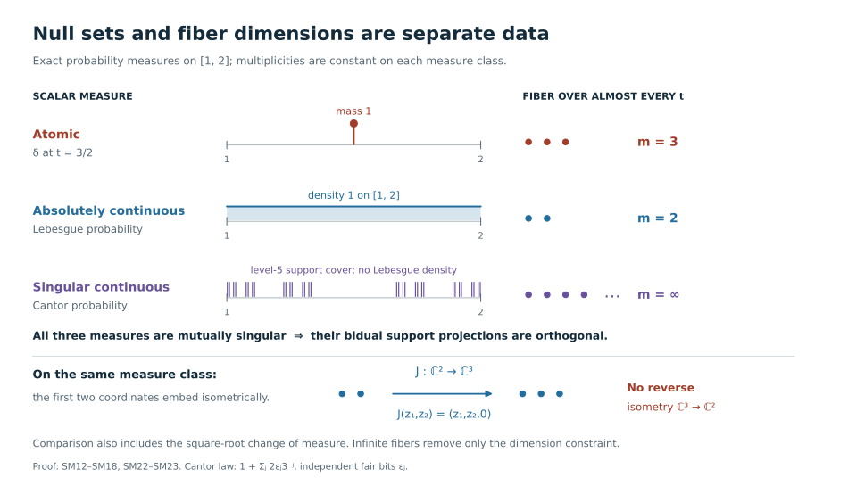
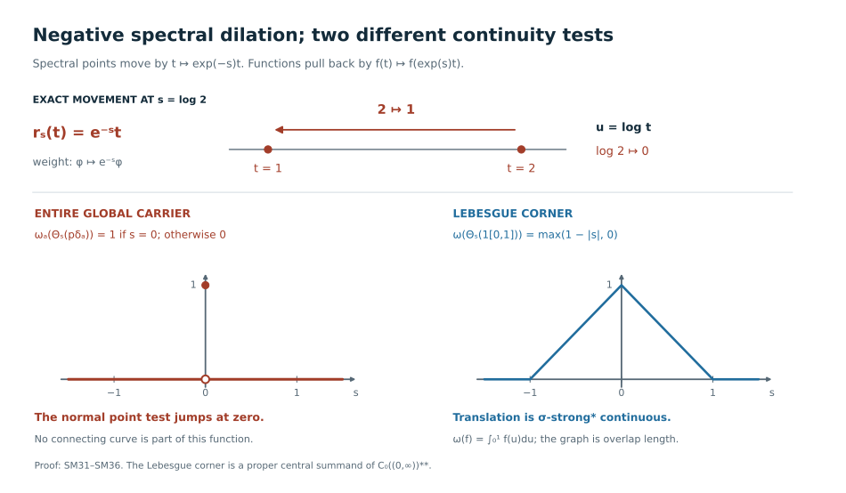

# Spectral fibers and the full carrier of type I weights

A positive density determines a weight on \(B(H)\). When \(H\) is separable, two pieces of spectral data determine comparison: which Borel sets are null, and how many independent vectors occur over each spectral value. Infinite multiplicity removes the second constraint. The remaining measure classes fill the **entire** bidual \(C_0((0,\infty))^{**}\), including its singular sectors. Scaling is continuous on the Lebesgue sector and discontinuous on the full algebra.

*Original exposition, models, figures, data and drawing code in this lesson are dedicated to CC0-1.0. Source publications and the separately supplied fonts retain their own terms.*

## 1. A density, its support, and its exact domains

Let \(H\) be any Hilbert space, without a cardinality restriction, and let \(\operatorname{Tr}\) be its usual normal semifinite trace. For an orthonormal basis \((e_i)_{i\in I}\), sums of nonnegative numbers mean suprema over finite subsets of \(I\). Parseval's identity makes
\(\operatorname{Tr}(x)=\sum_i\langle xe_i,e_i\rangle\), \(x\ge0\), independent of the basis.

The [normal trace-density theorem](OA-FLOW-TD.md#td-4) supplies the following full contract. A normal weight has a unique extended positive density. It is semifinite exactly when that density has no infinite-value projection, in which case it is an ordinary densely defined positive self-adjoint operator \(A\) on \(H\). No trace measurability or separability of \(A\) is required. Its weight is
\[
 \varphi_A(x)=\sup_{n\ge1}\operatorname{Tr}
       \bigl((A\wedge n)^{1/2}x(A\wedge n)^{1/2}\bigr),
 \qquad x\in B(H)_+ .
 \tag{SM1}
\]
All weight identities below include infinite values. Formula (SM1), not an unspecified product of unbounded operators, is the meaning of \(\operatorname{Tr}(Ax)\).

Here is a useful domain version of the same formula. Set
\[
 q_A(\xi)=
 \begin{cases}\|A^{1/2}\xi\|^2,&\xi\in D(A^{1/2}),\\
 +\infty,&\xi\notin D(A^{1/2}).
 \end{cases}
 \qquad
 \varphi_A(x)=\sum_{i\in I}q_A(x^{1/2}e_i).
 \tag{SM2}
\]
For bounded truncations of \(A\), cyclicity of the trace proves the equality. Taking the supremum over \(n\) and over finite subsets of \(I\) in either order proves (SM2). In particular,
\[
 \mathfrak n_{\varphi_A}
 =\left\{b\in B(H):\sum_i q_A(b^*e_i)<\infty\right\}.
 \tag{SM3}
\]
This is equivalently the condition that the closed operator \(A^{1/2}b^*\) is everywhere defined and Hilbert–Schmidt. Indeed finiteness makes its values on finite basis sums a bounded Hilbert–Schmidt map; closedness extends it to all of \(H\). The converse follows from the Hilbert–Schmidt norm formula. Neither a chosen basis nor a finite-trace spectral corner is implicit in this assertion.

Write
\[
 p=s(A)=1-E_A(\{0\}),\qquad K=pH.
 \tag{SM4}
\]
The support of \(\varphi_A\) is \(p\), and
\(\varphi_A(x)=\varphi_A(pxp)\). Its restriction to \(B(K)\) is faithful. The zero operator gives the zero weight and the zero support; conversely the zero weight has zero density. We always form the modular action and centralizer on this support corner.

Since the trace has trivial modular action, the [supported density perturbation formula](../../OA-MOD/src/centralizers-and-perturbations.md#recover-modular-time-on-the-support) gives
\[
 \sigma_t^{\varphi_A}(x)=A^{it}xA^{-it}\quad(x\in B(K)),\qquad
 B(H)_{\varphi_A}=\{E_A(S)|_K:S\text{ Borel}\}'.
 \tag{SM5}
\]
The powers are unitaries on \(K\), extended by zero on \(K^\perp\). For the second equality, commuting with every spectral projection certainly implies fixedness. Conversely an operator fixed by all \(A^{it}\) commutes with the unitary group of \(\log A\), hence with its spectral projections. One may verify this last implication through the resolvent: integrating \(e^{-t}e^{\pm it\log A}\) for \(t\ge0\) gives the two resolvents, and the Borel functional calculus gives all spectral projections. The exponential carries these projections to those of \(A|_K\).

## 2. Weight comparison is spectral intertwining

Use the supported comparison of [WC, its definitions and balanced-centralizer theorem](../../OA-MOD/src/weight-comparison-centralizer-transport.md#support-corners-cuts-and-the-comparison-relation). Thus \(\varphi_A\sim\varphi_B\) means that a partial isometry \(v\in B(H)\) has initial support \(p=s(A)\), final support \(q=s(B)\), and
\(\varphi_A(x)=\varphi_B(vxv^*)\). The relation
\(\varphi_A\precsim\varphi_B\) allows the final support to be a projection \(e\) in \(B(H)_{\varphi_B}\), and compares with the cut \((\varphi_B)_e(x)=\varphi_B(exe)\).

Equivalently, there is an isometry \(V:pH\to qH\) such that its range reduces \(B|_{qH}\) and
\[
 V E_A(S)|_{pH}=E_B(S)|_{qH}V
 \quad\hbox{for every Borel }S\subset(0,\infty).
 \tag{SM6}
\]
For equivalence the isometry is onto \(qH\). Extending \(V\) by zero on \(p^\perp H\) gives precisely the partial isometry \(v\). Moreover
\[
 \begin{aligned}
 V D(A|_{pH})&=D(B|_{qH})\cap VK, & BV\xi&=VA\xi,\\
 V D(A^{1/2}|_{pH})&=D(B^{1/2}|_{qH})\cap VK,
 &q_B(V\xi)&=q_A(\xi).
 \end{aligned}
 \tag{SM7}
\]
The last equality holds as an extended equality even outside the form domains.

To prove necessity, the final projection \(e=vv^*\) commutes with the spectral projections of \(B\), by (SM5). Apply the equality of weights to the rank-one positive operator
\(\xi\mapsto\langle\xi,\eta\rangle\eta\), where \(\eta\in pH\). Formula (SM2) gives
\(q_A(\eta)=q_B(V\eta)\). Thus the two closed positive forms have the same domain and values. Polarization identifies their sesquilinear forms, and uniqueness of the associated positive self-adjoint operator gives
\(A|_{pH}=V^*(B|_{eH})V\), including domains. Spectral calculus proves (SM6)–(SM7).

Conversely, (SM6) identifies the bounded truncations and the spectral integrals for the two domains in (SM7). Choose an orthonormal basis in \(pH\), its image basis in \(eH\), and complement both in \(H\). Formula (SM2) then gives
\(\varphi_A(x)=\varphi_B(vxv^*)\) for every \(x\ge0\). Here \(e\) is in the centralizer by (SM5). The corner maps
\[
 \operatorname{Ad}V:B(pH)\longrightarrow B(eH),
 \quad x\longmapsto VxV^*,\qquad
 y\longmapsto V^*yV
 \tag{SM8}
\]
are inverse normal unital *-isomorphisms, with the indicated corner identities. Normality follows by testing increasing bounded positive nets on vectors; it is not inferred from a formal covariance equation.

This argument applies at every Hilbert-space cardinality. Countable spectral multiplicity will be used only from the next section onward.

## 3. Constructing the scalar measure and the multiplicity

Assume now that \(H\) is separable. On the nonzero support \(K\), put
\(T=A(1+A)^{-1}\). This is a bounded positive contraction with
\(E_T(\{0\})=E_T(\{1\})=0\); either endpoint may still belong to its topological spectrum.

The [cyclic spectral construction](../../OA-MOD/src/spectral-calculus-kernel.md) decomposes \(K\) into cyclic reducing subspaces. Here the decomposition is countable: successively project a countable dense list onto the orthogonal complement of the cyclic subspaces already chosen, and keep each nonzero remainder. Any residual orthogonal complement would contain a nonzero component of a vector on that dense list, a contradiction. On each nonzero summand \(T\) is multiplication by \(u\) on \(L^2(\nu_j)\), for a finite measure \(\nu_j\) on \([0,1]\). Take the cyclic vector to have norm one, so \(\nu_j\) is a probability. The endpoint masses vanish. Pushing forward under \(u\mapsto u/(1-u)\) gives a probability \(\mu_j\) on
\[
 X=(0,\infty).
\]
It represents \(A\) as multiplication by \(t\), with its full spectral domain.

Choose positive summable coefficients \(c_j\), and put
\(\mu=\sum_jc_j\mu_j\). Every \(\mu_j\) has a Borel density \(r_j=d\mu_j/d\mu\). The [scalar density proof in central decomposition](../../OA-MOD/src/central-decomposition.md) applies to finite measures: for \(\eta=\alpha+\beta\), Hilbert-space representation of \(f\mapsto\int f\,d\alpha\) on \(L^2(\eta)\) gives \(0\le g\le1\), \(d\alpha=g\,d\eta\), \(d\beta=(1-g)d\eta\); if \(\alpha\ll\beta\), then \(g<1\) almost everywhere and \(d\alpha/d\beta=g/(1-g)\). Thus no measure-class selection theorem is needed here.

Multiplication by \(\sqrt{r_j}\) is a unitary
\[
 L^2(\mu_j)\longrightarrow L^2(S_j,\mu),\qquad
 S_j=\{r_j>0\};
 \quad
 f\longmapsto\sqrt{r_j}f,\qquad
 g\longmapsto g/\sqrt{r_j}\ \text{ on }S_j.
 \tag{SM9}
\]
The squared-norm identity proves that the displayed inverse is everywhere defined on the target \(L^2\) space. It also proves the corresponding weighted identities with \(t\) and \(t^2\), so these maps preserve both unbounded domains.

For each \(t\), list the indices \(j\) for which \(t\in S_j\) in increasing order. The \(n\)-th listed index is measurable: each of its level sets is a finite Boolean combination of the \(S_j\). Relabeling the corresponding coordinates gives the measurable multiplicity
\[
 m(t)=\#\{j:t\in S_j\}\in\{1,2,\ldots,\infty\}
 \quad\mu\text{-almost everywhere},
 \qquad
 \mathcal H_{\mu,m}=\int_X^\oplus\mathbb C^{m(t)}\,d\mu(t).
 \tag{SM10}
\]
Here \(\mathbb C^\infty=\ell^2(\mathbb N)\), and \(\mathbb C^n\) means its first \(n\) coordinates. The construction gives a unitary \(U:K\to\mathcal H_{\mu,m}\) with
\[
 \begin{aligned}
 (UAU^*\xi)(t)&=t\xi(t),&
 D(UAU^*)&=\left\{\xi:\int_X t^2\|\xi(t)\|^2\,d\mu(t)<\infty\right\},\\
 (UA^{1/2}U^*\xi)(t)&=\sqrt t\,\xi(t),&
 D(UA^{1/2}U^*)&=\left\{\xi:\int_X t\|\xi(t)\|^2\,d\mu(t)<\infty\right\}.
 \end{aligned}
 \tag{SM11}
\]
Finite coordinate sections supported where \(1/n\le t\le n\) are a dense core for these graph norms, by monotone convergence of their squared tails.

The scalar measure is finite and Radon. For completeness, the scalar regularity input is the full compact metric Riesz construction in [SS2–SS3](../../OA-MOD/notes/analytic-programme/spectral-scalar-prerequisites.html#ss3-a-positive-functional-is-a-finite-regular-measure); restricting away from the endpoints and applying the homeomorphism above preserves regularity. Finite Radon measures on \(X\) have separable \(L^2\): regularity approximates indicators by continuous functions with compact support, and rational polygonal functions on rational compact intervals form a countable uniformly dense family for those continuous functions.

The zero weight is represented separately by the zero measure and the zero field. No arbitrary nonzero multiplicity is assigned on a zero measure space. The complement \(p^\perp H\) is a kernel subspace, not a positive spectral fiber at \(t=0\).

## 4. Every intertwiner and the complete comparison criterion

Let \((\mu_A,m_A)\) and \((\mu_B,m_B)\) be the supported data of two nonzero weights. Then
\[
 \boxed{\begin{aligned}
 \varphi_A\precsim\varphi_B
 &\iff \mu_A\ll\mu_B
       \ \text{and}\ m_A(t)\le m_B(t)\quad\mu_A\text{-a.e.},\\
 \varphi_A\sim\varphi_B
 &\iff \mu_A\sim\mu_B
       \ \text{and}\ m_A(t)=m_B(t)\quad\mu_A\text{-a.e.}.
 \end{aligned}}
 \tag{SM12}
\]
Here \(\mu_A\sim\mu_B\) means mutual absolute continuity. These are statements about null sets, not about closed topological supports.

We first describe **all** bounded spectral intertwiners. Put
\(\lambda=\mu_A+\mu_B\), \(a=d\mu_A/d\lambda\), \(b=d\mu_B/d\lambda\), and use (SM9) to place both fields over \(\lambda\), with zero fibers outside \(\{a>0\}\) and \(\{b>0\}\). A bounded operator between them intertwines the spectral projections exactly when it is
\[
 \begin{aligned}
 (S\xi)(t)&=S(t)\xi(t),
 &S(t)&:\mathbb C^{m_A(t)}\longrightarrow\mathbb C^{m_B(t)},\\
 \operatorname*{ess\,sup}_t\|S(t)\|&<\infty.
 \end{aligned}
 \tag{SM13}
\]
The fiber maps act on the respective nonzero fibers. Matrix coefficients of \(S(t)\) are measurable, and fields agreeing almost everywhere define the same operator.

Here is why no nonmeasurable choice or hidden surjectivity assumption enters (SM13). An intertwiner commutes, in its off-diagonal position on the direct sum of the two spaces, with the common scalar diagonal algebra. Continuous spectral functions generate all Borel spectral projections and hence the whole \(L^\infty(\lambda)\) diagonal; the direct sum has full \(\lambda\)-support. The [proved diagonal-commutant theorem](../../OA-MOD/src/measurable-hilbert-fields.md) therefore applies. Its reconstruction takes the images of localized coordinate sections, reads their scalar coordinates, and tests rational finite linear combinations to obtain the pointwise norm bound. A countable union of exceptional null sets suffices. Conversely a bounded measurable field integrates to a bounded operator; testing localized coordinate sections proves both uniqueness and
\(\|S\|=\operatorname*{ess\,sup}\|S(t)\|\). Adjoints, products and equalities of bounded fields are detected by the same countable tests. Consequently \(S^*S=1\) says exactly that \(S(t)\) is an isometry on almost every source fiber. Likewise \(SS^*=1\) says it is onto each target fiber.

If an isometry as in (SM6) exists, a zero target fiber must have a zero source fiber, so \(\mu_A\ll\mu_B\), and the fiber isometries force \(m_A\le m_B\). If it is onto, the reverse null-set implication and equal dimensions follow. This proves necessity in (SM12).

For sufficiency put \(h=d\mu_A/d\mu_B\). On \(\{h>0\}\), let \(J(t)\) insert the first \(m_A(t)\) coordinates into the first \(m_B(t)\) coordinates. This is a measurable isometry, including when either dimension is infinite. Define
\[
 (V\xi)(t)=
 \begin{cases}
 \sqrt{h(t)}\,J(t)\xi(t),&h(t)>0,\\
 0,&h(t)=0.
 \end{cases}
 \tag{SM14}
\]
The norm identity
\(\int h(t)\|\xi(t)\|^2\,d\mu_B=\int\|\xi(t)\|^2\,d\mu_A\)
makes \(V\) an isometry. Its final projection is the measurable field
\(e(t)=1_{\{h>0\}}J(t)J(t)^*\). It commutes with multiplication by \(t\), so is a centralizer projection. Its inverse on its range is
\[
 (V^*\eta)(t)=h(t)^{-1/2}J(t)^*\eta(t)
 \quad(\mu_A\text{-a.e.});
 \tag{SM15}
\]
the same formula gives the adjoint on the full target space. Weighted norm identities with \(t\) and \(t^2\) give exactly (SM7), not just an identity on compact spectral vectors. If the measures are equivalent and the dimensions equal, \(J(t)\) is onto and \(e=1\); this proves equivalence.

Replacing \(J(t)\) by an arbitrary measurable field of isometries describes every implementing partial isometry. Equivalently, this follows from (SM13) after the two scalar changes of measure. Each implements the normal corner maps (SM8), and its adjoint gives the full normal inverse. This also proves independence of all choices in Section 3: two spectral models for the same density are connected by their actual unitary, and necessity in (SM12) forces precisely the same measure class and multiplicity.

The zero cases complete the theorem: \(0\precsim\varphi\) for every weight, \(\varphi\precsim0\) only for \(\varphi=0\), and the only weight equivalent to zero is zero. A nonfaithful nonzero weight is compared on its support exactly as above. Equality of the dimensions of the ambient kernels is not required.

## 5. The centralizer detects infinite multiplicity

In the model (SM11), the diagonal-commutant theorem gives the normal concrete identification
\[
 B(H)_{\varphi_A}\cong
 \int_X^\oplus B(\mathbb C^{m(t)})\,d\mu(t),
 \qquad
 Z(B(H)_{\varphi_A})\cong L^\infty(X,\mu).
 \tag{SM16}
\]
The first map sends a field to its integrated operator, and the inverse reconstructs its matrix entries on localized coordinate sections as in (SM13). Both preserve bounded increasing positive suprema, since localized vector tests detect them; thus both are normal.

To check the center assertion, commute a central field with the measurable matrix units \(e_{ij}\) on the set \(\{m\ge\max(i,j)\}\). Its off-diagonal entries vanish and all existing diagonal entries agree. A single countable exceptional set works for every pair \((i,j)\), so it is a measurable scalar field. Conversely scalar fields commute with every decomposable operator. These constructions specify both maps and their inverses in (SM16).

For a nonzero weight,
\[
 B(H)_{\varphi_A}\text{ is properly infinite}
 \iff m(t)=\infty\quad\mu\text{-almost everywhere}.
 \tag{SM17}
\]
If \(m=\infty\), the coordinate maps \(e_j\mapsto e_{2j}\) and
\(e_j\mapsto e_{2j-1}\) are measurable isometries with orthogonal ranges summing to one, giving proper infiniteness. Conversely, if finite multiplicity occurs on a set of positive measure, some set \(F_n=\{m=n\}\) has positive measure. Its central corner is
\(L^\infty(F_n,\mu)\bar\otimes M_n\). An isometry in that corner is unitary, because its fiber matrices are square finite matrices; so its identity cannot contain two orthogonal equivalent copies of itself. Proper infiniteness of the whole identity would restrict to proper infiniteness of this central corner, a contradiction.

It follows at once that for weights of infinite multiplicity the first condition in (SM12) reduces to
\[
 \varphi_A\precsim\varphi_B\iff\mu_A\ll\mu_B,\qquad
 \varphi_A\sim\varphi_B\iff\mu_A\sim\mu_B.
 \tag{SM18}
\]
The zero weight is adjoined as the zero class.

For an arbitrary nonzero supported weight, countable trace amplification changes
\(m(t)\) to \(m(t)\cdot\infty=\infty\), and leaves \([\mu]\) unchanged. On a separably infinite \(H\), a unitary \(H\otimes\ell^2\to H\) turns this into a weight on the original algebra. Different choices of that unitary differ by an inner conjugacy, so the amplified class is independent of the choice. The [carrier amplification theorem](OA-FLOW-CBD.md#cbd-amplified) proves this same independence in general; here the explicit tensor and spectral maps prove it directly. Amplified comparison forgets finite multiplicity. It must not be substituted for the original comparison (SM12).

## 6. Every finite measure defines a sigma-finite bidual projection

Put
\[
 W=C_0(X)^{**},\qquad X=(0,\infty).
 \tag{SM19}
\]
This is an abelian von Neumann algebra, with the canonical copy of \(C_0(X)\) ultraweakly dense. The [universal-bidual theorem](../../OA-MOD/src/cstar-universal-bidual.md) proves that each positive functional on \(C_0(X)\) has a unique positive normal extension to \(W\), and that every nondegenerate representation extends normally onto its bicommutant, with central kernel and a normal inverse on the complementary central corner.

We spell out the scalar measures in this assertion. Every positive bounded functional on \(C_0(X)\) is integration against a finite Radon measure. To reduce this claim to the compact theorem actually proved in [SS3](../../OA-MOD/notes/analytic-programme/spectral-scalar-prerequisites.html#ss3-a-positive-functional-is-a-finite-regular-measure), transport \(X\) to \((0,1)\). Choose increasing continuous compactly supported cutoffs \(h_n\), \(0\le h_n\le1\), tending to one on \((0,1)\). For \(f\in C([0,1])_+\), define
\(\widetilde L(f)=\lim_n L(fh_n)\). These numbers increase and are bounded by \(\|L\|\|f\|_\infty\); additivity and homogeneity extend this to a bounded positive functional on \(C([0,1])\). The compact theorem supplies its finite regular measure \(\widetilde\mu\).

For \(f\in C_0((0,1))\), \(fh_n\to f\) uniformly, so \(\widetilde L(f)=L(f)\). Also \(\lim_nL(h_n)=\|L\|\): each positive contraction in \(C_0\) is uniformly approximated by its products with \(h_n\). Hence \(\widetilde\mu([0,1])=\|L\|=\widetilde\mu((0,1))\), and both endpoint masses vanish. Restrict and transport back to \(X\). Regularity gives uniqueness by continuous compact cutoffs of open and compact sets. This proves the asserted finite Radon representation without an unproved noncompact extension.

For a finite positive Radon measure \(\mu\), denote its normal extension by \(\widehat\mu\), and set
\[
 p_\mu=s(\widehat\mu)\in\operatorname{Proj}(W),\qquad p_0=0.
 \tag{SM20}
\]
The multiplication representation on \(L^2(\mu)\) is nondegenerate. Continuous compactly supported functions approximate Borel indicators in \(L^2(\mu)\) by regularity, with uniform bounds. This is also strong operator approximation: test first on bounded vectors and then truncate an arbitrary \(L^2\) vector, using the uniform bound. Thus they generate \(L^\infty(\mu)\) strongly. This multiplication algebra is its own commutant: if \(S\) commutes with all its projections, put \(h=S1\), which is defined since \(\mu\) is finite. Then \(S1_E=1_Eh\); localized norm inequalities give \(|h|\le\|S\|\) almost everywhere, and density of simple functions yields \(S=M_h\). Its bicommutant is therefore exactly this multiplication algebra. The bidual extension therefore gives
\[
 \pi_\mu:W\longrightarrow L^\infty(\mu),\qquad
 \ker\pi_\mu=W(1-p_\mu),\qquad
 \pi_\mu:Wp_\mu\overset{\cong}{\longrightarrow}L^\infty(\mu).
 \tag{SM21}
\]
Indeed integration is faithful on \(L^\infty(\mu)_+\), and its composite with \(\pi_\mu\) is \(\widehat\mu\) by uniqueness of normal extension. Thus the support is precisely the complementary central kernel projection. The inverse in (SM21) is the unique element of \(Wp_\mu\) with the prescribed multiplication image; existence, uniqueness and normality follow from the normal central-corner isomorphism in the bidual theorem. In particular \(p_\mu\) is sigma-finite: \(\widehat\mu\) is faithful on that corner, and division by \(\mu(X)\) gives a faithful normal state when \(\mu\ne0\).

The decisive order identity is
\[
 p_\mu\le p_\nu\iff\mu\ll\nu,\qquad
 p_\mu=p_\nu\iff\mu\sim\nu,\qquad
 p_\mu p_\nu=0\iff\mu\perp\nu .
 \tag{SM22}
\]
If \(\mu\ll\nu\), integration against \(d\mu/d\nu\) is a normal functional on \(L^\infty(\nu)\); its pullback to \(W\) is \(\widehat\mu\), proving \(p_\mu\le p_\nu\). For both directions and the last assertion simultaneously put \(\rho=\mu+\nu\). Both projections lie below \(p_\rho\); under (SM21) they become
\[
 p_\mu\longmapsto1_{\{d\mu/d\rho>0\}},\qquad
 p_\nu\longmapsto1_{\{d\nu/d\rho>0\}}.
 \tag{SM23}
\]
This follows by testing where the corresponding normal integral functional is faithful. Their sum of densities is one almost everywhere. Projection inclusion, equality and disjointness are consequently exactly the three measure assertions in (SM22).

Every sigma-finite projection of \(W\) is of the form \(p_\mu\). If \(q\ne0\), choose a faithful normal state on \(Wq\) and extend it to \(W\) by multiplication by \(q\). Restriction to \(C_0(X)\) is a positive functional and hence a finite Radon measure \(\mu\). Uniqueness of normal extension identifies that state with \(\widehat\mu\), so \(p_\mu=q\). The zero projection is obtained from the zero measure.

There is no countability restriction on the whole algebra \(W\). It contains the nonzero pairwise orthogonal projections \(p_{\delta_t}\), \(t\in X\), so it is not sigma-finite: a faithful normal state would assign strictly positive numbers to uncountably many orthogonal projections, whereas for each \(n\) only finitely many could have value at least \(1/n\).

## 7. The complete global carrier and its normal inverse

Let \(H\) now be separably infinite, \(M=B(H)\), and let
\((\mathcal A,p_M)\) be the actual [global carrier constructed from the balanced centralizer](OA-FLOW-CGF.md#cgf-2). Its defining domain is zero together with normal semifinite weights of properly infinite support centralizer. The theorem proves, on this domain,
\[
 p_M(\alpha)\le p_M(\beta)\iff\alpha\precsim\beta,
 \qquad
 p_M(W_\infty(M))=\operatorname{Proj}_\sigma(\mathcal A).
 \tag{SM24}
\]
Here sigma-finiteness refers to the abelian carrier corner; the entire balanced centralizer need not be sigma-finite.

Every nonzero finite Radon measure \(\mu\) occurs in (SM18). On
\(L^2(\mu)\otimes\ell^2\), take \(A_\mu=M_t\otimes1\), with domain (SM11). This Hilbert space is separably infinite, so any unitary onto \(H\) gives a faithful normal semifinite weight on \(B(H)\). Its multiplicity is infinite almost everywhere, and its measure class is \([\mu]\). Atomic, absolutely continuous and singular continuous measures are all allowed.

Consequently
\[
 f:\operatorname{Proj}_\sigma(\mathcal A)\longrightarrow
       \operatorname{Proj}_\sigma(W),\qquad
 f(p_M(\varphi_A))=p_{\mu_A}
 \tag{SM25}
\]
is well defined, bijective and order preserving in both directions, by (SM18), (SM22), (SM24), and the preceding realization. This identifies sigma-finite projections, but the claimed theorem concerns the **whole** algebras. We give the extension and its inverse.

In any von Neumann algebra every nonzero projection contains a nonzero support of a normal positive functional, hence a nonzero sigma-finite subprojection. Indeed normal positive functionals separate positive elements; compress such a functional to the projection and take its support. In an abelian algebra finite joins and all subprojections of sigma-finite projections remain sigma-finite. It follows that every projection is the join of its sigma-finite subprojections.

For arbitrary projections define
\[
 F(e)=\bigvee_{\substack{p\le e\\p\ {\rm sigma\!-\!finite}}}f(p),
 \qquad
 G(r)=\bigvee_{\substack{q\le r\\q\ {\rm sigma\!-\!finite}}}f^{-1}(q).
 \tag{SM26}
\]
An order isomorphism of the sigma-finite parts preserves finite joins, meets, orthogonality and relative complements: compute each inside the sigma-finite corner generated by the projections involved. For every sigma-finite \(p\in\mathcal A\), this gives the useful exact test
\[
 F(e)f(p)=f(ep).
 \tag{SM27}
\]
The lower bound follows because \(ep\le e\). For the upper bound, every sigma-finite \(a\le e\) is disjoint from \((1-e)p\), so \(f(a)\) is orthogonal to \(f((1-e)p)\); take their join and use
\(f(p)=f(ep)+f((1-e)p)\).

Formula (SM27) shows that \(f(p)\le F(e)\) exactly when \(p\le e\). Thus \(G(F(e))=e\). The same argument with \(f^{-1}\) proves \(F(G(r))=r\). Hence \(F\) and \(G\) are inverse order isomorphisms of the complete projection lattices, preserve complements and arbitrary joins, and extend the maps in (SM25).

For a finite orthogonal spectral sum put
\[
 \mathcal F\!\left(\sum_j\lambda_je_j\right)=
             \sum_j\lambda_jF(e_j).
 \tag{SM28}
\]
Refinement by intersections proves that this is well defined and multiplicative on simple spectral elements. Orthogonal nonzero summands give its norm as \(\max_j|\lambda_j|\), so it is isometric. Uniform spectral approximation extends it uniquely to a unital *-homomorphism on \(\mathcal A\). The same construction from \(G\) supplies its inverse on \(W\).

This isomorphism is normal. For an increasing bounded net \(x_i\uparrow x\) in an abelian algebra and a real \(t\),
\(1_{(t,\infty)}(x)=\bigvee_i1_{(t,\infty)}(x_i)\): on the complementary projection every \(x_i\le t\), hence \(x\le t\). Preservation of arbitrary projection joins and step approximation therefore show
\(\mathcal F(x)=\sup_i\mathcal F(x_i)\). The inverse has the same property. We have proved the full normal isomorphism and its normal inverse:
\[
 \boxed{\mathcal F:\mathcal A\overset{\cong}{\longrightarrow}
 C_0((0,\infty))^{**},\qquad
 \mathcal F(p_M(\varphi_A))=p_{\mu_A}.}
 \tag{SM29}
\]
Uniqueness follows from (SM26) and uniform spectral approximation.

The individual centralizer-center maps are also explicit. If \(z=M_{1_E}\) in (SM16) and \(m=\infty\), its cut has scalar type \(\mu|_E\). Under (SM29) and (SM21),
\[
 p_M((\varphi_A)_z)\longmapsto p_{\mu|_E}
 \longmapsto 1_E\quad\text{in }L^\infty(\mu).
 \tag{SM30}
\]
Projection approximation gives all bounded central functions. Thus these are exactly the [normal center-compression maps of CBD](OA-FLOW-CBD.md#cbd-center), with their normal inverses, and not merely abstract copies of the same abelian algebra. For finite or varying multiplicity apply the countable amplification in Section 5; (SM30) and the measure class remain unchanged.

Changing cyclic vectors, finite control measures, measurable frames, the unitary \(L^2(\mu)\otimes\ell^2\to H\), or the filling isometries for amplification does not change (SM29): (SM12) identifies the resulting classes, and the extension from (SM25) is unique. More generally a unitary \(U:H\to H'\) transports \(A\) to \(UAU^*\), its support to \(UpU^*\), and all the normal maps above to their conjugates. Its scalar measure class and multiplicity are unchanged, so the induced carrier isomorphism commutes with \(\mathcal F\). Every normal *-isomorphism between two such type I factors is of this form. To see this directly, transport an orthonormal-basis matrix-unit family through the isomorphism. Its minimal diagonal projections are rank one and sum to the target identity by normality. Choose a unit vector in one of them and apply the transported matrix units to obtain an orthonormal basis of the target. The unitary carrying the original basis to this basis implements the isomorphism on every matrix unit and hence, by finite compressions and normality, on the entire algebra. The construction is unique up to a scalar phase. Thus the naturality just proved holds for every normal isomorphism of these factors, respects composition and inverses, and makes no additional choice of a spectral representation.

## 8. Negative dilation and the continuous sector

The global carrier action is normalized by
\(\Theta_s(p_M(\varphi))=p_M(e^{-s}\varphi)\). Multiplying a density by \(e^{-s}\) sends its scalar spectral measure to the pushforward under
\[
 r_s(t)=e^{-s}t.
\]
The multiplicity at the new value \(t\) is the old multiplicity at \(e^st\). On \(C_0(X)\), the corresponding automorphism and its bidual extension are
\[
 (\kappa_sf)(t)=f(e^st),\qquad
 \mathcal F\Theta_s\mathcal F^{-1}=\kappa_s^{**},\qquad
 \kappa_s^{**}(p_\mu)=p_{(r_s)_*\mu}.
 \tag{SM31}
\]
For the sign check, if \(\widehat\mu\) has support \(p_\mu\), then
\(\widehat\mu\circ\kappa_{-s}^{**}\) has support
\(\kappa_s^{**}(p_\mu)\), and on \(C_0(X)\) it integrates
\(f(e^{-s}t)\) against \(\mu\), exactly \((r_s)_*\mu\). Equality on sigma-finite carrier projections extends to the full algebra by (SM26). Thus negative dilation moves spectral points; the pullback formula on functions has the positive sign.

Each \(\kappa_s\) is a *-automorphism and \(s\mapsto\kappa_sf\) is norm continuous for every \(f\in C_0(X)\). In the logarithmic coordinate \(u=\log t\), this is ordinary translation of a function vanishing at infinity; uniform continuity on a large compact interval and a small tail prove the assertion. Nevertheless the bidual action is not pointwise ultraweakly continuous. Fix \(a>0\) and let \(\omega_a=\widehat{\delta_a}\). From (SM22) and (SM31),
\[
 \omega_a(\kappa_s^{**}(p_{\delta_a}))=
 \begin{cases}1,&s=0,\\0,&s\ne0.\end{cases}
 \tag{SM32}
\]
This is a normal functional testing a projection in the entire carrier. In particular the full carrier cannot be replaced by any single Lebesgue \(L^\infty\) model.

Let \(\ell\) be any finite measure equivalent to Lebesgue measure on \(X\), for example \(e^{-t}\,dt\). The central projection \(p_\ell\) is invariant under \(\kappa^{**}\). Under (SM21) its corner and action are
\[
 Wp_\ell\cong L^\infty((0,\infty),dt),\qquad
 \kappa_s^{**}(f)(t)=f(e^st)
 \quad\leftrightarrow\quad
 g(u)\longmapsto g(u+s).
 \tag{SM33}
\]
Both maps are normal, and the inverse logarithmic substitution is \(f(t)=g(\log t)\). Null sets are preserved since exponential and logarithm are locally Lipschitz on the relevant compact intervals.

The action in (SM33) is pointwise sigma-strong* continuous. On \(L^2(X,dt)\) it is implemented by the strongly continuous unitaries
\((U_s\xi)(t)=e^{s/2}\xi(e^st)\). The norm and group laws follow by change of variables; continuity holds first on compactly supported continuous vectors, then by their density and unitarity on all vectors. Consequently \(U_sM_fU_s^*\) and its adjoint vary strongly for every bounded \(f\). The predual formula, for reference, is
\(g(t)\mapsto e^{-s}g(e^{-s}t)\) on \(L^1(dt)\).

In fact \(p_\ell\) is exactly the continuous sector, not just a continuous subalgebra. It suffices to test a sigma-finite projection \(p_\mu\). If its orbit is sigma-strongly continuous, let
\[
 q=\bigvee_{r\in\mathbb Q}\kappa_r^{**}(p_\mu)
   =p_\nu,\qquad
 \nu=\sum_{j\ge1}2^{-j}(r_{r_j})_*\mu ,
 \tag{SM34}
\]
where \((r_j)\) enumerates \(\mathbb Q\). Rational approximation and continuity put every real translate of \(p_\mu\) below \(q\). Taking joins gives
\(\kappa_s^{**}(q)\le q\) for every real \(s\), and using \(-s\) proves equality. Hence every translate of the finite measure \(\nu\) is equivalent to \(\nu\), by (SM22).

Transport \(\nu\) by logarithm to a finite nonzero measure \(\eta\) on \(\mathbb R\). For an everywhere positive integrable Borel function \(k\), for example \(k(s)=e^{-|s|}/2\), define
\[
 \bar\eta(E)=\int_{\mathbb R}k(s)\eta(E+s)\,ds
 =\int_E\left(\int_{\mathbb R}k(v-u)\,d\eta(v)\right)du.
 \tag{SM35}
\]
Tonelli's theorem gives the equality and finiteness. The inner density is positive everywhere and finite almost everywhere, so \(\bar\eta\) is equivalent to Lebesgue measure. Translation equivalence of \(\eta\) implies \(\bar\eta\sim\eta\): a null set remains null for every translate, whereas a set of positive \(\eta\)-measure has positive measure for every translate and hence a positive average. Thus \(\mu\ll\nu\sim dt\), proving \(p_\mu\le p_\ell\). Conversely every projection below \(p_\ell\) has a continuous orbit by (SM33). The zero case is immediate. We have proved
\[
 p_\mu\text{ has a continuous orbit}\iff\mu\ll dt.
 \tag{SM36}
\]

The [global carrier's continuous-sector theorem](OA-FLOW-CGF.md#cgf-5) characterizes its distinguished sector \(d\) by precisely these sigma-finite projections. Since arbitrary projections are joins of their sigma-finite parts, (SM29) carries \(d\) exactly to \(p_\ell\). Its supported integrability theorem, together with countable amplification, consequently gives for every normal semifinite supported weight on separable \(H\)
\[
 \sigma^{\varphi_A}\text{ is integrable on }B(s(A)H)
       \iff \mu_A\ll dt .
 \tag{SM37}
\]
For finite-dimensional nonzero \(H\), the nonzero scalar types are atomic and hence fail \(\mu_A\ll dt\). Their support actions are not integrable: the ordinary finite matrix trace is invariant under each inner modular automorphism, so the orbit average of any nonzero positive element has infinite trace and cannot be bounded. Thus the finite-average left ideal is zero. The zero support satisfies both sides of (SM37), proving that formula also in finite dimensions.

The regular model \(A=M_{e^u}\otimes1\) on \(L^2(du)\otimes\ell^2\) supplies a direct check: its modular action is
\(\operatorname{Ad}(M_{e^{itu}}\otimes1)\), and the [proved regular positive-average calculation](OA-FLOW-TID.md#tid-2) gives
\(\int e^{itu}\theta_{\xi,\xi}e^{-itu}\,dt=2\pi M_{|\xi|^2}\) for bounded compactly supported \(\xi\). Choose an orthonormal basis \((\xi_j)\) of bounded compactly supported functions and let \(P_n\) be its first-\(n\)-vector projection. With \(q_n\) the first-\(n\)-coordinate projection on \(\ell^2\), the inputs \(P_n\otimes q_n\) increase strongly to the identity, and their averages \(2\pi M_{\sum_{j\le n}|\xi_j|^2}\otimes q_n\) are bounded. The constant \(2\pi\) belongs to the \(dt\) modular averaging convention; it has no effect on the scalar dilation in (SM31).

## 9. Exact models and solved diagnostics

**Figure 1.** The three probability measures are the point mass at \(3/2\), Lebesgue measure on \([1,2]\), and the law of \(1+\sum_{j\ge1}2\varepsilon_j3^{-j}\) for independent fair bits \(\varepsilon_j\). Their multiplicities in the displayed models are \(3,2,\infty\). They are pairwise mutually singular; the Cantor row draws its level-five support cover, not a Lebesgue density. The coordinate inclusion in the right panel illustrates (SM14), and the missing third coordinate obstructs its reverse. The support and fiber diagrams express (SM12), (SM17) and (SM22).

**Figure 2.** At \(s=\log2\), the spectral point \(t=2\) moves to \(t=1\), or \(u=\log2\) to \(u=0\). The middle panel is the exact normal-functional test (SM32); its isolated value one is not connected by a curve. On the Lebesgue sector use \(u=\log t\), \(P=1_{[0,1]}\), and \(\omega(f)=\int_0^1 f(u)\,du\). Then
\(\omega(\Theta_s(P))=\max(1-|s|,0)\), the overlap length of \([0,1]\) and \([-s,1-s]\). This right-hand continuous test belongs to the separate corner (SM33).

**Diagnostic 1: a zero density and a genuine kernel.** If \(A=0\), every comparison and carrier formula gives zero. If \(A=p\ne0\), its supported scalar measure is \(\delta_1\) and its multiplicity is \(\dim pH\). The kernel \(p^\perp H\) contributes no mass at zero to the positive spectral model. On an infinite-dimensional separable \(H\), take a proper infinite-rank projection \(p\). The weights of densities \(1\) and \(p\) are equivalent by a unitary \(H\to pH\), extended as a partial isometry in \(B(H)\). No ambient unitary can send support \(1\) to support \(p\). This proves why supported equivalence cannot be replaced by ambient unitary conjugacy.

**Diagnostic 2: unbounded domains matter.** On \(\ell^2(\mathbb N)\), let \(Ae_n=n^2e_n\). Then
\(D(A)=\{\xi:\sum n^4|\xi_n|^2<\infty\}\) and
\(D(A^{1/2})=\{\xi:\sum n^2|\xi_n|^2<\infty\}\).
The vector \(\xi_n=1/n\) is square summable and lies in neither domain. The vector \(\eta_n=1/n^2\) lies in the form domain but not the operator domain. The weight of their rank-one projections is respectively infinite and finite, exactly as (SM2) says. Spectral finite-coordinate truncations approximate every vector in the appropriate graph norm.

**Diagnostic 3: same eigenvalues, different comparison.** For
\(A=\operatorname{diag}(1,2)\) and
\(B=\operatorname{diag}(1,2,2)\), the scalar types are equivalent to \(\delta_1+\delta_2\). Their multiplicities are \((1,1)\) and \((1,2)\). Thus \(\varphi_A\precsim\varphi_B\), but not conversely. Realize both as supported densities on the same larger separable Hilbert space if desired; added zero eigenspaces do not alter the conclusion.

**Diagnostic 4: a change of density is not a fiber dimension.** Suppose \(d\mu=4\,d\nu\). The correct unitary \(L^2(\mu)\to L^2(\nu)\) is multiplication by \(2\), with inverse multiplication by \(1/2\). Omitting this factor fails the norm identity even when both multiplicities are one. Since the factor commutes with \(t\), it preserves both domains in (SM11).

**Diagnostic 5: topological support is insufficient.** Let \((q_j)\) be a countable dense subset of \([1,2]\), and let \(\mu=\sum_j2^{-j}\delta_{q_j}\), \(\nu=1_{[1,2]}dt\). Both have closed topological support \([1,2]\), but they are mutually singular. Even with infinite multiplicity, neither corresponding nonzero weight is a subweight of the other. The scalar null-set condition in (SM12) detects this immediately.

**Diagnostic 6: singular continuous fibers are present.** The Cantor probability \(\mu_C\) in Figure 1 has no atoms: a point lies in at most two level-\(n\) cylinder intervals, each with mass \(2^{-n}\). Its support is contained in covers of total length \((2/3)^n\), so it is singular with respect to Lebesgue measure. The density \(M_t\otimes1\) on \(L^2(\mu_C)\otimes\ell^2\) has properly infinite centralizer, and its nonzero global carrier is orthogonal to \(p_\ell\). It is included in (SM29) and excluded from the continuous sector by (SM36).

**Diagnostic 7: an infinite-dimensional support can have a finite centralizer.** A simple-spectrum diagonal density on \(\ell^2\), with all its eigenvalues distinct, has \(m=1\) almost everywhere. Its centralizer is abelian and finite, despite the infinite-dimensional support. Conversely any nonzero scalar density \(a1\) on \(\ell^2\) has one atom of multiplicity infinity and centralizer \(B(\ell^2)\). Formula (SM17) distinguishes them.

**Diagnostic 8: orthogonal measure sectors can be joined without identifying them.** Put
\(\rho=(\delta_{3/2}+1_{[1,2]}dt+\mu_C)/3\). The three measures in Figure 1 are pairwise singular: the Cantor measure has no atoms, and its support is Lebesgue null. Their carrier projections are orthogonal and their join is \(p_\rho\), by (SM23). Each infinite-multiplicity model is a centralizer cut of the infinite-multiplicity \(\rho\)-model. The normal inverse in (SM21) keeps these three measurable central summands separate.

**Diagnostic 9: the scaling sign cannot be changed.** A scalar density \(A=2\,1\) becomes \(1\) at \(s=\log2\). Hence its carrier moves from \(p_{\delta_2}\) to \(p_{\delta_1}\). The positive sign belongs to pullback of functions, \(f(t)\mapsto f(e^st)\), and the negative sign belongs to movement of the point. Equation (SM32) proves the full action is discontinuous even though this pullback is norm continuous on \(C_0(X)\).

**Diagnostic 10: what fails in type II.** Let \(R_{\mathrm f}\) be the explicitly constructed II\(_1\) factor in [ZDC Section 8](OA-FLOW-ZDC.md#zdc-8), with normalized trace \(\tau_{\mathrm f}\), and put
\(R=M_3\bar\otimes R_{\mathrm f}\),
\(\tau=\operatorname{tr}_3\otimes\tau_{\mathrm f}\).
This is a finite factor: commuting with its matrix units forces a scalar matrix over \(Z(R_{\mathrm f})=\mathbb C\). It has no minimal projection. Indeed a minimal projection in a finite factor, by [projection comparison](OA-FLOW-PC.md#pc-2) and faithfulness of the trace, would give a finite filling family of equivalent minimal projections and make the factor a finite matrix algebra; that would force its corner \(e_{11}Re_{11}\cong R_{\mathrm f}\) to be a finite matrix algebra, a contradiction.

Take
\[
 e=e_{11}\otimes1,\qquad
 f=(e_{22}+e_{33})\otimes1,\qquad
 \tau(e)=\tfrac13,\quad\tau(f)=\tfrac23 .
 \tag{SM38}
\]
For \(a>0\), the densities \(ae\) and \(af\) have identical supported scalar spectral type \(\delta_a\). Nevertheless their trace-density weights are not equivalent. Any implementing partial isometry would have initial and final projections \(e,f\), which is impossible because
\(\tau(v^*v)=\tau(vv^*)\). There is a subequivalence from \(ae\) to \(af\), implemented by \(e_{21}\otimes1\), whose final projection \(e_{22}\otimes1\) commutes with \(af\); the reverse direction would imply \(2/3\le1/3\). Thus even the direction of comparison requires projection size inside the semifinite algebra. This is an explicit obstruction, proved with matrix trace values and an actual partial isometry; it assumes no unproved general dimension or range theorem for type II factors.

**Diagnostic 11: semifiniteness cannot be erased from the density statement.** On the one-dimensional algebra, the normal weight taking value infinity on every nonzero positive scalar has an infinite-value density. There is no densely defined ordinary self-adjoint operator giving it. The full normal-weight contract at the start includes this case; the spectral comparison and carrier theorems are, as stated, for normal **semifinite** weights.

## Mathematical sources and proof dependencies

M. Takesaki, *Theory of Operator Algebras II*, Springer, 2003, Chapter XII, §4: the supported comparison convention is on printed p. 403; the global carrier construction and scaling convention are on pp. 405–407; the type I spectral-multiplicity example and the type II contrast are on pp. 411–412. That section has a standing separability assumption. The arbitrary-cardinality density and supported-intertwining assertions in Sections 1–2 here use the explicitly broader current trace-density and modular-density proofs; the countable multiplicity and full \(B(H)\) carrier conclusions retain separable \(H\).

The scalar compact representation, spectral calculus, Radon–Nikodym construction, measurable-field reconstruction and normal bidual extension used here are the actual proved inputs linked in Sections 1–7. The global carrier's surjectivity and its continuous-sector characterization are the [CGF theorems](OA-FLOW-CGF.md#cgf-2), with the individual center maps from [CBD](OA-FLOW-CBD.md#cbd-center). Sections 3–8 supply the additional spectral comparison, all-measure realization, full Boolean reconstruction with inverse, and the discontinuity and continuous-sector calculations.
