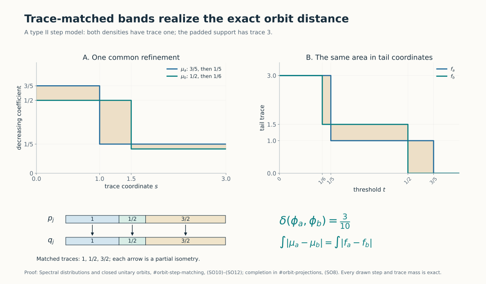
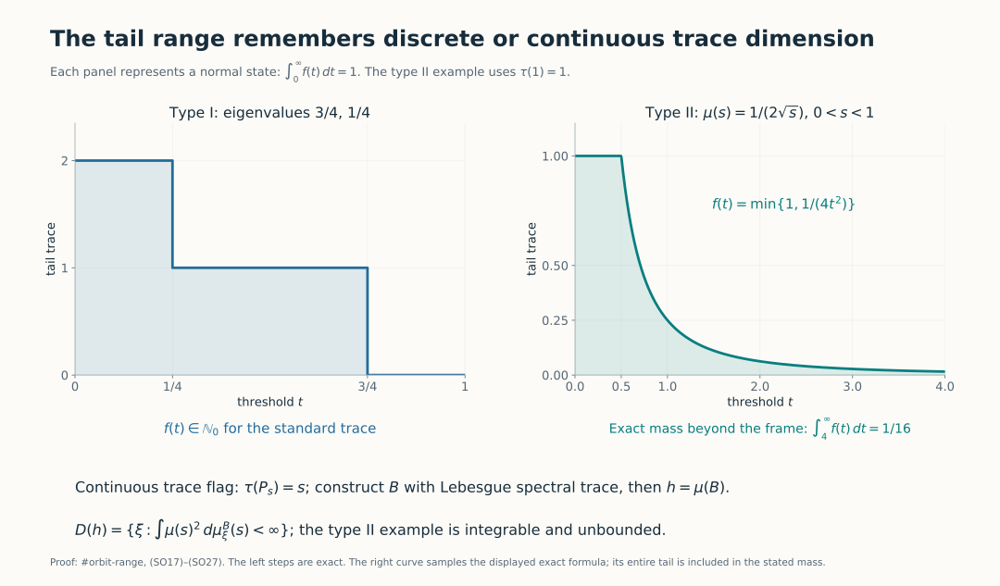
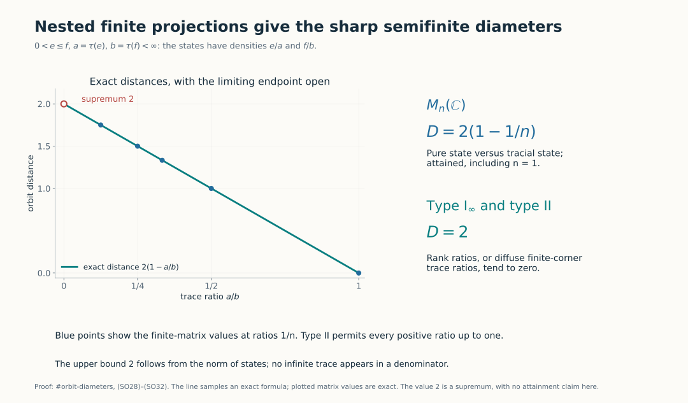

# Spectral distributions and closed unitary orbits in semifinite factors

*Self-checked by the writing AI.*

The decreasing trace tail of a positive normal functional is a complete invariant of its norm-closed unitary orbit in a semifinite factor. We prove the distance formula by matching finite spectral bands, with an explicit error for the discarded mass. We then realize every admissible tail by an affiliated operator with a specified self-adjoint domain. The state-orbit diameters follow as concrete consequences.

## 1. The orbit distance and the tail invariant

Fix a faithful normal semifinite trace \(\tau\) on a factor \(M\). Every \(\phi\in M_*^+\), including zero and nonfaithful functionals, has TD4's unique positive integrable density \(h\). Use the strict tail
\[
 f_h(t)=\tau(1_{(t,\infty)}(h)),\qquad t>0,
 \quad\text{and}\quad
 D(f,g)=\int_0^\infty|f(t)-g(t)|\,dt.
 \tag{SO1}
\]
All positive tails in (SO1) are finite at positive arguments and integrable, by [Trace tails, (TT4)](OA-FLOW-TAIL.md#tail-setting). Set
\[
 \delta(\phi,\psi)=\inf_{u\in\mathcal U(M)}
       \|\phi\circ\operatorname{Ad}u-\psi\|.
 \tag{SO2}
\]
The action convention is \(\operatorname{Ad}u(x)=uxu^*\); [TD7](OA-FLOW-TD.md#oa-flow.td.7) gives density \(u^*hu\) for \(\phi_h\circ\operatorname{Ad}u\). Since inverse unitaries run through the same group, the density infimum may equivalently use \(uhu^*\).

The isometric-action proof in [HC7](OA-FLOW-HC.md#oa-flow.hc.7) shows that \(\delta\) is a metric on norm-closed orbits of normal states. The identical argument applies to all of \(M_*^+\): inverse unitaries give symmetry, composition gives the triangle inequality, and
\[
 |\delta(\phi,\psi)-\delta(\phi',\psi')|
 \leq\|\phi-\phi'\|+\|\psi-\psi'\|.
 \tag{SO3}
\]
If the distance is zero, each functional lies in the other's closed orbit; applying each unitary and then taking closures gives equality of those closed orbits. Conversely equal closed orbits have distance zero.

Unitary covariance of the full spectral calculus and invariance of the trace imply \(f_{uhu^*}=f_h\). The trace-tail contraction [TT16](OA-FLOW-TAIL.md#tail-contraction) therefore gives
\[
 D(f_h,f_k)\leq\delta(\phi_h,\phi_k).
 \tag{SO4}
\]
We shall prove equality, first in type I and then in type II. No assertion about tails in a nonfactor is implicit: the traces of separate central pieces cannot in general be discarded.

## 2. Type I: decreasing eigenvalues, without separability of the Hilbert space

We first fix the normalization for an arbitrary trace. Let \(M=B(H)\). All rank-one projections are equivalent, so have the same trace \(\alpha\). It is positive by faithfulness and finite by semifiniteness: a nonzero finite-trace positive element below a minimal projection is a positive scalar multiple of that projection. For \(x\in B(H)_+\), normality applied to the finite sums of rank-one coordinate projections, and the trace identity applied to \(x^{1/2}p\), give \(\tau(x)=\alpha\sum_j\langle xe_j,e_j\rangle\), with arbitrary basis cardinality and the sum interpreted by finite subsets. Thus \(\tau=\alpha\operatorname{Tr}\). Scaling the trace by \(\alpha>0\) multiplies both the functional norm and every tail by \(\alpha\). Thus it multiplies both sides of the orbit-distance formula by the same factor. We can prove that formula using the usual trace; the eigenvalue sum below is stated in that normalization.

Let \(M=B(H)\) with its usual trace. If \(h\) is a positive integrable affiliated density, \(1_{(t,\infty)}(h)\) has finite rank for every \(t>0\), because its rank is at most \(\tau(h)/t\). Also \(h\) is bounded by \(\tau(h)1\): a nonzero spectral projection above a number greater than \(\tau(h)\) would have rank at least one and contradict this bound on the tail. The operators \(h1_{(1/n,\infty)}(h)\) have finite rank and converge in operator norm to \(h\). Thus \(h\) is compact, even when \(H\) is nonseparable.

The [compact self-adjoint spectral decomposition](../../foundations-of-von-neumann-algebras/compact-and-trace-class-operators-the-predual-of-b-h-and-the-operator-topologies.html#oa-fnd-lt-03), Theorem 2.3(e), gives its positive eigenvalues in decreasing order, repeated with their finite multiplicities. There are at most countably many: the support is the closed span of the finite-rank spectral ranges just constructed. Write the list as \((\lambda_j(h))\), adding zeros after the last positive eigenvalue when the rank is finite. In dimension \(n<\infty\) use exactly \(n\) entries. There is no attempt to enumerate a possibly nonseparable kernel.

For each \(t>0\), the set of indices with \(\lambda_j(h)>t\) is an initial segment. Therefore
\[
 \begin{split}
 |f_h(t)-f_k(t)|
 &=\sum_j|1_{\{t<\lambda_j(h)\}}-1_{\{t<\lambda_j(k)\}}|,\\
 D(f_h,f_k)&=\sum_j|\lambda_j(h)-\lambda_j(k)|.
 \end{split}
 \tag{SO5}
\]
The first equality counts the symmetric difference of two initial segments; scalar monotone convergence integrates the nonnegative series. In particular (SO4) proves the eigenvalue lower bound for the original pair as well as for every conjugate.

In dimension \(n\), align full orthonormal eigenbases; the resulting commuting diagonal densities have distance equal to the last sum, by [TT17](OA-FLOW-TAIL.md#tail-contraction). If \(H\) is infinite-dimensional, align only the first \(N\) eigenvectors for each density. A finite-rank density is padded by vectors from its kernel, which has enough vectors to complete this finite list. The two orthonormal \(N\)-tuples extend to bases of \(H\) with complements of the same Hilbert dimension, so their matching extends to a unitary.

Let \(h_N,k_N\) be the corresponding finite spectral sums and \(u_Nh_Nu_N^*\) the matched sum. Their remainders are positive and have predual norms equal to their trace masses. Hence
\[
 \|u_Nhu_N^*-k\|_1
 \leq\sum_{j\leq N}|\lambda_j(h)-\lambda_j(k)|
       +\sum_{j>N}\lambda_j(h)+\sum_{j>N}\lambda_j(k).
 \tag{SO6}
\]
The last two sums tend to zero. Together with (SO4)–(SO5), this proves
\[
 \boxed{\ \delta(\phi_h,\phi_k)
       =D(f_h,f_k)=\sum_j|\lambda_j(h)-\lambda_j(k)|.\ }
 \tag{SO7}
\]
This includes arbitrary Hilbert-space cardinality. Full eigenbasis matching in infinite dimension need not be possible. On \(\ell^2(\mathbb N)\), the diagonal densities with entries \((2^{-1},2^{-2},\ldots)\) and \((0,2^{-1},2^{-2},\ldots)\) have the same positive eigenvalue list and zero orbit distance, but kernels of dimensions zero and one. They are not unitarily conjugate. Thus (SO7) concerns an infimum and closed orbits, not an always-attained minimum.

## 3. Trace matching and unitary completion in type II

We spell out the projection tools needed for finite spectral matching. The earlier [projection comparison theorem](../../foundations-of-von-neumann-algebras/projections-and-types-of-von-neumann-algebras.html#oa-fnd-ty-03), Theorem 5.5, proves that any two projections in a factor are comparable up to Murray–von Neumann subequivalence. Its proof constructs a maximal orthogonal family of matched subprojections and uses polar decomposition in the remaining corner.

**Equal finite trace.** If \(\tau(p)=\tau(q)<\infty\), comparison gives, for example, \(p\sim q'\leq q\). The trace identity yields \(\tau(q-q')=0\), so faithfulness gives \(q'=q\). Thus \(p\sim q\). The same reasoning proves that \(\tau(p)\leq\tau(q)\), with \(\tau(p)<\infty\), implies \(p\precsim q\): in the other comparison direction a strict trace inequality is impossible, and equality reduces to the previous case.

**A prescribed finite matching extends to a unitary.** Suppose \(v^*v=p\), \(vv^*=q\) and both traces are finite. Put \(r=p\vee q\). The parallelogram polar identity gives \(r-p\precsim q\), so \(\tau(r)\leq\tau(p)+\tau(q)<\infty\). The projections \(r-p\) and \(r-q\) have equal trace and are equivalent by the preceding argument. Choose \(w\) matching them. Since both initial supports and both final supports are orthogonal,
\[
 U=v+w+(1-r)
 \tag{SO8}
\]
is unitary and satisfies \(Up=v\). This construction never compares the sizes of two infinite complements. The parallelogram identity, including its bounded polar proof, is [Projections and types, Proposition 4.4](../../foundations-of-von-neumann-algebras/projections-and-types-of-von-neumann-algebras.html#oa-fnd-ty-04).

**Every intermediate trace is available in type II.** A type II algebra has no nonzero minimal projection. If \(0<\tau(p)<\infty\), splitting a nonzero projection into two nonzero parts and keeping a part of no more than half its trace gives nonzero subprojections with arbitrarily small positive trace. If \(p\) has infinite trace, semifiniteness first supplies a nonzero finite-trace subprojection: choose \(0\ne a\in(pMp)_+\) with finite trace, and then a nonzero spectral projection \(1_{[\varepsilon,\infty)}(a)\leq p\).

For \(0\leq s\leq\tau(p)\) with \(s<\infty\), order the subprojections \(q\leq p\) with \(\tau(q)\leq s\) by inclusion. Every chain has its strong join as an upper bound, of trace at most \(s\) by normality. A maximal member \(q\) exists. If \(\tau(q)<s\), either \(p-q=0\), contradicting \(s\leq\tau(p)\), or a nonzero subprojection of \(p-q\) of trace at most \(s-\tau(q)\) enlarges it. Hence
\[
 \text{for every finite }s\in[0,\tau(p)]\text{ there is }q\leq p
 \text{ with }\tau(q)=s.
 \tag{SO9}
\]
Successive applications split a finite projection into any prescribed finite list of nonnegative trace masses whose sum is its trace. Zero masses use the zero projection. These statements hold without separability.

## 4. Ordered finite bands realize the tail distance

Suppose \(M\) is type II and \(a,b\) are bounded positive step densities, each with finite-trace support. Arrange their distinct positive coefficients in decreasing order. Put
\[
 L=\max\{\tau(s(a)),\tau(s(b))\}<\infty.
\]
The zero case \(L=0\) is immediate. By (SO9), enlarge each support, if needed, to a projection of trace \(L\), padding with coefficient zero. This is possible because the available complementary trace is at least the required finite increment; if \(\tau(1)=\infty\), removing a finite-trace projection still leaves infinite trace.

List each band consecutively on the mass interval \([0,L]\), with length equal to its trace. This gives decreasing scalar step functions \(\mu_a,\mu_b\). Refine the two lists by the union of their finitely many cumulative trace endpoints,
\[
 0=s_0<s_1<\cdots<s_m=L.
\]
Using (SO9), split each original band into subprojections \(p_j\) for \(a\), and \(q_j\) for \(b\), with
\[
 \tau(p_j)=\tau(q_j)=s_j-s_{j-1},\qquad
 a=\sum_j\alpha_jp_j,\quad b=\sum_j\beta_jq_j.
 \tag{SO10}
\]
Choose the partial isometry matching \(p_j\) to \(q_j\) for each \(j\). Their finite sum matches the padded support projections and (SO8) completes it to a unitary \(U\). Consequently
\[
 \|UaU^*-b\|_1
 =\sum_j|\alpha_j-\beta_j|(s_j-s_{j-1})
 =\int_0^L|\mu_a(s)-\mu_b(s)|\,ds.
 \tag{SO11}
\]
For every \(t>0\), the upper sets \(\{s:\mu_a(s)>t\}\) and \(\{s:\mu_b(s)>t\}\) are initial intervals of lengths \(f_a(t),f_b(t)\). Integrating the indicator of their symmetric difference in the two orders, first for the finite rectangles in these step diagrams, proves
\[
 \int_0^L|\mu_a(s)-\mu_b(s)|\,ds=D(f_a,f_b).
 \tag{SO12}
\]
Equations (SO4) and (SO11)–(SO12) prove the exact, attained orbit formula for these step densities.

For an exact example, use trace intervals of lengths \(1,1/2,3/2\), coefficients \((3/5,1/5,1/5)\) for \(a\), and \((1/2,1/2,1/6)\) for \(b\). Both total trace integrals are one. Formula (SO11) gives
\[
 1\left|\frac35-\frac12\right|
 +\frac12\left|\frac15-\frac12\right|
 +\frac32\left|\frac15-\frac16\right|
 =\frac1{10}+\frac3{20}+\frac1{20}=\frac3{10}.
\]

*The common refinement retains trace masses \(1,1/2,3/2\). Each vertical arrow represents the corresponding partial isometry; (SO8) completes their sum to a unitary. Both shaded-area computations equal \(3/10\), by (SO11)–(SO12).*

## 5. All positive integrable densities, with a quantitative error

Let \(h\) be any positive integrable density. Given \(\varepsilon>0\), choose \(0<l<R<\infty\) so that
\[
 \tau(h1_{(0,l]}(h))+\tau(h1_{(R,\infty)}(h))<\varepsilon/2.
 \tag{SO13}
\]
This follows by scalar monotone convergence for the finite measure \(B\mapsto\tau(h1_B(h))\). The intermediate projection \(e=1_{(l,R]}(h)\) has trace at most \(\tau(h)/l\). Partition \((l,R]\) into finitely many Borel intervals of length at most \(\eta\), replace the scalar value on each interval by its nonnegative lower endpoint, and put zero outside \((l,R]\). The resulting \(a=g(h)\) is a bounded positive step density with finite-trace support and \(0\leq a\leq h\). It satisfies
\[
 \begin{split}
 E_h:=\|h-a\|_1=\tau(h)-\tau(a)
 &\leq\tau(h1_{(0,l]}(h))+
       \tau(h1_{(R,\infty)}(h))+
       \eta\tau(1_{(l,R]}(h)).
 \end{split}
 \tag{SO14}
\]
If the intermediate projection is nonzero, choose \(\eta\tau(e)<\varepsilon/2\); if it is zero, use \(a=0\). Thus \(E_h<\varepsilon\). Positivity and the norm identity here are in the positive-functional correspondence, so unbounded products have not been used.

Construct \(b\) for \(k\) with error \(E_k\), and apply the step matching of Section 4. The triangle inequality, unitary invariance, and TT16 give
\[
 \begin{split}
 \|UhU^*-k\|_1
 &\leq E_h+E_k+D(f_a,f_b)\\
 &\leq D(f_h,f_k)+2(E_h+E_k).
 \end{split}
 \tag{SO15}
\]
Both errors can be arbitrarily small. Combining with (SO4), and with the type I proof, proves
\[
 \boxed{\ \delta(\phi_h,\phi_k)=D(f_h,f_k).\ }
 \tag{SO16}
\]
In particular this holds on every separable-predual semifinite factor, as needed for the continuous-core orbit invariant. The proof of the distance equality itself used no countability in type II: all matchings were finite and unitary completion took place in a finite-trace join. The type I argument likewise allowed arbitrary \(H\).

Equation (SO16) classifies norm-closed orbits by their tails. Equality almost everywhere of two decreasing right-continuous tails implies equality everywhere on \((0,\infty)\): at a point of strict inequality, right continuity would preserve a strict gap on a sufficiently short interval. It also shows that the tail map is 1-Lipschitz into \(L^1(0,\infty)\), by TT16, and hence continuous and Borel in the predual norm.

## 6. The exact range, and the domain of the realized operator

We now assume separable predual. Write \(L=\tau(1)\), allowing infinity. Every positive integrable density has a tail \(f\) with the following properties:
\[
 \begin{gathered}
 f:(0,\infty)\longrightarrow[0,L],\quad f(t)<\infty\ (t>0),\\
 f\text{ is decreasing and right-continuous},\qquad
 \int_0^\infty f(t)\,dt<\infty.
 \end{gathered}
 \tag{SO17}
\]
For states the last integral is exactly one. Integrability and monotonicity imply \(f(t)\to0\) as \(t\to\infty\). Its limit at zero may be infinite when \(L=\infty\).

### The continuous dimension range in type II

Every \(f\) satisfying (SO17) is realizable. We first construct one full trace flag in \(M\). By [HC7](OA-FLOW-HC.md#oa-flow.hc.7), separable predual gives a faithful normal state \(\omega\). A maximal orthogonal family of nonzero finite-trace projections has join \(1\), since semifiniteness produces another finite-trace projection in any nonzero remainder. It is countable: the positive numbers \(\omega(e)\) in an orthogonal family have bounded finite partial sums, so only countably many are nonzero. Write the family as \((e_n)\), with a finite list allowed, and put \(l_n=\tau(e_n)>0\). Then \(\sum_n l_n=L\).

Inside each \(e_n\), repeatedly use (SO9) to split every piece into two pieces of equal trace. The resulting compatible dyadic partitions determine an increasing family \(P^{(n)}_s\), \(0\leq s\leq l_n\): for a general \(s\), take the supremum of the initial dyadic pieces with cumulative mass at most \(s\). Normality gives
\[
 P^{(n)}_0=0,\quad P^{(n)}_{l_n}=e_n,\quad
 \tau(P^{(n)}_s)=s.
 \tag{SO18}
\]
This family is strongly continuous from both sides. For example, if \(s_j\downarrow s\), the difference between \(\bigwedge_jP^{(n)}_{s_j}\) and \(P^{(n)}_s\) has trace zero, since every projection involved is under the finite-trace \(e_n\); faithfulness makes the difference zero. Increasing limits are similar.

Concatenate the flags on successive intervals of lengths \(l_n\). This constructs increasing projections \(P_s\), \(0\leq s<L\), with \(\tau(P_s)=s\), strong continuity at every finite \(s\), and \(P_s\uparrow1\) as \(s\uparrow L\). Set \(P_L=1\), including the notation \(P_\infty=1\) when \(L=\infty\). This is a full flag, not merely a collection of unrelated projections of the right trace.

Here are explicit spectral-construction details. On each block define
\[
 B_n=\int_0^{l_n}s\,dP^{(n)}_s.
\]
This bounded positive operator can be constructed directly: use the dyadic partitions and their left endpoints; the resulting finite sums commute and successive refinements differ in norm by at most \(l_n2^{-m}\). Their norm limit belongs to \(e_nMe_n\). Every flag projection reduces this limit. On \(P^{(n)}_sH\) the limit is at most \(s\), while on \((e_n-P^{(n)}_{s+\varepsilon})H\) it is at least \(s+\varepsilon\). The bounded spectral calculus therefore gives
\[
 P^{(n)}_s\leq1_{[0,s]}(B_n)\leq P^{(n)}_{s+\varepsilon}.
\]
Let \(\varepsilon\downarrow0\), using strong continuity; the endpoint cases use \(P^{(n)}_0=0\) and \(P^{(n)}_{l_n}=e_n\). Thus \(1_{[0,s]}(B_n)=P^{(n)}_s\). Singleton projections vanish because the flag is also continuous from the left. Consequently the scalar spectral distribution of \(B_n\) under \(\tau\) is Lebesgue measure on \([0,l_n]\). Interval identities determine the finite Borel measure, or equivalently the monotone-class argument extends them to every Borel set.

Let \(L_{n-1}=\sum_{j<n}l_j\). The orthogonal direct sum of \(L_{n-1}e_n+B_n\), with its squared-norm summability domain, has spectral projections in \(M\), namely the strong sums of the block spectral projections. It is a positive self-adjoint affiliated operator \(B\). Explicitly,
\[
 D(B)=\left\{\xi:\sum_n\|(L_{n-1}e_n+B_n)e_n\xi\|^2<\infty\right\}.
 \tag{SO19}
\]
Finite block vectors are dense. The adjoint equation tested on each block proves that the displayed domain is the whole adjoint domain, so the direct sum is self-adjoint. Its spectral measure \(E_B\) satisfies
\[
 \tau(E_B(A))=|A|\quad\text{for every Borel }A\subseteq(0,L),
 \tag{SO20}
\]
by countable additivity and the block identities; endpoints have zero projection.

For the requested \(f\), define on \(0<s<L\)
\[
 \mu(s)=\inf\{t>0:f(t)\leq s\}.
 \tag{SO21}
\]
The defining set is nonempty for every \(s>0\), since \(f(t)\to0\). Thus \(\mu\) is a finite nonnegative decreasing Borel function there. It can be assigned arbitrary finite values at the spectral-null endpoints. Monotonicity and right continuity of \(f\) give the exact equivalence
\[
 \mu(s)>t\quad\Longleftrightarrow\quad s<f(t),\qquad t>0.
 \tag{SO22}
\]
For the forward direction, \(f(t)\leq s\) would make the infimum at most \(t\). Conversely, if \(s<f(t)\), right continuity gives a short interval to the right of \(t\) on which \(f>s\); monotonicity excludes every earlier point as well, so the infimum exceeds \(t\).

Define \(h=\mu(B)\) on the **full** spectral domain
\[
 D(h)=\left\{\xi:\int_{(0,L)}\mu(s)^2\,
                 d\mu_\xi^B(s)<\infty\right\},\qquad
 \mu_\xi^B(A)=\langle E_B(A)\xi,\xi\rangle.
 \tag{SO23}
\]
This is a positive self-adjoint affiliated operator by [SF, SB4–6](OA-FLOW-SF.md#oa-flow.sf.sb4). More explicitly, the cutoffs \(E_B(\mu\leq m)\) increase strongly to \(1\) and have ranges inside (SO23), proving density. On these ranges the operator is bounded multiplication. Passing their squared-norm identities to the limit proves closedness, and testing the adjoint on all cutoff ranges gives the same full domain. Every commutant unitary preserves the spectral projections, the integral in (SO23), and the operator action, proving affiliation.

Finally (SO20)–(SO22) give
\[
 \tau(1_{(t,\infty)}(h))=|\{s:\mu(s)>t\}|=f(t),\qquad
 \tau(h)=\int_0^\infty f(t)\,dt.
 \tag{SO24}
\]
The total mass is finite, so TD gives the required positive normal functional. Its support has trace \(f(0+)\); zero density and nonfaithful supports are included. This proves the whole continuous range and specifies the operator rather than merely naming a decreasing rearrangement.

For example, in a \(\mathrm{II}_1\) factor with \(\tau(1)=1\), take \(\mu(s)=1/(2\sqrt{s})\) on \((0,1)\). Its integral is one, so it gives a normal state with an unbounded density. Solving \(\mu(s)>t\) gives \(f(t)=\min\{1,1/(4t^2)\}\). The mass in the plotted tail after \(t=4\) is exactly \(\int_4^\infty(4t^2)^{-1}dt=1/16\). Its full operator domain is still (SO23); finite trace is not boundedness.

### The discrete dimension range in type I

Recall \(\tau=\alpha\operatorname{Tr}\) from Section 2. In addition to (SO17), the exact range condition is
\[
 f(t)\in\alpha\mathbb N_0\quad(t>0),
 \qquad f(t)\leq\alpha\dim H
 \quad\text{when }\dim H<\infty.
 \tag{SO25}
\]
Necessity follows from finite ranks. Conversely define
\[
 \lambda_j=\sup\{t>0:f(t)\geq\alpha j\},\qquad \sup\varnothing=0.
 \tag{SO26}
\]
Use \(1\leq j\leq\dim H\) in finite dimension and \(j\geq1\) in infinite dimension. Each \(\lambda_j\) is finite by integrability; the list is decreasing. Integer-valued right continuity implies
\(f(t)\geq\alpha j\) exactly when \(t<\lambda_j\): at the positive endpoint, retaining the value \(\alpha j\) would, by right continuity and the discrete value set, retain it on a further interval, contradicting the supremum. Therefore
\[
 f(t)=\alpha\#\{j:\lambda_j>t\},\qquad
 \alpha\sum_j\lambda_j=\int_0^\infty f(t)\,dt.
 \tag{SO27}
\]
Put these eigenvalues on an orthonormal list and put zero on its orthogonal complement. This gives a positive trace-class density with precisely the requested tail. In particular one must not replace (SO25) by an unrestricted continuous-valued tail condition in type \(\mathrm I_\infty\).

Thus (SO16), (SO17) and the appropriate continuous or discrete range condition identify the positive-predual closed-orbit space isometrically with its admissible tails. Fixing integral one gives the state space. The cone is also compatible with scalar multiplication: \(f_{ch}(t)=f_h(t/c)\) for \(c>0\), and the mass scales by \(c\).

*The type I panel uses eigenvalues \(3/4,1/4\), with counting-trace tails in \(\mathbb N_0\). The type II panel samples the exact unbounded-density example above; its full tail integral, including the mass beyond the frame, is one. The spectral flag and full domain are constructed in (SO18)–(SO24).*

## 7. Exact state-orbit diameters

Every pair of normal states has norm distance at most two, hence orbit distance at most two.

**Finite matrices.** A state on \(M_n(\mathbb C)\) corresponds to a decreasing probability vector \(p_1\geq\cdots\geq p_n\geq0\). Put \(p_{n+1}=0\), and let \(v^{(j)}\) be the vector uniform on the first \(j\) coordinates and zero elsewhere. Then
\[
 p=\sum_{j=1}^n c_jv^{(j)},\qquad
 c_j=j(p_j-p_{j+1})\geq0,\qquad\sum_jc_j=1.
 \tag{SO28}
\]
Indeed the \(i\)-th coordinate of this sum is \(\sum_{j\geq i}(p_j-p_{j+1})=p_i\), and summing coordinates gives the last identity. For \(j\leq l\), direct summation yields
\[
 \|v^{(j)}-v^{(l)}\|_1=2(1-j/l)\leq2(1-1/n).
 \tag{SO29}
\]
For two convex combinations, expand their difference as \(\sum_{j,l}c_jd_l(v^{(j)}-v^{(l)})\) and apply the triangle inequality. Equation (SO7) proves the upper bound for every pair of states. A pure state has list \(v^{(1)}\), the tracial state has list \(v^{(n)}\), and their distance attains it. Thus
\[
 D(M_n(\mathbb C))=2(1-1/n),\qquad n\geq1.
 \tag{SO30}
\]

**Nested finite projections.** In any semifinite factor, let \(0<e\leq f\) have traces \(a\leq b<\infty\). The state densities \(e/a\) and \(f/b\) have tails \(a1_{(0,1/a)}\) and \(b1_{(0,1/b)}\). Their tail distance is
\[
 \frac{b-a}{b}+a\left(\frac1a-\frac1b\right)
 =2(1-a/b).
 \tag{SO31}
\]
The original pair commutes. Splitting \(f=e+(f-e)\) and using TT17 proves that its norm distance is the same number. Thus the identity unitary attains the infimum, independently of the general converse.

In type \(\mathrm I_\infty\), take a rank-one \(e\) inside a rank-\(N\) \(f\). In type II, take any nonzero finite-trace \(f\) and use (SO9) to choose \(e\leq f\) with \(\tau(e)=\tau(f)/N\). Equation (SO31) approaches two as \(N\to\infty\). Hence
\[
 D(M)=2\quad\text{for every type }\mathrm I_\infty
 \text{ or type II factor}.
 \tag{SO32}
\]
The argument covers \(\mathrm{II}_1\) inside a single finite corner and makes no use of an infinite trace in a denominator. It also covers nonseparable factors, since the required projection splitting was not countable. The value two is a supremum; no assertion that every such factor has an attaining pair is made.

*The line is the exact formula \(2(1-a/b)\) from (SO31). The blue points at \(a/b=1/n\) are the finite-matrix diameter values; ratios tending to zero prove the infinite-type supremum. The open endpoint does not assert an attaining pair.*

## Further reading

M. Takesaki, *Theory of Operator Algebras II*, Chapter XII, Section 5, Proposition 5.13(ii), Definition 5.16 and Corollary 5.17, printed pp.428–431, treats eigenvalue comparison and semifinite state-orbit diameters. The proof above additionally gives the full tail-distance converse, its explicit approximation error and the continuous/discrete tail range. Projection comparison, normal densities and full spectral domains have the complete programme proofs linked above.
