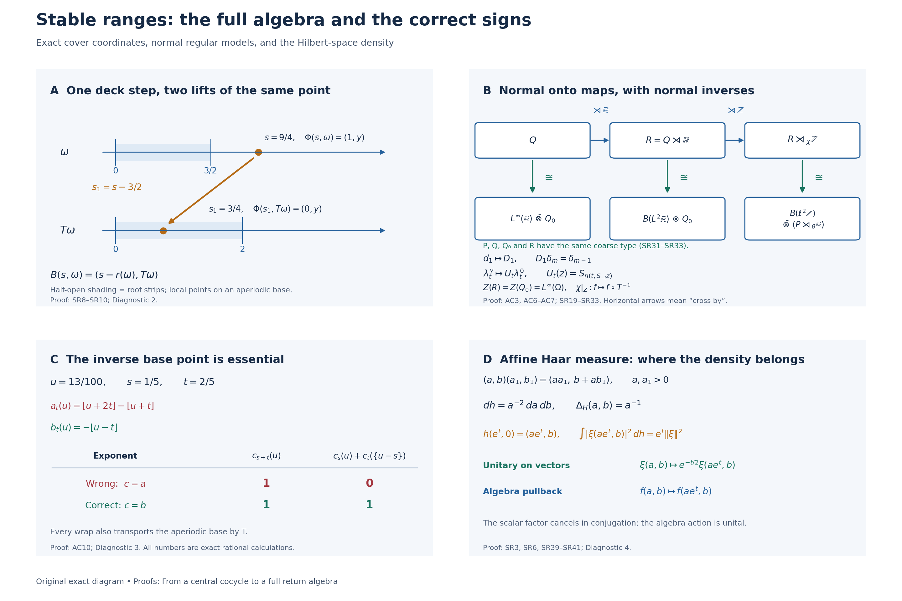

# From a central cocycle to a full return algebra

A suspension describes motion on the center. To recover a noncommutative algebra from that picture, one must also transport its coefficients, identify the whole algebra of sections, and verify the maps on the actual regular crossed products. We do this first by induced-system recognition and then by an independent trace-scaling argument. The two constructions lead to the same return system up to a specified normal conjugacy.

All new exposition, models and figure components authored here are dedicated to CC0-1.0 to the extent of any rights held. Cited sources and the bundled font retain their own terms.

## The statements and the measurable category

A continuous action on a von Neumann algebra means a point-ultraweakly continuous action by normal automorphisms. Our regular crossed-product convention, for additive groups, is
\
 [\pi_\alpha(x)\xi=\sigma(\alpha_{-t}(x))\xi(t),
 \qquad \lambda_s\xi=\xi(t-s),
 \tag{SR1}
\]
where \(\sigma\) is faithful and normal. All crossed products below are these generated von Neumann algebras. A change of faithful normal realization is understood through the normal regular transport, not through an arbitrary integrated representation.

**Central extension theorem.** Let \(P\ne0\) have separable predual, let \(G\) be a separable locally compact Hausdorff group, and let \(\alpha\) be a continuous action. Fix a normal unital inclusion
\[
 A=L^\infty(Y,\nu)\subseteq Z(P)
\]
on a standard sigma-finite nonsingular \(G\)-space with jointly Borel action realizing the restricted action. Let \(H\) be a locally compact Hausdorff group and let \(\rho:G\times Y\to H\) satisfy
\[
 \rho(gh,y)=\rho(g,hy)\rho(h,y)
 \quad\text{for a.e. }y\text{ for each fixed }g,h.
 \tag{SR2}
\]
The group \(H\) is not required to be abelian, unimodular, separable or second countable. Assume that \(\rho\) is Borel. We will prove the following **regular measurability** condition for every such \(H\). More generally, the same conclusion holds for a cocycle given directly by this condition, without requiring a global Borel representative. With right regular unitaries
\
 [R_H(k)\xi=\Delta_H(k)^{1/2}\xi(hk),
 \qquad \kappa(g,y)=\rho(g,g^{-1}y),
 \tag{SR3}
\]
the maps \(y\mapsto R_H(\kappa(g,y))^{\pm1}\xi\) are strongly measurable for every fixed \(g,\xi\), and the maps \((g,y)\mapsto R_H(\kappa(g,y))^{\pm1}\xi\) are strongly measurable on the sigma-finite Haar/base product for every \(\xi\). Strong measurability includes an essentially separable vector range. Equivalent finite measures on \(Y\) give the same condition. No common exceptional set for all \(\xi\) is required.

For orientation, this condition is automatic for a Borel cocycle when \(H\) is separable locally compact. Indeed, the continuous orbit of any one vector under \(H\) is separable: the image of a countable dense subset is dense in that orbit. Composition of its continuous orbit map with the Borel map \(\kappa\) is measurable into a separable metric space. The same argument treats inverses. It is not necessary that \(L^2(H)\) itself be separable. It also holds whenever the cocycle takes values in a fixed separable subgroup. The measure argument HS1–HS6 below removes this subgroup requirement for every Borel cocycle in the stated category.

Use inner-regular Haar measure and the locally determined multiplication algebra \(L^\infty(H)\), as in the actual arbitrary-group Haar and induction providers. For non-sigma-compact \(H\) this is a spatial multiplication algebra, not an assertion about every possible global outer-regular product completion. The theorem gives a normal continuous action on \(L^\infty(H)\bar\otimes P\), with normal inverse at each parameter, whose fixed-parameter field formula is
\
 [\widetilde\alpha_gx^{-1},gy)
       =\alpha_{g,y}(x(h,y)).
 \tag{AC1}
\]
For arbitrary \(H\), this formula means the normal extension from elementary tensor fields in the locally determined Haar model; for separable \(H\) it is the usual sigma-finite product-field formula. The action extends \(\alpha\) on \(1\otimes P\), commutes with left translation by \(H\), and induces the stable-range \(H\)-action on
\[
 \mathcal C_\rho=(L^\infty(H)\bar\otimes A)^{\widetilde\alpha}.
 \tag{SR4}
\]

**Lifted-system theorem.** Suppose \((P,\theta,\mathbb R)\) has separable predual and properly ergodic center flow. In particular it is centrally ergodic; no factoriality assumption is made. Choose the suspension furnished by L38: base \((\Omega,\mu,T)\), finite Borel roof \(r\ge\delta>0\), flow \(S_t\) on \(Y\), and hitting cocycle \(n(t,y)\). Then
\[
 Q=\ell^\infty(\mathbb Z)\bar\otimes P,\qquad
 \widehat S_t(m,y)=(m+n(t,y),S_ty),\qquad L(m,y)=(m-1,y)
 \tag{AC2}
\]
give a lifted action \(\widetilde\theta\) and a commuting integer action \(\chi\), with \(\chi_1\) induced by \(L\). There are \(Q_0\) with separable predual, \(Z(Q_0)=L^\infty(\Omega,\mu)\), a normal automorphism \(\beta\) of \(Q_0\), and a normal isomorphism with normal inverse
\[
 \Psi:(Q,\widetilde\theta)\ \cong\
 (L^\infty(\mathbb R)\bar\otimes Q_0,\operatorname{lt}\otimes\mathrm{id}),
 \qquad \operatorname{lt}_tf(s)=f(s-t).
 \tag{AC3}
\]
It preserves the specified central real coordinate. In these coordinates the deck automorphism \(\Gamma=\Psi\chi_1\Psi^{-1}\) has
\[
 (\Gamma x)(s-r(\omega),T\omega)
       =\beta_\omega(x(s,\omega)),
 \tag{AC4}
\]
and the original full system is
\[
 (P,\theta)\cong
 ((L^\infty(\mathbb R)\bar\otimes Q_0)^\Gamma,\operatorname{lt}|_{(\cdot)^\Gamma}).
 \tag{AC5}
\]
Writing \(R=Q\rtimes_{\widetilde\theta}\mathbb R\), extend \(\chi\) by fixing the real implementing unitaries. There are normal onto isomorphisms, with normal inverses,
\[
 R\cong B(L^2\mathbb R)\bar\otimes Q_0,\qquad
 R\rtimes_\chi\mathbb Z
   \cong B(\ell^2\mathbb Z)\bar\otimes(P\rtimes_\theta\mathbb R).
 \tag{AC6}
\]
Their generator maps are proved below. The full center and its integer action are
\[
 (Z(R),\chi)\cong
 (L^\infty(\Omega),\,f\mapsto f\circ T^{-1}).
 \tag{AC7}
\]
If \(P\) has homogeneous coarse type I, II or III, then \(R\) has the same coarse type. This does not assert equality of finite/infinite subtypes or that \(R\) is a factor.

The earlier proofs used below are the [signed cover and its product measure class](OA-FLOW-L38.md#oa-flow.suspension.cover), [measure transport](OA-FLOW-L38.md#oa-flow.suspension.measure), [normal induced-system recognition](OA-FLOW-IW.md#iw-3), [full central decomposition](OA-FLOW-L41.md#oa-flow.cstd.static), [normalizing fiber maps](OA-FLOW-L41.md#oa-flow.cstd.normalizer), [trace-scaling cocycle stability](OA-FLOW-CST.md#cst-5), [canonical implementation](OA-FLOW-NR.md#oa-flow.nr.1), [regular cocycle transport](OA-FLOW-NR.md#oa-flow.nr.5), [Haar conventions](OA-FLOW-L24.md#oa-flow.grp.haarconventions), [translation continuity](OA-FLOW-L24.md#oa-flow.grp.translations), [vector integration](OA-FLOW-L24.md#oa-flow.grp.vectorintegration), [the multiplication commutant](OA-FLOW-ND.md#nd-multiplication), [the Weyl algebra](OA-FLOW-ND.md#nd-weyl-proof), [tensor commutants](OA-FLOW-ND.md#nd-tensor), and [polar bridges](OA-FLOW-PC.md#oa-flow.projection.pc2). The full measurable-field and completed-measure selection proofs are [OA-MOD-DF](../../OA-MOD/OA-MOD-DF.html#the-diagonal-commutant-is-exactly-the-decomposable-algebra) and [OA-MOD-SCF](../../OA-MOD/OA-MOD-SCF.html#choose-a-witness-after-completing-the-measure).

## 1. Measurability and the normal central lift

### A measure lemma for arbitrary target groups

Write \(\mathfrak c=2^{\aleph_0}\). Throughout this section, a finite Radon space means a Hausdorff topological space with a completed finite measure that is inner regular by compact sets on every measurable set. Its measurable subspaces, with their subspace topologies and restricted measures, have this property too.

**Lemma HS1 (real Lusin approximation).** If \(X\) is a finite Radon space and \(F:X\to[0,1]\) is measurable, then for every \(\varepsilon>0\) there is a compact \(K\subseteq X\) with \(\mu(X\setminus K)<\varepsilon\) such that \(F|_K\) is continuous.

**Proof.** Choose a countable base \((U_n)\) of \([0,1]\). Compact inner approximation gives compact
\[
 C_n\subseteq F^{-1}(U_n),\qquad
 D_n\subseteq X\setminus F^{-1}(U_n)
\]
whose union misses measure less than \(\varepsilon 2^{-n-2}\). Choose also a compact \(C\subseteq X\) missing measure less than \(\varepsilon/2\). The compact set
\[
 K=C\cap\bigcap_n(C_n\cup D_n)
 \tag{HS1}
\]
has the required measure estimate. Within \(K\), the preimage of \(U_n\) is \(K\cap C_n\), whose complement is \(K\cap D_n\); both are closed in \(K\). Thus the preimages of the base sets are relatively open and \(F|_K\) is continuous. \(\square\)

Call a partition \((X_i)_{i\in I}\) **completely measurable** if \(\bigcup_{i\in J}X_i\) is measurable for every subset \(J\subseteq I\), including uncountable \(J\).

**Lemma HS2 (small Radon spaces have countably supported measurable partitions).** Suppose \(X\) is a finite Radon space with
\[
 |X|\le 2^{\mathfrak c}.
 \tag{HS2}
\]
For every completely measurable partition,
\[
 \mu(X)=\sum_{i\in I}\mu(X_i).
 \tag{HS3}
\]
Consequently countably many partition members cover \(X\) modulo a null set. The sum denotes the supremum of finite subsums.

**Proof.** We give the cardinal argument, including the point at which Radon regularity matters. Suppose there is a counterexample and choose one whose family of nonempty partition members has the least possible cardinal \(\kappa\), among all finite Radon spaces satisfying (HS2). Necessarily \(\kappa\) is uncountable and \(\kappa\le2^{\mathfrak c}\).

Only countably many members can have positive measure. Removing all of them leaves a measurable Radon subspace of positive measure partitioned into null sets. Minimality keeps the cardinal equal to \(\kappa\). Relabel these sets \((X_i)_{i<\kappa}\), and put
\[
 m(J)=\mu\!\left(\bigcup_{i\in J}X_i\right)
 \qquad(J\subseteq\kappa).
 \tag{HS4}
\]
This is a finite countably additive measure on the entire power set of \(\kappa\), with zero mass at each singleton.

First, \(m\) cannot have a nonzero atomless part. If it did, restrict to that part and normalize its mass to one. An atomless finite measure admits exact bisection: positive sets contain arbitrarily small positive subsets by repeatedly taking the smaller part of a nontrivial split; a maximal disjoint family of such subsets is countable and exhausts the set modulo zero. Taking partial unions gives subsets with measure arbitrarily close to any prescribed smaller mass. Repeating this approximation in the unused part and taking an increasing union gives a subset of exactly that mass. Successive bisections therefore give dyadic partitions of \(\kappa\) and a map \(q:\kappa\to[0,1]\) whose Borel distribution is Lebesgue measure. Explicitly, record the successive binary choices and take their binary expansion; dyadic intervals have the prescribed masses, while ambiguous expansions form a null set.

Set \(F(x)=q(i)\) for \(x\in X_i\). Every subset \(B\subseteq[0,1]\), not merely every Borel subset, has measurable preimage under \(F\), because the original partition is completely measurable. Define \(\eta(B)=\mu(F^{-1}(B))\) after normalization. It agrees with Lebesgue measure on Borel sets.

For any \(B\subseteq[0,1]\) and \(\varepsilon>0\), choose a compact \(L\subseteq F^{-1}(B)\) missing less than \(\varepsilon\) of its measure, and a compact Lusin set \(K\) from HS1 missing less than \(\varepsilon\) of the total measure. Then \(F(K\cap L)\) is a compact subset of \(B\), and
\[
 \operatorname{Leb}(F(K\cap L))
 =\eta(F(K\cap L))
 \ge\mu(K\cap L)>\eta(B)-2\varepsilon.
 \tag{HS5}
\]
Thus the Lebesgue inner measure of \(B\) is \(\eta(B)\). Applying the same argument to the complement shows that the two inner measures sum to one, so \(B\) is Lebesgue measurable. This contradicts the existence of a Vitali nonmeasurable subset of \([0,1]\): choosing one representative from each equivalence class modulo rational differences gives pairwise disjoint rational translates, whose countable union has positive finite outer coverage and cannot have either zero or positive common Lebesgue measure. Hence the purported atomless part cannot exist.

A finite measure with no nonzero atomless part is concentrated on countably many atoms. Indeed choose a maximal disjoint family of positive atoms; it is countable, and a positive remainder would either contain another atom or be an atomless part. Restrict (HS4) to one positive atom and normalize again. Its index set still has cardinal \(\kappa\), by minimality. We now have a probability \(m\) on all subsets of \(\kappa\), taking only the values zero and one, with singleton masses zero.

The union of fewer than \(\kappa\) null subsets has measure zero. Otherwise disjointify such a family by its well ordering and pull back its positive union to \(X\). This gives a positive Radon subspace with a completely measurable null partition of cardinal less than \(\kappa\), contradicting the choice of \(\kappa\). Equivalently, the intersection of fewer than \(\kappa\) sets of measure one still has measure one.

If \(\kappa\le\mathfrak c\), inject \(\kappa\) into \(\{0,1\}^{\mathbb N}\). For each coordinate, exactly one of its two inverse images has measure one. Their countable intersection has measure one, but contains at most one point. This contradicts the singleton masses. Therefore \(\kappa>\mathfrak c\). Since \(\kappa\le2^{\mathfrak c}\), there is next an injection into \(\{0,1\}^{\mathfrak c}\). Intersect the measure-one choices in these \(\mathfrak c<\kappa\) coordinates. The same contradiction results. This proves (HS3). Since a finite sum of nonnegative masses has at most countably many nonzero terms, its final assertion follows. \(\square\)

The cardinal argument is in ordinary ZFC. It assumes neither the continuum hypothesis nor the nonexistence of measurable cardinals. In particular it does not invoke a cardinal bound on the target Hilbert space.

**Lemma HS3 (a metric partition with all subunions Borel).** For every metric space \(E\) and every \(\varepsilon>0\), there is a partition of \(E\) into Borel sets of diameter at most \(\varepsilon\) for which every subunion is Borel.

**Proof.** Well order an open cover \((U_i)_{i\in I}\) of diameter at most \(\varepsilon\), and let
\[
 d_i(x)=\min\{1,\operatorname{dist}(x,E\setminus U_i)\};
 \qquad \operatorname{dist}(x,\varnothing)=+\infty.
\]
Each \(d_i\) is \(1\)-Lipschitz, with the constant function one in the empty-complement case. For \(n\ge1\), set
\[
 F_{i,n}=\{d_i\ge2^{-n}\}
       \cap\bigcap_{j<i}\{d_j\le2^{-n-1}\}.
 \tag{HS6}
\]
These are closed subsets of \(U_i\). They cover \(E\) as \(i,n\) vary: for any \(x\), take the first \(U_i\) containing it and then a sufficiently large \(n\). At a fixed \(n\), distinct \(F_{i,n}\) have mutual distance at least \(2^{-n-1}\). For \(i<j\), compare \(d_i\) at points of the two sets and use its Lipschitz bound.

It follows that every union of a subfamily \((F_{i,n})_i\), at a fixed \(n\), is closed. A convergent sequence in such a union is Cauchy and eventually lies in just one of its uniformly separated closed members. Now put
\[
 E_{i,n}=F_{i,n}\setminus
              \bigcup_{m<n}\bigcup_j F_{j,m}.
 \tag{HS7}
\]
Discard empty sets. These form a partition, with the required diameter bound. For an arbitrary choice of pairs \(\mathcal J\),
\[
 \bigcup_{(i,n)\in\mathcal J}E_{i,n}
 =\bigcup_{n\ge1}
 \left[
   \left(\bigcup_{i:(i,n)\in\mathcal J}F_{i,n}\right)
   \setminus\left(\bigcup_{m<n}\bigcup_jF_{j,m}\right)
 \right].
 \tag{HS8}
\]
Both parenthesized sets are closed; their difference is Borel and the outer union is countable. No uncountable union of arbitrary Borel sets has been asserted measurable. \(\square\)

**Theorem HS4 (automatic essential separability in the needed category).** Let \(X\) be a sigma-finite Radon space with \(|X|\le2^{\mathfrak c}\), and \(E\) any metric space. Every Borel measurable \(f:X\to E\) has separable essential range. The same holds for maps measurable for the completed Radon measure. If \(E\) is a Banach space, \(f\) is strongly measurable.

**Proof.** First restrict to a finite-measure measurable subspace. Pull back the partition in HS3 with \(\varepsilon=2^{-n}\). All its subunions are measurable, so HS2 gives a countable set of its members covering almost all of \(X\). Choose a point from each selected nonempty target member. Outside a null set, the selected points approximate \(f(x)\) to distance at most \(2^{-n}\). The union of these countable point sets over \(n\) is countable. Intersecting the countably many conull sets shows that almost every \(f(x)\) is in its closure. A countable finite-measure exhaustion proves the sigma-finite assertion.

For a Banach target, use a countable dense family in this essential range and the first point within \(2^{-n}\) to obtain measurable countably valued approximations. On each finite-measure stage truncate to finitely many values, making the omitted measure summable in \(n\); set the approximant to zero on the omitted portion. The elementary estimate
\(\mu(\bigcup_{n\ge N}\text{omitted}_n)\le\sum_{n\ge N}\mu(\text{omitted}_n)\to0\)
shows almost-everywhere convergence of finite-valued simple functions. This is strong measurability in the precise sense of L24 Section 4. \(\square\)

The completely measurable-partition strategy follows Fremlin's Lemma 2A. The source-cardinality bound used here gives the final coordinate-injection contradiction, and the metric refinement is constructed explicitly. Fremlin's *Measurable functions and almost continuous functions*, Manuscripta Mathematica 33 (1981), 387–405, Lemma 2A and Theorem 2B, proves a stronger Radon-to-metric result without this source-cardinality bound. Its author-hosted scan was read through printed pp.387–395. The proof above establishes the bounded version needed here directly, including its measurable-partition and metric-refinement steps; it does not import Fremlin's measure-algebra representation or Maharam-theorem machinery. [Primary article](https://www1.essex.ac.uk/maths/people/fremlin/Fr81.pdf).

### The domain of the cocycle

**Lemma HS5.** If \(G\) is a separable locally compact Hausdorff group and \(Y\) is standard Borel with a sigma-finite Borel measure, then \(G\times Y\), with completed Haar/base product measure, can be treated as a sigma-finite Radon space of cardinal at most \(2^{\mathfrak c}\), without changing its Borel product sigma algebra.

**Proof.** Let \(D\subseteq G\) be countable dense and \(V\) a relatively compact open identity neighborhood. Every \(gV^{-1}\) meets \(D\), so \(G=DV\). Thus \(G\) is covered by countably many compact sets \(d\overline V\), and its Haar measure is sigma finite.

A regular Hausdorff separable space has a base of at most \(\mathfrak c\) regular open sets. Indeed a regular open \(U\) is determined by \(U\cap D\):
\[
 U=\operatorname{int}\overline{U\cap D}.
 \tag{HS9}
\]
Regular open sets form a base, because one can shrink an open neighborhood and then take the interior of its closure. Membership in that base separates points. Therefore \(|G|\le2^{\mathfrak c}\). Local compactness and Hausdorffness give the regularity used here.

A standard Borel \(Y\) has cardinal at most \(\mathfrak c\). Partition it into countably many Borel sets of finite measure. Put a Polish topology giving the prescribed Borel structure on each nonempty piece and use their topological disjoint sum. This is again Polish and has the same Borel sets. Every point then has an open neighborhood of finite measure, and the resulting measure is Radon; finite Borel measures on Polish spaces are inner regular by compact sets. Here is the finite-measure fact just used. In a complete separable metric space, cover the space, for each \(n\), by countably many open balls of radius \(2^{-n}\). Finitely many cover all but \(\varepsilon 2^{-n}\) of the finite measure. The intersection over \(n\) of their finite unions of closed balls is closed and totally bounded, hence compact by completeness, and misses measure at most \(\varepsilon\). This proves tightness. Open sets admit closed inner approximations \(\{x:d(x,X\setminus U)\ge1/n\}\). The measurable sets having both closed inner and open outer approximations form a sigma algebra: complementation interchanges the two properties; for a countable union take outer approximations with summable errors and approximate a sufficiently large finite partial union from within. Thus every Borel set has closed inner approximations. Intersecting one with a compact set witnessing tightness proves compact inner regularity. Completion preserves it: a completed-measurable set contains a Borel subset of equal measure, which has the compact approximants just constructed.

For a second countable \(Y\), every open subset of \(G\times Y\) has the form
\[
 \bigcup_{n\ge1} O_n\times B_n,
 \tag{HS10}
\]
where \((B_n)\) is a countable base of \(Y\) and \(O_n\) is the union of open \(G\)-sets whose product with \(B_n\) lies in the given open set. Consequently
\(\mathcal B(G\times Y)=\mathcal B(G)\otimes\mathcal B(Y)\).
This remains the same sigma algebra after the described change of Polish topology on \(Y\).

On a compact Haar carrier times one finite-measure Polish piece, the product is a finite Radon measure. Here this fact can also be checked directly: (HS10), compact inner approximation in each factor and finite unions of compact rectangles give inner regularity on open sets; tightness of the factors gives it on closed sets. Inner compact approximation is preserved under countable unions and countable intersections in a finite measure space. For intersections, choose compact subsets in each set with errors summing to less than \(\varepsilon\), and intersect them, using the first compact set as a carrier. Thus the assertion extends from open and closed sets to all Borel sets, and then to the completion. Countably many such pieces cover the product. Finally
\[
 |G\times Y|\le2^{\mathfrak c}\cdot\mathfrak c
              =2^{\mathfrak c}.
 \tag{HS11}
\]
This proves every assertion. \(\square\)

This argument does not assert that \(G\) is Polish, that its Borel sigma algebra is countably generated, or that its Haar measure algebra is separable. The second countable factor in (HS10) is the chosen topology on \(Y\).

### Automatic regular measurability

**Theorem HS6.** Retain the hypotheses of the central extension theorem above: \(P\) has separable predual; \(G\) is separable locally compact Hausdorff; \(A=L^\infty(Y,\nu)\subseteq Z(P)\) realizes the restricted continuous action through a specified nonsingular jointly Borel \(G\)-action on a standard sigma-finite base. Let \(H\) be any locally compact Hausdorff group. Suppose
\[
 \rho:G\times Y\longrightarrow H
\]
is Borel and, for each fixed \(g_1,g_2\),
\[
 \rho(g_1g_2,y)=\rho(g_1,g_2y)\rho(g_2,y)
 \quad\text{for almost every }y.
 \tag{HS12}
\]
Then the regular-measurability condition in that theorem follows automatically. Together with the operator construction immediately below, this gives the central lift, normal inverses, continuity and commuting stable-range action for arbitrary \(H\), without an additional measurability assumption.

**Proof.** Inversion in \(G\) is continuous and the base action is jointly Borel. Since \(Y\) has a countably generated Borel sigma algebra, the map
\[
 (g,y)\longmapsto(g,g^{-1}y)
\]
is Borel into the product Borel sigma algebra. Hence
\[
 \kappa(g,y)=\rho(g,g^{-1}y)
 \tag{HS13}
\]
is Borel.

Use the exact left Haar convention of L24:
\
 \int_H F(hk)\,dh=\Delta_H(k)^{-1}\int_H F(h)\,dh,
 \qquad
 [R_H(k)\xi=\Delta_H(k)^{1/2}\xi(hk).
 \tag{HS14}
\]
The unitaries \(R_H(k)\) form a strongly continuous representation on \(L^2(H)\) for arbitrary \(H\). To recall the actual proof, for \(\xi\in C_c(H)\), right translates have locally common compact support and converge uniformly, while \(\Delta_H\) is continuous. This proves \(L^2\) continuity. Density of \(C_c(H)\) and the unitary bound extend it to every \(\xi\in L^2(H)\), using the finite-exponent Haar model of L24. Inversion gives continuity of \(k\mapsto R_H(k)^{-1}\xi\) too.

For each fixed \(\xi\), the maps
\[
 (g,y)\longmapsto R_H(\kappa(g,y))\xi,
 \qquad
 (g,y)\longmapsto R_H(\kappa(g,y))^{-1}\xi
 \tag{HS15}
\]
are therefore Borel into the **norm topology** of the Hilbert space \(L^2(H)\). This is more than measurability of their scalar coordinates. Apply HS5 and HS4 to obtain strongly measurable joint vector fields. For each fixed \(g\), the same reasoning on \(Y\) gives strong measurability of both sections. A fixed-parameter conclusion is not being inferred from a product-a.e. assertion. These are exactly the four quantified requirements in the theorem's condition.

No cocycle identity was used to obtain this measurability: the argument works for any Borel map \(G\times Y\to H\). The identity (HS12) is used subsequently for the operator group law. We now use this measurability in the operator construction below. In particular
\[
 K_g(y)=R_H(\kappa(g,y)),\qquad
 \widetilde V_g=K_g(1\otimes V_g),\qquad
 \widetilde\alpha_g=\operatorname{Ad}\widetilde V_g
                       \big|_{L^\infty(H)\bar\otimes P}
 \tag{HS16}
\]
give actual unitary operators and normal automorphisms, with
\[
 K_{g_1g_2}=K_{g_1}(\mathrm{id}\otimes\alpha_{g_1})(K_{g_2}),
 \qquad
 \widetilde V_{g_1g_2}=\widetilde V_{g_1}\widetilde V_{g_2}.
 \tag{HS17}
\]
The inverse of \(\widetilde\alpha_g\) is the normal map \(\widetilde\alpha_{g^{-1}}\). The integrated-vector proof below now has its strong-measurability premise, including separable essential ranges for the adjoint orbits, and proves strong continuity of \(\widetilde V\) on the possibly nonseparable tensor Hilbert space.

The field formula is unchanged:
\
 [\widetilde\alpha_gx^{-1},gy)
      =\alpha_{g,y}(x(h,y)).
 \tag{HS18}
\]
For arbitrary \(H\), interpret it through the normal extension from elementary tensors in the locally determined spatial Haar model, as specified above. It is not an identification with every possible global outer-regular product completion. The square-root modular factor in (HS14) occurs on Hilbert vectors and cancels under conjugation; it does not appear in (HS18).

Left translation by \(H\) commutes with \(R_H\), hence with the lift, and is strongly continuous. Its restriction to
\[
 \mathcal C_\rho
   =\big(L^\infty(H)\bar\otimes A\big)^{\widetilde\alpha}
 \tag{HS19}
\]
is thus the continuous normal stable-range action of the whole group \(H\). This preserves every arbitrary-\(H\) conclusion stated. \(\square\)

### The normal operator construction

Let \(\mathcal H_P\) be the separable standard Hilbert space of \(P\). The earlier canonical-implementation theorem NR1 gives strongly continuous unitaries \(V_g\) implementing \(\alpha_g\). The actual full central decomposition in L41 gives its fixed-parameter fiber transports \(\alpha_{g,y}:P_y\to P_{gy}\); no evaluation at a variable group parameter is used.

First construct \(K_g\in B(L^2H)\bar\otimes A\) with field
\[
 K_g(y)=R_H(\kappa(g,y)).
\]
Here is the operator construction even when \(L^2H\) is nonseparable. On \(L^2(Y;L^2H)\), multiplication by this field is defined first on finite simple vector functions. Regular measurability makes their images strongly measurable. Pointwise unitarity preserves their norm; approximation defines an isometry on the entire Hilbert space. The inverse field gives its inverse by the same approximation. Thus \(K_g\) is unitary. Every matrix entry, in any orthonormal basis of \(L^2H\), is scalar multiplication on \(Y\). Finite matrix compressions converge strongly, so the arbitrary matrix-entry tensor argument puts \(K_g\) in \(B(L^2H)\bar\otimes A\). This tensor element can then be represented normally on \(L^2H\otimes\mathcal H_P\). It commutes with \(1\otimes P\), because \(A\) is central.

It normalizes \(L^\infty(H)\bar\otimes A\). For an elementary multiplier \(M_f\otimes1\), pointwise right translation shows that \(K_g(M_f\otimes1)K_g^*\) commutes with every \(M_a\otimes1\), \(a\in L^\infty(H)\), and with \(1\otimes A\). To justify membership in the tensor multiplication algebra without a nonseparable field identification, take an increasing sequence of finite measurable partitions generating the completed probability algebra of \(Y\). Their normal conditional expectations \(E_j\) approximate the identity ultraweakly: on scalar \(L^1\) tests this follows from density of partition-simple functions and the \(L^1\) contraction bound. Every coefficient of \((\mathrm{id}\otimes E_j)(K_g(M_f\otimes1)K_g^*)\) commutes with all \(M_a\), and therefore belongs to \(L^\infty(H)\). The latter multiplication algebra is maximal abelian by the finite-Haar-carrier argument in ND. Taking the bounded ultraweak limit proves the assertion. Applying it to \(K_g^*\) gives normalization in both directions.

Put \(\widetilde V_g=K_g(1\otimes V_g)\). The order of (SR2), at the final coordinate, gives
\[
 K_{gh}=K_g(\mathrm{id}\otimes\alpha_g)(K_h),
 \qquad \widetilde V_{gh}=\widetilde V_g\widetilde V_h.
 \tag{AC8}
\]
For example the first product at \(z\) is the right regular unitary of
\[
 \rho(g,g^{-1}z)\rho(h,h^{-1}g^{-1}z)
       =\rho(gh,h^{-1}g^{-1}z).
\]
Only the null sets for this pair and their nonsingular translates occur. The equality is a global operator equality for every fixed pair. At the identity (SR2) forces \(\rho(e,y)=e_H\) almost everywhere, so \(\widetilde V_e=1\).

Conjugation by \(\widetilde V_g\) preserves both generators \(L^\infty(H)\otimes1\) and \(1\otimes P\) of the tensor algebra, in both directions. It is a normal automorphism, with inverse conjugation by \(\widetilde V_{g^{-1}}\). On coefficients it is \(\alpha_g\). Right regular conjugation satisfies \(R_H(k)M_fR_H(k)^*=M_{f(\,\cdot\,k)}\), which proves (AC1) on elementary fields. Bounded normal extension proves it for the whole algebra.

**Continuity without separability of \(L^2H\).** The group \(G\) is sigma compact: its open sigma-compact subgroup has disjoint open cosets, and a countable dense subset meets every coset. Thus only countably many cosets occur. Regular measurability, first on finite simple tensor vectors and then by approximation, makes each orbit \(g\mapsto\widetilde V_g\eta\) strongly measurable. To see the parameter assertion explicitly, integrate the square errors of simple approximants to the joint vector fields on finite Haar/base rectangles; Tonelli gives strongly measurable \(L^2(Y)\)-valued sections. The representation of \(A\) on the separable \(\mathcal H_P\) is a countable sum of cyclic representations, as in L39's explicit cyclic construction. Each cyclic measure is absolutely continuous with respect to \(\nu\), so the same argument applies in every cyclic summand and hence on \(L^2H\otimes\mathcal H_P\). A sigma-finite exhaustion and then vector approximation give the assertion for every \(\eta\). The term \(V_g\eta\) is strongly continuous and has separable range on compact sets, so its approximation introduces no new difficulty.

For \(f\in C_c(G)\), the vector \(\eta_f=\int f(g)\widetilde V_g\eta\,dg\) exists and
\[
 \|\widetilde V_s\eta_f-\eta_f\|
       \le\|\eta\|\,\|f(s^{-1}\,\cdot)-f\|_1\longrightarrow0.
 \tag{SR5}
\]
These vectors have dense span. If \(\zeta\) is perpendicular to all of them, then for each \(\eta\),
\(\langle\eta,\widetilde V_g^*\zeta\rangle=0\) for almost every \(g\). The orbit \(g\mapsto\widetilde V_g^*\zeta\) is strongly measurable and has essentially separable range on each member of a countable finite-Haar-measure exhaustion of \(G\). Choose a countable dense family in each such range, and use those vectors as the \(\eta\)'s. Outside a countable union of null sets the orbit is perpendicular to its own closed span, hence zero. Its norm is the constant \(\|\zeta\|\), and a finite positive-Haar-measure set exists; thus \(\zeta=0\). Density and the uniform unitary bound extend (SR5) to every vector. This proves strong continuity of \(\widetilde V\), and hence continuity of \(\widetilde\alpha\).

The left regular representation of \(H\) commutes with its normalized right regular representation and with \(1\otimes V_g\). It is strongly continuous, so its restriction to the invariant algebra (SR4) is a continuous normal \(H\)-action. This proves the central extension theorem, including normality, inverse, continuity and the stable-range assertion.

The modular multiplier in (SR3) is exact: our left Haar convention has
\[
 \int_H F(hk)\,dh=\Delta_H(k)^{-1}\int_HF(h)\,dh.
 \tag{SR6}
\]
The factor \(\Delta_H(k)^{1/2}\) compensates on Hilbert vectors. It cancels in operator conjugation and must not be inserted into (AC1).

## 2. The signed cover specifies the real coordinate

Use the recurrent conull model of L38, retaining its half-open conventions. Write
\[
 r_j(\omega)=\sum_{k=0}^{j-1}r(T^k\omega)\ (j>0),\quad
 r_0=0,\quad r_{-j}(\omega)=-r_j(T^{-j}\omega).
 \tag{SR7}
\]
Then \(r_{j+k}(\omega)=r_k(\omega)+r_j(T^k\omega)\). The section theorem supplies a Borel measure-class isomorphism
\[
 \Phi:\mathbb R\times\Omega\longrightarrow\mathbb Z\times Y,\qquad
 \Phi(s,\omega)=(n(s,\omega),S_s\omega),
 \tag{SR8}
\]
whose inverse is the explicit preceding-hit formula L38(S22). Its product-class theorem gives \([ds\,d\mu]=\Phi^{-1}[\#\,d\nu]\), and
\[
 \Phi(s+t,\omega)=\widehat S_t\Phi(s,\omega),\qquad
 \Phi(s-r(\omega),T\omega)=L\Phi(s,\omega).
 \tag{SR9}
\]
These are exact statements on the retained Borel model, including both time directions. Apply Section 1 to \(\rho(t,y)=-n(t,y)\) with \(H=\mathbb Z\). The minus sign produces the plus sign in \(\widehat S_t\). The integer action on coefficients is
\[
 (\chi_kx)(m)=x(m+k),
 \tag{SR10}
\]
and commutes with the lift. Its fixed algebra is exactly \(1\otimes P\): equality of every adjacent coordinate gives constant bounded \(P\)-sequences, with normal inverse given by any coordinate compression.

The center of \(Q\) is \(\ell^\infty(\mathbb Z)\bar\otimes Z(P)\), by its coordinate corners. Transporting this center through \(\Phi\) gives the entire \(L^\infty(\mathbb R\times\Omega)\). In particular the first-coordinate inclusion \(\iota:L^\infty(\mathbb R)\to Z(Q)\) is unital, faithful, normal and equivariant for \(f(s)\mapsto f(s-t)\). Faithfulness follows from the product measure class and the nonzero base. Normality and normality of the inverse coordinate transport follow from the nonsingular Borel isomorphism, equivalently its square-root-density unitary.

We will use a scalar fact several times. If a measurable bounded \(h(s,\omega)\) satisfies \(h(s+t,\omega)=h(s,\omega)\) almost everywhere for each fixed \(t\), Tonelli on finite rectangles and \((t,s)\mapsto(v=s+t,s)\) give \(h(v,\omega)=h(s,\omega)\) for almost every triple. Fubini makes \(h\) independent of \(s\) almost everywhere. Thus
\[
 Z(Q)^{\widetilde\theta}=L^\infty(\Omega).
 \tag{SR11}
\]
Countably many such scalar statements have a common regular slice. This argument does not intersect uncountably many conull sets.

## 3. The product model from induced-system recognition

The IW theorem applies to \((Q,\widetilde\theta,\iota)\), with \(G=\mathbb R\) and subgroup \(\{0\}\). Its full conclusion is a normal onto map with normal inverse, intertwining the action and the *specified* central quotient. Since the subgroup is trivial, its induced algebra is \(L^\infty(\mathbb R)\bar\otimes Q_0\), and its action is \(\operatorname{lt}\otimes\mathrm{id}\). This proves (AC3).

This application uses more than the assertion that almost all fibers are isomorphic. IW constructs a faithful normal pullback, proves it is onto the quotient commutant by scalar convolution, and then uses both \(Q\) and \(Q'\) to prove the whole inducing algebra equality. In IW notation the pullback is (IW27), its normal inverse is (IW38), its restriction onto the required algebra is (IW46), and (IW39) preserves our \(\iota\). These are the precise normal onto and coordinate conclusions being used here.

The fixed algebra of \(\operatorname{lt}\) is \(1\otimes Q_0\). For completeness, test an element against each member of a countable dense family of normal functionals after a separable realization, or first use arbitrary normal slices and the scalar translation argument. The slices are constant, and a probability density in the real coordinate gives the unique constant coefficient. The same slice argument gives
\[
 Z(L^\infty(\mathbb R)\bar\otimes Q_0)
       =L^\infty(\mathbb R)\bar\otimes Z(Q_0).
 \tag{SR12}
\]
For the reverse center inclusion, commuting with the constant \(Q_0\) fields forces every normal real-coordinate slice into \(Z(Q_0)\). Apply finite-partition normal expectations on the commutative real factor after replacing Lebesgue measure by an equivalent probability. Each approximant is a finite sum of central coefficient slices. They converge ultraweakly, as in Section 1, proving membership in the stated tensor algebra without a separability assumption on the preliminary inducing Hilbert space.

The algebra \(Q_0\) has separable predual. A normal probability slice \(E:L^\infty(\mathbb R)\bar\otimes Q_0\to Q_0\) satisfies \(E(1\otimes a)=a\), so its preadjoint is an isometric embedding of \((Q_0)_*\) into the separable predual of \(Q\). Combining (SR11)–(SR12) identifies \(Z(Q_0)\) with the *specified* return algebra \(L^\infty(\Omega)\). Since \(\Psi\) fixes the real-coordinate subalgebra, and carries the invariant central algebra to \(1\otimes Z(Q_0)\), its map on the full center is their product. Products of these two central subalgebras generate the whole center, so this identifies the full diagonal, not merely two isolated subalgebras.

Set \(\Gamma=\Psi\chi_1\Psi^{-1}\). Commutation with translation makes \(\Gamma\) preserve \(1\otimes Q_0\); let its restriction there be \(\beta\). The same fact for \(\Gamma^{-1}\) shows that \(\beta\) is onto, normal and has normal inverse. Its action on the center is \(f\mapsto f\circ T^{-1}\), by (SR9). The fixed-generator decomposition in L41 therefore gives normal fiber isomorphisms \(\beta_\omega:(Q_0)_\omega\to(Q_0)_{T\omega}\).

Equation (AC4) now follows on constant \(Q_0\) fields and on central real multipliers. These generate the full tensor algebra. Both sides define normal maps: for the right side use the countable measurable field of the one automorphism, its inverse and the nonsingular deck map. Agreement extends normally, proving (AC4) for every element. For all integer iterates remove the countable union of the fixed-generator exceptional sets and their \(T\)-translates. This yields a \(T\)-invariant conull base on which
\(\beta_{j+k,\omega}=\beta_{j,T^k\omega}\beta_{k,\omega}\) for every integer pair.

Finally (SR10) and equivariance give (AC5) with inverse obtained from \(\Psi^{-1}\) and coordinate evaluation of a constant \(P\)-sequence. All maps are normal. The formula uses the strict product coordinate, never a fiber of the original algebra at the null section \(s=0\).

## 4. An independent product construction using a trace on the Hilbert field

This proof of (AC3) uses L41 and CST, and does not use IW. Pull the *full* standard-form decomposition of \(Q\) through (SR8), and change its measure to \(ds\,d\mu(\omega)\) by the square-root-density unitary. Write its Hilbert field as \(\mathcal H_{s,\omega}\). For each fixed \(t\), the global canonical implementer maps the fiber at \((s,\omega)\) unitarily to that at \((s+t,\omega)\), almost everywhere.

Apply the scalar translation argument to the countably many functions
\(1_{\{\dim\mathcal H_{s,\omega}\ge j\}}\). The dimension is \(d(\omega)\) almost everywhere. A measurable orthonormal basis can be constructed by Gram–Schmidt: at each step choose the first member of the fundamental sequence whose residual norm is positive, normalize it, and use the countable measurable partition determined by that first index. This gives measurable coordinates
\[
 \mathcal K=L^2\!\left(\mathbb R,ds;
                  \int_\Omega^\oplus K_\omega\,d\mu(\omega)\right),
 \qquad K_\omega=\mathbb C^{d(\omega)},\quad
 (T_t\xi)(s,\omega)=\xi(s-t,\omega).
 \tag{SR13}
\]
The symbol \(\mathbb C^\infty\) means \(\ell^2\). This step identifies Hilbert spaces, not algebra fibers. It allows \(d(\omega)\) to vary.

Let \(V_t\) be the transported canonical implementation of the lifted action. Both \(V_t\) and \(T_t\) implement real translation on the complete central diagonal \(D=L^\infty(\mathbb R\times\Omega)\). Consequently
\[
 W_t=V_tT_t^*\in D',\qquad
 W_{s+t}=W_s\,\operatorname{Ad}(T_s)(W_t).
 \tag{SR14}
\]
The cocycle is strongly continuous, as are both unitary representations. The full diagonal-commutant theorem identifies
\[
 D'=\int_{\mathbb R\times\Omega}^{\oplus} B(K_\omega)\,ds\,d\mu(\omega).
\]
On this ambient algebra put
\[
 \mathcal T(X)=\int_\Omega\int_{\mathbb R}
 e^{-s}\operatorname{Tr}_{K_\omega}(X(s,\omega))\,ds\,d\mu,\qquad
 \eta_t(X)(s,\omega)=X(s-t,\omega).
 \tag{AC9}
\]
This is a faithful normal semifinite trace. To verify all qualifications, its diagonal formula is a sum of nonnegative integrals against the measurable basis vectors. On finite base-measure sets and bounded height intervals, these integrals are normal vector functionals after multiplying the basis section by the square root of \(e^{-s}\). A countable exhaustion proves normality of the full sum, including for increasing nets and infinite values. Vanishing forces every diagonal quadratic form of \(X\ge0\) to vanish, and hence \(X=0\). For any bounded field \(a\), the two expressions for \(\mathcal T(a^*a)\) and \(\mathcal T(aa^*)\) are the same nonnegative double sum of squared matrix entries; thus the weight is tracial.

Cutting to a finite-measure base set, \(|s|\le m\), and the first \(m\) basis coordinates gives projections \(q_m\uparrow1\) after choosing nested exhaustions, with \(\mathcal T(q_m)<\infty\). The elements \(xq_m\) belong to the finite left ideal, since \(\mathcal T(q_mx^*xq_m)\le\|x\|^2\mathcal T(q_m)\), and converge strongly to \(x\). This proves semifiniteness. Finally the substitution \(v=s-t\) proves, on the whole positive cone,
\[
 \mathcal T\eta_t=e^{-t}\mathcal T.
 \tag{SR15}
\]
No trace on \(P\), \(Q\), or their fibers was assumed.

The CST theorem now applies to \(W\) in \(D'\). It gives a unitary \(b\in D'\) such that
\[
 W_t=b^*\eta_t(b),\qquad bV_tb^*=T_t
 \quad\text{for every }t.
 \tag{SR16}
\]
Set \(\widehat Q=bQb^*\). Its full measurable algebra field
\(\widehat Q_{s,\omega}\subseteq B(K_\omega)\) is invariant under bare translation. We prove that it is constant in the real coordinate; arbitrary chosen fiber isomorphisms would not prove this.

In each dimension stratum, choose rational finite-rank self-adjoint trace-class functionals \(\ell_j\), dense in the self-adjoint trace class. Compress the same countable coordinate family on finite-dimensional strata. Choose a countable family of measurable sections weakly dense in each self-adjoint fiber unit ball. The full central decomposition supplies countable \(C^*\)-generators; rational self-adjoint polynomials, clipped to \([-1,1]\), give such a family by bounded density. The functions
\[
 h_j(s,\omega)=
 \sup\{\ell_j(a):a\in(\widehat Q_{s,\omega})_{1,\mathrm{sa}}\}
 \tag{SR17}
\]
are measurable because the supremum may be taken over that countable family. They are bounded for each \(j\). Uniqueness of the full decomposable algebra, or equality tested on those generators in both directions, shows that \(h_j(s+t,\omega)=h_j(s,\omega)\) almost everywhere for each fixed \(t\).

The scalar lemma gives one regular height \(0<s_0<1\) such that, simultaneously for every \(j\), \(h_j(s,\omega)=h_j(s_0,\omega)\) almost everywhere, and the fiber data at \(s_0\) are valid almost everywhere in \(\omega\). Equality of these support functions implies equality of the self-adjoint unit balls. Indeed an element outside one weak-star compact convex ball can be strictly separated by a self-adjoint trace-class functional; norm approximation of that functional by an \(\ell_j\) preserves strict separation on bounded balls. Scaling and complex linear span recover the algebras. Hence
\[
 \widehat Q_{s,\omega}=\widehat Q_{s_0,\omega}
 \quad\text{a.e.},\qquad
 Q_0^{\,\mathrm{alt}}=
 \int_\Omega^\oplus\widehat Q_{s_0,\omega}\,d\mu(\omega).
 \tag{SR18}
\]

Fullness now proves
\(\widehat Q=L^\infty(\mathbb R)\bar\otimes Q_0^{\,\mathrm{alt}}\).
For clarity, the right side is the full algebra of measurable essentially bounded sections of this constant-in-\(s\) field: a countable dense family in the coefficient unit ball and measurable finite-vector approximations give bounded simple sections converging strongly, and finite simple sections belong to the tensor product. Conversely every tensor section belongs to the full integral. Equality is therefore equality of represented von Neumann algebras. The coordinate, basis and \(b\)-conjugations are unitaries, so their composite is normal, onto, and has a normal spatial inverse. Equation (SR16) proves equivariance for every time. This proves (AC3) independently. The center, deck restriction and fixed-algebra arguments of Section 3 then apply unchanged.

The regular slice is not prescribed to be \(0\). Altering any of the original fields on a product-null set can change every value at \(s=0\), without changing \(Q\). This proof never uses those values.

The two routes yield conjugate specified return systems. Compose their normal product isomorphisms. The composite intertwines real translation and fixes \(L^\infty(\mathbb R)\); it maps the complete fixed algebra \(1\otimes Q_0\) onto \(1\otimes Q_0^{\,\mathrm{alt}}\), giving a normal isomorphism \(\zeta\). On elementary tensors the composite is \(\mathrm{id}\otimes\zeta\), and normality gives that formula everywhere. Its compatibility with the original \(\chi\) gives \(\zeta\beta=\beta^{\mathrm{alt}}\zeta\). The base identification is the specified invariant-center map. This is the precise equivalence of the two constructions.

## 5. Faithful regular models for all the crossed-product arrows

**The real translation crossing.** Let \(N\) be represented faithfully normally on \(K\). Represent \(L^\infty(\mathbb R)\bar\otimes N\) on \(L^2(\mathbb R_x;K)\), and use (SR1) for \(\operatorname{lt}\). On \(L^2(\mathbb R_t\times\mathbb R_x;K)\),
\
 [\pi(a)\xi=a(x+t)\xi(t,x),\qquad
 \lambda_s\xi=\xi(t-s,x).
\]
The measure-preserving change of variables
\
 [J\xi=\xi(y-v,v)
 \tag{SR19}
\]
is a unitary with inverse \(J^*\zeta=\zeta(x+t,x)\). It sends the coefficients to \(a(y)\), and \(\lambda_s\) to translation \(\zeta(y,v)\mapsto\zeta(y-s,v)\).

On \(L^2(\mathbb R_y)\), multipliers and translations generate \(B(L^2\mathbb R)\). An operator commuting with the multipliers is a multiplier, by the finite-measure localization argument; commuting also with translations makes it scalar by the scalar lemma. The bicommutant theorem proves the claim. Equivalently, the retained compact-kernel proof integrates \(M_{p(y)\overline{q(y-s)}}\lambda_s\) to the rank-one operator \(\xi\mapsto p\int\overline q\,\xi\).

Consequently the regular crossed product, after \(J\), is exactly
\[
 (B(L^2\mathbb R_y)\bar\otimes N)\otimes1_{L^2(\mathbb R_v)}.
 \tag{SR20}
\]
Removing this explicit multiplicity has a normal inverse: compress its last coordinate by any unit vector in \(L^2(\mathbb R_v)\). Amplification and this compression are inverse on the displayed algebra and are normal by vector coefficients. Thus this is a faithful normal onto identification of the regular crossing, not merely a covariant image that happens to generate a type-I algebra. Applying it after \(\Psi\) proves the first assertion of (AC6).

**The integer translation crossing with our orientation.** On
\(\ell^2(\mathbb Z_k)\otimes\ell^2(\mathbb Z_m)\otimes\mathcal H_P\), its regular coefficients and implementing unitaries are
\
 [\pi_\chi(q)\xi=q(m-k)\xi(k,m),\qquad
 d_j\xi=\xi(k-j,m).
\]
The unitary
\
 [J_{\mathbb Z}\xi=\xi(v-a,v)
 \tag{SR21}
\]
has inverse \(\xi(k,m)=\zeta(m-k,m)\). It sends coefficients to \(q(a)\) and \(d_j\) to \(D_j\zeta(a)=\zeta(a+j)\), with the \(v\)-coordinate unchanged. If \(e_i\) is the \(i\)-th diagonal projection, then
\[
 E_{ij}=e_iD_{j-i}
 \tag{SR22}
\]
are the complete matrix units on \(\ell^2(\mathbb Z_a)\). Their finite sums of diagonal units converge strongly to one. Hence, including every coefficient of \(P\),
\[
 Q\rtimes_\chi\mathbb Z
   \cong B(\ell^2\mathbb Z)\bar\otimes P.
 \tag{SR23}
\]
The proof of normality, faithfulness, onto image and normal inverse is again unitary conjugation followed by removal of the explicit \(v\)-multiplicity. In particular the integer generator has image \(D_1\), carrying \(\delta_m\) to \(\delta_{m-1}\).

**Commuting crossings.** The canonical standard implementations of two commuting automorphism actions commute, by uniqueness. Thus \(\chi\) extends normally to \(R\), fixing real translations, and \(\widetilde\theta\) extends normally to \(Q\rtimes_\chi\mathbb Z\), fixing integer translations. In the double regular representation on \(L^2(\mathbb R_t\times\mathbb Z_k;\mathcal H_Q)\), the coefficient of \(x\in Q\) is
\[
 \sigma(\widetilde\theta_{-t}\chi_{-k}(x)).
 \tag{SR24}
\]
The real and integer implementers shift \(t\) and \(k\) separately. Reversing the order of the two coordinates gives the other double regular representation, because the coefficient actions commute. The coordinate-flip unitary and its inverse therefore prove a normal onto isomorphism
\[
 (Q\rtimes_{\widetilde\theta}\mathbb R)\rtimes_\chi\mathbb Z
 \ \cong\
 (Q\rtimes_\chi\mathbb Z)\rtimes_{\widetilde\theta}\mathbb R,
 \tag{SR25}
\]
fixing the indicated coefficients and both implementing groups.

**The real action after the integer crossing.** Define \(S_j\delta_m=\delta_{m+j}\) and
\[
 u(t,y)=S_{n(t,y)},\qquad U_t(z)=u(t,S_{-t}z)
       \in B(\ell^2\mathbb Z)\bar\otimes Z(P).
\]
The hitting law gives, with the products in this order,
\[
 U_{s+t}=U_s(\mathrm{id}\otimes\theta_s)(U_t).
 \tag{AC10}
\]
Indeed its right side at \(z\) is
\(u(s,S_{-s}z)u(t,S_{-(s+t)}z)\).
This is \(u(s+t,S_{-(s+t)}z)\), by applying the hitting law at the original source. It is generally wrong to replace \(S_{-t}z\) by \(S_tz\).

The map \(U\) is strongly continuous. At almost every point of the open strip \(0<a<r(\omega)\), small positive and negative times cross no boundary, so \(n(t,S_{-t}z)=0\) eventually as \(t\to0\). The exceptional strip boundary is null by the product measure class. On each Hilbert vector the norm of the unitary difference is bounded by twice the vector norm. Dominated convergence gives \(U_t\to1\) strongly. Its adjoints converge too. The cocycle equation, with the fixed normal automorphism \(\theta_s\), gives continuity at every \(s\); normal representations preserve bounded strong-star convergence, as in [ST2](OA-FLOW-ST12.md#oa-flow.st.2) and [NR](OA-FLOW-NR.md#oa-flow.nr.1).

Under (SR23) the extended real action is
\[
 \gamma_t=\operatorname{Ad}(U_t)\circ(\mathrm{id}\otimes\theta_t).
 \tag{SR26}
\]
Check this first on diagonal \(q\): conjugation by \(S_{n(t,S_{-t}z)}\) shifts its integer input to \(m-n(t,S_{-t}z)\), exactly the lifted coefficient formula. It fixes \(D_1\), since integer shifts commute and \(U_t\) has central \(P\)-coefficients. These generators give (SR26) on the whole algebra by normality.

Put \(\alpha^0=\mathrm{id}\otimes\theta\). The actual cocycle unitary of NR5 is
\
 [F\xi=\sigma(U_{-t})\xi(t),\qquad
 F\pi_{\alpha^0}(a)F^*=\pi_\gamma(a),\qquad
 F\lambda_t^{\,0}F^*=\pi_\gamma(U_t^*)\lambda_t^{\,\gamma}.
 \tag{SR27}
\]
Here \(-t\) is the inverse *parameter*. The field is unitary and strongly measurable, and multiplication by \(\sigma(U_{-t}^*)\) is its inverse. The cocycle identity verifies both formulas directly in (SR1). Thus the inverse conjugation fixes coefficients and sends
\[
 \lambda_t^\gamma\longmapsto\pi_{\alpha^0}(U_t)\lambda_t^0.
 \tag{SR28}
\]
Its images generate: coefficients are fixed, and multiplying by \(U_t^*\) recovers every \(\lambda_t^0\). This proves normality, faithfulness, surjectivity and the normal inverse. Finally the regular representation for \(\alpha^0\), with the unchanged \(\ell^2\mathbb Z\) coordinate moved first, is exactly \(B(\ell^2\mathbb Z)\bar\otimes(P\rtimes_\theta\mathbb R)\). Combining (SR25), (SR23) and (SR28) proves the second isomorphism in (AC6), with all generator images specified.

## 6. The entire center, with its actual return action

In \(B(K)\bar\otimes N\), commuting with the matrix units of \(B(K)\) makes an element \(1\otimes a\); commuting also with \(1\otimes N\) makes \(a\in Z(N)\). Conversely those elements are central. Thus (SR20), for \(N=Q_0\), identifies the full center of \(R\) as \(1\otimes Z(Q_0)\). Its preimage is the embedded copy of \(Z(Q)^{\widetilde\theta}\): under \(\Psi\) these are precisely the real-constant central coefficients. The extension of \(\chi\) acts on them by its coefficient action, and (SR9) gives \(f\mapsto f\circ T^{-1}\). This proves (AC7) onto the full center.

This argument does not assert that \(\chi\) is \(\mathrm{id}\otimes\beta\) on the whole \(B(L^2\mathbb R)\bar\otimes Q_0\). Its variable height shift acts on the first factor as well. The center calculation uses the actual constant central coefficients, where that height shift disappears.

## 7. A complete coarse-type transfer argument

We use the projection definitions. Type I means that every nonzero projection dominates a nonzero abelian projection. Projection semifiniteness means that every nonzero projection dominates a nonzero finite projection. Type II means projection semifiniteness with no nonzero abelian projection; type III means no nonzero finite projection. A projection is finite when it is not equivalent, within its corner, to a proper subprojection. The corner notion is the same as the ambient notion, since any implementing partial isometry with initial and final projections below \(p\) lies in \(pMp\).

**Lemma 1: testing projections in a constant product field.** Let \(M\) have separable predual and \(X\) be a nonzero standard sigma-finite measure space. In \(A_X\bar\otimes M\), \(A_X=L^\infty(X)\), a projection \(p\) is finite if and only if \(p(x)\) is finite for almost every \(x\). It is abelian if and only if \(p(x)\) is abelian almost everywhere.

Here are the measurability details. Represent \(M\) faithfully normally on a separable Hilbert space \(K\). Its closed unit ball, with the strong-star metric from a countable dense family of vectors, is Polish. Completeness follows because a strong-star Cauchy sequence has bounded strong limits for itself and its adjoint, and the two limits are adjoints; strong closedness puts the limit in \(M\). Separability follows by embedding the ball through those vector values into a countable product of separable metric spaces. Its closed subspace of projections is therefore Polish too.

The spatial product \(A_X\bar\otimes M\) is the full algebra of essentially bounded strong-star measurable \(M\)-fields. Choose a countable strong-star dense subset of the bounded ball. For a bounded measurable field, choose at stage \(j\) the first approximant within \(2^{-j}\) in its strong-star metric. The index functions are measurable. This gives countably valued bounded fields, approximated strongly by finite simple fields after a measurable partition and finite-measure exhaustion. Pointwise strong convergence and the uniform bound imply strong convergence on each integral vector by dominated convergence. Thus the original field lies in the tensor algebra. Conversely an element of the spatial tensor product commutes with all scalar multipliers, so the diagonal-commutant theorem makes it a \(B(K)\)-field. It commutes with \(1\otimes M'\). A countable strong-star dense family in the unit ball of \(M'\), which exists on the separable \(K\), puts the field in \((M')'=M\) outside one null set. This proves both directions. Completed-measurable fields may be replaced by Borel ones off one null set.

For finiteness consider the Borel relation on \(X\times M_1\)
\[
 \mathscr R=\{(x,v):v^*v=p(x),\ vv^*\le p(x),\
                         p(x)-vv^*\ne0\}.
 \tag{SR29}
\]
All operations are strong-star continuous on bounded sets. The last condition is a countable union of strict positive tests against a dense sequence of vectors. Thus \(\mathscr R\) is Borel. Its projected domain is exactly the set where \(p(x)\) is infinite.

The completed-measure selection theorem proved in OA-MOD-SCF, “Choose a witness after completing the measure,” applies to this Borel relation with Polish witness ball and standard sigma-finite base. Its proof codes the relation by a closed Baire-space witness, proves that its projected hitting sets are completed-measurable, and selects nested shrinking closed cells. It provides a completed-measurable \(v(x)\) on the projected domain; no everywhere Borel selector is presumed. If that domain has positive measure, use this \(v\) there and set \(v(x)=p(x)\) elsewhere. The preceding field construction places \(v\) in \(A_X\bar\otimes M\), with \(v^*v=p\) and \(vv^*<p\). The inequality is strict because a positive nonzero field on a positive-measure set is a nonzero operator: some countable vector test, localized to a finite-measure subset, detects it. Therefore global finiteness forces fiber finiteness almost everywhere. Conversely, any global proper equivalence decomposes to such an equivalence almost everywhere and is proper on a positive-measure set, contradicting fiber finiteness. This proves both directions.

For abelianness choose a countable strong-star dense sequence \((a_j)\) in \(M_1\). The corner \(p(A_X\bar\otimes M)p\) is commutative exactly when
\[
 [p a_j p,p a_k p]=0\quad\text{for all }j,k.
 \tag{SR30}
\]
These countably many field equalities hold globally exactly when they hold almost everywhere simultaneously. Bounded strong approximation then gives commutation of every pair in each fiber corner. The same argument in reverse proves the equivalence. This completes Lemma 1.

**Lemma 2: abelian tensor factors preserve and reflect every coarse type.** For the same \(M,X\),
\[
 M\text{ has homogeneous type }i
 \quad\Longleftrightarrow\quad
 L^\infty(X)\bar\otimes M\text{ has homogeneous type }i,
 \quad i=\mathrm{I,II,III}.
 \tag{SR31}
\]
If \(M\) is projection-semifinite, take a maximal orthogonal family of nonzero finite projections \((e_j)\). It fills \(1\), because a nonzero remainder would contain another finite projection. It is countable: a faithful normal state gives each member a positive value, and only finitely many values can exceed any prescribed positive threshold. If \(M\) is type I, the same construction gives an orthogonal filling family of abelian projections.

Let \(p(x)\) be a nonzero product projection. At every point where it is nonzero, some pair \(j,k\) satisfies
\[
 p(x)a_k e_j\ne0.
 \tag{SR32}
\]
Otherwise density of \((a_k)\) gives \(p(x)Me_j=0\) for every \(j\), and in particular \(p(x)e_j=0\), contradicting \(\sum e_j=1\). Choose the first such pair on its measurable piece. The polar part of \(p(x)a_k e_j\) is measurable: it is the strong limit of
\[
 p(x)a_k e_j\,
 \bigl(e_ja_k^*p(x)a_ke_j+\varepsilon\bigr)^{-1/2}
 \quad(\varepsilon\downarrow0).
\]
Its final projection \(q(x)\le p(x)\) is nonzero and equivalent to a subprojection of \(e_j\). In the finite case \(q(x)\) is finite; Lemma 1 makes the global \(q\) finite. In the abelian case \(q(x)\) is abelian; Lemma 1 makes the global \(q\) abelian. This proves forward preservation of semifiniteness and of type I. The no-abelian clause passes from \(M\) to the product by Lemma 1, as does the no-finite clause. Thus all three forward implications hold.

For reflection, form the central projection \(z_{\mathrm{sf}}\) which is the join of all finite projections of \(M\). It is central because the family is invariant under unitary conjugation. Every nonzero projection below it has a nonzero finite subprojection: otherwise no polar bridge to a finite projection can exist, forcing that projection to be orthogonal to their join. Its complement has no nonzero finite projection. This is the explicit decomposition proved in [PC8](OA-FLOW-PC.md#oa-flow.projection.pc8), and the argument just given reproduces it. If \(M\) were not projection-semifinite, the nonzero summand \(M(1-z_{\mathrm{sf}})\) would be type III. By Lemma 1 its product with \(A_X\) is type III, contradicting projection semifiniteness of the full product. Thus semifiniteness reflects.

Likewise let \(z_{\mathrm I}\) be the join of the central supports of all abelian projections. The polar-bridge argument gives an abelian subprojection under every nonzero projection below \(z_{\mathrm I}\): a nonzero bridge to an abelian projection transports a smaller abelian corner. The complement has no nonzero abelian projection. If the product were type I while \(z_{\mathrm I}\ne1\), its nonzero complementary product corner would have no abelian projections by Lemma 1, a contradiction. Thus type I reflects. If the product has no abelian projections, any abelian \(e\in M\) would make \(1\otimes e\) abelian; hence the no-abelian property reflects. Similarly a nonzero finite \(e\in M\) makes \(1\otimes e\) finite by Lemma 1, so the no-finite property reflects. Together these prove (SR31), including type II and type III.

**Lemma 3: full corners preserve coarse type.** If \(e\in M\) has central support \(1\), then \(M\) and \(eMe\) have the same homogeneous coarse type whenever either has one. A nonzero \(p\in M\) has a nonzero polar bridge to \(e\), by [PC2](OA-FLOW-PC.md#oa-flow.projection.pc2)'s identity \(pMe=0\iff c(p)c(e)=0\). The bridge gives equivalent nonzero subprojections \(q\le p\), \(f\le e\). An abelian or finite subprojection of \(f\) transports to one under \(p\). Conversely, if \(p\) itself is finite or abelian, then \(f\), equivalent to a subprojection of \(p\), has that property. These observations transfer both existence clauses and both absence clauses. The converse direction also follows by passing the definitions to corners. No trace or factor hypothesis is used.

For any nonzero Hilbert space \(K\), \(e=e_{00}\otimes1\) has central support \(1\) in \(B(K)\bar\otimes M\): the matrix units carry it to the complete family \(e_{jj}\otimes1\), whose finite sums converge strongly to one. Its corner is normally isomorphic to \(M\). Lemma 3 proves
\[
 B(K)\bar\otimes M
 \quad\text{and}\quad M
 \quad\text{have the same homogeneous coarse type.}
 \tag{SR33}
\]
This assertion allows arbitrary Hilbert multiplicity and arbitrary predual; the separability in Lemmas 1–2 belonged to their measurable selection argument.

Apply (SR31) first with \(X=\mathbb Z\) and \(M=P\), then to the normal isomorphism (AC3) with \(X=\mathbb R\) and \(M=Q_0\). Its predual is separable by Section 3, or by the identical normal slice argument for the independent construction. Thus \(P,Q,Q_0\) have the same coarse type. Apply (SR33) to (AC6), obtaining the same type for \(R\). This closes all I/II/III clauses without assuming a measurable type function for the original varying algebra field.

## 8. Full models with variable roofs and noncommuting return maps

**A product family with an actual return algebra.** Let
\(\Omega=\mathbb R/\mathbb Z\), \(\mu\) be Lebesgue probability, and
\(T\omega=\omega+\alpha\pmod1\) for an irrational \(\alpha\).
Choose either \(r=1\), or the nonconstant roof
\[
 r(\omega)=2+\tfrac12\sin(2\pi\omega).
 \tag{SR34}
\]
It lies in \([3/2,5/2]\). Let \(F\) be any specified factor with separable predual, and \(v:\Omega\to\mathcal U(F)\) a strongly Borel unitary field. On \(Q_0=L^\infty(\Omega)\bar\otimes F\) define
\
 [\beta(a)=v(\omega)a(\omega)v(\omega)^*.
 \tag{SR35}
\]
Measurable conjugation and nonsingular pullback give a normal automorphism; its inverse at \(\omega\) is conjugation by \(v(\omega)^*\) after evaluation at \(T\omega\). Its iterates use the ordered products
\(v(T^{j-1}\omega)\cdots v(\omega)\).

Define \(\Gamma\) by (AC4) on \(L^\infty(\mathbb R)\bar\otimes Q_0\), and put \(P=(L^\infty(\mathbb R)\bar\otimes Q_0)^\Gamma\). This is an actual full model. Each point \((s,\omega)\) has a unique integer \(j\) for which \(0\le s-r_j(\omega)<r(T^j\omega)\). The uniqueness and existence follow from \(r\ge3/2\), or from \(r=1\), and the half-open convention. Given any bounded measurable \(F\)-field \(a\) on that fundamental strip, extend it by
\[
 x(s,\omega)=
 \beta_{j,\omega}^{-1}\!
       \left(a(s-r_j(\omega),T^j\omega)\right).
 \tag{SR36}
\]
Countably many Borel pieces and the ordered cocycle law prove measurability and \(\Gamma x=x\). This is the unique invariant extension. Its norm equals the strip essential supremum because the deck maps are nonsingular and their countably many strip translates cover the product. Restriction and this extension preserve products, adjoints and positive increasing suprema, piece by piece. They are inverse normal isomorphisms between \(P\) and the entire bounded strip algebra.

Real translation commutes with \(\Gamma\) and is implemented strongly continuously on the ambient product representation. Its restriction is therefore a continuous normal action on \(P\), not merely a measurable action on selected fields. The center is precisely the scalar strip algebra because \(F\) is a factor. Its flow is ergodic: an invariant scalar field is constant in the real direction, and deck invariance then makes it \(T\)-invariant. Irrational rotation is ergodic; for example its invariant \(L^2\) Fourier coefficients satisfy \((e^{2\pi i k\alpha}-1)\widehat f(k)=0\), leaving only the constant coefficient. The flow is properly ergodic: a single orbit meets the strip over a countable \(T\)-orbit, which has \(\mu\)-measure zero. Thus the hypotheses of the lifted theorem hold.

The coefficient \(F\) is unrestricted. With \(F=M_2(\mathbb C)\) this is a concrete finite type-I algebra \(P\), whereas \(R=B(L^2\mathbb R)\bar\otimes L^\infty(\Omega)\bar\otimes M_2\) is properly infinite type I. With a given separable type-II or type-III factor \(F\), the same formulas give full models of those coarse types, by Section 7. Neither the model construction nor its continuity proof depends on a trace on \(F\).

For a visibly noncommuting return choose \(F=M_2\), \(\alpha=(\sqrt5-1)/2\), and
\[
 v(\omega)=
 \begin{cases}
 V=\exp(i\pi\sigma_x/4),&0\le\omega<1/2,\\
 W=\exp(i\pi\sigma_z/4),&1/2\le\omega<1.
 \end{cases}
 \tag{SR37}
\]
This discontinuous field is Borel and unitary. At \(\omega=0\), the two-step return uses \(WV\), since \(T0=\alpha>1/2\). For \(e=(1+\sigma_z)/2\),
\[
 WV e V^*W^*=(1+\sigma_x)/2,\qquad
 VW e W^*V^*=(1+\sigma_y)/2.
 \tag{SR38}
\]
Thus reversing the order changes the automorphism. Values at the two displayed points are specified by our explicit model; this calculation is not an evaluation of an unspecified a.e. representative. The same distinct order occurs on a positive-measure interval near \(0\).

**A nonunimodular stable range.** Let \(H\) be the affine group
\((a,b)(a',b')=(aa',b+ab')\), \(a>0\), with
\[
 dh=a^{-2}\,da\,db,\qquad \Delta_H(a,b)=a^{-1}.
 \tag{SR39}
\]
Left multiplication has Jacobian \(a_0^2\), canceled by the density; right multiplication by \((a_0,b_0)\) has Jacobian \(a_0\), giving
\(\int F(h(a_0,b_0))dh=a_0\int F(h)dh\).
This proves both formulas directly.

Take \(G=\mathbb R\), \(Y\) a point, \(P=M_2\), \(\alpha_t=\operatorname{Ad}e^{itD}\) for a fixed self-adjoint matrix \(D\), and \(\rho(t)=(e^t,0)\). The extended action is
\
 [\widetilde\alpha_t x
   =e^{itD}x(ae^t,b)e^{-itD},\qquad
 R_H(\rho(t))\xi=e^{-t/2}\xi(ae^t,b).
 \tag{SR40}
\]
The Hilbert norm is unchanged because the integral before the factor is multiplied by \(e^t\). The normal inverse is obtained by \(-t\), and strong continuity follows from the explicit regular representation. In \(q=\log a\) coordinates the scalar Haar measure is \(e^{-q}dq\,db\), equivalent to product Lebesgue measure. The scalar translation argument therefore identifies the stable-range algebra as \(L^\infty(\mathbb R_b)\). Left \(H\)-translation acts on it by
\[
 f(b)\longmapsto f((b-b_0)/a_0).
 \tag{SR41}
\]
The entire fixed matrix algebra is also explicit: its fields are exactly
\(x(a,b)=e^{-i(\log a)D}c(b)e^{i(\log a)D}\), with arbitrary bounded measurable \(c(b)\in M_2\). Substitution proves one inclusion; conjugating an invariant field by \(e^{i(\log a)D}\) and applying the scalar lemma to its matrix entries proves the other. Thus even this example retains the full coefficients.

**An arbitrary nonseparable target.** Let \(H\) be any discrete group containing an infinite cyclic subgroup generated by \(h_0\), even when \(H\) is uncountable. Take \(G=\mathbb Z\), \(Y\) a point, and \(\rho(n)=h_0^n\). Every regular vector orbit is countable; regular measurability holds, although \(L^2(H)=\ell^2(H)\) can be nonseparable. The fixed scalar algebra consists of all bounded functions constant on the right cosets \(h\langle h_0\rangle\); it is exactly \(\ell^\infty(H/\langle h_0\rangle)\). Left \(H\)-translation gives its usual coset action. With any continuous discrete action on a given \(P\), Section 1 supplies the full normal central extension at the same cardinality.

## 9. Solved diagnostics

1. **Which integer cocycle gives the hitting cover?** The skew convention sends \((m,y)\) to \((m-\rho(t,y),S_ty)\). Thus \(\rho=-n\). The standard left generator \(L_{+1}\) gives \(T^{-1}\), whereas our \(\chi_1=L_{-1}\) gives \(T\) by (SR9). No assertion that \(T\) and \(T^{-1}\) are conjugate is involved.

2. **Check a nonconstant roof exactly.** Let a base orbit have \(r(\omega)=3/2\) and \(r(T\omega)=2\), and choose \(s=9/4\). Then \(\Phi(s,\omega)=(1,y)\). The deck image is \((3/4,T\omega)\), and \(\Phi(3/4,T\omega)=(0,y)\). Both real coordinates lie at the same flow point, since \(S_{3/4}(T\omega)=S_{9/4}\omega\); the cover integer decreases by one. These local roof values may be realized on an aperiodic base by a positive Borel roof.

3. **Does the positive final coordinate give a cocycle?** For roof \(1\), \(n(t,(\omega,u))=\lfloor u+t\rfloor\). The wrong field \(u(t,S_tz)\) has exponent \(a_t(u)=\lfloor u+2t\rfloor-\lfloor u+t\rfloor\). At \(u=13/100\), \(s=1/5\), \(t=2/5\), one gets \(a_{s+t}(u)=1\), but \(a_s(u)+a_t(\{u-s\})=0\). The correct inverse-coordinate exponent is \(b_t(u)=-\lfloor u-t\rfloor\); both sides of its cocycle equality equal \(1\). The fractional-height calculation accompanies the actual \(T\)-transport at every wrap; it does not replace the properly ergodic suspension by a circle.

4. **Can a Hilbert multiplier be inserted into the algebra action?** In the affine example, \(\xi(ae^t,b)\) has squared norm \(e^t\|\xi\|^2\), so its unitary correction is \(e^{-t/2}\). Multiplying the algebra pullback by that factor would send \(1\) to \(e^{-t/2}1\), failing unitality. Formula (SR40) puts the factor only on vectors.

5. **Why is the inverse in the crossed-product cocycle map on the parameter?** In (SR27), \(F(t)=\sigma(U_{-t})\); replacing it by \(\sigma(U_t^*)\) generally changes the field, since \(U_{-t}=\alpha^0_{-t}(U_t^*)\). Direct calculation gives \(F\lambda_sF^*=\pi_\gamma(U_s^*)\lambda_s\), so the inverse map sends the perturbed translation to \(U_s\lambda_s\). This also specifies which side of \(\lambda_s\) contains the cocycle.

6. **Does equivariant Hilbert triviality identify the full algebra?** No. On \(L^2(\mathbb R)\otimes\mathbb C^2\), constant matrices \(1\otimes M_2\) form a translation-invariant algebra strictly smaller than \(L^\infty(\mathbb R)\bar\otimes M_2\). In our proof the entire central diagonal belongs to \(Q\), L41 supplies full sections, and the support-function argument proves equality of the actual fiber unit balls. Those additional facts supply the onto assertion.

7. **Can the fiber at height zero be used?** Not for an a.e. product-field representative. In the field \(M_2\) over \(\mathbb R\times\Omega\), change only the algebra assigned at \(s=0\) to the diagonal subalgebra. The represented integral is unchanged, but the designated zero-height algebra is different. Section 4 chooses a regular \(s_0\) by Fubini and proves its full unit-ball equality almost everywhere.

8. **Does order matter for inner return maps?** Yes. The exact two-step matrices in (SR38) send \(e\) to \((1+\sigma_x)/2\) and \((1+\sigma_y)/2\), respectively. They are distinct projections: their off-diagonal entries are real in the first case and purely imaginary in the second. The return product must be \(v(T\omega)v(\omega)\).

9. **Does the type theorem preserve finiteness?** No. In the full suspension model with \(F=M_2\), \(P\) is finite: its strip algebra has the faithful finite trace obtained by integrating the normalized matrix trace against any equivalent probability on the strip. Yet \(R\) contains a unital \(B(L^2\mathbb R)\), and its identity has two orthogonal equivalent halves. Both algebras are type I, exactly as claimed.

10. **Why is the center assertion onto?** Under (SR20), commuting with every matrix unit forces an operator to be \(1\otimes a\). Commuting with all coefficient operators then forces \(a\in Z(Q_0)\). Thus no additional central field is concealed by the translation representation's extra \(v\)-multiplicity: that coordinate is the explicit identity amplification, removed by the normal inverse.

11. **Must the Hilbert multiplicity be constant in the independent route?** No. For \(\Omega=\{0,1\}\), \(K_0=\mathbb C\), \(K_1=\ell^2\), and any faithful measure on the two points, the ambient algebra in (AC9) has both a scalar and an infinite-matrix summand. The trace formula and its finite-height/finite-rank cuts still give faithful normal semifiniteness and \(e^{-t}\) scaling. CST applies to every strongly continuous cocycle there. This is a model of the independent product mechanism; its two-point invariant base is not asserted to satisfy the separate properly ergodic hypothesis.

12. **What does “arbitrary \(H\)” require?** In the Borel version, no separability assumption on \(H\) or its regular Hilbert space is required: HS1–HS6 prove the vector measurability from the stated assumptions on the domain. The broader formulation also accepts cocycles specified directly by regular-measurable fields. Mere measurability of scalar matrix coefficients is insufficient, as the next diagnostic shows.

### Further measurability diagnostics

**1. Does the proof assume a separable target somewhere?** No. HS3 well orders an arbitrary metric cover, and HS2 bounds the cardinality of nonempty inverse-image partition members by the source, not by the target. The Hilbert space \(L^2(H)\) can have arbitrary dimension. For each one vector in (HS15), the result produces an essentially separable subset appropriate to that vector.

**2. Could the proof instead apply “weakly measurable representations are continuous”?** That would be insufficient on a nonseparable Hilbert space. For example on \(\ell^2(\mathbb R_d)\), \(U_t e_s=e_{s+t}\), with the usual topology on the acting \(\mathbb R\), is an algebraic representation whose scalar coefficients are Borel: each coefficient is supported on a countable difference set. Yet \(\|U_t e_0-e_0\|=\sqrt2\) for \(t\ne0\). It is not a counterexample to HS6. The homomorphism \(\mathbb R\to\mathbb R_d\), \(t\mapsto t\), is not Borel, since every subset of the discrete target is open and some subsets of \(\mathbb R\) are not Borel. Its vector orbit is likewise not norm-Borel. HS15 establishes precisely the stronger measurability that excludes this example.

**3. What happens for an uncountable discrete \(H\)?** HS6 applies. For \(G=\mathbb Z\), a one-point base and \(\rho(n)=h_0^n\), \(L^2(H)=\ell^2(H)\) is nonseparable when \(H\) is uncountable, while each particular vector and its integer orbit have countable support. More generally the theorem applies to every Borel cocycle with this target, without a separately imposed countable-range or subgroup hypothesis. It makes no claim that the whole target \(H\) is generated by the cocycle.

**4. Are discontinuous transfer functions excluded?** No. On the translation action of \(\mathbb R\) on itself, fix \(a\ne e\) in any \(H\), let \(b(y)=e\) for \(y<0\) and \(b(y)=a\) for \(y\ge0\), and set
\[
 \rho(t,y)=b(y+t)b(y)^{-1}.
 \tag{HS20}
\]
This is a Borel cocycle, with a discontinuous transfer function. Its Borelness can be seen directly from the finite partition determined by the two signs. At each pair \(s,t\),
\[
 \rho(s,y+t)\rho(t,y)
 =b(y+s+t)b(y+t)^{-1}b(y+t)b(y)^{-1}
 =\rho(s+t,y).
\]
The cancellation retains the correct noncommutative order. HS6 yields a continuous operator action despite this discontinuity of a chosen transfer function.

**5. Does joint strong measurability select a simultaneous conull set for all group parameters and all Hilbert vectors?** No such selection is made or needed. Fixed-\(g\) measurability is separately proved on \(Y\); each fixed pair in (HS12) gives an operator identity. Joint vector measurability is used for scalar Fubini and Bochner integration. Each vector has its own countable approximation and exceptional set.

**6. Does “separable locally compact \(G\)” secretly mean metrizable?** No. HS5 uses only a countable dense subset, regularity and local compactness. Haar sigma finiteness follows from \(G=DV\); cardinality follows from the regular-open base. Neither argument asserts a countable base. The source and target groups therefore retain the generality actually stated.

**7. What remains outside this conclusion?** HS1–HS6 does not claim the same elementary cardinal proof for an arbitrary nonseparable acting \(G\) or for a nonstandard base. It also does not replace global Borel measurability by mere scalar-coordinate measurability. The regular-measurable version remains available where its explicit regular-measurability assumptions hold. These are distinct statements, not unresolved qualifications on HS6.

## 10. Reading the exact diagram

The upper-left panel is the local nonconstant-roof calculation in Diagnostic 2. It shows two different lifts of the same flow point; it does not depict the whole ergodic base as a finite orbit. The upper-right panel displays the full normal maps in Sections 3 and 5, their full center and the coarse-type conclusion. The lower panels give the exact rational failure in Diagnostic 3 and the affine Haar calculation (SR39)–(SR40). Every numerical label comes from the accompanying exact data. The [SVG](../assets/stable-return/stable-range.svg), [renderer](../assets/stable-return/render.py), [data](../assets/stable-return/data.json) and [terms](../assets/stable-return/TERMS.md) retain the calculation and its proof locators.

## 11. Further reading and the scope of the results

Takesaki, *Theory of Operator Algebras II*, XII.3.4–3.5, pp.389–392, develops the central cocycle lift and the return-algebra construction. The preceding definition on p.389 uses separable locally compact groups; the lemma then describes the target as another locally compact group. Here HS1–HS6 establish the Borel formulation for every locally compact Hausdorff target, while the acting group remains separable and the base standard. Separability of a group is never replaced by second countability.

The product statement cited there from *Theory of Operator Algebras I*, IV.8.30, does not itself assert equivariance. Sections 3 and 4 give two full equivariant constructions, using induced-system recognition and trace-scaling stability respectively. The global cocycle in Section 5 is evaluated at the inverse transported point; Diagnostic 3 checks why the positive point gives the wrong identity. Section 7 supplies the full coarse-type transfer, including types I and II.

Fremlin, [*Measurable functions and almost continuous functions*](https://www1.essex.ac.uk/maths/people/fremlin/Fr81.pdf), Manuscripta Mathematica 33 (1981), 387–405, Lemma 2A and Theorem 2B, studies the Radon-to-metric measurability question in a broader setting. HS1–HS5 provide the complete argument needed for the domain here, including the measurable-partition, metric-refinement and cardinality steps.

The lifted-system theorem assumes separable predual and properly ergodic center flow. Its type conclusion concerns I, II and III; it does not preserve finite or infinite subtypes. The independent ambient trace needs no trace on the original algebra. Type III-zero trace-contraction existence, induced-corner classification and lacunary normalizers require further arguments beyond this theorem.
