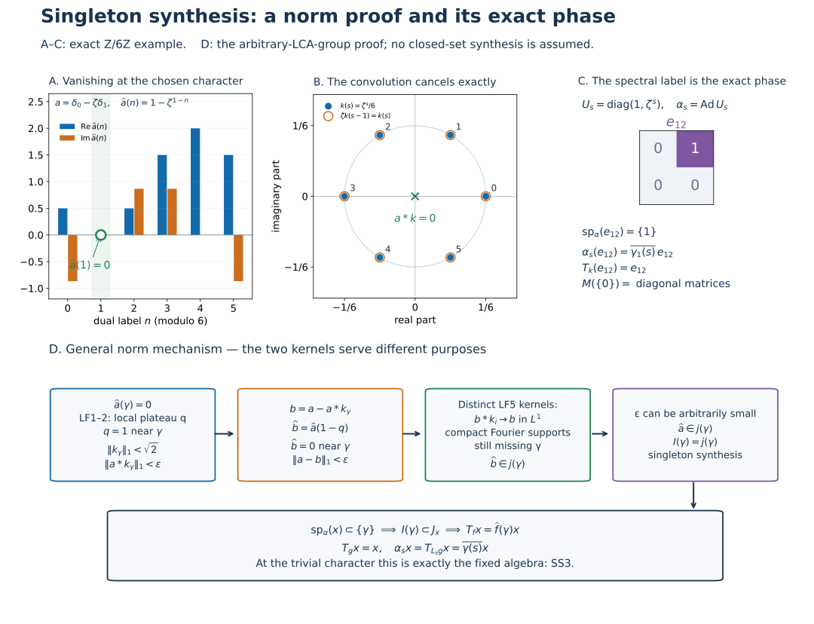

# Singleton synthesis and exact eigenoperators on an arbitrary LCA group

Let \(G\) be an arbitrary locally compact Hausdorff abelian group, \(\Gamma=\widehat G\), with the Haar and finite-exponent conventions of [LF0](OA-FLOW-LF.md#lf-0). No countability, separability or sigma compactness of either whole group is assumed. Use the negative transform

\[
 \widehat a(\eta)=\int_G a(s)\overline{\eta(s)}\,dm(s),
 \qquad A(\Gamma)=\mathcal F(L^1(G)),\qquad
 \|\widehat a\|_A=\|a\|_1.
 \tag{SS1}
\]
The complete earlier proofs are [LF1–2](OA-FLOW-LF.md#lf-1), [LF5–7](OA-FLOW-LF.md#lf-5) and [GL0–3 and GL7](OA-FLOW-GL.md#gl-0). GL uses the actual earlier [AT5 normal integrated maps](OA-FLOW-AT.md#oa-flow.at.5). The proof here closes the singleton converse separately; GL's original scope is unchanged.

## SS0. The two point ideals and modulation on their whole domains

For \(\gamma\in\Gamma\), define

\[
 I(\gamma)=\{u\in A(\Gamma):u(\gamma)=0\},\qquad
 j(\gamma)=\overline{\{u\in A(\Gamma):
       \operatorname{supp}u\text{ is compact and misses }\gamma\}}^{\,\|\cdot\|_A}.
 \tag{SS2}
\]
Both are closed ideals by LF6. In particular evaluation is bounded, so \(j(\gamma)\subset I(\gamma)\).

Multiplication \(M_\theta a(s)=\theta(s)a(s)\) is an onto isometry of \(L^1(G)\), with inverse \(M_{-\theta}\), since characters have modulus one. Its transform and convolution identities are

\[
 \widehat{M_\theta a}(\eta)=\widehat a(\eta-\theta),\qquad
 M_\theta(a*b)=(M_\theta a)*(M_\theta b).
 \tag{SS3}
\]
The first follows directly from the scalar integral. For the second use
\(\theta(s)=\theta(t)\theta(s-t)\) in the convolution integral. The entire \(L^1\) domain is licensed by L24's convolution bound and qualified product integration; no compact-support reduction is left unstated.

Thus \(u(\eta)\mapsto u(\eta-\theta)\) is an isometric algebra automorphism of \(A(\Gamma)\). Translation by \(\theta\) on \(\Gamma\) is a homeomorphism; it preserves compactness and translates closed supports. Consequently this map sends \(I(0)\) onto \(I(\theta)\) and \(j(0)\) onto \(j(\theta)\).

## SS1. Singleton ideal synthesis

**Theorem.** At every \(\gamma\in\Gamma\),

\[
 j(\gamma)=I(\gamma).
 \tag{SS4}
\]

**Proof at zero.** Take \(a\in L^1(G)\) with \(\widehat a(0)=0\). LF1–2 gives, for every \(\epsilon>0\) and prescribed identity neighbourhood \(N\subset\Gamma\), a kernel \(k\in L^1(G)\) with

\[
 q=\widehat k=1\text{ on an open identity neighbourhood }U,\quad
 \operatorname{supp}q\text{ compact in }N,\quad
 \|k\|_1<\sqrt2,\quad
 \|a*k\|_1<\epsilon.
 \tag{SS5}
\]
The last inequality is LF2 with the scalar \(c=\widehat a(0)=0\). It is a norm estimate from compact-open character control and a finite Radon tail, not a pointwise convergence argument or an application of dominated convergence to arbitrary nets.

Put \(b=a-a*k\). Then

\[
 \widehat b=\widehat a(1-q)=0\text{ on }U,\qquad
 \|a-b\|_1<\epsilon.
 \tag{SS6}
\]
This transform need not have compact support. To supply that part of \(j(0)\)'s definition, take the compact-frequency approximate identity \(k_i\) of LF5:

\[
 \widehat{b*k_i}=\widehat b\,\widehat k_i,\quad
 \operatorname{supp}\widehat{b*k_i}
 \subset\operatorname{supp}\widehat b
       \cap\operatorname{supp}\widehat k_i,\quad
 \|b*k_i-b\|_1\longrightarrow0.
 \tag{SS7}
\]
The right-hand support is compact and misses zero, because \(\widehat b\) vanishes on the open set \(U\). Therefore each displayed transform belongs to the defining set for \(j(0)\), and \(\widehat b\in j(0)\). Letting \(\epsilon\downarrow0\) in (SS6), or choosing \(\epsilon<1/n\) for each positive integer \(n\), gives \(\widehat a\in j(0)\) by closedness. The choice of this scalar sequence approximates one \(L^1\) vector; it makes no countability assumption on the topology of \(G\).

SS0 transports this equality to every \(\gamma\). More explicitly, if \(\widehat a(\gamma)=0\), set \(a'=M_{-\gamma}a\); then \(\widehat a'(0)=0\). Modulate its kernel and approximation back:

\[
 k_\gamma=M_\gamma k,\qquad
 b_\gamma=a-a*k_\gamma=M_\gamma(a'-a'*k),\qquad
 \|a-b_\gamma\|_1=\|a'*k\|_1<\epsilon.
 \tag{SS8}
\]
Its Fourier plateau is \(q(\eta-\gamma)\), so \(\widehat b_\gamma\) vanishes on \(\gamma+U\). Norms and compact-support approximation are preserved. This proves the reverse inclusion in (SS4) at every point. \(\square\)

The proof uses LF1's possibly signed plateau kernel \(k\), with its uniform norm bound, and LF5's separate positive compact-frequency approximate identity \(k_i\). These are two different constructions. No positivity of \(k\) and no approximate-identity property for the shrinking-frequency kernels is asserted.

## SS2. Ideals whose hull is a singleton

The hull of \(I(\gamma)\) is exactly \(\{\gamma\}\). Evaluation shows that \(\gamma\) belongs to it. If \(\eta\ne\gamma\), LF1 gives a compact plateau equal to one at \(\eta\), supported inside the open complement of \(\{\gamma\}\). This plateau is in \(I(\gamma)\) and excludes \(\eta\) from its hull.

Consequently every closed ideal \(J\subset A(\Gamma)\) with \(h(J)=\{\gamma\}\) satisfies

\[
 I(\gamma)=j(\gamma)\subset J\subset I(\gamma),
 \qquad\text{hence }J=I(\gamma).
 \tag{SS9}
\]
The middle two inclusions are LF6. If instead \(h(J)=\varnothing\), LF6 gives \(J=A(\Gamma)\). These conclusions are point synthesis and the empty-hull theorem; they do not assert \(j(E)=I(E)\) for other closed sets.

## SS3. The complete spectral/eigenoperator converse

Let \(M\subset B(H)\) and \(\alpha\) have GL's arbitrary-Hilbert-space normal-action hypotheses. Use its normal integrated maps \(T_f\), hull spectrum \(\operatorname{sp}_\alpha(x)\), and spaces \(M(E)\). Then, including \(x=0\),

\[
 \operatorname{sp}_\alpha(x)\subset\{\gamma\}
 \quad\Longleftrightarrow\quad
 \alpha_s(x)=\overline{\gamma(s)}x\quad(s\in G).
 \tag{SS10}
\]
For \(x\ne0\) either condition gives the exact spectrum \(\{\gamma\}\); for \(x=0\) its spectrum is empty.

**Proof of the converse.** Suppose the spectrum is contained in \(\{\gamma\}\). Transport the closed convolution annihilator \(\{f:T_f x=0\}\) through Fourier transformation, and call the resulting closed ideal \(J_x\). Its hull is the given spectrum. LF6 gives \(j(h(J_x))\subset J_x\). Since \(h(J_x)\subset\{\gamma\}\), every compact support missing \(\gamma\) also misses that hull. Thus

\[
 I(\gamma)=j(\gamma)\subset j(h(J_x))\subset J_x.
 \tag{SS11}
\]
This handles the empty spectrum as well as the nonempty case; GL1 also independently gives \(x=0\) in the empty case.

Choose an LF1 plateau \(q=\widehat g\), equal to one on an open neighbourhood of \(\gamma\). GL3's plateau identity gives \(T_gx=x\). For each \(f\in L^1(G)\), the function
\(\widehat f-\widehat f(\gamma)q\) belongs to \(I(\gamma)\), so (SS11) gives

\[
 T_f x=\widehat f(\gamma)T_gx=\widehat f(\gamma)x.
 \tag{SS12}
\]
The calculation is valid on the full \(L^1\) domain and does not suppose that \(g\) has unit \(L^1\) norm.

Use GL0's covariance and the exact negative-transform translation sign:

\[
 \alpha_s(x)=\alpha_s(T_gx)=T_{L_sg}x
 =\widehat{L_sg}(\gamma)x
 =\overline{\gamma(s)}\,\widehat g(\gamma)x
 =\overline{\gamma(s)}x.
 \tag{SS13}
\]
This is a pointwise action identity for every \(s\), derived from the actual integrated maps, not a formal replacement of a Fourier symbol by an operator.

**Reverse implication.** If the right side of (SS10) is given, the defining scalar integral proves \(T_f x=\widehat f(\gamma)x\). For \(x\ne0\), its annihilator ideal is exactly the inverse Fourier image of \(I(\gamma)\), whose hull is \(\{\gamma\}\) by SS2. For \(x=0\), every \(f\) annihilates it and its hull is empty by LF1's point separation. This proves all cases. \(\square\)

Let \(0\in\Gamma\) denote the trivial character. Equation (SS10) now proves

\[
 M(\{0\})=M^\alpha
 =\{x:\alpha_s(x)=x\text{ for every }s\}.
 \tag{SS14}
\]
This space is ultraweakly closed by GL2 and is a unital star subalgebra by the pointwise action identity (with the zero-algebra convention). The fixed algebra conclusion has an actual singleton proof; it was not silently added to GL.

## SS4. A finite exact zero-error model

Take \(G=\mathbb Z/6\mathbb Z\), with counting Haar. Write \(\zeta=e^{2\pi i/6}\), \(\gamma_n(s)=\zeta^{ns}\). Each dual point has Haar mass \(1/6\), as the finite geometric sums give \(\sum_s\zeta^{(n-m)s}=6\,1_{\{n=m\}}\). For a nontrivial sixth root the sum is zero because multiplying it by one minus that root gives \(1-z^6=0\); for the trivial root it is six.

For synthesis at \(\gamma_1\), choose

\[
 a=\delta_0-\zeta\delta_1,\quad
 k_{\gamma_1}(s)=\gamma_1(s)/6,\quad
 q=\widehat{k_{\gamma_1}}=1_{\{1\}},\quad
 \widehat a(n)=1-\zeta^{\,1-n},\quad
 \|k_{\gamma_1}\|_1=1.
 \tag{SS15}
\]
Here \(\delta_s\) is a physical point mass in the counting-measure \(L^1\) algebra. In particular \(\widehat a(1)=0\), and the convolution is exactly zero:

\[
 (a*k_{\gamma_1})(s)
 =\frac{\zeta^s-\zeta\zeta^{s-1}}6=0.
 \tag{SS16}
\]
Thus \(b=a-a*k_{\gamma_1}=a\) already has Fourier support compact and missing \(\gamma_1\). This is an exact zero-error instance of (SS6)–(SS8). For a discrete finite dual the singleton is itself an open plateau; the general proof still uses arbitrary neighbourhoods and LF2's norm estimate.

On \(M_2(\mathbb C)\) let \(U_s=\operatorname{diag}(1,\zeta^s)\), \(\alpha_s=\operatorname{Ad}U_s\). Then

\[
 \alpha_s(e_{12})=\overline{\gamma_1(s)}e_{12},\quad
 T_{k_{\gamma_1}}(e_{12})=e_{12},\quad
 \operatorname{sp}_\alpha(e_{12})=\{1\},\quad
 M(\{0\})=\{\operatorname{diag}(z,w):z,w\in\mathbb C\}.
 \tag{SS17}
\]
The filter is the actual finite integrated sum, and the geometric sums prove its value. For the final equality, \(\alpha_1\) multiplies the two off-diagonal entries by \(\zeta^{-1}\) and \(\zeta\), neither one. Thus a fixed matrix has zero off-diagonal entries, while every diagonal matrix is fixed; apply (SS14). These are exact matrices and phases, rather than a finite-model premise for the arbitrary-group theorem.

Compare Arveson, [*On groups of automorphisms of operator algebras*](https://www.isibang.ac.in/~soumyashant/misc/collected-works-of-arveson/1970s/1974_On_groups_of_automorphisms_of_operator_algebras.pdf), J. Funct. Anal. 15 (1974), Definition 2.1 and remarks. This chapter supplies its own singleton ideal proof through the complete earlier LF norm estimates. All original proof, illustration, caption and reproduction expression here is CC0.

## The norm mechanism behind singleton synthesis

Panels A–C are the exact [SS4 example](OA-FLOW-SS.md#ss-4) for \(G=\mathbb Z/6\mathbb Z\) with counting Haar, dual mass \(1/6\), \(\zeta=e^{2\pi i/6}\), and negative forward Fourier transform. The target character is \(\gamma_1(s)=\zeta^s\). The physical point-mass function \(a=\delta_0-\zeta\delta_1\) has transform \(\widehat a(n)=1-\zeta^{1-n}\), whose values in the order \(n=0,\ldots,5\) are
\[
 \left(\frac{1-i\sqrt3}{2},0,\frac{1+i\sqrt3}{2},
       \frac{3+i\sqrt3}{2},2,\frac{3-i\sqrt3}{2}\right).
\]
Panel A plots their real and imaginary parts, with the chosen zero at label one marked. These are exact values; bar heights are numerical renderings of the displayed numbers.

The kernel \(k(s)=\zeta^s/6\) has \(\|k\|_1=1\) and \(\widehat k=1_{\{1\}}\), by the six-term geometric sums proved in SS4. In panel B the filled dots are \(k(s)\) in the complex plane, labelled by \(s\); each lies on the circle of radius \(1/6\). The orange rings are the values \(\zeta k(s-1)\). They coincide exactly with the filled dots because
\[
 \zeta k(s-1)=\zeta\zeta^{s-1}/6=\zeta^s/6=k(s).
\]
Consequently \(a*k=k-\zeta L_1k=0\), represented by the central cross. Thus \(b=a-a*k=a\) has Fourier support missing the target and the approximation error is exactly zero. A singleton is an open neighbourhood in this finite dual; the finite model is a special zero-error instance of the general norm proof.

Panel C displays the actual \(2\times2\) matrix \(e_{12}\). Under \(U_s=\operatorname{diag}(1,\zeta^s)\), its conjugation phase is \(\zeta^{-s}=\overline{\gamma_1(s)}\). The negative-transform label is therefore one, and the actual finite filter sum gives
\[
 T_k(e_{12})=\sum_{s=0}^5
       \frac{\zeta^s}{6}\,\zeta^{-s}e_{12}=e_{12}.
\]
The fixed matrices are exactly diagonal: the two off-diagonal entries are multiplied by \(\zeta^{-1}\) and \(\zeta\) under the generator, so fixedness forces them to vanish. Every diagonal matrix is fixed. SS3's proved singleton converse therefore identifies this algebra with \(M(\{0\})\).

Panel D is the arbitrary-LCA-group argument in [SS1–SS3](OA-FLOW-SS.md#ss-1), not a reduction to the finite model. For \(\widehat a(\gamma)=0\), LF1–2 gives a possibly signed plateau kernel \(k_\gamma\), with \(\|k_\gamma\|_1<\sqrt2\), a transform equal to one on an open neighbourhood of \(\gamma\), and \(\|a*k_\gamma\|_1<\epsilon\). The estimate is a true \(L^1\) norm estimate, obtained by compact-open character control and a finite Radon tail.

Set \(b=a-a*k_\gamma\). Its transform vanishes near the target, and \(\|a-b\|_1<\epsilon\). The distinct positive compact-frequency approximate identity of LF5 produces \(b*k_i\to b\) in \(L^1\), preserving Fourier support and hence the open gap at \(\gamma\). Their compact Fourier supports miss the target, so their transforms are in the defining set for \(j(\gamma)\). Two norm-closure steps give \(\widehat b\in j(\gamma)\) and then \(\widehat a\in j(\gamma)\). The reverse inclusion follows from bounded evaluation, proving \(I(\gamma)=j(\gamma)\). No positivity or approximate-identity property is attributed to the shrinking-frequency plateau kernels.

The final box shows the passage to the exact eigenphase. If \(\operatorname{sp}_\alpha(x)\subset\{\gamma\}\), LF6 and the singleton equality put \(I(\gamma)\) inside the transported annihilator \(J_x\). A plateau \(\widehat g=1\) near \(\gamma\) gives \(T_gx=x\), and subtraction of \(\widehat f(\gamma)g\) gives \(T_fx=\widehat f(\gamma)x\) for all \(f\in L^1(G)\). Covariance and the negative translation sign then give \(\alpha_sx=T_{L_sg}x=\overline{\gamma(s)}x\) for every \(s\). At the trivial character the phase is one, yielding exactly the fixed algebra. The proof includes \(x=0\), arbitrary Hilbert spaces and neighbourhood nets. Synthesis of other closed sets is not inferred.

Compare Arveson, [*On groups of automorphisms of operator algebras*](https://www.isibang.ac.in/~soumyashant/misc/collected-works-of-arveson/1970s/1974_On_groups_of_automorphisms_of_operator_algebras.pdf), J. Funct. Anal. 15 (1974), Definition 2.1 and remarks; the entire local argument is (SS1)–(SS17), at the earlier LF and GL proofs linked above. The figure, caption, exact data and reproduction code are original CC0 material.
