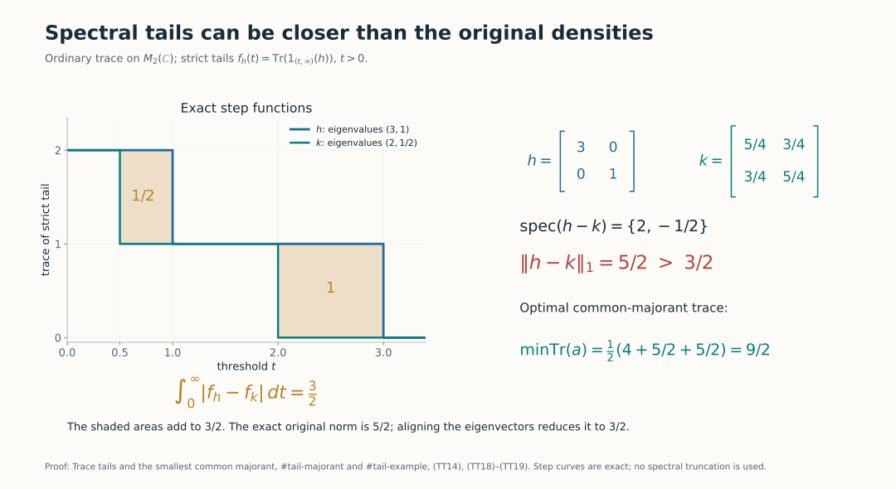
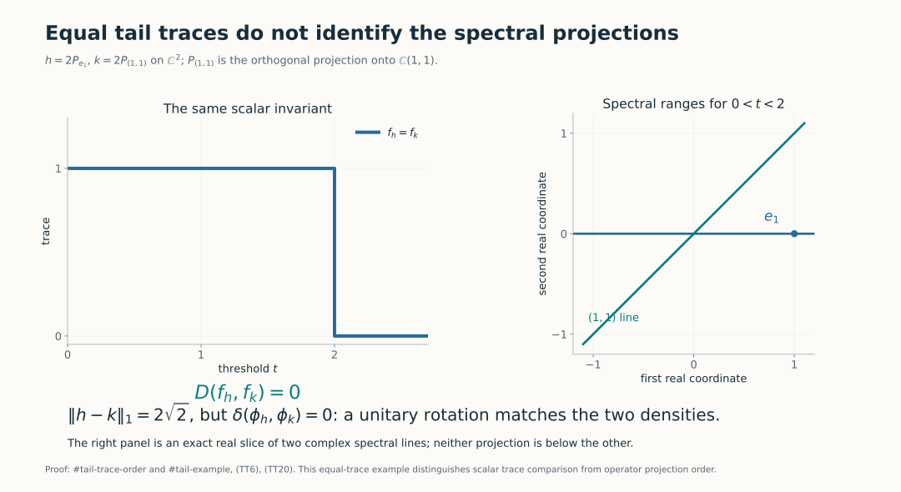

# Trace tails and the smallest common majorant

*Self-checked by the writing AI.*

The trace of a spectral projection can be ordered even when the projections themselves cannot. We prove that distinction directly on complete quadratic-form domains, then use a positive common majorant to compare two spectral distributions. The argument works in every semifinite von Neumann algebra, with no countability assumption.

## 1. Densities, norms and strict tails

Let \(\tau\) be a faithful normal semifinite trace on a von Neumann algebra \(M\). For a positive self-adjoint affiliated operator \(h\), the notation \(\tau(h)\) means the increasing spectral integral. A positive integrable density is such an \(h\) with \(\tau(h)<\infty\). By [TD4–5](OA-FLOW-TD.md#oa-flow.td.4), these densities correspond bijectively and order-preservingly to \(M_*^+\):
\[
 \phi_h(x)=\widehat\tau(x^{1/2}hx^{1/2}),\qquad x\in M_+.
 \tag{TT1}
\]
The full pairing on bounded \(x\) and the identity \(\|\phi_h\|=\tau(h)\) are proved in [TD8](OA-FLOW-TD.md#oa-flow.td.8). In this lesson
\[
 \|h-k\|_1:=\|\phi_h-\phi_k\|,
 \qquad \|h+k\|_1=\tau(h)+\tau(k).
 \tag{TT2}
\]
The sum in the second formula is the complete positive form sum supplied by [TD7](OA-FLOW-TD.md#oa-flow.td.7). Its finite total trace ensures that it is an ordinary densely defined density. No algebraic difference of unbounded operators is needed to define (TT2).

Fix the strict-tail convention
\[
 f_h(t)=\tau(1_{(t,\infty)}(h)),\qquad t>0.
 \tag{TT3}
\]
It is decreasing and right-continuous. Indeed, when \(t_n\downarrow t>0\), the projections \(1_{(t_n,\infty)}(h)\) increase to \(1_{(t,\infty)}(h)\), and normality applies. For integrable \(h\),
\[
 t f_h(t)\leq\tau(h),\qquad
 \int_0^\infty f_h(t)\,dt=\tau(h).
 \tag{TT4}
\]
The first assertion follows from \(h\geq t1_{(t,\infty)}(h)\). For the second, approximate the identity function on \([0,\infty)\) from below by dyadic sums of upper-ray indicators and use normality followed by scalar monotone convergence. This is the layer-cake identity, valid also for a nonintegrable positive density with infinite right side. Thus every subtraction of two tails below occurs at \(t>0\), where both terms are finite.

## 2. Form order implies trace order of spectral cuts

For positive affiliated \(h,k\), write \(h\leq k\) for the complete form comparison
\[
 D(k^{1/2})\subseteq D(h^{1/2}),\qquad
 \|h^{1/2}\xi\|^2\leq\|k^{1/2}\xi\|^2
 \quad(\xi\in D(k^{1/2})).
 \tag{TT5}
\]
The spectral domains and their transport are [SF, SB4 and SB6](OA-FLOW-SF.md#oa-flow.sf.sb4).

**Trace comparison.** If (TT5) holds, then
\[
 \begin{split}
 \tau(1_{(t,\infty)}(h))&\leq\tau(1_{(t,\infty)}(k)),\quad t\geq0,\\
 \tau(1_{[t,\infty)}(h))&\leq\tau(1_{[t,\infty)}(k)),\quad t\geq0.
 \end{split}
 \tag{TT6}
\]
Infinite trace values are allowed in these inequalities.

First use the strict rays and put \(p=1_{(t,\infty)}(h)\), \(q=1_{(t,\infty)}(k)\). If \(0\ne\xi\in pH\cap(1-q)H\), the bounded \(k\)-spectral support \([0,t]\) puts \(\xi\) in \(D(k^{1/2})\), and (TT5) puts it in \(D(h^{1/2})\). Spectral integration gives
\[
 \|h^{1/2}\xi\|^2>t\|\xi\|^2
 \geq\|k^{1/2}\xi\|^2,
\]
a contradiction. Thus \(p\wedge(1-q)=0\). The bounded operator \(qp\) has right support \(p\): its kernel on \(pH\) is precisely that intersection. Its polar partial isometry therefore has initial projection \(p\) and final projection at most \(q\). The trace identity \(\tau(v^*v)=\tau(vv^*)\) proves the first inequality. This is the actual support/polar mechanism of [Projections and types, Proposition 4.3](../../foundations-of-von-neumann-algebras/projections-and-types-of-von-neumann-algebras.html#oa-fnd-ty-07).

For the closed rays at \(t>0\), put \(p=1_{[t,\infty)}(h)\), \(q=1_{[t,\infty)}(k)\). A nonzero vector in \(pH\cap(1-q)H\) belongs to both form domains and instead satisfies
\[
 \|h^{1/2}\xi\|^2\geq t\|\xi\|^2
 >\|k^{1/2}\xi\|^2.
\]
The same polar argument applies. At \(t=0\) both closed-ray projections are \(1\). This proof has not assumed that a high spectral vector of an unbounded operator belongs to its domain: membership was obtained from the low \(k\)-band and the form comparison.

**Increasing Borel functions.** For every nonnegative increasing Borel function \(g\) on \([0,\infty)\),
\[
 \tau(g(h))\leq\tau(g(k)).
 \tag{TT7}
\]
The function may take the value infinity, in which case the complete extended positive cone is used. To check every endpoint, for each \(u\geq0\) the set \(\{s:g(s)>u\}\) is an upper set: empty, all of \([0,\infty)\), \((a,\infty)\), or \([a,\infty)\). Both ray conventions have just been proved. Apply (TT6) to these sets, then use increasing finite dyadic sums of their indicators to approximate \(g\). Normality gives (TT7). The all-set case includes a possible positive constant \(g(0)\), even when \(\tau(1)=\infty\).

This is trace monotonicity of \(g\), not operator monotonicity. In particular (TT6) does not assert an order between the two spectral projections in \(M\).

## 3. The positive and negative parts are normal

We need a decomposition in the predual, rather than a formal absolute value of an unbounded difference. The complete [polar-decomposition theorem and Corollary 2.8](../../foundations-of-von-neumann-algebras/polar-decomposition-of-functionals-and-weak-compactness-in-preduals.html#oa-fnd-pd-02) apply to every normal hermitian functional \(\rho\) on an arbitrary von Neumann algebra. Here is the relevant construction and its normality check.

That theorem constructs a positive normal functional \(\omega=|\rho|\) and a partial isometry \(v\in M\) such that
\[
 \rho(x)=\omega(xv),\qquad v^*v=s(\omega),\qquad
 \omega(1)=\|\rho\|.
 \tag{TT8}
\]
Its proof uses a norm-attaining element of the ultraweakly compact unit ball, bounded operator polar decomposition, and uniqueness of the resulting positive normal functional. It does not assume an \(L^1\) density calculus. For hermitian \(\rho\), uniqueness applied to the adjoint yields \(v=v^*\) and \(\omega(vx)=\omega(xv)\). If \(s=s(\omega)=v^2\), set
\[
 e_+=(s+v)/2,\qquad e_-=(s-v)/2,\qquad
 \rho_\pm(x)=\omega(e_\pm x e_\pm).
 \tag{TT9}
\]
The two \(e_\pm\) are orthogonal projections. Compression by a fixed bounded projection is normal, so \(\rho_\pm\) are positive **normal** functionals. Since \(e_\pm\) commute with \(\omega\) in the functional sense, \(\rho_\pm(x)=\omega(xe_\pm)\). Therefore
\[
 \rho=\rho_+-\rho_-,\qquad
 \rho_++\rho_-=\omega,\qquad
 \|\rho\|=\rho_+(1)+\rho_-(1).
 \tag{TT10}
\]
Also \(\rho(1)=\rho_+(1)-\rho_-(1)\). These are all the Jordan identities required below, including the zero functional. Normality is supplied before applying the positive-density correspondence.

## 4. An optimal common majorant exists

Let \(h,k\) be positive integrable densities and take (TT10) for \(\rho=\phi_h-\phi_k\). The normal positive functional
\[
 \Theta=\phi_h+\rho_-=\phi_k+\rho_+
 \tag{TT11}
\]
has a unique integrable positive density \(a_0\), by TD4. Order reflection in TD5 gives \(a_0\geq h,k\) as complete forms. Its trace is
\[
 \begin{split}
 2\tau(a_0)
 &=\phi_h(1)+\phi_k(1)+\rho_+(1)+\rho_-(1)\\
 &=\tau(h)+\tau(k)+\|h-k\|_1.
 \end{split}
 \tag{TT12}
\]
For any other positive integrable common majorant \(a\), both \(\phi_a-\phi_h\) and \(\phi_a-\phi_k\) are positive. Their norms equal their values at \(1\), and the triangle inequality gives
\[
 \|h-k\|_1
 \leq\|\phi_a-\phi_h\|+\|\phi_a-\phi_k\|
 =2\tau(a)-\tau(h)-\tau(k).
 \tag{TT13}
\]
Consequently
\[
 \boxed{\ \|h-k\|_1+\|h+k\|_1
 =2\min\{\tau(a):a\geq h,\ a\geq k,\ a\geq0,\ \tau(a)<\infty\}.\ }
 \tag{TT14}
\]
The displayed minimum is attained by \(a_0\); no lattice supremum in the operator order is asserted. If \(j\) is TD4's density of \(|\phi_h-\phi_k|\), then \(2a_0=h+k+j\) as complete positive forms. This supplies a rigorous meaning for the familiar common-majorant formula without using an undefined product or difference domain.

## 5. Spectral tails contract the predual distance

Applying (TT6) to \(h,k\leq a_0\) shows, at every \(t>0\),
\[
 |f_h(t)-f_k(t)|
 \leq 2 f_{a_0}(t)-f_h(t)-f_k(t).
 \tag{TT15}
\]
Every term here is finite by (TT4). Integrating and using (TT12) gives the full inequality
\[
 \boxed{\ \int_0^\infty|f_h(t)-f_k(t)|\,dt
 \leq\|h-k\|_1.\ }
 \tag{TT16}
\]
All integrals on the right side of (TT15) are finite, so this step involves no subtraction of infinite trace values. The same conclusion holds if every strict tail is replaced by a closed tail. To see this without ignoring atoms, the positive atoms of the finite measure \(B\mapsto\tau(h1_B(h))\) form a countable set. For \(t>0\), a nonzero difference between the two tail conventions implies a nonzero atom there. Hence the tails differ only at countably many positive \(t\), which does not change the Lebesgue integral.

For bounded commuting step densities \(a=\sum_j\alpha_jp_j\), \(b=\sum_j\beta_jp_j\), where the \(p_j\) are mutually orthogonal projections of finite trace,
\[
 \|a-b\|_1=\sum_j|\alpha_j-\beta_j|\tau(p_j).
 \tag{TT17}
\]
The triangle inequality gives the upper bound. For the lower bound test \(\phi_a-\phi_b\) on the contraction \(\sum_j\operatorname{sgn}(\alpha_j-\beta_j)p_j\). If the coefficient lists have the same decreasing order, their strict upper sets are initial intervals in trace mass. Their symmetric-difference areas, computed either horizontally or vertically, give equality in (TT16). The next lesson constructs this ordered matching for orbit infima.

## 6. Two exact matrix diagnostics

**A strict contraction.** Use the ordinary matrix trace and
\[
 h=\begin{pmatrix}3&0\\0&1\end{pmatrix},\qquad
 k=\frac14\begin{pmatrix}5&3\\3&5\end{pmatrix}.
 \tag{TT18}
\]
Their eigenvalues are \((3,1)\) and \((2,1/2)\). The tails differ by one on \((1/2,1)\) and on \((2,3)\), and agree elsewhere, up to endpoints. Thus their tail distance is \(3/2\). But \(h-k\) has eigenvalues \(2,-1/2\), giving \(\|h-k\|_1=5/2\). The minimizing common majorant is
\[
 a_0=\frac1{20}\begin{pmatrix}61&3\\3&29\end{pmatrix},\qquad
 \tau(a_0)=\frac92.
 \tag{TT19}
\]
Indeed \(a_0-h=\frac1{20}\begin{pmatrix}1&3\\3&9\end{pmatrix}\) and \(a_0-k=\frac1{20}\begin{pmatrix}36&-12\\-12&4\end{pmatrix}\) are positive rank-one matrices. Equation (TT14) gives \(2\tau(a_0)=4+5/2+5/2=9\).

*The two shaded regions have areas \(1/2\) and \(1\), while the original density difference has norm \(5/2\). The common-majorant minimum is \(9/2\). These exact matrix calculations are (TT18)–(TT19); the general proof is (TT14)–(TT16).*

**Equal traces do not order the projections.** Take instead
\[
 h=\begin{pmatrix}2&0\\0&0\end{pmatrix},\qquad
 k=\begin{pmatrix}1&1\\1&1\end{pmatrix}.
 \tag{TT20}
\]
The tails coincide: both equal \(1\) for \(0<t<2\) and \(0\) for \(t\geq2\). At \(0<t<2\), however, the spectral ranges are the distinct lines \(\mathbb Ce_1\) and \(\mathbb C(1,1)\); neither projection is below the other. Here the original predual distance is \(2\sqrt2\), whereas the unitary-orbit distance is zero because a rotation identifies the two densities.

*The line drawing is the real slice of the two complex spectral ranges in (TT20). Equality of their traces gives no order between the projections themselves.*

## Further reading

M. Takesaki, *Theory of Operator Algebras II*, Chapter XII, Section 5, Proposition 5.13 and Lemmas 5.14–5.15, printed pp.427–429, develops the trace-tail comparison and common-majorant identity. The proofs above retain the full form domains and obtain the majorant through the normal-functional Jordan decomposition. The complete programme providers for that decomposition and the positive-density correspondence are linked at their uses.
