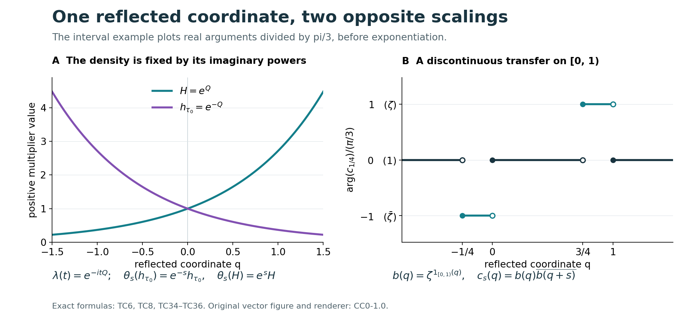

# Translation cocycles and the semifinite core

A semifinite factor has a particularly concrete center flow. In its tracial core chart the center is a copy of the real-line multiplication algebra. Fourier reflection fixes the direction of translation. Every strongly continuous circle-valued cocycle for that translation is then the quotient of one measurable transfer function and its translate. We prove this by choosing a joint Borel representative and one valid Fubini slice. The transfer function may be discontinuous.

*Original exposition, examples, figures, data and reproducible drawing code in this lesson are dedicated to CC0-1.0. Source publications and font components retain their own terms.*

## Scope and coordinates

The trace-chart statement holds for **every nonzero semifinite factor** with a faithful normal semifinite trace, including finite factors and factors without separable predual. All continuity of unitary cocycles below is strong operator continuity. No norm-continuity hypothesis is imposed. The coordinate function used in the final functional calculus is \(e^Q\); the canonical core density after reflection is \(e^{-Q}\).

The regular core chart is proved directly on the full Hilbert tensor product. The cocycle argument then takes place in the scalar multiplication algebra, where its joint representative and generic slice are constructed explicitly.

## 1. The tracial core, with its two coordinate signs

Let \(M\ne0\) be a semifinite factor, let \(\tau_0\) be a faithful normal semifinite trace, and represent \(M\) faithfully and normally on an arbitrary Hilbert space \(\mathcal H\). The [whole-cone trace criterion](OA-FLOW-KT.md#oa-flow.kt.5) gives \(\sigma^{\tau_0}=\mathrm{id}\). The regular core therefore has generators
\[
 \pi(a)=a\otimes1,\qquad
 \lambda(t)=1\otimes L_t,\qquad
 (L_t\xi)(r)=\xi(r-t),\qquad
 \theta_s(\lambda(t))=e^{-ist}\lambda(t).
 \tag{TC1}
\]
The original group variable \(t\) carries measure \(dt\), and its dual variable \(s\) carries measure \(ds/(2\pi)\). If the original group variable is named \(s\) instead, this same Haar pair is written \(ds,dt/(2\pi)\); the factors do not change when letters change.

Use the positive Fourier transform with its target measure made explicit:
\[
 \mathcal F:L^2(\mathbb R,dr)\longrightarrow
                  L^2(\mathbb R,dp/(2\pi)),\qquad
 (\mathcal F\xi)(p)=\int_{\mathbb R}e^{irp}\xi(r)\,dr.
 \tag{TC2}
\]
This is \(\sqrt{2\pi}\) times [FF's positive unitary](OA-FLOW-FF.md#oa-flow.ff.3), viewed in the rescaled target Hilbert space. The integral holds on \(L^1\cap L^2\); the formula denotes its onto unitary extension on all of \(L^2\). Substitution gives
\[
 \mathcal F L_t\mathcal F^*=M_{e^{itp}}.
 \tag{TC3}
\]
Tensoring with \(1_{\mathcal H}\) is valid without a countable basis: define the unitary on finite simple tensors, preserve their norm by the scalar identity, and extend using their Hilbert-space density.

The characters \(e^{itp}\) generate the entire scalar multiplication algebra. Indeed an \(L^1\) function annihilating all of them is zero by Fourier uniqueness. Separation in the dual pair \(L^\infty,L^1\) makes their linear span ultraweakly dense. Thus the regular core, rather than merely a covariant image, becomes
\[
 C_{\tau_0}(M)=M\overline\otimes\operatorname{VN}(\mathbb R)
       \ \cong\ M\overline\otimes L^\infty(\mathbb R,dp/(2\pi)).
 \tag{TC4}
\]
Conjugation by \(1_{\mathcal H}\otimes\mathcal F\) and its inverse is normal. This is exactly the arbitrary-Hilbert-space construction of [CORE9](OA-FLOW-CORE.md#core-9), using the actual [character-density proof](OA-FLOW-ND.md#nd-weyl-proof).

Here is the factor-center step, including the needed slices. Put \(A=L^\infty(\mathbb R,dp/(2\pi))\). For \(X\in M\overline\otimes A\) and \(g\in L^1_+\), the map
\(\xi\mapsto\xi\otimes\sqrt g\) compresses \(X\) to
\(R_g(X)\in M\). It belongs to \(M\) because it commutes with \(M'\). Compression is normal. Linear extension defines \(R_g\) for every complex \(g\in L^1\). These are the normal slices proved in CORE9; they obey
\(R_g((a\otimes1)X)=aR_g(X)\) and the corresponding right identity.

If \(X\) is central, every \(R_g(X)\) is central in \(M\), hence is a scalar \(\kappa_g1\). Choose a normal state \(\rho\) on \(M\), for example a normalized nonzero vector state in the faithful representation; it need not be faithful. The other normal slice
\(f=(\rho\otimes\mathrm{id})(X)\) lies in \(A\), by CORE9's compression construction, and \(\int gf\,dp/(2\pi)=\kappa_g\). Consequently all product normal functionals vanish on \(X-1\otimes f\). They separate the tensor product: first test elementary Hilbert tensor vectors and their polarizations, then their dense finite spans. This proves
\[
 Z(C_{\tau_0}(M))=1\otimes A.
 \tag{TC5}
\]
The reverse inclusion follows because \(A\) is abelian. No measurable field of \(M\)-operators, faithful state, or countable decomposition of \(M\) has been used.

In the immediate Fourier coordinate the dual action is \(f(p)\mapsto f(p-s)\), since this gives \(e^{itp}\mapsto e^{-ist}e^{itp}\). Normality and character generation extend the identity to the whole algebra. Now reflect the coordinate, without changing the time parameter:
\[
 q=-p,\qquad (\mathcal R\eta)(q)=\eta(-q),\qquad
 \theta_s f(q)=f(q+s),\qquad
 \lambda(t)=e^{-itQ}.
 \tag{TC6}
\]
Here \(Q\) is multiplication by \(q\), and \(\mathcal R\) is a unitary because reflection preserves Lebesgue measure. Thus
\[
 (Z(C_{\tau_0}(M)),\theta)
    \cong\bigl(L^\infty(\mathbb R,dq/(2\pi)),\,f(q)\mapsto f(q+s)\bigr)
 \tag{TC7}
\]
normally and equivariantly.

Nothing in (TC1)–(TC7) uses infiniteness of the coefficient unit. For example, when \(M=M_n(\mathbb C)\), the whole core is \(M_n\overline\otimes A\) and its center is still \(A\). The same proof applies to an arbitrary finite factor. In another faithful weight chart, the [normal equivariant chart isomorphism](OA-FLOW-CORE.md#core-5) carries centers onto centers, so (TC7) describes the intrinsic center flow as well.

For completeness the center is unchanged by stabilization: \(M\overline\otimes B(\ell^2)\) is a factor. To see this directly, a central element commuting with \(1\otimes B(\ell^2)\) has scalar matrix form \(a\otimes1\), by matrix units; commuting with \(M\otimes1\) then makes \(a\) scalar. Repeating (TC4)–(TC7) gives the same center \(A\), with the normal equivariant map \(1_M\otimes f\mapsto1_{M\overline\otimes B(\ell^2)}\otimes f\). This is a comparison of core centers. It does not identify an algebraic carrier with that center.

## 2. The core density and the positive coordinate are different operators

The canonical density is characterized by \(h_{\tau_0}^{it}=\lambda(t)\), not by a desired sign of its logarithm. Therefore (TC6) and [CORE1](OA-FLOW-CORE.md#core-1) give
\[
 h_{\tau_0}=e^{-Q},\qquad
 H=e^Q=h_{\tau_0}^{-1},\qquad
 \theta_s(h_{\tau_0})=e^{-s}h_{\tau_0},\qquad
 \theta_s(H)=e^sH.
 \tag{TC8}
\]
The notation \(H\) will mean only the positive coordinate. Its role here is to parameterize bounded Borel functions of the center. In a different dominant-weight model an operator with the same scalar expression may have a different density role.

One can also see the distinction in the whole-cone weights. For \(X\ge0\) in the reflected tensor chart, let \(x_\omega(q)=(\omega\otimes\mathrm{id})(X)(q)\), where \(\omega\in M_*^+\). Reflecting the actual [CORE9 formulas](OA-FLOW-CORE.md#core-9) gives
\[
 \begin{aligned}
 \widetilde{\tau_0}(X)
   &=\sup_{0\le\omega\le\tau_0}
           \int_{\mathbb R}x_\omega(q)\,\frac{dq}{2\pi},\\
 \tau_{\mathrm{core}}(X)
   &=\sup_{0\le\omega\le\tau_0}
           \int_{\mathbb R}e^q x_\omega(q)\,\frac{dq}{2\pi}.
 \end{aligned}
 \tag{TC9}
\]
These are suprema over all bounded normal positive minorants, with no directedness assumption, and hold at infinite values as well. Multiplication by \(h_{\tau_0}=e^{-Q}\) recovers the dual weight from this core trace. It is \(e^q\) that appears in the measure for the core trace; this does not change the sign of the density \(h_{\tau_0}\).

The center itself has the independent faithful normal semifinite trace
\[
 \tau_A(f)=\int_{\mathbb R}e^q f(q)\,\frac{dq}{2\pi},
 \qquad \tau_A\theta_s=e^{-s}\tau_A.
 \tag{TC10}
\]
Normality and faithfulness follow from nonnegative integration; restricting \(f\) to \([-m,m]\) proves semifiniteness by increasing finite integrals. This should not be confused with the restriction of \(\tau_{\mathrm{core}}\) to the center. If \(\tau_0(1)=\infty\), that restriction is infinite on every nonzero central positive element, by (TC9), and is not semifinite. The independent trace (TC10) is the one that allows the current [CST theorem](OA-FLOW-CST.md#cst-5) to be applied directly to \(A\).

We now give an independent constructive proof for this scalar translation algebra. It identifies a measurable transfer function, including its exact ambiguity, rather than using CST to obtain its existence.

## 3. A joint Borel representative from strong continuity

Write \(A=L^\infty(\mathbb R,dq)\), represented faithfully by multiplication on \(L^2(\mathbb R,dq)\); replacing \(dq\) by \(dq/(2\pi)\) changes no equivalence class or null set. Suppose
\[
 c_s\in\mathcal U(A),\qquad
 c_{s+t}=c_s\theta_s(c_t),\qquad
 \theta_s f(q)=f(q+s),
 \tag{TC11}
\]
and \(s\mapsto M_{c_s}\) is strongly continuous. At \(s=t=0\) the unitary cocycle identity forces \(c_0=1\). The strong topology on this bounded unitary family is intrinsic under faithful normal representations, by the actual [ST2 topology comparison](OA-FLOW-ST12.md#oa-flow.st.2).

**Joint-representative lemma.** There is a Borel function \(C:\mathbb R^2\to\mathbb T\) and a conull set \(E\subset\mathbb R\) such that \(C(s,\cdot)\) represents \(c_s\) for every \(s\in E\).

**Proof.** Fix the strictly positive probability density
\(w(q)=e^{-|q|}/2\), and let \(d(s)\) be the class of \(c_s\) in \(L^2(w\,dq)\). Testing strong continuity on the single vector \(\sqrt w\) gives
\[
 \|d(s)-d(t)\|_{L^2(w\,dq)}
      =\|(M_{c_s}-M_{c_t})\sqrt w\|_2\longrightarrow0
      \quad(s\to t).
 \tag{TC12}
\]
For each dyadic rational \(r\), choose a Borel, everywhere circle-valued representative \(u_r\) of \(c_r\). Such a representative exists for each Lebesgue class: approximate a bounded representative by measurable simple functions, replace each of the countably many level sets by a Borel set modulo a null set, take the Borel limit where it exists, and assign value one wherever it is missing or not unimodular.

Uniform continuity of \(d\) on each compact interval permits a strictly increasing sequence of integers \(n_j\) such that
\[
 \sup_{|s|\le j}
 \|d(2^{-n_j}\lfloor2^{n_j}s\rfloor)-d(s)\|_{L^2(w\,dq)}
       \le 2^{-3j}.
 \tag{TC13}
\]
Use the compact interval \([-j-1,j+1]\) when selecting the mesh; its points include the left dyadic endpoints for \(|s|\le j\). Define
\[
 B_j(s,q)=u_{\,2^{-n_j}\lfloor2^{n_j}s\rfloor}(q).
 \tag{TC14}
\]
This is jointly Borel: its time dependence uses a countable partition into dyadic intervals, on each of which one fixed Borel function of \(q\) is used. For \(j\ge m\), the triangle inequality in \(L^2(w\,dq)\), followed by integration and Cauchy–Schwarz, gives
\[
 \int_{-m}^{m}\int_{\mathbb R}
       |B_{j+1}(s,q)-B_j(s,q)|w(q)\,dq\,ds
 \le 2m\bigl(2^{-3j}+2^{-3(j+1)}\bigr).
 \tag{TC15}
\]
The series of these bounds converges. [Scalar nonnegative interchange](OA-FLOW-FF.md#oa-flow.ff.1) therefore implies that the series of pointwise absolute differences is finite almost everywhere on each \([-m,m]\times\mathbb R\). Take the countable union in \(m\). The positive density \(w\) has the same null sets as Lebesgue measure, so \(B_j\) converges almost everywhere for ordinary product measure as well.

Define \(C\) as the limit on the Borel convergence set and as one elsewhere. It is Borel and circle-valued everywhere. Fubini gives a conull set of \(s\) for which \(B_j(s,q)\to C(s,q)\) for almost every \(q\). For such an \(s\), dominated convergence in the probability space \(w\,dq\) gives convergence in \(L^2(w\,dq)\). Equation (TC13), applied for all sufficiently large \(j\), identifies the same limit with \(d(s)\). Thus \(C(s,\cdot)\) is the desired representative. \(\square\)

The lemma asserts representative validity for almost every time. No simultaneous representative at every time, measurable-selection theorem, or pointwise evaluation of an \(L^\infty\) class has been assumed.

## 4. A generic slice produces the transfer function

For almost every pair \((s,t)\), all three numbers \(s,t,s+t\) belong to \(E\). For the last number, its exceptional set has product measure zero because for each fixed \(s\) the translate \(\mathbb R\setminus E-s\) is null, and scalar Fubini applies on bounded boxes. The other two exceptional sets are treated the same way.

For a remaining pair, the cocycle identity in \(A\), the representative property and translation invariance of null sets imply
\[
 C(s+t,q)=C(s,q)C(t,q+s)
              \quad\text{for almost every }q.
 \tag{TC16}
\]
Both sides are jointly Borel in \((s,t,q)\). Fubini therefore makes (TC16) valid outside a product-null subset of \(\mathbb R^3\). This is not an intersection of an uncountable family of conull sets.

Put
\[
 K(x,y)=C(y-x,x).
 \tag{TC17}
\]
The substitution \(q=x,\ s=y-x,\ t=z-y\) changes (TC16) into
\[
 K(x,z)=K(x,y)K(y,z)
              \quad\text{for almost every }(x,y,z).
 \tag{TC18}
\]
Its determinant has absolute value one. More directly, preservation of null sets follows by successively translating one variable and permuting variables, using scalar Fubini at each step. No general change-of-variables result for operator-valued functions is needed.

Choose a real \(a\) in the conull set of valid **first-coordinate slices** in (TC18). Then
\[
 K(a,z)=K(a,y)K(y,z)
        \quad\text{for almost every }(y,z).
\]
Define the Borel circle-valued function
\[
 b(y)=\overline{K(a,y)}.
 \tag{TC19}
\]
Dividing the sliced identity by the unimodular value \(K(a,y)\) yields
\[
 K(y,z)=b(y)\overline{b(z)}
          \quad\text{for almost every }(y,z).
 \tag{TC20}
\]
The change \(y=q,\ z=q+s\) preserves product-null sets for the same elementary reason. Hence
\[
 C(s,q)=b(q)\overline{b(q+s)}
             \quad\text{for almost every }(s,q).
 \tag{TC21}
\]
The selected \(a\) is generic for a jointly Borel kernel already constructed. A prescribed point such as \(a=0\) need not be valid. In particular (TC19) is not a definition by evaluating the original equivalence classes at that prescribed point.

Fubini and the representative lemma now give
\(c_s=b\theta_s(b^*)\) in \(A\) for almost every \(s\). To reach every time, let
\[
 (U_s\xi)(q)=\xi(q+s),\qquad
 M_{b\theta_s(b^*)}=M_bU_sM_{b^*}U_s^*.
 \tag{TC22}
\]
The [scalar translation theorem](OA-FLOW-FF.md#oa-flow.ff.2) makes \(U_s\) strongly continuous. Products of uniformly bounded strongly continuous operators are strongly continuous: for two factors, expand
\((A_sB_s-A_tB_t)\xi=A_s(B_s-B_t)\xi+(A_s-A_t)B_t\xi\); repeat for finitely many factors. Thus both sides of the almost-everywhere operator equality vary strongly continuously. A conull subset of \(\mathbb R\) is dense. At any fixed \(s_0\), take a sequence of valid times converging to \(s_0\) and apply both strong limits to every vector. Faithfulness of multiplication proves the all-times identity
\[
 \boxed{\ c_s=b\theta_s(b^*)\quad(s\in\mathbb R).\ }
 \tag{TC23}
\]

Conversely, for every \(b\in\mathcal U(A)\), (TC22) gives strong continuity and cancellation gives
\[
 [b\theta_s(b^*)]\theta_s([b\theta_t(b^*)])
       =b\theta_{s+t}(b^*).
 \tag{TC24}
\]
It is therefore a unitary cocycle. Since \(A\) is abelian, \(\partial b=(b\theta_s(b^*))_s\) is a group homomorphism from \(\mathcal U(A)\) onto the group of strongly continuous unitary translation cocycles. In particular its first central cohomology is zero.

After obtaining \(b\), one may choose the new representative
\(C_b(s,q)=b(q)\overline{b(q+s)}\). It is Borel, represents \(c_s\) for **every** \(s\), and obeys the cocycle identity at **every** triple by algebraic cancellation. This is a newly chosen representative furnished by the proof. It does not say that the initially chosen \(C\), or arbitrary representatives of the original classes, obey those pointwise identities.

## 5. Exactly one scalar remains undetermined

Suppose \(b_1,b_2\in\mathcal U(A)\) produce the same cocycle. Cancelling their identities shows
\[
 r=b_2^*b_1,\qquad \theta_s(r)=r\quad(s\in\mathbb R).
 \tag{TC25}
\]
We prove that such a bounded measurable \(r\) is constant, without choosing one common pointwise invariance set.

For \(\varepsilon>0\), use the compact probability kernel
\(\kappa_\varepsilon(t)=\varepsilon^{-1}\max(1-|t|/\varepsilon,0)\).
The convolution
\[
 r_\varepsilon(x)=\int r(y)\kappa_\varepsilon(x-y)\,dy
 \tag{TC26}
\]
is defined at every \(x\). Its continuity follows from \(L^1\)-translation continuity of \(\kappa_\varepsilon\) and
\[
 |r_\varepsilon(x+h)-r_\varepsilon(x)|
 \le\|r\|_\infty
       \|\kappa_\varepsilon(\,\cdot+h)-\kappa_\varepsilon\|_1.
\]
For each fixed \(s\), substitute \(y=z+s\) in (TC26) and use the equality \(r(z+s)=r(z)\) almost everywhere. This gives
\(r_\varepsilon(x+s)=r_\varepsilon(x)\) at every \(x\); hence \(r_\varepsilon\) is a constant \(a_\varepsilon\).

Also \(r_\varepsilon\to r\) in \(L^1\) on every bounded interval. To verify this using the proved scalar foundations, fix the interval, truncate \(r\) to a slightly larger bounded interval, and take \(\varepsilon<1\). The convolution on the original interval is unchanged. For the resulting \(L^1\) function \(g\),
\[
 \|\kappa_\varepsilon*g-g\|_1
 \le\int\kappa_\varepsilon(t)
                \|g(\,\cdot-t)-g\|_1\,dt\longrightarrow0,
\]
by \(L^1\)-translation continuity and the support \([-\varepsilon,\varepsilon]\).

Take \(\varepsilon=1/n\). On \([0,1]\) the constants \(a_{1/n}\) are Cauchy, because their \(L^1\) distances equal their scalar distances and they converge to \(r\) in \(L^1\). Let their scalar limit be \(\zeta\). Convergence on every bounded interval proves \(r=\zeta\) almost everywhere; since \(r\) is unitary, \(|\zeta|=1\). Conversely scalar multiplication of \(b\) does not change its cocycle. We have proved the exact algebraic identification
\[
 \mathcal U(L^\infty(\mathbb R))/\mathbb T
   \ \xrightarrow[\ b\mapsto(b\theta_s(b^*))_s\ ]{\ \cong\ }\ 
       Z^1_\theta(\mathbb R,\mathcal U(A)).
 \tag{TC27}
\]
No topology or continuous choice of the inverse is asserted. Different valid Fubini slices and different initial representative choices produce transfer unitaries in this same scalar fiber.

## 6. Functional calculus of the positive coordinate

Work first on the scalar Hilbert space \(L^2(\mathbb R,dq)\). Define
\[
 Q\xi(q)=q\xi(q),\qquad
 D(Q)=\left\{\xi:\int q^2|\xi(q)|^2\,dq<\infty\right\}.
 \tag{TC28}
\]
This multiplication operator is self-adjoint. Indeed it is symmetric on its displayed dense domain. If \(\eta\in D(Q^*)\), testing the adjoint identity against \(L^2\) functions supported on bounded intervals forces \(Q^*\eta=q\eta\) almost everywhere there. Exhausting the line proves \(q\eta\in L^2\), which is exactly the displayed domain. The converse inclusion follows by the same integral identity.

Its spectral projections and those of \(H=e^Q\) are
\[
 E_Q(B)=M_{1_B(q)},\qquad
 E_H(D)=M_{1_{\{q:e^q\in D\}}},\qquad
 D(H)=\left\{\xi:\int e^{2q}|\xi(q)|^2\,dq<\infty\right\}.
 \tag{TC29}
\]
The same adjoint test proves self-adjointness of \(H=M_{e^q}\), and the displayed projections give its spectral resolution. They belong to \(A\), proving affiliation. The operator is positive with kernel zero, while its inverse \(e^{-Q}\) is unbounded and zero is in its spectrum. The latter assertion follows by unit vectors supported in \([-n-1,-n]\), on which the norm of \(H\) is at most \(e^{-n}\).

For the Borel unimodular transfer function from (TC19), put
\[
 f:(0,\infty)\longrightarrow\mathbb T,\qquad
 f(r)=b(\log r).
 \tag{TC30}
\]
If a convention includes zero in \(\mathbb R_+\), define \(f(0)=1\). The choice there is immaterial because \(E_H(\{0\})=0\). The projection formula (TC29) proves
\(f(H)=M_{f(e^q)}\) first for simple Borel \(f\). Uniformly bounded simple approximation, followed by dominated convergence against each vector's scalar spectral measure, proves it for every bounded Borel \(f\). Therefore
\[
 f(H)=M_b,\qquad
 c_s=f(H)f(e^sH)^*
          \quad(s\in\mathbb R).
 \tag{TC31}
\]
The second formula follows from \(\theta_s(H)=e^sH\) on spectral projections and (TC23). It is valid for discontinuous \(f\).

Null-set changes cause no ambiguity. If \(b\) changes on a Lebesgue-null set \(B\), then \(f\) changes only on \(\exp B\), which is null for \(dr/r\) by scalar substitution. This measure and \(dr\) have the same null sets on \((0,\infty)\), as is seen by restricting to the countable intervals \([1/n,n]\), where their densities are bounded above and below. More directly, (TC29) gives \(E_H(\exp B)=M_{1_B}=0\), so the bounded functional calculus is unchanged. The kernel of this calculus is precisely equality almost everywhere for \(dr/r\).

All formulas transport to the actual center via the normal isomorphism (TC7): transport the spectral projections, hence their bounded simple approximants and their strong limits. With arbitrary Hilbert-space multiplicity, the corresponding domains obey the same spectral-integrability rule, and the same projections of null sets vanish. These formulas concern the center coordinate \(H=e^Q\). Substitution of a different density belonging to \(M\), or identification with a carrier coordinate, requires the respective separate bridge.

## 7. Three explicit transfer calculations

**A character fixes both signs.** For any \(a\in\mathbb R\), take
\[
 b(q)=e^{-iaq},\qquad
 c_s(q)=e^{ias},\qquad f(r)=r^{-ia}.
 \tag{TC32}
\]
Then \(b(q)\overline{b(q+s)}=e^{ias}\), and
\(f(H)f(e^sH)^*=e^{ias}1\). Replacing the positive coordinate by the canonical density without changing \(f\) would reverse this phase: \(f(e^{-Q})=e^{iaQ}\) produces \(e^{-ias}\). One can of course reparameterize by \(f_{\mathrm{core}}(r)=f(r^{-1})\), but the function then changes.

**A nonconstant smooth transfer can give failure of norm continuity.** Fix \(\beta\ne0\) and let
\[
 b(q)=e^{i\beta q^2},\qquad
 c_s(q)=e^{-i\beta(2sq+s^2)},\qquad
 f(r)=e^{i\beta(\log r)^2}.
 \tag{TC33}
\]
Expanding \((q+s)^2\) proves the transfer formula, and expanding the two exponents proves \(c_s(q)c_t(q+s)=c_{s+t}(q)\) at every triple. Strong continuity follows either from (TC22) or from bounded scalar dominated convergence on each \(L^2\) vector. For every \(s\ne0\) the phase is a nonconstant affine function of \(q\); on intervals of positive length it comes arbitrarily close to an odd multiple of \(\pi\). Thus \(\|c_s-1\|_\infty=2\). Smoothness of \(b\) does not imply norm continuity of its multiplier cocycle.

**A finite interval transfer is discontinuous and still works at every time.** Put
\[
 \zeta=e^{i\pi/3},\qquad
 b(q)=\zeta^{\,1_{[0,1)}(q)},\qquad
 f(r)=\zeta^{\,1_{[1,e)}(r)}.
 \tag{TC34}
\]
For \(0<s<1\), direct interval subtraction gives
\[
 c_s(q)=
 \begin{cases}
   \overline\zeta,&-s\le q<0,\\
   \zeta,&1-s\le q<1,\\
   1,&\text{otherwise}.
 \end{cases}
 \tag{TC35}
\]
The two intervals are disjoint. Since \(|\zeta-1|=1\),
\[
 \|(M_{c_s}-1)\xi\|_2^2
    =\int_{-s}^{0}|\xi(q)|^2\,dq
       +\int_{1-s}^{1}|\xi(q)|^2\,dq\longrightarrow0,
 \qquad \|c_s-1\|_\infty=1.
 \tag{TC36}
\]
The integral tends to zero by absolute continuity of the integral of \(|\xi|^2\). The general formula
\(c_s(q)=\zeta^{\,1_{[0,1)}(q)-1_{[0,1)}(q+s)}\)
covers negative and large times as well; its algebraic cancellation gives the cocycle identity everywhere. In positive coordinates, the two displayed exceptional intervals become \([e^{-s},1)\) and \([e^{1-s},e)\). Borel endpoint choices affect no operator.

**Figure.** The left panel distinguishes the actual reflected density \(h_{\tau_0}=e^{-Q}\), with scaling \(e^{-s}\), from the positive coordinate \(H=e^Q\), with scaling \(e^s\), in (TC6)–(TC9). The right panel uses exactly \(s=1/4\) in (TC34)–(TC36). It plots real arguments divided by \(\pi/3\), so the values \(-1,0,1\) mean the unitary values \(\overline\zeta,1,\zeta\), respectively. The intervals are \([-1/4,0)\) and \([3/4,1)\). Endpoint circles record half-open conventions; they have no effect on the multiplier operators. Original [SVG](../assets/translation-cocycles/tcc-models.svg), [renderer](../assets/translation-cocycles/render.py), [exact data](../assets/translation-cocycles/data.json), [terms](../assets/translation-cocycles/TERMS.md), and [font license](../assets/translation-cocycles/FONT-LICENSE.txt) accompany the figure. Proof locators are (TC6), (TC8), and (TC34)–(TC36). For human-source context, see Takesaki, *Theory of Operator Algebras II*, Exercise XII.4.1(a),(b), printed p.420; the figure is newly drawn and copies no source image.

## 8. Four diagnostics that distinguish representatives and scope

**1. Why not use \(c_s(0)\)?** Even the identity cocycle admits the jointly Borel representative
\[
 C(s,q)=
 \begin{cases}e^{is^2},&q=0,\\1,&q\ne0.\end{cases}
 \tag{TC37}
\]
Every section represents \(c_s=1\), and the operator family is strongly continuous. But the prescribed first slice \(a=0\) of \(K(x,y)=C(y-x,x)\) would give \(b(y)=e^{-iy^2}\). Its transfer is \(e^{i(2sy+s^2)}\), nontrivial as an \(L^\infty\) class for every \(s\ne0\). Thus joint Borel measurability alone does not validate that slice. Fubini selects almost every slice, not an arbitrarily prescribed one. The plane \(q=0\) is a product-null exceptional set despite containing this whole bad slice.

**2. Does a discontinuity of \(b\) contradict all-times strong continuity?** In (TC34), \(b\) jumps at zero and one. Equation (TC36) proves strong continuity at zero for \(0<s<1\), while (TC22) proves it for all real approaches and at every time. The operator norm stays one away from the identity for every nonzero sufficiently small \(s\). Strong continuity tests integrals against each fixed \(L^2\) vector; it does not control the essential supremum on the shrinking exceptional intervals.

**3. Does finite factorhood invalidate the chart or force a finite center trace?** Neither. For \(M=M_n\) with the usual trace, (TC9) reads
\[
 \tau_{\mathrm{core}}(a\otimes g)
      =\operatorname{Tr}_n(a)\int e^qg(q)\,\frac{dq}{2\pi}.
 \tag{TC38}
\]
Its value at the unit is infinite, while its value on
\(e_{11}\otimes1_{[0,1]}\) is \((e-1)/(2\pi)\). The coefficient factor is finite and the regular trace chart is valid. For an infinite-trace factor, the restriction to \(1\otimes A\) instead fails semifiniteness, as explained after (TC10); the independent scalar trace \(\tau_A\) still exists. These statements distinguish the coefficient trace, the whole core trace, and a chosen trace on its center.

**4. What survives changing the slice and the cocycle convention?** If two valid slices produce \(b_1,b_2\), Section 5 gives \(b_1=\zeta b_2\) for a single \(\zeta\in\mathbb T\), as classes. In the convention used by CST,
\(c_s=v^*\theta_s(v)\), take \(v=b^*\). Conversely the central-inner convention in [RCC6](OA-FLOW-RCC.md#rcc-6) is exactly
\(c_s=(\partial b)_s=b\theta_s(b^*)\). Thus the implementer is central in this translation algebra, and its cohomology vanishes. None of this implies vanishing of central cohomology for a trace-scaling system with a different center, nor a canonical or continuous choice of \(b\).

## 9. The scope of the transfer theorem

The full trace chart and reflection give the center flow for arbitrary semifinite factors. The measurable argument gives a Borel transfer representative, equality of operator classes at every real time, an everywhere-valid representative after the transfer has been found, scalar uniqueness, and an explicit bounded Borel function of the positive coordinate. Finite factors are included directly; no stabilization theorem restricted to properly infinite algebras is needed to reach them.

The [general stability theorem](OA-FLOW-CST.md#cst-1) already proves a broader stability statement for arbitrary coefficient algebras with a scaled semifinite trace. Its proof does not replace the representative construction here, and this scalar construction does not replace CST's noncommuting or arbitrary-cardinality argument. The [carrier and center-flow identification](OA-FLOW-CGF.md#cgf-5) has its own properly infinite, separable-predual hypotheses. The trace chart here is proved directly at the broader semifinite-factor scope. A criterion involving the actual density of a weight in a type-I subfactor is a further statement; it does not follow merely by substituting that density for the coordinate in (TC31).

## Further reading

M. Takesaki, *Theory of Operator Algebras II*, Exercise XII.4.1(a),(b), printed p. 420, concerns scalar cocycles for the translation flow and functional calculus of the positive coordinate. The exercise states the flow identification for separable semifinite factors. Sections 1–2 here prove the regular trace chart directly for arbitrary semifinite factors with a faithful normal semifinite trace; the scalar cocycle proof is then independent of the factor's Hilbert-space cardinality.

The earlier programme inputs include [scalar Fourier theory](OA-FLOW-FF.md#oa-flow.ff.3), [the core trace and its normalization](OA-FLOW-CORE.md#core-1), [full tensor weights](OA-FLOW-TW.md#tw-2), and [the central-inner cocycle convention](OA-FLOW-RCC.md#rcc-6). The [noncommutative stability proof](OA-FLOW-CST.md#cst-1) remains a separate route at its full coefficient-algebra scope.
