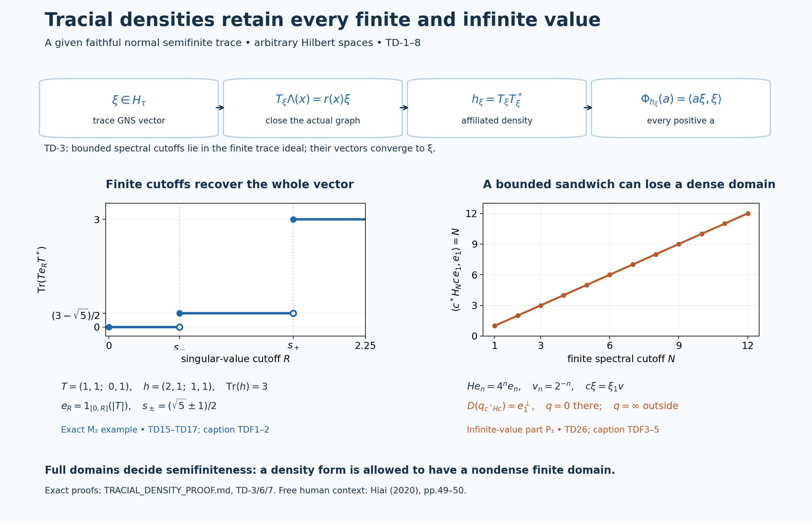

# Tracial densities on the complete extended positive cone

*Fresh local proof, GPT-6 Astra (OpenAI), Ultra, 2026-10-04. CC0-1.0 to the extent of rights held.*

Let \(M\) be a von Neumann algebra on an arbitrary Hilbert space and let \(\tau\) be a **given faithful normal semifinite trace**, with \(\tau(x^*x)=\tau(xx^*)\) for every bounded \(x\), including infinite values. There is no countability hypothesis. We prove an order isomorphism between the complete extended cone \(\widehat M_+\) and **all normal weights** on \(M\). Its restriction to positive self-adjoint affiliated operators is exactly the class of normal semifinite weights, without a faithfulness assumption on the numerator.

The actual earlier inputs are [GW1](OA-FLOW-GW.md#oa-flow.gw.1), [GW2](OA-FLOW-GW.md#oa-flow.gw.2), [GW3](OA-FLOW-GW.md#oa-flow.gw.3), [GW4](OA-FLOW-GW.md#oa-flow.gw.4), [GW5](OA-FLOW-GW.md#oa-flow.gw.5), [NF5](OA-FLOW-NF.md#oa-flow.nf.5), [NF6](OA-FLOW-NF.md#oa-flow.nf.6), [EW3](OA-FLOW-EW.md#oa-flow.ew.3), [EW5](OA-FLOW-EW.md#oa-flow.ew.5), [WR3](OA-FLOW-WR.md#oa-flow.wr.3), [WR4](OA-FLOW-WR.md#oa-flow.wr.4), [WR5](OA-FLOW-WR.md#oa-flow.wr.5), [MW1](OA-FLOW-MW.md#oa-flow.mw.1), [ST2](OA-FLOW-ST12.md#oa-flow.st.2), [EP1](OA-FLOW-EP.md#oa-flow.ep.1), [EP2](OA-FLOW-EP.md#oa-flow.ep.2), [EP3](OA-FLOW-EP.md#oa-flow.ep.3), [EP4](OA-FLOW-EP.md#oa-flow.ep.4), [EP5](OA-FLOW-EP.md#oa-flow.ep.5). Closed operators, polar decompositions and spectral domains use [HA-R4](OA-FLOW-HA-R.md#oa-flow.ha-r.4), [SF0](OA-FLOW-SF.md#oa-flow.sf.sf0), [SB0](OA-FLOW-SF.md#oa-flow.sf.sb0), [SB1](OA-FLOW-SF.md#oa-flow.sf.sb1), [SB2](OA-FLOW-SF.md#oa-flow.sf.sb2), [SB3](OA-FLOW-SF.md#oa-flow.sf.sb3), [SB4](OA-FLOW-SF.md#oa-flow.sf.sb4), [SB5](OA-FLOW-SF.md#oa-flow.sf.sb5), [SB6](OA-FLOW-SF.md#oa-flow.sf.sb6), [FF-4](OA-FLOW-FF.md#oa-flow.ff.5). Positive-functional norm and Cauchy–Schwarz identities use [GNS 2.1](OA-FLOW-GNS.md#gns-lemma-2-1), [GNS 2.2](OA-FLOW-GNS.md#gns-lemma-2-2), [GNS 4.1](OA-FLOW-GNS.md#gns-theorem-4-1). The all-normal surjectivity step, and only that step, additionally uses the complete [WS1](OA-FLOW-WS.md#oa-flow.weight-sum.ws1), [WS2](OA-FLOW-WS.md#oa-flow.weight-sum.ws2), [WS3](OA-FLOW-WS.md#oa-flow.weight-sum.ws3), [WS4](OA-FLOW-WS.md#oa-flow.weight-sum.ws4), [WS5](OA-FLOW-WS.md#oa-flow.weight-sum.ws5), [GF1](OA-FLOW-WS.md#oa-flow.weight-sum.gf1), [GF2](OA-FLOW-WS.md#oa-flow.weight-sum.gf2), [GF3](OA-FLOW-WS.md#oa-flow.weight-sum.gf3), [GF4](OA-FLOW-WS.md#oa-flow.weight-sum.gf4) whole-cone decomposition theorem. Every named input is an actual earlier written programme proof.

The free human context is [Hiai, Theorem 5.13, Corollary 5.14 and Remark 5.15, printed pp.49–50](https://arxiv.org/pdf/2004.02383v1#page=49). The argument below constructs its own closed multiplication operators and whole-cone correspondence; it does not import the measurable-operator completeness or \(L^p\)-duality proofs preceding that passage. The precise local dependencies and source-development boundary are recorded separately.

## TD-1. The trace Hilbert space and bounded cyclic identities

Put \(N_\tau=\{x:\tau(x^*x)<\infty\}\) and let \((H_\tau,\Lambda,\pi)\) be [GW](OA-FLOW-GW.md#oa-flow.gw.5)'s GNS construction, with inner products linear in the first variable. [GW](OA-FLOW-GW.md#oa-flow.gw.5), [NF](OA-FLOW-NF.md#oa-flow.nf.5) and [ST](OA-FLOW-ST12.md#oa-flow.st.2) show that \(\pi\) is faithful and normal, its image is a von Neumann algebra, and its inverse on that image is normal. We may identify \(M\) with this image; [EP-4](OA-FLOW-EP.md#oa-flow.ep.4) transports every extended-cone construction back to any original faithful representation.

The trace identity makes \(N_\tau=N_\tau^*\). It is a two-sided ideal: the left-ideal assertion is [GW-1](OA-FLOW-GW.md#oa-flow.gw.1), and

\[
 \tau((xa)^*(xa))=\tau(xaa^*x^*)\leq\|a\|^2\tau(xx^*)
 =\|a\|^2\tau(x^*x).
 \tag{TD1}
\]
In particular \(r(a)\Lambda(x)=\Lambda(xa)\) defines a bounded right representation, with \(r(ab)=r(b)r(a)\). Polarization of the trace equality on \(N_\tau\) gives

\[
 \tau_0(y^*x)=\tau_0(xy^*)\quad(x,y\in N_\tau).
 \tag{TD2}
\]
Consequently \(J\Lambda(x)=\Lambda(x^*)\) extends to an antiunitary involution and

\[
 r(a)=J\pi(a^*)J,\qquad r(a)^*=r(a^*).
 \tag{TD3}
\]
The full closed finite-star involution is this \(J\): its initial domain is all \(\Lambda(N_\tau)\), which is dense, and it is isometric there. Thus its modular operator is \(I\). [WR](OA-FLOW-WR.md#oa-flow.wr.4) and [MW-1](OA-FLOW-MW.md#oa-flow.mw.1), equivalently the pure MF commutant identity at this full Hilbert algebra, give

\[
 r(M)=\pi(M)'.
 \tag{TD4}
\]
In particular \(r\) is normal: the expression in ([TD3](OA-FLOW-TD.md#equation-td3)) preserves increasing positive suprema, or one can test its bounded strong limits directly on vectors.

The finite linear domain \(\mathfrak m_\tau=\operatorname{span}N_\tau^*N_\tau\) is a two-sided ideal. Applying ([TD2](OA-FLOW-TD.md#equation-td2)) twice to products of two elements of \(N_\tau\) proves

\[
 \tau_0(ab)=\tau_0(ba)\quad(a\in\mathfrak m_\tau,\ b\in M).
 \tag{TD5}
\]
Indeed write \(a=uv\), \(u,v\in N_\tau\), and use
\(\tau_0(uvb)=\tau_0(vbu)=\tau_0(buv)\), then take linear combinations. All three products are in \(\mathfrak m_\tau\) before \(\tau_0\) is used. Independently, the assumed trace identity applied to \(a^{1/2}b^{1/2}\) gives the possibly infinite bounded-positive identity

\[
 \tau(a^{1/2}ba^{1/2})=\tau(b^{1/2}ab^{1/2})
 \quad(a,b\in M_+).
 \tag{TD6}
\]

## TD-2. Integration of an extended density defines a normal weight

For \(m\in\widehat M_+\) define

\[
 \Phi_m(a)=\widehat\tau(a^{1/2}ma^{1/2}),\qquad a\in M_+.
 \tag{TD7}
\]
The sandwich and \(\widehat\tau\) are exactly [EP-4](OA-FLOW-EP.md#oa-flow.ep.4)/5, including nondense form domains. If \(h_n\uparrow m\) is [EP-2](OA-FLOW-EP.md#oa-flow.ep.2)'s canonical bounded sequence, ([TD6](OA-FLOW-TD.md#equation-td6)) and [EP-5](OA-FLOW-EP.md#oa-flow.ep.5) give

\[
 \Phi_m(a)=\sup_n\tau(a^{1/2}h_na^{1/2})
           =\sup_n\tau(h_n^{1/2}ah_n^{1/2}).
 \tag{TD8}
\]
Each expression with fixed \(n\), as a function of \(a\), is an additive, homogeneous, order-normal weight. These weights increase with \(n\), by the first expression. A common upper index proves additivity of their supremum even at infinite values; interchanging two suprema proves order normality for every increasing bounded positive net \(a_\alpha\uparrow a\). Thus \(\Phi_m\) is a normal weight.

For a bounded increasing net representing \(m\), ([TD8](OA-FLOW-TD.md#equation-td8)) holds with that net as well, by [EP-5](OA-FLOW-EP.md#oa-flow.ep.5). This observation, and [EP-4](OA-FLOW-EP.md#oa-flow.ep.4)/5, imply

\[
 \Phi_{m+n}=\Phi_m+\Phi_n,\quad
 \Phi_{c m}=c\Phi_m,\quad
 \Phi_{\sup_\alpha m_\alpha}=\sup_\alpha\Phi_{m_\alpha}.
 \tag{TD9}
\]
Here \(c\geq0\), \(0\cdot\infty=0\), and the last formula is for any increasing net. Finite sums followed by this formula give arbitrary set-indexed sums. No decomposition of an arbitrary scalar weight has been used in [TD-2](OA-FLOW-TD.md#oa-flow.td.2).

For \(b\in N_\tau\), applying the bounded trace equality to \(h_n^{1/2}b\) proves the useful exact testing identity

\[
 \Phi_m(bb^*)=\sup_n\tau(b^*h_nb)
             =q_m(\Lambda(b)),
 \tag{TD10}
\]
where \(q_m(\xi)=m(\omega_\xi)\) is [EP-2](OA-FLOW-EP.md#oa-flow.ep.2)'s complete closed form in the trace representation. This equality includes infinity.

## TD-3. Every trace Hilbert vector has an affiliated density

Fix \(\xi\in H_\tau\). On the dense domain \(\Lambda(N_\tau)\) define the linear operator

\[
 T_\xi^0\Lambda(x)=r(x)\xi.
 \tag{TD11}
\]
Faithfulness of \(\tau\) makes the definition unambiguous. For \(x,y\in N_\tau\),

\[
 \langle r(x)\xi,\Lambda(y)\rangle
 =\langle\xi,\Lambda(yx^*)\rangle
 =\langle\Lambda(x),r(y)J\xi\rangle.
 \tag{TD12}
\]
For the second equality, move \(r(y)^*=r(y^*)\) to the first entry on the right and use
\(\langle u,Jv\rangle=\langle v,Ju\rangle\).
Thus \((T_\xi^0)^*\) is defined on a dense domain, so \(T_\xi^0\) is closable. Let \(T_\xi\) denote its closure. If \(u\in M\) is unitary, \(r(u)\) preserves the initial domain in both directions and

\[
 T_\xi^0r(u)\Lambda(x)=r(xu)\xi
                    =r(u)T_\xi^0\Lambda(x).
 \tag{TD13}
\]
Taking graph closures and using ([TD4](OA-FLOW-TD.md#equation-td4)) shows that \(T_\xi\) is affiliated with \(\pi(M)\).

Use the full closed-operator polar construction of [HA-R4](OA-FLOW-HA-R.md#oa-flow.ha-r.4) to write \(T_\xi=v|T_\xi|\). Its spectral projections, and \(v\), lie in \(\pi(M)\); this follows also by commuting the graph, adjoint product and unique polar factors with every unitary of \(\pi(M)'\). Let \(e_n=1_{[0,n]}(|T_\xi|)\). Then \(e_n\uparrow I\) strongly and \(T_\xi e_n\) is bounded and belongs to \(\pi(M)\). Write \(T_\xi e_n=\pi(b_n)\). Since \(e_nx\in N_\tau\), ([TD11](OA-FLOW-TD.md#equation-td11)), on its actual initial domain, yields

\[
 \pi(b_n)\Lambda(x)
   =T_\xi\Lambda(e_nx)
   =r(x)r(e_n)\xi\qquad(x\in N_\tau).
 \tag{TD14}
\]

Here is a direct proof that \(b_n\in N_\tau\) with its required vector, so that no bounded-multiplier recovery is silently imported. Choose [GW-4](OA-FLOW-GW.md#oa-flow.gw.4)'s finite positive contractions \(u_i\uparrow I\). They belong to \(N_\tau\), and ([TD14](OA-FLOW-TD.md#equation-td14)) gives
\(\Lambda(b_nu_i)=r(u_i)r(e_n)\xi\).
The positive bounded operators \(b_nu_i^2b_n^*\) converge strongly to \(b_nb_n^*\), hence ultraweakly by [ST-2](OA-FLOW-ST12.md#oa-flow.st.2). [EW](OA-FLOW-EW.md#oa-flow.ew.3) lower semicontinuity and the trace identity imply
\[
 \tau(b_n^*b_n)\leq
 \liminf_i\|\Lambda(b_nu_i)\|^2
 =\|r(e_n)\xi\|^2<\infty.
\]
Now \(b_n\in N_\tau\), so normality of \(r\) makes
\(\Lambda(b_nu_i)=r(u_i)\Lambda(b_n)\to\Lambda(b_n)\).
Comparing the limits proves

\[
 \Lambda(b_n)=r(e_n)\xi,\qquad
 \tau(b_n^*b_n)=\|r(e_n)\xi\|^2.
 \tag{TD15}
\]
These vectors tend to \(\xi\). By spectral calculus,

\[
 b_nb_n^*=v|T_\xi|^2e_nv^*\uparrow h_\xi:=T_\xi T_\xi^*
 \tag{TD16}
\]
in the extended cone; \(T_\xi T_\xi^*\) is the positive self-adjoint operator on the whole Hilbert space, with zero on the orthogonal complement of the range support. The formula uses the full adjoint/product domains supplied by [HA-R4](OA-FLOW-HA-R.md#oa-flow.ha-r.4). For every \(a\in M_+\), ([TD8](OA-FLOW-TD.md#equation-td8)) and norm convergence in ([TD15](OA-FLOW-TD.md#equation-td15)) give

\[
 \Phi_{h_\xi}(a)
 =\sup_n\tau(b_n^*ab_n)
 =\lim_n\|\pi(a^{1/2})r(e_n)\xi\|^2
 =\langle\pi(a)\xi,\xi\rangle.
 \tag{TD17}
\]
In particular \(\widehat\tau(h_\xi)=\|\xi\|^2\). The increasing scalar values in the middle follow from ([TD16](OA-FLOW-TD.md#equation-td16)) and ([TD6](OA-FLOW-TD.md#equation-td6)), not from any assertion that those vector norms are monotone for arbitrary projection nets.

## TD-4. Surjectivity, including every normal weight

By [EP-1](OA-FLOW-EP.md#oa-flow.ep.1) in the trace representation, every \(f\in M_*^+\) has a norm-convergent representation \(f=\sum_j\omega_{\xi_j}\), with \(\sum_j\|\xi_j\|^2=f(1)\). Let

\[
 h_f=\sum_j h_{\xi_j}\quad\hbox{in }\widehat M_+.
 \tag{TD18}
\]
[EP-4](OA-FLOW-EP.md#oa-flow.ep.4) constructs this sum, and ([TD9](OA-FLOW-TD.md#equation-td9))/([TD17](OA-FLOW-TD.md#equation-td17)) give
\(\Phi_{h_f}=f\) and \(\widehat\tau(h_f)=f(1)<\infty\).
If the spectral pair of \(h_f\) had a nonzero infinite-value projection \(p\), then \(h_f\geq np\) for every \(n\), contradicting faithfulness of \(\tau\) and its finite total integral. Thus \(h_f\) is an ordinary densely defined positive self-adjoint affiliated operator. This proves bounded positive functional surjectivity without the weight-sum theorem.

Now let \(\Phi\) be any normal weight, with neither faithfulness nor semifiniteness required. The complete WS/GF theorem gives a **set-indexed** family \(f_i\in M_*^+\) such that \(\Phi(a)=\sum_i f_i(a)\) for every \(a\in M_+\), including infinite values. The element

\[
 m_\Phi=\sum_i h_{f_i}\in\widehat M_+
 \tag{TD19}
\]
therefore satisfies \(\Phi_{m_\Phi}=\Phi\) by ([TD9](OA-FLOW-TD.md#equation-td9)). All sums mean suprema of finite partial sums. No countable decomposition of \(\Phi\), shared finite domain, or equality only on a dense finite algebra is substituted for this full-cone assertion.

## TD-5. Order reflection and uniqueness on the complete forms

Suppose \(\Phi_m\leq\Phi_n\). Formula ([TD10](OA-FLOW-TD.md#equation-td10)) gives
\(q_m(\Lambda(b))\leq q_n(\Lambda(b))\) for all \(b\in N_\tau\). We must extend this comparison beyond that dense set; density alone would not suffice.

Let \(n\) have spectral pair \((e,A)\), and let \(E_k=1_{[0,k]}(A)\), extended by zero on \((1-e)H_\tau\). If \(\eta\in D(q_n)\), then \(E_k\eta\to\eta\) in the form norm of \(q_n\), by its full spectral integral. For fixed \(k\), approximate \(\eta\) in Hilbert norm by \(\Lambda(b_j)\). Then

\[
 E_k\Lambda(b_j)=\Lambda(E_kb_j),\quad E_kb_j\in N_\tau,
 \qquad
 q_n(E_k\Lambda(b_j)-E_k\eta)
 \leq k\|\Lambda(b_j)-\eta\|^2.
 \tag{TD20}
\]
Choose first the spectral cutoff and then one approximation sufficiently close. This produces a sequence in \(\Lambda(N_\tau)\) tending to \(\eta\) in \(q_n\)-form norm. Lower semicontinuity of \(q_m\) proves \(q_m(\eta)\leq q_n(\eta)\). Off \(D(q_n)\) the inequality is automatic. [EP-3](OA-FLOW-EP.md#oa-flow.ep.3)'s positive vector-series recovery now proves \(m\leq n\) on every positive normal functional. Preservation of order follows directly from ([TD7](OA-FLOW-TD.md#equation-td7)).

Consequently \(m\mapsto\Phi_m\) is an order isomorphism, with uniqueness of the whole spectral pair and independence of every vector/sum choice in [TD-3](OA-FLOW-TD.md#oa-flow.td.3)/4.

## TD-6. Semifiniteness, exact support and finite ideals

Write the spectral pair of \(m\) as \((e,H)\), and put \(p=1-e\). If \(\Phi_m(a)<\infty\), the inequality \(m\geq np\) gives
\[
 \Phi_m(a)\geq n\tau(a^{1/2}pa^{1/2})\quad(n\geq1).
\]
Faithfulness forces \(pa^{1/2}=0\); hence \(a=eae\). Thus semifiniteness of \(\Phi_m\), by [GW-4](OA-FLOW-GW.md#oa-flow.gw.4), forces \(e=1\).

Conversely suppose \(e=1\). Put \(E_k=1_{[0,k]}(H)\uparrow I\), and take finite positive contractions \(u_i\uparrow I\) for \(\tau\). The trace identities and spectral bounds give

\[
 \Phi_m(E_ku_iE_k)\leq k\tau(u_i)<\infty.
 \tag{TD21}
\]
Indeed apply ([TD8](OA-FLOW-TD.md#equation-td8)), commute \(E_k\) with each spectral cutoff \(h_n\), and use
\(u_i^{1/2}E_kh_nE_ku_i^{1/2}\leq k u_i\).
For fixed \(k\), \(E_ku_iE_k\to E_k\) strongly, and \(E_k\to I\) strongly. Each finite positive element has support below the join of all finite-weight projections, by the spectral-cutoff argument in [GW-4](OA-FLOW-GW.md#oa-flow.gw.4). These two limits make that join \(I\), so \(\Phi_m\) is semifinite.

Let \(z=1_{\{0\}}(H)\), extended by zero on \(pH_\tau\). All canonical bounded cutoffs of \(m\) have common kernel \(z\). By ([TD8](OA-FLOW-TD.md#equation-td8)) and faithfulness of \(\tau\),

\[
 \Phi_m(a)=0\ \Longleftrightarrow\ a=zaz,\qquad
 s(\Phi_m)=1-z,\qquad
 \Phi_m(a)=\Phi_m(s(\Phi_m)a\,s(\Phi_m)).
 \tag{TD22}
\]
For the last equality each bounded cutoff is supported on \(s(\Phi_m)\), so the second expression of ([TD8](OA-FLOW-TD.md#equation-td8)) is unchanged. The restriction to the support is faithful; in the semifinite case its spectral form still has dense domain there, so the restriction is semifinite by the argument just given. In particular \(\Phi_m\) is faithful exactly when \(z=0\). The zero weight corresponds to \(H=0\).

The finite left ideal, without any density hypothesis on the form, is exactly

\[
 N_{\Phi_m}
 =\{x\in M:\widehat\tau(xmx^*)<\infty\},\qquad
 \|\Lambda_{\Phi_m}(x)\|^2=\widehat\tau(xmx^*).
 \tag{TD23}
\]
To verify it, apply the bounded trace identity to \(xh_n^{1/2}\) in ([TD8](OA-FLOW-TD.md#equation-td8)) for \(a=x^*x\), then pass to the increasing extended limit. [GW-1](OA-FLOW-GW.md#oa-flow.gw.1)/2 now gives the full finite linear domain and its unique finite extension. These formulas specify finite and infinite values without assuming any formal unbounded operator product is closed.

We have proved, in particular: every normal semifinite numerator weight has one unique positive self-adjoint affiliated density \(H\), possibly with kernel, and

\[
 \Phi(a)=\widehat\tau(a^{1/2}Ha^{1/2})
        =\sup_n\tau(H_n^{1/2}aH_n^{1/2}),\qquad H_n=H\wedge n.
 \tag{TD24}
\]
The conventional expression \(\tau(H^{1/2}aH^{1/2})\) means this trace-cutoff value here. It does not assert that the product of a bounded operator on the left with \(H^{1/2}\) has an automatically closed or even closable domain.

## TD-7. Sums and sandwiches with their exact domains

For a family of normal weights \(\Phi_i=\Phi_{m_i}\), the unique density of their sum is \(\sum_i m_i\). On any faithful representation its closed form and finite domain are

\[
 q(\xi)=\sum_i q_{m_i}(\xi),\qquad
 D(q)=\{\xi:\sum_i q_{m_i}(\xi)<\infty\}.
 \tag{TD25}
\]
For two summands this domain is \(D(q_{m_1})\cap D(q_{m_2})\). The spectral pair is the [FF-4](OA-FLOW-FF.md#oa-flow.ff.5) pair on \(\overline{D(q)}\), with infinite-value part \(1-[\overline{D(q)}]\). In particular the form sum of two self-adjoint affiliated densities need not have dense domain; we do not replace it by an unproved algebraic operator sum. The resulting sum weight is semifinite if and only if this domain is dense, by [TD-6](OA-FLOW-TD.md#oa-flow.td.6).

For \(b\in M\), define \(\Phi^b(a)=\Phi(b^*ab)\). Then

\[
 m_{\Phi^b}=b\,m_\Phi b^*,\qquad
 q_{m_{\Phi^b}}(\xi)=q_{m_\Phi}(b^*\xi),\qquad
 D(q_{m_{\Phi^b}})=\{\xi:b^*\xi\in D(q_{m_\Phi})\}.
 \tag{TD26}
\]
For bounded \(h_n\uparrow m_\Phi\), the trace identity for \(a^{1/2}bh_n^{1/2}\) gives
\[
 \tau(h_n^{1/2}b^*ab h_n^{1/2})
 =\tau(a^{1/2}b h_n b^*a^{1/2}).
\]
Taking the increasing limits proves the weight identity, and [EP-4](OA-FLOW-EP.md#oa-flow.ep.4) gives the complete closed domain in ([TD26](OA-FLOW-TD.md#equation-td26)). This proof handles singular \(b\). The resulting weight is semifinite exactly when that preimage domain is dense. For a unitary \(w\), it is \(wD(q_{m_\Phi})\), so semifiniteness is preserved and the affiliated operator is \(wHw^*\) on \(wD(H)\).

## TD-8. Finite trace pairing and justified cyclic cutoffs

If \(h\in\widehat M_+\) has \(\widehat\tau(h)<\infty\), its infinite-value part vanishes by [TD-4](OA-FLOW-TD.md#oa-flow.td.4)'s argument. The weight \(f_h=\Phi_h\) is bounded, since
\(f_h(a)\leq\|a\|\widehat\tau(h)\), and it is a normal positive functional with \(\|f_h\|=f_h(1)=\widehat\tau(h)\). Put \(h_n=h\wedge n\). Then \(h_n\in\mathfrak m_\tau\), and ([TD5](OA-FLOW-TD.md#equation-td5))/([TD6](OA-FLOW-TD.md#equation-td6)), followed by linearity, gives

\[
 f_{h_n}(a)=\tau_0(h_na)=\tau_0(ah_n)\quad(a\in M).
 \tag{TD27}
\]
Moreover \(f_h-f_{h_n}\) is positive, and its norm is

\[
 \|f_h-f_{h_n}\|=\widehat\tau(h)-\tau(h_n)\longrightarrow0.
 \tag{TD28}
\]
Thus, for every bounded \(a\), the finite trace pairings are rigorously defined by

\[
 \tau(ha):=f_h(a)=\lim_n\tau_0(h_na)
                    =\lim_n\tau_0(ah_n)=:\tau(ah),
 \qquad
 |\tau(ha)|\leq\|a\|\widehat\tau(h).
 \tag{TD29}
\]
The error in either cutoff pairing is at most
\(\|a\|(\widehat\tau(h)-\tau(h_n))\); it is uniform on each operator-norm ball.
One may equally use \(h\,1_{[0,n]}(h)\), whose positive remainder has trace tending to zero by [EP-5](OA-FLOW-EP.md#oa-flow.ep.5). These are cutoff-defined finite pairings, so no unspecified domain for the formal products \(ha,ah\) is being asserted.

Finally, if \(\widehat\tau(b^*hb)<\infty\), ([TD26](OA-FLOW-TD.md#equation-td26)) and polarization on bounded \(a\) give the finite cyclic sandwich identity

\[
 \tau((b^*hb)a)=\Phi_h(bab^*),\qquad a\in M.
 \tag{TD30}
\]
On the right, the expression is the bounded functional \(a\mapsto\Phi_h(bab^*)\), initially defined for positive \(a\) and then extended linearly. Formula ([TD30](OA-FLOW-TD.md#equation-td30)) follows first from ([TD26](OA-FLOW-TD.md#equation-td26)) for positives and then from that unique extension, even when \(\widehat\tau(h)=\infty\).

The theorem takes the trace as a hypothesis. It constructs no compact-core trace, descent theorem, type classification, natural cone, or general centralizer perturbation. Its dependence on the proved WS/GF whole-cone theorem is explicit.

### What the cutoff construction recovers, and what a sandwich can lose

The upper band is the actual map proved in [TD-3, equations TD11–TD17](OA-FLOW-TD.md#oa-flow.td.3): a Hilbert vector gives a closable multiplication operator, its bounded spectral cutoffs give finite trace vectors, and their increasing densities recover the original vector functional on every positive element. The lower panels are exact examples, not approximations to an unspecified operator.

For the left panel take \(M=M_2(\mathbb C)\), \(\tau=\operatorname{Tr}\) and

\[
 T=\begin{pmatrix}1&1\\0&1\end{pmatrix},\qquad
 h=TT^*=\begin{pmatrix}2&1\\1&1\end{pmatrix}.
 \tag{TDF1}
\]
The trace Hilbert space is the four-dimensional matrix space with inner product \(\langle X,Y\rangle=\operatorname{Tr}(Y^*X)\). The vector \(\xi=T\) has \(T_\xi\) equal to left multiplication by \(T\), since \(r(x)T=Tx\). With \(e_R=1_{[0,R]}(|T|)\), its bounded density is \(h_R=Te_RT^*\), and

\[
 \operatorname{Tr}(h_R)=
 \begin{cases}
 0,&0\leq R<s_-,\\
 (3-\sqrt5)/2,&s_-\leq R<s_+,\\
 3,&R\geq s_+,
 \end{cases}
 \qquad s_\pm=(\sqrt5\pm1)/2.
 \tag{TDF2}
\]
Indeed \(T^*T\) has characteristic polynomial \(t^2-3t+1\), so its eigenvalues are \(s_\pm^2\). The closed-left endpoint convention is shown with filled dots; the excluded upper endpoint of each preceding step is open. This exact finite example displays [TD15](OA-FLOW-TD.md#equation-td15)–[TD17](OA-FLOW-TD.md#equation-td17) and the normalization \(\tau(h)=\|\xi\|^2=3\).

For the right panel take \(M=B(\ell^2(\mathbb N))\), with its given trace \(\operatorname{Tr}(a)=\sum_{n\geq1}\langle ae_n,e_n\rangle\), and define

\[
 He_n=4^n e_n,\qquad
 D(H^{1/2})=\{\xi:\sum_{n\geq1}4^n|\xi_n|^2<\infty\},\qquad
 v=\sum_{n\geq1}2^{-n}e_n.
 \tag{TDF3}
\]
This trace is faithful and normal by the supremum of finite diagonal sums. The trace identity follows from \(\sum_{i,j}|x_{ij}|^2=\sum_{j,i}|x_{ij}|^2\), with both sums interpreted as suprema of finite subsums. Finite-rank diagonal projections have finite trace and increase strongly to \(I\), giving semifiniteness by [GW-4](OA-FLOW-GW.md#oa-flow.gw.4). Thus this example has all the stated trace hypotheses.

The geometric series gives \(\|v\|^2=1/3\), while \(\sum_n4^n|v_n|^2=\sum_n1=\infty\). Let \(c\xi=\xi_1v\); then \(c\) is bounded of rank one, with \(\|c\|=1/\sqrt3\). For \(H_N=H1_{\{4,\ldots,4^N\}}(H)\),

\[
 c^*H_Nc=N P_1,\qquad P_1=|e_1\rangle\langle e_1|.
 \tag{TDF4}
\]
These bounded forms increase to the extended element \(m=c^*Hc\), whose entire finite domain and weight are

\[
 D(q_m)=e_1^\perp,\qquad q_m|_{e_1^\perp}=0,\qquad
 q_m(\xi)=\infty\ \ (\xi_1\ne0),\qquad
 \Phi_m(a)=
 \begin{cases}0,&\langle ae_1,e_1\rangle=0,\\
 \infty,&\langle ae_1,e_1\rangle>0.\end{cases}
 \tag{TDF5}
\]
This follows directly from ([TDF4](OA-FLOW-TD.md#equation-tdf4)), or from [TD-6/7, equations TD23/TD26](OA-FLOW-TD.md#oa-flow.td.7), taking \(b=c^*\). In particular \(\Phi_m(a)=\Phi_H(cac^*)\): a bounded sandwich of a faithful normal semifinite weight need not be semifinite. The finite part is the zero operator on \(e_1^\perp\), and the infinite-value part is \(P_1\). This rank-one projection is finite in the Murray–von Neumann sense; “infinite-value” describes the form, not that projection's equivalence class. The plot contains the exact cutoff values \(N=1,\ldots,12\); divergence follows from the displayed formula for every \(N\), not from the finite plot.

Reproducible source: [render_tracial_density.py](../assets/tracial-density/render_tracial_density.py). The SVG, PNG and numerical assertions are retained in assets. Human free context: [Hiai, printed pp.49–50](https://arxiv.org/pdf/2004.02383v1#page=49); every example and formula above is computed locally at the proof's exact earlier foundations.

[Editable SVG](../assets/tracial-density/assets/tracial-density.svg), [exact numerical data](../assets/tracial-density/assets/tracial-density-numerics.json), and [reproduction source](../assets/tracial-density/render_tracial_density.py).
