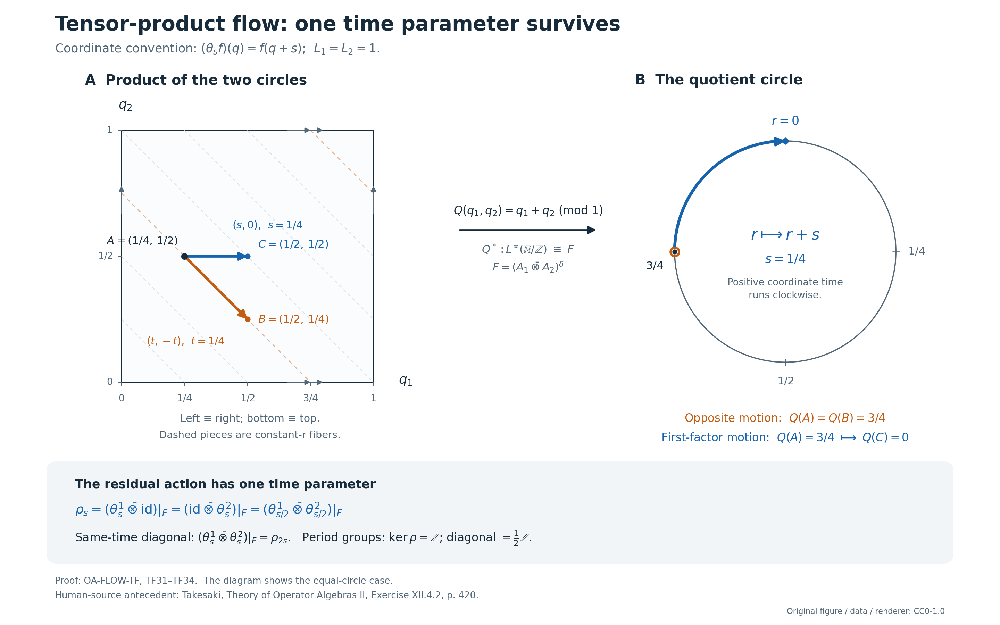

# Tensor products and the normalized flow of weights

The tensor product combines two core flows by removing opposite motion. We construct the full normal algebra isomorphism, prove its center formula, and use circle models to determine the exact surviving time parameter.

*Original exposition, examples, figures, data and reproducible drawing code in this lesson are dedicated to CC0-1.0. Source publications and font components retain their own terms.*

## The theorem and its exact scope

Let \(M_1,M_2\) be nonzero von Neumann algebras. Write \(C(M_i)\) for the intrinsic continuous cores, \(j_i:M_i\to C(M_i)\) for their coefficient maps, \(\theta^i\) for their dual actions, and \(A_i=Z(C(M_i))\). Set
\[
 D=C(M_1)\bar\otimes C(M_2),\qquad
 \delta_t=\theta^1_t\bar\otimes\theta^2_{-t},\qquad
 F=(A_1\bar\otimes A_2)^\delta .
 \tag{TF1}
\]
There is a canonical normal isomorphism with normal inverse
\[
 \begin{aligned}
 I_{12}:C(M_1\bar\otimes M_2)&\longrightarrow D^\delta,\\
 j_{12}(x_1\otimes x_2)&\longmapsto j_1(x_1)\otimes j_2(x_2).
 \end{aligned}
 \tag{TF2}
\]
Its restriction to the center is a normal isomorphism
\[
 \boxed{\quad
 (Z(C(M_1\bar\otimes M_2)),\theta)
 \ \cong\
 \left(F,\,
   (\theta^1_s\bar\otimes\mathrm{id})|_F\right).
 \quad}
 \tag{TF3}
\]
On \(F\), the action displayed here also equals
\((\mathrm{id}\bar\otimes\theta^2_s)|_F\). The maps are natural for normal isomorphisms of the two input algebras, including their tensor flip.

In particular this proves the tensor-product flow theorem for arbitrary infinite factors. There is no separability, countable decomposability, faithful-state, factorial-core or type III hypothesis in (TF1)–(TF3). The stronger algebraic statement is useful because none of the proof needs factoriality. For factors, the tensor product is a factor; its flow is therefore algebraically ergodic. The zero-algebra case can separately be read as the unique zero maps.

The real group has Haar measure \(dt\). A core chart for a faithful normal semifinite weight \(\varphi\) has
\
 [\pi_\varphi(x)\xi=\sigma^\varphi_{-r}(x)\xi(r),
 \qquad \lambda_\varphi(t)\xi=\xi(r-t),\qquad
 \theta_s(\lambda_\varphi(t))=e^{-ist}\lambda_\varphi(t).
 \tag{TF4}
\]
Dual Haar measure is \(ds/(2\pi)\). All tensor products are spatial von Neumann tensor products, and every fixed algebra means equality of operators for every real parameter.

The intrinsic core and its weight-chart identifications are constructed, with their whole positive-cone weights and normal inverses, in the [intrinsic-core construction](OA-FLOW-CORE.md#core-7), its [normal chart maps](OA-FLOW-CORE.md#core-5), and its [isomorphism functor](OA-FLOW-CORE.md#core-8). Arbitrary algebras have a faithful normal semifinite reference weight by [FR1](OA-FLOW-FR.md#oa-flow.fr.1). The proof below uses such weights as coordinates; it does not require a faithful normal state.

## 1. The tensor facts needed by the proof

Choose faithful normal semifinite weights \(\varphi_i\) on \(M_i\). The product weight
\(\varphi=\varphi_1\otimes\varphi_2\) exists on the entire positive cone and satisfies
\[
 H_\varphi=H_{\varphi_1}\otimes H_{\varphi_2},\quad
 J_\varphi=J_{\varphi_1}\otimes J_{\varphi_2},\quad
 \Delta_\varphi^{it}
   =\Delta_{\varphi_1}^{it}\otimes\Delta_{\varphi_2}^{it},\quad
 \sigma^\varphi_t=\sigma^{\varphi_1}_t\bar\otimes\sigma^{\varphi_2}_t.
 \tag{TF5}
\]
The actual arbitrary-Hilbert proof is [OA-MOD, Tensor Hilbert algebras and Tomita domains](../../OA-MOD/OA-MOD-TG.html#tensor-hilbert-algebras-and-tomita-domains), TG.17–21, together with its preceding closed-operator and spatial-representation arguments.

Here is the domain mechanism behind that input. The product of the two finite-star Hilbert algebras is a left Hilbert algebra. If \(S_i=J_i\Delta_i^{1/2}\), the closure of its sharp operation is
\((J_1\otimes J_2)(\Delta_1^{1/2}\otimes\Delta_2^{1/2})\).
Rectangular spectral cuts of the two positive operators increase to one and approximate every vector in the graph norm of their closed product. Finite simple tensors in each rectangle, followed by graph approximation in the original two finite-star algebras, give a graph core. The same argument for the adjoints proves the full adjoint domain. Completing this Hilbert algebra constructs the weight and its entire finite ideal; polar decomposition gives (TF5). This is the tensor weight for two arbitrary weights. [TW](OA-FLOW-TW.md#tw-2), which gives the explicit arbitrary-matrix formula when the second weight is the usual trace, alone would not supply this input.

We will need two consequences with all their scopes visible.

**Tensor commutants.** For arbitrary concrete von Neumann algebras \(B_i\subset B(K_i)\),
\[
 (B_1\bar\otimes B_2)'=B_1'\bar\otimes B_2'.
 \tag{TF6}
\]
First use faithful weight GNS representations. The modular commutant theorem and (TF5) give
\[
 (B_1\bar\otimes B_2)'
 =(J_1\otimes J_2)(B_1\bar\otimes B_2)(J_1\otimes J_2)
 =B_1'\bar\otimes B_2'.
\]
Conjugation carries the whole generated algebra onto the whole generated algebra, not just its algebraic tensors.

To pass to arbitrary faithful normal representations, decompose each representation into an arbitrary orthogonal family of cyclic reducing subspaces. A normal cyclic functional has its vector in the standard representation. The map from its standard cyclic subspace to the given cyclic subspace preserves inner products on \(a\xi\), hence extends to an intertwining isometry. Their orthogonal sum identifies the given representation with a reducing corner \(e_i\) of a standard amplification. This is the actual [spatial comparison proof, TG.15–16](../../OA-MOD/OA-MOD-TG.html#comparing-spatial-representations).

In the amplifications, matrix entries show that the commutants are \(B_i'\bar\otimes B(\ell^2(I_i))\). Finite subsets of the arbitrary bases suffice: the corresponding compressions converge strongly to every operator. Regrouping the two amplifications and using the standard case above computes their joint commutant as the tensor of these two commutants. Compression by \(e_1\otimes e_2\) now proves (TF6) in the original representations. Indeed an operator commuting with the reduced representation extends by zero to an operator in the full commutant, so its commutant is precisely the corresponding corner; compression of the tensor algebra is the tensor of the two corners by normality and density of elementary tensors. These arguments also prove that a pair of normal isomorphisms has a unique normal tensor isomorphism, with the tensor of their inverses as inverse. The [arbitrary matrix-entry proof in ND](OA-FLOW-ND.md#nd-tensor) gives the amplification and normality assertions used here.

Consequently, for unital von Neumann subalgebras \(P_i\subset B_i\),
\[
 (P_1\bar\otimes P_2)'\cap(B_1\bar\otimes B_2)
 =(P_1'\cap B_1)\bar\otimes(P_2'\cap B_2).
 \tag{TF7}
\]
In fact the left side is the commutant of
\((P_1\vee B_1')\bar\otimes(P_2\vee B_2')\): its four generating families impose exactly the required commutations. Apply (TF6) to this algebra. Taking \(P_i=B_i\) gives
\(Z(B_1\bar\otimes B_2)=Z(B_1)\bar\otimes Z(B_2)\).
This proves tensor factoriality without an implicit slice-containment assertion.

**The normalized product cocycle.** If \(\psi_i\) are other faithful normal semifinite weights and
\(c_i(t)=(D\psi_i:D\varphi_i)_t\), then
\[
 (D(\psi_1\otimes\psi_2):D(\varphi_1\otimes\varphi_2))_t
       =c_1(t)\otimes c_2(t).
 \tag{TF8}
\]
A modular group computation alone would not determine its scalar phase. We prove that phase through the actual balanced definition.

We first record the corner compatibility of the product-weight construction. If \(p_i\in (M_i)_{\varphi_i}\), then
\[
 (\varphi_1\otimes\varphi_2)|_{p_1M_1p_1\bar\otimes p_2M_2p_2}
       =\varphi_1^{p_1}\otimes\varphi_2^{p_2}
 \tag{TF9}
\]
on the entire positive cone. The [centralizer-corner proof CZ5](OA-FLOW-CZ.md#oa-flow.cz.5) gives the complete finite-star corner \(p_i\mathfrak A_{\varphi_i}p_i\). On its GNS space, two-sided multiplication by \(p_i\) is the orthogonal projection \(E_i=L(p_i)J_iL(p_i)J_i\); it takes \(\Lambda(x)\) to \(\Lambda(p_ixp_i)\), preserves the full sharp domain, and commutes there with the sharp operator. This follows first from the left/right multiplication identities on the finite-star domain and then by graph closure. Projecting a graph-approximating net therefore gives the full corner graph core. In the product construction the corresponding projection is \(E_1\otimes E_2\). Its projected tensor Hilbert algebra is exactly the tensor of the two corner Hilbert algebras. Its graph closure and left multiplications are the ones used to construct the right side of (TF9). The full Hilbert-algebra completion and its weight reconstruction thus agree, including the multiplication-vector norms determining every finite positive value and the infinite value when no such vector exists. This proves (TF9), rather than inferring equality of weights from elementary positive tensors.

Put \(\rho_i=\operatorname{diag}(\varphi_i,\psi_i)\) on \(M_2(M_i)\), using the whole-cone balanced construction in [BC1](OA-FLOW-BC.md#oa-flow.bc.1), [BC2](OA-FLOW-BC.md#oa-flow.bc.2), [BC3](OA-FLOW-BC.md#oa-flow.bc.3), [BC4](OA-FLOW-BC.md#oa-flow.bc.4). Form \(\rho_1\otimes\rho_2\) and set
\[
 q=E_{11}\otimes E_{11}+E_{22}\otimes E_{22}.
\]
Both summands are modular-fixed by (TF5) and BC. In the \(q\)-corner, the two diagonal restrictions are \(\varphi_1\otimes\varphi_2\) and \(\psi_1\otimes\psi_2\), by (TF9). Conjugation by the symmetry with diagonal entries \(1,-1\) preserves the corner weight. Averaging the two conjugates of an arbitrary positive element therefore removes its off-diagonal entries and preserves its weight, even when that value is infinite. Thus the whole corner weight is precisely the balanced weight of these two product weights.

By (TF5) its modular action sends the lower matrix unit \(E_{21}\otimes E_{21}\) to
\((c_1(t)\otimes c_2(t))(E_{21}\otimes E_{21})\).
The corner modular group is the restricted modular group by CZ5. The exact balanced definition in [BC4](OA-FLOW-BC.md#oa-flow.bc.4) now gives (TF8). In particular rescaling the two input weights by \(a_1,a_2>0\) multiplies this cocycle by \((a_1a_2)^{it}\), with no lost scalar.

The same tensor Hilbert-algebra construction proves
\[
 (\varphi_1\otimes\varphi_2)\circ(f_1\otimes f_2)^{-1}
   =(\varphi_1\circ f_1^{-1})\otimes(\varphi_2\circ f_2^{-1})
 \tag{TF10}
\]
for normal isomorphisms \(f_i\). The GNS maps
\(\Lambda_{\varphi_i}(x)\mapsto
 \Lambda_{\varphi_i\circ f_i^{-1}}(f_i(x))\)
are onto isometries preserving left multiplication and sharp. Their tensor transports the defining tensor Hilbert algebra and its full completion. Weight reconstruction proves equality on every positive element. This also proves compatibility with the tensor flip and with finite reassociation.

## 2. A normal isomorphism from the iterated crossing

Work temporarily in the weight charts above. Write
\[
 \alpha^i=\sigma^{\varphi_i},\quad
 M=M_1\bar\otimes M_2,\quad
 \gamma_t=\alpha^1_t\bar\otimes\alpha^2_t,\quad
 C=M\rtimes_\gamma\mathbb R,\quad
 D_\varphi=C_{\varphi_1}(M_1)\bar\otimes C_{\varphi_2}(M_2).
 \tag{TF11}
\]
By (TF5), \(C=C_\varphi(M)\). Let \(i:M\to C\) and \(v_t\in C\) be its regular coefficients and translations; let \(u^i_t\) denote the translations in the two factor cores.

Regrouping the two factor regular Hilbert spaces gives the full faithful representation of \(D_\varphi\) on \(L^2(\mathbb R^2,H)\), where \(H=H_{\varphi_1}\otimes H_{\varphi_2}\). Its generators are
\
 [\Pi(x)\xi
       =(\alpha^1_{-a}\bar\otimes\alpha^2_{-b})(x)\xi(a,b),
 \qquad
 U_{h,k}\xi=\xi(a-h,b-k).
 \tag{TF12}
\]
In particular \(U_{h,k}=u^1_h\otimes u^2_k\). The coefficient map for arbitrary \(x\in M\) is normal: it is the normal tensor of the two regular coefficient maps. The elementary coefficient images and the two translation groups generate exactly the tensor algebra. Hilbert tensor regrouping is an onto unitary, so this identifies whole von Neumann algebras normally.

There is an action \(\kappa:\mathbb R\curvearrowright C\) given by
\[
 \kappa_d(i(x))=i((\alpha^1_d\bar\otimes\mathrm{id})(x)),
 \qquad \kappa_d(v_t)=v_t.
 \tag{TF13}
\]
This is not just a formal rule. On \(H_C=L^2(\mathbb R_t,H)\), the constant unitary
\
 [V_d\zeta
   =(\Delta_{\varphi_1}^{id}\otimes1)\zeta(t)
\]
normalizes both regular generating families with exactly (TF13). It and its adjoint are strongly continuous by tensor density; vector-series tests give point-ultraweak continuity of \(\kappa\).

The regular iterated crossing \(E=C\rtimes_\kappa\mathbb R\) acts on
\(L^2(\mathbb R_d,H_C)\). Denote its coefficient map by \(j_\kappa\) and its translations by \(k_h\). Its coefficient of \(x\in M\) is multiplication by
\((\alpha^1_{-(d+t)}\bar\otimes\alpha^2_{-t})(x)\).
Its copy of \(v_h\) shifts \(t\), and \(k_h\) shifts \(d\).

Define the shear
\
 [W\xi=\xi(d+t,t),\qquad
 W^*\eta=\eta(a-b,b).
 \tag{TF14}
\]
Its determinant is one. A change of variables gives norm equality on compact continuous finite-vector tensors. Those tensors are dense in the full Hilbert spaces even for arbitrary \(H\); the two formulas therefore extend to inverse unitaries. Direct substitution in (TF12) gives
\[
 \begin{aligned}
 W\Pi(x)W^*&=j_\kappa(i(x)),\\
 W(u^1_h\otimes u^2_k)W^*&=k_{h-k}j_\kappa(v_k).
 \end{aligned}
 \tag{TF15}
\]
In particular the diagonal translations give \(j_\kappa(v_t)\), and the first-factor translations give \(k_h\). These are both complete generating families. Consequently
\[
 \Xi:E\overset{\cong}{\longrightarrow}D_\varphi,\qquad
 \Xi(Y)=W^*YW
 \tag{TF16}
\]
is onto and normal, with the normal inverse \(X\mapsto WXW^*\). It has
\[
 \Xi(j_\kappa(i(x)))=\Pi(x),\quad
 \Xi(j_\kappa(v_t))=u^1_t\otimes u^2_t,\quad
 \Xi(k_d)=u^1_d\otimes1 .
 \tag{TF17}
\]
No universal integrated representation or cancellation of a tensor factor is being substituted for this normal onto construction.

## 3. The full opposite-parameter fixed algebra

In the coordinates (TF12), \(\delta_s\) is implemented by multiplication by \(e^{-is(a-b)}\). Under \(W\) this becomes multiplication by \(e^{-isd}\). It fixes \(j_\kappa(C)\), and sends \(k_d\) to \(e^{-isd}k_d\). Hence
\[
 \delta_s\Xi=\Xi\widehat\kappa_s.
 \tag{TF18}
\]
The entire dual fixed algebra, not only its algebraic spectral span, is
\(E^{\widehat\kappa}=j_\kappa(C)\). This is the arbitrary-Hilbert [dual fixed-algebra theorem DA](OA-FLOW-DA.md#da-fixed). Its mechanism can be checked here directly.

Let \(T_h\eta=V_h\eta(d+h)\). These operators and every constant element of \(C'\) commute with both regular generating families of \(E\). Define the unitary \(\mathcal U\eta=V_d\eta(d)\). It commutes with scalar multipliers and sends \(T_h\) to ordinary right translation. If \(Y\in E^{\widehat\kappa}\), then \(\mathcal UY\mathcal U^*\) commutes with all scalar character multipliers and translations. The full Weyl generation and matrix commutant proof in [ND](OA-FLOW-ND.md#nd-weyl-proof) put it in \(B(H_C)\otimes1\); write it \(c\otimes1\).

For each fixed \(b'\in C'\) and fixed \(\xi,\eta\in H_C\), commutation with the transported constant \(b'\) gives the zero multiplication form with continuous scalar coefficient
\(\langle[c,V_db'V_d^*]\xi,\eta\rangle\).
Testing against compact scalar functions makes that continuous function zero everywhere: a nonzero value would have, after one phase rotation, positive real part on a neighborhood and a positive compact test would detect it. At \(d=0\), \(c\) therefore commutes with every \(b'\). Thus \(c\in C\), and
\(Y=\mathcal U^*(c\otimes1)\mathcal U=j_\kappa(c)\).
This proves both fixed-algebra inclusions without a common exceptional set of representatives.

It follows that
\[
 \iota_\varphi:=\Xi j_\kappa:
 C_\varphi(M)\overset{\cong}{\longrightarrow}D_\varphi^\delta,\qquad
 \iota_\varphi(i(x))=\Pi(x),\quad
 \iota_\varphi(v_t)=u^1_t\otimes u^2_t.
 \tag{TF19}
\]
Here is an explicit full normal inverse. Fix any unit vector \(h\in L^2(\mathbb R_d)\), and let
\(J_h:H_C\to L^2(\mathbb R_d,H_C)\) be \(J_h\zeta(d)=h(d)\zeta\). For \(X\in D_\varphi^\delta\), set
\[
 \iota_\varphi^{-1}(X)
 =J_h^*\mathcal U W X W^*\mathcal U^*J_h.
 \tag{TF20}
\]
The fixed-algebra proof shows that the operator between \(J_h^*,J_h\) is the constant amplification of a unique \(c\in C\). Thus the result belongs to \(C\), is independent of \(h\), and is inverse to (TF19). Unitary conjugation and compression are normal. On this fixed algebra the formula is multiplicative because the compressed operators are constant amplifications. Normality and surjectivity are thereby established on the full algebras, not inferred merely from the translation formulas.

## 4. The center is exactly the fixed algebra of the two centers

The full modular-core relative-commutant theorem is
\[
 \pi_{\varphi_i}(M_i)'\cap C_{\varphi_i}(M_i)
       =Z(C_{\varphi_i}(M_i)).
 \tag{TF21}
\]
Its arbitrary-algebra proof is [RCC’s arbitrary-cardinality theorem](OA-FLOW-RCC.md#rcc-5). Sections 1–4 prove the state-corner result without a separable GNS hypothesis. Section 5 chooses an arbitrary orthogonal family of state-support projections for a diagonal faithful semifinite weight. These projections are modular-fixed, their full compressed regular cores are the corresponding state cores, and their finite sums increase strongly to one. A relative-commutant element commutes with translations on every corner, hence on the whole space. The normal weight-chart maps then transport the identity to every reference weight. This is why (TF21) has no cardinality restriction.

Put \(A_i^\varphi=Z(C_{\varphi_i}(M_i))\) and \(K=D_\varphi^\delta\). By (TF7) and (TF21),
\[
 \Pi(M)'\cap D_\varphi=A_1^\varphi\bar\otimes A_2^\varphi.
 \tag{TF22}
\]
Since \(\Pi(M)\subset K\), a central element of \(K\) belongs to the left side of (TF22). It is also \(\delta\)-fixed, so
\[
 Z(K)\subset(A_1^\varphi\bar\otimes A_2^\varphi)^\delta.
\]
Conversely the right side is contained in \(Z(D_\varphi)\) by the center case of (TF7), and is contained in \(K\); it is therefore central in \(K\). We have proved the exact equality
\[
 \boxed{\ Z(D_\varphi^\delta)
       =(Z(C_{\varphi_1}(M_1))\bar\otimes
          Z(C_{\varphi_2}(M_2)))^\delta.\ }
 \tag{TF23}
\]
In particular taking the center and taking a fixed algebra commute here for the proved relative-commutant reason. This is not a general identity for arbitrary actions.

Both \(\Theta_s=\theta^{1}_s\bar\otimes\mathrm{id}\) and
\(\Theta'_s=\mathrm{id}\bar\otimes\theta^{2}_s\) commute with \(\delta\), hence preserve \(K\). On its generating families in (TF19), both fix \(\Pi(M)\) and send \(u^1_t\otimes u^2_t\) to \(e^{-ist}(u^1_t\otimes u^2_t)\). Normality yields
\[
 \Theta_s\iota_\varphi=\iota_\varphi\widehat\gamma_s
       =\Theta'_s\iota_\varphi
 \quad\hbox{on all of } C.
 \tag{TF24}
\]
Equivalently, apply \(\mathrm{id}\otimes\theta^2_s\) to \(\delta_s(X)=X\). Thus their equality holds on all of \(K\), and in particular on its center. The restrictions are point-ultraweakly continuous, since the factor dual actions have this continuity and tensor normal functionals are norm limits of finite sums of product vector functionals. The finite-sum approximation follows by approximating each vector in a summable vector-series functional by finite simple tensors; a finite head and uniform tail bound give continuity.

Combining (TF19), (TF23) and (TF24) proves the chart version of (TF3), with the exact real parameter. If the two input algebras are factors, the center case of (TF7) makes their tensor product a factor. If either has infinite identity, a proper isometry in that factor tensored with the other identity is a proper isometry in the product. Finally, CORE8's equality of the fixed center with the original center makes the product flow algebraically ergodic. Thus the infinite-factor conclusion retains exactly that scope, even when its faithful representations have arbitrary cardinality.

## 5. Weight independence and naturality of the full maps

For new weights \(\psi_i\), let
\(J_i=J_{\psi_i,\varphi_i}:C_{\psi_i}(M_i)\to C_{\varphi_i}(M_i)\)
be the canonical normal chart maps of [CORE5](OA-FLOW-CORE.md#core-5). They fix coefficients and have
\[
 J_i(u^{i,\psi}_t)=\pi_{\varphi_i}(c_i(t))u^{i,\varphi}_t.
\]
Their normal tensor map is equivariant for both separate dual actions, so it takes the opposite-parameter fixed algebra onto the opposite-parameter fixed algebra. By (TF8), its value on a diagonal translation is precisely the image of the product chart transition. Therefore the full square commutes:
\[
 (J_1\bar\otimes J_2)\iota_{\psi_1\otimes\psi_2}
   =\iota_{\varphi_1\otimes\varphi_2}
       J_{\psi_1\otimes\psi_2,\varphi_1\otimes\varphi_2}.
 \tag{TF25}
\]
Coefficients give the other generating family. Equality there extends by normality to the whole core.

Gluing these squares through [CORE7's intrinsic charts](OA-FLOW-CORE.md#core-7) gives (TF2). To define it, choose any product chart on \(M\) and use (TF19), followed by the intrinsic factor-chart maps. Every element of \(C(M)\) has a representative in that chart, even if it was originally described with a nonproduct weight. Equation (TF25) proves independence of the chosen pair of weights. It also gives independence of the reference representations: [NR4](OA-FLOW-NR.md#oa-flow.nr.4) identifies their full regular algebras with the same specified generators. The auxiliary unit vector in (TF20) has already disappeared from the inverse.

For normal isomorphisms \(f_i:M_i\to N_i\), transport \(\varphi_i\) to
\(\varphi_i\circ f_i^{-1}\). By (TF10) the transported product weight is the product of the transported weights. The [normal core functor CORE8](OA-FLOW-CORE.md#core-8) fixes translation labels in these transported charts. Its generator formulas and (TF19) prove
\[
 (C(f_1)\bar\otimes C(f_2)) I^M_{12}
       =I^N_{12} C(f_1\bar\otimes f_2).
 \tag{TF26}
\]
All maps in this equality are normal, and the tensor map restricts onto the appropriate fixed algebra. On centers this gives the full tensor naturality of the flows. Identity, inverse and composition laws follow either from (TF26) and the core functor, or directly by testing coefficients and the diagonal translations. There is no unspecified inner conjugacy in (TF25)–(TF26).

For automorphisms \(\alpha_i\), write
\(m_i=C(\alpha_i)|_{A_i}\) for their intrinsic core-center moduli. Then
\[
 I_{12}|_Z\;\operatorname{mod}(\alpha_1\bar\otimes\alpha_2)
       \;(I_{12}|_Z)^{-1}
       =(m_1\bar\otimes m_2)|_F.
 \tag{TF27}
\]
The right side preserves \(F\), since each \(m_i\) commutes with its flow. This is a group identity for the normalized intrinsic moduli, without an assertion about any topology on automorphism groups.

Let \(\Sigma\) interchange the input algebras and let \(\widetilde\Sigma\) interchange their cores. The same generator test gives
\[
 \widetilde\Sigma I_{12}=I_{21}C(\Sigma).
 \tag{TF28}
\]
The flip sends \(\delta_t\) to the opposite fixed action at \(-t\), so it preserves the fixed-algebra prescription. It sends the first-factor residual action to the second-factor residual action, which equals the first on that fixed algebra by (TF24). Thus (TF28) is flow equivariant without changing the surviving time parameter.

Finite reassociation is exact as well. For three factors, both iterated maps send a coefficient tensor to the corresponding three coefficients and a product-weight translation to
\(u^1_t\otimes u^2_t\otimes u^3_t\).
Product weights reassociate by their tensor Hilbert algebras. Normal generation and (TF25) prove equality of the two iterated maps. The resulting image is the fixed algebra for
\(\theta^1_{s_1}\otimes\theta^2_{s_2}\otimes\theta^3_{s_3}\) with \(s_1+s_2+s_3=0\). Indeed the two successive fixed conditions generate precisely this parameter plane: first use \((r,-r,0)\), then \((t,0,-t)\). This is a finite tensor statement; no infinite tensor product has been presumed.

## 6. The one-biduality route and the scope of the trace

The preceding direct fixed-algebra proof also supplies the full stabilized route. Let
\(B=D_\varphi\rtimes_\delta\mathbb R\), with coefficient map \(\Pi_B\). Equations (TF16)–(TF18) identify it normally with
\((C\rtimes_\kappa\mathbb R)\rtimes_{\widehat\kappa}\mathbb R\).
Equivariant relabeling is normal in the regular models: pull back the faithful coefficient representation through \(\Xi\), compare the identical coefficient fields and translations, and apply NR4 with its normal inverse.

The actual [Fourier-and-shear map of ND](OA-FLOW-ND.md#nd-construction), with its [full normal inverse](OA-FLOW-ND.md#nd-inverse), gives
\[
 B\cong C\bar\otimes B(L^2(\mathbb R_d)).
 \tag{TF29}
\]
It sends the copy of \(c\in C\) to \(d\mapsto\kappa_{-d}(c)\), the first crossing's translations to \(L_h\), and the second crossing's translations to \(Q_s(d)=e^{-isd}\). These three generating families give the entire tensor algebra in ND's commutant proof.

For \(z\in Z(C)\), (TF23) implies \(\iota_\varphi(z)\in Z(D_\varphi)\). Since the first-factor translations implement \(\kappa\) on \(\iota_\varphi(C)\), this proves \(\kappa_d(z)=z\). Its orbit field in (TF29) is therefore \(z\otimes1\). The center case of (TF6), or the elementary matrix-unit commutant calculation, yields
\[
 Z(B)=\Pi_B\bigl((A_1^\varphi\bar\otimes A_2^\varphi)^\delta\bigr).
 \tag{TF30}
\]
The action \(\mathrm{id}\otimes\theta^2_s\) on \(D_\varphi\) fixes the first-factor translations and extends to \(B\) by fixing its translations. Under (TF29) it is
\(\widehat\gamma_s\otimes\mathrm{id}\): it has this value on orbit fields, translations and character multipliers. Thus this alternative produces exactly the same center flow, without changing normalization or needing a general induced-fixed-model assertion.

One must not identify the canonical trace of \(C\) with the restriction of the product core trace to \(D_\varphi^\delta\). For example, in the two scalar trace charts, write \(u^i_t=e^{-itq_i}\). The two core traces have densities \(e^{q_i}\,dq_i/(2\pi)\). A nonzero positive function \(g(q_1+q_2)\) has product trace
\[
 \frac1{(2\pi)^2}\int_{\mathbb R^2}
       g(q_1+q_2)e^{q_1+q_2}\,dq_1\,dq_2
 =+\infty
\]
whenever \(g\) is nonzero on a set of positive measure. Its single-core trace can instead be finite. The fixed-algebra isomorphism is a normal algebra and flow isomorphism; its canonical trace is transported from \(C\). The product trace is used neither to obtain a finite restriction nor to apply L30 directly to that restriction.

[CORE9](OA-FLOW-CORE.md#core-9) proves these semifinite trace densities on the whole cone. [L30](OA-FLOW-L30.md#l30-5) recognizes a specified trace-scaling system from its full fixed algebra when it actually has a faithful normal semifinite scaling trace. [CDEC](OA-FLOW-CDEC.md#cdec-6) identifies the center flow of continuous decompositions at its type III scope. Their existence, recognition and absorption arguments remain available; none is needed to make the tensor fixed algebra normal and onto.

## 7. Exact models and the normalization test

Use the positive translation convention
\((\theta_s f)(q)=f(q+s)\). In a semifinite trace chart this is the coordinate \(q=-p\), where the positive Fourier coordinate has \(u_t=e^{itp}\); therefore \(u_t=e^{-itq}\), in agreement with (TF4).

**Two translation flows.** On \(L^\infty(\mathbb R^2)\), the opposite action translates \((q_1,q_2)\) by \((t,-t)\). The determinant-one change \(r=q_1+q_2,\ v=q_2\) transforms it to translation of \(v\) by \(-t\). Its fixed algebra is precisely
\[
 \{g(q_1+q_2):g\in L^\infty(\mathbb R)\}.
 \tag{TF31}
\]
To prove the entire fixed algebra assertion, regard a fixed operator in the two multiplier factors, slice its \(r\) factor against a normal functional, and use the scalar translation-fixed theorem: an \(L^\infty\) class fixed under every translation is constant, proved by convolution with a compact approximate identity and weak-star convergence. Matrix coefficients in the \(r\)-Hilbert space then show that the original operator is \(T\otimes1\); its multiplier commutation puts \(T\) in the \(r\)-multiplier algebra. This is the full scalar and arbitrary-multiplicity argument of [ND's multiplier proof](OA-FLOW-ND.md#nd-weyl-proof). No pointwise orbit quotient is assumed. The map \(g\mapsto g(r)\) and its inverse are normal: increasing bounded functions pull back to increasing bounded functions, and testing against a fixed probability density in \(v\) gives the normal inverse on this subalgebra. The surviving action translates \(r\) by \(s\).

**Two circle flows.** Suppose the input flows are positive translations on circles of lengths \(L_1,L_2>0\), with normalized Haar measures. The characters
\[
 e_{m,n}(q_1,q_2)
   =\exp\!\left(2\pi i
           \left(\frac{m q_1}{L_1}+\frac{n q_2}{L_2}\right)\right)
\]
form the usual complete orthonormal system in \(L^2\) of the product torus. Completeness follows by the two scalar Fejér approximate identities, whose product converges in \(L^2\); their trigonometric polynomials are dense. The opposite action multiplies this character by
\(\exp(2\pi it(m/L_1-n/L_2))\).
A fixed bounded function, considered in \(L^2\) on this probability space, has zero coefficient unless
\[
 m/L_1=n/L_2.
 \tag{TF32}
\]
Conversely a bounded function with only these coefficients is fixed: subtract its translate, use coefficient vanishing and \(L^2\) completeness, for each fixed parameter.

If \(L_1/L_2\) is irrational, (TF32) permits only \(m=n=0\), so \(F=\mathbb C\). If the ratio is rational, write uniquely
\(L_1=pg,\ L_2=qg\), with coprime positive integers \(p,q\) and \(g>0\). The permitted pairs are \((m,n)=(pk,qk)\). The map
\[
 Q:(\mathbb R/L_1\mathbb Z)\times(\mathbb R/L_2\mathbb Z)
       \longrightarrow\mathbb R/g\mathbb Z,\qquad
 Q(q_1,q_2)=q_1+q_2\pmod g
 \tag{TF33}
\]
is well defined. It pushes normalized Haar measure to normalized Haar measure: each translate of an input produces the corresponding translate in the output, and the normalized translation-invariant measure on the circle is its Haar measure. Equivalently this follows by integrating its characters. Pullback \(Q^*\) is therefore an isometric normal injection on \(L^\infty\). It is onto \(F\). Its \(L^2\) range is the closed span of precisely the permitted characters, so every \(f\in F\) is \(Q^*g\) for some \(g\in L^2\). The measure pushforward identity gives
\(\mu(|g|>\|f\|_\infty)=0\), hence \(g\in L^\infty\). This proves onto at the bounded-algebra level and normality of the inverse, by order transport.

The surviving action is \(g(r)\mapsto g(r+s)\). Its kernel is \(g\mathbb Z\): the first circle character detects every other parameter. For example \(L_1=2,\ L_2=3\) gives a circle of length \(1\), while \(L_1=1,\ L_2=\sqrt2\) gives the scalar algebra. These are calculations for the specified input flows. Translating them into a type classification uses the relevant already proved flow/type correspondence; the calculation does not assume that correspondence to prove (TF3).

**The diagonal speed test.** On every \(F\),
\[
 (\theta^1_s\bar\otimes\theta^2_s)|_F
       =\rho_s\rho_s=\rho_{2s},\qquad
 \rho_s=(\theta^1_s\bar\otimes\mathrm{id})|_F.
 \tag{TF34}
\]
On the equal-circle example \(L_1=L_2=L\), \(\rho\) has kernel \(L\mathbb Z\), while the same-time diagonal has kernel \((L/2)\mathbb Z\). They cannot be conjugate as actions with the same real parameter. The half-time diagonal
\((\theta^1_{s/2}\bar\otimes\theta^2_{s/2})|_F\)
is the correctly normalized residual action.

The illustration below displays the exact quotient coordinate in the \(L_1=L_2=1\) model. It is a fundamental-square drawing of the torus; opposite edges are identified. The orange path is one opposite-flow segment and the blue path is one first-factor segment, both starting at \((1/4,1/2)\) with \(s=t=1/4\). The former keeps \(r=q_1+q_2\pmod1=3/4\); the latter sends \(r\) to \(0\). Curves of constant \(r\) are drawn as straight segments before the edge identifications. The normal-algebra proof is (TF32)–(TF34), not the drawing.

## 8. Conjugate input flows and continuous carrier sectors

For any chosen normal equivariant identifications \(b_i:Z(C(M_i))\to A_i^{\mathrm{given}}\), the tensor \(b_1\otimes b_2\) maps the fixed algebra in (TF1) normally onto the fixed algebra defined by the given two flows. Its inverse is the tensor of the inverses restricted to that fixed algebra. Equivariance with the residual action follows by applying the first-factor action before or after this tensor map. Thus (TF3) is a statement about the conjugacy classes of the given flows, not just one chosen core model.

Within CGF's scope, its presentation is built from a continuous core, followed by a usual-trace stabilization and double crossing. Stabilization changes the center by the canonical map \(z\mapsto z\otimes1\), whose onto assertion is the matrix commutant argument already proved above, and does not change the center action. [CGF5](OA-FLOW-CGF.md#cgf-5) identifies that center normally and with the same sign with the carrier's continuous sector. Hence the preceding paragraph transports the tensor-flow theorem to those smooth carrier flows. It retains the full separable-predual properly infinite nonfactor carrier scope. It does not require a claim that every carrier projection is continuous.

The intrinsic theorem applies to arbitrary von Neumann algebras. Its continuous-carrier interpretation here uses the separable-predual, properly infinite hypotheses of CGF. The tensor formula does not assert a topology on automorphism groups, a whole-carrier theorem at arbitrary cardinality, or an infinite tensor-product formula.

## Further reading

M. Takesaki, *Theory of Operator Algebras II*, Exercise XII.4.2, printed p.420, gives the opposite-flow fixed algebra as the tensor-product flow model. The standing hypothesis of XII.§4, printed p.403, is separability. The proof here constructs the intrinsic-core isomorphism at arbitrary cardinality and proves its normal inverse explicitly.

The same-time diagonal action printed in that exercise has twice the required speed: (TF34) and the equal-circle kernel calculation show that the correctly normalized action is the single-factor action, equivalently the half-time diagonal. The full algebra proof and the exact model establish this correction without relying on the exercise as a proof.

The [full dual fixed-algebra theorem](OA-FLOW-DA.md#da-fixed), [core relative commutant](OA-FLOW-RCC.md#rcc-5), and [normal double-duality construction](OA-FLOW-ND.md#nd-construction) provide the two complementary routes used here. The product-weight and closed-domain arguments are proved in [Tensor operators and tensor weights](../../OA-MOD/OA-MOD-TG.html#tensor-hilbert-algebras-and-tomita-domains).
