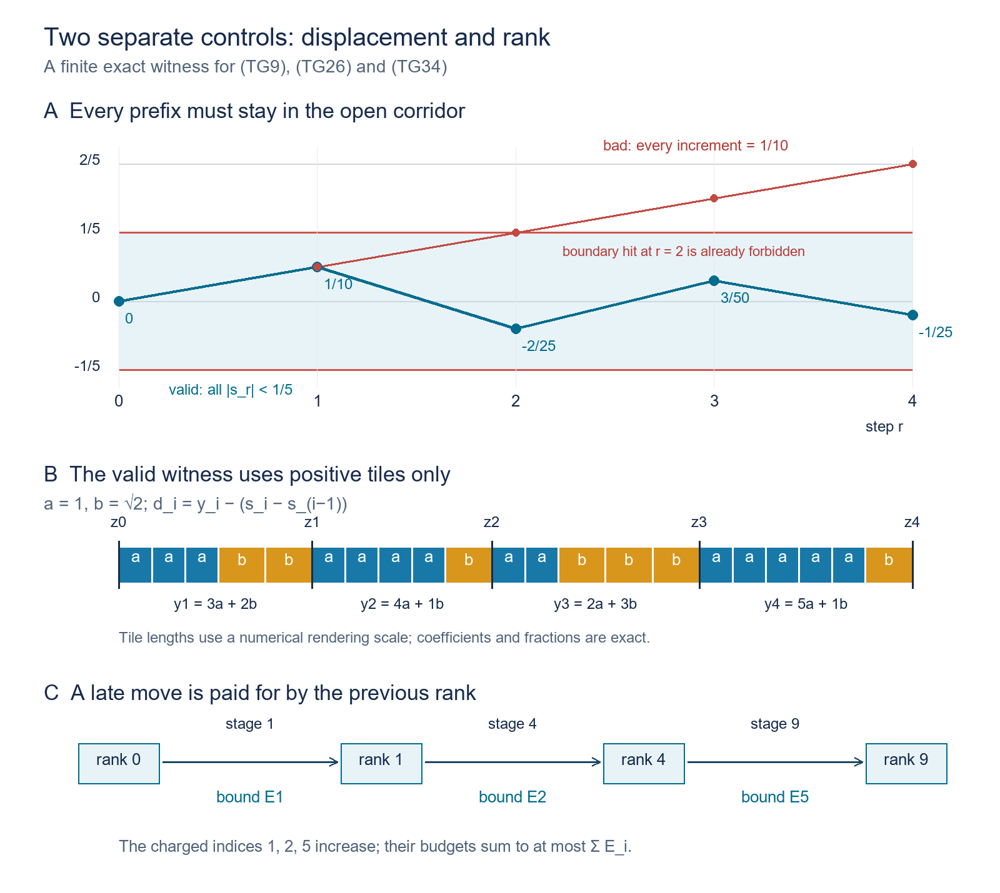

# Two prescribed gaps on every orbit of a Borel flow

*Original exposition, proofs, solved diagnostics and reproducible models: CC0-1.0 to the extent of rights held. Existing publications, software and fonts retain their own terms.*

**Complete local proof of the all-orbit two-gap assertion.** The theorem is due to Slutsky; this lesson supplies its gap conclusion in full, with the exact descriptive-set prerequisite identified below.

## 1. The exact goal

Let \(X\) be a standard Borel space and let \((t,x)\mapsto x+t\) be a jointly Borel action of \(\mathbb R\). Assume it is free: \(x+t=x\) implies \(t=0\). Fix \(a,b>0\) with \(a/b\notin\mathbb Q\). We construct a Borel set \(C\subset X\) such that, on every orbit, its time coordinates are a discrete set unbounded in both directions and every consecutive positive gap is \(a\) or \(b\). Its predecessor, successor and gap functions will be Borel. There is no measure and no exceptional set of orbits.

If \(X=\varnothing\), take \(C=\varnothing\); all assertions are then vacuous. For the construction on a nonempty space, write \(m=\min(a,b)\), \(B=\max(a,b)\), and
\[
 {\cal T}=\{pa+qb:p,q\in\mathbb Z_{\ge0},\ p+q>0\},
 \qquad \ell(pa+qb)=p+q,\quad f(pa+qb)=\frac p{p+q}.
 \tag{TG1}
\]
Rational independence makes the two coefficients unique. A member of \({\cal T}\) can be subdivided into positive \(a/b\) tiles. The group \(a\mathbb Z+b\mathbb Z\) is different: for \(a=1,b=\sqrt2\), the positive element \(b-a<m\) has no such subdivision. We use positive tile lengths only. Signed numbers appearing later are displacements of points, not tile lengths.

Two mechanisms enter the construction. On an orbit with arbitrarily large gaps in both directions, finite clusters can be joined by uniformly small shifts. For a general orbit we first create arbitrarily large regular blocks. The shifts in that construction are bounded by the point's previous block rank, so they remain summable even when the global stage at which a point moves is very late. The resulting invariant pieces are then handled separately.

The descriptive-set input used below is the actual [Borel injection and inversion theorem, PB Theorem 4.3(5)](../../NCG-FOLIATIONS/companions/polish-spaces-and-standard-borel-spaces.html#oa-fnd-pb-06). Its source proof constructs Borel images and inverse maps between standard Borel spaces. The stronger general assertion about countable-to-one images is expressly outside that provider's proved scope. Our uses of images are either injective or countable unions of explicitly injective pieces. The real-variable inputs are earlier programme proofs of [Lebesgue measure](../../OA-MOD/notes/analytic-programme/scalar-integration-programme.html#1-from-an-outer-measure-to-a-measure), [integration and monotone convergence](../../OA-MOD/notes/analytic-programme/scalar-integration-programme.html#2-integration-and-convergence-without-countability-assumptions), [the fundamental theorem of calculus](../../OA-MOD/notes/analytic-programme/scalar-integration-programme.html#6-one-variable-integral-identities), and [Tonelli–Fubini with its product construction](../../OA-MOD/notes/analytic-programme/scalar-product-integration.html#pi3-tonelli-fubini-and-exceptional-sections). Their measures here are on finite intervals or the sigma-finite real line; no measure on \(X\) is required.

## 2. Borel orbit coordinates, neighborhoods and finite graph selection

**Orbit time.** The map \(X\times\mathbb R\to X^2\), \((x,t)\mapsto(x,x+t)\), is Borel and injective by freeness. PB gives a Borel image \(E\) and a Borel inverse on that image. Thus the orbit relation is Borel and the signed displacement \(\tau(x,y)\), defined by \(x+\tau(x,y)=y\), is a Borel real function on \(E\). All comparisons of times in this lesson are made using this function; no origin is chosen simultaneously on all orbits.

Call a Borel set \(D\) \(r\)-separated if distinct points of \(D\) on one orbit have time distance at least \(r>0\). For an interval \(I\) of diameter less than \(r\), the map
\[
 D\times I\longrightarrow X,\qquad (d,t)\longmapsto d+t
 \tag{TG2}
\]
is injective: equality would put two points of \(D\) at a distance smaller than \(r\). Its image and inverse are Borel by PB. Partition any Borel \(S\subset\mathbb R\) into countably many such intervals. Then \(D+S\) is Borel as a countable union of these images. Moreover, for any bounded interval of possible times there is a finite Borel list of its \(D\)-hits: use finitely many half-open intervals of length \(r/2\), with singleton endpoints if necessary, and the inverses in (TG2). The list may contain repetitions at designated endpoints; deleting repetitions is a finite Borel operation.

It follows that a bi-infinite separated section has Borel successor and predecessor. Search the hit list in \([-j,j]\), \(j=1,2,\ldots\); the first list containing a positive hit has a least positive time, obtained by finitely many comparisons. It is the successor time. The negative version gives the predecessor. Saturating any Borel subset of the section is also Borel by (TG2).

**Finite-neighbor selection.** Suppose a Borel symmetric irreflexive graph on a standard Borel set \(Y\) has finite neighbor lists, given as countably many Borel partial maps. Choose a countable Borel separating family, and give each point its binary code. At each point take the least finite prefix that differs from every neighbor's prefix. Such a prefix exists because the list is finite. The pair consisting of its length and its binary word is a countable Borel coloring. Adjacent vertices cannot have the same color.

Enumerate the colors. Include all vertices of color zero, then include vertices of the next color having no neighbor already included, and continue. Every step and the countable union are Borel by the neighbor maps. The resulting set \(A\) is independent and maximal: a point not included was rejected because an earlier included neighbor existed. This proves the needed Borel maximal independent-set assertion, with no finite-coloring or compactness premise.

For a separated \(D\), the graph joining distinct orbit points at distance at most \(L\) has finite Borel neighbor lists by (TG2). Hence it has a Borel maximal independent set, separated by more than \(L\), and every point of \(D\) is within \(L\) of a selected point. For a bi-infinite section with successor \(S\), the graph joining \(S^i x\) for \(0<|i|\le h\) is another finite-neighbor graph. Its maximal independent set has successive index gaps between \(h+1\) and \(2h+1\). The lower bound is independence. For the upper bound, a gap of at least \(2h+2\) would contain a middle point with no selected vertex within \(h\) steps, contradicting maximality. In particular it is bi-infinite.

## 3. Construct the initial global section

We prove its existence for the given jointly Borel flow, rather than assuming a continuous action model.

A standard Borel space has a Polish model for its Borel structure; a countable basis in that model pulls back to a countable Borel family separating points. The model's topology is not assumed to make the action continuous. Let \(u_j:X\to\{0,1\}\), \(j\ge1\), be the indicators of that family. Use the explicit kernel \(\kappa(t)=(15/16)(1-t^2)^2\) for \(|t|\le1\), and zero otherwise. It is nonnegative and continuously differentiable: the polynomial and its derivative both vanish at the two endpoints. Its integral is \((15/16)(2-4/3+2/5)=1\), by polynomial integration. Put \(\kappa_n(t)=n\kappa(nt)\). Define
\[
 F_{j,n}(x)=\int_{\mathbb R}\kappa_n(t)u_j(x+t)\,dt.
 \tag{TG3}
\]
These functions are Borel. To check the parameter integral directly, the bounded product-measurable functions for which integration over a fixed finite interval is Borel contain rectangle indicators; they are closed under bounded monotone limits and differences. For completeness, the sets whose indicator has a Borel section integral form a Dynkin class: complements subtract from the fixed finite interval measure, and disjoint countable unions give limits of sums. It contains the rectangle pi-system. For a fixed rectangle, the class of sets whose intersection with it belongs to this Dynkin class is again a Dynkin class containing rectangles; repeat with a fixed member of the generated class. These two intersection tests make the generated Dynkin class closed under intersections, hence a sigma-algebra. It contains every product Borel set. Increasing simple-function approximation and positive/negative parts now give the assertion for all bounded Borel functions. Exhaustion handles the displayed compactly supported integrals.

On a fixed orbit set \(g_j(t)=u_j(x+t)\). The function \(r\mapsto F_{j,n}(x+r)\) is continuously differentiable:
\[
 \frac{d}{dr}F_{j,n}(x+r)
       =-\int \kappa_n'(t-r)g_j(t)\,dt.
 \tag{TG4}
\]
Indeed \(\kappa_n\) has a uniformly continuous compactly supported derivative. The fundamental theorem of calculus expresses each kernel difference quotient as the average of its derivative along a segment; it therefore converges uniformly to that derivative. On any compact set of \(r\), all these functions have one common compact support. Multiplying the uniform error by that interval's length and \(\|g_j\|_\infty\) proves (TG4) without interchanging an uncontrolled limit and integral. The same uniform-continuity estimate makes the derivative continuous along each orbit. The parameter-integral argument above makes it Borel in the starting point.

At least one of these continuously differentiable functions is nonconstant on each orbit. Here is the analytic detail. Convolution by \(\kappa_n\) converges to any bounded measurable \(g\) in \(L^1\) on compact intervals. Work on a slightly larger compact interval before restricting, so the small translated supports stay inside it. First prove continuity of translation in \(L^1\) for interval indicators by measuring their symmetric difference, then for finite interval step functions. Those are dense on compact intervals: a finite-measure measurable set is covered, up to arbitrarily small excess measure, by a countable union of open intervals from the outer-measure definition; a finite subunion misses arbitrarily little of it by continuity of measure, so interval step functions approximate its indicator, and simple functions approximate an integrable function. The translation bound extends the result by approximation. Splitting the kernel integral into small translations gives the asserted convolution convergence. This proof is local in the time variable and uses no measure on \(X\).

If every \(F_{j,n}(x+\cdot)\) were constant, this \(L^1_{\rm loc}\) convergence would make \(g_j\) constant almost everywhere. Indeed constant functions converging in \(L^1([-1,1])\) have convergent constants, and convergence on every compact interval has the same limit. Since \(g_j\) is binary, its constant is zero or one. Intersect these full-measure sets over \(j\). At any two different times in their intersection all \(u_j(x+t)\) would agree. Separation would make the two orbit points equal, contradicting freeness. Such an intersection has full Lebesgue measure and contains different times. Therefore some orbit function in (TG3) is nonconstant.

For each \(j,n\), rational \(q\), positive rational \(c,\epsilon\), and sign \(s\in\{-1,1\}\), consider the Borel set
\[
 D=\{x:F_{j,n}(x)=q,\quad
       sF'_{j,n}(x+r)\ge c\text{ for every }r\in[-\epsilon,\epsilon]\}.
 \tag{TG5}
\]
The derivative condition is a countable test at rational \(r\), equivalent to the whole-interval condition by continuity. Each \(D\) is \(2\epsilon\)-separated. If two of its points were at distance less than \(2\epsilon\), their two derivative intervals would cover the interval joining them; the derivative would have one strictly positive signed lower bound throughout. The fundamental theorem of calculus would give different values of \(F_{j,n}\), contradicting the common level \(q\).

These countably many partial sections meet every orbit. A nonconstant continuously differentiable orbit function has nonzero derivative somewhere, by the fundamental theorem of calculus. In a smaller interval its signed derivative is bounded below by a positive rational. Its image contains a rational level \(q\); choose a point on that level and shrink a rational \(\epsilon\) so that the whole derivative window remains in the interval.

Enumerate these \(D\)'s and all their rational translates as \(D_1,D_2,\ldots\). On each orbit their union is dense in time, since one original \(D\)-hit supplies all its rational translates. Given \(L>0\), construct an increasing Borel set \(C_i\), separated by more than \(L\). At step \(i\) discard the points of \(D_i\) within \(L\) of \(C_{i-1}\); the discarded set is Borel by (TG2) for the separated \(C_{i-1}\). On the remaining \(D_i\) take a maximal independent set for the distance-\(L\) graph and adjoin it to \(C_{i-1}\). Let \(C=\bigcup_i C_i\).

Every candidate point in \(\bigcup_iD_i\) is within \(L\) of \(C\): it was either near an old point or near a point chosen at its own step. Density of the candidates and separation of \(C\) now imply that every orbit point is within \(L\) of \(C\). For clarity, approximate its time by candidates, select the nearby \(C\)-points, and note that a bounded time interval contains only finitely many \(C\)-points. One of them repeats along a subsequence and has limiting distance at most \(L\). Thus \(C\) is bi-infinite and its gaps lie in \((L,2L]\). Its Borel successor and gap function were proved in Section 2.

We also obtain any desired narrow gap interval \([K,K+w]\), \(K,w>0\). Choose \(L\) so large that \(L\ge K^2/w+K\). For a gap \(d>L\), set \(N=\lfloor d/K\rfloor\). Then
\[
 K\le d/N<K+K/N\le K+w.
 \tag{TG6}
\]
Subdivide the gap into \(N\) equal pieces. This is Borel: \(N\) and all insertion times are Borel functions of the original gap, and the half-open gap domains give an injective map into \(X\). PB gives a Borel image. The resulting section is bi-infinite and has all gaps in \([K,K+w]\). This proves the global starting-section assertion, including all its measurability requirements.

## 4. Positive tile lengths with a reserve of both frequencies

We will use “mesh \(\delta\) on an open interval” to mean that every open subinterval of length \(\delta\) contained there meets the specified set. This interval definition fixes all constants below.

**Positive semigroup lemma.** If \(u,v>0\) and \(u/v\) is irrational, their nonnegative semigroup has mesh \(\delta\) on a sufficiently far positive half-line, for every \(\delta>0\).

To prove it, first see that finitely many nonnegative multiples of \(v\) have residues of arbitrarily small mesh modulo \(u\). Among \(0,\theta,\ldots,N\theta\), modulo one, with \(\theta=v/u\), two residues are within \(1/N\). Their difference gives a positive integer \(q\) with \(q\theta-p=h\), where \(0<|h|<1/N\). If \(h>0\), the residues of \(0,q\theta,\ldots,\lfloor1/h\rfloor q\theta\) run in steps \(h\); if \(h<0\), they run backward in steps \(|h|\). Either finite set leaves no circular gap larger than \(|h|\). Take \(N\) large enough for the desired mesh.

Choose finitely many \(q_i\ge0\) with such residues. For every sufficiently large target interval, choose the residue lying strictly inside its reduction modulo \(u\), then add the appropriate nonnegative integer multiple of \(u\) to \(q_iv\). The coefficient is nonnegative once the interval lies above \(\max_iq_iv+2u\). This produces a semigroup point in every target interval of length \(\delta\). Intervals wrapping around zero modulo \(u\) are handled by the same circular-gap assertion. No assertion about every individual positive group element is involved.

For every nonempty open \(J\subset(0,1)\), the set
\[
 {\cal T}_J=\{z\in{\cal T}:f(z)\in J\}
 \tag{TG7}
\]
has this same asymptotic mesh property. Choose large positive integers \(p,q\) such that both \(p/(p+q)\) and \((p+1)/(p+q+1)\) lie in \(J\). The tile lengths \(u=pa+qb\) and \(v=(p+1)a+qb\) are rationally independent: their coefficient determinant is nonzero. Every nonnegative sum of \(u,v\) has frequency in \(J\), because frequency is the tile-count weighted average of their two frequencies. Apply the positive semigroup lemma to \(u,v\).

We record the estimates used repeatedly:
\[
 \frac zB\le\ell(z)\le\frac zm,\qquad
 f(x+y)=\frac{\ell(x)f(x)+\ell(y)f(y)}{\ell(x)+\ell(y)},\qquad
 |f(x+y)-f(y)|\le\frac{B\,x}{m\,y}.
 \tag{TG8}
\]
The last estimate follows by bounding the weight of \(x\) in the average. In particular a bounded added tile word has uniformly small frequency effect when the other word is sufficiently long. These are estimates of counts in positive words, not signed coefficient manipulations.

## 5. Finite paths in a bounded displacement corridor

Let \(d_1,\ldots,d_n>0\), let \(E>0\), and let \(R_i\subset{\cal T}\cap(d_i-E,d_i+E)\) be finite allowed length sets. A compatible choice is a sequence \(y_i\in R_i\) with
\[
 s_r=\sum_{i=1}^r(y_i-d_i)\in(-E,E)
          \quad(1\le r\le n).
 \tag{TG9}
\]
The left endpoint stays fixed; the \(r\)-th point is shifted by \(s_r\). Let \(A(d,R;E)\) denote the set of terminal lengths \(\sum_i y_i\) of all such choices. Each member has a finite witness. The prefix condition is essential: choosing each length close to its own gap without it may accumulate an arbitrarily large displacement.

We first treat constant \(d_i=d\), \(R_i=R\), with \(d\in R\). If a multiset of choices from \(R\) has total error in \((-E,E)\), its elements can be ordered so that every prefix error remains there. Choose an increment of the opposite sign to the current error whenever one remains. If no such increment remains, all remaining increments have the same sign, so the intervening partial sums stay between the current sum and the final sum. In the first case two numbers of opposite signs, each of magnitude less than \(E\), have a sum of magnitude less than \(E\). Induction proves the assertion. Consequently compatible constant-gap blocks can be combined whenever their total error lies in this corridor; zero-error choices \(d\) can pad the witness to any larger number of positions.

**Two errors lemma.** Suppose compatible constant-gap blocks with the same number \(h\) of positions have terminal errors \(u<0<v\). Put \(c=\gcd(|u|,v)\), meaning their positive real lattice generator when their ratio is rational and zero otherwise. For every fixed \(\delta>c\), after a finite number of positions every open corridor interval of length \(\delta\) contains a compatible terminal error. If \(c=0\), any positive target mesh is possible. Moreover when \(c>0\), every \(kc\in(-E,E)\) is eventually attainable, including \(c,-c\).

Indeed the errors \(pu+qv\), \(p,q\ge0\), are dense in \(\mathbb R\) in the irrational case. Apply the residue argument of Section 4 to \(v/|u|\), using a finite string of sufficiently late positive multiples of \(v\); subtracting the required multiple of \(|u|\) then uses a nonnegative coefficient, uniformly for targets in the bounded corridor. In the rational case write \(|u|=Ac,v=Qc\) with coprime positive integers \(A,Q\). Integer Euclidean division and back-substitution give every integer as \(qQ-pA\); adding the kernel pair \((p,q)=(Q,A)\) sufficiently often makes both \(p,q\) nonnegative. Thus every \(kc\) is representable. Choose a finite mesh witness in the corridor: first take a finite grid of spacing less than the desired mesh divided by three, including points within that spacing of both ends; then approximate its points closely enough by the attainable errors. For the lattice case use the finitely many lattice points in the corridor. Thus every open subinterval of the prescribed length is hit, including those near either end. Each of its finitely many sums is realized by combining the two blocks and applying the preceding reordering fact to all individual choices. Take the largest witness size and pad with \(d\). This proves every stated uniform-in-large-size conclusion.

The next section proves the needed abundance of errors and removes a possible lattice obstruction. It will then extend this finite argument to nonconstant real gaps.

## 6. Frequency control and arbitrarily fine terminal errors

Fix \(\rho=1/2\). A set of allowed lengths has *two-sided frequency freedom at width \(\eta\)* if its low-frequency part \(f\le\rho-\eta\) and high-frequency part \(f\ge\rho+\eta\) have the stated spatial mesh. We use these parts to prevent a persistent arithmetic lattice obstruction. This is a finite construction device, not an additional assertion about the frequency of the final section.

**Frequency steering lemma.** Suppose \(r>0\), \(2r+m\le d_i\le D\), and each of the two frequency parts of \(R_i\subset{\cal T}\cap(d_i-r,d_i+r)\) has mesh \(r\) on that interval. For every \(\zeta>0\) and every \(\gamma\in(\rho-\eta,\rho+\eta)\), a sufficiently long sequence, uniformly in the \(d_i,R_i,\gamma\), admits a compatible choice with
\[
 \left|f\left(\sum_i y_i\right)-\gamma\right|<\zeta .
 \tag{TG10}
\]

Here is the full construction. After the first choice, select a high-frequency next piece if the frequency so far is at most \(\gamma\), and a low-frequency piece otherwise. Independently select its increment \(y_i-d_i\) with sign opposite to the current spatial error. Each frequency part meets both the left and right half of \((d_i-r,d_i+r)\), because those halves are open intervals of length \(r\). The choices therefore exist and keep every spatial prefix error in \((-r,r)\).

Every chosen piece is longer than \(m\) and shorter than \(D+r\). After \(k\) choices the total tile count is at least \(km/B\), and the next piece has at most \((D+r)/m\) tiles. Hence its change of total frequency is at most
\[
 \frac{B(D+r)}{k m^2}.
 \tag{TG11}
\]
Choose \(k_0\) so large that this is less than \(\zeta\) for \(k\ge k_0\). Once the frequency is \(\zeta\)-close to \(\gamma\), it stays so: if it does not cross \(\gamma\), the chosen side moves it toward \(\gamma\); if it crosses, (TG11) bounds the overshoot by \(\zeta\). If it stays below \(\gamma\) after \(k_0\), all subsequent pieces have frequency at least \(\rho+\eta>\gamma\). Their combined frequency also has that bound. The first \(k_0\) pieces have at most \(k_0(D+r)/m\) tiles, while a tail of \(h\) pieces has at least \(hm/B\) tiles. Once
\[
 \frac{B k_0(D+r)}{h m^2}<\zeta,
 \tag{TG12}
\]
the complete frequency differs from the tail's by less than \(\zeta\), so it is either already above \(\gamma\) or \(\zeta\)-close from below. The upper case is identical with low pieces. This proves (TG10), its uniform bound on the number of positions, and the prefix displacement condition.

**Constant-center refinement lemma.** Fix a tileable \(d\), \(E>0\), \(\delta>0\), and \(0<\eta<1/2\). Suppose \(d\in R\subset{\cal T}\cap(d-E,d+E)\), and its two frequency parts have mesh \(E\) there. Also assume \(d\ge2E+m\). There is a bound, uniform over these finitely many possible \(R\)'s, such that all longer constant-center corridors have terminal mesh \(\delta\) on \((nd-E,nd+E)\).

The frequency steering lemma first makes the number of terminal lengths arbitrarily large. Choose any prescribed number of distinct targets strictly between \(\rho-\eta\) and \(\rho+\eta\), with disjoint sufficiently small error intervals. Their witnesses from (TG10) have different frequencies and thus different lengths, by the uniqueness of coefficients in (TG1).

Take more lengths than the number of cells in a partition of \((-E,0)\cup(0,E)\) into intervals of diameter less than \(\delta/2\), plus one for the possible zero error. Two distinct errors \(u_1,u_2\) lie in the same signed cell, so \(|u_1-u_2|<\delta/2\). There is also an attainable error of the opposite sign: choose one allowed piece on that side of \(d\) and pad it with \(d\). Apply the two errors lemma to \(u_1\) and this error. If their common lattice size \(c\) is zero or less than \(\delta\), it already gives the desired refinement. Otherwise it gives both \(c,-c\). Pad all witnesses to one common size; \(u_2\) remains attainable. Combine it with the opposite-signed one of \(c,-c\).

The new common lattice size \(c'\), if nonzero, divides both \(u_1\) and \(u_2\), since \(u_1\) is an integer multiple of \(c\). Therefore
\[
 0<c'\le|u_1-u_2|<\delta/2.
 \tag{TG13}
\]
If their ratio is irrational the new lattice size is zero. Either case supplies mesh \(\delta\) by the two errors lemma. All the lengths, error pairs and \(R\)'s used at the fixed parameters come from finite sets, so a maximum of the finitely many witness bounds gives the asserted uniformity. This proves the refinement by integer Euclidean division, residue nets and compatible positive words.

## 7. Refinement for varying centers, with a margin for composition

We formulate the finite result with explicit margins. Fix a frequency width \(0<\eta<1/2\); throughout both refinement conclusions, the low and high parts mean \(f\le\rho-\eta\) and \(f\ge\rho+\eta\). Assume
\[
 0<E\le1,\quad 2E+m\le d_i\le D,\quad
 R_i\subset{\cal T}\cap(d_i-E,d_i+E),
 \tag{TG14}
\]
and the low and high frequency parts have mesh \(E/12\) on that whole open interval.

**Spatial refinement.** For any \(0<\delta<E/24\), there is a uniform \(M\) such that whenever \(n\ge M\), terminal lengths have mesh \(\delta\) on
\[
 \left(\sum_i d_i-\frac{2E}{3},\ \sum_i d_i+\frac{2E}{3}\right),
 \tag{TG15}
\]
with witnesses whose spatial prefix errors are smaller than \(5E/6\).

Choose \(c_i\in R_i\) with each \(c_i-d_i\) of sign opposite to the current cumulative error and magnitude less than \(E/12\). The input mesh supplies such a point in the open interval immediately to either side of \(d_i\). Thus
\[
 |c_i-d_i|<E/12,\qquad
 \left|\sum_{i\le j}(c_i-d_i)\right|<E/12.
 \tag{TG16}
\]
Put \(r=3E/4\) and \(R_i^*=R_i\cap(c_i-r,c_i+r)\). This smaller interval lies inside the original interval. Both frequency parts still have mesh \(E/12\) there and hence mesh \(r\); \(c_i\in R_i^*\). Also \(c_i\ge2r+m\). There are only finitely many possible pairs \((c_i,R_i^*)\), because tileable lengths in the bounded range \([0,D+2]\) form a finite set. Once \(n\) is large enough, one such pair occurs often enough for the constant-center refinement lemma. Use its compatible choices at those positions and leave all other positions equal to \(c_i\). Their errors have prefix bound \(r\), also in the full original order, because the nonselected positions contribute zero error.

Returning from \(c_i\) to \(d_i\) adds less than \(E/12\) to every prefix, proving the \(5E/6\) bound. It also shifts the terminal center by less than \(E/12\). The radius-\(r\) interval about \(\sum c_i\) contains (TG15), since \(2E/3+E/12=3E/4\). This proves spatial refinement. The number of possible pairs and the maximum of their constant-center bounds depend only on \(D,E,\delta,\eta,a,b\), so the conclusion is uniform over the original real centers.

**Two frequency reserves.** Fix \(0<\nu'<\nu<\eta\). At the same input hypotheses there is a uniform \(M'\) such that, for all \(n\ge M'\), the compatible terminal lengths in each of the two bands
\[
 f\in[\rho-\nu,\rho-\nu']
       \quad\hbox{and}\quad
 f\in[\rho+\nu',\rho+\nu]
 \tag{TG17}
\]
have mesh \(\delta\) on the smaller interval of radius \(E/2\) about \(\sum d_i\).

Split the sequence into a fixed sufficiently long prefix and a much longer suffix. Apply spatial refinement to the prefix, retaining its complete mesh witness set in (TG15). On the suffix restrict each \(R_i\) to \((d_i-E/12,d_i+E/12)\). Each frequency part has mesh \(E/12\) there, so the frequency steering lemma applies with spatial radius \(E/12\). For the low output steer toward \(\gamma_-=\rho-(\nu+\nu')/2\), and for the high output toward \(\gamma_+=\rho+(\nu+\nu')/2\), with frequency error less than \(\zeta=(\nu-\nu')/8\).

The suffix has all prefix errors and its endpoint error less than \(E/12\). Concatenating it with any retained prefix witness therefore has spatial prefix bound \(11E/12<E\). The prefix has a uniform length bound, say \(P=M(D+1)+1\), while a suffix of \(h\) pieces has length at least \(hm\). Choose \(h\) so large that \(BP/(h m^2)<\zeta\). By (TG8) adding the prefix changes frequency by less than \(\zeta\), putting all these totals in the appropriate band (TG17).

Finally, adding the fixed suffix endpoint error shifts the prefix mesh by less than \(E/12\). Every interval in the radius-\(E/2\) target lies inside the shifted radius-\(2E/3\) interval, because \(E/2+E/12<2E/3\). The mesh \(\delta\) thus persists. This proves the frequency reserves with exact compatible witnesses for every output.

All allowed sets are finite subsets of the countable alphabet \({\cal T}\). For a finite list of real gaps varying in a Borel way, membership, prefix bounds and frequency bounds are Borel tests of finitely many real expressions. Enumerate the finite words in this alphabet. Choosing the first successful witness for an output is a Borel operation. This observation will also apply recursively when a length choice stores an earlier witness for moving lower-rank blocks.

## 8. Build arbitrarily large regular blocks on all orbits

The following construction produces an intermediate section \(C_\infty\), not yet necessarily a fully tiled orbit. Its exact output is: each orbit contains regular blocks of unbounded size. Sections 9–11 will complete every residual orbit.

Choose constants
\[
 E_n=\frac{\min(m,1)}{100}\,16^{-(n-1)}\quad(n\ge1),\qquad
 S=\sum_{n\ge1}E_n< m/50,\qquad
 \eta_n=2^{-n-2}.
 \tag{TG18}
\]
Use Section 4 to choose \(K>4B+4\) so large that both tile sets with frequencies in
\([\rho-\eta_1,\rho-\eta_2]\) and
\([\rho+\eta_2,\rho+\eta_1]\) have mesh \(E_1/100\) on \([K-2,\infty)\). Section 3 gives a Borel section \(C_0\) with gaps in \([K+1,K+2]\). Its points are the initial rank-zero blocks. Set \(L_0=0\), \(D_0=K+2\), and let \(D^{(0)}=C_0\).

We keep the old tiles when making a larger block. A current block is a finite interval of section points whose adjacent gaps already are \(a/b\); a rank-zero block is one point. We maintain the following finite-stage displacement invariant simultaneously with the witness bounds (TG20). When rank \(n\) is formed, a moved block of previous rank \(j<n-1\) uses the already stored bound \(W_j^{n-1}\le(2/3)E_{j+1}\); the right rank-\((n-1)\) block moves by less than \(E_n/8\). Every moved point is promoted to rank \(n\). Thus each nonzero move is bounded by \(E_{j+1}\), charged to its previous rank, and the charged indices strictly increase. At stage zero the history is empty; induction therefore bounds the sum along every finite history by \(S\), before the next stage is constructed. New points start with their birth rank and obey the same rule thereafter. Every remaining untiled gap corresponds to an original adjacent pair in \(C_0\), so this finite-history bound keeps it larger than \(K+1-2S>B\). Consequently it cannot accidentally become a regular gap. No limit convergence is assumed in this induction, and block ranks never decrease.

Here is the induction data after stage \(n\). A Borel separated bi-infinite section \(C_n\) is partitioned into finite regular blocks of ranks \(0,\ldots,n\). Each rank-\(j\) block has length at most \(L_j\), and a rank-\(j\) block contains at least \(2^j\) original \(C_0\)-points. The set \(D^{(n)}\) consists of the left endpoints of rank-\(n\) blocks and is bi-infinite, with consecutive distances at most \(D_n\). Every orbit contains such blocks.

For adjacent \(A,C\in D^{(n)}\) we retain a finite allowed set
\[
 R_n(A,C)\subset {\cal T}\cap
   \big(\tau(A,C)-E_{n+1},\tau(A,C)+E_{n+1}\big).
 \tag{TG19}
\]
Its low part in \([\rho-\eta_{n+1},\rho-\eta_{n+2}]\) and high part in \([\rho+\eta_{n+2},\rho+\eta_{n+1}]\) each have mesh \(E_{n+1}/100\) on this window. Each allowed length has a stored witness with these properties:

- It keeps the whole block starting at \(A\) fixed, translates the whole block starting at \(C\), joins all intervening blocks and fills all their remaining gaps with positive \(a/b\) tiles. The distance between the two left endpoints becomes the allowed length.
- Each intervening rank-\(j\) block, \(j<n\), is translated as a whole, by less than
  \[
    W_j^n=\frac58\sum_{i=j+1}^{n}E_i
             \le\frac23E_{j+1}.
    \tag{TG20}
  \]
  Existing tile intervals are retained exactly. The terminal rank-\(n\) block is translated by the endpoint error, of magnitude less than \(E_{n+1}\).
- The choices and witnesses are Borel functions of the adjacent pair. A translation of the starting position translates the witness positions; it never changes the retained tiles or chosen lengths.

For \(n=0\), (TG19) is the initial gap's tile set restricted to the two frequency bands. Its witness just moves the right point by the length error and tiles the gap. There are no intervening lower-rank blocks, so (TG20) has no condition at this level.

**Create rank \(n\), assuming the data at rank \(n-1\).** Before selecting pairs, define
\[
 L_n=D_{n-1}+L_{n-1}+E_n/8 .
 \tag{TG21}
\]
Choose a large integer \(N_n\), with precise requirements below. On the successor graph of \(D^{(n-1)}\), use the maximal independent-set construction with index radius \(N_n+3\). Its selected points have index gaps between \(N_n+4\) and \(2N_n+7\). Pair each selected point with its immediate successor in \(D^{(n-1)}\). These pairs are disjoint; between the right point of one pair and the left point of the next there are at least \(N_n+3\) and at most \(2N_n+6\) old representative steps.

For a pair \(A,B\), choose a member of \(R_{n-1}(A,B)\) whose error is smaller than \(E_n/8\), using its fine mesh. Apply its witness. The left block stays fixed, the right block moves by less than \(E_n/8\), and the finite intervening region is tiled while preserving all existing tiles. The resulting interval, including the entire right block, is assigned rank \(n\). Its length is at most (TG21). All old blocks outside these disjoint regions stay where they are. New insertion points belong to the new block. Each moved old point is thus promoted to rank \(n\).

Let \(D^{(n)}\) be the selected left points. These points did not move at this stage. Hence their consecutive distances are at most
\[
 D_n=(2N_n+7)D_{n-1}.
 \tag{TG22}
\]
The new blocks contain the two paired rank-\((n-1)\) blocks, proving the doubling assertion. The left points remain bi-infinite.

**Construct the new allowed sets; this is also where \(N_n\) is fixed.** Consider neighboring new blocks with left endpoints \(A,C\). Let \(B\) be the left endpoint of the *last* old rank-\((n-1)\) block in the new block at \(A\); it was the right member of the selected pair. The segment from \(A\) to \(B\) is now a fixed positive tile word of length \(p=\tau(A,B)\le L_n\).

The chain of old rank-\((n-1)\) representatives from \(B\) to \(C\) has at least \(N_n+3\) steps. Its intermediate representatives were not moved at this stage. Only \(B\) was moved, by less than \(E_n/8\); \(C\), being a selected left endpoint, stayed fixed. Thus only the first geometric gap differs from its pre-stage value, by less than \(E_n/8\). The old allowed sets and their stored witnesses are still available. For the first one translate its witness from the old \(B\) to the current \(B\). Restrict each old allowed length set to the radius-\(E_n/2\) window about the current corresponding gap.

These restricted windows lie inside the old radius-\(E_n\) windows, since \(E_n/2+E_n/8<E_n\). Their two frequency parts retain mesh \(E_n/100\), and therefore mesh \(E_n/24\). They meet the hypotheses of Section 7 with
\[
 E=E_n/2,\quad D=D_{n-1}+1,\quad
 \eta=\eta_{n+1},\quad
 \delta=E_{n+1}/200.
 \tag{TG23}
\]
The lower length bound follows from the untouched original gap margin \(K+1-2S\); representative distances include such a gap and are therefore at least \(2E+m\). Also \(E\le1\) and \(\delta<E/24\).

Choose
\[
 \eta_{n+2}<\nu'_n<\nu_n<\eta_{n+1},\qquad
 c_n=\min(\eta_{n+1}-\nu_n,\nu'_n-\eta_{n+2})>0.
 \tag{TG24}
\]
For example, take the two trisection points of the interval between these two \(\eta\)'s. Require \(N_n\) to exceed the uniform bound in the two-reserves lemma at (TG23)–(TG24), and also require
\[
 \frac{B L_n}{N_n m^2}<c_n/2 .
 \tag{TG25}
\]
There is no circular choice: \(L_n\) in (TG21) depends on \(D_{n-1},L_{n-1},E_n\), all already fixed; it does not depend on \(N_n\).

Section 7 now supplies fine terminal lengths for the chain \(B\) to \(C\), in both bands with endpoints \(\nu'_n,\nu_n\), and with every representative prefix displacement smaller than \(E_n/2\). Its fine mesh covers the radius-\(E_n/4\) window about the current chain length. Add the fixed positive word \(p\). Its frequency effect is smaller than \(c_n/2\) by (TG8) and (TG25), because the chain length is at least \(N_nm\). The two resulting frequency parts therefore lie in the required outer bands with endpoints \(\eta_{n+1},\eta_{n+2}\).

Restrict these sums to the radius-\(E_{n+1}\) window about \(\tau(A,C)\). This window is inside the radius-\(E_n/4\) range, since \(E_{n+1}=E_n/16\). The retained parts have mesh \(E_{n+1}/200\), hence mesh \(E_{n+1}/100\), on the entire smaller window. Use them as \(R_n(A,C)\).

We check the stored-witness bound rather than just its terminal error. Compose the old witnesses in the order of the old representatives, with the prefix displacements supplied by Section 7. Each old representative is moved by less than \(E_n/2\); translating the first witness from the old \(B\) adds at most \(E_n/8\). An intervening rank-\(j\) block with \(j<n-1\) consequently incurs at most its previous bound \(W_j^{n-1}\) plus \(5E_n/8\). This is exactly \(W_j^n\). An unselected rank-\((n-1)\) block incurs less than \(E_n/2\), bounded by \(W_{n-1}^n=5E_n/8\). The whole first new block stays fixed: its prefix from \(A\) to \(B\) is retained, and the old witness fixes the entire last old block at \(B\). Extend the final representative's translation to its entire new block at \(C\). The chosen sum gives its required terminal error.

No previously tiled gap is changed by this composition, because each old component is translated rigidly and each old witness preserves its internal tiles. Intervals filled at different old representative steps meet at their common, consistently shifted representative; they do not overlap except at endpoints. This proves every item of (TG19)–(TG20) and completes the induction.

**Why all operations are Borel.** Representatives, ranks, immediate neighbors and endpoints are Borel by the finite hit lists from Section 2. Every region between the bounded-gap representatives is finite, with a uniform bound on its number of separated section points. The selected pairs are Borel by finite graph coloring. Each allowed output is a member of the fixed countable alphabet \({\cal T}\), tested by finite arithmetic and the stored finite witness data. At a new stage, finite words of these choices and their recursively stored witnesses can be enumerated; the first one satisfying the indicated prefix, frequency and endpoint tests is Borel. Section 7 proves that the required witnesses exist. No choice of one representative from every entire orbit is being made.

The shifted old section is the injective Borel image \(x\mapsto x+h_n(x)\). Along an orbit this map preserves order: components keep their internal gaps, and the unfilled original gaps retain the large positive margin. New points are inserted by a finite tile word inside disjoint open gaps. Their domain is a Borel subset of the pair set times a countable finite-word index, and the insertion map is injective after omitting duplicate endpoints. PB makes both images Borel. The new section has minimum gap at least \(m\), and unfilled gaps remain original gaps with bounded endpoint shifts. Thus its neighbor operations, block boundaries, rank functions and all the next induction data satisfy the same Borel requirements.

## 9. The rank charge makes the limit exist

At a stage creating rank \(n\), a moved point of prior rank \(j<n-1\) incurs a displacement smaller than \(W_j^{n-1}\le(2/3)E_{j+1}\), and a point in the right rank-\((n-1)\) block incurs less than \(E_n/8\). Every moved point becomes rank \(n\). Thus each nonzero jump is bounded by \(E_{j+1}\), charged to its previous rank \(j\), and the charged indices strictly increase along the history of one point. A point born among the new tiles starts with that stage's rank. For every finite history, and then for every infinite history,
\[
 \sum|\hbox{jumps of one point}|
       \le\sum_{i\ge1}E_i=S.
 \tag{TG26}
\]
This establishes the displacement bound used in the finite induction: at no earlier finite stage was convergence assumed. It also proves the unfilled original-gap margin \(K+1-2S>B\). Two adjacent tiles of a block are always moved by the same displacement, so their precise lengths are never disturbed.

Let \(\iota_{n,n+1}:C_n\to C_{n+1}\) be the Borel embedding of old points, and let \(\iota_{n,k}\) be its iterates. Write \(h_{k+1}(x)\) for the actual shift at stage \(k+1\). Define
\[
 H_n(x)=\sum_{k=n}^{\infty}
              h_{k+1}(\iota_{n,k}x),\qquad
 J_n(x)=x+H_n(x),\qquad
 C_\infty=\bigcup_{n\ge0}J_n(C_n).
 \tag{TG27}
\]
The sums converge absolutely by the rank charge. Their partial sums are Borel real functions and their limits are Borel. Each \(J_n\) is injective. On one orbit the old points have separation at least \(m\), and each has future displacement at most \(S\), so two distinct limits remain at distance at least \(m-2S>m/2\), with their original order. Different orbits cannot collapse. PB therefore gives a Borel image for every \(J_n\). The identity
\[
 H_n(x)=h_{n+1}(x)+H_{n+1}(\iota_{n,n+1}x)
 \tag{TG28}
\]
shows that these images increase, so \(C_\infty\) is Borel and \(m/2\)-separated. It contains \(J_0(C_0)\), which is bi-infinite on every orbit, with gap bound \(D_0+2S\). Hence \(C_\infty\) is also bi-infinite, with that upper gap bound.

If two points were joined by a tile at some stage, their histories have the same future shifts, because a block is never split. No later insertion is made inside that tile. Its limit is therefore an adjacent gap of exactly the same length. Conversely take adjacent points of \(C_\infty\). Both belong to \(J_n(C_n)\) for some \(n\). Their preimages are adjacent there, since order and all old points are retained. If their gap was not tiled then, it was an unfilled original gap. If it were tiled later, a limit of an inserted interior point would lie strictly between them, by uniform separation and order preservation. Therefore an untiled final gap stays untiled throughout and has length greater than \(B\). We have proved that the regular-chain relation on \(C_\infty\) is exactly the union of the retained finite-stage regular-chain relations.

Each orbit contains the image of a rank-\(n\) block for every \(n\), containing at least \(2^n\) original points and therefore at least \(2^n\) section points. These remain joined by regular tiles. Thus the final regular-chain classes have unbounded size on every orbit. A final class may be finite, a half-line, or the whole bi-infinite section orbit. These possibilities will determine the final completion, rather than being dismissed as exceptional orbits.

## 10. A Borel decomposition that loses no orbit

Let \(S_\infty\) be the Borel successor on \(C_\infty\), and let \(g\) be its Borel gap. Put \(r(x)\) for the predicate \(g(x)\in\{a,b\}\). The equivalence classes formed by regular consecutive gaps are intervals in the copy of \(\mathbb Z\) given by the successor. The following tests involve only countably many iterates, so every set they define is Borel.

**Already regular.** On the orbits where \(r(S_\infty^k x)\) holds for every \(k\in\mathbb Z\), \(C_\infty\) is already the desired section. Its saturation is Borel by Section 2.

**An infinite class with an endpoint.** Off the preceding piece, an infinite regular class is a half-line. There is at most one left-infinite class and at most one right-infinite class on one ordered orbit. Their finite endpoint sets are
\[
 \begin{aligned}
 T_L&=\{x:\neg r(x),\
                  r(S_\infty^{-j}x)\text{ for every }j\ge1\},\\
 T_R&=\{x:\neg r(S_\infty^{-1}x),\
                  r(S_\infty^j x)\text{ for every }j\ge0\}.
 \end{aligned}
 \tag{TG29}
\]
Each set has at most one point on each orbit. Its saturation and the origin map on that saturation are Borel, by applying PB to the injective map \(T_L\times\mathbb R\to X\) or \(T_R\times\mathbb R\to X\). On the union of these saturations take the \(T_L\)-origin if available, and the \(T_R\)-origin otherwise. This is a Borel transversal, with exactly one origin on every orbit in this piece.

Given any such transversal \(T\), use the Borel section
\[
 \{t+k(a+b):t\in T,k\in\mathbb Z\}
 \ \cup\
 \{t+k(a+b)+a:t\in T,k\in\mathbb Z\}.
 \tag{TG30}
\]
Its gaps alternate \(a,b\) in both directions. The map from \(T\times\mathbb Z\times\{0,1\}\) giving these points is injective, so its image is Borel. This treats every endpoint orbit, without substituting a constant roof for the general theorem.

**All regular classes finite.** The remaining invariant Borel part has only finite regular classes. Let \(D\subset C_\infty\) contain their first and last points. These are exactly the points with \(\neg r(S_\infty^{-1}x)\) or \(\neg r(x)\), so \(D\) is Borel and separated. It is bi-infinite: finite intervals partition a bi-infinite successor orbit, and their endpoints extend in both directions.

On every such orbit the \(D\)-gaps are unbounded. The classes of \(C_\infty\) have unbounded size by Section 9. A finite regular class with \(q\) points has a gap of length at least \((q-1)m\) between its first and last endpoint, and no other endpoint strictly inside it. Thus large regular classes give large \(D\)-gaps. This is an all-orbit conclusion.

Let \(S_D\) and \(g_D\) be the Borel successor and gap on \(D\). For each positive integer \(q\), consider
\[
 \begin{aligned}
 U_q&=\{x:g_D(x)\ge q,\
        g_D(S_D^{-j}x)<q\text{ for every }j\ge1\},\\
 V_q&=\{x:g_D(x)\ge q,\
        g_D(S_D^j x)<q\text{ for every }j\ge1\}.
 \end{aligned}
 \tag{TG31}
\]
These select respectively the first or last \(q\)-large gap, when it exists, and each contains at most one point per orbit. Their saturations are Borel injective images as above. Disjointify by the least \(q\) for which either saturation occurs, and prefer \(U_q\) when both occur. The resulting Borel origin set is a transversal for the union of these invariant pieces. Treat it with (TG30).

Every orbit not in this union has \(D\)-gaps unbounded in both directions. For each \(q\) the large-gap index set is nonempty, since gaps are unbounded somewhere. A nonempty subset of \(\mathbb Z\) bounded below has a first element, and one bounded above has a last element. Their absence implies that the \(q\)-large gaps occur arbitrarily far in each direction. Call this remaining invariant Borel part \(X_{\rm sp}\). Its section \(D\) is sparse in the precise sense just proved. Section 11 constructs the required section there.

This decomposition is exhaustive and Borel. Each piece is invariant under all real times. It was obtained from pointwise successor tests and injective saturations, not from a measure, generic point or an orbitwise choice without measurable control.

## 11. Tile every sparse orbit

Suppose now that a free Borel flow has a separated bi-infinite section \(D\) with gaps unbounded in both directions on every orbit. We give a complete construction for this hypothesis.

Choose positive numbers \(\epsilon_n\) with \(\sum_n\epsilon_n<m/20\). Choose increasing thresholds \(Q_0<Q_1<\cdots\), tending to infinity, so large that \({\cal T}\) has mesh \(\epsilon_{n+1}\) on \([Q_n-2m-2,\infty)\); also require \(Q_0>4B+4\). This is possible by the positive semigroup lemma. Thin \(D\) to a section \(D_0\) with all gaps greater than \(Q_0+1\), using the distance-\((Q_0+1)\) maximal independent set from Section 2. It is still bi-infinite, because its selected points stay within a bounded time distance of the old section. It is still sparse: an arbitrarily large old empty interval cannot acquire any interior point when a subsection is taken, and its selected bounding points occur on the appropriate outer sides. Its gap function \(d_0\) and successor \(S_0\) are Borel.

Define finite interval relations \(F_n\) on the *original* \(D_0\) by connecting consecutive points precisely when their original gap is at most \(Q_n\). They are Borel finite relations: gaps greater than \(Q_n\) occur arbitrarily far in both directions, so every component is a finite interval. \(F_0\) is the singleton relation. The relations increase, and their union is the entire section orbit relation; any finite interval has a finite largest original gap, below some \(Q_n\).

At stage \(n\ge1\), retain the tiled blocks corresponding to \(F_{n-1}\)-classes, and join them inside each finite \(F_n\)-class. Start by leaving its leftmost old block fixed. Move the next block rigidly by a shift smaller than \(\epsilon_n\) so that the gap from the already moved previous block becomes tileable, then insert a positive \(a/b\) subdivision. Continue through the finite class.

We verify that errors do not accumulate in this pass. Suppose the current pre-stage gap is \(d\), and the previous block has shift \(s\in(-\epsilon_n,\epsilon_n)\). Choose
\[
 y\in{\cal T}\cap(d-s-\epsilon_n,d-s+\epsilon_n).
 \qquad s_{\rm next}=s+y-d.
 \tag{TG32}
\]
Then \(|s_{\rm next}|<\epsilon_n\), independently of how many previous blocks were processed. This interval is in the far positive range where the required mesh holds. Indeed this edge had original length greater than \(Q_{n-1}\), as it lay between two \(F_{n-1}\)-classes, and earlier cumulative endpoint shifts change it by at most \(2\sum_i\epsilon_i<m/10\). Subtracting the current \(s\) and the window radius changes this lower bound by less than \(m/10\), because both are at most \(\sum_i\epsilon_i<m/20\). Therefore the whole target interval remains above \(Q_{n-1}-m/5>Q_{n-1}-2m-2\). An interval of length \(2\epsilon_n\) contains a tileable point because the mesh is \(\epsilon_n\). The length is positive and large. Thus (TG32) applies at every join. The lower bound on all untouched edges also excludes accidental regular gaps across distinct \(F_n\)-classes.

For clarity, the finite classes here need not have a uniform size or time diameter. Their left endpoints are the Borel points \(x\in D_0\) with \(d_0(S_0^{-1}x)>Q_n\). On the Borel subset of these endpoints where the first later boundary occurs after exactly \(h\) successor steps, the entire class is the explicit list \(x,S_0x,\ldots,S_0^{h-1}x\). These subsets, for \(h\ge1\), partition the endpoint set. The same finite successor searches locate the constituent \(F_{n-1}\)-classes. Consequently each finite pass is a Borel operation on one such subset, and the countable union of the resulting graphs is Borel. This supplies the enumeration without a countable-to-one image theorem.

Inside a class there are finitely many choices and points. Choose the first allowed tile length in the fixed enumeration of \({\cal T}\), and tile with \(p\) \(a\)-pieces followed by \(q\) \(b\)-pieces when its unique coefficients are \(p,q\). The ordered lists just described, their shifts and insertions are Borel by finite arithmetic. PB makes the injected shifted and inserted sections Borel. Existing tiles are preserved because each old block moves rigidly. Each original \(D_0\)-point belongs to one such block; new points inherit the surrounding block.

Every point's later shifts are bounded by the corresponding \(\epsilon_n\), with summable total. Form the limit as in (TG27)–(TG28). Order, a fixed positive separation, Borel images, inclusion of all old points and bi-infinite orbit completeness follow by the same absolute-convergence argument. The displacement sum is less than \(m/20\), so no collision is possible.

Finally the limit section is fully regular on every orbit. Given two original \(D_0\)-points, they belong to the same \(F_n\)-class for some \(n\). Their interval is tiled then, and all its tiles persist. Every point inserted between them belongs to that retained tiled interval. The original \(D_0\)-points remain bi-infinite after bounded shifts, so every finite time interval of the limit is bracketed by such points. Hence every adjacent gap of the entire limit section is exactly \(a\) or \(b\). This completes the sparse construction without a uniform-frequency theorem or a stability assumption about perturbed threshold relations: all thresholds were applied to the fixed original gap data.

## 12. Assemble the section and its suspension coordinates

Apply Section 11 on \(X_{\rm sp}\), retain \(C_\infty\) on the already regular invariant piece, and use (TG30) on the Borel transversal pieces. The pieces are disjoint invariant Borel sets, so the union of their sections is Borel. Each restriction is bi-infinite and \(m\)-separated, with all gaps \(a/b\). Distinct pieces never meet one orbit. Thus their union \(C\) has all the properties in Section 1.

Its successor \(S:C\to C\), predecessor and gap \(r:C\to\{a,b\}\) are Borel by Section 2; they are defined at every point. The predecessor is an inverse to \(S\), because the section is discrete and bi-infinite in the oriented orbit order.

For completeness let
\[
 D_r=\{(c,u):c\in C,\ 0\le u<r(c)\}.
 \tag{TG33}
\]
The map \(D_r\to X\), \((c,u)\mapsto c+u\), is Borel and injective, since its half-open intervals partition every orbit. It is onto: the section hits in both directions, so every point has a unique preceding section point. PB gives its Borel inverse. In these coordinates the original flow is exactly the suspension over \(S\) with roof \(r\), preserving every time and every orbit, with no null reduction. For a positive time, subtract successive roofs until the height lies in its half-open fiber; for a negative time use successive predecessors and add their roofs. Since \(r\ge m\), only finitely many crossings occur on a bounded time interval, and these formulas are Borel on their countably many crossing-count pieces.

## 13. Solved diagnostics

**1. Can a positive element of the dense group always be tiled?** No. With \(a=1,b=\sqrt2\), \(b-a\) is positive and belongs to \(a\mathbb Z+b\mathbb Z\), but is less than one. Every nonzero member of \({\cal T}\) is at least one. The positive semigroup lemma instead says that every sufficiently far *interval* of a prescribed positive length contains a tileable point. It neither makes \({\cal T}\) dense near zero nor includes every individual positive group element.

**2. Why is one small error per gap insufficient?** Suppose all four local errors are \(1/10\), with allowed displacement radius \(1/5\). Each individual error lies within the radius, but the third prefix has error \(3/10\), outside the corridor. The condition (TG9) concerns every prefix. A compatible four-gap example has prefix errors
\[
 (s_1,s_2,s_3,s_4)=(1/10,-2/25,3/50,-1/25).
 \tag{TG34}
\]
Take tile lengths \(y=(3a+2b,4a+b,2a+3b,5a+b)\) and define \(d_i=y_i-(s_i-s_{i-1})\), \(s_0=0\). Each chosen length is positive and tileable, and every prefix stays within \(1/5\). The last error is \(-1/25\). This verifies a concrete witness, not the two-frequency hypotheses for arbitrary allowed sets.

**3. How can terminal errors remain stuck on a lattice?** At \(a=1,b=\sqrt2\), set \(d=100a+100b\), \(h=10a-7b>0\), and allow only \(d-h,d,d+h\). These are positive tileable lengths, but every terminal error for constant centers is an integer multiple of \(h\). It cannot have mesh smaller than \(h\) throughout a wide corridor. The frequency parts in this example do not each have the required mesh on both sides of the center. The abundance and second-lattice argument in Section 6 use exactly that missing hypothesis.

**4. Which index pays for a late jump?** A point moved at global stages \(1,4,9\), and promoted then from rank \(0\) to \(1\) to \(4\) to \(9\), pays respectively \(E_1,E_2,E_5\), not \(E_1,E_4,E_9\). Its second jump may still use rank-one freedom at stage four. The charged previous ranks strictly increase, so (TG26) is summable. This is why a bound based only on global stage would not justify the construction.

**5. Why is a large finite block not automatically a sparse section in both directions?** Its two endpoints create a large gap, but large blocks may appear only far to the right. Section 10 tests for a first or last \(q\)-large endpoint gap. Those tests give actual Borel origins on the one-sided pieces. Their complement has arbitrarily large gaps in each direction for every \(q\), which is exactly the sparse hypothesis used in Section 11.

**6. Where did a general orbit representative get chosen?** It did not. The starting section uses countably many partial regular level sets and finite-neighbor selection. Later choices are in finite ordered regions. A representative of a whole orbit is selected only on pieces where (TG29) or (TG31) provides at most one first/last endpoint, with a proved injective Borel origin map. The general piece is handled by rank refinement and limits.

**7. Is freeness necessary?** Yes. On a circle orbit of period \(P\), a discrete section has finitely many hits and its positive gaps sum to \(P\). Thus an \(a/b\) section requires \(P=pa+qb\) for nonnegative integers with \(p+q>0\). For \(a=1,b=\sqrt2,P=b-a\), this is impossible by Diagnostic 1. The theorem concerns free real orbits, whose displacement map is injective and which have no such period constraint.

**8. Does a section on a full-measure subset prove this theorem?** It does not account for the other orbits. Here all constructions, countable tests, invariant pieces and origin maps are Borel on their stated whole spaces. The limit and the exhaustive decomposition treat every orbit of \(X\). Once this theorem is used in a measured application, any null reduction belongs to that separate application rather than to the theorem proved here.

**Figure 1. What the two bounds control.** Panel A plots the exact prefix displacements in (TG34), inside the strict corridor \((-1/5,1/5)\). The alternative with every increment equal to \(1/10\) already reaches the forbidden boundary at its second step. Panel B draws the four positive tile words from Diagnostic 2 at \(a=1,b=\sqrt2\), using their actual relative time lengths; the numerical drawing of \(\sqrt2\) is only a rendering approximation. The exact coefficients and displacement fractions determine \(d_i=y_i-(s_i-s_{i-1})\). Panel C is an index diagram: the three hypothetical promotions in Diagnostic 4 use the bounds \(E_1,E_2,E_5\) from (TG18), not estimates indexed by their late global stages. It records bounds, not asserted values of a point's actual jumps. The figure explains (TG9), (TG26) and (TG34); it is a finite diagnostic and does not substitute for the all-orbit proof. The mathematical method is attributed to [Slutsky, Section 6 and Theorem 9.1](https://kslutsky.com/papers/Regular-cross-sections.pdf#page=20). The [reproducible source](../assets/two-prescribed-borel-gaps/corridor-tiles-and-rank-charge.py) and [exact numerical record](../assets/two-prescribed-borel-gaps/corridor-tiles-and-rank-charge.json) accompany this original drawing.

## 14. Prerequisites and the source theorem

The standard Borel image and inverse theorem used here is the complete earlier [PB Theorem 4.3(5)](../../NCG-FOLIATIONS/companions/polish-spaces-and-standard-borel-spaces.html#oa-fnd-pb-06), with the standard Borel product/subset conventions stated there. Sections 2–3 prove the additional global section, neighbor enumeration, coloring and maximal-selection steps for this free flow. In particular the proof uses no general countable-to-one image theorem, no orbitwise unmeasurable choice and no assumed continuous topology on the action space.

The primary theorem is K. Slutsky, [*Regular cross sections of Borel flows*, Theorem 9.1, printed pp.39–43](https://kslutsky.com/papers/Regular-cross-sections.pdf#page=39). The mathematical architecture of large regular blocks followed by an exhaustive orbit decomposition comes from that proof. Its Section 2, printed pp.4–7, sets out Borel cross sections and suspension coordinates; its Section 6, printed pp.17–27, develops finite displacement paths and frequency reserves. Sections 5, 7 and 8, printed pp.15–17 and 27–39, provide additional machinery for preserving prescribed uniform frequencies on sparse flows. All these ranges were compared with the exact free author PDF.

Here Sections 2–3 give the Borel starting-section construction locally. Sections 4–7 prove every finite arithmetic and corridor lemma used in the rank induction, with explicit margins. Sections 8–9 spell out the recursive witnesses and the charge to previous ranks. Sections 10–11 include the one-sided sparse exceptions and use threshold relations on the fixed original section. The gap conclusion does not require the source's extra uniform-frequency machinery, and Section 11 therefore proves the sparse gap construction directly. No unproved source lemma or general countable-to-one image assertion is imported. This is an original exposition and proof expansion of Slutsky's theorem, not a claim of a new theorem.

The earlier [BEX coordinate reconstruction](../../OA-FLOW/OA-FLOW-BEX.html#ext-reconstruction) and [BRL closed-subgroup factorization](../../OA-FLOW/OA-FLOW-BRL.html#real-closed-factorization) concern Borel factor systems of Polish groups. Their actual assertions do not give an initial discrete section of an arbitrary Borel real action on a standard Borel space. The exact PB injection theorem they use is appropriate here; the additional flow construction is supplied in Sections 2–3.

This theorem supplies the all-orbit section input for the earlier [dense-roof lesson's Theorem 4.1](../../OA-ERGODIC/reader/dense-roof-groups-periods-and-eigenfunctions.html#exactly-two-allowed-return-lengths). Its nonsingular measure-class and ergodic passage are separate from the Borel assertion proved in this lesson. The conclusion is not obtained by subdividing an arbitrary positive dense-group roof into \(a/b\) pieces.
