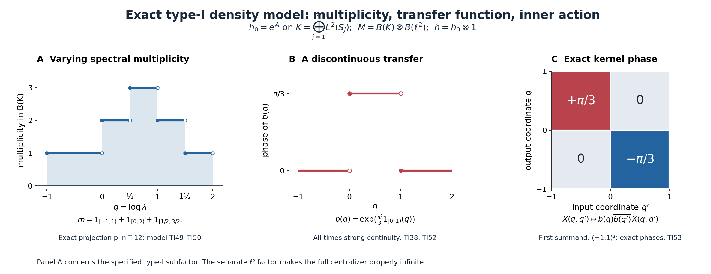

# Integrable weights and type-I densities

A fixed trace determines the density of a weight, including its scalar normalization. We show that an integrable weight with properly infinite centralizer has that exact density in a unital type-I subfactor. The proof keeps variable spectral multiplicity and all positive elements of infinite weight. We then construct the translation-cocycle action from bounded functions of the same density.

*Original exposition, examples, figures, data and reproducible drawing code in this lesson are dedicated to CC0-1.0. Source publications and font components retain their own terms.*

## Hypotheses and main conclusions

Let \(M\ne0\) be a semifinite factor with separable predual, and fix one faithful normal semifinite trace \(\tau\). Let \(\phi\) be a faithful normal semifinite weight whose centralizer \(M_\phi\) is properly infinite. The density relative to the specified trace is denoted by \(h\). We prove
\[
 \boxed{\quad
 \sigma^\phi\text{ is integrable}
 \ \Longleftrightarrow\
 \begin{gathered}
 \phi=\tau_h,\quad h\text{ positive and nonsingular},\\
 h\text{ affiliated with a unital type-}\mathrm I_\infty
       \text{ factor }B\subset M,\\
 E_h(D)=0\text{ for every Lebesgue-null Borel }
                D\subset(0,\infty).
 \end{gathered}\quad}
 \tag{TI1}
\]
The subfactor has identity \(1_M\). No constant spectral multiplicity, positive density almost everywhere on the whole line, trace measurability of \(h\), or finite value \(\phi(1)\) is assumed. The proper infiniteness of \(M_\phi\) is a hypothesis of the forward theorem. The reverse implication will work without it.

We also construct the extended action in the fixed-trace translation chart. With
\[
 \theta_sg(q)=g(q+s),\qquad
 c_s=b\theta_s(b^*),\qquad b(q)=f(e^q),
\]
its exact value is
\[
 \boxed{\ \sigma_c^\phi=\operatorname{Ad}f(h).\ }
 \tag{TI2}
\]

Here \(\sigma_c^\phi\) is the concrete action defined by the dominant-model generator prescription and supported-corner transport in Section 7. The proof of the density criterion is independent of the abstract carrier construction. The general supported integrability theorem is also available in [CGF](OA-FLOW-CGF.md#cgf-8), and the explicit translation-cocycle transfer in [TCC](OA-FLOW-TCC.md#tcc-4).

## 1. The prescribed trace fixes the density

The actual [trace-density theorem, TD4–6](OA-FLOW-TD.md#oa-flow.td.4) gives a unique positive self-adjoint operator \(h\) affiliated with \(M\), with zero kernel, such that
\[
 \phi(x)=\tau_h(x)
   =\sup_{\varepsilon>0}
      \tau(h_\varepsilon^{1/2}x h_\varepsilon^{1/2}),
 \qquad h_\varepsilon=h(1+\varepsilon h)^{-1},
 \quad x\in M_+.
 \tag{TI3}
\]
The supremum is the increasing limit as \(\varepsilon\downarrow0\). TD2 proves the same formula for any increasing bounded spectral approximants to \(h\). Every value, including infinity, is retained. The [full modular perturbation formula](OA-FLOW-CZ.md#oa-flow.cz.5) and the trace criterion give
\[
 \sigma_t^\phi=\operatorname{Ad}h^{it},\qquad
 M_\phi=\{h^{it}:t\in\mathbb R\}'\cap M
       =\{E_h(D):D\text{ Borel}\}'\cap M.
 \tag{TI4}
\]
The last equality follows from the spectral calculus of \(\log h\). Positive powers and logarithms have the complete spectral domains proved in [SF's spectral theorem](OA-FLOW-SF.md#oa-flow.shared-foundations.sf-1). In particular the imaginary powers are bounded strongly continuous unitaries.

The same TD theorem gives a density \(h_\psi\ge0\), possibly with kernel, for every normal semifinite weight \(\psi\) on \(M\). Its support is
\(p=s(\psi)=1-E_{h_\psi}(\{0\})\). On \(pMp\) the restriction is faithful; its modular group is \(\operatorname{Ad}h_\psi^{it}\), where imaginary powers are taken on \(p\) and extended by zero on \(1-p\). Thus \(h_\psi^{i0}=p\) in this supported notation. The zero weight is treated by the zero corner throughout.

A faithful normal state on \(M\) exists at the stipulated separable-predual scope: choose a countable norm-dense family of positive normal functionals, normalize their nonzero members, and take a strictly positive summable convex combination. Vanishing of its value on a positive element forces every member of the dense family, and then every positive normal functional, to vanish there. Faithfulness follows. Its restriction to every unital subalgebra or nonzero corner is faithful after scalar normalization. We use this only for countable projection comparisons.

## 2. Bounded positive integration and absolutely continuous multiplicity

For a normal continuous action \(\alpha:\mathbb R\to\operatorname{Aut}(R)\), let
\[
 E_\alpha(x)(\omega)=\int_{\mathbb R}\omega(\alpha_t(x))\,dt
 \quad(x\ge0,\ \omega\in R_*^+).
 \tag{TI5}
\]
Equivalently, take the increasing extended-positive supremum of compact orbit integrals. Bounded scalar evaluations construct those compact normal maps as in the actual [dual-average proof](OA-FLOW-DA.md#da-positive). The action is integrable when
\(\mathfrak n_E=\{x:E_\alpha(x^*x)\text{ is bounded}\}\)
is ultraweakly dense. The measure in (TI5) is \(dt\); a dual crossed-product average would use \(dt/(2\pi)\). Multiplication of the measure by a finite positive constant does not affect integrability, but it changes every numerical integral.

We need a useful complete criterion. The set \(\mathfrak n_E\) is a linear left ideal, by
\((x+y)^*(x+y)\le2x^*x+2y^*y\) and
\(x^*a^*ax\le\|a\|^2x^*x\).
If it is ultraweakly dense, the join of its right supports is one. For finite \(F\subset\mathfrak n_E\) and integers \(n\ge1\), put
\[
 H_F=\sum_{x\in F}x^*x,\qquad
 a_{F,n}=nH_F(1+nH_F)^{-1}.
 \tag{TI6}
\]
These are positive contractions, increase with \(F,n\), and satisfy
\(E_\alpha(a_{F,n})\le n\sum_{x\in F}E_\alpha(x^*x)\).
Monotonicity follows because inversion reverses order on positive invertible bounded operators. The supremum is the join of the supports of the \(H_F\), hence one. Conversely, if positive contractions \(a_i\uparrow1\) have bounded averages, then \(a_i^{1/2}\in\mathfrak n_E\) and \(x a_i^{1/2}\to x\) strongly for every \(x\), proving density. Thus
\[
 \alpha\text{ integrable}\quad\Longleftrightarrow\quad
 \exists\,0\le a_i\uparrow1,\quad E_\alpha(a_i)\text{ bounded}.
 \tag{TI7}
\]
The integrable positive elements themselves span an ultraweakly dense space: for \(x\ge0\), the sandwiches
\(a_i^{1/2}xa_i^{1/2}\le\|x\|a_i\)
are integrable and converge strongly to \(x\). Merely approaching the identity, without this order argument, would not prove that assertion.

Three permanence properties now have proofs. A normal equivariant isomorphism transports (TI7). An invariant unital subalgebra's contractions also converge to the ambient identity and have the same bounded integrals. For a fixed projection \(p\), the contractions \(pa_ip\uparrow p\) have averages \(pE_\alpha(a_i)p\). Tensoring with the identity action preserves integrability via \(a_i\otimes1\); the converse takes a fixed rank-one corner.

### The regular positive average

Let \(L=L^2(\mathbb R,dq)\), \(Q=M_q\), and \(K_0=L\otimes\ell^2\). The action
\(\gamma_t=\operatorname{Ad}(e^{itQ}\otimes1)\)
on \(B(K_0)\) is integrable. To verify this quantitatively, choose an orthonormal basis \((\xi_j)\) of \(L\) consisting of bounded compactly supported functions. Gram–Schmidt on a countable dense set of rational interval step functions produces such a basis; each nonzero remainder is still a bounded finite step function of compact support.

For each \(j\), scalar [Plancherel with its proved normalization](OA-FLOW-FF.md#oa-flow.ff.3) gives
\[
 \int_{\mathbb R}
       e^{itQ}\theta_{\xi_j,\xi_j}e^{-itQ}\,dt
       =2\pi M_{|\xi_j|^2}.
 \tag{TI8}
\]
To see the operator equality, pair the positive integral with \(\eta\in L\). Its left side is the squared Fourier integral of
\(\overline{\xi_j}\eta\), which belongs to both \(L^1\) and \(L^2\); Plancherel gives \(2\pi\int|\xi_j|^2|\eta|^2\). Boundedness of \(\xi_j\) bounds the resulting operator. Compact positive integrals increase strongly to this bounded value.

Let \(P_n\) project onto the first \(n\) basis vectors of \(L\), and \(q_n\) onto the first \(n\) standard vectors of \(\ell^2\). Then
\[
 X_n=P_n\otimes q_n\uparrow1,\qquad
 E_\gamma(X_n)=2\pi
       M_{\sum_{j\le n}|\xi_j|^2}\otimes q_n.
 \tag{TI9}
\]
These are actual bounded positive orbit integrals, so (TI7) applies.

### A complete varying-multiplicity reduction

Suppose \(h\) is positive nonsingular and affiliated with a unital subfactor \(B\cong B(K)\subset M\), with \(E_h\ll d\lambda\). A faithful normal state of \(M\) restricts faithfully to \(B(K)\); its positive values on rank-one coordinate projections imply that an orthonormal basis of \(K\) is countable. Since \(B\) is type \(\mathrm I_\infty\), \(K\) is infinite-dimensional and separable.

Transport the spectral projections of \(h\) to \(B(K)\), and let \(A=\log h\) in this representation. A real-line null set \(D\) has \(\exp D\) null: on each bounded interval the exponential is Lipschitz, and these intervals exhaust the line. Therefore
\[
 E_A(D)=E_h(\exp D)=0.
 \tag{TI10}
\]
The scalar cyclic spectral representation from SF may be made countable by taking successive cyclic reducing spaces of a countable dense sequence. Their orthogonal complement is reducing; if it were nonzero, one dense vector would have a nonzero remaining component and would generate another summand. On each nonzero cyclic summand, \(A\) is coordinate multiplication on \(L^2(\mu_j)\), with a finite Borel measure \(\mu_j\ll dq\).

Here is the needed scalar density step, rather than an unstated multiplicity theorem. Choose a finite measure \(\lambda_0=w(q)dq\) with \(w>0\) everywhere and let \(\eta=\mu_j+\lambda_0\). The functional \(f\mapsto\int f\,d\mu_j\) is bounded on \(L^2(\eta)\), by Cauchy–Schwarz and \(\mu_j\le\eta\). Hilbert-space representation gives a density \(g\), and testing indicators gives \(0\le g\le1\),
\(d\mu_j=g\,d\eta\), and \(d\lambda_0=(1-g)d\eta\).
Absolute continuity \(\mu_j\ll\lambda_0\) forces \(\eta(\{g=1\})=0\). Monotone simple approximation therefore gives
\[
 d\mu_j=\frac{g}{1-g}\,d\lambda_0
           =a_j(q)dq,\qquad a_j\ge0.
 \tag{TI11}
\]
All densities may be made Borel by completion-measurable simple approximation, as proved in SF. Multiplication by \(\sqrt{a_j}\) is a unitary from \(L^2(\mu_j)\) onto \(L^2(S_j,dq)\), where \(S_j=\{a_j>0\}\): the inverse divides by \(\sqrt{a_j}\) on \(S_j\). The squared-norm identities prove both directions and the full coordinate domains.

Consequently there is a unitary
\[
 V:K\longrightarrow pK_0,\qquad
 p=\sum_j1_{S_j}(Q)\otimes e_{jj},\qquad
 Vh^{it}V^*=p(e^{itQ}\otimes1)p.
 \tag{TI12}
\]
Empty coordinates are allowed, and \(p\) is the strong sum of its orthogonal diagonal projections. The multiplicity \(m(q)=\sum_j1_{S_j}(q)\) can vary and may be infinite. No constant-multiplicity claim occurs. The projection \(p\) is fixed by \(\gamma\). Compress (TI9) by \(p\), transport by \(V\), then use the unital inclusion \(B\subset M\). The permanence proof after (TI7) shows that \(\operatorname{Ad}h^{it}\) is integrable on \(M\). Together with (TI4), this proves the reverse implication in (TI1), independently of the centralizer hypothesis.

## 3. A stabilized reference with the exact original trace

Proper infiniteness of the unital algebra \(M_\phi\) makes \(1_M\) properly infinite. The [filling-family proof](OA-FLOW-PC.md#oa-flow.pc.5) gives isometries \(v_j\in M\) with
\(v_j^*v_i=\delta_{ij}1\) and \(\sum_jv_jv_j^*=1\).
If one starts with nonfilling orthogonal copies, add the residual projection to the first range and use mutual subequivalence with \(1\), as in PC3, to replace that first isometry. Thus filling is part of the assertion.

Identify \(\ell^2\) with \(K_0=L^2(\mathbb R)\otimes\ell^2\), and let \(P\) be a copy of \(M\), with its copied trace \(\tau_P\). The map
\[
 F:P\overline\otimes B(K_0)\longrightarrow M,\qquad
 F(x\otimes e_{ij})=v_i x v_j^*
 \tag{TI13}
\]
is normal and onto, with normal inverse. In a faithful representation, the unitary
\((\eta_j)\mapsto\sum_jv_j\eta_j\)
implements it on the entire Hilbert space; its adjoint has coordinates \(v_j^*\eta\). This proves the claim for every bounded matrix, not only finite matrices.

Its trace normalization is exactly
\[
 \tau\circ F=\tau_P\otimes\operatorname{Tr}_{K_0}.
 \tag{TI14}
\]
For \(Y\ge0\), put \(p_j=v_jv_j^*\). The positive sums
\(Y^{1/2}(\sum_{j\in J}p_j)Y^{1/2}\uparrow Y\).
Normality and the trace identity give
\(\tau(Y)=\sum_j\tau(p_jYp_j)\).
Also \(\tau(v_jxv_j^*)=\tau(x)\) for \(x\ge0\).
Apply the diagonal [whole-cone tensor-trace formula](OA-FLOW-TW.md#tw-2) to \(F^{-1}(Y)\). This proves (TI14) at every infinite value too. The compressions \(p_JYp_J\) have not been asserted to increase.

We work in this exactly trace-preserving model. Reorder its factors as
\[
 M=P\overline\otimes B(L)\overline\otimes B(\ell^2),\qquad
 k=1_P\otimes e^Q\otimes1,\qquad
 \nu=\tau_k.
 \tag{TI15}
\]
The density theorem makes \(\nu\) faithful normal semifinite. Its centralizer and center are
\[
 N=M_\nu=P\overline\otimes L^\infty(Q)\overline\otimes B(\ell^2),
 \qquad Z(N)=1_P\otimes L^\infty(Q)\otimes1.
 \tag{TI16}
\]

For clarity, the tensor commutant in this assertion has a proof avoiding a measurable-field assumption. Reorder the outer factors into \(R=P\overline\otimes B(\ell^2)\), a factor by matrix units. An operator \(X\in R\overline\otimes B(L)\) commuting with \(1\otimes L^\infty(Q)\) has scalar Hilbert matrix coefficients that are multipliers, by [ND's multiplier-commutant proof](OA-FLOW-ND.md#nd-multiplication). On dyadic intervals \(I_{n,j}\), compress \(X\) against the normalized scalar vector \(|I_{n,j}|^{-1/2}1_{I_{n,j}}\); the resulting \(a_{n,j}\) belongs to \(R\), since \(X\) commutes with \(R'\otimes1\). Set
\(X_n=\sum_j a_{n,j}\otimes1_{I_{n,j}}\).
The orthogonal sum is bounded by \(\|X\|\) and belongs to \(R\overline\otimes L^\infty\). For elementary vector functionals, pairing \(X_n\) amounts to pairing the scalar multiplier coefficient of \(X\) with the dyadic average of an \(L^1\) function. Such averages converge in \(L^1\), first on continuous compact functions and then by their density. Hence \(X_n\to X\) ultraweakly, using finite simple tensor vectors and the common norm bound. This proves the commutant identity. The center is scalar in the \(R\)-factor by normal slices, exactly as in [CORE9's center proof](OA-FLOW-CORE.md#core-9). Thus (TI16) is an equality of full algebras.

The last \(B(\ell^2)\) makes \(N\) properly infinite. With \(R_a\xi(q)=\xi(q-a)\), put
\(u(s)=1_P\otimes R_{-s}\otimes1\). Then
\[
 u(s)g(Q)u(s)^*=g(Q+s),\qquad
 \sigma_t^\nu(u(s))=e^{-ist}u(s),\qquad
 \nu\operatorname{Ad}u(s)=e^{-s}\nu.
 \tag{TI17}
\]
Indeed \(u(s)^*ku(s)=e^{-s}k\). The regularized identity
\(u(s)^*k_\varepsilon u(s)=e^{-s}k_{\varepsilon e^{-s}}\)
and trace cyclicity prove the last equation on every positive element. The field \(u\) is strongly continuous. The scalar multiplier and translation theorem makes \(N\) and \(u(\mathbb R)\) generate \(M\). Section 2's regular averages, tensored with \(1_P\), prove integrability of \(\sigma^\nu\).

This reference is also the actual dual trace model, if that identification is desired. On \(N=R\overline\otimes L^\infty(\mathbb R)\), use the trace
\(\tau_N(x)=\sup_{\omega\le\tau_R}\int e^q x_\omega(q)\,dq\),
where \(\tau_R=\tau_P\otimes\operatorname{Tr}_{\ell^2}\). This is \(2\pi\) times the reflected canonical trace in CORE9; it is faithful normal semifinite and scales by \(e^{-s}\). Here is the full regular identification. On the two real coordinates, the coefficient \(g\) acts as multiplication by \(g(q-r)\), and the crossing translation sends \(\xi(r,q)\) to \(\xi(r-s,q)\). The map
\[
 (U\xi)(y,z)=\xi(z-y,z),\qquad y=q-r,\quad z=q,
 \tag{TI16.a}
\]
is an onto unitary: Fubini and translation invariance of Lebesgue measure prove its norm identity, and \((U^{-1}\eta)(r,q)=\eta(q-r,q)\) is its inverse. It sends those generators to \(M_g\) on \(y\) and \(R_{-s}\) on \(y\), leaving \(z\) unchanged. The scalar multiplier-translation theorem therefore gives \(B(L^2(dy))\otimes1_z\). Tensor with the identity on a faithful representation of \(R\); finite simple vector tensors justify the entire normal conjugacy. Removing the constant multiplicity factor gives a faithful normal isomorphism of the full crossing onto \(R\overline\otimes B(L)\), with the specified coefficient and translation generators. The full [dual modular formula](OA-FLOW-DWC.md#dwc-4) and [central-density comparison](OA-FLOW-GDA.md#gda-7) make its actual dual weight a scalar multiple of \(\nu\), since \(M\) is a factor. Choose \(0\ne a\in R_+\) with \(0<\tau_R(a)<\infty\), \(g=1_{[0,1]}\), and \(f\in C_c(\mathbb R)\) with \(\int|f|^2ds=1\). The right coefficient \(x(s)=f(s)(a^{1/2}\otimes M_g)\) has
\(T(L_x^*L_x)=a\otimes M_g\) by [GDA29](OA-FLOW-GDA.md#equation-gda29). Both weights of this square equal
\(\tau_R(a)(e-1)\): for \(\nu\), its scalar kernel is \(f(t-q)g(t)\), whose weighted squared Hilbert–Schmidt norm is
\(\iint|f(t-q)|^2|g(t)|^2e^t\,dq\,dt=e-1\).
For the dual weight, use its full composition with \(T\). This finite nonzero test fixes the scalar to one after whole-cone proportionality has already been proved. The paired crossed-product measures here are \(ds\) and \(dt/(2\pi)\).

## 4. Comparing a properly infinite cut with its central support

We will use the following countable comparison inside \(N\), not merely inside \(M\):
\[
 R\text{ has a faithful normal state},\quad
 e\in R\text{ properly infinite},\quad z=z_R(e)
       \quad\Longrightarrow\quad e\sim z\text{ in }R.
 \tag{TI18}
\]
This is a case of the proved [PC7 comparison](OA-FLOW-PC.md#oa-flow.pc.7), and the following direct proof records its exact mechanism.

The join of all unitary conjugates of \(e\) in \(zR\) is central and contains \(e\), hence equals \(z\). A faithful normal state, applied to the directed finite joins, selects countably many such conjugates \(p_j\) with join \(z\): choose finite sets whose state errors tend to zero, take their countable union, and use faithfulness on the residual projection. Put \(r_j=p_1\vee\cdots\vee p_j\) and \(q_j=r_j-r_{j-1}\). Polar decomposition of \((z-r_{j-1})p_j\) gives \(q_j\precsim p_j\sim e\), by PC3's join formula. The \(q_j\) are orthogonal with sum \(z\).

Proper infiniteness supplies countably many orthogonal copies of \(e\) within \(e\). Move each \(q_j\) into its own such copy and take the bounded strong sum of the partial isometries. Their initial and final supports are orthogonal, so this produces \(w_0\) with \(w_0^*w_0=z\), \(w_0w_0^*\le e\). To turn subequivalence into equivalence explicitly, set
\(d=z-e\), \(D=\sum_{n\ge0}w_0^n d w_0^{*n}\).
The summands are orthogonal because \(d\perp w_0w_0^*\), and
\(w_0Dw_0^*=D-d\). Therefore
\[
 s=w_0D+(z-D),\qquad s^*s=z,\qquad ss^*=e.
 \tag{TI19}
\]
The two summands have orthogonal initial and final supports. The adjoint \(s^*\) implements \(e\sim z\). This proof will also justify every countable filling used in a support centralizer.

## 5. The full supported integrability step in the fixed-trace setting

For a normal semifinite weight \(\psi\) on this \(M\), with support \(p\), write \(\psi\lesssim\nu\) if a partial isometry \(v\in M\) satisfies
\[
 v^*v=p,\quad e=vv^*\in N,\qquad
 \psi(x)=\nu(vxv^*)\quad(x\in M_+).
 \tag{TI20}
\]
The same notation with a target \(\eta\) means that the final projection lies in \(M_\eta\) on its support and the same positive-cone identity holds. These comparisons are transitive: TD/CZ transport the modular action under each supported corner isomorphism, so composing the partial isometries preserves the final centralizer condition and the weight identity.

We prove the full supported statement
\[
 \sigma^\psi\text{ on }pMp\text{ is integrable}
       \quad\Longleftrightarrow\quad\psi\lesssim\nu.
 \tag{TI21}
\]
In particular no faithful completion, infinite-centralizer condition on \(\psi\), or scalar trace renormalization is omitted from this assertion. The zero weight uses \(v=0\). This proof specializes the regular-comparison mechanism to actual trace densities and supplies all of its supported steps locally.

### Partial cocycles and regular comparison

Put \(\alpha_t=\operatorname{Ad}k^{it}\). The density calculus gives the strongly* continuous partial cocycle
\[
 c_t=h_\psi^{it}k^{-it},\qquad
 c_tc_t^*=p,\quad c_t^*c_t=\alpha_t(p),\quad
 c_{s+t}=c_s\alpha_s(c_t).
 \tag{TI22}
\]
These identities are direct products of bounded imaginary powers. On \(pMp\), \(\beta_t=c_t\alpha_t(\,\cdot\,)c_t^*=\sigma_t^\psi\). A unitary completion is \(a_t=H^{it}k^{-it}\), where \(H\) is \(h_\psi\) on \(p\) and \(1\) on \(1-p\). Then \(c_t=pa_t\); the spectral sum \(H\) is positive, nonsingular and affiliated with \(M\). This completion is only an auxiliary bounded cocycle.

Let \(K=L^2(\mathbb R,dr)\), \((\rho_t\xi)(r)=\xi(r+t)\), and \(\widetilde\alpha=\alpha\otimes\mathrm{id}\). For partial cocycles \(d,b\) with respective range supports \(p_d,p_b\), call \(X\) an intertwiner from \(d\) to \(b\) when
\[
 X=p_bXp_d,\qquad Xd_t=b_t\widetilde\alpha_t(X).
 \tag{TI23}
\]
Polar decomposition of \(X\) stays in this intertwiner space. On the supported matrix corner with unit \(\operatorname{diag}(p_b,p_d)\), the partial cocycle \(\operatorname{diag}(b_t,d_t)\) defines an automorphism group by conjugating \(\widetilde\alpha_t\); the partial cocycle identity proves the group law, and its initial and final supports give the stated corner. Its action on the off-diagonal coefficient is \(X\mapsto b_t\widetilde\alpha_t(X)d_t^*\). The fixedness equation is equivalent to (TI23), by multiplying with \(d_t\) and using the support conditions. Thus \(X\) is a fixed off-diagonal element of this von Neumann algebra. Its bounded spectral calculus and polar partial isometry stay fixed, proving the claim without a completion assumption for arbitrary partial cocycles. A partial isometry with initial projection \(p_d\) witnesses \(d\lesssim b\). Multiplying such partial isometries proves transitivity; their support conditions give the required initial projection.

First suppose \(M_\psi=(pMp)^\beta\) is properly infinite and \(\beta\) integrable. We claim
\[
 c\otimes1\lesssim c\otimes\rho.
 \tag{TI24}
\]
Let \(q\) be the join of the right supports of all intertwiners in (TI23) for this pair. It is central in the source fixed corner \(M_\psi\overline\otimes B(K)\): multiplying an intertwiner on the right by a unitary of that corner preserves the space, hence preserves the join. The tensor-center calculation by matrix units makes a nonzero missing projection \(1-q\), within the source unit, equal to \(e\otimes1\) for some \(0\ne e\in Z(M_\psi)\).

Integrability of the fixed \(e\)-corner gives a nonzero \(y\ge0\) there with bounded \(E_\beta(y)\), by (TI7). Put \(x=y^{1/2}\), choose \(0\ne f\in C_c(\mathbb R)\), and, on \(L^2(\mathbb R,H_M)\) for a faithful normal representation of \(M\), define
\[
 (Y\xi)(r)=\beta_{-r}(x)\int_{\mathbb R} f(t)\xi(t)\,dt.
 \tag{TI25}
\]
The integral of \(f\xi\) is a Hilbert-space integral, with norm at most \(\|f\|_2\|\xi\|_2\). Positivity gives
\[
 \|Y\xi\|^2
 =\left\langle E_\beta(x^*x)\int f\xi,\int f\xi\right\rangle
 \le\|E_\beta(y)\|\|f\|_2^2\|\xi\|_2^2.
 \tag{TI26}
\]
Thus \(Y\) is bounded. It commutes with every constant \(M'\)-operator, since each coefficient \(\beta_{-r}(x)\) does; the [tensor-commutant proof](OA-FLOW-ND.md#nd-tensor) puts it in \(M\overline\otimes B(K)\). Its left and right supports lie under \(e\otimes1\). It is nonzero: take \(\xi(t)=\overline{f(t)}\eta\) with \(x\eta\ne0\), and use strong continuity of \(\beta_{-r}(x)\eta\) near \(0\).

For compact simple vector tests, cocycle multiplication gives
\
 \begin{aligned}
 \bigl[(c_s\otimes\rho_s)\widetilde\alpha_s(Y)\xi\bigr
 &=c_s\alpha_s(\beta_{-(r+s)}(x))\int f(t)\xi(t)\,dt\\
 &=\beta_{-r}(x)c_s\int f(t)\xi(t)\,dt\\
 &=\biglY(c_s\otimes1)\xi\bigr.
 \end{aligned}
 \tag{TI27}
\]
The equality in the middle uses the partial cocycle identity on its support. The coefficient calculation passes to the bounded operators by their vector tests and the normal tensor implementation, proved in [DWC1's field lemma](OA-FLOW-DWC.md#dwc-1). Therefore \(Y\) is a nonzero intertwiner with right support in the supposed missing projection. This contradicts the definition of \(q\).

In the fixed linking algebra, (TI27) says that the source projection's central support lies under that of the target: otherwise its part under the complementary target central support would annihilate all off-diagonal intertwiners. The target fixed corner contains \(M_\psi\otimes1\), and is properly infinite. The entire linking algebra has a faithful normal state by restriction from \(M\overline\otimes B(K)\overline\otimes M_2\). PC7's countable comparison, or its proof in Section 4, places the source projection under the target by a fixed partial isometry. Its off-diagonal entry proves (TI24). Countability is being used here at the stated separable-predual scope.

### Removing the regular representation

The completed cocycle \(a\) has the exact absorption formula
\[
 V(r)=a_{-r},\qquad
 a_t\otimes\rho_t
   =V(1\otimes\rho_t)\widetilde\alpha_t(V^*).
 \tag{TI28}
\]
The field and its adjoint are strongly measurable bounded unitary fields. DWC1 proves membership in \(M\overline\otimes B(K)\), and also justifies applying \(\widetilde\alpha\) pointwise. Evaluating the right side at \(r\) reduces (TI28) to
\(a_{-r}\alpha_t(a_{-(r+t)}^*)=a_t\).
The cocycle \(c\otimes\rho\) is the fixed \(p\otimes1\) corner of \(a\otimes\rho\); hence (TI28) gives \(c\otimes\rho\lesssim1\otimes\rho\).

The reference eigenoperators (TI17) remove the remaining \(\rho\). Use explicitly the negative-sign unitary Fourier transform
\[
 (\mathcal F_-\xi)(r)=(2\pi)^{-1/2}
       \int_{\mathbb R}e^{-irq}\xi(q)\,dq.
\]
Then \(\mathcal F_-\rho_t\mathcal F_-^*=M_{e^{itr}}\). In this Fourier coordinate the unitary field \(W(r)=u(-r)\) satisfies
\[
 \widetilde\alpha_t(W)=W(1\otimes M_{e^{itr}}).
 \tag{TI29}
\]
Transport \(W\) back by \(\mathcal F_-\). Equation (TI29) is precisely an equivalence from \(1\otimes\rho\) to \(1\otimes1\) in the convention (TI23). Combining (TI24), (TI28) and (TI29) gives a partial isometry \(V_0\) with
\[
 V_0^*V_0=p\otimes1,\quad
 V_0V_0^*\in N\overline\otimes B(K),\qquad
 V_0(h_\psi^{it}\otimes1)=(k^{it}\otimes1)V_0.
 \tag{TI30}
\]
The final support is fixed under \(\widetilde\alpha\) by the intertwining equation and its adjoint.

Intertwining these unitary groups intertwines every spectral projection and every bounded Borel function of their generators: on the initial and final reducing subspaces it is a unitary conjugacy, and the spectral theorem is unique there. In particular
\((k_\varepsilon\otimes1)V_0=V_0(h_{\psi,\varepsilon}\otimes1)\).
Trace cyclicity, (TI3), and the tensor-trace formula now give the whole-cone equality
\[
 (\psi\otimes\operatorname{Tr})(X)
   =(\nu\otimes\operatorname{Tr})(V_0XV_0^*)
      \qquad(X\ge0).
 \tag{TI31}
\]
For a positive \(X\), the left side equals its supported compression's value; bounded spectral cutoffs establish the trace identity first, then their increasing limit gives all infinite values.

### Centralizer rows and arbitrary supported weights

Choose filling isometries \((r_j)\) in \(M_\psi\), with unit \(p\), and \((s_j)\) in \(N\), with unit \(1\). Define rows
\[
 R_\psi=\sum_j r_j\otimes e_{1j},\qquad
 R_\nu=\sum_j s_j\otimes e_{1j}.
\]
Orthogonal initial projections and orthogonal range projections of the summands make these bounded strongly* convergent sums. Direct multiplication gives
\[
 R_\psi^*R_\psi=p\otimes1,\quad
 R_\psi R_\psi^*=p\otimes e_{11},\qquad
 R_\nu^*R_\nu=1\otimes1,\quad
 R_\nu R_\nu^*=1\otimes e_{11}.
 \tag{TI32}
\]
Their coefficients commute with the respective density spectral projections. Thus
\(R_\nu V_0R_\psi^*=v\otimes e_{11}\)
has \(v^*v=p\), final support in \(N\), and intertwines the imaginary powers of \(h_\psi\) and \(k\). The cutoff trace argument from (TI31), now in the rank-one corner with \(\operatorname{Tr}(e_{11})=1\), proves (TI20). This completes the implication for properly infinite \(M_\psi\).

For a general nonzero supported \(\psi\), use the fixed filling family \((s_j)\subset N\) to identify
\[
 A_s:M\overline\otimes B(\ell^2)\overset{\sim}{\longrightarrow}M,
 \qquad A_s(x\otimes e_{ij})=s_i x s_j^*,
 \qquad
 \dot\psi=(\psi\otimes\operatorname{Tr})\circ A_s^{-1}.
 \tag{TI33}
\]
The exact trace proof (TI14) applies to \(A_s\). Thus \(\dot\psi\) has density \(A_s(h_\psi\otimes1)\), support \(A_s(p\otimes1)\), and centralizer
\(A_s(M_\psi\overline\otimes B(\ell^2))\), which is properly infinite. Its modular action is integrable exactly when \(\sigma^\psi\) is, by the tensor and rank-one permanence already proved. Moreover
\[
 (\nu\otimes\operatorname{Tr})\circ A_s^{-1}=\nu
 \tag{TI34}
\]
on the entire positive cone: \(A_s(k_\varepsilon\otimes1)=k_\varepsilon\), since every \(s_j\) commutes with \(k_\varepsilon\) and their ranges fill \(1\); apply trace preservation, then let \(\varepsilon\downarrow0\).

Equation (TI34) supplies the reference weight's actual infinite multiplicity. Together with (TI17), which implements every positive scalar multiple, it makes \(\nu\) dominant in that precise sense.

The proved case gives \(\dot\psi\lesssim\nu\). The partial isometry \(s_1p\) shows \(\psi\lesssim\dot\psi\): its final projection is \(A_s(p\otimes e_{11})\), fixed by \(\sigma^{\dot\psi}\), and
\(\dot\psi(s_1p x p s_1^*)=\psi(x)\).
Composing the two partial isometries proves \(\psi\lesssim\nu\). This is a proved stabilization and supported-cut argument, not cancellation of an infinite tensor factor.

Conversely, (TI20) identifies \(pMp\) normally with the fixed \(e\)-corner of \(M\), transports its whole weight to \(\nu|_{eMe}\), and hence transports its modular group by the density formula. The fixed-corner permanence of the integrable \(\sigma^\nu\) proves integrability on \(pMp\). This completes (TI21) for every normal semifinite supported weight.

## 6. The forward implication and a genuinely unital type-I subfactor

Assume now the hypotheses of (TI1) and integrability of \(\sigma^\phi\). Apply (TI21): an isometry \(v\) satisfies \(v^*v=1\), \(vv^*=e\in N\), and \(\phi=\nu\operatorname{Ad}v\). The same normal corner isomorphism identifies \(M_\phi\) with \(eNe\). Thus \(e\) is properly infinite **inside \(N\)**. Section 4 gives \(w\in N\) with
\[
 w^*w=e,\qquad ww^*=z_N(e)
    =1_P\otimes1_S(Q)\otimes1
 \tag{TI35}
\]
for a nonnull Borel set \(S\subset\mathbb R\), up to Lebesgue null sets. Borel representatives exist by SF. Put \(z=z_N(e)\) and \(u=wv\). Then \(u^*u=1\), \(uu^*=z\).

Since \(w\) commutes with every \(k_\varepsilon\), for \(y\ge0\) supported in \(e\),
\[
 \nu(wyw^*)=\sup_{\varepsilon>0}
       \tau(w k_\varepsilon^{1/2}y k_\varepsilon^{1/2}w^*)
       =\nu(y).
\]
The second equality uses \(w^*w=e\), trace cyclicity, and the support of the positive sandwich. Therefore \(\phi=\nu\operatorname{Ad}u\) without changing the trace or the weight by a scalar.

On the \(z\)-corner define
\[
 B_z=1_P\otimes B(L^2(S)\otimes\ell^2)\subset zMz,
 \qquad k_z=z k,\qquad
 B=u^*B_z u\subset M.
 \tag{TI36}
\]
The first algebra has unit \(z\) and is a type-\(\mathrm I_\infty\) factor: \(S\) has positive measure, so \(L^2(S)\otimes\ell^2\) is a nonzero infinite-dimensional separable Hilbert space. The normal corner isomorphism \(y\mapsto u^*yu\) sends its unit to \(1_M\). Hence \(B\) is an actual unital type-\(\mathrm I_\infty\) subfactor of \(M\), not only an abstract isomorphic algebra or a nonunital type-I corner.

Its affiliated positive nonsingular operator is \(u^*k_z u\), understood by transport of all spectral projections and domains. Cutoff trace cyclicity gives
\(\phi=\tau_{u^*k_z u}\) on every positive element. Uniqueness in TD therefore identifies the density for the fixed original trace exactly:
\[
 h=u^*k_z u,\qquad
 E_h(D)=u^*(1_P\otimes1_{S\cap\log D}(Q)\otimes1)u.
 \tag{TI37}
\]
If \(D\subset(0,\infty)\) is Lebesgue null, \(\log D\) is null: logarithm is Lipschitz on each \([1/n,n]\), whose union is \((0,\infty)\). Formula (TI37) proves the required absolute continuity. This proves the forward implication in (TI1).

The proper-infiniteness hypothesis was used to replace the support \(e\) by its central support inside \(N\), which is what turns the model corner into the unital subfactor (TI36). No comparison performed only in the ambient factor would give that conclusion. A finite factor cannot meet the theorem's properly infinite centralizer hypothesis; it is not a suppressed special case.

## 7. Translation cocycles act by the positive-coordinate functional calculus

Let \(\mathcal A=L^\infty(\mathbb R,dq)\), \(\theta_sg(q)=g(q+s)\). This action is normal and strongly continuous: interval simple functions and continuity of translations in finite \(L^2\) tests prove bounded strong continuity, and normality follows from the measure-class translation. The faithful normal semifinite trace
\(\int e^q g(q)\,dq\) scales by \(e^{-s}\). Thus the actual [CST stability theorem](OA-FLOW-CST.md#cst-5), applied to this abelian algebra, gives for every strongly continuous unitary cocycle \(c\) a unitary \(b\in\mathcal A\) such that
\[
 c_s=b\theta_s(b^*),\qquad
 b(q)=f(e^q),\qquad
 f(\lambda)=b(\log\lambda).
 \tag{TI38}
\]
The [constructive translation proof](OA-FLOW-TCC.md#tcc-4) gives another complete route to the same transfer, including a Borel representative and equality at every time. CST states its coboundary in the form \(v^*\theta_s(v)\); here \(b=v^*\), so the convention is exactly (TI38). A Borel representative of \(b\) exists by the scalar completion argument in SF, and its values on the exceptional null set can be replaced by \(1\). Then \(f:(0,\infty)\to\mathbb T\) is Borel.

For completeness, uniqueness has a scalar proof. If \(b,b'\) implement the same \(c\), the function \(d=b^*b'\) is fixed by every translation as an \(L^\infty\) class. For a compact continuous approximate identity \(g_n\), the convolution \(d*g_n\) is bounded continuous and translation-invariant, hence constant. On every finite interval \(d*g_n\to d\) in \(L^1\), first by the translation continuity of \(L^1\) restrictions and then by the approximate-identity estimate. The constants form a Cauchy sequence on any fixed interval of positive length, and their limit is the same on all intervals. Thus \(d\) is a scalar of modulus one. No uncountable intersection of pointwise exceptional sets is needed.

By (TI37), the spectral measure of \(A=\log h\) is absolutely continuous with respect to \(dq\). There is consequently a well-defined unital normal homomorphism
\[
 \rho_\phi:\mathcal A\longrightarrow Z(M_\phi),
       \qquad \rho_\phi(g)=g(\log h).
 \tag{TI39}
\]
It need not be injective. To check normality at the \(L^\infty\)-class level, each scalar vector spectral measure is finite and absolutely continuous. The scalar density proof (TI11) gives its \(L^1(dq)\) density. Polarization and summable vector series give the same assertion for every normal functional. Thus composition with \(\rho_\phi\) is normal on \(\mathcal A\); the vector functionals separate the operators. Centrality follows because every element of \(M_\phi\) commutes with the spectral projections of \(h\). In particular \(f(h)=\rho_\phi(b)\) is unchanged by Lebesgue-null modifications of \(f\).

In the reference model put
\(\rho_\nu(g)=1_P\otimes g(Q)\otimes1\) and \(b_\nu=f(k)\).
The bounded unitary \(b_\nu\) lies in \(Z(N)\) and satisfies
\[
 \operatorname{Ad}b_\nu(x)=x\quad(x\in N),\qquad
 \operatorname{Ad}b_\nu(u(s))=\rho_\nu(c_s)u(s).
 \tag{TI40}
\]
Indeed \(u(s)b_\nu^*u(s)^*=\rho_\nu(\theta_s(b^*))\).
Because \(N\) and the \(u(s)\) generate \(M\), (TI40) is the unique normal automorphism with that generator prescription. Existence follows from the displayed bounded inner implementer in this semifinite model.

For the supported realization \(v\) of \(\phi\), \(b_\nu\) commutes with \(e=vv^*\). Its conjugation preserves \(eMe\), so define
\[
 \sigma_c^\phi(x)
 =v^*\operatorname{Ad}b_\nu(vxv^*)v
 =\operatorname{Ad}(v^*b_\nu v)(x).
 \tag{TI41}
\]
Both \(v^*b_\nu v\) and its adjoint multiply to \(1\). Since \(w\) in (TI35) belongs to \(N\), it commutes with \(b_\nu\). Using \(u=wv\) and full Borel spectral transport gives
\[
 v^*b_\nu v=u^*f(k_z)u=f(u^*k_z u)=f(h).
 \tag{TI42}
\]
This proves (TI2) exactly. The automorphism preserves \(\phi\) by the bounded spectral cutoffs and trace cyclicity, and fixes \(M_\phi\) pointwise. Replacing \(b\) by a scalar multiple changes its implementing unitary by that scalar and leaves its conjugation unchanged. Since central cocycles multiply pointwise and transfer functions do too, \(c\mapsto\sigma_c^\phi\) is a homomorphism.

### An intrinsic frequency characterization

If \(x\in M\) has modular frequency \(r\), that is,
\(\sigma_t^\phi(x)=e^{irt}x\), then
\[
 e^{itA}x=xe^{it(A+r)},\qquad
 g(A)x=xg(A+r)\quad(g\text{ bounded Borel}).
 \tag{TI43}
\]
Here is a precise justification of the second assertion even when \(x\) is not a partial isometry. Pair both sides with vectors, obtaining finite complex scalar spectral measures. Their Fourier transforms coincide by the first assertion. Finite-measure Fourier uniqueness follows by convolving their difference with a Gaussian: the result is in \(L^1\), has zero Fourier transform, hence vanishes by [FF Fourier uniqueness](OA-FLOW-FF.md#oa-flow.ff.3). Gaussian approximate identities then converge against compact continuous functions to the original measure, which is zero by regularity. Thus the spectral measures agree, proving (TI43) first for indicators and then by bounded measurable approximation.

Apply (TI43) also in the form \(xg(A)=g(A-r)x\). The convention (TI38) gives
\[
 \sigma_c^\phi(x)
   =b(A)x b(A)^*
   =b(A)\overline{b(A-r)}x
   =\rho_\phi(c_{-r})x.
 \tag{TI44}
\]
The minus sign is necessary: \(u(s)\) has frequency \(-s\), so (TI44) agrees with the multiplier \(c_s\) in (TI40).

We record why this determines a normal map on all of \(M\). For any integrable action \(\alpha\) and positive \(a\) with bounded average \(E_\alpha(a)\), the compact Fourier integrals
\(\int_{-T}^T e^{-irt}\alpha_t(a)\,dt\)
have norm at most \(\|E_\alpha(a)\|\). Scalar Cauchy–Schwarz for the positive operator coefficients bounds every vector pairing by
\(\langle E_\alpha(a)\xi,\xi\rangle^{1/2}
 \langle E_\alpha(a)\eta,\eta\rangle^{1/2}\).
Every normal functional's orbit pairing is in \(L^1(dt)\): this holds for positive functionals by definition of the bounded average, and every normal functional is a linear combination of four positive normal functionals. Weak* compactness of the bounded operator ball and those unique scalar limits produce an actual operator
\[
 \widehat a(r)=\mathop{\mathrm{uw}\!-\!\lim}_{T\to\infty}
        \int_{-T}^T e^{-irt}\alpha_t(a)\,dt,
 \qquad
 \alpha_s(\widehat a(r))=e^{irs}\widehat a(r).
 \tag{TI45}
\]
The latter equality follows by change of variables in each absolutely integrable scalar pairing; the endpoint tails tend to zero. These are the bounded Fourier eigenoperators of the actual [L29 proof](OA-FLOW-L29.md#l29-3).

If \(\omega\in M_*\) annihilates every eigenoperator, then the \(L^1\) function \(t\mapsto\omega(\alpha_t(a))\) has zero Fourier transform by (TI45). Fourier uniqueness makes it zero almost everywhere; continuity makes it zero at \(0\). The positive integrable elements span an ultraweakly dense space by (TI7), so \(\omega=0\). Annihilator separation therefore proves that the ultraweak span of all eigenspaces is \(M\). Hence (TI44) determines a normal automorphism uniquely.

In particular the concrete construction (TI41) is independent of the chosen filling families, supported isometry, projection comparison and type-I model: the unique fixed-trace density already makes (TI42) intrinsic, and (TI44) supplies a second uniqueness check. If a separately defined carrier-indexed extended action is proved to satisfy this generator/corner prescription or this frequency formula in the fixed-trace chart, that compatibility identifies it with (TI41). The general carrier identification in [CGF](OA-FLOW-CGF.md#cgf-5) does not by itself identify this coefficient evaluation with a separately defined carrier-indexed action; that identification requires the stated compatibility formula.

## 8. Coordinate changes, character signs and the separate core density

If another construction produces \(\phi=\rho_\ell\) with \(\rho=a\tau\), \(a>0\), then cutoff evaluation and TD uniqueness give the fixed-trace density
\[
 h=a\ell.
 \tag{TI46}
\]
For example,
\(a\ell(1+\varepsilon a\ell)^{-1}
 =a\,\ell_{\varepsilon a}\);
the same positive cone supremum gives \(\tau_{a\ell}=a\tau_\ell\).
Multiplication by \(a\) preserves affiliation with the same \(B\) and preserves the Lebesgue null class. Equality of modular groups alone would not determine this scalar.

If instead the reference trace is renamed \(\tau'=a\tau\), then
\[
 h'=a^{-1}h,\quad q'=q-\log a,\quad
 b'(q')=b(q'+\log a),\quad f'(\lambda)=f(a\lambda),
 \qquad f'(h')=f(h).
 \tag{TI47}
\]
The map \(Jg(q')=g(q'+\log a)\) intertwines the two translation actions. Thus \(c'_s=Jc_s\) is represented by \(b'\), and
\(\rho'_\phi(Jg)=g(\log h'+\log a)=\rho_\phi(g)\).
This proves coordinate invariance of the action, rather than holding a coordinate-dependent \(f\) fixed accidentally.

There are two different positive operators in the reflected trace chart of [CORE9](OA-FLOW-CORE.md#core-9). The canonical core density is \(e^{-Q}\); the positive coordinate used in (TI38) is \(e^Q\). CORE9's original core momentum \(p\), with translation \(p\mapsto p-s\), becomes \(q=-p\), with translation \(q\mapsto q+s\). Accordingly the paired core trace is
\(\tau\otimes(e^q\,dq/(2\pi))\), its canonical density is \(e^{-Q}\), and the dual tracial weight is \(\tau\otimes(dq/(2\pi))\). The separate coordinate \(e^Q\) satisfies \(\theta_s(e^Q)=e^s e^Q\); applying the density map \(\rho_\phi\) to its spectral functions gives \(h\). No identification of these two positive operators is made.

Two character tests fix all signs:
\[
 \begin{array}{c|c|c}
 b(q)&c_s=b(q)\overline{b(q+s)}&\sigma_c^\phi\\ \hline
 e^{itq}&e^{-its}&\operatorname{Ad}h^{it}=\sigma_t^\phi\\
 e^{-iaq}&e^{ias}&\operatorname{Ad}h^{-ia}=\sigma_{-a}^\phi .
 \end{array}
 \tag{TI48}
\]
The first row agrees with the frequency \(-s\) of the reference \(u(s)\). Reversing the coboundary convention reverses the resulting modular time.

## 9. A varying-multiplicity example and solved diagnostics

### A complete model with nonconstant finite multiplicity

Let
\[
 K=L^2([-1,1))\oplus L^2([0,2))\oplus L^2([1/2,3/2)),
 \quad A=M_q\oplus M_q\oplus M_q,\quad h_0=e^A,
\]
and put
\[
 M=B(K)\overline\otimes B(\ell^2),\quad
 \tau=\operatorname{Tr}_K\otimes\operatorname{Tr}_{\ell^2},\quad
 h=h_0\otimes1,\quad
 \phi=\tau_h,\quad B=B(K)\otimes1.
 \tag{TI49}
\]
The Hilbert spaces are separable and infinite-dimensional; \(M\) is a semifinite factor with separable predual. The density is bounded and boundedly invertible here, so it is positive and nonsingular; the density theorem gives a faithful normal semifinite weight. The spectral measure of \(h_0\) is absolutely continuous, since
\(\int 1_D(e^q)\,dq=\int_D \lambda^{-1}d\lambda\)
on each interval. The algebra \(B\) is a unital type-\(\mathrm I_\infty\) factor and \(h\) is affiliated with it. The centralizer contains \(1_K\otimes B(\ell^2)\), so is properly infinite. All hypotheses in (TI1) hold.

The logarithmic spectral multiplicity **in \(B(K)\)** is
\[
 m(q)=1_{[-1,1)}(q)+1_{[0,2)}(q)+1_{[1/2,3/2)}(q).
 \tag{TI50}
\]
It is \(1,2,3,2,1\) on the consecutive intervals with endpoints
\(-1,0,1/2,1,3/2,2\). In the full \(M\) representation the additional \(\ell^2\) factor gives infinite multiplicity on the same support; this does not erase the variable multiplicity of the specified type-I subfactor density. Section 2's compression proof gives integrability directly.

**Diagnostic 1 — Does integrability mean a finite weight?** No. Let \(\xi=1_{[0,1)}\) in the first summand of \(K\), so \(\|\xi\|=1\), and let \(e_0\) be a unit vector in \(\ell^2\). For the rank-one projection \(p_\xi=\theta_{\xi\otimes e_0,\xi\otimes e_0}\),
\[
 \phi(p_\xi)=\int_0^1e^q\,dq=e-1,\qquad
 \phi(1)=\infty.
 \tag{TI51}
\]
The second equality follows already from \(h\ge e^{-1}1\) and the infinite trace of \(1\). Thus the positive orbit-integrability theorem is not an \(L^1\)-condition on \(h\).

**Diagnostic 2 — Can an absolutely continuous spectrum have a gap or varying multiplicity?** Yes. In (TI12), take any Borel sets \(S_j\); a gap in their union is a zero spectral projection, which is allowed. In the exact example (TI49), \(m\) takes three different nonzero values. Each summand uses Lebesgue measure, so every Lebesgue-null set has zero spectral projection regardless of these changes. The fixed diagonal projection \(p=\sum_j1_{S_j}(Q)\otimes e_{jj}\) compresses the bounded averages, proving integrability without replacing \(m\) by a constant.

**Diagnostic 3 — What does a discontinuous transfer function do?** Take
\[
 b(q)=\exp\!\left(\frac{\pi i}{3}1_{[0,1)}(q)\right),
 \qquad
 f(\lambda)=\exp\!\left(\frac{\pi i}{3}1_{[1,e)}(\lambda)\right).
 \tag{TI52}
\]
It gives the all-times cocycle
\(c_s(q)=\exp(\frac{\pi i}{3}[1_{[0,1)}(q)-1_{[0,1)}(q+s)])\).
Although \(b\) is discontinuous, \(s\mapsto c_s\) is strongly continuous: translations of the interval indicator converge in local \(L^2\), and dominated convergence against arbitrary finite \(L^2\) tests extends the assertion. Its inverse is the complex conjugate, so strong* continuity holds too. In model (TI49), a Hilbert–Schmidt kernel \(X(q,q')\), including its summand and \(\ell^2\) indices, transforms exactly by
\[
 X(q,q')\longmapsto
 e^{(\pi i/3)(1_{[0,1)}(q)-1_{[0,1)}(q'))}X(q,q').
 \tag{TI53}
\]
Conjugation by a bounded multiplier proves this kernel formula and extends normally to all \(M\). Null changes at \(0,1,e\) have no effect. The action is nontrivial: a rank-one kernel supported with \(q\in(0,1)\) and \(q'\in(-1,0)\) acquires the factor \(e^{\pi i/3}\).

**Diagnostic 4 — Why move \(e\) inside \(N\)?** If a partial isometry \(w\) were chosen only in \(M\), it would need not commute with \(k\). Even the unitary \(R_a\) on the regular factor changes the weight by \(e^a\), as the direct trace calculation before (TI17) shows. In contrast, \(w\in N\) commutes with every \(k_\varepsilon\), giving the exact equality of positive sandwiches used in (TI35)–(TI37). The centralizer comparison is what preserves the specified density normalization and turns \(e\) into the central spectral cut \(1_S(Q)\).

**Diagnostic 5 — Does the supported step silently assume an infinite centralizer?** No. Its first proof does so explicitly, then (TI33)–(TI34) stabilize any nonzero \(\psi\) inside the fixed reference centralizer and recover \(\psi\) by the first rank-one cut. This also covers finite support centralizers whenever their action is integrable. For a concrete nonfaithful example in (TI49), choose a nonzero spectral projection \(p\in M_\phi\), put \(\psi(x)=\phi(pxp)\), and let \(h_\psi=hp\). Then \(\psi\) has support \(p\), \(\sigma^\psi\) is the fixed \(p\)-corner of the integrable \(\sigma^\phi\), and (TI21) provides a supported isometry into \(\nu\). At \(p=0\), the weight and the witnessing partial isometry are both zero. No formula treats \(h_\psi^{i0}\) as \(1\) when \(p\ne1\).

**Diagnostic 6 — What fails if the trace changes but \(f\) does not?** Use
\(f(\lambda)=\exp(i(\log\lambda)^2)\) and \(\tau'=2\tau\), so \(h'=h/2\). The correctly transported function \(f'(\lambda)=f(2\lambda)\) gives \(f'(h')=f(h)\). If one holds \(f\) fixed instead, functional calculus gives
\[
 f(h/2)f(h)^*
   =\exp(i(\log2)^2)\,h^{-2i\log2},
 \quad
 \operatorname{Ad}f(h/2)
   =\sigma_{-2\log2}^\phi\circ\operatorname{Ad}f(h).
 \tag{TI54}
\]
The scalar phase disappears under conjugation, but the modular automorphism generally does not. In (TI49) it is nontrivial because its phase varies on sets of positive measure. This is an actual change of action caused by using the wrong coordinate function.

**Diagnostic 7 — Which character gives positive modular time?** The character \(c_s=e^{-its}\) gives \(\sigma_t^\phi\), because its transfer function is \(b(q)=e^{itq}\). The character \(e^{its}\) gives \(\sigma_{-t}^\phi\). For a modular eigenoperator of frequency \(r\), (TI44) multiplies it by \(c_{-r}=e^{itr}\) in the first case, exactly the factor in \(\sigma_t^\phi(x)\). The three sign tests—transfer function, reference translation and frequency—agree.

## 10. Exact multiplicity and the inner action

The figure displays the actual intervals and multiplicities in (TI49)–(TI50), the discontinuous transfer function (TI52), and the inner multiplier (TI53). The third panel uses the first summand's square \((-1,1)^2\); its two nonzero regions have exact phases \(+\pi/3\) and \(-\pi/3\).

*Figure 1.* Multiplicity is measured in the specified type-I subfactor. The kernel phases are real arguments before exponentiation, and the intervals have the endpoint conventions of Section 9. Proofs are (TI12) and (TI49)–(TI53). Original [SVG](../assets/type-i-density-integrability/tid-models.svg), [renderer](../assets/type-i-density-integrability/render.py), [exact data](../assets/type-i-density-integrability/data.json), [terms](../assets/type-i-density-integrability/TERMS.md), and [font license](../assets/type-i-density-integrability/FONT-LICENSE.txt) accompany the figure. Human-source context is Takesaki, *Theory of Operator Algebras II*, Exercise XII.4.1(c),(d), printed p. 420; the diagram is an original illustration of the explicit model above.

## Further reading

M. Takesaki, *Theory of Operator Algebras II*, Exercise XII.4.1(c), printed p. 420, asks for the type-I density criterion for an integrable weight of infinite multiplicity relative to a specified trace. Part (d) asks for the corresponding functional-calculus formula for the extended action. Sections 1–6 here prove the complete density criterion, including variable spectral multiplicity and the supported comparison step; Sections 7–8 construct the concrete generator/corner action and prove its exact formula and coordinate invariance. Identification with an independently defined abstract carrier-indexed action additionally requires the compatibility described in Section 7.

The earlier programme proofs include [trace densities](OA-FLOW-TD.md#oa-flow.td.4), [the full modular density formula](OA-FLOW-CZ.md#oa-flow.cz.5), [projection comparison](OA-FLOW-PC.md#oa-flow.pc.7), [tensor weights](OA-FLOW-TW.md#tw-2), [scalar Fourier theory](OA-FLOW-FF.md#oa-flow.ff.3), [general supported integrability](OA-FLOW-CGF.md#cgf-8), and [constructive translation cocycles](OA-FLOW-TCC.md#tcc-4).
