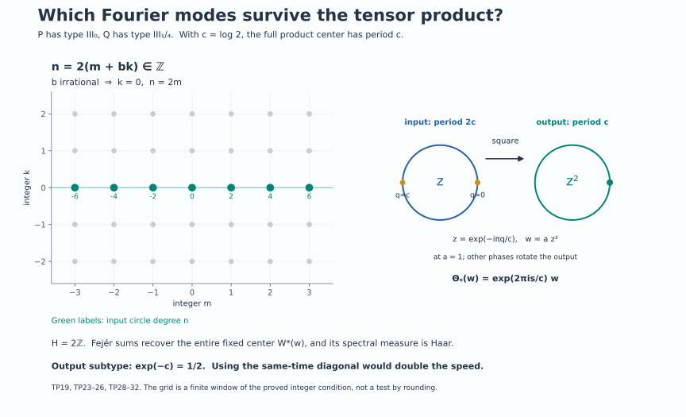

# Tensor periods and the corrected discrete subtype

For a nonzero factor \(P\), let
\[
 T(P)=\{t\in\mathbb R:\sigma_t^\varphi\text{ is inner}\},\qquad
 S_+(P)=\bigcap_{\psi}\bigl(\operatorname{Sp}(\Delta_\psi)\cap(0,\infty)\bigr),
 \tag{TP1}
\]
where the intersection ranges over every faithful normal semifinite weight. The definition of \(T(P)\) is independent of \(\varphi\), by the normalized cocycle relation between modular groups. Its exact center-flow form and the corresponding all-weight positive spectral identity are proved in [MIV2.h](OA-FLOW-MIV.md#miv-2) and [MIV5](OA-FLOW-MIV.md#miv-5).

The tensor product of a type \(\mathrm{III}_0\) factor and a type \(\mathrm{III}_\lambda\) factor need not have subtype \(\mathrm{III}_\lambda\) when \(0<\lambda<1\). The obstruction is a missing inner period. We prove the exact corrected subtype, including arbitrary preduals, and an explicit product of types \(\mathrm{III}_0\) and \(\mathrm{III}_{1/4}\) whose type is \(\mathrm{III}_{1/2}\). The endpoint with a type \(\mathrm{III}_1\) tensor factor is valid without a separability hypothesis.

## 1. Innerness of a tensor automorphism

For arbitrary nonzero factors \(P,Q\) and automorphisms \(\alpha,\beta\),
\[
 \alpha\bar\otimes\beta\text{ is inner}
 \quad\Longleftrightarrow\quad
 \alpha\text{ and }\beta\text{ are inner}.
 \tag{TP2}
\]
The reverse implication is implemented by the tensor product of two implementing unitaries. For the forward implication, let \(U\in\mathcal U(P\bar\otimes Q)\) implement the tensor automorphism. Then
\[
 U(x\otimes1)=(\alpha(x)\otimes1)U.
\]
Normal product functionals separate the spatial tensor product, so some normal slice
\(a=(\operatorname{id}\bar\otimes\omega)(U)\) is nonzero. It satisfies
\[
 ax=\alpha(x)a\qquad(x\in P).
 \tag{TP3}
\]
Taking adjoints in the same relation with \(x^*\) shows that \(a^*a\) commutes with \(P\), and \(aa^*\) commutes with \(\alpha(P)=P\). Both are positive nonzero scalar operators. In the polar decomposition \(a=v|a|\), the initial and final supports are therefore both \(1\). Thus \(v\) is a unitary and \(\alpha=\operatorname{Ad}v\).

The unitary \(V=(v^*\otimes1)U\) commutes with \(P\otimes1\). The [full tensor-commutant theorem TF1](OA-FLOW-TF.md#tf-tensors) gives
\[
 (P\otimes1)'\cap(P\bar\otimes Q)=1\otimes Q.
\]
Hence \(V=1\otimes w\) for a unitary \(w\in Q\), and the equation on \(1\otimes Q\) gives \(\beta=\operatorname{Ad}w\). All slices and maps are normal. No countable decomposition of either factor was used.

The [full product-weight theorem](../../OA-MOD/src/tensor-closed-operators-and-weights.md#tensor-hilbert-algebras-and-tomita-domains) and [TF's closed Tomita construction](OA-FLOW-TF.md#tf-tensors) give
\[
 \sigma_t^{\varphi\bar\otimes\psi}
       =\sigma_t^\varphi\bar\otimes\sigma_t^\psi
\]
for arbitrary faithful normal semifinite weights. Applying (TP2), and using weight independence at each fixed time, proves
\[
 \boxed{T(P\bar\otimes Q)=T(P)\cap T(Q).}
 \tag{TP4}
\]
TF's tensor commutant proof also makes \(P\bar\otimes Q\) a factor. This argument does not replace the intersection over all weights by an intersection over product weights.

## 2. Pointwise inner real flows have a continuous unitary group

The next lemma retains the separable-predual hypothesis needed for the arbitrary-starting-factor counterexample.

**Lemma.** If \(P\) is a factor with separable predual and
\(\alpha:\mathbb R\to\operatorname{Aut}(P)\) is a continuous action whose every \(\alpha_t\) is inner, there is a strongly continuous unitary group \(v_t\in P\) with \(\alpha_t=\operatorname{Ad}v_t\).

The automorphism topology is point-norm convergence on the predual. The [proved Polish automorphism and Borel-selection lemma](../../OA-ERGODIC/src/ancillary-actions-and-unitary-corrections.md#1-automorphisms-as-a-polish-group) supplies Borel implementers \(u_t\). Its proof normalizes the first nonzero matrix coefficient and applies the Borel-image theorem. It asserts Borelness, not closedness, of the inner subgroup. We must still produce a continuous group.

**The projective topology.** By [DS2](OA-FLOW-DS.md#ds-2), \(\mathcal U(P)\) is a Polish topological group for its strong-star topology. Its complete metric
\[
 d(u,v)=\sum_{j\ge1}2^{-j}
  \bigl(\min(1,\|(u-v)\xi_j\|)
             +\min(1,\|(u^*-v^*)\xi_j\|)\bigr)
 \tag{TP5}
\]
uses a dense sequence of unit-ball vectors in a faithful separable representation. It is invariant under simultaneous multiplication by a scalar in \(\mathbb T\). On \(V=\mathcal U(P)/\mathbb T\), put
\[
 \bar d([u],[v])=\min_{z\in\mathbb T}d(u,zv).
 \tag{TP6}
\]
Compactness gives a minimum and makes zero distance mean equality of the classes. Simultaneous scalar invariance proves the triangle inequality. The inverse image of a quotient ball is a union of open scalar translates; conversely saturation of any open set is open. Thus (TP6) gives exactly the quotient topology.

For completeness, choose from a quotient Cauchy sequence a subsequence with successive distances at most \(2^{-j}\). Adjust consecutive representatives by minimizing scalars; their successive \(d\)-distances have finite sum, so completeness gives a limit unitary. The quotient subsequence converges, and the original Cauchy sequence then converges. Images of a countable dense set give separability. The quotient homomorphism is open, so multiplication and inversion descend continuously. Hence \(V\) is Polish.

Factoriality makes \(t\mapsto[u_t]\) a Borel homomorphism. We recall why such a homomorphism \(f:\mathbb R\to V\) is continuous. Given an identity neighborhood \(O\), choose an open neighborhood \(W\) with \(W^{-1}W\subset O\). Countably many left translates of \(W\) cover \(V\). On a finite interval, one inverse-image piece has positive Lebesgue measure; call a finite positive-measure subset \(E\). For \(s,t\in E\), \(f(s)^{-1}f(t)\in W^{-1}W\), so \(E-E\subset f^{-1}(O)\). The function
\(\int1_E(x)1_E(x+h)\,dx\) is continuous in \(h\), by \(L^1\) continuity of translations, and is positive at zero. It follows that \(E-E\) contains a neighborhood of zero. This proves continuity at zero and hence everywhere. It is the [positive-Haar-set argument used in L42](OA-FLOW-L42.md#oa-flow.centerg.strict).

**Continuous local lifts.** Fix a normal state \(\omega\) on \(P\). On the saturated open set \(|\omega(u)|>0\), the expression
\[
 s([u])=\frac{\overline{\omega(u)}}{|\omega(u)|}\,u
 \tag{TP7}
\]
is unchanged under \(u\mapsto zu\). It is continuous on unitaries and descends continuously through the open quotient. It is a section near \([1]\), since \(\omega(1)=1\). Composing with the projective path gives continuous unitary lifts on a real interval about zero.

Consider the pullback group
\[
 E=\{(t,u)\in\mathbb R\times\mathcal U(P):
                           \operatorname{Ad}u=\alpha_t\},
 \quad (t,u)(s,v)=(t+s,uv).
 \tag{TP8}
\]
Its kernel over zero is the central circle. A local lift \(v_t\) identifies the inverse image of its interval \(I\) with \(I\times\mathbb T\) by
\((t,z)\mapsto(t,zv_t)\). The inverse is continuous: \(v_t^*u\) is scalar, and its scalar value is \(\omega(v_t^*u)\). Translates supply such charts everywhere. Thus \(E\) is locally compact Hausdorff, and its projection onto \(\mathbb R\) is open.

**The extension is abelian.** Commutators in \(E\) lie in the central circle because the quotient is abelian. They are independent of the chosen lifts and define a continuous alternating bicharacter
\[
 \kappa:\mathbb R\times\mathbb R\longrightarrow\mathbb T.
\]
The bicharacter identities follow from the elementary commutator identities when all commutators are central. Local lifts prove continuity. For integers \(m,k\) and \(n\ge1\),
\[
 \kappa(m/n,k/n)=\kappa(1/n,1/n)^{mk}=1.
 \tag{TP9}
\]
Density of rational pairs makes \(\kappa=1\). Hence \(E\) is an LCA group.

**Split the circle.** [L127, CN5](OA-FLOW-L127.md#oa-flow.l127.cn5), with the [full character-extension theorem in L118](OA-FLOW-L118.md#l118-dual-map), proves that a closed circle subgroup of any LCA group has a continuous character retraction. Apply it to the kernel circle of \(E\). If \(K\) is the kernel of that retraction, multiplication gives a topological isomorphism \(\mathbb T\times K\to E\), with inverse obtained by the retraction and division by its value. The original projection restricts to a bijective open continuous homomorphism \(K\to\mathbb R\). Its inverse has the form \(t\mapsto(t,v_t)\), a continuous homomorphic section. This proves the lemma, including both the group law and continuity.

Consequently, for a separable-predual factor,
\[
 T(P)=\mathbb R\quad\Longleftrightarrow\quad P\text{ is semifinite}.
 \tag{TP10}
\]
For the nontrivial direction apply the lemma to \(\sigma^\varphi\). Write \(v_t=e^{itH}\). Since the group commutes with itself, each \(v_t\) belongs to \(P_\varphi\); therefore \(H\) is affiliated with the centralizer. The positive injective density \(k=e^{-H}\) is densely defined. The [full unbounded weight theorem VR](../../OA-MOD/src/inner-flow-and-weight-rigidity.md#a-continuous-inner-modular-group-characterizes-semifiniteness) constructs \(\tau=\varphi_k\) and computes
\[
 \sigma_t^\tau
      =\operatorname{Ad}(k^{it})\sigma_t^\varphi
      =\operatorname{id}.
 \tag{TP11}
\]
Its whole-cone trace criterion makes \(\tau\) a faithful normal semifinite trace. Conversely such a trace gives \(T(P)=\mathbb R\), first in its own modular chart and then in every chart by the normalized cocycle formula. Pointwise innerness was not substituted for the continuous-group hypothesis in the weight theorem.

## 3. An obstruction for every initial separable type III-zero factor

For any factor \(Q\) of type \(\mathrm{III}_\lambda\), \(0<\lambda<1\), the [arbitrary-cardinality discrete decomposition theorem](OA-FLOW-DDP.md#dd-existence) proves
\[
 T(Q)=p\mathbb Z,\qquad p=\frac{2\pi}{-\log\lambda}.
 \tag{TP12}
\]
Therefore (TP4) shows that \(P\bar\otimes Q\) can have type \(\mathrm{III}_\lambda\) only if \(p\in T(P)\).

Let now \(P\) be any separable-predual type \(\mathrm{III}_0\) factor. By (TP10), \(T(P)\ne\mathbb R\). Since it is an additive group, choose \(p>0\) outside it and put \(\lambda=e^{-2\pi/p}\). We construct an actual suitable \(Q\) for this value, without presuming a model identification.

Let
\[
 D_\lambda=\sum_{j\in\mathbb Z}\mathbb Q\lambda^j,\qquad
 \Gamma_\lambda=\{x\mapsto\lambda^n x+d:
                            n\in\mathbb Z,\ d\in D_\lambda\}.
 \tag{TP13}
\]
The sum is algebraic. Both sets are countable, and \(D_\lambda\) contains the dense subgroup \(\mathbb Q\). On the line with Lebesgue measure, the action is nonsingular. Every nonidentity affine map has at most one fixed point; removing their countable invariant union makes the action free. Its rational translations are ergodic: convolving any invariant bounded function with continuous compact kernels makes it continuous and rational-translation invariant, hence constant; local \(L^1\) approximation recovers the original function.

The countable regular crossing \(Q=L^\infty(\mathbb R)\rtimes\Gamma_\lambda\) is a separable-predual factor by the [free diagonal theorem and normal relation identification](../../OA-ERGODIC/src/free-actions-and-the-crossed-product-diagonal.md#5-a-continuous-orbit-with-a-transverse-parameter). We check its ratio parameter. Every arrow derivative is \(\lambda^n\). For any positive-measure Borel set \(E\), first take a finite positive-measure subset. For fixed \(n\), the function
\[
 I(d)=\int 1_E(x)1_E(\lambda^n x+d)\,dx
\]
is continuous, by \(L^2\) translation continuity, and
\[
 \int_{\mathbb R}I(d)\,dd=\mu(E)^2>0.
 \tag{TP14}
\]
Thus it is positive on an open set containing a rational \(d\). A positive part of \(E\) returns to \(E\) with the exact derivative \(\lambda^n\). This holds in every positive-measure reduction. All derivative values belong to the same discrete multiplicative group, so its closed ratio set is
\(\{0\}\cup\lambda^{\mathbb Z}\).

The [full measured fixed-corner and all-weight theorem](../../OA-ERGODIC/src/ratio-sets-and-intrinsic-modular-spectra.md#3-identification-with-the-factor-invariant-including-zero) identifies this ratio set with \(S(Q)\), including zero and the sigma-finite measure case. Its one-scale affine example contains the same construction. Hence \(Q\) is type \(\mathrm{III}_\lambda\).

But \(p\notin T(P)\cap T(Q)=T(P\bar\otimes Q)\). Formula (TP12) rules out subtype \(\mathrm{III}_\lambda\) for the product. This produces a counterexample for every initial separable-predual type \(\mathrm{III}_0\) factor \(P\). The argument identifies \(Q\) as the stated affine crossed product; it makes no identification with the separately named Powers construction.

## 4. The exact tensor center and the surviving parameter

Write \((C_P,\theta^P)\), \((C_Q,\theta^Q)\) for the intrinsic center flows. We use the already proved [normal tensor-flow theorem TF](OA-FLOW-TF.md#tf-statement):
\[
 C_{P\bar\otimes Q}
 \cong
 \mathcal A:=
 (C_P\bar\otimes C_Q)^\delta,\qquad
 \delta_s=\theta^P_s\bar\otimes\theta^Q_{-s}.
 \tag{TP15}
\]
The surviving flow is
\[
 \Theta_s=(\theta^P_s\bar\otimes\operatorname{id})|_{\mathcal A}
         =(\operatorname{id}\bar\otimes\theta^Q_s)|_{\mathcal A}.
 \tag{TP16}
\]
These are statements about the whole centers.

We recall exactly which normal maps this use entails. In faithful product-weight charts, TF's core embedding sends coefficient tensors to their coefficient tensors and sends the core translation \(u(t)\) to \(u_P(t)\otimes u_Q(t)\). Its determinant-one shear realizes the whole opposite-flow fixed regular algebra and gives a normal inverse by compression against a unit vector in the redundant coordinate. The inverse is independent of that vector because it is an inverse on the entire range. TF's relative-commutant computation then identifies its entire center with (TP15).

The [second route in TF](OA-FLOW-TF.md#tf-duality) uses one biduality and checks the three generating families under its normal maps. It gives the same full fixed algebra and surviving action. Both routes apply to arbitrary von Neumann algebras and Hilbert cardinalities. TF's normalized product cocycle and chart square prove independence from both product charts and nonproduct initial weights. Thus selecting product weights in the computation does not reduce the quantifier in (TP1).

On \(\mathcal A\), the same-time diagonal action has a different parameter:
\[
 (\theta^P_s\bar\otimes\theta^Q_s)|_{\mathcal A}
          =\Theta_{2s}.
 \tag{TP17}
\]
Indeed the separate restrictions in (TP16) agree, so their product is the action at \(2s\). The circle calculations below always use \(\Theta_s\), not (TP17). [TF's solved circle diagnostics](OA-FLOW-TF.md#tf-models) already verify the equal and unequal period cases, both inverse maps, and this factor of two.

## 5. The full corrected subtype at arbitrary predual

**Theorem.** Let \(P\) be a type \(\mathrm{III}_0\) factor and \(Q\) a type \(\mathrm{III}_\lambda\) factor, \(0<\lambda<1\), with arbitrary preduals. Put
\[
 L=-\log\lambda,\qquad p=2\pi/L,\qquad
 H=\{n\in\mathbb Z:np\in T(P)\}.
 \tag{TP18}
\]
If \(H=\{0\}\), then \(P\bar\otimes Q\) is type \(\mathrm{III}_1\). If \(H=d\mathbb Z\) with \(d\ge1\), it is type
\(\mathrm{III}_{\lambda^{1/d}}\). In particular it has the source's claimed subtype \(\mathrm{III}_\lambda\) exactly when \(p\in T(P)\).

The subgroup alternatives follow immediately from \(H\le\mathbb Z\). The proof requires the entire fixed center, not just one eigenunitary.

The [full circle-center theorem DDP42](OA-FLOW-DDP.md#dd-center) identifies
\(C_Q=L^\infty(\mathbb R/L\mathbb Z)\) and gives a generating unitary \(u(p)\) with
\(\theta_s^Q(u(p))=e^{-ips}u(p)\).
Use the positive-frequency basis
\[
 e_n=(u(p)^*)^n,\qquad
 \theta_s^Q(e_n)=e^{inps}e_n.
 \tag{TP19}
\]
The adjoint is essential to the sign. Let \(h_Q\) be normalized Haar integration on this circle. For \(X\in C_P\bar\otimes C_Q\), put
\[
 b_n(X)=(\operatorname{id}\bar\otimes h_Q)
                   \bigl(X(1\otimes e_{-n})\bigr)\in C_P.
 \tag{TP20}
\]
These are bounded normal coefficient maps. If \(X\in\mathcal A\), apply \(\delta_s(X)=X\) and Haar invariance to get
\[
 \theta_s^P(b_n(X))=e^{inps}b_n(X).
 \tag{TP21}
\]
The [central eigenfrequency theorem MIV5](OA-FLOW-MIV.md#miv-5) proves that this eigenspace is zero unless \(np\in T(P)\), and otherwise is one-dimensional with a unitary generator. For clarity, the one-dimensional conclusion uses only ergodicity: \(b^*b\) is fixed, hence scalar; a nonzero \(b\) normalizes to an eigenunitary, and the quotient of two such eigenunitaries is fixed and scalar. The equivalence of existence with \(np\in T(P)\) is MIV5's full arbitrary-factor theorem.

We also need completeness of these coefficients. Circle Fejér averages give normal positive contractions
\[
 \mathcal F_N(X)=
 \sum_{|n|\le N}\left(1-\frac{|n|}{N+1}\right)b_n(X)\otimes e_n
 \ \longrightarrow X\quad\text{ultraweakly}.
 \tag{TP22}
\]
To justify the convergence at arbitrary predual, regard the sum as integration against the positive Fejér approximate identity for the second-coordinate circle action. That action is point-ultraweakly continuous: scalar circle translations are continuous on \(L^1\), and finite sums of normal tensor functionals are norm dense in the spatial tensor predual. The latter density follows by approximating vectors by finite Hilbert tensors and then truncating summable vector-functional series. Pairing with any normal functional reduces the approximate-identity assertion to a continuous scalar function on the compact circle. This proves (TP22) without direct-integral fields or a faithful normal state on \(C_P\).

If \(H=0\), only the scalar \(b_0\) survives. Equation (TP22) makes \(\mathcal A=\mathbb C1\).

If \(H=d\mathbb Z\), choose \(a\in\mathcal U(C_P)\) of frequency \(dp\), and set
\[
 w=a\otimes e_d.
 \tag{TP23}
\]
It is fixed by \(\delta\). The coefficient \(b_{kd}(X)\) is a scalar multiple of \(a^k\), and all other coefficients vanish. Thus every Fejér sum is a Laurent polynomial in \(w\); conversely all powers of \(w\) are fixed. Hence
\[
 \mathcal A=W^*(w).
 \tag{TP24}
\]

This is normally the full circle algebra. Here is the measure-class and faithfulness check. The conditional expectation
\(E=\operatorname{id}\bar\otimes h_Q\) is faithful on positive elements. Indeed \(E(Y)=0\), \(Y\ge0\), implies
\(h_Q((\omega\bar\otimes\operatorname{id})(Y))=0\) for every positive normal \(\omega\); faithfulness of \(h_Q\) makes every such slice zero, and separating product functionals make \(Y=0\). Moreover
\(E(w^k)=0\) for every nonzero integer \(k\), while \(E(1)=1\).
For every normal state \(\omega\) on \(C_P\), the spectral measure of \(w\) under \(\omega E\) therefore has precisely the Haar moments. Trigonometric polynomials are uniformly dense in continuous circle functions, so uniqueness of finite measures gives Haar measure. For every Borel set \(B\) on the circle, all these states consequently give
\[
 E(1_B(w))=h_{\mathbb T}(B)\,1.
 \tag{TP25}
\]
Faithfulness of \(E\) shows that \(1_B(w)=0\) exactly when \(B\) is Haar-null. For any normal positive functional \(\rho\) on the ambient tensor algebra, the finite spectral measure \(\nu_\rho(B)=\rho(1_B(w))\) is therefore absolutely continuous with respect to Haar measure. Its scalar Radon–Nikodym density \(g_\rho\in L^1(h_{\mathbb T})_+\) gives
\[
 \rho(f(w))=\int_{\mathbb T}f\,g_\rho\,dh_{\mathbb T}
 \qquad(f\text{ bounded Borel}).
\]
Thus the factored functional-calculus map on \(L^\infty(h_{\mathbb T})\) is normal, including for bounded increasing nets. It is faithful by the equality of null ideals. Its unit ball has ultraweakly compact image, so its image is a von Neumann algebra; containing \(w\) and lying in \(W^*(w)\), that image equals \(W^*(w)\). We have an injective normal onto map
\(L^\infty(\mathbb T,h_{\mathbb T})\to W^*(w)\), \(z\mapsto w\); its inverse is normal because bounded increasing suprema are preserved by this order isomorphism. There is no unobserved singular spectral summand.

By (TP16),
\[
 \Theta_s(w)=e^{idps}w,\qquad
 \ker\Theta=(L/d)\mathbb Z.
 \tag{TP26}
\]
When \(\mathcal A=\mathbb C\), its kernel instead is all of \(\mathbb R\). The [all-factor positive identity MIV2.h](OA-FLOW-MIV.md#miv-2) and the [center-kernel theorem L115, K43](OA-FLOW-L115.md#equation-k43) identify \(S_+\) with the exponential of this kernel. Thus it is \((0,\infty)\) in the first case, and \((\lambda^{1/d})^{\mathbb Z}\) in the second.

Every faithful modular spectrum is closed in the full scalar line. The displayed positive set contains a sequence tending to zero, so zero belongs to every spectrum. A semifinite factor would have a trace with spectrum \(\{1\}\), which is impossible here. The [full-corner trace construction in L18](OA-FLOW-L18.md#l18-6) says that a factor with a nonzero finite projection would have such a trace. Hence the factor is type III, and the computed full invariant gives its stated subtype in both cases. This completes the theorem.

## 6. A numerical exact counterexample

The [explicit coefficient model ZDC59–60](OA-FLOW-ZDC.md#zdc-8) is
\[
 D=R_{\mathrm f}\bar\otimes B(\ell^2\mathbb N),\qquad
 R_{\mathrm f}=\overline{\bigotimes_{j\ge1}(M_2,\operatorname{tr}_2)}^{\,\mathrm{GNS}},
 \qquad \operatorname{Tr}_D\gamma=\tfrac12\operatorname{Tr}_D.
 \tag{TP27}
\]
The cited proof constructs the factor \(R_{\mathrm f}\) from its finite tensor expectations and constructs \(\gamma\) by moving one matrix tensor factor across the infinite operator factor. It verifies the whole-positive trace equality and normal inverse.

Set \(c=\log2\), fix irrational \(b=(\sqrt5-1)/2\), and let
\[
 N=L^\infty(\mathbb T)\bar\otimes D,\qquad
 (\alpha X)(\omega+b)=\gamma(X(\omega)),\qquad
 P=N\rtimes_\alpha\mathbb Z.
 \tag{TP28}
\]
Its original center is diffuse, the central rotation is ergodic, and the faithful trace contracts by \(1/2\). The [full type III-zero construction and converse](OA-FLOW-ZDC.md#zdc-7) applies to this nonfactor coefficient and gives a separable-predual type \(\mathrm{III}_0\) factor \(P\), with constant roof \(c\).

The suspension coordinates
\[
 x=u/c\pmod1,\qquad y=\omega+b\,u/c\pmod1
 \tag{TP29}
\]
respect \((\omega,c)\sim(\omega+b,0)\). They give a measure-class preserving bijection with the two-torus, with inverse obtained from \(u=cx\in[0,c)\) and \(\omega=y-bx\pmod1\). The suspension point map translates by \((s/c,bs/c)\), and the center automorphism is \(\theta_s f(x,y)=f(x-s/c,y-bs/c)\). Its characters \(a_{m,k}(x,y)=e^{-2\pi i(mx+ky)}\) have the positive-convention frequencies
\[
 \frac{2\pi}{c}(m+bk),\qquad (m,k)\in\mathbb Z^2.
\]
Fourier completeness proves that these are all eigenfrequencies: if a nonzero eigenfunction has Fourier coefficients, any nonzero coefficient forces its frequency to be that of its character; irrationality makes the character unique. MIV5 therefore yields
\[
 T(P)=\frac{2\pi}{c}(\mathbb Z+b\mathbb Z).
 \tag{TP30}
\]
In particular \(a_{1,0}=e^{-2\pi ix}\) is a positive-frequency eigenunitary at \(2\pi/c\), in the same convention as (TP19).

Now take
\[
 Q=D\rtimes_{\gamma^2}\mathbb Z.
 \tag{TP31}
\]
The [arbitrary traced-factor converse, DDP Section 5, DDP19–20](OA-FLOW-DDP.md#dd-converse) gives type \(\mathrm{III}_{1/4}\), since \(\gamma^2\) scales by \(1/4\). Here \(L=2c\), \(p=\pi/c\), and
\[
 np\in T(P)
 \quad\Longleftrightarrow\quad
 n/2=m+bk\text{ for some integers }m,k.
\]
Irrationality forces \(k=0\); the condition is exactly that \(n\) is even. Hence \(H=2\mathbb Z\). The theorem of Section 5 gives
\[
 \boxed{P\text{ of type }\mathrm{III}_0,\quad
 Q\text{ of type }\mathrm{III}_{1/4},\quad
 P\bar\otimes Q\text{ of type }\mathrm{III}_{1/2}.}
 \tag{TP32}
\]
The entire output center is generated by the product of a \(2\pi/c\) eigenunitary of \(C_P\) and the second positive-frequency character of \(C_Q\). Its residual period is \(c\). This is an exact computation of a full center, not just the exclusion of subtype \(1/4\).

## 7. The all-weight positive lower bound and the type III-one endpoint

For arbitrary nonzero factors \(P,Q\),
\[
 \boxed{
 \overline{S_+(P)S_+(Q)}^{\,(0,\infty)}
      \subset S_+(P\bar\otimes Q).}
 \tag{TP33}
\]
Let \(K_P,K_Q\) be the kernels of their full center flows. On the fixed center in (TP15), the two separate actions agree. A member of \(K_P\) fixes it through the first factor; a member of \(K_Q\) fixes it through the second. Therefore
\[
 K_P+K_Q\subset\ker\Theta.
\]
The latter is closed, by point-ultraweak continuity of the flow, so it also contains \(\overline{K_P+K_Q}\). The all-weight center-kernel identity gives
\(S_+(P)=\exp K_P\), and similarly for \(Q\) and the tensor product. Exponentiation is a homeomorphism \(\mathbb R\to(0,\infty)\) and turns sums into products. This proves (TP33), with closure relative to \((0,\infty)\).

In particular, if \(Q\) is type \(\mathrm{III}_1\), then \(S_+(Q)=(0,\infty)\). Since \(S_+(P)\) contains \(1\), (TP33) forces \(S_+(P\bar\otimes Q)=(0,\infty)\). Closedness of each faithful modular spectrum adds zero. Thus
\[
 Q\text{ type }\mathrm{III}_1
       \quad\Longrightarrow\quad
 P\bar\otimes Q\text{ type }\mathrm{III}_1
 \tag{TP34}
\]
for every nonzero factor \(P\). The product is a factor by TF, and its positive invariant rules out a trace. No separability was introduced in this endpoint argument.

## 8. Solved period diagnostics

**A basic period can disappear while a multiple survives.** In (TP32), \(p=\pi/c\) is not in \(T(P)\), but \(2p=2\pi/c\) is. The output is neither forced to keep the input subtype nor forced to be type \(\mathrm{III}_1\). The index \(d=2\) records exactly the surviving multiples.

**The index is a root, not a power.** If \(H=d\mathbb Z\), the surviving frequency is \(dp\). Its period is \(2\pi/(dp)=L/d\), so the subtype is \(e^{-L/d}=\lambda^{1/d}\). Using \(\lambda^d\) would replace this period by \(dL\), contradicting the generator action (TP26).

**No surviving nonzero circle coefficient gives type III-one.** If \(np\notin T(P)\) for every nonzero integer \(n\), (TP21) kills all nonzero coefficients, and (TP22) makes the entire fixed center scalar. Merely failing the basic period \(p\) does not prove this stronger hypothesis.

**Keeping the whole input period group preserves the subtype.** If \(p\in T(P)\), the group property gives \(p\mathbb Z\subset T(P)\). Then \(d=1\), and the full fixed center has period \(L\). This proves sufficiency as well as the period obstruction.

**The same-time diagonal halves the apparent period.** In the \(d=2\) example the correct residual period is \(c\). Applying the same parameter to both tensor factors gives \(\Theta_{2s}\), with period \(c/2\); it is not the canonical product center flow. The factor of two comes from composing two equal residual actions, not from a Haar normalization.

**A full spectral measure requires faithfulness.** A single normal state with Haar moments need not exclude an additional singular summand if that state is not faithful. Section 5 uses the faithful expectation \(E=\operatorname{id}\otimes h_Q\), computes every spectral projection through all normal states, and then proves the normal circle isomorphism. This is the point that permits arbitrary predual.

**The positive lower bound must address nonproduct weights.** Testing only product modular operators proves statements about selected spectra, not the right side of (TP33). The full normal center identification and MIV's intersection over every faithful normal semifinite weight supply that quantifier. The zero point is then added by closedness in the full scalar line.

## 9. The surviving Fourier modes pictured

The lattice panel shows the exact condition \(n=2(m+bk)\), with \(b=(\sqrt5-1)/2\): integrality forces \(k=0\), and the surviving input circle degrees are the even integers \(n=2m\). It is a finite window in an infinite proved lattice, not a numerical test of irrationality. The circle panel shows the degree-two character on the input circle of length \(2c\); points separated by \(c\) have the same character, and the full fixed algebra is the output circle of length \(c\). Equations (TP19), (TP23)–(TP26), and (TP28)–(TP32) fix the signs, maps and periods.

## Further reading

M. Takesaki, *Theory of Operator Algebras II*, Exercise XII.3.3, printed p. 403, is the source question. Its assertion for \(0<\lambda<1\) requires the correction in Section 5; its endpoint \(\lambda=1\) is (TP34). The affine factor construction supplies every needed parameter without asserting a Powers-model identification. The already proved tensor-flow theorem TF retains both the direct fixed-algebra and one-biduality routes and their exact parameter diagnostics.

