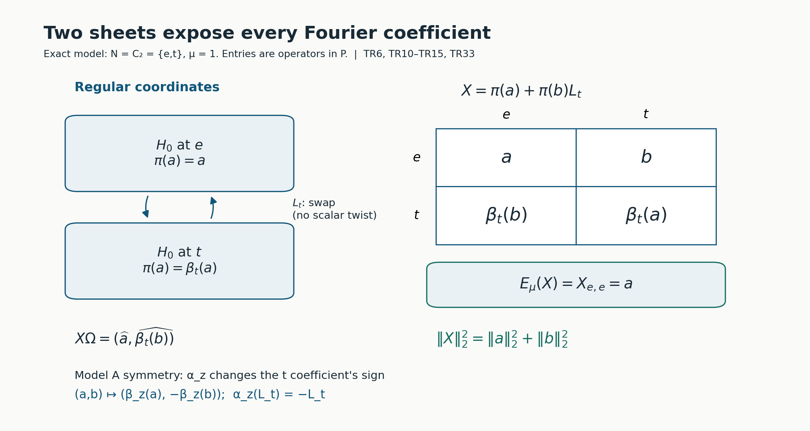
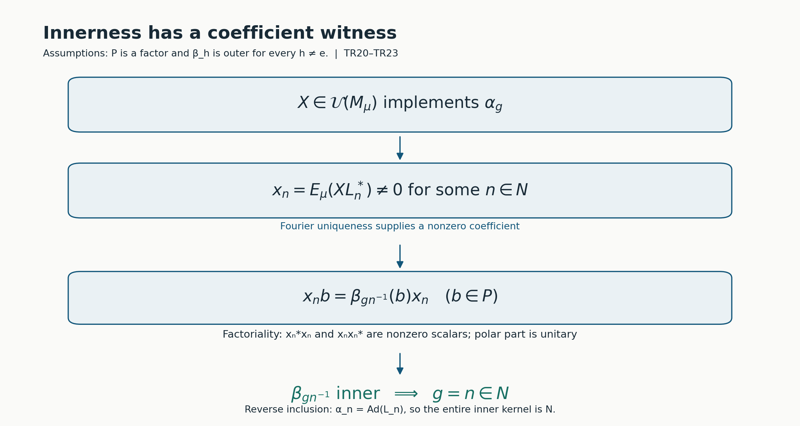
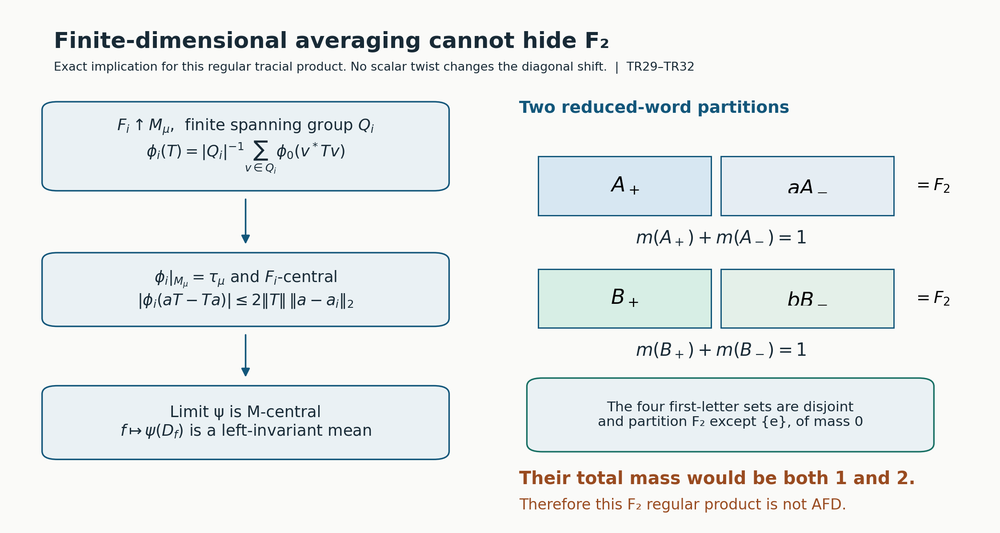

# Twisted regular products and prescribed inner kernels

*Original exposition, proofs, models, solved problems and figure sources: CC0-1.0. Existing mathematical sources, fonts and software retain their own terms.*

**Self-checked by the writing AI.**

A Fourier coefficient can detect whether a symmetry of a crossed product is inner. The detection works because a nonzero coefficient is an intertwiner in the original factor. We construct the Hilbert space, both multiplication actions, its trace and its coefficient maps before using that mechanism. We then build an action with a prescribed characteristic pair and prove its entire inner kernel. Finite normal subgroups give an explicit AFD branch. For the same regular construction an invariant-mean argument explains the obstruction from a nonamenable subgroup.

The group is countable, but the initial finite factor need not have separable predual. All approximation statements concerning its operators use nets. The concrete Bernoulli model is separable and covers finite as well as infinite countable groups. Original figure and code terms are retained in TERMS.

## 1. The input and the bounded completion tools

Let \(G\) be a countable discrete group, \(N\triangleleft G\), and \(P\ne0\) a finite factor with a **supplied faithful normal tracial state** \(\tau\), normalized by \(\tau(1)=1\). Let \(\beta:G\to\operatorname{Aut}(P)\) be a normal trace-preserving action. We will state explicitly where outerness is needed; it is not an input to the initial completion.

A normalized compatible pair has functions \(\mu:N^2\to\mathbb T\), \(\lambda:N\times G\to\mathbb T\), satisfying
\[
\begin{aligned}
\mu(a,b)\mu(ab,c)&=\mu(a,bc)\mu(b,c),\\
\lambda(a,gh)&=\lambda(a,g)\lambda(g^{-1}ag,h),\\
\frac{\lambda(a,g)\lambda(b,g)}{\lambda(ab,g)}
 &=\frac{\mu(g^{-1}ag,g^{-1}bg)}{\mu(a,b)},\\
\lambda(m,n)&=\frac{\mu(n,n^{-1}mn)}{\mu(m,n)},\\
\mu(e,a)=\mu(a,e)&=\lambda(e,g)=\lambda(a,e)=1.
\end{aligned}\tag{TR1}
\]
These are precisely the current CPP convention. In particular, the fourth line is required. Countability makes every scalar function here Borel. The first line alone suffices through Section 4. It gives \(\mu(n,n^{-1})=\mu(n^{-1},n)\), by substituting \((n,n^{-1},n)\).

We use complex inner products linear in their first argument. An ultraweak test on a concrete operator algebra is a sum \(\sum_j\langle X\xi_j,\eta_j\rangle\), with both vector families square summable. Cauchy–Schwarz controls the tail uniformly on an operator-norm bounded set. Thus bounded weak-operator convergence implies ultraweak convergence. Fixed left and right multiplication are ultraweak continuous: move the fixed operator to the appropriate vector family. Positive square roots, continuous calculus, Hilbert projections, the bicommutant theorem, supports and polar decomposition are the bounded operator proofs listed in Section 12; the exact real separation proof is NP1–2. Here are the two completion consequences we need, with their arguments.

**Bounded approximation lemma.** If \(\mathcal A\) is a unital star subalgebra of \(B(H)\), each \(X\in\mathcal A''\) is a strong-star limit of \(A_i\in\mathcal A\) with \(\|A_i\|\le\|X\|\).

**Proof.** The finite-vector bicommutant argument first gives unbounded strong and weak approximation: on \(H^k\), the projection onto the closure of \(\{(A\xi_1,\ldots,A\xi_k):A\in\mathcal A\}\) has entries in \(\mathcal A'\), so it commutes with the diagonal action of \(X\). Its range contains \((\xi_1,\ldots,\xi_k)\), and hence \((X\xi_1,\ldots,X\xi_k)\). This supplies the simultaneous finite-vector approximant.

The selfadjoint part is strongly dense in the selfadjoint part of \(\mathcal A''\). Indeed symmetrizing gives weak density. A strongly continuous real linear functional on this selfadjoint space has a bound by finitely many quantities \(\|A\xi_j\|\). It factors through \(A\mapsto(A\xi_j)_j\); real Hahn–Banach and Hilbert Riesz write it as \(\operatorname{Re}\sum_j\langle A\xi_j,\eta_j\rangle\), a weakly continuous functional. Real separation therefore gives equality of weak and strong closures of a convex set.

For a selfadjoint contraction \(X\), put \(Y=X(1+\sqrt{1-X^2})^{-1}\). The denominator is at least one. The real scalar function \(f(t)=2t/(1+t^2)\) has \(|f|\le1\) and \(f(Y)=X\). Choose selfadjoint \(C_i\in\mathcal A\) converging strongly to \(Y\). The identity
\[
(C_i-z)^{-1}-(Y-z)^{-1}
 =(C_i-z)^{-1}(Y-C_i)(Y-z)^{-1},\qquad z=\pm i,
\]
and the resolvent bound \(\|(C_i-z)^{-1}\|\le1\) give strong convergence of both resolvents without any norm bound on \(C_i\). Their sum is \(f(C_i)\), so \(f(C_i)\to X\) strongly. Each \(f(C_i)\) is a selfadjoint contraction in the norm closure of \(\mathcal A\): polynomial approximation on the individual bounded spectral interval proves this. Approximate it in norm within \(\varepsilon\) by a selfadjoint algebra element and divide by \(1+\varepsilon\). The result is a contraction within \(2\varepsilon\). The product net, with increasing \(i\) and decreasing \(\varepsilon\), gives selfadjoint strong-star approximation. For an arbitrary contraction apply this result in \(M_2(\mathcal A)\) to \(\begin{pmatrix}0&X\\X^*&0\end{pmatrix}\). The upper-right entries of the selfadjoint approximants are contractions in \(\mathcal A\), and the lower-left entries are their adjoints. Coordinate-vector tests give both required limits. Scaling handles arbitrary \(X\); for zero use the constant zero net. \(\square\)

The matrix amplification used in that proof has no extra density premise: commuting with the scalar matrix units makes an operator in \(M_2(\mathcal A)'\) equal to \(\operatorname{diag}(T,T)\), and commuting with the diagonal copies of \(\mathcal A\) says \(T\in\mathcal A'\). Its commutant is therefore exactly \(M_2(\mathcal A'')\).

**Bounded weak compactness lemma.** A norm-bounded net in a weak-operator closed algebra has a weak-operator cluster subnet. We also need an ultrafilter limit of norm-one states, which need not be normal.

**Proof.** The tail sets of the directed index set generate a proper filter. Zorn's lemma extends it to an ultrafilter: the union of a chain of proper filters is proper, and a maximal proper filter decides each subset, because otherwise adjoining that subset would still give a proper filter. Every bounded real function on this index set has an ultrafilter limit. Bisect a closed containing interval, keep a half whose inverse image belongs to the ultrafilter, and repeat; the nested intervals have lengths tending to zero and one common real point. For complex functions take real and imaginary parts. Limits preserve finite sums, products and inequalities, by intersecting finitely many sets in the ultrafilter.

For operators of norm at most \(C\), take the limit of every vector coefficient. The resulting sesquilinear form has bound \(C\|\xi\|\|\eta\|\), so Hilbert Riesz gives an operator of norm at most \(C\). It lies in the original weakly closed algebra. The ultrafilter convergence is weak-operator convergence; the usual subnet is constructed by indexing pairs consisting of an original tail and a finite family of neighborhoods of the limit, then choosing an index in their intersection. For states take the limit at every algebra element. The result is linear, positive, unital and has norm one: state Cauchy–Schwarz follows by expanding \(\phi((x+ty)^*(x+ty))\ge0\), and gives \(|\phi(x)|\le\|x\|\). These properties pass to the limits. There is no assertion that the limiting state is normal. \(\square\)

For clarity, the trace GNS realization used below can also be obtained without a general weight normality theorem. Complete \(P\) for \(\|a\|_2^2=\tau(a^*a)\); faithfulness makes this a norm. Left and right multiplication have bounds \(\|a\|\), using positivity and the trace. Their adjoints are multiplication by \(a^*\). The left representation is isometric: for \(B=a^*a\), choose a nonzero continuous spectral function \(c=h(B)\) supported where \(t>\|a\|^2-\varepsilon\). The continuous calculus and its spectral norm show \(c\ne0\); faithfulness gives \(\|c\|_2>0\), and \(\|ac\|_2^2\ge(\|a\|^2-\varepsilon)\|c\|_2^2\). Let \(\varepsilon\downarrow0\).

The image is weakly closed. On a bounded weakly converging net in the original concrete \(P\), the trace coefficients \(\tau(b^*xa)\) converge, because the net is ultraweakly converging and \(\tau\) is supplied normal. Approximate arbitrary GNS vectors by \(a,b\in P\); the uniform bound gives convergence of every GNS vector coefficient. Consequently the image of the original unit ball is weakly compact by the preceding lemma. Apply bounded approximation to its generated algebra: any contraction in the bicommutant is a weak limit of image contractions, and compactness returns it to that image. Thus the image is a von Neumann algebra. The same bounded-ball argument gives the weak homeomorphism of the two unit balls. Increasing positive nets converge to their suprema in both representations by their quadratic forms, so this identification preserves those suprema. In what follows \(P\) means this **concrete trace representation** on \(H_0=L^2(P,\tau)\), \(\widehat a\) its vectors, and \(\widehat1\) its cyclic separating vector. Its vector trace is normal for the concrete ultraweak tests. None of these steps assumes separability.

## 2. An algebra and two bounded multiplication actions

Use formal symbols \([n]\), \(n\in N\). Let \(\mathcal C\) be the finite sums \(\sum_n a_n[n]\), with
\[
 (a[n])(b[k])=a\beta_n(b)\mu(n,k)[nk],\qquad
 (a[n])^*=\overline{\mu(n^{-1},n)}\,
       \beta_{n^{-1}}(a^*)[n^{-1}].\tag{TR2}
\]
The identity is \(1[e]\). The two associations of three monomials have coefficient \(a\beta_n(b)\beta_{nk}(c)\), and phases \(\mu(n,k)\mu(nk,l)\) and \(\mu(n,kl)\mu(k,l)\). Thus multiplication is associative. To verify that the adjoint reverses products, cocycle substitution at \((k^{-1},n^{-1},nk)\) and \((n^{-1},n,k)\) gives
\[
 \mu(k^{-1},n^{-1})\mu((nk)^{-1},nk)
 =\frac{\mu(k^{-1},k)\mu(n^{-1},n)}{\mu(n,k)}.
\]
Together with \(\beta_{(nk)^{-1}}\beta_n=\beta_{k^{-1}}\), this identity equates the scalar and algebra coefficients of \(((a[n])(b[k]))^*\) and \((b[k])^*(a[n])^*\). Applying the adjoint twice returns the monomial, since \(\mu(n,n^{-1})=\mu(n^{-1},n)\). In particular \([n]^*=[n]^{-1}=\overline{\mu(n^{-1},n)}[n^{-1}]\).

Define \(t_0(\sum_n a_n[n])=\tau(a_e)\). For \(X=\sum_n a_n[n]\),
\[
 t_0(X^*X)=\sum_n\tau(a_n^*a_n).\tag{TR3}
\]
Indeed the identity coefficient is \(\sum_n\beta_{n^{-1}}(a_n^*a_n)\); the phases cancel and \(\tau\) is invariant. This proves positivity and faithfulness on \(\mathcal C\). It is tracial: the identity coefficient of \(XY\) has trace
\(\sum_n\mu(n,n^{-1})\tau(a_n\beta_n(b_{n^{-1}}))\).
Trace invariance and traciality change that term to
\(\mu(n^{-1},n)\tau(b_{n^{-1}}\beta_{n^{-1}}(a_n))\), precisely the corresponding term for \(YX\).

The Hilbert completion for \(\langle X,Y\rangle=t_0(Y^*X)\) is
\(\mathcal H=\ell^2(N,H_0)\), in **coefficient coordinates** \(a_n[n]\mapsto(\widehat a_n)_n\). Its finite coefficient vectors are dense by square-sum truncation and the density of \(P\) in \(H_0\).

Let \(V_g\widehat a=\widehat{\beta_g(a)}\). Invariance of the trace makes it isometric, and \(V_{g^{-1}}\) is its inverse. Thus \(V_gV_h=V_{gh}\) on the completion. In coefficient coordinates the left generators are
\[
 (\ell_a y)(m)=a y(m),\qquad
 (\ell_n y)(m)=\mu(n,n^{-1}m)V_n y(n^{-1}m).\tag{TR4}
\]
They have norms \(\|a\|\) and 1, respectively. The first norm follows from the trace GNS isometry and a vector supported at one coordinate. The second follows from a bijective shift, a modulus-one phase and a unitary \(V_n\).

The **right** generators, multiplying a monomial vector on its right, are
\[
 (r_b y)(m)=y(m)\beta_m(b),\qquad
 (r_n y)(m)=\mu(mn^{-1},n)y(mn^{-1}).\tag{TR5}
\]
For each coordinate,
\(\|y(m)\beta_m(b)\|_2^2\le\|b\|^2\|y(m)\|_2^2\): on algebra vectors move the factors through the trace and use \(\beta_m(bb^*)\le\|b\|^2\), then extend by Hilbert density. Right multiplication on \(H_0\) is isometric in its operator norm, since \(J_0\widehat a=\widehat{a^*}\) is an antiunitary and conjugates right multiplication by \(b\) to left multiplication by \(b^*\). Testing coordinate \(e\) therefore gives \(\|r_b\|=\|b\|\). The shift \(r_n\) is unitary and has norm 1. A right monomial \(b[n]\) acts as \(r_n r_b\), so its norm is exactly \(\|b\|\); a finite sum has the bound \(\sum_n\|b_n\|\).

On the finite algebra vectors every left multiplication commutes with every right multiplication by associativity of (TR2). The operators just constructed are bounded, so the identities hold on all of \(\mathcal H\). Also \(r_X^*=r_{X^*}\): on finite vectors this follows from \(t_0\)'s trace identity, and the bounded extensions preserve it. Right multiplication reverses the operator composition order; for instance \(r_n r_k=\mu(k,n)r_{kn}\). This is consistent with its commutation with the left algebra.

The algebraic adjoint also gives a concrete antiunitary. Define \(JX=X^*\) on the finite algebra vectors. The trace identity and (TR3) give \(\|JX\|_2=\|X\|_2\); conjugate linearity and \(J^2=1\) extend it to an antiunitary of \(\mathcal H\). Its coefficient formula is
\[
 (Jy)(m)=\overline{\mu(m,m^{-1})}\,V_mJ_0y(m^{-1}).
\]
Indeed this is exactly the coefficient at \(m\) in (TR2)'s adjoint. On the finite vectors \(J\ell_XJ=r_{X^*}\), because \((XY^*)^*=YX^*\); boundedness extends that identity to the completion. Thus the adjoint exchanges the two actual bounded actions.

For the regular form, identify \(\mathcal H\) with \(K=\ell^2(N,H_0)\) by the unitary \((Sy)(m)=V_{m^{-1}}y(m)\). In these **regular coordinates** the left generators are
\[
 (\pi(a)\xi)(m)=\beta_{m^{-1}}(a)\xi(m),\qquad
 (L_n\xi)(m)=\mu(n,n^{-1}m)\xi(n^{-1}m).\tag{TR6}
\]
The transported right generators are, explicitly,
\[
 (R_b\xi)(m)=\xi(m)b,\qquad
 (R_n\xi)(m)=\mu(mn^{-1},n)V_{n^{-1}}\xi(mn^{-1}).\tag{TR7}
\]
For the latter formula, \(V_{m^{-1}}V_{mn^{-1}}=V_{n^{-1}}\). This verifies the transport rather than leaving an unproved right Hilbert-algebra action. In particular
\[
 L_nL_k=\mu(n,k)L_{nk},\qquad
 L_n\pi(a)L_n^*=\pi(\beta_n(a)).\tag{TR8}
\]
Put \(M_\mu=(\pi(P)\cup L(N))''\) and \(\Omega=\delta_e\otimes\widehat1\). Both the left and right finite monomial orbits of \(\Omega\) are dense: in coefficient coordinates each is exactly \(\mathcal C\), embedded densely. All transported right operators commute with \(M_\mu\), since their commutation sets are weakly closed.

Transporting the antiunitary gives \(\mathcal J=SJS^*\), with the explicit regular formula
\[
 (\mathcal J\xi)(m)=\overline{\mu(m,m^{-1})}\,V_{m^{-1}}J_0\xi(m^{-1}).
\]
Here \(J_0V_g=V_gJ_0\), as both sides send \(\widehat a\) to \(\widehat{\beta_g(a^*)}\). The phase equality following (TR1) and the inverse coordinate shift also verify \(\mathcal J^2=1\) directly. On the left finite-polynomial algebra, \(\mathcal JX\Omega=X^*\Omega\).

## 3. A faithful normal trace on the whole generated algebra

**Trace theorem.** The vector state
\[
 \tau_\mu(X)=\langle X\Omega,\Omega\rangle\quad(X\in M_\mu)\tag{TR9}
\]
is faithful, normal and tracial, and extends \(t_0\).

**Proof.** Its restriction to the finite monomial algebra is \(t_0\), by (TR6) and normalization. It is a normal vector state, one of the single-term concrete ultraweak tests. If \(X\Omega=0\), then \(XR_Y\Omega=R_YX\Omega=0\) for every right finite monomial \(Y\). Their vectors are dense, hence \(X=0\). Thus \(\Omega\) is separating. For \(X\ge0\), \(\tau_\mu(X)=0\) makes \(\sqrt X\Omega=0\), so separatingness gives \(X=0\).

Let \(X,Y\in M_\mu\). The bounded approximation lemma supplies finite-polynomial operators \(X_i,Y_j\) converging strong-star to them, with bounds \(\|X_i\|\le\|X\|\), \(\|Y_j\|\le\|Y\|\). On the product directed set,
\[
 \|(X_iY_j-XY)\xi\|
 \le\|X\|\|(Y_j-Y)\xi\|+\|(X_i-X)Y\xi\|\to0.
\]
The reverse products have the analogous bound. Taking the vector state and the finite trace equality gives \(\tau_\mu(XY)=\tau_\mu(YX)\). This proves the trace at the whole-algebra boundary; density without the bounded approximation step would not justify this product limit. \(\square\)

The trace makes \(M_\mu\) finite: an isometry \(v\) has \(\tau_\mu(1-vv^*)=1-\tau_\mu(v^*v)=0\), so faithfulness gives \(vv^*=1\). The identification \(X\mapsto X\Omega\) is the whole trace GNS completion of \(M_\mu\), because \(\Omega\) is cyclic, and \(\|X\Omega\|^2=\tau_\mu(X^*X)\).

The same bounded strong-star approximants extend \(\mathcal JX\Omega=X^*\Omega\) to every \(X\in M_\mu\). Hence the concrete antiunitary independently checks \(\tau_\mu(X^*X)=\|X\Omega\|^2=\|X^*\Omega\|^2=\tau_\mu(XX^*)\). Polarizing this equality gives \(\tau_\mu(A^*B)=\tau_\mu(BA^*)\), and replacing \(A\) by an adjoint gives the whole trace identity. This check uses the completed adjoint, rather than assuming a right action exists from a Hilbert-algebra label.

## 4. Normal expectation and Fourier uniqueness

For \(s\in N\), let \(J_s:H_0\to K\) insert a vector at coordinate \(s\). Set \(X_{t,s}=J_t^*XJ_s\). These matrix slices have norm at most \(\|X\|\). They are normal: an output ultraweak coefficient sum is the input sum obtained by applying \(J_s,J_t\) to its two square-summable vector families.

For a finite sum \(X=\sum_n\pi(x_n)L_n\), direct evaluation gives
\[
 X_{t,s}=\beta_{t^{-1}}(x_{ts^{-1}})\mu(ts^{-1},s).\tag{TR10}
\]
For general \(X\in M_\mu\), take bounded strong-star finite-polynomial approximants. Their slices converge strongly on \(H_0\), so they remain in the weakly closed represented \(P\). The \((e,e)\) slice therefore defines
\[
 E_\mu(X)=X_{e,e}\in P.\tag{TR11}
\]
It is unital, normal and completely positive: at every finite matrix level it is the compression by the direct sum of copies of \(J_e\), which preserves positivity. Since \(\pi(a)J_e=J_e a\), it is \(P\)-bimodular:
\(E_\mu(\pi(a)X\pi(b))=aE_\mu(X)b\).
It fixes \(\pi(P)\), so it is a conditional expectation onto \(P\). Its norm is one: compression is contractive and it fixes the unit. Furthermore
\[
 \tau\circ E_\mu=\tau_\mu.\tag{TR12}
\]
This is the same vector coefficient at \(\widehat1\). Faithfulness follows: a positive \(X\) with \(E_\mu(X)=0\) has trace zero, hence is zero.

**Fourier theorem.** The coefficient maps
\[
 x_n(X)=E_\mu(XL_n^*)
 =\frac{X_{e,n^{-1}}}{\mu(n,n^{-1})}\in P\tag{TR13}
\]
are normal and have norm at most one. Formula (TR10) holds for every \(X\in M_\mu\). The coefficients uniquely determine \(X\), and
\[
 \tau_\mu(X^*X)=\sum_{n\in N}\|x_n(X)\|_2^2.\tag{TR14}
\]

**Proof.** For finite sums (TR13) follows either by multiplying \(L_n^*\) or by the \((e,n^{-1})\) entry. Normality follows from normal compression and fixed multiplication; contractivity uses that \(L_n\) is unitary. For the general matrix formula pass to bounded weak limits of finite approximants. Both its coefficient slices and \(\beta_{t^{-1}}\) are weakly continuous on these bounded balls in the trace representation. For the latter fact its GNS unitary is \(V_{t^{-1}}\), since \(V_g aV_g^*=\beta_g(a)\); hence it is actual unitary conjugation. Thus (TR10) survives the limit. If every coefficient is zero, every matrix entry is zero. Testing finite coordinate vectors, which are dense in \(K\), makes \(X=0\).

Its vector \(X\Omega\) has coordinate \(\widehat{\beta_{n^{-1}}(x_n(X))}\), by the \((n,e)\) entry. Square summability and trace invariance give (TR14). For finite \(F\subset N\),
\[
 \left\|X-\sum_{n\in F}\pi(x_n(X))L_n\right\|_{2,\tau_\mu}^2
 =\sum_{n\notin F}\|x_n(X)\|_2^2\longrightarrow0.\tag{TR15}
\]
This is a trace-norm Hilbert conclusion. It does not place a uniform operator bound on these Fourier partial sums. The earlier bounded approximants have a different purpose and must not be replaced by (TR15) when passing operator products to limits. \(\square\)

*Figure 1. Sections 2–4, (TR6), (TR10)–(TR15). The pictured subgroup is exactly N=C₂={e,t}, with μ=1. The displayed block matrix is the actual regular operator π(a)+π(b)L_t. The projection reads a for the expectation, while the two trace-GNS coordinates give ||a||₂²+||b||₂². The diagram shows algebra-valued entries, not scalar sample entries. Source question: Takesaki III, XVII.3 Exercise 5(a), printed p.293; the construction, diagram and checks here are original. [Figure source](../assets/twisted-regular-products/render_and_check.py), [model data](../assets/twisted-regular-products/models.json).*

## 5. Bringing the whole group back to the product

Now use the remaining lines of (TR1). Define on the **regular** Hilbert space
\[
 (W_g\xi)(m)=\lambda(m,g)V_g\xi(g^{-1}mg).\tag{TR16}
\]
Normality of N makes the coordinate shift a permutation of N. Hence W_g is unitary. The action identity in (TR1) gives W_gW_h=W_gh, with W_e=1. On \(\pi(P)\),
\[
 W_g\pi(a)W_g^*=\pi(\beta_g(a)).\tag{TR17}
\]
Indeed the operator at coordinate m is transformed to
\(\beta_g\beta_{(g^{-1}mg)^{-1}}(a)=\beta_{m^{-1}}\beta_g(a)\).

For \(n'=gng^{-1}\), put \(b=n'^{-1}m\). The coefficient of W_gL_nW_g* at m is
\[
 \frac{\lambda(m,g)}{\lambda(b,g)}\mu(n,g^{-1}bg)
 =\lambda(n',g)\mu(n',b),\tag{TR18}
\]
because the compatibility equation is
\(\lambda(n',g)\lambda(b,g)/\lambda(m,g)
=\mu(n,g^{-1}bg)/\mu(n',b)\).
Consequently
\[
 W_gL_nW_g^*=\lambda(gng^{-1},g)L_{gng^{-1}}.\tag{TR19}
\]
These formulas show that \(\alpha_g=\operatorname{Ad}(W_g)|_{M_\mu}\) is a normal action of G. It preserves the trace: W_g fixes \(\Omega\), since \(\lambda(e,g)=1\) and \(V_g\widehat1=\widehat1\). Normality here is literal conjugation by a fixed Hilbert unitary, so it preserves all concrete ultraweak tests. The action is continuous for the discrete topology on G.

For \(h,n\in N\), the inner-action equation gives
\(\lambda(hnh^{-1},h)=\mu(h,n)/\mu(hnh^{-1},h)\).
This is exactly the phase of L_hL_nL_h*, found by comparing L_hL_n with L_(hnh⁻¹)L_h. Its action on \(\pi(P)\) is \(\beta_h\), by (TR8). Thus
\[
 \alpha_h=\operatorname{Ad}(L_h)\quad(h\in N).\tag{TR20}
\]
Both generator families were checked; covariance on \(\pi(P)\) alone would not prove (TR20).

## 6. A nonzero coefficient detects the entire inner kernel

**Factor and kernel theorem.** If \(\beta_n\) is outer for all \(n\in N\setminus\{e\}\), then \(\pi(P)'\cap M_\mu=\mathbb C1\), and \(M_\mu\) is a finite factor. If \(\beta_g\) is outer for every \(g\ne e\) in G, then
\[
 N(\alpha)=\{g:\alpha_g\text{ is inner on }M_\mu\}=N.\tag{TR21}
\]

**Proof.** Commutation of X with \(\pi(a)\), followed by its normal Fourier coefficient map, says
\(x_n(X)\beta_n(a)=a x_n(X)\) for every a. We use the following factor calculation. If \(0\ne c\in P\) satisfies \(cb=\theta(b)c\) for all b and an automorphism θ, the adjoint identity shows that c*c commutes with P and cc* commutes with θ(P)=P. Both are nonzero scalar operators. Their supports are 1, so the polar part v is a unitary; then c=rv with r>0, and θ(b)=vbv*. This proves innerness, including both full supports, without treating a partial implementer as a unitary by assertion.

The calculation excludes every nonidentity coefficient of X in the relative commutant. Its identity coefficient is central in P, hence scalar. Fourier uniqueness proves X is that scalar. The center of \(M_\mu\) is contained in this relative commutant, proving factoriality.

Suppose now that a unitary X in \(M_\mu\) implements \(\alpha_g\). Its equation on the original algebra is Xπ(a)=π(β_g(a))X. Taking coefficients gives
\[
 x_n(X)\beta_n(a)=\beta_g(a)x_n(X).\tag{TR22}
\]
Some coefficient is nonzero, since X≠0 and coefficients are injective. Replacing a by \(\beta_{n^{-1}}(b)\) gives \(x_n(X)b=\beta_{gn^{-1}}(b)x_n(X)\). The factor calculation makes \(\beta_{gn^{-1}}\) inner. The verified free action forces gn⁻¹=e; hence g=n belongs to N. Equation (TR20) proves the reverse inclusion. \(\square\)

When P is infinite-dimensional, this finite factor is type II₁. Here is the exact elementary type inference. A factor M with a faithful normalized tracial state τ_M and a minimal projection p has scalar corner pMp: otherwise split a nonscalar selfadjoint corner element at a real number strictly between two of its spectral values and take the nonzero orthogonal supports of its positive and negative parts, obtaining a proper subprojection. The join of any family of projections in M is the projection onto the closed span of their ranges. Every operator in M′ and its adjoint preserves these ranges, so that projection is in M″=M. This also proves the arbitrary join used here.

In a factor, qMp≠0 for every pair of nonzero projections p,q. Indeed, the join of the unitary conjugates of p is central, because conjugation permutes this family. Commutation with all unitaries implies centrality: a selfadjoint contraction a is \((u+u^*)/2\) for the unitary \(u=a+i\sqrt{1-a^2}\), and every element is a linear combination of selfadjoint contractions. The join is therefore 1. If qMp were zero, q would annihilate every conjugate range and would be orthogonal to that join. A nonzero corner element and its polar decomposition thus produce a copy of p under q. Zorn's lemma supplies a maximal orthogonal family of copies of p. Its complement must vanish by the preceding corner calculation, so the family fills 1. All copies have the same positive trace τ_M(p); finite additivity and τ_M(1)=1 bound their number by 1/τ_M(p), so the family is finite. Their connecting partial isometries give matrix units, and each matrix entry is scalar in pMp; the finite sum of these entries identifies M with a finite matrix algebra. Therefore an infinite-dimensional factor with a faithful normal normalized trace has no minimal projection, which is the II₁ definition. In our product, an infinite-dimensional P embeds faithfully via π, so \(M_\mu\) cannot be a finite matrix algebra. This inference uses no general type decomposition or factor classification.

With implementers L_n for precisely the inner kernel N, (TR8) and (TR19) give
\[
 L_nL_k=\mu(n,k)L_{nk},\qquad
 \alpha_g(L_{g^{-1}ng})=\lambda(n,g)L_n.\tag{TR23}
\]
Thus the actual characteristic class is \([\lambda,\mu]\) in CPP's \(\Lambda(G,N,\mathbb T)\). The full-kernel proof precedes this conclusion. It is not just an invariant on a smaller subgroup known to act innerly.

*Figure 2. Theorem (TR21), proof equation (TR22). A nonzero coefficient belongs to the factor P and intertwines β_n and β_g. Its polar part therefore implements β_(gn⁻¹); the free action forces g=n. The reverse inclusion comes from α_n=Ad(L_n). Every implication and assumption shown is used in Section 6. This is a diagram of the proved mechanism, not a classification diagram. Human source question: Takesaki III, XVII.3 Exercise 5(b). [Reproduction and checks](../assets/twisted-regular-products/render_and_check.py).*

## 7. A change of phase is an actual unitary comparison

Let f:N→𝕋 satisfy f(e)=1 and put
\[
 \mu^f(n,k)=\mu(n,k)\frac{f(n)f(k)}{f(nk)},\qquad
 \lambda^f(n,g)=\lambda(n,g)\frac{f(g^{-1}ng)}{f(n)}.\tag{TR24}
\]
These are CPP's gauges; their preservation of (TR1) is also immediate from cancellation. In the multiplier equation every gauge term reduces to f(a)f(b)f(c)/f(abc). In the action equation the intermediate f(g⁻¹ng) cancels. The compatibility equation is the ratio of the multiplication gauges at the conjugated and original arguments. For inner action, the ratio of the two multiplication gauges is f(n⁻¹mn)/f(m), its λ gauge. Normalization follows from f(e)=1.

**Gauge theorem.** The diagonal unitary \(D_f\xi(m)=f(m)^{-1}\xi(m)\) fixes \(\pi(P)\) and gives a normal trace-preserving isomorphism \(M_\mu\to M_{\mu^f}\) intertwining the two G-actions.

**Proof.** Its inverse multiplies by f(m). Directly,
\[
 D_fL_n^\mu D_f^*=f(n)^{-1}L_n^{\mu^f},\qquad
 D_fW_g^\lambda D_f^*=W_g^{\lambda^f}.\tag{TR25}
\]
For the first identity the coordinate phase is μ(n,n⁻¹m)f(n⁻¹m)/f(m), which is f(n)⁻¹μ^f(n,n⁻¹m). For the second it is λ(m,g)f(g⁻¹mg)/f(m). The scalar f(n)⁻¹ does not affect the generated algebra. Conjugation by D_f maps all generators onto the target generators and has the inverse conjugation, hence is a normal isomorphism. It fixes Ω, so it preserves the traces. The second identity proves exact action intertwining. The target's chosen implementer L_n^(μ^f) is f(n) times the image of the old implementer; this explains why the characteristic pair changes by (TR24) even though the actions are conjugate. \(\square\)

## 8. A verified free action for every countable group

Use the index set I=G×ℕ, including when G is finite or trivial. At each site take M₂ with its normalized matrix trace. Its Hilbert space is M₂ with inner product tr(y*x), pointed at 1. Form the finite tensor spaces by appending that unit vector and complete their increasing union. This supplies the product Hilbert space H, the vector Ω_P and its finite tensor density. The left local matrix algebras A_F, F finite in I, act boundedly; the analogous right algebras commute with them. Each local left or right orbit of Ω_P fills the finite tensor space. Thus both local orbits are dense. Let P be the bicommutant of the left local union.

The right orbit makes Ω_P separating by the same commuting-orbit argument as Section 3. Its vector state τ is faithful and normal. It is tracial on every finite local algebra; bounded strong-star approximation from their union proves it tracial on all of P exactly as in Section 3. This is also the fully concrete trace-specialization of the earlier ITP Sections 11.2–11.3.

Here is the factor and approximation calculation in this actual model. Write H=H_F⊗H_(I\F), define J_Fη=η⊗Ω_(I\F), and set
\(\widehat E_F(X)=(J_F^*XJ_F)\otimes1\).
The finite dimension of H_F makes this map a finite linear combination of vector coefficients times fixed matrix units; it is normal and weakly continuous. On a local left product, its compression is left multiplication by the finite tensor trace of the other sites. Hence \(\widehat E_F(P)\subset A_F\), by weak density and weak closedness of A_F. The latter can be checked on the finite leg: operators commuting with every right multiplication are left multiplications, since T(x)=T(1)x; their commutation equations are weakly closed. The finite coefficient expression for amplification then retains this closedness on the whole product space.

For a finite tensor vector η supported in E⊆F,
\(\widehat E_F(X)\eta=Q_FX\eta\), where Q_F projects onto H_F⊗Ω_(I\F). As F increases, Q_F→1 strongly by finite tensor density. The bound \(\|\widehat E_F(X)\|\le\|X\|\) extends convergence to every vector. Applying it to X* gives strong-star convergence. If X is central in P, its finite expectation commutes with A_F by the bimodule identity. It therefore is scalar in the full matrix algebra A_F; its scalar is τ(X), since the expectation fixes the reference vector state. Their strong limit makes X=τ(X)1. Thus P is a factor. It contains full matrix algebras of arbitrarily large dimensions, so the finite-factor argument in Section 6 proves type II₁. A countable exhaustion of I makes it sequentially AFD. These are the exact local expectation and type arguments of ITP Sections 11.6 and 12, now at the tracial sites we use.

Let g move site (h,k) to (gh,k). The coordinate permutation fixes Ω_P and is a unitary of the finite-tensor completion, with inverse from g⁻¹. It conjugates the local left algebras to their permuted local algebras and gives a trace-preserving normal automorphism β_g of P. On local tensors β_gβ_h=β_gh; density gives that identity throughout P.

Fix g≠e and let z_k be diag(1,−1) at (e,k). It has trace zero and 2-norm one. For every x∈P and a local tensor approximation a,
\[
 \|[z_k,x]\|_2\le2\|x-a\|_2+\|[z_k,a]\|_2.\tag{TR26}
\]
The last term is eventually zero. Local approximations exist by the strong convergence of E_F(x); hence (z_k) is central. Its image is at the distinct site (g,k), so the product trace gives
\[
 \|\beta_g(z_k)-z_k\|_2^2=1+1-2\operatorname{Re}\tau(\beta_g(z_k)z_k)=2.\tag{TR27}
\]
If β_g=Ad(u), this distance would equal \(\|[u,z_k]\|_2\to0\), a contradiction. Thus β is outer at every nonidentity g. In particular it supplies every freeness premise in Sections 6 and 9, for the actual group being used.

Bounded 2-norm convergence in this trace representation implies strong-star convergence: on a dense vector aΩ_P its squared norm is bounded by ||a||² times the squared 2-norm, and the adjoint has the same 2-norm. Conversely test Ω_P. Thus (TR27) also supplies a noncentrally-trivial automorphism at the tracial central-sequence scope. No nontracial claim follows from this trace estimate.

## 9. The constructive finite-subgroup AFD branch

**Finite-N theorem.** If N is finite and P,β are the Bernoulli model of Section 8, the action constructed in Sections 5–6 realizes [λ,μ] with exact inner kernel N on an AFD II₁ factor.

**Proof.** Enumerate I=G×ℕ. If E_i is its first i sites, put F_i=⋃_(n∈N)nE_i. These finite N-invariant sets increase and exhaust I. Let A_i be their local full matrix algebra, invariant under β_n for every n∈N. Then
\[
 B_i=\operatorname{span}\{\pi(a)L_n:a\in A_i,\ n\in N\}\tag{TR28}
\]
is a finite-dimensional unital star algebra. Formula (TR2) and N-invariance prove closure under multiplication and adjoints, not just finite-dimensionality of a vector span. Its dimension is |N|dim(A_i), since its Fourier coefficients are independent. A finite-dimensional operator subspace is norm and weakly closed: choose finitely many vector coefficient functionals separating a basis, solve for its coordinates, and use the resulting finite coefficient reconstruction. Thus B_i is a finite-dimensional von Neumann algebra. They increase. The generated algebra contains all L_n and π(A_i), and the latter generate π(P); one may use E_(F_i)(a)→a strongly with uniform bound coordinate by coordinate in (TR6), extending from finite coordinate vectors. Hence (⋃B_i)''=M_μ. Factoriality, the trace and the exact kernel follow from Sections 3 and 6; it contains the infinite-dimensional P. This proves the stated AFD II₁ branch with every hypothesis verified. \(\square\)

For N={e}, formulas give M_μ=P and α=β, with trivial characteristic pair and trivial inner kernel. For N=G, (TR20) makes the whole action inner, while the characteristic pair still records the projective implementers. When G=N is finite, the preceding branch applies. The construction also applies to infinite N=G, but the AFD conclusion of this section does not extend by replacing a finite span with an infinite one.

## 10. AFD averaging creates an invariant mean

**Regular-product obstruction.** If M_μ has an increasing unital finite-dimensional exhaustion, N admits a positive normalized left-invariant mean on ℓ∞(N). In particular the regular product for N=F₂ cannot be AFD, for any scalar twist and any trace-preserving base action in this construction.

**Proof.** Write M_μ=(⋃F_i)'' and use its trace vector Ω on K. We first derive the matrix-block structure needed for finite averaging. Let F⊆M_μ be a finite-dimensional unital star algebra. It is weakly closed: vector coefficient functionals separate its elements; choose finitely many whose restrictions form coordinates on a basis of F, and reconstruct an element from those coordinates. A weak limit therefore stays in F. In particular supports and continuous calculus remain in F, by the bounded tools of Section 1.

Start with the central projection 1. Whenever a central block zF has nonscalar center, choose a nonscalar selfadjoint element in that center. Split it at a number between two spectral values. The support of its positive part is a nonzero proper central projection below z: the nonzero negative part has orthogonal support, proving it is proper. Replace z by that projection and its complement within z. Each split increases the number of nonzero orthogonal central projections, which are linearly independent in F. Finite dimension therefore forces termination. We obtain 1=∑_jz_j with each z_jF having scalar center; its center is z_jZ(F), since a central element of the block, extended by zero on the other blocks, commutes with all of F.

In each such factor block choose a minimal nonzero projection. This requires no infinite descent premise: if p is not minimal, replace it by a proper nonzero subprojection q; then qFq is a proper subspace of pFp, because p−q is a nonzero element of the latter which is not in the former. Dimensions strictly decrease, so this procedure terminates. Normalize the restricted faithful trace by τ_j(x)=τ_μ(x)/τ_μ(z_j), x∈z_jF. The corner-contact and matrix-unit argument of Section 6 now applies inside this block, with unit z_j and trace τ_j. To spell out its finite conclusion, a minimal p has pFp=ℂp; the central join of its unitary conjugates is z_j. Every nonzero residual corner qFp therefore contains a nonzero element whose polar part has initial projection p and a copy of p under q. Adjoin orthogonal copies until the complement vanishes. Their common positive τ_j trace bounds their number, so they form a finite family p_1,…,p_d filling z_j. Choose v_k with v_k*v_k=p and v_kv_k*=p_k. The elements e_kl=v_kv_l* are matrix units. For x∈z_jF, every v_k*xv_l is scalar in pFp, and
\[
 x=\sum_{k,l=1}^{d}v_k(v_k^*xv_l)v_l^*.
\]
Thus they span the block and identify it with M_d. This proves locally that F≅⊕_jM_(d_j), with its concrete matrix units; no finite-dimensional structure theorem is imported.

There is now a finite group Q of unitaries spanning F. In a block use the clock diag(1,ζ,…,ζ^(d−1)) and cyclic shift, ζ=e^(2πi/d). Their finite group consists of the matrices ζ^rC^sS^t, with r,s,t taken modulo d, because the clock and shift commute up to a d-th root of unity. The d² clock-shift matrices are a basis: distinct shifts have disjoint matrix diagonals; for a fixed shift the d clock phases are independent by the finite geometric-sum identity ∑_(k=0)^(d−1)ζ^(kq)=0 for q not divisible by d. Embed each block's group by the identity on other blocks. Add the central sign which is +1 on that block and −1 on all other blocks; (1+s)/2 isolates it. The generated group is finite, since the block groups and these signs commute across different blocks and each has finitely many elements. Its linear span therefore contains every matrix unit of F. The case of one scalar block uses Q={1}.

Let φ₀(T)=⟨TΩ,Ω⟩ on B(K) and let Q_i span F_i. Define
\[
 \phi_i(T)=|Q_i|^{-1}\sum_{v\in Q_i}\phi_0(v^*Tv).\tag{TR29}
\]
It is a state, and φ_i|M_μ=τ_μ by trace invariance. Reindexing makes it invariant under conjugation by every v∈Q_i. Substituting Tv for T in φ_i(vTv*)=φ_i(T) gives φ_i(vT)=φ_i(Tv). Linearity and the spanning property therefore make it F_i-central. This is finite averaging, with no Haar measure or integration theorem hidden in the argument.

The closure of (⋃F_i)Ω is all of K. Its projection commutes with every F_i, since that closed subspace reduces their left action. It therefore commutes with M_μ and fixes Ω, so it fixes the dense M_μΩ. For a∈M_μ let a_iΩ be the orthogonal projection of aΩ to F_iΩ. The map F_i→F_iΩ is injective by separatingness, so a_i is an actual element of F_i, and ||a−a_i||₂→0. State Cauchy–Schwarz, φ_i|M_μ=τ_μ, and F_i-centrality give
\[
 |\phi_i(aT-Ta)|\le2\|T\|\,\|a-a_i\|_2\to0
 \quad(a\in M_\mu,\ T\in B(K)).\tag{TR30}
\]
For the left error use |φ_i((a−a_i)T)|²≤φ_i((a−a_i)(a−a_i)*)φ_i(T*T); the other error uses φ_i((a−a_i)*(a−a_i)). The trace makes both first factors the same squared 2-norm. The ultrafilter state lemma of Section 1 supplies a limit ψ on B(K). It still restricts to τ_μ, and (TR30) makes it M_μ-central.

For f∈ℓ∞(N), let (D_fξ)(m)=f(m)ξ(m). This is a unital positive embedding into B(K), and
\[
 L_nD_fL_n^*=D_{f\circ\ell_{n^{-1}}},\qquad
 \ell_{n^{-1}}(m)=n^{-1}m.\tag{TR31}
\]
The phases cancel in this conjugation. Centrality gives ψ(L_nTL_n*)=ψ(T). Hence f↦ψ(D_f) is a positive normalized left-invariant mean, as claimed.

For the concrete contradiction take N=F₂=⟨a,b⟩. Let A₊,A₋,B₊,B₋ be its reduced-word sets with first letters a,a⁻¹,b,b⁻¹. Every singleton has zero mass for an invariant mean: all have the same nonnegative mass and arbitrarily many distinct singletons have total at most 1. The four sets partition F₂\{e}, so their masses sum to 1. Cancellation gives exact disjoint partitions
\[
 F_2=A_+\sqcup aA_-,\qquad F_2=B_+\sqcup bB_-.\tag{TR32}
\]
For example, a(a⁻¹w)=w where w is empty or has first letter different from a; conversely every word outside A₊ arises this way. Invariance then gives m(A₊)+m(A₋)=1 and m(B₊)+m(B₋)=1. The four masses sum to 2, a contradiction. This proves the obstruction directly. \(\square\)

*Figure 3. Equations (TR29)–(TR32). The left side identifies the actual finite-dimensional spanning-unitary average and its trace-based extension to an M-central state on B(K). The right side is a diagram of the two exact reduced-word partitions of F₂, not a numerical sample: invariance makes each row's two masses sum to one, while the four disjoint first-letter sets have total one. Source question: Takesaki III, XVII.3 Exercise 5(a), printed p.293; the proof and figure here are independently expressed. [Reproduction source](../assets/twisted-regular-products/render_and_check.py).*

This obstruction concerns the regular product just constructed. It does not prove that no different action on an AFD factor can realize a specified characteristic class. An arbitrary infinite amenable subgroup needs a separate complete AFD theorem or another explicit construction. No such theorem or classification is claimed here.

## 11. Original models and solved diagnostics

**Model A: an infinite acting group with a finite inner kernel.** Let G=C₂×ℤ, write t for the C₂ generator and z for the integer generator, and take N={e,t}. Choose μ=1 and λ(t,t^εz^k)=(-1)^k, λ(e,g)=1. Multiplication and normalization are immediate. The action equation is the integer character identity, conjugation is trivial, compatibility is multiplicativity on C₂, and λ(t,t)=1 proves inner compatibility. Thus (TR1) holds. The Bernoulli model and Section 9 give an AFD II₁ factor with inner kernel exactly C₂. Its generators satisfy L_t²=1, α_t=Ad(L_t), α_z(L_t)=−L_t, α_z(π(a))=π(β_z(a)). This sign cannot be gauged away, since conjugation is trivial and every λ gauge equals one. It is an actual nontrivial characteristic coordinate with an infinite outer quotient.

For X=π(a)+π(b)L_t its regular matrix is
\[
 X=\begin{pmatrix}a&b\\\beta_t(b)&\beta_t(a)\end{pmatrix},\qquad
 E_\mu(X)=a,\quad\|X\|_2^2=\|a\|_2^2+\|b\|_2^2.\tag{TR33}
\]
The symmetry z sends (a,b) to (β_z(a),−β_z(b)). It cannot be inner: an implementer would have a nonzero e or t coefficient, making β_z or β_(zt) inner by (TR22), contrary to Section 8.

**Model B: the phase of a positive outer period.** Let G=ℤ, N=pℤ with p≥1, μ=1, and λ(kp,r)=ζ^(kr) for ζ^p=1. All compatibility equations are character equations; inner compatibility is ζ^(klp)=1. The Bernoulli construction gives a II₁ factor and an automorphism θ=α₁ with θ^p=Ad(L_p) and θ(L_p)=ζL_p. Exact kernel pℤ makes p its first positive inner power. This realizes the CPP cyclic coordinate without asserting an infinite-N AFD theorem. At p=1 the root is 1. At p=0 take N={0}: normalization gives the unique pair and θ has no nonzero inner power.

**Model C: a genuine non-AFD regular product.** Take G=N=F₂, λ=μ=1 and the Bernoulli P. Then M=P⋊_βF₂ is a II₁ factor, α_n=Ad(L_n) for the whole group, and its characteristic pair is trivial. Section 10 nevertheless proves that M is not AFD. A trivial characteristic class and a fully inner action therefore do not certify AFD of the underlying regular product.

**1. The right shift is not the left shift.** Prove r_nr_k=μ(k,n)r_(kn) in coefficient coordinates, and check it commutes with ℓ_l.

*Solution.* Right multiplication applies [k] first and [n] second to X, giving X([k][n])=μ(k,n)X[kn]. For the direct phase check, (r_nr_ky)(m) has phase μ(mn⁻¹,n)μ(mn⁻¹k⁻¹,k). The multiplier identity with (mn⁻¹k⁻¹,k,n) makes it μ(k,n)μ(m(kn)⁻¹,kn). Associativity of (TR2) then gives ℓ_l r_n=r_nℓ_l on the dense finite algebra; the bounds in Section 2 extend it to the whole Hilbert space.

**2. The projection defining the expectation.** For Y=π(a)L_n and n≠e, compute E(Y), E(Y*Y) and E(YY*).

*Solution.* E(Y)=0 because its diagonal identity coefficient is zero. Covariance gives Y*Y=π(β_(n⁻¹)(a*a)), while YY*=π(aa*). Thus the two expectations are β_(n⁻¹)(a*a) and aa*. Their τ traces both equal ||a||₂². A zero expectation of Y does not make Y zero; positivity and faithfulness apply to Y*Y or YY*.

**3. Fourier truncation and norm control.** Explain why (TR15) cannot replace bounded approximation in the proof of the trace theorem. Give the actual bound on a finite Fourier truncation.

*Solution.* The triangle inequality gives ||∑_(n∈F)π(x_n)L_n||≤∑_(n∈F)||x_n||≤|F|||X||. This grows with F, whereas (TR15) controls only the Hilbert trace norm of the tail. Products on arbitrary vectors require bounded strong approximation, whose nets Section 1 constructs separately. No assertion that the displayed upper bound is attained is needed to see that it supplies no uniform bound.

**4. Dropping the free action enlarges the inner kernel.** Take N={e}, P=ℂ and β trivial on a nontrivial countable G. Compute M and N(α).

*Solution.* K=ℂ, μ and λ are forced trivial, π(P)=ℂ, W_g=1, M=ℂ and α_g=id for every g. Hence N(α)=G, although the prescribed subgroup is {e}. The construction and trace remain valid; the exact-kernel theorem requires the free-action premise it states. For a factor, the only scalar-algebra automorphism is indeed the identity.

**5. Direction of the diagonal gauge.** Put N=G=C₃, μ=λ=1 and f(e)=1, f(t)=i, f(t²)=1. Compute μ^f(t,t), D_fL_tD_f* and λ^f.

*Solution.* μ^f(t,t)=i²/1=−1. Since G is abelian, λ^f=1. Formula (TR25) gives D_fL_tD_f*=−iL_t^(μ^f). On coordinate m its phase is f(t⁻¹m)/f(m), so at m=t it is 1/i=−i; at m=t² it is i, agreeing with −iμ^f(t,t). Using the diagonal f instead of f⁻¹ would reverse this comparison. The two generated algebras are still compared by the stated direction, with its chosen implementers.

**6. Finite invariant coordinate sets.** For Model A, choose E_i={ (t^εz^k,j): ε=0,1, |k|≤i, 1≤j≤i }. Determine the dimensions of A_i and B_i.

*Solution.* E_i is already N-invariant and has q_i=2(2i+1)i sites. Hence A_i≅M_(2^q_i), with complex dimension 4^q_i. Fourier independence gives dim(B_i)=2·4^q_i. It need not be a full matrix algebra; being a finite-dimensional star algebra is the exact AFD input. The sets increase and exhaust G×ℕ.

**7. A twist cannot repair the invariant mean.** Explain where μ disappears from the obstruction proof.

*Solution.* It disappears in L_nD_fL_n*, since its two modulus-one factors cancel. Finite-dimensional averaging uses only the faithful normal trace already established and finite spanning groups. Thus (TR31) produces a left-invariant mean independently of μ. The F₂ contradiction also never uses a multiplier. No scalar twist makes this regular tracial F₂ product AFD.

**8. Positive outer period and the zero case.** In Model B with p=5 and ζ=e^(4πi/5), compute α_r(L_(5k)), α₅ and the characteristic coordinate. Contrast p=0.

*Solution.* α_r(L_(5k))=ζ^(kr)L_(5k), α₅=Ad(L₅), and λ(5,1)=ζ. The root has ζ⁵=1 and the first positive inner power is 5 by the whole-kernel theorem. At p=0 the subgroup is {0}, there is only the identity implementer, and normalization forces the unique characteristic pair. There is no free phase λ(0,1) and no positive inner power to supply an obstruction unitary.

**9. Two exact reduced-word partitions.** Verify F₂=A₊⊔aA₋, including the identity, and locate the contradiction with the four-piece partition.

*Solution.* A word in A₋ is a⁻¹w with w empty or not beginning with a. Multiplication by a gives exactly every word not in A₊, including e from a⁻¹. The pieces are disjoint. The b version is identical. Each two-piece partition has mass one under an invariant mean. The four first-letter sets are pairwise disjoint and omit only e, whose mass is zero. They have total one, while the two equations give total two. There is no countable-additivity assumption in this contradiction: only finite additivity and arbitrarily large finite sets of distinct singletons were used.

## 12. Prerequisites and sources

The general construction starts with a supplied faithful normal trace on a finite factor and a normal trace-preserving action. Section 8 constructs both hypotheses and proves the required outerness for every countable group. Sections 1–4 supply the bounded completion, trace and Fourier arguments, so no theorem about general unbounded Hilbert algebras or weights is needed.

The elementary Hilbert and operator tools, and the earlier versions of the algebraic conventions, are available at these proof locators:

| Prerequisite | Proof locator and use here |
|---|---|
| Hilbert projections and Riesz representation | [The real Hilbert tools](../../OA-MOD/notes/real-coercivity/real-coercive-equations.html#the-real-hilbert-tools-used-below): minimizing-sequence projection and Hilbert Riesz proofs used in Section 1. |
| Bounded continuous calculus | [GP0](../../OA-MOD/notes/real-coercivity/bounded-right-multiplier.html#gp0-the-bounded-calculus-used-in-the-proof): positive-operator norm, Bernstein approximation and polynomial norm estimates; [Bounded operator foundations](../../OA-MOD/OA-MOD-BK.html), BK01–02: adjoints, square roots and finite-vector bicommutant argument. |
| Concrete normality, supports and polar decomposition | [Bounded operator foundations](../../OA-MOD/OA-MOD-BK.html), BK03–06 and “Supports from bounded resolvent cutoffs,” “Polar decomposition and its regularized limit,” and “Testing commutation on unitaries.” These give the normal slice tests and corner calculations. |
| Real separation and bounded approximation | [NP1–2](../../OA-MOD/notes/real-coercivity/predual-prerequisites.html#np1-norm-preserving-extension-and-the-norming-identity) proves real Hahn–Banach and convex point separation; [HAP04–05](../../OA-MOD/OA-MOD-HAP.html#oa-mod-hap-04) proves the selfadjoint weak-to-strong and contractive approximation arguments. Section 1 gives the bounded proof used here in full. |
| Countable pointed matrix products | Infinite tensor products, Sections 11.2–11.3, 11.6 and 12: product-vector density, finite-leg expectation and tracial factor type. Section 8 constructs their particular tracial instance and proves its factor property. |
| Bernoulli outerness | [Finite and countable outer actions](../../OA-APPROX/finite-outer-actions.html), Sections 3–4. Section 8 verifies the G×ℕ action, including finite and trivial G, by a displaced central sequence. |
| Projection joins and minimal corners | The periodic product core, Sections 8.4–8.5 and 8.7–8.10: arbitrary joins, corner contact and matrix units. Sections 6 and 10 give the finite tracial and finite-dimensional deductions used here. |
| Compatible pair and characteristic class | [Compatible lifts and the phase of an outer period](../../OA-FLOW/OA-FLOW-CPP.html#cp-compatible), (CP1), (CP8), (CP23)–(CP25). Equations (TR1), (TR23)–(TR25) use exactly those compatibility, implementer and gauge conventions. |

Masamichi Takesaki, *Theory of Operator Algebras III*, XVII.3 Exercises 4–5, printed pp.293–294, motivates the regular-product and inner-kernel questions. The construction here is organized around bounded multiplication, the trace, normal coefficient maps and the intertwiner witness, with the models and solved diagnostics in Section 11.

There are several corrections to the displayed recipe. Its Hilbert index and missing implementing unitary are resolved by the coherent left model (TR6), (TR16). Adding λ⁻¹V_g to a right model can establish covariance without establishing the CPP characteristic sign or the inner action; equations (TR17)–(TR20) check both generator families in one convention. The printed Bernoulli x_(hg) convention gives an opposite-group action, whereas Section 8 moves each site h to gh. The cited XIV.1.9, printed p.88, is an infinite tensor-product commutant theorem. Exercise 5 itself specifies a countable discrete G and normal N without an amenability restriction; the preceding abelian-group proposition does not impose its hypothesis on that separately stated exercise. Section 10's F₂ example therefore disproves an unrestricted AFD conclusion for the displayed regular recipe at its stated group scope.

The positive AFD theorem here is the finite-N branch. The obstruction is specific to the regular product; it does not exclude other AFD realizations of a characteristic pair. An infinite amenable N requires an additional AFD theorem or another construction. The lesson proves neither an arbitrary AFD realization theorem nor factor uniqueness or action classification. Its Bernoulli and trace estimates are tracial; they assert no type-III subtype or nontracial central-triviality conclusion.
