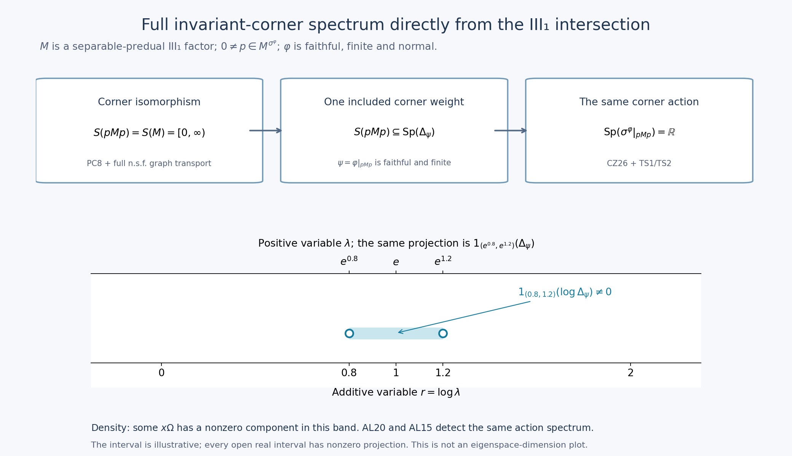

# Full modular corner spectrum directly from the III₁ intersection

*Fresh local proof, GPT-6 Astra (OpenAI), Ultra, 2026-10-04. CC0-1.0 to the extent of rights held.*

This is a separate bridge for the type III₁ homogeneity consumer. It does not alter the sealed RF/AL providers. The exact inputs are [AL-2/3/5/6](OA-FLOW-AL.md#oa-flow.al.2), the complete [SF Borel calculus and domains](OA-FLOW-SF.md#oa-flow.sf.sf1), the actual [normal-isomorphism, corner and matrix proof](OA-FLOW-CT.md#oa-flow.ct.1), and only [CZ-5's centralizer-corner restriction proof](OA-FLOW-CZ.md#oa-flow.cz.5), currently lines 329–341. Its proof uses KT/KU with the whole finite-star corner, not a formal compression of a modular operator.

Use the established convention

\[
 S(N)=\bigcap_{\rho\ {\rm faithful\ normal\ semifinite}}
                 \operatorname{Sp}(\Delta_\rho).
 \tag{TS1}
\]
A type III₁ factor here means a type III factor with \(S(N)=[0,\infty)\). The complete local corner/type provider proves \(S(pNp)=S(N)\) for every nonzero projection in a separable-predual type III factor, and \(S(M_2(N))=S(N)\), by actual normal isomorphisms and full n.s.f. GNS graph transport. No \(S/\Gamma\) theorem is an input.

Exact individual earlier proof locators: [OA-FLOW.AL.2](OA-FLOW-AL.md#oa-flow.al.2), [OA-FLOW.AL.3](OA-FLOW-AL.md#oa-flow.al.3), [OA-FLOW.AL.5](OA-FLOW-AL.md#oa-flow.al.5), [OA-FLOW.AL.6](OA-FLOW-AL.md#oa-flow.al.6), [OA-FLOW.RF.5](OA-FLOW-RF.md#oa-flow.rf.5), [OA-FLOW.CZ.5](OA-FLOW-CZ.md#oa-flow.cz.5), [OA-FLOW.BC.1](OA-FLOW-BC.md#oa-flow.bc.1), [OA-FLOW.SC.4](OA-FLOW-SC.md#sc-04), [OA-FLOW.SF.SF1](OA-FLOW-SF.md#oa-flow.sf.sf1), [OA-FLOW.SF.SF2](OA-FLOW-SF.md#oa-flow.sf.sf2). The CZ input is its centralizer-corner restriction argument; no trace conversion or general S/Gamma identity is a premise.

## TS-1. Spectrum is detected on the dense invariant GNS range

Let \(N\) have a faithful finite normal positive functional \(\psi\), and let \(\beta\) be a point-ultraweak continuous action preserving it. [AL-5](OA-FLOW-AL.md#oa-flow.al.5) gives its full GNS implementation \(U_t=e^{itA}\), with \(\Omega=\Lambda_\psi(1)\), and proves

\[
 \operatorname{Sp}_\beta(x)
   =\operatorname{supp}\mu_{x\Omega}^A
 \qquad(x\in N).
 \tag{TS2}
\]
Then

\[
 \operatorname{Sp}(\beta)=\operatorname{Sp}(A).
 \tag{TS3}
\]
We justify the operator-spectrum step explicitly. For a self-adjoint \(A\), a real \(r\) is outside \(\operatorname{Sp}(A)\) exactly when some open interval about \(r\) has zero spectral projection. If such an interval has zero projection, the Borel function \((t-r)^{-1}\) on its complement is bounded. Its operator is a two-sided inverse of \(A-r\): it maps all \(H\) into \(D(A)\), since \(t/(t-r)\) is bounded there. Conversely, if every interval \((r-\varepsilon,r+\varepsilon)\) has nonzero projection, choose a unit vector in its range. It belongs to \(D(A)\) and its image under \(A-r\) has norm at most \(\varepsilon\); a bounded inverse would contradict this as \(\varepsilon\downarrow0\). The nonreal resolvent and spectral projections are those of the actual SF theorem.

Now an open set \(O\) has spectral projection \(1_O(A)=0\) if and only if \(1_O(A)x\Omega=0\) for all \(x\in N\), because \(N\Omega\) is dense and the projection is bounded. This is equivalent to every \(\mu_{x\Omega}^A(O)\) being zero. A finite Borel measure on \(\mathbb R\) gives zero mass to the complement of its closed support: cover that complement by the countable rational open intervals of zero measure and use scalar countable subadditivity. Thus the preceding spectral-projection criterion gives

\[
 \operatorname{Sp}(A)
 =\overline{\bigcup_{x\in N}\operatorname{supp}\mu_{x\Omega}^A}.
 \tag{TS4}
\]
Combine this with ([TS2](OA-FLOW-TS.md#equation-ts2)) and [AL15](OA-FLOW-AL.md#equation-al15)'s action-spectrum identity to obtain ([TS3](OA-FLOW-TS.md#equation-ts3)). This argument uses density of the full GNS range, not a claim that a single arbitrary GNS vector is spectrally cyclic.

For \(\beta=\sigma^\psi\), the already proved modular implementation and [RF-5](OA-FLOW-RF.md#oa-flow.rf.5)'s uniqueness give \(A=\log\Delta_\psi\), with the complete SF domain. Hence

\[
 \operatorname{Sp}(\sigma^\psi)
   =\operatorname{Sp}(\log\Delta_\psi).
 \tag{TS5}
\]
This identity concerns one faithful finite functional and its own action. It is not an intersection identity over all weights or invariant corners.

## TS-2. The defining intersection forces full spectrum in each invariant corner

Let \(M\) be a nonzero type III₁ factor with separable predual, let \(\varphi\) be a faithful finite normal positive functional, and let \(0\ne p\in M\) be fixed by \(\sigma^\varphi\). The normal functional
\(\psi=\varphi|_{pMp}\) is finite and faithful. It is normal and semifinite, and is therefore one of the weights in ([TS1](OA-FLOW-TS.md#equation-ts1)) for \(N=pMp\).

The exact local corner/type proof gives

\[
 S(pMp)=S(M)=[0,\infty).
 \tag{TS6}
\]
For clarity, its proof chooses \(v^*v=1,\ vv^*=p\) using [PC-8](OA-FLOW-PC.md#oa-flow.projection.pc8). Conjugation \(x\mapsto vxv^*\) is a normal unital isomorphism onto \(pMp\). Pullback bijects **all** faithful n.s.f. weights; the induced GNS unitary maps the two full initial finite-star graphs onto each other, hence also their closures, adjoints and positive products. It transports the complete modular operators and their resolvents. Intersecting over that bijection is precisely ([TS6](OA-FLOW-TS.md#equation-ts6)), including zero. There is no restriction of the intersection to states.

By the elementary meaning of an intersection, ([TS6](OA-FLOW-TS.md#equation-ts6)) implies

\[
 [0,\infty)\subseteq\operatorname{Sp}(\Delta_\psi).
 \tag{TS7}
\]
We need its positive part only. For any real \(r\) and any \(\varepsilon>0\), the spectral projection

\[
 1_{(r-\varepsilon,r+\varepsilon)}(\log\Delta_\psi)
 =1_{(e^{r-\varepsilon},e^{r+\varepsilon})}(\Delta_\psi)
 \tag{TS8}
\]
is nonzero. Indeed if it were zero, the Borel reciprocal \((t-e^r)^{-1}\), defined off the missing positive interval, would give a bounded inverse of \(\Delta_\psi-e^r\), with range in its full domain as in [TS-1](OA-FLOW-TS.md#oa-flow.ts.1). This contradicts ([TS7](OA-FLOW-TS.md#equation-ts7)). The logarithm is legitimate on the whole modular spectral representation because \(\Delta_\psi\) has zero kernel; a possible spectral point zero has zero spectral projection and is handled by SF's exact Borel convention. The spectral-projection criterion in [TS-1](OA-FLOW-TS.md#oa-flow.ts.1) therefore proves

\[
 \operatorname{Sp}(\log\Delta_\psi)=\mathbb R.
 \tag{TS9}
\]

[CZ-5](OA-FLOW-CZ.md#oa-flow.cz.5)'s actual restriction argument gives
\(\sigma^\psi=\sigma^\varphi|_{pMp}\).
Its hypotheses apply because \(p\) is fixed by \(\sigma^\varphi\). Combining this equality with ([TS5](OA-FLOW-TS.md#equation-ts5)) and ([TS9](OA-FLOW-TS.md#equation-ts9)) proves

\[
 \operatorname{Sp}(\sigma^\varphi|_{pMp})=\mathbb R
 \qquad(0\ne p\in M^{\sigma^\varphi}).
 \tag{TS10}
\]
Thus [AL23](OA-FLOW-AL.md#equation-al23)'s full-corner-spectrum hypothesis holds for this action directly from the defining III₁ intersection and the proved corner isomorphism.

## TS-3. The exact homogeneity bridge, including its balanced matrix algebra

[AL-6](OA-FLOW-AL.md#oa-flow.al.6) now applies without an additional spectral-classification import. For all nonzero \(e,f\in M^{\sigma^\varphi}\) and all \(h>0\), it constructs

\[
 0\ne x\in fMe,\qquad
 \operatorname{Sp}_{\sigma^\varphi}(x)\subseteq[-h/2,h/2]\subseteq[-h,h].
 \tag{TS11}
\]
The full modular vector support and domain conclusion of [AL-5](OA-FLOW-AL.md#oa-flow.al.5) then yields

\[
 I_\varphi(x)\leq\tfrac12(e^{h/2}-1)^2\|x\xi_\varphi\|^2
 \leq\tfrac12(e^{h/2}-1)^2q_\varphi(x)^2,
 \qquad \|x\xi_\varphi\|>0.
 \tag{TS12}
\]
Here \(I_\varphi(x)=\frac12\|x\xi_\varphi-Jx^*J\xi_\varphi\|^2\) and
\(q_\varphi(x)^2=\varphi(x^*x+xx^*)\), exactly as in the consumer. The sharper half-width in ([TS11](OA-FLOW-TS.md#equation-ts11)) is retained; ([TS12](OA-FLOW-TS.md#equation-ts12)) is the stated weaker bound required there.

The same conclusion applies to the balanced homogeneity functional on \(M_2(M)\). The actual matrix/type proof constructs the normal isomorphism \(M_2(M)\cong M\) from two orthogonal isometries with range projections summing to \(1\), and transports the entire n.s.f. spectral intersection. Thus \(M_2(M)\) is again a type III₁ factor with separable predual. For faithful finite normal \(\varphi_1,\varphi_2\), the functional
\(\Psi([x_{ij}])=\varphi_1(x_{11})+\varphi_2(x_{22})\)
is faithful, finite and normal by [BC-1](OA-FLOW-BC.md#oa-flow.bc.1)'s full balanced construction. Apply [TS-2](OA-FLOW-TS.md#oa-flow.ts.2) to \(N=M_2(M)\) and \(\Psi\), then [AL-6](OA-FLOW-AL.md#oa-flow.al.6)/[AL22](OA-FLOW-AL.md#equation-al22). Its cone vector and all nonfaithful later support reductions are the separate proved NC/CR/MC statements; this step does not pretend that a nonfaithful \(\Psi\) is faithful on the entire matrix algebra.

This completes the specific type-to-full-corner-spectrum implication used by the III₁ homogeneity argument. The general theorem \(S(M)\cap(0,\infty)=\exp\Gamma(\sigma^\varphi)\), general cocycle/Connes-spectrum invariance, and general locally compact abelian spectral theory remain separate. The present bridge and RF/AL alone do not give the whole homogeneity proof.

### The direct III₁ spectral implication and its projection mechanism

The [native PNG](../assets/iii1-spectral/assets/iii1-direct-spectrum.png), [SVG](../assets/iii1-spectral/assets/iii1-direct-spectrum.svg) and [renderer](../assets/iii1-spectral/render_iii1_spectrum.py) illustrate the complete proof in [TS-1–3](OA-FLOW-TS.md#oa-flow.ts.1). This is an implication diagram and spectral-band schematic, not a finite-dimensional example of a III₁ factor. The human source context for the annihilator-hull spectrum is [Connes (1973), printed pp.170–174](https://numdam.org/article/ASENS_1973_4_6_2_133_0.pdf#page=39); the direct local route drawn here does not import that paper's general \(S/\Gamma\) theorem.

Assume exactly the displayed hypotheses: \(M\) is a nonzero separable-predual type III₁ factor, \(\varphi\) is faithful, finite and normal, and \(0\ne p\) is fixed by \(\sigma^\varphi\). Put \(\psi=\varphi|_{pMp}\).

The first arrow is the definition of an intersection, after the actual normal corner isomorphism has supplied \(S(pMp)=S(M)\): since \(\psi\) is one of the faithful n.s.f. weights, \(S(pMp)\subseteq\operatorname{Sp}(\Delta_\psi)\). The second arrow contains the explicit projection and density argument below together with [CZ26](OA-FLOW-CZ.md#equation-cz26)'s equality of the two corner actions. These are [TS6](OA-FLOW-TS.md#equation-ts6)–[TS10](OA-FLOW-TS.md#equation-ts10), not an unproved spectral-classification arrow.

In the lower panel set \(r_0=1\), \(\varepsilon=1/5\). The open additive band is \((4/5,6/5)\), marked with hollow endpoints. Its corresponding positive band is \((e^{4/5},e^{6/5})\). The upper scale is the exact exponential reparametrization of the lower scale, hence is logarithmically spaced as a positive-variable axis. The spectral Borel composition identity is
\[
 Q=1_{(4/5,6/5)}(\log\Delta_\psi)
  =1_{(e^{4/5},e^{6/5})}(\Delta_\psi)\ne0.
\]
If \(Q\) were zero, the Borel reciprocal \((t-e)^{-1}\) off the missing positive band would give a bounded two-sided inverse of \(\Delta_\psi-e\). It maps into the full domain because \(t/(t-e)\) is bounded there. This contradicts \(e\in S(pMp)\subseteq\operatorname{Sp}(\Delta_\psi)\). This is [TS8](OA-FLOW-TS.md#equation-ts8)'s concrete interval, including its open endpoints.

The GNS range \((pMp)\Omega\) is dense, so some \(x\Omega\) has \(Qx\Omega\ne0\): otherwise the bounded projection \(Q\) would vanish on a dense subspace and hence everywhere. [TS-1](OA-FLOW-TS.md#oa-flow.ts.1), [AL20](OA-FLOW-AL.md#equation-al20) and [AL15](OA-FLOW-AL.md#equation-al15) identify the closed union of the vector spectral supports with the algebra action spectrum. The same argument works with every \(r_0\in\mathbb R\) and every \(\varepsilon>0\), proving full real spectrum. The shaded band shows a nonzero spectral projection; it does not specify its rank, multiplicity, point spectrum or the existence of any eigenvector.

The top-row result is therefore the exact hypothesis needed by [AL-6](OA-FLOW-AL.md#oa-flow.al.6) in every nonzero invariant corner. [TS-3](OA-FLOW-TS.md#oa-flow.ts.3) supplies the same implication for the proved balanced \(M_2(M)\) type-transport setting. The general \(S/\Gamma\) theorem and general LCA theory remain separate statements, without blocking this direct specific route.

The native \(2080\times1200\) image accompanies the [editable SVG](../assets/iii1-spectral/assets/iii1-direct-spectrum.svg) and [reproduction source](../assets/iii1-spectral/render_iii1_spectrum.py). No numerical experiment is used as proof. The complete argument accompanies the picture. Local text and original figure: CC0-1.0 to the extent of rights held.
