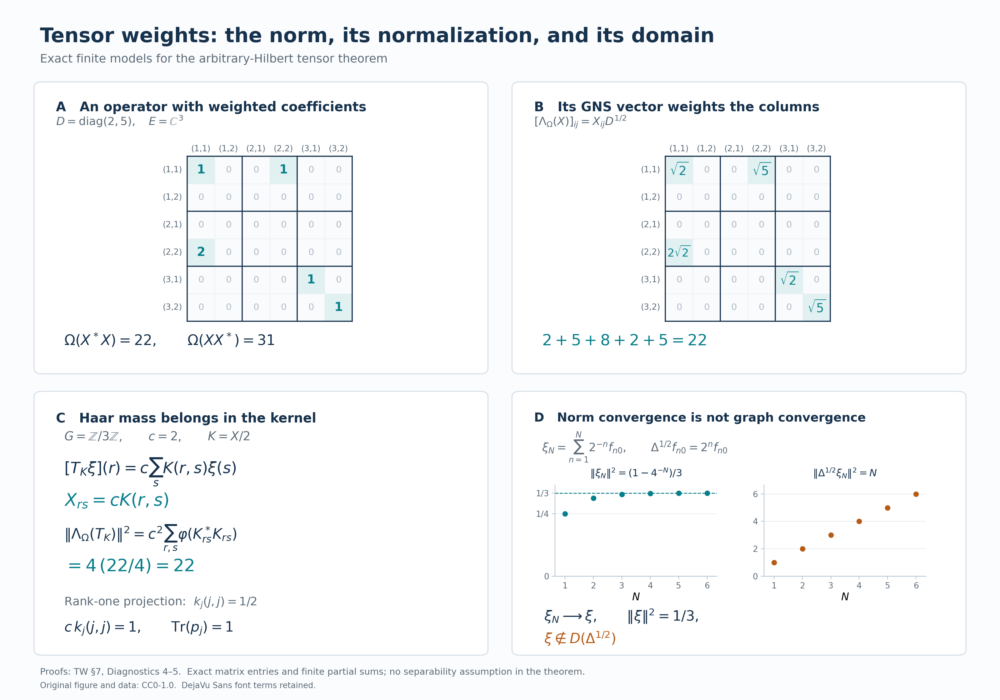

# Tensoring a weight with the usual trace

*Self-checked by the writing AI. Original exposition and illustration sources: CC0 1.0; font components retain their accompanying terms.*

The usual trace assigns value one to a rank-one projection. We retain this normalization when adjoining a Hilbert-space factor to a von Neumann algebra with a weight. Finite matrix corners construct the weight on every positive operator, and its GNS coordinates determine the complete modular and relative domains. The Hilbert-space factor may have an uncountable orthonormal basis.

## Setting and conventions

Let $M\ne0$ be a von Neumann algebra, let $\varphi$ be a faithful normal semifinite weight on $M$, and let $E\ne0$ be any complex Hilbert space. Fix an arbitrary orthonormal basis $(e_i)_{i\in I}$ of $E$. No countability assumption is made on $I$, on a faithful representation of $M$, or on its predual. Set
\[
 B=M\,\overline\otimes\,B(E).
 \tag{TW.0.a}
\]
In a faithful normal representation of $M$ on $K$, the entry $X_{ij}\in M$ of $X\in B$ is specified by
\[
 \langle X(\xi\otimes e_j),\eta\otimes e_i\rangle
       =\langle X_{ij}\xi,\eta\rangle
 \qquad(\xi,\eta\in K).
 \tag{TW.0.b}
\]
Inner products are linear in their first variable. In particular, the rank-one operator $|u\rangle\langle v|$ sends $w$ to $\langle w,v\rangle u$.

The finite ideal $\mathfrak n_\varphi$, finite linear domain $\mathfrak m_\varphi$, and full GNS map $\Lambda_\varphi$ are those proved in [Finite ideals and GNS spaces for arbitrary weights](OA-FLOW-GW.md#oa-flow.gw.1). Its representation is [faithful and normal](OA-FLOW-NF.md#oa-flow.nf.5). We use the actual closed finite-star operator $S_\varphi$, modular operator $\Delta_\varphi$, and modular conjugation $J_\varphi$ of [The full finite-star algebra](OA-FLOW-WR.md#wr-3) and [Modular covariance and its implementation](OA-FLOW-MW.md#oa-flow.mw.4). All domain equalities below concern these complete operators.

Every sum of nonnegative scalars indexed by an arbitrary set means the supremum of its finite subsums. The same convention applies to sums of nonnegative squared Hilbert norms. Finite subsets and finite rectangles are directed by inclusion. We will construct, rather than assume, the weight
\[
 \Omega(X)=\sum_{i\in I}\varphi(X_{ii})
       \qquad(X\in B_+),
 \tag{TW.0.c}
\]
show that it is independent of the chosen basis, and denote it by $\varphi\otimes\operatorname{Tr}_E$.

If $M=0$ or $E=0$, the tensor algebra and its GNS Hilbert space are zero and the weight is zero. The corresponding formulas have their vacuous zero-space interpretation. Rank-one normalization and the nonzero faithful models below concern the stated nonzero case.

## 1. Arbitrary matrix coordinates and the usual trace

Let \(M\subseteq B(H_0)\) be a von Neumann algebra and let \(E\) be a Hilbert space. No countability assumption is imposed on either space or on \(M\). Inner products are linear in the first variable. We treat nonzero spaces below; if \(M=\{0\}\) or \(E=\{0\}\), the corresponding tensor algebra and weight are zero, with the evident zero Hilbert-space models.

Choose an orthonormal basis \((e_i)_{i\in I}\) of \(E\). Sums of nonnegative numbers indexed by an arbitrary set mean suprema of finite subsums. The [arbitrary Hilbert-sum construction](OA-FLOW-GNS.md#gns-lemma-7-1) identifies \(H_0\otimes E\) with \(\bigoplus_{i\in I}H_0\); its finite-coordinate vectors are dense. Write
\[
E_{ij}\xi=\langle\xi,e_j\rangle e_i,\qquad
p_F=1\otimes\sum_{i\in F}E_{ii}\quad(F\subset I\text{ finite}).
\tag{TW.1.a}
\]
The finite sets are directed by inclusion, and \(p_F\to1\) strongly.

For \(X\in B(H_0\otimes E)\), its matrix entry \(X_{ij}\in B(H_0)\) is the operator determined by
\(\langle X_{ij}\xi,\eta\rangle=\langle X(\xi\otimes e_j),\eta\otimes e_i\rangle\).
The spatial tensor algebra has the complete bounded-array description
\[
\begin{split}
B:=M\bar\otimes B(E)
&=(M\otimes1\ \cup\ 1\otimes B(E))''\\
&=\{X\in B(H_0\otimes E):X_{ij}\in M\text{ for all }i,j\}.
\end{split}
\tag{TW.1.b}
\]
Here is a proof for this arbitrary index set. An operator commuting with every \(1\otimes E_{ii}\) is diagonal; commuting also with every \(1\otimes E_{ij}\) makes all its diagonal entries equal to one operator \(a\in B(H_0)\). Equality with \(a\otimes1\) follows first on finite-coordinate vectors and then everywhere. Such an operator also commutes with \(M\otimes1\) precisely when \(a\in M'\). Thus the commutant of the generators is \(M'\otimes1\). An operator commutes with this last algebra precisely when every entry belongs to \(M''=M\), proving (TW.1.b).

The following statements include all bounded arrays:
\[
\begin{gathered}
p_FXp_F\longrightarrow X\quad\text{strongly-*},\qquad
\|X\|=\sup_{F\text{ finite}}\|p_FXp_F\|,\\
X\ge0\quad\Longleftrightarrow\quad
p_FXp_F\ge0\text{ for every finite }F.
\end{gathered}
\tag{TW.1.c}
\]
For convergence, write
\(p_FXp_F-X=p_FX(p_F-1)+(p_F-1)X\), and apply the same argument to \(X^*\). The norm and positivity assertions follow by testing finite-coordinate vector pairs and quadratic forms, then using density. Conversely, a prescribed array with uniformly bounded finite-corner norms defines a bounded sesquilinear form on finite-coordinate vectors. The [Hilbert representation theorem](OA-FLOW-CF.md#oa-flow.cf.8) extends it uniquely to a bounded operator. If its entries belong to \(M\), (TW.1.b) puts that operator in \(B\). This proves that the criterion concerns actual bounded operators, rather than formal matrices. Moreover
\(p_FXp_F=\sum_{i,j\in F}X_{ij}\otimes E_{ij}\), so finite matrix tensors are strongly-* dense. These arguments extend the concrete countable proof in [VD-2](OA-FLOW-VD.md#vd-full-tensor), with all finite subsets of \(I\) retained.

We will also need full normal amplification. Suppose \(q:M\to A\subseteq B(H_1)\) is a normal unital star isomorphism with normal inverse. Then
\[
q_E:B\longrightarrow A\bar\otimes B(E),\qquad
(q_E(X))_{ij}=q(X_{ij})
\tag{TW.1.d}
\]
is a normal star isomorphism with normal inverse. To prove this, apply \(q\) entrywise in each finite corner. The resulting finite matrix map and its inverse are unital star homomorphisms, hence contractive by the [C*-representation norm argument](OA-FLOW-GNS.md#gns-lemma-3-2); applying both inequalities makes them isometric. They preserve positivity, by applying them to positive square roots. The finite-corner criterion therefore constructs (TW.1.d) on every bounded array, isometrically and onto, preserving adjoints and positivity.

For multiplication, the \((i,j)\) entry of \(XY\) is the strong limit of
\(\sum_{k\in F}X_{ik}Y_{kj}\), obtained by inserting \(p_F\) between \(X\) and \(Y\). These sums have norm at most \(\|X\|\|Y\|\). A bounded strongly convergent net converges ultraweakly: in each vector-series test, its finite head converges and Cauchy–Schwarz bounds the tail uniformly. Normality of \(q\) therefore transports this entry limit to the corresponding entry of \(q_E(X)q_E(Y)\), proving multiplicativity.

For normality on the entire algebra, truncate a pair \(\xi,\eta\in H_1\otimes E\). On the target unit ball the error in its vector functional is at most
\[
\|\xi-p_F\xi\|\,\|\eta\|
+\|\xi\|\,\|\eta-p_F\eta\|.
\tag{TW.1.e}
\]
The finite-coordinate pullback is a finite sum of normal functionals of \(q(X_{ij})\); coordinate compression is normal by the same vector-series test. Isometry of \(q_E\) leaves (TW.1.e) valid after pullback. The [norm-closed concrete predual](OA-FLOW-CP.md#oa-flow.cp.6) makes the limiting pullback normal. Finally any target normal functional is a square-summable vector series. Its pullbacks converge in functional norm, because the sum of the products of the two vector norms is finite. This proves normality of \(q_E\); the identical argument for \(q^{-1}\) proves normality of its inverse. The proof does not assume that an arbitrary ultraweakly convergent net is norm bounded.

We next fix the scalar normalization. For every \(T\in B(E)_+\), define
\[
\operatorname{Tr}_E(T)
=\sum_{i\in I}\langle Te_i,e_i\rangle
=\sum_{i\in I}\|T^{1/2}e_i\|^2.
\tag{TW.1.f}
\]
This definition is independent of the orthonormal basis, including when its value is infinite. Indeed, for another basis \((f_j)_{j\in J}\), Parseval and self-adjointness of \(T^{1/2}\) give
\[
\sum_i\|T^{1/2}e_i\|^2
=\sum_{i,j}|\langle T^{1/2}e_i,f_j\rangle|^2
=\sum_j\|T^{1/2}f_j\|^2.
\tag{TW.1.g}
\]
Every interchange is valid because both sides of a nonnegative double sum are the supremum of all finite subsums. Parseval itself here follows by orthogonal finite-coordinate approximation in the arbitrary Hilbert sum.

The functional (TW.1.f) is additive and positively homogeneous, with \(0\cdot\infty=0\). If \(T_\alpha\uparrow T\), each diagonal increases to its limit. Normality follows by taking first the supremum over \(\alpha\) and then over finite subsets, using a common upper index for finitely many scalar approximations. If its value on \(T\) is zero, \(T^{1/2}e_i=0\) for every \(i\), so \(T=0\). Finally, for every bounded \(A\),
\[
\operatorname{Tr}_E(A^*A)
=\sum_{i,j}|A_{ij}|^2
=\operatorname{Tr}_E(AA^*).
\tag{TW.1.h}
\]
The first equality is Parseval on each column; the second uses rows and transposes the nonnegative sum. In particular the weight is tracial. The finite-rank projections \(\sum_{i\in F}E_{ii}\) increase strongly to one and have finite trace \(|F|\), so the [finite-contraction criterion for semifiniteness](OA-FLOW-GW.md#oa-flow.gw.4) applies. Thus \(\operatorname{Tr}_E\) is the faithful normal semifinite usual trace, with
\[
\operatorname{Tr}_E(\theta_{\xi,\xi})=\|\xi\|^2,\qquad
\theta_{\xi,\eta}v=\langle v,\eta\rangle\xi.
\tag{TW.1.i}
\]
The first formula follows by summing \(|\langle e_i,\xi\rangle|^2\). Every rank-one projection consequently has trace one, and a rank-\(r\) projection has trace \(r\).

We record the Hilbert-space normalization used later. Put
\[
HS(E)=\{A\in B(E):\operatorname{Tr}_E(A^*A)<\infty\},\qquad
\|A\|_{HS}^2=\sum_{i,j}|A_{ij}|^2.
\tag{TW.1.j}
\]
Every square-summable scalar array defines a bounded operator: for finite-coordinate vectors, Cauchy–Schwarz bounds its sesquilinear form by the array norm times the two vector norms. Its finite corners therefore yield the required operator, with \(\|A\|\le\|A\|_{HS}\). Conversely (TW.1.h) gives its Hilbert–Schmidt norm. Thus the coefficient map is an onto isometry \(HS(E)\to\ell^2(I^2)\); the [arbitrary Hilbert-sum theorem](OA-FLOW-GNS.md#gns-lemma-7-1) proves completeness and density of finite matrix sums. Polarization gives the basis-independent inner product
\(\langle A,B\rangle_{HS}=\sum_{i,j}A_{ij}\overline{B_{ij}}\). The \(E_{ij}\) are an orthonormal basis, and \(A\mapsto A^*\) is an antiunitary involution by (TW.1.h). In particular
\[
\|\theta_{\xi,\eta}\|_{HS}^2=\|\xi\|^2\|\eta\|^2.
\tag{TW.1.k}
\]
No countability of \(I\) is needed: a particular square-summable array has at most countably many nonzero entries.

## 2. The weight on every positive operator and its complete finite domains

Let \(\varphi\) be a faithful normal semifinite weight on \(M\), with GNS map \(\Lambda_\varphi:\mathfrak n_\varphi\to H_\varphi\). Define, for every bounded positive \(X\in B\),
\[
\Omega(X)=\sum_{i\in I}\varphi(X_{ii})
:=\sup_{F\subset I\text{ finite}}\sum_{i\in F}\varphi(X_{ii}).
\tag{TW.2.a}
\]
Each diagonal entry is positive. This formula gives an extended nonnegative value on the whole positive cone, and not only on finite matrices or finite-weight elements.

To prove additivity, the sum of the two suprema is the supremum over two finite subsets. Their union is a common finite subset, so
\(\sum_i(\varphi(X_{ii})+\varphi(Y_{ii}))=\sum_i\varphi(X_{ii})+\sum_i\varphi(Y_{ii})\).
The same argument covers infinity; homogeneity follows with \(0\cdot\infty=0\). Thus \(\Omega\) is a weight.

If \(0\le X_\alpha\uparrow X\), diagonal compression preserves the increasing strong supremum, hence
\[
\Omega(X)
=\sup_{F\text{ finite}}\sup_\alpha
       \sum_{i\in F}\varphi((X_\alpha)_{ii})
=\sup_\alpha\Omega(X_\alpha).
\tag{TW.2.b}
\]
For a fixed finite \(F\), normality of \(\varphi\) and a common upper index establish the middle equality, including infinite values by arbitrary finite lower bounds. Interchange of the two suprema proves normality for arbitrary increasing nets.

If \(\Omega(X)=0\), faithfulness of \(\varphi\) forces \(X_{ii}=0\) for every \(i\). Therefore
\(\|X^{1/2}(\xi\otimes e_i)\|^2=\langle X_{ii}\xi,\xi\rangle=0\).
Finite-coordinate vectors are dense, so \(X=0\); the weight is faithful.

For semifiniteness, [GW-4](OA-FLOW-GW.md#oa-flow.gw.4) supplies increasing positive contractions \(u_\alpha\in M\) with \(\varphi(u_\alpha)<\infty\) and \(u_\alpha\uparrow1\). Write \(q_F=\sum_{i\in F}E_{ii}\). The contractions
\[
r_{\alpha,F}=u_\alpha\otimes q_F,\qquad
\Omega(r_{\alpha,F})=|F|\varphi(u_\alpha)<\infty
\tag{TW.2.c}
\]
increase to one on the product directed set. Monotonicity follows from positivity of elementary positive tensors and
\[
u_{\alpha'}\otimes q_{F'}-u_\alpha\otimes q_F
=(u_{\alpha'}-u_\alpha)\otimes q_{F'}
 +u_\alpha\otimes(q_{F'}-q_F)\ge0
\]
when \(\alpha'\ge\alpha\) and \(F'\supseteq F\). Convergence follows first on elementary vectors and then by the uniform contraction bound. The same GW-4 criterion proves semifiniteness of \(\Omega\). This argument uses finite positive contractions and does not require \(\varphi\) to be a trace.

All its finite domains can now be determined. For \(X\in B\), insertion of \(p_F\) between \(X^*\) and \(X\) gives the increasing strong column sum
\[
(X^*X)_{jj}=\sum_{i\in I}X_{ij}^*X_{ij}.
\]
Normality of \(\varphi\), followed by nonnegative summation, yields
\[
\Omega(X^*X)
=\sum_{i,j\in I}\varphi(X_{ij}^*X_{ij}).
\tag{TW.2.d}
\]
There is no ambiguity in this double sum: every finite set of pairs is contained in a finite rectangle, and every such rectangle is a finite set of pairs.

Put \(\mathfrak a_\varphi=\mathfrak n_\varphi\cap\mathfrak n_\varphi^*\), and use analogous notation for \(\Omega\). Equation (TW.2.d) gives the exact domains
\[
\begin{aligned}
\mathfrak n_\Omega
&=\left\{X\in B:
 X_{ij}\in\mathfrak n_\varphi\ \forall i,j,\quad
 \sum_{i,j}\|\Lambda_\varphi(X_{ij})\|^2<\infty\right\},\\
\mathfrak a_\Omega
&=\left\{X\in B:
 X_{ij}\in\mathfrak a_\varphi\ \forall i,j,\quad
 \sum_{i,j}\left(\|\Lambda_\varphi(X_{ij})\|^2+
                 \|\Lambda_\varphi(X_{ij}^*)\|^2\right)<\infty\right\},\\
\mathfrak m_\Omega
&=\operatorname{span}_{\mathbb C}(\mathfrak n_\Omega^*\mathfrak n_\Omega)
 =\operatorname{span}_{\mathbb C}
     \{Z\in B_+:\sum_i\varphi(Z_{ii})<\infty\}.
\end{aligned}
\tag{TW.2.e}
\]
The second line applies the first to \(X\) and \(X^*\), whose entries are \(X_{ji}^*\), and reindexes the adjoint sum. The third line is the [finite-cone and polarization theorem](OA-FLOW-GW.md#oa-flow.gw.1), which also gives
\((\mathfrak m_\Omega)_+=\{Z\in B_+:\Omega(Z)<\infty\}\).
The bounded-array requirement \(X\in B\) is essential in both of the first two lines.

The unique linear extension from [GW-2](OA-FLOW-GW.md#oa-flow.gw.2) has an absolutely convergent diagonal formula:
\[
\Omega_0(Z)=\sum_i\varphi_0(Z_{ii}),
\qquad Z\in\mathfrak m_\Omega.
\tag{TW.2.f}
\]
Indeed, express \(Z=\sum_{\ell=1}^m c_\ell Z_\ell\) with \(Z_\ell\ge0\) and \(\Omega(Z_\ell)<\infty\), using (TW.2.e). Each \((Z_\ell)_{ii}\) is positive with finite \(\varphi\)-value. Thus \(Z_{ii}\in\mathfrak m_\varphi\) and
\[
\sum_i|\varphi_0(Z_{ii})|
\le\sum_{\ell=1}^m|c_\ell|
             \sum_i\varphi((Z_\ell)_{ii})
=\sum_{\ell=1}^m|c_\ell|\Omega(Z_\ell)<\infty.
\]
Finite linearity and the positive formula prove (TW.2.f). The characterization of \(\mathfrak m_\Omega\) is (TW.2.e); absolute convergence of evaluated diagonals by itself is not asserted to characterize that domain. These arguments establish all of the countable construction's conclusions [CA5–CA10](OA-FLOW-CA.md#oa-flow.ca.1) for the arbitrary index set used here.

## 3. Independence of coordinates and tensor normalization

We prove that (TW.2.a) gives the same weight for every orthonormal basis of \(E\), on every positive operator and at every infinite value. Finite-rank agreement alone would not establish this conclusion.

For \(X\in B_+\), form the extended-positive element
\[
T_E(X)=\sum_{i\in I}X_{ii}\in\widehat M_+,\qquad
T_E(X)(f)=\sum_i f(X_{ii})\quad(f\in M_*^+).
\tag{TW.3.a}
\]
The [extended-positive sum construction](OA-FLOW-EP.md#ep-4) gives this element as the increasing supremum of all finite sums of the bounded positive \(X_{ii}\). Equivalently, the displayed function of \(f\) is additive, homogeneous and norm lower semicontinuous: it is the supremum of the continuous finite positive sums, and directedness proves additivity. Thus it belongs to the full extended cone even when it has an infinite-value part.

Fix \(f\in M_*^+\). The complete [positive vector-series representation](OA-FLOW-EP.md#ep-1) gives vectors \(\zeta_n\in H_0\) such that
\[
f(a)=\sum_{n=1}^{\infty}\langle a\zeta_n,\zeta_n\rangle,
\qquad \sum_n\|\zeta_n\|^2=f(1).
\]
Define \(V_n:E\to H_0\otimes E\) by \(V_n\xi=\zeta_n\otimes\xi\). Each \(V_n^*XV_n\) is a bounded positive operator on \(E\). Summing nonnegative terms and using (TW.1.f), we obtain
\[
\begin{aligned}
T_E(X)(f)
 &=\sum_{i,n}\langle X(\zeta_n\otimes e_i),\zeta_n\otimes e_i\rangle\\
 &=\sum_n\operatorname{Tr}_E(V_n^*XV_n).
\end{aligned}
\tag{TW.3.b}
\]
The last expression is independent of the basis by (TW.1.g). Equality holds at infinity as well, since both iterated sums are the supremum of finite nonnegative subsums. It holds for every positive normal test \(f\), so the extended-positive element \(T_E(X)\) itself is basis independent.

The [whole-cone scalar extension theorem](OA-FLOW-EP.md#ep-5) associates to \(\varphi\) an additive, homogeneous, order-normal extension \(\widehat\varphi:\widehat M_+\to[0,\infty]\). Applying its increasing-supremum identity EP17 to the finite sums in (TW.3.a) proves
\[
\widehat\varphi(T_E(X))
=\sup_{F\text{ finite}}\varphi\!\left(\sum_{i\in F}X_{ii}\right)
=\sum_i\varphi(X_{ii})=\Omega(X).
\tag{TW.3.c}
\]
This proves full basis independence. It uses the extension theorem, not a decomposition of \(\varphi\) into a sum of bounded functionals and not a tensor-weight existence theorem. The finite diagonal sums increase in \(\widehat M_+\); no assertion that \(p_FXp_F\) increases has been used.

Consequently we write
\(\Omega=\varphi\otimes\operatorname{Tr}_E\).
Its elementary positive values are exactly
\[
(\varphi\otimes\operatorname{Tr}_E)(a\otimes b)
=\varphi(a)\operatorname{Tr}_E(b)
\quad(a\in M_+,\ b\in B(E)_+).
\tag{TW.3.d}
\]
Indeed the diagonal entries are \(\langle be_i,e_i\rangle a\), so this is a scalar nonnegative sum. If either factor vanishes, the tensor value is zero with the convention \(0\cdot\infty=0\). Otherwise positive finite factors pull out of the sum; if a factor is infinite, a positive finite subsum of the other factor, or arbitrarily large such subsums, proves the corresponding infinite value. Thus the formula covers arbitrary positive \(a,b\), without an integrability restriction.

In particular, for any unit vector \(\xi\) and its rank-one projection \(e=\theta_{\xi,\xi}\),
\[
\Omega(a\otimes e)=\varphi(a),\qquad
\Omega(a\otimes\theta_{\xi,\xi})=\|\xi\|^2\varphi(a)
\quad(\xi\in E,\ a\in M_+).
\tag{TW.3.e}
\]
The second formula allows an arbitrary vector, including zero. The restriction of \(\Omega\) to the corner
\((1\otimes e)B(1\otimes e)=M\otimes\mathbb Ce\)
therefore recovers the original weight with no scalar factor.

There are corresponding identities on the entire finite linear domain whenever an elementary tensor belongs to it. If \(a\in\mathfrak m_\varphi\) and \(k\) is finite rank, then
\[
a\otimes k\in\mathfrak m_\Omega,\qquad
\Omega_0(a\otimes k)=\varphi_0(a)\operatorname{Tr}_E(k).
\tag{TW.3.f}
\]
Here \(\operatorname{Tr}_E(k)\) is the usual finite-rank linear trace. To verify the domain assertion, let \(F_0\subset E\) be the finite-dimensional span of the ranges of \(k\) and \(k^*\). Then \(k=qkq\) for its orthogonal projection \(q\), so in a basis beginning with one of \(F_0\) it is a finite matrix. Write \(a\) as a finite sum of products \(y^*x\), \(x,y\in\mathfrak n_\varphi\), using [GW-1](OA-FLOW-GW.md#oa-flow.gw.1). Each elementary matrix entry \(y^*x\otimes E_{ij}\) equals
\((y\otimes E_{ri})^*(x\otimes E_{rj})\) for a fixed basis index \(r\); both factors belong to \(\mathfrak n_\Omega\) by (TW.2.e). Finite sums prove membership in \(\mathfrak m_\Omega\). Its value is (TW.2.f). Basis independence of \(\Omega\) and uniqueness of its finite extension make this independent of the chosen finite-dimensional basis.

Finally, for \(x\in\mathfrak n_\varphi\) and every \(k\in HS(E)\), (TW.3.d) gives
\[
x\otimes k\in\mathfrak n_\Omega,\qquad
\|\Lambda_\Omega(x\otimes k)\|^2
=\|\Lambda_\varphi(x)\|^2\,\|k\|_{HS}^2.
\tag{TW.3.g}
\]
Polarization in the two factors, or (TW.2.d) and scalar Cauchy–Schwarz on their entries, also gives
\[
\left\langle\Lambda_\Omega(x\otimes k),
                   \Lambda_\Omega(y\otimes l)\right\rangle
=\langle\Lambda_\varphi(x),\Lambda_\varphi(y)\rangle
                    \langle k,l\rangle_{HS}
\quad(x,y\in\mathfrak n_\varphi,\ k,l\in HS(E)).
\tag{TW.3.h}
\]
For the entry calculation, (TW.2.d) and GNS polarization identify the left side with
\(\sum_{i,j}\langle\Lambda_\varphi(k_{ij}x),\Lambda_\varphi(l_{ij}y)\rangle\).
This sum is absolutely convergent, bounded by the product of the two square-sum norms. Linearity of \(\Lambda_\varphi\) reduces it to the right side. Equations (TW.1.i), (TW.1.k) and (TW.3.g) fix the finite-rank and Hilbert–Schmidt normalization that will identify the full GNS space in [Section 4](OA-FLOW-TW.md#tw-4).

## 4. The onto tensor GNS model

Fix an orthonormal basis $(e_i)_{i\in I}$ of $E$, with matrix units $e_{ij}=|e_i\rangle\langle e_j|$. The set $I$ may have any cardinality. Every sum of nonnegative terms below is the supremum of its finite subsums. Write
\[
 \mathcal H_\varphi=\bigoplus_{(i,j)\in I^2}H_\varphi,
 \qquad
 \Omega=\varphi\otimes\operatorname{Tr}_E.
 \tag{TW.4.a}
\]
The finite-domain calculation of the preceding sections gives, for every bounded array $X\in B$,
\[
 \begin{aligned}
 X\in\mathfrak n_\Omega
 &\Longleftrightarrow
 X_{ij}\in\mathfrak n_\varphi\text{ for all }i,j,
 \quad\sum_{i,j}\|\Lambda_\varphi(X_{ij})\|^2<\infty,\\
 \Omega(X^*X)&=\sum_{i,j}\|\Lambda_\varphi(X_{ij})\|^2
       \quad(X\in\mathfrak n_\Omega).
 \end{aligned}
 \tag{TW.4.b}
\]

**Theorem.** There is an onto unitary
\[
 V_\varphi:H_\Omega\longrightarrow\mathcal H_\varphi,
 \qquad
 V_\varphi\Lambda_\Omega(X)
      =(\Lambda_\varphi(X_{ij}))_{i,j}
      \quad(X\in\mathfrak n_\Omega).
 \tag{TW.4.c}
\]
Under the canonical identification
\[
 \mathcal H_\varphi\cong H_\varphi\otimes\operatorname{HS}(E),
 \qquad (\xi_{ij})\longleftrightarrow\sum_{i,j}\xi_{ij}\otimes e_{ij},
 \tag{TW.4.d}
\]
this is the full tensor GNS space, with the usual Hilbert–Schmidt norm on the second factor.

**Proof.** Equation (TW.4.b) proves that the formula on the GNS range preserves norms. It is linear, and polarization gives preservation of all inner products. Thus it extends to an isometry. For a finite set of pairs, choose entries $x_{ij}\in\mathfrak n_\varphi$ and put them into a finite matrix, with all other entries zero. This bounded matrix belongs to $\mathfrak n_\Omega$, and its image is exactly the corresponding finite-coordinate vector $(\Lambda_\varphi(x_{ij}))$. Such vectors are dense in $\mathcal H_\varphi$: finite subsums approximate a vector in a Hilbert direct sum, and the original GNS range is dense in each of the finitely many remaining coordinates. The extended isometry has closed range, so it is onto.

For the second identification, finite-rank operators carry the inner product $\langle k,l\rangle=\operatorname{Tr}(l^*k)$, linear in the first variable. Their completion is $\operatorname{HS}(E)$. The matrix units form an orthonormal family. Their span is dense: if $p_F$ projects onto a finite set $F\subset I$, then $p_Fu\to u$ and $p_Fv\to v$, and
\[
 \big\||u\rangle\langle v|-|p_Fu\rangle\langle p_Fv|\big\|_{\rm HS}
 \le\|u-p_Fu\|\,\|v\|+
             \|p_Fu\|\,\|v-p_Fv\|\longrightarrow0.
 \tag{TW.4.e}
\]
Every finite-rank operator is a finite sum of rank-one operators. Consequently $(e_{ij})_{i,j\in I}$ is an orthonormal basis of this completion, which proves (TW.4.d). The inequality $\|k\|\le\|k\|_{\rm HS}$ on finite matrices identifies the completion with bounded Hilbert–Schmidt operators on $E$: operator-norm limits give the same matrix entries, and zero entries force zero Hilbert–Schmidt norm. In particular, for $b\in\mathfrak n_\varphi$ and $k\in\operatorname{HS}(E)$, (TW.4.b) gives
\[
 b\otimes k\in\mathfrak n_\Omega,\qquad
 V_\varphi\Lambda_\Omega(b\otimes k)
    =\Lambda_\varphi(b)\otimes k,
 \qquad
 \|\Lambda_\Omega(b\otimes k)\|^2
    =\varphi(b^*b)\operatorname{Tr}(k^*k).
 \tag{TW.4.f}
\]
This fixes the rank-one normalization of the tensor GNS map. It also proves that the identification $H_\Omega\to H_\varphi\otimes\operatorname{HS}(E)$ is independent of the chosen orthonormal basis. Every such identification sends $\Lambda_\Omega(b\otimes k)$ to $\Lambda_\varphi(b)\otimes k$ for every $b\in\mathfrak n_\varphi$ and finite-rank $k$. The span of these GNS vectors is dense by the onto proof, so two resulting unitaries agree on a dense subspace and hence everywhere. $\square$

We next identify its left representation on the entire algebra. The faithful normal GNS map $\pi_\varphi:M\to\pi_\varphi(M)$ has a normal inverse, by [Order-normal positive functionals and ultraweak continuity](OA-FLOW-NF.md#oa-flow.nf.5) and [Concrete predual balls and faithful ultraweak representations](OA-FLOW-ST12.md#oa-flow.st.2). Its arbitrary-dimensional normal tensor extension is the one proved in [Two crossed products and the surviving action](OA-FLOW-ND.md#nd-tensor). Thus the array $(\pi_\varphi(Y_{ik}))$ is a bounded operator of norm $\|Y\|$ on $\bigoplus_iH_\varphi$, for every $Y\in B$. Apply it separately to each column:
\[
 (L_Y\xi)_{ij}
      =\sum_{k\in I}\pi_\varphi(Y_{ik})\xi_{kj},
 \qquad \|L_Y\|=\|Y\|.
 \tag{TW.4.g}
\]
Each sum is the norm limit of the finite column truncations under this bounded operator. The columnwise action gives a bounded operator on $\mathcal H_\varphi$; its upper norm bound follows by summing the squared column norms. Conversely, placing any vector in one column gives the lower bound and hence equality of norms.

If $X$ is a finite matrix over $\mathfrak n_\varphi$, the left-ideal property gives $YX\in\mathfrak n_\Omega$. Each entry of $YX$ is a finite sum, so the original GNS module identity gives
\[
 L_YV_\varphi\Lambda_\Omega(X)
       =V_\varphi\Lambda_\Omega(YX).
 \tag{TW.4.h}
\]
The finite matrices used in the onto proof have dense GNS vectors. Both represented operators are bounded, so
\[
 V_\varphi\pi_\Omega(Y)V_\varphi^*=L_Y\qquad(Y\in B)
 \tag{TW.4.i}
\]
holds on the whole space. In particular, (TW.4.h) also holds for every $X\in\mathfrak n_\Omega$. In tensor notation the elementary action is $L_{a\otimes b}(\xi\otimes k)=\pi_\varphi(a)\xi\otimes bk$. Matrix multiplication proves it first on finite-coordinate vectors and finite matrices $k$; the bound $\|bk\|_{\rm HS}\le\|b\|\|k\|_{\rm HS}$, obtained by summing squared column norms, and density extend it to every Hilbert–Schmidt $k$.

Here normality is a statement about the complete representation. One can check it directly. If $0\le Y_\lambda\uparrow Y$, then $L_{Y_\lambda}$ is positive, increasing and bounded by $\|Y\|$. Its supremum has, between row-column coordinates $(i,j)$ and $(k,l)$, the entry
\[
 \delta_{jl}\lim_\lambda\pi_\varphi((Y_\lambda)_{ik})
          =\delta_{jl}\pi_\varphi(Y_{ik}),
 \tag{TW.4.j}
\]
where the limits are ultraweak and use normality of $\pi_\varphi$. Finite-coordinate vectors determine the supremum, so it is $L_Y$. The full positive-map criterion in [Order-normal positive functionals and ultraweak continuity](OA-FLOW-NF.md#oa-flow.nf.6) makes $Y\mapsto L_Y$ ultraweakly continuous. It is faithful by the norm identity. [Concrete predual balls and faithful ultraweak representations](OA-FLOW-ST12.md#oa-flow.st.2) therefore makes its range a von Neumann algebra and its inverse normal on that range. There is no restriction here to finite corners or uniformly bounded ultraweak nets.

**Haar kernel coordinates.** Suppose $E=L^2(G,ds)$ for an arbitrary locally compact Hausdorff abelian group $G$. There is an onto unitary
\[
 \mathcal K:\operatorname{HS}(L^2(G))
      \longrightarrow L^2(G_r)\otimes L^2(G_s)
      \cong L^2(G_r;L^2(G_s))
\]
\[
 \mathcal K(|u\rangle\langle v|)(r,s)
       =u(r)\overline{v(s)}.
 \tag{TW.4.k}
\]
The last function means its $L^2$ class. To prove the assertion, first take compact continuous $u,v,u',v'$. Compact scalar integration factors the inner product of the proposed kernels:
\[
 \langle u(r)\overline{v(s)},u'(r)\overline{v'(s)}\rangle
       =\langle u,u'\rangle\,\langle v',v\rangle
       =\langle |u\rangle\langle v|,\,
                       |u'\rangle\langle v'|\rangle_{\rm HS}.
 \tag{TW.4.l}
\]
Thus the linear rule is an isometry on their finite spans. Compact continuous functions are dense in each scalar $L^2$ space, and rank-one approximation as in (TW.4.e) makes this rank-one span dense in the Hilbert–Schmidt space. The products on the right span a dense subspace of the Hilbert tensor product. Consequently the isometry extends to a unitary onto that product. Norm approximation of arbitrary $u,v\in L^2(G)$ gives the rank-one formula and
\[
 \|\mathcal K(|u\rangle\langle v|)\|_2^2
       =\|u\|_2^2\|v\|_2^2.
 \tag{TW.4.m}
\]

The scalar product identification, including arbitrary $L^2$ representatives, is exactly HR-05.1 in [Radon representation, qualified products and Haar measure](OA-FLOW-HR.md#hr-05). Its proof constructs the Radon product and proves the tensor isometry on compact functions before completing; its qualified carrier and null-slice statements justify the representative formula. The finite-exponent isometry in [Radon representation, qualified products and Haar measure](OA-FLOW-HR.md#hr-09) passes it to the locally determined Haar convention. The onto iterated vector-space identification is Proposition 4.2 in [Unitary representations and the two group C* completions](OA-FLOW-L24.md#oa-flow.grp.vectorintegration), valid for every Hilbert target. Applying it twice, and reordering Hilbert tensor factors, therefore identifies the full tensor GNS space with $L^2(G_r;L^2(G_s,H_\varphi))$. In this identification, (TW.4.f) reads
\[
 \Lambda_\Omega(b\otimes k)(r,s)
       =\Lambda_\varphi(b)\,\mathcal K(k)(r,s)
       \quad(b\in\mathfrak n_\varphi,\ k\in\operatorname{HS}(L^2(G))).
 \tag{TW.4.n}
\]
This is equality of Hilbert-space vectors. Their finite tensor spans are dense by the onto maps just proved. Fourier transformation on either scalar factor also tensors with the identity on the other Hilbert factors: the compact-vector proof and completion in [The whole dual-action average and its finite domains](OA-FLOW-DA.md#da-vector) prove its full arbitrary-target norm identity. All these kernel statements concern Hilbert–Schmidt operators and $L^2$ GNS vectors. They neither assign a pointwise operator-valued kernel to every bounded operator nor require an unrestricted product-Borel or non-sigma-finite Fubini theorem.

## 5. The full Tomita graph and every spectral domain

Let $S=S_\varphi$ be the closed antilinear operator obtained from
\[
 \Lambda_\varphi(x)\longmapsto\Lambda_\varphi(x^*),
 \qquad x\in\mathfrak n_\varphi\cap\mathfrak n_\varphi^*.
 \tag{TW.5.a}
\]
Its entire initial finite-star domain is a graph core by [The finite-star involution, full algebra and reverse weight correspondence](OA-FLOW-WR.md#wr-3). The antilinear adjoint and polar data from [Closed conjugate-linear involutions from their graph Hilbert space](OA-FLOW-CI.md#oa-flow.ci.3) give
\[
 S=J_\varphi\Delta_\varphi^{1/2},\quad
 D(S)=D(\Delta_\varphi^{1/2}),\quad
 S^*S=\Delta_\varphi,
 \tag{TW.5.b}
\]
with equality of all displayed operator domains. Define on $\mathcal H_\varphi$
\[
 \begin{aligned}
 (T\xi)_{ij}&=S\xi_{ji},\\
 D(T)&=\left\{\xi:\xi_{ij}\in D(S)\text{ for all }i,j,
                   \ \sum_{i,j}\|S\xi_{ij}\|^2<\infty\right\}.
 \end{aligned}
 \tag{TW.5.c}
\]

**Theorem.** The whole closed tensor involution is
\[
 V_\varphi S_\Omega V_\varphi^*=T.
 \tag{TW.5.d}
\]
Its antilinear adjoint has the exact domain and action
\[
 \begin{aligned}
 (T^*\eta)_{ij}&=S^*\eta_{ji},\\
 D(T^*)&=\left\{\eta:\eta_{ij}\in D(S^*)\text{ for all }i,j,
                    \ \sum_{i,j}\|S^*\eta_{ij}\|^2<\infty\right\}.
 \end{aligned}
 \tag{TW.5.e}
\]

**Proof of the two graph inclusions.** Finite-coordinate vectors in $D(S)$ make $T$ densely defined. It is closed: if $\xi^{(n)}\to\xi$ and $T\xi^{(n)}\to\eta$, every coordinate pair converges; closedness of $S$ yields $S\xi_{ji}=\eta_{ij}$. The squared norms of these images sum to $\|\eta\|^2$, so $\xi\in D(T)$ and $T\xi=\eta$.

If $X\in\mathfrak n_\Omega\cap\mathfrak n_\Omega^*$, the exact finite-domain formulas put every $X_{ij}$ in $\mathfrak n_\varphi\cap\mathfrak n_\varphi^*$ and make both coordinate GNS sums finite. Therefore
\[
 TV_\varphi\Lambda_\Omega(X)
      =(\Lambda_\varphi(X_{ji}^*))_{i,j}
      =V_\varphi\Lambda_\Omega(X^*).
 \tag{TW.5.f}
\]
The transported initial involution is contained in the closed operator $T$, giving one inclusion of closed graphs.

Conversely, for $\xi\in D(T)$ its graph norm is
\[
 \|\xi\|_T^2
       =\sum_{i,j}\bigl(\|\xi_{ij}\|^2+\|S\xi_{ij}\|^2\bigr).
 \tag{TW.5.g}
\]
Truncation to $F\times F$, for finite $F\subset I$, converges in this norm. Indeed every finite set of pairs is contained in such a square, and finite subsums approximate the displayed finite nonnegative sum. For fixed $F$, approximate each of its finitely many entries in the $S$ graph norm by $\Lambda_\varphi(x_{ij})$, with $x_{ij}\in\mathfrak n_\varphi\cap\mathfrak n_\varphi^*$. Given $\varepsilon>0$, take each coordinate graph error smaller than $\varepsilon/(1+|F|)$. The sum of its squared errors is then at most $\varepsilon^2$. The finite matrix with these entries lies in $\mathfrak n_\Omega\cap\mathfrak n_\Omega^*$ and has precisely this approximating graph pair by (TW.5.f). Arbitrarily small tail and finite-coordinate errors prove the reverse graph inclusion, hence (TW.5.d). This argument uses finite subsets of $I$, with no choice of a countable basis. It also shows directly that $T(D(T))=D(T)$ and $T^2=1$ there: apply $S^2=1$ in each coordinate and use the two sums in (TW.5.g).

**Proof of the adjoint formula.** For first-variable-linear inner products, the antilinear adjoint is characterized by
\[
 \langle T\xi,\eta\rangle=\langle T^*\eta,\xi\rangle.
 \tag{TW.5.h}
\]
If $\eta\in D(T^*)$, test on a vector supported at a single pair $(j,i)$, with arbitrary coordinate in $D(S)$. The defining pairing says exactly that $\eta_{ij}\in D(S^*)$ and $(T^*\eta)_{ji}=S^*\eta_{ij}$. The images are square summable because $T^*\eta\in\mathcal H_\varphi$.

For the reverse inclusion, suppose the right side of (TW.5.e) holds. For $\xi\in D(T)$ both relevant pairing sums are absolutely convergent: Cauchy–Schwarz bounds the first by $\|T\xi\|\,\|\eta\|$ and the second by $(\sum_{i,j}\|S^*\eta_{ij}\|^2)^{1/2}\|\xi\|$. The individual adjoint identities, summed and reindexed, prove (TW.5.h) with the proposed image. This proves membership in $D(T^*)$ and its value, completing both directions. $\square$

Put $\mathscr D=T^*T$. Its full product domain is
\[
 \begin{aligned}
 D(\mathscr D)&=
   \left\{\xi:\xi_{ij}\in D(\Delta_\varphi)\text{ for all }i,j,
                 \ \sum_{i,j}\|\Delta_\varphi\xi_{ij}\|^2<\infty\right\},\\
 (\mathscr D\xi)_{ij}&=\Delta_\varphi\xi_{ij}.
 \end{aligned}
 \tag{TW.5.i}
\]
One inclusion follows by applying the two domains (TW.5.c) and (TW.5.e) to the product. Conversely, the conditions displayed in (TW.5.i) imply
\[
 \sum_{i,j}\|S\xi_{ij}\|^2
 =\sum_{i,j}\langle\Delta_\varphi\xi_{ij},\xi_{ij}\rangle
 \le\left(\sum_{i,j}\|\Delta_\varphi\xi_{ij}\|^2\right)^{1/2}\|\xi\|.
 \tag{TW.5.j}
\]
This is first the finite-sum Cauchy–Schwarz inequality, then the supremum over finite sets. Hence $\xi\in D(T)$. Each $S\xi_{ji}$ lies in $D(S^*)$, and the square sum of its adjoint images is exactly the sum in (TW.5.i). Thus $T\xi\in D(T^*)$, proving the reverse inclusion.

The spectral measure of this positive operator is explicit. For a Borel set $A\subset[0,\infty)$, put
\[
 (Q(A)\xi)_{ij}=1_A(\Delta_\varphi)\xi_{ij}.
 \tag{TW.5.k}
\]
These are projections with the spectral multiplication laws. Strong countable additivity follows first on vectors of finite coordinate support from the original spectral measure; approximating a general vector by such vectors, with the common projection bound, proves it on all of $\mathcal H_\varphi$. The total projection is one. Its scalar measure at $\xi$ is the sum of the coordinate scalar measures. For a nonnegative Borel function, integrals against that sum equal the sums of its coordinate integrals: this holds for positive simple functions by finite nonnegative subsums, and increasing simple approximation preserves the identity. The spectral operator for the function $r\mapsto r$ therefore has exactly (TW.5.i), so it is $\mathscr D$.

The complete squared-integral criterion in [Operator foundations: spectral domains, normal topology and scalar analysis](OA-FLOW-SF.md#oa-flow.sf1.spectral-calculus) now gives, for every Borel $f$ finite outside a set of spectral projection zero,
\[
 \begin{aligned}
 D(f(\mathscr D))&=
  \left\{\xi:\xi_{ij}\in D(f(\Delta_\varphi))\text{ for all }i,j,
              \ \sum_{i,j}\|f(\Delta_\varphi)\xi_{ij}\|^2<\infty\right\},\\
 (f(\mathscr D)\xi)_{ij}&=f(\Delta_\varphi)\xi_{ij}.
 \end{aligned}
 \tag{TW.5.l}
\]
In particular, writing $\mu_{ij}(A)=\langle1_A(\Delta_\varphi)\xi_{ij},\xi_{ij}\rangle$, the exact domains for $z\in\mathbb C$ are
\[
 \begin{aligned}
 D(\mathscr D^z)
   &=\left\{\xi:\sum_{i,j}\int_{(0,\infty)}r^{2\operatorname{Re}z}
                                    \,d\mu_{ij}(r)<\infty\right\},\\
 D(\log\mathscr D)
   &=\left\{\xi:\sum_{i,j}\int_{(0,\infty)}|\log r|^2
                                    \,d\mu_{ij}(r)<\infty\right\}.
 \end{aligned}
 \tag{TW.5.m}
\]
This includes all positive and negative real powers. Faithfulness makes $\Delta_\varphi$ injective, so zero has spectral projection zero both before and after taking this sum. Values assigned to logarithms or negative powers at zero have no effect; no lower spectral bound is assumed.

Define
\[
 (\mathcal J\xi)_{ij}=J_\varphi\xi_{ji}.
 \tag{TW.5.n}
\]
Transpose preserves the finite-sum norm, and $J_\varphi$ is an antiunitary involution; hence so is $\mathcal J$. Equations (TW.5.b), (TW.5.c), and (TW.5.l) show, with equality of domains, that $T=\mathcal J\mathscr D^{1/2}$. The square root is injective and has dense range. Uniqueness of polar decomposition, as proved in [Closed conjugate-linear involutions from their graph Hilbert space](OA-FLOW-CI.md#oa-flow.ci.3), identifies the actual tensor polar data:
\[
 \begin{gathered}
 V_\varphi J_\Omega V_\varphi^*=\mathcal J,\qquad
 V_\varphi\Delta_\Omega V_\varphi^*=\mathscr D
                 =\bigoplus_{i,j}\Delta_\varphi,\\
 T^*=\mathcal J\mathscr D^{-1/2},\qquad
 D(T^*)=D(\mathscr D^{-1/2}).
 \end{gathered}
 \tag{TW.5.o}
\]
The last equality also follows directly from (TW.5.e) and the full scalar adjoint domain. The same spectral identities give $\mathcal J\mathscr D^z\mathcal J=\mathscr D^{-\overline z}$ with transported domains. Under (TW.4.d), $\mathscr D$ is $\Delta_\varphi\otimes1_{\operatorname{HS}(E)}$ with the domains just established, and $\mathcal J$ sends $\xi\otimes k$ to $J_\varphi\xi\otimes k^*$, extended antilinearly.

**Corollary.** The modular automorphism group on all of $B$ is
\[
 \sigma_t^\Omega=\sigma_t^\varphi\otimes\operatorname{id}_{B(E)},
 \qquad (\sigma_t^\Omega(Y))_{ij}=\sigma_t^\varphi(Y_{ij}).
 \tag{TW.5.p}
\]

**Proof.** At fixed $t$, the entrywise map on the right is the normal tensor extension proved in [Two crossed products and the surviving action](OA-FLOW-ND.md#nd-tensor). On finite-coordinate vectors, the formulas for $L_Y$ and $\mathscr D^{it}$ give entries
\[
 \Delta_\varphi^{it}\pi_\varphi(Y_{ik})\Delta_\varphi^{-it}
       =\pi_\varphi(\sigma_t^\varphi(Y_{ik})),
 \tag{TW.5.q}
\]
by [Modular covariance and the canonical opposite weight](OA-FLOW-MW.md#mw-4). The defining column sums in (TW.4.g) converge in norm. Both conjugated operators are bounded, so the identity extends to every vector. Faithful modular implementation of $\Omega$ then proves (TW.5.p) on every $Y\in B$.

The unitary group $\mathscr D^{it}$ is strongly continuous: continuity holds in each of finitely many coordinates, and the common unitary norm controls the remaining square-summable tail. Its conjugation action is pointwise strongly-star continuous. The normal representation and its normal inverse from Section 4 transport this bounded continuity to the intrinsic topology of $B$. The diagonal definition also gives $\Omega\circ\sigma_t^\Omega=\Omega$ on the entire positive cone, including infinite values. Both finite ideals and their finite linear extension are preserved; in particular
\[
 V_\varphi\Lambda_\Omega(\sigma_t^\Omega(X))
       =\mathscr D^{it}V_\varphi\Lambda_\Omega(X)
       \qquad(X\in\mathfrak n_\Omega).
 \tag{TW.5.r}
\]
This last identity follows coordinatewise from the full scalar GNS implementation and the finite-domain sum. $\square$

## 6. The normalized tensor derivative and its relative graph

Let $\psi$ be any other faithful normal semifinite weight on $M$, and put
\[
 \Omega_\varphi=\varphi\otimes\operatorname{Tr}_E,
 \qquad \Omega_\psi=\psi\otimes\operatorname{Tr}_E,
 \qquad u_t=[D\psi:D\varphi]_t.
 \tag{TW.6.a}
\]
The derivative is normalized by the balanced matrix construction in [Balanced matrix weights, exact corner domains and cocycle identities](OA-FLOW-BC.md#bc-4).

**Theorem.** With the usual operator trace fixed in both tensor weights,
\[
 [D\Omega_\psi:D\Omega_\varphi]_t=u_t\otimes1_E
       \qquad(t\in\mathbb R).
 \tag{TW.6.b}
\]

**Proof from the actual balanced weight.** Form the faithful normal semifinite weight on $M_2(M)$
\[
 \Theta\!\begin{pmatrix}a&b\\c&d\end{pmatrix}
       =\varphi(a)+\psi(d)
       \quad\text{for positive matrices},
 \tag{TW.6.c}
\]
using [Balanced matrix weights, exact corner domains and cocycle identities](OA-FLOW-BC.md#bc-1). On $M_2(B)$ the balanced weight of $\Omega_\varphi,\Omega_\psi$ is
\[
 \mathcal B([X_{ab}])=\Omega_\varphi(X_{11})+\Omega_\psi(X_{22}).
 \tag{TW.6.d}
\]
Reorder the Hilbert factors by the unitary sending $(\zeta\otimes e_i)\otimes\delta_a$ to $(\zeta\otimes\delta_a)\otimes e_i$. Conjugation gives a normal isomorphism, with normal inverse,
\[
 \mathcal R:M_2(B)\longrightarrow M_2(M)\overline\otimes B(E),
 \qquad (\mathcal R X)_{ij}=[(X_{ab})_{ij}]_{a,b=1}^2.
 \tag{TW.6.e}
\]
The formula follows on finite matrix coefficients; the fixed unitary and its inverse define it on the full tensor algebras.

For every positive $X\in M_2(B)$,
\[
 \begin{aligned}
 (\Theta\otimes\operatorname{Tr}_E)(\mathcal R X)
  &=\sum_{i\in I}\bigl(\varphi((X_{11})_{ii})
                         +\psi((X_{22})_{ii})\bigr)\\
  &=\Omega_\varphi(X_{11})+\Omega_\psi(X_{22})
   =\mathcal B(X).
 \end{aligned}
 \tag{TW.6.f}
\]
The rearrangement is an equality of nonnegative extended sums. For the nontrivial direction, two finite index sets approximating the two sums are contained in their finite union; if either sum is infinite, this also gives arbitrarily large finite lower bounds. Thus (TW.6.f) identifies the weights on their whole positive cones, with every infinite value retained.

Their complete GNS maps are consequently intertwined by the onto unitary defined on the entire finite ideal by
\[
 \Lambda_{\mathcal B}(X)\longmapsto
        \Lambda_{\Theta\otimes\operatorname{Tr}_E}(\mathcal R X).
 \tag{TW.6.g}
\]
Equality of weights on $X^*X$ gives the norm identity and both directions of ideal membership; the inverse is supplied by $\mathcal R^{-1}$. The unitary intertwines the full initial finite-star graphs and hence their closures, adjoints and polar data. It therefore transports the actual modular groups. Applying Section 5 to the base algebra $M_2(M)$ and its weight $\Theta$ gives
\[
 \mathcal R\,\sigma_t^{\mathcal B}\,\mathcal R^{-1}
        =\sigma_t^\Theta\otimes\operatorname{id}_{B(E)}.
 \tag{TW.6.h}
\]
Let $E_{21}$ denote the scalar lower-left matrix unit in the balanced two-by-two algebra. The defining corner identity for $u_t$ is $\sigma_t^\Theta(E_{21})=u_tE_{21}$. Under $\mathcal R$, the scalar lower-left matrix unit of $M_2(B)$ becomes $E_{21}\otimes1_E$. Equation (TW.6.h) thus gives
\[
 \sigma_t^{\mathcal B}(E_{21})=(u_t\otimes1_E)E_{21}.
 \tag{TW.6.i}
\]
The balanced corner definition on $B$ identifies its coefficient as $[D\Omega_\psi:D\Omega_\varphi]_t$, proving (TW.6.b). Neither the unit nor this matrix unit is assumed to have finite weight: the modular automorphism and its defining corner identity act on the whole bounded algebra. The equality of full balanced weights in (TW.6.f), rather than equality of modular automorphisms alone, fixes the normalization. $\square$

We also retain the entire relative operator, which is useful when the tensor weights have different finite domains. In the scalar GNS spaces define
\[
 S_{\psi,\varphi}:H_\varphi\supset D(S_{\psi,\varphi})\longrightarrow H_\psi
 \tag{TW.6.j}
\]
as the closure of $\Lambda_\varphi(x)\mapsto\Lambda_\psi(x^*)$ on $x\in\mathfrak n_\varphi\cap\mathfrak n_\psi^*$. Its domain is dense, this entire initial domain is a graph core, and its polar part is an antiunitary onto $H_\psi$, by the relative corner proof in [Balanced matrix weights, exact corner domains and cocycle identities](OA-FLOW-BC.md#bc-2). Write
\[
 S_{\psi,\varphi}=J_{\psi,\varphi}\Delta_{\psi,\varphi}^{1/2},
 \qquad\Delta_{\psi,\varphi}=S_{\psi,\varphi}^*S_{\psi,\varphi}.
 \tag{TW.6.k}
\]
These operators are between the indicated GNS spaces; a common standard-form identification is not being silently assumed.

**Relative-domain theorem.** Under the two onto maps of Section 4, the full relative tensor graph is the antilinear operator
\[
 \begin{aligned}
 (\mathcal S_{\psi,\varphi}\xi)_{ij}
       &=S_{\psi,\varphi}\xi_{ji},\\
 D(\mathcal S_{\psi,\varphi})
       &=\left\{\xi\in\mathcal H_\varphi:
          \xi_{ij}\in D(S_{\psi,\varphi})\text{ for all }i,j,
          \ \sum_{i,j}\|S_{\psi,\varphi}\xi_{ij}\|^2<\infty\right\},\\
 V_\psi S_{\Omega_\psi,\Omega_\varphi}V_\varphi^*
       &=\mathcal S_{\psi,\varphi}.
 \end{aligned}
 \tag{TW.6.l}
\]

**Proof.** The initial tensor relative domain is exactly the set of bounded matrices $X$ with
\[
 \begin{gathered}
 X_{ij}\in\mathfrak n_\varphi\cap\mathfrak n_\psi^*
                  \quad\text{for all }i,j,\\
 \sum_{i,j}\bigl(\|\Lambda_\varphi(X_{ij})\|^2
                 +\|\Lambda_\psi(X_{ij}^*)\|^2\bigr)<\infty.
 \end{gathered}
 \tag{TW.6.m}
\]
Indeed the first sum is the exact condition $X\in\mathfrak n_{\Omega_\varphi}$; applying the second weight's condition to $X^*$ gives the other sum, after transposing indices. Thus both finite ideals are required separately. The coordinate formula in (TW.6.l) agrees on this entire initial domain with $\Lambda_{\Omega_\varphi}(X)\mapsto\Lambda_{\Omega_\psi}(X^*)$.

The proposed operator is densely defined, since finite-coordinate vectors from the dense scalar relative domain lie in it. It is closed: convergence of a graph pair in the two Hilbert sums gives convergence in each coordinate; closedness of $S_{\psi,\varphi}$ identifies each limit image, and the target vector supplies its square sum. Hence it contains the closure of the initial tensor graph.

For the converse, truncate a vector in the proposed domain to $F\times F$. Its graph error tends to zero because the sum of its coordinate source and image norms squared is finite. For this finite square, approximate each coordinate in the full $S_{\psi,\varphi}$ graph norm by $\Lambda_\varphi(x_{ij})$, with $x_{ij}\in\mathfrak n_\varphi\cap\mathfrak n_\psi^*$. Choosing errors below $\varepsilon/(1+|F|)$ controls the total graph error by $\varepsilon$. The finite matrix of these entries satisfies (TW.6.m), and its tensor graph pair is exactly the approximating pair. This proves the reverse graph inclusion and the full equality (TW.6.l). $\square$

The adjoint and positive relative domains can now be stated without a core qualification:
\[
 \begin{aligned}
 (\mathcal S_{\psi,\varphi}^*\eta)_{ij}
       &=S_{\psi,\varphi}^*\eta_{ji},\\
 D(\mathcal S_{\psi,\varphi}^*)
       &=\left\{\eta\in\mathcal H_\psi:
          \eta_{ij}\in D(S_{\psi,\varphi}^*)\text{ for all }i,j,
          \ \sum_{i,j}\|S_{\psi,\varphi}^*\eta_{ij}\|^2<\infty\right\},\\
 D(\mathcal S_{\psi,\varphi}^*\mathcal S_{\psi,\varphi})
       &=\left\{\xi\in\mathcal H_\varphi:
          \xi_{ij}\in D(\Delta_{\psi,\varphi})\text{ for all }i,j,
          \ \sum_{i,j}\|\Delta_{\psi,\varphi}\xi_{ij}\|^2<\infty\right\}.
 \end{aligned}
 \tag{TW.6.n}
\]
For the adjoint's necessary conditions, the defining antilinear pairing tested at a single coordinate gives the scalar adjoint membership and image; the target vector makes these images square summable. Conversely those conditions make both pairing sums absolutely convergent by Cauchy–Schwarz, so summing the scalar adjoint identities gives the full adjoint equation. For the product, membership implies the coordinate scalar product conditions. Conversely the displayed $\Delta_{\psi,\varphi}$ domain gives
\[
 \sum_{i,j}\|S_{\psi,\varphi}\xi_{ij}\|^2
 \le\left(\sum_{i,j}\|\Delta_{\psi,\varphi}\xi_{ij}\|^2\right)^{1/2}
       \|\xi\|<\infty.
 \tag{TW.6.o}
\]
The image then belongs to the adjoint domain, because its adjoint images are precisely $\Delta_{\psi,\varphi}\xi_{ij}$. This proves both product-domain inclusions and gives
\[
 \begin{gathered}
 V_\varphi\Delta_{\Omega_\psi,\Omega_\varphi}V_\varphi^*
        =\bigoplus_{i,j}\Delta_{\psi,\varphi},\\
 (\mathcal J_{\psi,\varphi}\xi)_{ij}
        =J_{\psi,\varphi}\xi_{ji},\qquad
 \mathcal S_{\psi,\varphi}
        =\mathcal J_{\psi,\varphi}
          \left(\bigoplus_{i,j}\Delta_{\psi,\varphi}\right)^{1/2}.
 \end{gathered}
 \tag{TW.6.p}
\]
Transpose and the scalar antiunitary make $\mathcal J_{\psi,\varphi}$ antiunitary onto $\mathcal H_\psi$. The square-root domain is exactly (TW.6.l), so this is the full polar decomposition.

For completeness, every Borel function $f$ finite off a spectral-null set has the exact relative domain
\[
 \begin{aligned}
 D\!\left(f\!\left(\bigoplus_{i,j}\Delta_{\psi,\varphi}\right)\right)
   &=\left\{\xi:\xi_{ij}\in D(f(\Delta_{\psi,\varphi}))\text{ for all }i,j,
              \ \sum_{i,j}\|f(\Delta_{\psi,\varphi})\xi_{ij}\|^2<\infty\right\},\\
 \left[f\!\left(\bigoplus_{i,j}\Delta_{\psi,\varphi}\right)\xi\right]_{ij}
   &=f(\Delta_{\psi,\varphi})\xi_{ij}.
 \end{aligned}
 \tag{TW.6.q}
\]
To verify it, form the coordinate spectral projections $\eta_{ij}\mapsto1_A(\Delta_{\psi,\varphi})\eta_{ij}$. They are strongly countably additive by finite-coordinate approximation and the uniform projection bound. Their scalar measure at a vector is the sum of its coordinate measures; integrating $|f|^2$ against it gives the sum in (TW.6.q). The spectral domain criterion then proves both membership directions and the action. In particular all real or complex powers and logarithms have their maximal domains, with zero irrelevant because the relative operator is injective.

Finally the balanced corner implementation in [Balanced matrix weights, exact corner domains and cocycle identities](OA-FLOW-BC.md#bc-3) gives
\[
 \Delta_{\psi,\varphi}^{it}
       =\pi_\varphi(u_t)\Delta_\varphi^{it}.
 \tag{TW.6.r}
\]
Its tensor version follows on every coordinate from (TW.6.p), and agrees with the normalized derivative (TW.6.b). All imaginary powers here are bounded operators on their whole Hilbert spaces. The positive powers, adjoints and relative involutions have the full domains stated above.

## 7. Weighted blocks and arbitrary multiplicity

Let \(M=M_2(\mathbb C)\), with matrix units \(e_{ab}\), and put
\[
D=\begin{pmatrix}2&0\\0&5\end{pmatrix},
\qquad \varphi(a)=\operatorname{Tr}_2(Da).
\tag{TW.7.a}
\]
The trace here is the ordinary, unnormalized matrix trace. Positivity of \(D\), together with its invertibility, makes \(\varphi\) a faithful positive functional; finite dimension makes it normal and semifinite. Its GNS space is the Hilbert–Schmidt matrix space, with
\[
\Lambda_\varphi(a)=aD^{1/2},\qquad
J_\varphi z=z^*,\qquad
\Delta_\varphi z=DzD^{-1}.
\tag{TW.7.b}
\]
Indeed the squared GNS norm is \(\operatorname{Tr}_2(Da^*a)\). The map is onto because \(D^{1/2}\) is invertible. On this whole space the finite-star involution is \(Sz=D^{-1/2}z^*D^{1/2}\), and \(J_\varphi\Delta_\varphi^{1/2}=S\). The operator \(\Delta_\varphi\) is positive: on the orthonormal Hilbert–Schmidt basis \(e_{ab}\) it has positive eigenvalue \(d_a/d_b\), where \(d_1=2,d_2=5\). These observations verify the entire polar decomposition, not merely its action on selected vectors.

Take \(E=\mathbb C^3\). Display an element of \(B=M\bar\otimes B(E)\) as a three-by-three matrix of two-by-two blocks. The outer indices refer to \(E\). Define
\[
X=
\begin{pmatrix}
e_{11}&e_{12}&0\\
2e_{21}&0&0\\
0&0&1_M
\end{pmatrix}.
\tag{TW.7.c}
\]
The [finite-ideal formula](OA-FLOW-TW.md#tw-2) and the [GNS identification](OA-FLOW-TW.md#tw-4) give
\[
\begin{aligned}
\Omega(X^*X)
 &=\varphi(e_{11})+\varphi(4e_{11})
       +\varphi(e_{22})+\varphi(1_M)\\
 &=2+8+5+7=22,\\
\Omega(XX^*)
 &=\varphi(e_{11})+\varphi(4e_{22})
       +\varphi(e_{11})+\varphi(1_M)\\
 &=2+20+2+7=31.
\end{aligned}
\tag{TW.7.d}
\]
Thus the usual trace on the second factor does not make \(\Omega\) tracial when \(\varphi\) is not tracial. In the six-dimensional matrix ordering
\[
(1,1),(1,2),(2,1),(2,2),(3,1),(3,2),
\]
where the first entry is the outer index, the GNS vector has blocks \(X_{ij}D^{1/2}\). Its five nonzero scalar entries are \(\sqrt2,\sqrt5,2\sqrt2,\sqrt2,\sqrt5\); their squared absolute values sum to \(22\). Equivalently the density in this ordering is \(\operatorname{diag}(2,5,2,5,2,5)\), and \(\Omega(X^*X)\) weights the columns of \(X\).

For a second model, retain \(M,\varphi\) and let \(E=\ell^2(I)\), where \(I\) is any uncountable set. For every finite \(F\subset I\), let \(p_F\) project onto the span of its coordinate vectors. The [whole weight construction](OA-FLOW-TW.md#tw-2) gives
\[
\Omega(1_M\otimes p_F)=7|F|,
\qquad
\Omega(1_B)=\infty,
\qquad
1_M\otimes p_F\uparrow1_B.
\tag{TW.7.e}
\]
The last convergence is strong and is indexed by all finite subsets ordered by inclusion. To check it, first approximate a vector of \(\mathbb C^2\otimes\ell^2(I)\) by a finite-coordinate vector; every larger \(F\) fixes that approximant. The projections are uniformly bounded, so the approximation proves strong convergence.

No sequence of these finite projections converges strongly to the identity: the union of its finite index sets is countable, and a coordinate vector outside that union is annihilated by every term. This does not prevent finite-corner approximation in the [complete GNS space](OA-FLOW-TW.md#tw-4). A square-summable family indexed by \(I\times I\) has countably many nonzero terms, since for each positive integer \(n\) only finitely many terms have squared norm at least \(1/n\). Each individual GNS vector therefore has its own countable coordinate support, while the same directed family of finite corners approximates every vector.

**Figure 1.** The upper panels show the exact operator \(X\) in (TW.7.c) and the column weighting that gives \(\Omega(X^*X)=22\), while \(\Omega(XX^*)=31\). Both matrix grids use the outer-then-inner ordering specified above. The lower left panel uses singleton Haar mass \(c=2\): normalized operator entries are \(cK_{ij}\), so the kernel \(K=X/2\) has the same weighted squared norm \(22\). Its rank-one scalar projection has usual trace one, as [Diagnostic 4](OA-FLOW-TW.md#tw-haar-diagnostic) verifies. The lower right panel displays the exact finite partial sums from [Diagnostic 5](OA-FLOW-TW.md#tw-domain-diagnostic): vector norms converge to \(1/3\) in square, while the squared half-power norms equal \(N\). The limit is outside the half-power domain. These are exact formulas and finite entries, not an approximation of the arbitrary-multiplicity theorem.

The tensor-weight construction has its human antecedent in Takesaki, [*Theory of Operator Algebras II*, VIII.4, Lemma 4.1, Definition 4.2 and Proposition 4.3, printed pp.133–134](https://doi.org/10.1007/978-3-662-10451-4). The finite models, calculations, diagram, caption, [exact data](../assets/tensor-trace/tensor-trace-data.json), [editable SVG](../assets/tensor-trace/tensor-trace.svg) and [reproduction source](../assets/tensor-trace/render_tensor_trace.py) are original and dedicated under CC0-1.0 to the extent of rights held. The rendered glyphs use DejaVu Sans; its complete [font terms](../assets/tensor-trace/FONT-LICENSE.txt) are retained.

## 8. Solved diagnostics

**1. A basis change can move all the diagonal contributions.** In the finite model, let \(Y=X^*X\). Replace the outer basis vectors \(f_1,f_2\) by
\[
g_1=\frac{f_1+f_2}{\sqrt2},\qquad
g_2=\frac{-f_1+f_2}{\sqrt2},
\qquad g_3=f_3.
\tag{TW.8.a}
\]
Compute the three new diagonal contributions and their sum.

**Solution.** In the original basis,
\[
Y_{11}=5e_{11},\quad Y_{22}=e_{22},\quad
Y_{12}=e_{12},\quad Y_{21}=e_{21},\quad Y_{33}=1_M.
\]
The new diagonal blocks are
\[
\begin{aligned}
Y'_{11}&=\tfrac12(5e_{11}+e_{22}+e_{12}+e_{21}),\\
Y'_{22}&=\tfrac12(5e_{11}+e_{22}-e_{12}-e_{21}),\\
Y'_{33}&=1_M.
\end{aligned}
\tag{TW.8.b}
\]
The off-diagonal coefficient matrix units have zero \(\varphi\)-value. Hence the old contributions \(10,5,7\) become \(15/2,15/2,7\), whose sum is still \(22\). Individual diagonal values depend on the basis; the full positive weight does not. In arbitrary dimension the [basis-independence proof](OA-FLOW-TW.md#tw-3) establishes the same conclusion with finite-subset sums, including infinite values.

**2. Zero diagonal entries do not characterize the finite linear domain.** Can an operator have all diagonal entries zero, and therefore an absolutely summable diagonal of total zero, while failing to belong to \(\mathfrak m_\Omega\)?

**Solution.** Yes. Take \(M=\mathbb C\), \(\varphi(1)=1\), \(E=\ell^2(\mathbb Z)\), and the bilateral shift \(Vf_j=f_{j+1}\). Every diagonal entry of \(V\) is zero, but
\[
V^*V=1,\qquad \Omega(V^*V)=\operatorname{Tr}(1)=\infty.
\tag{TW.8.c}
\]
Thus \(V\notin\mathfrak n_\Omega\). The general finite-ideal theorem gives \(\mathfrak m_\Omega\subseteq\mathfrak n_\Omega\), so \(V\notin\mathfrak m_\Omega\). The inclusion follows directly as well: for \(a,b\in\mathfrak n_\Omega\), the element \(a^*b\) belongs to the left ideal \(\mathfrak n_\Omega\), and the ideal is linear. See [Finite cones, ideals and algebras](OA-FLOW-GW.md#oa-flow.gw.1). In contrast, a **positive** bounded operator with every diagonal zero is zero, since each coordinate vector has zero norm after applying its positive square root. The counterexample is a nonpositive operator.

**3. A rescaled reference trace changes the derivative.** Let \(a>0\), put \(\Omega_a=\varphi\otimes(a\operatorname{Tr})\), and let \(\Psi\) be any faithful n.s.f. weight on the same tensor algebra. Find both \([D\Omega_a:D\Omega]_t\) and \([D\Psi:D\Omega_a]_t\).

**Solution.** The whole positive weight is \(\Omega_a=a\Omega\). The [scalar normalization law](OA-FLOW-BC.md#oa-flow.bc.5) and [ordered chain rule](OA-FLOW-BC.md#oa-flow.bc.4) give
\[
[D\Omega_a:D\Omega]_t=a^{it}1,
\qquad
[D\Psi:D\Omega_a]_t
 =[D\Psi:D\Omega]_t\,a^{-it}1.
\tag{TW.8.d}
\]
The second identity follows by factoring \([D\Psi:D\Omega]_t\) through \(\Omega_a\) and multiplying on the right by \(a^{-it}1\). The scalar happens to be central, but the chain rule itself is ordered. Thus the [exact tensor cocycle](OA-FLOW-TW.md#tw-6) fixes a normalization that the modular automorphism group alone would not detect.

**4. Kernel entries are not normalized matrix entries.** Let \(G=\mathbb Z/3\mathbb Z\) have singleton Haar mass \(c=2\). Identify \(E=L^2(G)\) with \(\mathbb C^3\) by its orthonormal basis \(\epsilon_j=c^{-1/2}1_{\{j\}}\). An \(M\)-valued kernel acts by
\
[T_K\xi=c\sum_{s\in G}K(r,s)\xi(s).
\tag{TW.8.e}
\]
Find its normalized block matrix, its weighted GNS norm, and the kernel of the projection onto \(\mathbb C\epsilon_j\).

**Solution.** Apply \(T_K\) to \(v\epsilon_s\), with \(v\in\mathbb C^2\). The result at \(r\) is \(\sqrt c\,K(r,s)v\), so its coefficient at \(\epsilon_r\) is \(cK(r,s)v\). The normalized block matrix is therefore \(X_{rs}=cK(r,s)\), and
\[
\begin{aligned}
\Omega(T_K^*T_K)
 &=c^2\sum_{r,s\in G}\varphi(K(r,s)^*K(r,s)),\\
\Omega(T_KT_K^*)
 &=c^2\sum_{r,s\in G}\varphi(K(r,s)K(r,s)^*).
\end{aligned}
\tag{TW.8.f}
\]
The first expression is the squared norm of the kernel field \((r,s)\mapsto\Lambda_\varphi(K(r,s))\) with Haar measure in **both** variables. The adjoint kernel is \(K^*(r,s)=K(s,r)^*\). Transposing its two indices gives the second expression; no trace identity for \(\varphi\) permits exchanging \(K^*K\) and \(KK^*\).

For \(K(r,s)=X_{rs}/2\), with \(X\) from (TW.7.c), the two values are \(22\) and \(31\). The factor \(c^2=4\) is canceled by the squared factor \(1/2\) in the kernel, not by replacing the usual trace with a Haar-scaled trace.

The scalar projection \(p_j=|\epsilon_j\rangle\langle\epsilon_j|\) has kernel
\[
k_j(r,s)=c^{-1}1_{\{j\}}(r)1_{\{j\}}(s).
\tag{TW.8.g}
\]
Its normalized matrix has a single diagonal entry one. Consequently \(\operatorname{Tr}(p_j)=1\), and its Hilbert–Schmidt norm squared computed from the kernel is \(c^2(c^{-1})^2=1\). For \(b\in\mathfrak n_\varphi\),
\(\Omega((b\otimes p_j)^*(b\otimes p_j))=\varphi(b^*b)\), with no additional Haar factor. The arbitrary-group kernel identification is the Hilbert tensor completion proved in [Radon products and scalar Hilbert tensors](OA-FLOW-HR.md#hr-05) and [Vector integrals and Hilbert tensors](OA-FLOW-L24.md#oa-flow.grp.vectorintegration).

**5. A finite GNS vector can lie outside the half-power domain.** Construct a bounded \(x\in\mathfrak n_\varphi\) whose GNS vector is not in \(D(\Delta_\varphi^{1/2})\), and retain the obstruction after amplification.

**Solution.** Let \(H_0=\ell^2(\mathbb N_0)\), \(M=B(H_0)\), and define, on the whole positive cone,
\[
\varphi(a)=\sum_{n=0}^{\infty}4^n\langle ae_n,e_n\rangle.
\tag{TW.8.h}
\]
This is a faithful normal weight: its summands are positive normal functionals, and increasing positive suprema commute with the supremum of finite nonnegative subsums. Faithfulness follows because a positive square root vanishes on every \(e_n\) when the weight is zero. The finite-coordinate projections have finite weight and increase strongly to one, so the [semifiniteness criterion](OA-FLOW-GW.md#oa-flow.gw.4) proves semifiniteness.

The GNS norm of a bounded matrix \(a=(a_{mn})\) is
\[
\|\Lambda_\varphi(a)\|^2
 =\sum_{m,n\geq0}4^n|a_{mn}|^2,
\qquad
f_{mn}=2^{-n}\Lambda_\varphi(e_{mn}).
\tag{TW.8.i}
\]
The \(f_{mn}\) form an orthonormal basis: the norm formula gives orthonormality, and truncating the square-summable matrix coordinates gives density. On finite-coordinate vectors the involution, its positive operator and its half power are
\[
Sf_{mn}=2^{m-n}f_{nm},\qquad
\Delta_\varphi f_{mn}=4^{m-n}f_{mn},\qquad
\Delta_\varphi^{1/2}f_{mn}=2^{m-n}f_{mn}.
\tag{TW.8.j}
\]
These formulas have their full closed domains. Indeed the transpose with multiplier \(2^{m-n}\) is closed by coordinatewise convergence, and its domain is exactly
\[
\left\{\sum_{m,n}z_{mn}f_{mn}:
       \sum_{m,n}4^{m-n}|z_{mn}|^2<\infty\right\}.
\tag{TW.8.k}
\]
For \(a\) in the finite-star ideal, the two GNS norm formulas put \(\Lambda_\varphi(a)\) in this domain and give its image \(\Lambda_\varphi(a^*)\). Conversely finite-coordinate truncations approximate every vector in (TW.8.k) in both graph coordinates. They come from finite matrices in that finite-star ideal. This proves equality with the closed Tomita operator. Its adjoint product is the positive diagonal operator in (TW.8.j), whose half-power domain is exactly (TW.8.k), by the full spectral domain criterion.

Put
\[
v=\sum_{n=1}^{\infty}2^{-n}e_n,\qquad
x=|v\rangle\langle e_0|,\qquad
\xi=\Lambda_\varphi(x)=\sum_{n=1}^{\infty}2^{-n}f_{n0}.
\tag{TW.8.l}
\]
The vector \(v\) has squared norm \(1/3\), so \(x\) is bounded and \(\varphi(x^*x)=1/3\). However
\[
\sum_{n=1}^{\infty}4^n|2^{-n}|^2=\infty.
\]
Thus \(\xi\notin D(\Delta_\varphi^{1/2})\); equivalently \(\varphi(xx^*)=\infty\) and \(x^*\notin\mathfrak n_\varphi\). For
\(\xi_N=\sum_{n=1}^N2^{-n}f_{n0}\), the exact values are
\[
\|\xi_N\|^2=\frac{1-4^{-N}}3,\qquad
\|\Delta_\varphi^{1/2}\xi_N\|^2=N.
\tag{TW.8.m}
\]
Hilbert-norm convergence of the first coordinates therefore does not supply graph convergence.

Finally let \(E\ne0\) be arbitrary, choose a unit vector \(u\in E\), and put \(p=|u\rangle\langle u|\). The [tensor GNS and full-domain formulas](OA-FLOW-TW.md#tw-5) give
\[
\Lambda_\Omega(x\otimes p)=\xi\otimes p,\qquad
\|\xi\otimes p\|^2=\tfrac13,\qquad
\xi\otimes p\notin D(\Delta_\Omega^{1/2}).
\tag{TW.8.n}
\]
The last assertion follows because \(\|p\|_{\mathrm{HS}}=1\) and the squared half-power norm is the same divergent scalar series. It applies equally when \(E\) is nonseparable.

## Further reading

Masamichi Takesaki, *Theory of Operator Algebras II*, VIII.4, Lemma 4.1, Definition 4.2 and Proposition 4.3, printed pp.133–134, treats tensor products of weights through tensor products of left Hilbert algebras and closed operators. The construction here specializes one factor to the usual trace and supplies its matrix domains, arbitrary Hilbert multiplicity and exact cocycle normalization directly. Tensor products of two arbitrary weights require the corresponding broader construction.
