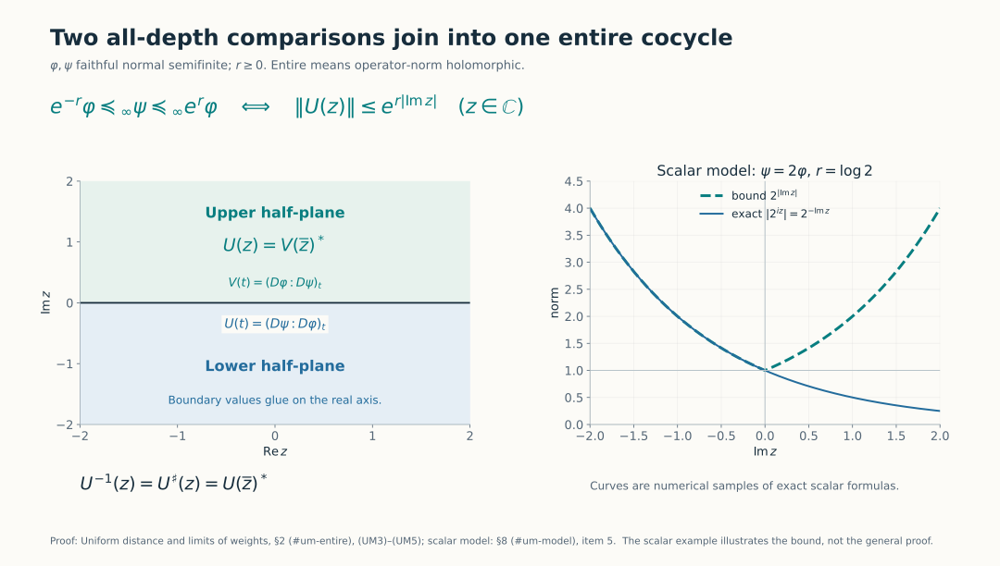
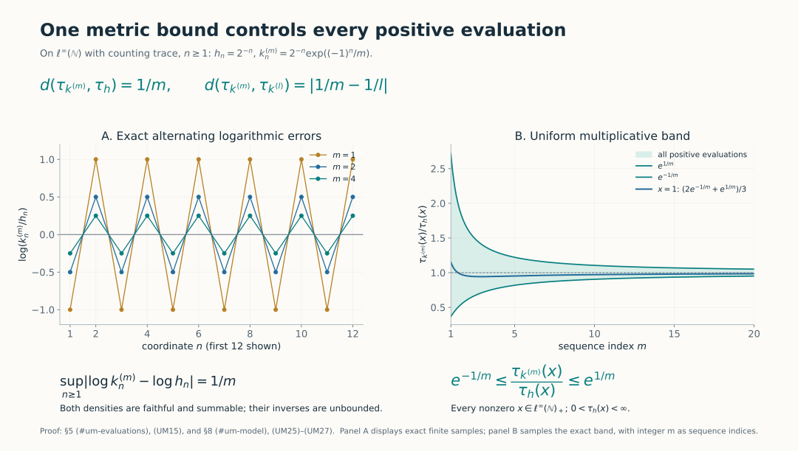
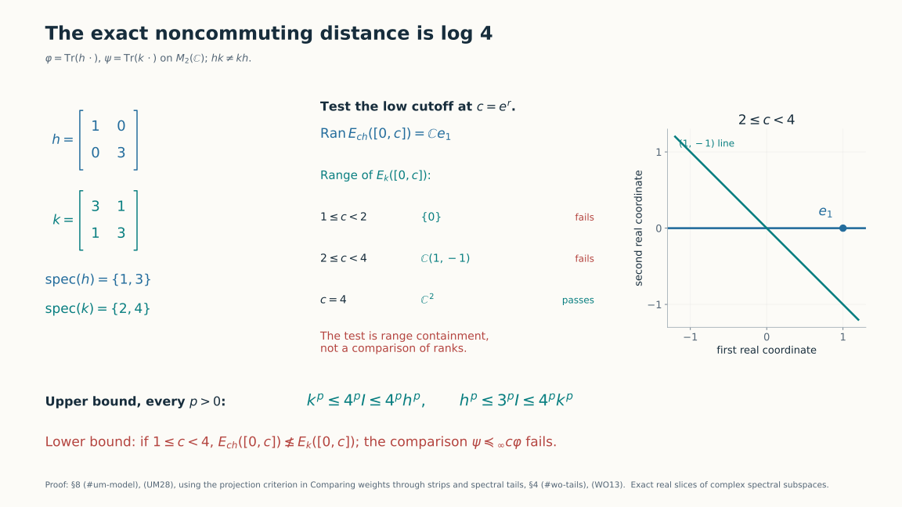

# Uniform distance and limits of weights

*Self-checked by the writing AI.*

The all-depth order gives an extended distance on faithful normal semifinite weights. Finite distance has an analytic meaning: the relative cocycle extends to an entire function with a precise vertical growth bound. We use that bound to construct limits, including the limiting weight itself, and to locate the modular frequencies of the logarithmic perturbation.

## 1. An extended distance

Let \(M\) be a von Neumann algebra and \(\mathcal W_0(M)\) its faithful normal semifinite weights. All the constructions below have arbitrary-predual scope. Use the strip orders and Fourier convention in [Comparing weights through strips and spectral tails](OA-FLOW-WORD.md#wo-setting). Put
\[
 d(\varphi,\psi)=
 \inf\{r\geq0:e^{-r}\varphi\preceq_\infty\psi
                    \preceq_\infty e^r\varphi\},
 \qquad\inf\varnothing=\infty.
 \tag{UM1}
\]
The value \(\infty\) is allowed. A Cauchy sequence for this extended distance is one for which, for every \(\varepsilon>0\), all sufficiently late pairs have distance less than \(\varepsilon\). We prove that every such sequence converges in this same distance to a member of \(\mathcal W_0(M)\).

The zero algebra has a single weight and distance identically zero, so completeness and evaluation continuity are immediate there. For the remaining proof and scalar-rescaling diagnostics assume \(M\ne0\).

The scalar covariance and partial-order properties in [WO3](OA-FLOW-WORD.md#wo-strips) show symmetry and the triangle inequality. In detail, multiply \(e^{-r}\varphi\preceq_\infty\psi\) by \(e^r\) to get \(\varphi\preceq_\infty e^r\psi\), and similarly reverse the other inequality. If the bounds \(r,s\) compare \(\varphi,\psi\) and \(\psi,\chi\), transitivity gives the bound \(r+s\) for \(\varphi,\chi\). Taking infima proves the triangle inequality when both right-hand distances are finite; otherwise it is immediate.

If \(d(\varphi,\psi)=0\), ordinary weight order [WO2](OA-FLOW-WORD.md#wo-dual-order) gives, for every \(\varepsilon>0\),
\[
 e^{-\varepsilon}\varphi(x)\leq\psi(x)
                       \leq e^\varepsilon\varphi(x),\qquad x\in M_+.
 \tag{UM2}
\]
For a finite \(\varphi(x)\), let \(\varepsilon\downarrow0\). For \(\varphi(x)=\infty\), the left inequality already forces \(\psi(x)=\infty\). Hence \(\varphi=\psi\). The converse is immediate. Thus \(d\) is an extended metric. Finite-distance equivalence classes are genuine metric spaces, by the triangle inequality.

## 2. The exact entire-function criterion

For \(r\geq0\) we claim
\[
 \begin{aligned}
 &e^{-r}\varphi\preceq_\infty\psi\preceq_\infty e^r\varphi\\
 &\quad\Longleftrightarrow\
 u_t=(D\psi:D\varphi)_t
 \text{ has an entire }M\text{-valued extension }U
 \text{ with }\|U(z)\|\leq e^{r|\operatorname{Im}z|}.
 \end{aligned}
 \tag{UM3}
\]
Entire means operator-norm holomorphic. There is no assertion that the underlying modular group is norm continuous on all of \(M\).

For the forward direction, \(\psi\preceq_\infty e^r\varphi\), scalar normalization and the chain law give a lower-half-plane extension of \(u\) with bound \(e^{r|\operatorname{Im}z|}\). Indeed its contractive version has real boundary \(e^{-irt}u_t\); multiplication by \(e^{irz}\) recovers \(U\). The other inequality gives an extension \(V\) of \((D\varphi:D\psi)_t\) on the lower half-plane with the same bound. On the upper half-plane define \(U(z)=V(\overline z)^*\). These definitions agree on the real axis by [BC23](OA-FLOW-BC.md#oa-flow.bc.4).

The two halves have continuous normal scalar boundary values. For a small crossing rectangle, cut along the lines \(\operatorname{Im}z=\pm\varepsilon\) and apply the [rectangle Cauchy theorem in SF4](OA-FLOW-SF.md#oa-flow.sf4.rectangle-cauchy) to the two pieces. As \(\varepsilon\downarrow0\), their horizontal integrals cancel because the boundary values agree; the omitted vertical pieces tend to zero by local boundedness. Thus every normal scalar coefficient has zero integral around the crossing rectangle. [SF4's rectangular Morera argument](OA-FLOW-SF.md#oa-flow.sf4.morera) makes the joined coefficient holomorphic across the real line. A locally bounded coefficientwise holomorphic operator function is norm holomorphic by [L158's Cauchy-coefficient construction](OA-FLOW-L158.md#oa-flow.l158.norm-holomorphy). This constructs \(U\) with the exact bound in (UM3).

For the reverse direction, on the lower half-plane the function \(e^{-irz}U(z)\) is contractive and extends \((D\psi:D(e^r\varphi))_t\). Restricting to every strip proves \(\psi\preceq_\infty e^r\varphi\). The entire function \(U^\sharp(z)=U(\overline z)^*\) extends the opposite cocycle and has the same growth bound. Its lower-half-plane comparison gives \(\varphi\preceq_\infty e^r\psi\), equivalently \(e^{-r}\varphi\preceq_\infty\psi\). This proves (UM3).

Uniqueness follows from the identity theorem on scalar coefficients. The same theorem and real unitarity give
\[
 U(z)U^\sharp(z)=U^\sharp(z)U(z)=1,\qquad z\in\mathbb C.
 \tag{UM4}
\]
Thus the inverse exists at every complex point and is the specified entire function \(U^\sharp\).

If \(d=d(\varphi,\psi)<\infty\), apply (UM3) to every \(r>d\). All these extensions coincide by uniqueness, so taking the numerical infimum gives
\[
 \|U(z)\|\leq e^{d|\operatorname{Im}z|}.
 \tag{UM5}
\]
Applying the reverse direction of (UM3) proves that the infimum in (UM1) is attained whenever it is finite. In particular all subsequent inequalities with \(d\), rather than \(d+\varepsilon\), are justified.

The chain rule also continues with its precise order. If \(\varphi,\psi,\chi\) are in one finite-distance class, then
\[
 U_{\chi,\varphi}(z)
 =U_{\chi,\psi}(z)U_{\psi,\varphi}(z)
 \quad(z\in\mathbb C).
 \tag{UM6}
\]
Both sides are entire and agree on the real line by BC4.

The left panel shows the reflection and gluing in (UM3)–(UM5). For a nonzero algebra, the scalar model \(\psi=2\varphi\) has distance \(\log2\); the sampled scalar curve reaches the growth bound in the lower half-plane. [Reproduce the figures](../assets/uniform-weight-distance/generate_metric_figures.py); [source context](#um-sources).

## 3. A quantitative bound for a small exponential type

Let \(E\) be a complex Banach space and \(F:\mathbb C\to E\) be entire with
\(\|F(z)\|\leq e^{\delta|\operatorname{Im}z|}\), where \(\delta\geq0\). For \(R>0\) we have the explicit estimate
\[
 \sup_{|z|\leq R}\|F(z)-F(0)\|
 \leq \eta_\delta(R),\qquad
 \eta_\delta(R)=
 \begin{cases}
 e\,\delta R\,e^{\delta R},&\delta>0,\\
 0,&\delta=0.
 \end{cases}
 \tag{UM7}
\]
To prove this, use Cauchy's derivative estimate on the circle of radius \(1/\delta\) about each \(w\) with \(|w|\leq R\). Its points satisfy \(|\operatorname{Im}z|\leq R+1/\delta\), so
\[
 \|F'(w)\|\leq \delta e^{1+\delta R}.
 \tag{UM8}
\]
The estimate for a Banach-valued function follows by applying the scalar Cauchy formula to bounded linear functionals and using norm separation; the coefficient integral has the same norm bound. Integrate the derivative along the segment from \(0\) to \(z\) to obtain (UM7). For \(\delta=0\), circles of arbitrary radius give \(\|F'(w)\|\leq1/L\); letting \(L\to\infty\) makes \(F\) constant. These arguments use the scalar Cauchy formula and vector integral already proved in [SF3–4](OA-FLOW-SF.md#oa-flow.sf4.cauchy-formula).

For every fixed \(R\), \(\eta_\delta(R)\to0\) as \(\delta\downarrow0\). This quantitative fact supplies the compact-uniform convergence needed below; no compactness theorem for a family of functions is required.

## 4. Construct the limiting weight

Let \((\varphi_n)\) be \(d\)-Cauchy. Discard finitely many terms so that all remaining pairwise distances are at most \(1\), and fix one weight \(\varphi_0\) in this tail. By (UM3)–(UM5), each
\[
 U_n(z)=U_{\varphi_n,\varphi_0}(z)
 \quad\text{satisfies}\quad
 \|U_n(z)\|\leq e^{|\operatorname{Im}z|}.
 \tag{UM9}
\]
Given \(\delta>0\), sufficiently late \(m,n\) satisfy \(d(\varphi_m,\varphi_n)\leq\delta\). Equations (UM6) and (UM7), with \(U_{\varphi_m,\varphi_n}(0)=1\), give
\[
 \sup_{|z|\leq R}\|U_m(z)-U_n(z)\|
 \leq e^R\eta_\delta(R).
 \tag{UM10}
\]
Thus \(U_n\) is Cauchy in norm uniformly on every compact disk. Completeness of \(M\) gives a locally uniform limit \(U\). It is norm entire: pass the uniform limit through each Cauchy coefficient integral on a slightly larger circle; the same geometric coefficient bounds give the local norm power series. On the real line \(U_t\) is unitary, because norm limits preserve both products \(U_n(t)^*U_n(t)=U_n(t)U_n(t)^*=1\).

The real cocycle equations pass to the norm limit at every pair of fixed real times:
\[
 U_{s+t}=U_s\sigma_s^{\varphi_0}(U_t),\qquad U_0=1.
 \tag{UM11}
\]
The group maps here are norm isometries, so this limit is legitimate even though the action need not be point-norm continuous on all elements. The path \(t\mapsto U_t\) is norm continuous because \(U\) is entire.

The arbitrary-algebra [unitary-cocycle realization theorem, with its normalized derivative and uniqueness proof](OA-FLOW-UR.md#oa-flow.ur.5), now gives a unique faithful normal semifinite weight \(\psi\) with
\[
 (D\psi:D\varphi_0)_t=U_t.
 \tag{UM12}
\]
This step constructs an actual weight on the entire positive cone, not merely a candidate collection of cocycles.

It remains to prove convergence in the original metric. Fix \(\varepsilon>0\) and choose \(N\) so that \(d(\varphi_m,\varphi_n)\leq\varepsilon\) for \(m,n\geq N\). For fixed \(n\geq N\), the entire functions
\[
 U_m(z)U_n(z)^{-1}=U_{\varphi_m,\varphi_n}(z)
 \tag{UM13}
\]
converge locally uniformly to \(U(z)U_n(z)^{-1}\). Each has norm at most \(e^{\varepsilon|\operatorname{Im}z|}\); the limit has the same bound. Its real values are \((D\psi:D\varphi_n)_t\), by (UM12) and the chain rule. The reverse implication in (UM3) gives
\[
 d(\psi,\varphi_n)\leq\varepsilon\qquad(n\geq N).
 \tag{UM14}
\]
Uniqueness of this limit follows from the triangle inequality and separation. We have proved completeness of the extended metric, and of every finite-distance class, with no countability restriction on \(M\).

## 5. Evaluations and the norm of normal states

For finite \(r=d(\varphi,\psi)\), ordinary order and (UM3) yield
\[
 e^{-r}\varphi(x)\leq\psi(x)\leq e^r\varphi(x),
 \qquad x\in M_+.
 \tag{UM15}
\]
If \(\varphi_n\to\varphi\) in \(d\) and \(\varphi(x)<\infty\), the two scalar bounds converge to \(\varphi(x)\). If \(\varphi(x)=\infty\), all sufficiently late values \(\varphi_n(x)\) equal infinity. Therefore every evaluation \(\varphi\mapsto\varphi(x)\) is continuous to \([0,\infty]\) with its order topology. The same proof is by neighborhoods, so it also applies to convergent nets.

If \(\varphi,\psi\) are faithful normal states, (UM15) bounds
\[
 |(\psi-\varphi)(x)|\leq e^r-1
 \quad(0\leq x\leq1).
 \tag{UM16}
\]
For a selfadjoint contraction \(b\), write \(b=2x-1\). Since \((\psi-\varphi)(1)=0\), (UM16) bounds its value by \(2(e^r-1)\). The norm of a Hermitian functional is the supremum on selfadjoint contractions: for an arbitrary contraction \(a\), rotate its value to the nonnegative real axis and take the selfadjoint real part of the same rotation of \(a\). That real part is still a contraction and has exactly that functional value. Hence
\[
 \|\psi-\varphi\|\leq\min\{2,\ 2(e^{d(\varphi,\psi)}-1)\}.
 \tag{UM17}
\]
The bound \(2\) follows also by the triangle inequality for two norm-one states. The displayed estimate is not claimed sharp.

There is a precise extension of this statement to nonfaithful normal states. If their supports coincide at \(p\), define their distance by applying (UM1) to their faithful restrictions to \(pMp\); if their supports differ, define it to be infinity. This is an extended metric on all normal states: any finite pair shares a support, and a pair of finite edges in a triangle puts all three states in the same support corner. The norm of a difference supported on \(p\) is unchanged by restriction to \(pMp\), since compression is contractive and the corner unit ball is already a subset of the original unit ball. Thus (UM17) holds for this extension too, with the right side interpreted as \(2\) at infinite distance. This explicitly declares the convention instead of applying a faithful-weight definition to an unsupported state.

## 6. Finite distance bounds the modular frequencies of the perturbation

We first give the Fourier estimate used here. If a Banach-valued entire \(F\) satisfies
\[
 \|F(z)\|\leq C e^{b|\operatorname{Im}z|},\qquad b\geq0,
 \tag{UM18}
\]
then \(\int k_\chi(t)F(t)\,dt=0\) whenever \(\chi\in C_c^\infty\) is supported outside \([-b,b]\). Split \(\chi\) into its positive and negative pieces outside that interval. On the positive piece choose \(\varepsilon>0\) with frequencies at least \(b+\varepsilon\). The estimate (WO20), with \(b+\varepsilon\) replacing its \(\varepsilon\), bounds the bottom edge of the contour integral of \(k_\chi F\) by a constant times \((1+y)^m e^{-\varepsilon y}\). Vertical sides vanish first, exactly as in [WO5](OA-FLOW-WORD.md#wo-half-plane). Letting \(y\to\infty\) proves vanishing. Shift upward for the negative-frequency piece. Scalar testing and norm separation prove the Banach-valued assertion. This is a proof for the actual smooth filters; it assumes no general distribution product theorem.

Now suppose \(r=d(\varphi,\psi)<\infty\), let \(U=U_{\psi,\varphi}\), and put
\[
 a=\frac1iU'(0).
 \tag{UM19}
\]
The derivative belongs to \(M\). Differentiating real unitarity at zero gives \(U'(0)^*=-U'(0)\), hence \(a=a^*\). If \(r>0\), the radius-\(1/r\) Cauchy estimate gives the useful bound \(\|a\|\leq e r\); if \(r=0\), \(a=0\). No sharp derivative inequality is being assumed.

Differentiating the real cocycle law in its second variable gives
\[
 U'(t)=iU(t)\sigma_t^\varphi(a),\qquad
 \sigma_t^\varphi(a)=-iU(t)^*U'(t).
 \tag{UM20}
\]
Therefore
\[
 A(z)=-iU^\sharp(z)U'(z)
 \tag{UM21}
\]
is an entire extension of the modular orbit of \(a\). Cauchy's estimate with circle radius \(1\), together with (UM5), gives
\[
 \|U'(z)\|\leq e^r e^{r|\operatorname{Im}z|},\qquad
 \|A(z)\|\leq e^r e^{2r|\operatorname{Im}z|}.
 \tag{UM22}
\]
Apply (UM18) and the exact smooth-filter characterization [AL7](OA-FLOW-AL.md#equation-al7):
\[
 \operatorname{Sp}_{\sigma^\varphi}(a)\subseteq[-2r,2r].
 \tag{UM23}
\]
This proves the full spectral bound through an actual entire extension of the orbit.

In one common core, let \(H=\log h_\varphi\), \(K=\log h_\psi\). Their spectral logarithms have full selfadjoint domains. Since \(U(t)=h_\psi^{it}h_\varphi^{-it}=e^{itK}e^{-itH}\), [L157's domain theorem](OA-FLOW-L157.md#oa-flow.l157.derivative-domain) applied to the norm derivative at zero gives
\[
 D(K)=D(H),\qquad K\xi=H\xi+a\xi\quad(\xi\in D(H)).
 \tag{UM24}
\]
The bounded difference \(a\) lies in \(M\), although \(H,K\) are affiliated with the core. Formula (UM24) concerns their complete domains; it is not the formal subtraction of unbounded expressions on an unspecified common core.

## 7. Ordered products recover the cocycle in norm

The perturbation also gives an explicit series, with a useful remainder even when its modular orbit is only strongly continuous. More generally, let \(\varphi,\psi\) be faithful normal semifinite weights whose relative cocycle \(u_t=(D\psi:D\varphi)_t\) is differentiable in the intrinsic sigma-strong-star topology, with \(u'_0=ia\). The bounded operator \(a\in M\) is selfadjoint by differentiating unitarity. Conversely, the full logarithm-domain condition \(K=H+a\) with bounded selfadjoint \(a\) gives this differentiability by [L157](OA-FLOW-L157.md#oa-flow.l157.derivative-domain). Finite distance supplies these hypotheses by Section 6, but is unnecessary for the present series.

Put \(\alpha_t=\sigma_t^\varphi\). Differentiating the cocycle identity with its factors in their original order gives \(u'_t=iu_t\alpha_t(a)\). For each vector, the right side is continuous: the bounded orbits of both factors are strongly continuous. The vector fundamental theorem [SF3](OA-FLOW-SF.md#oa-flow.sf3.vector-ftc) therefore gives
\[
 u_t=1+i\int_0^t u_s\alpha_s(a)\,ds.
 \tag{UM29}
\]
This is a strong-star integral, with the usual orientation when \(t<0\). To specify it without a norm-measurability assumption, take vector Riemann integrals on the compact interval. Their bound is \(|t|\|a\|\|\xi\|\); linearity in \(\xi\) gives a bounded operator. The same Riemann sums and adjoint vector integrals prove strong-star convergence. Every sum belongs to \(M\), so its strong limit belongs to \(M\). The intrinsic topology follows by bounded strong transfer in SF2. These arguments also construct the iterated integrals below.

Define \(J_0(t)=1\) and, for \(n\geq1\),
\[
 \begin{aligned}
 J_n(t)
 &=\int_0^t ds_n\int_0^{s_n}ds_{n-1}\cdots
       \int_0^{s_2}ds_1\,
       \alpha_{s_1}(a)\alpha_{s_2}(a)\cdots\alpha_{s_n}(a),\\
 \|J_n(t)\|&\leq\frac{|t|^n\|a\|^n}{n!}.
 \end{aligned}
 \tag{UM30}
\]
The bound follows by induction, integrating the previous bound over the oriented interval and taking absolute values. For \(t\geq0\), the time coordinates increase from left to right in the product. At negative times the same nested oriented integrals define the expression; no commutation or silent reversal of factors is used.

Substitute (UM29) for its leftmost \(u_s\), repeatedly, exactly \(N\) times. This gives the finite identity
\[
 \begin{aligned}
 u_t&=\sum_{n=0}^{N}i^nJ_n(t)+R_N(t),\\
 R_N(t)&=i^{N+1}\int_0^t ds_{N+1}\int_0^{s_{N+1}}ds_N
       \cdots\int_0^{s_2}ds_1\,
       u_{s_1}\alpha_{s_1}(a)\cdots\alpha_{s_{N+1}}(a),\\
 \|R_N(t)\|&\leq\frac{|t|^{N+1}\|a\|^{N+1}}{(N+1)!}.
 \end{aligned}
 \tag{UM31}
\]
The last bound uses \(\|u_{s_1}\|=1\), and the same elementary integral induction as (UM30). Linearity of the vector integrals justifies every finite substitution. The bound tends to zero uniformly for \(t\) in any compact real interval, since consecutive terms of the numerical bound have ratio \(|t|\|a\|/(N+2)\). Consequently
\[
 u_t=\sum_{n=0}^{\infty}i^nJ_n(t)
 \tag{UM32}
\]
converges absolutely in operator norm, uniformly on compact real intervals. Its integrals were constructed in the strong-star topology; convergence of the resulting series is the stronger norm statement. For a fixed modular perturbation \(\alpha_t(a)=a\), the terms reduce to \(t^na^n/n!\), recovering \(u_t=e^{ita}\). In general the ordered factors in (UM30) must remain in place.

## 8. Models and solved diagnostics

**1. Commuting densities.** In a commutative semifinite algebra with a faithful trace, let \(\varphi=\tau_h\), \(\psi=\tau_k\), with nonsingular positive densities. The [semifinite density chart and its normalized cocycle formula](OA-FLOW-WORD.md#wo-model) give
\[
 d(\varphi,\psi)=\|\log k-\log h\|_\infty,
 \tag{UM25}
\]
including the value infinity. Indeed the two all-depth inequalities are exactly \(e^{-r}h\leq k\leq e^rh\) pointwise; scalar logarithms turn them into the essential bound in (UM25).

**2. An explicit Cauchy sequence with unbounded inverse densities.** On \(\ell^\infty(\mathbb N)\), use the counting trace and let
\[
 h_n=2^{-n},\qquad k_n^{(m)}=2^{-n}\exp((-1)^n/m).
 \tag{UM26}
\]
These define faithful normal finite weights; their density inverses are unbounded. Equation (UM25) gives
\[
 d(\tau_{k^{(m)}},\tau_h)=1/m,\qquad
 d(\tau_{k^{(m)}},\tau_{k^{(l)}})=|1/m-1/l|.
 \tag{UM27}
\]
Thus convergence holds in the precise metric, and (UM15) controls every positive evaluation, not just each coordinate.

Here \(\mathbb N=\{1,2,\ldots\}\). The first twelve coordinates are shown, while (UM25)–(UM27) prove the infinite-supremum statement. The band samples the exact bound for every nonzero bounded positive \(x\); for \(x=1\), summing the odd and even geometric series gives \((2e^{-1/m}+e^{1/m})/3\). Integer \(m\) are the sequence indices. [Diagnostic values](../assets/uniform-weight-distance/diagnostics.json).

**3. A finite norm difference need not give finite uniform distance.** Replace \(k_n^{(m)}\) by \(k_n=3^{-n}\). Both positive normal functionals have finite norm. But \(\log k_n-\log h_n=n\log(2/3)\) is unbounded, so \(d(\tau_h,\tau_k)=\infty\). Norm convergence and uniform-distance convergence are different notions.

**4. Noncommuting densities and an exact distance.** On \(M_2(\mathbb C)\), set \(h=\operatorname{diag}(1,3)\), \(k=\begin{pmatrix}3&1\\1&3\end{pmatrix}\). Then
\[
 d(\operatorname{Tr}(h\,\cdot),\operatorname{Tr}(k\,\cdot))=\log4.
 \tag{UM28}
\]
For the upper bound, \(k^p\leq4^p1\leq4^ph^p\) and \(h^p\leq3^p1\leq4^pk^p\) for every \(p>0\). For the lower bound put \(c=e^r<4\). If \(c<2\), the low spectral projection of \(ch\) at \(c\) contains \(e_1\), while that of \(k\) is zero. If \(2\leq c<4\), the latter is the rank-one projection onto \((1,-1)\), whereas the former is the projection onto \(e_1\). Neither case permits the containment required by \(\tau_k\preceq_\infty\tau_{ch}\), by the semifinite density chart proved in the preceding lesson. Thus no \(r<\log4\) works.

The table compares complex spectral subspaces; the plotted lines are their real slices. Rank equality alone does not give the required containment. The all-power upper bound and the failed containment for every \(1\leq c<4\) prove (UM28). [Figure source](../assets/uniform-weight-distance/generate_metric_figures.py).

**5. Scalar rescaling.** For \(c>0\), \(U_{\!c\varphi,\varphi}(z)=c^{iz}1\). Hence \(d(\varphi,c\varphi)=|\log c|\), and the perturbation in (UM19) is \((\log c)1\). Its modular spectrum is \(\{0\}\) when \(c\ne1\), so the interval in (UM23) is a bound, not a claim that every endpoint is attained.

**6. Why the weight-realization step matters.** The locally uniform limit in Section 4 supplies unitaries and a cocycle law. These are exactly UR's hypotheses, not yet a scalar weight definition. UR supplies normality, semifiniteness, faithfulness and the normalized derivative on the full cone. Only after this step can (UM13) prove convergence in the original space of weights.

## Further reading

M. Takesaki, *Theory of Operator Algebras II*, Chapter XII, Section 5, Definition 5.5, Example 5.6(ii)–(iii), Proposition 5.7 and Lemma 5.8, printed pp.422–425, develops this uniform topology. The argument above uses an explicit Cauchy estimate instead of a compactness argument for entire functions, constructs the limiting weight through the complete earlier UR theorem, and proves the required Fourier support estimate directly by contours. L157 separately proves the full logarithm-domain equivalence without assuming finite uniform distance.
