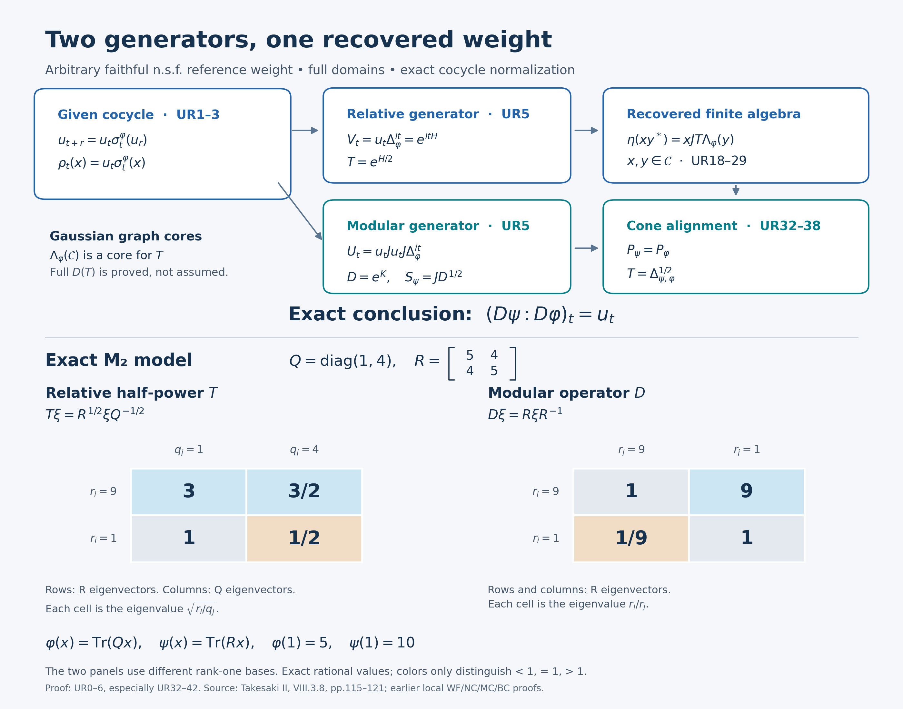

# Recovering a weight from a unitary modular cocycle

Let \(M\) be any von Neumann algebra, let \(\varphi\) be faithful, normal and semifinite, and let \(u:\mathbb R\to\mathcal U(M)\) be strongly* continuous and satisfy

\[
u_{t+r}=u_t\sigma_t^\varphi(u_r).
\tag{UR1}
\]
Then there is a unique faithful normal semifinite weight \(\psi\) such that

\[
(D\psi:D\varphi)_t=u_t\qquad(t\in\mathbb R).
\tag{UR2}
\]
The derivative here is the balanced-matrix derivative defined and proved in [BC4](OA-FLOW-BC.md#oa-flow.bc.4). No realization assertion is included in that earlier definition. We prove (UR2), its normalization and the complete relative operator domains below. Neither the algebra nor its Hilbert spaces need be separable; neither weight need be finite.

The mathematical development uses [Takesaki, *Theory of Operator Algebras II*, VIII.3.8 and its proof through Lemma 3.13, printed pp.115–121](https://doi.org/10.1007/978-3-662-10451-4), read in the exact approved edition. The mixed analytic multiplication construction is shared with that proof. The organization here starts with closed spectral domains, constructs the finite algebra with explicit norm-entire GNS curves, and then proves its natural-cone alignment before identifying the normalized derivative. The latter alignment and the complete Gaussian graph-core argument are written out. The previously constructed free-source Hilbert-algebra, weight and standard-form routes remain actual inputs, not replacements by a book citation.

The direct analytic inputs are [RF5](OA-FLOW-RF.md#oa-flow.rf.5)'s full self-adjoint generator construction, [SF's spectral calculus](OA-FLOW-SF.md#oa-flow.sf.sb0), FF1's Gaussian transform, and [SF4](OA-FLOW-SF.md#oa-flow.sf.sf4)'s scalar identity theorem. For weights we use [GW4–5](OA-FLOW-GW.md#oa-flow.gw.4), WR4, MW1/4, [KT3–4](OA-FLOW-KT.md#oa-flow.kt.3), and the full analytic right multiplication proved in [MA2](OA-FLOW-MA.md#oa-flow.ma.2), equivalently [GF1](OA-FLOW-WS.md#oa-flow.weight-sum.gf1). Fullification and recovery use [WH04, Sections 2–4](OA-FLOW-WH04.md#oa-flow.wh04.2), [WF1–6](OA-FLOW-WF.md#oa-flow.wf.1), and [BD3](OA-FLOW-BD.md#oa-flow.bd.3). Cone identification uses [NC2–4](OA-FLOW-NC.md#oa-flow.nc.2), [CR8](OA-FLOW-CR.md#oa-flow.cr.8), and [MC1/5](OA-FLOW-MC.md#oa-flow.mc.1). The full balanced relative graphs are [BC1–3](OA-FLOW-BC.md#oa-flow.bc.1); uniqueness uses [MA4](OA-FLOW-MA.md#oa-flow.ma.4). Concrete predual integration and representation transport use [CP4–6](OA-FLOW-CP.md#oa-flow.cp.4), [NF5](OA-FLOW-NF.md#oa-flow.nf.5) and ST2. None of these inputs assumes arbitrary-cocycle realization, dual-weight recognition or an operator-valued-weight existence theorem.

## UR0. Two unitary groups and their complete spectral domains

Use the faithful normal GNS representation of \(\varphi\), identifying \(M\) with its image by NF5/ST2. Write \(N=\mathfrak n_\varphi\), \(\Lambda=\Lambda_\varphi\), \(S_\varphi=J\Delta^{1/2}\), and \(\sigma=\sigma^\varphi\). Inner products are linear in the first variable. The assumed bounded strong* continuity transports through this identification by ST2. The cocycle law gives \(u_0=1\) and \(u_{-t}=\sigma_{-t}(u_t^*)\).

Define, for real \(t\),

\[
\alpha_t(x)=u_t\sigma_t(x)u_t^*,\quad
\rho_t(x)=u_t\sigma_t(x),\quad
V_t=u_t\Delta^{it},\quad
U_t=u_tJu_tJ\Delta^{it}.
\tag{UR3}
\]
The cocycle law proves that \(\alpha\) is a group of normal automorphisms, \(\rho\) a group of normal linear isometries, and \(V\) a unitary group. They are pointwise strongly* continuous, or strongly continuous on vectors, respectively. Products of uniformly bounded strongly* convergent operators converge strongly*: expand a product difference on a fixed vector and do the same for adjoints. This justifies all these continuity statements without an operator-norm-continuity hypothesis.

MW gives \(J\Delta^{it}=\Delta^{it}J\) and \(JMJ=M'\). Consequently the left and right factors in \(u_tJu_tJ\) commute, and the cocycle law also gives \(U_{t+r}=U_tU_r\). Thus \(U\) is a strongly continuous unitary group, \(JU_tJ=U_t\), and

\[
U_txU_t^*=\alpha_t(x),\qquad U_tP_\varphi=P_\varphi.
\tag{UR4}
\]
The cone assertion follows from NC4 for \(u_tJu_tJ\), using \(u_t^*\) for the reverse inclusion, and from NC3 for \(\Delta^{it}\).

Apply RF5 on this arbitrary Hilbert space to obtain unique self-adjoint generators \(H,K\):

\[
V_t=e^{itH},\quad U_t=e^{itK},\quad T=e^{H/2},\quad D=e^K.
\tag{UR5}
\]
All exponentials here have SF's full spectral domains. In particular \(T,D\) are positive, injective, densely defined, with dense range. Antiunitary spectral transport and RF5 uniqueness applied to \(JU_tJ=U_t\) give \(JKJ=-K\); hence \(JD^rJ=D^{-r}\), with equality of domains. Thus \(JD^{1/2}\) is a closed conjugate-linear involution on \(D(D^{1/2})\), and its adjoint is \(JD^{-1/2}\), by CI's proved adjoint convention.

We record a graph-core fact used twice. For a self-adjoint \(L\), if an entire \(H\)-valued function \(F\) satisfies \(F(t)=e^{itL}\xi\) for real \(t\), then

\[
\xi\in D(e^{izL}),\qquad F(z)=e^{izL}\xi\quad(z\in\mathbb C).
\tag{UR6}
\]
Indeed, on \(p_m=1_{[-m,m]}(L)\), the scalar identity theorem gives \(p_mF(z)=e^{izL}p_m\xi\). The squared norms on the right increase to the spectral domain integral and are bounded by \(\|F(z)\|^2\). SF's domain criterion and spectral convergence prove (UR6).

Suppose now that a dense linear subspace \(\mathcal E\) consists of such entire vectors and is invariant under every \(e^{izL}\). It is a graph core for every \(e^{izL}\). To see this without assuming norm-closedness of \(\mathcal E\), let \(g_n(t)=\sqrt{n/\pi}e^{-nt^2}\). For \(\xi\in\mathcal E\), finite Riemann sums for \(\int g_n(t)e^{itL}\xi\,dt\) belong to \(\mathcal E\) and converge in the graph norm of \(e^{izL}\): the second coordinates integrate \(g_n(t)e^{itL}e^{izL}\xi\). Tails are bounded by the \(L^1\) tails times the two vector norms. Hence

\[
G_n\xi\in\overline{\mathcal E}^{\,\mathrm{graph}(e^{izL})},
\qquad G_n=e^{-L^2/(4n)}.
\tag{UR7}
\]
Both \(G_n\) and \(e^{izL}G_n\) are bounded. Approximate any vector in Hilbert norm by \(\mathcal E\) to deduce the same graph-closure membership for \(G_n\xi\), for every \(\xi\in H\). Finally, if \(\xi\in D(e^{izL})\), spectral dominated convergence gives \(G_n\xi\to\xi\) in that graph norm. This proves the asserted core property for every complex \(z\).

## UR1. A dense mixed analytic space with its GNS curve included

We first spell out the closed-graph property used for integrals. WR4 identifies \(\Lambda(N)\) with the entire left-bounded vector space of the full Hilbert algebra. If \(a_i\in N\), \(a_i\to a\) weakly as bounded operators, and \(\Lambda(a_i)\to\xi\) weakly in \(H\), then, for every vector \(d\) in its complete first right algebra,

\[
a_id=R_d\Lambda(a_i)\ \longrightarrow\ R_d\xi=ad
\tag{UR8}
\]
weakly. The last equality is exactly the left-boundedness test with multiplier \(a\). WR4 gives \(a\in N\) and \(\Lambda(a)=\xi\). This is WF1's graph proof applied to the given weight. In particular it applies to bounded ultraweak limits and norm-convergent GNS vectors. No norm bound for \(\Lambda\) on the operator unit ball is asserted.

Let \(\mathcal A\) and \(\mathcal B\) be the unital algebras of bounded elements with norm-entire \(\sigma\)- and \(\alpha\)-orbits. Let \(\mathcal C\) consist of those \(x\in M\) for which the \(\rho\)-orbit has a norm-entire extension \(z\mapsto\rho_z(x)\), all its values belong to \(N\), and

\[
z\longmapsto\Lambda(\rho_z(x))
\quad\hbox{is an entire \(H\)-valued function.}
\tag{UR9}
\]
Including the last condition makes the analytic GNS passage explicit. It will not narrow the final theorem.

For \(x\in N\), modular covariance and the left-ideal property give

\[
\rho_t(x)\in N,\qquad
\Lambda(\rho_t(x))=V_t\Lambda(x).
\tag{UR10}
\]
Define

\[
x_n(z)=\int_{\mathbb R}g_n(t-z)\rho_t(x)\,dt.
\tag{UR11}
\]
The operator integral is ultraweak: scalar testing gives a bounded functional on \(M_*\), of norm at most \(e^{n(\operatorname{Im}z)^2}\|x\|\), and CP supplies its unique value in \(M\). Derivatives of the Gaussian converge in \(L^1\), locally uniformly in \(z\), so (UR11) is norm entire. Translation under the normal map \(\rho_s\) gives \(\rho_s(x_n(z))=x_n(z+s)\).

Take simultaneous compact-interval Riemann sums for (UR11) and for \(\int g_n(t-z)V_t\Lambda(x)\,dt\). The coefficient sums have a common operator-norm bound, the scalar normal evaluations converge to (UR11), and the vector sums converge in norm. The graph argument (UR8) proves

\[
x_n(z)\in N,\qquad
\Lambda(x_n(z))=\int_{\mathbb R}g_n(t-z)V_t\Lambda(x)\,dt
                 =e^{-H^2/(4n)}e^{izH}\Lambda(x).
\tag{UR12}
\]
The last expression is the single bounded multiplier, not a prior application of an undefined exponential. Its identity follows from FF1 on compact spectral bands and spectral dominated convergence. It is entire, with all complex shifts. Thus \(x_n(0)\in\mathcal C\).

The probability Gaussian approximate-identity estimate gives \(x_n(0)\to x\) strongly*, \(\|x_n(0)\|\leq\|x\|\), and \(\Lambda(x_n(0))\to\Lambda(x)\) in norm. For strong* convergence, test each orbit against a vector, split into a small interval and its Gaussian tail, and use bounded strong* continuity. GW4 supplies positive contractions \(e_i\in N\) increasing to \(1\); applying this smoothing to \(e_i\) gives a neighborhood-directed net

\[
c_j\in\mathcal C,\qquad \|c_j\|\leq1,\qquad c_j\longrightarrow1
\quad\hbox{strongly*.}
\tag{UR13}
\]
Thus \(\mathcal C\) is ultraweakly dense in \(M\), and \(\Lambda(\mathcal C)\) is dense in \(H\). Uniqueness of entire extensions gives invariance of \(\mathcal C\) under every \(\rho_z\). Equations (UR6), (UR10) show

\[
\Lambda(\rho_z(x))=e^{izH}\Lambda(x)\quad(x\in\mathcal C).
\tag{UR14}
\]
Hence (UR7) makes \(\Lambda(\mathcal C)\) a graph core for every \(e^{izH}\), particularly for \(T\). Since \(T\) has dense range, \(T\Lambda(\mathcal C)\) is dense in \(H\).

The analogous Gaussian construction for \(\sigma,\alpha\), without the GNS condition, proves that \(\mathcal A,\mathcal B\) are ultraweakly dense. Entire continuation of real multiplication and adjoints gives

\[
\begin{split}
\rho_z(bxa)&=\alpha_z(b)\rho_z(x)\sigma_z(a),\\
\sigma_z(x^*y)&=\rho_{\bar z}(x)^*\rho_z(y),\\
\alpha_z(xy^*)&=\rho_z(x)\rho_{\bar z}(y)^*.
\end{split}
\tag{UR15}
\]
Here \(a\in\mathcal A,b\in\mathcal B,x,y\in\mathcal C\). MA2/GF1 gives the exact entire right-multiplier formula

\[
\Lambda(va)=J\sigma_{-i/2}(a^*)J\Lambda(v)
\quad(v\in N,\ a\in\mathcal A).
\tag{UR16}
\]
It proves both finite-ideal membership and the entire GNS curve in the first line of (UR15): right multiplication by \(\sigma_z(a)\) has GNS operator \(J\sigma_{\bar z-i/2}(a^*)J\), a norm-entire function of \(z\). Left multiplication by \(\alpha_z(b)\) is bounded and norm entire. Consequently

\[
\mathcal B\mathcal C\mathcal A\subseteq\mathcal C,\qquad
\mathcal C^*\mathcal C\subseteq\mathcal A,\qquad
\mathcal C\mathcal C^*\subseteq\mathcal B.
\tag{UR17}
\]
These are statements on the whole specified finite ideal, not just on the original finite-star algebra.

## UR2. The recovered finite algebra and its closed involution

Put \(\mathcal B_0=\operatorname{span}\{xy^*:x,y\in\mathcal C\}\). Equations (UR17) show that it is a star algebra and a two-sided ideal of \(\mathcal B\), invariant under all complex \(\alpha_z\). It is ultraweakly dense: with \(y\in\mathcal C\) fixed, (UR13) makes \(c_jy^*\to y^*\); the ultraweak closure therefore contains \(\mathcal C^*\), and then \(M\).

Define

\[
\eta\left(\sum_i x_i y_i^*\right)=\sum_i x_iJT\Lambda(y_i).
\tag{UR18}
\]
We verify well-definedness. Put \(w_i=\Lambda(\rho_{-i/2}(y_i))=T\Lambda(y_i)\), and suppose \(z=\sum_i x_i y_i^*=0\). The linear-first antiunitary identity and (UR16) give

\[
\begin{split}
\left\|\sum_i x_iJw_i\right\|^2
&=\sum_{i,j}\langle J(x_i^*x_j)Jw_j,w_i\rangle\\
&=\sum_{i,j}
 \langle\Lambda(\rho_{-i/2}(y_j)\sigma_{-i/2}(x_j^*x_i)),w_i\rangle\\
&=\sum_i\langle\Lambda(\rho_{-i/2}(z^*x_i)),w_i\rangle=0.
\end{split}
\tag{UR19}
\]
Every vector is defined: \(x_j^*x_i\in\mathcal A\), \(y_j(x_j^*x_i)\in\mathcal C\), and (UR16) applies on \(N\). The formula is linear in \(z\), since \(J\Lambda\) is conjugate-linear in \(y_i\), just like \(y_i^*\).

For \(b\in\mathcal B,z\in\mathcal B_0\), direct multiplication in (UR18) proves

\[
\eta(bz)=b\eta(z),\qquad
\eta(zb)=J\alpha_{-i/2}(b^*)J\eta(z).
\tag{UR20}
\]
For the second identity write \(xy^*b=x(b^*y)^*\), use the first line of (UR15), and commute \(x\in M\) with \(J\alpha_{-i/2}(b^*)J\in M'\).

The range of \(\eta\) is dense. If \(\xi\) is orthogonal to every \(xJT\Lambda(y)\), then \(x^*\xi=0\) for each \(x\in\mathcal C\), since \(JT\Lambda(\mathcal C)\) is dense. Equation (UR13) implies \(\xi=0\). Also \(\eta\) is injective: if \(\eta(z)=0\), (UR20) gives \(z\eta(b)=\eta(zb)=0\) for \(b\in\mathcal B_0\); density forces \(z=0\).

Transport multiplication and star to \(\eta(\mathcal B_0)\). Left multiplication by \(\eta(z)\) is the bounded operator \(z\), and

\[
\langle\eta(zy),\eta(w)\rangle
=\langle\eta(y),\eta(z^*w)\rangle .
\tag{UR21}
\]
Its product span is dense: BD3 supplies positive contractions \(b_j\in\mathcal B_0\) tending strongly to \(1\), since this represented star algebra is nondegenerate and generates \(M\). Then \(\eta(b_jz)=b_j\eta(z)\to\eta(z)\). This uses no increasing or finite-weight assertion about that BD net.

There is a useful whole-domain mixed identity, already implied by MW1 and WH04 Section 3:

\[
JaJ\Lambda(b)=bJ\Lambda(a)\qquad(a,b\in N).
\tag{UR22}
\]
Indeed \(J\Lambda(a)\) is right bounded with multiplier \(JaJ\), while \(\Lambda(b)\) is left bounded with multiplier \(b\). Apply their proved mixed-product equality. No entire-vector assumption is needed in (UR22).

For real \(t\), (UR3), (UR14) and \(J\Delta^{it}=\Delta^{it}J\) give

\[
\eta(\alpha_t(z))=U_t\eta(z).
\tag{UR23}
\]
For \(z=xy^*\), the entire extension on the left is explicitly

\[
F_{x,y}(w)=\rho_w(x)J\Lambda(\rho_{\bar w-i/2}(y)).
\tag{UR24}
\]
The second curve before \(J\) is anti-entire, so this is an entire vector function. Finite sums and well-definedness extend it to \(\mathcal B_0\). Equation (UR6) identifies it with \(e^{iwK}\eta(xy^*)\). The space \(\eta(\mathcal B_0)\) is dense and invariant under all these operators, so (UR7) makes it a graph core for every \(e^{iwK}\).

At \(w=-i/2\), (UR22) now gives

\[
JD^{1/2}\eta(xy^*)
=J\rho_{-i/2}(x)J\Lambda(y)
=yJ\Lambda(\rho_{-i/2}(x))
=\eta(yx^*).
\tag{UR25}
\]
Thus the involution \(\eta(z)\mapsto\eta(z^*)\) is closable and has exactly the closure

\[
S=JD^{1/2},\qquad D(S)=D(D^{1/2}),\qquad
S^*=JD^{-1/2},\qquad D(S^*)=D(D^{-1/2}).
\tag{UR26}
\]
The graph-core argument proves equality, not merely inclusion. We have proved all left-Hilbert-algebra axioms, including dense products and the Hilbert adjoint identity; its represented von Neumann algebra is \(M\).

## UR3. A weight on the whole positive cone

Apply the pure fullification theorem WH04 Sections 2–4 to \(\eta(\mathcal B_0)\). It leaves the full closed involution (UR26) unchanged. Let \(\mathcal R\) be the complete first right algebra and define

\[
\begin{split}
\mathcal L&=\{\xi\in H:
       d\mapsto R_d\xi\text{ is bounded in }\|d\|_H
       \text{ on all }d\in\mathcal R\},\\
I&=\{\lambda_\xi:\xi\in\mathcal L\}\subseteq M,\qquad
\theta(\lambda_\xi)=\xi.
\end{split}
\tag{UR27}
\]
Here \(\lambda_\xi\) denotes the bounded extension of that map. The fullification theorem and WF1 prove that the multiplier is injective, \(I\) is a left ideal, \(\theta(a b)=a\theta(b)\), and \(I\cap I^*\) is the represented full Hilbert algebra. There is no boundedness test on just \(\mathcal B_0\) in (UR27).

The complete forward weight construction WF defines

\[
\psi(a)=
\begin{cases}
\|\theta(a^{1/2})\|^2,&a^{1/2}\in I,\\
\infty,&a^{1/2}\notin I
\end{cases}
\qquad(a\in M_+).
\tag{UR28}
\]
WF3–5 prove additivity, positive homogeneity, faithfulness, normality for arbitrary increasing nets and semifiniteness. WF4/6 identify all domains and the onto GNS realization:

\[
\begin{gathered}
\mathfrak n_\psi=I,\quad
\mathfrak m_\psi=\operatorname{span}I^*I,\quad
\mathfrak n_\psi\cap\mathfrak n_\psi^*=\lambda(\mathcal L\cap D(S)),\\
\Lambda_\psi(b)=\theta(b)\ (b\in I),\quad
\Lambda_\psi(z)=\eta(z)\ (z\in\mathcal B_0),\\
S_\psi=S,\quad J_\psi=J,\quad\Delta_\psi=D,\quad
\sigma_t^\psi=\alpha_t .
\end{gathered}
\tag{UR29}
\]
The last line uses the already proved polar decomposition (UR26), its uniqueness, and MW4. All positive and reciprocal powers of \(D\) have their SF spectral domains. Formula (UR28), rather than a finite-only equality, determines every infinite value of the recovered weight.

## UR4. Why the original and recovered natural cones agree

For every \(a\in N\),

\[
aJ\Lambda(a)\in P_\varphi.
\tag{UR30}
\]
First let \(a\) lie in KT4's finite-star analytic algebra and put \(b=\sigma_{i/4}(a)\). Then \(bb^*\) is positive of finite \(\varphi\)-value, and KT4 plus the entire formula for \(J\) give

\[
\Delta^{1/4}\Lambda(bb^*)
=\Lambda(a\sigma_{-i/2}(a^*))
=aJ\Lambda(a)\in P_\varphi .
\tag{UR31}
\]
For general \(a\in N\), take GW4's finite positive contractions \(e_i\uparrow1\). The element \(e_i a\) is finite-star: its adjoint has squared GNS norm \(\varphi(e_i aa^*e_i)\leq\|a\|^2\varphi(e_i^2)<\infty\), while it itself belongs to \(N\). GW5 gives \(\Lambda(e_i a)\to\Lambda(a)\). Apply KT3's positive Gaussian smoothing to each \(e_i a\); KT3–4 give a neighborhood-directed net \(a_j\) in the analytic algebra, with \(\|a_j\|\leq\|a\|\), \(a_j\to a\) strongly*, and \(\Lambda(a_j)\to\Lambda(a)\) in norm. It follows that \(a_jJ\Lambda(a_j)\to aJ\Lambda(a)\) in norm. Closedness of the cone proves (UR30).

For \(x\in\mathcal C\), put

\[
\zeta_x=D^{1/4}\eta(xx^*)
=\rho_{-i/4}(x)J\Lambda(\rho_{-i/4}(x)).
\tag{UR32}
\]
Equation (UR24) proves the equality and its domain. The right side belongs to \(P_\varphi\) by (UR30). The left side belongs to \(P_\psi\): \(\eta(xx^*)\) is a positive left-bounded vector for the recovered full algebra, and NC2–3 put its quarter-power image in the natural cone. This argument does not assert that \(\psi(xx^*)\) is finite.

The complex span of the \(\zeta_x\) is dense in \(H\). Indeed the polarization formula

\[
xy^*=\frac14\sum_{k=0}^3 i^k(x+i^k y)(x+i^k y)^*
\tag{UR33}
\]
shows that it is \(D^{1/4}\eta(\mathcal B_0)\). The latter has dense range because \(\eta(\mathcal B_0)\) is a graph core for \(D^{1/4}\), whose range is dense.

MC1 supplies the canonical unitary \(W:(M,H,J,P_\psi)\to(M,H,J,P_\varphi)\) intertwining the represented algebra. Both \(W\zeta_x\) and \(\zeta_x\) belong to \(P_\varphi\) and represent the same normal positive functional on \(M\), because \(W\) intertwines \(M\). CR8's uniqueness of cone representatives gives \(W\zeta_x=\zeta_x\). Density proves

\[
W=1,\qquad P_\psi=P_\varphi.
\tag{UR34}
\]
This step is needed: equality of the represented algebra and conjugation alone was not substituted for equality of cones.

## UR5. Relative graphs and the normalized derivative

For \(y\in\mathcal C\), use (UR13) and (UR18):
\[
c_jy^*\longrightarrow y^*\text{ strongly*},\qquad
\Lambda_\psi(c_jy^*)=c_jJT\Lambda(y)\longrightarrow JT\Lambda(y).
\]
The coefficient net is uniformly bounded. WF1's full weak graph property, or (UR8) for \(\psi\), yields

\[
\mathcal C^*\subseteq\mathfrak n_\psi,\qquad
\Lambda_\psi(y^*)=JT\Lambda(y)\quad(y\in\mathcal C).
\tag{UR35}
\]

BC2 constructs the full closed relative operator \(S_{\psi,\varphi}:H_\varphi\to H_\psi\) as the graph closure of

\[
\Lambda(y)\longmapsto\Lambda_\psi(y^*),
\qquad y\in N\cap\mathfrak n_\psi^* .
\tag{UR36}
\]
By (UR34), the canonical standard-form identifications of both Hilbert spaces with \(H\) are the identity. MC5's complete balanced-matrix conjugation formula therefore says that the antiunitary polar factor in (UR36) is exactly \(J\). Write
\[
S_{\psi,\varphi}=J\Delta_{\psi,\varphi}^{1/2}.
\]
Equations (UR35) and (UR14), together with the graph-core property for \(T\), imply \(JT\subseteq S_{\psi,\varphi}\), hence \(T\subseteq\Delta_{\psi,\varphi}^{1/2}\). Both are positive self-adjoint operators. Taking adjoints reverses inclusion, so

\[
\Delta_{\psi,\varphi}^{1/2}=T,\qquad
\Delta_{\psi,\varphi}=e^H,\qquad
S_{\psi,\varphi}=Je^{H/2}.
\tag{UR37}
\]
All are equalities of complete operators and domains.

BC3, applied to the \((\psi,\varphi)\) relative component of the balanced two-weight representation, gives

\[
\Delta_{\psi,\varphi}^{it}
=(D\psi:D\varphi)_t\Delta^{it}.
\tag{UR38}
\]
By (UR5), the left side is \(e^{itH}=V_t=u_t\Delta^{it}\). Cancellation of the unitary \(\Delta^{it}\) proves (UR2), with no undetermined scalar character.

Here are further exact domain consequences, useful in applications:

\[
\begin{split}
N\cap\mathfrak n_\psi^*
 &=\{y\in N:\Lambda(y)\in D(e^{H/2})\},\\
\Lambda_\psi(y^*)&=Je^{H/2}\Lambda(y),\\
\psi(yy^*)&=
 \begin{cases}
 \|e^{H/2}\Lambda(y)\|^2,&\Lambda(y)\in D(e^{H/2}),\\
 \infty,&\Lambda(y)\notin D(e^{H/2})
 \end{cases}\qquad(y\in N).
\end{split}
\tag{UR39}
\]
For the only direction not immediate from the closed operator (UR36)–(UR37), let \(y\in N\) with \(\Lambda(y)\in D(T)\). Its Gaussian approximants \(y_n=x_n(0)\) from (UR11) converge boundedly strongly* to \(y\), and \(\Lambda(y_n)=e^{-H^2/(4n)}\Lambda(y)\to\Lambda(y)\) in the \(T\)-graph norm. Apply (UR35) and the closed GNS graph of \(\psi\) to \(y_n^*\). This proves the reverse membership and the vector identity.

If \(E_H\) is the spectral measure of \(H\), all real powers have precisely

\[
D(\Delta_{\psi,\varphi}^{\,r})
=\left\{\xi:\int_{\mathbb R}e^{2rs}\,d\langle E_H(s)\xi,\xi\rangle<\infty\right\},
\qquad \Delta_{\psi,\varphi}^{\,r}=e^{rH}.
\tag{UR40}
\]
Likewise \(D(\Delta_\psi^{\,r})\) is the same formula with \(K\). The adjoint relative operator has full domain \(J D(T)\) and value \(TJ\); the inverse relative operator is the opposite BC component with domain \(J D(T^{-1})\) and value \(T^{-1}J\). These follow respectively by taking the adjoint and the inverse of the closed bijection between \(D(T)\) and \(J\operatorname{ran}T\). They do not assert \(JHJ=-H\), which need not hold for the relative generator.

Uniqueness is on the whole positive cone. If another faithful n.s.f. \(\chi\) has the same derivative relative to \(\varphi\), BC4's chain and adjoint identities give \((D\chi:D\psi)_t=1\). The mixed orbit of \(1\) is then the constant norm-entire function \(1\). MA4, equation MA11 with \(k=1\), gives \(\chi(a)\leq\psi(a)\) and \(\psi(a)\leq\chi(a)\) for every \(a\geq0\), including infinite values. Thus \(\chi=\psi\). This uses the proved finite-domain comparison, not just equality of modular automorphism groups.

## UR6. Two models and checked exercises

**A noncommuting matrix model.** On \(M_2(\mathbb C)\), take

\[
Q=\begin{pmatrix}1&0\\0&4\end{pmatrix},\qquad
R=\begin{pmatrix}5&4\\4&5\end{pmatrix},\qquad
\varphi(x)=\operatorname{Tr}(Qx),\quad
u_t=R^{it}Q^{-it}.
\tag{UR41}
\]
Then \(u_t\sigma_t^\varphi(u_r)=R^{i(t+r)}Q^{-i(t+r)}\) by direct multiplication; no commutation of \(Q,R\) is used. In Hilbert–Schmidt coordinates \(\Lambda_\varphi(x)=xQ^{1/2}\), \(J\xi=\xi^*\), the preceding constructions are

\[
\begin{gathered}
V_t\xi=R^{it}\xi Q^{-it},\qquad
T\xi=R^{1/2}\xi Q^{-1/2},\\
U_t\xi=R^{it}\xi R^{-it},\qquad
D\xi=R\xi R^{-1},\qquad
\Lambda_\psi(x)=xR^{1/2}.
\end{gathered}
\tag{UR42}
\]
For verification, substitute \(\rho_z(y)=R^{iz}yQ^{-iz}\) into (UR18); it gives \(\eta(xy^*)=xy^*R^{1/2}\). Thus \(\psi(x)=\operatorname{Tr}(Rx)\), including its normalization \(\psi(1)=10\), whereas \(\varphi(1)=5\). In the orthonormal Hilbert–Schmidt basis with row vectors diagonalizing \(R\) and column vectors diagonalizing \(Q\), the four eigenvalues of \(T\) are \(3,3/2,1,1/2\). The relative operator \(e^H\) and the modular operator \(D\) are different.

**An arbitrary-index infinite-domain model.** Let \(I\) be any nonempty set, \(M=\ell^\infty(I)\), \(\varphi(a)=\sup_{F\subset I,\ F\text{ finite}}\sum_{i\in F}a_i\) for \(a\geq0\), and choose finite numbers \(h_i>0\), with no common upper or positive lower bound required. Put \(u_t(i)=h_i^{it}\). The action \(\sigma^\varphi\) is trivial and \(u\) is a strongly* continuous unitary group on \(\ell^2(I)\): approximate each vector by a finite-support vector and use the uniform unitary bound on the tail. The theorem gives

\[
\begin{gathered}
\psi(a)=\sup_{F\subset I,\ F\text{ finite}}\sum_{i\in F}h_i a_i,\qquad
\mathfrak n_\psi=\{x\in\ell^\infty(I):\sum_i h_i|x_i|^2<\infty\},\\
H_\varphi=\ell^2(I),\quad
T\xi=(\sqrt{h_i}\xi_i)_i,\quad
D(T)=\{\xi\in\ell^2(I):\sum_i h_i|\xi_i|^2<\infty\},\\
\Lambda_\psi(x)=(\sqrt{h_i}x_i)_i,\qquad U_t=1,\quad D=1.
\end{gathered}
\tag{UR43}
\]
The displayed weight is faithful. Additivity and arbitrary-net normality follow by interchanging the finite-subset supremum with the relevant increasing supremum; finite-support projections give semifiniteness. Its GNS map is onto after completion because its range contains every finite-support vector. Direct conjugation and multiplication verify (UR43), so uniqueness identifies it with (UR28). For uncountable \(I\), no countability reduction of the algebra has been made.

**Exercise 1: scalar normalization.** Determine the weight for \(u_t=e^{iat}1\), \(a\in\mathbb R\).

**Solution.** BC5 gives \((D(e^a\varphi):D\varphi)_t=e^{iat}1\); uniqueness yields \(\psi=e^a\varphi\). Its finite ideal equals \(N\), but its GNS norm is multiplied by \(e^{a/2}\). Its modular automorphism group still equals \(\sigma^\varphi\). Thus that group alone cannot recover the required scalar.

**Exercise 2: a genuine relative domain.** In (UR43), let \(I=\mathbb N\), \(h_i=i^2\), and \(\xi_i=1/i\). Is \(\xi\) in \(D(T)\)? Give a vector in \(D(T)\) which is not finitely supported.

**Solution.** \(\sum_i|\xi_i|^2<\infty\), but \(\sum_i h_i|\xi_i|^2=\sum_i1=\infty\); hence \(\xi\notin D(T)\). The vector \(\eta_i=1/i^2\) is in \(D(T)\), because \(\sum_i h_i|\eta_i|^2=\sum_i1/i^2<\infty\). These are full spectral domains, not an analytic-core convention.

**Exercise 3: a cocycle need not be an ordinary group.** Prove that the path in (UR41) is not a one-parameter unitary group.

**Solution.** Put \(A=\log R\), \(B=\log Q\). If \(e^{itA}e^{-itB}\) were a group, its derivative at zero would make it \(e^{it(A-B)}\): this follows by differentiating the group law and solving the bounded matrix differential equation. The second derivatives at zero would therefore agree. Their difference is \([A,B]\). But

\[
A=\frac{\log9}{2}\begin{pmatrix}1&1\\1&1\end{pmatrix},
\quad B=\begin{pmatrix}0&0\\0&\log4\end{pmatrix},
\quad
[A,B]=\frac{\log9\,\log4}{2}
       \begin{pmatrix}0&1\\-1&0\end{pmatrix}\ne0.
\tag{UR44}
\]
This contradicts equality of the second derivatives. The ordinary unitary group used in the proof is \(V_t=u_t\Delta^{it}\) on the GNS Hilbert space, not generally \(u_t\) on the original algebra.

**Exercise 4: a coboundary and its standard-form factor.** For a unitary \(v\in M\), determine the weight for \(u_t=v\sigma_t^\varphi(v^*)\), and specify its cone-aligned GNS realization.

**Solution.** Put \(\chi(x)=\varphi(v^*xv)\) on \(M_+\), including infinite values. The normal automorphism \(x\mapsto v^*xv\) proves faithfulness, normality and semifiniteness. Its finite ideal is
\(\mathfrak n_\chi=\{x:v^*xv\in N\}=\{x:xv\in N\}\).
Pulling back the original GNS representation through that automorphism first gives \(\Lambda(x)=\Lambda_\varphi(v^*xv)\), represented action \(a\mapsto v^*av\), and the original closed graph and cone. The unitary \(w=vJvJ\) intertwines this represented action with \(a\mapsto a\), commutes with \(J\), and preserves \(P_\varphi\) by NC4. Thus the cone-aligned realization is

\[
\Lambda_\chi(x)=vJvJ\Lambda_\varphi(v^*xv)
               =JvJ\Lambda_\varphi(xv)\quad(x\in\mathfrak n_\chi).
\tag{UR45}
\]
It is isometric for \(\chi\), has dense range, and has the same natural cone and conjugation as the reference standard form.

For \(y\in\mathcal C\), write \(a=v^*y\). Here
\(\rho_z(y)=v\sigma_z(a)\); all \(\sigma_z(a)\) belong to \(N\), with entire GNS curve. Equations (UR6) and KT4's spectral identification give \(\Lambda_\varphi(a)\in D(\Delta^{1/2})\). It is also left bounded, so WR4 puts \(a\) in the full finite-star algebra. Therefore \(y^*v=a^*\in N\), \(y^*\in\mathfrak n_\chi\), and

\[
\begin{split}
\Lambda_\chi(y^*)
&=JvJ\Lambda_\varphi(a^*)\\
&=JvJ\,J\Lambda_\varphi(\sigma_{-i/2}(a))
 =J\Lambda_\varphi(\rho_{-i/2}(y))
 =JT\Lambda_\varphi(y).
\end{split}
\tag{UR46}
\]
The canonical relative polar factor is \(J\), by MC5. The same graph-core and self-adjoint-inclusion argument as in (UR35)–(UR38) proves \((D\chi:D\varphi)_t=u_t\), so uniqueness gives \(\psi=\chi\). In particular
\(\eta(z)=vJvJ\Lambda_\varphi(v^*zv)\) for \(z\in\mathcal B_0\).
In Hilbert–Schmidt coordinates for \(\varphi(x)=\operatorname{Tr}(Qx)\), (UR45) is \(xvQ^{1/2}v^*\). Both standard-form factors are necessary; the expression \(v\Lambda_\varphi(v^*xv)\) alone would not be the cone-aligned realization.

The result settles arbitrary faithful n.s.f. unitary-cocycle realization, with exact normalization. It makes no assertion that nonunitary cocycles have faithful realizations, or that an arbitrary action is modular. Dual-weight recognition may now use this theorem together with its separately proved comparison and averaging premises.

## Two generators, one recovered weight

The top diagram records the proof mechanism of [UR0–5](OA-FLOW-UR.md#ur-0), not a finite-dimensional approximation to the theorem. Starting with \(u_{t+r}=u_t\sigma_t^\varphi(u_r)\), the two strongly continuous unitary groups are
\[
V_t=u_t\Delta_\varphi^{it}=e^{itH},
\qquad
U_t=u_tJu_tJ\Delta_\varphi^{it}=e^{itK}.
\]
Their positive operators have different roles:
\[
T=e^{H/2}=\Delta_{\psi,\varphi}^{1/2},
\qquad D=e^K=\Delta_\psi.
\]
The Gaussian mixed space \(\mathcal C\) has its entire GNS curve included in its definition. Equations UR11–14 and UR7 show that \(\Lambda_\varphi(\mathcal C)\) is a graph core for \(T\). Equations UR18–26 construct the dense algebra and its full closed involution:
\[
\eta(xy^*)=xJT\Lambda_\varphi(y),\qquad
S_\psi=JD^{1/2}.
\]
The whole-domain fullification and weight formula are UR27–29. The common cone vectors
\[
D^{1/4}\eta(xx^*)
=\rho_{-i/4}(x)J\Lambda_\varphi(\rho_{-i/4}(x))
\in P_\psi\cap P_\varphi
\]
have dense complex span, by UR30–34. Thus the canonical standard-form unitary is the identity. The relative polar factor is \(J\), and the graph core identifies the full relative positive operator, giving UR37–38 and exact \((D\psi:D\varphi)_t=u_t\). The diagram's arrows stand for these proved operations, not inclusions between the two unrelated generator spectra.

The lower panels are the exact two-dimensional model in UR41–42:
\[
Q=\begin{pmatrix}1&0\\0&4\end{pmatrix},\qquad
R=\begin{pmatrix}5&4\\4&5\end{pmatrix},\qquad
u_t=R^{it}Q^{-it}.
\]
Here \(\varphi(x)=\operatorname{Tr}(Qx)\) and the recovered weight is \(\psi(x)=\operatorname{Tr}(Rx)\). In Hilbert–Schmidt coordinates,
\[
T\xi=R^{1/2}\xi Q^{-1/2},\qquad
D\xi=R\xi R^{-1}.
\]
For \(T\), use the orthonormal rank-one basis whose row vectors diagonalize \(R\), with eigenvalues \(9,1\), and whose column vectors diagonalize \(Q\), with eigenvalues \(1,4\). The four positive eigenvalues are exactly
\[
\left(\sqrt{r_i/q_j}\right)_{i,j}
=\begin{pmatrix}3&3/2\\1&1/2\end{pmatrix}.
\]
For \(D\), both row and column vectors diagonalize \(R\), in the order \(9,1\), giving
\[
\left(r_i/r_j\right)_{i,j}
=\begin{pmatrix}1&9\\1/9&1\end{pmatrix}.
\]
The panels explicitly use different rank-one bases. Their cell colors only distinguish values above, equal to, or below one; the displayed rational numbers are the exact data. They are not spectral measures for the general theorem.

The weight totals are \(\varphi(1)=5\), \(\psi(1)=10\). No state normalization has been imposed. UR6's infinite-domain model separately shows why \(D(T)\) cannot be replaced by the whole GNS Hilbert space: for \(h_i=i^2\) on \(\ell^\infty(\mathbb N)\), \((1/i)_i\in\ell^2\) but not in \(D(T)\).

Human mathematical source: [Takesaki II, VIII.3.8 and its complete proof, printed 115–121](https://doi.org/10.1007/978-3-662-10451-4), together with the exact earlier locally proved fullification and standard-form providers identified in the proof. This diagram, finite example layout, exact-data file and renderer are original to this packet. [render_figure.py](../assets/unitary-modular-cocycle/render_figure.py) reproduces the PNG, SVG and JSON; their native visual inspection and repeated-render identities are recorded separately.
