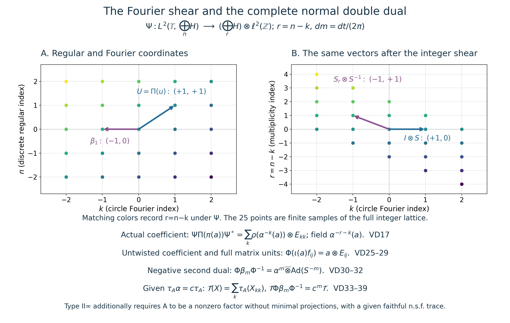

# Discrete von Neumann crossed products and their compact double dual

Original independent reconstruction, 2026-10-04. CC0-1.0 to the extent of rights held.

Let \(A=A''\subseteq B(H)\) be a von Neumann algebra on an arbitrary Hilbert space, with its identity acting as \(I_H\), and let \((\alpha^m)_{m\in\mathbb Z}\) be a given action by normal \*-automorphisms, generated by \(\alpha\). Zero algebras/spaces give the zero construction; nonzero hypotheses will be explicit when needed. No faithful state or weight, separability, spatial implementation of \(\alpha\) on \(H\), outerness or modular-period assumption is made.

Write \(K=\mathbb T\), with normalized Haar measure \(dm(z)=dt/(2\pi)\) for \(z=e^{it}\). The precise earlier proofs are [CC-0](OA-FLOW-CC.md#cc-circle-fourier) for this scalar measure, complete Fourier expansion and arbitrary-Hilbert onto unitary; [L24 Propositions4.1–4.2](OA-FLOW-L24.md) for Bochner integration and Hilbert tensors; CF Sections6–8 and10 for calculus, positivity, operator order, Hilbert forms and completions; [CP01–06](OA-FLOW-CP.md#oa-flow.cp.1) for the norm-closed predual and complete normal vector-series tests; [BD1–5](OA-FLOW-BD.md#oa-flow.bd.1) for bounded approximation in the actual generated algebra; [SF's bounded convergence](OA-FLOW-SF.md#oa-flow.sf2.bounded-strong-transfer); PC1 for bounded polar decompositions and support projections; and [GW4](OA-FLOW-GW.md#oa-flow.gw.4) for the actual increasing finite positive contraction net. Only CC's independent harmonic lemma is used, not its modular-weight hypothesis.

The free author manuscript actually read for development comparison is [Hiai, §10.1, printed pp.89–95](https://arxiv.org/pdf/2004.02383v1#page=89). Its dual convention is positive. We choose and prove the **negative** convention below, on both dual actions. Its general duality theorem, general LCA tensor-commutant step, spatial-implementation/representation-independence theorem and dual-weight theorem are not premises.

## VD-0. The actual discrete crossed product and its compact action

Put \(\mathcal H=\bigoplus_{n\in\mathbb Z}H\). Define

\[
(\pi(a)\xi)_n=\alpha^{-n}(a)\xi_n,\qquad
(u\xi)_n=\xi_{n-1},\qquad C=(\pi(A)\cup\{u\})''.
\tag{VD1}
\]
These are bounded operators: \(\|\pi(a)\|=\|a\|\), \(u\) is unitary, and \(\pi\) is a unital faithful \*-representation. Both \(\alpha\) and its inverse preserve positive order and increasing suprema: an order isomorphism transports the least-upper-bound defining property. All powers are ultraweakly continuous by the given normal-action hypothesis.

Here is the full normality check for \(\pi\). For vectors \(\xi,\eta\in\mathcal H\),

\[
\langle\pi(a)\xi,\eta\rangle
=\sum_n\langle\alpha^{-n}(a)\xi_n,\eta_n\rangle,\qquad
\sum_n\|\xi_n\|\,\|\eta_n\|\leq\|\xi\|\,\|\eta\|.
\tag{VD2}
\]
Each summand is a normal functional on \(A\), and its norm is at most the displayed product. CP's norm-closed predual therefore makes the sum normal. For an arbitrary summable vector-series test on \(B(\mathcal H)\), sum the same norm estimate over its vector pairs. Thus \(\pi\) is ultraweakly continuous on its whole space, not only on bounded nets. Its inverse on its image is the normal coordinate compression at \(n=0\).

Its image is a von Neumann algebra without an assumption that arbitrary convergent nets are bounded. It is exactly the diagonal operators \(T\) whose entries satisfy \(T_{nn}=\alpha^{-n}(T_{00})\), \(T_{00}\in A\). These are ultraweakly closed coordinate equations, since compression and each \(\alpha^{-n}\) are normal. Every such operator equals \(\pi(T_{00})\). To check the bicommutant assertion explicitly, BD4 approximates an element of \(\pi(A)''\) strongly-* by a uniformly bounded net in \(\pi(A)\). CP's tail estimate makes this net ultraweakly convergent, so its limit still satisfies the closed equations. Hence \(\pi(A)''=\pi(A)\). Direct computation also gives

\[
u\pi(a)u^*=\pi(\alpha(a)).
\tag{VD3}
\]
This \(C\) is the actual regular von Neumann crossed product \(A\rtimes_\alpha\mathbb Z\).

For \(z\in K\), set \((D_z\xi)_n=z^{-n}\xi_n\). Finite coordinate truncation and the unitary bound prove strong continuity of \(z\mapsto D_z\), for arbitrary \(H\). Define

\[
\gamma_z=\operatorname{Ad}(D_z)|_C,\qquad
\gamma_z(\pi(a))=\pi(a),\qquad \gamma_z(u)=\overline z\,u.
\tag{VD4}
\]
The formulas preserve the generated algebra; \(D_{z^{-1}}\) gives the inverse. Conjugation is normal and the orbit of every bounded operator is strongly continuous, by expanding its difference and using strong continuity of both unitary factors. Thus \(\gamma\) is an actual continuous compact action, with the chosen negative character.

We record a complete Fourier description, useful for normal closure. Every \(T\in C\), with matrix entries in \(B(H)\), satisfies

\[
T_{ij}\in A,\qquad T_{i+1,j+1}=\alpha^{-1}(T_{ij})\quad(i,j\in\mathbb Z).
\tag{VD5}
\]
These equations hold on the algebra generated by \(\pi(A),u\) and are ultraweakly closed. BD4 gives uniformly bounded strong-* approximants in that actual algebra for every element of \(C\); CP's tail estimate gives ultraweak convergence, proving [VD5](OA-FLOW-VD.md#equation-vd5) on the whole \(C\). Conversely suppose a bounded \(T\) has [VD5](OA-FLOW-VD.md#equation-vd5). The strong-vector integral

\[
P_l(T)=\int_K z^lD_zTD_z^*\,dm(z)\qquad(l\in\mathbb Z)
\tag{VD6}
\]
exists: each vector orbit is continuous on the compact circle, hence Bochner integrable, and its integral has norm at most \(\|T\|\|\xi\|\). The resulting operator has norm at most \(\|T\|\). Compression commutes with this integral, by L24's bounded-map identity. Character orthogonality and [VD5](OA-FLOW-VD.md#equation-vd5) give

\[
P_l(T)=\pi(a_l)u^l,\qquad a_l=T_{0,-l}.
\tag{VD7}
\]
Indeed its only nonzero entries have \(i-j=l\), and there its entry is \(\alpha^{-i}(a_l)\).

The nonnegative Fejer kernels in [CC-0](OA-FLOW-CC.md#oa-flow.cc.0) have integral one and concentrate at \(1\). Consequently

\[
T_N=\int_K F_N(z)D_zTD_z^*\,dm(z)
=\sum_{|l|<N}(1-|l|/N)\pi(a_l)u^l,\qquad
\|T_N\|\leq\|T\|,\quad T_N\longrightarrow T\text{ strongly-*}.
\tag{VD8}
\]
For completeness, on a fixed vector split the norm of the integral difference into a small arc and its complement. On the arc strong continuity makes the difference arbitrarily small; off it the norm is at most \(2\|T\|\|\xi\|\) and the kernel integral tends to zero by [CC-0](OA-FLOW-CC.md#oa-flow.cc.0)'s explicit \(4/(Nc_V^2)\) bound. Apply the same argument to \(T^*\); the kernel is real, so it gives the adjoint convergence. Thus \(T\in C\). This proves both directions of [VD5](OA-FLOW-VD.md#equation-vd5) with genuinely bounded approximants. In particular

\[
C^\gamma=\pi(A):
\tag{VD9}
\]
a fixed operator has zero off-diagonal entries by [VD4](OA-FLOW-VD.md#equation-vd4), and [VD5](OA-FLOW-VD.md#equation-vd5) determines its diagonal from \(T_{00}\). This is a discrete/compact statement, with no general measurable-field theorem.

## VD-1. The second regular representation and its full Fourier unitary

On \(\mathcal L=L^2(K,\mathcal H)\), with strongly measurable Bochner representatives, define

\[
(\Pi(c)f)(z)=\gamma_{z^{-1}}(c)f(z),\qquad
(\ell(w)f)(z)=f(w^{-1}z),\qquad
B=(\Pi(C)\cup\{\ell(w):w\in K\})''.
\tag{VD10}
\]
All coefficient orbits are strongly continuous on vectors. The fields therefore act on simple functions and then on the complete \(L^2\) space, with operator norm at most \(\|c\|\). The unitary

\[
(Vf)(z)=D_zf(z),\qquad V^{-1}f(z)=D_z^*f(z)
\tag{VD11}
\]
is well defined. To check strong measurability, first use simple functions: each compact vector orbit has separable range and is continuous. Approximate general strongly measurable functions in \(L^2\); multiplication preserves their norm and the summable-subsequence argument in L24 gives strongly measurable representatives for the limit. The same argument applies to the inverse. Pointwise norm preservation and these inverse formulas prove onto unitarity.

It follows that \(V\Pi(c)V^*\) is the constant multiplication operator \(c\). This proves that \(\Pi\) is faithful and normal. For normality one can expand in [CC-0](OA-FLOW-CC.md#oa-flow.cc.0)'s Fourier Hilbert sum: constant multiplication is \(\bigoplus_k c\), whose normal vector-series tests converge in predual norm by the estimate of [VD2](OA-FLOW-VD.md#equation-vd2); conjugation by \(V\) preserves normality. The translation group is strongly continuous by [CC-0](OA-FLOW-CC.md#oa-flow.cc.0), and direct substitution gives

\[
\ell(w)\Pi(c)\ell(w)^*=\Pi(\gamma_w(c)).
\tag{VD12}
\]
The bounded strong-* approximants [VD8](OA-FLOW-VD.md#equation-vd8) pass through constant multiplication, first on finite scalar tensors and then on all of \(\mathcal L\) by their common norm bound. Conjugating by \(V\) gives \(\Pi(T_N)\to\Pi(c)\) strongly-*. Hence

\[
B=(\Pi(\pi(A))\cup\{\Pi(u),\ell(w):w\in K\})''.
\tag{VD13}
\]
Thus every element of the first crossed product, not only a formal algebraic subspace, is represented in the second one.

Let \(\mathcal H_r=\bigoplus_{r\in\mathbb Z}H\) and let \(K_0=\ell^2(\mathbb Z)\), with basis \(\varepsilon_k\). Define the Fourier/shear map

\[
\begin{split}
\Psi:\mathcal L&\longrightarrow\mathcal H_r\otimes K_0,\\
(\Psi f)_{r,k}&=\int_K z^{-k}f_{r+k}(z)\,dm(z).
\end{split}
\tag{VD14}
\]
Each coefficient integral exists by \(L^2\subset L^1\) on this probability space. The Fourier unitary of [CC-0](OA-FLOW-CC.md#oa-flow.cc.0), applied to the **arbitrary** Hilbert space \(\mathcal H\), gives the norm sum over \((n,k)\). The bijection \((n,k)\mapsto(r=n-k,k)\) preserves that sum. Thus \(\Psi\) is an onto unitary, with inverse

\[
(\Psi^{-1}\eta)_n(z)=\sum_{k\in\mathbb Z}z^k\eta_{n-k,k},
\tag{VD15}
\]
where the sum converges in the complete vector \(L^2\) space by finite-support truncation and Parseval. No pointwise convergence or globally separable coefficient space is asserted.

On \(\mathcal H_r\), put \((\rho(a)\eta)_r=\alpha^{-r}(a)\eta_r\). It is the faithful normal diagonal representation proved in [VD2](OA-FLOW-VD.md#equation-vd2). On \(K_0\), put

\[
S\varepsilon_k=\varepsilon_{k+1},\qquad
d_w\varepsilon_k=w^{-k}\varepsilon_k,\qquad
E_{ij}\varepsilon_k=\delta_{jk}\varepsilon_i.
\tag{VD16}
\]
Computation on the dense finite Fourier-coordinate vectors, followed by boundedness, gives on the complete spaces

\[
\begin{split}
\Psi\Pi(\pi(a))\Psi^*
 &=\sum_k\rho(\alpha^{-k}(a))\otimes E_{kk},\\
\Psi\Pi(u)\Psi^*&=I\otimes S,\\
\Psi\ell(w)\Psi^*&=I\otimes d_w .
\end{split}
\tag{VD17}
\]
The first sum is a bounded strong-* diagonal sum. It retains the actual coefficient field \(\alpha^{-r-k}(a)\) at \((r,k)\). The second formula uses \((\Pi(u)f)_n(z)=z f_{n-1}(z)\): both old indices \(n,k\) increase by one, so \(r=n-k\) is unchanged. The last formula is the negative translation character. These computations require no implementing unitary for \(\alpha\) on \(H\).

## VD-2. The full tensor commutant and normal matrix model

We prove the necessary tensor statement rather than import it. Let \(N=N''\subseteq B(L)\) be any concrete von Neumann algebra, and set

\[
\mathcal D_N=(N\otimes I\ \cup\ I\otimes B(K_0))''.
\tag{VD18}
\]
If an operator commutes with all \(I\otimes E_{ij}\), its off-diagonal matrix entries vanish by the coordinate projections, and the diagonal entries all equal one \(t\in B(L)\) by the other matrix units. Testing finite-support vectors proves the operator is \(t\otimes I\). Commutation with \(N\otimes I\) says \(t\in N'\). Therefore

\[
\mathcal D_N'=N'\otimes I,\qquad
\mathcal D_N=(N'\otimes I)'
=\{X\in B(L\otimes K_0):X_{ij}\in N\text{ for every }i,j\}.
\tag{VD19}
\]
The last equality follows by testing each coordinate of commutation, using \(N=N''\). It is also constructively a closure statement. For finite \(J\subset\mathbb Z\), put \(q_J=I\otimes\sum_{j\in J}E_{jj}\). If the entries of \(X\) lie in \(N\), then

\[
q_JXq_J=\sum_{i,j\in J}X_{ij}\otimes E_{ij}\in N\odot B(K_0),\quad
\|q_JXq_J\|\leq\|X\|,\quad q_JXq_J\longrightarrow X\text{ strongly-*}.
\tag{VD20}
\]
Finite coordinate truncation gives \(q_J\to I\) strongly. Expanding products gives the stated limits; CP's bounded vector-series tail gives ultraweak convergence. Thus [VD19](OA-FLOW-VD.md#equation-vd19) proves the complete tensor commutant, including both inclusions.

We will use its exact matrix norm and positivity:

\[
\|X\|=\sup_{J\text{ finite}}\|q_JXq_J\|,\qquad
X\geq0\ \Longleftrightarrow\ q_JXq_J\geq0\text{ for every finite }J.
\tag{VD21}
\]
The norm identity follows by testing arbitrary pairs of finite-support unit vectors, which are dense. Positivity follows by testing their quadratic forms and taking norm limits. Conversely a consistent array \(x_{ij}\in N\) with finite corners bounded by \(M\) defines a bounded sesquilinear form on the finite-support vectors, of bound \(M\). Hilbert representation/completion gives its unique operator \(X\), with those entries. This closes the passage from finite corners to every bounded operator.

We also need to identify the tensor algebra using the original representation of \(A\), not merely rename \(\rho(A)\). Define

\[
\Theta_\rho:\mathcal D_A\longrightarrow\mathcal D_{\rho(A)},
\qquad (\Theta_\rho(X))_{ij}=\rho(X_{ij}).
\tag{VD22}
\]
For a finite corner, the target is the direct sum over \(r\) of the matrices \((\alpha^{-r}(X_{ij}))\) on \(H^{J}\). Entrywise \(\alpha^{-r}\) is a \*-automorphism of the C\*-algebra \(M_J(A)\), hence isometric and positivity preserving in both directions. Here no matrix norm theorem is assumed: it is a closed \*-algebra on \(H^J\), so is a C\*-algebra by CF; CF's elementary contractivity for unital \*-homomorphisms, applied to the automorphism and inverse, proves isometry. The \(r=0\) block already reflects positivity. [VD21](OA-FLOW-VD.md#equation-vd21) therefore gives an isometric positive map on all arrays. Every target array in \(\rho(A)\) has a unique source array, and its finite norms are the same; the converse construction after [VD21](OA-FLOW-VD.md#equation-vd21) proves onto surjectivity.

It preserves adjoints. For products, the \((i,j)\) entry of \(XY\) is the bounded strong limit of \(\sum_{k\in J}X_{ik}Y_{kj}\), by inserting \(q_J\) between \(X,Y\); the norms are at most \(\|X\|\|Y\|\). CP gives ultraweak convergence. Normality of \(\rho\) transports that entry to the corresponding entry of the product of the target operators. Thus \(\Theta_\rho\) is a unital \*-isomorphism.

Its full normality, including a normal inverse, can be checked without assumptions about boundedness of arbitrary convergent nets. For a target vector pair, split the pair into its \(r\)-coordinates. At each \(r\), first truncate the \(k\)-coordinates. The pulled-back coefficient is then a finite sum of normal tests of \(\alpha^{-r}(X_{ij})\). Removing that truncation converges in functional norm, since the error is bounded by

\[
\|\xi-q_J\xi\|\,\|\eta\|+\|\xi\|\,\|\eta-q_J\eta\|
\quad\text{on the unit ball.}
\tag{VD23}
\]
Next sum over \(r\), and finally over a defining vector series; Cauchy–Schwarz gives the same summable norm bound as [VD2](OA-FLOW-VD.md#equation-vd2). CP's norm-closed predual makes the entire pulled-back functional normal. This proves ultraweak continuity on the whole source algebra. The inverse is compression at \(r=0\), an actual normal compression on \(B(H\otimes\ell^2_r\otimes K_0)\). It recovers exactly \(X\), so is normal as well.

We write \(A\bar\otimes B(K_0)=\mathcal D_A\). [VD19](OA-FLOW-VD.md#equation-vd19)–23 give its concrete norm, tensor commutant and full faithful normal identification with \(\mathcal D_{\rho(A)}\); no generic tensor-commutant or representation-independence theorem has been imported.

## VD-3. Actual complete matrix units and the untwisted coefficient embedding

The strong-vector integral

\[
e_k=\int_K w^k\ell(w)\,dm(w)
\tag{VD24}
\]
belongs to \(B\): every commutant element commutes with the integrand and hence with the vector integral, by bounded-map compatibility. Under \(\Psi\), [VD17](OA-FLOW-VD.md#equation-vd17) and character orthogonality give \(\Psi e_k\Psi^*=I\otimes E_{kk}\). These are mutually orthogonal projections with full strong sum \(I\).

Set \(U=\Pi(u)\). The actual elements

\[
f_{ij}=U^ie_0U^{-j},\qquad
\Psi f_{ij}\Psi^*=I\otimes E_{ij}
\tag{VD25}
\]
satisfy \(f_{ij}^*=f_{ji}\), \(f_{ij}f_{kl}=\delta_{jk}f_{il}\), and \(\sum_i f_{ii}=I\) strongly. Their indices range over all of \(\mathbb Z\); no finite cyclic wrap-around is present.

Because \(\gamma\) fixes \(\pi(A)\), the elements \(\Pi(\pi(a))\) commute with \(\ell(w)\) and every \(e_k\). Hence the complete bounded strong-* diagonal sum

\[
\iota(a)=\sum_k\Pi(\pi(\alpha^k(a)))e_k\in B
\tag{VD26}
\]
exists, with norm at most \(\|a\|\); its adjoint is the sum with \(a^*\). [VD17](OA-FLOW-VD.md#equation-vd17) gives

\[
\Psi\iota(a)\Psi^*=\rho(a)\otimes I.
\tag{VD27}
\]
The power \(\alpha^k\) in [VD26](OA-FLOW-VD.md#equation-vd26) exactly cancels the \(\alpha^{-k}\) coefficient field. Thus \(\iota\) is a faithful normal unital \*-embedding, and it commutes with every \(f_{ij}\). It is generally different from the original embedding \(a\mapsto\Pi(\pi(a))\).

Let \(\widetilde B=\Psi B\Psi^*\). The generator formulas [VD17](OA-FLOW-VD.md#equation-vd17) and the finite-corner closure [VD20](OA-FLOW-VD.md#equation-vd20) put every generator in \(\mathcal D_{\rho(A)}\), so \(\widetilde B\subseteq\mathcal D_{\rho(A)}\). Conversely [VD25](OA-FLOW-VD.md#equation-vd25)/27 put \(\rho(A)\otimes I\) and all \(I\otimes E_{ij}\) in \(\widetilde B\). Every bounded scalar matrix is the strong-* limit of its uniformly bounded finite corners, so \(I\otimes B(K_0)\subseteq\widetilde B\). [VD18](OA-FLOW-VD.md#equation-vd18) gives the reverse inclusion. We have proved

\[
\widetilde B=\rho(A)\bar\otimes B(K_0),\qquad
\Phi=\Theta_\rho^{-1}\operatorname{Ad}\Psi:
(A\rtimes_\alpha\mathbb Z)\rtimes_\gamma K
\ \xrightarrow{\ \cong\ }\ A\bar\otimes B(\ell^2(\mathbb Z)).
\tag{VD28}
\]
It is a faithful normal onto \*-isomorphism with normal inverse, by the explicit unitary and [VD22](OA-FLOW-VD.md#equation-vd22)–23. Its full generator formulas are

\[
\begin{aligned}
\Phi(\iota(a))&=a\otimes I,&
\Phi(f_{ij})&=I\otimes E_{ij},\\
\Phi(\Pi(\pi(a)))&=\sum_k\alpha^{-k}(a)\otimes E_{kk},&
\Phi(\Pi(u))&=I\otimes S,\qquad
\Phi(\ell(w))=I\otimes d_w .
\end{aligned}
\tag{VD29}
\]
For example \(\Phi(\iota(a)f_{ij})=a\otimes E_{ij}\). [VD20](OA-FLOW-VD.md#equation-vd20), with its common norm bound, gives every element of the target and its normal inverse. A mere algebraic or C\*-dense range has not been substituted for this full von Neumann identification.

## VD-4. The second negative dual action and every sign

For \(m\in\mathbb Z\), multiplication by \(z^{-m}\) on \(\mathcal L\) defines a unitary \(W_m\). Since \(\Pi(c)\) is a multiplication field, direct substitution gives an action

\[
\beta_m=\operatorname{Ad}(W_m)|_B,\qquad
\beta_m(\Pi(c))=\Pi(c),\qquad
\beta_m(\ell(w))=w^{-m}\ell(w).
\tag{VD30}
\]
The inverse is \(W_{-m}\), so this is a normal discrete action on the actual generated algebra. Multiplication by \(z^{-m}\) changes the Fourier index from \(k\) to \(k-m\) while leaving \(n\) unchanged. Under \(r=n-k\) it increases \(r\) by \(m\). Precisely,

\[
\Psi W_m\Psi^*=S_r^m\otimes S^{-m},\qquad
(S_r\eta)_r=\eta_{r-1}.
\tag{VD31}
\]
Consequently

\[
\begin{aligned}
\beta_m(\iota(a))&=\iota(\alpha^m(a)),&
\beta_m(f_{ij})&=f_{i-m,j-m},\\
\Phi\beta_m\Phi^{-1}
&=\alpha^m\bar\otimes\operatorname{Ad}(S^{-m}).
\end{aligned}
\tag{VD32}
\]
The last equality is an equality of normal automorphisms on the full tensor algebra: it holds on the coefficients and all matrix units, and the uniformly bounded finite-corner passage [VD20](OA-FLOW-VD.md#equation-vd20) proves it everywhere. The right-hand action can also be constructed directly on the complete matrix model by applying \(\alpha^m\) to each entry and shifting both indices, using [VD22](OA-FLOW-VD.md#equation-vd22)'s proof.

As a sign check, [VD32](OA-FLOW-VD.md#equation-vd32) sends the diagonal in [VD29](OA-FLOW-VD.md#equation-vd29) to
\(\sum_k\alpha^{m-k}(a)\otimes E_{k-m,k-m}\), which reindexes to the same diagonal. It fixes \(I\otimes S\), and sends \(I\otimes d_w\) to \(w^{-m}(I\otimes d_w)\), exactly as [VD30](OA-FLOW-VD.md#equation-vd30) requires.

## VD-5. The entire tensor trace and its finite domains

Assume now that \(A\neq0\) has a **given faithful normal semifinite trace** \(\tau_A\). Define, on every bounded positive \(X\in A\bar\otimes B(K_0)\),

\[
\mathcal T(X)=\sum_{k\in\mathbb Z}\tau_A(X_{kk})
:=\sup_{J\text{ finite}}\sum_{k\in J}\tau_A(X_{kk}).
\tag{VD33}
\]
This is an extended nonnegative sum, including infinity. Finite additivity and nonnegative homogeneity follow from those of \(\tau_A\) and interchange of finite subsets, not from subtraction of infinite quantities.

We include the positive strong-sum fact being used. If \(0\leq T_i\uparrow\) and \(T_i\leq MI\), diagonal quadratic values have limits. Polarization constructs their bounded sesquilinear form; Hilbert representation gives its unique positive \(T\). Then \(T-T_i\geq0\), and
\(\|(T-T_i)\xi\|^2\leq M\langle(T-T_i)\xi,\xi\rangle\to0\).
Thus \(T_i\to T\) strongly and \(T\) is their order supremum; a von Neumann algebra contains that limit. The same argument proves every bounded nonnegative finite-subsum has its strong/order sum.

If \(0\leq X_i\uparrow X\), compressing gives \(0\leq(X_i)_{kk}\uparrow X_{kk}\). Normality of \(\tau_A\) and directedness, first on finitely many coordinates and then on all finite subsets, give

\[
\mathcal T(X)=\sup_i\mathcal T(X_i).
\tag{VD34}
\]
This covers arbitrary increasing nets and infinite values. Faithfulness follows because zero trace forces every positive diagonal \(X_{kk}\) to vanish. Then \(\|X^{1/2}(\xi\otimes\varepsilon_k)\|^2=0\) for every vector and coordinate, and density of their span gives \(X=0\).

For a bounded \(Y\) with entries \(Y_{jk}\), its positive column sums converge strongly to \((Y^*Y)_{kk}\), by inserting finite coordinate projections between \(Y^*,Y\). Similarly the row sums give \((YY^*)_{jj}\). Normality and the trace property of \(\tau_A\) yield the whole-cone identity

\[
\begin{split}
\mathcal T(Y^*Y)
 &=\sum_{j,k}\tau_A(Y_{jk}^*Y_{jk})\\
 &=\sum_{j,k}\tau_A(Y_{jk}Y_{jk}^*)
 =\mathcal T(YY^*).
\end{split}
\tag{VD35}
\]
All double sums are suprema of finite nonnegative subsums; reordering is therefore legitimate even when the value is infinite. This proves traciality. In particular conjugation by every unitary preserves \(\mathcal T\), by applying [VD35](OA-FLOW-VD.md#equation-vd35) to \(Y=X^{1/2}v\).

We prove semifiniteness on every positive element. GW4 gives actual \(0\leq c_i\uparrow I_A\) with \(\tau_A(c_i)<\infty\). Let \(r_{i,J}=c_i\otimes\sum_{k\in J}E_{kk}\). These positive contractions increase to \(I\), with
\(\mathcal T(r_{i,J})=|J|\tau_A(c_i)<\infty\). For \(X\geq0\), put

\[
X_{i,J}=X^{1/2}r_{i,J}X^{1/2}\leq X,\qquad
X_{i,J}\uparrow X,\qquad
\mathcal T(X_{i,J})
=\mathcal T(r_{i,J}^{1/2}Xr_{i,J}^{1/2})
\leq\|X\|\mathcal T(r_{i,J})<\infty .
\tag{VD36}
\]
The equality uses the already proved whole trace identity, and the inequality is positive order. This is the required below-\(X\) finite approximation, not merely strong density of unrelated sandwiches. Thus \(\mathcal T\) is faithful normal semifinite. Its scalar normalization is fixed:

\[
\mathcal T(a\otimes E_{kk})=\tau_A(a)\quad(a\in A_+),\qquad
\mathcal T(I)=\infty.
\tag{VD37}
\]
For the last assertion \(\tau_A(I)>0\) by faithfulness and \(A\neq0\); summing this same positive value over all integers is infinite, whether the value is finite or infinite.

The complete finite domains are also explicit:

\[
\begin{split}
N_{\mathcal T}
 &=\left\{Y:\sum_{j,k}\tau_A(Y_{jk}^*Y_{jk})<\infty\right\},\\
A_{\mathcal T}&=N_{\mathcal T}\cap N_{\mathcal T}^*,\qquad
m_{\mathcal T}=\operatorname{span}N_{\mathcal T}^*N_{\mathcal T}.
\end{split}
\tag{VD38}
\]
Here \(Y\) must first be a bounded operator in the full matrix model [VD19](OA-FLOW-VD.md#equation-vd19)–21. [VD35](OA-FLOW-VD.md#equation-vd35) proves the condition on the entire domain; it is not a definition using only finite matrices or a formal unbounded array. Pullback by \(\Phi\) gives the same faithful normal semifinite trace and its complete finite domains on the actual double crossed product.

If, in addition, a **given** constant \(c>0\) satisfies \(\tau_A\circ\alpha=c\tau_A\) on the whole positive cone, iteration and the inverse give \(\tau_A\alpha^m=c^m\tau_A\) for every integer \(m\). [VD32](OA-FLOW-VD.md#equation-vd32)–33 and reindexing all finite subsets prove

\[
\mathcal T\circ(\Phi\beta_m\Phi^{-1})=c^m\mathcal T
\qquad(m\in\mathbb Z).
\tag{VD39}
\]
No trace invariance of \(\alpha\) is needed for [VD33](OA-FLOW-VD.md#equation-vd33)–38. [VD39](OA-FLOW-VD.md#equation-vd39) uses its explicitly assumed scalar factor; it is not inferred from a modular group or an arbitrary given period.

## VD-6. Center and the conditional type II-infinity consequence

The tensor commutant computation also gives

\[
Z(A\bar\otimes B(K_0))=Z(A)\otimes I.
\tag{VD40}
\]
Indeed a central element commutes with all matrix units, so is \(a\otimes I\); its entries lie in \(A\), and commuting with every coefficient says \(a\in A\cap A'\). The converse is direct. Hence the double crossed product is a factor if and only if \(A\) is a factor.

We first justify the scalar-corner criterion for minimality. If a self-adjoint corner element has two spectral values, CF's isometric calculus gives two nonzero positive continuous functions of it with disjoint spectral supports. PC1's support projection of the first is a nonzero corner subprojection; the range of the second is orthogonal to it, so it is proper. Thus a minimal corner has only scalar self-adjoint elements, and then only scalar elements by splitting real and imaginary parts. Conversely a scalar corner has no proper nonzero projection.

Minimal projections now pass in both directions. If \(p\) is minimal in \(A\), the corner of \(p\otimes E_{00}\) is \(pAp\otimes E_{00}=\mathbb C(p\otimes E_{00})\), so it is minimal in the tensor algebra. Conversely let \(q\neq0\) be a minimal projection in that algebra. Some coordinate projection \(e=I\otimes E_{kk}\) has \(eq\neq0\), since the coordinates have full strong sum. PC1's actual bounded polar decomposition of \(eq\) gives \(v\) in the tensor algebra, with \(0\neq v^*v\leq q\), hence \(v^*v=q\), and \(p=vv^*\leq e\). Any proper nonzero subprojection of \(p\) would pull back by \(v^*(\cdot)v\) to one of \(q\). Thus \(p\) is minimal, and the corner \(e\mathcal D_Ae\cong A\) gives a minimal projection in \(A\).

The identity is properly infinite by explicit isometries. Enumerate \(\mathbb Z\) as \(b_0=0,b_{2j-1}=j,b_{2j}=-j\), \(j\geq1\). Define on \(K_0\)

\[
v_0\varepsilon_{b_j}=\varepsilon_{b_{2j}},\qquad
v_1\varepsilon_{b_j}=\varepsilon_{b_{2j+1}}\quad(j\geq0).
\tag{VD41}
\]
They extend by Hilbert completion to isometries with orthogonal ranges whose projections sum to \(I\). Thus \(I\otimes v_0,I\otimes v_1\) exhibit two orthogonal equivalent copies of the unit. For every nonzero central projection \(z\otimes I\), their compression exhibits the same two copies of that central unit.

It follows, under the explicit adequate hypotheses

\[
A\neq0,\quad Z(A)=\mathbb CI,\quad
A\text{ has no nonzero minimal projection},\quad
\tau_A\text{ is a given faithful normal semifinite trace},
\tag{VD42}
\]
that the double crossed product is a **type \(\mathrm{II}_\infty\) factor**: [VD40](OA-FLOW-VD.md#equation-vd40) proves factoriality, the minimal-projection argument excludes type I, [VD33](OA-FLOW-VD.md#equation-vd33)–36 supplies semifiniteness, and [VD41](OA-FLOW-VD.md#equation-vd41) makes its unit infinite. This uses the defining semifinite-factor type terminology, not a structure/classification theorem. A merely diffuse center with no global minimal projections would not be an adequate replacement for the factor hypothesis.

## VD-7. Exact scope and a simple normalization test

For \(A=\mathbb C\), \(\alpha=\mathrm{id}\), the proof yields the full \(B(\ell^2\mathbb Z)\), with the ordinary counting trace on its positive matrix diagonal. [VD37](OA-FLOW-VD.md#equation-vd37) fixes every coordinate projection's mass at one; [VD32](OA-FLOW-VD.md#equation-vd32) is the inner action \(\operatorname{Ad}(S^{-m})\) and preserves that trace. This is a type I-infinity example and fails the no-minimal-projection hypothesis in [VD42](OA-FLOW-VD.md#equation-vd42). It confirms that proper infiniteness and a semifinite trace alone do not imply type II.

The original illustration displays the complete unitary's exact integer shear and generator formulas; finite windows are explicitly samples of the full integer lattice. It does not identify a finite cyclic crossed product with this one.

This chapter proves the actual discrete/compact normal double duality, its tensor commutant, complete coefficient/matrix-unit formulas, the second negative dual action and the full conditional trace/type consequence. It proves neither existence of a periodic modular weight nor a type classification from a period, invariant-weight descent, arbitrary-cocycle realization or the diameter theorem. The first algebra \(C\) is not claimed factorial without further hypotheses on the action.

### The Fourier shear and the complete normal double dual

The figure explains [VD-1–4](OA-FLOW-VD.md#vd-compact-regular). Let \(A=A''\subseteq B(H)\), on an arbitrary Hilbert space, and let \(\alpha\) be a given normal automorphism. The first crossed product acts on \(\mathcal H=\bigoplus_{n\in\mathbb Z}H\) by \((\pi(a)\xi)_n=\alpha^{-n}(a)\xi_n\) and \((u\xi)_n=\xi_{n-1}\). The compact action has the negative convention \(\gamma_z(u)=\bar z u\) and fixes \(\pi(A)\). The second crossed product acts on \(L^2(\mathbb T,\mathcal H)\), with the precisely normalized circle measure \(dm(z)=dt/(2\pi)\).

The left panel shows the integer coordinates \(k,n\), where \(k\) is the Fourier index of the circle variable and \(n\) is the original discrete coordinate. A point represents an entire coefficient copy of \(H\), which need not be one dimensional or separable. The right panel applies the actual unitary
\[
(\Psi f)_{r,k}=\int_{\mathbb T}z^{-k}f_{r+k}(z)\,dm(z),\qquad
r=n-k.
\]
Its domain is \(L^2(\mathbb T,\bigoplus_nH)\), and its codomain is \((\bigoplus_rH)\otimes\ell^2(\mathbb Z)\). Complete onto Fourier expansion, followed by the bijection \((n,k)\mapsto(n-k,k)\), proves unitarity in [VD-1](OA-FLOW-VD.md#oa-flow.vd.1). The inverse series converges in \(L^2\); the picture makes no pointwise Fourier-convergence claim.

The 25 points with \(-2\leq k,n\leq2\) are exact finite samples of the infinite lattice. Matching colors identify their common value \(r=n-k\). There is no finite quotient, wraparound or truncation in the theorem. The new lattice sample is a parallelogram because the old square is sheared.

The blue arrow shows \(U=\Pi(u)\). In old coordinates it moves \((k,n)\) to \((k+1,n+1)\); in new coordinates it moves \((k,r)\) to \((k+1,r)\). Thus \(\Psi U\Psi^*=I\otimes S\), where \(S\varepsilon_k=\varepsilon_{k+1}\). The purple arrow shows the unitary implementer \(W_1f(z)=z^{-1}f(z)\) of the second dual automorphism \(\beta_1\). It moves \((k,n)\) to \((k-1,n)\), hence moves \((k,r)\) to \((k-1,r+1)\). Its transformed operator is \(S_r\otimes S^{-1}\), with \(S_r\) the positive shift of the \(r\) coordinate. The label \(\beta_1\) refers to the implemented automorphism, not to a linear operator on vectors.

The coefficient orbit field survives the shear. With \((\rho(a)\xi)_r=\alpha^{-r}(a)\xi_r\),
\[
\Psi\Pi\pi(a)\Psi^*=\sum_k\rho(\alpha^{-k}(a))\otimes E_{kk}.
\]
The coefficient at \((r,k)\) is exactly \(\alpha^{-r-k}(a)\), as proved in [VD17](OA-FLOW-VD.md#equation-vd17). The different embedding
\[
\iota(a)=\sum_k\Pi\pi(\alpha^k(a))e_k
\]
cancels the \(k\) twist. Here \(e_k=\int_{\mathbb T}w^k\ell(w)\,dm(w)\) are the actual mutually orthogonal Fourier projections, with strong sum \(I\); \(f_{ij}=U^ie_0U^{-j}\) are the complete matrix units. The bounded strong sums and full normal tensor map of [VD-2](OA-FLOW-VD.md#oa-flow.vd.2)–3 give
\[
\Phi(\iota(a)f_{ij})=a\otimes E_{ij},\qquad
\Phi:B\xrightarrow{\ \cong\ }A\bar\otimes B(\ell^2(\mathbb Z)).
\]
This is an onto faithful normal isomorphism with a normal inverse on the complete algebras, not only a formula on finite matrices.

The opposite matrix shift is essential. For every \(m\in\mathbb Z\), [VD30](OA-FLOW-VD.md#equation-vd30)–32 prove
\[
\Phi\beta_m\Phi^{-1}=\alpha^m\bar\otimes\operatorname{Ad}(S^{-m}).
\]
If a faithful normal semifinite trace \(\tau_A\) is given on nonzero \(A\), [VD-5](OA-FLOW-VD.md#oa-flow.vd.5) constructs the full trace
\[
\mathcal T(X)=\sum_k\tau_A(X_{kk})\quad
(X\in(A\bar\otimes B(\ell^2(\mathbb Z)))_+).
\]
The sum means the supremum of finite subsums and allows \(+\infty\). If the additional exact hypothesis \(\tau_A\circ\alpha=c\tau_A\), \(c>0\), is given, then \(\mathcal T\circ\Phi\beta_m\Phi^{-1}=c^m\mathcal T\) on that whole cone. No trace invariance is assumed when \(c\ne1\).

The bottom type statement is conditional on all three hypotheses: \(A\) is a nonzero factor, has no nonzero minimal projection, and has a given faithful normal semifinite trace. [VD-6](OA-FLOW-VD.md#oa-flow.vd.6) proves that the tensor algebra is then a type \(\mathrm{II}_\infty\) factor. For \(A=\mathbb C\) and the identity action, the same construction gives \(B(\ell^2(\mathbb Z))\), which is type \(\mathrm{I}_\infty\); a trace and proper infiniteness alone do not imply type \(\mathrm{II}_\infty\).

The free author comparison is [Hiai, §10.1, printed pp.89–94](https://arxiv.org/pdf/2004.02383v1#page=89). Its convention uses positive characters; the displayed negative signs and every full-algebra, normality and trace assertion are proved in the linked local chapter.

The original illustration, caption and reproduction code are CC0-1.0 to the extent of rights held. Reproduce the native 3000×1900 PNG, SVG and exact integer data using [../assets/compact-von-neumann-duality/render_compact_vn_duality.py](../assets/compact-von-neumann-duality/render_compact_vn_duality.py). The [SVG](../assets/compact-von-neumann-duality/assets/compact-von-neumann-duality.svg) and [data](../assets/compact-von-neumann-duality/assets/compact-von-neumann-duality-data.json) retain the exact sampled coordinates and shift directions.
