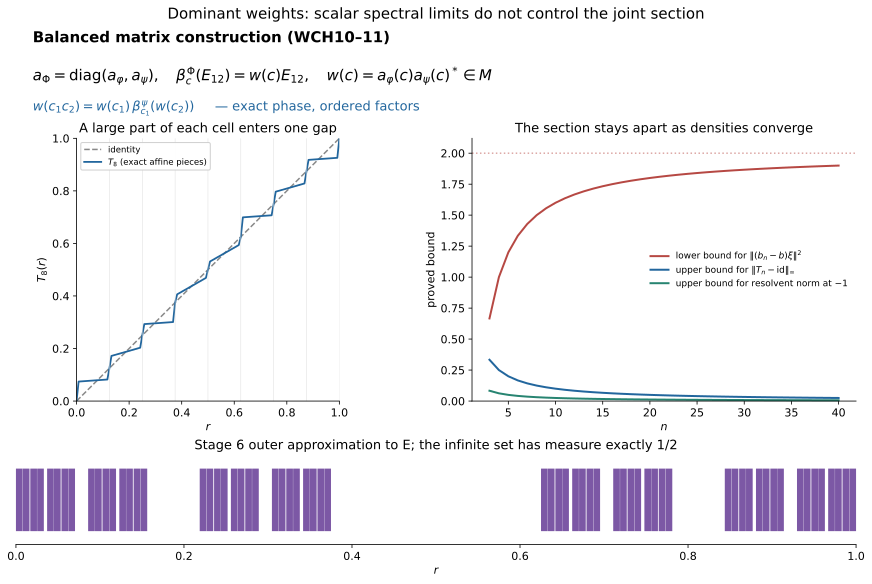

# Exact changes of weight and the limit of spectral continuity

*Original exposition, constructions and figure sources: CC0-1.0. Existing components and cited publications retain their own terms.*

The balanced matrix construction fixes a change of weight as an actual unitary, including its central phase. Homogeneity also upgrades strong resolvent convergence to convergence of every bounded Lebesgue spectral function. These two facts do not imply continuity of the canonical section as its weight varies: the section uses joint, rather than scalar, spectral calculus. We prove all three assertions, including a counterexample whose weights are dominant throughout.

## 1. The weights for which the section is defined

Use the intrinsic core \(C=C(M)\), center \(A=Z(C)\), dual flow \(\theta\), and normal coordinates \(\kappa_\varphi(f)=f(-\log h_\varphi)\) from [Spectral coordinates](OA-FLOW-WCO.md#wc-setting). In this lesson the weights are faithful, so no logarithm is taken at a zero eigenvalue. The positive generator may approach zero continuously and may be unbounded. Its logarithm and all products of commuting spectral operators mean their full spectral domains.

Call a faithful normal semifinite weight **admissible here** when the multiplication rule extends normally:
\[
 J_\varphi:A\bar\otimes L^\infty(\mathbb R)\longrightarrow C,
 \qquad J_\varphi(z\otimes f)=z\kappa_\varphi(f).
 \tag{WCH1}
\]
This is a condition on the joint spectral measure, not merely commutation. Its image is \(D^\varphi\). [The section theorem](OA-FLOW-CSEC.md#cs-joint) defines, for every strongly continuous central cocycle,
\[
 F_c(q)=c_{-q},\qquad b_\varphi(c)=J_\varphi(F_c),
 \qquad \theta_s(b_\varphi(c))=c_s^*b_\varphi(c).
 \tag{WCH2}
\]
It proves that \(b_\varphi\) is a continuous group homomorphism into \(D^\varphi\cap E\), with \(b\theta_s(b^*)=c_s\). Its hypotheses hold for every dominant weight on a separable-predual algebra and for each specified trace-scaling continuous-decomposition weight, as proved in [CS3](OA-FLOW-CSEC.md#cs-dominant). They also hold when the core center is scalar. They do not hold for every faithful weight.

Set
\[
 a_\varphi(c)=b_\varphi(c^*),\qquad
 \beta_c^\varphi=\operatorname{Ad}(a_\varphi(c))|_M.
 \tag{WCH3}
\]
Then \(\theta_s(a_\varphi(c))=c_s a_\varphi(c)\). The central factor cancels in conjugation, which proves both inclusions \(a_\varphi(c)M a_\varphi(c)^*=M\). The maps \(c\mapsto\beta_c^\varphi\) form an action because \(a_\varphi\) is a homomorphism. For a dominant weight with its continuous decomposition, [CS17–18](OA-FLOW-CSEC.md#cs-dominant) identifies this action, with the exact center transport, as \(\sigma_c^\varphi\).

## 2. The balanced algebra keeps the phase

Let \(\varphi,\psi\) be admissible weights on the same \(M\). On \(\mathcal M=M_2(M)\) define
\[
 \Phi(X)=\varphi(x_{11})+\psi(x_{22})\qquad(X\ge0).
 \tag{WCH4}
\]
This includes all infinite values. [BC1–3](OA-FLOW-BC.md#bc-1) constructs this faithful normal semifinite weight, its full finite ideal and its modular-fixed diagonal corners. In particular
\[
 \mathfrak n_\Phi
 =\{X:x_{i1}\in\mathfrak n_\varphi,\ x_{i2}\in\mathfrak n_\psi
          \text{ for }i=1,2\}.
 \tag{WCH5}
\]
There is no intersection of the two unrelated finite ideals in this formula. Faithfulness follows from
\(\Phi(X^*X)=\sum_i\varphi(x_{i1}^*x_{i1})+\sum_i\psi(x_{i2}^*x_{i2})\).
Diagonal finite positive contractions tending to one prove semifiniteness, and increasing positive nets prove normality. BC's graph projections give the actual corner domains and modular restrictions, rather than just a formal block identity.

We require the full core identification
\[
 C(\mathcal M)=M_2(C(M)),\quad
 \theta^{\mathcal M}=\operatorname{id}_{M_2}\otimes\theta,
 \quad \tau^{\mathcal M}=\operatorname{Tr}_2\otimes\tau,
 \quad Z(C(\mathcal M))=1_2\otimes A.
 \tag{WCH6}
\]
Here \(\operatorname{Tr}_2(E_{ii})=1\). To prove the normal algebra identification, choose a faithful reference \(\eta\) on \(M\) and use the reference \(\Omega=\eta\otimes\operatorname{Tr}_2\) on \(\mathcal M\). Its modular action is entrywise \(\sigma^\eta\), by BC4's identical-weight argument. Regrouping the finite Hilbert sum in the regular crossed product sends the coefficients to the matrices over the coefficients for \(M\), and sends each crossing unitary to \(1_2\otimes\lambda_t^\eta\). These generate the whole \(M_2(C_\eta(M))\): multiply the latter generators by the constant matrix units. Regrouping and its inverse are unitaries, so both directions are normal on the entire generated algebras. The actual chart transitions give (WCH6) intrinsically. The dual implementers also regroup entrywise, proving its flow assertion. Commutation with every matrix unit forces a central matrix to be diagonal with equal entries, and commutation with \(C\) makes that entry central.

The whole-cone average in this model is entrywise. One can verify this first on compact time averages and normal matrix-entry functionals, then increase the intervals. Therefore the dual weight of \(\Omega\) is the sum of \(\widetilde\eta\) on the two diagonal entries. Its generator is \(1_2\otimes h_\eta\). Applying the defining inverse-density trace construction, whose cutoffs are also diagonal with equal entries, gives the trace assertion in (WCH6) on every positive matrix. No scalar factor is lost.

The same whole-cone calculation and density uniqueness give
\[
 h_\Phi=\begin{pmatrix}h_\varphi&0\\0&h_\psi\end{pmatrix},
 \qquad
 \kappa_\Phi(f)=
 \begin{pmatrix}\kappa_\varphi(f)&0\\0&\kappa_\psi(f)\end{pmatrix}.
 \tag{WCH7}
\]
For precision the first domain is \(D(h_\varphi)\oplus D(h_\psi)\); its adjoint has the same domain, by testing the two coordinates independently. Its spectral projections and bounded cutoffs are the diagonal ones. Thus the trace weight of this operator on \(X\ge0\) is
\(\widetilde\varphi(x_{11})+\widetilde\psi(x_{22})=\widetilde\Phi(X)\).
The complete trace-density uniqueness in [TD5](OA-FLOW-TD.md#td-5) proves the first equality, including its full domain. Bounded spectral calculus proves the second for every \(f\in L^\infty\).

Identify the center in (WCH6) with \(A\). The normal joint map for \(\Phi\) is exactly
\[
 J_\Phi(F)=\operatorname{diag}(J_\varphi(F),J_\psi(F)).
 \tag{WCH8}
\]
The right side is a normal unital homomorphism and agrees with (WCH1) on every finite tensor; uniqueness of its normal extension proves the assertion. Consequently
\[
 b_\Phi(c)=\operatorname{diag}(b_\varphi(c),b_\psi(c)).
 \tag{WCH9}
\]
This proves admissibility and exact compatibility without first assuming dominance of the balanced weight. If both given weights are dominant in the usual sense, \(\Phi\) is dominant too: take diagonal scalar-equivalence unitaries for the two weights. Each diagonal centralizer corner has a pair of orthogonal isometries with sum of range projections at most its identity; their two block sums exhibit proper infiniteness of the full centralizer. These facts verify both parts of the definition. Thus the dominant interpretation of (WCH9) also applies to the actual balanced weight.

Since \(a_\Phi(c)\) normalizes \(\mathcal M\), its value on the fixed matrix unit has an entry in \(M\):
\[
 \beta_c^\Phi(E_{12})
 =\begin{pmatrix}0&w_{\varphi,\psi}(c)\\0&0\end{pmatrix},
 \qquad
 \boxed{\ w_{\varphi,\psi}(c)
       =b_\varphi(c^*)b_\psi(c^*)^*\in\mathcal U(M).\ }
 \tag{WCH10}
\]
There is also a direct fixed-point check:
\(\theta_s(a_\varphi a_\psi^*)=c_s a_\varphi a_\psi^*c_s^*
=a_\varphi a_\psi^*\).
It uses centrality and \(C^\theta=M\), not cancellation in a quotient group. Equation (WCH10) is the balanced definition of \([D\varphi:D\psi]_c\) for this section. It fixes its central phase. For dominant weights it is precisely the balanced extended modular derivative, because \(\beta^\Phi=\sigma^\Phi\) and the diagonal restrictions are the specified \(\sigma^\varphi,\sigma^\psi\).

## 3. Change of weight, cocycle law and scalar sign

All the following are exact unitary identities, with no quotient by the center:
\[
 \begin{aligned}
 \beta_c^\varphi&=\operatorname{Ad}(w_{\varphi,\psi}(c))\circ\beta_c^\psi,\\
 w_{\varphi,\psi}(c_1c_2)
 &=w_{\varphi,\psi}(c_1)\,
   \beta_{c_1}^\psi(w_{\varphi,\psi}(c_2)),\\
 w_{\varphi,\psi}(c)w_{\psi,\chi}(c)&=w_{\varphi,\chi}(c),\\
 w_{\varphi,\varphi}(c)&=1,\qquad
 w_{\psi,\varphi}(c)=w_{\varphi,\psi}(c)^*.
 \end{aligned}\tag{WCH11}
\]
For the first line substitute \(a_\varphi=w_{\varphi,\psi}a_\psi\). For the second, write \(a_{\varphi,j}=a_\varphi(c_j)\) and similarly for \(\psi\). Its right side is
\[
 a_{\varphi,1}a_{\psi,1}^*
 \bigl(a_{\psi,1}a_{\varphi,2}a_{\psi,2}^*a_{\psi,1}^*\bigr)
 =a_{\varphi,1}a_{\varphi,2}a_{\psi,2}^*a_{\psi,1}^*,
\]
which is its left side by the homomorphism laws for the two sections. No commutation between \(a_\varphi\) and \(a_\psi\) was used. The chain and adjoint assertions follow by adjacent unitary cancellation in (WCH10); they also follow from \(E_{13}=E_{12}E_{23}\) in the three-weight balanced algebra. This proves the claimed \(\sigma^\psi\)-twist for dominant weights in its stated order.

For a normal isomorphism \(\gamma:M\to N\), put \(\varphi'=\varphi\circ\gamma^{-1}\), \(\psi'=\psi\circ\gamma^{-1}\) and \(\Gamma=C(\gamma)\). The exact naturality [CS23](OA-FLOW-CSEC.md#cs-naturality) gives
\[
 w_{\varphi',\psi'}(c)=
 \gamma\bigl(w_{\varphi,\psi}(\Gamma^{-1}c)\bigr).
 \tag{WCH12}
\]
The use of \(\gamma\) on the right is legitimate because (WCH10) put the unitary in \(M\). The action on cocycles is pointwise on the center. This is also the entrywise transport of the entire balanced construction, with \(E_{12}\) fixed. For fixed weights, \(c\mapsto w_{\varphi,\psi}(c)\) is continuous in the compact-open strong cocycle topology, since both sections and bounded unitary multiplication are continuous.

As an exact sign test, take \(c_s=e^{its}1\). Then
\[
 b_\varphi(c)=h_\varphi^{it},\quad
 a_\varphi(c)=h_\varphi^{-it},\quad
 [D\varphi:D\psi]_c=h_\varphi^{-it}h_\psi^{it}
                    =[D\varphi:D\psi]_{-t}.
 \tag{WCH13}
\]
The last derivative is the ordinary balanced Connes derivative from BC4/CORE5. Thus the character \(e^{-its}\), rather than \(e^{its}\), corresponds to ordinary modular time \(t\) for \(\beta\). For \(\varphi=r\psi\), (WCH13) is \(r^{-it}1\), although the implemented modular automorphisms agree. This example explains why comparing automorphisms alone cannot prove (WCH10).

## 4. Homogeneity proves all bounded measurable scalar limits

**Theorem.** Let \(h_n,h\) be faithful homogeneous core densities, with
\(\theta_s(h_n)=e^{-s}h_n\), \(\theta_s(h)=e^{-s}h\).
Suppose \(h_n\to h\) in the strong resolvent sense in a faithful normal representation of \(C\). Then
\[
 \boxed{\quad
 \kappa_n(f)\longrightarrow\kappa(f)
 \quad\hbox{sigma-strong-star for every }f\in L^\infty(\mathbb R,dq).
 \quad}\tag{WCH14}
\]
The normal coordinates are those supplied by the supported correspondence; they are unital because the densities are faithful. No dominance, finite weight mass, separability or joint tensor map is needed for this theorem. The same proof works in one fixed support corner. It makes no assertion about arbitrary changes of support.

We give the needed uniform absolute continuity, including its dependence on the test functional. Fix \(\omega\in C_*^+\). The path \(s\mapsto\omega\circ\theta_s\) is norm-continuous. One direct proof uses the reference regular core representation, where \(\theta_s\) is implemented by the strongly continuous scalar multipliers \(e^{-isr}\). A vector functional changes in norm by at most
\((\|U_s\xi\|+\|\xi\|)\|U_s\xi-\xi\|\).
Every normal positive functional is a sum of vector functionals with summable squared norms; a finite initial sum and its uniform norm tail prove the assertion for \(\omega\). Transport through the normal core chart preserves that predual norm.

Choose a nonnegative bounded compactly supported scalar function \(g\) with \(\int g(s)ds=1\), supported sufficiently close to zero that
\[
 \omega_g=\int g(s)(\omega\circ\theta_s)ds,
 \qquad \|\omega_g-\omega\|<\varepsilon.
 \tag{WCH15}
\]
This is a Bochner integral in the predual: norm-continuity, compact support and boundedness give its existence. For every coordinate \(\kappa_j\), including the limit one, let \(\mu_j(B)=\omega(\kappa_j(1_B))\). These are finite measures, of total mass \(\omega(1)\), and they vanish on Lebesgue-null sets by normality. Equivariance and nonnegative scalar interchange give
\[
 \begin{aligned}
 \omega_g(\kappa_j(1_B))
 &=\int g(s)\int 1_B(q+s)\,d\mu_j(q)\,ds\\
 &\le\|g\|_\infty\,|B|\,\omega(1).
 \end{aligned}\tag{WCH16}
\]
Both measures in the interchange are sigma-finite; one is finite and the other is Lebesgue measure. Thus
\[
 \sup_j\mu_j(B)\le\varepsilon+\|g\|_\infty\omega(1)|B|.
 \tag{WCH17}
\]
For every prescribed bound \(\delta>0\), first choose \(\varepsilon<\delta/2\), then make \(|B|<\delta/(2\|g\|_\infty\omega(1))\). The zero functional needs no estimate. This proves uniform absolute continuity of the entire family of scalar spectral measures. It is the extra conclusion furnished by homogeneity; strong resolvent convergence alone does not imply it.

If \(v\in C_c(\mathbb R)\), the scalar function \(x\mapsto v(-\log x)\) on \((0,\infty)\), extended by zero at zero, belongs to \(C_0([0,\infty))\). Strong resolvent convergence therefore gives \(\kappa_n(v)\to\kappa(v)\) strongly-star. The functional-calculus step has an explicit approximation proof. Extend \(f(x)=v(-\log x)\) by zero on \(( -\infty,0]\); compact support of \(v\) makes \(f\in C_0(\mathbb R)\). The Cayley unitaries \(U_n=1-2i(h_n+i)^{-1}\) converge strongly to \(U=1-2i(h+i)^{-1}\). Their adjoints converge strongly too, since \((U_n^*-U^*)\xi=U_n^*(U-U_n)U^*\xi\). The Cayley coordinate \(x\mapsto(x-i)/(x+i)\) transports \(f\) to a continuous circle function \(\widehat f\) with \(\widehat f(1)=0\). The [proved Fejér approximation and unitary calculus](OA-FLOW-SF.md#oa-flow.sf.sb1) approximate \(\widehat f\) uniformly by Laurent polynomials. Each polynomial in \(U_n,U_n^*\) converges strongly-star, and the uniform approximation bound is independent of \(n\). Consequently \(f(h_n)=\widehat f(U_n)\to\widehat f(U)=f(h)\) strongly-star, which is exactly the assertion just used. Bounded strong convergence in a faithful normal representation also gives convergence for every normal positive seminorm: express that functional as a summable vector series and control its tail by the common operator bound.

The measures \(\mu_n\) are eventually tight. Given \(\varepsilon>0\), choose \(0\le v\le1\) in \(C_c\) with \(\mu(v)>\omega(1)-\varepsilon\). Such a function exists by increasing compact cutoffs and the unitality of \(\kappa\). The preceding convergence gives \(\mu_n(v)>\omega(1)-2\varepsilon\) for all sufficiently large \(n\). If \(\operatorname{supp}v\subset[-R,R]\), then
\[
 \mu_n(\mathbb R\setminus[-R,R])<2\varepsilon
 \tag{WCH18}
\]
for those \(n\), and the same bound holds for \(\mu\). If desired, enlarge \(R\) to handle the finitely many earlier measures as well. Faithfulness of the limit is used here through total mass; a kernel at the limit would allow coordinate mass to escape to infinity.

Now fix \(f\in L^\infty\), represented with \(|f|\le K\). On \([-R,R]\) approximate its values by a finite grid to obtain a simple function within \(\eta\) uniformly. In each of its finitely many measurable level sets choose a compact subset; Lebesgue inner regularity makes the total discarded measure as small as desired. These compact sets are disjoint. Choose disjoint bounded open neighborhoods and continuous bump functions equal to one on the compact sets. The finite sum of the simple values times these bumps is a \(v\in C_c(\mathbb R)\) with \(|v|\le K\), agreeing with the simple function on their union. Consequently \(|f-v|\le\eta\) off a measurable exceptional set \(B\subset[-R,R]\), and \(|B|\) is arbitrarily small.

Equations (WCH17)–(WCH18) give, uniformly for sufficiently large \(n\) and for the limit,
\[
 \begin{aligned}
 \|\kappa_n(f-v)\|_\omega^2
 &=\int|f-v|^2d\mu_n\\
 &\le\eta^2\omega(1)+4K^2\mu_n(B)
          +4K^2\mu_n(\mathbb R\setminus[-R,R]).
 \end{aligned}\tag{WCH19}
\]
Here \(\|x\|_\omega=\omega(x^*x)^{1/2}\). First choose the tail bound, then the exceptional measure, then \(\eta\). The right side can be made arbitrarily small. The triangle inequality and the already proved convergence for \(v\) prove convergence for \(f\). Apply the same argument to \(\overline f\) for the adjoint seminorms. This proves (WCH14) with all cutoffs and all normal functionals accounted for.

## 5. A valid additional hypothesis for section continuity

Suppose all the weights in the preceding theorem are admissible, and put \(\mathcal B=A\bar\otimes L^\infty\). A sufficient additional hypothesis is the following uniform condition on their **joint** maps. For every \(\omega\in C_*^+\), there is a finite positive normal functional \(\eta\) on \(\mathcal B\) such that
\[
 \forall\varepsilon>0\ \exists\delta>0:\quad
 \eta(P)<\delta\ \Longrightarrow\
 \sup_{j\in\mathbb N\cup\{\infty\}}\omega(J_j(P))<\varepsilon
 \quad\hbox{for every projection }P\in\mathcal B.
 \tag{WCH20}
\]
No faithful normal state on a non-countably-decomposable algebra is being presumed. This condition includes the limit map and states exactly the needed uniform absolute continuity.

Use CS9's bounded step approximations \(F_m\) to \(F_c\). They are finite sums \(\sum_k z_k\otimes1_{I_k}\), with the identity on the outside tail, and converge sigma-strong-star to \(F_c\). Their norms and \(\|F_c\|\) are one. Thus \(\eta(|F_c-F_m|^2)\to0\). For a fixed threshold \(a>0\), let \(P_m=1_{(a,\infty)}(|F_c-F_m|^2)\). Markov's inequality gives \(\eta(P_m)\to0\), while
\[
 |F_c-F_m|^2\le a1+4P_m.
\]
Condition (WCH20) therefore makes
\(\sup_j\|J_j(F_c-F_m)\|_\omega\to0\), by first making \(a\) small and then taking \(m\) large. For each fixed \(m\), (WCH14) on its finitely many interval indicators gives \(J_n(F_m)\to J(F_m)\) sigma-strong-star. The triangle inequality proves
\[
 b_{\varphi_n}(c)=J_n(F_c)\longrightarrow J(F_c)=b_\varphi(c)
 \quad\hbox{sigma-strong-star}.
 \tag{WCH21}
\]
The adjoint follows identically. This is a correct sufficient version of the proposed last implication. Scalar absolute continuity (WCH17) controls only projections \(1\otimes1_B\), and is not (WCH20).

Another concrete sufficient situation is \(\varphi_n=\varphi\circ\operatorname{Ad}(v_n^*)\) with \(v_n\in\mathcal U(M)\), \(v_n\to1\) strongly. The canonical lift of \(\operatorname{Ad}(v_n)\) is \(\operatorname{Ad}(v_n)\) on the whole core and fixes its center. Exact naturality gives \(b_{\varphi_n}(c)=v_n b_\varphi(c)v_n^*\), hence (WCH21) directly. The next construction has unitary transports but deliberately has no such convergence of their implementers.

## 6. A dominant counterexample to the unsupported implication

We construct one fixed continuous cocycle \(c\) and dominant weights \(\varphi_n,\varphi\) for which \(h_n\to h\) even in norm resolvent sense, while \(b_{\varphi_n}(c)\) fails to converge strongly to \(b_\varphi(c)\). The scalar conclusion (WCH14) continues to hold.

**The closed set and the near-identity maps.** Start with \([0,1]\). At stage \(m\ge1\), remove from the center of each of the \(2^{m-1}\) surviving intervals an open interval of length \(4^{-m}\). Let \(E\) be the intersection of the remaining closed sets. The removed intervals are disjoint and have total length
\(\sum_{m\ge1}2^{m-1}4^{-m}=1/2\), so \(|E|=1/2\). The surviving intervals have lengths tending to zero, so \(E\) has empty interior; it is a closed nowhere dense set. This defines a particular fat Cantor set, rather than relying on an unspecified measurable set.

For each integer \(n\ge2\), divide \([0,1]\) into \(n\) cells \([j/n,(j+1)/n]\). Since \(E\) is nowhere dense, choose a closed interval \([\alpha_{n,j},\beta_{n,j}]\) of positive length contained in the interior of that cell and in \(E^c\). Put \(d_n=1/(2n^2)\). On that cell define \(T_n\) by linear interpolation through the four points
\[
 \begin{array}{c|cccc}
 r&j/n&j/n+d_n&(j+1)/n-d_n&(j+1)/n\\
 T_n(r)&j/n&\alpha_{n,j}&\beta_{n,j}&(j+1)/n.
 \end{array}\tag{WCH22}
\]
All three slopes are positive. Set \(T_n(r)=r\) outside \([0,1]\). The endpoint values agree between adjacent cells, so \(T_n\) is an increasing piecewise affine homeomorphism of \(\mathbb R\), with piecewise affine inverse and only finitely many pieces. In particular it preserves the Lebesgue null class in both directions. Each cell maps onto itself, whence
\[
 \|T_n-\operatorname{id}\|_\infty\le1/n.
 \tag{WCH23}
\]
The central subinterval of each cell, of length \(1/n-1/n^2\), maps into \(E^c\). All preimages of \(E\) in \([0,1]\) are therefore in the \(2n\) end intervals, of total length \(1/n\). Endpoint sets have measure zero. Thus
\[
 |[0,1]\cap T_n^{-1}(E)|\le1/n,
 \qquad |E\mathbin\triangle T_n^{-1}(E)|\ge1/2-1/n.
 \tag{WCH24}
\]
Outside \([0,1]\) the preimage of \(E\) is empty, apart from immaterial endpoints.

**The actual dominant weights.** Let
\[
 H_0=L^2(\mathbb R,dr)\otimes\ell^2,\quad M=B(H_0),\quad
 Q\xi(r)=r\xi(r),\quad k=e^{-Q}\otimes1,
 \quad k_n=e^{-T_n(Q)}\otimes1.
 \tag{WCH25}
\]
The domains, for example \(D(k)=\{\xi:\int e^{-2r}\|\xi(r)\|^2dr<\infty\}\), are dense by compact truncation. Real positive multiplication proves self-adjointness and trivial kernel. Define the whole-cone weights
\(\varphi=\operatorname{Tr}_{k}\), \(\varphi_n=\operatorname{Tr}_{k_n}\)
by the increasing bounded trace-density cutoffs. The trace-density construction makes them faithful normal semifinite.

Both weights have a properly infinite centralizer: \(1\otimes B(\ell^2)\) is fixed by each modular group \(\operatorname{Ad}(k^{it})\) or \(\operatorname{Ad}(k_n^{it})\), and its two shift isometries have common initial projection one and orthogonal ranges. For \((L_a\xi)(r)=\xi(r-a)\), direct substitution gives
\(L_a^*kL_a=e^{-a}k\), hence
\(\varphi\circ\operatorname{Ad}(L_a)=e^{-a}\varphi\)
on every positive operator. Equality on the whole cone follows by unitary covariance of all trace cutoffs, or directly by the trace-density theorem. This gives every positive scalar multiple.

Define the change-of-variables unitary
\[
 (V_n\xi)(r)=\sqrt{T_n'(r)}\,\xi(T_n(r)),
 \qquad
 (V_n^*\xi)(u)=\sqrt{(T_n^{-1})'(u)}\,\xi(T_n^{-1}(u)).
 \tag{WCH26}
\]
At the finitely many breakpoints choose any positive derivative value; the Hilbert operators are unaffected. Substitution on each affine piece proves both norm identities and both inverse identities. Thus \(V_n kV_n^*=k_n\), with the full multiplication domain transported, and
\(\varphi_n=\varphi\circ\operatorname{Ad}(V_n^*)\).
Their scalar equivalences transport those of \(\varphi\). All these weights are therefore dominant, and \(M\) has separable predual. The section theorem applies to every one of them.

**Core coordinates and their joint maps.** Use the actual tracial Fourier core model [CORE9](OA-FLOW-CORE.md#core-9):
\[
 C=M\bar\otimes L^\infty(\mathbb R,dp),\quad
 A=L^\infty(\mathbb R,dp),\quad
 \theta_s f(p)=f(p-s),\quad
 \tau=\operatorname{Tr}\otimes e^{-p}\frac{dp}{2\pi}.
 \tag{WCH27}
\]
The normalized centralizer-density derivative or, equivalently, the whole-cone trace formula proves
\[
 h(p,r)=e^{p-r},\quad h_n(p,r)=e^{p-T_n(r)},\qquad
 \kappa(f)(p,r)=f(r-p),\quad
 \kappa_n(f)(p,r)=f(T_n(r)-p).
 \tag{WCH28}
\]
These multiplication operators act trivially on the final \(\ell^2\) factor. Their domains are given by the corresponding squared multipliers integrated in \(p,r\); compact rectangle truncation proves density. The imaginary powers identify the generators, and the trace normalization in (WCH27) identifies their weights with the given \(\varphi_n\), rather than a scalar multiple. They are homogeneous with the prescribed \(e^{-s}\) sign.

There is also a direct check of each normal joint map:
\[
 J_n(F)(p,r)=F(p,T_n(r)-p),\qquad
 J(F)(p,r)=F(p,r-p).
 \tag{WCH29}
\]
The transformations \((p,r)\mapsto(p,T_n(r)-p)\) and their inverses preserve the product null class: on each of the finitely many \(r\)-pieces they are invertible affine transformations of nonzero Jacobian; the base case is a determinant-one shear. Composition therefore gives faithful normal isomorphisms of the full scalar multiplication algebras, with their indicated inverses. Increasing bounded functions give normality, and normal positive functional integration gives the same statement for arbitrary increasing bounded nets. This independently verifies admissibility in the example.

For \(\delta_n(r)=T_n(r)-r\), (WCH23) gives \(|\delta_n|\le1/n\), and \(h_n=e^{-\delta_n}h\). For \(x\ge0\), differentiation in \(u\) gives
\[
 \left|\frac{\partial}{\partial u}(1+e^{-u}x)^{-1}\right|
 =\frac{e^{-u}x}{(1+e^{-u}x)^2}\le\frac14.
\]
Consequently
\[
 \|(1+h_n)^{-1}-(1+h)^{-1}\|\le\frac1{4n}.
 \tag{WCH30}
\]
This is norm resolvent convergence for these nonnegative operators (and in particular strong resolvent convergence). At the nonreal point \(i\), the derivative of \((e^{-u}x-i)^{-1}\) has absolute value \(e^{-u}x/(1+e^{-2u}x^2)\le1/2\), so the corresponding norm difference is at most \(1/(2n)\). Thus the assertion also holds directly with the nonreal-resolvent definition. The all-\(L^\infty\) conclusion (WCH14) therefore holds.

**One cocycle defeats section convergence.** Let \(a=1-2\,1_E\), a real-valued unitary, and set
\[
 c_t(p)=a(p)a(p-t).
 \tag{WCH31}
\]
It is a central cocycle: \(c_s(p)c_t(p-s)=a(p)a(p-s-t)=c_{s+t}(p)\). Translation is strongly continuous on bounded multipliers, so \(t\mapsto c_t\) is strongly continuous, even though \(a\) is discontinuous. For completeness, test against any \(L^1\) weight, cut to a compact interval, approximate \(a\) there in measure by interval step functions, and use translation-continuity in local \(L^1\); the common bound and the tail complete the argument. This also follows by strong continuity of the translation unitaries implementing (WCH27).

The field \(F_c(p,q)=c_{-q}(p)=a(p)a(p+q)\) and (WCH29) give the **actual canonical sections**
\[
 b_{\varphi_n}(c)(p,r)=a(p)a(T_n(r)),\qquad
 b_\varphi(c)(p,r)=a(p)a(r).
 \tag{WCH32}
\]
Choose a unit \(\zeta\in L^2(\mathbb R,dp)\), one standard unit vector \(e_1\in\ell^2\), and the unit vector
\(\xi(p,r)=\zeta(p)1_{[0,1]}(r)e_1\)
in the faithful normal multiplication representation of the core. Equations (WCH24) and (WCH32) give
\[
 \begin{aligned}
 \|(b_{\varphi_n}(c)-b_\varphi(c))\xi\|^2
 &=4|E\mathbin\triangle T_n^{-1}(E)|\\
 &\ge4(1/2-1/n).
 \end{aligned}\tag{WCH33}
\]
The lower bound tends to \(2\), so there is no strong convergence. Since the test is a normal vector functional, there is no sigma-strong convergence either. The discrepancy concerns the joint field \(F_c(p,q)\); it contradicts neither (WCH14) nor continuity of each fixed map \(c\mapsto b_\varphi(c)\).

The conclusion is exact: dominance of every weight and strong resolvent convergence of their homogeneous densities do **not** imply section convergence. Equation (WCH20) states a sufficient additional joint condition; (WCH33) proves that it cannot follow automatically from those hypotheses.

*Figure 3.* The upper panel records the exact matrix-entry construction (WCH10), with its \(\psi\)-action in (WCH11). The lower panels show the particular piecewise affine maps from (WCH22) and the proved bounds (WCH23), (WCH30), (WCH33). The finite Cantor-stage display is explicitly an approximation to \(E\); the analytic proof uses the infinite closed set of measure \(1/2\). [Reproducible source](../assets/canonical-cocycle-sections/render.py), [numerical diagnostics](../assets/canonical-cocycle-sections/diagnostics.json), [terms](../assets/canonical-cocycle-sections/TERMS.md).

## Further reading and exact disposition of the source claim

Masamichi Takesaki, *Theory of Operator Algebras II*, Chapter XII, Exercise 6.10(v)–(vi) and steps (k)–(l), printed pp.458–460, supplies the balanced identity and the proposed continuity implication. The balanced identity is proved above for the actual section wherever (WCH1) holds, in particular for the stated dominant scope. The all-bounded-measurable scalar limit in step (l) is established by (WCH14)–(WCH19). Its proposed conclusion for \(b\) is false under the stated strong resolvent hypothesis, even for the separable type I factor and dominant weights (WCH25). The preceding lesson separately disproves the existence of a continuous homomorphic section for every faithful weight. These are distinct obstructions, with distinct complete counterexamples.

The finite-mass constant remains \(\varphi(1)/(2\pi\lambda)\), as proved in (WC13). The inspected OA-MOD homogeneous-operator lesson uses a trace rescaled by \(2\pi\), yielding \(\varphi(1)/\lambda\); its conditional density contracts are not used here as proved inputs. The measurable-operator algebra, interpolation, and graded Banach-space construction are outside this lesson's scope.
