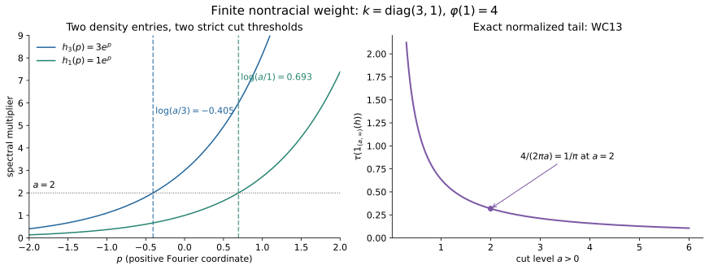

# Spectral coordinates, localizers and finite mass

*Original exposition, examples and figure sources: CC0-1.0. Source publications and existing components retain their own terms.*

A core density need not be trace-measurable. The distinction is exactly the total mass of its weight. We prove this using one spectral cut, after fixing the averaging constant and giving a scaling-measure argument that does not assume semifiniteness.

## 1. The coordinate and its support

Let \(M\) be any von Neumann algebra, \(C=C(M)\) its intrinsic core, and identify \(M=C^\theta\). The Haar pair is \(dt,ds/(2\pi)\):
\[
 T(Y)=\frac1{2\pi}\int_{\mathbb R}\theta_s(Y)\,ds,
 \qquad \tau\theta_s=e^{-s}\tau. \tag{WC1}
\]
The integral takes values in the extended positive cone. Normality throughout means preservation of arbitrary increasing bounded positive nets. We use the complete proofs [SCW1–3](OA-FLOW-SCW.md#scw-1), [SCW5–7](OA-FLOW-SCW.md#scw-5), [TD2](OA-FLOW-TD.md#oa-flow.td.2), and [DA's whole-cone average](OA-FLOW-DA.md#da-equality). They apply without a factor or separability assumption.

For a normal semifinite weight \(\varphi\), put \(e=s(\varphi)\). Its supported density satisfies
\[
 \widetilde\varphi=\widehat\varphi\circ T=\tau_{h_\varphi},\qquad
 s(h_\varphi)=e,\qquad \theta_s(h_\varphi)=e^{-s}h_\varphi. \tag{WC2}
\]
On \(eH\), it is positive, self-adjoint and nonsingular; on \((1-e)H\), it is zero. Its supported powers satisfy \(h_\varphi^{i0}=e\). No logarithm of zero is taken.

Here is the exact scalar coordinate from SCW5:
\[
 \begin{gathered}
 A_0=L^\infty(\mathbb R,dq),\qquad
 \rho_s f(q)=f(q+s),\qquad V_t(q)=e^{-itq},\\
 \kappa_\varphi:A_0\longrightarrow eCe,\qquad
 \kappa_\varphi(V_t)=h_\varphi^{it},\qquad
 \theta_s\kappa_\varphi=\kappa_\varphi\rho_s.
 \end{gathered}\tag{WC3}
\]
For \(e\ne0\) this is a faithful normal isomorphism onto its image, with normal inverse on that image. In affiliated notation \(h_\varphi=\kappa_\varphi(e^{-q})\), with the domain specified by its spectral measure. In particular,
\[
 D(h_\varphi)=
 \left\{\xi\in eH:\int e^{-2q}\,d\langle\kappa_\varphi(1_{dq})\xi,\xi\rangle<\infty\right\}
 \oplus(1-e)H. \tag{WC4}
\]
The finite coordinate cuts increase to \(e\), so this domain is dense. Their squared-norm identities prove closedness and the full adjoint-domain equality.

The character formula is \(\rho_s(V_t)=e^{-ist}V_t\): translation changes its scalar multiplier, not the character index. This corrects the swapped index in the printed exercise.

To recall the substantive points in this correspondence, complete \(\varphi\) faithfully on the complementary corner. The completion's modular group fixes \(e\), and its core generator restricts to \(h_\varphi\). The balanced off-diagonal modular formula proves independence of the completion. The support corner is the entire normal core of \(eMe\), not just an algebra generated by some of its elements. Fourier transformation of its regular translations gives the Lebesgue measure class and the normal inverse in (WC3). Conversely an equivariant normal homomorphism has fixed support \(e=\kappa(1)\in M\). Its kernel is a translation-invariant projection ideal in \(L^\infty\), hence is zero or the whole algebra. Its spectral coordinate yields a homogeneous affiliated \(h\); the semifinite invariant-weight recognition and full trace-density uniqueness in SCW5 recover a unique \(\varphi\). These are the actual proof steps of the cited theorem. For \(\varphi=0\), the density and homomorphism are both zero. The statement is a bijection including this zero map, not an injective copy of \(A_0\) in the zero corner.

## 2. A bounded localizer and the meaning of both sandwiches

A bounded \(a\in C_+\) with \(T(a)=1\) always exists. Choose a faithful normal semifinite reference \(\eta\), and \(g\in L^1(\mathbb R)_+\cap L^\infty(\mathbb R)\) with \(\int g=1\). For example \(g(q)=\tfrac12e^{-|q|}\). Then
\[
 a=2\pi\kappa_\eta(g),\qquad T(a)=1. \tag{WC5}
\]
Indeed evaluate the compact interval averages against every normal positive functional, use translation in the scalar spectral measure, and increase the intervals. The scalar integral of every translate of \(g\) is one; normality of \(\kappa_\eta\) proves (WC5) on the extended cone.

For any such \(a\) and every bounded \(x\in M_+\), bimodularity and (WC2) give
\[
 \boxed{\quad
 \varphi(x)=\tau_{h_\varphi}(x^{1/2}ax^{1/2}).\quad} \tag{WC6}
\]
This includes infinite values and a nonfaithful \(\varphi\). It proves independence of \(a\) without cancellation of infinite quantities.

Write \(h=h_\varphi\), \(B=x^{1/2}a^{1/2}\), and
\[
 h_\varepsilon=h(1+\varepsilon h)^{-1},\qquad
 s_\varepsilon=h^{1/2}(1+\varepsilon h)^{-1/2}.
 \tag{WC7}
\]
These are bounded, \(s_\varepsilon^2=h_\varepsilon\), and \(\|s_\varepsilon\|\le\varepsilon^{-1/2}\). The extended-positive sandwich \(B^*hB\) means the complete form
\[
 q(\xi)=\|h^{1/2}B\xi\|^2,
 \qquad D(q)=\{\xi:B\xi\in D(h^{1/2})\}, \tag{WC8}
\]
with value infinity outside its form domain. The form domain need not be dense. It is a closed form in the extended sense: convergence of \(\xi_n\) and of \(h^{1/2}B\xi_n\) invokes closedness of \(h^{1/2}\). The bounded forms \(B^*h_\varepsilon B\) increase to it, including its possible infinite part, as in [EP4–5](OA-FLOW-EP.md#oa-flow.ep.4).

Bounded tracial cyclicity followed by the monotone extended trace gives
\[
 \begin{aligned}
 \varphi(x)
 &=\lim_{\varepsilon\downarrow0}
   \tau(s_\varepsilon x^{1/2}ax^{1/2}s_\varepsilon)\\
 &=\lim_{\varepsilon\downarrow0}\tau(B^*h_\varepsilon B)
 =\widehat\tau(B^*hB).
 \end{aligned}\tag{WC9}
\]
Each scalar trace value increases. The first displayed operators themselves need not increase in operator order. The symbolic trace
\(\tau(h^{1/2}x^{1/2}ax^{1/2}h^{1/2})\)
means this cutoff value; it makes no unsupported assertion that an unbounded operator product has a densely defined closed realization. The second symbolic trace
\(\tau(a^{1/2}x^{1/2}hx^{1/2}a^{1/2})\)
has exactly the extended-positive meaning (WC8).

The unbounded regulator \(r_\varepsilon=h^{1/2}(1+\varepsilon h^{1/2})^{-1/2}\) can also be used **inside this trace convention**. Its square is the positive affiliated multiplier \(h/(1+\varepsilon h^{1/2})\). Define the sandwich trace by the bounded cutoffs of that square and cyclicity. Its square increases to \(h\), so normality of \(m\mapsto\widehat\tau(B^*mB)\) gives the same limit. This does not make \(r_\varepsilon\) bounded: its multiplier is asymptotic to \(\varepsilon^{-1/2}\lambda^{1/4}\).

If one instead normalizes \(I_\theta(a)=\int\theta_s(a)ds=1\), then \(T(a)=1/(2\pi)\), and the right sides of (WC6) and (WC9) must be multiplied by \(2\pi\). The original weight is evaluated on \(x\in M_+\); for a general core element use the dual weight in (WC2).

## 3. A scaling weight cannot hide an infinite part

**Scaling lemma.** Suppose \(\mu\) is a normal weight on \(A_0\), not assumed semifinite, such that \(\mu\rho_s=e^{-s}\mu\). If \(0<\mu(f_0)<\infty\) for some \(f_0\ge0\), then, for a unique \(k>0\),
\[
 \mu(f)=k\int_{\mathbb R}e^q f(q)\,dq\qquad(f\in A_{0,+}). \tag{WC10}
\]

We give a measure proof that avoids assuming a Radon–Nikodym theorem for a possibly nonsemifinite weight. Normality makes \(B\mapsto\mu(1_B)\) a countably additive measure on Lebesgue classes. Simple approximation gives its integral formula for bounded nonnegative functions, even when the value is infinite. Define
\[
 \nu(B)=\mu(e^{-q}1_B)
 :=\sup_m\mu(\min(e^{-q},m)1_B).
 \tag{WC11}
\]
This is again a countably additive measure, null on Lebesgue-null sets. Substitution, using \(\mu\rho_s=e^{-s}\mu\), proves that \(\nu\) is translation invariant. It suffices first to make this computation with bounded coordinate cuts; increasing them gives the whole identity.

There is a bounded measurable \(E\) with positive Lebesgue measure and \(0<\nu(E)<\infty\). Indeed the sets \(E_n=[-n,n]\cap\{f_0\ge1/n\}\) have \(\mu(E_n)\le n\mu(f_0)\). Some has positive \(\mu\)-measure, since \(f_01_{E_n}\uparrow f_0\); on that bounded set \(e^{-q}\) is bounded above and below by positive constants.

The union \(B=\bigcup_{r\in\mathbb Q}(E+r)\) has full Lebesgue measure. For completeness, its indicator is invariant under rational translations. Translation is continuous in local \(L^1\), proved first for interval step functions and then by their \(L^1\) density, so the indicator is invariant under every real translation in local \(L^1\). Convolution with a compact approximate identity is therefore a continuous translation-invariant, hence constant, function. Its local \(L^1\) limit \(1_B\) is constant almost everywhere. Since \(B\) contains the positive-measure set \(E\), this constant is one. Thus the translates of \(E\) cover a conull set and have finite \(\nu\)-measure. This proves sigma-finiteness of \(\nu\) and rules out an unaccounted infinite-density region.

For any measurable \(F\), nonnegative interchange for the sigma-finite measures \(\nu,dq\) gives
\[
 |E|\nu(F)
 =\int_{\mathbb R}\nu(F\cap(E+t))\,dt
 =\int_E |F|\,d\nu
 =|F|\nu(E). \tag{WC12}
\]
The middle identity uses translation invariance to replace the intersection by \((F-t)\cap E\). It is valid for infinite \(F\) by increasing finite-measure cuts. Therefore \(\nu=k\,dq\), with \(k=\nu(E)/|E|>0\). Undoing (WC11), first on bounded intervals and then by monotone convergence, proves (WC10). This formula proves faithfulness and semifiniteness, rather than assuming them.

The boundary cases are also determined. The supremum of all zero-weight projections is a zero-weight projection: finite joins are zero and normality applies to their increasing net. Translation invariance makes this supremum zero or one, by the same invariant-indicator argument. Hence a nonzero scaling weight is faithful. If it has no finite positive nonzero value, it equals infinity on every nonzero positive element. Otherwise (WC10) applies. All scaling weights are therefore described by the extended coefficient \(k\in[0,\infty]\), with \(0\cdot\infty=0\); a finite nonzero test forces \(0<k<\infty\).

## 4. The exact tail, including infinite mass

For \(a>0\), put \(P_a=1_{(a,\infty)}(h_\varphi)\) and define
\(g_a(0)=0\), \(g_a(t)=t^{-1}1_{(a,\infty)}(t)\) for \(t>0\). It is bounded. For every \(r>0\),
\[
 \int_{\mathbb R}g_a(e^{-s}r)\,ds
 =\int_a^\infty t^{-2}\,dt=\frac1a.
\]
Spectral measures and increasing compact averages consequently give
\[
 T(g_a(h_\varphi))=\frac{e}{2\pi a},\qquad
 \boxed{\quad\tau(P_a)=\frac{\varphi(1)}{2\pi a}.\quad} \tag{WC13}
\]
For the second equality, apply (WC2) to \(g_a(h_\varphi)\): the commuting spectral product \(h_\varphi g_a(h_\varphi)=P_a\), and the bounded trace cutoffs increase to its trace. No subtraction of infinite traces occurs. This extends the finite-functional proof [CINV, mass and reconstruction](OA-FLOW-CINV.md#cinv-mass) to every normal semifinite weight at the same normalization.

A positive affiliated \(h\) is **\(\tau\)-measurable** if for every \(\varepsilon>0\) there is a projection \(p\in C\) with \(pH\subset D(h)\) and \(\tau(1-p)<\varepsilon\). For positive self-adjoint \(h\), this is equivalent to
\[
 \tau(1_{(a,\infty)}(h))\longrightarrow0\quad(a\to\infty),
 \quad\text{and equivalent to one such tail being finite.} \tag{WC14}
\]
Here is the elementary proof needed in this lesson. If \(pH\subset D(h)\), the [closed graph theorem](OA-FLOW-MGO.md#mgo-closed-graph) makes \(hp\) bounded, say by \(K\). For \(a>K\), \(pH\cap1_{(a,\infty)}(h)H=0\), since the squared spectral norm of a nonzero vector in that intersection is strictly larger than \(a^2\|\xi\|^2\). The polar decomposition of \((1-p)1_{(a,\infty)}(h)\) compares its initial projection \(1_{(a,\infty)}(h)\) with a subprojection of \(1-p\). Thus its trace is below \(\tau(1-p)\). This proves the first implication. If one tail is finite, the decreasing tails converge strongly to zero; normality inside that finite-trace corner makes their traces tend to zero. Conversely \(p=1_{[0,a]}(h)\) has \(pH\subset D(h)\), \(\|hp\|\le a\), and the required small complement. This proves all of (WC14), including a kernel. It does not invoke the algebra of products of measurable operators.

Let \(\mathfrak m_\tau\) be the finite linear trace ideal. Then
\[
 \boxed{\quad
 \varphi(1)<\infty
 \ \Longleftrightarrow\ h_\varphi\text{ is }\tau\text{-measurable}
 \ \Longleftrightarrow\
 \bigl[\varphi=0\ \text{or}\ \kappa_\varphi(A_0)\cap\mathfrak m_\tau\ne\{0\}\bigr].
 \quad} \tag{WC15}
\]
The first equivalence follows from (WC13)–(WC14). If \(0<\varphi(1)<\infty\), \(P_1\) is a nonzero positive finite-trace element of the indicated intersection. Conversely take \(0\ne y\) in that intersection. Since \(\mathfrak m_\tau\) is the linear span of positive finite-trace elements, \(y\) has finite square trace: for each positive summand \(b\), \(\tau(b^2)\le\|b\|\tau(b)\), and \((\sum_jy_j)^*(\sum_jy_j)\le n\sum_jy_j^*y_j\). Thus \(y^*y\) is nonzero, is in the same abelian coordinate algebra, and has finite trace. Pull it back through \(\kappa_\varphi\). The normal scaling weight \(\tau\kappa_\varphi\) has a finite nonzero test, so (WC10) applies. Its tail at \(a=1\) is finite, and (WC13) implies \(\varphi(1)<\infty\). At zero, both finiteness and measurability hold but the intersection is zero, exactly as written.

## 5. Keep the complementary corner

Write \(M_\varphi=(eMe)_{\varphi_e}\), and form the join inside its support:
\[
 D_e^\varphi=(eZ(C))\vee_{eCe}\kappa_\varphi(A_0).
\]
The exact statements are
\[
 \kappa_\varphi(A_0)'\cap M
 =M_\varphi\oplus(1-e)M(1-e),\qquad
 D_e^\varphi\cap eMe\subseteq Z(M_\varphi). \tag{WC16}
\]
Indeed a commuting element commutes with \(e=\kappa_\varphi(1)\), so its off-diagonal corners vanish. In \(eMe\), commutation with \(h_\varphi^{it}\) is precisely modular fixedness. The complementary block commutes because both products with the supported algebra vanish. The join \(D_e^\varphi\) is abelian. Every \(M_\varphi\) element commutes with both of its generating algebras, which proves the second assertion. There is no reverse inclusion asserted. This is the complete argument of [SCW7](OA-FLOW-SCW.md#scw-7), retained here to specify the support required later.

For the useful finite test take \(M=M_2\), \(\varphi(x)=x_{11}\). In the coordinate of (WC3),
\[
 \begin{gathered}
 C=M_2\bar\otimes L^\infty(\mathbb R,dq),\quad
 \tau(Y)=\int e^q\operatorname{Tr}(Y(q))\frac{dq}{2\pi},\\
 h_\varphi=e_{11}\otimes e^{-q},\quad
 \kappa_\varphi(f)=e_{11}\otimes f,\quad
 D_e^\varphi=e_{11}\otimes L^\infty.
 \end{gathered}\tag{WC17}
\]
The full unital join is instead \(e_{11}\otimes L^\infty\oplus e_{22}\otimes L^\infty\). Its intersection with \(M\) contains \(e_{22}\), which does not belong to \(Z(M_\varphi)=\mathbb Ce_{11}\). The domain of \(h_\varphi\) is the weighted \(L^2\) domain in the first block and the entire second block; this extra block is not an undefined logarithm.

## 6. Three solved diagnostics

**A nontracial finite mass.** In the tracial Fourier model with coordinate \(p=-q\), take \(M=M_2\), \(k=\operatorname{diag}(3,1)\), \(\varphi=\operatorname{Tr}_k\). Then \(h_\varphi(p)=e^pk\), and
\[
 \tau(1_{(a,\infty)}(h_\varphi))
 =\frac1{2\pi}\left(\int_{\log(a/3)}^\infty e^{-p}dp+
 \int_{\log a}^\infty e^{-p}dp\right)=\frac{4}{2\pi a}.
\]
This checks the strict cut, both thresholds and the normalization.

**An affiliated density that is not measurable.** For the usual trace on \(B(\ell^2)\), the core density is \(1\otimes e^p\). Every nonzero high spectral tail has infinite canonical trace, because its coefficient projection is \(1\). Formula (WC14) makes it nonmeasurable, although it is positive self-adjoint on its full dense multiplication domain. Its weight has infinite total mass.

**Why the cutoff is bounded.** The multiplier in (WC7) is \(\sqrt{r/(1+\varepsilon r)}\), bounded by \(\varepsilon^{-1/2}\). Replacing \(\varepsilon r\) by \(\varepsilon\sqrt r\) gives growth \(\varepsilon^{-1/2}r^{1/4}\); it is usable only with the extended trace interpretation following (WC9). This diagnostic separates a correct monotone trace limit from an incorrect bounded-operator assertion.

*Figure 1.* The matrix model in Diagnostic A has thresholds \(\log(a/3)\) and \(\log a\). The right panel draws the exact proved function \(4/(2\pi a)\), not a numerical theorem test. Equations (WC9), (WC13) and (WC15) supply the domain and mass claims. [Reproduction source](../assets/canonical-cocycle-sections/render.py), [diagnostics](../assets/canonical-cocycle-sections/diagnostics.json), and [terms](../assets/canonical-cocycle-sections/TERMS.md).

## Further reading

Masamichi Takesaki, *Theory of Operator Algebras II*, Chapter XII, Exercises 6.3–6.6 and 6.8, printed pp.456–458, supplies the questions addressed here. The proof above uses the normalized core convention (WC1), includes the zero weight and complementary corner, and proves the scaling lemma without assuming semifiniteness. The supported correspondence and its normal isomorphism transport are the earlier SCW construction. The full measurable-operator algebra and its \(L^p\) spaces are separate developments; (WC14) proves exactly the elementary measurability facts used here.
