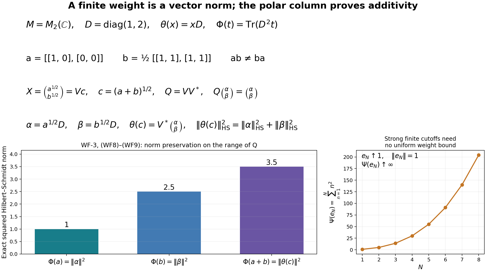

# A weight from a full Hilbert algebra, with its entire finite ideal

*Fresh reconstruction by GPT-6 Astra (OpenAI), Ultra, 2026-10-04. CC0-1.0 to the extent of rights in this new exposition. Arbitrary Hilbert spaces and nets are retained.*

We construct the faithful normal semifinite weight and its exact GNS identification from a full left Hilbert algebra. Here normal means preservation of bounded increasing positive suprema, and semifinite means that the complex span of the finite positive cone is ultraweakly dense. Those are the original WG/WH conventions. We do not assume their equivalence to a dominated-functional supremum or to unrestricted ultraweak lower semicontinuity.

The earlier analytic proofs are [CF-1](OA-FLOW-CF.md#OA-FLOW.CF.1), [CF-4](OA-FLOW-CF.md#OA-FLOW.CF.4), [CF-6](OA-FLOW-CF.md#OA-FLOW.CF.6), [CF-10](OA-FLOW-CF.md#OA-FLOW.CF.10), [SF-0](OA-FLOW-SF.md#oa-flow.shared-foundations.sf-0) and [SB-0](OA-FLOW-SF.md#OA-FLOW.SF.SB0) with [SB-1–SB-6](OA-FLOW-SF.md#OA-FLOW.SF.SB1), [CI-1–3](OA-FLOW-CI.md#oa-flow.ci.1), [BD-1–5](OA-FLOW-BD.md#oa-flow.bd.1), [HA-R1–7](OA-FLOW-HA-R.md#oa-flow.ha-r.1), and the general completion/mixed-product parts of [WH-04 Sections 2–4](OA-FLOW-WH04.md#oa-flow.wh04.2). In those WH-04 sections, the closed-involution inputs are supplied by CI, the multiplier and dual-algebra inputs by HA-R, and positive contractive density by BD-3. Their older provider labels are not additional premises here. The closed linear polar theorem used through HA-R4 uses its explicitly declared [FF-4 closed-form proof](OA-FLOW-FF.md#oa-flow.ff.5). No WG, NW, OW, modular automorphism theorem or old weight-reconstruction proof is imported.

For freely accessible human context, [Combes, *Poids associé à une algèbre hilbertienne à gauche*, Lemmas 2.9–2.10 and Theorem 2.11, printed pp.53–55](https://www.numdam.org/item/CM_1971__23_1_49_0.pdf#page=6), constructs the same mathematical weight. Its matrix factorization is a cited lemma and its global ultraweak-closedness passage uses additional convex theory. Below the factorization, additivity and arbitrary-net normality are proved explicitly. The paper's modular covariance and reverse weight-to-algebra theorem are not premises.

## WF-1. The exact module supplied by fullification

Let \(\mathcal C\subseteq H\) be a full left Hilbert algebra, with represented algebra \(M=\lambda(\mathcal C)''\), complete first right algebra \(\mathcal D\), and closed involution \(S\). All inner products are linear in the first variable. Define
\[
B_l=\{\xi\in H:\eta\mapsto R_\eta\xi
       \text{ is bounded in }\|\eta\|_H\text{ on all }\mathcal D\}.
\]
Its bounded extension is \(\lambda_\xi\). Applying HA-R to the opposite of \(\mathcal D\), and then WH-04, proves:
\[
I=\{\lambda_\xi:\xi\in B_l\}\subseteq M
\text{ is a linear left ideal},\qquad
\theta(\lambda_\xi)=\xi,\qquad
\theta(xa)=x\theta(a)\quad(x\in M,a\in I).
\tag{WF1}
\]
The multiplier map is injective, so \(\theta:I\to H\) is well defined and linear. Its range contains the dense algebra \(\mathcal C\). The precise adjoint intersection is
\[
I\cap I^*=\lambda(\mathcal C),\qquad
\theta(\lambda_\xi^*)=S\xi\quad(\xi\in\mathcal C).
\tag{WF2}
\]
These are already proved analytic facts, not weight-theoretic assumptions.

There is also the following useful weak graph property, which we prove now. Suppose \(a_i\in I\), \(a_i\to a\in M\) weakly as bounded operators, and \(\theta(a_i)\to\xi\) weakly in \(H\). For every \(\eta\in\mathcal D\),
\(a_i\eta=R_\eta\theta(a_i)\).
Pair with any vector and pass to the limit, using the bounded adjoint of \(R_\eta\), to obtain
\[
a\eta=R_\eta\xi\quad(\eta\in\mathcal D).
\tag{WF3}
\]
The right side therefore defines a bounded map in \(\eta\), of norm at most \(\|a\|\). This says \(\xi\in B_l\) and \(\lambda_\xi=a\); hence \(a\in I\), \(\theta(a)=\xi\). No uniform bound is inferred from arbitrary weak convergence of the net.

## WF-2. Three bounded analytic facts with the needed generality

**Order factorization.** If \(0\leq a\leq b\) in \(M\), the rule
\[
b^{1/2}v\longmapsto a^{1/2}v
\]
is well defined and contractive, since the squared norm of the image is at most that of the argument. Extend it continuously on \(\overline{\operatorname{Ran}b^{1/2}}\), and set it to zero on \(\ker b\), obtaining a contraction \(d\). For each unitary \(u\in M'\), commutation with both square roots shows that this rule commutes with \(u\) on its initial range; its extension and zero-kernel summand also commute. The SF-0 commutant-unitary test gives \(d\in M\). Therefore
\[
a^{1/2}=d b^{1/2},\qquad \|d\|\leq1.
\tag{WF4}
\]

**Square roots of bounded strong limits.** If \(0\leq a_i,a\leq C I\) and \(a_i\to a\) strongly, then \(a_i^{1/2}\to a^{1/2}\) strongly. Products of uniformly bounded strongly convergent nets converge strongly, by expanding a difference into two terms. Induction gives convergence for every polynomial. BD-2's uniform polynomial approximation to the square root on \([0,C]\), and the spectral norm bound, then prove the assertion. The case \(C=0\) is immediate.

In particular every bounded increasing positive net with order supremum \(a\in M\) has this strong square-root convergence. To include the preceding strong-limit fact explicitly, the increasing bounded scalar forms \(\langle a_i v,v\rangle\) have a limit \(q(v)\). Passing their parallelogram and complex-homogeneity identities to the limit and polarizing gives a bounded positive sesquilinear form. Hilbert representation gives its operator \(b\). Then \(0\leq b-a_i\leq C I\) and
\[
\|(b-a_i)v\|^2\leq C\langle(b-a_i)v,v\rangle\longrightarrow0.
\tag{WF5}
\]
Thus \(a_i\to b\) strongly; the bicommutant is strongly closed, so \(b\in M\). The quadratic inequalities show \(b\) is the least upper bound, hence \(b=a\).

**Weak compactness of every Hilbert ball.** For radius \(r\), embed that ball by the coordinates \(\langle\xi,v\rangle\) in the product of discs of radii \(r\|v\|\), indexed by \(v\in H\). CF-4 proves arbitrary product compactness. The equations for conjugate-linearity in \(v\), together with the bound \(r\|v\|\), are closed conditions. Their solutions are exactly the bounded conjugate-linear functionals of norm at most \(r\), each represented by a unique \(\xi\) in the ball by SF-0/SB-0. Hence the image is closed and the ball is compact for its weak topology. This applies to arbitrary \(H\); no sequence compactness or separability is used.

## WF-3. The finite positive cone and exact additivity

Define on \(M_+\)
\[
\Phi(a)=
\begin{cases}
\|\theta(a^{1/2})\|^2,&a^{1/2}\in I,\\
\infty,&a^{1/2}\notin I.
\end{cases}
\qquad P=\{a\in M_+:a^{1/2}\in I\}.
\tag{WF6}
\]
The value at zero is zero. Linearity of \(\theta\) and \((ta)^{1/2}=t^{1/2}a^{1/2}\) give positive homogeneity for \(t>0\); for \(t=0\) it holds with \(0\cdot\infty=0\).

If \(0\leq a\leq b\in P\), (WF4) and the left-ideal/module identities give
\(a^{1/2}\in I\) and
\(\theta(a^{1/2})=d\theta(b^{1/2})\).
Thus \(P\) is hereditary and
\[
\Phi(a)\leq\Phi(b).
\tag{WF7}
\]

Let \(a,b\in P\), and write \(\alpha=\theta(a^{1/2})\), \(\beta=\theta(b^{1/2})\), \(c=(a+b)^{1/2}\). Consider the column \(X:H\to H\oplus H\) with entries \(a^{1/2},b^{1/2}\). Its polar decomposition has the form
\[
X=Vc,\qquad V=\binom{v_1}{v_2},\qquad
V^*V=p=s(c),\quad VV^*=Q,
\tag{WF8}
\]
where \(v_1,v_2\in M\) and \(QX=X\). Here is an exact justification within the earlier polar theorem: apply HA-R4 to the bounded operator
\(\begin{pmatrix}a^{1/2}&0\\b^{1/2}&0\end{pmatrix}\)
on \(H\oplus H\), whose positive absolute value is \(\operatorname{diag}(c,0)\). Its polar factor has second column zero and entries in \(M\), because the input lies in \(M_2(M)\); equivalently every entry commutes with \(M'\), as follows from uniqueness of the polar isometry. The first column gives (WF8).

Now \(c=V^*X=v_1^*a^{1/2}+v_2^*b^{1/2}\) belongs to \(I\), and
\(\theta(c)=V^*(\alpha,\beta)\) by (WF1). Applying \(\theta\) componentwise to \(QX=X\) gives
\(Q(\alpha,\beta)=(\alpha,\beta)\).
The partial isometry \(V^*\) preserves the norm on \(Q(H\oplus H)\), so
\[
\Phi(a+b)=\|\theta(c)\|^2
=\|\alpha\|^2+\|\beta\|^2
=\Phi(a)+\Phi(b).
\tag{WF9}
\]
If either \(a\) or \(b\) is outside \(P\), then \(a+b\notin P\) by heredity, so the same equality holds with infinity. This proves full additivity. Therefore \(\Phi\) is a weight, and its finite positive cone is exactly \(P\). Injectivity of \(\theta\) makes it faithful: \(\Phi(a)=0\) forces \(a^{1/2}=0\).

## WF-4. The whole finite ideal, the linear extension and the GNS norm

For \(x\in M\), write its bounded polar decomposition as \(x=u|x|\), with support projections \(p=u^*u\), \(q=uu^*\). Since \(|x|=u^*x\), the left-ideal property gives
\[
x\in I\quad\Longleftrightarrow\quad |x|\in I.
\tag{WF10}
\]
For \(x\in I\), \(qx=x\) implies \(q\theta(x)=\theta(x)\). Hence
\(\theta(|x|)=u^*\theta(x)\) has the same norm as \(\theta(x)\). It follows that
\[
\mathfrak n_\Phi=\{x:\Phi(x^*x)<\infty\}=I,\qquad
\Phi(x^*x)=\|\theta(x)\|^2\quad(x\in I).
\tag{WF11}
\]

Let \(\mathfrak m=\operatorname{span}_{\mathbb C}P\). On its self-adjoint part define the real functional by
\(\Phi_0(a-b)=\Phi(a)-\Phi(b)\), \(a,b\in P\).
Every self-adjoint element of \(\mathfrak m\) has such an expression, by taking real parts of its coefficients and splitting positive and negative coefficients. The definition is independent of the expression: \(a-b=c-d\) implies \(a+d=b+c\), and all four weights are finite, so additivity gives equal differences. Addition and real scalar multiplication follow by combining those expressions. Complexification gives a unique complex-linear functional \(\Phi_0\) extending the weight on \(P\).

The positive cone of \(\mathfrak m\) is precisely \(P\): if \(0\leq a-b\), then \(0\leq a-b\leq a\), so heredity puts \(a-b\) in \(P\). In particular \(\Phi_0\) is positive. The polarization identity gives
\[
y^*x=\frac14\sum_{k=0}^3 i^k(x+i^k y)^*(x+i^k y)
\quad(x,y\in I).
\tag{WF12}
\]
Every summand belongs to \(P\). Conversely \(a\in P\) is \((a^{1/2})^*a^{1/2}\) with \(a^{1/2}\in I\). Therefore
\[
\mathfrak m=\operatorname{span}I^*I.
\tag{WF13}
\]
This is a \*-subalgebra: adjoints reverse a product \(x^*y\), and
\((x^*y)(z^*w)=x^*((yz^*)w)\), where \((yz^*)w\in I\) by the left-ideal property. Also \(\mathfrak m\subseteq I\cap I^*\), again by that property and adjoints.

Apply \(\Phi_0\) to (WF12) and use (WF11). Hilbert polarization yields the exact inner product
\[
\Phi_0(y^*x)=\langle\theta(x),\theta(y)\rangle
\quad(x,y\in I).
\tag{WF14}
\]
In particular no infinite subtraction occurs in any sesquilinear expression.

Write \(B=I\cap I^*=\lambda(\mathcal C)\). The finite algebra is exactly
\[
\mathfrak m=B^2.
\tag{WF15}
\]
Indeed, for every \(z\in I\), its absolute value belongs to \(B\) by (WF10), so \(z^*z=|z|^2\in B^2\); (WF12) then gives \(\operatorname{span}I^*I\subseteq B^2\). Conversely \(bc=(b^*)^*c\in I^*I\) for \(b,c\in B\). As throughout the Hilbert-algebra proof, the square of an algebra denotes the linear span of products.

## WF-5. Arbitrary-net normality and semifiniteness

Let \(0\leq a_i\uparrow a\) in \(M\) and let \(L=\sup_i\Phi(a_i)\). Monotonicity gives \(L\leq\Phi(a)\). If \(L=\infty\), equality is immediate. Suppose \(L<\infty\). Then \(a_i^{1/2}\in I\), and the vectors
\(\xi_i=\theta(a_i^{1/2})\) lie in the weakly compact ball of radius \(\sqrt L\). The weak closures of their tails have the finite-intersection property, since the index set is directed. Compactness supplies a point \(\xi\) belonging to every tail closure, with \(\|\xi\|\leq\sqrt L\).

WF-2 gives \(a_i^{1/2}\to a^{1/2}\) strongly. For every \(\eta\in\mathcal D\) and \(v\in H\), the identity
\[
\langle R_\eta\xi_i,v\rangle=\langle a_i^{1/2}\eta,v\rangle
\]
has a scalar limit. The left side is a weakly continuous coordinate of \(\xi_i\); every point in all tail closures must have that limiting coordinate. Therefore \(R_\eta\xi=a^{1/2}\eta\) for all \(\eta\in\mathcal D\). As in (WF3), this means \(a^{1/2}\in I\) and \(\theta(a^{1/2})=\xi\). Consequently
\[
\Phi(a)=\|\xi\|^2\leq L=\sup_i\Phi(a_i)\leq\Phi(a).
\tag{WF16}
\]
This proves normality for arbitrary directed nets. There is no selection of a sequence from the operator net and no assumption that the Hilbert space has a cyclic vector.

For semifiniteness, \(B=\lambda(\mathcal C)\) is a nondegenerate represented \*-algebra generating \(M\). BD-3 supplies positive contractions \(e_j\in B\) with \(e_j\to I\) strongly. They need not form an increasing net, and their weights need not be uniformly bounded. For every \(x\in M\),
\[
e_j x e_j=e_j^*(xe_j)\in\operatorname{span}I^*I=\mathfrak m,
\qquad e_j x e_j\longrightarrow x\ \text{strongly}.
\tag{WF17}
\]
The norms are bounded by \(\|x\|\), so [BD, (BD7)](OA-FLOW-BD.md#oa-flow.bd.5) gives ultraweak convergence. Thus \(\mathfrak m=\operatorname{span}P\) is ultraweakly dense, proving semifiniteness in the exact stated sense. Together with WF-3, the weight is faithful, normal and semifinite.

The same compact-ball argument also proves that every finite sublevel set of \(\Phi\) is closed under norm-bounded strong limits in \(M_+\): use WF-2's square-root convergence and the tail-closure argument without monotonicity. This additional bounded statement is not substituted for unrestricted ultraweak lower semicontinuity.

## WF-6. The canonical GNS unitary and the complete finite-star algebra

There is no need to import the general arbitrary-weight GNS theorem for this constructed weight. On \(I=\mathfrak n_\Phi\), (WF14) is an inner product, since \(\theta\) is injective. Complete it to \(H_\Phi\), writing \(\Lambda_\Phi(x)\) for the image of \(x\). The rule
\[
U\Lambda_\Phi(x)=\theta(x)\qquad(x\in I)
\tag{WF18}
\]
is isometric and has dense range, because \(\theta(I)\supseteq\mathcal C\). It extends to a unitary \(U:H_\Phi\to H\).

For \(a\in M\), left multiplication \(x\mapsto ax\) preserves \(I\), and
\[
\|\theta(ax)\|=\|a\theta(x)\|\leq\|a\|\,\|\theta(x)\|.
\]
It extends to a bounded representation \(\pi_\Phi(a)\). Products hold on the dense initial domain; the adjoint identity follows either from (WF14) or from the bounded operator \(a\) after applying \(U\). The representation is unital and
\[
U\pi_\Phi(a)U^*=a\quad(a\in M).
\tag{WF19}
\]
This proves both faithfulness and the precise concrete realization. It does not invoke an image-closure theorem.

By (WF2) and (WF11),
\[
\mathfrak n_\Phi\cap\mathfrak n_\Phi^*
=I\cap I^*=\lambda(\mathcal C).
\tag{WF20}
\]
On this whole finite-star domain, (WF18) sends multiplication and involution exactly to those of \(\mathcal C\):
\[
U\Lambda_\Phi(\lambda_\xi)=\xi,\qquad
U\Lambda_\Phi(\lambda_\xi^*)=S\xi\quad(\xi\in\mathcal C).
\tag{WF21}
\]
Since \(\mathcal C\) is full, its involution has closure \(S\), already with its full domain. The direct-sum unitary \(U\oplus U\) preserves convergent graph pairs in both directions, so closing the finite-star involution gives
\[
U S_\Phi U^*=S
\tag{WF22}
\]
as closed conjugate-linear operators, with equality of domains. The finite algebra is \(\lambda(\mathcal C^2)\) by (WF15), and its GNS image \(\mathcal C^2\) is a graph core by HA-R applied on the appropriate side. Thus all the finite and finite-star domains are identified, not merely a chosen analytic subalgebra.

The weight is uniquely determined by (WF11) and the exact finite ideal \(I\): its value at \(a\geq0\) is finite precisely when \(a^{1/2}\in I\), and its value then is the stated norm square. If \(H=M=0\), the same construction gives the zero weight, zero completion and the unique identity on the zero Hilbert space; every assertion remains valid.

## WF-7. Symmetry, source scope and the remaining reverse route

The construction uses a concrete left ideal and its injective covariant vector map, whose weak graph property is tested against the opposite dense algebra. Applying the same proof to the complete right Hilbert algebra with left and right interchanged constructs the right weight on \(M'\), with its entire right multiplication ideal and corresponding GNS unitary. The reversed representation product is handled by the opposite algebra exactly as in HA-R; no trace symmetry is assumed. Identification with a separately defined opposite weight is a further theorem, not a consequence of notation.

This supplies the mathematical construction, exact ideals, arbitrary-net normality, semifiniteness and GNS/full-domain recovery previously required from WH-05–08, at the freshly proved Hilbert-algebra foundations. It does not yet prove that an arbitrary given n.s.f. weight yields the required closable finite-star algebra, or that this construction recovers every such given weight. Those reverse assertions are supplied by the later [whole finite-star closability](OA-FLOW-WR.md#wr-3), [fullness](OA-FLOW-WR.md#wr-4) and [recovery](OA-FLOW-WR.md#wr-5) proofs for arbitrary faithful n.s.f. weights.

Likewise, this note does not invoke Combes's modular covariance or global ultraweak lower-semicontinuity statement as an unproved import. The later [weight-normality equivalence](OA-FLOW-EW.md#ew-5) covers every extended-valued weight, and [modular covariance](OA-FLOW-MW.md#mw-3) uses the general MF-06 theorem and its whole bounded-vector identities. These later consequences are not premises of the present forward construction.

## WF-8. The polar column and finite-weight cutoffs

The left panel instantiates [WF-3, (WF8)–(WF9)](OA-FLOW-WF.md#oa-flow.wf.3) in the Hilbert space of two-by-two matrices with Hilbert–Schmidt inner product. The algebra acts by left multiplication. Set \(D=\operatorname{diag}(1,2)\), \(\theta(x)=xD\), \(a=\operatorname{diag}(1,0)\), and \(b=\tfrac12\begin{pmatrix}1&1\\1&1\end{pmatrix}\). Both \(a,b\) are projections and do not commute. For \(t\geq0\),
\[
\|\theta(t^{1/2})\|_{\mathrm{HS}}^2
=\operatorname{Tr}(DtD)=\operatorname{Tr}(D^2t).
\]
Here the finite-dimensional trace identity follows by summing entries, so there is no trace theorem among the inputs. The weights are exactly \(1,5/2,7/2\). With \(X=\binom{a}{b}\), \(c=(a+b)^{1/2}\), and \(V=Xc^{-1}\), direct multiplication gives \(V^*V=1\), \(Q=VV^*\), and \(QXD=XD\). Applying \(V^*\) to \(XD=\binom{\alpha}{\beta}\) preserves its Hilbert–Schmidt norm and gives \(cD\), exactly the proof mechanism. The matrix \(a+b\) is invertible: its determinant is \(1/2\). The general proof uses support projections and also covers the noninvertible case.

The right panel is a separate infinite-dimensional example explaining [WF-5](OA-FLOW-WF.md#oa-flow.wf.5). Let \(M=\ell^\infty(\mathbb N)\) act diagonally on \(\ell^2(\mathbb N)\), and define \(\Psi(t)=\sum_{n\geq1}n^2t_n\) for \(t\geq0\). This is a faithful weight by nonnegative series additivity. If \(t_i\uparrow t\), each coordinate increases to its supremum: otherwise that coordinate of the alleged least upper bound can be reduced. Interchanging the supremum over the directed net and over finite coordinate sets proves \(\Psi(t)=\sup_i\Psi(t_i)\), including infinite values. Thus this weight is normal for arbitrary nets. Finite coordinate sequences span an ultraweakly dense algebra: their coordinate cutoffs have a common operator bound and converge strongly, hence ultraweakly by [BD, (BD7)](OA-FLOW-BD.md#oa-flow.bd.5). This proves semifiniteness directly.

For \(e_N=1_{\{1,\ldots,N\}}\), the projections increase strongly to the identity and have operator norm one. Their finite weights equal \(N(N+1)(2N+1)/6\), which increases without bound. The finite sum formula follows by induction, subtracting the formulas for \(N\) and \(N-1\). The sample points \(1\leq N\leq8\) illustrate this exact identity, not a convergence test for the general theorem. They explain why WF-5 uses a common operator bound for its density net but assumes no common bound on its weights.

The [reproducible source](../assets/weight-foundation/render_weight_mechanism.py) retains the exact input matrices, constructs their positive square root numerically only for illustration QA, and records residuals in [figure-numerics.json](../assets/weight-foundation/figure-numerics.json). The proof and its constants are algebraic and precede the numerical checks. Human-source context is [Combes, Lemmas 2.9–2.10 and Theorem 2.11, printed pp.53–55](https://www.numdam.org/item/CM_1971__23_1_49_0.pdf#page=6); the local column factorization and arbitrary-net argument are written in WF-2–5 rather than imported from that paper. Original figure, code and exposition: CC0-1.0 to the extent of rights held.
