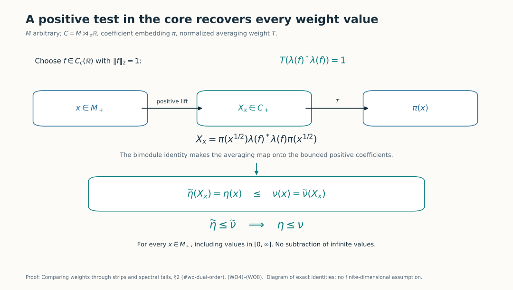
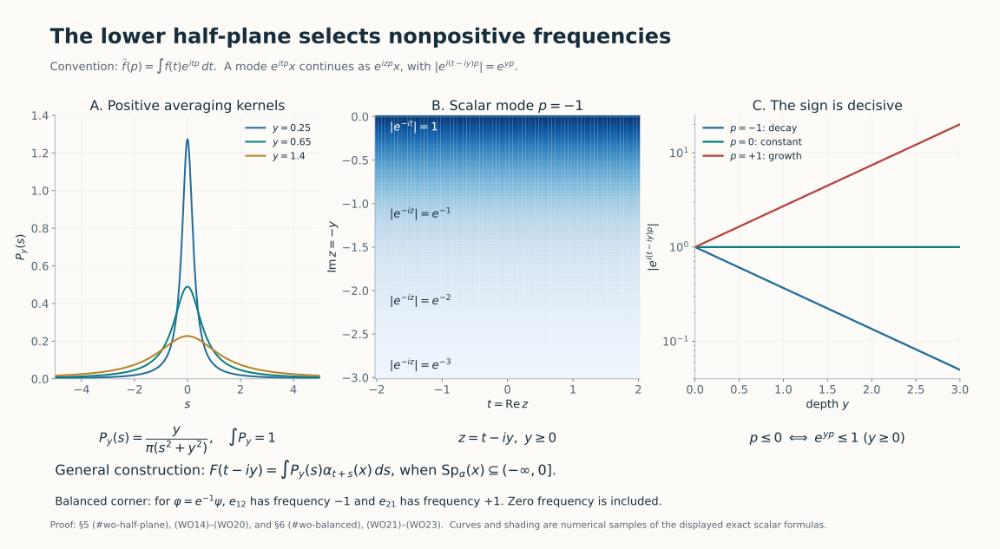
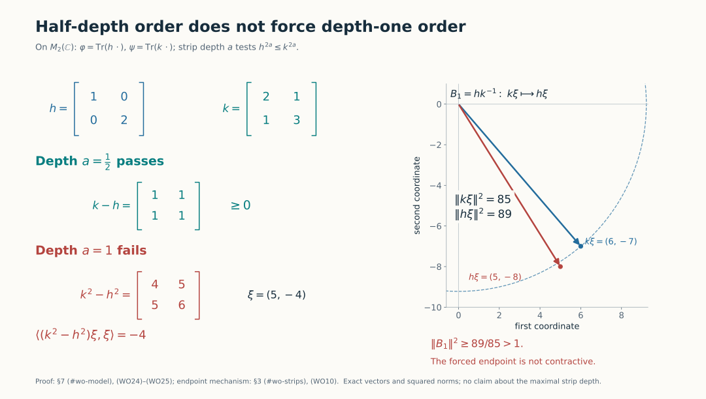

# Comparing weights through strips and spectral tails

*Self-checked by the writing AI.*

A comparison between two weights can be transported to positive operators in one traced algebra. This identifies the exact power seen by a complex strip, and lets us recover the comparison on every positive element of the original algebra. A second construction relates all strip depths to the spectral support of a single matrix unit.

## 1. Conventions and the statements

Let \(M\) be a von Neumann algebra and let \(\mathcal W_0(M)\) denote its faithful normal semifinite weights. No separability, factoriality, proper infiniteness or finiteness of the weights is assumed. Ordinary order means comparison on the entire positive cone, with infinite values allowed.

For the zero algebra there is a single weight, all comparisons below hold, and its cocycle is the sole element of that algebra. This settles that case. In the rest of the proof and the scalar-rescaling diagnostics, assume \(M\ne0\).

For \(a>0\), put
\[
 \begin{aligned}
 S_a&=\{z:-a\leq\operatorname{Im}z\leq0\},\\
 \varphi\preceq_a\psi
 &\Longleftrightarrow (D\varphi:D\psi)_t\\
 &\qquad\text{has a contractive holomorphic extension to }S_a.
 \end{aligned}
 \tag{WO1}
\]
The extension is required to be jointly intrinsically sigma-strong continuous on the closed strip. Holomorphy initially means holomorphy of every normal scalar coefficient in the interior. The proof below also gives norm holomorphy inside and joint sigma-strong-star continuity on both edges. Write \(\varphi\preceq_\infty\psi\) when (WO1) holds for every \(a>0\).

The normalized cocycles, including the ordered chain rule and positive scalar normalization, are the ones constructed in [BC4–5](OA-FLOW-BC.md#oa-flow.bc.4). These normalizations are part of the definitions: equal modular groups alone do not identify weights.

We will prove that every \(\preceq_a\), and also \(\preceq_\infty\), is a partial order. More precisely, if \(h_\varphi,h_\psi\) are the positive nonsingular densities in one common continuous core, then
\[
 \begin{aligned}
 \varphi\preceq_a\psi
 &\Longleftrightarrow
 D(h_\psi^a)\subseteq D(h_\varphi^a),\
 \|h_\varphi^a\xi\|\leq\|h_\psi^a\xi\|
 \quad(\xi\in D(h_\psi^a))\\
 &\Longleftrightarrow h_\varphi^{2a}\leq h_\psi^{2a}
       \quad\text{as complete closed forms},\\
 \varphi\preceq_{1/2}\psi&\Longleftrightarrow\varphi\leq\psi.
 \end{aligned}
 \tag{WO2}
\]
Thus the exponent is \(2a\). No product of two unbounded operators is presumed to be everywhere defined.

We use [L158's full power-strip theorem](OA-FLOW-L158.md#oa-flow.l158.theorem), including its endpoint domains, both boundary topologies, and all-powers converse. The continuous core, its normalized trace and its normal changes of chart are proved in [CORE](OA-FLOW-CORE.md#core-6); the whole-cone density identity is [SCW2](OA-FLOW-SCW.md#scw-2). Sections 2–3 supply the additional weight-order bridge, rather than assuming that an operator inequality is already a weight inequality.

## 2. The averaging map reaches every positive coefficient

Choose a faithful reference weight and its core \(C=M\rtimes_\sigma\mathbb R\), writing \(\pi:M\to C\) for the normal coefficient embedding. Let \(T:C_+\to\widehat{\pi(M)}_+\) be the canonical operator-valued weight with the Haar normalization fixed in [DA](OA-FLOW-DA.md#da-equality). For a normal weight \(\eta\), its dual is
\[
 \widetilde\eta(X)=
 \widehat{\eta\circ\pi^{-1}}\bigl(T(X)\bigr),\qquad X\in C_+.
 \tag{WO3}
\]
[EP5](OA-FLOW-EP.md#oa-flow.ep.5) constructs the indicated extension to the complete extended positive cone. In particular, \(\eta\leq\nu\) implies \(\widehat\eta\leq\widehat\nu\): evaluate the original inequality on each canonical bounded spectral approximation and take the supremum. Hence dualization preserves order.

It also reflects order. Choose a nonzero continuous compactly supported scalar function \(f\) and divide it by its \(L^2(\mathbb R,dt)\) norm. The latter is positive and finite. The compact-square formula [DA(A23)](OA-FLOW-DA.md#da-squares), with coefficient function \(s\mapsto f(s)1\), gives
\[
 T\bigl(\lambda(f)^*\lambda(f)\bigr)=1.
 \tag{WO4}
\]
Here \(\lambda(f)=\int f(s)\lambda_s\,ds\) is bounded, with norm at most \(\|f\|_1\). In DA's right-sided convention this is exactly \(F(f1)\).

For arbitrary \(x\in M_+\), define the bounded positive element
\[
 X_x=\bigl(\lambda(f)\pi(x^{1/2})\bigr)^*
          \bigl(\lambda(f)\pi(x^{1/2})\bigr)\in C_+.
 \tag{WO5}
\]
The full bimodule identity [DA(A21)](OA-FLOW-DA.md#equation-a21) yields
\[
 T(X_x)=\pi(x),\qquad
 \widetilde\eta(X_x)=\eta(x).
 \tag{WO6}
\]
Consequently \(\widetilde\eta\leq\widetilde\nu\) implies \(\eta\leq\nu\). The same test also proves injectivity of dualization. This argument includes infinite weight values; it neither subtracts them nor infers equality of weights from a small finite ideal.

For faithful normal semifinite \(\varphi,\psi\), place their densities in the same core with its fixed trace \(\tau\). [CORE6](OA-FLOW-CORE.md#core-6) and [SCW2](OA-FLOW-SCW.md#scw-2) give
\[
 \widetilde\varphi=\tau_{h_\varphi},\qquad
 \widetilde\psi=\tau_{h_\psi},\qquad
 \pi((D\varphi:D\psi)_t)=h_\varphi^{it}h_\psi^{-it}.
 \tag{WO7}
\]
All the equalities of weights hold on \(C_+\). The exact complete-form order isomorphism [TD5](OA-FLOW-TD.md#td-5), followed by (WO6), proves
\[
 h_\varphi\leq h_\psi
 \Longleftrightarrow
 \widetilde\varphi\leq\widetilde\psi
 \Longleftrightarrow
 \varphi\leq\psi.
 \tag{WO8}
\]
This also shows why the reference trace and the dual-weight normalization must be fixed consistently.

The arrows are the exact identities (WO4)–(WO8): the normalized compact square gives a positive lift for every positive coefficient, including infinite weight values. [Reproduce the figure](../assets/weight-order/generate_order_figures.py); [source context](#wo-sources).

## 3. Recover the strip in the coefficient algebra

An extension in \(M\) gives one in \(C\) by applying \(\pi\). A normal representation transports intrinsic strong-star limits because its normal vector functionals are normal functionals on the original algebra. [L158](OA-FLOW-L158.md#oa-flow.l158.normal-transport) proves the corresponding spectral-domain transport.

Conversely suppose the complete form inequality in (WO2) holds. L158 constructs the unique contractive extension \(U(z)\in C\), including both boundary limits. Let \(\theta_s\) be the dual action. For each fixed \(s\), the function \(\theta_s(U(z))\) is another such extension with the same real boundary values, because the real cocycle in (WO7) belongs to \(\pi(M)\). L158's boundary-interval uniqueness therefore gives
\[
 \theta_s(U(z))=U(z)\qquad(s\in\mathbb R,\ z\in S_a).
 \tag{WO9}
\]
The full fixed-point result in [DA](OA-FLOW-DA.md#da-fixed) identifies \(C^\theta=\pi(M)\). Thus every \(U(z)\) lies in that coefficient algebra. Applying the normal inverse of \(\pi\) gives the required extension in \(M\), with its asserted topologies. This proves the first two equivalences in (WO2), and (WO8) proves the depth-one-half assertion.

At the lower edge the extension is the bounded closure prescribed by L158:
\[
 \pi(U(t-ia))=h_\varphi^{it}B_a h_\psi^{-it},\qquad
 B_a=\overline{h_\varphi^a h_\psi^{-a}},\quad\|B_a\|\leq1.
 \tag{WO10}
\]
Before closure the product is taken on the entire natural domain \(D(h_\psi^{-a})\); the form comparison ensures that it maps there as stated. Formula (WO9) puts \(B_a\) in \(\pi(M)\) even though its two formal unbounded factors need not be affiliated with \(\pi(M)\).

Reflexivity follows from the constant extension \(1\). For transitivity, multiply the two extensions in the order of [BC21](OA-FLOW-BC.md#oa-flow.bc.4):
\[
 (D\varphi:D\chi)_t
 =(D\varphi:D\psi)_t(D\psi:D\chi)_t.
 \tag{WO11}
\]
The product remains contractive. Bounded strong-star multiplication is jointly continuous, and the norm-holomorphic interior functions have a holomorphic product. Thus \(\varphi\preceq_a\psi\preceq_a\chi\) implies \(\varphi\preceq_a\chi\).

If both opposite comparisons hold, (WO2) gives equality of the two complete positive forms \(h_\varphi^{2a},h_\psi^{2a}\). The spectral correspondence for complete forms [EP2–3](OA-FLOW-EP.md#oa-flow.ep.2) identifies their selfadjoint operators; taking the Borel power \(1/(2a)\) gives \(h_\varphi=h_\psi\). Equation (WO8) in both directions gives \(\varphi=\psi\). Hence these are partial orders. Restricting an extension shows
\[
 0<b\leq a,\quad\varphi\preceq_a\psi
 \ \Longrightarrow\ \varphi\preceq_b\psi.
 \tag{WO12}
\]
Their intersection \(\preceq_\infty\) is again a partial order.

For \(c>0\), common scalar multiplication preserves and reflects every order. Indeed the dual density of \(c\varphi\) is \(c h_\varphi\), by (WO3) and TD's uniqueness; positive spectral powers multiply the forms by \(c^{2a}\). Normal isomorphisms preserve and reflect the orders as well, either through the normal chart maps or directly by the cocycle covariance [BC25](OA-FLOW-BC.md#oa-flow.bc.5) and its inverse.

## 4. All depths compare every spectral tail

Applying [L158, Section 7](OA-FLOW-L158.md#oa-flow.l158.all-powers) to (WO7) gives
\[
 \begin{aligned}
 \varphi\preceq_\infty\psi
 &\Longleftrightarrow h_\varphi^p\leq h_\psi^p
       \text{ as complete forms for every }p>0\\
 &\Longleftrightarrow
 E_{h_\psi}([0,r])\leq E_{h_\varphi}([0,r])
       \quad(r\geq0).
 \end{aligned}
 \tag{WO13}
\]
For clarity, the direction from powers to projections tests a vector in a low \(h_\psi\)-spectral band against arbitrarily high powers: its high \(h_\varphi\)-tail at \(v>r\) has squared norm at most \((r/v)^{2n}\|\xi\|^2\), which tends to zero. The converse uses increasing finite positive sums of ordered tail projections, then monotone convergence on the complete spectral forms. Those two arguments, including the endpoints and the full domains, are written out in L158.

It suffices in (WO13) to test integer powers: the proof from powers to projections uses only \(p=2n\), and the projection condition then supplies every positive power. The strip extensions agree on overlaps by uniqueness. They therefore define one bounded holomorphic function on the lower half-plane, with joint strong-star boundary continuity and norm at most one. Conversely restriction of such a function gives every finite strip.

None of these statements requires \(h_\varphi\) and \(h_\psi\) to commute. Nor does ordinary order generally imply (WO13).

## 5. A half-plane criterion proved by normal filters

We prove the spectral fact needed to express all-depth order by a matrix unit. Let \(\alpha\) be a point-ultraweakly continuous automorphism group of a von Neumann algebra \(N\). Use exactly [AL's convention](OA-FLOW-AL.md#oa-flow.al.2):
\[
 T_f(x)=\int_{\mathbb R}f(t)\alpha_t(x)\,dt,\qquad
 \widehat f(p)=\int_{\mathbb R}f(t)e^{itp}\,dt.
 \tag{WO14}
\]
Thus an orbit \(e^{itp}x\) has frequency \(p\). We claim
\[
 \operatorname{Sp}_\alpha(x)\subseteq(-\infty,0]
 \Longleftrightarrow
 \alpha_t(x)\text{ extends boundedly and holomorphically to }
 \operatorname{Im}z<0.
 \tag{WO15}
\]
In the right-hand condition, extension includes continuous normal scalar boundary values equal to the given orbit. The extension then has joint intrinsic strong-star continuity on the closed half-plane; it is unique and has norm at most \(\|x\|\).

Here are details of the forward construction, including the spectral endpoint zero. For \(y>0\), let
\[
 P_y(s)=\frac{y}{\pi(s^2+y^2)},\qquad
 F(t-iy)=\int_{\mathbb R}P_y(s)\alpha_{t+s}(x)\,ds.
 \tag{WO16}
\]
These are normal integrals, as in [AL1](OA-FLOW-AL.md#oa-flow.al.1). The kernel is nonnegative and has integral one, so \(\|F\|\leq\|x\|\). Its Fourier transform is \(e^{-y|p|}\). To verify that scalar formula directly for \(p\geq0\), apply [SF4's rectangle Cauchy formula](OA-FLOW-SF.md#oa-flow.sf4.cauchy-formula) to \(e^{izp}/(z^2+y^2)\) on the rectangle with vertices \(-R,R,R+iR,-R+iR\), where \(R>y\). Equivalently apply that formula to the holomorphic numerator \(e^{izp}/(z+iy)\) at \(iy\). The integral is \(\pi e^{-yp}/y\). On the other three sides, \(|e^{izp}|\leq1\) and \(|z^2+y^2|\geq R^2-y^2\), so their combined integral has modulus at most \(4R/(R^2-y^2)\), which tends to zero. A rectangle below the real axis for \(p<0\), with the corresponding reversed orientation, gives \(\pi e^{yp}/y\). Multiplication by \(y/\pi\) proves the claim, including \(p=0\).

Both first kernel derivatives are in \(L^1\), locally continuously in \(y>0\). Differentiation of translated kernels in \(L^1\) consequently makes \(F\) norm continuously differentiable there, with
\[
 (\partial_y+i\partial_t)F(t-iy)
   =\alpha_t(T_{q_y}x),\qquad
 q_y=\partial_yP_y-iP_y',\quad
 \widehat q_y(p)=-2p_+e^{-yp},
 \tag{WO17}
\]
where \(p_+=\max(p,0)\). We show \(T_{q_y}x=0\), without assuming spectral synthesis at zero. Put \(q_{y,\varepsilon}(s)=e^{-i\varepsilon s}q_y(s)\). Its transform is supported in \([\varepsilon,\infty)\), and \(q_{y,\varepsilon}\to q_y\) in \(L^1\) by dominated convergence.

For each fixed \(\varepsilon>0\), approximate \(q_{y,\varepsilon}\) in \(L^1\) by Schwartz functions whose smooth compact Fourier supports lie in \((0,\infty)\), as follows. Choose a Schwartz \(g\) with \(g(0)=1\) and smooth Fourier support in \([-1,1]\), using [RF1](OA-FLOW-RF.md#oa-flow.rf.1). The products \(q_{y,\varepsilon}(s)g(s/n)\) converge in \(L^1\) to \(q_{y,\varepsilon}\). They are Schwartz: the rational kernel \(q_y\) has polynomially decaying derivatives, and the modulation has bounded derivatives of every order. Fourier multiplication convolves the integrable transform \(\widehat q_{y,\varepsilon}\) with the compactly supported transform of \(g(s/n)\); hence their Fourier support lies in \([\varepsilon-1/n,\infty)\). For \(n>2/\varepsilon\), convolve these products with RF3's Schwartz approximate identity with smooth compact Fourier transform. This gives Schwartz functions with smooth compact Fourier support in \([\varepsilon/2,\infty)\), and converges in \(L^1\) to the product. Fourier multiplication/convolution here follows from ordinary absolutely convergent scalar integrals.

The hypothesis and [AL7](OA-FLOW-AL.md#equation-al7) kill each of these smooth compact filters. The bound \(\|T_f(x)\|\leq\|f\|_1\|x\|\) passes through the two approximations and then \(\varepsilon\downarrow0\). Thus (WO17) is zero. The Cauchy–Riemann equations prove holomorphy of every normal coefficient; local boundedness gives norm holomorphy by the Cauchy-coefficient argument of [L158](OA-FLOW-L158.md#oa-flow.l158.norm-holomorphy).

For the boundary, point-ultraweak continuity of automorphisms gives intrinsic strong-star continuity of each orbit. Indeed expand
\(\omega((\alpha_t(x)-x)^*(\alpha_t(x)-x))\);
each of its four terms tends to its value at zero, using normality of \(\omega\) and of multiplication by a fixed bounded element. Apply the same argument to \(x^*\). Formula (WO16), \(\int P_y=1\), and
\[
 \int_{|s|\geq\delta}P_y(s)\,ds
 \leq\frac{2y}{\pi\delta}
 \tag{WO18}
\]
now give joint strong-star convergence to \(\alpha_{t_0}(x)\) as \((t,y)\to(t_0,0)\): on small \(|s|\) use continuity of that vector orbit, and on the complement use \(2\|x\|\|\xi\|\) and (WO18). Repeat for adjoints. The uniform bound and [SF2](OA-FLOW-SF.md#oa-flow.sf2.bounded-strong-transfer) give every intrinsic normal seminorm.

For the reverse implication, let \(F\) be a bounded extension. If \(\chi\in C_c^\infty((0,\infty))\), its inverse transform
\[
 k_\chi(z)=\frac1{2\pi}\int\chi(p)e^{-izp}\,dp
 \tag{WO19}
\]
is entire. Choose \(\varepsilon>0\) with \(\operatorname{supp}\chi\subseteq[\varepsilon,L]\). Integration by parts in \(p\), together with the direct bound near \(\operatorname{Re}z=0\), gives for each integer \(m\geq2\)
\[
 |k_\chi(t-iy)|
 \leq C_m(1+y)^m e^{-\varepsilon y}(1+|t|)^{-m},
 \qquad y\geq0.
 \tag{WO20}
\]
Integrate the scalar coefficient of \(k_\chi(z)F(z)\) around a rectangle between the real line and \(\operatorname{Im}z=-y\). First let its vertical sides tend to infinity; (WO20) makes them vanish for each fixed \(y\). One may initially place the upper side below the real axis and then use bounded boundary convergence. The remaining bottom integral tends to zero as \(y\to\infty\), by (WO20) and boundedness of \(F\). Thus \(T_{k_\chi}(x)=0\), tested against every normal functional. AL7 proves the asserted spectral containment.

Finally two bounded extensions with the same boundary orbit are equal: their scalar difference extends by zero across a real interval, is holomorphic by the boundary-gluing proof in [SF4](OA-FLOW-SF.md#oa-flow.sf4.zero-edge), and vanishes by the identity theorem. The forward construction must therefore equal any proposed bounded extension, proving its optimal bound \(\|x\|\). This proves (WO15).

## 6. One balanced matrix unit detects the order

Form the faithful normal semifinite balanced weight
\[
 \Theta((x_{ij}))=\varphi(x_{11})+\psi(x_{22})
 \quad\text{on }M_2(M),
 \qquad e_{ij}=1\otimes E_{ij}.
 \tag{WO21}
\]
The complete balanced-weight construction [BC1–4](OA-FLOW-BC.md#oa-flow.bc.1) proves
\[
 \sigma_t^\Theta(e_{12})=(D\varphi:D\psi)_t e_{12}.
 \tag{WO22}
\]
Multiplication by \(e_{12}\) and its inverse corner identification preserve norms and all normal coefficient topologies. Equations (WO13), (WO15) and (WO22) give
\[
 \begin{aligned}
 \varphi\preceq_\infty\psi
 &\Longleftrightarrow
 \operatorname{Sp}_{\sigma^\Theta}(e_{12})\subseteq(-\infty,0]\\
 &\Longleftrightarrow
 \operatorname{Sp}_{\sigma^\Theta}(e_{21})\subseteq[0,\infty).
 \end{aligned}
 \tag{WO23}
\]
The second equivalence follows by taking adjoints, or directly by reflecting the half-plane extension. These signs refer to (WO14). For scalar weights \(\varphi=c\psi\) with \(0<c<1\), the first orbit is \(c^{it}e_{12}\), of frequency \(\log c<0\); this fixes the orientation without ambiguity.

The curves sample the exact scalar formulas in (WO14)–(WO20); they illustrate the normal-filter proof in Section 5. For \(\varphi=e^{-1}\psi\), the two balanced off-diagonal frequencies are \(-1\) and \(+1\), as proved in (WO23). [Figure source](../assets/weight-order/generate_order_figures.py).

## 7. Exact models and solved diagnostics

**Semifinite density chart.** In a semifinite algebra with faithful normal semifinite trace \(\tau\), let \(h,k\) be nonsingular positive affiliated operators. The trace centralizer is the whole algebra. The whole-cone construction in [CZ2](OA-FLOW-CZ.md#oa-flow.cz.2) agrees with TD's cutoff definition of \(\tau_h,\tau_k\), and the normalized balanced calculation [CZ6(CZ32)](OA-FLOW-CZ.md#oa-flow.cz.6) gives \((D\tau_h:D\tau)_t=h^{it}\). The chain and adjoint identities of BC4 therefore give
\[
 (D\tau_h:D\tau_k)_t=h^{it}k^{-it}.
 \tag{WO26}
\]
Apply L158 directly in this represented algebra: \(\tau_h\preceq_a\tau_k\) is equivalent to \(h^{2a}\leq k^{2a}\) as complete forms, and all-depth order is equivalent to the corresponding low-spectral-projection order. Here \(h,k\) are the original semifinite densities; this calculation does not identify them with continuous-core densities. It justifies all the models below and the commuting-density and matrix-distance computations in the next lesson.

**1. The half-depth test can stop before depth one.** On \(M_2(\mathbb C)\), with its usual trace, let
\[
 h=\begin{pmatrix}1&0\\0&2\end{pmatrix},\qquad
 k=\begin{pmatrix}2&1\\1&3\end{pmatrix},\qquad
 \varphi=\operatorname{Tr}(h\,\cdot),\quad
 \psi=\operatorname{Tr}(k\,\cdot).
 \tag{WO24}
\]
Both are faithful. Since \(k-h=\begin{pmatrix}1&1\\1&1\end{pmatrix}\geq0\), ordinary weight order and depth one-half hold. But
\[
 k^2-h^2=\begin{pmatrix}4&5\\5&6\end{pmatrix},\qquad
 \langle(k^2-h^2)(5,-4),(5,-4)\rangle=-4.
 \tag{WO25}
\]
Thus depth one fails. The forced lower endpoint sends \(k(5,-4)=(6,-7)\) to \(h(5,-4)=(5,-8)\); its squared norm increases from \(85\) to \(89\). This is an exact obstruction, not a numerical estimate of the largest possible strip.

The real coordinate plane shows the exact obstruction in (WO24)–(WO25); the dashed circle has radius \(\sqrt{85}\). This proves failure at depth one, without claiming the largest possible strip. [Numerical checks](../assets/weight-order/diagnostics.json); the proof is the exact matrix computation above.

**2. All-depth order does not imply commutation.** Keep \(h=\operatorname{diag}(1,2)\), but take \(k=\begin{pmatrix}4&1\\1&4\end{pmatrix}\). Its eigenvalues are \(3,5\). Thus \(h^p\leq2^p1\leq3^p1\leq k^p\) for every \(p>0\), so \(\varphi\preceq_\infty\psi\). Nevertheless \(hk-kh=\begin{pmatrix}0&-1\\1&0\end{pmatrix}\ne0\).

**3. The scalar ratio fixes both signs.** If \(\varphi=c\psi\), then the unique extension is \(c^{iz}1\), of norm \(c^a\) at depth \(a\). Every positive depth works exactly when \(c\leq1\). The two off-diagonal frequencies in (WO23) are \(\log c\) and \(-\log c\).

**4. Why faithful densities do not need bounded inverses.** On \(\ell^2(\mathbb N)\), put \(ke_{2n-1}=ne_{2n-1}\), \(ke_{2n}=n^{-1}e_{2n}\), and \(h=ck\), \(0<c<1\). Both densities and both inverses are unbounded. Their trace weights are faithful normal semifinite by [TD6](OA-FLOW-TD.md#td-6). On the full inverse-power domain, \(h^ak^{-a}=c^a1\), whose closure is bounded. Thus the strip is \(c^{iz}1\) at every depth. None of the unbounded products is silently evaluated off its natural domain.

**5. Infinite values are tested too.** Let \(x\in M_+\) have \(\varphi(x)=\infty\). Formula (WO6) says \(\widetilde\varphi(X_x)=\infty\). If the dual inequality holds, it forces \(\widetilde\psi(X_x)=\psi(x)=\infty\). Thus the order-reflection argument has not discarded the part of the cone on which the weights are infinite.

**6. Why zero frequency is included.** A fixed nonzero \(x\) has constant extension \(F(z)=x\), and its spectral support is \(\{0\}\). The modulation-and-limit step after (WO17) is what permits this endpoint. Replacing either closed half-line in (WO23) by an open one would exclude equal weights.

## Further reading

M. Takesaki, *Theory of Operator Algebras II*, Chapter XII, Section 5, Definition 5.1, Lemmas 5.2 and 5.4, Remark 5.3 and Example 5.6(i), printed pp.421–423, treats these weight comparisons. The proof here first reflects order through an explicitly onto averaging map, then applies complete-form interpolation in one core. The half-plane criterion is proved by Poisson kernels, smooth normal filters and a contour estimate, with the Fourier sign fixed by (WO14). The earlier L158 proof supplies both the power-domain theorem and its noncommuting finite-dimensional diagnostics.
