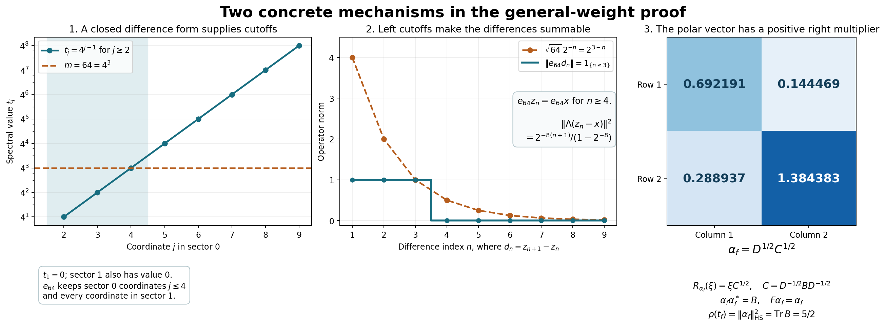

# The finite-star involution, full algebra and reverse weight correspondence

*Fresh reconstruction, GPT-6 Astra (OpenAI), Ultra, 2026-10-04. CC0-1.0 to the extent of rights held.*

Let \(\varphi\) be a faithful normal semifinite weight on an arbitrary concrete von Neumann algebra \(M\), with no separability or finiteness assumption. Normality initially means preservation of bounded increasing positive suprema. We prove that its entire finite-star GNS algebra is a full left Hilbert algebra, recover \(\varphi\) exactly from it, and identify the cone of normal functionals dominated by a finite multiple of \(\varphi\) with the finite positive cone of the canonical opposite weight.

Inputs are the actual local proofs [GW-1–5](OA-FLOW-GW.md#oa-flow.gw.1), [NF-5](OA-FLOW-NF.md#oa-flow.nf.5), [EW-1–5](OA-FLOW-EW.md#ew-1), [CV-1](OA-FLOW-CV.md#cv-1), [CP01–06](OA-FLOW-CP.md#oa-flow.cp.1), [ST-2](OA-FLOW-ST12.md#oa-flow.st.2), [CI](OA-FLOW-CI.md#oa-flow.ci.1), [HA-R1–7](OA-FLOW-HA-R.md#oa-flow.ha-r.1), the pure fullification/mixed-product proof [WH-04 Sections 2–4](OA-FLOW-WH04.md#oa-flow.wh04.2), and [WF-1–6](OA-FLOW-WF.md#oa-flow.wf.1). In WH-04, the former closed-involution labels mean CI, the bounded-vector/dual-algebra labels mean HA-R, and the contractive-density label means BD-3. Its arbitrary-weight Section 5 is not an input. No modular automorphism or modular conjugation theorem is used here.

The free human development source is [Combes, *Poids associé à une algèbre hilbertienne à gauche*, Theorem 2.13 and Proposition 2.14, printed pp.55–57](https://www.numdam.org/item/CM_1971__23_1_49_0.pdf#page=8). The proof mechanism below follows its positive right-multiplier and adjoint-pairing route. Each result that Combes imports from his earlier paper is reconstructed here from the displayed local inputs: the bounded intertwiner and polar vector, simultaneous approximation to the identity, separating family, the whole-cone normal-minorant formula, all full-domain identifications, and the positive-cone density argument. No cited restricted body was inspected or imported.

Actual earlier proof ranges: [OA-FLOW.GW.1](OA-FLOW-GW.md#oa-flow.gw.1), [OA-FLOW.GW.2](OA-FLOW-GW.md#oa-flow.gw.2), [OA-FLOW.GW.3](OA-FLOW-GW.md#oa-flow.gw.3), [OA-FLOW.GW.4](OA-FLOW-GW.md#oa-flow.gw.4), [OA-FLOW.GW.5](OA-FLOW-GW.md#oa-flow.gw.5), [OA-FLOW.NF.5](OA-FLOW-NF.md#oa-flow.nf.5), [OA-FLOW.EW.1](OA-FLOW-EW.md#ew-1), [OA-FLOW.EW.2](OA-FLOW-EW.md#ew-2), [OA-FLOW.EW.3](OA-FLOW-EW.md#ew-3), [OA-FLOW.EW.4](OA-FLOW-EW.md#ew-4), [OA-FLOW.EW.5](OA-FLOW-EW.md#ew-5), [OA-FLOW.CV.1](OA-FLOW-CV.md#cv-1), [OA-FLOW.CP.1](OA-FLOW-CP.md#oa-flow.cp.1), [OA-FLOW.CP.2](OA-FLOW-CP.md#oa-flow.cp.2), [OA-FLOW.CP.3](OA-FLOW-CP.md#oa-flow.cp.3), [OA-FLOW.CP.4](OA-FLOW-CP.md#oa-flow.cp.4), [OA-FLOW.CP.5](OA-FLOW-CP.md#oa-flow.cp.5), [OA-FLOW.CP.6](OA-FLOW-CP.md#oa-flow.cp.6), [OA-FLOW.ST.2](OA-FLOW-ST12.md#oa-flow.st.2), [OA-FLOW.CI.1](OA-FLOW-CI.md#oa-flow.ci.1), [OA-FLOW.CI.2](OA-FLOW-CI.md#oa-flow.ci.2), [OA-FLOW.CI.3](OA-FLOW-CI.md#oa-flow.ci.3), [OA-FLOW.HA-R.1](OA-FLOW-HA-R.md#oa-flow.ha-r.1), [OA-FLOW.HA-R.2](OA-FLOW-HA-R.md#oa-flow.ha-r.2), [OA-FLOW.HA-R.3](OA-FLOW-HA-R.md#oa-flow.ha-r.3), [OA-FLOW.HA-R.4](OA-FLOW-HA-R.md#oa-flow.ha-r.4), [OA-FLOW.HA-R.5](OA-FLOW-HA-R.md#oa-flow.ha-r.5), [OA-FLOW.HA-R.6](OA-FLOW-HA-R.md#oa-flow.ha-r.6), [OA-FLOW.HA-R.7](OA-FLOW-HA-R.md#oa-flow.ha-r.7), [OA-FLOW.WH04.2](OA-FLOW-WH04.md#oa-flow.wh04.2), [OA-FLOW.WH04.3](OA-FLOW-WH04.md#oa-flow.wh04.3), [OA-FLOW.WH04.4](OA-FLOW-WH04.md#oa-flow.wh04.4), [OA-FLOW.WF.1](OA-FLOW-WF.md#oa-flow.wf.1), [OA-FLOW.WF.2](OA-FLOW-WF.md#oa-flow.wf.2), [OA-FLOW.WF.3](OA-FLOW-WF.md#oa-flow.wf.3), [OA-FLOW.WF.4](OA-FLOW-WF.md#oa-flow.wf.4), [OA-FLOW.WF.5](OA-FLOW-WF.md#oa-flow.wf.5), [OA-FLOW.WF.6](OA-FLOW-WF.md#oa-flow.wf.6).

## WR-1. Normal minorants and their bounded intertwiners

Use GW's notation \(N=\mathfrak n_\varphi\), \(\mathfrak m=\mathfrak m_\varphi\), \((H,\Lambda,\pi)\). GW proves faithfulness of \(\pi\), [NF-5](OA-FLOW-NF.md#oa-flow.nf.5) proves its ultraweak continuity, and [ST-2](OA-FLOW-ST12.md#oa-flow.st.2) proves that \(P=\pi(M)\) is a von Neumann algebra and that \(\pi:M\to P\) and its inverse are ultraweakly continuous. Let \(e_i\in\mathfrak m_+\) be [GW-4](OA-FLOW-GW.md#oa-flow.gw.4)'s increasing finite positive contractions with \(e_i\uparrow1\). We do not assume finite-weight projections can be chosen increasingly.

Put
\[
\mathcal F=\{f\in M_*^+:f\leq\varphi\}.
\]
EW proves \(\varphi(a)=\sup_{f\in\mathcal F}f(a)\) for every \(a\geq0\), including \(\varphi(a)=\infty\).

For \(f\in\mathcal F\), let \((H_f,\pi_f,\Omega_f)\) be the GNS construction of this bounded positive functional. Its representation is normal by [NF-5](OA-FLOW-NF.md#oa-flow.nf.5), and \(\|\Omega_f\|^2=f(1)\). On the dense subspace \(\Lambda(N)\) define
\[
T_f\Lambda(x)=\pi_f(x)\Omega_f\qquad(x\in N).
\tag{WR1}
\]
This is well defined and contractive, since \(f(x^*x)\leq\varphi(x^*x)\). It extends to \(T_f:H\to H_f\), and the left-ideal identity gives
\[
T_f\pi(a)=\pi_f(a)T_f\quad(a\in M).
\tag{WR2}
\]
Its range is dense: \(T_f\Lambda(e_i)=\pi_f(e_i)\Omega_f\to\Omega_f\), and the closed range span is invariant under every \(\pi_f(a)\) and its adjoint, by (WR2). Cyclicity of \(\Omega_f\) finishes the claim.

Set \(t_f=T_f^*T_f\in P'\), \(0\leq t_f\leq I\). Commutation follows by using (WR2) for \(a\) and \(a^*\). Construct the polar partial isometry explicitly: the rule \(t_f^{1/2}\xi\mapsto T_f\xi\) is isometric on the range, because both squared norms are \(\langle t_f\xi,\xi\rangle\). Extend it by continuity to its range closure and by zero on \(\ker t_f\), obtaining \(V_f:H\to H_f\). Dense range of \(T_f\) gives
\[
T_f=V_f t_f^{1/2},\qquad V_fV_f^*=I_{H_f}.
\]
Since \(t_f\) commutes with \(P\), (WR2) first on \(\operatorname{Ran}t_f^{1/2}\), then on its closure and kernel, yields \(V_f\pi(a)=\pi_f(a)V_f\), and the corresponding adjoint relation.

Define
\[
\alpha_f=V_f^*\Omega_f.
\]
It follows that
\[
\pi(x)\alpha_f=t_f^{1/2}\Lambda(x)\quad(x\in N),\qquad
f(a)=\langle\pi(a)\alpha_f,\alpha_f\rangle\quad(a\in M),\qquad
\|\alpha_f\|^2=f(1).
\tag{WR3}
\]
For the first equality, use \(V_f^*T_f=t_f^{1/2}\). For the second, use that \(V_f^*\) is isometric and intertwines both representations. This construction includes \(f=0\), with zero Hilbert space and zero vector.

## WR-2. The approximating multipliers and separating vectors

For \(x_1,\ldots,x_n\in N\), additivity and (WR1) give
\[
\sum_{j=1}^n\langle(I-t_f)\Lambda(x_j),\Lambda(x_j)\rangle
=\varphi\!\left(\sum_jx_j^*x_j\right)
-f\!\left(\sum_jx_j^*x_j\right).
\tag{WR4}
\]
The weight on the right is finite. EW makes this nonnegative difference arbitrarily small with one choice of \(f\), simultaneously for all \(j\). Since \(0\leq I-t_f\leq I\),
\(\|(I-t_f)\zeta\|^2\leq\langle(I-t_f)\zeta,\zeta\rangle\).
Density of \(\Lambda(N)\) and uniform contractivity imply that \(I\) lies in the strong closure of \(\{t_f:f\in\mathcal F\}\). Choose the resulting net, indexed by finite vector tests and positive error bounds. No order-directedness of \(\mathcal F\) is asserted. Scalar calculus gives
\[
(1-\sqrt t)^2\leq(1-t)^2\quad(0\leq t\leq1),
\]
so the same net satisfies \(t_f^{1/2}\to I\) strongly.

The family \((\alpha_f)\) is separating for \(P\). If \(a\alpha_f=0\) for every \(f\), write \(a=\pi(x)\). Then \(f(x^*x)=0\) for every \(f\) by (WR3), so EW gives \(\varphi(x^*x)=0\); faithfulness implies \(x=0\). The closed span
\[
H_0=\overline{\operatorname{span}}\{y'\alpha_f:y'\in P',\ f\in\mathcal F\}
\]
is all \(H\): its projection belongs to \(P\), since the subspace reduces \(P'\); its orthogonal complement projection annihilates every \(\alpha_f\), and hence is zero. This step uses the whole-cone formula EW1, not only agreement on finite-weight elements.

## WR-3. Closability on the entire finite-star domain

By [GW-1](OA-FLOW-GW.md#oa-flow.gw.1) and [GW-5](OA-FLOW-GW.md#oa-flow.gw.5), \(\mathcal A=\Lambda(N\cap N^*)\) is a dense algebra with dense product span. Faithfulness makes \(\Lambda\) injective. Its algebra product, bounded left multiplication and involution are
\[
\Lambda(x)\Lambda(y)=\Lambda(xy),\quad
L_{\Lambda(x)}=\pi(x),\quad
S_0\Lambda(x)=\Lambda(x^*)\qquad(x,y\in N\cap N^*).
\tag{WR5}
\]
GW supplies the Hilbert adjoint identity. It remains to prove closability of \(S_0\), on this complete domain.

For \(f,g\in\mathcal F\), \(y'\in P'\), and \(x\in N\cap N^*\), (WR3) and the linear-first convention give
\[
\begin{split}
\langle S_0\Lambda(x),t_f^{1/2}y'\alpha_g\rangle
&=\langle t_f^{1/2}\Lambda(x^*),y'\alpha_g\rangle\\
&=\langle\pi(x^*)\alpha_f,y'\alpha_g\rangle\\
&=\langle\alpha_f,\pi(x)y'\alpha_g\rangle\\
&=\langle y'^*\alpha_f,\pi(x)\alpha_g\rangle\\
&=\langle t_g^{1/2}y'^*\alpha_f,\Lambda(x)\rangle.
\end{split}
\tag{WR6}
\]
Thus \(t_f^{1/2}y'\alpha_g\) belongs to \(D(S_0^*)\), with adjoint value \(t_g^{1/2}y'^*\alpha_f\). [WR-2](OA-FLOW-WR.md#wr-2) makes the span of these vectors dense: for fixed \(y',g\), let \(t_f^{1/2}\to I\), and then use density of \(P'\alpha_g\). The conjugate-linear adjoint criterion and graph argument of CI prove that \(S_0\) is closable. Write \(S=\overline{S_0}\), \(F=S^*\). CI proves both are closed densely defined conjugate-linear involutions, with their full reciprocal adjoint domains.

Consequently \(\mathcal A\) is a left Hilbert algebra. Its represented von Neumann algebra is \(P\): GW gives ultraweak density of \(\mathfrak m\subset N\cap N^*\) in \(M\), and [ST-2](OA-FLOW-ST12.md#oa-flow.st.2) transports this density to \(P\). No faithful-state restriction or vector \(\Lambda(1)\) has been introduced.

## WR-4. Full left boundedness is exactly the finite ideal

Let \(\mathcal D=B_r\cap D(F)\) be the complete first right algebra furnished by HA-R. Define \(B_l\) by boundedness of \(\eta\mapsto R_\eta\xi\) on all of \(\mathcal D\), and denote its multiplier by \(\lambda_\xi\). WH-04 Sections 2–4 make \(\mathcal C=B_l\cap D(S)\) a full left Hilbert algebra, with unchanged closed involution \(S\), and prove the mixed identity
\[
\lambda_\xi\eta=R_\eta\xi\qquad(\xi\in B_l,\ \eta\in B_r).
\tag{WR7}
\]
These are the pure Hilbert-algebra parts of that proof.

If \(x\in N\), GW gives \(e_i x\in\mathfrak m\) and \(\Lambda(e_i x)\to\Lambda(x)\) in norm. Normality of \(\pi\) gives \(\pi(e_i x)\to\pi(x)\) strongly. For \(\eta\in\mathcal D\),
\[
R_\eta\Lambda(e_i x)=\pi(e_i x)\eta.
\]
Taking limits proves \(R_\eta\Lambda(x)=\pi(x)\eta\). Therefore
\[
\Lambda(N)\subseteq B_l,\qquad \lambda_{\Lambda(x)}=\pi(x).
\tag{WR8}
\]

For \(f\in\mathcal F\), (WR3) on \(\mathcal A\) proves that \(\alpha_f\) is right bounded and \(R_{\alpha_f}=t_f^{1/2}\). This multiplier is self-adjoint. [HA-R7](OA-FLOW-HA-R.md#oa-flow.ha-r.7)'s exact adjoint-intersection criterion therefore gives
\[
\alpha_f\in\mathcal D,\qquad F\alpha_f=\alpha_f.
\tag{WR9}
\]

Conversely, let \(\xi\in B_l\). HA-R applied to the opposite algebra puts \(\lambda_\xi\in P\); write it uniquely as \(\pi(x)\), \(x\in M\). By (WR3), (WR7) and (WR9),
\[
f(x^*x)=\|\pi(x)\alpha_f\|^2
=\|R_{\alpha_f}\xi\|^2
=\|t_f^{1/2}\xi\|^2\leq\|\xi\|^2.
\]
EW1 gives \(\varphi(x^*x)\leq\|\xi\|^2\), hence \(x\in N\). Now (WR8) and injectivity of the full multiplier map give \(\xi=\Lambda(x)\). We have proved the full-domain identities
\[
B_l=\Lambda(N),\qquad
I_l:=\{\lambda_\xi:\xi\in B_l\}=\pi(N),\qquad
\theta(\pi(x))=\Lambda(x).
\tag{WR10}
\]
In particular \(\|\xi\|^2=\varphi(x^*x)\); equality also follows by taking the strong net of [WR-2](OA-FLOW-WR.md#wr-2).

The full adjoint-intersection statement in [WF-1](OA-FLOW-WF.md#oa-flow.wf.1), obtained from [HA-R7](OA-FLOW-HA-R.md#oa-flow.ha-r.7) on the opposite algebra, says
\(\lambda(\mathcal C)=I_l\cap I_l^*\).
By (WR10) and faithfulness of \(\pi\), this is \(\pi(N\cap N^*)\). The multiplier map is injective and agrees with \(\pi\) on \(\mathcal A\), so
\[
\mathcal C=\mathcal A,\qquad
S\Lambda(x)=\Lambda(x^*)\quad(x\in N\cap N^*).
\tag{WR11}
\]
This proves that the original entire finite-star algebra is already full. Its closed involution is still exactly the closure of (WR5), and \(\Lambda(\mathfrak m)=\mathcal A^2\) is a graph core by [HA-R7](OA-FLOW-HA-R.md#oa-flow.ha-r.7) and [GW-1](OA-FLOW-GW.md#oa-flow.gw.1).

## WR-5. Exact recovery of the original weight and GNS data

Apply WF to this full algebra, obtaining the canonical weight \(\Phi\) on \(P\). For \(a\in M_+\), (WR10) gives
\[
\pi(a)^{1/2}\in I_l
\ \Longleftrightarrow\ a^{1/2}\in N
\ \Longleftrightarrow\ \varphi(a)<\infty.
\]
In the finite case,
\[
\Phi(\pi(a))=\|\theta(\pi(a^{1/2}))\|^2
=\|\Lambda(a^{1/2})\|^2=\varphi(a).
\]
In the other case both sides are infinite by the defining formula for \(\Phi\). Thus \(\Phi\circ\pi=\varphi\) on the entire positive cone, and \(\mathfrak n_\Phi=\pi(N)\).

WF's canonical GNS unitary is exactly
\[
U:H_\Phi\longrightarrow H,\qquad U\Lambda_\Phi(\pi(x))=\Lambda(x)\quad(x\in N).
\tag{WR12}
\]
It intertwines the left representations and transports the full closed involution, its adjoint, and their graph cores. CI consequently transports the polar conjugation, positive modular operator and their complete spectral-power domains. This is a unitary equality of operators with domains, not only an identity on an analytic core.

## WR-6. The canonical opposite weight and its finite cone

Apply WF, with left and right exchanged, to the full right algebra \(\mathcal D\). WH-04's double-dual equality identifies its complete testing algebra with \(\mathcal A\), so the bounded vectors in this application are precisely the original \(B_r\). It gives a faithful normal semifinite weight \(\rho\) on \(P'\), whose finite ideal is
\[
I_r=\{R_\eta:\eta\in B_r\},\qquad
\rho(R_\eta^*R_\eta)=\|\eta\|^2.
\tag{WR13}
\]
Define the convex cone
\[
\mathcal Q=\{f\in M_*^+:\text{some finite }c\geq0\text{ satisfies }f\leq c\varphi\}.
\]
For \(f\in\mathcal Q\), scaling [WR-1](OA-FLOW-WR.md#wr-1) gives a unique bounded positive \(t_f\in P'\) satisfying
\[
f(y^*x)=\langle t_f\Lambda(x),\Lambda(y)\rangle
\qquad(x,y\in N).
\tag{WR14}
\]
Uniqueness follows from density of \(\Lambda(N)\). The scaled canonical vector \(\alpha_f\) satisfies
\[
R_{\alpha_f}=t_f^{1/2},\qquad
F\alpha_f=\alpha_f,\qquad
f(a)=\langle\pi(a)\alpha_f,\alpha_f\rangle,\qquad
\rho(t_f)=\|\alpha_f\|^2=f(1)=\|f\|.
\tag{WR15}
\]
These identities make the scaling independent of the chosen bound \(c\): the positive square root is unique and the right multiplier map is injective. They also prove
\[
f\leq\varphi\quad\Longleftrightarrow\quad t_f\leq I.
\tag{WR16}
\]
For the reverse implication test (WR14) on \(x=a^{1/2}\) whenever \(\varphi(a)<\infty\); the other positive elements have infinite weight. The forward implication follows directly from the quadratic form on the dense \(\Lambda(N)\).

Conversely, every \(\eta\in B_r\) defines a normal positive functional \(f_\eta(a)=\langle\pi(a)\eta,\eta\rangle\). For \(a\geq0\) of finite weight, \(a^{1/2}\in N\cap N^*\), and
\[
f_\eta(a)=\|R_\eta\Lambda(a^{1/2})\|^2
\leq\|R_\eta\|^2\varphi(a).
\]
The inequality is automatic at infinite values. Thus \(f_\eta\in\mathcal Q\). If \(t\in(P')_+\) has \(\rho(t)<\infty\), (WR13) gives a unique \(\eta\in B_r\) with \(R_\eta=t^{1/2}\). [HA-R7](OA-FLOW-HA-R.md#oa-flow.ha-r.7) puts \(\eta\in\mathcal D\), \(F\eta=\eta\). Formula (WR14) for \(f_\eta\), first on the finite-star core and then by GW's left-cutoff approximation on all \(N\), gives \(t_{f_\eta}=t\). Hence
\[
f\longmapsto t_f
\]
is a bijection from \(\mathcal Q\) onto the finite positive cone of \(\rho\). It preserves addition and nonnegative scalar multiplication by (WR14). It is injective because equality in (WR14) gives equality on \(\mathfrak m=\operatorname{span}N^*N\), which is ultraweakly dense, and the functionals are normal.

## WR-7. Norm density of the dominated cone

The cone \(\mathcal Q\) is norm dense in \(M_*^+\). Here are the real-dual details of the separation argument. Involution on \(M_*\), \(f^*(x)=\overline{f(x^*)}\), is an isometric conjugate-linear map by the concrete series and operator norm. Write \(E=(M_*)_{\rm sa}\), a real Banach space. Every \(f\in M_*\) has the unique decomposition \(f=g+ih\), \(g,h\in E\). A bounded real linear functional \(L\) on \(E\) complexifies as \(L_{\mathbb C}(g+ih)=L(g)+iL(h)\), bounded because \(\|g\|,\|h\|\leq\|f\|\). CP duality writes it as \(L_{\mathbb C}(f)=f(a)\), \(a\in M\). Its Hermitian identity forces \(a=a^*\), since the predual separates points. Conversely every such \(a\) gives a bounded real functional on \(E\).

If a positive \(f_0\) were outside the norm closure of \(\mathcal Q\), [CV-1](OA-FLOW-CV.md#cv-1) would provide a real separator on \(E\). Since that closed convex cone contains zero and all its positive scalar multiples, choose its sign to get an \(a=a^*\in M\) with
\[
g(a)\geq0\quad(g\in\mathcal Q),\qquad f_0(a)<0.
\]
For every \(\eta\in\mathcal D\), [WR-6](OA-FLOW-WR.md#wr-6) puts \(f_\eta\in\mathcal Q\), so \(\langle\pi(a)\eta,\eta\rangle\geq0\). Density of \(\mathcal D\) from [HA-R5](OA-FLOW-HA-R.md#oa-flow.ha-r.5) gives \(\pi(a)\geq0\); faithful continuous calculus gives \(a\geq0\), contradicting \(f_0(a)<0\). This proves norm density with no countability condition.

## Exact remaining boundary

The present theorem closes the finite-star closability, fullification, reverse canonical weight and canonical opposite finite-cone arguments for every faithful normal semifinite weight. It also gives a canonical positive right-multiplier implementing vector for every normal functional dominated by a finite multiple of that weight. It does not identify \(\rho\) with a formula using modular conjugation, prove modular covariance of the weight, or establish sum decompositions or operator-valued weights. Those require their separate exact proofs; the MF-06 modular theorem is not a premise here.

## WR-8. Spectral cutoffs and the positive right-multiplier vector

The first two panels illustrate [EW-2, equations EW7–EW9](OA-FLOW-EW.md#ew-2); the third illustrates [WR-1, WR-4 and WR-6](OA-FLOW-WR.md#wr-1). The reproducible source is [render_extended_weight_mechanism.py](../assets/weight-recovery/render_extended_weight_mechanism.py). The plots are examples of the mechanisms; the arbitrary-Hilbert and arbitrary-net statements are proved in the linked text.

For the first example take
\[
M=\ell^\infty(\mathbb N\times\{0,1\}),\qquad
\varphi(a)=\sum_{j\geq1}2^{-8j}a(j,0)+\sum_{j\geq1}a(j,1),\quad a\geq0.
\]
This is faithful and semifinite: finite coordinate cutoffs increase to \(1\) and have finite weight. It is order-normal because nonnegative sums are suprema of finite subsums, and the two suprema over finite subsums and an increasing net commute. Its value at \(1\) is infinite. The GNS map is
\(\Lambda(x)=(2^{-4j}x(j,0),x(j,1))_{j\geq1}\)
into the corresponding \(\ell^2\) space; finite support vectors are in its range and dense.

Let \(x(j,0)=1,\ x(j,1)=0\), and let \(z_n\) agree with \(x\) only at the first \(n\) coordinates of sector 0, vanishing elsewhere. Then \(d_n=z_{n+1}-z_n\) is the coordinate projection at \((n+1,0)\). In the concrete representation on \(\ell^2(\mathbb N\times\{0,1\})\), the vector \(v(j,s)=2^{-4j}\) is cyclic for the diagonal commutant: finite support vectors are bounded diagonal multiples of it. Thus the reducing space \(K_{\{v\}}\) in [EW-2](OA-FLOW-EW.md#ew-2) is the whole concrete space. Both \(\|\Lambda(z_n)-\Lambda(x)\|\) and \(\|(z_n^*-x^*)v\|\) equal
\[
\frac{2^{-4(n+1)}}{\sqrt{1-2^{-8}}}\leq2^{-3n}\qquad(n\geq1).
\]
The form \(\sum_{n\geq1}4^n\|d_n^*w\|^2\) therefore has diagonal spectral values \(t_1=0\), \(t_j=4^{j-1}\) for \(j\geq2\) in sector 0, and zero in sector 1. Its finite domain is exactly the vectors with \(\sum_{j\geq2}4^{j-1}|w(j,0)|^2<\infty\); it is dense and complete for the weighted graph norm. At \(m=64\), the spectral projection \(e_m\) keeps \(j\leq4\) in sector 0 and all sector 1. Hence
\[
\|e_{64}d_n\|=1_{\{n\leq3\}}\leq2^{3-n}=\sqrt{64}\,2^{-n},
\qquad e_{64}z_n=e_{64}x\quad(n\geq4).
\]
The first panel plots only \(2\leq j\leq9\), on a base-4 logarithmic axis; the zero spectral coordinates are described separately. The second plots \(1\leq n\leq9\). The formulas and domain statements cover all indices.

For the third example take \(M=M_2(\mathbb C)\),
\[
D=\begin{pmatrix}1&0\\0&4\end{pmatrix},\quad
B=\begin{pmatrix}1/2&2/5\\2/5&2\end{pmatrix},\quad
C=D^{-1/2}BD^{-1/2}
=\begin{pmatrix}1/2&1/5\\1/5&1/2\end{pmatrix}.
\]
Both \(B\) and \(D-B\) have positive first leading entry and determinant \(21/25>0\), so \(0<B<D\). Thus \(f(a)=\operatorname{Tr}(Ba)\) is dominated by \(\varphi(a)=\operatorname{Tr}(Da)\). The GNS realization is Hilbert–Schmidt space with \(\Lambda(x)=xD^{1/2}\) and left multiplication. The operator \(t_f\) is right multiplication by \(C\), because
\(\langle(\Lambda x)C,\Lambda y\rangle_{\rm HS}=\operatorname{Tr}(B y^*x)\).

Writing
\[
u=\frac{\sqrt{7/10}+\sqrt{3/10}}2,\qquad
v=\frac{\sqrt{7/10}-\sqrt{3/10}}2,
\]
one has \(C^{1/2}=\left(\begin{smallmatrix}u&v\\v&u\end{smallmatrix}\right)\), and the canonical vector displayed is
\[
\alpha_f=D^{1/2}C^{1/2}
=\begin{pmatrix}u&v\\2v&2u\end{pmatrix}.
\]
It satisfies \(x\alpha_f=(\Lambda x)C^{1/2}\), so its right multiplier is the positive square root of \(t_f\). Direct multiplication gives \(\alpha_f\alpha_f^*=B\) and \(\|\alpha_f\|_{\rm HS}^2=\operatorname{Tr}B=5/2\). The closed involution and its conjugate-linear adjoint in this finite-dimensional example are \(S(\xi)=D^{-1/2}\xi^*D^{1/2}\) and \(F(\xi)=D^{1/2}\xi^*D^{-1/2}\), respectively, so \(F\alpha_f=\alpha_f\). The opposite-weight identity \(\rho(t_f)=5/2\) is the concrete instance of WR15.

These example proofs are local. The human source for the positive right-multiplier mechanism is [Combes, Theorem 2.13 and Proposition 2.14, printed pp.55–57](https://www.numdam.org/item/CM_1971__23_1_49_0.pdf#page=8); all prerequisite replacements and full-domain proofs are in the linked providers. Figure, numerical source and this new caption are CC0-1.0 to the extent of rights held.

[Editable SVG](../assets/weight-recovery/assets/extended-weight-mechanism.svg); [exact numerical data](../assets/weight-recovery/extended-weight-figure-numerics.json).
