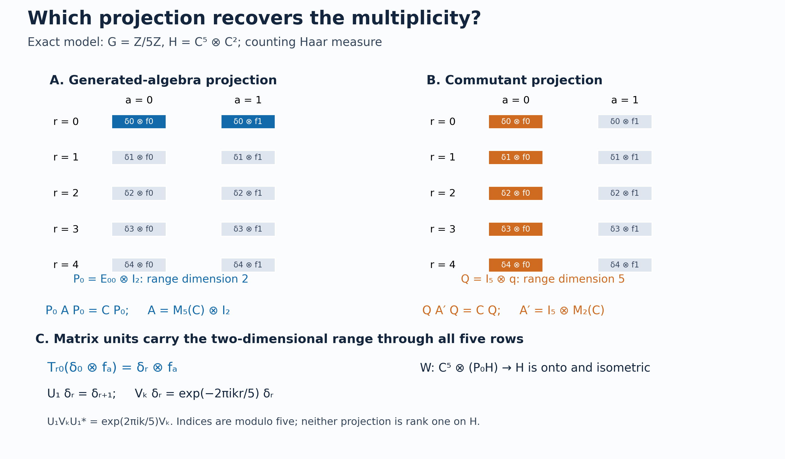

# Recovering multiplicity from a Weyl system

A Weyl relation controls how translations move frequency measurements. We first turn those measurements into a representation of continuous functions on the group. Compactly supported kernels then produce matrix units directly inside the given representation. The image of a rank-one compact projection is a minimal projection in the generated algebra. Its range recovers the multiplicity space, and the matrix units construct the required unitary.

The result applies to strongly continuous Weyl pairs over arbitrary locally compact abelian groups, under the explicit Fourier, C\* algebra and Hilbert-space prerequisites stated below. It does not by itself provide equivariant disintegration, induction from a closed subgroup, or crossed-product fixed-point recognition.

*Restored in Codex (OpenAI), 5 October 2026. Newly written original expression is dedicated under CC0 to the extent of rights held; earlier components retain their recorded terms. Human review is not asserted.*

## The Weyl pair and recognition statement

Let \(G\) be a locally compact Hausdorff abelian group, written additively, with a fixed nonzero left Haar measure \(dr\). Let \(H\ne0\) be a Hilbert space. Assume

$$U:G\longrightarrow\mathcal U(H),\qquad
V:\widehat G\longrightarrow\mathcal U(H)$$

are strongly continuous unitary representations and satisfy

$$U_sV_\chi U_s^*=\chi(s)V_\chi
\qquad(s\in G,\ \chi\in\widehat G). \tag{R1}$$

On \(L^2(G)\), put

$$[L_s\xi](r)=\xi(r-s),\qquad
[Q_\chi\xi](r)=\overline{\chi(r)}\xi(r). \tag{R2}$$

These conventions agree with the duality lesson. There is no second-countability, metrizability, sigma-compactness or separability assumption on either the group or the Hilbert space.

**Theorem.** There is a nonzero Hilbert space \(E\) and a unitary

$$W:L^2(G)\otimes E\longrightarrow H$$

such that

$$W(L_s\otimes1)W^*=U_s,\qquad
W(Q_\chi\otimes1)W^*=V_\chi. \tag{R3}$$

Moreover,

$$\{U_s,V_\chi:s\in G,\chi\in\widehat G\}''
=W\bigl(B(L^2(G))\otimes1_E\bigr)W^*, \tag{R4}$$

and the commutant is \(W(1\otimes B(E))W^*\). The Hilbert-space dimension of \(E\) is determined by the pair. In particular the pair is irreducible exactly when \(\dim E=1\).

If \(H=0\), take \(E=0\); the zero-space unitary gives the same recognition formulas. The nonzero hypothesis above is used only to choose a nonzero multiplicity projection and to discuss irreducibility. We prove the theorem through a slightly more general intermediate object: a nondegenerate covariant representation of \(C_0(G)\) and translation.

## The abelian spectral prerequisite

The earlier programme proves the needed foundations: [H1](OA-FLOW-HARMONIC.md#l138-h1) identifies the full group C\* algebra with continuous functions on the dual, [H3](OA-FLOW-HARMONIC-LATE.md#l138-h3) proves topological Pontryagin biduality, [CF6](OA-FLOW-CF.md#oa-flow.cf.6) proves the isometric commutative Gelfand theorem, [CF9](OA-FLOW-CF.md#oa-flow.cf.9) handles forced unitization, and [H0](OA-FLOW-TOPOLOGY.md#l138-h0) proves the locally compact Stone–Weierstrass and Hilbert tensor steps. [WY1](OA-FLOW-WY.md#wy-1) gives a full-group spectral construction from these same proofs. We retain the direct character argument below, followed later by a sign-explicit alternative through WY. Neither route uses a system-of-imprimitivity theorem.

**Lemma.** For every strongly continuous unitary representation \(V\) of \(\widehat G\) on an arbitrary Hilbert space, there is a unique nondegenerate star representation

$$\pi:C_0(G)\longrightarrow B(H)$$

whose extension to the multiplier algebra \(C_b(G)\) satisfies

$$\overline\pi(\overline\chi)=V_\chi
\qquad(\chi\in\widehat G). \tag{R5}$$

Here \(\overline\chi(r)=\overline{\chi(r)}\). Nondegeneracy means that the linear span of \(\pi(C_0(G))H\) is dense. For a net \(h_i\in C_c(G)\) with \(0\le h_i\le1\) and \(h_i=1\) eventually on each compact set,

$$\pi(h_i)\longrightarrow1\text{ strongly},\qquad
\overline\pi(b)=\operatorname*{s-lim}_i\pi(bh_i)
\quad(b\in C_b(G)). \tag{R6}$$

The commutants of \(\pi(C_0(G))\) and \(\{V_\chi:\chi\in\widehat G\}\) agree, and hence so do the von Neumann algebras they generate.

**Proof: integration and the uniform-norm bound.** Put \(\Gamma=\widehat G\), with Haar measure \(d\chi\). For \(a\in C_c(\Gamma)\), define on each \(v\in H\)

$$A_V(a)v=\int_\Gamma a(\chi)V_\chi v\,d\chi,\qquad
\mathcal F_-a(r)=\int_\Gamma a(\chi)\overline{\chi(r)}\,d\chi.
\tag{R5a}$$

The compact Hilbert-vector integral has norm at most \(\|a\|_1\|v\|\), so \(A_V\) extends by \(L^1\) approximation to a contraction \(L^1(\Gamma)\to B(H)\). Compact-support Fubini and Haar invariance prove

$$A_V(a*b)=A_V(a)A_V(b),\qquad
A_V(a^*)=A_V(a)^*,\qquad
a^*(\chi)=\overline{a(-\chi)}. \tag{R5b}$$

The convolution and operator bounds extend these identities from \(C_c\) to all \(L^1\). For nonnegative unit-mass \(a_j\in C_c(\Gamma)\) supported in shrinking identity neighborhoods, strong continuity gives

$$\|A_V(a_j)v-v\|
\le\sup_{\chi\in\operatorname{supp}a_j}\|V_\chi v-v\|
\longrightarrow0. \tag{R5c}$$

Thus the commutative C\* algebra \(B=\overline{A_V(L^1(\Gamma))}^{\,\|\cdot\|}\) acts nondegenerately on \(H\). If \(H=0\), the conclusions are immediate, so assume \(H\ne0\).

Every character \(\omega\) of \(B\) has a nonzero bounded star-multiplicative pullback \(\omega\circ A_V\) on \(L^1(\Gamma)\); a zero pullback would vanish on the dense image and hence on \(B\). Apply [L24's recovery theorem](OA-FLOW-L24.md#oa-flow.grp.recovery) to this one-dimensional nondegenerate star representation. Its recovered group operators are scalar unitaries, continuous in the scalar norm; its integrated value is therefore integration against a continuous unitary character of \(\Gamma\). [H3](OA-FLOW-HARMONIC-LATE.md#l138-h3) writes that character uniquely as \(\chi\mapsto\overline{\chi(r)}\) for some \(r\in G\); conjugation only changes \(r\) to \(-r\). For the possibly nonunital \(B\), use CF9's forced unitization \(B^+\): the scalar-quotient character vanishes on \(B\), while every other character restricts to a nonzero character of \(B\), and every such character extends by \(\omega(b+\lambda1)=\omega(b)+\lambda\). The CF6 norm formula on \(B^+\) thus gives precisely the supremum over the nonzero characters of \(B\). Consequently

$$\|A_V(a)\|
=\sup_{\omega\in\operatorname{Spec}B}|\omega(A_V(a))|
\le\|\mathcal F_-a\|_\infty. \tag{R5d}$$

This uses the commutative C\* theorem, including its nonunital form. It does not assert that every \(r\) occurs in the spectrum of this particular representation.

**Proof: dense Fourier functions and the extension.** Apply [H1](OA-FLOW-HARMONIC.md#l138-h1) to \(\Gamma\). Its negative transform on \(\widehat\Gamma\), evaluated at the bidual point \(j(r)(\chi)=\chi(r)\), is exactly \(\mathcal F_-a(r)\). The [H3](OA-FLOW-HARMONIC-LATE.md#l138-h3) homeomorphism therefore gives \(\mathcal F_-a\in C_0(G)\) at the full arbitrary-LCA scope. Convolution and the involution in (R5b) show that
\(\mathcal A=\mathcal F_-(L^1(\Gamma))\) is a self-adjoint subalgebra of \(C_0(G)\).

This algebra vanishes nowhere and separates points. For a fixed \(r\), choose nonnegative \(g\in C_c(\Gamma)\) with positive integral and put \(a(\chi)=\chi(r)g(\chi)\). Then \(\mathcal F_-a(r)=\int g>0\). For distinct \(r,t\), biduality gives a character \(\chi\) with \(\overline{\chi(r)}\ne\overline{\chi(t)}\). Write \(d(\chi)=\overline{\chi(r)}-\overline{\chi(t)}\). Choose such a nonnegative \(g\) supported in an open set on which \(d\ne0\), and put \(a=\overline d\,g\). Then

$$\mathcal F_-a(r)-\mathcal F_-a(t)
=\int_\Gamma g(\chi)|d(\chi)|^2\,d\chi>0.
\tag{R5e}$$

The existence and positivity of these compact tests are the stated Radon/Haar cutoff facts. Stone–Weierstrass now makes \(\mathcal A\) uniformly dense in \(C_0(G)\).

The bound (R5d) makes \(\pi(\mathcal F_-a)=A_V(a)\) well defined: equal Fourier functions have equal images by applying the bound to their difference. It extends uniquely to a contractive star representation of \(C_0(G)\). Equation (R5c) proves nondegeneracy, since the range span of \(\pi(C_0(G))\) contains \(A_V(a_j)H\).

To obtain its multiplier extension, first note that \(h_i f\to f\) uniformly for \(f\in C_0(G)\): control \(f\)'s tail outside a compact set and use the eventual equality on that set. Consequently \(\pi(h_i)\to1\) strongly on the dense span of \(\pi(f)H\), and then on \(H\) by the uniform contraction bound. For \(b\in C_b(G)\), the uniformly bounded \(\pi(bh_i)\) converge on every vector \(\pi(f)v\) to \(\pi(bf)v\). They therefore converge strongly on all \(H\), defining \(\overline\pi(b)\) in (R6). On those dense vectors the identities for multiplication and adjoints follow from those for \(\pi\), or, for adjoints, by pairing two such vectors. Thus this is the unique unital star extension with
\(\overline\pi(b)\pi(f)=\pi(bf)\).

For \(\chi_0\in\Gamma\), let \((\tau_{\chi_0}a)(\chi)=a(\chi-\chi_0)\). The two integrals in (R5a) give

$$V_{\chi_0}A_V(a)=A_V(\tau_{\chi_0}a),\qquad
\mathcal F_-(\tau_{\chi_0}a)
=\overline{\chi_0}\,\mathcal F_-a. \tag{R5f}$$

Uniform density therefore gives
\(V_{\chi_0}\pi(f)=\pi(\overline{\chi_0}f)\) for every \(f\in C_0(G)\). Nondegeneracy identifies \(V_{\chi_0}\) with \(\overline\pi(\overline{\chi_0})\), proving (R5).

**Proof: uniqueness and the commutant.** Suppose \(\pi'\) is another nondegenerate star representation satisfying (R5). For fixed \(f\in C_0(G)\), the map
\(\chi\mapsto\overline\chi f\) is norm continuous into \(C_0(G)\): the compact-open topology gives uniform character convergence on a compact set, while the \(C_0\) tail of \(f\) bounds the difference by \(2|f|\) off that set. Thus, for \(a\in C_c(\Gamma)\), there is a norm integral in \(C_0(G)\) and

$$\begin{aligned}
\pi'(\mathcal F_-a)\pi'(f)
&=\pi'\!\left(\int_\Gamma a(\chi)\overline\chi f\,d\chi\right)\\
&=\int_\Gamma a(\chi)V_\chi\pi'(f)\,d\chi
=A_V(a)\pi'(f).
\end{aligned}\tag{R5g}$$

In the second line, passage through the bounded linear map \(\pi'\) is justified by the \(C_0\) norm integral; its operator value agrees with the integral on each fixed Hilbert vector. No norm integral of the bare characters in \(C_b(G)\) is used. Density of \(\pi'(C_0(G))H\) gives \(\pi'(\mathcal F_-a)=A_V(a)\). Extend first by the \(L^1\) bounds, then by the uniform density of \(\mathcal A\), to conclude \(\pi'=\pi\).

An operator commuting with every \(V_\chi\) commutes with all the fixed-vector integrals \(A_V(a)\), hence with \(\pi(C_0(G))\) by norm density. Conversely, an operator commuting with \(\pi(C_0(G))\) commutes with the bounded strong limits in (R6), in particular all \(V_\chi\). The commutants agree, and the bicommutant theorem gives the generated-algebra assertion. This completes the spectral representation proof at arbitrary LCA and Hilbert-space scope. \(\square\)

The rest of the recognition proof begins with this \(\pi\). Its Fourier prerequisites are independent of the recognition theorem, so this step does not use the result it is about to prove.

## Integration and finite-matrix prerequisites

We use Radon Haar integration on compact sets, positivity on nonempty open sets, continuous cutoffs on a locally compact Hausdorff space, and the density of \(C_c(G)\) in \(L^2(G)\). Compact-support approximate identities \(\varphi_j\ge0\), \(\int\varphi_j=1\), can have supports tending to zero through neighborhoods. Left translation is strongly continuous on \(L^2(G)\). Since \(G\) is abelian, inversion and translation preserve Haar measure. These facts are proved in [HR3–9](OA-FLOW-HR.md#hr-03), [H0](OA-FLOW-TOPOLOGY.md#l138-h0), and [L24's Haar convention and translations](OA-FLOW-L24.md#oa-flow.grp.haarconventions). For finite exponents, the locally determined and Radon conventions have the same sigma compact carriers and null classes; L24 proves this without assuming the whole group sigma compact.

The compact-support continuous scalar and Hilbert-vector integrals below use [HR5's qualified Radon product theorem](OA-FLOW-HR.md#hr-05) and [L24's complete vector-integration construction](OA-FLOW-L24.md#oa-flow.grp.vectorintegration). Finite-dimensional uniform approximation of compact vector ranges justifies the vector integral identities under these proved prerequisites. No equality of an uncompleted product Borel sigma-algebra with the topological product Borel sigma-algebra is presumed.

The scalar approximation input is the complex Stone–Weierstrass theorem on compact Hausdorff spaces. We also use elementary Hilbert tensor products, completion of an isometry defined on a dense subspace, the bicommutant theorem, and finite matrix positivity. A nondegenerate star representation of \(C_0(G)\) is contractive. The existence of a positive square root for a positive finite scalar matrix will provide the operator-norm estimate needed later; no universal crossed-product norm is assumed. The actual proofs are [H0](OA-FLOW-TOPOLOGY.md#l138-h0), [CF5–8](OA-FLOW-CF.md#oa-flow.cf.5), [CF10](OA-FLOW-CF.md#oa-flow.cf.10), and [BD1](OA-FLOW-BD.md#oa-flow.bd.1).

For a compactly supported, norm-continuous map \(t\mapsto k_t\in C_0(G)\), define

$$I(k)v=\int_G\pi(k_t)U_t v\,dt,\qquad
\|I(k)\|\le\int_G\|k_t\|_\infty\,dt. \tag{R7}$$

For each fixed vector the integrand is continuous with compact support, so (R7) is a Hilbert-vector integral. Uniform boundedness of the displayed estimate defines the operator on all \(H\). It does not require norm continuity of \(t\mapsto U_t\).

## From characters to continuous functions

Write \((\tau_s h)(r)=h(r-s)\).

**Lemma.** The spectral representation from (R5) satisfies

$$U_s\pi(h)U_s^*=\pi(\tau_s h)
\qquad(s\in G,\ h\in C_0(G)). \tag{R8}$$

**Proof.** For fixed \(s\), both sides of (R8), viewed as functions of \(h\), are nondegenerate star representations of \(C_0(G)\). Their multiplier values at \(\overline\chi\) agree, because

$$U_sV_\chi U_s^*=\chi(s)V_\chi,\qquad
\tau_s(\overline\chi)=\chi(s)\overline\chi.$$

The uniqueness clause just proved gives (R8). \(\square\)

From this point until the final return to \(V\), only nondegeneracy, (R8), and strong continuity of \(U\) are used. Thus those hypotheses alone imply the corresponding multiplicity statement for \((\pi,U)\).

## Rank-one operators from compact kernels

For \(\xi,\eta\in C_c(G)\), set

$$k^{\xi,\eta}_t(r)=\xi(r)\overline{\eta(r-t)},\qquad
T_{\xi,\eta}=I(k^{\xi,\eta}). \tag{R9}$$

The function \((r,t)\mapsto k^{\xi,\eta}_t(r)\) is continuous and has compact support, since its support is contained in the image of
\(\operatorname{supp}\xi\times\operatorname{supp}\eta\) under \((r,v)\mapsto(r,r-v)\).
It follows that \(t\mapsto k^{\xi,\eta}_t\) is norm continuous into \(C_0(G)\): on a fixed compact set of possible \(r\)'s, continuity and a finite-subcover argument give uniform continuity with respect to a moving \(t\) at each fixed \(t_0\); outside that compact set the functions vanish. Its \(t\)-support is compact. Thus (R7) applies.

Our inner products are linear in the first variable. For the canonical pair \((M_h,L_t)\), a change of variable \(v=r-t\) gives

$$[T_{\xi,\eta}f](r)
=\int_G\xi(r)\overline{\eta(r-t)}f(r-t)\,dt
=\langle f,\eta\rangle\xi(r). \tag{R10}$$

The following identities hold in every covariant pair:

$$T_{\xi,\eta}^*=T_{\eta,\xi},\qquad
T_{\xi,\eta}T_{\zeta,\omega}
=\langle\zeta,\eta\rangle T_{\xi,\omega}. \tag{R11}$$

**Proof.** Covariance and compact-support Fubini give the product rule

$$I(k)I(l)=I(k*l),\qquad
(k*l)_q(r)=\int_G k_t(r)l_{q-t}(r-t)\,dt. \tag{R12}$$

Indeed \(\pi(k_t)U_t\pi(l_v)U_v
=\pi(k_t\tau_t(l_v))U_{t+v}\); set \(q=t+v\) in the double integral. These operations can first be checked between two vectors, with the scalar integrand bounded and supported on a compact set, and then identified as bounded operators by (R7).

For the kernels in (R9), the integral in (R12) is

$$\xi(r)\overline{\omega(r-q)}
\int_G\overline{\eta(r-t)}\zeta(r-t)\,dt
=\langle\zeta,\eta\rangle k^{\xi,\omega}_q(r).$$

The adjoint rule is \(I(k)^*=I(k^\star)\), where

$$k^\star_t(r)=\overline{k_{-t}(r-t)}.$$

It follows by writing \(U_{-t}\pi(\overline{k_t})\), moving the coefficient to the left with (R8), and changing \(t\) to \(-t\). For (R9), this is \(k^{\eta,\xi}\). The identities (R11) follow. \(\square\)

Two more identities will identify the generators:

$$\pi(h)T_{\xi,\eta}=T_{h\xi,\eta},\qquad
U_sT_{\xi,\eta}=T_{L_s\xi,\eta}. \tag{R13}$$

The first follows by multiplication of \(k_t(r)\) by \(h(r)\). For the second, put \(q=s+t\); the translated kernel becomes

$$\tau_s(k^{\xi,\eta}_{q-s})(r)
=\xi(r-s)\overline{\eta(r-q)},$$

which is \(k^{L_s\xi,\eta}_q(r)\). This proves both formulas, including their factor order.

## The compact-operator norm estimate

Write \(\theta_{\xi,\eta}f=\langle f,\eta\rangle\xi\) on \(L^2(G)\). The finite linear span

$$\mathcal F_c=\operatorname{span}\{\theta_{\xi,\eta}:\xi,\eta\in C_c(G)\}$$

is a star algebra of finite-rank operators. Define on these generators

$$\rho(\theta_{\xi,\eta})=T_{\xi,\eta}. \tag{R14}$$

**Lemma.** This defines a contractive star homomorphism \(\mathcal F_c\to B(H)\), which extends uniquely to a star homomorphism

$$\rho:\mathcal K(L^2(G))\longrightarrow B(H). \tag{R15}$$

**Proof.** For a finite collection of \(\xi\)'s and \(\eta\)'s, take an orthonormal basis \(e_1,\ldots,e_n\) of their finite-dimensional span. Gram–Schmidt uses finite linear combinations, so every \(e_i\) is still in \(C_c(G)\). Expressing both \(\theta_{\xi,\eta}\) and \(T_{\xi,\eta}\) in that basis is sesquilinear in the same variables. A linear relation between the finite-rank operators has zero scalar matrix in this basis and hence gives a zero relation between the \(T\)'s. Thus (R14) is well defined. Equations (R11) prove the star and multiplication laws.

Put \(E_{ij}=T_{e_i,e_j}\) and \(P=\sum_iE_{ii}\). The matrix-unit relations give \(P=P^*=P^2\). For a scalar matrix \(a=(a_{ij})\), put \(\rho_n(a)=\sum a_{ij}E_{ij}\). If \(a\ge0\), write \(a=b^*b\); then \(\rho_n(a)=\rho_n(b)^*\rho_n(b)\ge0\). Apply this to \(\|a\|^2 1-a^*a\) to obtain

$$\rho_n(a)^*\rho_n(a)\le\|a\|^2P\le\|a\|^2 1.$$

Consequently \(\|\rho_n(a)\|\le\|a\|\), which is the desired bound for every element of \(\mathcal F_c\).

The density of \(C_c(G)\) in \(L^2(G)\), together with
\(\|\theta_{\xi,\eta}\|\le\|\xi\|\,\|\eta\|\), shows that \(\mathcal F_c\) is norm dense in the compact operators. Extend by the proved contraction estimate; continuity of multiplication and adjoints preserves the star homomorphism laws. \(\square\)

This proof allows arbitrary Hilbert dimension. Every norm estimate took place in a finite scalar matrix algebra before completion.

## Compact kernels reach the whole representation

**Lemma.** The closed span of \(\rho(\mathcal K(L^2(G)))H\) is \(H\).

**Proof.** Let \(L\) denote that closed span. Fix \(h,\varphi\in C_c(G)\). The operator \(\pi(h)U(\varphi)\), where \(U(\varphi)=\int\varphi(t)U_t\,dt\), is \(I(k)\) for \(k_t(r)=h(r)\varphi(t)\). In coordinates \(v=r-t\), its scalar kernel is

$$F(r,v)=h(r)\varphi(r-v), \tag{R16}$$

a compactly supported continuous function on \(G\times G\).

We spell out the approximation needed here. Choose \(a,b\in C_c(G)\), valued in \([0,1]\), equal to one on the two coordinate projections of \(\operatorname{supp}F\). Put \(A=\operatorname{supp}a\) and \(B=\operatorname{supp}b\). By Stone–Weierstrass on \(A\times B\), finite sums of products of restrictions of compactly supported continuous functions approximate \(F\) uniformly there. These products separate points and contain the constant function on this compact set, because a compact set has a compactly supported cutoff equal to one on it. Multiply the approximating sums by \(a(r)b(v)\). Since \(abF=F\), the resulting functions have the form

$$F_n(r,v)=\sum_j\xi_{nj}(r)\overline{\eta_{nj}(v)},$$

are supported in the fixed compact set \(A\times B\), and converge uniformly to \(F\) on all \(G\times G\).

Return to \(k_t(r)=F(r,r-t)\). The approximating coefficient functions
\(k_{n,t}(r)=F_n(r,r-t)\) and \(k\) vanish for \(t\notin A-B\). Hence

$$\int_G\|k_{n,t}-k_t\|_\infty\,dt
\le \mu(A-B)\,\|F_n-F\|_\infty\longrightarrow0. \tag{R17}$$

The compact set \(A-B\) has finite Haar measure. Formula (R7) now gives

$$\pi(h)U(\varphi)
=\lim_n\sum_jT_{\xi_{nj},\eta_{nj}}$$

in operator norm. Its range is contained in \(L\).

For an approximate identity \(\varphi_j\) supported near zero, strong continuity of \(U\) gives \(U(\varphi_j)\to1\) strongly: for each \(v\),
\(\|U(\varphi_j)v-v\|\le\sup_{t\in\operatorname{supp}\varphi_j}\|U_tv-v\|\).
Thus \(\pi(h)H\subset L\). Nondegeneracy of \(\pi\), and the norm density of \(C_c(G)\) in \(C_0(G)\), imply \(L=H\). \(\square\)

The same proof shows that the von Neumann algebra generated by \(\rho(\mathcal K)\) is the one generated by \(\pi(C_0(G))\) and \(U(G)\). One containment follows from (R7). For the other, the norm limit above and then the strong limit in \(\varphi_j\) place every \(\pi(h)\) in \(\rho(\mathcal K)''\). A cutoff net \(h_i\) with \(\pi(h_i)\to1\) puts every \(U(\varphi)\) there as well. Approximate identities translated to \(s\) give \(U_s\) as strong limits of such operators.

## Building the multiplicity unitary

Choose \(e_0\in C_c(G)\) with \(\|e_0\|_2=1\), and put

$$P_0=T_{e_0,e_0},\qquad E=P_0H. \tag{R18}$$

The identities (R11) make \(P_0\) an orthogonal projection. It is nonzero. Indeed, if \(P_0=0\), then
\(T_{\xi,e_0}^*T_{\xi,e_0}=\|\xi\|_2^2P_0=0\), so \(T_{\xi,e_0}=0\). Factoring
\(T_{\xi,\eta}=T_{\xi,e_0}T_{e_0,\eta}\) would then make every \(T\) zero, contradicting the preceding nondegeneracy lemma and \(H\ne0\).

For \(\xi\in C_c(G)\) and \(e\in E\), define

$$W(\xi\otimes e)=T_{\xi,e_0}e. \tag{R19}$$

For \(\xi,\zeta\in C_c(G)\) and \(e,f\in E\), the matrix-unit relations give

$$\langle T_{\xi,e_0}e,T_{\zeta,e_0}f\rangle
=\langle\xi,\zeta\rangle\langle e,f\rangle. \tag{R20}$$

Therefore (R19), extended linearly to finite sums, is an isometry on the algebraic tensor product and extends to \(L^2(G)\otimes E\).

Its range is all \(H\). Every vector \(T_{\xi,\eta}v\) can be written

$$T_{\xi,\eta}v=T_{\xi,e_0}(T_{e_0,\eta}v),$$

and \(T_{e_0,\eta}v\in E\), because \(P_0T_{e_0,\eta}=T_{e_0,\eta}\). The range of the extended isometry is closed and contains a dense set by nondegeneracy, proving surjectivity.

Equations (R13) imply

$$\pi(h)W=W(M_h\otimes1),\qquad
U_sW=W(L_s\otimes1). \tag{R21}$$

Using (R6) with \(b=\overline\chi\) gives the second family \(V_\chi W=W(Q_\chi\otimes1)\). This proves (R3).

Under \(W\), every \(T_{\xi,\eta}\) becomes \(\theta_{\xi,\eta}\otimes1\). The compact operators generate \(B(L^2(G))\): an operator commuting with all rank-one operators is scalar, and [BD1](OA-FLOW-BD.md#oa-flow.bd.1)'s bicommutant theorem gives the assertion. Combining the preceding generated-algebra identity with the spectral lemma's proved commutant identity proves (R4). For the tensor commutant, [NCF1](OA-FLOW-NCF.md#ncf-1) applied to the scalar algebra on \(E\) gives \((B(E)\otimes1_L)'=1_E\otimes B(L)\), where \(L=L^2(G)\). The flip unitary is isometric on elementary tensors by their inner products and onto by density. Flipping and taking commutants therefore yields \((B(L)\otimes1_E)'=1_L\otimes B(E)\). This proves the tensor assertion for arbitrary \(L,E\).

Finally, \(P_0\) becomes \(\theta_{e_0,e_0}\otimes1_E\), so its range has dimension \(\dim E\). Every unitary equivalence of Weyl pairs intertwines their spectral representations by uniqueness, hence their \(T\)'s and \(P_0\)'s. This proves uniqueness of the multiplicity dimension. All arguments use arbitrary Hilbert spaces and nets where needed. \(\square\)

## Finite clocks and infinite translations

For \(G=\mathbb Z/5\mathbb Z\) with counting measure, let \(H=\mathbb C^5\otimes\mathbb C^2\), with basis vectors \(\delta_r\) in the first factor. Put

$$U_s(\delta_r\otimes e)=\delta_{r+s}\otimes e,\qquad
V_k(\delta_r\otimes e)=e^{-2\pi i kr/5}\delta_r\otimes e.$$

The character is \(\chi_k(s)=e^{2\pi i ks/5}\), and the pair obeys (R1). Its compact-kernel operator is

$$T_{\delta_r,\delta_v}=\pi(1_{\{r\}})U_{r-v}
=\theta_{\delta_r,\delta_v}\otimes1_{\mathbb C^2}. \tag{R22}$$

Thus \(P_0\) for \(e_0=\delta_0\) has a two-dimensional range. The joint generated algebra is \(M_5(\mathbb C)\otimes1\), with commutant \(1\otimes M_2(\mathbb C)\).

For \(G=\mathbb Z\), the dual group is the circle. On \(\ell^2(\mathbb Z)\),

$$U_s\delta_n=\delta_{n+s},\qquad V_z\delta_n=z^{-n}\delta_n.$$

This pair is irreducible by the theorem. There is no nonzero finite-dimensional Weyl pair for these full groups: on a \(d\)-dimensional space the relation for \(s=1\) would give
\(\det(U_1V_zU_1^*)=\det(zV_z)=z^d\det(V_z)\), so \(z^d=1\) for every \(z\in\mathbb T\), impossible when \(d>0\).

For \(G=\mathbb R\), the normalized tent

$$e_a(r)=\sqrt{\frac{3}{2a}}\left(1-\frac{|r|}{a}\right)_+
\qquad(a>0)$$

has \(L^2\) norm one. In a canonical pair with multiplicity \(E\), the operator \(T_{e_a,e_a}\) projects onto \(e_a\otimes E\). Changing \(a\) changes the particular range subspace while preserving its Hilbert dimension.

## Problems with complete solutions

### A. Determine the correct projection for multiplicity

In the finite model (R22), compare a minimal projection in the generated algebra with a minimal projection in its commutant.

**Solution.** A minimal projection of \(M_5(\mathbb C)\otimes1_{\mathbb C^2}\) is \(p\otimes1\), with \(p\) rank one on \(\mathbb C^5\). Its range has dimension two, the multiplicity. A minimal projection of \(1\otimes M_2(\mathbb C)\) is \(1\otimes q\), with \(q\) rank one. Its range has dimension five. The projection in (R18) belongs to the generated algebra and recovers the correct factor.

### B. Track Haar rescaling

Replace Haar measure \(dr\) by \(c\,dr\), where \(c>0\), without changing \((\pi,U)\). Relate the projection used to construct \(E\).

**Solution.** The unit vector becomes \(e_0^{(c)}=c^{-1/2}e_0\). Its kernel in (R9) is multiplied by \(c^{-1}\), while the integral defining \(T\) is multiplied by \(c\). Thus \(P_0^{(c)}=P_0\), so the recovered \(E\) is unchanged. The unitary \(L^2(G,c\,dr)\to L^2(G,dr)\) is \(\xi\mapsto c^{1/2}\xi\). This accounts for the change of normalization without choosing a Haar measure on the dual group.

### C. Why finite-rank relations are enough

Suppose two finite sums of rank-one operators with vectors in \(C_c(G)\) define the same operator on \(L^2(G)\). Explain why they define the same operator under (R14), even before its norm bound is proved.

**Solution.** Take the finite-dimensional span of every vector appearing in both sums. Gram–Schmidt provides an orthonormal basis inside \(C_c(G)\). Rewrite both sums as matrices in that basis. Their difference acts as zero on each basis vector, so every scalar matrix entry vanishes. Sesquilinearity rewrites the corresponding difference of the \(T\)'s using those same zero coefficients. The conclusion is algebraic; the later contraction estimate is used only for completion.

### D. Remove nondegeneracy from the intermediate covariant pair

For a possibly degenerate representation \(\pi:C_0(G)\to B(H)\) satisfying (R8), identify the portion where the proof applies.

**Solution.** Let \(H_{\rm ess}=\overline{\pi(C_0(G))H}\). It reduces \(\pi\), and \(\pi\) vanishes on its orthogonal complement. Covariance implies that \(U_sH_{\rm ess}=H_{\rm ess}\), so this subspace also reduces \(U\). The restricted pair is nondegenerate and has the multiplicity form proved above. On \(H_{\rm ess}^\perp\), \(U\) can be any strongly continuous representation while all \(T_{\xi,\eta}\) vanish. This explains the exact role of nondegeneracy in (R17). A Weyl pair obtained from the abelian spectral theorem has \(H_{\rm ess}=H\).

### E. Recover a finite-dimensional divisibility condition

For \(G=\mathbb Z/5\mathbb Z\), determine the possible positive finite dimensions of a Weyl pair and verify necessity directly.

**Solution.** The theorem gives \(\dim H=5\dim E\), and each positive multiple of five occurs by tensoring the canonical pair with a finite-dimensional multiplicity space. Directly, apply determinants to \(U_1V_1U_1^*=\omega V_1\), where \(\omega=e^{2\pi i/5}\). Since \(V_1\) is invertible, the determinant identity gives \(\omega^{\dim H}=1\), so five divides \(\dim H\).

## Reference and scope of recognition

The same results are treated in Takesaki, [*Theory of Operator Algebras II*](https://doi.org/10.1007/978-3-662-10451-4), X.2, Definition 2.1 and Proposition 2.2, printed pp257–259. Its conjugated character convention agrees with (R1)–(R2). The proof above retains the explicit spectral construction, compact-kernel algebra, finite-matrix norm bound, nondegeneracy argument and onto tensor map. A complementary rank-one/module perspective is Rieffel's freely available [*Induced representations of C\*-algebras*](https://math.berkeley.edu/~rieffel/papers/rieffel-C-induced.pdf), printed pp231–232 and239–240. The earlier [WY2–5](OA-FLOW-WY.md#wy-2) develops that perspective with complete local proofs; its alternative is retained below. No external equivalence theorem supplies a missing local argument.

The end of the native proof on p259 takes the range of a minimal projection in the commutant as the multiplicity factor. That factor is incorrect in general. In (R22), a minimal commutant projection has range dimension five; tensoring that range with \(\mathbb C^5\) would give dimension twenty-five instead of the actual ten. A minimal projection in the generated algebra has the required two-dimensional range. The projection (R18) uses this corrected algebra, and Problem A checks both choices explicitly.

This Hilbert-space recognition theorem complements normal double-duality constructions. The [NR3–4](OA-FLOW-NR.md#oa-flow.nr.3) proofs concern faithful normal maps between concrete regular von Neumann crossed products and their full normal inverses. Here the original data are two strongly continuous unitary representations, and the recovered \(C_0(G)\) representation is a C\* representation; no normal representation of a specified \(L^\infty\) algebra has been postulated. This theorem does not recognize a general dual system as a crossed product, prove integrability or dual-weight characterizations, or supply induced-system and equivariant-disintegration theorems. Those are separate obligations. Every foundational assertion used above has the stated earlier proof.

## Reading the projection and retaining the second route

The range of \(P_0\) measures multiplicity because it is minimal in the generated algebra, not because it is rank one on \(H\). Indeed \(W^*P_0W=\theta_{e_0,e_0}\otimes1_E\), and compression of \(B(L)\otimes1_E\) by this projection is \(\mathbb C(\theta_{e_0,e_0}\otimes1_E)\): every compression of \(b\in B(L)\) is \(\langle be_0,e_0\rangle\theta_{e_0,e_0}\). Thus \(P_0\mathcal A P_0=\mathbb CP_0\). A nonzero subprojection \(q\leq P_0\) in \(\mathcal A\) equals its compression, hence is a scalar multiple of \(P_0\); the projection equation forces that scalar to be one. This proves minimality. In the commutant, the projection \(1_L\otimes q\) onto any proper nonzero closed subspace of \(E\) reduces both unitary groups. If \(\dim E=1\), (R4) gives only scalar reducing projections. A closed invariant subspace for both groups reduces them because all inverses are in the groups, so irreducibility is exactly \(\dim E=1\).

There is an independent existing programme route to the same recognition. [WY1–4](OA-FLOW-WY.md#wy-1) constructs an onto unitary \(W_+:L^2(G)\otimes E_+\to H\) with model operators

\[
 (\rho_s\xi)(r)=\xi(r+s),\qquad (M_\chi\xi)(r)=\chi(r)\xi(r).
 \tag{R23}
\]
These are positive-character coordinates. Haar inversion preserves measure for abelian \(G\), so \(J\xi(r)=\xi(-r)\) is an onto selfadjoint unitary on the complete Haar \(L^2(G)\) space. Direct evaluation gives

\[
 J\rho_sJ=L_s,\qquad JM_\chi J=Q_\chi.
 \tag{R24}
\]
Consequently \(W_+(J\otimes1)\) gives exactly (R3), with the original \(s,\chi\) unchanged. The [WY2](OA-FLOW-WY.md#wy-2) proof uses the full integrated coefficient algebra and its partition-independent finite-corner estimate; the proof in this chapter instead retains the direct \(C_c\) kernel algebra, its scalar finite-matrix norm proof and fixed-compact uniform approximation. Neither argument is discarded or silently identified with the other.

[WY5](OA-FLOW-WY.md#wy-5) also gives all bounded simultaneous intertwiners. For completeness its short matrix-unit argument works directly in this chapter's signs. Between models \(L\otimes E\) and \(L\otimes F\), integration and the spectral uniqueness lemma make a simultaneous intertwiner \(C\) intertwine all \(\theta_{\xi,\eta}\otimes1\). The projection \(\theta_{e_0,e_0}\) therefore gives

\[
 C(e_0\otimes e)=e_0\otimes ce,\qquad c\in B(E,F),\quad
 \|c\|\leq\|C\|.
 \tag{R25}
\]
Commuting \(\theta_{\xi,e_0}\) across \(C\) gives \(C(\xi\otimes e)=\xi\otimes ce\). Density gives \(C=1_L\otimes c\) on the full tensor product. Conversely every such tensor operator is bounded by the Hilbert tensor estimate and intertwines both groups by their formulas. Thus simultaneous unitary equivalence is precisely unitary equivalence of multiplicity spaces, including \(E=0\) or \(F=0\). This strengthens the dimension check without adding any normal crossed-product recognition assumption.

## Multiplicity is the range of a minimal generated-algebra projection

This is the exact finite model in [R22](OA-FLOW-WRC.md#equation-r22) and [Problem A](OA-FLOW-WRC.md#wr-exercises): \(G=\mathbb Z/5\mathbb Z\), counting Haar measure, \(L=\mathbb C^5\), \(E=\mathbb C^2\), \(H=L\otimes E\). The five characters are \(\chi_k(r)=\omega^{kr}\), \(\omega=e^{2\pi i/5}\). Paired dual Haar measure assigns mass \(1/5\) to each character. The displayed coordinates are \(\delta_r\otimes f_a\), \(r\in\{0,\ldots,4\}\), \(a\in\{0,1\}\). The labels refer to vectors, not points of a ten-element group.

The unitary actions have the chapter's original signs:
\[
 U_s(\delta_r\otimes f_a)=\delta_{r+s}\otimes f_a,\qquad
 V_k(\delta_r\otimes f_a)=\omega^{-kr}\delta_r\otimes f_a.
\]
All group indices are modulo five. Applying \(U_sV_kU_s^*\) to the basis vector gives \(\omega^{-k(r-s)}=\omega^{ks}\omega^{-kr}\), so the Weyl scalar is exactly \(\chi_k(s)=\omega^{ks}\).

The spectral selectors and matrix units are
\[
 P_r=\frac15\sum_{k=0}^4\omega^{kr}V_k=E_{rr}\otimes I_2,\qquad
 T_{rv}=P_rU_{r-v}=E_{rv}\otimes I_2.
\]
The selector identity follows from the finite geometric sum: \(\sum_{k=0}^4z^k=5\) for \(z=1\), and is zero for any other fifth root because multiplication by \(1-z\) gives \(1-z^5=0\). For the second identity, \(U_{r-v}\) moves row \(v\) to \(r\), while \(P_r\) kills every other input row. Thus \(T_{rv}T_{zw}=\delta_{vz}T_{rw}\) and \(T_{rv}^*=T_{vr}\).

These matrix units generate \(\mathcal A=M_5(\mathbb C)\otimes I_2\). Its commutant is \(I_5\otimes M_2(\mathbb C)\), by the actual full tensor proof used in [R4](OA-FLOW-WRC.md#equation-r4). Panel A shades \(P_0H=\operatorname{span}\{\delta_0\otimes f_0,\delta_0\otimes f_1\}\), whose dimension is two. Compression of every \(b\otimes I_2\) by \(P_0\) is \(\langle b\delta_0,\delta_0\rangle P_0\). This proves \(P_0\mathcal A P_0=\mathbb CP_0\) and minimality in \(\mathcal A\), while its rank on \(H\) is two.

Panel B instead shades \(QH=L\otimes\mathbb Cf_0\), where \(Q=I_5\otimes q\) and \(q\) projects onto \(\mathbb Cf_0\). Its dimension is five. Compression of \(I_5\otimes c\) gives \(\langle cf_0,f_0\rangle Q\), so \(Q\) is minimal in \(\mathcal A'\). The two panels shade projections in different algebras; neither projection is rank one on \(H\).

Panel C is the exact onto map
\[
 W\bigl(\delta_r\otimes(\delta_0\otimes f_a)\bigr)
       =T_{r0}(\delta_0\otimes f_a)=\delta_r\otimes f_a.
\]
It sends an orthonormal basis to an orthonormal basis. Hence it is isometric and onto. [R19–R21](OA-FLOW-WRC.md#equation-r19) prove the corresponding map on arbitrary Hilbert spaces by inner products, finite-rank density and closed range; the finite figure does not replace that proof.

The [original renderer](../assets/weyl-recognition/figure_recognition.py) checks all 625 matrix-unit products, all 25 kernel identities and all five \(U_1,V_k\) Weyl identities. The [stored data](../assets/weyl-recognition/assets/weyl-recognition-data.json) contains the exact dimensions and supplementary floating-point residuals. The finite geometric-sum argument above is exact. PNG, SVG and data reproduce byte for byte. Diagram, caption and code are original CC0 expression.

Human-source comparisons are Takesaki, [*Theory of Operator Algebras II*](https://doi.org/10.1007/978-3-662-10451-4), X.2, Proposition 2.2, printed257–259, and Rieffel, [*Induced representations of C\*-algebras*](https://math.berkeley.edu/~rieffel/papers/rieffel-C-induced.pdf), printed231–232 and239–240. The two different projection ranges and all coordinate formulas are proved locally above.
