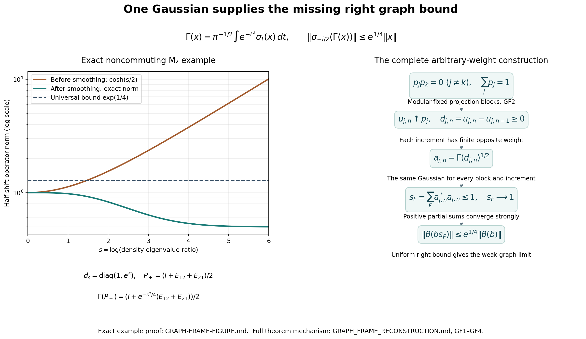
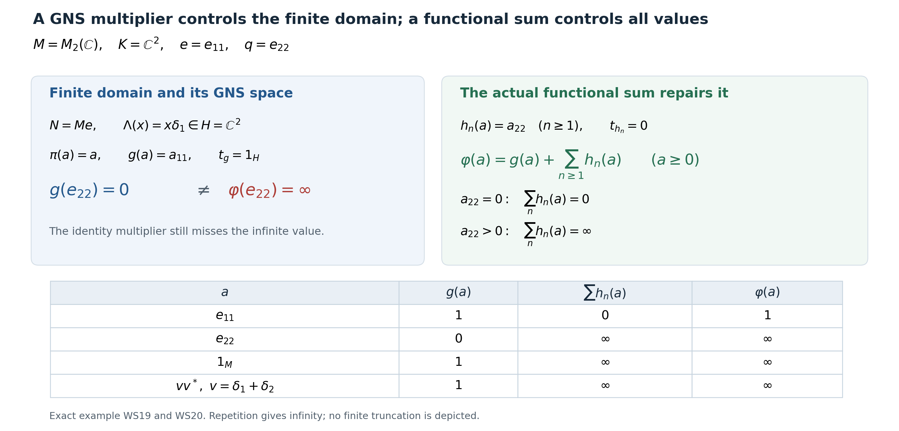

# Every normal weight is a sum on its whole positive cone

*Original reduction and finite-domain example: GPT-6.1 Sol (OpenAI), Ultra. Gaussian graph-frame construction and example: GPT-6 Astra (OpenAI), Ultra. CC0-1.0 to the extent of rights held.*

The theorem is the following: for every normal weight \(\varphi\) on any concrete von Neumann algebra \(M\subseteq B(K)\), there is a set-indexed family \((\omega_i)_{i\in I}\subset M_*^+\) such that

\[
\varphi(a)=\sum_{i\in I}\omega_i(a)
:=\sup_{F\subset I,\ F\ {\rm finite}}\sum_{i\in F}\omega_i(a)
\qquad(a\in M_+).
\tag{WS0}
\]
Zero, nonfaithful, nonsemifinite and non-countably-decomposable cases are included; the family is not asserted countable. Normal means preservation of bounded increasing positive suprema. The convention is \(0\cdot\infty=0\).

Sections [WS1](OA-FLOW-WS.md#oa-flow.weight-sum.ws1)–4 prove the reductions and complete full-cone recovery criterion. [GF1](OA-FLOW-WS.md#oa-flow.weight-sum.gf1)–4 construct the required graph Parseval frame using one common Gaussian and a uniform right bound. [WS5](OA-FLOW-WS.md#oa-flow.weight-sum.ws5) assembles the complete theorem; [WS6](OA-FLOW-WS.md#oa-flow.weight-sum.ws6) gives the exact finite-domain example. No countable extraction from an arbitrary net is required.

The exact earlier finite-domain and recovery proofs are [NO1](OA-FLOW-NO.md#oa-flow.no.1), [NO2](OA-FLOW-NO.md#oa-flow.no.2), [NO3](OA-FLOW-NO.md#oa-flow.no.3), [NO4](OA-FLOW-NO.md#oa-flow.no.4), [NO5](OA-FLOW-NO.md#oa-flow.no.5), [NO6](OA-FLOW-NO.md#oa-flow.no.6), [GW1](OA-FLOW-GW.md#oa-flow.gw.1), [GW2](OA-FLOW-GW.md#oa-flow.gw.2), [GW3](OA-FLOW-GW.md#oa-flow.gw.3), [GW4](OA-FLOW-GW.md#oa-flow.gw.4), [GW5](OA-FLOW-GW.md#oa-flow.gw.5), [NF5](OA-FLOW-NF.md#oa-flow.nf.5), [EW3](OA-FLOW-EW.md#oa-flow.ew.3), [EW5](OA-FLOW-EW.md#oa-flow.ew.5), [EW6](OA-FLOW-EW.md#oa-flow.ew.6), [GNS Lemma2.1](OA-FLOW-GNS.md#gns-lemma-2-1), [GNS Lemma2.2](OA-FLOW-GNS.md#gns-lemma-2-2), [GNS Theorem4.1](OA-FLOW-GNS.md#gns-theorem-4-1), [GNS Lemma7.1](OA-FLOW-GNS.md#gns-lemma-7-1), [CP1](OA-FLOW-CP.md#oa-flow.cp.1), [CP2](OA-FLOW-CP.md#oa-flow.cp.2), [CP3](OA-FLOW-CP.md#oa-flow.cp.3), [CP4](OA-FLOW-CP.md#oa-flow.cp.4), [CP5](OA-FLOW-CP.md#oa-flow.cp.5), [CP6](OA-FLOW-CP.md#oa-flow.cp.6), CF1, CF4, CF6, CF7, CF8, CF10, [CV3](OA-FLOW-CV.md#oa-flow.cv.3). The Gaussian frame additionally uses WR4, MW4, [KT3](OA-FLOW-KT.md#oa-flow.kt.3), [KT4](OA-FLOW-KT.md#oa-flow.kt.4), [CI1](OA-FLOW-CI.md#oa-flow.ci.1), [CI2](OA-FLOW-CI.md#oa-flow.ci.2), [CI3](OA-FLOW-CI.md#oa-flow.ci.3), [SF0](OA-FLOW-SF.md#oa-flow.sf.sf0), [SB0](OA-FLOW-SF.md#oa-flow.sf.sb0), [SB1](OA-FLOW-SF.md#oa-flow.sf.sb1), [SB2](OA-FLOW-SF.md#oa-flow.sf.sb2), [SB3](OA-FLOW-SF.md#oa-flow.sf.sb3), [SB4](OA-FLOW-SF.md#oa-flow.sf.sb4), [SB5](OA-FLOW-SF.md#oa-flow.sf.sb5), [SB6](OA-FLOW-SF.md#oa-flow.sf.sb6), [SF4](OA-FLOW-SF.md#oa-flow.sf.sf4), [SC4](OA-FLOW-SC.md#sc-04), [SC5](OA-FLOW-SC.md#sc-05), [SC8](OA-FLOW-SC.md#sc-08), [SC9](OA-FLOW-SC.md#sc-09), FF1. These are actual written programme proofs; in particular, the only modular weight to which faithfulness is required is [NO4](OA-FLOW-NO.md#oa-flow.no.4)'s commutant weight. The original normal input weight is unrestricted.

Free source context: [Hiai, Theorem7.2(v), printed pp.63–64](https://arxiv.org/pdf/2004.02383v1#page=63) gives the target statement. The modular-fixed projection partition comes from Pedersen and Takesaki, [*The Radon-Nikodym theorem for von Neumann algebras*](https://projecteuclid.org/euclid.acta/1485889766), Acta Math. 130 (1973), Proposition 7.1. Their Theorem 7.2 uses invariant-weight comparison. Here the complete local Gaussian graph bound replaces that comparison; the desired sum conclusion is proved below.

## WS-1. Actual sums preserve normality

Let \((\omega_i)_{i\in I}\subset M_*^+\) be any set-indexed family. Finite sums are bounded positive functionals. The formula \(\psi(a)=\sup_F\sum_{i\in F}\omega_i(a)\) defines a weight: for \(a,b\geq0\), every finite sum at \(a+b\) equals its sum at \(a\) plus its sum at \(b\). The supremum of the latter expressions is \(\psi(a)+\psi(b)\). For the lower bound choose finite sets separately for the two terms and use their union; this works as well when either value is infinite. Positive homogeneity follows directly, with the stated zero convention.

Every predual positive functional is order normal. Indeed, if \(a_j\uparrow a\) boundedly, then \(a_j\to a\) strongly by the bounded monotone lemma. A [CP](OA-FLOW-CP.md#oa-flow.cp.6) vector series for \(\omega_i\) has a uniformly small tail, bounded by the common operator bound times the sum of products of its vector norms. Its finitely many initial coefficients converge strongly. Hence \(\omega_i(a_j)\to\omega_i(a)\). Positivity makes the scalar net increasing. Consequently

\[
\psi(a)=\sup_F\sup_j\sum_{i\in F}\omega_i(a_j)
=\sup_j\sup_F\sum_{i\in F}\omega_i(a_j)=\sup_j\psi(a_j).
\tag{WS1}
\]
The interchange is the elementary equality of the two suprema of the same nonnegative two-index set. No measurable-net integration theorem is used.

If \(f_n\in M_*^+\) is an increasing sequence, its pointwise supremum is already a sum: take \(\omega_1=f_1\) and \(\omega_n=f_n-f_{n-1}\) for \(n\geq2\). These differences are positive predual functionals and finite telescoping sums equal \(f_n\). An increasing net, without a proved pointwise cofinal sequence, does not justify this sequential construction.

## WS-2. A complete reduction to a normal semifinite corner

Let \(e\in M\) be [NO-1](OA-FLOW-NO.md#oa-flow.no.1)'s join of all finite-weight projections. [NO-1](OA-FLOW-NO.md#oa-flow.no.1) proves that every \(a\in M_+\) with \(\varphi(a)<\infty\) satisfies \(a=eae\), and that the finite linear algebra is ultraweakly dense in \(eMe\). Thus the restriction \(\varphi_e\) to that corner is normal and semifinite, without a faithfulness assumption. Normality follows because increasing suprema and their values are unchanged in a projection corner. The zero corner has the unique zero weight.

Put \(q=1-e\). For \(a\geq0\),

\[
qaq=0\quad\Longleftrightarrow\quad a=eae.
\tag{WS2}
\]
In fact \(\langle qaq\xi,\xi\rangle=\|a^{1/2}q\xi\|^2\); vanishing makes \(a^{1/2}q=0\), hence both mixed corners vanish as well.

For every unit vector \(\zeta\in qK\) and every integer \(n\geq1\), let

\[
h_{\zeta,n}(a)=\langle a\zeta,\zeta\rangle .
\tag{WS3}
\]
These are normal positive functionals by the [CP](OA-FLOW-CP.md#oa-flow.cp.6) convention. When \(qK=\{0\}\) the family is empty. Its sum \(\chi\) is zero on \(eM_+e\). If \(a\) is not supported on \(e\), then \(qaq\neq0\); the positive-operator criterion supplies a unit \(\zeta\in qK\) with positive value. The infinitely many repeated copies for this one vector already have infinite sum. Therefore

\[
\chi(a)=
\begin{cases}0,&a=eae,\\ \infty,&a\neq eae.\end{cases}
\qquad
\varphi(a)=\varphi_e(eae)+\chi(a).
\tag{WS4}
\]
Outside the corner the left side is infinite, since every finite-value element is supported on \(e\); inside the corner both formulas agree by restriction. Neither formula subtracts an infinite value. [WS-1](OA-FLOW-WS.md#oa-flow.weight-sum.ws1) also proves normality of \(\chi\).

If \(\varphi_e=\sum_i g_i\) on the entire positive cone of \(eMe\), define \(\widetilde g_i(a)=g_i(eae)\). Compression is positive and ultraweakly continuous by vector-pair substitution, so these are normal positive functionals. Their family together with ([WS3](OA-FLOW-WS.md#equation-ws3)) proves ([WS0](OA-FLOW-WS.md#equation-ws0)). Thus the complete remaining issue lies in a normal semifinite restriction. No countability reduction of the ambient algebra was made.

## WS-3. A directed strict-minorant family

First suppose \(\varphi\) is normal and semifinite. Then [NO-1](OA-FLOW-NO.md#oa-flow.no.1) gives \(e=1\). Let \((H,\Lambda,\pi)\) be its GNS space, \(Q=\pi(M)'\), and \((I,\theta,\rho)\) the [NO](OA-FLOW-NO.md#oa-flow.no.6) left module and its faithful normal semifinite commutant weight. [NO-5](OA-FLOW-NO.md#oa-flow.no.5) gives an additive, homogeneous order correspondence between bounded normal \(g\leq c\varphi\) and positive \(t_g\in Q\) of finite \(\rho\)-weight. In particular \(g\leq r\varphi\) is equivalent to \(t_g\leq r1_H\), for every positive finite \(r\). Positivity of differences in this correspondence follows from heredity: if \(t\geq s\geq0\) and \(\rho(t)<\infty\), then \(t-s\) is finite and its corresponding functional is the positive difference.

Consider

\[
\mathcal D_\varphi=\{g\in M_*^+:\ g\leq r\varphi
\text{ for some }0<r<1\}.
\tag{WS5}
\]
If \(g_1,g_2\) belong to it, write \(t_i=t_{g_i}\leq r_i1_H\), \(r_i<1\). On a nonzero \(H\), bounded functional calculus defines

\[
b_i=t_i(1_H-t_i)^{-1},\qquad
b=b_1+b_2,\qquad t=b(1_H+b)^{-1}.
\tag{WS6}
\]
Here \(0\leq b_i\leq(1-r_i)^{-1}t_i\), so \(\rho(b_i)<\infty\), and \(\rho(b)<\infty\). Also \(0\leq t\leq b\), hence \(t\) is finite for \(\rho\), and \(\|t\|\leq\|b\|/(1+\|b\|)<1\). Inverse order gives

\[
b\geq b_i\ \Longrightarrow\
1_H-(1_H+b)^{-1}\geq
1_H-(1_H+b_i)^{-1}=t_i.
\tag{WS7}
\]
Its corresponding normal positive functional belongs to \(\mathcal D_\varphi\) and dominates both \(g_i\). If \(H=0\), [NO](OA-FLOW-NO.md#oa-flow.no.6)'s correspondence makes both functionals zero, and zero is an upper bound. Thus \(\mathcal D_\varphi\) is directed in the semifinite case.

In fact directedness extends to every normal weight. Use [WS-2](OA-FLOW-WS.md#oa-flow.weight-sum.ws2)'s \(e,q\), and set \((g_i)_e(a)=g_i(eae)\), \((g_i)_q(a)=g_i(qaq)\). Their corner restrictions satisfy \((g_i)_e\leq r_i\varphi_e\). The just proved corner argument gives a normal positive \(k_e\), supported on \(e\), dominating both \((g_i)_e\), with \(k_e\leq r\varphi\) on finite-weight positive elements for some \(1/2\leq r<1\). If the corner GNS space is zero, use \(k_e=0\) and \(r=1/2\). Put \(\delta=(1-r)/(2r)>0\). Cauchy–Schwarz for the positive functional \(g_i\), applied to \(a^{1/2}e,a^{1/2}q\), gives for every \(a\geq0\)

\[
g_i(a)\leq(1+\delta)(g_i)_e(a)
+(1+\delta^{-1})(g_i)_q(a).
\tag{WS8}
\]
This uses \(2\sqrt{uv}\leq\delta u+\delta^{-1}v\), including zero diagonal values. Hence the normal positive functional

\[
k=(1+\delta)k_e+
(1+\delta^{-1})\big((g_1)_q+(g_2)_q\big)
\tag{WS9}
\]
dominates both \(g_i\). At every finite-weight positive element the \(q\)-terms vanish, so
\(k(a)\leq(1+\delta)r\varphi(a)=\frac{1+r}{2}\varphi(a)\).
At an infinite value this inequality is automatic, since the multiplier is strictly positive. Thus \(k\in\mathcal D_\varphi\). If \(e=0\), the same conclusion follows simply from \(k=g_1+g_2\), since only zero has finite weight.

[EW](OA-FLOW-EW.md#oa-flow.ew.5)'s entire-cone theorem and multiplication of a dominated functional by scalars tending increasingly to one now give

\[
\varphi(a)=\sup_{g\in\mathcal D_\varphi}g(a)
\qquad(a\in M_+),
\tag{WS10}
\]
including zero and infinite values. Therefore an increasing net of bounded normal functionals is available. This proof does not assume upward-directedness of the whole set of dominated functionals, and still does not turn a net into a sum.

## WS-4. Full-cone reconstruction from a graph Parseval frame

Assume now that \(\varphi\) is normal and semifinite, with the [NO](OA-FLOW-NO.md#oa-flow.no.6) notation of [WS-3](OA-FLOW-WS.md#oa-flow.weight-sum.ws3). Thus \(e=1\). [NO-2](OA-FLOW-NO.md#oa-flow.no.2) gives a left ideal \(I\subset Q\), an injective module map \(\theta:I\to H\), and

\[
a\Lambda(x)=\pi(x)\theta(a)\quad(a\in I,\ x\in N),
\qquad \theta(ba)=b\theta(a)\quad(b\in Q).
\tag{WS11}
\]
The set \(\mathcal B=\theta(I)\) need not be dense in the original \(H\).

Here is a useful recovery criterion, proved directly without density of \(\mathcal B\). If \(x\in M,\ \xi\in H\) and

\[
\pi(x)\theta(a)=a\xi\qquad(a\in I),
\tag{WS12}
\]
then \(x\in N\) and \(\Lambda(x)=\xi\). For every normal \(g\leq\varphi\), [NO-3](OA-FLOW-NO.md#oa-flow.no.3) supplies \(\alpha_g\in\mathcal B\) with \(R_{\alpha_g}=t_g^{1/2}\) a contraction, and \(g(x^*x)=\|\pi(x)\alpha_g\|^2\). Formula ([WS12](OA-FLOW-WS.md#equation-ws12)) bounds this by \(\|\xi\|^2\). [EW](OA-FLOW-EW.md#oa-flow.ew.5)'s supremum over all such \(g\) proves \(\varphi(x^*x)<\infty\). Now ([WS11](OA-FLOW-WS.md#equation-ws11)) and ([WS12](OA-FLOW-WS.md#equation-ws12)) give \(a(\Lambda(x)-\xi)=0\) for all \(a\in I\). [NO-3](OA-FLOW-NO.md#oa-flow.no.3)'s positive contractions in \(I\) converge strongly to \(1_H\), so the difference is zero.

Suppose a family \((a_i)_{i\in J}\subset I\) has both properties

\[
s_F:=\sum_{i\in F}a_i^*a_i\leq1_H,\qquad
s_F\longrightarrow1_H\ \text{strongly},
\tag{WS13}
\]
and

\[
\theta(b s_F)\longrightarrow\theta(b)\ \text{weakly in }H
\qquad(b\in I).
\tag{WS14}
\]
Here \(F\) ranges over finite subsets of \(J\). All \(\theta(b s_F)\) are defined: \(s_F\in I\) by the left-ideal property, and \(b s_F\in I\). The first condition is an operator Parseval frame; the second is an additional weak right approximation in the closed module graph.

A concrete sufficient condition for ([WS14](OA-FLOW-WS.md#equation-ws14)) is

\[
\sup_F\|\theta(b s_F)\|<\infty\qquad(b\in I).
\tag{WS14a}
\]
Indeed \(b s_F\to b\) strongly. Every weak cluster subnet of the bounded vector net has limit \(\theta(b)\), by [NO-2](OA-FLOW-NO.md#oa-flow.no.2)'s weak graph closedness. The Hilbert ball is weakly compact by [CV3](OA-FLOW-CV.md#oa-flow.cv.3); if the entire net did not converge weakly to that vector, a subnet outside one weak neighbourhood would have a cluster subnet with a different limit. This is impossible. Thus ([WS14a](OA-FLOW-WS.md#equation-ws14a)) proves ([WS14](OA-FLOW-WS.md#equation-ws14)). No converse bounding assertion for arbitrary weakly convergent nets is being used.

Set \(\eta_i=\theta(a_i)\) and

\[
\omega_i(a)=\langle\pi(a)\eta_i,\eta_i\rangle .
\tag{WS15}
\]
[NF-5](OA-FLOW-NF.md#oa-flow.nf.5) and [CP](OA-FLOW-CP.md#oa-flow.cp.6) prove that these are bounded normal positive functionals; their norms are \(\|\eta_i\|^2\). If \(a=x^*x\) has finite weight, ([WS11](OA-FLOW-WS.md#equation-ws11)) and ([WS13](OA-FLOW-WS.md#equation-ws13)) give

\[
\sum_i\omega_i(a)=\sum_i\|a_i\Lambda(x)\|^2
=\|\Lambda(x)\|^2=\varphi(a).
\tag{WS16}
\]

The infinite-domain test is substantive. Suppose \(a=x^*x\geq0\) and \(\sum_i\omega_i(a)<\infty\), without initially assuming \(x\in N\). The column \(C:H\to\bigoplus_{i\in J}H,\ C\xi=(a_i\xi)_i\), is an isometry by ([WS13](OA-FLOW-WS.md#equation-ws13)). GNS Lemma 7.1 proves that this arbitrary direct sum is the Hilbert completion of finite-support tuples; finite squared-norm subsums and their tails put \((\pi(x)\eta_i)_i\) in that completion. Its bounded adjoint gives

\[
\xi=C^*(\pi(x)\eta_i)_i
=\lim_F\sum_{i\in F}a_i^*\pi(x)\eta_i .
\tag{WS17}
\]
For \(b\in I\), commutation with \(\pi(x)\), the module identity and ([WS14](OA-FLOW-WS.md#equation-ws14)) yield

\[
b\sum_{i\in F}a_i^*\pi(x)\eta_i
=\pi(x)\sum_{i\in F}b a_i^*\theta(a_i)
=\pi(x)\theta(b s_F)\longrightarrow\pi(x)\theta(b).
\tag{WS18}
\]
The left side converges in norm to \(b\xi\); the right side converges weakly to \(\pi(x)\theta(b)\). Testing against every vector therefore gives ([WS12](OA-FLOW-WS.md#equation-ws12)). Its proved recovery criterion gives \(x\in N\). Formula ([WS16](OA-FLOW-WS.md#equation-ws16)) now gives equality. Contrapositively, an infinite \(\varphi(a)\) forces an infinite sum. We have proved ([WS0](OA-FLOW-WS.md#equation-ws0)) on the full cone under ([WS13](OA-FLOW-WS.md#equation-ws13))–([WS14](OA-FLOW-WS.md#equation-ws14)), including nonfaithful and arbitrary-dimensional semifinite cases.

If the GNS space is zero, [EW](OA-FLOW-EW.md#oa-flow.ew.5) and [NO](OA-FLOW-NO.md#oa-flow.no.6) make a normal semifinite \(\varphi\) zero, so the empty family gives the result. No faithful representation is used in the preceding recovery argument.

## GF1. An entire right multiplier, with its whole domain

For this section let \(\rho\) be any faithful normal semifinite weight on a von Neumann algebra \(Q\). Use its own faithful normal GNS representation \((H_\rho,\pi_\rho,\Lambda_\rho)\), \(S_\rho=J_\rho\Delta_\rho^{1/2}\), and modular group \(\sigma_t\). Suppose \(v\in Q\) has a norm-entire modular orbit \(v(z)\), with \(v(t)=\sigma_t(v)\). Then

\[
 \Lambda_\rho(xv^*)
   =J_\rho\pi_\rho(v(-i/2))J_\rho\Lambda_\rho(x)
   \quad(x\in\mathfrak n_\rho),                                 \tag{GF1}
\]
in particular

\[
 \mathfrak n_\rho v^*\subset\mathfrak n_\rho,\qquad
 \|\Lambda_\rho(xv^*)\|\leq\|v(-i/2)\|\,\|\Lambda_\rho(x)\|.        \tag{GF2}
\]

Here are the required domain details. Let \(\mathcal H_0=\Lambda_\rho(\mathcal T_\rho)\) be [KT4](OA-FLOW-KT.md#oa-flow.kt.4)'s analytic algebra range, a graph core for every real power of \(\Delta_\rho\), and put \(p_k=1_{[-k,k]}(\log\Delta_\rho)\). For \(\xi\in\mathcal H_0\), real covariance gives
\[
 p_k\Delta_\rho^{it}\pi_\rho(v)\xi
   =p_k\pi_\rho(v(t))\Delta_\rho^{it}\xi.
\]
Both sides extend to entire vector functions of \(t\): on the left the compact-spectral multiplier is bounded entire; on the right [KT4](OA-FLOW-KT.md#oa-flow.kt.4) supplies the full entire vector orbit. Scalar identity extends the equation to \(t=-i/2\). Its right sides converge in norm as \(k\to\infty\); the spectral domain criterion proves
\[
 \pi_\rho(v)\xi\in D(\Delta_\rho^{1/2}),\qquad
 \Delta_\rho^{1/2}\pi_\rho(v)\xi
     =\pi_\rho(v(-i/2))\Delta_\rho^{1/2}\xi.
\]
Graph-core approximation and closedness extend this to every \(\xi\in D(\Delta_\rho^{1/2})\).

If \(x\in\mathfrak n_\rho\cap\mathfrak n_\rho^*\), apply this identity to \(\Lambda_\rho(x^*)\). Its image under \(\pi_\rho(v)\) is the left-bounded vector with multiplier \(\pi_\rho(vx^*)\). WR4's full identity
\(B_l\cap D(S_\rho)=\Lambda_\rho(\mathfrak n_\rho\cap\mathfrak n_\rho^*)\)
therefore puts \(vx^*\) in that finite-star algebra. Apply \(S_\rho=J_\rho\Delta_\rho^{1/2}\) and \(S_\rho\Lambda_\rho(x^*)=\Lambda_\rho(x)\) to get ([GF1](OA-FLOW-WS.md#equation-gf1)) on this algebra.

For \(h\geq0\) with \(\rho(h)<\infty\), \(h^{1/2}\) belongs to that algebra, giving

\[
 \rho(vhv^*)\leq\|v(-i/2)\|^2\rho(h).                            \tag{GF3}
\]
Thus \(xv^*\in\mathfrak n_\rho\) for every \(x\in\mathfrak n_\rho\), by applying ([GF3](OA-FLOW-WS.md#equation-gf3)) to \(x^*x\). Let \(u_j\) be [GW4](OA-FLOW-GW.md#oa-flow.gw.4)'s finite positive contractions increasing to \(1\). [GW5](OA-FLOW-GW.md#oa-flow.gw.5) gives \(u_jx\in\mathfrak m_\rho\) and convergence of \(\Lambda_\rho(u_jx)\) to \(\Lambda_\rho(x)\), as well as convergence of \(\Lambda_\rho(u_j(xv^*))\) to \(\Lambda_\rho(xv^*)\). Passing to the limit proves ([GF1](OA-FLOW-WS.md#equation-gf1))–([GF2](OA-FLOW-WS.md#equation-gf2)) on the entire finite ideal.

In particular, if \(p\) is a modular-fixed projection, its constant orbit is entire, so

\[
 \rho(p h p)\leq\rho(h)\quad(h\geq0,\ \rho(h)<\infty).             \tag{GF4}
\]
No hypothesis that \(\rho(p)\) be finite is required.

## GF2. A partition equipped with finite increasing sequences

We construct pairwise orthogonal modular-fixed projections \(p_j\), \(j\in J\), whose strong sum is \(1\), each supplied with positive contractions \(u_{j,n}\) of finite \(\rho\)-weight such that \(u_{j,n}\uparrow p_j\).

First let \(0\neq a\in Q_+\) with \(\rho(a)<\infty\). Enumerate the rational numbers as \(t_1,t_2,\ldots\), and define the norm-convergent positive series

\[
 h=\sum_{n\geq1}2^{-n}\sigma_{t_n}(a).                            \tag{GF5}
\]
The partial sums increase, are bounded by \(\|a\|1\), and have weights at most \(\rho(a)\), by MW4's invariance. Normality gives \(\rho(h)=\rho(a)<\infty\). A vector is killed by \(h\) exactly when it is killed by every positive summand: test its quadratic form, a sum of nonnegative numbers. Thus the support projection \(p=s(h)\) is the join of the supports of all \(\sigma_{t_n}(a)\).

For rational \(r\), translation permutes this set of supports, so \(\sigma_r(p)=p\). A normal automorphism preserves projection joins: it and its inverse preserve order and hence the least-upper-bound property. For real \(r\), choose rational \(r_m\to r\). MW4 gives pointwise strong* continuity of \(\sigma_t(p)\), so \(\sigma_{r_m}(p)=p\) implies \(\sigma_r(p)=p\). Finally put

\[
 u_n=h(h+n^{-1}1)^{-1},\qquad n\geq1,\qquad u_0=0.               \tag{GF6}
\]
The spectral calculus gives \(0\leq u_n\leq p\), \(u_n\uparrow p\) strongly, and \(u_n\leq nh\), so \(\rho(u_n)<\infty\). This supplies the promised sequence for \(p\), without requiring that \(p\) itself have finite weight.

Now choose by Zorn a maximal family of nonzero mutually orthogonal modular-fixed projections, each having such a finite increasing sequence. The collection is a set of subsets of the projection set of \(Q\); a chain has the union as an upper bound, so the stated choice argument applies. Let \(p\) be their join and \(r=1-p\). Normality of the automorphisms makes \(r\) modular fixed. If \(r\neq0\), [GW4](OA-FLOW-GW.md#oa-flow.gw.4) gives finite positive contractions \(w_\alpha\uparrow1\). Consequently \(r w_\alpha r\to r\) strongly, so at least one such compression \(a=r w_\alpha r\) is nonzero. It has finite weight by ([GF4](OA-FLOW-WS.md#equation-gf4)). All its modular translates are supported on \(r\). The construction ([GF5](OA-FLOW-WS.md#equation-gf5))–([GF6](OA-FLOW-WS.md#equation-gf6)) produces a nonzero modular-fixed projection \(p'\leq r\) with the required sequence, contradicting maximality. Therefore

\[
 \sum_{j\in J}p_j=1\quad\text{strongly}.                         \tag{GF7}
\]
For orthogonal projections this means that their finite sums increase strongly to the projection onto the closed span of their ranges; the preceding join is that projection. Choice selects one corresponding sequence \(u_{j,n}\) for each \(p_j\).

Put

\[
 d_{j,n}=u_{j,n}-u_{j,n-1}\quad(j\in J,\ n\geq1).                \tag{GF8}
\]
These are positive, of finite weight since \(d_{j,n}\leq u_{j,n}\), and supported on \(p_j\). For every finite \(F\subset J\times\mathbb N\),

\[
 D_F=\sum_{(j,n)\in F}d_{j,n}\leq1,\qquad D_F\longrightarrow1
       \text{ strongly}.                                      \tag{GF9}
\]
For the bound, within any fixed \(j\) a finite subsum is bounded by a full initial telescoping sum \(u_{j,N}\leq p_j\), and the \(p_j\)'s are orthogonal. For the limit, the increasing supremum dominates every \(u_{j,n}\), hence every \(p_j\); ([GF7](OA-FLOW-WS.md#equation-gf7)) forces it to be \(1\). The bounded monotone lemma gives the asserted strong limit. This proves an operator partition by finite positive elements, not yet the needed graph approximation.

## GF3. One Gaussian map supplies uniform right graph control

Fix the same Gaussian for every index:

\[
 \Gamma(x)=\pi^{-1/2}\int_{\mathbb R}e^{-t^2}\sigma_t(x)\,dt,
 \qquad
 \Gamma_z(x)=\pi^{-1/2}\int_{\mathbb R}e^{-(t-z)^2}\sigma_t(x)\,dt.
                                                                    \tag{GF10}
\]
The integrals are the weak-star integrals of [KT3](OA-FLOW-KT.md#oa-flow.kt.3), using [CP](OA-FLOW-CP.md#oa-flow.cp.6) duality. In this formula \(\pi^{-1/2}\) denotes the scalar reciprocal square root of the number \(\pi\), not the GNS representation. [KT3](OA-FLOW-KT.md#oa-flow.kt.3) proves that \(\Gamma(x)\) has norm-entire orbit \(\Gamma_z(x)\), and gives the precise bound

\[
 \|\Gamma_z(x)\|\leq e^{(\operatorname{Im}z)^2}\|x\|.              \tag{GF11}
\]
The map \(\Gamma\) is positive and unital by the positive kernel and FF1's Gaussian normalization.

For positive \(x\) of finite \(\rho\)-weight, \(\Gamma(x)\) also has finite weight, with

\[
 \rho(\Gamma(x))\leq\rho(x).                                    \tag{GF12}
\]
Here are details at the level of actual weights. On a compact interval partition into short intervals \(I_l\), choose \(t_l\in I_l\), and form
\[
 v=\sum_l \left(\pi^{-1/2}\int_{I_l}e^{-t^2}\,dt\right)
             \sigma_{t_l}(x).
\]
It is positive, has norm at most \(\|x\|\), and has weight at most \(\rho(x)\) by modular invariance. Refine partitions and let the compact intervals exhaust the line. For each normal functional, real orbit continuity gives convergence of the compact part by uniform continuity, and the Gaussian tail is uniformly bounded by its mass times \(\|f\|\|x\|\). Thus these positive sums converge ultraweakly to \(\Gamma(x)\). [EW3](OA-FLOW-EW.md#oa-flow.ew.3)'s whole-positive-cone ultraweak lower semicontinuity proves ([GF12](OA-FLOW-WS.md#equation-gf12)). No interchange of a weight with a scalar integral is assumed.

For the increasing net in ([GF9](OA-FLOW-WS.md#equation-gf9)), we have

\[
 \Gamma(D_F)\uparrow1.                                         \tag{GF13}
\]
To justify this for arbitrary index sets, fix \(f\in Q_*^+\). The continuous nonnegative functions
\[
 t\longmapsto f(\sigma_t(1-D_F))
\]
decrease pointwise to zero, since each \(f\sigma_t\) is normal. They converge uniformly on each compact interval: the open sets on which the value is less than a given \(\varepsilon>0\) form an increasing cover; compactness gives a finite subcover, and directedness gives one index dominating that finite set. Outside the compact interval their common bound is \(f(1)\); the Gaussian tail is arbitrarily small. Therefore \(f(\Gamma(1-D_F))\to0\). Normal positive vector tests separate the positive cone, so the bounded increasing supremum of \(\Gamma(D_F)\) is \(1\); the bounded monotone lemma makes the convergence strong. This compact-cover proof, rather than an invalid dominated-convergence statement for arbitrary measurable nets, is used here.

Set

\[
 c_{j,n}=\Gamma(d_{j,n})\in Q_+,\qquad
 a_{j,n}=c_{j,n}^{1/2}\in\mathfrak n_\rho.                        \tag{GF14}
\]
The finite-ideal membership is exactly \(\rho(c_{j,n})<\infty\), proved in ([GF12](OA-FLOW-WS.md#equation-gf12)). Linearity and ([GF9](OA-FLOW-WS.md#equation-gf9))–([GF13](OA-FLOW-WS.md#equation-gf13)) give

\[
 s_F:=\sum_{(j,n)\in F}a_{j,n}^*a_{j,n}
       =\Gamma(D_F)\leq1,\qquad s_F\to1\text{ strongly}.           \tag{GF15}
\]
Every \(s_F\) is self-adjoint and entire for \(\sigma\). Equations ([GF11](OA-FLOW-WS.md#equation-gf11)), ([GF9](OA-FLOW-WS.md#equation-gf9)), and the half-shift formula ([GF2](OA-FLOW-WS.md#equation-gf2)) give, for every \(b\in\mathfrak n_\rho\),

\[
 \|\Lambda_\rho(b s_F)\|
 \leq\|\Gamma_{-i/2}(D_F)\|\,\|\Lambda_\rho(b)\|
 \leq e^{1/4}\|\Lambda_\rho(b)\|.                               \tag{GF16}
\]
The bound is independent of \(F\), of the number of projection blocks, and of every \(\rho(d_{j,n})\). Thus the additional right graph bound is obtained simultaneously for the entire finite ideal.

## GF4. Apply the frame to every normal input weight

Let now \(\varphi\) be normal and semifinite, with the precise [NO](OA-FLOW-NO.md#oa-flow.no.6) module \((Q,I,\theta,\rho)\) used in [WS4](OA-FLOW-WS.md#oa-flow.weight-sum.ws4). [NO4](OA-FLOW-NO.md#oa-flow.no.4) gives that \(\rho\) is faithful normal semifinite and \(I=\mathfrak n_\rho\). [NO6](OA-FLOW-NO.md#oa-flow.no.6) identifies its GNS map by a unitary
\[
 V:H_\rho\longrightarrow H_0=\overline{\theta(I)}\subset H,
 \qquad V\Lambda_\rho(b)=\theta(b)\quad(b\in I).
\]
This need not be onto the original \(H\); only the displayed unitary onto \(H_0\) is used. Construct the family ([GF14](OA-FLOW-WS.md#equation-gf14)) in \(Q\) by [GF1](OA-FLOW-WS.md#oa-flow.weight-sum.gf1)–[GF3](OA-FLOW-WS.md#oa-flow.weight-sum.gf3). Formula ([GF15](OA-FLOW-WS.md#equation-gf15)) is precisely [WS13](OA-FLOW-WS.md#equation-ws13) on the original representation of \(Q\) on \(H\). All constructions of increasing suprema are intrinsic and the bounded monotone lemma gives the strong limit in this representation as well.

For every \(b\in I\), ([GF16](OA-FLOW-WS.md#equation-gf16)) and the norm equality of \(V\) give

\[
 \sup_F\|\theta(b s_F)\|
       \leq e^{1/4}\|\theta(b)\|<\infty.                         \tag{GF17}
\]
This is the sufficient [WS14a](OA-FLOW-WS.md#equation-ws14a). The passage to [WS14](OA-FLOW-WS.md#equation-ws14) can also be checked directly: \(b s_F\to b\) strongly; any weak cluster subnet of the bounded vector net has limit \(\theta(b)\) by [NO2](OA-FLOW-NO.md#oa-flow.no.2)'s exact weak graph closedness. [CV3 weak compactness](OA-FLOW-CV.md#oa-flow.cv.3) and the closed complement of a weak neighborhood then force the entire net to converge weakly to \(\theta(b)\). No boundedness of an arbitrary weakly convergent net is inferred.

Thus [WS-FR](OA-FLOW-WS.md#oa-flow.weight-sum.gf4) holds. [WS4](OA-FLOW-WS.md#oa-flow.weight-sum.ws4)'s already complete column/adjoint and [EW](OA-FLOW-EW.md#oa-flow.ew.5) recovery proof applies: with \(\eta_{j,n}=\theta(a_{j,n})\), the normal positive functionals
\[
 \omega_{j,n}(x)=\langle\pi_\varphi(x)\eta_{j,n},\eta_{j,n}\rangle
\]
sum to \(\varphi\) on every positive element, including those of infinite weight. This last assertion uses [WS4](OA-FLOW-WS.md#oa-flow.weight-sum.ws4)'s full-cone recovery, not only equality on the finite ideal. If \(H=0\), the empty frame and the zero semifinite weight case of [WS4](OA-FLOW-WS.md#oa-flow.weight-sum.ws4) apply.

For an arbitrary normal \(\varphi\), use [WS2](OA-FLOW-WS.md#oa-flow.weight-sum.ws2)'s finite-domain projection \(e\). The preceding construction applies to the normal semifinite restriction on \(eMe\), without assuming its faithfulness. Extend its summand functionals by compression to \(eMe\), and adjoin [WS2](OA-FLOW-WS.md#oa-flow.weight-sum.ws2)'s repeated positive vector detectors on \((1-e)K\). Their sum is zero on the finite-domain corner and infinite on every positive element outside it. [WS4](OA-FLOW-WS.md#oa-flow.weight-sum.ws4)'s equality inside the corner therefore proves the claimed decomposition on all of \(M_+\), with arbitrary index sets and the zero-weight case included.

The graph-frame construction and the full-cone recovery therefore give the claimed decomposition for every normal weight.

### The uniform right bound supplied by one Gaussian

This is an exact matrix example for [GF1](OA-FLOW-WS.md#oa-flow.weight-sum.gf1) and [GF3](OA-FLOW-WS.md#oa-flow.weight-sum.gf3), equations [GF2](OA-FLOW-WS.md#equation-gf2) and [GF16](OA-FLOW-WS.md#equation-gf16). The adjacent diagram records the complete general construction in [GF2](OA-FLOW-WS.md#oa-flow.weight-sum.gf2)–[GF4](OA-FLOW-WS.md#oa-flow.weight-sum.gf4), rather than a numerical claim about arbitrary weights. The projection partition comes from Pedersen and Takesaki, [*The Radon-Nikodym theorem for von Neumann algebras*](https://projecteuclid.org/euclid.acta/1485889766), Acta Math. 130 (1973), Proposition 7.1. The Gaussian frame and this example are local constructions.

On \(M_2(\mathbb C)\), let \(d_s=\operatorname{diag}(1,e^s)\), \(s\geq0\), and \(\rho_s(x)=\operatorname{Tr}(d_sx)\). Put
\[
 P_\pm=\frac12\begin{pmatrix}1&\pm1\\\pm1&1\end{pmatrix},
 \qquad P_++P_-=I.
\]
The GNS space is the Hilbert–Schmidt matrix space with \(\Lambda_{\rho_s}(x)=x d_s^{1/2}\) and left multiplication as its representation. On that whole finite-dimensional space, \(J(z)=z^*\) and \(\Delta(z)=d_s z d_s^{-1}\) satisfy \(J\Delta^{1/2}\Lambda_{\rho_s}(x)=\Lambda_{\rho_s}(x^*)\). The operator \(\Delta\) is positive with eigenvalues \(d_{ii}/d_{jj}\) on \(E_{ij}\), so this is the actual polar decomposition. Its imaginary powers give the modular formula \(\sigma_t(x)=d_s^{it}xd_s^{-it}\) directly. The Gaussian scalar transform in FF1 gives, with \(\gamma=e^{-s^2/4}\),
\[
 C_\pm=\Gamma(P_\pm)
   =\frac12\begin{pmatrix}1&\pm\gamma\\\pm\gamma&1\end{pmatrix},
 \quad C_++C_-=I,\quad A_\pm=C_\pm^{1/2}.
\]
The eigenvalues of \(C_\pm\) are \((1+\gamma)/2\) and \((1-\gamma)/2\), so these are positive and \(A_+^*A_++A_-^*A_-=I\). All values are finite in this example. For the nonsmoothed projection,
\[
 \|d_s^{1/2}P_+d_s^{-1/2}\|=\cosh(s/2).
\]
Indeed write \(P_+=vv^*\), \(v=(1,1)/\sqrt2\); the norm is \(\|d_s^{1/2}v\|\|d_s^{-1/2}v\|\), giving the displayed expression.

For the smoothed element set \(b=\gamma e^{-s/2}\), \(c=\gamma e^{s/2}\). Its half-shift is

\[
 \sigma_{-i/2}(C_+)=\frac12\begin{pmatrix}1&b\\c&1\end{pmatrix},
 \qquad
 \|\sigma_{-i/2}(C_+)\|
 =\frac{\sqrt{4+(b-c)^2}+b+c}{4}.                                \tag{GF-F1}
\]
The singular-value formula follows by expanding the trace and determinant of the positive matrix \(B^*B\) for \(B=\frac12\left(\begin{smallmatrix}1&b\\c&1\end{smallmatrix}\right)\): its trace is \((2+b^2+c^2)/4\), and its determinant is \((1-bc)^2/16\). The larger eigenvalue is the square of the displayed number. All quantities \(b,c\) are nonnegative.

The plot shows these exact formulas for \(0\leq s\leq6\), on a logarithmic vertical axis. The dashed line is [GF16](OA-FLOW-WS.md#equation-gf16)'s universal bound \(e^{1/4}\), valid for every finite partial sum of the general Gaussian frame; it is not claimed sharp in this example. The growth of the nonsmoothed half-shift shows why an operator contraction alone does not supply a uniform right GNS bound. The diagram records the distinct additional ingredients: modular-fixed projection blocks, positive increments, the same Gaussian on every increment, and then square roots. Reproducible data and plotting code are retained; the plotted samples are not used in the proof.

[Editable Gaussian-frame SVG](../assets/normal-weight-sum/graph-frame/assets/gaussian-graph-frame.svg), [exact figure data](../assets/normal-weight-sum/graph-frame/graph-frame-numerics.json), and [reproduction source](../assets/normal-weight-sum/graph-frame/render_graph_frame.py).

## WS-5. The complete sum theorem

[WS1](OA-FLOW-WS.md#oa-flow.weight-sum.ws1) proves that actual set-indexed sums are normal weights. For a normal semifinite input, [GF1](OA-FLOW-WS.md#oa-flow.weight-sum.gf1)–[GF4](OA-FLOW-WS.md#oa-flow.weight-sum.gf4) construct the family satisfying both [WS13](OA-FLOW-WS.md#equation-ws13) and [WS14](OA-FLOW-WS.md#equation-ws14): one common Gaussian gives the uniform bound [GF17](OA-FLOW-WS.md#equation-gf17), and [NO2](OA-FLOW-NO.md#oa-flow.no.2)'s weak graph closedness converts that bound into the required right approximation. [WS4](OA-FLOW-WS.md#oa-flow.weight-sum.ws4) then reconstructs the weight on every positive element, including every infinite value. Its recovery proof uses the arbitrary Hilbert direct sum and the entire normal-minorant supremum; it requires no density of the module range in the original GNS space.

For an arbitrary normal input, [WS2](OA-FLOW-WS.md#oa-flow.weight-sum.ws2) restricts to its normal semifinite finite-domain corner. Compression extends the corner summands, and repeated complementary vector functionals give infinity exactly outside that positive corner. The zero corner, zero GNS space and empty-family cases are included in [WS2](OA-FLOW-WS.md#oa-flow.weight-sum.ws2) and [WS4](OA-FLOW-WS.md#oa-flow.weight-sum.ws4). Consequently the identity [WS0](OA-FLOW-WS.md#equation-ws0) holds for every normal weight on every concrete von Neumann algebra, with an arbitrary set-indexed family of bounded normal positive functionals.

## WS-6. Exact two-dimensional warning and the repaired infinite part

Let \(M=M_2(\mathbb C)\) on \(K=\mathbb C^2\), with \(e=e_{11}, q=e_{22}\), and define on positive matrices

\[
\varphi(a)=
\begin{cases}a_{11},&a_{22}=0,\\ \infty,&a_{22}>0.\end{cases}
\tag{WS19}
\]
Positivity and ([WS2](OA-FLOW-WS.md#equation-ws2)) show that \(a_{22}=0\) is equivalent to \(a=eae\). Thus additivity and positive homogeneity follow by checking whether either summand has a positive \(22\)-entry. For \(a_j\uparrow a\), if \(a_{22}>0\), some \(a_j\) already has a positive \(22\)-entry, and all later weights are infinite. If \(a_{22}=0\), every \(a_j\) is supported on \(e\) and its \(11\)-entry increases to \(a_{11}\). This proves normality directly.

The finite ideal is \(N=Me\): \((x^*x)_{22}=\|x\delta_2\|^2\). Its GNS space identifies with \(\mathbb C^2\) through \(\Lambda(x)=x\delta_1\); every vector occurs and its inner product is the finite-domain weight pairing. Left multiplication gives the identity representation \(\pi(a)=a\). The weight is not semifinite, since every finite positive matrix is supported on the proper corner \(e\).

The normal positive functional \(g(a)=a_{11}\) is dominated by \(\varphi\), and \(g(y^*x)=\langle\Lambda(x),\Lambda(y)\rangle\) for \(x,y\in N\). Thus its GNS multiplier is exactly \(t_g=1_H\). Nevertheless \(g(e_{22})=0\) while \(\varphi(e_{22})=\infty\). Strongly summing even this full identity multiplier does not reconstruct all values outside the finite domain.

For each integer \(n\geq1\), let \(h_n(a)=a_{22}\). These are normal positive functionals dominated by \(\varphi\). Their forms on \(N^*N\) are zero, so \(t_{h_n}=0\); their GNS multipliers do not detect their contribution. Their actual functional sum does:

\[
\varphi(a)=g(a)+\sum_{n\geq1}h_n(a)\qquad(a\geq0).
\tag{WS20}
\]
If \(a_{22}=0\) the sum is zero after \(g\); otherwise repetitions give infinity. This proves the matrix example on every positive matrix, including mixed corners, and illustrates exactly the distinction used in [WS-2](OA-FLOW-WS.md#oa-flow.weight-sum.ws2).

The figure displays the actual matrix projections, GNS map and values in ([WS19](OA-FLOW-WS.md#equation-ws19))–([WS20](OA-FLOW-WS.md#equation-ws20)). It is a proved finite-dimensional example, not evidence for [WS-FR](OA-FLOW-WS.md#oa-flow.weight-sum.gf4) or the general sum theorem. Its Python source and exact data are retained.

### Exact finite-domain illustration

The native PNG displays the complete complex-matrix example proved in [WS-6](OA-FLOW-WS.md#oa-flow.weight-sum.ws6), equations [WS19](OA-FLOW-WS.md#equation-ws19)–[WS20](OA-FLOW-WS.md#equation-ws20). It contains no restriction to real positive matrices in the theorem: the four table entries are specific positive sample matrices.

The projections are e=e11 and q=e22 in M2(C). The finite ideal is Me, the GNS map is x↦xδ1, the GNS Hilbert space is C², and the represented algebra acts by its identity representation. The normal positive functional g(a)=a11 has multiplier I although its value on e22 is zero and the weight value is infinite. Each repeated normal functional h_n(a)=a22 has zero multiplier on the finite GNS forms; their actual sum recovers the outside infinite part.

The last table row is vv*, v=δ1+δ2, namely the mixed-corner positive matrix with every entry 1. This verifies that the illustration includes a positive element with nonzero off-diagonal entries. Infinity is the exact supremum of repeated positive summands, not a plotted finite truncation.

Reproduce with python render_normal_weight_sum.py from this directory or the course root. The code chooses its own output directory from its saved file path. Figure/data/source are CC0-1.0 to the extent of rights held. The human source locators for the broader target are the free Hiai and Pedersen–Takesaki links in the proof; this particular matrix argument was independently calculated from [WS19](OA-FLOW-WS.md#equation-ws19).

[Editable finite-domain SVG](../assets/normal-weight-sum/finite-domain/assets/normal-weight-sum-domain.svg), [exact figure data](../assets/normal-weight-sum/finite-domain/figure-data.json), and [reproduction source](../assets/normal-weight-sum/finite-domain/render_normal_weight_sum.py).
