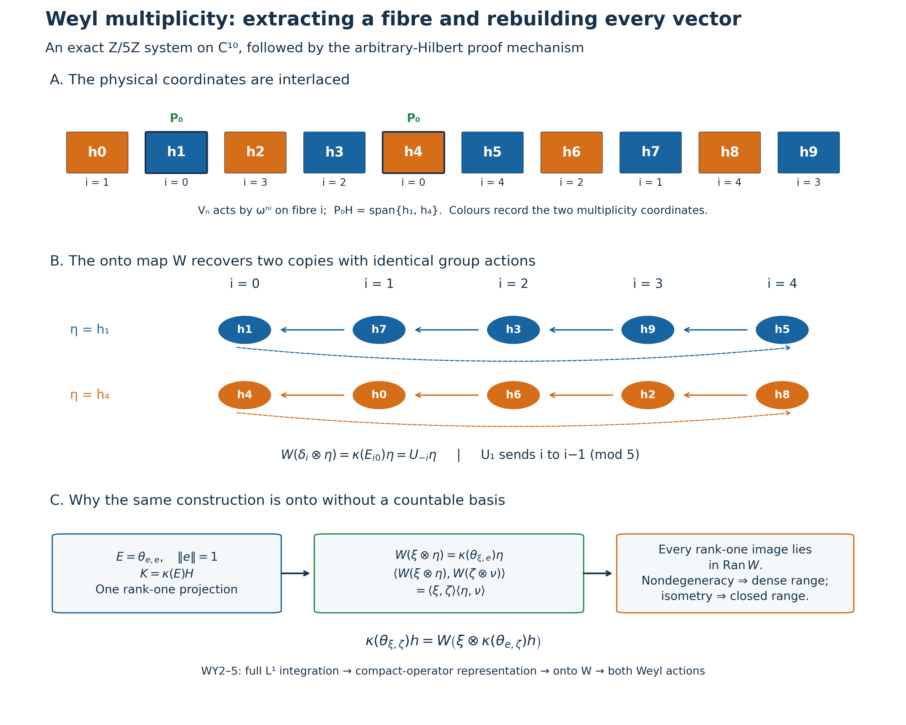

# Weyl systems on arbitrary locally compact abelian groups

*Original proof exposition: GPT-6 Astra (OpenAI), Ultra. CC0-1.0 to the extent of rights held.*

Let \(G\) be any locally compact Hausdorff abelian group, written additively, and \(\Gamma=\widehat G\) its compact-open dual. Fix the earlier Haar convention and a Haar measure \(m\) on \(G\); write \(L=L^2(G,m)\). Choose the earlier dual Haar measure on \(\Gamma\). Inner products are linear in the first variable. Hilbert spaces, groups and multiplicities have no separability, second-countability or sigma-compactness assumption. All vector integrals use the proved finite-exponent Radon convention, with sigma-compact carriers for integrable functions.

The exact earlier inputs are [L24 integration, recovery and intertwiners](OA-FLOW-L24.md#oa-flow.grp.integration), [L24's full group completion](OA-FLOW-L24.md#oa-flow.grp.completions), [H1 Fourier completion](OA-FLOW-HARMONIC.md#l138-h1), [H3 topological biduality](OA-FLOW-HARMONIC-LATE.md#l138-h3), [L25 covariant integration and vector-domain recovery](OA-FLOW-L25.md#oa-flow.ccov.integration), and [L25 Section10's complete compact-kernel argument](OA-FLOW-L25.md#oa-flow.ccov.transformations). The finite matrix norm/multiplicity argument is also written in [L138 Section6](OA-FLOW-L138.md#l138-minimal-norm). We use CF1,6,8 and [H0's Hilbert tensor construction](OA-FLOW-TOPOLOGY.md#l138-h0). The arbitrary-multiplicity extension and all vector domains needed here are proved below.

## WY0. The exact assertion and signs

A Weyl system consists of strongly continuous unitary representations \(U:G\to\mathcal U(H)\) and \(V:\Gamma\to\mathcal U(H)\) satisfying

\[
 U_sV_\chi=\chi(s)V_\chi U_s.                                      \tag{WY1}
\]
The theorem is that there are a Hilbert space \(K\) and an onto unitary
\[
 W:L\otimes K\longrightarrow H
\]
such that

\[
 U_sW=W(\rho_s\otimes1_K),\qquad
 V_\chi W=W(M_\chi\otimes1_K),                                  \tag{WY2}
\]
where

\[
 (\rho_s\xi)(t)=\xi(t+s),\qquad (M_\chi\xi)(t)=\chi(t)\xi(t).
                                                                    \tag{WY3}
\]
Conversely these formulas give a Weyl system for every \(K\). Its multiplicity is determined up to unitary isomorphism, and every bounded intertwiner is identified below. The zero system is included by \(K=0\).

The sign is fixed directly: \(\rho_sM_\chi\rho_s^*=\chi(s)M_\chi\). If instead the relation in (WY1) has \(\overline{\chi(s)}\), replace \(U_s\) by \(U_{-s}\) while applying the theorem; the original \(U_s\) then becomes left translation \(\lambda_s\xi(t)=\xi(t-s)\). No sign is hidden in the phrase “standard representation.”

The space \(L\) is nonzero: a nonzero compact continuous bump has positive finite squared integral by the earlier Haar full-support and compact-finiteness proofs. The \(\rho_s\) are strongly continuous unitaries by L24's translation theorem and abelian unimodularity. The \(M_\chi\) are unitary. On \(\xi\in C_c(G)\),

\[
 \|(M_\chi-M_\eta)\xi\|_2
 \leq \sup_{t\in\operatorname{supp}\xi}|\chi(t)-\eta(t)|\,\|\xi\|_2,
                                                                    \tag{WY4}
\]
so compact-open convergence gives strong continuity there. Density and the uniform bound two extend it to every \(L^2\) vector. Tensoring these representations with an arbitrary identity preserves unitarity and strong continuity: first test finite tensor sums, then approximate an arbitrary tensor vector. Thus the converse assertion and all representations later used on the model space are well defined.

## WY1. Integrating both actions and constructing the coefficient representation

L24 supplies the nondegenerate star representations

\[
 U(f)\xi=\int_G f(s)U_s\xi\,dm(s),\qquad
 V(g)\xi=\int_\Gamma g(\chi)V_\chi\xi\,d\widehat m(\chi),           \tag{WY5}
\]
for every \(f\in L^1(G)\), \(g\in L^1(\Gamma)\). These are vector integrals on all of \(H\), with operator bounds \(\|f\|_1\) and \(\|g\|_1\). A continuous vector orbit has separable image on each compact carrier piece. Approximation by strongly measurable simple functions and the integrable scalar norm bound therefore justify the integrals without assuming that \(H\) is separable. Normalized shrinking compact bumps have integrated operators converging strongly to the identity, as proved in L24.

For \(g\in L^1(\Gamma)\), set

\[
 Qg(t)=\int_\Gamma g(\chi)\chi(t)\,d\widehat m(\chi).
                                                                    \tag{WY6}
\]
This is the *positive* inverse-sign integral on the dual group. Under the earlier negative Fourier transform and bidual map \(j(t)(\chi)=\chi(t)\), it is

\[
 Qg(t)=\widehat g(j(-t)).                                         \tag{WY7}
\]
H1 applied to \(\Gamma\) gives \(C^*(\Gamma)=C_0(\widehat\Gamma)\), and H3 makes \(t\mapsto j(-t)\) a homeomorphism onto \(\widehat\Gamma\). Consequently \(Q\) extends to an isometric star isomorphism \(C^*(\Gamma)\to C_0(G)\); in particular its \(L^1\) image is uniformly dense in \(C_0(G)\). No vector-valued spectral theorem is used here.

The representation \(V(g)\) extends to \(C^*(\Gamma)\) by L24's actual universal norm, and hence defines a nondegenerate star representation

\[
 \pi:C_0(G)\longrightarrow B(H),\qquad \pi(Qg)=V(g).              \tag{WY8}
\]
Nondegeneracy follows already from the strongly convergent dual-group compact bumps in (WY5).

Let \(a\in C_0(G)\), and let \(\beta_s(a)(t)=a(t+s)\). For \(g_s(\chi)=\chi(s)g(\chi)\), the Weyl relation and bounded maps through vector integrals give

\[
 U_sV(g)U_s^*=V(g_s),\qquad Qg_s(t)=Qg(t+s).
                                                                    \tag{WY9}
\]
Thus \(U_s\pi(a)U_s^*=\pi(\beta_s(a))\) first on the dense \(Q(L^1(\Gamma))\), then on all \(C_0(G)\) by the C\* contractivity bound. This is precisely L25's right-translation covariant pair. L25 proves point-norm continuity of \(\beta\) by compact cutoffs and finite-cover translation continuity; no regularity hypothesis on a spectral measure has been added.

For later use, \(V_\chi\) commutes with every \(\pi(a)\). Indeed it commutes with \(V(g)\), because \(\Gamma\) is abelian and the equality passes through each vector integral; then use uniform density and contractivity. Joint strong continuity of \((s,\chi)\mapsto V_\chi U_s\) follows by expanding a difference and using the unitary bounds. All products of integrals in this proof may also be computed as iterated vector integrals with norm majorant \(|f(s)g(\chi)|\|\xi\|\); L24's qualified Radon-product integration on the product of sigma-compact carriers applies. No statement about unrestricted product Borel sigma algebras is required.

## WY2. The actual nondegenerate compact-operator representation

Write \(\mathcal B=L^1(G,C_0(G))\), with L25's twisted convolution for \(\beta\). The proved covariant integration theorem gives

\[
 \Phi(F)\xi=\int_G\pi(F(s))U_s\xi\,dm(s),\qquad
 \|\Phi(F)\|\leq\|F\|_1.                                      \tag{WY10}
\]
It is a nondegenerate star representation on all of \(H\). In detail, if \((e_i)\) is a contractive coefficient approximate identity and \(a_N\) is a compact mass-one group bump supported near zero, then

\[
 \|\Phi(a_N e_i)\xi-\xi\|
 \leq\sup_{s\in N}\|U_s\xi-\xi\|+\|\pi(e_i)\xi-\xi\|\to0
                                                                    \tag{WY11}
\]
on the product net. The coefficient convergence follows on \(\pi(C_0(G))H\) from the approximate identity and then on \(H\) by nondegeneracy and the contraction bound.

For \(p,q\in C_c(G)\), put

\[
 F_{p,q}(s)(t)=p(t)\overline{q(t+s)},\qquad
 \theta_{p,q}\xi=p\langle\xi,q\rangle.                          \tag{WY12}
\]
The support condition \(t\in\operatorname{supp}p\), \(t+s\in\operatorname{supp}q\) gives a joint compact support and compact support in \(s\); the coefficient map is norm continuous. L25 Section10 proves the following entire algebraic and density statement:

\[
 F_{p,q}*F_{r,z}=\langle r,q\rangle F_{p,z},\quad
 F_{p,q}^*=F_{q,p},\quad
 F_{p,q}\longleftrightarrow\theta_{p,q}.                         \tag{WY13}
\]
The correspondence is a star isomorphism between these linear spans, and the first span is \(L^1(G,C_0(G))\)-dense. Its proof first approximates continuous coefficient functions on one compact support, then approximates their continuous kernels on one compact rectangle by products. The substitution \(y=t+s\) changes the kernel into the coefficient function with an \(L^1\) error at most the uniform kernel error times the finite measure of the compact difference set. In particular this density is valid for the present arbitrary group, not just a countable exhaustion.

Here is explicitly the norm step needed for our representation. On the finite-rank span define \(\kappa_0(\theta_{p,q})=\Phi(F_{p,q})\). The algebraic isomorphism makes this well defined. Any finite list of the vectors involved lies in a finite-dimensional subspace \(E\subset C_c(G)\). Its full matrix algebra \(\mathcal K(E)\) is contained in this span. The restriction of \(\kappa_0\) is an algebraic star homomorphism of this complete matrix C\* algebra, so L24's proved automatic contractivity gives

\[
 \|\kappa_0(T)\|\leq\|T\|\quad(T\in\mathcal K(E)).              \tag{WY14}
\]
Finite-dimensional orthonormalization uses only finite linear combinations, so the basis vectors remain in \(C_c(G)\). This is the finite-corner norm mechanism of L138 Section6. Every element of the span lies in such a corner. Approximation of arbitrary Hilbert vectors by \(C_c(G)\), and
\(\|\theta_{p,q}\|=\|p\|\|q\|\), show that the span is norm dense in \(\mathcal K(L)\). The displayed rank-one norm follows directly from Cauchy–Schwarz, with equality at \(q/\|q\|\) when neither vector is zero. Therefore \(\kappa_0\) extends uniquely to a contractive star representation

\[
 \kappa:\mathcal K(L)\longrightarrow B(H).                     \tag{WY15}
\]
This step needs no assumed irreducibility, simplicity of the compact algebra, or full crossed-product classification.

Let \(\Phi_0\) be the actual integrated pair \((M_a,\rho_s)\) on \(L\). On compact coefficients its kernel is

\[
 K_F(t,y)=F(y-t)(t).                                             \tag{WY16}
\]
Its norm is at most \(\|F\|_1\), and \(\Phi_0(F_{p,q})=\theta_{p,q}\). Approximate any \(F\in\mathcal B\) in \(L^1\) by the span in (WY13). Both integrated maps converge in operator norm, and the image of \(\Phi_0\) is compact by that same approximation. Contractivity of \(\kappa\) then proves

\[
 \kappa(\Phi_0(F))=\Phi(F)\quad(F\in\mathcal B).                 \tag{WY17}
\]
Equation (WY11) implies that \(\kappa\) is nondegenerate. Thus no unobserved zero representation summand can remain in the later multiplicity construction.

For \(f\in L^1(G)\), \(g\in L^1(\Gamma)\), the coefficient function \(F(s)=f(s)Qg\) is in \(\mathcal B\), and

\[
 \Phi(F)=V(g)U(f),\qquad \Phi_0(F)=M_{Qg}\rho(f).                \tag{WY18}
\]
Finite sums of these \(F\)'s are \(L^1\)-dense: compact continuous coefficient functions are approximated by finite scalar compact functions times fixed \(C_0\) coefficients, and those coefficients by \(Qg\) in uniform norm. This identifies the norm-closed integrated algebra generated linearly by these ordered products with \(\overline{\kappa(\mathcal K(L))}\). WY3 will show that this image is already closed.

## WY3. An onto multiplicity unitary on every Hilbert space

The following construction applies to any nondegenerate star representation \(\kappa:\mathcal K(L)\to B(H)\) on arbitrary \(H\), with \(L\ne0\). Choose a unit vector \(e\in L\), set \(E=\theta_{e,e}\), and put

\[
 K=\kappa(E)H,\qquad
 W_0(\xi\otimes\eta)=\kappa(\theta_{\xi,e})\eta
 \quad(\xi\in L,\ \eta\in K).                                 \tag{WY19}
\]
The projection \(\kappa(E)\) is bounded and selfadjoint, so \(K\) is a closed Hilbert subspace. The formula is bilinear and hence defines a map on the algebraic tensor product. The rank-one product gives

\[
 \begin{aligned}
 \langle W_0(\xi\otimes\eta),W_0(\zeta\otimes\nu)\rangle
 &=\langle\kappa(\theta_{e,\zeta}\theta_{\xi,e})\eta,\nu\rangle\\
 &=\langle\xi,\zeta\rangle\langle\eta,\nu\rangle.
 \end{aligned}                                                  \tag{WY20}
\]
Finite sums give exactly H0's Hilbert tensor inner product. Thus \(W_0\) extends to an isometry \(W:L\otimes K\to H\), whose range is closed by completeness.

For every \(\xi,\zeta\in L\), \(h\in H\),

\[
 \kappa(\theta_{\xi,\zeta})h
 =W\bigl(\xi\otimes\kappa(\theta_{e,\zeta})h\bigr),
 \qquad \kappa(\theta_{e,\zeta})h\in K.                         \tag{WY21}
\]
The second assertion follows by left multiplying with \(\kappa(E)\). Finite ranks are norm dense in \(\mathcal K(L)\), and \(\kappa\) is nondegenerate, so the vectors on the left have dense span in \(H\). The closed range of \(W\) is therefore all of \(H\). This proves surjectivity on the complete Hilbert spaces, not merely on a selected separable cyclic subspace.

For \(T\in\mathcal K(L)\), the identity \(T\theta_{\xi,e}=\theta_{T\xi,e}\) gives on elementary tensors, then by density,

\[
 \kappa(T)W=W(T\otimes1_K).                                    \tag{WY22}
\]
If \(H\ne0\), surjectivity makes \(K\ne0\). H0's tensor norm identity then shows \(\|\kappa(T)\|=\|T\|\), so \(\kappa\) is faithful and has closed image. When \(H=0\), \(K=0\) and its image is the closed zero algebra. This also completes the image assertion after (WY18).

## WY4. Recovering both original Weyl actions

Apply WY3 to the representation constructed in WY2. The pair \((M_a\otimes1_K,\rho_s\otimes1_K)\) is nondegenerate and covariant on \(L\otimes K\). Nondegeneracy follows from compact cutoffs on the dense compact continuous vectors of \(L\), first on finite tensor sums and then everywhere. Bounded maps pass through the vector integrals on these sums and their limits, so its integrated representation is \(\Phi_0(F)\otimes1_K\). Equations (WY17) and (WY22) therefore give

\[
 \Phi(F)W=W(\Phi_0(F)\otimes1_K)\quad(F\in\mathcal B).          \tag{WY23}
\]
L25 Section3 proves on actual finite generating vectors that a bounded intertwiner of nondegenerate integrated representations intertwines both recovered actions. Applied to (WY23), it yields

\[
 \pi(a)W=W(M_a\otimes1_K),\qquad U_sW=W(\rho_s\otimes1_K).
                                                                    \tag{WY24}
\]
The first equality with \(a=Qg\) says

\[
 V(g)W=W(M_{Qg}\otimes1_K)
      =W\int_\Gamma g(\chi)(M_\chi\otimes1_K)\,d\widehat m(\chi).
                                                                    \tag{WY25}
\]
The last equality holds on every vector by the pointwise scalar integral on compact continuous vectors, its absolute integrable bound, and norm approximation; alternatively test all vector inner products and use L24's vector-integral uniqueness. Since both dual-group representations are strongly continuous and nondegenerate, L24's full integral-intertwiner theorem applied to \(\Gamma\) proves \(V_\chi W=W(M_\chi\otimes1_K)\). This proves (WY2) for every \(s,\chi\). It does not replace a group element by an L1 Dirac mass.

## WY5. Arbitrary matrix units, all intertwiners and exact multiplicity

For an arbitrary orthonormal basis \((e_i)_{i\in I}\) of \(L\), choose \(i_0\in I\) and take \(e=e_{i_0}\) in WY3. Such a basis exists by CF1's maximal-chain/choice principle: a maximal orthonormal family has dense closed span, since the Hilbert projection theorem would otherwise produce another unit orthogonal vector. Put \(E_{ij}=\theta_{e_i,e_j}\) and \(P_i=\kappa(E_{ii})\). Then

\[
 P_iP_j=0\ (i\ne j),\qquad
 \kappa(E_{i i_0})^*\kappa(E_{i i_0})=P_{i_0},\quad
 \kappa(E_{i i_0})\kappa(E_{i i_0})^*=P_i.                       \tag{WY26}
\]
Consequently \(\kappa(E_{i i_0}):K\to P_iH\) is onto unitary, and the restriction of \(W\) to \(e_i\otimes K\) is exactly that map. Moreover

\[
 \sum_{i\in I}P_i=1_H\quad\hbox{strongly over finite subsets},\qquad
 H=\bigoplus_{i\in I}P_iH.                                      \tag{WY27}
\]
Indeed finite coordinate projections converge strongly to the identity on \(L\): approximate a vector by its finite linear span coordinates and use contraction bounds. Their tensor amplifications converge on finite tensor sums and then on every tensor vector. Conjugate by the already onto \(W\). This proves (WY27) without a countable index set or an unproved normal extension of \(\kappa\).

There is also an exact operator form of uniqueness. If two Weyl systems have the above models \(L\otimes K\) and \(L\otimes K'\), every bounded simultaneous intertwiner \(B:L\otimes K\to L\otimes K'\) has the form

\[
 B=1_L\otimes b\quad\hbox{for a unique }b\in B(K,K').           \tag{WY28}
\]
To prove it, integration, uniform density of \(Qg\), and the compact-kernel construction show that \(B\) intertwines every \(T\otimes1\), \(T\in\mathcal K(L)\). The rank-one projection \(E\) forces \(B(e\otimes\eta)=e\otimes b\eta\) for a bounded linear \(b\), with \(\|b\|\leq\|B\|\). Commuting the rank-one map \(\theta_{\xi,e}\) across \(B\) gives (WY28) on elementary tensors and then everywhere. Conversely (WY28) intertwines the model actions by their formulas; its boundedness follows from the tensor norm estimate. Thus a simultaneous unitary intertwiner exists exactly when \(K,K'\) are unitarily isomorphic. This includes zero multiplicities.

In particular the joint commutant is \(1_L\otimes B(K)\). A nonzero Weyl system is irreducible exactly when \(\dim K=1\). If \(K\) has dimension greater than one, the projection onto any proper nonzero closed subspace of \(K\) gives a nontrivial reducing projection. If \(\dim K=1\), the commutant consists of scalars, so any joint invariant closed subspace, which reduces both unitary groups because their inverses are present, has scalar projection and is trivial. This proves the irreducible uniqueness statement as a consequence of the complete multiplicity construction.

## WY6. Exact finite reconstruction of two interlaced copies

Let \(G=\mathbb Z/5\mathbb Z\) with counting Haar, \(\omega=e^{2\pi i/5}\), \(L=\mathbb C^5\) and \(K=\mathbb C^2\). On \(L\), set \(S_s\delta_j=\delta_{j-s}\) and \(D_n\delta_j=\omega^{nj}\delta_j\). Then \(S_sD_n=\omega^{ns}D_nS_s\), agreeing with (WY1). To display a non-diagonal presentation of the multiplicity, index a physical orthonormal basis \((h_k)_{k=0}^9\) and let

\[
 R(\delta_i\otimes f_a)=h_{\tau(2i+a)},\qquad
 \tau(k)=3k+1\pmod {10},\quad a\in\{0,1\}.                     \tag{WY29}
\]
The map \(\tau\) is a permutation since 3 is invertible modulo10. Thus \(R\) is unitary. Put \(U_s=R(S_s\otimes1)R^*\), \(V_n=R(D_n\otimes1)R^*\). For \(i\in\mathbb Z/5\mathbb Z\), exact geometric sums give

\[
 P_i=\frac15\sum_{n=0}^4\omega^{-ni}V_n
    =R(E_{ii}\otimes1)R^*,\qquad
 \kappa(E_{ij})=P_iU_{j-i}.                                    \tag{WY30}
\]
The sum is one at label \(i\) and zero at every other label because \(\sum_{n=0}^4z^n=0\) for a nontrivial fifth root and equals5 for \(z=1\). For the second identity, \(S_{j-i}\delta_k=\delta_{k-j+i}\), and projection onto \(\delta_i\) keeps exactly \(k=j\).

The five support fibres in physical coordinates are respectively

\[
 \{1,4\},\quad\{7,0\},\quad\{3,6\},\quad\{9,2\},\quad\{5,8\}.
                                                                    \tag{WY31}
\]
Take the multiplicity space \(P_0H=\operatorname{span}\{h_1,h_4\}\), with the displayed ordered basis. Then the onto map of (WY19) is

\[
 W(\delta_i\otimes h_{\tau(a)})
 =\kappa(E_{i0})h_{\tau(a)}
 =U_{-i}h_{\tau(a)}=h_{\tau(2i+a)}.                             \tag{WY32}
\]
This explicitly recovers two copies from interlaced coordinate fibres. The reconstruction and character phases are exact; the finite figure is not a reduction of the arbitrary-Hilbert theorem.

The complete primary source used for comparison is Marc A. Rieffel, *Induced representations of C\*-algebras* (1974), [author-hosted edition](https://math.berkeley.edu/~rieffel/papers/rieffel-C-induced.pdf), printed179–180 and231–232 for the rank-one/module mechanism and239–240 for its broader equivalence context. Here the compact representation, the onto tensor map and all intertwiner assertions have been proved locally. No imprimitivity, disintegration or Stone–von Neumann theorem is imported; normal crossed-product commutants, general duality and weights remain separate obligations.

## Recovering multiplicity from one projection

The first two panels are an exact finite example, not a claim that the group has ten elements. The group is \(G=\mathbb Z/5\mathbb Z\), its Haar measure is counting measure, its dual characters are \(\chi_n(s)=\omega^{ns}\), \(\omega=e^{2\pi i/5}\), and each dual point has the corresponding Haar mass \(1/5\). The Hilbert space has dimension ten because the multiplicity space has dimension two. All indices \(i,j,n,s\) for the group are modulo five; only the physical scrambling index is modulo ten.

Let \(S_s\delta_j=\delta_{j-s}\), \(D_n\delta_j=\omega^{nj}\delta_j\), and define the unitary permutation \(R(\delta_i\otimes f_a)=h_{3(2i+a)+1\bmod10}\), \(a\in\{0,1\}\). Then
\[
 U_s=R(S_s\otimes1)R^*,\qquad V_n=R(D_n\otimes1)R^*,\qquad
 U_sV_n=\omega^{ns}V_nU_s.
\]
For the Weyl sign, apply the two sides to \(\delta_j\): the exponents are \(nj\) and \(ns+n(j-s)\), equal modulo five. This is [WY0](OA-FLOW-WY.md#wy-0)'s positive-character convention; using the conjugate scalar instead would require the stated left-translation model.

Panel A displays the physical coordinate order \(h_0,\ldots,h_9\). The fibre label \(i\) under each coordinate is its \(V_n\) exponent: \(V_n\) acts there as \(\omega^{ni}\). Blue and orange distinguish the multiplicity coordinates \(a=0,1\), not two different group characters. The exact selectors are
\[
 P_i=\frac15\sum_{n=0}^4\omega^{-ni}V_n,
 \qquad \kappa(E_{ij})=P_iU_{j-i}.
\]
The geometric-sum proof is given completely in [WY6](OA-FLOW-WY.md#wy-6). It yields the five ordered fibre pairs \((1,4),(7,0),(3,6),(9,2),(5,8)\). Thus the extracted space is \(K=P_0H=\operatorname{span}\{h_1,h_4\}\). The projections \(P_i\) have rank two; \(E_{ii}\) is rank one on \(\mathbb C^5\). These two ranks refer to different spaces.

Panel B sorts the physical coordinates by the onto map
\[
 W(\delta_i\otimes h_{3a+1})=\kappa(E_{i0})h_{3a+1}
 =U_{-i}h_{3a+1}=h_{3(2i+a)+1\bmod10}.
\]
Here \(a=0,1\), so the starting coordinates are exactly \(h_1,h_4\). Each solid arrow shows \(U_1\) sending fibre \(i\) to fibre \(i-1\); each dashed arrow is the same shift from fibre zero to fibre four. The two rows carry identical \(U\) and \(V\) actions. This is an exact coordinate reconstruction, not a numerical eigenspace fit.

Panel C states the arbitrary-space mechanism proved in [WY2–WY5](OA-FLOW-WY.md#wy-2). For a nonzero Hilbert space \(L=L^2(G)\), choose a unit vector \(e\) and the rank-one projection \(E=\theta_{e,e}\) on \(L\). The nondegenerate representation \(\kappa\) of \(\mathcal K(L)\) is constructed from the complete integrated kernel algebra. Set \(K=\kappa(E)H\). The rule
\[
 W(\xi\otimes\eta)=\kappa(\theta_{\xi,e})\eta,
 \qquad \eta\in K,
\]
has the exact tensor inner product, because
\[
 \theta_{e,\zeta}\theta_{\xi,e}=\langle\xi,\zeta\rangle E.
\]
It extends by completeness to an isometry on \(L\otimes K\). Every rank-one image satisfies
\[
 \kappa(\theta_{\xi,\zeta})h
 =W\bigl(\xi\otimes\kappa(\theta_{e,\zeta})h\bigr),
 \qquad \kappa(\theta_{e,\zeta})h\in K.
\]
Nondegeneracy and finite-rank density make the range dense, while isometry makes it closed; hence \(W\) is onto. Subsequent vector-domain recovery intertwines both original unitary actions. For an arbitrary orthonormal basis the resulting coordinate projections sum strongly over finite subsets, not through an assumed countable sequence. The zero system is represented by \(K=0\).

The original [renderer and exact checker](../assets/general-lca-weyl-multiplicity/render_weyl_multiplicity.py) verifies all 625 finite matrix-unit products, all 25 adjoints, all 125 modular phase identities and all ten basis images. The stored floating-point selector error is a cross-check of the exact geometric-sum proof. The PNG, SVG and [integer data](../assets/general-lca-weyl-multiplicity/figures/weyl-multiplicity-data.json) are reproducible. The diagram and caption are original CC0 expression. The human-source comparison is Rieffel's [complete author-hosted 1974 paper](https://math.berkeley.edu/~rieffel/papers/rieffel-C-induced.pdf), printed231–232 and239–240, for the rank-one/module mechanism; every assertion used in the diagram is proved in the linked local body.
