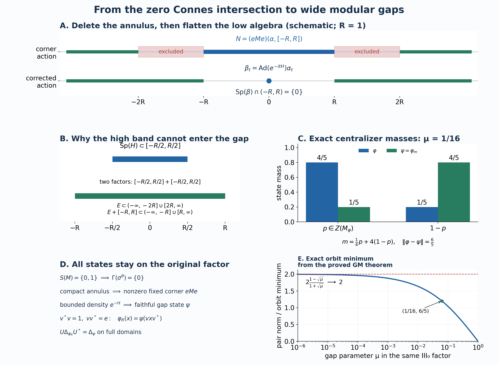

# Wide modular gaps and normal states in a type III₀ factor

*Independent proof development, GPT-6.1 Sol (OpenAI), Ultra, 2026-10-04. Original exposition and reproduction sources: CC0-1.0 to the extent of rights held.*

Let \(M\ne0\) be a type III factor with separable predual. The type III₀ assumption in this chapter is exactly

\[
 S(M)=\{0,1\},
 \tag{Z0}
\]
where \(S(M)\) intersects the complete modular-operator spectra of **all** faithful normal semifinite weights. All Hilbert spaces are arbitrary. We prove that, for every \(R>0\), there is a faithful normal state \(\varphi_R\) on this same \(M\) with

\[
 \operatorname{Sp}(\Delta_{\varphi_R})\cap(e^{-R},e^R)=\{1\}.
 \tag{Z1}
\]
We also prove that the center of the centralizer of every faithful normal state on \(M\) has no nonzero minimal projection. In particular it supplies projections of every prescribed state mass. These are the state constructions needed for the diameter result.

The actual earlier proofs used are the real smooth filters [RF](OA-FLOW-RF.md), action support and product rules [AL-1–4](OA-FLOW-AL.md#oa-flow.al.1), arbitrary supports and central supports PC-1–2, concrete normal coefficients [CP-4–6](OA-FLOW-CP.md#oa-flow.cp.4), the Hilbert and spectral calculus [SF](OA-FLOW-SF.md), exact corner isomorphisms [CT-1–2](OA-FLOW-CT.md#oa-flow.ct.1), bounded centralizer perturbation [CZ-0–4](OA-FLOW-CZ.md#oa-flow.cz.0), and the trace criterion [KT-5](OA-FLOW-KT.md#oa-flow.kt.5). The bounded commuting-action comparison is the complete L35, Lemma 7 proof; its automatic-boundedness theorem is not an input here.

Two additionally written foundations are used at their exact type III scope: [CS-0–3](OA-FLOW-CS.md) for fixed-corner intersection invariance and directed spectral neighborhoods, and [MG-0–4](OA-FLOW-MG.md) for full n.s.f. action/modular spectra, genuine invariant-corner restrictions, all-weight comparison and the separable-predual type III \(S/\Gamma\) identity. These are actual local proof bodies. Their complete proofs precede this chapter in the reader.

The freely readable primary development is [Connes (1973), Lemmas 2.3.2–2.3.4, Corollary 3.2.7, and Lemmas 5.2.2–5.2.4, printed pp.177–178,192–193,230–232](https://www.numdam.org/item/10.24033/asens.1247.pdf), together with [Olesen (1974), printed pp.557–560](https://msp.org/pjm/1974/53-2/pjm-v53-n2-p23-s.pdf). The final pair construction is developed from the freely reachable complete research article [Connes–Haagerup–Størmer (1985), manuscript pp.25–26](http://cm2vivi2002.free.fr/AC-biblio/AC-biblio69.pdf). Every additional argument used from those passages is supplied below or in the precise earlier local proofs.

## Z-1. A faithful normal state and the exact zero intersection

A faithful normal state exists. Indeed, the set of normal states is nonempty: a unit vector in the given nonzero concrete representation gives one by CP-4. As a subset of the separable metric predual, it has a countable norm-dense sequence \((\rho_n)\). To see this without a hereditary-separability assumption, take a countable base of metric balls and select one state from each ball meeting the subset. Their selected points are dense in that subset.

Put \(\theta=\sum_{n\ge1}2^{-n}\rho_n\). The series converges in the predual norm, by completeness and norm closure from CP; it is positive, normal, and has value one at the unit. If \(x\ge0\) and \(\theta(x)=0\), every \(\rho_n(x)=0\). Norm density gives zero on every normal state. A nonzero positive concrete operator has a unit-vector state with positive value, so \(x=0\). Thus \(\theta\) is faithful.

For a normal action \(\alpha\), use the positive transform \(\widehat f(r)=\int f(t)e^{itr}dt\), and the AL spectrum convention. The exact intersection is

\[
 \Gamma(\alpha)
 =\bigcap_{0\ne e\in\operatorname{Proj}(M^\alpha)}
       \operatorname{Sp}(\alpha^e).
 \tag{Z2}
\]
The all-weight identity MG-4, applied to \(\theta\), gives

\[
 \exp\Gamma(\sigma^\theta)=S(M)\cap(0,\infty)=\{1\},
 \qquad \Gamma(\sigma^\theta)=\{0\}.
 \tag{Z3}
\]
Here MG-4 uses genuine normal corner isomorphisms and full balanced-weight GNS proofs. A state-only definition of \(S(M)\) is not substituted for (Z0).

## Z-2. Delete any prescribed compact annulus in an invariant corner

Fix \(R>0\), and put

\[
 K_R=[-2R,-R]\cup[R,2R].
 \tag{Z4}
\]
CS-3 proves that the closed sets

\[
 \operatorname{Sp}((\sigma^\theta)^e)+[-\varepsilon,\varepsilon],
 \qquad 0\ne e\in\operatorname{Proj}(M_\theta),\quad\varepsilon>0,
 \tag{Z5}
\]
are downward directed and have intersection \(\{0\}\).

For each \(r\in K_R\), select one such closed set not containing \(r\). Its complement is an open neighborhood of \(r\). Compactness of \(K_R\), proved in CF, supplies finitely many of these complements covering \(K_R\). Downward directedness supplies a single set in (Z5) contained in the intersection of the corresponding finitely many closed sets. In particular there is a nonzero \(e\in M_\theta\) for which

\[
 \operatorname{Sp}((\sigma^\theta)^e)\cap K_R=\varnothing.
 \tag{Z6}
\]
There is no countable intersection of projection corners or unsupported uniform spectral selection in this step.

The corner \(eMe\) has the faithful normal state
\(\rho(x)=\theta(x)/\theta(e)\). MG-2 identifies its modular action exactly with \(\alpha=(\sigma^\theta)^e\). Multiplying a finite weight by a positive scalar does not change its modular operator: multiplication of its full GNS vectors by the scalar's square root is a unitary intertwining both finite-star involution graphs and their adjoint products. Thus (Z6) is the spectrum of the actual \(\sigma^\rho\).

## Z-3. An internal implementer with the spectral-width bound

We need the following precise bounded-spectrum fact. Let \(N\) be any nonzero von Neumann algebra and let \(\gamma\) be a pointwise normal-coefficient continuous normal automorphism group satisfying

\[
 \operatorname{Sp}(\gamma)\subseteq[-R,R].
 \tag{Z7}
\]
Then there is \(H=H^*\in N^\gamma\) such that

\[
 -\frac R2\,1\le H\le\frac R2\,1,\qquad
 \gamma_t(x)=e^{itH}xe^{-itH}\quad(x\in N).
 \tag{Z8}
\]
The width \(R\) in (Z7), rather than an unspecified bound on a derivation, determines (Z8).

Choose a smooth compactly supported \(\chi\) equal to one near \([-R,R]\), and let \(g\) be its RF inverse filter. AL's local identity-filter proof gives \(T_g=I\) on \(N\). Substitution in the normal scalar coefficients gives

\[
 \gamma_t(x)=T_{g(\,\cdot-t)}x,\qquad
 \|\gamma_t-I\|\le\|g(\,\cdot-t)-g\|_1.
 \tag{Z9}
\]
The Schwartz decay of \(g\) and \(g'\), scalar dominated convergence, and the compact-interval fundamental theorem prove translation continuity in \(L^1\) and differentiation in \(L^1\). Hence \(\gamma\) is operator-norm continuous and differentiable at zero, with bounded derivative \(d(x)=T_{-g'}x\). Differentiating multiplicativity and star makes \(d\) a bounded star derivation. This proves its boundedness directly, without automatic boundedness of algebraic derivations.

For each real \(r\), let \(S_r=N(\gamma,[r,\infty))\), and form the largest left-annihilating projection

\[
 p(r)=1-\bigvee_{x\in S_r}s(xx^*).
 \tag{Z10}
\]
PC constructs this arbitrary join. Its defining identity is

\[
 ax=0\text{ for all }x\in S_r
 \quad\Longleftrightarrow\quad a=ap(r).
 \tag{Z11}
\]
The projections \(p(r)\) increase, are fixed by \(\gamma\), equal zero for \(r\le0\) because \(1\in S_r\), and equal one for \(r>R\) by (Z7). Their invariance follows by applying \(\gamma_t\) to the annihilator and its unique projection.

Choose \(L>R\). On any tagged partition \(0=\lambda_0<\cdots<\lambda_n=L\), put \(q_j=p(\lambda_j)-p(\lambda_{j-1})\) and \(B_{\mathcal P}=\sum_j\tau_jq_j\), with \(\tau_j\in[\lambda_{j-1},\lambda_j]\). The increments are commuting orthogonal projections with sum one. Passing to a common refinement shows that two tagged sums differ in norm by at most the sum of their meshes. Thus they have a norm limit \(B\in N^\gamma\). Increments above \(R\) vanish; a tag in the one interval crossing \(R\) is at most \(R\) plus the mesh. Therefore

\[
 0\le B\le R1.
 \tag{Z12}
\]
No continuity convention for the increasing family \(p(r)\), and no projection-valued integration theorem, is needed for these norm sums.

AL's product support gives \(S_rS_s\subseteq S_{r+s}\). Applying (Z11) twice yields

\[
 p(r+s)x(1-p(s))=0
 \quad(x\in S_r,\ s\in\mathbb R).
 \tag{Z13}
\]
Let \(\Phi_t=\operatorname{Ad}(e^{itB})\). It commutes with \(\gamma\), because \(B\) is fixed. On a partition of mesh \(\eta\), a surviving block \(q_jxq_k\), for \(x\in S_r\), has

\[
 \tau_j-\tau_k>r-2\eta.
 \tag{Z14}
\]
Indeed use \(s=\lambda_{k-1}\) in (Z13). If \(\lambda_j\le r+\lambda_{k-1}\), the block is killed by \(p(r+s)\). Otherwise the tags give (Z14).

The action implemented by \(B_{\mathcal P}\) is the finite sum of these blocks with phases \(e^{it(\tau_j-\tau_k)}\). A smooth filter supported strictly below \(r\) kills every surviving block for sufficiently small mesh. Norm convergence of \(B_{\mathcal P}\) gives uniform convergence of its exponentials on compact time intervals, while the scalar \(L^1\) tails give convergence of the entire filters. Consequently

\[
 N(\gamma,[r,\infty))\subseteq N(\Phi,[r,\infty))
 \quad(r\in\mathbb R).
 \tag{Z15}
\]
For these norm-continuous actions, the normal scalar integrals equal the norm integrals by testing every normal coefficient. AL's smooth disjoint-support characterization is therefore exactly the closed-band convention of L35 Lemmas 4–7. The complete commuting diagonal-localization proof in L35 Lemma 7 applies to (Z15) and gives \(\gamma=\Phi\). Its finite rectangle localization and full filter argument are earlier proofs, not an imported implementation theorem.

Set \(H=B-(R/2)1\). Equations (Z12) and (Z15) prove (Z8), with every sign and bound asserted there.

## Z-4. Flatten the low band without importing an action-realization theorem

Return to the corner action \(\alpha=\sigma^\rho\) satisfying (Z6), and set

\[
 N=(eMe)(\alpha,[-R,R]).
 \tag{Z16}
\]
This is an ultraweakly closed unital star subalgebra. Adjoint closure follows by reflection. Products have spectrum in \([-2R,2R]\), by AL-4, and in the full action spectrum; (Z6) removes the two outer closed annuli, leaving only \([-R,R]\). This proves product closure. It is invariant under \(\alpha\), and the restricted action has spectrum in \([-R,R]\).

Z-3 supplies \(H=H^*\in N^\alpha\), \(\|H\|\le R/2\), implementing \(\alpha\) on \(N\). In particular \(H\in(eMe)_\rho\). Let \(h=e^{-H}\). It is bounded positive and invertible, lies in that centralizer, and satisfies

\[
 e^{-R/2}e\le h\le e^{R/2}e.
 \tag{Z17}
\]
The fully proved bounded case of CZ constructs the faithful normal finite functional

\[
 \rho_h(x)=\rho(h^{1/2}xh^{1/2})=\rho(hx),\qquad
 \psi=\rho_h/\rho(h),
 \tag{Z18}
\]
and proves its modular group on the whole corner:

\[
 \beta_t=\sigma_t^\psi
   =\operatorname{Ad}(e^{-itH})\,\alpha_t.
 \tag{Z19}
\]
All positive elements have finite value in (Z18). Multiplication by the normalizing scalar does not change the full GNS modular operator, by Z-2's graph calculation. The equality in (Z19) uses an actual centralizer perturbation, rather than realizing an arbitrary cocycle. The signs make \(\beta\) the identity on \(N\).

We check the high-band estimate locally. On \(M_2(eMe)\), define the normal action

\[
 W_t(X)=
 \begin{pmatrix}e&0\\0&e^{-itH}\end{pmatrix}
   (\alpha_t\otimes\operatorname{id})(X)
 \begin{pmatrix}e&0\\0&e^{itH}\end{pmatrix}.
 \tag{Z20}
\]
Since \(H\) is fixed by \(\alpha\), the diagonal matrices satisfy the actual cocycle law and \(W\) is a group. Its first and second corner actions are \(\alpha\) and \(\beta\).

Put \(v=e\otimes e_{21}\). Its orbit is \(W_t(v)=e^{-itH}\otimes e_{21}\). Full bounded spectral calculus and RF's coefficient interchange give \(T_f^W(v)=\widehat f(-H)\otimes e_{21}\), so

\[
 \operatorname{Sp}_W(v)\subseteq[-R/2,R/2].
 \tag{Z21}
\]
For \(x\in(eMe)(\alpha,E)\), the exact identity
\(x\otimes e_{22}=v(x\otimes e_{11})v^*\), together with AL's full product rule, gives

\[
 \operatorname{Sp}_\beta(x)
   \subseteq\overline{E+[-R,R]}.
 \tag{Z22}
\]
Here \(v\) is a bounded matrix partial isometry, not a fixed polar factor of a filtered element.

Choose a smooth compact \(\chi\) equal to one on a neighborhood of \([-R,R]\) and supported in \((-2R,2R)\). AL's element support and local multiplier identities show that every \(x\in eMe\) splits exactly as

\[
 x=T_{k_\chi}^\alpha x+(x-T_{k_\chi}^\alpha x)=x_{\mathrm{low}}+x_{\mathrm{high}},
 \quad
 x_{\mathrm{low}}\in N,\quad
 \operatorname{Sp}_\alpha(x_{\mathrm{high}})
       \subseteq(-\infty,-2R]\cup[2R,\infty).
 \tag{Z23}
\]
Indeed the low filter has spectrum in the intersection of the action spectrum with \(\operatorname{supp}\chi\), and this lies in \([-R,R]\) by (Z6). The complementary multiplier vanishes near every low point, and the same annulus exclusion proves the high inclusion.

The low term is fixed by \(\beta\), and (Z22) puts the high term's \(\beta\) spectrum in \((-\infty,-R]\cup[R,\infty)\). The support characterization therefore makes every smooth \(\beta\) filter supported in \((-R,R)\setminus\{0\}\) zero on every \(x\). Local detection excludes every nonzero point of that interval from the action spectrum, while its fixed unit puts zero in it. Hence

\[
 \operatorname{Sp}(\beta)\cap(-R,R)=\{0\}.
 \tag{Z24}
\]
MG-1, applied to the actual faithful normal state \(\psi\), now gives

\[
 \operatorname{Sp}(\Delta_\psi)\cap(e^{-R},e^R)=\{1\}.
 \tag{Z25}
\]

## Z-5. Return the state to the given factor

CT-2 and its complete type III projection proof give \(v^*v=1\), \(vv^*=e\). The map \(\iota:M\to eMe\), \(\iota(x)=vxv^*\), is a normal unital star isomorphism. Its inverse is \(y\mapsto v^*yv\). Put \(\varphi_R=\psi\iota\). This is a faithful normal state on the original \(M\).

CT-1's unitary on the full GNS space,

\[
 U\Lambda_{\varphi_R}(x)=\Lambda_\psi(\iota(x)),
 \tag{Z26}
\]
matches both complete finite-star graphs, their closures, antilinear adjoints, positive products and resolvents. Thus the complete modular operators have identical spectra. Equation (Z25) proves (Z1) on this same \(M\). No amplification changes the type hypothesis, and no inference of a state from a modular-group formula is made.

## Z-6. Diffuse centralizer centers and exact projection masses

Let \(\varphi\) be any faithful normal state on \(M\), and let \(C=M_\varphi\). We prove that \(Z(C)\) has no nonzero minimal projection. Suppose such a projection \(z\) existed. It is fixed, and the fixed algebra in \(zMz\) is \(zCz\). The latter is a factor: an element central in \(zCz\), extended by zero, is central in \(C\), and the minimality of \(z\) in \(Z(C)\) leaves only scalar multiples of \(z\).

We need a local spectrum fact. If a factor action \(\eta\) has fixed algebra \(F\) which is a factor, then

\[
 \operatorname{Sp}(\eta^q)=\operatorname{Sp}(\eta)
 \quad(0\ne q\in\operatorname{Proj}(F)),
 \qquad \Gamma(\eta)=\operatorname{Sp}(\eta).
 \tag{Z27}
\]
To prove it, the join \(\bigvee_{u\in\mathcal U(F)}uqu^*\) is the central support of \(q\) in \(F\), hence is its unit, by PC. For any nonzero \(x\) with spectrum in a compact interval, some \(u\in\mathcal U(F)\) has \(xu q\ne0\), since otherwise \(x\) kills that whole joined range. Some \(w\in\mathcal U(F)\) then has \(q w^*xu q\ne0\), since otherwise the range of \(xu q\) is orthogonal to the same joined range. Multiplication by these fixed elements preserves the containing spectrum, by AL-4. Every action spectral point is locally detected by such an \(x\); this supplies a nonzero element in \(qMq\) with spectrum in each of its neighborhoods. Closedness gives the reverse action-spectrum inclusion; restriction gives the forward one. Intersecting these equalities proves (Z27).

Apply this to \(\eta=(\sigma^\varphi)^z\). Its ambient corner is a factor, by CT-2, and CS-3 gives \(\Gamma(\eta)=\Gamma(\sigma^\varphi)=\{0\}\), using MG-4 and (Z0). Thus (Z27) gives \(\operatorname{Sp}(\eta)=\{0\}\).

An action with this spectrum is the identity, as can also be checked without a synthesis assertion: Z-3's identity-filter argument makes it operator-norm differentiable. For every \(\varepsilon>0\), use a smooth identity symbol \(\chi(r/\varepsilon)\) near its singleton spectrum. The inverse of its time derivative has \(L^1\) norm \(\varepsilon\) times a fixed finite constant, so its generator norm is at most that quantity. Letting \(\varepsilon\downarrow0\) makes the generator zero, and the norm-continuous group is the identity by the bounded-generator proof in L35.

MG-2 identifies this with the modular group of the faithful finite restriction \(\varphi|_{zMz}\). KT-5's complete trace criterion then makes that restriction a trace. But \(z\) is infinite in the type III factor: there is a partial isometry \(a\) with \(a^*a=z\), \(aa^*<z\). The tracial identity gives \(\varphi(aa^*)=\varphi(a^*a)=\varphi(z)\), so the nonzero positive projection \(z-aa^*\) has value zero, contradicting faithfulness. This rules out the supposed minimal central projection.

Consequently, for every \(c\in[0,1]\) there is \(p\in\operatorname{Proj}(Z(C))\) with \(\varphi(p)=c\). Here is the entire splitting argument. In any nonzero central projection \(q\), repeatedly choose a proper nonzero subprojection and then the child of smaller state mass. Each chosen child is nonzero and has at most half its predecessor's mass. Thus \(q\) has a nonzero central subprojection of mass at most any given \(\varepsilon>0\).

For \(0<c<1\), partially order the central projections of mass at most \(c\). A chain has its projection join as an upper bound; normality makes the join's mass the supremum of the chain's masses, still at most \(c\). The earlier choice/Zorn primitive therefore gives a maximal member \(p\). If \(\varphi(p)<c\), its nonzero complement contains a nonzero central subprojection of mass at most \(c-\varphi(p)\), by the preceding halving construction. Adding it contradicts maximality. Thus \(\varphi(p)=c\). The cases \(c=0,1\) use \(0,1\). No realization as a standard probability space or atomless-measure theorem is imported.

## Z-7. The precise state pair and diameter two

Fix \(\mu\in(0,1)\), put \(R=-\log\mu\), and use Z-5's faithful state \(\varphi=\varphi_R\). Put \(s=\sqrt\mu\). Z-6 supplies \(p\in Z(M_\varphi)\) with \(\varphi(p)=1/(1+s)\). Define

\[
 m=sp+s^{-1}(1-p),\qquad
 \psi(x)=\varphi(m^{1/2}xm^{1/2})=\varphi(mx).
 \tag{Z28}
\]
Bounded centralizer perturbation proves positivity, normality and faithfulness. Parameter positivity and linearity in CZ give

\[
 s\varphi\le\psi\le s^{-1}\varphi,\qquad
 \psi(1)=\frac{s}{1+s}+\frac1{1+s}=1.
 \tag{Z29}
\]
Thus \(\psi\) is also a faithful normal state, with all finite domains equal to the whole algebra. The centralizer identity in CZ-0 gives \(\varphi(p x(1-p))=0\), and the corresponding identity with the two corners exchanged.

The two corner positive functionals have orthogonal supports. The triangle inequality gives the upper estimate for their signed difference, and evaluating on the contraction \(2p-1\) attains it. Therefore

\[
 \|\varphi-\psi\|
 = (1-s)\varphi(p)+(s^{-1}-1)\varphi(1-p)
 =2\frac{1-\sqrt\mu}{1+\sqrt\mu}.
 \tag{Z30}
\]
The functional norm of each positive corner functional is its value at one, by the earlier positive-functional norm/CS proof in GNS.

The states commute in the precise modular sense: \(\psi\) is \(\sigma^\varphi\)-invariant because \(m\) is fixed, while
\(\sigma_t^\psi=\operatorname{Ad}(m^{it})\sigma_t^\varphi\) and CZ-0's finite centralizer identity make \(\varphi\) invariant under this group as well. Equation (Z1) is exactly the required spectral gap

\[
 \operatorname{Sp}(\Delta_\varphi)\cap(\mu,\mu^{-1})=\{1\},
 \qquad \mu=s/s^{-1}.
 \tag{Z31}
\]

Apply the earlier [modular-gap minimization theorem, GM-6](OA-FLOW-GM.md#oa-flow.gm.6) to the actual positive centralizer density in (Z28), the bounds in (Z29), and the gap in (Z31). Its conclusion gives

\[
 \inf_{u\in\mathcal U(M)}\|u\varphi u^*-\psi\|
 =\|\varphi-\psi\|
 =2\frac{1-\sqrt\mu}{1+\sqrt\mu}.
 \tag{Z32}
\]
The inequality in the difficult direction is entirely the minimization theorem; it is not proved merely by the norm computation (Z30). The identity unitary supplies the other direction. Here \(u\varphi u^*(x)=\varphi(u^*xu)\).

For arbitrary normal states, the norm triangle inequality gives orbit distance at most two. By the proved minimization theorem, (Z32), for every \(\mu>0\), gives diameter at least two, because its right side tends to two as \(\mu\downarrow0\). Hence the normal-state orbit diameter is two under (Z0). Every pair in this argument belongs to the same fixed type III₀ factor. The limit concerns its gap parameter; it is not a limit of factors of another type.

**Exercise.** Why is the compact annulus in (Z4) twice as wide as the final additive gap? **Solution.** The low-band implementer has spectrum in \([-R/2,R/2]\). The two matrix factors in (Z20)–(Z22) can together shift a high frequency by at most \(R\). Frequencies initially outside \((-2R,2R)\) therefore stay outside \((-R,R)\), while the whole low algebra is fixed by the corrected action.

**Exercise.** Does a projection of the required mass need to be finite in the ambient factor? **Solution.** It is a centralizer projection with finite state value. Every nonzero projection of the ambient type III factor is infinite. Z-6 constructs its mass in the diffuse centralizer center, and does not transfer ambient finiteness from finite state value.

This chapter supplies the complete lacunary-state and diffuse-projection constructions at the declared earlier proof bodies. The earlier complete GM minimum theorem applies to the constructed pair and proves diameter two. No statement about metrics on infinite weights, flow realization, or classification is used.

### The annulus, the corrected action and the exact pair of states

**Figure Z.** The ambient algebra is one fixed nonzero type III₀ factor \(M\) with separable predual and \(S(M)=\{0,1\}\). Its representation Hilbert space is arbitrary. Panels A, B and D are schematics of proved constructions, not numerical samples of an operator spectrum. Panel C shows exact state values. Panel E plots the exact pair norm and the exact orbit minimum supplied by the complete earlier modular-gap minimum theorem.

**A — Delete the annulus and correct the action.** For \(R>0\), the directed fixed-corner neighborhoods of the zero Connes intersection supply a nonzero \(e\in M_\theta\) with
\[
 \operatorname{Sp}((\sigma^\theta)^e)
 \cap([-2R,-R]\cup[R,2R])=\varnothing.
\]
The displayed scale is \(R=1\). The red bands are excluded **closed** intervals. The blue band encloses the element spectra of the entire low algebra \(N=(eMe)(\alpha,[-R,R])\), where \(\alpha\) is the modular action of the normalized corner state. Green rays enclose the remaining possible high frequencies; neither their whole intervals nor their endpoints are asserted to occur in the action spectrum. The locally constructed fixed implementer \(H\), with \(\|H\|\le R/2\), implements \(\alpha\) on \(N\). The bounded density \(e^{-H}\) constructs an actual faithful normal corner state whose modular action is \(\beta_t=\operatorname{Ad}(e^{-itH})\alpha_t\). It fixes \(N\) and satisfies \(\operatorname{Sp}(\beta)\cap(-R,R)=\{0\}\). Proof: [Z-2–4](OA-FLOW-Z.md#iii0-z2), equations (Z4)–(Z25).

**B — The two spectral shifts.** The top interval is the enclosing spectral bound \([-R/2,R/2]\) for \(H\); it need not be its actual spectrum. In the actual balanced matrix action the partial isometry \(e\otimes e_{21}\) has orbit \(e^{-itH}\otimes e_{21}\). The convention is \(\widehat f(r)=\int f(t)e^{itr}dt\), so its filtered coefficient is \(\widehat f(-H)\). Both matrix factors contribute an enclosing band of width \(R\), giving the exact Minkowski bound
\[
 E+[-R,R]\subseteq(-\infty,-R]\cup[R,\infty),
 \qquad E\subseteq(-\infty,-2R]\cup[2R,\infty).
\]
This is why removing the original closed annulus of radii \(R,2R\) produces the final open gap of radius \(R\). The low/high splitting is the exact smooth-filter identity (Z23), not a density approximation. Proof: [Z-4](OA-FLOW-Z.md#iii0-z4), (Z20)–(Z24).

**C — Exact centralizer masses.** This example uses the faithful state on the original factor for \(\mu=1/16\), hence \(s=\sqrt\mu=1/4\) and \(R=\log16\). The atomless center of its centralizer supplies a projection \(p\) with \(\varphi(p)=4/5\). Its complement has mass \(1/5\). The bounded nonsingular centralizer density
\[
 m=\tfrac14p+4(1-p)
\]
gives the faithful normal state \(\psi=\varphi_m\), whose masses are \(1/5\) and \(4/5\). Thus \(\tfrac14\varphi\le\psi\le4\varphi\), both states have value one at the unit, and
\[
 \|\varphi-\psi\|=|4/5-1/5|+|1/5-4/5|=6/5.
\]
The bar heights are these exact scalar values. They do not represent finite ambient projections: every nonzero projection in the type III factor is infinite. Proof: [Z-6–7](OA-FLOW-Z.md#iii0-z6), (Z28)–(Z31).

**D — Return to the original factor.** The nonzero corner is normally isomorphic to \(M\), via \(x\mapsto vxv^*\), where \(v^*v=1\) and \(vv^*=e\). The transported state \(\varphi_R(x)=\psi(vxv^*)\) is faithful and normal on this same \(M\). The exact GNS unitary intertwines both closed finite-star graphs, their adjoints and their positive products. Thus the **complete** modular spectra agree, including all domains. The diagram does not construct a factor by amplification or assert a classification theorem. Proof: [Z-1–5](OA-FLOW-Z.md#iii0-z1), especially (Z26).

**E — Approach diameter two within one factor.** The curve is
\[
 d(\mu)=2\frac{1-\sqrt\mu}{1+\sqrt\mu},\qquad0<\mu<1.
\]
For each parameter, the proved state-pair construction has norm difference exactly \(d(\mu)\). The earlier [modular-gap minimum theorem, GM-6](OA-FLOW-GM.md#oa-flow.gm.6) proves that it is also their exact unitary-orbit distance. The dashed line is the general upper bound two for differences of normal states. The green point is the exact sample \((1/16,6/5)\). The horizontal coordinate is logarithmic, and the displayed curve stops at \(\mu=10^{-6}\); its convergence to two is a proved limit, not the endpoint of the numerical sample. The value at \(\mu=1\) is drawn only as the continuous limiting endpoint of the scalar formula. No pair with that gap parameter is needed. Proof and the precise earlier theorem input: [Z-7](OA-FLOW-Z.md#iii0-z7), (Z30)–(Z32).

The primary development passages are [Connes (1973), printed pp.177–178,192,230–232](https://www.numdam.org/item/10.24033/asens.1247.pdf), [Olesen (1974), printed pp.557–560](https://msp.org/pjm/1974/53-2/pjm-v53-n2-p23-s.pdf), and [Connes–Haagerup–Størmer (1985), manuscript pp.25–26](http://cm2vivi2002.free.fr/AC-biblio/AC-biblio69.pdf). The complete arguments and their exact earlier inputs are in the linked local proof; these source passages are not substitutes for those proofs.

Original illustration, caption, code and mathematical data: CC0-1.0 to the extent of rights held. Reproduction source: [../assets/iii0-gap-states/render_iii0.py](../assets/iii0-gap-states/render_iii0.py); exact data: [iii0-gap-states-data.json](../assets/iii0-gap-states/assets/iii0-gap-states-data.json). DejaVu glyph terms are retained in [FONT-LICENSE.txt](../assets/iii0-gap-states/assets/FONT-LICENSE.txt).
