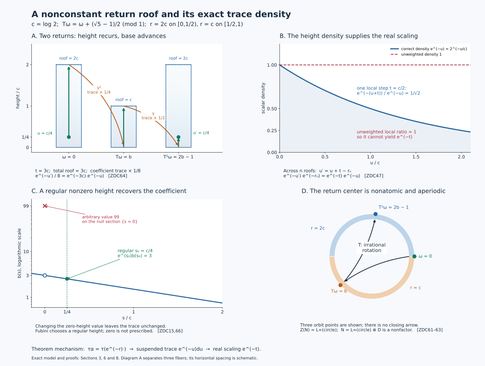

# Type III zero factors from a contracting return automorphism

## Theorems and prerequisites

A return transformation records one discrete step of a continuous center flow. The trace records more: when the return roof has height \(r\), one step changes the coefficient trace by the central factor \(e^{-r}\). The corresponding suspension trace has density \(e^{-u}\,du\) in the height variable. We construct both traces on their entire positive cones and identify the actual regular crossed products.

All algebras in the two main theorems have separable predual. A type II\(_\infty\) algebra need not be a factor: it is semifinite, has no nonzero abelian projection, and has no nonzero finite central summand. A faithful normal semifinite trace is abbreviated to a faithful n.s.f. trace. The regular convention is
\[
 [\pi_\alpha(x)\xi](t)=\alpha_{-t}(x)\xi(t),\qquad
 [\lambda_s\xi](t)=\xi(t-s).
 \tag{ZDC1}
\]
For an automorphism the analogous formulas use integer indices. All isomorphisms below are normal and have normal inverses.

**Existence.** Every nonzero type III\(_0\) factor \(M\) with separable predual has a presentation
\[
 M\cong N\rtimes_\alpha\mathbb Z
 \tag{ZDC2}
\]
in which \(N\) is type II\(_\infty\) with separable predual, \(Z(N)\) is nonatomic, \(\alpha\) is centrally ergodic, and a faithful n.s.f. trace \(\tau\) satisfies
\[
 \tau\circ\alpha=\tau_h,\qquad
 0<h\le c1,\quad 0<c<1,\quad h\text{ affiliated with }Z(N).
 \tag{ZDC3}
\]
Its flow of weights is the suspension of the center transformation with roof \(-\log h\). The equality uses central density calculus, so \(\tau_h(x)\) includes infinite values.

**Converse.** If \(N,\alpha,\tau\) have these stated properties, or merely the full-cone inequality \(\tau\alpha\le c\tau\) in place of the equality in (ZDC3), then \(N\rtimes_\alpha\mathbb Z\) is a type III\(_0\) factor. Its flow of weights is the suspension just described.

The continuous-decomposition input is [CDEC3–4](OA-FLOW-CDEC.md#cdec-3), with the full supported type criterion in [L18, Sections 5–6](OA-FLOW-L18.md#l18-5), and the complete invariant in [MIV1–4](OA-FLOW-MIV.md#miv-1). The return-system input is the [full lifted return system](OA-FLOW-SR.md#sr-cover), with both the [imprimitivity construction](OA-FLOW-SR.md#sr-iw) and the [cocycle-stability construction](OA-FLOW-SR.md#sr-cst), its [normal crossed-product maps and inverses](OA-FLOW-SR.md#sr-cross), [full center and deck action](OA-FLOW-SR.md#sr-center), and [all three coarse-type conclusions](OA-FLOW-SR.md#sr-type). The measurable coordinates are the [signed suspension and product-class theorem](OA-FLOW-L38.md#oa-flow.suspension.cover).

## 1. Product traces and central changes of height

We first isolate the trace constructions used in both directions. Let \(D\) have separable predual and a faithful n.s.f. trace \(k\), and set
\[
 A=L^\infty(\mathbb R,ds)\bar\otimes D,\qquad
 (\ell_tX)(s)=X(s-t).
\]
The full field realization follows from the [static central decomposition](../../OA-MOD/OA-MOD-DC.html#existence-over-any-specified-central-abelian-subalgebra), or from its [standard-form implementation in L41](OA-FLOW-L41.md#oa-flow.cstd.static). Thus all essentially bounded measurable \(D\)-valued sections are included.

For a positive measurable \(w\), finite and strictly positive almost everywhere, define
\[
 \Sigma_w(X)=\int_{\mathbb R}w(s)k(X(s))\,ds,\qquad X\in A_+.
 \tag{ZDC4}
\]
This has an intrinsic full-cone meaning. Take the directed net of finite-\(k\) projections \(p\uparrow1\), and bounded measurable cuts \(J\) with \(\int_Jw<\infty\). For each pair, the expression
\[
 X\longmapsto\int_Jw(s)\,k(pX(s)p)\,ds
 \tag{ZDC5}
\]
is a bounded normal positive functional, obtained by the scalar slice and the finite trace functional on \(pDp\). Traciality makes these functionals increasing with \(p\); their supremum is (ZDC4). Hence (ZDC4) is normal for arbitrary increasing positive nets, not only pointwise sequences. Faithfulness follows by testing all these cuts. Pointwise trace symmetry gives
\(\Sigma_w(X^*X)=\Sigma_w(XX^*)\), including infinity.

Finite-\(k\) projections exist below every nonzero projection by [L18.6.j](OA-FLOW-L18.md#l18-6). Their finite joins still have finite trace: the polar comparison of \(p\vee q-p\) with a subprojection of \(q\) gives \(k(p\vee q)\le k(p)+k(q)\). The projections \(1_J\otimes p\) consequently increase to one and have finite \(\Sigma_w\)-value. This proves semifiniteness. The complete finite ideal is exactly
\[
 \mathfrak n_{\Sigma_w}
 =\{X\in A:\int w(s)k(X(s)^*X(s))\,ds<\infty\}.
 \tag{ZDC6}
\]
The GNS norm is the displayed integral; polarization and the finite-ideal construction give its whole finite linear domain.

Write \(\Sigma=\Sigma_1\). Two faithful n.s.f. traces on an algebra differ by one nonsingular positive **central** affiliated density, by the full [TD4–6 correspondence](OA-FLOW-TD.md#oa-flow.td.4) and [L18.2](OA-FLOW-L18.md#l18-2). Density values always mean increasing bounded spectral cutoffs. For a normal automorphism \(\gamma\),
\[
 (\Sigma_b)\gamma=(\Sigma\gamma)_{\gamma^{-1}(b)}.
 \tag{ZDC7}
\]
This follows for each bounded spectral cutoff by moving it through \(\gamma\), and then by monotone convergence of the weight values. For commuting central positive affiliated \(b,d\), iterated perturbation is \((\Sigma_b)_d=\Sigma_{bd}\): joint spectral truncation reduces it to bounded commuting products, and the rectangular truncations are cofinal on the full positive cone. No undefined product of unbounded operators is used.

We also need a variable central translation. If \(a\) is a real measurable function on a standard model of \(Z(D)\), put
\[
 [V_a\xi](s,\omega)=\xi(s+a(\omega),\omega),\qquad
 \Lambda_a=\operatorname{Ad}V_a|_A.
 \tag{ZDC8}
\]
Fubini and scalar translation show that \(V_a\) is an onto unitary; its inverse is \(V_{-a}\). It fixes constant \(D\)-fields and sends a scalar multiplier \(f(s)\) to \(f(s+a(\omega))\). Thus it normalizes the entire algebra in both directions. Equivalently this follows on the two generating algebras and then by normality.

The bare product trace satisfies
\[
 \Sigma\Lambda_a=\Sigma.
 \tag{ZDC9}
\]
Here is a proof that handles unbounded \(a\). For a countably valued simple approximation \(a_j\), partition the center into its level sets; ordinary Lebesgue translation proves (ZDC9) on each central piece and nonnegative summation proves it globally. Choose \(a_j\to a\) pointwise. Strong continuity of scalar translation and vector dominated convergence give \(V_{a_j}\to V_a\) and their adjoints strongly. A normal trace is lower semicontinuous on bounded positive strong limits: it is the supremum of its bounded finite-projection functionals, as in (ZDC5). Hence \(\Sigma\Lambda_a(X)\le\Sigma(X)\). Apply the same argument to \(-a\) and then to \(\Lambda_a(X)\) to obtain the reverse inequality. Both inequalities include infinite values.

## 2. The center criterion in the separable category

For a specified trace-scaling system \((K,\theta,\tau)\), [L18.1](OA-FLOW-L18.md#l18-1) proves
\[
 Z(K\rtimes_\theta\mathbb R)=Z(K)^\theta.
 \tag{ZDC10}
\]
It proves more: the crossed product is type III exactly when the center contains no nonzero supported normal copy of the real translation algebra. If the center action is ergodic, the support of such a copy would be one.

For clarity we justify the measured implication needed here. An ergodic standard measured real flow that admits a normal equivariant embedding of \(L^\infty(\mathbb R)\) is essentially transitive. Reverse the real coordinate if necessary to match the convention \(f(s)\mapsto f(s-t)\). Apply [IW2–5](OA-FLOW-IW.md#iw-2) to the commutative algebra, with subgroup \(\{0\}\). Its onto normal inverse theorem gives an equivariant product
\[
 C\cong L^\infty(\mathbb R)\bar\otimes D
\]
whose fixed algebra is \(D\). Ergodicity makes \(D=\mathbb C\), so the specified coordinate generates all of \(C\).

This algebraic conclusion really gives an essentially transitive measured flow. Let \(q\) be a measurable real coordinate generating \(C\), with \(q(S_ty)=q(y)+t\) for almost every \(y\) for each fixed \(t\). Fubini shows that \(q(S_ty)-t\) has one essential value in \(t\) for almost every \(y\). Its essential-constancy set is invariant; taking that essential value gives an exactly equivariant measurable coordinate \(Q\), equal to \(q\) almost everywhere. Since \(Q\) generates the standard measure algebra, it is a measure-class Borel isomorphism on conull subsets. This follows by using a countable point-separating Borel family to recover its inverse, exactly as in [L41's base comparison](OA-FLOW-L41.md#oa-flow.cstd.static).

Let \(E\) be a conull Borel set where that coordinate is injective. For almost every \(y\), nonsingularity and Fubini give \(S_ty\in E\) for almost every real \(t\). Choose one such \(y\). Exact equivariance makes the coordinate values of \(E\) on its orbit Lebesgue conull. Injectivity on \(E\), and equivalence of the coordinate measure to Lebesgue measure, force that orbit to be conull. Thus a properly ergodic standard flow admits no such coordinate.

It follows that a trace-scaling system with properly ergodic standard center flow has a type III factor as its crossed product. L38's suspension theorem makes that center flow free on an invariant conull set. A countable separating family then detects that no nonzero time induces the identity automorphism. [MIV1–4](OA-FLOW-MIV.md#miv-1) gives
\[
 S(K\rtimes_\theta\mathbb R)
 =\{0\}\cup\exp\ker(\theta|_{Z(K)})=\{0,1\}.
 \tag{ZDC11}
\]
This proves type III\(_0\) after, rather than before, the type III conclusion.

Conversely the center flow of a separable type III\(_0\) factor is properly ergodic. CDEC3 supplies its trace-scaling presentation; (ZDC10) gives ergodicity and MIV gives kernel zero. Use L41's continuous standard model. If one orbit were conull, its closed stabilizer would be zero, since any stabilizer element fixes that conull orbit. The injective orbit map identifies it with \(\mathbb R\); its nonsingular measure class is Lebesgue by [L38's product-class proof](OA-FLOW-L38.md#oa-flow.suspension.product), with one-point base. This supplies the forbidden translation coordinate and contradicts L18's type III criterion.

Separability of the core and the relevant crossed products is retained: a separable-predual algebra has its faithful standard representation on a separable Hilbert space; real and integer regular representations use separable \(L^2\) factors. Their preduals are quotients of separable trace-class spaces. Normal subalgebras and the specified normal images retain separable predual.

## 3. Exponential splitting of the global trace

Let \(D\) be semifinite with separable predual, and suppose a faithful n.s.f. trace \(\mathcal T\) on \(L^\infty(\mathbb R)\bar\otimes D\) satisfies
\[
 \mathcal T\ell_t=e^{-t}\mathcal T.
 \tag{ZDC12}
\]
There is a unique faithful n.s.f. trace \(k\) on \(D\) with
\[
 \mathcal T=(e^{-s}\,ds)\bar\otimes k
 \quad\text{on the whole positive cone}.
 \tag{ZDC13}
\]

Indeed, [L18.6](OA-FLOW-L18.md#l18-6) constructs a faithful n.s.f. trace \(k_*\) on every projection-semifinite algebra. Use Section 1 to form \(\Sigma=ds\bar\otimes k_*\). The central density theorem gives \(\mathcal T=\Sigma_b\), where \(b\) is positive, nonsingular, densely defined and affiliated with
\(L^\infty(\mathbb R)\bar\otimes Z(D)\).
Covariance (ZDC7), invariance of \(\Sigma\), and density uniqueness imply
\[
 b(s+t,\omega)=e^{-t}b(s,\omega)
 \quad\text{almost everywhere for each fixed }t.
 \tag{ZDC14}
\]

We now take an actual regular height. Let \(g(s,\omega)=e^s b(s,\omega)\), and replace it temporarily by the bounded injective transform \(g/(1+g)\). Its translation identities hold as classes for every fixed \(t\). Fubini on countably many bounded rectangles gives equality at almost every triple \((s,t,\omega)\). The change of variables \(v=s+t\) shows that its values at almost every pair \((s,v)\) agree for almost every \(\omega\). Consequently it is almost everywhere a function of \(\omega\) alone.

More explicitly, choose a height \(s_0\) from the resulting conull set of regular heights, with \(0<s_0<1\). At that height the Borel section is defined, finite and positive almost everywhere, and
\[
 b_0(\omega)=e^{s_0}b(s_0,\omega),\qquad
 b(s,\omega)=e^{-s}b_0(\omega)
 \quad\text{a.e.}
 \tag{ZDC15}
\]
The interval \((0,1)\) has positive measure, so such a nonzero height exists. This is a Fubini choice; it is not an evaluation of an arbitrary representative at a prescribed null section. The resulting \(b_0\) is independent of the regular choice as a measurable class.

Set \(k=(k_*)_{b_0}\). It is a faithful normal trace. For completeness, \(z_j=1_{[1/j,j]}(b_0)\uparrow1\), and finite-\(k_*\) projections \(p_i\uparrow1\) give
\[
 k(z_jp_i)\le j\,k_*(p_i)<\infty.
 \tag{ZDC16}
\]
Their products increase to one because \(z_j\) is central. Thus \(k\) is semifinite; its finite ideal is the exact TD6 ideal for the central density \(b_0\). The joint bounded cutoffs of \(b=e^{-s}b_0\), scalar Tonelli, and (ZDC4) give (ZDC13) on every positive element. This proves equality on the entire cone, not merely equality on elementary tensors. Testing a positive compactly supported scalar function of weighted integral one proves uniqueness.

## 4. Constructing the discrete coefficient and its contracting trace

Let \(M\) be a type III\(_0\) factor with separable predual. By CDEC3 and Section 2 choose
\[
 M\cong K\rtimes_\theta\mathbb R,\qquad
 \tau\theta_t=e^{-t}\tau,
 \tag{ZDC17}
\]
where \(K\) is type II\(_\infty\) and its center flow is properly ergodic. L38 gives a standard nonsingular ergodic return transformation \(T\) on \((\Omega,\mu)\), a finite Borel roof \(r\ge\delta>0\), and the full signed hitting model.

Use AC2–AC7 of the full return theorem. Thus
\[
 Q=\ell^\infty(\mathbb Z)\bar\otimes K,\quad
 R=Q\rtimes_{\widetilde\theta}\mathbb R,\quad
 R\rtimes_\chi\mathbb Z\cong
 B(\ell^2\mathbb Z)\bar\otimes M,
 \tag{ZDC18}
\]
and a specified equivariant normal product isomorphism identifies
\[
 Q\cong L^\infty(\mathbb R)\bar\otimes D,\qquad
 R\cong B(L^2\mathbb R)\bar\otimes D,\qquad
 Z(D)=L^\infty(\Omega).
 \tag{ZDC19}
\]
The full return theorem's type-transfer clause makes \(D\) coarse type II. Hence \(R\), which has the displayed infinite type-I amplification, is type II\(_\infty\). This use of the type clause is essential; identifying a few fiber generators would not imply it.

On \(Q\), define the global trace
\[
 \mathcal T((x_m)_m)=\sum_{m\in\mathbb Z}\tau(x_m).
 \tag{ZDC20}
\]
Nonnegative summation proves normality and trace symmetry; finite coordinate cuts and finite-\(\tau\) projections prove faithfulness and semifiniteness. The hitting lift permutes the integer coordinates on central pieces and applies \(\theta_t\) to their coefficients. Thus, in the extended positive cone,
\[
 \sum_m(\widetilde\theta_t x)_m
   =\theta_t\!\left(\sum_mx_m\right),\qquad
 \mathcal T\widetilde\theta_t=e^{-t}\mathcal T,\qquad
 \mathcal T\chi=\mathcal T.
 \tag{ZDC21}
\]
To verify the sum identity, partition into the central projections where the integer hitting number has one value, reindex the nonnegative coordinate sum there, and add the pieces. Normality handles the infinite sums and every infinite trace value.

Transport \(\mathcal T\) to (ZDC19). Section 3 constructs a faithful n.s.f. \(k\) on \(D\) with \(\mathcal T=(e^{-s}ds)\bar\otimes k\). The deck map has the exact full-field formula
\[
 (\Gamma X)(s-r(\omega),T\omega)
     =\beta_\omega(X(s,\omega)),\qquad \beta\in\operatorname{Aut}(D).
 \tag{ZDC22}
\]
The scalar density is recovered by a global test. Put \(a=r\circ T^{-1}\). Choose \(f\ge0\) bounded and compactly supported with \(\int e^{-s}f(s)\,ds=1\). For \(x\in D_+\),
\[
 \Gamma(f\otimes e^{-r}x)(s,\eta)
   =f(s+a(\eta))e^{-a(\eta)}(\beta x)(\eta).
 \tag{ZDC23}
\]
Integration in \(s\) cancels the central factors, since
\(\int e^{-s}f(s+a)\,ds=e^a\).
This cancellation holds on the full positive cone by nonnegative Tonelli, or by central spectral partitions followed by monotone convergence. The input is bounded because \(e^{-r}\le e^{-\delta}\). Invariance in (ZDC21) therefore gives
\[
 k\beta(x)=k(e^{-r}x)\le e^{-\delta}k(x)
 \qquad(x\in D_+).
 \tag{ZDC24}
\]
No real-time fiber equality has been evaluated at the variable time \(r(\omega)\).

The extension of \(\Gamma\) to the translation crossing is explicit. With
\(\lambda_b\xi(s)=\xi(s-b)\), set
\[
 v(\eta)=\lambda_{-a(\eta)}
   \in B(L^2\mathbb R)\bar\otimes Z(D).
 \tag{ZDC25}
\]
This is a measurable unitary because scalar translations are strongly continuous. On \(B(L^2\mathbb R)\bar\otimes D\),
\[
 \widehat\Gamma=\operatorname{Ad}v\circ(\mathrm{id}\bar\otimes\beta).
 \tag{ZDC26}
\]
The formula agrees on constant \(D\)-coefficients, on scalar multipliers \(f(s)\), and on the real implementing translations: it respectively gives \(\beta\), \(f(s+a)\), and the unchanged translations. The normal maps agree on generators of the whole algebra.

The full usual-trace amplification [TW1–2](OA-FLOW-TW.md#tw-1) constructs
\[
 \tau_0=\operatorname{Tr}\bar\otimes k
 \quad\text{on }R.
\]
Trace invariance under \(\operatorname{Ad}v\) and its nonnegative matrix-diagonal formula give the sharper equality
\[
 \tau_0\chi=(\tau_0)_{1\otimes e^{-r}},
 \qquad \tau_0\chi\le e^{-\delta}\tau_0
 \tag{ZDC27}
\]
on the entire positive cone.

The center of \(R\) is \(L^\infty(\Omega)\), and \(\chi\) induces \(f\mapsto f\circ T^{-1}\), by AC7. Thus it is centrally ergodic. An atom of an ergodic nonsingular base has a countable orbit whose union is conull. Suspending that orbit gives one conull real orbit, contradicting proper ergodicity. Hence the center is nonatomic.

Finally, [CDEC1](OA-FLOW-CDEC.md#cdec-1) supplies a normal absorption isomorphism \(M\bar\otimes B(\ell^2\mathbb Z)\cong M\), using a filling family of isometries and full bounded matrix arrays. Composing it with (ZDC18), with inverse the reverse composition of the normal inverses, proves the existence theorem with \(N=R,\alpha=\chi,\tau=\tau_0\). Its roof is exactly the negative logarithm of (ZDC27)'s central density.

## 5. A contracting automorphism gives a normal suspension

Now start with \(N,\alpha,\tau\) satisfying the converse hypotheses. The two traces \(\tau\alpha\) and \(\tau\) have a unique nonsingular central affiliated density \(h\). The order part of TD5 reflects the assumed full-cone inequality:
\[
 \tau\alpha=\tau_h,\qquad 0<h\le c1,\qquad
 r=-\log h\ge-\log c=\delta>0.
 \tag{ZDC28}
\]
The inequality can also be tested directly: a nonzero central spectral cut where \(h>c+\varepsilon\) contains a nonzero finite-\(\tau\) projection, contradicting \(\tau_h\le c\tau\). Faithfulness removes the zero spectral projection of \(h\); semifiniteness removes an infinite-value part. Thus \(r(\omega)\) is finite almost everywhere. Restrict to a Borel invariant conull domain on which this holds for every integer translate.

Choose a full standard central realization
\[
 N=\int_\Omega^\oplus N_\omega\,d\mu(\omega),\qquad
 Z(N)=L^\infty(\Omega,\mu).
 \tag{ZDC29}
\]
The center/factor theorem [DC8](../../OA-MOD/OA-MOD-DC.html#centers-and-the-factor-decomposition) supplies the full scalar center, and [L41's fixed-generator transport](OA-FLOW-L41.md#oa-flow.cstd.transport) supplies a nonsingular Borel map \(T\) and normal fiber isomorphisms
\(\alpha_\omega:N_\omega\to N_{T\omega}\).
There are only countably many integer products and relations. Removing their exceptional sets and all integer translates gives one invariant conull domain for every \(\alpha_\omega^{(n)}\), including negative powers. Only this discrete action is strictified here.

On \(A=L^\infty(\mathbb R)\bar\otimes N\), define
\[
 \Gamma=\Lambda_{r\circ T^{-1}}\circ(\mathrm{id}\bar\otimes\alpha).
 \tag{ZDC30}
\]
Section 1 constructs both normal factors and their normal inverses. Its full-field formula is
\[
 (\Gamma X)(s-r(\omega),T\omega)
       =\alpha_\omega(X(s,\omega)).
 \tag{ZDC31}
\]
The point map \(B(s,\omega)=(s-r(\omega),T\omega)\) and its inverse
\((s,\eta)\mapsto(s+r(T^{-1}\eta),T^{-1}\eta)\)
are nonsingular by scalar Fubini. The formula is therefore independent of representative choices for every bounded section. The map \(\Gamma\) commutes with all \(\ell_t\).

Let
\[
 E=\{(u,\omega):0\le u<r(\omega)\},\qquad p_E=1_E,\qquad
 P=A^\Gamma.
 \tag{ZDC32}
\]
Define signed roof sums
\[
 r_0=0,\quad
 r_n(\omega)=\sum_{j=0}^{n-1}r(T^j\omega)\ (n>0),\quad
 r_{-n}(\omega)=-r_n(T^{-n}\omega)\ (n>0).
 \tag{ZDC33}
\]
They obey \(r_{m+n}(\omega)=r_m(\omega)+r_n(T^m\omega)\) and tend to the two infinities because \(r\ge\delta\). Every deck orbit consequently meets \(E\) exactly once, with endpoints assigned by the half-open convention. The central projections \(\Gamma^n(p_E)\) are orthogonal and sum to one.

Restriction has a complete normal inverse:
\[
 \begin{aligned}
 \operatorname{res}:P&\longrightarrow p_EA,& X&\longmapsto p_EX,\\
 \operatorname{ext}:p_EA&\longrightarrow P,&
 Y&\longmapsto\sum_{n\in\mathbb Z}\Gamma^n(Y).
 \end{aligned}
 \tag{ZDC34}
\]
The sum is over orthogonal central supports, so it converges strongly-star and has norm \(\|Y\|\). Products and adjoints are computed separately on those supports; it is a unital star homomorphism with target unit one. It is fixed by \(\Gamma\). Restricting the sum gives \(Y\), and decomposing a fixed \(X\) into its central pieces gives \(X\) back. Both maps preserve bounded increasing positive suprema, either on each central piece or by their inverse order-isomorphism property. Thus they are normal on the whole algebras.

In particular
\[
 P\cong\int_\Omega^\oplus
          L^\infty([0,r(\omega)))\bar\otimes N_\omega\,d\mu(\omega).
 \tag{ZDC35}
\]
This consists of all bounded measurable strip sections. The real action
\(\theta_t=\ell_t|_P\) is point-ultraweakly continuous, because scalar translations implement \(\ell\) strongly continuously on the full product and \(\Gamma\) commutes with it. In strip coordinates its point map is
\[
 S_t(u,\omega)=
 (u+t-r_n(\omega),T^n\omega),\qquad
 r_n(\omega)\le u+t<r_{n+1}(\omega).
 \tag{ZDC36}
\]
The coefficient transport on this piece is \(\alpha_\omega^{(n)}\). The signed-sum identity proves the group law; the lower bound on the roof bounds the number of crossings in any fixed bounded time interval.

The full center of (ZDC35) is the scalar suspension. To see its invariant algebra without evaluating at a roof, extend a central invariant element by (ZDC34). It is a real-translation-invariant element of \(L^\infty(\mathbb R)\bar\otimes Z(N)\), hence is \(1\otimes g\) by L38's scalar Fubini argument. Deck invariance says \(g\circ T^{-1}=g\), so central ergodicity makes it scalar.

Every real orbit meets the base only in one countable \(T\)-orbit. Nonatomicity makes that countable set null, and Tonelli makes the whole corresponding tube null. The center flow is therefore properly ergodic. In particular L38 makes it free on an invariant conull model. All algebras in (ZDC32)–(ZDC35) have separable predual.

## 6. The suspension trace has density \(e^{-u}\)

On the full product \(A\), put
\[
 \Sigma=ds\bar\otimes\tau,\qquad
 w(s)=e^{-s},\qquad \Xi=\Sigma_w.
 \tag{ZDC37}
\]
Section 1 proves these are faithful n.s.f. traces on the entire cone. The deck automorphism preserves \(\Xi\). In fact (ZDC9) and (ZDC28) give
\[
 \Sigma\Gamma=\Sigma_h,\qquad
 \Gamma^{-1}(w)=e^r w.
\]
Use (ZDC7) and the commuting central density product to obtain
\[
 \Xi\Gamma=(\Sigma\Gamma)_{\Gamma^{-1}(w)}
          =(\Sigma_h)_{e^r w}
          =\Sigma_{h e^r w}=\Xi.
 \tag{ZDC38}
\]
Here \(he^r=1\) is an identity of central spectral functions. Its use is justified by joint bounded truncations; no cancellation of infinite numerical weights occurs.

Define the strip trace on \(P\) by
\[
 \widetilde\tau(X)=\Xi(p_EX),\qquad X\in P_+.
 \tag{ZDC39}
\]
Under the normal isomorphism (ZDC34), it is the restriction of the trace \(\Xi\) to the central corner \(p_EA\). It is normal and faithful. For a finite-\(\tau\) projection \(p\in N\), its constant strip field satisfies
\[
 \Xi(p_E(1\otimes p))
     =\tau((1-e^{-r})p)\le\tau(p)<\infty.
 \tag{ZDC40}
\]
These projections increase to the strip unit. Hence \(\widetilde\tau\) is semifinite. Its entire left ideal and GNS norm are
\[
 \mathfrak n_{\widetilde\tau}
 =\{X\in P:\Xi(p_EX^*X)<\infty\},\qquad
 \|\Lambda_{\widetilde\tau}(X)\|^2=\Xi(p_EX^*X).
 \tag{ZDC41}
\]
Thus the construction supplies the finite domains as well as every infinite positive value.

There is a useful intrinsic form of the density formula. For each finite-\(\tau\) projection \(p\), let \(\tau_p(x)=\tau(pxp)\). Then
\[
 \widetilde\tau(X)
 =\sup_p\int_{\mathbb R}e^{-u}
      \tau_p\bigl((p_EX)(u)\bigr)\,du.
 \tag{ZDC42}
\]
In any compatible static disintegration of the trace this is precisely
\[
 \widetilde\tau(X)=
 \int_\Omega\int_0^{r(\omega)}
       e^{-u}\tau_\omega(X(u,\omega))\,du\,d\mu(\omega).
 \tag{ZDC43}
\]
Formula (ZDC42) already defines and proves everything without selecting traces at a null height; (ZDC43) is its scalar Tonelli expression.

We prove the scaling globally. If \(D\) is another measurable fundamental domain for the deck action and \(X\in P_+\), partition \(D\) into \(D\cap B^nE\). Using (ZDC38), fixedness of \(X\), and nonnegative normal summation gives
\[
 \Xi(1_DX)
  =\sum_n\Xi(1_{B^{-n}D\cap E}X)
  =\Xi(p_EX).
 \tag{ZDC44}
\]
The sets \(B^{-n}D\cap E\) partition \(E\). This is valid also when the trace is infinite.

For each fixed \(t\), \(E-t\), the vertical translate of \(E\), is such a fundamental domain because translation commutes with \(B\). Scalar substitution gives \(\Xi\ell_t=e^{-t}\Xi\). Since \(\ell_t(1_{E-t})=p_E\), (ZDC44) yields
\[
 \boxed{\ \widetilde\tau\theta_t(X)
      =\Xi\ell_t(1_{E-t}X)
      =e^{-t}\Xi(1_{E-t}X)
      =e^{-t}\widetilde\tau(X).\ }
 \tag{ZDC45}
\]
This proves the whole-cone trace law for positive and negative times, all roof crossings and every positive element.

The local calculation explains the density. In a piece with no crossing,
\[
 \int e^{-s}a(s-t)\,ds=e^{-t}\int e^{-u}a(u)\,du.
 \tag{ZDC46}
\]
Lebesgue density \(1\) would instead give an invariant local integral. At a crossing of \(n\) roofs, the coefficient trace factor is \(e^{-r_n(\omega)}\), including the base Jacobian, while the new height is \(u'=u+t-r_n(\omega)\). The product is
\[
 e^{-u'}e^{-r_n(\omega)}=e^{-t}e^{-u}.
 \tag{ZDC47}
\]
The full proof (ZDC38)–(ZDC45) establishes this mechanism without substituting a variable time into a fixed-time almost-everywhere identity.

## 7. The two crossed products, with their normal inverses

Section 2 applied to (ZDC45) and the properly ergodic center gives
\[
 D_0=P\rtimes_\theta\mathbb R
       \text{ a type III}_0\text{ factor}.
 \tag{ZDC48}
\]
We must connect it to the specified \(N\rtimes_\alpha\mathbb Z\).

The full product \(A\) is exactly the hitting lift used by the return theorem for this suspension, as follows. Let \(m=m(s,\omega)\) be the unique integer with
\(r_m(\omega)\le s<r_{m+1}(\omega)\).
The scalar coordinate map and its inverse are
\[
 \begin{aligned}
 \Phi(s,\omega)&=(m,u,\eta)
   =(m,s-r_m(\omega),T^m\omega),\\
 \omega&=T^{-m}\eta,\qquad
 s=u+r_m(T^{-m}\eta).
 \end{aligned}
 \tag{ZDC49}
\]
Each integer piece is a nonsingular Borel bijection by Fubini, translation and nonsingularity of \(T^m\). These pieces exhaust both spaces by the signed roof bounds. With the actual integer fiber transports from Section 5, define
\[
 (FX)(m,u,\eta)=
 \alpha_{T^{-m}\eta}^{(m)}
 \left(X(u+r_m(T^{-m}\eta),T^{-m}\eta)\right).
 \tag{ZDC50}
\]
Its inverse uses \(\Phi^{-1}\) and \(\alpha_\eta^{(-m)}\). Every piece is an isometric star isomorphism of full fibers, both coordinate maps preserve null classes, and all sections have a common essential bound. Thus \(F\) is an onto star isomorphism
\[
 F:A\longrightarrow \ell^\infty(\mathbb Z)\bar\otimes P.
 \tag{ZDC51}
\]
Both maps preserve order and bounded positive suprema, so both are normal. The countable pieces account for the entire field algebra, not only a countable set of chosen elements.

The signed roof identity and
\(\alpha_{T\omega}^{(m-1)}\alpha_\omega=\alpha_\omega^{(m)}\)
give
\[
 F\Gamma F^{-1}=\chi_1,\qquad
 F\ell_tF^{-1}=\widetilde\theta_t.
 \tag{ZDC52}
\]
In the first identity the point map lowers \(m\) by one. In the second it changes \(m\) by the hitting number and transports the coefficient by the corresponding integer power. These equalities hold on the full algebras for every fixed real time. The normal regular transport [NR3–4](OA-FLOW-NR.md#oa-flow.nr.4) carries \(F\) through both crossings, fixing the labeled implementing groups. The full return theorem AC6 therefore gives an onto normal map with normal inverse
\[
 (A\rtimes_\ell\mathbb R)\rtimes_{\widehat\Gamma}\mathbb Z
   \cong B(\ell^2\mathbb Z)\bar\otimes D_0.
 \tag{ZDC53}
\]
Its inverse is the reverse composition of the AC6 inverse and the regular transport of \(F^{-1}\).

The translation-crossing part of the return theorem gives
\[
 A\rtimes_\ell\mathbb R
       \cong B(L^2\mathbb R)\bar\otimes N.
 \tag{ZDC54}
\]
This is the faithful regular translation model, with its full normal inverse. Under it, constant coefficients go to \(1\otimes N\), scalar height multipliers to multiplication on \(L^2\mathbb R\), and real implementing unitaries to \(\lambda_t\otimes1\).

With \(a=r\circ T^{-1}\) and \(v(\eta)=\lambda_{-a(\eta)}\), the same three-generator check as in (ZDC26) yields
\[
 \widehat\Gamma=\operatorname{Ad}v\circ\delta,
 \qquad \delta=\mathrm{id}\bar\otimes\alpha.
 \tag{ZDC55}
\]
Define its integer cocycle by
\[
 v_0=1,\quad v_n=v\,\delta(v)\cdots\delta^{n-1}(v)\ (n>0),
 \quad v_{-n}=\delta^{-n}(v_n^*).
 \tag{ZDC56}
\]
Concatenating the ordered products proves \(v_{m+n}=v_m\delta^m(v_n)\) for all integers. [NR5](OA-FLOW-NR.md#oa-flow.nr.5) gives the normal onto regular isomorphism
\[
 (B(L^2\mathbb R)\bar\otimes N)\rtimes_{\widehat\Gamma}\mathbb Z
   \cong B(L^2\mathbb R)\bar\otimes(N\rtimes_\alpha\mathbb Z).
 \tag{ZDC57}
\]
It fixes coefficients and sends the perturbed implementing unitary at \(n\) to \(v_n\lambda_n\) in the unperturbed crossing. Its inverse sends the latter \(\lambda_n\) to \(v_n^*\lambda_n^{\widehat\Gamma}\). The actual regular multiplication unitary in NR15–NR16 proves normality and faithfulness; these generator formulas also show that the image is onto. Separating the constant \(B(L^2\mathbb R)\) factor is ordinary tensor regrouping of the regular representation.

Combining (ZDC53)–(ZDC57) proves
\[
 B(\ell^2\mathbb Z)\bar\otimes D_0
 \cong B(L^2\mathbb R)\bar\otimes(N\rtimes_\alpha\mathbb Z).
 \tag{ZDC58}
\]
All arrows have specified normal inverses; covariance alone has not been used as a faithfulness assertion.

By CDEC1 the left side is isomorphic to the type III\(_0\) factor \(D_0\). The right coefficient algebra is its nonzero rank-one corner. This corner is isomorphic to the whole factor: in a sigma-finite type III factor every two nonzero projections are properly infinite and have full central support, so [PC7–8](OA-FLOW-PC.md#oa-flow.pc.7) and projection Cantor–Bernstein make them equivalent. Compression by the resulting partial isometry is a normal isomorphism, with its adjoint compression as inverse. Therefore \(N\rtimes_\alpha\mathbb Z\) is a type III\(_0\) factor.

Finally CDEC4 identifies the center flow of \(D_0\) with that of the specified trace-scaling system \((P,\theta,\widetilde\tau)\). The normal isomorphism just constructed preserves the center flow by the [full core functor, CORE8](OA-FLOW-CORE.md#core-8). Thus its flow is exactly the suspension of \(T\) with roof \(-\log h\). This completes the converse and the asserted flow identification.

## 8. A concrete nonfactor model and solved diagnostics

We first construct a coefficient model, including its trace-scaling automorphism. Form the infinite tensor product
\[
 R_{\mathrm f}=\overline{\bigotimes_{j\ge1}(M_2,\operatorname{tr}_2)}^{\,\mathrm{GNS}},
 \qquad \operatorname{tr}_2(1)=1,
 \qquad D=R_{\mathrm f}\bar\otimes B(\ell^2\mathbb N).
 \tag{ZDC59}
\]
Here the bar means the von Neumann algebra generated in the GNS representation of the consistent product trace on the union of the finite matrix tensor algebras. That trace vector is separating: right multiplication by the local matrix algebras commutes with left multiplication and has a dense orbit of the same vector. It therefore gives a faithful normal tracial state on \(R_{\mathrm f}\). Traciality extends from the local matrix algebras by bounded strong-star approximation and continuity of their finite vector coefficients.

For completeness, this algebra is a II1 factor. Splitting off the first \(j\) tensor factors gives the normal expectation \(E_j=\mathrm{id}\otimes\operatorname{tr}_{\mathrm{tail}}\) onto \(M_{2^j}\). The corresponding GNS map is the orthogonal projection onto its finite tensor subspace; hence \(E_j(x)\to x\) in the trace \(L^2\)-norm. If \(x\) is central, \(E_j(x)\) is scalar, with scalar \(\operatorname{tr}(x)\), for every \(j\). Thus \(x\) is scalar. If this finite factor had a minimal projection, comparison and its strictly positive trace would give a finite filling family of equivalent minimal projections, making it a finite matrix algebra. Such an algebra cannot contain unital \(M_{2^j}\) for arbitrarily large \(j\). Thus there is no minimal projection. The trace \(\operatorname{Tr}_D=\operatorname{tr}\otimes\operatorname{Tr}\) makes \(D\) a II\(_\infty\) factor.

Split off the first \(M_2\) in \(R_{\mathrm f}\), identify its tail with \(R_{\mathrm f}\), and use a fixed unitary \(\mathbb C^2\otimes\ell^2\mathbb N\cong\ell^2\mathbb N\). Moving the first tensor factor into this infinite operator factor gives a normal automorphism \(\beta\) of \(D\). Its inverse reverses these tensor identifications. The normalized trace on the moved \(M_2\) becomes the ordinary matrix trace, so the full diagonal trace formula gives
\[
 \operatorname{Tr}_D\beta=2\operatorname{Tr}_D,\qquad
 \gamma=\beta^{-1},\qquad
 \operatorname{Tr}_D\gamma=\tfrac12\operatorname{Tr}_D.
 \tag{ZDC60}
\]
The equality holds for every positive element, by finite matrix truncations and normality.

Let \(\Omega=\mathbb R/\mathbb Z\) with Lebesgue probability, put
\[
 b=\frac{\sqrt5-1}{2},\qquad T\omega=\omega+b\pmod1,\qquad
 k(\omega)=1+1_{[0,1/2)}(\omega),\qquad c=\log2,
 \tag{ZDC61}
\]
and define
\[
 \begin{gathered}
 N=L^\infty(\Omega)\bar\otimes D,\qquad
 \tau(X)=\int_\Omega\operatorname{Tr}_D(X(\omega))\,d\omega,\\
 (\alpha X)(T\omega)=\gamma^{\,k(\omega)}(X(\omega)).
 \end{gathered}
 \tag{ZDC62}
\]
The inverse uses \(\gamma^{-k(\omega)}\) at \(T\omega\). The two Borel pieces give normal maps on the full algebra. Irrationality of \(b\) makes the base action ergodic: an invariant bounded function is in \(L^2\), and its \(n\)-th Fourier coefficient for \(n\ne0\) is multiplied by \(e^{2\pi inb}\ne1\); all such coefficients vanish. Scalar Fourier completeness makes the function constant.

This is a separable-predual nonfactor II\(_\infty\) coefficient, with nonatomic center and
\[
 \tau\alpha(X)=\tau(2^{-k}X)\le\tfrac12\tau(X),\qquad
 r(\omega)=c\,k(\omega).
 \tag{ZDC63}
\]
Nonnegative change of variables proves this on the whole positive cone. The converse therefore gives an actual type III\(_0\) factor. The roof takes the two exact heights \(c\) and \(2c\).

The figure uses (ZDC61)–(ZDC63), not a finite cyclic return model. Only three consecutive points of the irrational base orbit are drawn. Its height panel uses \(u=c/4\) and time \(3c\): two crossings have total roof \(3c\), so the final height is again \(c/4\), while the base has advanced to \(T^2\omega\). The coefficient trace factor is \(1/8\). The lower density panel exhibits a deliberately corrupted zero-height representative and a legitimate regular height. [Reproduction source](../assets/typeiii-zero-decomposition/render.py), [exact model data](../assets/typeiii-zero-decomposition/data.json), and [component terms](../assets/typeiii-zero-decomposition/TERMS.md) accompany the figure.

**Diagnostic 1: two forward crossings.** Start at \(\omega=0,u=c/4\). Since \(T0=b>1/2\), the first two roofs are \(2c,c\). At time \(t=3c\), (ZDC36) has \(n=2\), \(r_2=3c\) and \(u'=c/4\). The fiber map is \(\gamma^{1}\gamma^{2}=\gamma^3\), so its trace factor is \(2^{-3}\). The exact density check is
\[
 e^{-c/4}2^{-3}=e^{-3c}e^{-c/4}.
 \tag{ZDC64}
\]
Equal initial and final heights do not make this a periodic orbit; the base points \(0\) and \(2b-1\) are distinct.

**Diagnostic 2: a negative crossing.** At the same source, take \(t=-c/2\). The predecessor \(T^{-1}0=1-b\) is below \(1/2\), so \(r_{-1}(0)=-2c\). Hence \(n=-1\) and \(u'=7c/4\). The inverse coefficient transport has trace factor \(4\), and
\[
 e^{-7c/4}\,4=e^{c/2}e^{-c/4}.
 \tag{ZDC65}
\]
Using only positive return powers would miss this case.

**Diagnostic 3: the unweighted trace fails before any crossing.** On a base set whose roofs exceed a fixed interval \([a,b]\subset(0,\delta)\), take a positive constant strip coefficient of finite positive trace supported in that interval. Choose \(t>0\) so small that both it and its translate stay inside the common strip. The unweighted integral has the same finite value before and after translation. A trace scaling by \(e^{-t}\) would have a strictly smaller value. The density \(e^{-u}\) in (ZDC43) gives exactly the latter value.

**Diagnostic 4: the zero-height section has no prescribed value.** The functions
\[
 b(s,\omega)=3e^{-s},
 \qquad
 b'(s,\omega)=
 \begin{cases}
 99,&s=0,\\
 3e^{-s},&s\ne0
 \end{cases}
 \tag{ZDC66}
\]
represent the same central affiliated operator and the same trace. Both satisfy (ZDC14) for almost every \((s,\omega)\) for each fixed \(t\). Evaluating at zero would give the incompatible candidate coefficient densities \(3\) and \(99\). A regular nonzero height \(s_0=c/4\) instead gives \(e^{s_0}b'(s_0,\omega)=3\), as Section 3 proves abstractly after Fubini.

**Diagnostic 5: the deck shift has the inverse-base argument.** The source-to-target point map is \(B(s,\omega)=(s-r(\omega),T\omega)\). Its pullback at the target \((s,\eta)\) uses \(s+r(T^{-1}\eta)\). Accordingly \(v(\eta)=\lambda_{-r(T^{-1}\eta)}\), and
\[
 v(\eta)M_fv(\eta)^*=M_{f(\,\cdot+r(T^{-1}\eta))}.
 \tag{ZDC67}
\]
Replacing this unitary by \(\lambda_{+r(T^{-1}\eta)}\) gives the opposite height motion. Replacing the inverse base by \(\eta\) already fails in the model at \(\eta=T0=b\): the correct roof is \(2c\), whereas \(r(b)=c\). The same two values occur on \(T([0,\varepsilon))\) for sufficiently small \(\varepsilon>0\), so this is a positive-measure failure of the operator formula.

**Diagnostic 6: nonatomicity separates the positive parameter.** Replace \(\Omega\) in (ZDC62) by one atom and take \(\alpha=\gamma\). The [positive-parameter converse and full center calculation](OA-FLOW-DDP.md#dd-converse) applies to this specified trace-scaling factor and gives
\[
 S(D\rtimes_\gamma\mathbb Z)=\{0\}\cup2^{\mathbb Z}.
\]
Its full core center is the circle of circumference \(c\). Thus the resulting type is III\(_{1/2}\), not III\(_0\). This explains the nonatomic-center hypothesis without applying the properly ergodic return theorem to a periodic circle.

**Diagnostic 7: central ergodicity cannot be omitted.** Take the direct sum of two copies of (ZDC62), with the same automorphism on both summands. The trace inequality and nonatomic center remain valid. The two central summand projections are fixed, however, and they remain central in the integer crossed product. Its direct-sum regular representation gives the direct sum of two type III\(_0\) factors, so it is not a factor.

**Diagnostic 8: a different reference trace changes the roof by a coboundary.** Let \(q\) be any bounded positive invertible element of \(Z(N)\), and let \(\tau'=\tau_q\). Covariance and central density multiplication give
\[
 \tau'\alpha=\tau_{h\,\alpha^{-1}(q)},\qquad
 h'=\frac{h\,\alpha^{-1}(q)}q,\qquad
 r'=r+\log q-\log(q\circ T).
 \tag{ZDC68}
\]
The center map uses \(\alpha^{-1}(q)=q\circ T\), so the sign is fixed. The new density is still positive and nonsingular, but it need not be uniformly below one. For example, choose \(I=[0,\varepsilon)\) with \(0<\varepsilon<\min(1/2,1-b)\), and put \(q=8\) on \(TI\) and \(q=1\) elsewhere. The sets \(I\) and \(TI\) are disjoint; on \(I\), one has \(h=1/4\), \(q=1\), and \(q\circ T=8\), hence \(h'=2\). Thus the contracting trace is specified data; an arbitrary equivalent trace need not retain the positive-roof lower bound. No invariance of the displayed roof under every trace change is asserted.

## 9. Source scope and the two trace repairs

The historical statements are Takesaki, *Theory of Operator Algebras II*, Corollary XII.3.6 and Theorem XII.3.7(i)–(ii), printed pp.392–395, [book DOI](https://doi.org/10.1007/978-3-662-10451-4). The opening of Section XII.3 on printed p.384 explicitly imposes separable von Neumann algebras. Thus the converse inherits this scope even though its line on p.394 does not repeat the adjective. The proof above preserves that standing hypothesis; it makes no additional arbitrary-predual claim.

The proof on printed p.393 passes from a fixed-time almost-everywhere fiber identity to a variable roof time and a zero-height fiber. Sections 3–4 instead begin with the global trace (ZDC20), split it through its actual central density, choose a regular height by Fubini, and test the global deck invariance on a bounded positive tensor. The return contraction is therefore established independently of the values of an arbitrary representative on the zero section.

The displayed suspension trace on printed p.395 has unweighted height integration. With the stated translation and return conventions, local translation would preserve that integral rather than multiply it by \(e^{-t}\). Sections 5–6 construct the trace with \(e^{-u}\,du\) and prove its full scaling through invariant deck fundamental domains. This also proves all negative-time and multiple-crossing cases.

The induced-corner classification in XII.3.7(iii) is a separate statement. No section-pairing or induced-automorphism classification is asserted here.

Original exposition, models and figure sources are dedicated to CC0-1.0 to the extent of rights held. Human sources and the bundled font retain their own terms.
