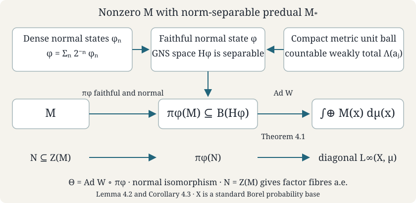

# Base changes and disintegration

*Self-checked by the writing AI. Original text: CC0 1.0.*

A direct integral describes an operator separately over each point of a measure space. The base itself is encoded by the diagonal multiplication operators. On a standard base, an isomorphism of these diagonal algebras recovers a change of variables outside null sets. After that change of variables, a unitary intertwining the diagonal algebras is a measurable family of fibre unitaries. This gives the precise uniqueness statement for disintegration.

Prerequisites are [Measurable fields and direct integrals](../reader/supplements/measurable-fields-direct-integrals.html), [Decomposable operators and the diagonal algebra](../reader/supplements/decomposable-operators-diagonal-algebra.html), [Direct integrals of von Neumann algebras](../reader/supplements/direct-integrals-of-von-neumann-algebras-commutants-and-centres-takesa.html), [Abelian operator algebras](../../foundations-of-von-neumann-algebras/abelian-operator-algebras.html), and [Polish spaces and standard Borel spaces](../../foundations-of-von-neumann-algebras/polish-spaces-and-standard-borel-spaces.html). The complete [Proposition 6.1 on diagonal intertwiners](../reader/supplements/decomposable-operators-diagonal-algebra.html#6-intertwiners-between-two-direct-integrals) uses the two-by-two direct-sum operator and the full diagonal-commutant theorem. The complete [Theorem 4.1 on field uniqueness and Theorem 4.3 on centres](../reader/supplements/direct-integrals-of-von-neumann-algebras-commutants-and-centres-takesa.html#4-uniqueness-of-the-field-centres-and-factors), and [Lemma 5.1 on countable generators](../reader/supplements/direct-integrals-of-von-neumann-algebras-commutants-and-centres-takesa.html#5-von-neumann-algebras-between-the-diagonal-and-the-decomposable-algebra), supply the precise algebra-field inputs to Sections 2 and 4. We also use the Radon–Nikodym theorem for sigma-finite measures, Tonelli's theorem and the uniform boundedness principle.

Yetter’s freely readable *Measurable Categories* treats measurable fields and changes of base. Here Theorem 2.1 and Exercise 5.1 determine the direction of the square-root density map from its norm identity. The countable-algebra and central-subalgebra constructions give the disintegration and uniqueness results under the standard Borel, sigma-finite and separable-fibre hypotheses stated below.

A **standard Borel space** is a measurable space isomorphic to a Borel subset of a Polish space. Measures here are sigma-finite Borel measures; we may use their completions, since a completed-measurable scalar function has a Borel representative outside a Borel null set. Fibres of a measurable Hilbert field are separable, with a countable fundamental sequence. We explicitly discard the region of zero fibres when recovering a base from its diagonal algebra. This region has no representation in the integral and cannot be recovered from that algebra.

The existence proof also uses [The double commutation theorem](../../foundations-of-von-neumann-algebras/the-double-commutant-theorem.html) to identify a strongly generated von Neumann algebra with a bicommutant.

## 1. The diagonal algebra recovers the base

**Theorem 1.1.** Let \((X_1,\mu_1)\) and \((X_2,\mu_2)\) be standard Borel measure spaces with sigma-finite measures. Every *-isomorphism
\[
\theta:L^\infty(X_1,\mu_1)\longrightarrow L^\infty(X_2,\mu_2)
\]
is induced by a Borel isomorphism \(\Phi:X'_2\to X'_1\) between conull Borel subsets, such that \(\Phi_*\mu_2\) and \(\mu_1\) have the same null sets and
\[
\theta(f)=f\circ\Phi\quad\text{almost everywhere},\qquad f\in L^\infty(X_1,\mu_1).
\tag{1.1}
\]
For each \(f\), this is an equality of equivalence classes; it does not prescribe one exceptional set simultaneously for arbitrary choices of representatives of every \(f\).

**Proof.** A *-isomorphism of von Neumann algebras is an order isomorphism on self-adjoint elements, and therefore preserves every least upper bound that exists. In particular it preserves bounded increasing suprema and is normal.

By Theorem 5.2 of the standard-Borel-space lesson, each \(X_i\) is Borel isomorphic to a Borel subset \(S_i\) of \([0,1]\): use that theorem for an uncountable space and an elementary countable embedding for a countable space. Write \(c_i:X_i\to S_i\) for this isomorphism, also viewed as a bounded real function. Let \(g\) be a Borel representative of \(\theta(c_1)\), with values in \([0,1]\).

We need the Borel, rather than merely continuous, functional calculus for this coordinate. For every bounded Borel \(b:[0,1]\to\mathbb C\),
\[
\theta(b(c_1))=b(g).
\tag{1.2}
\]
Continuous \(b\) satisfy this by continuous functional calculus. The identity extends to indicators of open sets by increasing continuous approximations. The sets whose indicators satisfy it form a sigma-algebra: complements are immediate, finite intersections use multiplication, and increasing countable unions use normality. They therefore include every Borel set. Uniform approximation by simple functions proves (1.2).

Since \(1_{S_1}(c_1)=1\), equation (1.2) gives \(g\in S_1\) almost everywhere. Define \(\Phi=c_1^{-1}\circ g\) there, and give it any fixed value on the remaining Borel null set. If the algebra is zero because the measure is zero, both spaces can instead be replaced by the empty conull subset; this handles that case. Every bounded Borel \(f\) on \(X_1\) is \(b(c_1)\) for a bounded Borel \(b\) on \([0,1]\), by extending \(f\circ c_1^{-1}\) by zero off \(S_1\). Hence (1.2) proves (1.1) initially for a Borel map \(\Phi\). Applying it to indicators gives
\[
\mu_1(E)=0\quad\Longleftrightarrow\quad
\mu_2(\Phi^{-1}(E))=0
\tag{1.3}
\]
for every Borel \(E\): the reverse implication uses injectivity of \(\theta\).

Apply the same construction to \(\theta^{-1}\), obtaining a Borel map \(\Psi:X_1\to X_2\), also nonsingular in both directions. Apply the two composition identities to the coordinate functions \(c_1,c_2\). Because these coordinates are injective, they imply
\[
\Phi(\Psi(x_1))=x_1\quad\text{almost everywhere},\qquad
\Psi(\Phi(x_2))=x_2\quad\text{almost everywhere}.
\]
Let \(A\subseteq X_1\), \(B\subseteq X_2\) be the Borel conull sets on which the first and second identities hold. The refined sets
\[
X'_1=A\cap\Psi^{-1}(B),\qquad X'_2=B\cap\Phi^{-1}(A)
\]
are Borel and conull by nonsingularity. On them \(\Phi\) and \(\Psi\) are inverse Borel maps. Equation (1.3) gives the asserted equivalence of measures. This simultaneous refinement is needed to obtain inverse maps everywhere on the retained sets. \(\square\)

Changing a sigma-finite measure to an equivalent finite measure does not change its \(L^\infty\)-algebra. It does change the normalization of vectors in a direct integral. That normalization is the square root in the next result.

## 2. Unitaries are fibre unitaries after a base change

For \(i=1,2\), let
\[
\mathcal H_i=\int_{X_i}^{\oplus}H_i(x)\,d\mu_i(x),
\qquad
M_i=\int_{X_i}^{\oplus}M_i(x)\,d\mu_i(x),
\]
where \(M_i(x)\subseteq B(H_i(x))\) are measurable fields of von Neumann algebras. Assume \(H_i(x)\neq0\) almost everywhere, so the diagonal algebra \(D_i\) is faithfully identified with \(L^\infty(X_i,\mu_i)\).

**Theorem 2.1.** If a unitary \(U:\mathcal H_1\to\mathcal H_2\) satisfies \(UD_1U^*=D_2\), then, outside conull Borel subsets, it has the form
\[
(U\xi)(x)=h(\Phi(x))^{-1/2}v(x)\xi(\Phi(x)),
\qquad
h=\frac{d(\Phi_*\mu_2)}{d\mu_1},
\tag{2.1}
\]
where \(\Phi:X'_2\to X'_1\) is as in Theorem 1.1 and \(v(x):H_1(\Phi(x))\to H_2(x)\) is a measurable unitary field. If also \(UM_1U^*=M_2\), then
\[
v(x)M_1(\Phi(x))v(x)^*=M_2(x)
\tag{2.2}
\]
outside one Borel null set.

**Proof.** Conjugation by \(U\) induces the diagonal isomorphism of Theorem 1.1. Discard its null sets and put \(\nu=\Phi_*\mu_2\). The measures \(\nu,\mu_1\) are equivalent and sigma-finite, so \(h=d\nu/d\mu_1\) is finite and strictly positive almost everywhere. Pull the first Hilbert field back along \(\Phi\). The map
\[
W:\mathcal H_1\longrightarrow
\int_{X_2}^{\oplus}H_1(\Phi(x))\,d\mu_2(x),
\qquad
(W\xi)(x)=h(\Phi(x))^{-1/2}\xi(\Phi(x))
\]
is unitary, since
\[
\int_{X_2}\|(W\xi)(x)\|^2\,d\mu_2(x)
=\int_{X_1}h(y)^{-1}\|\xi(y)\|^2\,d\nu(y)
=\int_{X_1}\|\xi(y)\|^2\,d\mu_1(y).
\]
Its inverse is given by the inverse change of variables and multiplication by \(h^{1/2}\), so the isometry is onto.

For every bounded measurable \(f\) on \(X_1\), \(Wm_f=m_{f\circ\Phi}W\), and \(Um_f=m_{f\circ\Phi}U\) as well. Since every bounded measurable function on \(X_2\) is a pullback on the retained bases, \(UW^{-1}\) intertwines their common diagonal algebra. Proposition 6.1 of [Decomposable operators and the diagonal algebra](../reader/supplements/decomposable-operators-diagonal-algebra.html) supplies a measurable field \(v(x)\) with \(UW^{-1}=\int^\oplus v(x)\,d\mu_2(x)\). Decomposing both unitary identities, and using uniqueness of operator fields, gives \(v(x)^*v(x)=1\) and \(v(x)v(x)^*=1\) almost everywhere. This proves (2.1).

The scalar factor in \(W\) cancels in operator conjugation. Thus \(UM_1U^*\) is the integral of the measurable field \(v(x)M_1(\Phi(x))v(x)^*\). Measurability follows by conjugating a countable measurable generating sequence. Equality with \(M_2\) and Theorem 4.1 of [Direct integrals of von Neumann algebras](../reader/supplements/direct-integrals-of-von-neumann-algebras-commutants-and-centres-takesa.html) give (2.2) outside one null set. Enlarge the removed set in \(X_2\) and its image in \(X_1\); both are Borel null sets because the retained base map is a nonsingular Borel isomorphism. \(\square\)

**Corollary 2.2.** Let \(A\) be a separable C*-algebra, and let \(\pi_i=\int^\oplus\pi_{i,x}\,d\mu_i(x)\) be measurable direct integrals of representations. If \(U\) intertwines \(\pi_1,\pi_2\) and carries \(D_1\) onto \(D_2\), then the same formula (2.1) holds, with
\[
v(x)\pi_{1,\Phi(x)}(a)v(x)^*=\pi_{2,x}(a)
\quad\text{for every }a\in A
\tag{2.3}
\]
outside one null set.

**Proof.** Apply Theorem 2.1 to the diagonals. For any fixed \(a\), decomposing the intertwining identity gives (2.3) almost everywhere. Choose a countable norm-dense subset of \(A\) and remove the union of its exceptional sets. Every representation is contractive, so equality extends by norm continuity to all \(a\in A\) on the same remaining set. \(\square\)

The nonzero-fibre condition concerns recovery of the base. For example, a one-point integral with fibre \(\mathbb C\) and a two-point integral with fibres \(\mathbb C,0\), both with counting measure, have the same Hilbert space and diagonal algebra. Their full bases are not isomorphic modulo null sets. Restricting to the support \(\{x:\dim H(x)>0\}\) resolves this ambiguity.

## 3. A countable algebra disintegrates simultaneously

Let \(\mathcal H=\int_X^\oplus H(x)\,d\mu(x)\), with diagonal algebra \(D\). A field of representations \(\pi_x:A\to B(H(x))\) is **measurable** when \(x\mapsto\pi_x(a)\) is a measurable operator field for every \(a\in A\). Contractivity makes these fields essentially bounded. Their direct integral is the representation \(a\mapsto\int_X^\oplus\pi_x(a)\,d\mu(x)\).

**Theorem 3.1.** If \(A\) is separable and \(\pi:A\to B(\mathcal H)\) has image commuting with \(D\), it is the direct integral of a measurable field of representations. That field is unique outside one null set.

**Proof.** Choose a countable norm-dense *-subalgebra \(A_{\mathbb Q}\) over \(\mathbb Q+i\mathbb Q\). To obtain it, start with a countable norm-dense set and close under sums, products, adjoints and rational complex scalar multiples. For every \(a\in A_{\mathbb Q}\), the diagonal commutant theorem supplies a measurable representative \(a(x)\) of \(\pi(a)\), with \(\|a(x)\|\leq\|\pi(a)\|\leq\|a\|\) outside a null set.

The identities
\[
(a+b)(x)=a(x)+b(x),\quad
(ab)(x)=a(x)b(x),\quad
a^*(x)=a(x)^*,\quad
(\lambda a)(x)=\lambda a(x)
\]
hold almost everywhere for each \(a,b\in A_{\mathbb Q}\) and \(\lambda\in\mathbb Q+i\mathbb Q\), by uniqueness of representing operator fields. There are countably many such identities and bounds. Discard their common exceptional set. At every retained \(x\), \(a\mapsto a(x)\) is a contractive rational-complex *-homomorphism, and therefore extends uniquely to a contractive complex *-homomorphism \(\pi_x:A\to B(H(x))\). Complex linearity follows by approximating any complex scalar by rational complex scalars; multiplicativity and the adjoint identity persist under norm limits. Set \(\pi_x=0\) on the removed set.

For \(a_n\in A_{\mathbb Q}\) tending in norm to \(a\), the operators \(\pi_x(a_n)\) tend in norm to \(\pi_x(a)\) at every retained point. Their action on any measurable section therefore converges pointwise, so the limit field is measurable. The uniform estimate \(\|\pi_x(a_n-a)\|\leq\|a_n-a\|\) proves convergence of their direct integrals in operator norm. Those integrals are \(\pi(a_n)\), whose limit is \(\pi(a)\). This proves existence.

If another field has the same integral, equality of the operator fields holds almost everywhere for each \(a\) in a countable dense subset. Remove those countably many exceptional sets and extend the equality by contractivity to all of \(A\). \(\square\)

The countability is used before taking a union of exceptional sets. An uncountable family of almost-everywhere identities cannot be made simultaneous by that argument.

**Lemma 3.2.** Suppose decomposable operators \(T_n\) converge strongly to a decomposable \(T\). There is a subsequence whose fibre operators converge strongly to \(T(x)\) outside one null set. The base need only be sigma-finite.

**Proof.** The uniform boundedness principle gives \(C=\sup_n\|T_n\|<\infty\). After discarding a common null set, all fibre norms are bounded by \(C\) and \(\|T(x)\|\leq\|T\|\). Choose a measurable orthonormal fundamental sequence \(e_k(x)\), allowing zero vectors where the fibre dimension is too small. Choose a strictly positive measurable weight \(w\) with \(\int_Xw\,d\mu<\infty\), as in Lemma 3.1 of the decomposable-operator lesson. Then \(\xi_k=w^{1/2}e_k\in\mathcal H\).

Choose successively \(n_j\) so large that
\[
\|(T_{n_j}-T)\xi_k\|^2\leq2^{-j}\qquad(k\leq j).
\]
For each fixed \(k\), the sum of these squared norms is finite. Tonelli implies
\[
\sum_j\|(T_{n_j}(x)-T(x))\xi_k(x)\|^2<\infty
\]
almost everywhere. Remove the union of these exceptional sets for all \(k\). Since \(w(x)>0\), convergence holds on every \(e_k(x)\) there. Those vectors span a dense subspace of the fibre; the common operator bound extends convergence to every fibre vector. \(\square\)

**Corollary 3.3.** If \(\pi\) in Theorem 3.1 is nondegenerate, almost every \(\pi_x\) is nondegenerate.

**Proof.** A separable C*-algebra has a sequential contractive approximate identity \((u_n)\). One obtains such a sequence from any approximate identity by choosing terms that act within \(1/n\) of the identity on the first \(n\) members of a countable dense set, on both sides. Nondegeneracy gives \(\pi(u_n)\to1\) strongly. Apply Lemma 3.2 to obtain a subsequence converging strongly to the fibre identity almost everywhere. Its values lie in \(\pi_x(A)\), so their ranges have dense span in \(H(x)\). \(\square\)

## 4. Existence over any central subalgebra

**Theorem 4.1.** Let \(M\subseteq B(H)\) be a von Neumann algebra on a separable Hilbert space, and let \(N\subseteq Z(M)\) be a von Neumann subalgebra with the same identity. There are a standard Borel probability space \((X,\mu)\) and a measurable field \(M(x)\subseteq B(H(x))\) such that, up to unitary equivalence,
\[
H=\int_X^\oplus H(x)\,d\mu(x),\qquad
M=\int_X^\oplus M(x)\,d\mu(x),
\tag{4.1}
\]
and \(N\) is exactly the diagonal algebra. If \(N=Z(M)\), almost every \(M(x)\) is a factor. For \(H=0\), use the empty base instead.

**Proof.** We first put the action of \(N\) in diagonal form, including its multiplicity. Theorem 8.2 of [Abelian operator algebras](../../foundations-of-von-neumann-algebras/abelian-operator-algebras.html) supplies a self-adjoint \(a\in N\) generating \(N\) as a von Neumann algebra. Decompose the representation of \(C^*(a,1)\) into orthogonal cyclic reducing subspaces. A maximal such family exhausts \(H\); it is countable because \(H\) is separable. Theorem 3.1 of that lesson identifies these subspaces with \(L^2(\sigma(a),\nu_j)\), for probability measures \(\nu_j\), with \(a\) acting as multiplication by \(t\).

Choose positive weights \(c_j\) with \(\sum_jc_j=1\), and set \(\mu=\sum_jc_j\nu_j\). Let \(f_j=d\nu_j/d\mu\), choosing Borel versions finite almost everywhere, and let \(F_j=\{f_j>0\}\). Multiplication by \(f_j^{1/2}\) gives a unitary
\[
L^2(\nu_j)\longrightarrow L^2(F_j,\mu).
\]
It is isometric by the Radon–Nikodym identity, and its inverse is multiplication by \(f_j^{-1/2}\) on \(F_j\). Regrouping the countable direct sum gives
\[
\bigoplus_j L^2(F_j,\mu)
\cong\int_X^\oplus H(t)\,d\mu(t),\qquad
H(t)=\overline{\operatorname{span}}\{\varepsilon_j:t\in F_j\}\subseteq\ell^2(J).
\tag{4.2}
\]
The fields \(1_{F_j}(t)\varepsilon_j\) are a measurable fundamental sequence; (4.2) follows by summing the squared norms and applying Tonelli. Their Gram matrix has Borel entries, so the Hilbert field is measurable. The union of the \(F_j\) is conull: from the definition of \(\mu\), \(\sum_jc_jf_j=1\) almost everywhere. Discard any zero-fibre region and the common exceptional sets. The remaining \(X\) is a Borel subset of the compact metric space \(\sigma(a)\), hence standard, and \(\mu\) is still a probability measure.

In this model \(a\) is multiplication by \(t\). Its bounded Borel functional calculus supplies every diagonal multiplier: every bounded Borel function on \(X\) extends to a bounded Borel function on \(\sigma(a)\). Conversely, diagonal multipliers form a von Neumann algebra containing \(a\). Therefore \(N\), the algebra generated by \(a\), is exactly the diagonal algebra.

Next choose a countable strongly dense subset of the unit ball of \(M\). Such a subset exists: on bounded sets, strong convergence is tested on a countable dense set of vectors, embedding the ball into a countable product of separable metric spaces. That product is second countable, as is each of its subspaces, and every second countable space has a countable dense subset. Let \(A\subseteq M\) be the unital C*-algebra generated by those operators and their adjoints. It is norm separable and \(A''=M\), by the double commutation theorem. Since \(N\subseteq Z(M)\), the identity representation of \(A\) commutes with the diagonal algebra.

Theorem 3.1 gives a measurable field of representations \(\pi_t\) of \(A\); set \(M(t)=\pi_t(A)''\). A countable norm-dense subset of \(A\) gives measurable generators, so this is a measurable von Neumann algebra field. Lemma 5.1 of [Direct integrals of von Neumann algebras](../reader/supplements/direct-integrals-of-von-neumann-algebras-commutants-and-centres-takesa.html) identifies its integral with the von Neumann algebra generated by \(A\) and the diagonal algebra \(N\). Since \(A''=M\) and \(N\subseteq M\), that algebra is \(M\). This proves (4.1).

Finally, Theorem 4.3 of the same lesson identifies the centre of the integral with the integral of fibre centres. If \(N=Z(M)\), the centre is the diagonal algebra, so that theorem implies almost every fibre is a factor. \(\square\)

An abstract algebra with separable predual admits the same construction.

The Hilbert space in Theorem 4.1 is part of a representation. An abstract von Neumann algebra can have a separable predual while acting in another faithful normal representation on a nonseparable Hilbert space. The next construction chooses a separable representation from the intrinsic predual. Its conclusion is an abstract algebra isomorphism; it makes no assertion that the original nonseparable representation is unitarily equivalent to this one.

**Lemma 4.2 (A separable faithful normal realization).** Let \(M\ne0\) be a von Neumann algebra with norm-separable predual \(M_*\). There is a faithful normal state \(\varphi\), and its GNS representation \(\pi_\varphi:M\to B(H_\varphi)\) has separable Hilbert space. The image is a von Neumann algebra, and \(\pi_\varphi\) is a normal *-isomorphism onto it with normal inverse.

**Proof.** The normal state space is a subset of the separable metric space \(M_*\), hence has a countable norm-dense sequence \((\varphi_n)\). It is nonempty. Normal positive functionals separate positive elements: in any faithful normal concrete realization, if \(a\ge0\) is nonzero, some unit vector \(\eta\) has \(\langle a\eta,\eta\rangle>0\), and its restricted vector state is normal. For abstract \(W^*\)-algebras the existence of such a realization is the complete [Sakai theorem, Theorem 9.2](../../foundations-of-von-neumann-algebras/the-universal-enveloping-von-neumann-algebra-of-a-c-star-algebra-and-w-star-algebras.html#oa-fnd-wa-22). Set
\[
\varphi=\sum_{n=1}^{\infty}2^{-n}\varphi_n.
\tag{4.3}
\]
The series converges in \(M_*\). It is positive and has \(\varphi(1)=1\). If \(a\in M_+\) and \(\varphi(a)=0\), all nonnegative summands \(\varphi_n(a)\) vanish. Norm density implies that every normal state vanishes on \(a\). The preceding separation then forces \(a=0\); thus \(\varphi\) is faithful.

For completeness, the GNS space here is the completion of \(M\) with inner product
\[
\langle\Lambda(a),\Lambda(b)\rangle=\varphi(b^*a).
\]
Faithfulness makes its null space zero. Left multiplication gives
\[
\pi_\varphi(x)\Lambda(a)=\Lambda(xa),\qquad
\|\Lambda(xa)\|^2\le\|x\|^2\|\Lambda(a)\|^2.
\]
This defines a unital *-representation, with cyclic vector \(\Lambda(1)\), and it is faithful because \(\pi_\varphi(x)=0\) implies \(\Lambda(x)=0\). These identities and the completion are the [GNS construction, Construction 5.1, Lemma 5.2 and Theorem 5.4](../../foundations-of-von-neumann-algebras/representations-and-positive-functionals-the-gns-construction-and-the-gelfand-naimark.html#oa-fnd-gn-05).

We check normality without assuming it from cyclicity. For \(a,b\in M\), the coefficient functional is
\[
x\longmapsto
\langle\pi_\varphi(x)\Lambda(a),\Lambda(b)\rangle
=\varphi(b^*xa)\in M_*.
\tag{4.4}
\]
Fixed multiplication preserves the predual, by the complete [ultraweak coefficient-series proof, BK-03](../../OA-MOD/bounded-operator-kernel.html#OA-MOD-BK-03). Approximate any two vectors in \(H_\varphi\) by vectors of the form \(\Lambda(a)\). The estimate
\[
\|\omega_{\xi,\eta}\circ\pi_\varphi
 -\omega_{\xi',\eta'}\circ\pi_\varphi\|
\le\|\xi-\xi'\|\,\|\eta\|
 +\|\xi'\|\,\|\eta-\eta'\|
\]
and norm-closedness of \(M_*\) show that every coefficient remains normal. A normal functional on \(B(H_\varphi)\) is a norm-convergent sum of vector coefficients, so its composite with \(\pi_\varphi\) lies in \(M_*\). This is normality of the representation. The complete [normal-representation proof, Proposition 12.1](../../foundations-of-von-neumann-algebras/the-universal-enveloping-von-neumann-algebra-of-a-c-star-algebra-and-w-star-algebras.html#oa-fnd-wa-26), gives these coefficient-series and predual steps and proves that a normal representation has von Neumann algebra image and that a faithful one has normal inverse.

It remains to prove separability; a cyclic vector by itself is insufficient. Let \(B=M_1\). By Banach-Alaoglu and separability of \(M_*\), \(B\) is a compact metrizable space in \(\sigma(M,M_*)\). The full proofs are [Weak topologies, Theorem 3.1 and Proposition 3.2](../../foundations-of-von-neumann-algebras/weak-topologies-tychonoff-banach-alaoglu-mazur-bipolars-krein-milman-and-eberlein-smulian.html#oa-fnd-wt-03). A compact metric space has a countable dense subset: for each positive integer \(k\), take a finite subcover by metric balls of radius \(1/k\), and take their centres. Choose such a sequence \((a_j)\subseteq B\).

The map \(\Lambda:B\to H_\varphi\) is continuous from \(\sigma(M,M_*)\) to the weak Hilbert topology. Indeed, for \(b\in M\),
\[
\langle\Lambda(a),\Lambda(b)\rangle=\varphi(b^*a)
\]
is a normal functional of \(a\). For any \(\eta\in H_\varphi\), approximate \(\eta\) in norm by such \(\Lambda(b)\); the estimate
\[
\sup_{a\in B}|\langle\Lambda(a),\eta-\Lambda(b)\rangle|
\le\|\eta-\Lambda(b)\|
\]
proves the same continuity for \(\eta\), since \(\|\Lambda(a)\|\le1\) on \(B\). Consequently every \(\Lambda(a)\), \(a\in B\), lies in the weak closure of \(\{\Lambda(a_j):j\ge1\}\).

Let \(L\) be the norm-closed linear span of the countable set \(\{\Lambda(a_j)\}\). A norm-closed linear subspace of a Hilbert space is weakly closed: if \(\eta\notin L\), the nonzero vector \(\eta-P_L\eta\) defines a continuous coefficient that vanishes on \(L\) but not on \(\eta\). Thus \(\Lambda(B)\subseteq L\). Every \(a\in M\) is a scalar multiple of an element of \(B\), and \(\Lambda(M)\) is dense by construction. Hence \(L=H_\varphi\). Finite linear combinations with coefficients in \(\mathbb Q+i\mathbb Q\) give a countable norm-dense subset of \(H_\varphi\), proving separability. \(\square\)

**Corollary 4.3 (Abstract realization over any central subalgebra).** Let \(M\) have separable predual, and let \(N\subseteq Z(M)\) be a von Neumann subalgebra with the same identity. If \(M\ne0\), there are a standard Borel probability space \((X,\mu)\), a measurable field of separable Hilbert spaces \(H(x)\), a measurable field of von Neumann algebras \(M(x)\subseteq B(H(x))\), and a normal *-isomorphism
\[
\Theta:M\longrightarrow\int_X^\oplus M(x)\,d\mu(x)
\]
which takes \(N\) onto the diagonal algebra. If \(N=Z(M)\), almost every \(M(x)\) is a factor. The zero algebra uses the empty base.

**Proof.** For \(M\ne0\), apply Lemma 4.2. Its faithful normal representation gives a von Neumann algebra \(\pi_\varphi(M)\) on the separable space \(H_\varphi\). Since \(\pi_\varphi\) and its inverse are normal, \(\pi_\varphi(N)\) is a von Neumann subalgebra of \(Z(\pi_\varphi(M))\). Theorem 4.1 applied to that pair provides a unitary \(W\) and the required probability field. Set \(\Theta(x)=W\pi_\varphi(x)W^*\). This is normal with normal inverse, carries \(N\) to the diagonals, and has exactly the asserted fibre conclusion. \(\square\)

This gives the individual-algebra realization at separable-predual scope even when a previously chosen concrete representation is nonseparable. The representation selected in Lemma 4.2 controls the Hilbert multiplicity of the construction. An isomorphism of abstract algebras does not by itself give a unitary between arbitrary faithful normal representations.

*Construction diagram.* For a nonzero algebra with separable predual, Lemma 4.2 constructs the faithful normal state and the separable GNS space. Theorem 4.1 supplies the unitary \(W\); Corollary 4.3 gives \(\Theta=\operatorname{Ad}W\circ\pi_\varphi\). The bottom row tracks the specified central subalgebra. This is an abstract normal isomorphism; the diagram makes no claim about unitary equivalence with another representation. The exact earlier Sakai, GNS and Banach–Alaoglu proofs are linked in Lemma 4.2.

Existence and uniqueness answer different questions. Theorem 4.1 constructs a base and fibres from a chosen central subalgebra. Theorem 2.1 compares two such constructions when the unitary identification also identifies their diagonal algebras.

## 5. Exercises with complete solutions

**Exercise 5.1 — Which way does the density go? (intermediate).** Take \(X_1=X_2=(0,1)\), \(\mu_1=dx\), \(\mu_2=2x\,dx\), and \(\Phi(x)=x\), with scalar fibres. Write the unitary from \(L^2(\mu_1)\) to \(L^2(\mu_2)\) that implements the identity base map. Explain why multiplication by the opposite square-root density fails.

**Solution.** Here \(h(x)=2x\). The correct map is \(W\xi(x)=(2x)^{-1/2}\xi(x)\), with inverse \(\eta\mapsto(2x)^{1/2}\eta\). Its target norm squared is \(\int_0^1(2x)^{-1}|\xi(x)|^2\,2x\,dx=\|\xi\|^2\). Multiplication by \((2x)^{1/2}\) in the same direction instead has norm squared \(\int_0^1 4x^2|\xi(x)|^2\,dx\), which is generally different. The correct multiplier is unbounded near zero as a scalar function, but defines a unitary between these two differently weighted Hilbert spaces.

**Exercise 5.2 — Multiplicity survives a change of variables (basic).** Over \(X=\{0,1,2\}\) with counting measure, let the fibre dimensions be \(1,2,3\). Describe the unitaries that carry the diagonal algebra onto itself. Which permutations of \(X\) can occur?

**Solution.** A diagonal-algebra automorphism permutes its three minimal projections. Theorem 2.1 says that a unitary implementing such a permutation must give a unitary between the corresponding fibres. Thus it must preserve their dimensions. Because \(1,2,3\) are distinct, only the identity permutation occurs, and the permitted unitaries are arbitrary block diagonal elements of \(U(1)\oplus U(2)\oplus U(3)\). If two dimensions were equal, those two points could also be exchanged, with arbitrary unitaries between the equal-dimensional fibres.

**Exercise 5.3 — One subsequence rather than one per vector (advanced).** Let \(T_n,T\) be as in Lemma 3.2 and suppose \(H(x)=\mathbb C^2\) everywhere. Show that some subsequence converges in operator norm on almost every fibre. Explain why the same conclusion need not hold for infinite-dimensional fibres.

**Solution.** Lemma 3.2 gives a single subsequence converging strongly on both standard basis vectors outside a common null set. If \(R_j(x)=T_{n_j}(x)-T(x)\), then
\[
\|R_j(x)\|\leq
\bigl(\|R_j(x)\varepsilon_1\|^2+\|R_j(x)\varepsilon_2\|^2\bigr)^{1/2}\longrightarrow0.
\]
The inequality follows by applying Cauchy–Schwarz to \(R_j(\alpha\varepsilon_1+\beta\varepsilon_2)\). For the infinite-dimensional counterexample use a one-point probability base with fibre \(\ell^2(\mathbb N)\) and let \(T_n\) be the rank-one projection onto \(\varepsilon_n\). Then \(T_n\to0\) strongly, but every \(T_n\) has norm one, so no subsequence converges in norm.

## References

- [Yetter] David N. Yetter, *Measurable Categories*, [arXiv:math/0309185v2, 6 September 2004](https://arxiv.org/html/math/0309185v2).
- [Takesaki] M. Takesaki, *Theory of Operator Algebras I*, Springer, 1979.

Yetter’s Theorem 28 states the source and target of the square-root density map in the reverse direction to its displayed norm identity. The direction used here is derived in Theorem 2.1 and Exercise 5.1.
