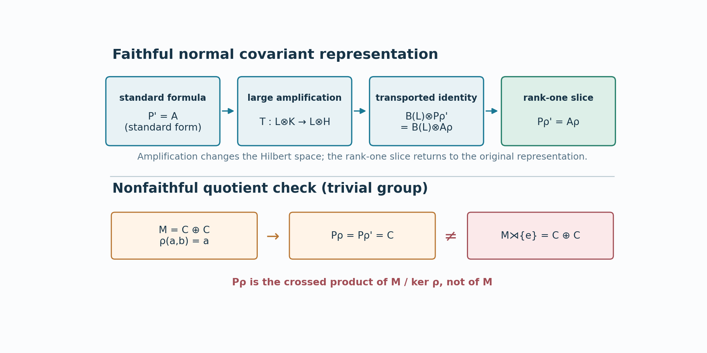

# The regular commutant in every covariant representation

The standard-form calculation in lesson 75 has the right answer for an arbitrary normal covariant representation, but changing representation is not a unitary change of the original Hilbert space. Finite-dimensional representations can even have different dimensions. We first show that two faithful normal representations become unitarily equivalent after one sufficiently large amplification. The standard commutant formula survives that amplification, and a rank-one slice removes the added Hilbert factor. A nonfaithful representation is then handled by its quotient algebra; this also exposes a faithfulness qualification in the source's following corollary.

*Written in Codex (OpenAI), September 2026. This lesson and its figure is dedicated under CC0.*

## Faithful representations become equivalent after amplification

Let \(\rho_i:M\to B(K_i)\), \(i=1,2\), be faithful normal unital representations of a nonzero von Neumann algebra. Hilbert spaces and preduals may have arbitrary dimension. We use one precise general input: every normal positive functional on a concrete von Neumann algebra is a countable sum of positive vector functionals with summable squared vector norms. [Theorem 10.1 of the double-commutant lesson](../../../foundations-of-von-neumann-algebras/the-double-commutant-theorem.html#OA-FND-BI-14) proves that assertion on an arbitrary Hilbert space for every sigma-strong continuous positive functional. A normal functional is sigma-weak continuous and therefore sigma-strong continuous by [Lemma 1.2(b)](../../../foundations-of-von-neumann-algebras/the-double-commutant-theorem.html#oa-fnd-bi-01). OA-MOD-SC-02 remains an alternative proof. The normal positive functional corresponding to a cyclic vector for \(\rho_1\) can therefore be implemented by a single vector in \(K_2\otimes\ell^2(\mathbb N)\).

Here are the details. Decompose \(K_1=\bigoplus_{i\in I}K_{1,i}\) into reducing cyclic subspaces, using a maximal orthogonal family. For a cyclic vector \(\xi_i\), let \(\varphi_i(x)=\langle\rho_1(x)\xi_i,\xi_i\rangle\). [WA Proposition 12.1](../../../foundations-of-von-neumann-algebras/the-universal-enveloping-von-neumann-algebra-of-a-c-star-algebra-and-w-star-algebras.html#oa-fnd-wa-26) says that the faithful normal unital \(\rho_2\) has a von Neumann algebra image and a sigma-weak continuous inverse onto that image. Thus \(\varphi_i\circ\rho_2^{-1}\) is normal and positive on \(\rho_2(M)\). Theorem 10.1 supplies vectors \(v_{i,n}\in K_2\), with \(\sum_n\|v_{i,n}\|^2=\varphi_i(1)<\infty\), such that

$$\varphi_i(x)=\sum_{n\geq1}
   \langle\rho_2(x)v_{i,n},v_{i,n}\rangle. \tag{E1}$$

The formula

$$T_i\rho_1(x)\xi_i
   =\bigl(\rho_2(x)v_{i,n}\bigr)_{n\geq1} \tag{E2}$$

is well defined and isometric: the squared norm on either side is \(\varphi_i(x^*x)\). It intertwines the two representations on the cyclic subspace. Direct summation embeds \(\rho_1\) into an amplification of \(\rho_2\). Reversing the roles embeds \(\rho_2\) into an amplification of \(\rho_1\). Choose an infinite cardinal \(\kappa\) larger than both cyclic index sets; tensoring the embeddings by \(\ell^2(\kappa)\) and absorbing their countable and index multiplicities produces intertwining isometries in both directions between

$$\rho_1^{(\kappa)}=1_{\ell^2(\kappa)}\otimes\rho_1,
   \qquad \rho_2^{(\kappa)}=1_{\ell^2(\kappa)}\otimes\rho_2. \tag{E3}$$

For completeness, mutual isometric embeddings imply unitary equivalence for representations, not just for Hilbert spaces. Write \(i:H_1\to H_2\) and \(j:H_2\to H_1\) for the intertwining isometries and \(q=ji\). Let \(A=H_1\ominus jH_2\) and \(E=\bigoplus_{n\geq0}q^nA\). All these subspaces reduce the represented algebra because the isometries intertwine it and their range projections lie in its commutant. The summands are orthogonal: \(A\perp qH_1\), and \(q\) is an isometry. Moreover \(H_1\ominus E\subseteq jH_2\), and

$$H_2=i(E)\oplus j^*(H_1\ominus E). \tag{E4}$$

Indeed, applying \(j\) to the orthogonal complement of \(i(E)\) in \(H_2\) gives \((H_1\ominus A)\ominus qE=H_1\ominus E\). Thus the map equal to \(i\) on \(E\) and \(j^*\) on \(H_1\ominus E\) is a surjective intertwining isometry. Applied to (E3), it gives a unitary \(T\) satisfying

$$T\rho_1^{(\kappa)}(x)T^*=\rho_2^{(\kappa)}(x)
   \quad(x\in M). \tag{E5}$$

This lemma uses arbitrary cardinal amplification only to compare representations. It adds no countability or semifiniteness hypothesis to \(M\) or \(G\).

## The amplified commutant and the rank-one slice

Let \((\rho,V,K)\) be a **faithful normal unital** covariant representation of \((M,G,\alpha)\), with \(V\) strongly continuous. Write \(P_\rho\) for its regular crossed product on \(L^2(G,K)\), and put

$$A_\rho=\bigl(\rho(M)'\otimes1\ \cup\
       \{V_g\otimes R_g:g\in G\}\bigr)''. \tag{E6}$$

Choose the standard representation \((\pi,U,H)\) used in lesson 75 and an amplification \(L=\ell^2(\kappa)\) for which (E5) supplies \(T:L\otimes K\to L\otimes H\). Transport \(1_L\otimes V_g\) through \(T\). The resulting implementer \(\widehat V_g\) and \(1_L\otimes U_g\) implement the same automorphism on \(1_L\otimes\pi(M)\); hence

$$w_g=\widehat V_g(1_L\otimes U_g)^*
  \in(1_L\otimes\pi(M))'. \tag{E7}$$

The tensor steps use the complete proofs of [Theorem 5.2](../../reader/supplements/spatial-tensor-products.html#5-the-spatial-tensor-product) and [Proposition 7.1](../../reader/supplements/spatial-tensor-products.html#7-tensor-products-with-bk-commutants-and-matrix-units) of the spatial tensor supplement, together with its [associativity and spatial-transport rules](../../reader/supplements/spatial-tensor-products.html#8-maps-between-tensor-products-and-normal-homomorphisms). Proposition 7.1, after flipping the two factors, gives \((1_L\otimes A)'=B(L)\bar\otimes A'\) for every concrete von Neumann algebra A on an arbitrary Hilbert space. The amplified regular algebra is \(1_L\otimes P_\pi\), and its proposed commutant generators generate precisely \(B(L)\bar\otimes A_\pi\): the coefficient commutant is \(B(L)\bar\otimes\pi(M)'\), while the group generators are \(1_L\otimes(U_g\otimes R_g)\). Theorem 5.2(2) identifies the generated algebra. Thus the standard formula (I5) gives

$$
(1_L\otimes P_\pi)'=B(L)\bar\otimes P_\pi'
 =B(L)\bar\otimes A_\pi.
$$

This proves the commutant identity for the amplified standard representation with implementer \(1_L\otimes U\). Replacing that implementer by \(\widehat V\) leaves the generated commutant unchanged: multiplying each group generator by \(w_g\otimes1\), already in the coefficient commutant, produces the new generator, and the inverse multiplication gives the reverse inclusion. Transport by \(T\otimes1\) therefore proves the same identity for \((1_L\otimes\rho,1_L\otimes V)\).

Reorder \(L\otimes K\otimes L^2G\). Its regular crossed product is \(1_L\otimes P_\rho\), with commutant \(B(L)\bar\otimes P_\rho'\). On the claimed generator side, \((1_L\otimes\rho(M))'=B(L)\bar\otimes\rho(M)'\), and the group generators are \(1_L\otimes(V_g\otimes R_g)\). Thus the amplified identity says exactly

$$B(L)\bar\otimes P_\rho'
   =B(L)\bar\otimes A_\rho. \tag{E8}$$

Take any unit vector \(e\in L\) and slice both sides with its rank-one vector state. [Theorem 9.2(4) of the spatial tensor supplement](../../reader/supplements/spatial-tensor-products.html#9-slice-maps) gives the normal map \((\omega_e\otimes\iota)(X)=W_e^*XW_e\), where \(W_e\xi=e\otimes\xi\), with range in A on \(B(L)\bar\otimes A\) and value x on \(1_L\otimes x\). These facts hold at arbitrary Hilbert dimension. Every \(x\in P_\rho'\) appears as the slice of \(1_L\otimes x\) on the left, and normal slices of the right lie in \(A_\rho\); this gives \(P_\rho'\subseteq A_\rho\). The same argument in reverse gives the other inclusion. We obtain the full regular commutant formula

$$\boxed{\displaystyle P_\rho'
   =\bigl(\rho(M)'\otimes1\ \cup\
       \{V_g\otimes R_g:g\in G\}\bigr)''.} \tag{E9}$$

The rank-one slice is the precise step that removes the arbitrary multiplicity. It does not assert a spatial unitary between the original, unamplified representations.

## A nonfaithful representation and the source qualification

If \(\rho\) is normal and unital but not faithful, its kernel is an ultraweakly closed central ideal \(zM\). Covariance makes \(z\) invariant under \(\alpha\). The action therefore descends to \(M/zM\), which \(\rho\) represents faithfully as the concrete algebra \(\rho(M)\). Applying (E9) to this quotient proves the same displayed commutant identity for the original \(\rho\), without a faithfulness condition. The abstract algebra represented by its regular crossed product is, however,

$$P_\rho\ \cong\ (M/zM)\rtimes G, \tag{E10}$$

by the faithful regular-model comparison of lesson 15. The two unitaries \(C\) and \(W\) from lesson 76 use only the implementation \(V\) and (E9); they now give

$$P_\rho'\ \cong\ \rho(M)'\rtimes_{\operatorname{Ad}V}G. \tag{E11}$$

For a faithful \(\rho\), (E10) is \(M\rtimes G\), so (E10)–(E11) recover both source isomorphisms of Corollary X.1.22(i). If “normal representation” is read literally to include a nonfaithful unital one, its first displayed isomorphism needs the quotient in (E10). Thus the first isomorphism requires either faithfulness or the quotient displayed in (E10).

*Figure 77.1.* The upper route is the exact proof mechanism: sufficiently large amplification makes faithful normal representations spatially equivalent; the commutant identity is then an equality after tensoring with \(B(L)\); a rank-one normal slice removes \(B(L)\). The lower example takes the trivial group, \(M=\mathbb C\oplus\mathbb C\), and \(\rho(a,b)=a\) on \(\mathbb C\). Then \(P_\rho=P_\rho'=\mathbb C\), while \(M\rtimes\{e\}=\mathbb C\oplus\mathbb C\). This disproves the unqualified first isomorphism under a literal nonfaithful reading; it does not dispute the commutant formula (E9).

**Problem.** Why is the summation in (E1) countable even when \(K_2\) is nonseparable?

**Solution.** It represents one fixed normal positive functional, for which Theorem 10.1 supplies a square-summable sequence; OA-MOD-SC-02 is an alternative. The cyclic decomposition of the entire representation may have an arbitrarily large index set \(I\), and the later \(\kappa\)-amplification absorbs that index set. No countable family of functionals is chosen to distinguish all of \(M\).

The source locators are Takesaki, *Theory of Operator Algebras II*, Definition X.1.3 Theorem X.1.21 and Corollary X.1.22(i). The primary positive-vector-series input is BI Theorem 10.1, with BI Lemma 1.2(b) and WA Proposition 12.1 as the exact topology and normal-image results; OA-MOD-SC-02 remains an alternative. The standard commutant input is lesson 75's direct coefficient-Hilbert-algebra application of MF-05 after FLOW12 M25.  The source's nonfaithful representation convention requires the stated quotient in E10; E9 holds through that invariant quotient.
