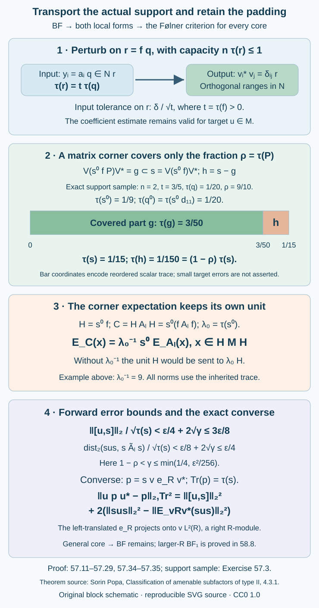

# Supported frames give local approximation corners

A frame can be almost invariant before it has exact orthogonal ranges. Local quantization and supported perturbation turn it into a finite collection of partial isometries. To move those ranges into a late tunnel corner, we keep two traces in view: the actual initial support is \(fq\), and the finite matrix algebra may have an identity \(P\) smaller than \(1\). The uncovered part becomes a controlled padding projection. This yields both local approximation forms and a direct converse for every core.

The result below starts from the precise bounded-frame property BF. Bounded frames can keep their central support, Theorem 53.5, supplies BF from integer-rounded Følner input. The general-core existence of that rounded input remains a further theorem. The distinct larger-core factorial implication to full-support BF is proved in [Full support from a factorial larger core](larger-factor-central-balancing.md), Corollary 58.8. Corollary 57.5 proves the complete smaller-core factorial specialization. No separability or extremality hypothesis is added.

The local approximation theorem is due to Sorin Popa, [*Classification of amenable subfactors of type II*](https://doi.org/10.1007/BF02392646), Theorem 4.3.1, printed pp. 217–219. The proof here writes the finite-stage matrix construction, actual support normalization, padding estimates, corner expectation and converse trace identity explicitly.

Let \(N\subset M\) be a proper finite-index inclusion of II₁ factors, with faithful normal normalized trace \(\tau\). No separability or extremality hypothesis is added. For any chosen tunnel write

\[
\begin{gathered}
A_j=N_j'\cap M,\\
B_j=N_j'\cap N,\\
R=(\bigcup_j A_j)'',\\
S=R\cap N.
\end{gathered}
\tag{57.1}
\]

We use Theorem 4.5 of [Going up and down the Jones tower](towers-and-tunnels.md), Proposition 50.5 of [A common tensor factor in a core inclusion](relative-tensor-absorption.md), Lemma 51.1 of [Transported cups realize a smaller core](transporting-a-core-through-a-tensor-factor.md), Theorem 53.5 of Bounded frames can keep their central support, Theorem 54.2 of [Pinching errors and completing supported frames](pinching-and-supported-perturbation.md), and Theorem 55.7 of [Finite Fourier bases produce one small quantized corner](finite-phase-local-quantization.md). The converse uses the canonical trace conventions of Lemma 52.2 in Changing a core changes its canonical trace by n² and the full criterion in Theorem 49.2 of [Relative hypertraces and finite Følner projections](relative-hypertraces-and-folner-projections.md). General tracial expectations, scalar trace uniqueness in factors, polar decomposition and projection comparison are the precise programme prerequisites already declared in those lessons. This proof imports no general expectation or fusion theory beyond those declarations.

**Bounded-frame property BF.** For every finite \(U\subset\mathcal U(M)\) and \(\eta>0\), some tunnel and stage \(j_0\) admit \(n\geq1\), nonzero projections \(f\in Z(B_{j_0})\) and \(z\in Z(S)\), and bounded \(a_i\in Nf\), such that

\[
\begin{gathered}
E_{A_{j_0}}(a_i^*a_l)=\delta_{il}f,\\
\|f-z\|_2<\eta\sqrt{\tau(f)},\\
\begin{aligned}
0\leq {}&2n\tau(f)\\
&-2\sum_{i,l}\|E_{A_{j_0}}(a_i^*u a_l)\|_2^2\\
&<\eta n\tau(f)\qquad(u\in U).
\end{aligned}
\end{gathered}
\tag{57.2}
\]

The optional full-support version BF₁ asks for the same property with \(f=z=1\). The adjective optional concerns the stronger property; Corollary 58.8 establishes it under the precise larger-core factorial hypothesis.

## A finite stage can contain almost all of a matrix algebra

**Lemma 57.1.** Let \(F_l\) be increasing unital finite-dimensional subalgebras with weakly dense union in a finite tracial algebra \(T\). Suppose \(T\) contains a unital \(M_n(\mathbb C)\). For every \(\gamma>0\), some \(F_l\) contains matrix units \(d_{il}\), whose identity \(P=\sum_i d_{ii}\) satisfies \(\tau(P)>1-\gamma\).

**Proof.** The case \(n=1\) has \(P=1\). For \(n>1\), fix exact unital matrix units \(E_{il}\in T\). Expectations onto \(F_l\) converge in \(L^2\). Choose one stage with all errors of its expected units below \(\delta>0\), and suppress the stage label.

For a positive contraction \(x\), the projection \(p=1_{[1/2,1]}(x)\) minimizes \(\|x-e\|_2\) over every ambient projection \(e\). Indeed, put \(h=1-2x\). The trace of \(h(e-p)\) is the sum of the positive contributions \(h(1-p)e(1-p)\) and \(-hp(1-e)p\); the off-diagonal traces vanish because \(h,p\) commute. Expanding the two squared distances proves the minimization. Consequently

\[
\|p-e\|_2\leq2\|x-e\|_2.
\tag{57.3}
\]

Construct orthogonal \(p_1,\ldots,p_{n-1}\in F\) successively. At step \(i\), with \(r=1-\sum_{t<i}p_t\), take the half-threshold spectral cut of \(rE_F(E_{ii})r\). Let \(p_n=1-\sum_{i<n}p_i\). Writing \(d_i=\|p_i-E_{ii}\|_2\), compression and \(57.3\) give

\[
\begin{gathered}
d_i\leq2\delta+4\sum_{t<i}d_t\quad(i<n),\\
d_n\leq\sum_{t<n}d_t.
\end{gathered}
\tag{57.4}
\]

For the compression estimate, \(\|(1-r)E_{ii}\|_2\leq\sum_{t<i}d_t\), since \(E_{tt}E_{ii}=0\). Thus \(d_i\leq 2\cdot5^{i-1}\delta\) for \(i<n\), and all \(d_i\leq D=2\cdot5^{n-1}\delta\).

For \(i\geq2\), put \(x_i=p_iE_F(E_{i1})p_1\), a contraction. Then

\[
\begin{gathered}
\sigma_i:=\|x_i-E_{i1}\|_2\leq\delta+d_i+d_1,\\
\|x_i^*x_i-p_1\|_2\leq2\sigma_i+d_1.
\end{gathered}
\tag{57.5}
\]

The first bound uses the two support errors; the second expands the difference of the products of contractions. Let \(v_i\) be the polar partial isometry of \(x_i\), with initial projection \(s_i\leq p_1\) and final projection below \(p_i\). The zero part of \(x_i^*x_i\) gives

\[
\tau(p_1-s_i)\leq(2\sigma_i+d_1)^2.
\tag{57.6}
\]

Let \(s=\bigwedge_{i=2}^n s_i\), and put \(v_1=p_1\). The trace bound

\[
\tau(p_1-s)\leq\sum_{i=2}^n\tau(p_1-s_i)
\tag{57.7}
\]

follows by repeatedly applying the projection parallelogram law to the complements inside \(p_1\). The operators \(d_{il}=v_i s v_l^*\) are exact matrix units in \(F\); their ranges lie in the orthogonal \(p_i\). Their identity has trace \(n\tau(s)\), and

\[
\begin{aligned}
\tau(P)&\geq1-2n\delta\\
&\quad-n(n-1)(2\delta+5D)^2\\
&\longrightarrow1.
\end{aligned}
\tag{57.8}
\]

Choose \(\delta\) sufficiently small. This also makes \(s\ne0\). No missing trace is completed inside a possibly type I finite stage; only the controlled common part is retained. \(\square\)

**Application to a tunnel.** Set \(Q=N_{j_0}\) and \(T=Q\cap S\). The finite algebras \(F_l=Q\cap B_l\), \(l\geq j_0\), have dense union in \(T\). To prove density, \(E_Q(B_l)\subset B_l\cap Q\) by bimodularity over \(N_l\subset Q\), and \(E_Q(S)\subset S\) by 51.1. Apply \(E_Q\) to finite-stage approximants to any \(x\in T\). A cup tail is a unital II₁ factor in \(T\); therefore \(T\) contains unital \(M_n\). Apply Lemma 57.1. The resulting units lie in both \(Q\) and \(A_l\), and commute with all of \(A_{j_0}\). Each later \(N_l\cap S\) also contains a unital II₁ cup tail, so it has projections of every scalar trace in \([0,1]\).

## Quantization uses the actual initial projection

Fix a finite unitary set \(U\) and a target \(\varepsilon>0\). Choose BF with

\[
\eta\leq\min(1,\varepsilon,\varepsilon^2/64).
\tag{57.9}
\]

Keep this frame fixed before all further choices. Write

\[
\begin{gathered}
t=\tau(f)>0,\\
L=\max(1,\max_i\|a_i\|),\\
A=L^2+2L+3,\\
B=1+(1+L)A^{n-1},\\
c_{il}(u)=E_{A_{j_0}}(a_i^*u a_l).
\end{gathered}
\tag{57.10}
\]

Each \(c_{il}(u)\) belongs to \(fA_{j_0}f\) and has norm at most \(L^2\). Apply 55.7 with the factor \(Q\subset M\) to the entire finite collection \(a_i^*a_l,a_i^*u a_l\). For any chosen \(\delta>0\) and trace cap, it gives a nonzero \(q\in Q\) with

\[
\begin{gathered}
\tau(q)\leq1/(4n),\\
\|q a_i^*a_l q-\delta_{il}f q\|_2\\
<\delta\sqrt{\tau(q)},\\
\|q a_i^*u a_l q-c_{il}(u)q\|_2\\
<\delta\sqrt{\tau(q)}.
\end{gathered}
\tag{57.11}
\]

The factor trace identity 55.6 gives \(\tau(fq)=t\tau(q)>0\), because \(f\in Q'\cap M\). Put \(r=fq\) and \(y_i=a_iq\). They belong to \(Nr\), and \(n\tau(r)\leq1\). Apply 54.2 **in the factor \(N\)**, with its normalized trace and tolerance \(\delta/\sqrt t\). We obtain

\[
\begin{gathered}
v_i^*v_l=\delta_{il}r,\qquad v_i\in Nr,\\
\|v_i-a_iq\|_2\\
\leq A^{n-1}\delta\sqrt{\tau(q)},\\
\|v_i^*u v_l-c_{il}(u)q\|_2\\
<B\delta\sqrt{\tau(q)}.
\end{gathered}
\tag{57.12}
\]

The frame perturbation takes place in \(N\), but the unitary \(u\) may belong to \(M\). For this last coefficient estimate, expand in the containing algebra \(M\):

\[
v_i^*u v_l-y_i^*u y_l
=(v_i-y_i)^*u v_l+y_i^*u(v_l-y_l).
\]

Since \(\|u\|\leq1\), \(\|v_l\|=1\), and \(\|y_i\|\leq L\), its norm is at most \((1+L)A^{n-1}\delta\sqrt{\tau(q)}\). Add the second input error in \(57.11\), using \(y_i^*u y_l=q a_i^*u a_l q\). This proves the last line of \(57.12\) without requiring \(u\in N\). It also explains the necessary \(t^{-1/2}\) in the normalized perturbation tolerance: its input is the actual \(fq\) support.

## Transport and retain the missing identity as padding

Choose

\[
0<\gamma\leq\min(1/4,\varepsilon^2/256).
\tag{57.13}
\]

By Lemma 57.1 and its application, choose a later \(l\) and matrix units \(d_{il}\in Q\cap B_l\), with identity \(P\) and \(\rho=\tau(P)>1-\gamma\). Their diagonal traces are \(\rho/n\). Choose

\[
\begin{gathered}
s^0\in N_l\cap S,\\
\tau(s^0)=\lambda_0:=n\tau(q)/\rho<1,
\end{gathered}
\tag{57.14}
\]

inside a unital II₁ cup tail there. It commutes with \(A_l\), hence with \(P,d_{il},f\). Put

\[
q^0=s^0d_{11},\qquad v_i^0=s^0d_{i1}.
\tag{57.15}
\]

Then \(v_i^{0*}v_l^0=\delta_{il}q^0\) and \(\sum_i v_i^0v_i^{0*}=s^0P\). The trace identity between the factor \(N_l\) and its commutant gives \(\tau(q^0)=\lambda_0\rho/n=\tau(q)\). Both \(q,q^0\) lie in the factor \(Q\). Choose \(w\in Q\) with \(ww^*=q,w^*w=q^0\). It commutes with \(f\) and every \(c_{il}(u)\).

The partial isometry

\[
T_0=\sum_i v_i w v_i^{0*}\in N
\tag{57.16}
\]

has initial projection \(s^0fP\) and final projection \(g=\sum_i v_iv_i^*\). Indeed, use \(57.12\), \(57.15\) and the commutation of \(w,f\) in the product expansions. It extends to a unitary \(V\in N\), since the two complement projections have equal trace. Set

\[
\begin{gathered}
\widetilde N_j=VN_jV^*,\\
\widetilde R=VRV^*,\quad\widetilde S=VSV^*,\\
s_0=Vs^0V^*\in\widetilde N_l\cap\widetilde S,\\
f_0=VfV^*\in\widetilde B_l,\\
z_0=VzV^*\in Z(\widetilde S),\\
s=s_0f_0=V(s^0f)V^*.
\end{gathered}
\tag{57.17}
\]

In particular \(\|f_0-z_0\|_2<\eta\sqrt{\tau(f_0)}\). The projection \(g\leq s\) is the transported covered part. The remaining \(h=s-g\) is retained, with exact traces

\[
\begin{gathered}
\tau(g)=nt\tau(q),\\
\tau(s)=\lambda_0t=nt\tau(q)/\rho,\\
\tau(h)=(1-\rho)\tau(s)<\gamma\tau(s).
\end{gathered}
\tag{57.18}
\]

For the last identity, \(P\in Q\) and \(f\in Q'\cap M\) give \(\tau(fP)=t\rho\); \(s^0\in N_l\) commutes with \(f,P\in A_l\), giving the additional factor \(\lambda_0\). Omitting \(P\) from the trace of \(s\) would lose precisely this padding.

### The commutator estimate

For each \(u\in U\), orthogonality of the \(v_i\) gives

\[
\begin{gathered}
\|ugu^*-g\|_2^2\\
\begin{aligned}
&=2nt\tau(q)\\
&\quad-2\sum_{i,l}\|v_i^*u v_l\|_2^2.
\end{aligned}
\end{gathered}
\tag{57.19}
\]

Each coefficient in this expression has \(L^2\) norm at most \(\sqrt{t\tau(q)}\). Its ideal comparison \(c_{il}(u)q\) has norm at most \(L^2\sqrt{t\tau(q)}\), and exact squared norm \(\tau(q)\|c_{il}(u)\|_2^2\), by the factor trace identity for \(Q\). Thus \(57.12\) and the difference of two squares imply

\[
\begin{gathered}
\frac{\|ugu^*-g\|_2^2}{\tau(g)}\\
<\eta+\frac{2n(1+L^2)B\delta}{\sqrt t}.
\end{gathered}
\tag{57.20}
\]

Choose, now with every frame constant fixed,

\[
\delta<\min\left(
\begin{gathered}
\frac{\varepsilon^2\sqrt t}{128n(1+L^2)B},\\
\frac{\varepsilon\sqrt t}{8\sqrt n B}
\end{gathered}
\right).
\tag{57.21}
\]

The right side of \(57.20\) is less than \(\varepsilon^2/32\), so its unsquared ratio is below \(\varepsilon/4\). Since \(s=g+h\), trace invariance gives

\[
\begin{gathered}
\frac{\|[u,s]\|_2}{\sqrt{\tau(s)}}\\
\begin{aligned}
&\leq\frac{\|[u,g]\|_2}{\sqrt{\tau(s)}}\\
&\quad+2\sqrt{\tau(h)/\tau(s)}\\
&<\frac{3\varepsilon}{8}.
\end{aligned}
\end{gathered}
\tag{57.22}
\]

The order of writing \(57.21\) after the estimates describes its value, not a delayed choice: choose \(\delta\) by \(57.21\) before invoking \(57.11\). Then choose \(q\), and then the finite matrix corner to the prescribed \(\gamma\). There is no dependence of \(\delta\) on that corner or its finite-stage dimension.

### The corner expectation and coefficient estimate

Before conjugating by \(V\), put \(H=s^0f\) and

\[
\mathcal C=H A_l H=s^0(fA_lf),
\tag{57.23}
\]

an algebra with identity \(H\), because \(s^0\in N_l\) commutes with \(A_l\). Multiplication \(a\mapsto s^0a\) is a normal injective *-homomorphism of \(fA_lf\); injectivity follows from

\[
\tau((s^0a)^*s^0a)=\lambda_0\tau(a^*a).
\]

For \(x\in HMH\), its trace-preserving corner expectation is explicitly

\[
E_{\mathcal C}^{HMH}(x)
=\lambda_0^{-1}s^0 E_{A_l}(x).
\tag{57.24}
\]

The right side has support \(H\), is positive and unital, and fixes \(\mathcal C\), since \(E_{A_l}(s^0)=\lambda_0 1\). Bimodularity follows from that of \(E_{A_l}\); pairing against \(s^0a\in\mathcal C\) shows trace preservation. Equivalently it is the orthogonal projection onto \(L^2(\mathcal C)\). This normalizing factor cannot be silently dropped.

For \(X=H V^*u V H\), its covered compression is

\[
PXP=\sum_{i,l}v_i^0 w^*(v_i^*u v_l)w v_l^{0*}.
\tag{57.25}
\]

To check it, \(Vv_i^0 f w^*=v_i\) follows directly from \(57.16\) on its initial support. All entries already carry the \(f\)-support. The comparison operator

\[
\begin{aligned}
C_u&=\sum_{i,l}v_i^0 c_{il}(u)q^0 v_l^{0*}\\
&=s^0\sum_{i,l}d_{i1}c_{il}(u)d_{1l}
\end{aligned}
\tag{57.26}
\]

belongs to \(\mathcal C\). We used \(w^*c_{il}(u)q w=c_{il}(u)q^0\). Orthogonality of all the matrix blocks, and trace preservation under \(w\), give

\[
\begin{gathered}
\|PXP-C_u\|_2^2\\
=\sum_{i,l}\|v_i^*u v_l-c_{il}(u)q\|_2^2\\
<n^2B^2\delta^2\tau(q).
\end{gathered}
\tag{57.27}
\]

The discarded part is a support estimate, not a finite-stage dimension estimate:

\[
\begin{gathered}
\|X-PXP\|_2\\
\leq2\sqrt{\tau(H(1-P))}\\
=2\sqrt{(1-\rho)\tau(H)}.
\end{gathered}
\tag{57.28}
\]

Expand the difference once on each side and use \(\|V^*uV\|=1\). Combining \(57.21\), \(57.27\), \(57.28\) yields

\[
\begin{gathered}
\frac{\|X-E_{\mathcal C}(X)\|_2}{\sqrt{\tau(H)}}\\
\begin{aligned}
&\leq\frac{\|X-C_u\|_2}{\sqrt{\tau(H)}}\\
&<\frac{\sqrt n B\delta}{\sqrt t}+2\sqrt\gamma\\
&<\frac{\varepsilon}{4}.
\end{aligned}
\end{gathered}
\tag{57.29}
\]

The first inequality is the nearest-point property of the expectation, and \(\tau(H)=nt\tau(q)/\rho\) was used in the second. After conjugation by \(V\), this is exactly approximation in \(s\widetilde A_l s\), the algebra appearing in the second local form. All coefficients, expectations and errors concern the actual \(fq\) initial support.

## Both local forms follow, with every original support

**Theorem 57.2.** BF implies the following for every finite \(Y\subset M\) and \(\varepsilon>0\). For some tunnel and stage \(l\), there are nonzero projections \(s_0\in N_l\cap R\), \(f_0\in B_l\), and \(z_0\in Z(S)\) such that \(s=s_0f_0\) is a nonzero projection and satisfies

\[
\begin{gathered}
\|[y,s]\|_2<\varepsilon\|s\|_2,\\
\|sys-E_{sA_ls}^{sMs}(sys)\|_2\\
<\varepsilon\|s\|_2,\\
\|f_0-z_0\|_2<\varepsilon\|f_0\|_2\\
\qquad(y\in Y).
\end{gathered}
\tag{57.30}
\]

There is also a possibly later stage with a nonzero projection \(s'\in B_j\) satisfying the two approximation inequalities in \(s'A_js'\). The projection in the second form may have any prescribed positive scalar trace cap. If BF₁ is available, the second form has \(f_0=z_0=1\), hence \(s=s_0\in N_l\cap R\).

**Proof.** For unitaries this is \(57.17\), \(57.22\), \(57.29\), with stronger margins than requested. An additional cap \(\tau(q)\leq t_0/(2n)\) in \(57.11\) gives \(\tau(s)\leq2n\tau(q)\leq t_0\), since \(\rho>1/2\) and \(t\leq1\). BF₁ has \(f=z=1\) throughout the argument, so the stated exact supports remain.

To obtain the first form, the already constructed \(s\in S\) has finite-stage positive approximants \(E_{B_j}(s)\). Let \(s_j\in B_j\) be their half-threshold projections. By \(57.3\), \(d_j=\|s_j-s\|_2\to0\), and \(\tau(s_j)\to\tau(s)>0\). Let \(r_u=E_{sA_ls}(sus)\in sRs\). This is a contraction, by \(57.24\). For every fixed finite \(U\), \(E_{A_j}(r_u)\to r_u\) in \(L^2\). The candidate \(s_jE_{A_j}(r_u)s_j\in s_jA_js_j\) gives

\[
\begin{gathered}
\begin{aligned}
\|[u,s_j]\|_2
&<3\varepsilon\sqrt{\tau(s)}/8\\
&\quad+2d_j,
\end{aligned}\\
\operatorname{dist}_2(s_jus_j,s_jA_js_j)\\
\begin{aligned}
&<\varepsilon\sqrt{\tau(s)}/4+4d_j\\
&\quad+\|r_u-E_{A_j}(r_u)\|_2.
\end{aligned}
\end{gathered}
\tag{57.31}
\]

Choose \(j\) so that \(\tau(s_j)\geq\tau(s)/2\), \(d_j<\varepsilon\sqrt{\tau(s)}/32\), and every last expectation error is below \(\varepsilon\sqrt{\tau(s)}/16\). Both relative bounds are then below \(7\sqrt2\varepsilon/16<\varepsilon\). Orthogonal projection onto the corner algebra realizes the second distance bound. This proves the first form without pretending the original padded \(s\) already belongs to \(B_l\).

For arbitrary \(Y\), put \(R_*=\max(1,\max_{y\in Y}\|y\|)\). If \(h=h^*\) is a contraction, \(h=(u+u^*)/2\) with \(u=h+i\sqrt{1-h^2}\) unitary. Apply this to the real and imaginary parts of \(y/R_*\). Every \(y\) is a sum of four unitaries with total absolute coefficient at most \(2R_*\). Perform the construction for their common finite set at tolerance \(\varepsilon/(2R_*)\). Linearity and triangle inequality give the requested bounds for every \(y\), on the same support. The support-distance bound is also stronger than requested. \(\square\)

## A finite tunnel segment can be placed in any core

**Lemma 57.3.** For any two tunnels of the same proper finite-index inclusion and any finite length \(j\), there is a unitary \(v\in N\) that sends all levels through \(j\) of the first tunnel onto those of the second. Consequently the second finite-stage pair \(B_j\subset A_j\) lies inside \(vS\subset vR\) conjugated on both sides by \(v^*\), for the core of the first tunnel.

**Proof.** Choose the convention \(L_0=M,L_1=N\), \(L_{t+2}=L_{t+1}\cap\{g_t\}'\), as in 51.1. At the first step, both \(g_0\in M\) have scalar expectation \(d^{-1}1\) onto \(N\). Theorem 4.5 gives their conjugacy by a unitary in \(N\), identifying the next predecessor. Suppose all earlier cups and predecessors have been identified. Apply 4.5 to the next two cups in the common current larger factor. Its conjugating unitary lies in the current smaller factor \(L_{t+1}\). That factor is contained in the commutants of every already fixed earlier cup, by the predecessor recurrences, so the earlier cups remain fixed. Iterate only the specified finite number of times. The product lies in \(N\) and sends every corresponding predecessor onto its mate. Taking commutants in \(M\) gives the last statement. No assertion about normal extension of an infinite specified map is used. \(\square\)

## Local approximation gives the Følner criterion for every core

**Theorem 57.4.** If the first local form holds for every finite unitary set and every positive tolerance, the relative Følner criterion holds for every core of the original inclusion.

**Proof.** Fix a core \(S\subset R\), finite \(U\subset\mathcal U(M)\), and \(\alpha>0\). Choose the first local form at \(\beta=\alpha/2\), with stage \(j\) and nonzero \(s\in B_j\). Lemma 57.3 gives \(v\in N\) with

\[
A_j\subset vRv^*,\qquad B_j\subset vSv^*.
\tag{57.32}
\]

On \(L^2(M)\) let \(e=e_R^M\), and put

\[
\begin{gathered}
p=sv e v^*s=sv e v^*\\
\in\mathcal A=\langle N,e\rangle.
\end{gathered}
\tag{57.33}
\]

This is a projection: \(v^*sv\in S\subset R\) commutes with \(e\), so \(s\) commutes with \(v e v^*\). Its canonical trace is \(\operatorname{Tr}(p)=\tau(s)>0\), by the Jones-corner trace formula. The operator \(v e v^*\) is a projection onto the right-\(R\) module \(vL^2(R)\); it is not asserted to be the expectation projection onto \(L^2(vRv^*)\).

For \(u\in U\), Jones compression and the finite canonical trace give

\[
\begin{gathered}
\|u p u^*-p\|_{2,\operatorname{Tr}}^2\\
\begin{aligned}
&=2\tau(s)\\
&\quad-2\|E_R(v^*s u s v)\|_2^2\\
&=\|[u,s]\|_2^2\\
&\quad+2\bigl(\begin{gathered}
\|sus\|_2^2\\
-\|E_{vRv^*}(sus)\|_2^2
\end{gathered}\bigr).
\end{aligned}
\end{gathered}
\tag{57.34}
\]

For example, \(pup=v c e v^*\) with \(c=E_R(v^*s u s v)\), and its canonical squared norm is \(\tau(c^*c)\); this proves the first equality directly. For the second equality, expand the finite tracial squared commutator:

\[
\begin{aligned}
\|[u,s]\|_2^2
&=2\tau(s)-2\tau(su^*sus)\\
&=2\tau(s)-2\|sus\|_2^2.
\end{aligned}
\]

The expectation conjugacy formula gives \(\|E_R(v^*s u s v)\|_2=\|E_{vRv^*}(sus)\|_2\). Combining these two identities proves the second line of \(57.34\) directly.

Since \(s\in B_j\subset A_j\subset vRv^*\), the corner expectation is \(E_{sA_js}(sus)=E_{A_j}(sus)\). Nested orthogonal expectation ranges give

\[
\begin{gathered}
0\leq\|sus\|_2^2-\|E_{vRv^*}(sus)\|_2^2\\
\leq\|sus-E_{A_j}(sus)\|_2^2.
\end{gathered}
\tag{57.35}
\]

Thus \(57.34\) is less than \(3\beta^2\tau(s)<\alpha^2\operatorname{Tr}(p)\). The same finite \(p\) works for every target. This is the required projection in the smaller canonical algebra for the chosen core. The core was arbitrary. The equivalence in Theorem 49.2 then gives the corresponding relative hypertrace formulation as well. \(\square\)

## A complete smaller-core factorial specialization

**Corollary 57.5.** If one core has factorial smaller algebra \(S\) and the inclusion is amenable relative to this core, both local forms in Theorem 57.2 hold. The second form has exact full support \(f_0=z_0=1\). The relative Følner criterion then holds for every core of the original inclusion.

**Proof.** For any chosen finite unitary set and BF tolerance \(\eta>0\), Corollary 52.6 gives a rounded projection with central label \(z=1\) and with defect smaller than the bound \(53.20\) at \(\varepsilon=\eta\). Apply Theorem 53.5. Inspect its support choice, rather than weakening its result to an arbitrary nearly full projection: \(h_m=E_{B_m}(1)=1\), so \(f_m=1_{[1-\delta,1]}(h_m)=1\) and \(r_m=1\) at every stage. Lemma 53.4 normalizes the bounded row in this original common support; it does not remove any further projection. Thus the resulting \(f=z=1\) proves BF₁ for every finite set and every tolerance. Theorem 57.2 gives both local forms with the asserted exact support. Theorem 57.4 gives the relative Følner criterion for any selected core. This argument uses factoriality of \(S\); it does not prove the different source implication starting from factoriality of the larger \(R\). \(\square\)

## Six exercises with complete solutions

**Exercise 57.1 — the true relative scale (introductory).** If \(\tau(f)=3/5\), \(\tau(q)=1/20\), and a Gram error is below \(\delta\sqrt{\tau(q)}\), what is its tolerance relative to \(r=fq\)?

**Solution.** The factor trace identity gives \(\tau(r)=3/100\). Divide the input error by \(\sqrt{\tau(r)}\): its relative bound is \(\delta/\sqrt{3/5}=\delta\sqrt{5/3}\). The normalized factor in 54.2 must therefore be \(\delta\sqrt{5/3}\), not \(\delta\). Multiplying its output by \(\sqrt{\tau(r)}\) recovers \(A^{n-1}\delta\sqrt{\tau(q)}\).

**Exercise 57.2 — capacity before perturbation (introductory).** Why is the trace cap chosen before applying 54.2? Give a two-vector obstruction if \(\tau(r)>1/2\).

**Solution.** If \(v_i^*v_l=\delta_{il}r\) for two indices, the range projections are orthogonal and each has trace \(\tau(r)\). Their sum is a projection below \(1\), so \(2\tau(r)\leq1\). This fails if \(\tau(r)>1/2\), regardless of small Gram errors. Since \(\tau(r)=\tau(f)\tau(q)\leq\tau(q)\), the chosen \(\tau(q)\leq1/(4n)\) supplies capacity with room to spare before any completion.

**Exercise 57.3 — padding has an exact trace (intermediate).** Take \(n=2\), \(t=3/5\), \(\tau(q)=1/20\), and \(\rho=9/10\). Compute \(\tau(s^0),\tau(g),\tau(s),\tau(h)\), and \(\tau(q^0)\).

**Solution.** Formula \(57.14\) gives \(\tau(s^0)=1/9\). The diagonal trace of the matrix corner is \(\rho/n=9/20\), so \(\tau(q^0)=(1/9)(9/20)=1/20\). Next \(\tau(g)=2(3/5)(1/20)=3/50\), while \(\tau(s)=(1/9)(3/5)=1/15\). Their difference is \(1/150=(1-\rho)\tau(s)\). Replacing the padded support \(s\) by its covered part loses this exact amount. These numbers describe the finite tensor support identities, not a claim that the numerical sample satisfies the small-error hypothesis for a particular target.

**Exercise 57.4 — the expectation normalization (intermediate).** Verify that the unnormalized expression \(s^0E_{A_l}(x)\) fails to fix the unit \(H=s^0f\), and derive the missing multiplier.

**Solution.** \(E_{A_l}(s^0)=\lambda_0 1\) and bimodularity give \(s^0E_{A_l}(H)=\lambda_0 H\). A unital expectation must send \(H\) to \(H\), so its multiplier is \(\lambda_0^{-1}\). For \(a\in fA_lf\), factor trace independence gives \(\tau(s^0a)=\lambda_0\tau(a)\). Pairing \(\lambda_0^{-1}s^0E_{A_l}(x)\) against \(s^0a\) gives exactly \(\tau(x s^0a)\), confirming trace preservation and \(57.24\).

**Exercise 57.5 — finite-stage supports (advanced).** Explain why \(s\in N_l\cap R\) need not belong to \(B_l\), and prove that the threshold procedure in \(57.31\) preserves a nonzero support eventually.

**Solution.** Membership in \(N_l\) does not imply commutation with \(N_l\); only that commutation defines \(B_l=N_l'\cap N\). The support is nevertheless in \(S\), whose increasing \(B_j\) have dense union. Expectations converge in \(L^2\), and the threshold minimization gives \(\|s_j-s\|_2\to0\). Hence \(\tau(s_j)\to\tau(s)>0\), so \(s_j\ne0\) eventually. Taking one late stage for the finite collection of coefficient approximations gives \(57.31\); no centrality or finite-stage membership of the original \(s\) is assumed.

**Exercise 57.6 — the converse constant (advanced).** Suppose the first local form has commutator bound \(a\sqrt{\tau(s)}\) and corner error bound \(b\sqrt{\tau(s)}\). What canonical projection-defect constant follows, and why does the particular core not matter?

**Solution.** Equations \(57.34\)–\(57.35\) give squared defect below \((a^2+2b^2)\operatorname{Tr}(p)\), hence unsquared constant \(\sqrt{a^2+2b^2}\). At equal bounds \(a=b=\beta\), it is \(\sqrt3\beta\). Finite tunnel conjugacy places the same finite pair in any selected core by a unitary in \(N\). This makes \(p\in\langle N,e_R\rangle\) with trace \(\tau(s)\) for that core, which suffices for its Følner criterion. The argument makes no infinite specified-map extension claim.

**Figure 57.1.** The support diagram retains \(fq\), the matrix-corner identity \(P\), the padded transported support \(s\), and the separate commutator and corner-expectation estimates. The rational support sample is Exercise 57.3. The figure is a block schematic, not spatial geometry. Proof locators: \(57.11\)–\(57.29\), and the converse identity \(57.34\). [Reproducible figure source](figures/actual-supported-local-approximation.py).

The forward transport from BF, both local forms, their exact supported specialization under BF₁, the converse for every core, and the complete smaller-core factorial corollary are fully written here. The implication from a general core Følner condition to BF remains open. Corollary 58.8 proves the larger-\(R\)-factor implication to BF₁ by its own central-balancing argument; Corollary 57.5 remains the separate smaller-factor specialization. The global approximation and smooth/generating implications require their own arguments.

Authored by GPT-6.1 Sol (OpenAI), Ultra reasoning, October 2026. Original exposition and figure released under CC0 1.0. Author self-check of the written arguments relative to the declared programme prerequisites.
