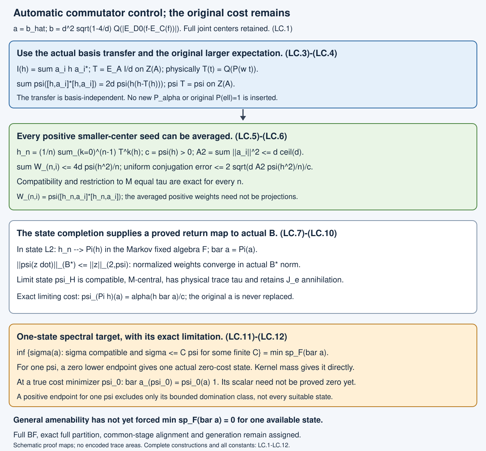

# Averaging compatible states and the remaining cost

The actual common-basis transfer supplies a Markov operator on the smaller represented center. Averaging by this operator automatically makes all of the finite-basis commutator errors tend to zero. The normalized reweightings converge in the norm of the original \(B^*\), preserving the physical \(M\)-trace and expectation compatibility.

The cost after this averaging is the conditional ergodic average of the **original** positive cost. We prove an exact spectral formula for the least cost among compatible states boundedly dominated by one available hypertrace. A zero lower spectral endpoint produces one actual zero-cost state. General amenability has not yet been shown to force that endpoint to be zero. This completed reduction does not replace the unrestricted original outcome.

## Actual operators and precise providers

Let \(N\subset M\) be the actual proper finite-index II₁ inclusion, with actual core \(S\subset R\), index \(d\), Jones projection \(e=e_R^M\), and canonical expected algebras
\[
A=\langle N,e\rangle\subset B=\langle M,e\rangle,\qquad
E=E_A:B\longrightarrow A .
\]
The expectation is normal and canonical-trace-preserving, and \(E|_M=E_N\). Put \(U=Z(S)\), \(V=Z(R)\), \(D_0=U\vee V\), \(D=Z(A)\vee Z(B)\). The actual normal faithful corner identification \(t\mapsto\widehat t\) identifies \(D_0\) with \(D\), and identifies \(U\) with \(Z(A)\). Write \(Q=E_U:D_0\to U\) and \(P=E_V:D_0\to V\) for the inherited finite-tracial expectations.

We use these precise earlier proof scopes:

- [52.1–52.2](canonical-core-traces-and-integer-rounding.md): the common basis, actual expected pair, full corners and center lifts.
- [68.1–68.2](core-central-transition-bounds.md): a common basis \((a_i)_{i=1}^{t_0}\), \(a_1=1\), \(t_0=\lceil d\rceil\), \(\|a_i\|\leq\sqrt d\), \(\sum_i a_i a_i^*=d1\), and the central transfer \(\mathcal I(x)=\sum_i a_i x a_i^*\).
- [T.1–T.10](cup-tail-commutants-and-central-comparison.md): the actual cup density, its two marginals and the ambient commutant comparison.
- [AS.1–AS.16](selecting-a-compatible-hypertrace.md), especially Theorems AS.3–AS.4: whole-joint-center centralizer membership, bounded reweighting, exact compatibility, the finite-basis centrality bound and physical trace preservation. These proofs are reused, not reproved.
- [SC.1–SC.15](singular-hypertraces-jones-ideals-and-entropy.md) and [JC.3–JC.14](hypertraces-and-normal-central-components.md): the Jones-ideal branch and the already settled nonzero normal-component alternative.
- [M1–M10](finite-traces-and-jones-projections.md): finite tracial Hilbert-space actions, their commutants and bounded-vector identification.

At \(d=4\), the actual cost is already zero. For \(d>4\), retain the actual tail projection \(f\), ambient \(C=N'\cap M\), and
\[
\begin{gathered}
p=(1-\sqrt{1-4/d})/2,\quad q=1-p,\quad \tau(f)=p,\\
k_F=(q/p)f+(p/q)(1-f),\\
w=E_{D_0}(k_F),\qquad
\ell=E_{D_0}(E_C(k_F)),\\
Q(w)=P(w)=Q(\ell)=1,\qquad w,\ell>0,\\
b=dQ(|w-\ell|)
=d^2\sqrt{1-4/d}\,Q(|E_{D_0}(f-E_C(f))|),\\
a=\widehat b\in Z(A)_+ .
\end{gathered}
\tag{LC.1}
\]
Here \(w=d^{-1}E_{D_0}(\sum_i a_i^*a_i)\), independently of the common basis. No larger marginal \(P(\ell)=1\) is inserted. Both full joint centers remain in the cost.

Fix one actual compatible \(M\)-central state \(\psi\) on \(B\), with \(\psi|_M=\tau\). In the remaining pure branch it kills \(J_e=\overline{\operatorname{span}(BeB)}^{\|\cdot\|}\), by SC. Write \(\alpha(t)=\psi(\widehat t)\) for \(t\in U\); no inherited-trace normality is assumed. For actual \(h\in Z(A)_+\) with \(c=\psi(h)>0\), AS.3 gives exact compatibility and physical trace restriction for
\[
\psi_h(x)=\psi(hx)/c,\qquad
\psi(hm)=\psi(h)\tau(m)\quad(m\in M).
\tag{LC.2}
\]
The second identity follows from that proved restriction. A zero-mass positive weight has zero positive mixed functional, so the identity holds in that case as well. Its extension to selfadjoint \(h\) follows by positive and negative parts. It applies in particular to \(h^2\).

## The actual Markov operator controls the whole basis energy

Define
\[
\begin{gathered}
T:Z(A)\longrightarrow Z(A),\qquad T(h)=d^{-1}E(\mathcal I(h)),\\
T(\widehat t)=\widehat{Q(P(wt))}\quad(t\in U),\\
\psi(T(h))=\psi(h),\qquad
\|T(h)\|_{2,\psi}\leq\|h\|_{2,\psi}.
\end{gathered}
\tag{LC.3}
\]
Thus \(T\) is the actual unital positive normal map determined by \(E,\mathcal I\). It uses the original \(P\) and its actual weight \(w\), rather than the GNS-corrected \(P_\alpha\) from AS.6.

**Proof of stationarity and contraction.** Centrality of \(\mathcal I(h)\) in \(B\) is exactly 68.2, and expectation bimodularity makes its image central in \(A\). The identity \(\sum_i a_i a_i^*=d1\) makes \(T\) unital. Each map in its definition is completely positive and normal.

Put \(g=\sum_i a_i^*a_i\), so \(\tau(g)=d\). The whole \(D\) and physical \(M\) lie in the centralizer of \(\psi\), by AS.2. Cyclicity and (LC.2) give
\[
\psi(T(h))=d^{-1}\psi(\mathcal I(h))
=d^{-1}\psi(hg)=\psi(h).
\]
Schwarz for the unital completely positive \(T\), followed by stationarity, proves the \(L^2(\psi)\) contraction. \(\square\)

**Theorem LC.1 — exact total basis energy.** For every selfadjoint \(h\in Z(A)\),
\[
\begin{gathered}
\sum_{i=1}^{t_0}\psi([h,a_i]^*[h,a_i])
=2d\,\psi\bigl(h(h-T(h))\bigr)\geq0,\\
\psi\bigl((h-T(h))^2\bigr)
\leq2\psi\bigl(h(h-T(h))\bigr).
\end{gathered}
\tag{LC.4}
\]
For a positive weight of positive mass, exact \(M\)-centrality of \(\psi_h\) is therefore equivalent to \(T(h)=h\) in the state \(L^2\)-space.

**Proof.** All products below belong to the centralizer star algebra, on which \(\psi\) is tracial. Expanding one commutator square and summing gives
\[
\begin{aligned}
\sum_i\psi([h,a_i]^*[h,a_i])
&=\psi\!\left(h^2\sum_i a_i a_i^*\right)
+\psi(h^2g)-2\psi(h\mathcal I(h))\\
&=2d\,\psi(h^2)-2d\,\psi(hT(h)).
\end{aligned}
\]
The two cross terms coincide by cyclicity, including when the basis vectors are not selfadjoint. The first term uses the row sum; the second uses (LC.2) with \(h^2\). The last equality uses \(h\in A\), expectation bimodularity and \(\psi E=\psi\). This proves the energy identity.

Contractivity in (LC.3) gives
\[
\|h-T(h)\|_{2,\psi}^2
=\|h\|_{2,\psi}^2+\|T(h)\|_{2,\psi}^2-2\psi(hT(h))
\leq2\psi(h(h-T(h))).
\]
If the total energy is zero, every nonnegative basis term is zero, so AS.3 proves centrality. Conversely centrality makes those terms zero. A fixed vector gives zero total energy by the identity. \(\square\)

## Automatic averaging produces actual norm limits of compatible states

For an actual positive \(h\in Z(A)\), \(c=\psi(h)>0\), put
\[
\begin{gathered}
h_n=\frac1n\sum_{k=0}^{n-1}T^k(h),\qquad
A_2=\sum_i\|a_i\|^2\leq t_0d,\\
0\leq h_n\leq\|h\|1,\quad \psi(h_n)=c,\\
\sum_i\psi([h_n,a_i]^*[h_n,a_i])
\leq\frac{4d\,\psi(h^2)}n,\\
\sup_{u\in\mathcal U(M)}
\|\psi_{h_n}\operatorname{Ad}u-\psi_{h_n}\|
\leq\frac2c\sqrt{\frac{dA_2\,\psi(h^2)}n}
\leq\frac{2d}c\sqrt{\frac{t_0\,\psi(h^2)}n}.
\end{gathered}
\tag{LC.5}
\]
Compatibility and the physical trace restriction are exact for every \(n\).

**Proof of the constants.** The first line is an actual finite average of positive contractions on \(Z(A)\), so its positivity, norm bound and constant mass follow from (LC.3). Telescoping gives
\[
\|(1-T)h_n\|_{2,\psi}
=n^{-1}\|h-T^n h\|_{2,\psi}
\leq2n^{-1}\|h\|_{2,\psi}.
\]
Since \(\|h_n\|_{2,\psi}\leq\|h\|_{2,\psi}\), Cauchy–Schwarz and (LC.4) give the total-energy bound. For a general positive weight, use the following bounded-functional estimate:
\[
c\,|\psi_{h_n}(uxu^*-x)|
=|\psi([h_n,u]xu^*)|
\leq\|[h_n,u]\|_{2,\psi}\|x\|.
\]
The equality is cyclicity; Cauchy–Schwarz bounds the second factor by \(\|x\|\), since \(\psi(1)=1\). The actual basis expansion and tracial right multiplication give
\[
\|[h_n,u]\|_{2,\psi}
\leq\sum_i\|a_i\|
\sqrt{\psi([h_n,a_i]^*[h_n,a_i])}.
\]
Consequently the uniform estimate is
\[
\sup_{u\in\mathcal U(M)}
\|\psi_{h_n}\operatorname{Ad}u-\psi_{h_n}\|
\leq\frac1c\sum_i\|a_i\|
\sqrt{\psi([h_n,a_i]^*[h_n,a_i])}
\leq \frac{2}{c}
\sqrt{\frac{dA_2\,\psi(h^2)}n}.
\tag{LC.6}
\]
This proves the constants in (LC.5). The mass dependence differs from the projection formula in AS.4, because the averaged weights need not be projections. \(\square\)

## The state completion, and the return to the actual algebra

Let \(\mathfrak U=\pi_\alpha(U)''\) in the cyclic abelian GNS representation. Its vector trace \(\alpha\) is faithful and normal; this is the exact cyclic-and-separating observation already proved in AS.6. It does not make \(\alpha\) normal on the original \(U\). Original smaller-center elements have their images in \(\mathfrak U\).

**Lemma LC.2 — completion and mean averages.** The actual \(T\) descends to a contraction on \(L^2(\mathfrak U,\alpha)\) and extends to a positive unital normal \(\alpha\)-preserving map \(\mathfrak U\to\mathfrak U\). Its fixed bounded elements form a von Neumann subalgebra \(\mathfrak F\). The averages \(n^{-1}\sum_{k<n}T^k\) converge in \(L^2\) to the \(\alpha\)-preserving conditional expectation
\[
\Pi:\mathfrak U\longrightarrow\mathfrak F,\qquad
\bar a=\Pi(\pi_\alpha(b))\in\mathfrak F_+ .
\tag{LC.7}
\]
We retain the notation \(a\) for the corresponding image of the represented cost when no ambiguity arises. The map \(\Pi\) is a new state-space averaging construction; it does not change the original \(P,Q,w,\ell\) or \(a\).

**Proof of extension.** Schwarz and (LC.3) show that GNS-null elements remain null and that \(T\) is \(L^2\)-contractive. Every bounded positive \(H\in\mathfrak U\), \(0\leq H\leq C1\), has positive bounded approximants from the original \(U\) converging in this **state \(L^2\)-norm**. Indeed original vectors \(t\Omega_\alpha\) are dense. Replace an approximating vector by its real part and clip its original selfadjoint function to \([0,C]\). In the abelian algebra the clipping inequality \(|\operatorname{clip}(t)-H|\leq|t-H|\) proves convergence, while preserving the bound. This uses no inherited-trace strong approximation paired with a singular state.

The images of those approximants under \(T\) are \(L^2\)-Cauchy and bounded between zero and \(C1\). Such a bounded \(L^2\) limit is a bounded element of \(\mathfrak U\): multiplication on every dense vector \(y\Omega_\alpha\) is Cauchy, because its difference norm is at most \(\|y\|\) times the \(L^2\) difference. Uniform boundedness extends the resulting strong operator limit to all vectors, and strong closure keeps it in \(\mathfrak U\). This constructs a positive unital bounded extension. It preserves \(\alpha\) by \(L^2\) continuity.

Schwarz also passes to this extension. For uniformly bounded selfadjoint approximants, the squares converge in \(L^2\), since \(\|x^2-y^2\|_2\leq2C\|x-y\|_2\) in the abelian algebra. The original inequalities \(T(x^2)\geq T(x)^2\) therefore pass to the bounded strong operator limits.

For a bounded increasing net \(H_j\uparrow H\), normality of the new \(\alpha\) gives \(H_j\to H\) in \(L^2\), using \((H-H_j)^2\leq C(H-H_j)\). Positivity makes \(T(H_j)\) increasing; contractivity identifies its supremum with \(T(H)\). Thus the extension is normal. No countable-generation hypothesis is used.

**Proof of the mean limit.** For a Hilbert-space contraction \(T\), its fixed vectors equal those of \(T^*\). If \(Tx=x\), then \(\langle T^*x,x\rangle=\|x\|^2\) and \(\|T^*x\|\leq\|x\|\); equality in Cauchy–Schwarz gives \(T^*x=x\). Apply the same argument to \(T^*\) for the converse.

The orthogonal complement of this fixed space is \(\overline{\operatorname{ran}(1-T)}\). On a vector \((1-T)y\), the Cesàro average is \((y-T^ny)/n\), tending to zero. The averages have norm at most one, so density extends this convergence to the whole orthogonal complement. They are the identity on the fixed space. Thus their strong Hilbert-space limit is the orthogonal projection \(\Pi\).

Bounded input has uniformly bounded averages; the bounded-limit argument above shows their limit belongs to \(\mathfrak U\). Positivity, unitality and \(\alpha\)-preservation pass to it. If \(H=H^*\) is fixed, Schwarz gives \(T(H^2)\geq H^2\); their \(\alpha\)-values agree, so faithfulness gives equality. Expanding Schwarz for \(H+tY\), for both signs of arbitrarily small real \(t\), gives \(T(HY)=H\,T(Y)\) for selfadjoint \(Y\). Real and imaginary parts extend it to all \(Y\). Products of fixed elements are therefore fixed. Normality of \(T\) makes the fixed algebra ultraweakly closed; it is \(\mathfrak F\).

The same bimodularity holds for every average and its \(L^2\) limit. Hence \(\Pi\) is a positive unital \(\mathfrak F\)-bimodular projection preserving \(\alpha\). The increasing-net argument just used for \(T\) proves its normality. It is the stated conditional expectation, and its Hilbert-space realization is selfadjoint. \(\square\)

**Theorem LC.3 — an actual state for every fixed positive weight.** Let \(H\in\mathfrak F_+\), \(c=\alpha(H)>0\). Bounded positive original-center approximants in state \(L^2\) determine an actual state \(\psi_H\), uniquely from \(\psi,H\), with
\[
\begin{gathered}
\psi_H E=\psi_H,\qquad
\psi_H\text{ is }M\text{-central},\qquad \psi_H|_M=\tau,\\
0\leq\psi_H\leq(\|H\|/c)\psi,\qquad
\psi_H(a)=\alpha(H\bar a)/c.
\end{gathered}
\tag{LC.8}
\]
If \(\psi\) kills \(J_e\) or has purely singular inherited-center restrictions, this state does too.

**Proof of the return map.** Choose original positive weights \(h_j\in Z(A)\), \(0\leq h_j\leq\|H\|1\), whose images tend to \(H\) in state \(L^2\), as in LC.2. Their masses tend to \(c\) and are eventually positive. For selfadjoint \(z\) from the original center, Cauchy–Schwarz on the actual \(B\) gives
\[
\|\,x\mapsto\psi(zx)\,\|_{B^*}\leq\|z\|_{2,\psi}.
\tag{LC.9}
\]
Thus the unnormalized functionals of \(h_j\) converge in the **full actual \(B^*\)-norm**, and their normalizations do too. The limit depends only on \(H\), not on its approximants. Positivity and the uniform domination pass to the limit. Compatibility and the physical trace restriction are exact for every approximant, by AS.3, and pass to the norm limit.

By \(L^2\) continuity and \(T(H)=H\), the total energy in (LC.4) for \(h_j\) tends to zero. The finite-basis bounded-functional estimate in the proof of (LC.6), with their masses tending to \(c\), makes the centrality norm errors tend to zero uniformly over \(\mathcal U(M)\). This proves exact centrality of the actual limit.

Its cost is \(\alpha(Ha)/c=\alpha(H\bar a)/c\), by expectation adjointness for \(\Pi\) and \(H\in\mathfrak F\). Domination retains Jones-ideal annihilation and singular restrictions, using the already proved hereditary properties in SC and JC. \(\square\)

In particular the averages \(h_n\) converge in state \(L^2\) to \(H=\Pi(h)\), so (LC.9) proves that \(\psi_{h_n}\) converges in actual \(B^*\)-norm to \(\psi_{\Pi(h)}\). Its mass is still \(c\). Its exact cost is
\[
\psi_{\Pi(h)}(a)=\alpha(h\bar a)/c.
\tag{LC.10}
\]
Starting with a cut supported where \(a\leq\varepsilon\) does not by itself prove that this averaged cost is small: the expression is the pairing with \(\bar a\), rather than the initial pairing with \(a\).

## Exact cost attainable within one dominated state class

Let \(\mathcal K\) be the original compatible \(M\)-central states with physical restriction \(\tau\). For the fixed \(\psi\), put
\[
\begin{gathered}
\mathcal K(\psi)=\{\sigma\in\mathcal K:
\sigma\leq C\psi\text{ for some finite }C\},\\
\lambda_\psi=\min\operatorname{sp}_{\mathfrak F}(\bar a),\\
\inf_{\sigma\in\mathcal K(\psi)}\sigma(a)
=\lambda_\psi .
\end{gathered}
\tag{LC.11}
\]
Here \(\lambda_\psi\) is the lower endpoint of the spectrum of the bounded positive operator \(\bar a\) in the unital algebra \(\mathfrak F\), not a claim that this endpoint is attained by a dominated state.

**Theorem LC.4 — proof of (LC.11).** Suppose first that \(\sigma\leq C\psi\). Its restriction to the original \(U\) has a bounded positive density \(H_\sigma\in\mathfrak U\), \(0\leq H_\sigma\leq C1\), \(\alpha(H_\sigma)=1\), relative to the **new** normal trace \(\alpha\). Here is the construction without a normality assumption on the original restriction. On the dense original GNS vectors define the positive form
\[
F(x\Omega_\alpha,y\Omega_\alpha)=\sigma(\widehat{y^*x}).
\]
Domination gives \(0\leq F(x,x)\leq C\|x\Omega_\alpha\|^2\); polarization and Cauchy–Schwarz make it a well-defined bounded positive form. Hilbert-space Riesz representation gives a bounded positive operator between zero and \(C1\). The form commutes with multiplication by the original abelian algebra, hence with its von Neumann closure. The finite tracial commutant theorem M10.1, identity FC1, identifies the commutant of this abelian standard representation with \(\mathfrak U\) itself. The operator is multiplication by \(H_\sigma\). Thus the density exists with exactly the asserted bound.

Apply (LC.3) to the original compatible state \(\sigma\). It gives \(\sigma T=\sigma\) on the smaller center. On \(L^2(\alpha)\) this says \(T^*H_\sigma=H_\sigma\). The fixed-space equality proved in LC.2 makes \(H_\sigma\in\mathfrak F\). Consequently
\[
\sigma(a)=\alpha(H_\sigma a)=\alpha(H_\sigma\bar a)
\geq\lambda_\psi.
\]
This proves the lower bound for the entire dominated compatible class, not merely for the constructed reweightings.

Conversely, if \(\lambda\) is strictly above the lower spectral endpoint, the spectral projection \(H=1_{[0,\lambda]}(\bar a)\in\mathfrak F\) is nonzero. The new trace is faithful, so \(c=\alpha(H)>0\). LC.3 produces an actual state in \(\mathcal K(\psi)\) with cost at most \(\lambda\). Letting \(\lambda\) decrease to the endpoint proves (LC.11). \(\square\)

**Corollary LC.5 — sufficient actual construction.** If \(\lambda_\psi=0\) for just one available compatible \(\psi\), the actual \(B\) has a compatible \(M\)-central state annihilating \(a\).

If \(1_{\{0\}}(\bar a)\ne0\), LC.3 directly supplies a dominated zero-cost state. Otherwise use \(H_j=1_{[0,1/j]}(\bar a)\), whose faithful new masses are positive, and LC.3. The resulting actual states have cost at most \(1/j\). A weak-star cluster state satisfies all original closed linear constraints and has zero cost. If \(\psi(J_e)=0\), every selected state and the cluster state kill \(J_e\). Domination constants may tend to infinity, so inherited-center singularity is not asserted for that final cluster. No separability or convergent subsequence is required.

**Corollary LC.6 — what a genuine positive minimum would look like.** Let \(\psi_0\) be a cost minimizer in the full original compatible space, or in its Jones-ideal-annihilating face, as in AS.1. Then its new ergodic cost is exactly
\[
\bar a_{\psi_0}=\psi_0(a)\,1
\quad\text{in }\mathfrak F_{\psi_0}.
\tag{LC.12}
\]
Indeed every dominated compatible state constructed by LC.3 stays in the same face. Minimality and spectral selection give \(\bar a_{\psi_0}\geq\psi_0(a)1\). Its faithful trace value is \(\alpha_0(\bar a_{\psi_0})=\psi_0(a)\). The positive difference therefore vanishes. This proves flatness of the conditional ergodic cost at a minimizer, not zero of that scalar.

A positive lower endpoint for one particular \(\psi\) excludes a zero-cost state in its bounded domination class. It does not exclude a suitable state outside that class. A positive global AS order floor would bound all these endpoints below; conversely a common positive bound for every available compatible state bounds the global minimum below. One suitable state with zero endpoint suffices.

## Exact failed step, source comparison and retained original scope

The new automatic construction closes the finite-basis commutator-control step **for Markov-averaged positive weights**. It preserves compatibility and the physical trace exactly, and its norm-limit proof returns to the actual \(B\). It does not claim that these weights remain projections or remain supported in the original low-cost spectral cut.

The remaining operator input is now precise: find one available compatible \(\psi\) for which the actual-cost ergodic average \(\bar a_\psi\) has lower spectral endpoint zero, or rule out a positive constant (LC.12) at a true minimizing state. General amenability gives nonemptiness and the actual stationarity (LC.3), but no proof here makes that endpoint zero. Neither the mean-ergodic convergence, normality in a state completion, nor preservation of the two original scalar marginals establishes it. The original \(P\) has not been replaced by \(P_\alpha\), and no primed marginal has been added.

Human source context is Sorin Popa, *Classification of amenable subfactors of type II*, Acta Mathematica 172 (1994), 163–255, [source paper](https://doi.org/10.1007/BF02392646). Definitions3.1.1–3.1.2 and Proposition3.2.2, printed203–205, supply the compatible-state and compatible-expectation formulation. Theorems4.2.1–4.2.2 and Corollary4.2.3, printed211–216, retain the original projection, central rounding and common-support outcome. Those source statements do not insert zero ergodic cost as a new necessary assignment. The mean-ergodic, exact energy and dominated-cost arguments above are independently expressed new programme proofs. No source figure or protected expression is reproduced.

The original unrestricted amenability-to-one-zero-cost-state obligation remains open. All full common-support BF, near-one support, unrestricted exact full partition, common-stage alignment and generation, finite-pair/bicommutant/cup comparisons, represented and opposite models and canonical traces, arbitrary-depth reconstruction, source clauses, notes, exercises and prerequisites remain assigned. The partition branch remains with its existing separate owner. No factor-core, extremality, separability, finite-depth or central-normality hypothesis is introduced.

## Fully solved learner checks

**Exercise LC.1.** Let the initial weight \(h\in Z(A)\) be a projection with \(c=\psi(h)>0\). Give a uniform centrality error for its actual averages \(h_n\), prove norm convergence to an actual compatible state, and determine the exact limiting cost. If \(h\leq1_{[0,\varepsilon]}(a)\), is that limiting cost already bounded by \(\varepsilon\)?

**Solution.** Since \(\psi(h^2)=c\), (LC.6) gives the uniform bound
\[
2\sqrt{\frac{dA_2}{cn}}\leq2d\sqrt{\frac{t_0}{cn}} .
\]
Compatibility and physical trace restriction are exact for every \(n\). LC.2 gives \(h_n\to\Pi h\) in state \(L^2\); (LC.9) makes the normalized functionals converge in actual \(B^*\)-norm. Their limit is the compatible \(M\)-central state of LC.3, and its cost is \(\alpha(h\bar a)/c\). The initial support condition bounds \(\alpha(ha)/c\), not \(\alpha(h\bar a)/c\). It supplies no bound for the latter without an additional operator or pairing comparison. The actual sufficient condition \(h\bar a\leq\varepsilon h\) in the new completion does give the claimed limiting bound. No change of the original \(P\) or cost is involved.

**Exercise LC.2.** Explain the three different conclusions when the new ergodic cost has a nonzero kernel, when zero is in its spectrum but its kernel is zero, and when it is bounded below by a positive constant for one available state. At a global cost minimizer, determine its ergodic cost.

**Solution.** A nonzero kernel projection \(H\) has positive faithful new trace and gives the actual dominated state \(\psi_H\) with zero cost. It retains singular inherited-center restrictions and Jones-ideal annihilation whenever the starting state does. With zero lower endpoint but zero kernel, the projections \(1_{[0,1/j]}(\bar a)\) have positive masses; their actual states have costs at most \(1/j\), and a weak-star convergent subnet gives one exact zero-cost state. Domination constants can diverge, so the cluster's inherited-center singularity is not inferred, while ideal annihilation is preserved by closed bounded tests. A positive lower bound excludes zero cost only in the chosen bounded domination class; it does not exclude another suitable compatible state. At a genuine global or ideal-face minimizer the ergodic cost is the scalar \(\psi_0(a)1\), by (LC.12). This last equality does not prove that scalar is zero.

Figure LC.1. The first two panels show the actual transfer, exact energy and mass-dependent error. The third gives the state-\(L^2\) comparison that proves convergence on the original \(B\), while the final panel states the exact spectral target and its remaining general input. The original cost and both physical centers remain in every stage. [Editable figure source](figures/compatible-state-ergodic-cost-v4.py). Human context: Popa's Definitions3.1.1–3.1.2 and Theorems4.2.1–4.2.2, cited above.

Original independently written programme text and SVG: public domain, CC0 1.0.
