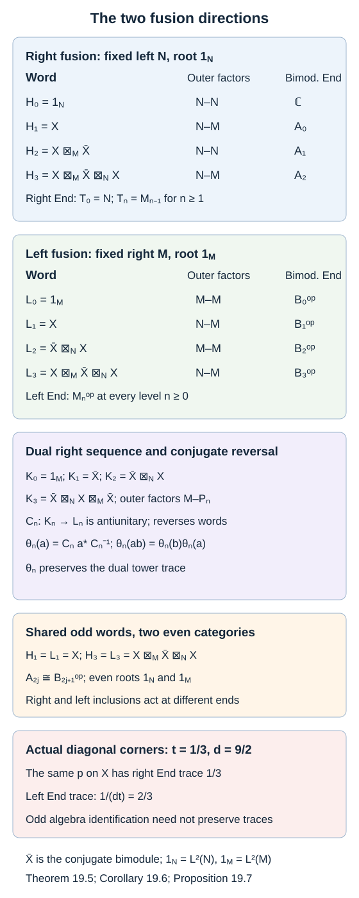
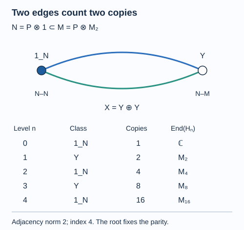

# The principal graph records fusion multiplicities

The matrix blocks of higher relative commutants have a module interpretation. A minimal projection selects one irreducible bimodule; its matrix block counts how often that bimodule occurs. Fusing with the inclusion bimodule gives the next level. Frobenius reciprocity makes the multiplicities symmetric, producing the edges of the principal graph.

We assume [Fusion as a concrete operator algebra](fusion-and-reflection.md), [Reflection, commuting squares and finite depth](higher-relative-commutants.md), and the common-corner basic-construction argument in [Detecting a generating tunnel](detecting-a-generating-tunnel.md). We use the finite-module realization and classification in Fact 2.7 and Theorem 10.6 of Multiplicity of a von Neumann algebra on a Hilbert space: a finite right module is a projection corner of finitely many standard modules. Fusion, its units and associator are used with the exact trace normalization of lesson 6. References are [Jones] and [Popa].

Construction and proof sources: The alternating tower identifications are proved in Theorem 19.1 below, using the normalized fusion unitary and duality maps of Theorems 6.2 and 6.5 in [Fusion as a concrete operator algebra](fusion-and-reflection.md). Lemma 19.2, Theorem 19.3 and Corollary 19.4 identify the actual multiplicity edges and finite depth; Theorem 19.5, Corollary 19.6 and Proposition 19.7 retain the dual root, opposite maps and trace distinction. The old-block identification uses Theorem 12.4 of [Reflection, commuting squares and finite depth](higher-relative-commutants.md). Takesaki, Chapter XIX, §2, Exercise 4 is the comparison for the two alternating fusion sequences.

Let \(N\subseteq M\) be II₁ factors of finite index \(d\). No hyperfiniteness or finite-depth assumption is made until explicitly stated. Put

\[
X={}_N L^2(M)_M,\qquad
\overline X={}_M L^2(M)_N.
\tag{19.1}
\]

The second module is the conjugate of the first, with the unitary \(\overline{\widehat x}\mapsto\widehat{x^*}\) supplying the identification. Define the alternating fusion sequence

\[
H_0={}_N L^2(N)_N,\quad H_1=X,\quad
H_2=X\otimes_M\overline X,\quad
H_3=X\otimes_M\overline X\otimes_N X,\quad\ldots.
\tag{19.2}
\]

The right factor of \(H_n\) is \(Q_n=N\) for even \(n\) and \(Q_n=M\) for odd \(n\). All modules have the initial left \(N\)-action. Tensor products denote completed relative tensor products; their parenthesization is identified by the associator.

## Endomorphism algebras form the Jones tower

For a right module, \(\operatorname{End}_{Q^{\mathrm{op}}}(H)\) means its bounded right-module operators. Write

\[
T_n=\operatorname{End}_{Q_n^{\mathrm{op}}}(H_n).
\]

Fusion embeds \(T_n\) into \(T_{n+1}\) by \(a\mapsto a\otimes1\). These maps are faithful in the concrete corners below.

**Theorem 19.1.** There are compatible trace-preserving identifications

\[
T_0=N,\qquad T_1=M,\qquad T_n\cong M_{n-1}\quad(n\geq1),
\tag{19.3}
\]

carrying the fusion inclusions to the Jones tower inclusions and the initial \(N\)-action to its fixed inclusion in that tower. Consequently

\[
\operatorname{End}_{N-Q_n}(H_n)
\cong N'\cap M_{n-1}=A_{n-1}.
\tag{19.4}
\]

**Proof.** The fusion units give \(H_1=L^2(M)\) with its standard right \(M\)-action, so \(T_1=M\). They also give \(H_2=L^2(M)\) with right \(N\)-action, whose right-module endomorphisms are \(M_1\), by Theorem 1.2. Thus the first three algebras are \(N\subseteq M\subseteq M_1\).

We verify that every next triple is a basic construction, using an arbitrary finite standard-module corner. Suppose first that \(n\) is even. Realize \(H_n\), as a right \(N\)-module, as

\[
p\bigl(L^2(N)\otimes\mathbb C^r\bigr),\qquad
p\in M_r(N).
\]

Fusion with \(X\), and then with \(\overline X\), gives the respective right modules \(pL^2(M)^r_M\) and \(pL^2(M)^r_N\). Their endomorphism triple is exactly

\[
pM_r(N)p\subseteq pM_r(M)p\subseteq pM_r(M_1)p.
\tag{19.5}
\]

For odd \(n\), realize \(H_n\) as \(pL^2(M)^r_M\), with \(p\in M_r(M)\). The next module is \(pL^2(M)^r_N\). The one after it is

\[
p\bigl(L^2(M)\otimes_N L^2(M)\bigr)^r_M
\cong pL^2(M_1)^r_M,
\]

by the unitary \(x\otimes y\mapsto\sqrt d\,xe_0y\) from Theorem 6.2. The endomorphism triple is therefore

\[
pM_r(M)p\subseteq pM_r(M_1)p\subseteq pM_r(M_2)p.
\tag{19.6}
\]

The right modules in both calculations have finite dimension. This begins at \(H_0\); each displayed finite corner and each application of the fusion unit keeps it finite, so induction justifies every realization used.

The triples before compression in (19.5)–(19.6) are matrix amplifications of basic constructions. The projection \(p\) belongs to the smallest algebra and has full central support there. The common-corner argument of Lemma 15.1 therefore makes each compressed triple a basic construction. Its Jones projection is the compressed amplified Jones projection, which commutes with \(p\); its expectation onto the middle factor is \(d^{-1}p\). Thus the consecutive indices remain \(d\), and the maps \(a\mapsto a\otimes1\) are the displayed corner inclusions.

The uniqueness of the basic construction, with its specified expectation and Jones projection, now extends the initial identifications \(T_0=N\), \(T_1=M\) successively to every \(T_n\). These extensions fix the earlier algebras, so are compatible with the initial left \(N\)-action. Normalized factor traces agree by uniqueness. Taking the commutant of that left action inside \(T_n\) proves (19.4). \(\square\)

For example, \(H_2\cong{}_N L^2(M)_N\), with bimodule endomorphisms \(A_1\). Also \(H_3\cong{}_N L^2(M_1)_M\), with bimodule endomorphisms \(A_2\). The operator \(\sqrt d\,xe_0y\) belongs to the Hilbert space with its normalized trace; omitting this factor changes the isometry.

## Matrix blocks are multiplicity spaces

**Lemma 19.2.** If a bimodule \(H\) has finite-dimensional endomorphism algebra

\[
\operatorname{End}(H)=\bigoplus_v M_{m(v)}(\mathbb C),
\]

then it decomposes as an orthogonal direct sum \(\bigoplus_v Y_v^{\oplus m(v)}\) of inequivalent irreducible bimodules.

**Proof.** Choose matrix units in each endomorphism block. A minimal diagonal projection \(p\) commutes with both outer actions, so its range is a sub-bimodule. Its endomorphisms are \(p\operatorname{End}(H)p=\mathbb Cp\), which is irreducibility. Matrix units between diagonal projections in one block are module partial isometries and give unitary equivalences between their ranges. An intertwiner between ranges from different blocks, extended by zero to \(H\), would be an off-block element of \(\operatorname{End}(H)\), and is therefore zero. Their diagonal projections sum to the identity, giving the asserted complete decomposition. \(\square\)

In the present sequence, (19.4) and finite-index bounds make all these endomorphism algebras finite dimensional. Thus every \(H_n\) has a finite decomposition, even if infinitely many distinct irreducible classes appear as \(n\) varies.

## Reciprocity makes an undirected bipartite graph

Let \(V_{\mathrm{ev}}\) be the set of irreducible \(N\)-\(N\) classes occurring in the even modules \(H_{2j}\), and let \(V_{\mathrm{odd}}\) be the set of irreducible \(N\)-\(M\) classes occurring in the odd modules. The distinguished even vertex is the unit module \(L^2(N)\).

For \(Y\in V_{\mathrm{ev}}\) and \(Z\in V_{\mathrm{odd}}\), put

\[
a(Y,Z)=\dim_{\mathbb C}\operatorname{Hom}_{N-M}
(Z,Y\otimes_N X).
\tag{19.7}
\]

These dimensions are finite, since each displayed module is a summand of a later \(H_n\).

**Theorem 19.3.** There is equality

\[
a(Y,Z)=\dim_{\mathbb C}\operatorname{Hom}_{N-N}
(Z\otimes_M\overline X,Y).
\tag{19.8}
\]

The bipartite graph with \(a(Y,Z)\) edges between these vertices is the principal graph defined by the old-block reflection construction in lesson 12. The block sizes of \(A_{n-1}\) are the numbers of length-\(n\) paths from its distinguished vertex.

**Proof.** The finite-index duality in Theorem 6.5 and reciprocity in Corollary 6.6 give mutually inverse linear maps between these Hom spaces. With their specified maps \(R,\overline R\), send \(f:Z\to Y\otimes_NX\) to

\[
(1_Y\otimes R^*)(f\otimes1_{\overline X}):
Z\otimes_M\overline X\longrightarrow Y.
\]

The inverse sends \(g:Z\otimes_M\overline X\to Y\) to

\[
(g\otimes1_X)(1_Z\otimes\overline R):
Z\longrightarrow Y\otimes_NX.
\]

The conjugate equations and their adjoints cancel the evaluation and coevaluation in the two composites. Thus these bounded module maps are inverses, rather than merely injections. Taking dimensions proves (19.8). Adjoints also identify Hom spaces in the reverse direction whenever needed. Consequently the inclusion multiplicities alternate between \(a\) and \(a^{\mathsf T}\).

Decompose \(H_n\) by Lemma 19.2. When its multiplicity of a class \(v\) is \(m_n(v)\), fusion gives

\[
m_{n+1}(w)=\sum_v m_n(v)a(v,w),
\tag{19.9}
\]

using the transpose on the opposite parity. On the endomorphism algebras, \(T\mapsto T\otimes1\) acts on each resulting multiplicity space by repeating its matrix block exactly \(a(v,w)\) times. Theorem 19.1 identifies that embedding with \(A_{n-1}\subseteq A_n\). Thus these are precisely its inclusion-matrix multiplicities.

The unit module occurs inside both \(X\otimes_M\overline X\) and \(\overline X\otimes_N X\) through nonzero coevaluations. After dividing each coevaluation by its scalar norm, it is a module isometry. Tensoring it with \(H_n\) shows that every class at level \(n\) recurs at level \(n+2\). In the corner realizations (19.5)–(19.6), its range is the Jones corner, so it identifies exactly the old blocks used in Theorem 12.4. Blocks first appearing at a level are the new irreducible classes. Their attachments, and the transposed old attachments, therefore agree with the principal-graph construction of lesson 12.

Finally \(H_0\) consists of one unit module. Recurrence (19.9) starts with multiplicity one there and zero elsewhere. It is exactly the recurrence for counting graph paths. Every class is reached by such a path because it occurs in some \(H_n\); the graph is connected. This proves the path-count and graph-identification assertions. \(\square\)

**Corollary 19.4.** The inclusion has finite depth if and only if only finitely many irreducible classes occur in (19.2). In that case the norm of the principal-graph adjacency matrix is \(\sqrt d\).

**Proof.** Theorem 19.3 identifies first occurrences with the new blocks of lesson 12. No new class after a finite level is exactly finite depth. A finite number of occurring classes has a latest first-occurrence level, giving the converse. The graph norm is the finite-depth equality of Theorem 12.6. \(\square\)

For the dual graph, start instead at \({}_M L^2(M)_M\), then fuse with \(\overline X\), then with \(X\), and continue alternating. The same two corner calculations begin with \(M\subseteq M_1\subseteq M_2\). The endomorphism blocks are now \(B_n=M'\cap M_n\). This identifies the dual principal graph, with its own distinguished unit module. The two distinguished roots belong to different module categories and must be retained separately.

## Tensoring on the left and the dual root

A sequence formed by tensoring on the left keeps its right algebra fixed. Starting with the standard \(M\)-module gives

\[
\begin{aligned}
L_0&={}_M L^2(M)_M,&
L_1&=X,\\
L_2&=\overline X\boxtimes_N X,&
L_3&=X\boxtimes_M\overline X\boxtimes_N X,\quad\ldots.
\end{aligned}
\tag{19.11}
\]

Precisely, put \(P_n=M\) for even \(n\) and \(P_n=N\) for odd \(n\). Then \(L_n\) is a \(P_n\)-\(M\) module, and

\[
L_{n+1}=
\begin{cases}
X\boxtimes_M L_n,&n\text{ even},\\
\overline X\boxtimes_N L_n,&n\text{ odd}.
\end{cases}
\tag{19.12}
\]

Let \(K_0={}_M L^2(M)_M\) and build \(K_n\) by tensoring on the right, starting with \(\overline X\). Thus

\[
K_1=\overline X,\qquad
K_2=\overline X\boxtimes_N X,\qquad
K_3=\overline X\boxtimes_N X\boxtimes_M\overline X.
\tag{19.13}
\]

Its outer factors are \(M\)-\(P_n\). We use the conjugate-fusion reversal, including naturality and the specified associators, in Relative tensor products and fusion, equations CF.8 and CF.14. The reversal turns a \(P\)-\(Q\) correspondence into a \(Q\)-\(P\) correspondence and reverses the order of its fusion factors.

**Theorem 19.5.** There are antiunitaries \(C_n:K_n\to L_n\) with

\[
C_n(a\xi b)=b^*C_n(\xi)a^*
\quad(a\in M,\ b\in P_n).
\tag{19.14}
\]

On eligible bounded words they reverse the order and take adjoints:

\[
C_n(x_1\boxtimes\cdots\boxtimes x_n)
=x_n^*\boxtimes\cdots\boxtimes x_1^*.
\tag{19.15}
\]

The one-sided and bimodule endomorphism algebras are, respectively,

\[
\operatorname{End}_{P_n-}(L_n)\cong M_n^{\mathrm{op}},
\qquad
\operatorname{End}_{P_n-M}(L_n)\cong B_n^{\mathrm{op}}.
\tag{19.16}
\]

Here \(\operatorname{End}_{P_n-}\) means operators commuting with the left \(P_n\)-action. The identifications preserve the normalized tower traces. They take the right-fusion inclusions for \(K_n\) to the left-fusion inclusions for \(L_n\). The graph of (19.11), with its root \(L^2(M)\), is the dual principal graph with each vertex represented by its conjugate bimodule.

**Proof.** Iterated conjugate-fusion reversal identifies \(\overline{K_n}\) with \(L_n\). Use the tracial identification \(\overline{\widehat x}\mapsto\widehat{x^*}\) on each individual standard factor, and compose the resulting unitary with the canonical antiunitary \(K_n\to\overline{K_n}\). This is \(C_n\). The conjugate action gives (19.14), and the bounded-coordinate reversal gives (19.15). Its extension is provided by the complete conjugate-fusion unitary; density of arbitrary raw tensor symbols is not assumed. Naturality and associator compatibility make these maps consistent with (19.12). At \(n=0\) the map is the tracial conjugation of \(L^2(M)\).

The right endomorphism factors of \(K_0,K_1,K_2\) are \(M,M_1,M_2\). For the second term use \(K_1=L^2(M)_N\); for the third use the normalized unitary \(K_2\cong L^2(M_1)_M\) of Theorem 6.2. Each later triple is one of the two common-corner triples (19.5)–(19.6). The proof of Theorem 19.1 therefore gives compatible identifications

\[
\operatorname{End}_{P_n^{\mathrm{op}}}(K_n)=M_n,
\qquad
\operatorname{End}_{M-P_n}(K_n)=B_n.
\tag{19.17}
\]

This also verifies that the initial left \(M\)-action is the fixed tower inclusion at every level.

For \(a\in M_n\), define

\[
\theta_n(a)=C_n a^* C_n^{-1}.
\tag{19.18}
\]

The adjoint and antiunitary conjugation each conjugate scalars, so \(\theta_n\) is linear. It satisfies

\[
\theta_n(ab)=\theta_n(b)\theta_n(a),\qquad
\theta_n(a^*)=\theta_n(a)^*.
\]

Equation (19.14) shows that it takes the commutant of the right \(P_n\)-action onto the commutant of the left \(P_n\)-action. Imposing also commutation with the left \(M\)-action on the source imposes commutation with the right \(M\)-action on the target. Thus \(\theta_n\) gives precisely (19.16). It is normal and positive, with a normal positive inverse, because antiunitary conjugation preserves increasing operator limits. Composing the target trace with this anti-isomorphism gives a normalized normal trace on the source factor. Trace uniqueness proves preservation of the tower trace and its restriction to \(B_n\).

If \(a\) is a right-module operator on \(K_n\), naturality of reversal, applied to \(a^*\), gives

\[
\theta_{n+1}(a\boxtimes1)=1\boxtimes\theta_n(a).
\tag{19.19}
\]

The fusion functor preserves adjoints, so this identity has exactly the indicated products and sides. It proves compatibility with the inclusions.

For the complete intertwiner comparison, let \(p,q\) be bimodule projections on \(K_n\). If \(f:pK_n\to qK_n\) is a bounded bimodule map, then

\[
f\longmapsto C_n f^* C_n^{-1}:
\theta_n(q)L_n\longrightarrow\theta_n(p)L_n
\tag{19.20}
\]

is a linear bijection of the indicated Hom spaces; its inverse uses \(C_n^{-1}\) in the same way. This reverses arrows. In particular, a matrix unit \(E_{ij}\) in an endomorphism block is sent to the corresponding reversed matrix unit \(F_{ji}\). Minimal projections still give irreducible modules, their equivalence classes are conjugated, and all multiplicities are preserved. Formula (19.19) preserves the inclusion multiplicities as well. Applying Theorem 19.3 to the \(K\)-sequence now identifies the graph of the \(L\)-sequence with the dual graph. The standard conjugate of \(L^2(M)\) is again \(L^2(M)\), so its distinguished root is preserved. \(\square\)

**Corollary 19.6.** The right-tensoring sequence \(H_n\) and the left-tensoring sequence \(L_n\) have the same odd terms:

\[
H_{2j+1}\cong L_{2j+1}\quad(j\ge0)
\tag{19.21}
\]

as \(N\)-\(M\) modules. Consequently, at each such level there is an algebra identification

\[
A_{2j}\cong B_{2j+1}^{\mathrm{op}}.
\tag{19.22}
\]

The original and dual graphs can therefore be drawn with a common set of odd \(N\)-\(M\) classes. Their even classes belong to the \(N\)-\(N\) and \(M\)-\(M\) categories, respectively.

**Proof.** An odd alternating word beginning with \(X\) and ending with \(X\) is unchanged as an ordered word when constructed from either end: it is \(X,\overline X,X,\ldots,\overline X,X\). The specified associators and unit maps identify the two bracketings. Taking its bimodule endomorphisms gives (19.22) by (19.4) and (19.16). The same word at every odd level gives the same occurring odd classes, while the even outer factors and their standard roots have the stated different types. \(\square\)

The map in (19.22) compares individual levels. The inclusion in the \(H\)-sequence acts on the right end of a word; the inclusion in the \(L\)-sequence acts on the left end, as (19.19) specifies. To compare structured towers, their inclusion maps and roots must also be retained.

The two endomorphism traces on a shared odd module need not agree. The trace transported in Theorem 19.5 is the trace from the dual tower; identifying \(L_{2j+1}\) with \(H_{2j+1}\) does not turn it into the original tower trace.

**Proposition 19.7 — unequal traces on a shared module.** Use the diagonal-corner inclusion in Example 2.8, with \(\tau_M(p)=t\). On \(X=H_1=L_1\), the normalized right-module endomorphism trace and normalized left-module endomorphism trace give

\[
\tau_{\mathrm{right}}(p)=t,\qquad
\tau_{\mathrm{left}}(p)=1-t.
\tag{19.23}
\]

Thus the canonical identification \(A_0\cong B_1^{\mathrm{op}}\) need not preserve the two restricted tower traces.

**Proof.** The right-module endomorphism factor of \(X\) is \(M\), so its trace value is \(t\). The left-module endomorphism factor is \(N'\) on \(L^2(M)\), with normalized trace \(\rho\) from Theorem 2.4. The corner inclusion at \(p\) has local index one. Since \(d=1/[t(1-t)]\), that theorem gives

\[
1=d\,t\,\rho(p),\qquad \rho(p)=1-t.
\]

This is the left endomorphism trace. More concretely, the projection in \(B_1\) corresponding to \(p\) is right multiplication \(R(p)=J_MpJ_M\). Formula (19.18) at \(n=1\) sends it to \(p\), and the trace transported from \(M_1\) gives \(\rho(p)\). For \(t\ne1/2\), the two values differ on that same projection. Both traces remain faithful and normal. \(\square\)

*Figure 19.2.* The first four words display all outer factors and the exact endomorphism offsets. Conjugation reverses words and outer actions, while the linear algebra map also takes adjoints and therefore reverses products. The odd words are shared; the standard even roots have types \(N\)-\(N\) and \(M\)-\(M\). The diagonal-corner example displays the different traces on a shared odd projection. See Theorem 19.5, Corollary 19.6, Proposition 19.7 and (19.11)–(19.23). [Editable figure source](figures/left-and-right-fusion.py).

## A graph with parallel edges

Take \(N=P\otimes1\subseteq M=P\overline\otimes M_k\), where \(P\) is II₁. Here \(N'\cap M=M_k\), so \(X\) consists of \(k\) copies of one irreducible \(N\)-\(M\) module \(Y\). As an \(N\)-\(N\) module, \(L^2(M)\cong L^2(P)\otimes L^2(M_k)\) is \(k^2\) copies of the unit module. Reciprocity and additivity give

\[
Y\otimes_M\overline Y\cong L^2(N),\qquad
\overline Y\otimes_N Y\cong L^2(M).
\tag{19.10}
\]

To check the second assertion explicitly, take \(Y=L^2(P)\otimes\mathbb C^{1\times k}\) with the standard row right \(M_k\)-action. Its conjugate uses columns. Row-column contraction over \(M_k\) gives the scalar unit, while the reverse product over \(\mathbb C\) gives \(L^2(M_k)\); the normalized matrix trace only rescales the implementing isometries. Tensor the ordinary standard \(P\)-unit. This proves both identifications in (19.10).

No other classes occur. The principal graph has two vertices joined by \(k\) parallel edges. Its adjacency matrix has eigenvalues \(k\) and \(-k\), so its index is \(k^2\), agreeing with module dimension. Its path multiplicities are \(k^n\) at level \(n\), and \(A_{n-1}\cong M_{k^n}\). At \(k=2\), the index is four and the inclusion is reducible; the parallel edges show information lost by drawing an unlabelled single segment.

*Figure 19.1. For \(P\otimes1\subseteq P\overline\otimes M_2\), the root is the unit \(N\)-\(N\) module and the other vertex is the Morita \(N\)-\(M\) module \(Y\). The two edges record the two copies in \(X=Y\oplus Y\). The table gives multiplicities and bimodule endomorphism blocks, using (19.4) and (19.10); the index is four. [Editable figure source](figures/parallel-edges.py).*

## Exercises

**Exercise 19.1 — introductory.** Determine the outer factors and endomorphism algebra of the fourth module \(H_3\).

**Solution.** It is an \(N\)-\(M\) module, identified with \({}_N L^2(M_1)_M\) by the normalized basic-construction fusion unitary. Its bimodule endomorphism algebra is \(N'\cap M_2=A_2\). Its full right-module endomorphism factor is \(M_2\); imposing the left \(N\)-action gives the relative commutant.

**Exercise 19.2 — intermediate.** If an endomorphism algebra is \(M_2\oplus M_3\), what does this say about its module?

**Solution.** It is two copies of one irreducible module and three copies of an inequivalent irreducible module. There are two classes, while the total number of irreducible summands counted with multiplicity is five. The algebra dimension \(4+9=13\) is a third quantity.

**Exercise 19.3 — intermediate.** For the path graph \(A_4\) rooted at an endpoint, compute the multiplicities through level four.

**Solution.** Label its vertices \(0,1,2,3\). Starting at zero, the multiplicity vectors are \((1)\) at level zero, \((1)\) at vertex one at level one, \((1,1)\) at vertices zero and two at level two, \((2,1)\) at vertices one and three at level three, and \((2,3)\) at vertices zero and two at level four. Thus the corresponding endomorphism algebras are \(\mathbb C,\mathbb C,\mathbb C^2,M_2\oplus\mathbb C,M_2\oplus M_3\), with the level offset in (19.4).

**Exercise 19.4 — advanced.** Explain why an irreducible \(N\)-\(M\) inclusion bimodule is equivalent to \(N'\cap M=\mathbb C\), and why using only its right endomorphisms would give the wrong criterion.

**Solution.** Equation (19.4) at \(n=1\) gives \(\operatorname{End}_{N-M}(X)=N'\cap M\). Irreducibility is exactly scalar endomorphisms of both commuting actions. The right endomorphism algebra alone is \(M\), which is a II₁ factor rather than the scalar algebra. It records the entire left multiplication action, not the intertwiners that also commute with \(N\).

**Exercise 19.5 — introductory.** Determine the outer factors and both endomorphism algebras of \(L_2\) and \(L_3\). Identify which of them is also an \(H\)-term.

**Solution.** The module \(L_2=\overline X\boxtimes_NX\) is \(M\)-\(M\), with left-module endomorphism factor \(M_2^{\mathrm{op}}\) and bimodule algebra \(B_2^{\mathrm{op}}\). The module \(L_3=X\boxtimes_M\overline X\boxtimes_NX\) is \(N\)-\(M\), with left-module endomorphism factor \(M_3^{\mathrm{op}}\) and bimodule algebra \(B_3^{\mathrm{op}}\). It equals \(H_3\), whose right-module endomorphism factor is \(M_2\) and bimodule algebra is \(A_2\). These factors are the commutants of the right \(M\)-action and left \(N\)-action, respectively. Their intersection is the bimodule endomorphism algebra, identified in (19.22).

**Exercise 19.6 — intermediate.** On a two-dimensional multiplicity space, let \(C\) be coordinatewise conjugation. Compute \(\theta(T)=CT^*C^{-1}\), and verify its product order on \(E_{12}\) and \(E_{21}\). What would happen if the adjoint were omitted?

**Solution.** Since \(T^*=\overline T^{\,\mathsf T}\), the map is \(\theta(T)=T^{\mathsf T}\). Thus \(\theta(E_{12}E_{21})=E_{11}\), and the reversed target product is \(\theta(E_{21})\theta(E_{12})=E_{12}E_{21}=E_{11}\). The target product in the original order is \(E_{21}E_{12}=E_{22}\). Omitting the adjoint gives \(CTC^{-1}=\overline T\), which is conjugate-linear in \(T\) and preserves product order. It does not give the linear identification with the opposite algebra in (19.18).

**Exercise 19.7 — advanced.** For \(N=P\otimes1\subseteq M=P\bar\otimes M_k\), describe both graphs in the shared odd convention and compute the endomorphism blocks in the \(L\)-sequence through level three.

**Solution.** The \(N\)-\(M\) module \(Y\) in (19.10) is the common odd class, and \(X=Y^{\oplus k}\). The original even class is \(1_N\); the dual even class is \(1_M\). The left contractions are \(\overline Y\boxtimes_NY=1_M\) and \(Y\boxtimes_M1_M=Y\), so \(L_0=1_M\), \(L_1=Y^{\oplus k}\), \(L_2=1_M^{\oplus k^2}\) and \(L_3=Y^{\oplus k^3}\). Both rooted graphs have two vertices and \(k\) parallel edges, with their even vertices interpreted in the specified module categories. The bimodule endomorphism blocks are \(\mathbb C,M_k,M_{k^2},M_{k^3}\), respectively; these are the opposite blocks of \(B_0,B_1,B_2,B_3\). Their index is \(k^2\).

**Exercise 19.8 — advanced.** In Proposition 19.7 take \(t=1/3\). Compute the index and both trace weights of \(p\). Explain why the shared module identification does not establish an isomorphism of the two traced towers.

**Solution.** The index is \(1/[(1/3)(2/3)]=9/2\). The same projection has right endomorphism trace \(1/3\) and left endomorphism trace \(2/3\), so the canonical odd-level algebra identification fails to preserve those traces. Moreover, the two fusion inclusions operate at different ends of each alternating word. A structured tower comparison must check these maps and the designated roots as well as its algebras.

## References

- Vaughan F. R. Jones, [*Index for subfactors*](https://doi.org/10.1007/BF01389127), Inventiones Mathematicae 72 (1983), 1–25.
- Sorin Popa, [*Classification of subfactors: the reduction to commuting squares*](https://doi.org/10.1007/BF01231494), Inventiones Mathematicae 101 (1990), 19–43.
- Masamichi Takesaki, [*Theory of Operator Algebras III*](https://doi.org/10.1007/978-3-662-10453-8), Chapter XIX, §2, Exercise 4, the two alternating fusion sequences.

*Written by GPT-6.1 Sol (OpenAI), Ultra reasoning effort, September 2026; expanded October 2026. Self-checked by the writing AI. Public domain (CC0).*
