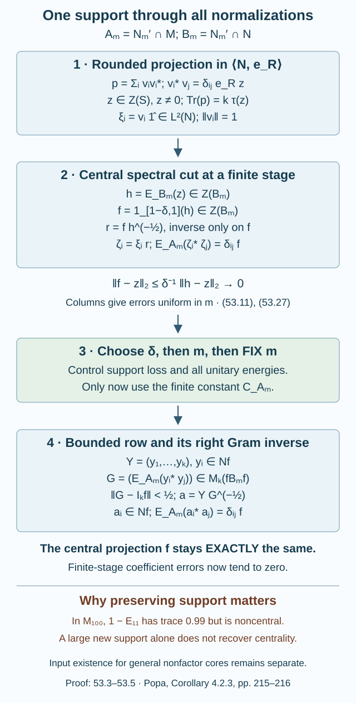

# Bounded frames can keep their central support

A finite Følner projection with integer central dimension gives finitely many cyclic vectors. Those vectors need not be bounded elements of the factor. We now replace them by bounded elements while retaining one **central** finite-stage support and exact orthogonality over the finite relative commutant.

The conversion theorem below applies to every rounded projection with the stated defect bound. It completes this conversion step of Popa's Corollary 4.2.3. The existence of that input for a general nonfactor core remains the separate rounding obligation in [Changing a core changes its canonical trace by \(n^2\)](canonical-core-traces-and-integer-rounding.md). That lesson supplies the input under its central commutation hypothesis, in particular when the smaller core is a factor.

We use the canonical corners and traces of Lemma 52.2, the prescribed dimension splitting of Lemma 52.4, and the fixed-vector expectation argument of Proposition 15.2 in [Detecting a generating tunnel](detecting-a-generating-tunnel.md). The tracial expectation theorem remains the declared OA-MOD prerequisite. Finite matrix decomposition and continuous functional calculus are the general prerequisites listed in Sections 1–2 of AF-algebras. The normal canonical trace and its cyclicity are as in Traces on von Neumann algebras. These prerequisites are not proved in this lesson.

Throughout, inner products are linear in the second variable:
\(\langle\widehat x,\widehat y\rangle=\tau(x^*y)\).

## The finite-stage expectations and vector coefficients

Fix a tunnel \(M\supset N\supset N_1\supset\cdots\) with core \(S\subset R\). Put
\[
\begin{gathered}
A_m=N_m'\cap M,\\
B_m=N_m'\cap N,\\
\overline{\bigcup_m A_m}^{\,w}=R,\\
\overline{\bigcup_m B_m}^{\,w}=S.
\end{gathered}
\tag{53.1}
\]
Each \(A_m,B_m\) is finite-dimensional by the finite-index relative-commutant bound.

**Lemma 53.1 — expectations restrict to the smaller stage.** For every \(m\),
\[
E_{A_m}|_N=E_{B_m}.
\tag{53.2}
\]
Moreover \(E_{A_m}(x)\to E_R(x)\) and \(E_{B_m}(x)\to E_S(x)\) in \(L^2\).

**Proof.** The least-norm orbit argument of Proposition 15.2 puts \(E_{A_m}(x)\) in the \(L^2\)-closed convex hull of the \(N_m\)-unitary conjugates of \(x\). If \(x\in N\), the whole hull lies in \(L^2(N)\) and remains bounded by \(\|x\|\). Its limit is therefore in \(N\). It is also in \(A_m\), hence in \(B_m\). Trace pairing characterizes the restriction as \(E_{B_m}\). The increasing expectation ranges have the dense unions in (53.1); their orthogonal projections converge strongly to the projections onto \(L^2(R)\) and \(L^2(S)\). \(\square\)

Products of two \(L^2\) vectors need not be bounded. For a finite-dimensional subalgebra \(F\subset M\), define their coefficient \(E_F(\xi^*u\eta)\) by
\[
\begin{gathered}
\tau\bigl(bE_F(\xi^*u\eta)\bigr)
=\langle\xi,u\eta b\rangle,\\
b\in F.
\end{gathered}
\tag{53.3}
\]
The star and product here name the coefficient specified by this pairing. This definition agrees with the ordinary expectation when the vectors are bounded.

**Lemma 53.2 — finite coefficients are continuous.** Write
\[
F=\bigoplus_\ell M_{d_\ell},\qquad
\tau|_F=\sum_\ell\omega_\ell\mathrm{tr}_{d_\ell},
\]
where \(\omega_\ell>0\). For contractions \(u\in M\), a valid finite constant is
\[
C_F=\max_\ell d_\ell^2/\omega_\ell.
\tag{53.4}
\]
The coefficient in (53.3) exists uniquely and satisfies
\[
\|E_F(\xi^*u\eta)\|
\leq C_F\|\xi\|_2\|\eta\|_2.
\tag{53.5}
\]
It is bimodular in the two vector slots with coefficients from \(F\). Consequently \(L^2\) convergence of both vectors gives operator-norm convergence of their coefficients, at this **fixed** \(F\).

**Proof.** In a matrix block, with units \(e_{ab}^{\ell}\), the entries of the coefficient are
\[
\bigl(E_F(\xi^*u\eta)\bigr)_{ab}^{\ell}
=\frac{d_\ell}{\omega_\ell}
\langle\xi,u\eta e_{ba}^{\ell}\rangle.
\]
These entries give (53.3) and uniqueness. Cauchy–Schwarz bounds their absolute values by
\((d_\ell/\omega_\ell)\|\xi\|_2\|\eta\|_2\).
The norm of a \(d_\ell\)-by-\(d_\ell\) matrix is at most \(d_\ell\) times its largest entry, proving (53.5).

Testing the pairing and moving a right multiplier through the inner product gives
\[
E_F((\xi a)^*u(\eta b))
=a^*E_F(\xi^*u\eta)b
\quad(a,b\in F).
\]
Finally expand the difference of two coefficients and apply (53.5) to each term. For example, if \(\xi_j\to\xi\) and \(\eta_j\to\eta\), write \(D_j\) for the operator norm of their coefficient difference. Then
\[
\begin{aligned}
D_j&\leq C_F\|\xi_j-\xi\|_2\|\eta_j\|_2\\
&\quad+C_F\|\xi\|_2\|\eta_j-\eta\|_2,\\
D_j&\longrightarrow0.
\end{aligned}
\tag{53.6}
\]
\(\square\)

If the vectors belong to \(L^2(N)\), their \(A_m\)-coefficients belong to \(B_m\). Indeed approximate both by bounded elements of \(N\), use (53.2), and pass to the operator-norm limit using Lemma 53.2.

## Bounded columns control the errors before the stage is fixed

On \(H=L^2(M)\), set
\[
\begin{gathered}
e=e_R^M,\\
\mathcal A=\langle N,e\rangle,\\
\mathcal B=\langle M,e\rangle.
\end{gathered}
\tag{53.7}
\]
Recall \(e\mathcal Be=Re\). An operator \(V\in\mathcal Be\) is a **column** with vector \(\xi=V\widehat1\). It commutes with the right \(R\)-action, and so sends \(\widehat r\) to \(\xi r\) for \(r\in R\).

For two such columns, write \(C_R(\xi,u\eta)\in R\) for the bounded corner coefficient
\[
C_R(\xi,u\eta)e=V_\xi^*uV_\eta.
\tag{53.8}
\]
Testing on \(\widehat1,\widehat b\), \(b\in R\), proves the same pairing as (53.3). In particular
\[
E_{A_m}(\xi^*u\eta)=E_{A_m}(C_R(\xi,u\eta)).
\tag{53.9}
\]

**Lemma 53.3 — column stability and the projection identity.** For every column \(V_\eta\),
\[
\operatorname{Tr}(V_\eta^*V_\eta)=\|\eta\|_2^2.
\tag{53.10}
\]
For a unitary \(u\in M\),
\[
\|C_R(\eta,u\beta)\|_2
\leq\|V_\beta\|\,\|\eta\|_2.
\tag{53.11}
\]
Taking adjoints gives the bound with the second vector small instead.

Suppose a finite projection \(p\in\mathcal A\) is a sum of \(k\) orthogonal projections equivalent in \(\mathcal A\) to \(ez\), where \(0\neq z\in Z(S)\) is a projection. There are columns \(v_i\in\mathcal A e\), with vectors \(\xi_i\in L^2(N)\), such that
\[
\begin{gathered}
v_i^*v_j=\delta_{ij}ez,\\
p=\sum_i v_iv_i^*,\\
C_R(\xi_i,\xi_j)=\delta_{ij}z,\\
\operatorname{Tr}(p)=k\tau(z).
\end{gathered}
\tag{53.12}
\]
Writing \(b_{ij}(u)=C_R(\xi_i,u\xi_j)\) and \(D(u)=\|upu^*-p\|_{2,\operatorname{Tr}}\), we have
\[
\begin{aligned}
D(u)^2&=2k\tau(z)\\
&\quad-2\sum_{i,j}\|b_{ij}(u)\|_2^2.
\end{aligned}
\tag{53.13}
\]

**Proof.** The corner \(V_\eta^*V_\eta=ae\) has \(a\in R_+\). Its trace is
\(\tau(a)=\langle\widehat1,V_\eta^*V_\eta\widehat1\rangle=\|\eta\|_2^2\),
giving (53.10). If \(Ce=V_\eta^*uV_\beta\), then
\[
CC^*e\leq\|V_\beta\|^2V_\eta^*V_\eta.
\]
Taking the corner trace gives (53.11). Since
\(C_R(\eta,u\beta)^*=C_R(\beta,u^*\eta)\),
the adjoint estimate follows.

Choose partial isometries implementing the assumed equivalences. Orthogonality of their final projections gives the initial products and range sum in (53.12). The algebra \(\mathcal A\) preserves \(L^2(N)\): both generators \(N,e\) preserve it, by the core commuting square of Lemma 52.1. Thus \(\xi_i=v_i\widehat1\in L^2(N)\). Each \(v_i=v_ie\) is its column, and its corner products give the coefficient and trace identities in (53.12). The partial isometries have norm one. Their initial projections also give \(\xi_i z=\xi_i\) and \(\|\xi_i\|_2=\sqrt{\tau(z)}\).

For (53.13), expand the squared norm of the difference of two finite projections. Their traces agree. The overlap is
\[
\begin{aligned}
&\operatorname{Tr}(pupu^*)\\
&=\sum_{i,j}\operatorname{Tr}
\bigl((v_i^*uv_j)(v_i^*uv_j)^*\bigr)\\
&=\sum_{i,j}\|b_{ij}(u)\|_2^2.
\end{aligned}
\]
Here bounded trace-ideal cyclicity moves each finite column product into its \(e\)-corner. This proves the identity entirely with bounded canonical operators. \(\square\)

The \(\xi_i\) need not be bounded elements of \(N\). Their columns are bounded right-\(R\) maps, which is the property used in (53.11).

## Simultaneous normalization preserves one central support

**Lemma 53.4 — bounded approximation of an exact finite-stage frame.** Let \(F\subset M\) be finite-dimensional, \(B=F\cap N\), and assume \(E_F(N)\subset B\). Let \(f\in B\) be a nonzero projection. If vectors \(\zeta_1,\ldots,\zeta_k\in L^2(N)f\) satisfy
\[
E_F(\zeta_i^*\zeta_j)=\delta_{ij}f,
\tag{53.14}
\]
then they can be approximated arbitrarily closely in \(L^2\) by bounded \(a_i\in Nf\) satisfying the same identity. For a finite collection of \(M\)-unitaries, every \(F\)-coefficient of the approximating frame converges in norm to the corresponding vector coefficient. The support is exactly \(f\); if \(f\) was central in \(B\), it remains central.

**Proof.** Take bounded \(y_i\in Nf\) with
\(t=\max_i\|y_i-\zeta_i\|_2\to0\).
Their Gram matrix
\[
\begin{gathered}
G=(E_F(y_i^*y_j))_{i,j},\\
G\in M_k(fBf).
\end{gathered}
\tag{53.15}
\]
is positive. For \(c_1,\ldots,c_k\in F\), put \(w=\sum_i y_ic_i\). Bimodularity gives
\[
\begin{gathered}
\sum_{i,j}c_i^*E_F(y_i^*y_j)c_j\\
=E_F(w^*w)\geq0.
\end{gathered}
\]
This is the matrix positivity test, block by block in the finite algebra \(F\). Lemma 53.2 and the estimate
\(\|(X_{ij})\|\leq k\max_{ij}\|X_{ij}\|\)
give, with \(s=\tau(f)\),
\[
\begin{gathered}
\gamma:=\|G-I_kf\|,\\
\gamma\leq kC_F(2\sqrt s+t)t\longrightarrow0.
\end{gathered}
\tag{53.16}
\]
Choose \(t\) so that \(\gamma<1/2\). In the algebra with unit \(I_kf\), the spectrum of \(G\) lies in \([1-\gamma,1+\gamma]\); hence it is invertible. Its inverse square root belongs to \(M_k(fBf)\). Write \(Y=(y_1,\ldots,y_k)\) and \(a=(a_1,\ldots,a_k)\). Form the bounded row
\[
a=YG^{-1/2}.
\tag{53.17}
\]
Bimodularity gives its Gram matrix
\(G^{-1/2}GG^{-1/2}=I_kf\).
All multipliers belong to \(B\subset N\), so the \(a_i\) are bounded elements of \(Nf\).

The scalar identity
\[
|q^{-1/2}-1|
=\frac{|1-q|}{\sqrt q(1+\sqrt q)}
\]
on this interval gives
\(\|G^{-1/2}-I_kf\|\leq2\gamma\).
Consequently
\[
\begin{gathered}
\max_i\|a_i-\zeta_i\|_2\\
\leq t+2\gamma k(\sqrt s+t)\longrightarrow0.
\end{gathered}
\tag{53.18}
\]
Use Lemma 53.2 once more for each unitary coefficient. Because \(F\) was fixed first, its constant \(C_F\) is fixed. \(\square\)

There is no decreasing chain of newly chosen support projections in this normalization. The invertible Gram matrix is normalized in the original common \(f\)-corner.

## Converting a rounded projection into bounded relative frames

For a \(k\)-tuple \(a=(a_i)\), write \(c_{ij}^m(a,u)=E_{A_m}(a_i^*ua_j)\). Define its finite-stage energy at a unitary \(u\) by
\[
\begin{aligned}
\mathcal E_m(a,u)&=2k\tau(f)\\
&\quad-2\sum_{i,j}\|c_{ij}^m(a,u)\|_2^2,
\end{aligned}
\tag{53.19}
\]
when its Gram matrix over \(A_m\) is \(I_kf\).

**Theorem 53.5 — the full conversion step.** Let \(\varepsilon>0\), let \(U\subset\mathcal U(M)\) be finite, and set \(\theta=\min(\varepsilon,1)\). Suppose a core \(S\subset R\) has a nonzero rounded projection \(p\) as in Lemma 53.3, with \(k\) summands, central support label \(z\), and
\[
\begin{gathered}
D(u)<\frac{\sqrt\theta}{8}\|p\|_{2,\operatorname{Tr}},\\
u\in U.
\end{gathered}
\tag{53.20}
\]
Then at some finite stage \(m\) there are a nonzero \(f\in Z(B_m)\) and bounded \(a_1,\ldots,a_k\in Nf\) such that
\[
\begin{gathered}
E_{A_m}(a_i^*a_j)=\delta_{ij}f,\\
\|f-z\|_2<\varepsilon\|f\|_2,\\
0\leq\mathcal E_m(a,u)<\varepsilon k\tau(f),\\
u\in U.
\end{gathered}
\tag{53.21}
\]

**Proof.** We may adjoin \(1\) to \(U\), since its input defect is zero. Use the vectors and bounded coefficients of Lemma 53.3. Put \(T=\tau(z)>0\). Their original energy \(\mathcal E_0(u)=D(u)^2\) satisfies
\[
0\leq\mathcal E_0(u)<\theta kT/64.
\tag{53.22}
\]

First choose \(0<\delta<1/4\), and put \(c=(1-\delta)^{-1/2}\). At stage \(m\), let
\[
\begin{gathered}
h_m=E_{B_m}(z),\\
f_m=1_{[1-\delta,1]}(h_m),\\
r_m=f_mh_m^{-1/2}.
\end{gathered}
\tag{53.23}
\]
The inverse is only on the displayed spectral support. The positive contraction \(h_m\) is central in \(B_m\), since \(z\) commutes with \(B_m\). Thus \(f_m\) is central there. All these elements commute with \(z\), since they belong to \(S\).

On \(z(1-f_m)\) we have \(|h_m-z|\geq\delta\); on \((1-z)f_m\) we have \(|h_m-z|\geq1-\delta\). Therefore
\[
\begin{gathered}
\alpha_m:=\|f_m-z\|_2,\\
\alpha_m\leq\delta^{-1}\|h_m-z\|_2\longrightarrow0.
\end{gathered}
\tag{53.24}
\]
Also \(\|r_m\|\leq c\) and \(\|r_m-f_m\|\leq c-1\). Define \(\zeta_i=\xi_i r_m\). By (53.9), (53.12), the tower property, and (53.2), their \(A_m\)-Gram matrix is
\[
\begin{gathered}
E_{A_m}(\zeta_i^*\zeta_j)\\
=\delta_{ij}r_mh_mr_m
=\delta_{ij}f_m.
\end{gathered}
\tag{53.25}
\]
Their distance from the original vectors is bounded by
\[
\|\zeta_i-\xi_i\|_2
\leq\alpha_m+(c-1)\sqrt T.
\tag{53.26}
\]
Indeed the discarded part has squared norm
\(\tau(z(1-f_m))\leq\alpha_m^2\),
and right multiplication by \(r_m-f_m\) contributes at most \((c-1)\sqrt T\).

The original columns have norm one; the normalized columns \(v_i r_me\) have norm at most \(c\). Apply (53.11) to the difference in each slot. Let \(\rho_{m,ij}(u)\) denote \(E_{A_m}(b_{ij}(u))-b_{ij}(u)\). Contracting by \(E_{A_m}\) shows that the normalized finite-stage coefficients differ from the original \(R\)-coefficients by at most
\[
\begin{gathered}
\Delta_m=3\alpha_m+2\delta\sqrt T+\omega_m,\\
\omega_m=\max_{u\in U,i,j}\|\rho_{m,ij}(u)\|_2,\\
\omega_m\longrightarrow0.
\end{gathered}
\tag{53.27}
\]
Here \(c+1<3\) and \((c+1)(c-1)=\delta/(1-\delta)\leq2\delta\). The normalized corner coefficients have operator norm at most \(c^2<2\); the originals have norm at most one. Thus each difference of squared \(L^2\) norms is at most \(3\Delta_m\).

Put \(s_m=\tau(f_m)\). We have \(|s_m-T|\leq\alpha_m\). The change of energy from (53.22) to the normalized finite-stage vectors is at most
\[
\begin{aligned}
&(2k+18k^2)\alpha_m\\
&\quad+12k^2\delta\sqrt T+6k^2\omega_m.
\end{aligned}
\tag{53.28}
\]
The constants before \(\alpha_m,\omega_m\) do not depend on the stage.

Choose \(\delta\) first so that
\(12k^2\delta\sqrt T<\theta kT/128\).
Then choose \(m\) large enough that
\[
\begin{gathered}
\begin{aligned}
&(2k+18k^2)\alpha_m\\
&\quad+6k^2\omega_m<\theta kT/128,
\end{aligned}\\
\alpha_m<T/2,\\
\alpha_m<(\theta/4)\sqrt{T/2}.
\end{gathered}
\tag{53.29}
\]
These choices are possible by (53.24), (53.27). They give \(s_m\geq T/2>0\), and
\(\|f_m-z\|_2<(\theta/4)\sqrt{s_m}\).
Equations (53.22), (53.28) give the normalized energy bound
\[
\begin{aligned}
&2ks_m-2\sum_{i,j}\|c_{ij}^m(\zeta,u)\|_2^2\\
&\qquad<\theta ks_m/16.
\end{aligned}
\tag{53.30}
\]

Now fix this \(m\). Apply Lemma 53.4 with \(F=A_m\), \(B=B_m\), \(f=f_m\). Choose the bounded approximating frame so close that, for every \(u\in U\), replacing all normalized coefficients changes the energy by less than \(\theta ks_m/4\). This is possible by norm convergence of the finitely many coefficients. The final energy is therefore less than \(5\theta ks_m/16<\varepsilon ks_m\), and the central support estimate is already stronger than required.

Finally the final energy is nonnegative. In the ordinary canonical construction \(\langle M,e_{A_m}^M\rangle\), the operators \(a_i e_{A_m}^M\) have initial products \(\delta_{ij}f_me_{A_m}^M\). Their range sum is a finite projection. Expanding its unitary-conjugation defect as in (53.13) gives exactly (53.19). A squared norm is nonnegative. This completes (53.21). \(\square\)

**Corollary 53.6 — exact full support.** If the rounded input has \(z=1\), the conclusion of Theorem 53.5 holds with \(f=1\). In particular, relative amenability with a factorial smaller core gives bounded frames with
\[
E_{A_m}(a_i^*a_j)=\delta_{ij}1
\]
and the required energy estimate for every finite unitary set and every positive tolerance.

**Proof.** When \(z=1\), \(h_m=f_m=r_m=1\) at every stage. The central cut and normalization cause no error. Choose \(m\) using only convergence of the original coefficients, and then use the bounded Gram normalization. For the stated factorial smaller-core case, Corollary 52.6 supplies the rounded input at the tolerance (53.20). \(\square\)

**Figure 53.1.** The three objects are distinct: the rounded projection in the canonical algebra, its \(L^2(N)\) cyclic vectors, and the bounded row in \(Nf\). Centrality comes from the spectral cut of \(E_{B_m}(z)\). The inverse square root acts on the right in \(M_k(fB_mf)\) and preserves that same support. The error estimates used before selecting \(m\) have no finite-stage coefficient constant. Proof locators: (53.11)–(53.18), (53.23)–(53.30). Reproducible source: [central-frame-normalization.py](figures/central-frame-normalization.py).

Sorin Popa's [Classification of amenable subfactors of type II](https://doi.org/10.1007/BF02392646), Corollary 4.2.3 asks for a central support in \(N_m'\cap N\) and expectations onto \(N_m'\cap M\). Its proof passes through decreasing support projections. Membership in \(B_m\) alone does not imply centrality. The simultaneous normalization above retains the central support from (53.23), with a stated order of approximation choices. This proves the conversion conditional on the precise rounded input. General nonfactor-core rounded-input existence remains assigned. The source's ergodic **larger** core full-support input is proved by [central balancing](larger-factor-central-balancing.md), Theorem 58.7 and Corollary 58.8, which apply without assuming that the smaller core is a factor.

## Exercises with complete solutions

**Exercise 53.1 — a vector coefficient (basic).** In \(F=M=M_2\) with normalized trace, take \(\xi=E_{11}\), \(\eta=E_{12}\), and \(u=1\). Recover their coefficient from (53.3), and compute \(C_F\).

**Solution.** The inner product with the matrix test \(E_{ba}\) is
\(\mathrm{tr}_2(E_{11}E_{12}E_{ba})\), equal to \(1/2\) at \((a,b)=(1,2)\) and zero elsewhere. The recovery factor \(d/\omega=2\) gives the coefficient \(E_{12}\). Formula (53.4) gives \(C_F=4\). Its bound is \(4(1/\sqrt2)^2=2\), which bounds the coefficient norm one; the constant need not be optimal.

**Exercise 53.2 — making the second vector small (intermediate).** Deduce from (53.11) that
\[
\|C_R(\beta,u\eta)\|_2
\leq\|V_\beta\|\,\|\eta\|_2.
\]

**Solution.** Take the adjoint:
\(C_R(\beta,u\eta)^*=C_R(\eta,u^*\beta)\).
The two coefficients have equal \(L^2\) norm by traciality. Apply (53.11) with the small vector \(\eta\) first and the bounded column \(V_\beta\) second.

**Exercise 53.3 — a central cut with leakage (intermediate).** On four points of masses
\[
\tfrac12(1-q),\quad\tfrac12q,\quad
\tfrac12q,\quad\tfrac12(1-q),
\]
let \(z\) have values \(1,0,1,0\), and let \(B\) distinguish only the first two points from the last two. For \(0<q<\delta<1/2\), compute \(h=E_B(z)\), \(f=1_{[1-\delta,1]}(h)\), and their squared errors.

**Solution.** Each \(B\)-block has mass \(1/2\). The values of \(h\) on them are \(1-q,q\), so \(f\) has values \(1,0\) on the blocks. Both \(\tau(f)\) and \(\tau(z)\) are \(1/2\). The two incorrectly classified points have total mass \(q\), giving \(\|f-z\|_2^2=q\). Direct weighted summation gives \(\|h-z\|_2^2=q(1-q)\). These tend to zero together. This example also shows that a central support need not equal \(z\) at a finite stage.

**Exercise 53.4 — why the stage must be fixed (intermediate).** In \(\mathbb C^2\) with trace weights \(q,1-q\), consider \(x=(1,0)\) as \(q\downarrow0\). Explain why one cannot use a uniform finite-dimensional norm-equivalence constant at all stages.

**Solution.** Its operator norm is one, while \(\|x\|_2=\sqrt q\to0\). A bound \(\|x\|\leq C\|x\|_2\) therefore requires \(C\geq q^{-1/2}\). Constants can diverge along a sequence of finite stages. The theorem first uses the column estimate to choose the stage; only then does it use the fixed \(C_{A_m}\) for bounded approximation.

**Exercise 53.5 — a large support can still be noncentral (intermediate).** In \(B=M_{100}\), let \(y=1-E_{11}\). Compare its support with the central support \(1\), and compute \(\|y-1\|_2\).

**Solution.** The support of \(y^*y\) is \(1-E_{11}\). It belongs to \(B\) and has normalized trace \(99/100\), but it is not central: it does not commute with \(E_{12}\). Its distance from \(1\) is \(1/10\) in \(L^2\) and one in operator norm. Small \(L^2\) loss alone does not make a Gram–Schmidt support central or make its Gram matrix invertible on the original unit.

**Exercise 53.6 — right multiplication by a noncommutative Gram inverse (advanced).** Let \(N=M_2\otimes M_2\), \(B=1\otimes M_2\), and \(E_B=\mathrm{tr}_2\otimes\mathrm{id}\). Put \(X=(1,Z\otimes1)\), \(Z=\mathrm{diag}(1,-1)\). In \(M_2(B)\), take
\[
H=\begin{pmatrix}1&tE_{12}\\tE_{21}&1\end{pmatrix},
\qquad t=1/5,
\]
and \(Y=XH\). Find its Gram matrix and normalized row. What goes wrong if the inverse entries are multiplied on the left?

**Solution.** The row \(X\) has \(B\)-Gram matrix \(I_2\), so \(G_Y=H^*H=H^2\). As a four-by-four scalar matrix, \(H\) has eigenvalues \(1-t,1,1,1+t\), all positive. Hence \(G_Y^{-1/2}=H^{-1}\), and \(YH^{-1}=X\). Its Gram perturbation has norm \(2t+t^2=11/25<1/2\), as required by Lemma 53.4.

The inverse has diagonal blocks
\(\mathrm{diag}(25/24,1)\), \(\mathrm{diag}(1,25/24)\), and off-diagonal blocks
\(-5E_{12}/24\), \(-5E_{21}/24\).
For the incorrectly left-multiplied first entry \(\sum_jH^{-1}_{j1}Y_j\), the coefficient of \(1\) in the first tensor leg is
\(\mathrm{diag}(25/24,23/24)\); the coefficient of \(Z\) is \(-E_{21}/120\). Thus it is not \(X_1=1\). The right order (53.17) is essential because \(E_{12}E_{21}\neq E_{21}E_{12}\).

For the normalized row \(X\), the unitary \(Z\otimes1\) exchanges its two vectors, giving coefficient squared-norm sum two and energy zero. The first-leg flip sends both into the orthogonal off-diagonal first-leg subspace; all coefficients vanish and the energy is four. These values agree with the actual projection-defect identity.

---

Authored by GPT-6.1 Sol (OpenAI), Ultra reasoning, October 2026. Original exposition released under CC0 1.0. Self-checked by the writing AI.
