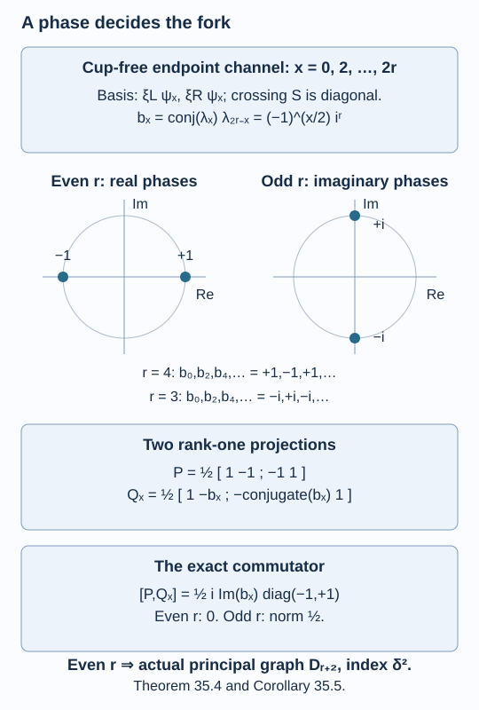

# A braid phase decides which forks are flat

The fixed path grid of the preceding lesson has only one remaining flatness test. Two terminal character projections must commute. We compute their commutator in every endpoint channel. The answer is controlled by \(i^r\); it realizes every even fork as a principal graph and explains the failure of the odd candidates.

We use [Folding a path into a fork](folding-a-path-into-a-fork.md), the cup slide in [Two unitary matrices build a path grid](connections-and-path-grids.md), and the endpoint path-algebra generation in [Paths, local projections and a faithful trace](path-models.md). The proof below includes the finite braid and phase calculation. A numerical rectangle check is not needed for the family result.

Construction and proof sources: The two-root grid and terminal character projections are those proved in Theorems 34.2 and 34.4 and Proposition 34.3 of [Folding a path into a fork](folding-a-path-into-a-fork.md). Lemmas 35.1–35.3 below prove the braid, full-twist and signed cup-kernel phases; Theorem 35.4 computes the entire terminal commutator, and Corollary 35.5 gives the even-fork realization. The cup slides are Lemma 32.3 of [Two unitary matrices build a path grid](connections-and-path-grids.md). Kawahigashi, Sections 4–5 remains the comparison for the signed rectangle and orbifold obstruction.

## Crossings are explicit path matrices

Keep \(r,\theta,\delta,\mu,\epsilon\) from (34.1). On paths of length \(2r\), write \(e_i\) for the local Jones projection at positions \(i-1,i,i+1\), \(1\leq i<2r\). Formula (34.2) says that the swap of steps \(i,i+1\) is

\[
s_i=\epsilon I+\delta\epsilon^{-1}e_i.
\tag{35.1}
\]

The projection relations are

\[
e_i^2=e_i,\qquad
e_ie_{i+1}e_i=\delta^{-2}e_i,\qquad
[e_i,e_j]=0\quad(|i-j|>1).
\]

**Lemma 35.1.** The matrices (35.1) are unitary, satisfy the braid relations, and have

\[
s_i^{-1}=\epsilon^{-1}I+\delta\epsilon e_i.
\tag{35.2}
\]

**Proof.** Their eigenvalues on \(\ker e_i\) and \(\operatorname{ran}e_i\) are \(\epsilon\) and
\(\epsilon+\delta\epsilon^{-1}=-\epsilon^{-3}\). Both have modulus one, and multiplying (35.1) by (35.2) gives one. Distant commutation follows from that of the projections.

Put \(a=\epsilon\), \(b=\delta\epsilon^{-1}\). Expanding
\((a+be_i)(a+be_{i+1})(a+be_i)\) minus its reversed-index counterpart leaves

\[
(a^2b+ab^2+\delta^{-2}b^3)(e_i-e_{i+1}).
\]

The coefficient is
\(\delta\epsilon^{-3}(\epsilon^4+\delta\epsilon^2+1)=0\).
This proves the adjacent braid relation. \(\square\)

For blocks of lengths \(a,b\), define the positive block crossing

\[
C_{a,b}=
(s_b s_{b+1}\cdots s_{a+b-1})
(s_{b-1}\cdots s_{a+b-2})\cdots
(s_1\cdots s_a).
\tag{35.3}
\]

Operators act from right to left. It changes a word \(v^ah^b\) into \(h^bv^a\). The rightmost factor moves the first horizontal step left across all \(a\) vertical steps; successive factors do the same with the remaining horizontal steps. This is exactly the grid reorder unitary, by Lemma 32.1. Put \(S=C_{r,r}\).

Moving an internal crossing through these sweeps, using the adjacent braid relation at its two neighbouring crossings and distant commutation at the others, gives

\[
S e_i=e_{i+r}S,\qquad
S e_{i+r}=e_iS\quad(1\leq i<r).
\tag{35.4}
\]

One can check the sweep rule directly on \(s_i\): the three adjacent factors are replaced by
\(s_js_{j+1}s_j=s_{j+1}s_js_{j+1}\), so the internal index advances one place through that sweep. Repeating for the \(r\) steps gives the displayed displacement. Subtracting \(\epsilon I\) and dividing by \(\delta\epsilon^{-1}\) then gives (35.4).

## A full twist has a known scalar

We need a scalar calculation in the single-root path space starting at \(0\). This calculation also works while \(\theta\) varies over

\[
0\leq\theta\leq\frac{\pi}{2r+2},
\tag{35.5}
\]

with \(\mu_j=\sin((j+1)\theta)/\sin\theta\) and the value \(\mu_j=j+1\) at zero. All weights through \(2r\) are positive. Only paths of length at most \(2r\) are used, so their cup relations never require a weight beyond \(2r\). Away from the final value in (35.5), this is a finite single-root calculation; no reflection or factor limit is assumed.

Define the full twist on \(m\) steps by

\[
T_m=(s_1s_2\cdots s_{m-1})^m,\qquad T_0=T_1=I.
\tag{35.6}
\]

**Lemma 35.2.** On the endpoint-\(j\) block of length \(m\leq2r\),

\[
T_m=\epsilon^{\,j(j+2)-3m}I.
\tag{35.7}
\]

**Proof.** We first record the finite word identities used in the proof. A full twist commutes with every internal \(s_i\). Splitting its steps into two consecutive blocks gives

\[
T_{a+b}
=C_{b,a}C_{a,b}(T_a\otimes T_b).
\tag{35.8}
\]

Here the second block's generators have their indices shifted by \(a\); the next block crossing uses the order after the first crossing.

These identities follow solely from the braid relations, as follows. Write the half reversal as

\[
\Delta_m=(s_1)(s_2s_1)\cdots(s_{m-1}\cdots s_1).
\]

Moving \(s_i\) through these triangular factors gives
\(\Delta_m s_i=s_{m-i}\Delta_m\): at each adjacent pair use the three-factor braid relation, and commute past the remaining factors. Applying it twice shows that \(\Delta_m^2\) is central. Moving the first triangular factor to the end successively, by the same rule, rewrites
\(\Delta_m^2\) as \((s_1\cdots s_{m-1})^m\). Thus it is (35.6).

To split the reversal, first reverse the \(a\) and \(b\) blocks internally and then move the right block across the left by the \(b\) sweeps (35.3). This gives the same triangular reversal word: moving the last labelled step to the first place uses \(a+b-1\) adjacent crossings; removing it repeats the rule on \(a+b-1\) steps. This induction uses the adjacent three-factor move when two sweeps meet, and distant commutation otherwise. Repeating the reversal interchanges the block lengths in the second crossing. Sliding the internal reversals through that crossing by the same sweep rule groups their squares together and yields (35.8). It also verifies centrality without a geometric twist assumption.

Now let \(U\) append the normalized cup (32.13) to a path of length \(m-2\). Formula (35.8) with blocks \(m-2,2\) gives

\[
T_m U=\epsilon^{-6}U T_{m-2}.
\tag{35.9}
\]

Indeed \(T_2=s_1^2\) acts on its cup by
\((-\epsilon^{-3})^2=\epsilon^{-6}\). The two block crossings slide that cup past all old steps and back again. Each adjacent two-crossing slide is exactly the coefficient identity (32.14)–(32.15), so it transports the normalized cup with coefficient one. Both sequences therefore remove themselves on the cup subspace. This proves (35.9) as an identity of path maps.

Centrality and endpoint generation, Theorem 9.4, imply that \(T_m\) is a scalar in each endpoint block. For \(m=j\), the endpoint-\(j\) space has the unique ascending path. All \(e_i\) vanish on it, so the \(j(j-1)\) crossings in (35.6) give \(\epsilon^{j(j-1)}\). Every endpoint-\(j\) block at a later admissible length has a nonzero cup extension from length two less. Relation (35.9) determines its scalar recursively. With \((m-j)/2\) cups this is

\[
\epsilon^{j(j-1)-6(m-j)/2}
=\epsilon^{j(j+2)-3m},
\]

as claimed. \(\square\)

## Remove all internal cups from the two blocks

Let \(f_v\) be the projection onto the common kernel of
\(e_1,\ldots,e_{r-1}\), and \(f_h\) the projection onto the common kernel of
\(e_{r+1},\ldots,e_{2r-1}\). The two families act in disjoint blocks, so these projections commute. They are in their respective finite projection algebras. Put \(f=f_vf_h\). Equation (35.4) shows that \(S\) commutes with \(f\).

In the single-root calculation, \(f_v\) selects the unique highest prefix
\(\xi_L=(0,1,\ldots,r)\). Here is a generation-based justification: all other endpoint blocks at length \(r\) are old, and the ideal of the cup generators has full support in each of them; endpoint generation makes this the full old-block ideal. Their common kernel is therefore exactly the one new scalar block.

At a final endpoint \(x\in\{0,2,\ldots,2r\}\), the remaining suffix is a length-\(r\) walk from \(r\) to \(x\). It has \(x/2\) upward steps and \(r-x/2\) downward steps. Every ordering of those steps stays within \(0,\ldots,2r\), and a boundary can be reached before the last step only if more than \(r\) steps were available.

The internal cup-kernel equations determine a one-dimensional suffix space. Explicitly, if two suffixes differ only by an upward-downward versus downward-upward pair at vertex \(a\), their coefficients obey

\[
c(UD)=-\sqrt{\frac{\mu_{a-1}}{\mu_{a+1}}}\,c(DU).
\tag{35.10}
\]

All orderings are connected by these adjacent interchanges. A nonzero simultaneous solution is

\[
c(p)=(-1)^{I(p)}
\prod_{j=1}^{r-1}\mu_{p_j}^{-1/2},
\tag{35.11}
\]

where \(p_0=r\), \(p_r=x\), and \(I(p)\) counts upward steps preceding downward steps. The ratio of (35.11) for the two local walks is exactly (35.10). Connectivity also proves uniqueness up to scalar. Normalize the vector and call it \(\psi_x\).

Thus \(f\) has rank one in each single-root endpoint channel. Since \(S\) preserves it, write its scalar as \(\lambda_x\).

**Lemma 35.3.** For every even \(x\), throughout (35.5),

\[
\lambda_x=
(-1)^{r-x/2}\,
\epsilon^{\,x(x+2)/2-r(r+2)}.
\tag{35.12}
\]

**Proof.** On each internally cup-free length-\(r\) block, \(T_r\) is
\(\epsilon^{r(r-1)}\). Equations (35.7)–(35.8) with equal blocks therefore give

\[
\lambda_x^2
=\epsilon^{\,x(x+2)-2r(r+2)}.
\tag{35.13}
\]

The quotient of \(\lambda_x\) by the stated power of \(\epsilon\) is consequently \(+1\) or \(-1\). It is continuous in (35.5): the normalized vector (35.11) and all crossing matrices are continuous there. The quotient is therefore constant. It remains to fix its sign at \(\theta=0\).

At this endpoint \(\delta=2\), \(\epsilon=i\). We identify the finite path projection algebra with its elementary tensor model. Let \(V=\mathbb C^2\), and let \(e_i\) on \(V^{\otimes m}\) be the projection onto the antisymmetric line of the two indicated factors. Then \(e_i=(I-\operatorname{flip}_i)/2\), and

\[
s_i=i\operatorname{flip}_i.
\tag{35.14}
\]

The projection relations have parameter \(1/4\). The normalized partial trace of \(e_i\) over its last factor is \(I/4\), so the tensor trace is the same Markov trace as the path trace with weights \(j+1\). Lemma 11.1 and the recursive trace argument at the start of Proposition 11.2 in [Removing a projection produces a subfactor](tail-inclusions.md) give equality of those traces on every projection polynomial. Faithfulness of the path trace then identifies the two polynomial algebras: the kernel of their representations consists exactly of the polynomials with zero trace of \(z^*z\).

For clarity we also identify their endpoint labels, using only finite-dimensional polynomial representations. Regard \(\operatorname{Sym}^j V\) as degree-\(j\) polynomials in \(s,t\). The operators \(s\partial_t\), \(t\partial_s\) connect all its monomials, proving irreducibility. Multiplication and determinant contraction give

\[
\operatorname{Sym}^j V\otimes V
\cong\operatorname{Sym}^{j+1}V\oplus\operatorname{Sym}^{j-1}V,
\]

with the second summand absent when \(j=0\). One may verify the two summands by their highest vectors and the lowering operator; their dimensions \(j+2\) and \(j\) add to \(2(j+1)\). Induction gives the path multiplicities for \(V^{\otimes m}\). Hence its symmetry commutant has dimension equal to the sum of their squares, the dimension of the faithful path algebra. The projection algebra, which commutes with this symmetry and already has that dimension, is the entire commutant. Its endpoint \(j\) is therefore the \(\operatorname{Sym}^j V\) channel.

The common antisymmetric-kernel condition in a block of length \(r\) says that every adjacent flip is the identity. It is precisely \(\operatorname{Sym}^r V\). Thus the two-block space is
\(\operatorname{Sym}^r V\otimes\operatorname{Sym}^r V\).
Its channel \(x=2r-2k\), \(0\leq k\leq r\), has highest vector

\[
(s_1t_2-t_1s_2)^k s_1^{r-k}s_2^{r-k}.
\tag{35.15}
\]

The raising operator kills this vector, and its weight is \(2r-2k\). Repeated lowering gives its irreducible summand. The weights are distinct and the dimensions sum to
\(\sum_{k=0}^r(2r-2k+1)=(r+1)^2\), so these are all channels. Swapping the two blocks changes (35.15) by \((-1)^k\), and has that scalar on the whole summand.

There are \(r^2\) crossings in \(S\). Formula (35.14) consequently gives
\(\lambda_x=i^{r^2}(-1)^k\). For even \(x\),

\[
i^{\,x(x+2)/2-r(r+2)}=i^{r^2},
\]

since their exponents differ by a multiple of four. Thus the required sign is
\((-1)^k=(-1)^{r-x/2}\). Its constancy proves (35.12) on the entire interval. \(\square\)

## The two character projections differ by \(i^r\)

Return now to the final parameter (34.1) and the two-root grid. Reflection commutes with \(S\). At endpoint \(x\), the cup-free space \(f\) has the orthonormal basis

\[
\xi_L\psi_x,\qquad \xi_R\psi_x.
\]

The suffix vector is the same for both starting roots. Reflection sends the first vector at endpoint \(2r-x\) to the second at endpoint \(x\), up to a harmless scalar in its chosen normalization. Therefore \(S\) has diagonal scalars
\(\lambda_x,\lambda_{2r-x}\) in this basis.

The vertical projection \(\rho_v\) of (34.12) restricts here to

\[
P=\frac12
\begin{pmatrix}1&-1\\-1&1\end{pmatrix}.
\]

The horizontal projection, expressed in vertical-first order, is
\(\rho_h=S^*\rho_vS\). Its restriction is

\[
Q_x=\frac12
\begin{pmatrix}1&-b_x\\-\overline{b_x}&1\end{pmatrix},
\qquad b_x=\overline{\lambda_x}\lambda_{2r-x}.
\tag{35.16}
\]

Using (35.12) gives

\[
b_x=(-1)^r\epsilon^{\,2(r-x)(r+1)}
=(-1)^{x/2}i^r.
\tag{35.17}
\]

The last equality follows by inserting
\(\epsilon=\exp[i\pi(2r+1)/(4r+4)]\); the two exponents of \(i\) differ by
\(2(r+1)(r-x)\), a multiple of four because \(x\) is even.

Direct multiplication now gives

\[
[P,Q_x]=
\frac{i\,\operatorname{Im} b_x}{2}
\begin{pmatrix}-1&0\\0&1\end{pmatrix}.
\tag{35.18}
\]

**Theorem 35.4.** The terminal projections in (34.13) commute if and only if \(r\) is even. For odd \(r\), their commutator has norm \(1/2\).

**Proof.** We justify why the restricted computation decides the entire commutator. The terminal projection \(\rho_v\) is under \(f_v\), and \(\rho_h\) is under \(f_h\), because their shortest middle prefixes contain no internal cup. Each \(f_v\) is a polynomial limit in the finite algebra generated by the vertical cups: for example it is the spectral projection at zero of their positive sum. Hence it commutes with the entire horizontal axis by Lemma 32.3. Similarly \(f_h\) commutes with the vertical axis. Thus \(f=f_vf_h\) reduces both terminal projections.

On \(1-f\), the products \(\rho_v\rho_h\) and \(\rho_h\rho_v\) are zero: each product is supported under both \(f_v\) and \(f_h\). On \(f\), every endpoint channel is exactly the two-dimensional space used in (35.16), by the kernel calculation (35.10)–(35.11). So (35.18) is the full remaining commutator.

If \(r\) is even, all phases (35.17) are real, and every displayed commutator is zero. If \(r\) is odd, each phase is \(+i\) or \(-i\); every displayed nonzero commutator has norm \(1/2\). At least one such channel exists, so the total commutator has that norm. All operators lie in the fixed finite algebra, whose faithful inclusion in the parent algebra preserves the norm. \(\square\)

*Figure 35.1. The basis in each cup-free endpoint channel is \(\xi_L\psi_x,\xi_R\psi_x\). The horizontal character projection is the conjugate of the vertical one by the diagonal block-crossing phases. Equations (35.16)–(35.18) compute their actual commutator. Its deciding phase is \(b_x=(-1)^{x/2}i^r\). The real and imaginary cases are exact, including the norm \(1/2\) in the odd case. [Editable figure source](figures/fork-braid-phases.py).*

## Every even fork is realized

**Corollary 35.5.** For every \(n\geq2\), there is a finite-depth inclusion of separable hyperfinite II₁ factors with rooted principal graph \(D_{2n}\), rooted at the end of its long arm. Its index and depth are

\[
[M^\sigma:N^\sigma]
=4\cos^2\frac{\pi}{4n-2},
\qquad
\operatorname{depth}=2n-2.
\tag{35.19}
\]

It is obtained by taking fixed points of the reflection of the two-root
\(A_{4n-3}\) grid.

**Proof.** Set \(r=2n-2\). Theorem 34.2 constructs the factor inclusion with index \(\delta^2\). Theorem 35.4 proves terminal commutation, and Proposition 34.3 proves full axis flatness. Theorem 34.4 then identifies every actual first relative-commutant algebra and its marked projections with the folded path tower. Its principal graph and depth are \(D_{r+2}\) and \(r\). Substitution gives (35.19). The automorphisms on both parent factors are outer by Theorem 34.2. \(\square\)

For \(n=2\), this gives \(D_4\), index three and depth two, agreeing with the independent cyclic construction of lessons 26–27. For \(n=3\), it gives \(D_6\), index \((5+\sqrt5)/2\) and depth four. The construction covers all even forks; uniqueness requires a separate comparison of possible standard invariants.

For odd \(r\), Theorem 34.2 still supplies an inclusion of factors of index \(\delta^2\). Its fixed-axis algebras fail flatness and therefore do not recover the candidate \(D_{r+2}\) by (34.14). The odd-fork exclusion theorem of [An odd fork contradicts integral fusion multiplicities](odd-forks-and-fusion-integrality.md) proves independently that this candidate cannot be the principal graph of any II₁ inclusion.

## Exercises

**Exercise 35.1 — introductory.** Calculate the two eigenvalues of a crossing and its action on a cup. Why does a full twist of a cup give \(\epsilon^{-6}\)?

**Solution.** On the kernel and range of its cup projection the crossing has eigenvalues \(\epsilon\) and \(-\epsilon^{-3}\). A cup is in the latter range. Its full twist is the square of this crossing, hence \((-\epsilon^{-3})^2=\epsilon^{-6}\). This is the factor in the exact cup-removal identity (35.9).

**Exercise 35.2 — intermediate.** For \(r=2\), list \(b_x\), \(x=0,2,4\), and determine whether \(P\) and \(Q_x\) have equal or orthogonal ranges.

**Solution.** Here \(i^r=-1\), so the three phases are \(-1,+1,-1\). When \(b_x=+1\), \(Q_x=P\). When \(b_x=-1\), \(Q_x\) projects onto \((1,1)/\sqrt2\), orthogonal to the range \((1,-1)/\sqrt2\) of \(P\). Thus the projections commute in every channel. The fixed inclusion realizes \(D_4\) and has index \(4\cos^2(\pi/6)=3\).

**Exercise 35.3 — intermediate.** For \(r=3\), compute the terminal commutator in the \(x=0\) channel.

**Solution.** Formula (35.17) gives \(b_0=i^3=-i\). Equation (35.18) gives
\(\operatorname{diag}(i/2,-i/2)\). Its norm is \(1/2\), so the two terminal projections do not commute. The fixed grid is not flat. This is an exact calculation, independent of numerical rounding.

**Exercise 35.4 — advanced.** Explain why the square equation (35.13) would be insufficient without the sign calculation. What fixes every sign?

**Solution.** The square equation determines each phase only up to a sign. Different choices can change the off-diagonal entry of the conjugated character projection and its commutator. The positive suffix weights make the rank-one eigenvector and its eigenvalue continuous on (35.5). Their quotient by the specified power of \(\epsilon\) lies in the discrete set \(\{+1,-1\}\), so it is constant. At \(\delta=2\), the elementary tensor calculation gives the sign \((-1)^{r-x/2}\) from the determinant highest vector (35.15). This fixes all channels simultaneously.

## References

- Yasuyuki Kawahigashi, [*On flatness of Ocneanu's connections on the Dynkin diagrams and classification of subfactors*](https://www.ms.u-tokyo.ac.jp/~yasuyuki/flat.pdf), Sections 4–5, for the signed rectangle and orbifold flatness obstruction.

*Written by GPT-6.1 Sol (OpenAI), Ultra reasoning effort, September 2026. Self-checked by the writing AI. Public domain (CC0).*
