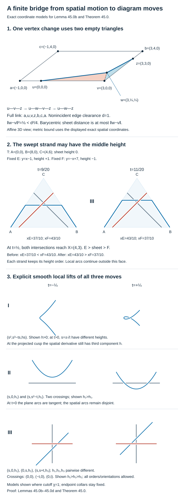
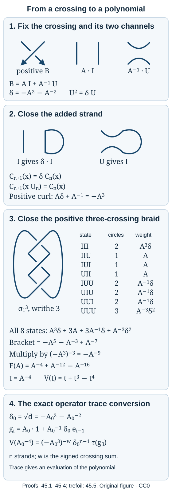

# A Markov trace becomes a knot polynomial

A Jones projection replaces a crossing by two planar connections. Closing the strands turns the resulting operator into a trace. Two normalizations are essential: closing an extra strand contributes a loop factor, and a curl contributes a twist factor. We compute both factors and obtain a polynomial that distinguishes a trefoil from its mirror.

We use the projection relations and tower traces in [Going up and down the Jones tower](towers-and-tunnels.md), the algebraic reduction in Lemma 11.1 and the trace recursion in Proposition 11.2 of [Removing a projection produces a subfactor](tail-inclusions.md), and the crossing calculation in Lemma 35.1 of [A braid phase decides which forks are flat](braid-phases-and-even-forks.md). No path-model faithfulness or finite-depth hypothesis is needed here.

The Reidemeister theorem is proved below as Theorem 45.0, with the original smooth endpoint diagrams retained. Thus the link-invariance conclusion uses a full topological proof in this lesson. A construction of three-dimensional manifold invariants would require further input.

For the historical construction and the diagram convention, see Louis H. Kauffman's [New Invariants in the Theory of Knots](https://homepages.math.uic.edu/~kauffman/Bracket.pdf), American Mathematical Monthly 95 (1988), 195–242, and Sections II and V of his [Knots](https://homepages.math.uic.edu/~kauffman/KNOTS.pdf). Vaughan Jones's [The Jones polynomial for dummies](https://math.berkeley.edu/~vfr/jonesakl.pdf), Sections 5–7, explains the connection with a Markov trace. We specify every normalization we use.

## Why the diagram moves characterize a smooth link

We prove the topological bridge before using it. Let \(S\) be a finite disjoint union of oriented circles \(\mathbb R/\mathbb Z\). A smooth link is a smooth embedding of \(S\) into \(\mathbb R^3\). A smooth isotopy is a jointly smooth family of such embeddings. An ambient isotopy is a smooth family of diffeomorphisms starting at the identity; Lemma 45.0d proves the extension from link isotopy to ambient isotopy. The empty link has only the empty diagram, so its assertion is immediate; the estimates below concern nonempty \(S\). This is the smooth-deformation category in Kauffman's *Knots*, Section II. We do not assume a theorem equating arbitrary topological and piecewise linear categories.

The fixed projection is \(\pi(x,y,z)=(x,y)\). A **regular diagram** is a smooth immersion of \(S\) with finitely many transverse double points, no triple points, and a specified overstrand at every crossing. Polygonal diagrams will serve as intermediate representations: crossings lie in edge interiors, are transverse and are never triple points. Corners are rounded before applying a smooth plane motion. Type I changes a curl, type II changes a cancellable bigon, and type III changes a three-strand triangle while retaining every pair's height order. The coordinate models below realize these moves with every strand orientation. Their local normalizations are proved, rather than inferred from an arbitrary planar-graph classification.

The proof has three stages. Uniform estimates replace the entire given smooth isotopy by one finite polygonal mesh. Each vertex update becomes two empty triangles. Sweeping each projected triangle gives a finite list of curls, bigons and triple crossings. Explicit smooth models prove the converse. The elementary triangle mechanism is classical; see Kauffman's [Knot Diagrammatics](https://homepages.math.uic.edu/~kauffman/Diagram.pdf), Section 2.1, for its diagrammatic antecedent. The complete estimates, extensions and local arguments below provide the proof used here.

## A uniform local and global separation estimate

Write S for a finite disjoint union of copies of R/Z and let f:S×[0,1]→\(\mathbb R^3\) be smooth, with every \(f_t\) an embedding and \(\partial _s\) \(f_t\) nowhere zero. All estimates are taken component by component in the specified oriented circle coordinate. Compactness gives

\[
\begin{aligned}m&=\min_{s,t}|\partial_s f_t(s)|>0,\\L&=\max_{s,t}|\partial_s f_t(s)|,\\K&=\max_{s,t}|\partial_s^2 f_t(s)|.\end{aligned}
\]

Choose 0<\(\eta\)<1/4 such that \(K\eta\)<m/4; if \(K=0\) the inequality imposes no restriction. For fixed t and \(s_0\) set \(e=\frac{\partial_s f_t(s_0)}{|\partial_s f_t(s_0)|}\). On the oriented coordinate interval of radius \(\eta\) about \(s_0\),

\[
\langle\partial_s f_t(s),e\rangle\geq |\partial_s f_t(s_0)|-K|s-s_0|>3m/4.
\]

Thus the curve is strictly monotone in this one scalar coordinate on that interval.

Call a pair (s,r) nonlocal when its points are on different components, or when their circle distance on the same component is at least \(\eta\). The set of (s,r,t) with a nonlocal pair is compact. None has \(f_t(s)=f_t(r)\), so

\[
\delta=\min_{\text{nonlocal }(s,r),\,t}|f_t(s)-f_t(r)|>0.
\]

The set is nonempty on every circle for \(\eta\)<1/4. This definition also includes every pair of different components.

**Lemma 45.0a.** Suppose g:\(S\to \mathbb R^3\) is continuous and piecewise \(C^1\) with finitely many breakpoints, absolutely continuous on each coordinate interval, and for one fixed t satisfies

\[
\begin{aligned}\sup_s|g(s)-f_t(s)|&<\delta/4,\\\mathop{\rm ess\,sup}_s|g'(s)-\partial_s f_t(s)|&<m/4.\end{aligned}
\]

Then g is an embedding, with nonzero one-sided speeds. The same bounds work for every t.

**Proof.** For two points on the same component at circle distance less than \(\eta\), take the shorter oriented coordinate interval between them, lift it to R, and use its first endpoint as \(s_0\). The preceding scalar product bound and the derivative error show that \(\langle g'(s),e\rangle\)>m/2 almost everywhere throughout that interval. The fundamental theorem for absolutely continuous functions gives a nonzero scalar difference between the two endpoint images. The sign reverses if the oriented difference is negative, but the difference still cannot vanish. In particular every one-sided derivative has scalar component at least m/2 in a suitable such direction, and is nonzero.

For a nonlocal pair, the triangle inequality gives

\[
|g(s)-g(r)|>\delta-2(\delta/4)=\delta/2.
\]

These two cases exhaust pairs. Hence g is injective. A continuous injection from compact S to Hausdorff \(\mathbb R^3\) is a homeomorphism onto its image. The same finite constants \(m,K,\eta ,\delta\) were chosen on S×[0,1], so no new choice depending on t is needed. ∎

The estimate applies to a straight interpolation of two smooth curves when both their \(C^0\) and derivative errors satisfy these bounds. Every intermediate curve has the same bounds by convexity, so the interpolation is a smooth isotopy.

## One finite mesh for the entire isotopy

Choose an integer \(n\geq 5\) and \(h=1/n\) so small that

\[
Kh<m/8,\qquad Kh^2<\delta/8.
\]

On each component use the same vertices \(s_j=jh\). Let \(P_t\) agree with \(f_t\) at the vertices and be affine on each parameter interval. On [\(s_j,s_{j+1}\)],

\[
P'_t=h^{-1}\int_{s_j}^{s_{j+1}}\partial_s f_t(r)\,dr.
\]

For every s in the interval this gives \(|P'_t-\partial _s\) \(f_t(s)|\leq Kh\). Integrating the derivative difference from the first endpoint gives the sufficient bound \(|P_t(s)-f_t(s)|\leq Kh^2\). The sharper interpolation constant is unnecessary. Lemma 45.0a proves that every \(P_t\) is a polygonal embedding. The vertex count is fixed, the vertex coordinates are smooth in t, and the oriented parameter order is fixed. This is a continuous path in one finite-dimensional configuration space of embedded polygonal links.

Choose a positive number a with

\[
a<\delta/16,\qquad 2a/h<m/16.
\]

If an array of vertices is within a of the array of \(P_t\), its interpolating polygon g has \(|g-P_t|\leq a\) and \(|g'-P'_t|\leq 2a/h\) almost everywhere. Consequently

\[
\begin{aligned}|g-f_t|&<\delta/8+\delta/16<\delta/4,\\|g'-\partial_s f_t|&<m/8+m/16<m/4.\end{aligned}
\]

It is therefore still embedded. This gives an explicit open neighborhood of the entire path, rather than a claim that an arbitrary polygonal approximation must preserve the link.

Let C be the closed set of arrays at distance at most a/2 from the array of \(P_t\) for some t. It is compact, because the original path is compact and bounded and the vertex space is finite dimensional. The estimates just given show that every element of C is an embedding. For every pair of nonincident polygon edges, including pairs on different components, their two closed segments are disjoint. Their distance varies continuously with their endpoints. There are only finitely many such pairs; compactness of C gives one number

\[
d=\min_{Q\in\mathcal C}\;\min_{\text{nonincident edges }E,F}\operatorname{dist}(E,F)>0.
\]

Edge lengths are also bounded below on C. Consecutive edges never double back into an overlapping interval: such overlap would violate the already established embedding property.

Set \(r=\min(a/8,d/8)\). Uniform continuity of the original vertex path supplies times \(0=t_0\)<\(t_1\)<…<\(t_N=1\) such that successive arrays differ in each vertex by less than r. Choose a nearby array \(Q_i\) within r of \(P_{t_i}\). A configuration made from any mixture of coordinates of \(Q_i\) and Q_{i+1} is within \(2r\leq a/4\) of \(P_{t_i}\), hence belongs to C. Updating the vertices one at a time therefore stays in embedded configurations, and each individual update has length less than \(3r\leq 3d/8\)<d/2. The two endpoint connections \(P_0\to Q_0\) and \(P_1\to Q_N\) likewise have update lengths less than r and stay in C; the latter sequence is used in reverse at the end.

The arrays \(Q_i\) can be chosen with the noncoplanarity conditions required in the next lemma. All their coordinates vary independently in nonempty open balls. Require that no four distinct points from the finite collection of new vertices be coplanar, no three be collinear, and no new vertex be equal to another relevant point. Also require, for each endpoint update, that its new vertex w avoid the affine plane of each noncollinear old neighbor triple appearing in that update. These are finitely many nonzero polynomial exclusions in the new coordinates. A nonzero real polynomial cannot vanish on an open box: induction on its number of variables reduces this fact to the finite number of roots of a nonzero one-variable polynomial. A finite union of their zero sets likewise has empty interior, by applying the same fact to their nonzero product. Thus they can all be avoided inside the chosen balls. An old triple that is identically collinear imposes no plane condition; it is handled directly below. Avoiding the old edge lines is an additional finite polynomial exclusion. Intermediate old triples involving already chosen new vertices are covered by the same finite list, or by the same direct collinear case.

This finite-dimensional selection uses no Sard or transversality theorem. It is a choice of finitely many vertex coordinates satisfying explicitly stated incidence exclusions.

## Two empty triangles move a single vertex

In the following statement \(n\geq 5\) on each component ensures that the five consecutive vertices a,u,v,z,b are distinct, with the four displayed edges having the stated incidences. Redundant forward-collinear vertices are permitted. A triangle is **empty** when its closed face meets the current link exactly in the one or two boundary edges being replaced, including their endpoints. Its other boundary edges and its interior are free of the rest of the link.

**Lemma 45.0b.** Let an embedded polygonal link have consecutive vertices a,u,v,z,b. Suppose every edge nonincident to [u,v] or [v,z], respectively, has distance at least d from that edge. Let w satisfy |w−v|<d/2, avoid the lines through u,v and v,z, and avoid each of the affine planes through

\[
(a,u,v),\qquad(u,v,z),\qquad(v,z,b)
\]

whenever that triple is noncollinear. Then replacing v by w is the composition of two empty-triangle moves:

\[
\begin{aligned}{}[u,v]&\longrightarrow[u,w]\cup[w,v],\\{}[w,v]\cup[v,z]&\longrightarrow[w,z].\end{aligned}
\]

**Proof.** The first triangle \(T_1=\)[u,v,w] is nondegenerate. For any \(x=\alpha u+\beta v+\gamma w\) in it, replace w by v to obtain \(x_0=\alpha u+(\beta +\gamma )v\in\)[u,v]. Then \(|x-x_0|=\gamma |w-v|\leq |w-v|\)<d/2. Thus every point of \(T_1\) is within d/2 of the old edge [u,v]. All its nonincident old edges are excluded by the distance bound.

The only other old edges needing attention are [a,u] and [v,z]. If a,u,v are noncollinear, the condition on w makes the plane of \(T_1\) different from the plane of a,u,v. The line through a,u then meets the plane of \(T_1\) only at u; otherwise that entire line would lie in both planes and force w into the old plane. If a,u,v are collinear, embedding forces u to lie strictly between a and v: the alternative would make the consecutive edges overlap. The line through u,v meets \(T_1\) in [u,v], and [a,u] meets this interval only at u. The same argument with u,v,z shows that [v,z] meets \(T_1\) only at v; in its collinear case v is between u and z. Therefore \(T_1\) meets the link precisely in [u,v]. The first replacement produces another embedded polygonal link.

The second triangle \(T_2=\)[v,w,z] is also nondegenerate and is within |w−v| of [v,z], by replacing w by v in its barycentric coordinates. All unchanged edges nonincident to [v,z] are again excluded. At z the only remaining adjacent edge is [z,b]. The plane condition for v,z,b, or the forward-collinear case with z between v and b, shows that this edge meets \(T_2\) only at z.

At w the new adjacent edge is [u,w]. If u,v,z are noncollinear, their condition on w says that u,v,z,w are not coplanar. The line through u,w then meets the plane of \(T_2\) only at w. If u,v,z are collinear, v is between u and z. Write \(u=v-\lambda (z-v)\), \(\lambda\)>0. A point (1−t)w+tu of [w,u] with t>0 has z coefficient −\(t\lambda\) in its unique barycentric coordinates relative to the nondegenerate triangle (v,w,z). That negative coefficient excludes it from \(T_2\). Hence [u,w] meets \(T_2\) only at w in this case too.

The edges [w,v] and [v,z] are exactly the two present boundary edges of \(T_2\). Replacing them by [w,z] completes the claimed update. Both moves preserve the order and orientation of the component and leave all other components fixed. ∎

Combining the preceding construction with this lemma gives a finite list of empty spatial triangle moves from \(P_0\) to \(P_1\). The endpoint perturbation at \(P_1\) is reversed, so neither endpoint is discarded in favor of a merely nearby link. The argument does not define isotopy to mean triangle equivalence; it derives the finite moves from the given smooth isotopy.

## Rounding a compact family of polygonal embeddings

It is also necessary to connect the polygonal argument back to smooth ambient isotopy. Here is the required rounding statement.

**Lemma 45.0c.** Let \(P_t\) be a compact continuous family of polygonal embeddings with one common finite parameter mesh, nonzero edge speeds, and with vertex coordinates piecewise smooth in t. There is \(\sigma _0\)>0 such that convolution in the circle parameter with a fixed even nonnegative smooth unit-integral kernel of support (−\(\sigma ,\sigma\)), 0<\(\sigma \leq \sigma _0\), gives smooth embedded links \(R_t\). After flattening the finitely many time junctions, \(R_t\) is a smooth isotopy. Different sufficiently small values of \(\sigma\) give smoothly isotopic roundings.

**Proof.** Put \(h_0\) equal to the minimum parameter spacing. At each vertex and time let d₋,d₊ be the incoming and outgoing oriented edge derivatives. They are nonzero. Their normalized vectors cannot be negatives: that would mean that the two consecutive segments lie on the same outgoing ray from their common vertex, overlap in a nonzero interval and violate embedding. Thus

\[
e=\frac{d_-/|d_-|+d_+/|d_+|}{|d_-/|d_-|+d_+/|d_+||}.
\]

has positive scalar product with both d₋ and d₊. Compactness of time and the finite vertex set give a uniform positive lower bound c for both scalar products. An aligned forward subdivision is included: the two normalized derivatives are equal, not opposite.

Choose \(\rho\)<\(h_0/10\). On a parameter interval of radius \(3\rho\) about one vertex, \(P'_t\) has only these two values; their scalar products with the corresponding e are at least c. Away from the vertex neighborhoods it has one constant nonzero value. Let \(L_0\) be the largest edge speed. For \(\sigma\)<\(\rho\), the derivative of the convolution \(R_t\) is the convolution of the piecewise derivative. It is a convex combination of the relevant one or two derivatives, so the same scalar monotonicity holds on each shorter local interval. In particular the derivative cannot vanish.

For any two parameters at circle distance less than \(\rho\), their intervening interval and the kernel neighborhoods either lie in one straight edge or in the \(3\rho\)-neighborhood of one vertex. The fixed scalar direction just supplied proves injectivity on that interval. For parameters at distance at least \(\rho\), and for points on distinct components, compactness gives a positive minimum distance \(\Delta\) between the corresponding \(P_t\) images. The estimate

\[
\sup_s|R_t(s)-P_t(s)|\leq L_0\sigma.
\]

follows by averaging \(|P_t(s-r)-P_t(s)|\leq L_0|r|\). Choose \(\sigma _0\)<\(\rho\) with \(2L_0\sigma _0\)<\(\Delta /2\). Nonlocal images of \(R_t\) then stay at distance greater than \(\Delta /2\). Together with local monotonicity this proves embedding. Convolution makes the s-variable smooth; the vertex coordinates make the t-variable smooth on each time piece.

At a finite time junction, reparameterize each time interval by a smooth strictly increasing function whose derivatives of every positive order vanish at its two endpoints. Such a function is obtained by integrating a positive bump exp(−1/(u(1−u))) on (0,1), extending by zero at the endpoints and normalizing its integral. Its derivatives vanish because each derivative is that exponential times a rational function of u and 1−u, and the exponential dominates every power at either endpoint. Composing the pieces with these parameter changes and concatenating them gives a jointly smooth family.

For \(\sigma\) in a closed positive interval [\(\sigma _1,\sigma _2\)]⊂(\(0,\sigma _0\)], all preceding estimates hold uniformly, and the scaled kernel depends smoothly on \(\sigma\). Varying \(\sigma\) therefore gives a smooth isotopy between these roundings. ∎

For one spatial triangle move, insert a parameter vertex in the interior of its old edge and move that vertex linearly from its starting point on the old edge to the opposite triangle vertex. The moving two-edge arc lies inside the empty face, is embedded for every time, and meets the rest of the link only at its fixed endpoints. All edge lengths stay nonzero, including at the initial forward subdivision. This individual move has a fixed finite mesh and is a compact polygonal family to which Lemma 45.0c applies. For the inverse move, move the middle vertex to an interior point of the opposite edge; it then becomes a redundant forward subdivision. No claim that a newly inserted logical vertex already has the old vertex's parameter is needed.

Roundings at a common endpoint of two consecutive moves may use different oriented edge parametrizations. They are still smoothly isotopic, as follows. An even kernel leaves the straight portions unchanged, so each change is confined to small mutually disjoint vertex neighborhoods. There choose the scalar direction e above. Each rounding is a graph over the e-coordinate, with strictly positive scalar derivative. Use an e-coordinate interval whose two endpoint collars lie on the unchanged straight edges. Express the two graph curves as vector-valued transverse functions on that same interval; they agree on the collars. Their straight interpolation is another smooth graph agreeing on those collars. Its image stays in a small convex vertex neighborhood, and that neighborhood meets no other part of the polygon. Hence this interpolation is an embedded smooth arc, independently at all vertices. Nonzero derivatives and fixed exterior collars give a smooth link isotopy. Lemma 45.0d extends it to ambient isotopy. Thus the finite list of individually rounded triangle motions concatenates through proved endpoint connections; no unproved common-mesh relabelling is used.

## A direct ambient extension for the smooth families used here

**Lemma 45.0d.** A smooth isotopy \(\gamma\):S×[0,1]→\(\mathbb R^3\) of a finite oriented link extends to a compactly supported smooth ambient isotopy of \(\mathbb R^3\).

**Proof.** Use m>0,L,K for this family as in Lemma 45.0a. Choose 0<\(\eta\)<1/4 so small that \(KL\eta\)<\(m^2/8\). Choose \(\delta _1\)>0 as the uniform separation between distinct components and between same-component parameters at distance at least \(\eta /2\). Choose r>0 so that 2r<\(\delta _1\) and Kr<\(m^2/8\). If \(K=0\) the latter inequalities impose no restriction.

For X at distance less than r from \(\gamma _t(S)\), compactness gives a closest point \(\gamma _t(s)\). If two parameters \(s_1,s_2\) were minimizers, their images would be at distance less than 2r, so they would be on one component at parameter distance less than \(\eta /2\). On the shorter coordinate interval between them, the derivative of

\[
F(s,t,X)=\langle\gamma_t(s)-X,\partial_s\gamma_t(s)\rangle.
\]

with respect to s satisfies

\[
\begin{aligned}F_s&=|\partial_s\gamma_t(s)|^2+\langle\gamma_t(s)-X,\partial_s^2\gamma_t(s)\rangle\\&\geq m^2-K(r+L\eta)>3m^2/4.\end{aligned}
\]

At each closest point \(F=0\). Strict increase on the intervening interval contradicts two such zeros. Hence the closest point parameter \(\pi _t(X)\) is unique.

We spell out its local smoothness instead of importing a tubular-neighborhood theorem. The closest parameter is continuous: for convergent (\(t_j,X_j\)), compactness gives subsequential limits of their closest parameters; continuity of distance makes each limit a closest parameter at the limit point, and uniqueness makes every such limit the same. Near one closest-point zero (\(s_0,t_0,X_0\)), \(F_s\) is bounded below by a positive constant on a coordinate interval. Its two endpoint values have opposite signs, and these signs persist under small changes of (t,X). The intermediate value theorem and strict monotonicity give a unique zero there. The mean value theorem bounds the displacement of that zero by a constant times \(|t-t_0|+|X-X_0|\), so the zero is continuous. Taylor expansion of F around it gives the derivative of the zero as \(-\frac{D_{(t,X)}F}{F_s}\). The nonzero denominator and this formula prove \(C^1\) regularity. Differentiating the same identity inductively gives every higher derivative, since F is smooth and \(F_s\) remains bounded away from zero. This proves joint smoothness of \(\pi\) in local circle coordinates. Uniqueness makes these local expressions agree, so \(\gamma _t(\pi _t(X))\) and the squared distance are globally smooth on this tube.

Choose a smooth cutoff \(\chi\) of the squared distance, equal to 1 at distance at most r/3 and zero at distance at least 2r/3. Define

\[
V_t(X)=\chi\bigl(|X-\gamma_t(\pi_t(X))|^2\bigr)\,\partial_t\gamma_t(\pi_t(X)).
\]

inside the tube, and set it to zero outside. The cutoff vanishes on a neighborhood of the tube boundary, so this extension is smooth. Compactness of the link family puts its support in one fixed ball. V and its first X-derivative are uniformly bounded; call the latter bound A.

For completeness, the flow is obtained from the integral equation

\[
X(t)=X_0+\int_{t_0}^t V_u(X(u))\,du.
\]

On a time interval of length less than 1/(2(A+1)), its right side is a contraction on the complete space of continuous paths with fixed starting value, with the uniform norm. Successive substitutions have uniformly summable differences and converge to a unique solution. Uniform boundedness of V lets these bounded intervals be concatenated through [0,1]; no trajectory can escape in finite time. Uniqueness also follows by successively substituting the bound \(|X-Y|\leq A\int |X-Y|\), which gives the factor \((A\ell)^k/k!\) and hence zero for two solutions with the same start.

The solution depends smoothly on \(X_0\). Difference quotients satisfy, in the limit, the uniquely solvable linear integral equation

\[
D\Phi_t=I+\int_0^t(D_XV_u)(\Phi_u)\,D\Phi_u\,du.
\]

The same integral estimates bound the difference between the quotients and this solution; Taylor remainders tend uniformly to zero on each bounded interval. This proves differentiability and continuity of the derivative. Applying this argument inductively to higher difference quotients proves smoothness, with the inhomogeneous terms involving only already established lower derivatives and the bounded higher derivatives of V on its compact support. Solving the original equation backward from t produces the smooth inverse to \(\Phi _t\) by uniqueness. Thus \(\Phi _t\) is a diffeomorphism, \(\Phi _0=id\), and \(\Phi _t\) is the identity outside the fixed support ball.

For each s, the prescribed trajectory \(\gamma _t(s)\) solves the same differential equation, because \(\pi _t(\gamma _t(s))=s\) and \(\chi (0)=1\). Uniqueness gives \(\Phi _t(\gamma _0(s))=\gamma _t(s)\). This proves the ambient extension and preserves the prescribed component orientations. ∎

Apply Lemma 45.0d to the smooth rounded polygonal families from Lemma 45.0c. Each empty triangle move therefore preserves the ambient isotopy class of its smooth rounding, with no PL ambient-extension theorem invoked. For the original \(f_t\) and its fine inscribed \(P_t\), their smooth convolutions \(R_t\) converge to \(f_t\) in \(C^1\) uniformly as h and \(\sigma\) decrease. Indeed the derivative error from polygonal interpolation is at most Kh and convolution contributes at most \(K\sigma\) to the smooth derivative of \(f_t\); the \(C^0\) bound is at most \(Kh^2+L\sigma\). Choose h first as above and then \(\sigma\) sufficiently small. Lemma 45.0a proves that the straight interpolation from \(f_0\) to \(R_0\), and from \(f_1\) to \(R_1\), is a smooth isotopy, and Lemma 45.0d extends it. This connects the original smooth endpoints to the compatible smooth roundings used in the finite spatial sequence.

The direction “given smooth ambient isotopy ⇒ a finite sequence of empty spatial triangles between fine polygonal representatives” and the preservation of smooth ambient type by each triangle are now established here. No classification of general PL manifolds has been imported.

## Extending a regular diagram motion in the plane

**Lemma 45.0e.** A smooth compact family of regular immersed diagrams with unchanged double-point pairing, with the double points remaining transverse and distinct, is carried by a smooth ambient isotopy of \(\mathbb R^2\). The parametrization may be adjusted along the diagram so that each double point is one moving vertex for both branches. Crossing heights, component orientations and all labels are transported.

**Proof.** First fix the moving crossing preimages. Transversality and the local inverse argument below make each preimage \(s_k(t)\) smooth locally in time; unchanged pairing continues its label throughout the interval. On each circle these finitely many labels remain distinct, so their mutual circle distances have a positive minimum. Choose smooth disjoint circle bumps \(\chi _k(t,s)\), equal 1 near \(s_k(t)\), whose supports have radius less than one quarter of that minimum. The circle vector field \(v_t(s)=\sum_k s'_k(t)\chi_k(t,s)\) is smooth. Here \(s'_k\) is computed in any local lift of the circle coordinate; changes of lift are by integers and leave the derivative unchanged. Its flow \(\rho _t\) is obtained by the Picard construction in Lemma 45.0d, now in dimension 1 on periodically lifted coordinates. Uniqueness gives \(\rho _t(s_k(0))=s_k(t)\). The flow is an orientation-preserving circle diffeomorphism: its derivative is \(\exp\bigl(\int_0^t v'_u(\rho_u(s))\,du\bigr)>0\). Thus \(d_t\circ \rho _t\) has every crossing preimage at a fixed labelled parameter.

Regard each double point as a four-valent vertex. Cut these reparametrized components at their now fixed preimages. The resulting finitely many graph edges have one prescribed smooth parametrization and moving image. In the absence of crossings a component is simply an embedded circle. Near one crossing \(X_t\), use the fixed parameter differences on its two branches to write \(a_t(u)\), \(b_t(v)\), with \(a_t(0)=b_t(0)=X_t\). Their tangent vectors are independent. The map

\[
\Psi_t(u,v)=a_t(u)+b_t(v)-X_t.
\]

has invertible derivative at (0,0), maps its two coordinate axes onto the actual crossing branches, and supplies a smooth coordinate chart in a sufficiently small neighborhood.

Here is the elementary local inverse fact being used. If \(D\Psi\) at a point is an invertible matrix A, restrict to a ball where \(\|I-A^{-1}D\Psi\|<1/2\). For a target X near the image of the center, the equation \(\Psi (q)=X\) is the fixed-point equation \(q=q-A^{-1}(\Psi (q)-X)\). Its right side maps a sufficiently small closed ball to itself and is a contraction there. Iteration gives the unique inverse, with continuous dependence. Difference quotients and Taylor expansion give \(D\Psi ^{-1}=(D\Psi )^{-1}\); repeated differentiation gives smoothness. The same estimates hold with t as a parameter after restricting to a compact time subinterval. Thus no inverse or isotopy theorem beyond this explicitly proved local fact is hidden here.

In this chart set \(W_t(\Psi _t(u,v))=\partial _t\Psi _t(u,v)\). On either axis this is the velocity of its actual moving branch. Away from crossing vertices, use a curve chart \(a_t(u)+v\) \(n_t(u)\), where \(n_t\) is a smooth unit normal obtained by rotating its nonzero tangent by a right angle. The same inverse argument gives local coordinates and the vector field \(\partial _t\) of that chart. These fields all agree with the prescribed graph velocity on the graph itself.

The circle flow makes the velocity assertion precise: every local branch coordinate is a restriction of the same fixed abstract parameter, including on overlaps with edge charts. At a crossing the two endpoint velocities both equal \(\partial _tX_t\). Therefore all local fields have the same value at every point of the moving graph, even though their values away from the graph need not agree.

Choose a finite cover of the graph over a compact time interval by the above chart neighborhoods, with smaller neighborhoods still covering it. Smooth bump functions supported in the larger neighborhoods and positive on the smaller ones are obtained from \(\exp(-1/(1-|q|^2))\) in chart coordinates, extended by zero. Their sum \(H_t\) is bounded below by \(c>0\) on the compact moving graph. The weighted sum of the local fields divided by that sum is therefore smooth near the graph and equals its prescribed velocity there. Multiply by a smooth function of the sum which equals 1 where the \(H_t\geq c/2\) and equals 0 where the \(H_t\leq c/4\). This gives a smooth field on the whole plane, supported in one fixed bounded region. Every moving graph point solves its flow equation. The Picard integral-equation and smooth-inverse argument of Lemma 45.0d, in dimension 2, proves that its flow is an ambient plane isotopy carrying the entire graph. A finite cover of the time interval supplies finitely many such motions which concatenate after smooth time flattening. ∎

We apply this lemma to polygonal motions only after rounding their corners. On a compact interval containing no event, crossing points have positive separation from vertices and other crossings. Choose an even convolution kernel so small that each crossing neighborhood lies on the interiors of its two straight edges throughout the interval. Convolution leaves an affine function exactly unchanged, so those crossing neighborhoods and labels are retained. At a corner the two oriented projected directions are not opposite; their normalized sum has positive scalar product with both. The rounded derivative is a convex combination of them and remains monotone in this scalar direction. Away from the corner and crossing neighborhoods, the compact set of projected parameter pairs has positive separation, so small rounding creates no additional crossing. These finite uniform bounds produce a smooth regular family to which the proved smooth lemma applies. A forward-collinear redundant vertex needs no rounding. When a crossing transfers through a nonextremal corner, the separate monotone rounding in the sweep argument gives the same conclusion.

## A regular smooth diagram has a stable polygonal representative

**Lemma 45.0f.** Fix a regular smooth diagram and a smooth spatial height realization of it. Every sufficiently close \(C^1\) approximation of that realization projects to a regular diagram with exactly the same double-point pairing and height order and is related to the original diagram by a planar isotopy. This applies to a smooth rounding of a sufficiently fine inscribed polygon after a sufficiently small change of its vertices.

**Proof.** On a short parameter interval around any point, the original projected derivative has positive scalar product with one fixed unit direction. This property persists under a small \(C^1\) perturbation and gives local injectivity, by integrating that scalar derivative. Compactness gives one uniform short interval size.

For each crossing choose disjoint small parameter intervals around its two preimages, and a small plane neighborhood containing just these two branches. After an invertible orientation-preserving linear change of coordinates and restriction to smaller intervals, one branch is a graph \(y=\varphi (x)\), the other a graph \(x=\psi (y)\), and \(|\varphi '|,|\psi '|\)<1/2. This follows from transversality: send the two crossing tangents to the coordinate axes and use continuity of their derivatives. Their domains include a fixed small rectangle around the crossing. The same graph descriptions hold for sufficiently \(C^1\)-close perturbations; their values are close too. Intersections satisfy \(x=\psi (\varphi (x))\). On a smaller fixed interval this is a contraction of constant less than 1/4 into that interval. It has exactly one fixed point by iteration, hence exactly one transverse crossing. The local inverse argument in Lemma 45.0e, or the same contraction with parameters, shows smooth dependence for a smooth perturbation family. The strict difference of the two original spatial heights at this crossing persists under a small perturbation of those heights.

Remove the short local-diagonal parameter pairs and the finitely many selected crossing pair neighborhoods from S×S. On the remaining compact set the two original projected points never coincide. Their distance has a positive minimum. A sufficiently small \(C^0\) perturbation creates no crossing there. The local monotonicity excludes new near-diagonal crossings, and the two graph calculations account for every remaining pair. This proves the claimed pairing and regularity.

For a smooth approximating diagram g, the interpolation \(d_r=(1-r)d+rg\) is uniformly \(C^1\) close to d, so it remains regular with the same crossing pairing for every r. Mark the smoothly moving crossing preimages on each component. Use the circle flow in Lemma 45.0e to fix these labelled preimages. Its positive derivative preserves their parameter order and the component orientations. Lemma 45.0e now gives the plane isotopy. All crossing labels are constant by the height separation just proved.

For a fine inscribed spatial polygon P of a smooth lift f, the spatial mesh estimate gives \(\|P-f\|_\infty\leq Kh^2\) and the almost-everywhere derivative estimate ≤Kh. Perturb every vertex by at most a and then round by convolution in the circle parameter with support \(\sigma\). The \(C^0\) error of the rounded curve is at most \(Kh^2+a+L_1\sigma\), where \(L_1\) bounds the perturbed polygon's edge speeds. Its derivative error from f is bounded by \(Kh+2a/h+K\sigma\): convolution of the piecewise derivative preserves the first two bounds, and convolution of f' changes it by at most \(K\sigma\). Thus choose h, then a/h, then \(\sigma\) small enough for both this planar stability argument and Lemma 45.0a. No assumption that mere \(C^0\) proximity preserves a crossing pattern is made. ∎

## Finite coordinate exclusions with the projection held fixed

In the construction above choose the arrays \(Q_i\) close enough to the endpoints for Lemma 45.0f. Instead of changing the final projection, choose their coordinates in general position relative to the given \(\pi\). There are finitely many coordinates to choose, each in a prescribed nonempty open ball. Require the following finite list of exclusions for the finite triangle sequence and its intermediate polygons:

* No three relevant projected vertices are collinear; no two projected vertices coincide. All nonincident projected edge pairs are nonparallel. No three nonincident projected edge interiors meet at one point.
* Every spatial triangle has nonzero projected area. A projected vertex of the fixed part of the link does not lie on a triangle boundary except at its legitimate link endpoint. A crossing of two fixed projected edges does not lie on the triangle boundary. The apex does not lie on the fixed diagram.
* For each triangle with base AB, no fixed edge is parallel to AB. All the spatial noncoplanarity exclusions of Lemma 45.0b are retained.

These conditions are polynomial inequalities after denominators are cleared. A projected line intersection lies on another projected line exactly when the corresponding three line determinants vanish; parallelism and collinearity use 2×2 determinants, spatial coplanarity 3×3 determinants. Only nonincident incidences are excluded. For an incidence not forced by a shared endpoint, the defining polynomial is not identically zero: choose one of its independently variable endpoints off the relevant projected line or plane, or choose a line direction different from the other two directions. The planar coordinates vary in open disks because every vertex varies in an open three-dimensional ball. A shared endpoint is precisely the legitimate incidence omitted from the exclusion. When two lines are the two fixed neighbors of one vertex, their crossing is that vertex and its boundary exclusion reduces to the already listed vertex condition.

The finite-product polynomial argument above therefore selects all the arrays simultaneously. One uses only the \(Q_0\to\)…→\(Q_N\) vertex updates; the two smooth endpoint lifts are joined directly to the roundings of \(Q_0\) and \(Q_N\) by their \(C^1\)-close interpolation. That interpolation is regular after projection by Lemma 45.0f. The optional spatial \(P_0\to Q_0\) and \(P_1\to Q_N\) moves from the spatial construction above are unnecessary, so fixed endpoint parallelisms do not need to satisfy the new polynomial exclusions. The original endpoints are still connected by proved isotopies; they have not been replaced without a bridge.

Each triangle in the finite spatial sequence is consequently an affine graph \(z=h(x,y)\) over its nondegenerate planar triangle T. Let G be the projected polygonal graph of the link outside the one or two replaced boundary edges. For each connected part of a fixed strand over T, its height minus h is continuous and nonzero except possibly at a legitimate common boundary endpoint. The empty spatial face forbids a zero in its interior or along its other boundary. The height difference therefore has one sign on each such connected part. Different strands can have different signs. At a crossing of two fixed strands their two heights are unequal because the fixed diagram is regular.

## Sweeping one empty face

It suffices to analyze a triangle expansion replacing AB by \(AC\cup CB\); a contraction reverses its sequence. Define

\[
\begin{aligned}A_t&=(1-t)A+tC,\quad B_t=(1-t)B+tC,\\\gamma_t&=[A,A_t]\cup[A_t,B_t]\cup[B_t,B],\quad 0\leq t\leq1.\end{aligned}
\]

At \(t=0\) the redundant zero-length side segments are deleted and \(\gamma _0=AB\). At \(t=1\) the zero-length middle segment is deleted and \(\gamma _1=AC\cup CB\). For 0<t<1 this is a simple three-segment arc in T. In space use the unique points on the affine triangle sheet over these coordinates. Each intermediate arc lies on the empty face and meets the rest of the link only at A,B. It is embedded in three dimensions. Its orientation is the original orientation from A to B or its reverse.

Use \(\lambda _C\), the affine barycentric coordinate of C, as the sweep height. The middle segment \(A_tB_t\) lies at \(\lambda _C=t\). The sides already swept out are initial pieces of AC and BC. The fixed graph G has finitely many projected vertices and double crossings. It has finitely many intersections with AC and BC. No fixed edge is parallel to the middle segment. Hence, except for the endpoint neighborhoods, the only times at which the diagram's crossing graph can change are:

1. The middle segment passes a fixed projected vertex or fixed double crossing inside T.
2. A moving corner \(A_t\) or \(B_t\) passes a fixed edge at its intersection with a side of T.

On a straight fixed edge \(\lambda _C\) varies strictly monotonically, so an interior crossing of the moving middle segment cannot appear or disappear elsewhere. A projected crossing with an already present fixed side segment is stationary once its corner has passed it. No two moving segments have an interior crossing, since they form the boundary of a convex swept trapezoid. No crossing changes its over/under order: the corresponding spatial height difference never vanishes on the empty sheet. Thus the displayed list is exhaustive.

There are finitely many such times. Several events may share a time, but occur at distinct plane points: the vertex/crossing boundary exclusions separate a middle event from a side event, and different graph nodes are distinct. Choose disjoint small disks around those points, each excluding every other graph feature. Within each disk the neighboring configurations are one of the following local changes. Events in distinct disks commute and can be performed in any order.

**One moving corner meets one fixed strand.** Straighten the fixed strand by an orientation-preserving affine map. Immediately before and after the corner crosses it, count intersections with the corner's two incident rays. If both rays point to the same side of the fixed line, the count changes from 0 to 2 or back; the two new crossings bound a small empty triangular bigon. The sheet's height sign against that fixed strand is constant, so the moving strand is above at both crossings or below at both. This is type II. If the two rays point to opposite sides, the count stays 1 and the crossing transfers from one ray to the other. Round the corner by a small monotone arc; it remains transverse throughout this transfer. Lemma 45.0e then gives planar isotopy.

**One moving straight strand meets one fixed corner.** Apply exactly the same two-ray test to the fixed corner, with the moving straight line as the reference line. Both rays on the same side give a change from 0 to 2 or back and a type II bigon. The height of the fixed vertex differs from the sheet height, so both fixed branches have the same sign in a sufficiently small neighborhood, giving the required over/under pair. Opposite sides give a single transverse crossing transferred along a rounded monotone corner, hence planar isotopy. To round an extremal corner, connect its two rays by a small convex circular arc after an affine change of coordinates. The sweep line meets that arc at a unique nondegenerate tangency and creates the two intersections; the endpoints can be attached to the rays by small smooth transitions away from the tangency. The signs and emptiness are unaffected. This makes the polygonal bigon precisely the smooth type II move.

**One moving strand meets a fixed transverse crossing.** In the small disk the fixed graph consists of two straight transverse segments. Before and after the event, the middle strand meets both once, and their intersection order along it switches as it crosses their common intersection. The three pairwise crossings give exactly the triangular type III change. Their heights have one strict total order: the two fixed heights differ, and neither equals the affine-sheet height. All six possible total orders are allowed. In particular the moving strand may be the middle height, rather than above both or below both. Each of the three pairwise over/under relations remains fixed. This is exactly the admissible type III move, with the orientations on all three strands retained.

**The initial endpoint wedge.** Take t>0 sufficiently small. Near A, the original adjacent fixed edge is one ray issuing from A. The other endpoint B and all other graph features are outside a small disk about A. The ray is not parallel to either side of the triangle. If it lies outside the open wedge between AB and AC, the new short broken arc makes no extra crossing there and is related by planar isotopy. If it lies inside that wedge, it meets \(A_tB_t\) once near A. The path from A along \(AA_t\) and then to that intersection, together with the adjacent fixed ray back to A, is a small simple triangular curl with one transverse crossing. Its enclosed region contains no other strand. Its height difference from the sheet has a strict sign away from A, so the crossing is unambiguous. Rounding its corners gives type I. The two orientations and either height sign give the corresponding oriented curl. The same argument applies in a disjoint small disk at B. Existing crossings along the interior of AB merely slide to nearby middle-segment crossings without changing order; they lie outside these endpoint disks and are related by Lemma 45.0e.

**The terminal apex.** For t sufficiently close to 1, the shrinking middle segment lies in a disk about C disjoint from G, since C is not on the fixed diagram. Its replacement by the corner \(AC\cup CB\) creates no crossing. To verify the plane isotopy without collapsing a parametrized edge, put e equal to the normalized sum of the two oriented unit directions (C−A)/|C−A| and (B−C)/|B−C|. They are not opposite because T has nonzero area. Their scalar products with e are positive. The middle direction \(B-A=(C-A)+(B-C)\) has positive scalar product too. Hence both the terminal corner and every nearby three-segment arc are strictly monotone in the e-coordinate in that disk. Round them preserving this monotonicity, write them as graphs over one fixed e-coordinate interval, and interpolate their transverse graph functions while holding the two outer endpoint collars fixed. The interpolated curves remain embedded and regular; Lemma 45.0e supplies the ambient plane isotopy. There is no additional event at the apex.

All disks can be chosen before selecting the two neighboring regular times of each event. A finite set of forbidden times has positive separation between its distinct values; choose times in each resulting open interval. On a compact subinterval between events the regular crossing graph is fixed, all its intersections vary continuously and piecewise smoothly, and after harmless small corner roundings Lemma 45.0e supplies the planar isotopy. The finite local changes just enumerated join those intervals. Therefore the two regular rounded diagrams at the ends of one empty spatial triangle are related by finitely many planar isotopies and oriented types I, II and III moves. No disk-shelling or unproved arbitrary triangulation assertion is used.

We make the local normalization explicit. Coordinate changes used below can themselves be made by plane isotopies on a smaller disk. For an orientation-preserving linear change, Gram–Schmidt writes its matrix as a rotation times an upper-triangular matrix with positive diagonal. Interpolate the rotation angle, the two positive diagonal entries and the shear. The resulting path \(A_r\) stays invertible. Its local velocity A'_r \(A_r^{-1}X\), multiplied by a bump equal 1 on a small disk containing all these local trajectories, has a plane flow by Lemma 45.0e's integral construction. It agrees with the linear change on that smaller disk. For a smooth chart with derivative the identity at its center, restrict until its derivative differs from the identity by less than 1/2. Interpolation with the identity then has invertible derivative throughout; the local inverse construction gives its velocity in image coordinates, which the same bump construction extends. First remove the chart's derivative by the linear step. This realizes the required local charts without invoking a general disk-extension theorem.

For a bigon event, straighten the reference line to \(y=0\). Shear the x-coordinate so that the two corner rays have opposite x directions; this is possible because the line separates the two sectors in the extremal two-ray case. The rounded corner is now a strictly convex graph \(y=\varphi (x)\) near its unique minimum, or a strictly concave graph near its unique maximum. Its second derivative has one strict sign on a sufficiently small central interval. Put the extremum at \(x=0\) and let q be the quadratic Taylor polynomial there. If \(|\varphi^{(3)}|\leq B\) on \(|x|\leq r\), Taylor's formula gives \(|\varphi -q|\leq B|x|^3/6\), \(|\varphi '-q'|\leq B|x|^2/2\) and \(|\varphi ''-q''|\leq B|x|\). For a fixed smooth collar cutoff scaled to radius r, the second derivative of the cutoff times \(\varphi -q\) is bounded by CBr, where C depends only on that cutoff. Choose r so small that CBr is less than half the positive lower bound on \(|\varphi ''|\). Interpolating this cutoff modification keeps strict convexity (respectively concavity), agrees with q near 0 and with \(\varphi\) on the outer collars, and fixes the extremum's value and first derivative. The outer collars lie away from the tangency and keep their nonzero intersection slopes. Graph values at the two outer collars stay on the same fixed side of \(y=0\). On the no-crossing side keep the extremum strictly off the line; on the two-crossing side keep it strictly on the other side. Each graph therefore retains exactly zero or two transverse intersections. These regular-side motions are plane isotopies by Lemma 45.0e. A translation and rescaling give the local model \(y=s^2-t\) (or its reflection). No new intersection can occur outside the selected interval, by the fixed collars and the positive separation from other features.

For the endpoint curl, the small loop bounds the actual convex triangle with vertices at the crossing and the two new corners. Round the two corners preserving convexity. Choose a linear scalar coordinate with the crossing as the unique maximum and a rounded cap as the minimum. The two boundary arcs of the loop are graphs on the intervening open interval, with a strictly positive gap. Fix small crossing collars by the crossing chart in Lemma 45.0e; fix a small cap collar by an embedded-arc chart. Both chart changes are supported as in the previous paragraph. For the cubic model \(x=s^2\), \(y=s^3-ts\) at t>0, the corresponding loop graphs are \(y=\pm\sqrt{x}(t-x)\), 0<x<t, and have the same positive-gap property. Normalize the intervals and the collars to coincide. Interpolate the upper graph functions and the lower graph functions separately on the remaining interval. Their gap is a convex combination of positive gaps, so it remains positive. The fixed cap and crossing collars give a smooth loop throughout. The two outgoing branches past the crossing are similarly graphs with fixed collars and remain in their respective disjoint sectors. Thus the whole regular one-crossing arc stays regular with the same label and is carried by Lemma 45.0e. The uncurled arc is a single monotone graph in the corresponding disk; interpolation of its transverse graph function, with fixed outer collars, joins it to the t<0 model. This identifies the change with type I without classifying arbitrary planar loops.

For the triple event, the two fixed straight lines become the coordinate axes by an invertible affine chart. The third line is \(y=\alpha x+\beta\), with \(\alpha \ne 0\). Positive axis rescaling gives slope +1 or −1; use the correspondingly reflected model for the latter. On the two regular sides \(\beta\) has opposite signs. Interpolate its nonzero value to −\(\varepsilon\) or +\(\varepsilon\), preserving its sign. The three pairwise crossing orders and labels stay fixed during these motions. A cutoff on the third strand holds its outer collars fixed; choose \(\varepsilon\) small enough that all crossings lie where that cutoff is 1 and the transition collars meet no other strand. This gives the third model below. All three normalizations use only the finite local straight configurations and graph interpolations just described; Lemma 45.0e supplies the regular-side plane motions. Reflecting a picture or reversing any strand retains the same proof and realizes the other signs and orientations.

## Every local diagram move has a smooth spatial lift

First, every regular smooth diagram admits a smooth height function realizing its assigned over/under labels. Choose disjoint parameter neighborhoods of the finitely many crossing preimages. Smooth bumps supported there, with value+1 at an over-preimage and−1 at an under-preimage, give such a function z. The curve \(\gamma =(d,z)\) is a smooth embedding: the projection can identify only those crossing pairs, whose heights are different; its projected derivative is nowhere zero. Compactness makes its image a link.

If \(z_0,z_1\) realize the same diagram labels, \(z_r=(1-r)z_0+rz_1\) retains each strict crossing-height difference. Thus (\(d,z_r\)) is a smooth isotopy of embeddings. Lemma 45.0d extends it to ambient isotopy. Different height realizations therefore represent the same oriented ambient link.

A plane isotopy \(F_t\) of the diagram lifts to (\(F_t(d(s)),z(s)\)). It retains the exact crossing preimage pairs and their height inequalities and has nonzero derivative, hence is a smooth isotopy. Again Lemma 45.0d supplies its ambient extension. This also shows that normalizing a local move by a plane isotopy is harmless.

Here are explicit spatial models for the three local changes. Their small parameter values and coordinate neighborhoods can be chosen disjoint from the rest of the link. Choose an even smooth cutoff \(\chi (s)\) with \(0\leq \chi (s)\leq 1\), equal 1 for \(|s|\leq a/3\) and 0 for \(|s|\geq a/2\), holds the exterior endpoints fixed. Choose all time magnitudes small enough for the estimates below; these are finite choices.

**Type I.** For \(|s|\leq a\) take

\[
\begin{aligned}\gamma_t(s)&=(s^2,s^3-t\chi(s)s,hs),\\h&\ne0,\qquad |t|<a^2/9.\end{aligned}
\]

The third coordinate is strictly monotone, so the spatial arc is always embedded and its derivative is nowhere zero. The projected equalities between distinct parameters require \(r=-s\), since their first coordinates agree. Choose \(\chi\) even and nonnegative. The second-coordinate equality then says \(s^2=t\chi (s)\). For \(t\leq 0\) there is no nonzero solution. For 0<t<\(a^2/9\), a solution must satisfy |s|<a/3, where \(\chi =1\), so precisely \(s=\pm\sqrt{t}\) give the unique crossing. Their heights differ by \(2h\sqrt{t}\). At \(t=0\) the projected derivative vanishes only at \(s=0\); the spatial derivative has third coordinate h. This is a one-curl birth with either height sign. Reversing s gives the other orientation, and reflecting one plane coordinate gives the other planar handedness. The cutoff leaves the two endpoint neighborhoods fixed throughout.

**Type II.** Use the two arcs

\[
\begin{aligned}\alpha(s)&=(s,0,h_1),\\\beta_t(s)&=(s,s^2-t\chi(s),h_2),\quad h_1\ne h_2.\end{aligned}
\]

Their distinct constant heights keep them disjoint in three dimensions for all t. The same bound |t|<\(a^2/9\) implies that the projected intersections are exactly \(s=\pm\sqrt{t}\) for positive t, none for negative t, and one tangency at \(t=0\). The first coordinates give nonzero spatial derivatives. The height order at both crossings is the same, as required. Either arc orientation may be reversed independently. The cutoff fixes the endpoint neighborhoods of the moving arc.

**Type III.** Use three arcs, with three pairwise different heights:

\[
\begin{aligned}\alpha(s)&=(s,0,h_1),\\\beta(s)&=(0,s,h_2),\\\gamma_t(s)&=(s,s+t\chi(s),h_3).\end{aligned}
\]

Take |t| so small that |t|<a/3 and \(|t|\,\|\chi'\|_\infty<1/2\). Then the last arc's second coordinate is strictly increasing. Its crossing with \(\alpha\) is the unique root of \(s+t\chi (s)=0\), namely \(s=-t\), and its crossing with \(\beta\) is at \(s=0\) with second coordinate t. The fixed \(\alpha\)–\(\beta\) crossing is at the origin. At \(t=0\) the three projected intersections coincide; at t<0 and t>0 they have the opposite triangular order. All spatial arcs remain separated by their distinct heights. Any of the six height orders and any of the eight independent strand orientations is allowed. The cutoff fixes the moving endpoints.

To attach any model to an arbitrary diagram, first normalize its small local disk to the corresponding regular endpoint picture by the explicit planar deformations in the sweep discussion. Give its strands the displayed heights in a smaller three-dimensional box. Extend those heights smoothly through the surrounding collar to the already prescribed exterior heights; all projected crossing points in the collar, if any, retain their original strict orders. One may first use height interpolation on the fixed regular endpoint diagram to make this normalization: the constant model heights are chosen in the prescribed total order. The model motion is supported where the cutoff is 1 or transitions to 0, and there are no other projected strands in that local disk besides the one, two or three displayed strands. Thus it creates no spatial intersection with the rest of the link. At its two regular endpoints interpolate the heights back to the desired realizations. The preceding height-interpolation argument proves both connections. Lemma 45.0d extends the whole finite smooth isotopy. Every admissible oriented Reidemeister move therefore preserves ambient isotopy.

## Smooth links and their diagrams

**Theorem 45.0 (Reidemeister).** In the smooth category, two regular diagrams of oriented smooth links represent ambient-isotopic oriented links if and only if a finite sequence of planar isotopies and oriented moves I, II and III connects them. Smooth deformation through embedded oriented circles is equivalent to this ambient-isotopy condition by Lemma 45.0d; this matches the smooth equivalence in Kauffman's smooth-deformation convention.

**Proof.** The reverse direction is the plane-motion and explicit local lifting argument above, with Lemma 45.0d giving ambient extensions and height interpolation removing any choice of realization.

For the forward direction take a smooth ambient isotopy of the two smooth diagram realizations. Restrict it to their finite union of parametrized oriented circles. The uniform estimates in Lemma 45.0a give one fine mesh for the whole isotopy. Choose finitely many time samples and independently perturb their vertex arrays to the \(Q_i\) described above, retaining its compact embedded-neighborhood and nonincident-edge distance bounds. Add the finite polynomial exclusions relative to the fixed projection as above. At each endpoint choose all errors small enough for Lemma 45.0f and the spatial \(C^1\) interpolation. Thus the original endpoint diagrams are related by plane isotopy to the rounded \(Q_0\) and \(Q_N\) diagrams, and their smooth spatial lifts are ambient-isotopic to the corresponding roundings.

Update the sampled vertices one at a time. Lemma 45.0b gives two empty triangles for every update, so there are only finitely many triangle moves. All intermediate polygons have regular projected diagrams by the finite exclusions. The face sweep proves that each consecutive pair of their diagrams is related by a finite sequence of the three oriented diagram moves and plane isotopies. Choose the corner roundings small enough for all the finitely many regular endpoint diagrams simultaneously; rounding never changes a crossing label. Lemmas 45.0c–45.0d show independently that the spatial triangles connect compatible smooth representatives. Concatenating the finite planar sequences and the two proved endpoint plane isotopies gives the desired sequence between the original smooth diagrams. Orientations are inherited from the same ordered circle parameters throughout. ∎

*Figure 45.0. The first panel gives exact spatial coordinates for the two triangles in Lemma 45.0b; its affine view does not measure distances. The second panel has sheet height 0, one fixed strand at +1 and the other at −1: their intersection order changes while all heights stay fixed. The last panel displays the local lifts in the proof of Theorem 45.0, in their central region where \(\chi=1\). The displayed orders are \(h>0\), \(h_2>h_1\), and \(h_1>h_3>h_2\); the proof allows every permitted order and orientation. The cutoff fixes the endpoint collars. All coordinates and bounds are reproducible from the accompanying original figure source.*

## A finite sum over planar connections

Work in

\[
R=\mathbb Z[A,A^{-1}],\qquad
\delta=-A^2-A^{-2}.
\tag{45.1}
\]

At the model crossing, the overstrand runs from northeast to southwest and the understrand from northwest to southeast. The \(A\)-smoothing joins the two left endpoints and the two right endpoints, giving two vertical strands. The \(A^{-1}\)-smoothing joins the two upper endpoints and the two lower endpoints, giving a cup and a cap. Transport these rules by orientation-preserving rotations of the picture. A half turn leaves the rule unchanged, so this specifies the coefficients unambiguously at every crossing. Reflecting the picture interchanges the two coefficients.

Let \(D\) be a nonempty link diagram with \(n\) crossings. A **state** \(s\) chooses one of the two smoothings at each crossing. Write \(a(s)\) and \(b(s)\) for the numbers of \(A\)- and \(A^{-1}\)-choices, and \(\ell(s)\) for the number of resulting circles. Define

\[
\langle D\rangle
=\sum_s A^{a(s)-b(s)}\delta^{\,\ell(s)-1}.
\tag{45.2}
\]

Every state has at least one circle. Thus (45.2) belongs to \(R\), even at a later specialization with \(\delta=0\); it never divides by \(\delta\). A crossing-free single circle has bracket 1. Adding a disjoint circle multiplies the bracket by \(\delta\). Grouping states by their choice at a specified crossing gives the local two-term expansion. These facts follow directly from the finite sum.

For calculations with boundary, take a rectangle with \(n\) marked upper and \(n\) marked lower endpoints. Let \(\mathrm{TL}_n(R)\) be the free \(R\)-module on noncrossing pairings of these endpoints, represented by disjoint arcs up to planar isotopy fixing the boundary. To multiply two pairings, stack the first above the second, connect their common endpoints, remove each internal circle, and multiply by \(\delta\) for every circle removed. The identity \(I_n\) consists of \(n\) vertical strands. We read products from top to bottom.

**Lemma 45.1.** This multiplication is associative. If \(U_i\), \(1\leq i<n\), joins upper endpoints \(i,i+1\) and lower endpoints \(i,i+1\), leaving all other strands vertical, then

\[
U_i^2=\delta U_i,\qquad
U_iU_{i+1}U_i=U_i,\qquad
U_{i+1}U_iU_{i+1}=U_{i+1},
\qquad [U_i,U_j]=0\quad(|i-j|>1).
\tag{45.3}
\]

**Proof.** In three stacked layers, the connected components that do not meet the outer boundary are exactly the removed circles. Removing some at the first multiplication leaves each other component and its boundary pairing unchanged. Both parenthesizations therefore remove the same total number of circles and produce the same outer pairing. This proves associativity.

Two copies of \(U_i\) leave its upper cup and lower cap and create exactly one internal circle. In the three-layer adjacent product, follow the three relevant upper endpoints through the stack: the first two are paired at the upper boundary, the remaining endpoint connects to the remaining lower endpoint, and the last two lower endpoints are paired. No closed component occurs. The outer pairing is \(U_i\). Interchanging the adjacent indices gives the second identity. Disjoint pairs of positions occupy disjoint strips and their connections commute. These descriptions check every affected endpoint; all remaining strands are vertical. \(\square\)

For a basis pairing, close each lower endpoint to the upper endpoint with the same index outside the rectangle, using disjoint nested return arcs. If the closure has \(\ell\) circles, set

\[
C_n(D)=\delta^{\,\ell-1}\quad(n\geq1),
\tag{45.4}
\]

and extend \(R\)-linearly. Internal circles already removed in a product retain their factors. Applying the local crossing expansion and then \(C_n\) gives exactly (45.2) for the closed diagram.

*Figure 45.1. At the downward positive crossing, the northeast–southwest strand passes over. Its \(A\)-channel is vertical. The closed three-crossing braid has writhe 3. The table counts every state, including the extra circles formed by successive cup–cap channels. The last panel records the precise conversion from the tower trace. Proof locators: Lemmas 45.1–45.2, Theorems 45.3–45.4 and Example 45.5.*

## All local moves, including the curl

Set

\[
B_i=A I_n+A^{-1}U_i,\qquad
B_i^{-1}=A^{-1}I_n+A U_i.
\tag{45.5}
\]

The second notation will be justified by multiplication. \(B_i\) represents the model crossing on two downward strands. Its crossing sign is positive: in coordinates \(x\) to the right and \(y\) upwards, the determinant of the oriented overstrand tangent followed by the understrand tangent is positive. Reversing just one tangent changes the sign. This determinant rule defines the writhe sign for arbitrary oriented crossings.

**Lemma 45.2.** The elements (45.5) are inverse to each other, commute at distant positions, and satisfy

\[
B_iB_{i+1}B_i=B_{i+1}B_iB_{i+1}.
\tag{45.6}
\]

The bracket is unchanged by every type II or III move. A positive curl multiplies it by \(-A^3\), and a negative curl by \(-A^{-3}\).

**Proof.** Multiplication using (45.3) gives

\[
B_i(A^{-1}I_n+A U_i)
=I_n+(A^2+A^{-2}+\delta)U_i=I_n.
\]

The reverse product has the same value. Distant commutation follows from (45.3). Put \(U=U_i\), \(V=U_{i+1}\). The difference between \((a+bU)(a+bV)(a+bU)\) and the swapped product is

\[
(a^2b+ab^2\delta+b^3)(U-V).
\]

For \(a=A,b=A^{-1}\), the coefficient is
\(A+A^{-1}\delta+A^{-3}=0\). This proves (45.6) over \(R\).

The inverse identity proves cancellation of a two-crossing bigon with four boundary endpoints. Rotating this identity supplies the other planar placements of type II. Joining any exterior arcs, or expanding any exterior crossings, preserves the identity: planar gluing is \(R\)-linear and evaluates an added circle by the same \(\delta\).

For completeness, type III has mixed crossing placements as well as (45.6). Temporarily direct its three strands downwards, irrespective of the link's actual orientations, and label their upper ends \(a,b,c\) from left to right. Their six boundary ends occur in the cyclic order \(a,b,c,a,b,c\). A boundary-preserving redraw therefore presents its two sides as the words
\(x^p y^q x^r\) and \(y^r x^q y^p\), with \(x=B_i,y=B_{i+1}\). The signs \(p,q,r\) say respectively whether \(b\) is above \(a\), \(c\) above \(a\), and \(c\) above \(b\). A legitimate move preserves a total height order, so the possible triples are

\[
(+,+,+),\ (+,+,-),\ (+,-,-),\
(-,+,+),\ (-,-,+),\ (-,-,-).
\tag{45.7}
\]

The all-positive identity is \(xyx=yxy\); its inverse gives the all-negative identity. Multiplying this identity on the left by \(y^{-1}\) and on the right by \(x^{-1}\) gives
\(xyx^{-1}=y^{-1}xy\). Taking inverses gives
\(xy^{-1}x^{-1}=y^{-1}x^{-1}y\). Multiplication instead on the left by \(x^{-1}\) and on the right by \(y^{-1}\) gives
\(x^{-1}yx=yxy^{-1}\); its inverse is
\(x^{-1}y^{-1}x=yx^{-1}y^{-1}\).
These are the four remaining triples in (45.7). Thus every height order is covered. Actual orientations do not enter the bracket. Rotations and exterior gluing give the identity in the original disk.

Finally, partially close one strand of the two-strand model crossing. The vertical term contributes a disjoint circle beside the surviving strand; the cup–cap term straightens the surviving strand without an extra circle. The coefficient is

\[
A\delta+A^{-1}=-A^3.
\tag{45.8}
\]

This is a positive curl by the determinant sign rule. Its reflected picture has coefficient
\(A^{-1}\delta+A=-A^{-3}\). Every oriented curl is a rotation of one of these pictures, with possibly the entire surviving arc reversed; reversing that arc reverses both tangents and retains the crossing sign. Exterior gluing proves the asserted factors in every diagram. \(\square\)

Let \(w(D)\) be the sum of the crossing signs. Define

\[
F_D(A)=(-A^3)^{-w(D)}\langle D\rangle.
\tag{45.9}
\]

**Theorem 45.3.** The Laurent polynomial \(F_D\) is invariant under all oriented Reidemeister moves. If the represented link has \(c\) components, its exponents are congruent to \(2(c-1)\) modulo 4. Consequently there is a unique polynomial

\[
V_D(t)\in t^{(c-1)/2}\mathbb Z[t,t^{-1}],
\qquad F_D(A)=V_D(A^{-4}).
\tag{45.10}
\]

Here \(t^{1/2}\) means the formal variable whose substitution is \(A^{-2}\). By Theorem 45.0, \(V_D\) is an invariant of oriented links. It is the Jones polynomial with unknot value 1 and skein convention

\[
t^{-1}V_{L_+}(t)-tV_{L_-}(t)
=(t^{1/2}-t^{-1/2})V_{L_0}(t).
\tag{45.11}
\]

In (45.11), diagrams agree outside a disk, \(L_+\) and \(L_-\) have opposite crossings in that disk, and \(L_0\) uses the smoothing consistent with their orientations.

**Proof.** Type II crossings have opposite signs: one strand stays over the other while its relative crossing direction reverses. Type III preserves the same crossing for each of the three pairs, with the same oriented tangents and overstrand. Thus writhe is unchanged under II and III, and Lemma 45.2 proves invariance of (45.9). Type I adds a crossing of sign \(+1\) or \(-1\); the corresponding factor in (45.8) cancels exactly with the change in \((-A^3)^{-w}\). Planar isotopy preserves the state connections and writhe.

Each monomial of a state's contribution has exponent congruent modulo 4 to

\[
a(s)-b(s)+2(\ell(s)-1)-3w.
\tag{45.12}
\]

Indeed every monomial in \(\delta^k\) has exponent congruent to \(2k\). Changing one smoothing changes \(a-b\) by 2 or \(-2\) and changes the number of state circles by 1 or \(-1\): cutting the two local arcs and reconnecting them either merges two circles or splits one. Hence (45.12) changes by a multiple of 4.

Use the state obtained by resolving every crossing consistently with its orientation, and let it have \(s_0\) circles. At a positive crossing its oriented smoothing has coefficient \(A\), and at a negative crossing coefficient \(A^{-1}\). For parallel downward strands this is the model rule; reversing one strand changes both the sign and which smoothing is oriented, proving the assertion for the other local orientation. Thus \(a-b=w\) in this state. Resolving an oriented crossing changes the component count by 1 or \(-1\), so \(s_0\equiv c+n\pmod2\). Also \(w\equiv n\pmod2\). Formula (45.12) is therefore congruent to
\(2(s_0-1-w)\equiv2(c-1)\pmod4\).
This proves (45.10), including its uniqueness by independence of Laurent monomials.

For (45.11), let \(w_0\) be the writhe outside the disk and put \(\kappa=(-A^3)^{-w_0}\). Write \(H_0\) for the bracket with oriented smoothing and \(H_\infty\) for the other smoothing; the latter needs no chosen orientation. The local rule gives

\[
F_+=\kappa(-A^{-2}H_0-A^{-4}H_\infty),\qquad
F_-=\kappa(-A^2H_0-A^4H_\infty),\qquad
F_0=\kappa H_0.
\]

Thus

\[
A^4F_+-A^{-4}F_-=(A^{-2}-A^2)F_0.
\]

Substitution \(t=A^{-4}\) proves (45.11). The link-invariance conclusion now uses Theorem 45.0. \(\square\)

Reversing every component's orientation leaves all crossing signs unchanged and hence leaves \(V\) unchanged. Reversing only some components can change the signs of crossings between them and changes the writhe normalization accordingly.

## Closing an operator and evaluating the polynomial

We now work over the field \(\mathbb Q(A)\), where \(\delta\) is invertible, and set \(e_i=\delta^{-1}U_i\). They satisfy the projection algebra relations \(e_i^2=e_i\), \(e_ie_{i+1}e_i=\delta^{-2}e_i\) and distant commutation. No positivity is asserted over this formal field. Define

\[
\tau_n=\delta^{\,1-n}C_n.
\tag{45.13}
\]

**Theorem 45.4.** The functionals (45.13) are normalized traces, are compatible with adding a vertical strand, and obey

\[
\tau_{n+1}(x e_n)=\delta^{-2}\tau_n(x)
\quad(x\in\mathrm{TL}_n(\mathbb Q(A))).
\tag{45.14}
\]

Let \(N\subset M\) be an inclusion of II₁ factors of finite index \(d\), with its Jones tower and normalized trace \(\tau\). Put \(\delta_0=\sqrt d\) and choose \(A_0\ne0\) with \(-A_0^2-A_0^{-2}=\delta_0\). For a braid \(\beta\) on \(n\geq1\) strands, substitute

\[
g_i=A_0\,1+A_0^{-1}\delta_0 e_{i-1}\quad(1\leq i<n)
\tag{45.15}
\]

in its word; \(e_0,e_1,\ldots\) are the tower's Jones projections. Then

\[
V_{\widehat\beta}(A_0^{-4})
=(-A_0^3)^{-w(\beta)}
\delta_0^{\,n-1}\tau(g_\beta).
\tag{45.16}
\]

The closure is oriented downwards on the braid and upwards on the exterior return arcs; \(w(\beta)\) is its exponent sum. Equation (45.16) holds even when the Jones-projection representation has a kernel.

**Proof.** Closing \(I_n\) produces \(n\) circles, so \(C_n(I_n)=\delta^{n-1}\) and \(\tau_n(I_n)=1\). The closures of \(xy\) and \(yx\) have the same components: view the vertical return direction as periodic and move the cut between the two layers. This changes neither the connected circles nor the factors for any internal circles. It gives cyclicity on basis pairings and therefore by linearity on all elements.

Adding a vertical strand adds one circle, so \(C_{n+1}(x)=\delta C_n(x)\). Closing \(xU_n\) instead joins the added strand to the last old strand and creates no new circle; following that return path gives \(C_{n+1}(xU_n)=C_n(x)\). Multiplying by \(\delta^{1-(n+1)}\) and by \(\delta^{-1}\) for \(e_n\) proves compatibility and (45.14).

Only the subalgebra generated by the \(e_i\) is needed for comparison with the tower. The proof of Lemma 11.1 uses algebraic identities and scalar coefficients, so it applies over \(\mathbb Q(A)\), and after any nonzero specialization of \(\delta\). The normalized trace on its words is uniquely determined by the Markov rule: move coefficients cyclically around the last generator, apply (45.14), and recurse to the shorter interval, exactly as in the first paragraph of Proposition 11.2. This uniqueness does not require faithfulness, positivity, or that the diagram pairings be linearly independent in another representation.

At \(A=A_0\), the tower projections satisfy these same relations with \(\delta_0^{-2}=d^{-1}\). Their normalized trace satisfies the same Markov rule by the basic construction. Thus their trace on every word equals the specialized diagram trace. In particular,
\(\tau(g_\beta)=\delta_0^{1-n}C_n(B_\beta)(A_0)\).
The finite crossing expansion says \(C_n(B_\beta)=\langle\widehat\beta\rangle\). Equation (45.9) proves (45.16).

Finally \(A_0\) exists: solve \(z^2+\delta_0z+1=0\) for \(z=A_0^2\), whose roots are nonzero, and take a square root. Formula (45.5) supplies inverses to (45.15), so every signed braid word is allowed. \(\square\)

The parameter relation is

\[
d=(A_0^2+A_0^{-2})^2=t+t^{-1}+2,\qquad t=A_0^{-4}.
\tag{45.17}
\]

A fixed index gives an evaluation of a universal Laurent polynomial. At \(|A_0|=1\), the two eigenvalues \(A_0\) and \(-A_0^{-3}\) of \(g_i\) have modulus one, so \(g_i\) is unitary as in Lemma 35.1. For \(d>4\) a choice generally has \(|A_0|\ne1\); the crossing operators remain invertible and the trace identity remains valid.

The correction in (45.16) can also be checked directly on braid moves. Conjugating a braid does not change its trace or exponent sum. For positive stabilization,

\[
\tau_{n+1}(xB_n)
=(A+A^{-1}\delta^{-1})\tau_n(x).
\]

The additional closure factor \(\delta\) turns this multiplier into \(A\delta+A^{-1}=-A^3\), and the writhe increases by 1. For negative stabilization the multiplier after that factor is \(A^{-1}\delta+A=-A^{-3}\), and the writhe decreases by 1. Both cancel in (45.16). These identities prove invariance under those moves directly; link invariance already follows from Theorems 45.0 and 45.3.

## A trefoil and its mirror

**Example 45.5.** For a two-strand braid put \(U=U_1\), \(B=A I_2+A^{-1}U\). Its closures satisfy \(C_2(I_2)=\delta\) and \(C_2(U)=1\). Therefore

\[
C_2(B^2)=(A^2+A^{-2})\delta+2=-A^4-A^{-4}.
\tag{45.18}
\]

Its downward orientation has writhe 2. The resulting positive Hopf link has
\(V(t)=-t^{1/2}-t^{5/2}\).

For three crossings the state with no \(U\)-choices has two circles. Each of the three states with one \(U\)-choice has one circle. Each of the three with two \(U\)-choices has two circles, since \(U^2=\delta U\). The state with three choices has three circles. The bracket is consequently

\[
\begin{aligned}
\langle\widehat{\sigma_1^3}\rangle
&=A^3\delta+3A+3A^{-1}\delta+A^{-3}\delta^2\\
&=-A^5-A^{-3}+A^{-7}.
\end{aligned}
\tag{45.19}
\]

Its writhe is 3. Multiplication by \((-A^3)^{-3}=-A^{-9}\) gives

\[
V_{\widehat{\sigma_1^3}}(t)=t+t^3-t^4.
\tag{45.20}
\]

The closure is the positive trefoil with our displayed crossing convention. Reflection replaces \(A\) by \(A^{-1}\) in every state and changes \(w\) to \(-w\). Thus for every mirror link \(L^*\),

\[
V_{L^*}(t)=V_L(t^{-1}).
\tag{45.21}
\]

The trefoil's polynomial differs both from 1 and from \(t^{-1}+t^{-3}-t^{-4}\). Link invariance therefore proves that this trefoil is knotted and is not ambient-isotopic to its mirror. Reversing its single component's orientation cannot remove the distinction.

## Exercises with complete solutions

**Exercise 45.1 — the missing strand factor (basic).** Use a one-strand identity braid and its positive stabilization to show why \((-A^3)^{-w}\tau_n(B_\beta)\), without the factor \(\delta^{n-1}\), fails to be a normalized closure invariant. Use the formal field so that division by \(\delta\) is legitimate.

**Solution.** The one-strand identity has value 1. The stabilized two-strand braid has trace \(A+A^{-1}/\delta\) and writhe 1. Its proposed value is
\((-A^3)^{-1}(A+A^{-1}/\delta)=\delta^{-1}\), by (45.8), which differs from 1 in \(\mathbb Q(A)\). Its closure is a curl on an unknot. Multiplication by the additional factor \(\delta\) restores 1.

**Exercise 45.2 — components and orientation (intermediate).** Compute the \(c\)-component unlink. Then reverse just one component of the Hopf link in (45.18), keeping its geometric diagram, and compute the new polynomial. Explain why the half powers agree with Theorem 45.3.

**Solution.** The crossing-free unlink has \(c\) circles and writhe zero, so its polynomial is
\(( -t^{1/2}-t^{-1/2})^{c-1}\).
In the Hopf diagram both crossings lie between the two components. Reversing one component changes both signs and changes writhe from 2 to \(-2\). The bracket stays \(-A^4-A^{-4}\), but its new correction is \((-A^3)^2=A^6\). The new \(F\) is \(-A^{10}-A^2\), giving
\(-t^{-5/2}-t^{-1/2}\).
For either orientation, \(c=2\) and all \(t\)-exponents are half integers differing by integers, as required. Orientation reversal is distinct from mirroring, although these two Hopf polynomials are related by \(t\mapsto t^{-1}\).

**Exercise 45.3 — a finite formula for all two-strand powers (advanced).** For \(m\geq0\), find \(B^m\) and its closure. Give a polynomial expression valid also at \(\delta=0\), and compare it with a compact formula over \(\mathbb Q(A)\).

**Solution.** Commutativity of \(I_2,U\) and \(U^k=\delta^{k-1}U\) for \(k\geq1\) give

\[
B^m=A^mI_2+
\sum_{k=1}^{m}\binom mk A^{m-2k}\delta^{k-1}U.
\]

The sum is empty at \(m=0\). Its closure is \(A^m\delta\) plus the displayed coefficient of \(U\). This is a Laurent polynomial for every \(\delta\) specialization. For \(m\geq1,\delta=0\), the closure coefficient is \(mA^{m-2}\). For \(m=0\) the closure is \(\delta\), as it must be for the two-component unlink.

Over the formal field, the binomial sum also equals
\(\big((A+A^{-1}\delta)^m-A^m\big)/\delta
=\big((-A^{-3})^m-A^m\big)/\delta\).
Thus

\[
V_{\widehat{\sigma_1^m}}(A^{-4})
=(-A^3)^{-m}
\left(A^m\delta+
\frac{(-A^{-3})^m-A^m}{\delta}\right).
\]

The divided expression abbreviates the polynomial sum. Substituting \(\delta=0\) into a quotient with zero denominator is not its definition.

**Exercise 45.4 — an actual index-four trace (advanced).** Let \(N\subset M\) have index 4. Take \(A_0=i\), so \(\delta_0=2\), and let \(e=e_0\). Compute (45.16) on the positive trefoil using only \(e^2=e\) and \(\tau(e)=1/4\).

**Solution.** The crossing is \(g=i(1-2e)\). Since \((1-2e)^2=1\),
\(g^3=-i(1-2e)\), and
\(\tau(g^3)=-i(1-2/4)=-i/2\).
Also \(-A_0^3=i\), so its writhe correction is \(i^{-3}=i\). Equation (45.16) gives \(i\cdot2\cdot(-i/2)=1\). Here \(t=A_0^{-4}=1\), and (45.20) gives \(1+1-1=1\). One evaluation need not distinguish the trefoil from the unknot; the formal polynomial does.

**Exercise 45.5 — every mixed third move (intermediate).** Explain why the sign triple \((+,-,+)\) is absent from (45.7), and derive the identity for \((-,-,+)\) directly from the positive braid relation.

**Solution.** The first and last signs would give \(b>a\) and \(c>b\) in the overstrand height order, while the middle sign would give \(a>c\). These inequalities form a cycle and cannot be a type III move of three strands in distinct height order. From \(xyx=yxy\), multiplication by \(x^{-1}\) on the left and \(y^{-1}\) on the right gives \(x^{-1}yx=yxy^{-1}\). Taking inverses yields \(x^{-1}y^{-1}x=yx^{-1}y^{-1}\), precisely the \((-,-,+)\) case.

**Exercise 45.6 — both empty triangles (intermediate).** Consider the closed polygon with consecutive vertices

\[
\begin{aligned}a&=(-1,0,0),&u&=(0,0,0),&v&=(3,0,0),\\z&=(3,3,0),&b&=(3,4,0),&c&=(-1,4,0).
\end{aligned}
\]

Close it from \(c\) to \(a\). Move \(v\) to \(w=(3,1/4,1/4)\). Verify directly that \([u,v,w]\) and then \([v,w,z]\) are empty in the required current polygons, including their adjacent edges. Compute the displacement and a valid nonincident-edge clearance.

**Solution.** The smallest distance between nonincident old edges is 1: the pairs \([u,v]\), \([c,a]\) and \([v,z]\), \([b,c]\) attain it; checking the remaining horizontal and vertical segments gives distances at least 1. The displacement satisfies \(|w-v|^2=1/8<1/4\). Every point of the first triangle is within \(|w-v|<1/2\) of \([u,v]\), and every point of the second is within that distance of \([v,z]\). Hence all their nonincident old edges are excluded. All old edges have third coordinate 0. In the first triangle, third coordinate 0 forces the coefficient of \(w\) to vanish, leaving exactly \([u,v]\); its old adjacent edges meet this interval only at \(u\) and \(v\). After the expansion, \([u,w]\) is the new edge to check. The plane through \(v,w,z\) is \(x=3\), while \([u,w]\) has \(x<3\) except at \(w\). The remaining old edge at \(z\) meets the triangle only there. Thus the two specified moves are empty and give \(u,v,z\to u,w,v,z\to u,w,z\), with the component orientation retained.

**Exercise 45.7 — a strand between the other heights (intermediate).** In the triangle \(A=(0,0),B=(8,0),C=(4,6)\), let the sheet have height 0. The fixed strands are \(E:y=x-1\), height +1, and \(F:y=-x+7\), height −1. Locate their crossings with the sweep line at times \(9/20\), \(1/2\), and \(11/20\). Explain which move occurs and why a requirement that the moving strand be highest or lowest would miss it.

**Solution.** The middle sweep line is \(y=6t\). Its intersections have \(x_E=6t+1\) and \(x_F=7-6t\). At \(9/20\) these are \(37/10\) and \(43/10\); at \(1/2\) both are 4, at height \(y=3\); at \(11/20\) they are \(43/10\) and \(37/10\). All lie on the sweep segment, whose endpoints have \(x=4t\) and \(8-4t\). The fixed strands cross at \((4,3)\). The order reversal is therefore type III. The unchanged strict spatial order is \(E>\text{sheet}>F\), so the moving strand is the middle one. Lemma 45.2 covers its corresponding mixed sign identity.

**Exercise 45.8 — the cutoff and the spatial cusp (advanced).** For the type I model, take an even smooth \(\chi\) with \(0\leq\chi\leq1\), equal to 1 on \(|s|\leq a/3\) and zero on \(|s|\geq a/2\). Prove that \(|t|<a^2/9\) leaves no additional crossing in the cutoff region, and explain why the spatial curve is regular at the projected cusp.

**Solution.** Equality of the first coordinates at distinct parameters forces the pair \(s,-s\), with \(s\ne0\). Evenness gives the remaining equation \(s^2=t\chi(s)\). For \(t\leq0\) this is impossible. For positive \(t<a^2/9\), using \(0\leq\chi\leq1\) gives \(|s|<a/3\). Thus \(\chi=1\) and the only crossing pair is \(s=\pm\sqrt t\). At \(t=0,s=0\), the projected derivative vanishes, but the spatial derivative is \((0,0,h)\), with \(h\ne0\). The height coordinate is strictly monotone, so the spatial arc remains embedded throughout. The entire cutoff collar is unchanged at its outer ends and introduces no extra double point.

**Exercise 45.9 — proximity alone does not preserve a diagram (advanced).** Give smooth diagrams whose spatial lifts are arbitrarily close in uniform distance to an embedded circle but whose diagrams have a new curl. Identify the estimate in Lemma 45.0f that rules this out for its approximations.

**Solution.** In a small disk on a crossing-free arc, use the type I model at a small positive time, with a nonzero height slope. Rescale its three coordinates by a factor \(r>0\), attach its fixed smooth collars to the old arc, and leave the exterior fixed. The new spatial arc lies within a constant times \(r\) of that arc and remains embedded by its monotone height and by the disk's separation from the rest. Its projection has one curl for every \(r>0\). This proves that uniform positional error alone does not control a diagram. Lemma 45.0f also requires a small derivative error: each short parameter interval retains a positive component of the original projected tangent, while each old crossing retains two transverse graph branches. The scaled curl cannot satisfy that uniform derivative condition near its turn. The theorem uses \(C^1\) approximation at the endpoints for precisely this reason.

---

Authored by GPT-6.1 Sol (OpenAI), Ultra reasoning, October 2026. Original exposition and figure released under CC0 1.0. Self-checked by the writing AI.
