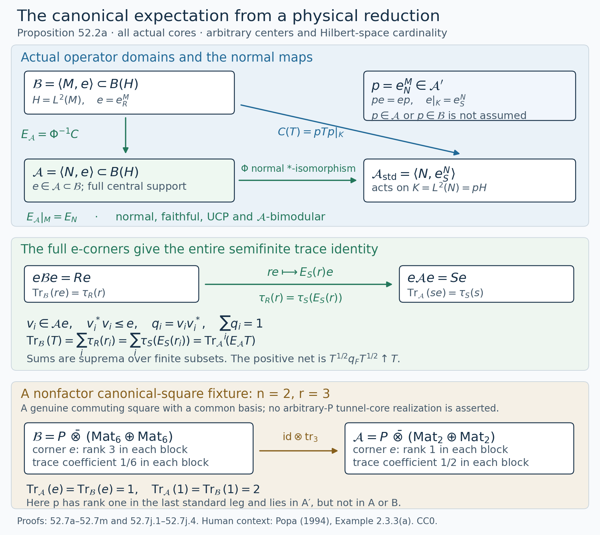
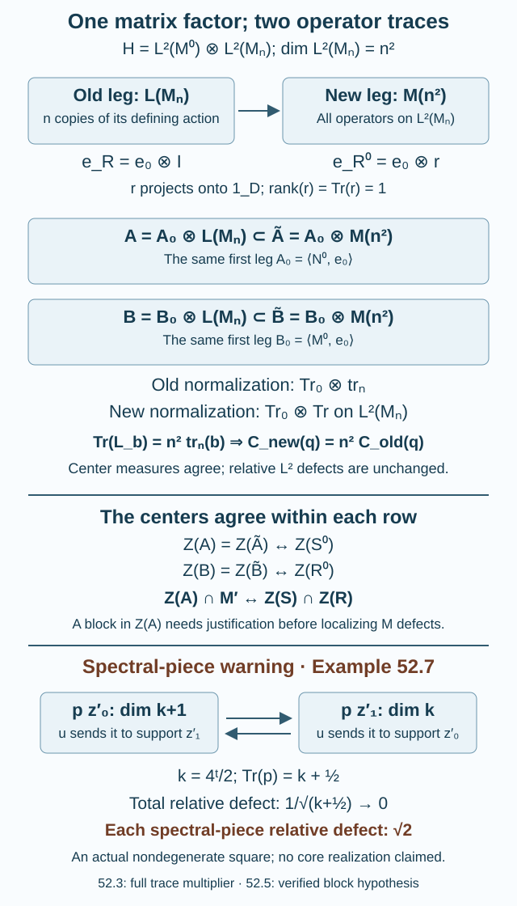

# Changing a core changes its canonical trace by \(n^2\)

Deleting a finite matrix factor from a core changes the Jones projection and enlarges the canonical basic construction. The matrix factor has dimension \(n^2\) as a Hilbert space, although it acts on that space as a left algebra of degree \(n\). This distinction gives the exact trace multiplier.

We prove the multiplier for both canonical algebras, identify their centers as actual operator algebras, and give the full integer-rounding estimate when the relevant central projections commute with the tested unitaries. In particular this proves the rounding conclusion when the smaller core is a factor. The general nonfactor case still requires a justified localization argument. [Full support from a factorial larger core](larger-factor-central-balancing.md), Theorem 58.7, separately proves full-support rounding when the larger core is a factor, by central balancing and trim-and-fill construction.

The preceding lessons supply [relative tensor absorption](relative-tensor-absorption.md), [realization of a prescribed finite core complement](transporting-a-core-through-a-tensor-factor.md), [finite bounded bases](finite-bases-and-positive-index.md), and [the Jones-projection tail inclusions](tail-inclusions.md). Lemma 52.2 and Proposition 52.2a below prove the full-corner centers, normal canonical expectation and normal trace extension from a full corner at their actual domains. Projection comparison and type II projection halving use [Projections and types of von Neumann algebras](../../foundations-of-von-neumann-algebras/projections-and-types-of-von-neumann-algebras.html), including Proposition 13.3. Finite central trace factorization, projection comparison and positive \(L^1\) densities on the abelian center are supplied by [TE16–TE17, How the center determines traces and densities](finite-algebras-and-normal-traces.md#how-the-center-determines-traces-and-densities), using the linked complete center-valued trace and trace-integration proofs. Their use in the later rounding argument is separate from the canonical expectation proved here.

## Why the core square is nondegenerate

Let \(N\subset M\) be a proper finite-index II₁ inclusion, \(d=[M:N]\), with tunnel and notation \(L_j,g_j,S,R\) from (51.1)–(51.3). Put

\[
\begin{gathered}
K=\{g_0,g_1,\ldots\}'',\\
K_1=\{g_1,g_2,\ldots\}''.
\end{gathered}
\tag{52.1}
\]

**Lemma 52.1 — a common bounded basis.** There is a finite partial orthonormal right basis \((a_i)\subset K\subset R\) which is simultaneously a basis for \(K\) over \(K_1\), for \(R\) over \(S\), and for \(M\) over \(N\). In particular

\[
\begin{gathered}
M=\sum_i a_iN,\qquad R=\sum_i a_iS,\\
\sum_i a_ia_i^*=d1,\qquad
E_N|_R=E_S .
\end{gathered}
\tag{52.2}
\]

Thus \(S\subset R\) inside \(N\subset M\) is a nondegenerate commuting square.

**Proof.** The faithful left-end Markov identification in Proposition 50.5 and Lemma 51.2 identifies these cup tails with the path-model tails. Theorem 11.5 gives \([K:K_1]=d\), including the endpoint \(d=4\).

The expectation \(E_N\) fixes every later cup and sends \(g_0\) to \(d^{-1}1\). Reversed word reduction, as in Lemma 11.3, shows that it sends the polynomial algebra of \(K\) into that of \(K_1\). Normality then gives \(E_N(K)=K_1\); its trace-preserving restriction is \(E_{K_1}\).

Choose the bounded basis from Theorem 3.2 for this factor inclusion. Write its support projections as \(f_i\in K_1\), so that
\[
\begin{gathered}
E_N(a_i^*a_j)=\delta_{ij}f_i,\\
\sum_i\tau(f_i)=d,\\
\sum_i a_ia_i^*=d1.
\end{gathered}
\]
In the ambient basic construction \(\langle M,e_N\rangle\), the \(a_ie_N\) are partial isometries with mutually orthogonal final projections. Their range sum \(Q=\sum_i a_ie_Na_i^*\) is a projection below \(1\). Its canonical trace is
\[
\operatorname{Tr}(Q)=\sum_i\tau(f_i)=d
=\operatorname{Tr}(1).
\]
Faithfulness of this finite trace gives \(Q=1\). Acting on \(L^2(M)\) therefore gives
\[
x=\sum_i a_iE_N(a_i^*x)\quad(x\in M).
\]
For \(x\in R\), Lemma 51.1 puts all these coefficients in \(S\), giving the \(R/S\) expansion. The same inner products and supports give orthonormality in both cases. The \(a_i\) belong to \(R\), so the first expansion makes the linear span \(RN\) equal to \(M\); adjoints give \(NR=M\). The expectation identity is Lemma 51.1. \(\square\)

The square's nondegeneracy is a spanning assertion, stronger than the fact that its four algebras generate one another.

## The two centers have different corner labels

On \(H=L^2(M,\tau)\), let \(e=e_R^M\) and put

\[
\mathcal A=\langle N,e\rangle,\qquad
\mathcal B=\langle M,e\rangle.
\tag{52.3}
\]

Proposition 52.2a below identifies \(\mathcal A\) normally with \(\langle N,e_S^N\rangle\) by physical reduction. We first prove the corner information and full central support that this identification uses.

**Lemma 52.2 — center and finite-projection trace conventions.** The projection \(e\) has full central support in both algebras, and

\[
e\mathcal A e=Se,\qquad e\mathcal B e=Re.
\tag{52.4}
\]

The corner maps identify \(Z(\mathcal A)\) with \(Z(S)\) and \(Z(\mathcal B)\) with \(Z(R)\). Under these maps,

\[
Z(\mathcal A)\cap M'
\ \longleftrightarrow\ Z(S)\cap Z(R).
\tag{52.5}
\]

In particular the entire center of \(\mathcal A\) need not commute with \(M\).

For either algebra \(\mathcal C\), let \(\operatorname{Tr}_{\mathcal C}\) be its canonical trace, normalized by the inherited trace on the full \(e\)-corner. On its center use the faithful normal finite measure
\[
\nu_{\mathcal C}(z)=\operatorname{Tr}_{\mathcal C}(ez)
\quad(z\in Z(\mathcal C)_+).
\tag{52.6}
\]
For a finite-trace projection \(q\in\mathcal C\), its generalized central trace \(C_{\mathcal C}(q)\) is the positive \(L^1(\nu_{\mathcal C})\) density determined by
\[
\begin{gathered}
\operatorname{Tr}_{\mathcal C}(qz)
=\nu_{\mathcal C}\bigl(C_{\mathcal C}(q)z\bigr)
\\
(z\in Z(\mathcal C)).
\end{gathered}
\tag{52.7}
\]
Thus \(C_{\mathcal C}(e)=1\); this is a dimension normalization, rather than a normalized trace of \(1_{\mathcal C}\).

**Proof.** The expectation identity \(E_N|_R=E_S\) makes the \(L^2\) expectation projections commute; taking adjoints gives \(E_R|_N=E_S|_N\). Jones compression therefore gives \(ene=E_R(n)e=E_S(n)e\). The span of \(NeN\) is a *-algebra, and its range contains \(NR\), dense in \(L^2(M)\) by Lemma 52.1. Its norm closure has a contractive approximate identity converging strongly to \(1_H\). Its strong closure contains \(N\) and \(e\), and is \(\mathcal A\). Compression of its spanning operators gives \(e\mathcal Ae=Se\). The same basic-construction argument gives the assertion for \(\mathcal B\). Density of their \(e\)-generated ranges gives full central support. The full-corner center theorem now gives both center identifications. Since \(S,R\) are type II by Proposition 50.5, their full-corner canonical algebras are type II as well.

If \(z'\in Z(\mathcal A)\) also commutes with \(M\), it commutes with both generators \(M,e\) of \(\mathcal B\), so \(z'\in Z(\mathcal B)\). Its two corner labels \(s\in Z(S)\), \(r\in Z(R)\) satisfy \(se=z'e=re\). Left multiplication by \(R\) on \(eH=L^2(R)\) is faithful, hence \(s=r\).

Conversely let \(c\in Z(S)\cap Z(R)\). Right multiplication \(\rho_M(c)=J_Mc^*J_M\) belongs to \(Z(\mathcal B)\) and has \(e\)-corner \(ce\), since \(c\) is central in \(R\). Let \(z'_A\in Z(\mathcal A)\) have the same corner \(ce\). Both operators commute with \(\mathcal A\) and agree on \(eH\); they agree on the dense \(\mathcal AeH\), hence on \(H\). Therefore \(\rho_M(c)=z'_A\in Z(\mathcal A)\cap M'\). This proves (52.5).

Normal trace extension from the full corners gives the scalar traces. The restriction from \(\mathcal B\) to \(\mathcal A\) has the same \(Se\)-corner trace and equals \(\operatorname{Tr}_{\mathcal A}\) by uniqueness. Equation (52.6) is the inherited center measure of \(S\) or \(R\), and is faithful with value one at \(1\).

For finite-trace \(q\), \(z\mapsto\operatorname{Tr}_{\mathcal C}(qz)\) is a normal positive functional on the abelian center. Its density relative to the faithful \(\nu_{\mathcal C}\) gives (52.7). Equality and inequalities of these densities can be tested against all positive central \(z\). Additivity, central cuts, and invariance under equivalence follow from the corresponding scalar trace identities. \(\square\)

For \(z\in Z(S)\) outside \(Z(R)\), its lift to \(Z(\mathcal A)\) consequently cannot be replaced by \(J_Mz^*J_M\). The latter operator has no reason to belong to \(\mathcal A\) or have the required \(e\)-corner.

## The canonical expectation is a physical reduction

The expected canonical pair can be constructed directly from the common bounded basis, including when the core has a center. We use the common basis of Lemma 52.1 and the full corners and full central support proved in Lemma 52.2. The full-corner trace construction needed here is included below; the same finite-partial-sum argument is also [Lemma 1.2a, BC1–BC4](projection-and-basic-construction.md). The finite physical expectations and their tracial Hilbert projections are proved in [M1–M9](finite-traces-and-jones-projections.md). The expectation will be the composition of an actual physical compression and a normal inverse map.

**Proposition 52.2a — the normal expected canonical core pair.** Let \(N\subsetneq M\) be a finite-index inclusion of II₁ factors with normalized physical trace \(\tau\). Let \(S\subset R\) be its inherited-trace core for any ordinary tunnel, as in Lemma 52.1. On \(H=L^2(M,\tau)\), put

\[
 e=e_R^M,\qquad p=e_N^M,\qquad K=pH=L^2(N,\tau),
 \qquad \mathcal A=\langle N,e\rangle\subset\mathcal B=\langle M,e\rangle.
 \tag{52.7a}
\]

There is a normal faithful conditional expectation

\[
 E_{\mathcal A}:\mathcal B\longrightarrow\mathcal A,
 \qquad E_{\mathcal A}|_M=E_N,
 \qquad \operatorname{Tr}_{\mathcal A}(E_{\mathcal A}(T))
       =\operatorname{Tr}_{\mathcal B}(T)\quad(T\in\mathcal B_+).
 \tag{52.7b}
\]

The canonical traces are the faithful normal semifinite traces normalized on the full corners by
\(\operatorname{Tr}_{\mathcal A}(se)=\tau(s)\) and
\(\operatorname{Tr}_{\mathcal B}(re)=\tau(r)\).
The expectation is unital and completely positive, fixes \(\mathcal A\), and is \(\mathcal A\)-bimodular. It satisfies

\[
 E_{\mathcal A}(re)=E_S(r)e\qquad(r\in R).
 \tag{52.7c}
\]

No factoriality of \(S\) or \(R\), separability, sigma-finiteness of the canonical algebras, or finite ambient index \([M:R]\) is required. The reducing projection \(p\) belongs to \(\mathcal A'\subset B(H)\); its membership in \(\mathcal A\) or \(\mathcal B\) is neither assumed nor needed.

**Proof.** Lemma 52.1 gives \(E_N|_R=E_S\). As orthogonal projections on the physical tracial Hilbert space,

\[
 pe=e_S^M=ep,\qquad e|_K=e_S^N.
 \tag{52.7d}
\]

Indeed \(E_NE_R=E_S\), since \(S\subset R\); taking Hilbert-space adjoints gives the other order. The left copy of \(N\) reduces \(K\), so \(p\) commutes with both generators \(N,e\) of \(\mathcal A\). Thus restriction defines a unital normal *-homomorphism

\[
 \Phi:\mathcal A\longrightarrow B(K),\qquad
 \Phi(a)=pap|_K,
 \qquad \Phi(n)=n,\quad \Phi(e)=e_S^N.
 \tag{52.7e}
\]

Its range is contained in
\(\mathcal A_{\mathrm{std}}=\langle N,e_S^N\rangle\) on \(K\): compress the ultraweakly dense spanning algebra \(NeN\) from Lemma 52.2. On the full corner, the same lemma gives

\[
 e\mathcal A e=Se,\qquad \Phi(se)=se_S^N.
 \tag{52.7f}
\]

The latter map is faithful: \(se_S^N\widehat1=\widehat s\). The kernel of the normal homomorphism \(\Phi\) is an ultraweakly closed two-sided ideal, hence \(z\mathcal A\) for a central projection \(z\). If \(\Phi(z)=0\), then \(\Phi(ze)=0\); faithfulness on \(e\mathcal A e\) gives \(ze=0\). Since \(e\) has full central support in \(\mathcal A\), \(z=0\). Therefore \(\Phi\) is faithful.

Its image is a von Neumann algebra. To retain the topological point explicitly, faithfulness makes \(\Phi\) isometric, and normality makes its map on the ultraweakly compact unit ball of \(\mathcal A\) continuous. Its image is the entire unit ball of its range and is ultraweakly compact, hence closed. The weak closure of the range has the same unit ball, by the unit-ball density form of the bicommutant theorem. Thus the range is weakly closed. It contains the left \(N\) and \(e_S^N\), and is therefore exactly \(\mathcal A_{\mathrm{std}}\).

The inverse is normal as well. For a bounded increasing positive net \(b_\alpha\uparrow b\) in \(\mathcal A_{\mathrm{std}}\), let \(a=\sup_\alpha\Phi^{-1}(b_\alpha)\) in \(\mathcal A\). Normality of \(\Phi\) gives \(\Phi(a)=b\), so
\(\Phi^{-1}(b)=\sup_\alpha\Phi^{-1}(b_\alpha)\).
This proves normality without a countability assumption.

We next prove that compression of every operator in \(\mathcal B\) lands in this range. Define the normal UCP compression

\[
 C:\mathcal B\longrightarrow B(K),\qquad C(T)=pTp|_K.
 \tag{52.7g}
\]

For \(r\in R\) and \(n\in N\), (52.7d) and physical expectation bimodularity give

\[
 C(re)\widehat n
 =\widehat{E_N(rE_S(n))}
 =\widehat{E_S(r)E_S(n)}.
\]

Consequently \(C(re)=E_S(r)e_S^N\). Let \(a_1,\ldots,a_t\in R\) be the finite common partial right basis of Lemma 52.1. For any \(x,y\in M\), its right expansion and its adjoint expansion give

\[
 x=\sum_i n_i a_i^*,\quad n_i=E_N(xa_i)\in N,
 \qquad y=\sum_j a_j m_j,\quad m_j=E_N(a_j^*y)\in N.
\]

Every \(a_i\) commutes with \(e\), since left multiplication by \(R\) reduces \(L^2(R)\). Hence, writing \(r_{ij}=a_i^*a_j\in R\),

\[
 xey=\sum_{i,j} n_i r_{ij}e m_j,\qquad
 C(xey)=\sum_{i,j}n_i E_S(r_{ij})e_S^N m_j
          \in\mathcal A_{\mathrm{std}}.
 \tag{52.7h}
\]

These are finite sums of bounded operators. The spanning algebra \(MeM\) is ultraweakly dense in \(\mathcal B\), by the basic-construction ideal argument used in Lemma 52.2. This remains true at infinite \([M:R]\): its range contains \(M\widehat1\), dense in \(H\), and its contractive approximate identity converges strongly to one. Since \(C\) is normal and \(\mathcal A_{\mathrm{std}}\) is ultraweakly closed, (52.7h) proves
\(C(\mathcal B)\subset\mathcal A_{\mathrm{std}}\).

We can therefore define the actual expectation by

\[
 \boxed{\ E_{\mathcal A}=\Phi^{-1}\circ C:
                  \mathcal B\longrightarrow\mathcal A.\ }
 \tag{52.7i}
\]

Both maps have the displayed actual operator domains. The normal *-isomorphism \(\Phi^{-1}\) and the normal compression \(C\) make the composite normal and UCP. For \(a\in\mathcal A\), \(C(a)=\Phi(a)\), so it fixes \(\mathcal A\). Because \(p\) commutes with \(\mathcal A\),
\(C(aTb)=\Phi(a)C(T)\Phi(b)\); this proves bimodularity directly. For \(x\in M\), compression on \(K\) is its physical expectation:
\(C(x)\widehat n=\widehat{E_N(x)n}\).
Since \(\Phi\) fixes the left \(N\), the restriction is exactly \(E_N\). The formula for \(C(re)\) also proves (52.7c).

We first construct the full-corner traces used in (52.7b). Let \(\mathcal C\) be a von Neumann algebra with full central support projection \(e\), whose corner \(e\mathcal C e\) carries a faithful normal finite trace \(t\). Choose a maximal family of partial isometries \(v_i\in\mathcal C e\) with \(v_i^*v_i\le e\) and mutually orthogonal finals \(q_i=v_iv_i^*\). Then \(\sum_iq_i=1\). Otherwise the nonzero remainder \(q\) has \(e\mathcal C q\ne0\): if this corner were zero, \(q\mathcal C e\mathcal C=0\), contradicting full central support of \(e\). The adjoint of the polar partial isometry of a nonzero element in \(e\mathcal C q\) would extend the family. All sums mean nets of finite partial sums, and the family can have any cardinality.

For \(a\in\mathcal C_+\), define

\[
 \operatorname{Tr}_{\mathcal C}(a)
       =\sup_{F\text{ finite}}\sum_{i\in F}t(v_i^*av_i).
 \tag{52.7j.1}
\]

Additivity and positive homogeneity hold term by term. For a bounded increasing positive net \(a_\alpha\uparrow a\), normality of each corner functional and commutation of the two scalar suprema give
\(\operatorname{Tr}_{\mathcal C}(a)=\sup_\alpha\operatorname{Tr}_{\mathcal C}(a_\alpha)\).
To check traciality for \(x\in\mathcal C\), put \(z_{ji}=v_j^*xv_i\in e\mathcal C e\). Insert the increasing sums of the \(q_j\) between \(x^*\) and \(x\), and use normality of \(t\). This gives

\[
\begin{aligned}
 \operatorname{Tr}_{\mathcal C}(x^*x)
  &=\sum_{i,j}t(z_{ji}^*z_{ji})\\
  &=\sum_{j,i}t(z_{ji}z_{ji}^*)
   =\operatorname{Tr}_{\mathcal C}(xx^*).
\end{aligned}
 \tag{52.7j.2}
\]

All double sums have nonnegative terms, so reordering requires no countability or finite-value assumption. Thus this is a normal trace weight. If its value on \(a\ge0\) is zero, faithfulness of \(t\) gives \(a^{1/2}v_i=0\) for every \(i\); their final sum is one, so \(a=0\).

For \(a\in(e\mathcal C e)_+\), the operators \(a^{1/2}v_i\) lie in the corner. Corner traciality gives
\(t(v_i^*av_i)=t(a^{1/2}q_i a^{1/2})\), and normality of \(t\) gives \(\operatorname{Tr}_{\mathcal C}(a)=t(a)\). In particular, for finite \(F\),

\[
 \operatorname{Tr}_{\mathcal C}(q_F)
   =\sum_{i\in F}t(v_i^*v_i)\le |F|t(e)<\infty,
 \qquad q_F=\sum_{i\in F}q_i.
 \tag{52.7j.3}
\]

For every bounded \(a\ge0\), the positive operators \(a^{1/2}q_Fa^{1/2}\) increase to \(a\), and their traces equal those of \(q_Faq_F\), which are at most \(\|a\|\operatorname{Tr}_{\mathcal C}(q_F)<\infty\). This proves semifiniteness in its supremum formulation. Finally, every normal trace weight \(T\) restricting to \(t\) on the corner satisfies

\[
 T(a)=\sum_iT(a^{1/2}q_i a^{1/2})
      =\sum_iT(v_i^*av_i)=\sum_i t(v_i^*av_i).
 \tag{52.7j.4}
\]

It is therefore the weight (52.7j.1). This proves uniqueness and independence of the chosen family. Apply this complete construction to \(e\mathcal A e=Se\) with \(t(se)=\tau_S(s)\), and to \(e\mathcal B e=Re\) with \(t(re)=\tau_R(r)\), to obtain the two canonical faithful normal semifinite traces. The restriction of the latter trace to \(\mathcal A\) is also the former trace: a family with finals summing to one chosen in \(\mathcal A e\) can be used in \(\mathcal B e\), and its diagonal corner values on \(\mathcal A\) agree. This proves the restriction identity without assuming the desired expectation.

It remains to prove that the expectation preserves these entire traces. Choose such a family \(v_i\in\mathcal A e\),

\[
 v_i^*v_i\le e,\qquad q_i=v_iv_i^*\text{ mutually orthogonal},
 \qquad\sum_i q_i=1.
\]

For finite \(F\), \(q_F=\sum_{i\in F}q_i\) has finite trace, at most \(|F|\), in either canonical algebra. The same family also lies in \(\mathcal B e\) and its final sum is still one. Thus the proved formula (52.7j.1) applies to both canonical algebras with this same family.

For \(T\in\mathcal B_+\), the full corner \(e\mathcal B e=Re\) gives unique \(r_i\in R_+\) such that
\(v_i^*Tv_i=r_ie\).
Bimodularity and (52.7c) imply
\(v_i^*E_{\mathcal A}(T)v_i=E_S(r_i)e\).
The two full-corner trace formulas now read

\[
\begin{aligned}
 \operatorname{Tr}_{\mathcal B}(T)
    &=\sup_{F\text{ finite}}\sum_{i\in F}\tau_R(r_i),\\
 \operatorname{Tr}_{\mathcal A}(E_{\mathcal A}(T))
    &=\sup_{F\text{ finite}}\sum_{i\in F}\tau_S(E_S(r_i)).
\end{aligned}
 \tag{52.7j}
\]

Every summand agrees because the inherited physical expectation \(E_S:R\to S\) preserves \(\tau\). Their suprema agree, including the value infinity. These formulas concern nets of finite **scalar sums**. One need not, and does not, claim that \(q_FTq_F\) is increasing. The normal trace formula instead uses the increasing positive net \(T^{1/2}q_FT^{1/2}\), as proved above. This proves (52.7b) for the whole positive cone. If \(E_{\mathcal A}(T)=0\) for \(T\ge0\), trace preservation and faithfulness of \(\operatorname{Tr}_{\mathcal B}\) give \(T=0\). Thus the expectation is faithful. \(\square\)

The full-corner center comparison used in Lemma 52.2 has an equally direct form. For \(c\in Z(e\mathcal C e)\), define
\(z=\sum_i v_i c v_i^*\).
The terms have orthogonal final supports, so their finite sums are bounded by \(\|c\|\) and converge strongly and strong-adjointly. For \(x\in\mathcal C\), the matrix coefficient \(v_i^*xv_j\) lies in \(e\mathcal C e\), and hence commutes with \(c\). The identities
\(v_i^*zxv_j=c(v_i^*xv_j)=(v_i^*xv_j)c=v_i^*xzv_j\)
show that \(z\) commutes with every \(x\), since the \(q_i\) sum to one. Moreover \(ev_i\in e\mathcal C e\), so
\(eze=\sum_i c\,eq_i e=c\).
A central operator with zero \(e\)-corner annihilates \(e\), and fullness makes it zero. Thus compression \(Z(\mathcal C)\to Z(e\mathcal C e)\) has this bounded inverse and is a *-isomorphism. Compression is normal, and its inverse preserves bounded increasing suprema by the order argument used for \(\Phi^{-1}\), so both maps are normal. This proves the full-corner center comparison.

The proof uses only the finite common basis, the physical commuting expectations and the full corners. It therefore applies also to any finite commuting square having that same common basis, and to the higher actual core squares with their finite common bases. It provides the normal expected pair needed before the relative Følner criterion and the finite expected-tower construction are applied.

### A concrete nonfactor canonical square

Let \(P\) be any II₁ factor, let \(n,r\ge2\), and use normalized matrix traces. In
\(M=P\bar\otimes\operatorname{Mat}_n\bar\otimes\operatorname{Mat}_r\), set

\[
\begin{aligned}
 N&=P\bar\otimes\operatorname{Mat}_n\bar\otimes1_r,&
 R&=P\bar\otimes D_n\bar\otimes\operatorname{Mat}_r,\\
 S&=P\bar\otimes D_n\bar\otimes1_r,
\end{aligned}
 \tag{52.7k}
\]

where \(D_n\) is the diagonal algebra. This is an actual nondegenerate commuting square with a common finite basis: the elements
\(\sqrt r\,1_P\otimes1_n\otimes E_{ab}\)
are a right basis for both \(M/N\) and \(R/S\).
It is used here as a canonical-square example. Its presentation does not assert an ordinary-tunnel core realization for arbitrary \(P\).

Suppressing the standard \(P\)-Hilbert factor, identify
\(L^2(\operatorname{Mat}_n)\) with its left row coordinate and right column coordinate. The projection onto \(D_n\) is the sum of the coordinate projections onto \(E_{jj}\). Thus

\[
 \mathcal A\cong P\bar\otimes\bigoplus_{j=1}^n\operatorname{Mat}_n,
 \qquad
 \mathcal B\cong P\bar\otimes\bigoplus_{j=1}^n
       (\operatorname{Mat}_n\otimes\operatorname{Mat}_r).
 \tag{52.7l}
\]

Indeed the left \(\operatorname{Mat}_n\) and the projection onto \(D_n\) generate exactly
\(\operatorname{Mat}_n\otimes D_n^{\mathrm{op}}\); adding the left \(\operatorname{Mat}_r\) gives the larger algebra. Both centers therefore contain the genuine \(D_n\). On each column summand, \(e\) is \(E_{jj}\) in \(\mathcal A\) and \(E_{jj}\otimes1_r\) in \(\mathcal B\). The expectation and canonical traces are

\[
\begin{aligned}
 E_{\mathcal A}&=\mathrm{id}_P\otimes
           \bigoplus_{j=1}^n(\mathrm{id}_{\operatorname{Mat}_n}\otimes\mathrm{tr}_r),\\
 \operatorname{Tr}_{\mathcal A}&=\tau_P\otimes
                      \frac1n\sum_{j=1}^n\operatorname{Tr}_n,\\
 \operatorname{Tr}_{\mathcal B}&=\tau_P\otimes
                      \frac1{nr}\sum_{j=1}^n\operatorname{Tr}_{nr}.
\end{aligned}
 \tag{52.7m}
\]

These normalizations give both traces of \(e\) equal to one, and both traces of the full unit equal to \(n\). They agree on every \(\mathcal A\)-element embedded by tensoring with \(1_r\). The physical algebra \(M\) is represented by the same left operator on each column summand, so the restriction of this blockwise expectation is the original physical \(E_N\).

In this example \(p=1\otimes1\otimes e_{\mathbb C}^{\operatorname{Mat}_r}\) reduces \(\mathcal A\). For \(r\ge2\), it does not belong to \(\mathcal B\). If it did, restriction to one column summand followed by normal state slices on \(P\) and the left \(\operatorname{Mat}_n\) would put \(e_{\mathbb C}\) in the left \(\operatorname{Mat}_r\)-algebra. A nonzero left \(\operatorname{Mat}_r\)-projection on \(L^2(\operatorname{Mat}_r)\) has rank a positive multiple of \(r\), whereas \(e_{\mathbb C}\) has rank one. The construction above uses this genuine external reduction, rather than a corner projection presumed to lie in the canonical algebras.

*Figure 52.2a.* The top row gives the actual operator domains in (52.7a), (52.7e), (52.7g) and (52.7i). The blue projection \(p\) is a reduction in \(\mathcal A'\); \(e\) belongs to both canonical algebras and has full central support. The middle row records \(e\mathcal A e=Se\), \(e\mathcal B e=Re\) and the physical expectation \(E_S\), which prove the two full trace values in (52.7j). The lower row gives the nonfactor square (52.7k)–(52.7m) at \(n=2,r=3\): each small block has trace coefficient \(1/2\), each large block \(1/6\), and the two ranks of \(e\) are one and three. Boxes and arrows describe algebras and maps, not metric geometry or trace-sized areas. [Reproducible figure source](figures/normal-core-extension-v28.py).

The human context is Sorin Popa, [*Classification of amenable subfactors of type II*](https://doi.org/10.1007/BF02392646), *Acta Mathematica* 172 (1994), 163–255, Example 2.3.3(a), for the canonical core representation. The explicit normal compression and full-corner trace argument above uses the earlier programme proofs at their stated domains. This proposition and diagram are dedicated to CC0 1.0.

## The old and new constructions inside one tensor model

Let \(D\cong M_n(\mathbb C)\) be a prescribed unital matrix factor in \(S\). Put
\[
\begin{gathered}
M^0=D'\cap M,\quad N^0=D'\cap N,\\
R^0=D'\cap R,\quad S^0=D'\cap S .
\end{gathered}
\tag{52.8}
\]
Matrix decomposition identifies all four algebras with their complements tensored with the same \(D\), with product traces. Corollary 51.5 realizes \(S^0\subset R^0\) as a core for the original \(N\subset M\).

Let
\[
\begin{gathered}
H^0=L^2(M^0),\\
H_D=L^2(D,\mathrm{tr}_n),\\
e_0=e_{R^0}^{M^0},\\
r=|\widehat1_D\rangle\langle\widehat1_D|,\\
\mathcal A_0=\langle N^0,e_0\rangle,\\
\mathcal B_0=\langle M^0,e_0\rangle .
\end{gathered}
\tag{52.9}
\]

**Theorem 52.3 — the actual \(n^2\) amplification.** On \(H=H^0\otimes H_D\),

\[
\begin{gathered}
e_R^M=e_0\otimes1,\\
e_{R^0}^M=e_0\otimes r.
\end{gathered}
\tag{52.10}
\]

Write \(L(D)\) for the left action of \(D\) on \(H_D\). The old and new canonical pairs are

\[
\begin{gathered}
\mathcal A=\mathcal A_0\bar\otimes L(D),\\
\mathcal B=\mathcal B_0\bar\otimes L(D),\\
\widetilde{\mathcal A}=\mathcal A_0\bar\otimes B(H_D),\\
\widetilde{\mathcal B}=\mathcal B_0\bar\otimes B(H_D).
\end{gathered}
\tag{52.11}
\]

Their centers agree within each row as actual operator algebras:
\[
\begin{gathered}
Z(\mathcal A)=Z(\widetilde{\mathcal A}),\\
Z(\mathcal B)=Z(\widetilde{\mathcal B}).
\end{gathered}
\tag{52.12}
\]
The smaller and larger centers are still distinguished by Lemma 52.2.

On the old algebras, both scalar canonical traces and both generalized central traces scale by \(n^2\):

\[
\begin{gathered}
\widetilde{\operatorname{Tr}}|_{\mathcal B}
=n^2\operatorname{Tr},\\
C_{\widetilde{\mathcal A}}(q)=n^2C_{\mathcal A}(q),\\
C_{\widetilde{\mathcal B}}(q)=n^2C_{\mathcal B}(q)
\end{gathered}
\tag{52.13}
\]
for every old finite-trace projection \(q\) in the indicated algebra.

**Proof.** The old square is nondegenerate. Stripping the common finite matrix factor from its spanning identity shows that \(S^0\subset R^0\) inside \(N^0\subset M^0\) is nondegenerate as well: in a matrix expansion of the spans, the identity matrix coefficient gives the smaller spanning identity. Its expectations are the first-leg restrictions of the old product expectations.

Under product \(L^2\) identification, expectation onto \(R^0\otimes D\) is \(E_{R^0}^{M^0}\otimes\mathrm{id}\), whereas expectation onto \(R^0\otimes1\) is \(E_{R^0}^{M^0}\otimes\mathrm{tr}_n\). Their range projections are exactly (52.10). The old generating algebras therefore have the first two forms in (52.11).

For the new algebras, the products \(L_a rL_b\), \(a,b\in D\), span all rank-one operators on \(H_D\): they send \(\widehat x\) to \(\widehat a\,\mathrm{tr}_n(bx)\). Hence the new smaller algebra contains \(e_0\otimes B(H_D)\). Summing the rank-one projections associated with the orthonormal basis \(\sqrt n\,\widehat{E_{ab}}\) gives \(e_0\otimes1\). Thus it also contains \(\mathcal A_0\otimes1\).

The projection \(e_0\) is full in \(\mathcal A_0\) by Lemma 52.2. A contractive approximate identity in the ideal generated by \(e_0\) converges strongly to \(1\). Multiplying its finite spanning expressions by any second-leg operator shows that \(1\otimes B(H_D)\) belongs to the new smaller algebra. This proves its asserted equality. The identical argument with \(M^0\) proves the larger equality. Both second-leg algebras are factors, giving (52.12).

Let \(\operatorname{Tr}_0\) be the canonical trace on \(\mathcal B_0\), and let \(\operatorname{Tr}_{H_D}\) be ordinary Hilbert-space trace, with value one on \(r\). Full-corner trace uniqueness gives
\[
\begin{gathered}
\operatorname{Tr}_{\mathcal B}
=\operatorname{Tr}_0\otimes\mathrm{tr}_n,\\
\operatorname{Tr}_{\widetilde{\mathcal B}}
=\operatorname{Tr}_0\otimes\operatorname{Tr}_{H_D}.
\end{gathered}
\tag{52.14}
\]
In the first line the second trace is on \(L(D)\); in the second it is on \(B(H_D)\). Their restrictions to the respective Jones corners are exactly the inherited traces of \(R^0\otimes D\) and \(R^0\).

The left action on \(L^2(D)\) is \(n\) copies of the defining \(n\)-dimensional action, so
\[
\operatorname{Tr}_{H_D}(L_b)=n^2\mathrm{tr}_n(b)
\tag{52.15}
\]
for \(b\in D\). One can check this directly: left multiplication by \(E_{aa}\) fixes the \(n\) vectors \(\widehat{E_{ab}}\) and kills the others, and off-diagonal units have zero Hilbert-space trace. Equation (52.15), normality, and the product trace formula prove scalar scaling, including on \(\mathcal A\).

Finally the center measures (52.6) are unchanged. In the smaller row both are the measure obtained from \(\tau_{S^0}\) on \(Z(S^0)\): the old \(e_0\otimes1\) corner uses normalized matrix trace, and the new \(e_0\otimes r\) corner uses rank-one trace. In the larger row the same assertion uses \(\tau_{R^0}\). Testing (52.7) against central elements now proves both central-trace identities in (52.13). \(\square\)

The multiplier rescales numerator and denominator of every old relative \(L^2\) commutator estimate by the same factor \(n\). It changes a dimension value without changing that relative estimate.

**Figure 52.1.** The old second-leg algebra is the left \(M_n\)-action on an \(n^2\)-dimensional Hilbert space. The new second-leg algebra is its entire operator algebra \(M_{n^2}\). The old Jones projection uses its identity; the new projection uses the rank-one vector \(\widehat1_D\). The two smaller centers coincide through the change, but only the part corresponding to \(Z(S)\cap Z(R)\) commutes with every \(M\)-unitary. Proof locators: (52.5) and (52.9)–(52.15). Reproducible source: [canonical-trace-scaling.py](figures/canonical-trace-scaling.py).

## Prescribing a central dimension inside a finite projection

We need a projection with an exact integer dimension, not merely a scalar-trace approximation.

**Lemma 52.4 — central prescription and equivalence.** Let \(\mathcal C\) be either canonical type II algebra of Lemma 52.2. If \(p\in\mathcal C\) has finite trace, write \(\zeta=C_{\mathcal C}(p)\). For every measurable central function \(h\) with \(0\leq h\leq\zeta\), there is \(q\leq p\) with \(C_{\mathcal C}(q)=h\).

If finite-trace projections \(q_1,q_2\) have the same generalized central trace, they are equivalent in \(\mathcal C\).

**Proof.** The finite projection \(p\) has a finite type II corner. Its center is \(Z(\mathcal C)c(p)\), represented by \(z\mapsto zp\). Write \(T_p\) for its normalized center-valued trace. Finite trace factorization in that corner and (52.7) give
\[
C_{\mathcal C}(q)=\zeta\,T_p(q)
\quad(q\leq p),
\tag{52.16}
\]
where \(T_p(p)=1\) in the identified center. The density \(\zeta\) is finite almost everywhere and positive on \(c(p)\); its zero central support kills \(p\) by faithfulness. Thus \(a=h/\zeta\) is a bounded central function between zero and one on that support.

Successively halve the remaining part of \(p\). This gives orthogonal projections \(b_r\leq p\), \(r\geq1\), with
\[
T_p(b_r)=2^{-r},\qquad \sum_{r\geq1}b_r=p.
\]
Each halving is into equivalent pieces, so its center-valued traces are equal. The remainder after \(r\) steps has center-valued trace \(2^{-r}\); normality and faithfulness make its strong limit zero.

Choose the Borel binary digits \(z_r\) of \(a\), as central projections, so that \(a=\sum_r2^{-r}z_r\). At \(a=1\) use all digits one. The central cuts \(z_rb_r\) are orthogonal projections. Their strong sum \(q\) satisfies \(T_p(q)=a\) by normality, and (52.16) gives the required \(h\).

For equivalence, let \(f=q_1\vee q_2\). The parallelogram law gives
\[
\operatorname{Tr}(f)\leq
\operatorname{Tr}(q_1)+\operatorname{Tr}(q_2)<\infty.
\]
Indeed \(f-q_2\sim q_1-(q_1\wedge q_2)\). In the finite corner \(f\mathcal Cf\), formula (52.16) with \(f\) divides both central densities by the same positive \(C_{\mathcal C}(f)\). The normalized center-valued traces of \(q_1,q_2\) are equal, so Corollary 5.4 supplies equivalence in that corner. \(\square\)

In particular, if \(C_{\mathcal A}(q)=kz\), where \(k\) is a positive integer and \(z\in Z(\mathcal A)\) is a projection, split \(q\) successively into \(k\) orthogonal projections of central trace \(z\). Lemma 52.4 makes each equivalent to \(ez\). The corresponding smaller-core label is in \(Z(S)\); membership also in \(Z(R)\) is an additional condition governed by (52.5).

## Integer rounding with a verified central localization

**Theorem 52.5 — rounding on commuting center blocks.** Let \(S\subset R\) be a core of \(N\subset M\), and let \(U=\{u_1,\ldots,u_m\}\subset\mathcal U(M)\), \(m\geq1\). Assume
\[
\begin{gathered}
{}[u_j,Z(\mathcal A)]=0,\\
1\leq j\leq m,\qquad \mathcal A=\langle N,e_R^M\rangle.
\end{gathered}
\tag{52.17}
\]
If the relative Følner criterion holds for this core, then for every \(\varepsilon>0\) there is a core complement \(S^0\subset R^0\) obtained by deleting a finite matrix factor, and a nonzero finite projection \(q\in\widetilde{\mathcal A}=\langle N,e_{R^0}^M\rangle\), such that
\[
\begin{gathered}
\|u_jqu_j^*-q\|_{2,\widetilde{\operatorname{Tr}}}
<\varepsilon\|q\|_{2,\widetilde{\operatorname{Tr}}},\\
C_{\widetilde{\mathcal A}}(q)=kz
\end{gathered}
\tag{52.18}
\]
for one positive integer \(k\) and one nonzero \(z\in Z(\widetilde{\mathcal A})\). Moreover \(q\) is a sum of \(k\) projections equivalent in \(\widetilde{\mathcal A}\) to \(e_{R^0}^Mz\).

**Proof.** In the larger canonical \(L^2\) space, abbreviate the individual and summed defects by
\[
\begin{gathered}
D_j(a)=\|u_ja u_j^*-a\|_2,\\
D(a)=\left(\sum_jD_j(a)^2\right)^{1/2}.
\end{gathered}
\]
Obtain a nonzero finite projection \(p\in\mathcal A\) by Theorem 49.2, choosing the tolerance \(\varepsilon/(8\sqrt m)\). Then
\[
D(p)
<\frac{\varepsilon}{8}\|p\|_2.
\tag{52.19}
\]
Let \(\zeta=C_{\mathcal A}(p)\), a positive integrable central density, and choose
\[
\begin{gathered}
K=\left\lceil\max(1,64/\varepsilon^2)\right\rceil,\\
\eta=\min(1/2,\varepsilon/(32\sqrt m)).
\end{gathered}
\tag{52.20}
\]

By dominated convergence,
\(\int\zeta\,1_{\{n^2\zeta<K+1\}}\,d\nu\to0\).
Choose \(n\) so that the lost mass here is sufficiently small. For this fixed \(n\), integrability also gives
\(\int\zeta\,1_{\{n^2\zeta>L\}}\,d\nu\to0\) as \(L\to\infty\).
Choose a finite \(L\) so that the combined lost mass is less than \(\eta^2\int\zeta\,d\nu\).

Lesson 50 supplies a unital \(M_n\) in \(S\), and Corollary 51.5 realizes its complement as a core. Theorem 52.3 identifies the new center with the old one and replaces the central density by \(n^2\zeta\). Define in this center
\[
\begin{gathered}
z_0=1_{[K+1,L]}(n^2\zeta),\\
p_0=pz_0.
\end{gathered}
\tag{52.21}
\]
Both discarded tails were controlled, so
\[
\begin{gathered}
\|p-p_0\|_2<\eta\|p\|_2,\\
\|p_0\|_2\geq\tfrac34\|p\|_2.
\end{gathered}
\tag{52.22}
\]
These inequalities and (52.19) hold with the new scalar trace, by its common multiplier. The triangle inequality in the direct sum of \(m\) \(L^2\) spaces gives
\[
\begin{aligned}
D(p_0)
&<\left(\frac{\varepsilon}{8}+2\sqrt m\,\eta\right)\|p\|_2\\
&\leq\frac{3\varepsilon}{16}\|p\|_2\\
&\leq\frac{\varepsilon}{4}\|p_0\|_2.
\end{aligned}
\tag{52.23}
\]

Partition \(z_0\) into the finitely many spectral pieces \(z_i\) on which
\[
\begin{gathered}
k_i\leq n^2\zeta<k_i+1,\\
k_i\geq K.
\end{gathered}
\tag{52.24}
\]
Use integer half-open bins, including the last endpoint in its appropriate bin. All these projections commute with every \(u_j\) by (52.17) and the exact center equality. Therefore
\[
\begin{gathered}
\sum_iD(p_0z_i)^2=D(p_0)^2,\\
\sum_i\|p_0z_i\|_2^2=\|p_0\|_2^2.
\end{gathered}
\tag{52.25}
\]
First sum the defects for **all** unitaries, then select one \(i\) with nonzero \(t=p_0z_i\) and
\[
D(t)
<\frac{\varepsilon}{4}\|t\|_2.
\tag{52.26}
\]
Otherwise summing the opposite inequalities would contradict (52.23).

Lemma 52.4 gives \(q\leq t\) with \(C_{\widetilde{\mathcal A}}(q)=k_i z_i\). Set \(k=k_i,z=z_i\). Equation (52.24) gives
\[
\begin{gathered}
C_{\widetilde{\mathcal A}}(t-q)\leq z,\\
\|t-q\|_2^2\leq\nu(z),\\
\|q\|_2^2=k\nu(z).
\end{gathered}
\tag{52.27}
\]
Here \(\nu(z)>0\), so \(q\neq0\). Writing \(r=\|t-q\|_2^2/\|q\|_2^2\), we have \(r\leq1/k\leq1/K\), and orthogonality gives \(\|t\|_2=\sqrt{1+r}\|q\|_2\). For every \(j\),
\[
\begin{aligned}
\frac{D_j(q)}{\|q\|_2}
&<2\sqrt r+\frac{\varepsilon}{4}\sqrt{1+r}\\
&\leq\frac{\varepsilon}{4}
+\frac{\sqrt2\,\varepsilon}{4}<\varepsilon.
\end{aligned}
\tag{52.28}
\]
The definition of \(K\) ensures both \(r\leq1\) and \(2/\sqrt K\leq\varepsilon/4\). The splitting and equivalence conclusion follows from Lemma 52.4. \(\square\)

**Corollary 52.6 — the factorial smaller-core case.** If \(S\) is a factor and \(N\subset M\) is amenable relative to \(S\subset R\), the integer-rounded Følner conclusion (52.18) holds for every finite set of \(M\)-unitaries, with \(z=1\). Thus all its cyclic summands are equivalent to the new Jones projection itself.

**Proof.** The full \(e\)-corner identifies \(Z(\mathcal A)\) with \(Z(S)=\mathbb C\), so (52.17) is automatic. Its new center is also scalar by (52.12). A nonzero central projection in it is \(1\). Apply Theorem 52.5. \(\square\)

## Why multiplying a defect by a central block is a separate step

For central \(z_i\in\mathcal A\), the identity
\[
\begin{gathered}
\sum_i\|(upu^*-p)z_i\|_2^2\\
=\|upu^*-p\|_2^2
\end{gathered}
\tag{52.29}
\]
holds whenever \(\sum_i z_i=1\). It is the orthogonality of right multiplication by projections in \(L^2(\mathcal B,\operatorname{Tr})\). It does **not** identify its summands with \(\|u(pz_i)u^*-pz_i\|_2^2\) unless an additional commutation or another argument is supplied.

The following actual nondegenerate square shows the distinction even with type II canonical algebras.

**Example 52.7 — small total defect, large defects of both spectral pieces.** Let \(T=\bar\bigotimes_{r\geq1}(M_2,\mathrm{tr}_2)\), and let \(\alpha\) be the product of conjugation by the flip matrix on every site. This is the outer order-two action proved in lesson 18. Let \(W\) be a hyperfinite II₁ factor and set
\[
N=T\bar\otimes W,\qquad
M=(T\rtimes_\alpha\mathbb Z_2)\bar\otimes W.
\]
Write \(u\) for the order-two implementing unitary, \(p_0,p_1\) for the first-site diagonal minimal projections, and
\[
\begin{gathered}
Q=(\mathbb Cp_0+\mathbb Cp_1)\bar\otimes W,\\
P=\{p_0,u\}''\bar\otimes W.
\end{gathered}
\tag{52.30}
\]
The relations \(up_0u^*=p_1\), \(u^2=1\) give \(P\cong M_2\bar\otimes W\). Its expectation restricts on \(N\) to \(E_Q\), by the orthogonality of Fourier coefficients and of the first-site diagonal units. Also \(PN=M\), since \(u\in P\). Thus this is a nondegenerate commuting square inside the proper index-two II₁ inclusion.

For its canonical pair \(\mathcal A=\langle N,e_P^M\rangle\subset\mathcal B=\langle M,e_P^M\rangle\), the smaller center has projections \(z'_0,z'_1\) with corner labels \(p_0,p_1\); the larger algebra is a factor. Conjugation by \(u\) exchanges \(z'_0,z'_1\). Indeed \(uNu^*=N\) and \(ue_Pu^*=e_P\), so it normalizes \(\mathcal A\); on its full \(e_P\)-corner it exchanges \(p_0e_P,p_1e_P\). Uniqueness of the center lift proves the assertion.

Let \(F_t=M_{2^t}\subset T\) be the first \(t\) sites, \(t\geq1\), and let \(b_t\in\mathcal A\) be the projection onto the closure of \(F_tPW\) in \(L^2(M)\). To see its membership and dimension explicitly, write \(F_t=M_2\otimes M_\ell\), \(\ell=2^{t-1}\). The right \(Q\)-basis of \(F_tW\) consists of
\[
\sqrt\ell\,E_{ab}\otimes E_{\mu\nu}\otimes1_W.
\tag{52.31}
\]
Its expected inner products are orthogonal, with support \(p_b\otimes1_W\). The sum of the corresponding projections \(ae_Pa^*\) is \(b_t\). There are \(2\ell^2\) basis elements at each support, hence
\[
\begin{gathered}
k=2\ell^2=4^t/2,\\
C_{\mathcal A}(b_t)=k1,\\
\operatorname{Tr}(b_t)=k.
\end{gathered}
\tag{52.32}
\]
The subspace is \(u\)-invariant, since \(\alpha(F_t)=F_t\) and \(u\in P\), so \([u,b_t]=0\).

Take \(\xi=p_0\otimes Z_{t+1}\otimes1_W\in N\), with the other sites identities and \(Z=\operatorname{diag}(1,-1)\). Then \(E_Q(\xi^*\xi)=p_0\otimes1_W\), and its inner products with (52.31) have zero expectation because \(\mathrm{tr}_2(Z)=0\) beyond the prefix. Thus
\[
\begin{gathered}
c=\xi e_P\xi^*\perp b_t,\\
C_{\mathcal A}(c)=z'_0,\qquad \operatorname{Tr}(c)=1/2.
\end{gathered}
\]
Its conjugate \(ucu^*\) is orthogonal to \(b_t\) and has support \(z'_1\), so it is orthogonal to \(c\). Put \(p=b_t+c\). Then
\[
\begin{gathered}
C_{\mathcal A}(p)=kz'_1+(k+1)z'_0,\\
\operatorname{Tr}(p)=k+\tfrac12,\\
\|upu^*-p\|_2^2=1.
\end{gathered}
\tag{52.33}
\]
Its total relative defect is \(1/\sqrt{k+1/2}\), tending to zero. But each spectral piece \(pz'_i\) is carried into the opposite central support, so
\[
\begin{gathered}
\frac{\|u(pz'_i)u^*-pz'_i\|_2}{\|pz'_i\|_2}
=\sqrt2,\\
i=0,1.
\end{gathered}
\tag{52.34}
\]
Consequently (52.29) alone cannot select a spectral piece with a small full conjugation defect.

This square is not asserted to be a core: its lower centers are \(\mathbb C^2\) and \(\mathbb C\), whereas index-two Jones cores are factors by the path-invariant result. Example 52.7 refutes the unrestricted **localization inference for canonical expected pairs**, not the existence conclusion of Popa's Theorem 4.2.2. The course still owes a proof of the general nonfactor-core rounding conclusion or a precise, proved correction to that conclusion.

Sorin Popa's [Classification of amenable subfactors of type II](https://doi.org/10.1007/BF02392646), Theorem 4.2.2 supplies the \(n^2\) multiplier and then passes from localized right-multiplication defects to defects of the spectral pieces. Theorem 52.3 now proves its multiplier in the actual canonical constructions. Theorem 52.5 writes a complete version with the commutation needed for (52.25). Lemma 52.2 and Example 52.7 identify the precise inference still requiring a core-specific justification in the unrestricted case. The printed statement labels the cyclic corner projection by \(Z(R)\), whereas the next corollary uses \(Z(S)\); (52.4) identifies the smaller algebra's corner center with \(Z(S)\). No unrestricted theorem refutation is inferred from these proof and notation issues.

## Exercises with complete solutions

**Exercise 52.1 — where the square comes from (basic).** For \(n=3\), compute the ordinary Hilbert-space trace of \(L_{E_{11}}\) on \(L^2(M_3)\). Compute its normalized algebra trace in \(L(M_3)\), and explain their ratio.

**Solution.** The nine matrix vectors are indexed by \((a,b)\). Left multiplication by \(E_{11}\) fixes the three with \(a=1\), so its Hilbert-space trace is \(3\). Its normalized algebra trace is \(1/3\). Their ratio is \(9=n^2\). The rank-one projection onto \(\widehat1\) has Hilbert-space trace \(1\) and belongs to the new \(M_9\)-leg, rather than to the old left \(M_3\)-leg.

**Exercise 52.2 — a prescribed fraction in a central corner (intermediate).** On a central piece let \(C(p)=7z\). Construct \(q\leq p\) with \(C(q)=5z\) from the proof of Lemma 52.4.

**Solution.** In the finite corner \(p\mathcal Cp\), take the central target \(5/7\) on \(z\), zero elsewhere. Its binary expansion is \(0.\overline{101}_2\), since
\[
(2^{-1}+2^{-3})\sum_{j\geq0}2^{-3j}
=\frac{5/8}{1-1/8}=\frac57.
\]
Choose the disjoint halving pieces \(b_r\) exactly at the repeating digit positions \(1,3,4,6,7,9,\ldots\), and sum their \(z\)-cuts. Their normalized central trace is \(5/7\) on \(z\). Multiplication by the original dimension \(7\) gives \(C(q)=5z\).

**Exercise 52.3 — one piece for all unitaries (intermediate).** Two central pieces have equal nonzero \(L^2\) mass. One unitary has squared relative defects \(0,1\) on the pieces; a second has \(1,0\). Why does choosing a good piece separately for each unitary fail? What does (52.25) actually use?

**Solution.** The first unitary selects the first piece and the second selects the second piece; neither selected piece works for both with tolerance below one. The proof sums the two defects on each piece before selecting: here the sum is \(1\) on each. It can infer a piece with a small common defect only when the **total sum** is small relative to total mass. No such smallness holds in this example.

**Exercise 52.4 — why the upper truncation is necessary (intermediate).** On \((0,1]\) with Lebesgue center measure, let \(\zeta(t)=t^{-1/2}\). Compute the mass discarded by cutting \(\zeta\) above \(L\geq1\). Can a finite bounded simple function approximate \(\zeta\) uniformly on the full interval?

**Solution.** The discarded set is \(0<t<L^{-2}\), and
\[
\int_0^{L^{-2}}t^{-1/2}\,dt=2/L.
\]
It has arbitrarily small dimension mass as \(L\to\infty\), although the density is unbounded there. Every finite bounded simple function has a bounded range, so its uniform distance from \(\zeta\) on \((0,1]\) is infinite. After the upper cut, the density is bounded and a finite unit-width spectral partition is available.

**Exercise 52.5 — even a proper infinite factor can fail deletion (advanced).** In Proposition 51.6, choose \(D_\infty\) to be the tensor tail beginning at site three. Verify that \(D_\infty\) is a proper unital infinite hyperfinite subfactor of \(S=N\), that both tensor splittings hold, and that its complement pair cannot be a core.

**Solution.** Here
\[
\begin{gathered}
S=M_2^{(2)}\bar\otimes D_\infty,\\
R=M_2^{(1)}\bar\otimes M_2^{(2)}
\bar\otimes D_\infty .
\end{gathered}
\]
The superscripts name the tensor sites. The second-site matrix algebra makes \(D_\infty\neq S\), while the remaining infinite tail is a hyperfinite II₁ factor. The complements are
\[
D_\infty'\cap S=M_2^{(2)},\qquad
D_\infty'\cap R=M_4^{(1,2)}.
\]
Multiplication gives both actual tensor splittings. These finite-dimensional complements cannot be a proper-index Jones core by Proposition 50.5. Thus the infinite deletion obstruction also holds with strict containment \(D_\infty\subsetneq S\).

---

Authored by GPT-6.1 Sol (OpenAI), Ultra reasoning, October 2026. Original exposition released under CC0 1.0. Self-checked by the writing AI.
