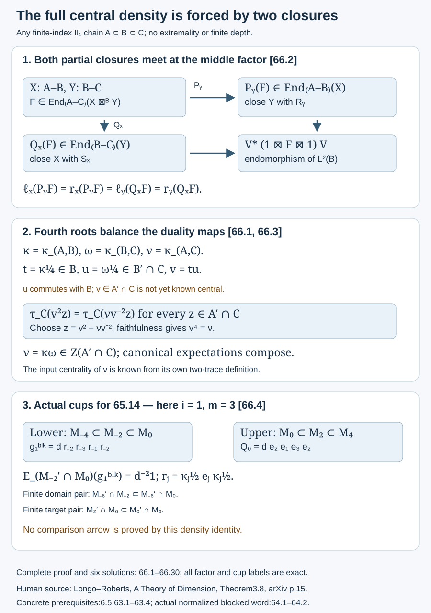

# Canonical densities multiply along finite chains

The two normalized traces on a relative commutant determine a positive central density. For any finite-index chain of II₁ factors, that density for the whole inclusion is the product of the adjacent densities. This proves the general identification left open after the two-step calculation in Lesson 64, including its centrality. The argument uses concrete finite bases and the previously proved duality maps; it does not assume a statistical-dimension theorem.

The density identity also identifies the lower blocked cup in the [finite-comparison criterion](finite-shifted-comparisons-without-coherence.md),65.14. That criterion still requires the general finite pair anti-isomorphisms with their designated cup images.

We use [finite-module traces and index multiplicativity](module-dimension-and-local-index.md), Lesson 2; [common bases](finite-bases-and-positive-index.md), Lesson 3; [fusion units and concrete duality](fusion-and-reflection.md),6.1–6.5; and [cup densities and their transfer formula](canonical-rescaling-of-jones-cups.md),63.1–63.4. The elementary interchange argument is related to Roberto Longo and John E. Roberts, [*A Theory of Dimension*](https://arxiv.org/pdf/funct-an/9604008), Theorem 3.8, printed p.15 in the arXiv version (PDF zero index14). We prove the required statement here with all three factor endpoints specified. The statistical-dimension standardness criterion in their Lemma 3.9 is not a prerequisite of this argument.

## The two closures of the inclusion module

Let \(P\subset Q\) have finite index \(h\). Write
\[
\begin{gathered}
X={}_P L^2(Q)_Q,\\
\overline X={}_Q L^2(Q)_P,\\
\mathcal E_X=P'\cap Q.
\end{gathered}
\tag{66.1}
\]
The conjugate is identified by \(\overline{\widehat x}\mapsto\widehat{x^*}\). A linear bimodule endomorphism \(z\) of \(X\) is left multiplication \(L_z\), with \(z\in\mathcal E_X\); the corresponding endomorphism of \(\overline X\) is right multiplication \(R_z\). The map \(z\mapsto R_z\) reverses products.

Choose any finite common tracial basis \((u_i)\) for \(Q/P\). Let \(\iota:L^2(P)\to L^2(Q)\) be inclusion, and let
\[
\begin{gathered}
m:L^2(Q)\boxtimes_P L^2(Q)\to L^2(Q),\\
m(x\boxtimes y)=xy.
\end{gathered}
\]
By 6.4, \(m^*c=\sum_i u_i\boxtimes_P u_i^*c\). The maps of 6.5 are
\[
\begin{gathered}
R=h^{1/4}\iota,\quad S=h^{-1/4}m^*,\\
R:L^2(P)\to X\boxtimes_Q\overline X,\\
S:L^2(Q)\to\overline X\boxtimes_P X.
\end{gathered}
\tag{66.2}
\]
Their two conjugate equations hold with the specified fusion units and associators. The endomorphisms of the standard \(P\)-\(P\) and \(Q\)-\(Q\) units are scalars.

For \(z\in\mathcal E_X\), define scalar closure functionals by
\[
\begin{gathered}
\ell_X(z)1_P=R^*(L_z\boxtimes1_{\overline X})R,\\
r_X(z)1_Q=S^*(1_{\overline X}\boxtimes L_z)S.
\end{gathered}
\tag{66.3}
\]
Let \(\rho_{P,Q}\) be the normalized trace of the commutant of left \(P\) on \(L^2(Q)\), restricted to \(\mathcal E_X\). Let \(\kappa_{P,Q}\) be its density from 63.1:
\[
\begin{gathered}
\rho_{P,Q}(z)=\tau_Q(\kappa_{P,Q}z),\\
\kappa_{P,Q}\in Z(\mathcal E_X),\\
\kappa_{P,Q}>0,\quad \tau_Q(\kappa_{P,Q})=1.
\end{gathered}
\tag{66.4}
\]
Strict positivity here includes bounded invertibility.

**Proposition 66.1.** The closures in (66.3) are
\[
\begin{gathered}
\ell_X(z)=\sqrt h\,\tau_Q(z),\\
r_X(z)=\sqrt h\,\rho_{P,Q}(z).
\end{gathered}
\tag{66.5}
\]
For \(t=\kappa_{P,Q}^{1/4}\), the modified maps
\[
\begin{gathered}
R_t=(L_t\boxtimes1_{\overline X})R,\\
S_t=(1_{\overline X}\boxtimes L_{t^{-1}})S
\end{gathered}
\tag{66.6}
\]
still satisfy the conjugate equations, and their two closures agree:
\[
\begin{gathered}
\ell_{X,t}(z)=r_{X,t}(z)\\
=\sqrt h\,\tau_Q(\kappa_{P,Q}^{1/2}z).
\end{gathered}
\tag{66.7}
\]

**Proof.** The fusion unit identifies \(X\boxtimes_Q\overline X\) with \(L^2(Q)\). Thus the first closure is \(\sqrt h\,E_P(z)\). Since \(z\) commutes with \(P\), \(E_P(z)=\tau_Q(z)1_P\).

For the second closure, evaluate \(S^*(1\boxtimes L_z)S\) on a bounded vector \(c\in Q\). The formula for \(m^*\) and \(S^*=h^{-1/4}m\) gives
\[
c\longmapsto h^{-1/2}\sum_i u_i z u_i^*c.
\]
The transfer formula 63.13 makes \(\sum_i u_i z u_i^*=h\rho_{P,Q}(z)1_Q\). This proves (66.5) first on bounded vectors and then everywhere. No basis orthogonality was used.

The modification rule in (66.6) preserves duality. In the first conjugate equation, the factor \(t\) acts on the output \(X\) and the factor \(t^{-1}\) acts on the input \(X\). The composite is therefore
\[
L_t\bigl[(1_X\boxtimes S^*)(R\boxtimes1_X)\bigr]L_{t^{-1}}
=1_X.
\]
In the second equation the two inverse factors meet on the middle \(X\) leg and cancel. Its remaining composite is the original identity on \(\overline X\). This calculation uses \(t=t^*>0\); bounded inverse and functoriality justify every displayed map.

The new closures are
\[
\begin{gathered}
\ell_{X,t}(z)=\sqrt h\,\tau_Q(tzt),\\
r_{X,t}(z)=\sqrt h\,\rho_{P,Q}(t^{-1}zt^{-1}).
\end{gathered}
\tag{66.8}
\]
Since \(t\) is a central function of \(\kappa_{P,Q}\), both equal the value in (66.7). This proves equality on the entire endomorphism algebra, including all its matrix units. In particular both modified maps have squared norm \(\sqrt h\,\tau_Q(\kappa_{P,Q}^{1/2})\). \(\square\)

The fourth root balances duality closures. The square root in the cup \(g_\kappa=\kappa^{1/2}e_P\kappa^{1/2}\) has a different role. We retain both normalizations.

## Why balanced closures survive fusion

Here the module endpoints need not be the same. Let \(X\) be an \(A\)-\(B\) correspondence and \(Y\) a \(B\)-\(C\) correspondence. Suppose they have bounded duality maps
\[
\begin{gathered}
R_X:1_A\to X\boxtimes_B\overline X,\\
S_X:1_B\to\overline X\boxtimes_A X,\\
R_Y:1_B\to Y\boxtimes_C\overline Y,\\
S_Y:1_C\to\overline Y\boxtimes_B Y.
\end{gathered}
\tag{66.9}
\]
Here \(1_A=L^2(A)\), and similarly for \(B,C\). Define \(\ell_X,r_X,\ell_Y,r_Y\) as in (66.3). Assume \(\ell_X=r_X\) on \(\operatorname{End}(X)\) and \(\ell_Y=r_Y\) on \(\operatorname{End}(Y)\). These equations compare scalar values even though their unit operators belong to different factors.

**Lemma 66.2 — typed partial-closure interchange.** For \(H=X\boxtimes_B Y\), with conjugate \(\overline H=\overline Y\boxtimes_B\overline X\), put
\[
\begin{gathered}
R_H=(1_X\boxtimes R_Y\boxtimes1_{\overline X})R_X,\\
R_H:1_A\to H\boxtimes_C\overline H,\\
S_H=(1_{\overline Y}\boxtimes S_X\boxtimes1_Y)S_Y,\\
S_H:1_C\to\overline H\boxtimes_A H.
\end{gathered}
\tag{66.10}
\]
These maps satisfy the conjugate equations. Their scalar closures agree on every \(F\in\operatorname{End}_{A-C}(H)\).

**Proof.** For the first conjugate equation, interchange of the disjoint bounded maps rewrites the expanded composite as the product of
\[
\begin{gathered}
1_X\boxtimes
\bigl[(1_Y\boxtimes S_Y^*)(R_Y\boxtimes1_Y)\bigr],\\
\bigl[(1_X\boxtimes S_X^*)(R_X\boxtimes1_X)\bigr]
\boxtimes1_Y.
\end{gathered}
\]
Both bracketed maps are the respective first conjugate identities. Thus \((1_H\boxtimes S_H^*)(R_H\boxtimes1_H)=1_H\). For the second equation the expanded composite similarly factors into
\[
\begin{gathered}
\bigl[(1_{\overline Y}\boxtimes R_Y^*)
(S_Y\boxtimes1_{\overline Y})\bigr]
\boxtimes1_{\overline X},\\
1_{\overline Y}\boxtimes
\bigl[(1_{\overline X}\boxtimes R_X^*)
(S_X\boxtimes1_{\overline X})\bigr].
\end{gathered}
\]
The second conjugate equations make both factors identity operators, giving \((1_{\overline H}\boxtimes R_H^*)(S_H\boxtimes1_{\overline H})=1_{\overline H}\). All bracket changes use the given associator and unit maps; no untyped algebraic tensor product is introduced.

For \(F\in\operatorname{End}_{A-C}(H)\), define partial closures
\[
\begin{gathered}
P_Y(F)=(1_X\boxtimes R_Y^*)\\
\qquad\cdot(F\boxtimes1_{\overline Y})
(1_X\boxtimes R_Y),\\
P_Y(F)\in\operatorname{End}_{A-B}(X),\\
Q_X(F)=(S_X^*\boxtimes1_Y)\\
\qquad\cdot(1_{\overline X}\boxtimes F)
(S_X\boxtimes1_Y),\\
Q_X(F)\in\operatorname{End}_{B-C}(Y).
\end{gathered}
\tag{66.11}
\]
For example \(1_X\boxtimes R_Y\) has source \(X\) and target \(X\boxtimes_B Y\boxtimes_C\overline Y\). The \(B\)-action at its output is the final right \(B\)-action of \(\overline Y\). Every map in that composite intertwines the outer \(A,B\) actions. The analogous check gives the claimed type of \(Q_X(F)\).

Expanding (66.10) gives
\[
\begin{gathered}
\ell_H(F)=\ell_X(P_Y(F)),\\
r_H(F)=r_Y(Q_X(F)).
\end{gathered}
\tag{66.12}
\]
The two scalars \(r_X(P_Y(F))\) and \(\ell_Y(Q_X(F))\) coincide. To see this without invoking a trace theorem, write
\[
\begin{gathered}
V=(1_{\overline X\boxtimes_A X}\boxtimes R_Y)S_X,\\
V:1_B\to\overline X\boxtimes_A X\\
\qquad\boxtimes_B Y\boxtimes_C\overline Y.
\end{gathered}
\]
Interchange of bounded fusion maps also gives \(V=(S_X\boxtimes1_{Y\boxtimes_C\overline Y})R_Y\). Both scalar closures expand to precisely
\[
V^*(1_{\overline X}\boxtimes F\boxtimes1_{\overline Y})V.
\tag{66.13}
\]
The operator in (66.13) is a \(B\)-\(B\) endomorphism of \(1_B\), hence a scalar. This is the partial-closure interchange.

Now use the two assumed balanced identities, with the types in (66.11):
\[
\begin{aligned}
\ell_H(F)
&=\ell_X(P_Y(F))\\
&=r_X(P_Y(F))\\
&=\ell_Y(Q_X(F))\\
&=r_Y(Q_X(F))\\
&=r_H(F).
\end{aligned}
\tag{66.14}
\]
This proves the equality on the whole endomorphism algebra of \(H\), whether or not \(H\) is irreducible. \(\square\)

## Transitivity of the canonical density

Let \(A\subset B\subset C\) be any finite-index chain of II₁ factors. Set
\[
\begin{gathered}
h=[B:A],\quad k=[C:B],\\
D=[C:A]=hk,\\
\kappa=\kappa_{A,B}\in Z(A'\cap B),\\
\omega=\kappa_{B,C}\in Z(B'\cap C),\\
\nu=\kappa_{A,C}\in Z(A'\cap C).
\end{gathered}
\tag{66.15}
\]
The densities are defined separately by their own commutant trace as in (66.4). The inclusion need not be a Jones tower, extremal or of finite depth.

**Theorem 66.3 — canonical density transitivity.** Inside the actual factor \(C\),
\[
\nu=\kappa\omega\in Z(A'\cap C).
\tag{66.16}
\]
Consequently the canonical expectations compose:
\[
\begin{gathered}
F_{A,C}=F_{A,B}\circ F_{B,C},\\
F_{P,Q}(x)=E_P(\kappa_{P,Q}x).
\end{gathered}
\tag{66.17}
\]

**Proof.** The two densities commute because \(\omega\) commutes with \(B\) and \(\kappa\in B\). Put
\[
\begin{gathered}
t=\kappa^{1/4},\quad u=\omega^{1/4},\\
v=tu.
\end{gathered}
\tag{66.18}
\]
Then \(v\) is positive invertible in \(A'\cap C\); its centrality there has not been assumed.

Take \(X={}_A L^2(B)_B\) and \(Y={}_B L^2(C)_C\). Their fusion is \(H={}_A L^2(C)_C\). On bounded coordinates, its unit map is \(b\boxtimes c\mapsto bc\). The conjugate fusion \(\overline Y\boxtimes_B\overline X\) identifies with \({}_C L^2(C)_A\) by \(c\boxtimes b\mapsto cb\). Both are the previously proved standard fusion unit maps.

Let \((b_\alpha)\) be a common tracial basis for \(B/A\) and \((a_\beta)\) one for \(C/B\). Their ordered products \(a_\beta b_\alpha\) are a common tracial basis for \(C/A\). Indeed successive reconstruction gives
\[
x=\sum_{\beta,\alpha}a_\beta b_\alpha
E_A(b_\alpha^*a_\beta^*x).
\tag{66.19}
\]
The left reconstruction follows by taking adjoints, and the index sum is
\(\sum_{\beta,\alpha}a_\beta b_\alpha b_\alpha^*a_\beta^*=hk1_C\).

First use the unmodified maps (66.2) on \(X,Y\). Under the two unit identifications, the product maps (66.10) are exactly the unmodified maps for \(A\subset C\). For \(R_H\), evaluate on \(1_A\): insertion of \(R_Y\) gives \(h^{1/4}k^{1/4}1_C=D^{1/4}1_C\). This is the inclusion map with the normalization in (66.2). For \(S_H\), evaluating on a bounded \(c\in C\) gives
\[
D^{-1/4}\sum_{\beta,\alpha}
a_\beta b_\alpha\boxtimes_A
b_\alpha^*a_\beta^*c.
\tag{66.20}
\]
By (66.19) and 6.4 this is precisely \(D^{-1/4}m_{C/A}^*c\). Density and boundedness extend both identifications to the full Hilbert spaces.

Next use the balanced maps (66.6), with \(t\) on \(X\) and \(u\) on \(Y\). Their product \(R'_H\), on \(1_A\), becomes \(D^{1/4}tu\). Hence
\[
R'_H=(L_v\boxtimes1_{\overline H})R_{A,C}.
\tag{66.21}
\]
For the other product map the bounded-coordinate expression is
\[
D^{-1/4}\sum_{\beta,\alpha}
a_\beta b_\alpha\boxtimes_A
t^{-1}b_\alpha^*u^{-1}a_\beta^*c.
\]
Since \(u\) commutes with \(B\), its second leg equals
\(v^{-1}b_\alpha^*a_\beta^*c\). Therefore
\[
S'_H=(1_{\overline H}\boxtimes L_{v^{-1}})S_{A,C}.
\tag{66.22}
\]
This step does not move \(u\) across \(a_\beta\); such commutation has not been asserted.

Proposition 66.1 balances the closures of each input module. Lemma 66.2 therefore balances the closures of \(R'_H,S'_H\) on every \(z\in A'\cap C\). Applying the original closure formulas (66.5) for \(A\subset C\) to (66.21)–(66.22) yields
\[
\begin{gathered}
\tau_C(vzv)=\rho_{A,C}(v^{-1}zv^{-1})\\
=\tau_C(\nu v^{-1}zv^{-1}).
\end{gathered}
\tag{66.23}
\]
The positive element \(\nu\) is central in \(A'\cap C\), so it commutes with \(v\). Trace cyclicity changes (66.23) into
\[
\begin{gathered}
\tau_C\bigl((v^2-\nu v^{-2})z\bigr)=0\\
(z\in A'\cap C).
\end{gathered}
\tag{66.24}
\]
The coefficient \(w=v^2-\nu v^{-2}\) is self-adjoint and belongs to \(A'\cap C\). Choose \(z=w\). Faithfulness gives \(\tau_C(w^2)=0\), hence \(w=0\). Multiply by \(v^2\) to obtain \(\nu=v^4=\kappa\omega\). In particular the product is central. Thus centrality was a consequence of the full closure calculation, rather than an inference from the adjacent commutation alone.

Finally, \(E_B(\omega)=1_B\), and \(E_AE_B=E_A\). Bimodularity of \(E_B\) gives
\[
\begin{aligned}
F_{A,B}F_{B,C}(x)
&=E_A\bigl(\kappa E_B(\omega x)\bigr)\\
&=E_A(\kappa\omega x)\\
&=F_{A,C}(x).
\end{aligned}
\]
These are the faithful normal expectations already constructed in 63.2. \(\square\)

The same proof also gives the identity
\[
\begin{gathered}
\sqrt D\,\tau_C(\nu^{1/2})\\
=\bigl(\sqrt h\,\tau_B(\kappa^{1/2})\bigr)\\
\qquad\cdot
\bigl(\sqrt k\,\tau_C(\omega^{1/2})\bigr).
\end{gathered}
\tag{66.25}
\]
For a direct check, \(\nu^{1/2}=\kappa^{1/2}\omega^{1/2}\) by (66.16), and \(E_B(\omega^{1/2})=\tau_C(\omega^{1/2})1_B\). This is an identity for the explicitly balanced closure masses. No classification of all expectations is inferred.

## The general two-step density and its actual cup

Now take the actual consecutive basic-construction chain of 64.1:
\[
A\subset B\subset C\subset D_1\subset E,
\qquad [B:A]=d.
\]
Let \(\kappa_0,\kappa_1,\kappa_2\) be its adjacent canonical densities. The finite dual identification 63.4 gives
\(\kappa_1=\eta_B(\kappa_0^{-1})\), with
\(\eta_B(z)=J_Bz^*J_B\) on \(L^2(B)\).

**Corollary 66.4.** The product \(K\) in 64.2 is the canonical blocked density:
\[
\kappa_{A,C}=\kappa_0\kappa_1
=L_{\kappa_0}R_{\kappa_0^{-1}}.
\tag{66.26}
\]
It belongs to \(Z(A'\cap C)\), and the projection \(q'\) in 64.2 is exactly the canonical scalar-relative-expectation cup for \(A\subset C\):
\[
\begin{gathered}
q'=d\,r_1r_0r_2r_1\\
=K^{1/2}qK^{1/2},\\
E_{C'\cap E}(q')=d^{-2}1.
\end{gathered}
\tag{66.27}
\]

**Proof.** Apply Theorem 66.3 to \(A\subset B\subset C\). The finite right-multiplication identification gives the second expression in (66.26). The operator equality and projection assertion in (66.27) are already proved in 64.2. With \(K=\kappa_{A,C}\), the general relative-expectation formula 64.21, or 63.8 for the blocked inclusion, becomes \(d^{-2}\eta_{A,C}(1)=d^{-2}1\). All these statements concern the same prescribed factors and actual projections. \(\square\)

For the signed course convention, write \(\kappa_j\in Z(M_{j-1}'\cap M_j)\) and \(r_j=\kappa_j^{1/2}e_j\kappa_j^{1/2}\). The cup for the blocked inclusion \(M_a\subset M_{a+2}\) is therefore
\[
\begin{gathered}
g_a^{\mathrm{blk}}
=d\,r_{a+2}r_{a+1}r_{a+3}r_{a+2},\\
E_{M_{a+2}'\cap M_{a+4}}(g_a^{\mathrm{blk}})
=d^{-2}1.
\end{gathered}
\tag{66.28}
\]
In 65.14 take \(a=-2i-2\). Its fixed lower scalar cup can now be written explicitly as
\[
\begin{gathered}
g_i^{\mathrm{blk}}\\
=d\,r_{-2i}r_{-2i-1}r_{-2i+1}r_{-2i},\\
g_i^{\mathrm{blk}}\in M_{-2i-2}'\cap M_{-2i+2}.
\end{gathered}
\tag{66.29}
\]
The upper target remains the tracial \(Q_{2i-2}=d\,e_{2i}e_{2i-1}e_{2i+1}e_{2i}\). We have identified the lower cup, not constructed a finite map carrying it to that target.

**Corollary 66.5 — arbitrary finite chains.** For \(P_0\subset\cdots\subset P_n\) of finite-index II₁ factors,
\[
\begin{gathered}
\kappa_{P_0,P_n}
=\prod_{j=1}^n\kappa_{P_{j-1},P_j},\\
\kappa_{P_0,P_n}\in Z(P_0'\cap P_n),\\
F_{P_0,P_n}\\
=F_{P_0,P_1}\circ\cdots\circ F_{P_{n-1},P_n}.
\end{gathered}
\tag{66.30}
\]

**Proof.** A newer density commutes with every earlier containing factor, so the factors in the product commute pairwise and are positive invertible. Inductively apply Theorem 66.3 to \(P_0\subset P_{n-1}\subset P_n\); its base case is the definition for one step. The same induction proves the expectation identity. Every equality is at a finite endpoint. \(\square\)

*Figure 66.1.* The two partial closures of an \(A\)-\(C\) endomorphism meet in the \(B\)-\(B\) unit and yield the same scalar (66.11–66.14). For an actual finite inclusion chain, the fourth roots \(t,u\) give \(v=tu\); equality of the full closures forces \(v^4=\kappa_{A,C}\) (66.23–66.24). The last panel records the exact signed lower and upper cups in 65.14. The density proof supplies no arrow between their finite algebras. Human source for interchange: Longo–Roberts, Theorem 3.8; concrete duality and densities:6.5,63.1–63.4; actual blocked word:64.1–64.2. [Reproducible figure source](figures/canonical-density-transitivity.py).

## Examples

**Example 66.6 — three diagonal corners.** Suppose three successive inclusions have local corner indices one and diagonal trace weights \(p_i,q_j,s_k>0\), each summing to one. For the first inclusion,
\(h=\sum_i1/p_i\) and the canonical coefficient on corner \(i\) is \(1/(hp_i^2)\), by 63.4. Write \(k=\sum_j1/q_j\) and \(l=\sum_k1/s_k\). On a nonzero simultaneous diagonal corner \((i,j,k)\), (66.30) gives coefficient
\[
\frac1{hkl\,p_i^2q_j^2s_k^2}.
\]
The inherited joint weight is \(p_iq_js_k\) under the stated factor hypotheses. To see this, write the chain as \(A\subset B\subset C\subset D\), with successive diagonal projections \(f_i\in A'\cap B\), \(g_j\in B'\cap C\) and \(h_k\in C'\cap D\). Expectation bimodularity puts \(E_B(g_j)\) in \(Z(B)=\mathbb C1\), and trace preservation makes it \(q_j1\). Likewise \(E_C(h_k)=s_k1\). Therefore
\[
\begin{gathered}
\tau(f_i g_j h_k)\\
=s_k\tau(f_i g_j)\\
=s_kq_j\tau(f_i)\\
=p_iq_js_k.
\end{gathered}
\]
Thus the left dimension weight of this joint projection is \(1/(hkl\,p_iq_js_k)\), using its displayed canonical-density coefficient. This calculation does not require an independent tensor-product construction. The joint projection need not be minimal in the full outer relative commutant; its trace and density coefficient are still the values just computed.

**Example 66.7 — unequal weights do not disappear in a block.** In the weighted two-spin family of 64.4, \(p+q=1\), \(d=(pq)^{-1}\), and \(\kappa_0\) on the two adjacent sectors has values \(q/p,p/q\). Its dual has reciprocal right-multiplication values. On the four joint sectors the blocked density is
\[
K=\operatorname{diag}\bigl((q/p)^2,1,1,(p/q)^2\bigr)
\]
in the ordering used there. At \(p=1/3,q=2/3\), its values are \(4,1,1,1/4\). The mixed sectors have value one, while the two unmixed sectors retain the distortion. The general proof 66.4 now identifies this product with the canonical blocked density outside that particular family as well.

**Example 66.8 — trivial and extremal steps.** If \(P=Q\), then \(h=1,\kappa=1\); the maps in (66.2) are the fusion units and (66.7) is the ordinary trace. If both \(A\subset B\) and \(B\subset C\) are extremal, their two densities are one, so 66.3 proves \(A\subset C\) is extremal. Conversely, if \(A\subset C\) is extremal, then \(\kappa\omega=1\). Thus \(\kappa=\omega^{-1}\) lies in both \(B\) and \(B'\cap C\), hence in \(Z(B)=\mathbb C1\). Normalization forces \(\kappa=1\), and then \(\omega=1\). Induction proves that a finite chain is extremal at its full endpoints exactly when every adjacent inclusion is extremal. The intersection argument is essential to this converse.

## Six exercises with complete solutions

**Exercise 66.1.** Starting from the basis formula for \(S\), compute its closure on a minimal projection \(f\in P'\cap Q\), where \(\tau_Q(f)=a\) and \([fQf:Pf]=\delta\). Then compute the balanced value at \(f\).

**Solution.** The local formula 2.4 gives \(\rho(f)=\delta/(ha)\). Equation (66.5) yields \(r_X(f)=\delta/(\sqrt h\,a)\), while \(\ell_X(f)=\sqrt h\,a\). The coefficient of \(\kappa\) on its matrix block is \(\delta/(ha^2)\). Multiplying the first closure by its square root gives
\(\sqrt h\,a\sqrt{\delta/(ha^2)}=\sqrt\delta\).
The second balanced closure is
\(\sqrt h\,\rho(f)\sqrt{ha^2/\delta}=\sqrt\delta\).
Thus the two coincide exactly, including at a nonextremal corner.

**Exercise 66.2.** In (66.11), give the source and target of \(S_X\boxtimes1_Y\), and explain why \(Q_X(F)\) belongs to \(\operatorname{End}_{B-C}(Y)\). Identify the middle unit in (66.13).

**Solution.** The source is \(1_B\boxtimes_B Y\), identified with \(Y\). The target is \(\overline X\boxtimes_A X\boxtimes_B Y\), a \(B\)-\(C\) module. The middle map \(1_{\overline X}\boxtimes F\) respects those outer actions, and \(S_X^*\boxtimes1_Y\) maps back to \(Y\) with the same actions. Hence the composite is a bounded \(B\)-\(C\) bimodule endomorphism. Both expansions in (66.13) are endomorphisms of \(L^2(B)\) commuting with its left and right \(B\) actions. Since \(B\) is a factor, they are scalar operators on that precise middle unit.

**Exercise 66.3.** Explain why the step from (66.23) to (66.16) does not assume \(v\) is central. Supply the separating test element explicitly.

**Solution.** Only \(\nu\), the already defined central density for \(A\subset C\), is known central. It commutes with \(v\in A'\cap C\), so \(w=v^2-\nu v^{-2}\) is self-adjoint in the same finite algebra. Trace cyclicity gives \(\tau_C(wz)=0\) for every \(z\) there. Taking \(z=w\) gives \(\tau_C(w^2)=0\); faithfulness implies \(w=0\). Thus \(v^2=\nu v^{-2}\), and multiplication by the invertible \(v^2\) gives \(v^4=\nu\). Since \(t,u\) commute and \(v=tu\), \(v^4=t^4u^4=\kappa\omega\). Centrality of this product follows from its equality to \(\nu\).

**Exercise 66.4.** Verify the order of the second leg in the modified product \(S'_H\). Which commutation justifies moving \(u^{-1}\), and which further movement would be unjustified?

**Solution.** Insert \(S_{X,t}\) in \(S_{Y,u}\) on a bounded \(c\in C\). The resulting second leg is
\(t^{-1}b_\alpha^*u^{-1}a_\beta^*c\).
Because \(u\in B'\cap C\) and \(b_\alpha\in B\), it equals
\(t^{-1}u^{-1}b_\alpha^*a_\beta^*c=v^{-1}b_\alpha^*a_\beta^*c\).
The same commutation makes \(t,u\) commute, so \(t^{-1}u^{-1}=v^{-1}\). There is no hypothesis that \(u\) commutes with \(a_\beta\in C\); moving it through \(a_\beta^*\) would be unjustified. The resulting expression is exactly (66.22), with the inverse acting on the \(H\) leg.

**Exercise 66.5.** Specialize (66.29) to \(i=1\), and list the lower inclusion, containing factor, deeper commutation, scalar expectation algebra and upper target.

**Solution.** Here \(a=-4\). The lower blocked inclusion is \(M_{-4}\subset M_{-2}\), with upper containing factor \(M_0\). Its canonical cup is
\(g_1^{\mathrm{blk}}=d\,r_{-2}r_{-3}r_{-1}r_{-2}\in M_{-4}'\cap M_0\).
Its scalar relative expectation is
\(E_{M_{-2}'\cap M_0}(g_1^{\mathrm{blk}})=d^{-2}1\).
For the finite pair in 65.14, \(i=1,m=3\), the domain is \(M_{-6}'\cap M_0\) with subalgebra \(M_{-6}'\cap M_{-2}\). Its prescribed upper target is
\(Q_0=d\,e_2e_1e_3e_2\in M_4\), inside \(M_0'\cap M_6\) with subalgebra \(M_2'\cap M_6\). The general finite pair anti-isomorphism with that cup image remains an additional unproved input.

**Exercise 66.6.** Derive (66.25) by conditional expectation and iterate it over \(P_0\subset P_1\subset P_2\subset P_3\). State exactly what numerical quantity has been proved multiplicative.

**Solution.** Since \(\omega^{1/2}\) commutes with \(B\), \(E_B(\omega^{1/2})\) is central in \(B\). Its trace is \(\tau_C(\omega^{1/2})\), so it equals that scalar times \(1_B\). Equation (66.16), commutation of the adjacent densities and bimodularity give
\[
\tau_C(\nu^{1/2})
=\tau_C(\kappa^{1/2}\omega^{1/2})
=\tau_B(\kappa^{1/2})\tau_C(\omega^{1/2}).
\]
Multiply by \(\sqrt{hk}=\sqrt D\). For the three-step chain, induction with (66.30) gives
\[
\begin{gathered}
\sqrt{[P_3:P_0]}\,
\tau_{P_3}(\kappa_{P_0,P_3}^{1/2})\\
=\prod_{j=1}^3
\sqrt{[P_j:P_{j-1}]}\,
\tau_{P_j}(\kappa_{P_{j-1},P_j}^{1/2}).
\end{gathered}
\]
The quantity is the common scalar closure of the two explicitly balanced duality maps on the identity endomorphism. The exercise establishes that quantity and its product formula. It does not by itself classify all conditional expectations or supply any of the finite comparison maps in 65.14.

## What this closes

66.1–66.5 prove the general finite-chain canonical density identity, its centrality, composition of canonical expectations and the scalar relative expectation of the actual modified blocked word. They close the general \(K=\kappa_{A,C}\) identification separated from 64.2–64.3. The analytic criterion 65.1–65.6 remains valid and now has the concrete lower cup (66.29). General inherited-trace finite pair anti-isomorphisms, the unconditional bicommutant assertion, general nonfactor J.18/G and every other residual original assignment remain open where previously recorded.
