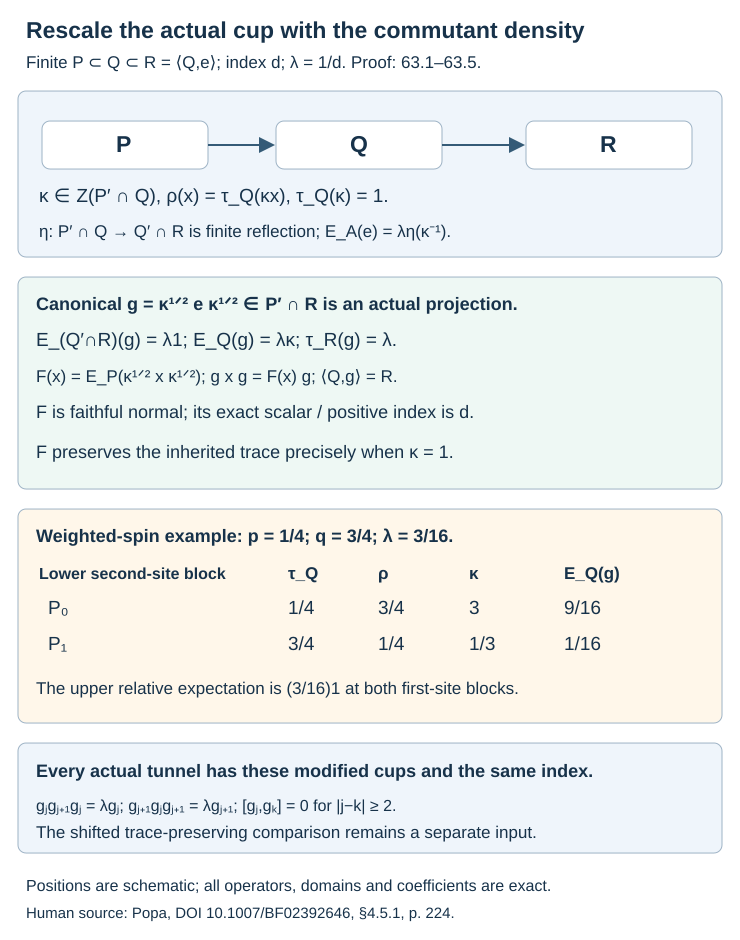

# Canonical rescaling of Jones cups

A Jones cup can be rescaled inside its actual basic construction so that its expectation onto the upper relative commutant becomes scalar. The resulting projection retains its deeper commutation and implements a faithful normal expectation with the original index. We prove the density formula, its inverse under finite duality, and all Jones relations for the modified cups throughout a prescribed tunnel. The general trace-preserving shifted comparison remains a separate requirement.

We use [the local-index formula](module-dimension-and-local-index.md), Theorem2.4; [finite common bases](finite-bases-and-positive-index.md), Lesson3; [the tracial basic construction and Markov expectation](towers-and-tunnels.md), Lesson4; [normal finite expected constructions](smooth-representations-and-tower-compression.md), Theorem61.2; and [the cup functional and representation independence](scalar-commutants-and-tracial-tunnels.md), Lemma62.2. Every representation used below is a faithful normal representation of a finite factor.

## The two traces and their central density

**Proposition 63.1.** The normalized commutant trace has the central density (63.3)–(63.4), and the original cup has relative expectation (63.5).

**Proof.**

Let \(P\subset Q\) be II₁ factors of index \(d\), let \(\lambda=d^{-1}\), and write
\[
R=\langle Q,e_P\rangle,\qquad B=P'\cap Q,\qquad A=Q'\cap R.
\]
We represent \(R\) on \(L^2(Q)\). Put
\[
\eta(x)=J_Qx^*J_Q\quad(x\in B).
\tag{63.1}
\]
This is a linear *-anti-isomorphism \(B\to A\), represented by right multiplication. Define
\[
\rho(x)=\tau_R(\eta(x))\quad(x\in B).
\tag{63.2}
\]
It is the restriction to \(B\) of the normalized trace of the commutant of left \(P\) on \(L^2(Q)\). Indeed \(J_QRJ_Q=P'\); the anti-isomorphism between these finite factors preserves their unique normalized traces.

Both \(\rho\) and \(\tau_Q|_B\) are faithful normalized traces on the finite-dimensional algebra \(B\). Therefore there is a unique positive invertible central element \(\kappa\in Z(B)\) with
\[
\rho(x)=\tau_Q(\kappa x),\qquad \tau_Q(\kappa)=1.
\tag{63.3}
\]
To construct it explicitly, on each matrix block choose a minimal projection \(f_i\), put \(t_i=\tau_Q(f_i)\), and put
\(\delta_i=[f_iQf_i:Pf_i]\). The local formula 2.4 gives
\(\rho(f_i)=\delta_i/(dt_i)\). Hence the coefficient of \(\kappa\) on that block is
\[
\kappa_i=\frac{\delta_i}{dt_i^2}.
\tag{63.4}
\]
Equivalent minimal projections in a matrix block have the same two trace values, so this coefficient is independent of the choice. Formula (63.3) follows on every matrix unit. We may instead list all diagonal minimal projections in all blocks; this convention will be used for sums below.

The cup functional 62.2 gives
\(\tau_R(e_P\eta(x))=\lambda\tau_Q(x)\). Pairing with every \(x\in B\) and using (63.3) now yields
\[
E_A(e_P)=\lambda\eta(\kappa^{-1}).
\tag{63.5}
\]
For example,
\(\tau_R(\eta(\kappa^{-1})\eta(x))
=\rho(x\kappa^{-1})=\tau_Q(x)\).
The normalized trace of the commutant of \(Q\) on \(L^2(Q)\) is \(\tau_Q\) under \(\eta\), whereas the inherited \(R\)-trace is \(\rho\) under \(\eta\). These traces are identified only when \(\kappa=1\), namely when \(P\subset Q\) is extremal.

## Rescaling inside the actual basic construction

More generally let \(b\in B\) be positive invertible with \(\tau_Q(b)=1\). Define
\[
\begin{gathered}
F_b(x)=E_P(b^{1/2}xb^{1/2}),\\
(x\in Q),\\
g_b=b^{1/2}e_Pb^{1/2}\in R.
\end{gathered}
\tag{63.6}
\]

**Theorem 63.2.** \(F_b\) is a faithful normal UCP conditional expectation onto \(P\). The operator \(g_b\) is an actual projection in \(P'\cap R\), of trace \(\lambda\), satisfying
\[
\begin{gathered}
g_bxg_b=F_b(x)g_b,\\
\langle Q,g_b\rangle=R.
\end{gathered}
\tag{63.7}
\]
Its two inherited tracial expectations are
\[
\begin{gathered}
E_Q(g_b)=\lambda b,\\
E_A(g_b)=\lambda\eta(b\kappa^{-1}).
\end{gathered}
\tag{63.8}
\]
In particular \(g_\kappa\) has scalar \(A\)-expectation \(\lambda1\). It retains the deeper commutation \(g_\kappa\in P'\cap R\) and implements the generally nontracial expectation \(F_\kappa\).

**Proof.** Since \(b\) commutes with \(P\), \(E_P(b)\) is central in \(P\), and its trace makes it \(1\). This proves that \(F_b\) is unital, fixes \(P\) and is \(P\)-bimodular. Normality and complete positivity follow from its formula. If \(x\ge0\) and \(F_b(x)=0\), faithfulness of \(E_P\) gives \(b^{1/2}xb^{1/2}=0\); invertibility gives \(x=0\).

The basic relation \(e_Pbe_P=E_P(b)e_P=e_P\) gives \(g_b^2=g_b\). Self-adjointness is immediate. Both factors in its formula commute with \(P\), so \(g_b\in P'\cap R\). The Markov formula gives \(\tau_R(g_b)=\lambda\tau_Q(b)=\lambda\) and the first identity in (63.8).

For \(x\in Q\), compress \(b^{1/2}xb^{1/2}\) by \(e_P\). Because \(F_b(x)\in P\) commutes with \(b^{1/2}\) and \(e_P\), this gives (63.7). The bounded inverse gives
\(e_P=b^{-1/2}g_bb^{-1/2}\), so the generated upper algebra is exactly \(R\).

For \(b\in B\), right multiplication by \(b^{1/2}\) and left multiplication by \(b^{1/2}\) agree on \(L^2(P)\), since \(b\) commutes with \(P\). Taking adjoints of this relation shows
\[
g_b=\eta(b^{1/2})e_P\eta(b^{1/2}).
\tag{63.9}
\]
Bimodularity of \(E_A\), followed by (63.5), proves its formula in (63.8). Although \(\eta\) reverses products, \(b\) commutes with the central \(\kappa\), so no order issue arises in that formula.

The expectation \(F_b\) also has the useful pairing expression
\[
F_b(x)=E_P(xb)=E_P(bx).
\tag{63.10}
\]
For each \(p\in P\), cyclicity and commutation with \(b\) make the three pairings with \(p\) equal. Faithfulness of the \(P\)-trace proves the equality. This does not assert that \(xb\) is positive.

Finally \(\tau_Q(F_b(x))=\tau_Q(bx)\). Thus \(F_b\) preserves \(\tau_Q\) precisely when \(b=1\). The scalar relative expectation in (63.8) occurs precisely when \(b=\kappa\). Consequently the two properties hold together precisely in the extremal case.

## A finite basis and the unchanged scalar index

**Theorem 63.3.** The rescaled expectation has the common basis (63.14) and exact positive index (63.15). The canonical choice retains the original index. The minimum within the stated rescaling family is (63.16).

**Proof.**

Choose a finite common basis \(a_1,\ldots,a_n\in Q\) for the original tracial \(E_P\):
\[
\begin{gathered}
x=\sum_i a_iE_P(a_i^*x),\\
\sum_i a_ie_Pa_i^*=1.
\end{gathered}
\tag{63.11}
\]
No orthogonality of this basis is required. For \(z\in B\), set \(T(z)=\sum_i a_iza_i^*\).

The value \(T(z)\) is central in \(Q\). To see this for \(y\in Q\), put \(p_{ji}=E_P(a_j^*ya_i)\in P\), and expand \(ya_i\) with (63.11):
\[
\begin{gathered}
yT(z)=\sum_{i,j}a_jp_{ji}za_i^*\\
=\sum_j a_jz\left(\sum_i p_{ji}a_i^*\right)\\
=T(z)y.
\end{gathered}
\tag{63.12}
\]
The second equality uses \(z\in P'\); the last equality is the adjoint reconstruction identity for \(a_j^*y\). Hence \(T(z)\) is scalar.

Its scalar value is
\[
T(z)=d\rho(z)1.
\tag{63.13}
\]
Indeed \(\eta(z)\) commutes with every \(a_i\). Apply \(\tau_R\) to (63.11) times \(\eta(z)\). Cyclicity and compression by \(e_P\) give
\[
\begin{aligned}
\rho(z)
&=\sum_i\tau_R(e_Pa_i^*a_i\eta(z)e_P)\\
&=\lambda\sum_i\tau_Q(a_i^*a_i z)
=\lambda\tau_Q(T(z)).
\end{aligned}
\]
For the compression identity used here, if \(\xi\in P\), then
\(e_PL_c\eta(z)e_P\widehat\xi
=\widehat{E_P(cz)\xi}\); it follows first on \(P\) and then by continuity on \(L^2(P)\).

Now put \(c_i=a_ib^{-1/2}\). Equation (63.10) and commutation of \(b\) with \(P\) give
\[
\begin{gathered}
x=\sum_i c_iF_b(c_i^*x),\\
\sum_i c_ig_bc_i^*=1,\\
\sum_i c_ic_i^*=d\rho(b^{-1})1.
\end{gathered}
\tag{63.14}
\]
For example the reconstruction sum equals
\(\sum_i a_i E_P(a_i^*xb^{1/2})b^{-1/2}=x\).
Taking adjoints gives the left reconstruction identity. Thus the finite normal expected basic-construction argument of 61.2 applies, with scalar index
\[
D_b=d\rho(b^{-1})=d\tau_Q(\kappa b^{-1}).
\tag{63.15}
\]
This is the scalar common-basis index. The same finite coefficient/Schwarz argument of 61.2 gives \(F_b(x)\ge D_b^{-1}x\) for \(x\ge0\). Here is an actual witness proving optimality without assuming a tracial \(F_b\). Downward construction 4.4 gives \(S\subset P\) and a cup \(u\in Q\) with \(E_P(u)=\lambda1\). In its finite representation on \(L^2(P)\), the cup compression of \(b^{-1}\in P'\cap Q\) is the normalized \(P'\)-trace times \(u\). Representation independence in 62.2 identifies that trace with \(\rho\), so \(ub^{-1}u=\rho(b^{-1})u\). Thus
\[
w_b=\rho(b^{-1})^{-1}b^{-1/2}ub^{-1/2}
\]
is a nonzero projection in \(Q\), and \(F_b(w_b)=D_b^{-1}1\). Any inequality \(F_b(x)\ge c x\) for all \(x\ge0\), applied to \(w_b\) and compressed by it, forces \(c\le D_b^{-1}\). This proves the exact positive index as well as the common-basis index.

For the canonical choice \(b=\kappa\), (63.3) yields \(D_\kappa=d\). Hence the canonical modified expectation has precisely the original scalar index. Its trace density may be nonconstant even though its index is unchanged.

Within this positive-invertible rescaling family, the smallest index is
\[
\begin{gathered}
\min_bD_b=d\,\tau_Q(\kappa^{1/2})^2\\
=\left(\sum_i\sqrt{\delta_i}\right)^2,\\
b_{\min}=\frac{\kappa^{1/2}}{\tau_Q(\kappa^{1/2})}.
\end{gathered}
\tag{63.16}
\]
Apply the finite tracial Cauchy–Schwarz inequality to \(b^{1/2}\) and \(\kappa^{1/2}b^{-1/2}\); their trace pairing is \(\tau_Q(\kappa^{1/2})\), and \(\tau_Q(b)=1\). Equality holds precisely for the displayed proportionality. The final formula follows from (63.4), listing every diagonal minimal projection in every block. This is a minimum over the stated rescaling family; no classification of all normal expectations is imported here.

## Adjacent densities are inverse under finite reflection

**Proposition 63.4.** The two adjacent densities satisfy (63.17).

**Proof.**

For the dual inclusion \(Q\subset R\), let \(\kappa^\vee\in Z(A)\) be the density of its normalized commutant trace relative to \(\tau_R|_A\). Then
\[
\kappa^\vee=\eta(\kappa^{-1}).
\tag{63.17}
\]
The finite representation of \(R\) on \(L^2(Q)\) has normalized \(Q'\)-trace \(\tau_Q\) under \(\eta\). By the representation-independence proof of 62.2, its restriction to \(A\) is the same normalized commutant trace used to define \(\kappa^\vee\) in the standard representation of \(R\). Its inherited trace is \(\rho\) under \(\eta\). Equations (63.3)–(63.5) therefore prove (63.17) on every element of \(A\).

In particular this is a statement about each finite dual inclusion. It does not extend the infinite tracial tower normally to a fixed \(L^2\)-space.

## Canonical modified cups throughout a prescribed tunnel

**Theorem 63.5.** Every prescribed Jones tunnel has the actual modified cups (63.18), with all properties (63.19) and every Jones relation (63.20).

**Proof.**

Let \(M_0\supset M_{-1}\supset M_{-2}\supset\cdots\) be any actual Jones tunnel of consecutive index \(d\). Its cup \(f_j=e_{-j}\in M_{-j+1}\), for \(j\ge1\), implements the tracial expectation of \(M_{-j}\) onto \(M_{-j-1}\). Let \(\kappa_j\) be the density of 63.1 for the inclusion \(M_{-j-1}\subset M_{-j}\). Define
\[
g_j=\kappa_j^{1/2}f_j\kappa_j^{1/2}.
\tag{63.18}
\]
Theorem 63.2 and (63.15) prove, without changing the tunnel factors,
\[
\begin{gathered}
g_j\in M_{-j-1}'\cap M_{-j+1},\\
\tau(g_j)=\lambda,\\
E_{M_{-j}'\cap M_{-j+1}}(g_j)=\lambda1,\\
F_j(x)=E_{M_{-j-1}}(\kappa_j^{1/2}x\kappa_j^{1/2}),\\
g_jxg_j=F_j(x)g_j,\\
\langle M_{-j},g_j\rangle=M_{-j+1},\\
D_{F_j}=d.
\end{gathered}
\tag{63.19}
\]
They also satisfy the same adjacent and distant Jones relations:
\[
\begin{gathered}
g_jg_{j+1}g_j=\lambda g_j,\\
g_{j+1}g_jg_{j+1}=\lambda g_{j+1},\\
[g_j,g_k]=0\ (|j-k|\ge2).
\end{gathered}
\tag{63.20}
\]

**Proof of (63.20).** Represent the finite triple
\(M_{-j-2}\subset M_{-j-1}\subset M_{-j}\) on \(L^2(M_{-j-1})\). Its cup is \(f_{j+1}\). Formula (63.17) says
\(\kappa_j=\eta_{j+1}(\kappa_{j+1}^{-1})\).
As in (63.9), right and left multiplication by \(\kappa_{j+1}^{-1}\) agree on the cup range. Thus
\[
\begin{gathered}
F_j(f_{j+1})\\
=E_{M_{-j-1}}(\kappa_j f_{j+1})\\
=\lambda\kappa_{j+1}^{-1}.
\end{gathered}
\tag{63.21}
\]
The first equality is (63.10); the last uses the tracial Markov expectation for this finite triple.

The projection \(g_j\) commutes with \(M_{-j-1}\), so it commutes with \(\kappa_{j+1}\). Compressing \(f_{j+1}\) by (63.19) gives
\[
g_jg_{j+1}g_j
=\kappa_{j+1}^{1/2}F_j(f_{j+1})g_j\kappa_{j+1}^{1/2}
=\lambda g_j.
\]
For the reverse relation, \(v=\lambda^{-1/2}g_{j+1}g_j\) has \(v^*v=g_j\) and \(vv^*\le g_{j+1}\). Both projections have inherited trace \(\lambda\) in the same finite upper factor. Faithfulness of its trace gives \(vv^*=g_{j+1}\), proving the second identity. If \(k\ge j+2\), then \(g_k\in M_{-k+1}\subset M_{-j-1}\), which commutes with \(g_j\); this gives distant commutation.

No actual generating hypothesis or extremality was used in 63.1–63.5. The placements and scalar relative expectations needed in the modified-cup criterion 62.4 are therefore available for every prescribed tunnel. Applying that criterion in the general nonextremal case still requires the normal trace-preserving comparison with every fixed endpoint and the stated cup images. Neither (63.19) nor the Jones relations alone supplies that map.

## Exact worked examples

1. **Weighted spin.** In the lower relative commutant at the second site, \(p=1/4,q=3/4\) give \(\tau(P_0)=1/4,\tau(P_1)=3/4\), \(\rho(P_0)=3/4,\rho(P_1)=1/4\), and \(\kappa=3P_0+(1/3)P_1\). On the basis \(01,10\), the second-site \(\kappa^{1/2}\) has coefficients \(1/\sqrt3,\sqrt3\). Conjugating the old cup with diagonal \(3/4,1/4\) gives the modified cup with diagonal \(1/4,3/4\) and the same off-diagonal \(\sqrt3/4\). The first-site relative expectation is \((3/16)1\), while the second-site inherited expectation is \((9/16)P_0+(1/16)P_1\). The implemented expectation has reversed weights \((3/4,1/4)\), and its scalar index remains \(16/3\).

2. **Original versus canonical versus minimizing density.** In the same inclusion, \(b=1\) gives the original trace expectation of index \(16/3\). The canonical \(b=\kappa\) also has index \(16/3\), now with scalar upper relative cup expectation. The minimizing density is \(b_{\min}=2P_0+(2/3)P_1\), since \(\tau(\sqrt\kappa)=\sqrt3/2\); (63.16) gives index \(4\). Its scalar relative cup condition fails: in the reflected order \(\eta(P_0),\eta(P_1)\), (63.8) gives cup-expectation coefficients \(1/8,3/8\). Thus minimal index and scalar relative cup are distinct requirements.

3. **An extremal matrix example.** For \(P=1_n\otimes H\subset Q=\operatorname{Mat}_n\overline\otimes H\), with \(H\) a II₁ factor, \(B=\operatorname{Mat}_n\otimes1\), \(d=n^2\), and all diagonal minimal \(f_i\) have \(t_i=1/n,\delta_i=1\). Formula (63.4) gives \(\kappa=1\). Thus the canonical cup is the original cup, and both expectations are \(n^{-2}1\). Formula (63.16) also gives \(n^2\); there is no smaller index within this rescaling family.

4. **Noncommutative rescaling inside an extremal block.** In the preceding example take \(n=2\), and let \(b\) have eigenvalues \(1/2,3/2\) in \(B=\operatorname{Mat}_2\). Its normalized trace is one. Formula (63.15) gives \(D_b=4\cdot(2+2/3)/2=16/3\). In the maximally entangled cup model the rescaled rank-one vector has coordinates proportional to \(1,\sqrt3\); the actual normalized cup trace stays \(1/4\). The upper relative expectation is \((1/4)\eta(b)\), with eigenvalues \(1/8,3/8\). Positivity, finite index and the deeper commutation all survive, although neither expectation-preserved trace nor the scalar relative condition survives. Conjugating \(b\) by any unitary of \(B\) gives the same calculations, showing that \(b\) need not be central.

## Exercises with complete solutions

### Exercise 63.1 — the two density columns (basic)

In the weighted-spin example, put \(p=1/4,q=3/4\), and label the lower second-site projections \(P_0,P_1\). Compute \(\kappa\), the original cup's expectation onto \(A\) in the order \(\eta(P_0),\eta(P_1)\), and both expectations of the canonical cup.

**Solution.** The two traces give \(\kappa=3P_0+(1/3)P_1\). Since \(\lambda=3/16\), formula (63.5) gives original coefficients \(1/16,9/16\) in the reflected order. The canonical cup has \(E_A(g)=(3/16)1\), while \(E_Q(g)=(9/16)P_0+(1/16)P_1\). Under the actual spin reflection \(\eta(P_0)\) is the upper first-site \(P_1\). Thus the original expectation in first-site order is \(9/16,1/16\), consistently with Exercise62.3. The labeling accounts for the apparent reversal.

### Exercise 63.2 — normalization makes a projection (basic)

Let \(b\in B\) be positive invertible, without assuming its trace is one. Determine when \(b^{1/2}e_Pb^{1/2}\) is a projection, and compute its inherited trace.

**Solution.** \(E_P(b)=\tau_Q(b)1\), because \(b\) commutes with the factor \(P\). Hence \(g_b^2=\tau_Q(b)g_b\). Invertibility of \(b\) and \(e_P\ne0\) make \(g_b\ne0\), so it is a projection exactly when \(\tau_Q(b)=1\). The Markov trace gives \(\tau_R(g_b)=\lambda\tau_Q(b)\). With normalization this is \(\lambda\), even when \(F_b\) is not tracial.

### Exercise 63.3 — three different expectations (intermediate)

For the same spin example, write \(b=sP_0+(4-s)P_1/3\), where \(0<s<4\). Compute \(D_b\). Identify the tracial, scalar-relative-cup and minimizing choices of \(s\).

**Solution.** The normalization is \((1/4)s+(3/4)(4-s)/3=1\). Using \(\rho(P_0)=3/4,\rho(P_1)=1/4\), formula (63.15) gives
\[
D_b=4\left(\frac1s+\frac1{4-s}\right).
\]
The original tracial choice is \(s=1\), of index \(16/3\). The canonical relative-scalar choice is \(s=3\), also of index \(16/3\). The minimum occurs at \(s=2\), either by (63.16) or by \(s(4-s)\le4\); its index is \(4\). Its cup has \(E_A\)-coefficients \(1/8,3/8\) in the reflected order and therefore fails the scalar-relative test.

### Exercise 63.4 — a noncentral density and the sharp witness (advanced)

In \(B=\operatorname{Mat}_2\), with normalized trace and \(\kappa=1\), put
\[
C=\frac15\begin{pmatrix}4&3\\3&4\end{pmatrix},
\qquad b=C^2.
\]
Use the actual inclusion \(1_2\otimes H\subset\operatorname{Mat}_2\overline\otimes H\), of index \(4\). Compute \(b,D_b\), and the value of \(F_b\) on the optimal-bound witness in Theorem63.3.

**Solution.** \(C\) has positive eigenvalues \(7/5,1/5\), and
\[
b=\begin{pmatrix}1&24/25\\24/25&1\end{pmatrix}.
\]
Its eigenvalues are \(49/25,1/25\), and its normalized trace is one. The normalized trace of \(b^{-1}\) is \((25/49+25)/2=625/49\). Thus \(D_b=2500/49\). For any downward cup \(u\), the witness is \(w=(49/625)b^{-1/2}ub^{-1/2}\), a nonzero projection, and \(F_b(w)=(49/2500)1\). This forces the upper bound on every possible positive-index constant. The canonical density is still \(1\); this noncentral \(b\) is an allowed rescaling but is not the canonical choice.

### Exercise 63.5 — inverse dual density and an adjacent cup (intermediate)

Take \(\kappa=3P_0+(1/3)P_1\). Find \(\kappa^\vee\) in reflected order, verify its inherited trace is one, and compute \(F_j(f_{j+1})\) when \(\kappa_{j+1}\) has those coefficients and \(\lambda=3/16\).

**Solution.** Equation (63.17) gives \(\kappa^\vee=(1/3)\eta(P_0)+3\eta(P_1)\). The inherited weights of these reflected projections are \(3/4,1/4\); their weighted sum is \(1/4+3/4=1\). Equation (63.21) gives \(F_j(f_{j+1})=(1/16)P_0+(9/16)P_1\). Multiplication by \(\kappa_{j+1}^{1/2}\) on both sides cancels its inverse density and yields \(\lambda1\), which is precisely the cancellation in the adjacent Jones relation.

### Exercise 63.6 — placement and comparison (advanced)

Explain which hypotheses of the modified-cup criterion62.4 are supplied by Theorem63.5, and which still require a separate proof for a general nonextremal generating tunnel.

**Solution.** For every \(j\), Theorem63.5 gives an actual projection \(g_j\in M_{-j+1}\), with the stronger commutation \(g_j\in M_{-j-1}'\), and \(E_{M_{-j}'\cap M_{-j+1}}(g_j)=\lambda1\). It also proves the actual upper factor is unchanged. To use62.4, one still needs a normal trace-preserving anti-isomorphism \(\gamma:M\to M'\cap\mathcal T\) with every fixed endpoint and \(\gamma(g_j)=e_j\), together with the actual generating hypothesis. Neither the Jones relations nor the scalar relative expectations alone establishes those maps. Theorem62.6 supplies them for its explicit weighted-spin family; Theorem47.5 still refutes the different specified unmodified reflection in that family.

## Sources and exact scope

**Figure 63.1.** The triple and operator mechanisms are proved in 63.1–63.5; positions are schematic. The table uses the actual weighted-spin inclusion in the first worked example and identifies its lower relative commutant with the second site. Its inherited trace, normalized commutant trace and density are distinct columns. The upper first-site relative expectation of the modified cup is scalar, while its expectation onto \(Q\) has the displayed second-site coefficients. [Reproducible source](figures/canonical-cup-rescaling.py).

The human source for the modified-projection requirement is Sorin Popa, [*Classification of amenable subfactors of type II*](https://doi.org/10.1007/BF02392646), Section4.5.1, printed p.224. The projection construction there is credited to Pimsner and Popa, [*Entropy and index for subfactors*](https://www.numdam.org/articles/10.24033/asens.1504/). Propositions63.1 and63.4 and Theorems63.2–63.3 and63.5 give the full finite rescaling proof using Lemma62.2. Popa cites a separate [Po12] comparison for the shifted trace-preserving maps; the cup construction does not supply those maps.

The modified cups now exist in every prescribed tunnel. To infer the general bicommutant conclusion from Theorem62.4, one still needs a normal trace-preserving comparison with every fixed endpoint and the required cup images. The Jones relations alone do not prove that comparison.
