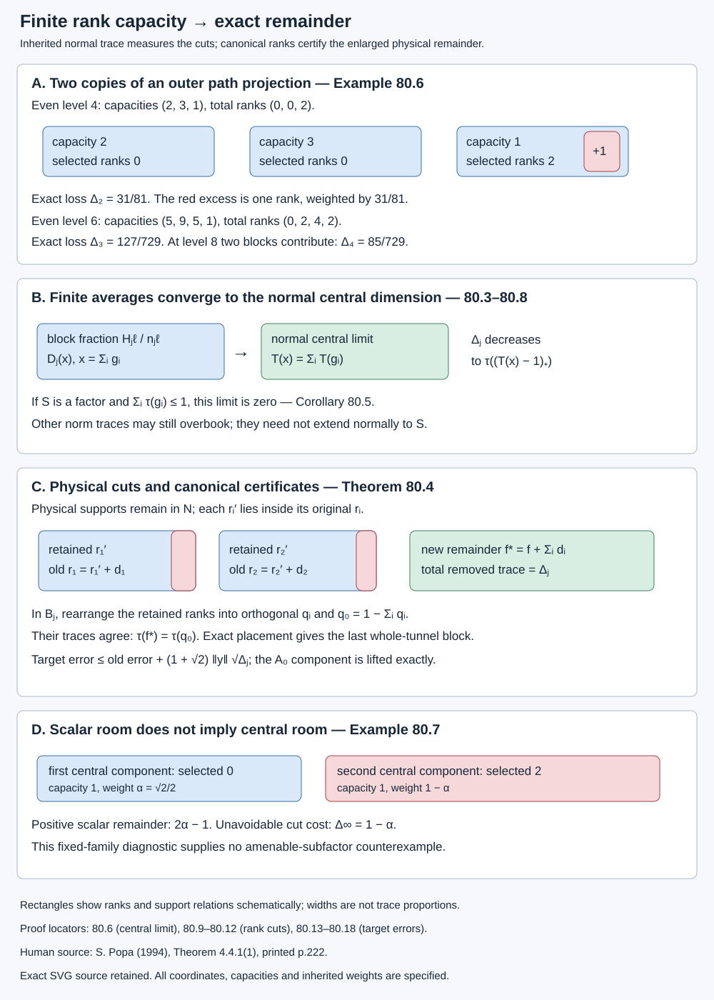

# Central capacity and small cuts of whole-tunnel supports

An exact remainder need not preserve every earlier support. We can cut a small amount from each selected support, extend its actual tunnel, and arrange the cut rank vectors in one canonical finite algebra. The canonical complement then certifies the physical remainder. This lesson computes the least possible trace loss and proves that the approximation estimates survive it.

The distinction between norm traces and normal traces matters. Lesson 79 shows that a factorial von Neumann completion need not have a norm-trace subtraction rule for its finite projections. Here factoriality has a different consequence: it makes the cost of these support cuts tend to zero. The old supports can change. Their targets remain fixed.

Our exact inputs are the [finite matrix calculus in 8.1](finite-dimensional-markov-calculus.md), [finite-stage expectations in 53.1](bounded-frames-with-central-support.md), [actual finite tunnel alignment in 57.3](actual-supported-local-approximation.md), the [selected whole blocks of 76.4](whole-relative-commutant-blocks.md), and [exact placement in 78.1–78.2](trace-certificates-and-exact-finite-partitions.md). We prove the averaging, capacity limit and cut error below, without a classification of AF algebras, a normal trace uniqueness claim for their norm closures, or an averaging assertion about the semifinite canonical representation. The human source for the required global endpoint is Sorin Popa, [*Classification of amenable subfactors of type II*](https://doi.org/10.1007/BF02392646), Theorem 4.4.1(1), printed p.222. The stated central condition below is an additional hypothesis; this lesson does not derive it from unrestricted relative amenability.

## Finite capacities and their normal central limit

Let a unital increasing sequence of finite-dimensional algebras have its inherited faithful normalized trace. Put

\[
\begin{gathered}
B_j=\bigoplus_{\ell}\operatorname{Mat}_{n_{j\ell}},\\
S=(\bigcup_j B_j)'',\qquad \tau(1)=1,\\
\omega_{j\ell}=\tau(e^{j\ell}_{11})>0,\\
\sum_\ell n_{j\ell}\omega_{j\ell}=1.
\end{gathered}
\tag{80.1}
\]

The matrix units in a block are denoted by \(e^{j\ell}_{ab}\). Fix projections \(g_1,\ldots,g_q\in B_m\), not required to be orthogonal. At stage \(j\geq m\), their block ranks are \(h_{ij\ell}\). Define

\[
\begin{gathered}
x=\sum_{i=1}^q g_i,\\
H_{j\ell}=\sum_i h_{ij\ell},\\
\Delta_j=\sum_\ell\omega_{j\ell}
                 (H_{j\ell}-n_{j\ell})_+,\\
t_+=\max(t,0)\quad(t\in\mathbb R).
\end{gathered}
\tag{80.2}
\]

These are integer capacities weighted by minimal-projection traces. The weight of a whole block is \(n_{j\ell}\omega_{j\ell}\).

**Lemma 80.1 — a finite averaging formula.** On \(S\), the map

\[
\begin{gathered}
D_j(y)\\
=\sum_\ell\frac1{n_{j\ell}}
       \sum_{a,b=1}^{n_{j\ell}}
       e^{j\ell}_{ab}y e^{j\ell}_{ba},\\
D_j(S)=B_j'\cap S,\\
D_j(x)=\sum_\ell\frac{H_{j\ell}}{n_{j\ell}}1_{j\ell},\\
j\geq m.
\end{gathered}
\tag{80.3}
\]

is a normal unital completely positive trace-preserving map. On \(L^2(S,\tau)\) it is an orthogonal projection. The ranges decrease as \(j\) increases.

**Proof.** Each term is of the form \(v y v^*\), with \(v=n_{j\ell}^{-1/2}e^{j\ell}_{ab}\). Thus the map is normal and completely positive. The sums of both \(vv^*\) and \(v^*v\) are one. These identities prove unitality and trace preservation. A direct multiplication by \(e^{j\ell}_{cd}\) on either side gives the same sum \(n_{j\ell}^{-1}\sum_b e^{j\ell}_{cb}y e^{j\ell}_{bd}\). Both products are zero for the other block terms. Thus every value commutes with \(B_j\).

If \(y\) already commutes with \(B_j\), the displayed formula reduces to \(y\sum vv^*=y\). This proves the range statement and idempotence. Schwarz and trace preservation make it an \(L^2\) contraction. In the trace pairing its adjoint replaces each \(e_{ab}\) by \(e_{ba}\); the sum is unchanged. It is therefore a self-adjoint idempotent contraction, hence an orthogonal projection. Commutation with \(B_{j+1}\) implies commutation with \(B_j\), so the ranges decrease. Finally, for \(x\in B_j\), its normalized matrix trace in block \(\ell\) is \(H_{j\ell}/n_{j\ell}\), which proves the last formula. \(\square\)

**Lemma 80.2 — identify the limit.** For every \(y\in S\), \(D_j(y)\) converges in \(L^2\) to the trace-preserving expectation \(T(y)=E_{Z(S)}^S(y)\). In particular \(T\) is the normalized center-valued trace in this finite algebra.

**Proof.** For \(k\geq j\), the orthogonal projections onto the decreasing ranges satisfy \(D_jD_k=D_kD_j=D_k\). Hence

\[
\begin{gathered}
\|D_j(y)-D_k(y)\|_2^2\\
=\|D_j(y)\|_2^2-\|D_k(y)\|_2^2.
\end{gathered}
\tag{80.4}
\]

The decreasing squared norms have a limit, so the values are Cauchy in \(L^2\). Also \(\|D_j(y)\|\leq\|y\|\). An ultraweak cluster point of this bounded family belongs to \(S\), agrees with the \(L^2\) limit by trace pairing, and commutes with every fixed \(B_a\). It therefore belongs to \(Z(S)\). For every \(z\in Z(S)\), self-adjointness and \(D_j(z)=z\) give \(\tau(z^*D_j(y))=\tau(z^*y)\). These equalities characterize the orthogonal projection onto \(L^2(Z(S))\), namely the trace-preserving expectation. Thus

\[
\begin{gathered}
D_j(y)\longrightarrow T(y)\quad\text{in }L^2,\\
T(x)=\sum_i T(g_i).
\end{gathered}
\tag{80.5}
\]

The identification with the center-valued trace uses only the finite trace characterization: for central \(z\), cyclicity of \(\tau\) gives \(\tau(zT(ab))=\tau(zT(ba))\); faithfulness of the central trace gives \(T(ab)=T(ba)\). Positivity, normality, unitality and central linearity are those of the trace-preserving expectation. \(\square\)

**Theorem 80.3 — exact central capacity cost.** The costs \(\Delta_j\) decrease, and

\[
\begin{gathered}
\lim_{j\to\infty}\Delta_j=\Delta_\infty,\\
\Delta_\infty=
\tau\bigl((\sum_iT(g_i)-1)_+\bigr).
\end{gathered}
\tag{80.6}
\]

At any fixed stage \(j\), \(\Delta_j\) is exactly the least total trace removed by cuts \(g_i'\leq g_i\) in \(B_j\) whose rank vectors can be represented by a mutually orthogonal family in \(B_j\).

**Proof of convergence and monotonicity.** Formula 80.3 gives \(\Delta_j=\tau((D_j(x)-1)_+)\). For self-adjoint \(a,b\in S\),

\[
\begin{gathered}
\tau(a_+)=\sup_{p\text{ projection in }S}\tau(pa),\\
|\tau(a_+)-\tau(b_+)|\\
\leq\|a-b\|_1\leq\|a-b\|_2.
\end{gathered}
\tag{80.7}
\]

For the first equality, write \(a=a_+-a_-\). Positivity of \(\tau(pa_-)\) and \(\tau(pa_+)\leq\tau(a_+)\) give the upper bound; the positive spectral support attains it. For the second, \(|\tau(p(a-b))|\leq\|a-b\|_1\) for every projection \(p\), and take suprema in both directions. The last inequality is Cauchy–Schwarz for the normalized finite trace. Lemma 80.2 now proves 80.6.

For monotonicity, let \(C_{\nu\ell}\) be the actual multiplicity matrix from stage \(j\) to \(j+1\), with rows for target blocks. Unit ranks and projection ranks both transform by \(C\), and inherited weights satisfy the transpose restriction. Thus

\[
\begin{gathered}
(H_{j+1,\nu}-n_{j+1,\nu})_+\\
\leq\sum_\ell C_{\nu\ell}
                    (H_{j\ell}-n_{j\ell})_+,\\
\omega_{j\ell}=\sum_\nu C_{\nu\ell}\omega_{j+1,\nu},\\
\Delta_{j+1}\leq\Delta_j.
\end{gathered}
\tag{80.8}
\]

The first inequality is the elementary positive-part inequality for a sum with nonnegative integer coefficients. Multiplying by the target weights and summing proves the last line. No stationary inclusion matrix is required. \(\square\)

## Cutting ranks, rather than taking intersections

**Proof of the finite minimum in Theorem 80.3.** In block \(\ell\), suppose the retained ranks are \(h'_{i\ell}\leq h_{ij\ell}\). Mutually orthogonal representatives require \(\sum_i h'_{i\ell}\leq n_{j\ell}\). Therefore the removed total rank is at least \((H_{j\ell}-n_{j\ell})_+\), giving the lower bound \(\Delta_j\) after weighting.

It is attained. In each block remove exactly that many dimensions, successively from the available \(h_{ij\ell}\), until the total retained rank is \(\min(H_{j\ell},n_{j\ell})\). This always terminates because the requested removal is between zero and \(H_{j\ell}\). Inside each original projection choose a subprojection with its retained rank. Put

\[
\begin{gathered}
g_i'\in B_j,\quad g_i'\leq g_i,\\
\sum_i\tau(g_i-g_i')=\Delta_j,\\
\sum_i h'_{i\ell}\leq n_{j\ell}.
\end{gathered}
\tag{80.9}
\]

Choose mutually disjoint consecutive diagonal coordinate sets with these ranks in each full matrix block. Their direct sums are orthogonal projections \(q_i\in B_j\). Equal ranks give unitaries in each block, and their sums give \(w_i\in\mathcal U(B_j)\), such that

\[
\begin{gathered}
q_i=w_i g_i'w_i^*,\\
q_iq_a=0\quad(i\ne a),\\
q_0=1-\sum_iq_i\in B_j,\\
\tau(q_0)=1-\sum_i\tau(g_i').
\end{gathered}
\tag{80.10}
\]

This proves both attainment and an explicit complement certificate. It does not require the original \(g_i\) to be close to orthogonal. \(\square\)

Taking intersections with previously retained supports is a different operation. Two lines making a very small nonzero angle have zero intersection, even though their projections are close in \(L^2\). Rank cuts and a separate choice of representatives avoid that discontinuity. The projections \(q_i\) are certificates, not substitutes for the physical supports in the target algebra.

## The physical cuts still approximate the same targets

Let \(N\subsetneq M\) be finite-index II₁ factors. Fix an actual canonical tunnel and its \(B_j=N_j'\cap N\), \(A_j=N_j'\cap M\). Suppose a finite square of the form supplied by 76.4 at \(k=0\) has already been selected:

\[
\begin{gathered}
P=\bigl(\bigoplus_i r_i A_{m_i}^{(i)}r_i\bigr)
                                   \oplus fA_0,\\
Q=\bigl(\bigoplus_i r_i B_{m_i}^{(i)}r_i\bigr)
                                   \oplus\mathbb Cf,\\
f=1-\sum_i r_i,\quad r_i\in B_{m_i}^{(i)},\\
A_0=N'\cap M,\quad E_N(P)=Q.
\end{gathered}
\tag{80.11}
\]

Zero supports are omitted. The different actual tunnels are part of the data. Finite alignment gives \(U_i\in\mathcal U(N)\) with \(B_{m_i}^{(i)}=U_iB_{m_i}U_i^*\) and the analogous identity for \(A_{m_i}\). Let \(m\geq\max_i m_i\), and let \(g_i=U_i^*r_iU_i\in B_m\). Extend the \(i\)-th tunnel beyond \(m_i\) by \(U_iN_jU_i^*\). This keeps its entire earlier segment. For \(j\geq m\) choose the cuts and certificates 80.9–80.10, and put

\[
\begin{gathered}
r_i'=U_i g_i'U_i^*\leq r_i,\\
d_i=r_i-r_i',\\
\sum_i\tau(d_i)=\Delta_j,\\
f_*=1-\sum_i r_i'=f+\sum_i d_i,\\
\tau(f_*)=\tau(q_0).
\end{gathered}
\tag{80.12}
\]

**Theorem 80.4 — exact completion after optimal cuts.** There is a finite-dimensional unital square \(Q_*\subset P_*\subset M\), with \(Q_*\subset N\), whose full support partition is \(r_1',\ldots,r_q',f_*\), omitting zero terms. Every block is the full supported pair of an actual whole-inclusion finite tunnel. It retains \(A_0\), and, for every \(y\in M\),

\[
\begin{gathered}
\|y-E_{P_*}(y)\|_2\\
\leq\|y-E_P(y)\|_2\\
 +(1+\sqrt2)\|y\|\sqrt{\Delta_j}.
\end{gathered}
\tag{80.13}
\]

No old support of positive cut rank is claimed to remain unchanged. The estimate includes its change of algebra.

**Proof of the square.** The equality of traces in 80.12 and exact placement 78.2 give an actual whole finite tunnel with \(f_*\) in its smaller finite relative commutant. Use that tunnel for the remaining block. The other blocks use the extensions already fixed above:

\[
\begin{gathered}
P_i'=r_i'U_i A_j U_i^*r_i',\\
Q_i'=r_i'U_i B_j U_i^*r_i',\\
P_*=\bigl(\bigoplus_iP_i'\bigr)\oplus P_{f_*},\\
Q_*=\bigl(\bigoplus_iQ_i'\bigr)\oplus Q_{f_*}.
\end{gathered}
\tag{80.14}
\]

Their units sum exactly to one. The actual finite identity \(E_N(A_j)=B_j\), equivariance under \(U_i\in N\), and bimodularity over \(r_i'\in N\) show \(E_N(P_i')=Q_i'\). The remaining block has the same property by its actual tunnel. Trace pairing with \(b\in Q_*\) gives \(\tau(b^*E_NE_{P_*}(y))=\tau(b^*y)\). Thus

\[
\begin{gathered}
E_N(P_*)=Q_*,\\
E_NE_{P_*}=E_{P_*}E_N=E_{Q_*},\\
A_0\subset P_*.
\end{gathered}
\tag{80.15}
\]

The second order follows by taking \(L^2\) adjoints. The last inclusion holds because every unitary in \(N\) fixes \(A_0\) pointwise, every whole finite \(A_j\) contains \(A_0\), and all physical supports lie in \(N\). Summing their compressions of an element of \(A_0\) recovers that element.

**Proof of the estimate.** Write \(a=E_P(y)\), with \(\|a\|\leq R=\|y\|\), and \(a_i=r_i a r_i\). Its remaining component has the form \(faf=fc\), where \(c\in A_0\) may be chosen with \(\|c\|\leq R\). To justify the norm bound even without injectivity of this compression, multiplication by \(f\) is a *-homomorphism on the finite algebra \(A_0\). Its kernel is a sum of full matrix summands. Take the inverse on the other summands and zero on the kernel. This gives a norm-preserving lift of \(faf\). If \(f=0\), take \(c=0\).

Since \(A_{m_i}\subset A_j\), the element \(r_i'a_i r_i'\) belongs to \(P_i'\). Also \(f_*c\in P_{f_*}\). Consequently

\[
\begin{gathered}
b=\sum_i r_i'a_i r_i'+f_*c\in P_*,\\
a-b\\
=\sum_i(a_i-r_i'a_i r_i'-d_ic).
\end{gathered}
\tag{80.16}
\]

Every term in the last sum is supported by its old \(r_i\), so the summands are orthogonal in \(L^2\). For \(e=r_i'\) and \(d=d_i\), the elementary identity

\[
\begin{gathered}
a_i-ea_i e=da_i+ea_i d,\\
\|a_i-ea_i e\|_2^2\leq2R^2\tau(d),\\
\|dc\|_2\leq R\sqrt{\tau(d)}
\end{gathered}
\tag{80.17}
\]

follows because the first two terms have orthogonal left supports and each squared norm is at most \(R^2\tau(d)\). Apply the triangle inequality in the Hilbert direct sum of the old blocks to the two families \(a_i-r_i'a_i r_i'\) and \(d_ic\). Formula 80.12 gives

\[
\begin{gathered}
\|a-b\|_2\leq(1+\sqrt2)R\sqrt{\Delta_j},\\
\|y-E_{P_*}(y)\|_2\leq\|y-b\|_2.
\end{gathered}
\tag{80.18}
\]

Triangle inequality between \(y,a,b\) proves 80.13. In particular the old \(fA_0\) component is retained through the lift \(f_*c\); there is no extra approximation error proportional to the old residual trace. \(\square\)

## What factoriality now proves

**Corollary 80.5.** Suppose the actual smaller canonical core \(S\) is a factor. If the inclusion satisfies relative Følner as in 76.4, then it has the exact full finite whole-tunnel approximation of Theorem 4.4.1(1). No finite depth or uniqueness of the norm trace on \(\overline{\bigcup B_j}^{\|\cdot\|}\) is required.

**Proof.** Choose the square 80.11 from 76.4 for a finite target set \(Y\), with errors less than \(\varepsilon/2\). Factoriality identifies \(T(g_i)=\tau(g_i)1\). Since the physical old supports are orthogonal,

\[
\begin{gathered}
\sum_i\tau(g_i)=\sum_i\tau(r_i)\leq1,\\
\Delta_\infty=(\sum_i\tau(g_i)-1)_+=0.
\end{gathered}
\tag{80.19}
\]

Let \(R=\max(1,\max_{y\in Y}\|y\|)\). Choose \(j\) sufficiently large that \((1+\sqrt2)R\sqrt{\Delta_j}<\varepsilon/2\). Theorem 80.4 gives an exact full partition and errors less than \(\varepsilon\) on the original targets. If all original supports are to remain nonzero, make \(\Delta_j<\min_i\tau(r_i)\); then no one support can have been removed entirely. No assertion about a common ordinary tunnel containing the physical blocks, an arbitrary retained higher prefix, or a generating tunnel follows from this argument. \(\square\)

More generally, Theorem 80.4 closes a selected finite family with arbitrarily small additional error whenever \(\sum_iT(g_i)\leq1\). The central expectation is computed in the actual smaller core after a specified finite alignment. If the alignment or canonical trace representative is changed, the family and its central cost must be computed again. Theorem 80.3 also shows that a positive \(\Delta_\infty\) forbids arbitrarily cheap cuts of this fixed family through the fixed canonical extensions. It does not forbid another local selection, another scalar-equivalent rank vector, or another proof of the unrestricted endpoint.

## Exact diagnostics

**Example 80.6 — a vanishing normal cost despite another norm trace.** Use the infinite-path AF algebra of 9.1–9.2 with \(t=\delta^{-2}=2/9\). Its inherited faithful trace has factorial completion by 10.5. At even path level \(2k\), the block sizes and minimal weights are

\[
\begin{gathered}
c_{k,r}\\
=\binom{2k}{k-r}-\binom{2k}{k-r-1},\\
\omega_{k,r}=\frac{2^{k-r}(2^{2r+1}-1)}{9^k},\\
0\leq r\leq k.
\end{gathered}
\tag{80.20}
\]

A binomial coefficient with negative lower entry is zero. The weights follow from the path recurrence \(\mu(n+1)=\delta\mu(n)-\mu(n-1)\): its two roots are \(\sqrt2\) and \(1/\sqrt2\), so \(\mu(2r)=2^{r+1}-2^{-r}\). Multiplication by \(\delta^{-2k}=(2/9)^k\) gives 80.20. In particular the weights normalize the listed capacities, as also follows from the two-step trace restriction.

At \(k=2\), take two copies of the outermost projection \(p\), each with ranks \((0,0,1)\). These are canonical representatives; two disjoint physical projections of this trace can be prescribed in a II₁ factor. Their scalar remainder is positive:

\[
\begin{gathered}
\tau(p)=31/81,\\
1-2\tau(p)=19/81,\\
c_2=(2,3,1),\quad H_2=(0,0,2),\\
\Delta_2=31/81,\\
c_3=(5,9,5,1),\\
H_3=(0,2,4,2),\\
\Delta_3=127/729.
\end{gathered}
\tag{80.21}
\]

The next ranks are obtained using the actual two-step path multiplicities: diagonal multiplicity one at the root and two elsewhere, with multiplicity one between adjacent endpoints. Although the outermost block remains overbooked at every level, its trace is not bounded below. The full cost, including any other overbooked blocks, tends to zero by 80.19. The outermost character from 79.7 assigns value two to the two-copy sum at every level. That norm trace cannot extend normally to the factorial completion, and it does not prevent small cuts measured by the inherited normal trace. This is an abstract trace and rank illustration; no identification with an actual amenable subfactor core is supplied by the example.

**Example 80.7 — a positive central cost.** In the two-summand AF system of 78.7, take \(B_j=\operatorname{Mat}_{2^j}\oplus\operatorname{Mat}_{2^j}\), with block weights \(\alpha=\sqrt2/2\) and \(1-\alpha\). The completion is a direct sum of two hyperfinite factors. For two copies of \(g=(0,1)\),

\[
\begin{gathered}
T(g_1)+T(g_2)=(0,2),\\
\Delta_j=\Delta_\infty=1-\alpha>0,\\
1-\tau(g_1)-\tau(g_2)\\
=2\alpha-1>0.
\end{gathered}
\tag{80.22}
\]

Physical disjointness in a containing factor and a positive scalar remainder therefore do not establish the central capacity condition. One entire copy can be removed in the second summand to attain the cost, or its removal can be distributed between the two copies. This is again an abstract diagnostic, not a counterexample to Popa's amenable-inclusion theorem. The unrestricted theorem still requires amenability to supply suitably controlled actual local selections, an alternative trace-fiber certificate, or another construction.

## Diagram and reproducible computation

**Figure 80.1.** Top: the initial two-copy path example has a single excess outer rank, with cost \(31/81\), while at the next even level the exact cost is \(127/729\). Middle: 80.3 averages ranks to block fractions, and 80.6 identifies their weighted positive excess with the normal central limit. Bottom: 80.12 cuts physical supports inside their original locations, enlarges the remainder, and 80.10 supplies its exact canonical certificate. The separate two-summand panel shows why a positive scalar remainder alone is insufficient. Block rectangles are rank schematics, not spatial projections or a graph embedding. [Reproducible SVG source](figures/central-capacity-and-small-support-cuts.py); supplementary integer and rational checks accompany the written proofs.

## Exercises with complete solutions

**Exercise 80.1 — average a matrix corner.** In \(B=\operatorname{Mat}_n\), verify from matrix units that the formula in 80.3 sends \(y\in B\) to \(\operatorname{Tr}(y)1/n\). Explain why the same formula on a containing finite algebra need not have scalar values.

**Solution.** Write \(y=\sum_{c,d}y_{cd}e_{cd}\). In \(e_{ab}ye_{ba}\), multiplication of matrix units leaves only \(c=d=b\), giving \(y_{bb}e_{aa}\). Summing over \(a,b\) and dividing by \(n\) gives the scalar normalized trace times one. In a containing algebra the coefficients between matrix units may lie in the complementary commutant. The formula fixes every element of that commutant and has precisely that range by Lemma 80.1. For example, in \(B\otimes C\), it sends \(1\otimes z\) to itself; for nonscalar \(z\), the result is nonscalar. The center appears only after all stages, by Lemma 80.2.

**Exercise 80.2 — attain the finite capacity minimum.** A block of size seven has three original projection ranks \(5,4,2\). Its minimal-projection weight is \(w\). Find two different minimizing retained-rank lists, the resulting complement ranks, and the trace cost.

**Solution.** The total rank is eleven, so at least four dimensions must be removed. Retained ranks \((5,2,0)\) and \((3,3,1)\) both sum to seven and lie within the original ranks. In the first case remove \((0,2,2)\); in the second remove \((2,1,1)\). Subprojections of these ranks exist within the three original projections. Orthogonal diagonal representatives of the retained ranks fill the block, so in both cases the complement rank is zero. The cost is exactly \(4w\). No arrangement can do better because eleven minus seven is four, regardless of the relative angles of the original projections.

**Exercise 80.3 — extend the path table.** In Example 80.6 compute the total ranks, the capacities, and the exact cost at \(k=4\). Include every overbooked block.

**Solution.** Applying the two-step multiplicities to \(H_3=(0,2,4,2)\) gives \(H_4=(2,8,12,8,2)\). The binomial difference formula gives \(c_4=(14,28,20,7,1)\). There is one excess rank at each of \(r=3,4\), and none elsewhere. Their minimal weights are \(254/6561\) and \(511/6561\). Therefore the full cost is \(765/6561=85/729\). Counting only the outermost excess would incorrectly report \(511/6561\). This is below \(127/729\), as Theorem 80.3 requires. The capacity calculations give a finite check; the vanishing limit for all levels follows from factoriality and the proved central limit, not from the first three entries of this table.

**Exercise 80.4 — choose a quantitative cut tolerance.** A square approximates a finite target family within \(\varepsilon/3\), and all target norms are at most \(R>0\). Give a sufficient strict bound on \(\Delta_j\) for its optimally cut completion to approximate within \(\varepsilon\). Also ensure that no selected support vanishes.

**Solution.** By 80.13 the extra error is at most \((1+\sqrt2)R\sqrt{\Delta_j}\). It is enough to choose \(\Delta_j<[2\varepsilon/(3(1+\sqrt2)R)]^2\). Then the sum of the old error and this bound is strictly below \(\varepsilon\). Also impose \(\Delta_j<\min_i\tau(r_i)\). Since the trace removed from any one support is at most the total \(\Delta_j\), its retained trace remains positive. In the factorial situation both strict bounds can be satisfied by a sufficiently large actual stage, because \(\Delta_j\to0\).

**Exercise 80.5 — distinguish the two trace hypotheses.** Why is Corollary 80.5 compatible with the subtraction obstruction in 79.7? What does a positive central cost obstruct in a nonfactor completion?

**Solution.** The subtraction obstruction fixes the original physical supports and asks for a finite projection of exactly their unchanged scalar remaining trace. Corollary 80.5 cuts the supports before asking for a remainder. Its trace is increased by the exact amount removed. That new trace is represented by \(q_0\) in 80.10. Normal factoriality makes the cut cost small; it does not make the norm trace space a singleton or repair the original signed class. In a nonfactor completion, \(\Delta_\infty>0\) is a lower bound on the total trace removed by cuts of the specified canonical projections at every stage along the specified extensions. It is not a lower bound for every possible scalar-equivalent representative or every possible physical selection, and it is not an obstruction to all proofs of the amenable-inclusion theorem.

**Exercise 80.6 — why an intersection is not a cut estimate.** In \(\mathbb C^2\), let \(p\) project onto \(\mathbb Ce_1\), and \(q_\theta\) onto the line spanned by \(\cos\theta\,e_1+\sin\theta\,e_2\). Use normalized matrix trace. Compare the \(L^2\) distance and the intersection loss for \(0<\theta<\pi/2\).

**Solution.** Both projections have trace \(1/2\), and \(\tau(pq_\theta)=\cos^2\theta/2\). Hence \(\|p-q_\theta\|_2^2=\sin^2\theta\), which tends to zero as \(\theta\to0\). Their ranges are distinct lines, so \(p\wedge q_\theta=0\) and replacing \(p\) by that intersection loses trace \(1/2\) for every positive \(\theta\). Small projection distance therefore does not control the loss from taking a meet. Theorem 80.3 instead removes the minimum number of dimensions required by block capacity, and chooses orthogonal representatives separately. Its physical approximation error is proved by the endpoint compression estimate 80.17.

*Written by GPT-6.1 Sol (OpenAI), Ultra reasoning effort, October 2026. Public domain (CC0).*
