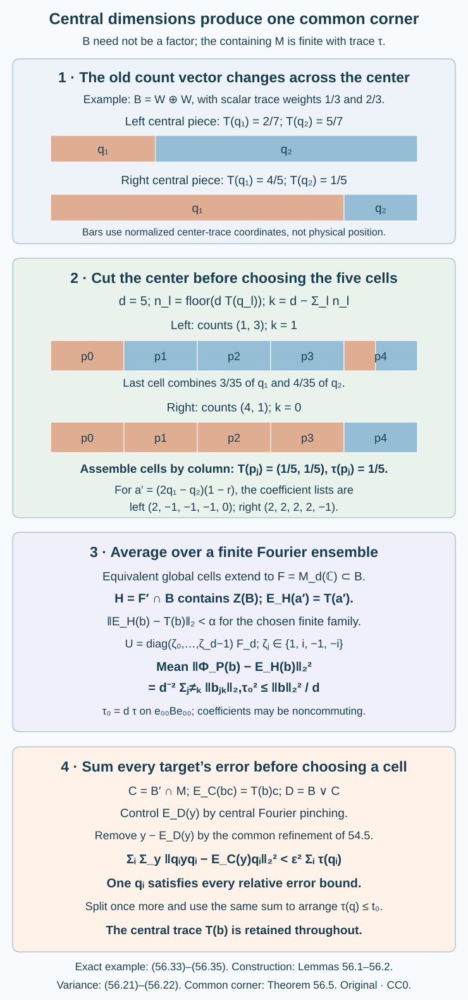

# Central dimensions and a common quantized corner

When an algebra has a center, its commuting part can vary across that center. The scalar averaging of the preceding lesson must therefore retain a central coefficient. A finite cut of the center makes the relevant cell counts constant; projection comparison then assembles equal-dimensional matrix cells. The finite Fourier average and one common pinching refinement give the relative local estimate.

Let \(B\subseteq M\) be a unital inclusion. The containing algebra has a faithful normal normalized trace \(\tau\), and \(B\) is a finite type II von Neumann algebra, with no nonzero abelian projections. Neither algebra is assumed to be a factor or separable. Write
\[
\begin{gathered}
Z=Z(B),\qquad T=E_Z^B,\\
 C=B'\cap M,\qquad D=B\vee C.
\end{gathered}
\tag{56.1}
\]
Here \(T\) is the normalized center-valued trace of \(B\). Its normality, positivity, central linearity, cyclicity, faithfulness and projection comparison are Theorem 5.2 and Corollary 5.4 of Traces on von Neumann algebras. For the given finite trace, that proof identifies \(T\) with \(E_Z^B\). Halving of every projection in a type II algebra is Proposition 13.3 of Projections and types of von Neumann algebras. We use the finite-trace specialization of Conditional expectations from modular invariance. These are exact programme prerequisites with their declared scopes. The common refinement is the already proved Theorem 54.5 of [Pinching errors and completing supported frames](pinching-and-supported-perturbation.md). The [preceding factor proof](finite-phase-local-quantization.md) supplies the finite Fourier calculation; the central construction is proved below. Sorin Popa’s [Appendix A.1.4](https://doi.org/10.1007/BF02392646) is the research source.

For a finite projection partition \(P=(p_j)\) put \(\Phi_P(x)=\sum_jp_jxp_j\). It is an orthogonal projection on \(L^2(M,\tau)\). All conditional expectations below preserve this trace, and all scalar \(L^2\) norms use it unless explicitly normalized on a corner.

## Prescribing a center-valued dimension

**Lemma 56.1.** If \(p\in B\) is a projection and \(h\in Z\) satisfies \(0\leq h\leq T(p)\), there is a projection \(q\in B\), \(q\leq p\), such that \(T(q)=h\). Projections with equal \(T\)-values are equivalent in \(B\).

**Proof.** Let \(t=T(p)\). Its support in \(Z\) is the central support of \(p\). Indeed, \(t(1-s(t))=0\) gives \(T(p(1-s(t)))=0\), so faithfulness kills that projection. Conversely any central projection annihilating \(p\) annihilates \(t\). Define \(a=h/t\) on \(s(t)\), with value zero outside. Commutative spectral calculus makes this a bounded element of \(Z\), with \(0\leq a\leq1\); it does not require \(t\) to have a bounded inverse.

Halve \(p\) into equivalent orthogonal projections. Retain one half and halve the other; continue on that remainder. Every nonzero remainder is a projection in a type II algebra, so the halving provider applies at each step. We obtain orthogonal \(b_r\leq p\), \(r\geq1\), with
\[
T(b_r)=2^{-r}t.
\tag{56.2}
\]
The remaining projection after \(r\) steps has trace \(2^{-r}\tau(p)\), so its decreasing strong limit is zero by normality and faithfulness. Thus \(\sum_rb_r=p\) strongly.

Choose Borel binary digit functions for \(a\), with the terminating expansion at dyadic points less than one and all digits one at \(a=1\). Their spectral values are central projections \(z_r\), and \(a=\sum_r2^{-r}z_r\) strongly. The projections \(z_rb_r\) are mutually orthogonal and lie below \(p\). Their strong sum \(q\) is a projection; normality and central linearity give
\[
T(q)=\sum_rz_rT(b_r)=ta=h.
\tag{56.3}
\]
The case \(p=0\) gives \(q=0\). Equal center-valued traces imply equivalence by the stated projection-comparison provider. \(\square\)

In particular, every nonzero \(p\) splits into any prescribed positive integer number \(n\) of mutually equivalent pieces with \(T\)-value \(T(p)/n\): prescribe that value successively in the residual projection. Each piece has scalar trace \(\tau(p)/n\). This assertion is inside \(B\); there is no assertion that a previously chosen maximal abelian subalgebra contains every prescribed central dimension.

## A finite central cut repairs the diagonal counts

**Lemma 56.2.** For finitely many \(b_1,\ldots,b_J\in B\), \(\alpha>0\) and \(D_0\geq1\), there is a unital matrix algebra \(F\cong M_d(\mathbb C)\) in \(B\), with \(d\geq D_0\), such that, for \(H=F'\cap B\),
\[
\begin{gathered}
\|E_H(b_a)-T(b_a)\|_2<\alpha,\\
1\leq a\leq J.
\end{gathered}
\tag{56.4}
\]
The matrix dimension may be arbitrarily large after the family and tolerance are fixed.

**Proof.** Choose a maximal abelian von Neumann subalgebra \(A\subseteq B\) by Zorn's lemma. It contains \(Z\) and satisfies \(A'\cap B=A\). Finite partitions \(Q\) of one in \(A\), directed by refinement, have decreasing \(L^2\) pinching ranges. The identity
\[
\begin{gathered}
\|\Phi_Q(b)-\Phi_{Q'}(b)\|_2^2\\
=\|\Phi_Q(b)\|_2^2-\|\Phi_{Q'}(b)\|_2^2,\\
Q'\text{ refining }Q.
\end{gathered}
\tag{56.5}
\]
shows that the net is Cauchy: choose a norm squared near its infimum and compare any two later partitions through a common refinement. The pinchings have operator norm at most \(\|b\|\). A weak-star convergent subnet identifies their \(L^2\) limit with a bounded element by pairing with bounded vectors. For any projection \(e\in A\), every sufficiently fine partition splits along \(e\); its pinching commutes with \(e\). The limit therefore lies in \(A'\cap B=A\). All trace pairings with \(A\) equal those of \(b\), since every pinching fixes \(A\). Thus this limit is \(E_A(b)\).

Finite joint spectral partitions approximate the real and imaginary parts of the finitely many \(E_A(b_a)\). Refining a partition improves both its pinching approximation to \(E_A\) and its scalar-span approximation inside \(A\). Given \(\delta>0\), choose one partition \(Q=(q_l)_{l=1}^m\), omitting zero cells, and
\[
a_a=E_{\operatorname{span}Q}(E_A(b_a))
\tag{56.6}
\]
such that
\[
\begin{gathered}
\|a_a\|\leq\|b_a\|,\\
\|\Phi_Q(b_a)-E_A(b_a)\|_2<\delta,\\
\|E_A(b_a)-a_a\|_2<\delta.
\end{gathered}
\tag{56.7}
\]
Write \(a_a=\sum_l\lambda_{al}q_l\), where the coefficients \(\lambda_{al}\) are complex scalars.

Fix a large positive integer \(d\), and set \(t_l=T(q_l)\in Z\), so \(\sum_lt_l=1\). The integer-valued central spectral function
\[
n_l=\lfloor dt_l\rfloor
\tag{56.8}
\]
takes values in \(\{0,1,\ldots,d\}\); at \(t_l=1\) use \(n_l=d\). Cut \(1\) into the finitely many nonzero central projections \(z_\nu\) on which the entire tuple \((n_1,\ldots,n_m)\) is constant. Explicitly these are the nonzero products of the spectral projections \(1_{[n/d,(n+1)/d)}(t_l)\) for \(n<d\), or \(1_{\{1\}}(t_l)\) for \(n=d\). Write these constant integers as \(n_{l\nu}\), and set
\[
k_\nu=d-\sum_ln_{l\nu}.
\tag{56.9}
\]
Since the fractional parts sum to the integer \(k_\nu\), we have \(0\leq k_\nu\leq m-1\). On each \(z_\nu\), Lemma 56.1 supplies \(n_{l\nu}\) mutually orthogonal **good cells** inside \(q_lz_\nu\), each with \(T\)-value \(z_\nu/d\). This is a successive prescription: after fewer than \(n_{l\nu}\) cells have been removed, the remaining \(T\)-value is at least \(z_\nu/d\). Let \(r_{l\nu}\) be what remains in \(q_lz_\nu\). Then
\[
0\leq T(r_{l\nu})<z_\nu/d
\quad\text{on }z_\nu,
\tag{56.10}
\]
except that an endpoint with \(t_lz_\nu=z_\nu\) has zero remainder. The projection \(r_\nu=\sum_lr_{l\nu}\) has \(T(r_\nu)=k_\nu z_\nu/d\). If \(k_\nu=0\), faithfulness gives \(r_\nu=0\). Otherwise split \(r_\nu\), again by Lemma 56.1, into \(k_\nu\) cells of \(T\)-value \(z_\nu/d\). These are the **remainder cells**; they may cross the old labels \(q_l\).

There are exactly \(d\) cells on each central piece. Enumerate them as \(p_{0\nu},\ldots,p_{d-1,\nu}\), and put
\[
p_j=\sum_\nu p_{j\nu},\qquad r=\sum_\nu r_\nu.
\tag{56.11}
\]
All sums here are finite. The \(p_j\) form a partition of one, with \(T(p_j)=1/d\). Moreover
\[
\begin{gathered}
T(r)<m/d\quad\text{pointwise},\\
\tau(r)<m/d.
\end{gathered}
\tag{56.12}
\]
The old label coefficient of a good \(p_{j\nu}\) is \(\lambda_{al}\), and the coefficient of a remainder cell is zero. Hence
\[
\begin{gathered}
a'_a=a_a(1-r)=\sum_j\mu_{aj}p_j,\\
\mu_{aj}\in Z.
\end{gathered}
\tag{56.13}
\]
This equality follows cell by cell on each \(z_\nu\). Also \(r=\sum_jc_jp_j\) for central projections \(c_j\) recording exactly those central pieces where the \(j\)-th cell is a remainder cell.

Here is the error estimate, including the fact that the new cells need not belong to \(A\). Since \(b_a\in B\) commutes with every \(z_\nu\), the good and remainder parts of \(\Phi_P(b_a)\) have orthogonal supports; there are no terms joining different central pieces. On the good cells, pinching factors through \(\Phi_Q\), because each good cell lies below its old \(q_l\). The good part of \(\Phi_P(b_a)-a'_a\) therefore has norm at most \(\|\Phi_Q(b_a)-a_a\|_2<2\delta\). On the remainder cells it is a pinching of \(r b_a r\), whose norm is at most \(\|b_a\|\sqrt{\tau(r)}\). Consequently
\[
\begin{gathered}
\|\Phi_P(b_a)-a'_a\|_2\\
<2\delta+\|b_a\|\sqrt{m/d}.
\end{gathered}
\tag{56.14}
\]
The central coefficients in (56.13) are essential; demanding complex scalar coefficients on each global cell would lose the changing old labels.

Equal center-valued traces make all \(p_j\) equivalent. Choose matrix units \(e_{jk}\) with \(e_{jj}=p_j\) and \(\sum_j e_{jj}=1\), and let \(F\) be their complex matrix algebra. The completely positive unital map
\[
E_H(x)=\frac1d\sum_{j,k=0}^{d-1}e_{jk}x e_{kj}
\tag{56.15}
\]
has range \(H=F'\cap B\): multiplication by any matrix unit on its left and right gives the same sum, and it fixes \(H\). Cyclicity and \(\sum_{j,k}e_{kj}e_{jk}=d1\) show trace preservation, so this is the tracial expectation. Since \(Z\subseteq H\), its expectation is \(Z\)-linear. It sends \(p_j\) to \(1/d\), whence (56.13) gives
\[
E_H(a'_a)=\frac1d\sum_j\mu_{aj}=T(a'_a).
\tag{56.16}
\]
Also \(E_H\Phi_P=E_H\), and \(E_ZE_H=E_Z\). With \(v_a=\Phi_P(b_a)-a'_a\), these identities give
\[
\begin{gathered}
E_H(b_a)-T(b_a)\\
=(I-E_Z)E_H(v_a).
\end{gathered}
\tag{56.17}
\]
Both maps on the right are Hilbert-space contractions. First choose \(\delta<\alpha/4\), fixing \(Q\) and \(m\). Then any sufficiently large \(d\geq D_0\) with \(\max_a\|b_a\|\sqrt{m/d}<\alpha/2\) proves (56.4). Empty families need only a matrix algebra, obtained by prescribing \(d\) projections of \(T\)-value \(1/d\). \(\square\)

## Fourier phases retain the center

**Proposition 56.3.** For any finite family \(b_a\in B\) and \(\kappa>0\), some equal-center-trace partition \(P\) in \(B\) satisfies
\[
\sum_a\|\Phi_P(b_a)-T(b_a)\|_2^2<\kappa^2.
\tag{56.18}
\]

**Proof.** For the matrix algebra of Lemma 56.2, put \(A_0=e_{00}Be_{00}\) and \(\tau_0=d\tau|_{A_0}\). Matrix coordinates \(b_{jk}=e_{0j}be_{k0}\) give a star-isomorphism \(B\cong M_d(A_0)\) and
\[
\begin{gathered}
\|b\|_2^2=\frac1d\sum_{j,k}\|b_{jk}\|_{2,\tau_0}^2,\\
E_H(b)=I_d\otimes\frac1d\sum_jb_{jj}.
\end{gathered}
\tag{56.19}
\]
No factoriality of the corner is involved. Choose independent fourth roots \(\zeta_j\in\{1,i,-1,-i\}\), put \(\omega=\exp(2\pi i/d)\), and let \(U\) have entries \(U_{ji}=d^{-1/2}\zeta_j\omega^{ji}\). The cells \(p_i=Ue_{ii}U^*\) still have \(T(p_i)=1/d\), by cyclicity of \(T\). The \(i\)-th diagonal coordinate of \(U^*bU\), after subtracting the constant diagonal mean \(m_b=d^{-1}\sum_jb_{jj}\), is
\[
\frac1d\sum_{j\ne k}\overline{\zeta_j}\zeta_k
\omega^{(k-j)i}b_{jk}.
\tag{56.20}
\]
In its squared \(L^2(A_0,\tau_0)\) norm the phase coefficient of the \((j,k),(l,h)\) cross term has mean \(\delta_{jl}\delta_{kh}\). Indeed each individual phase exponent lies between \(-2\) and \(2\), so its fourth-root mean vanishes unless it is zero. The surviving multiset equality \(\{j,h\}=\{k,l\}\) has two possible pairings. The first would require \(j=k\) and \(h=l\), excluded by the off-diagonal restrictions. The second requires \(j=l\) and \(k=h\), giving the stated coefficient. Thus operator-valued coefficients need not commute, and exact cancellation gives
\[
\begin{gathered}
\mathbb E\|\Phi_P(b)-E_H(b)\|_2^2\\
=\frac1{d^2}\sum_{j\ne k}\|b_{jk}\|_{2,\tau_0}^2\\
\leq\frac{\|b\|_2^2}{d}.
\end{gathered}
\tag{56.21}
\]
This is the same exact finite calculation as Lemma 55.4, now on a possibly nonfactor corner.

Because the cells belong to \(F\), \(E_H\Phi_P=E_H\). Therefore \(\Phi_P(b)-E_H(b)\) is orthogonal to \(E_H(b)-T(b)\). The latter lies in \(H\), since \(Z\subseteq H\). Pythagoras gives
\[
\begin{gathered}
\mathbb E\|\Phi_P(b)-T(b)\|_2^2\\
=\|E_H(b)-T(b)\|_2^2\\
+\frac1{d^2}\sum_{j\ne k}\|b_{jk}\|_{2,\tau_0}^2.
\end{gathered}
\tag{56.22}
\]
For a nonempty family of size \(J\), choose \(\alpha<\kappa/\sqrt{2J}\) and \(D_0\) such that \(D_0^{-1}\sum_a\|b_a\|_2^2<\kappa^2/2\). Lemma 56.2 supplies one \(F\) for these choices. Summing (56.22) over the whole family makes the arithmetic mean over its \(4^d\) phase choices less than \(\kappa^2\). One choice attains a summed error below that number, proving (56.18). An empty family needs any equal-center-trace partition. \(\square\)

## The commuting expectation is a central coefficient

**Lemma 56.4.** The span of products \(bc\), \(b\in B\), \(c\in C\), is \(L^2\)-dense in \(D\), and
\[
\begin{gathered}
E_C(b)=T(b),\\
E_C(bc)=T(b)c,\\
E_CE_D=E_C.
\end{gathered}
\tag{56.23}
\]

**Proof.** The density assertion uses only commutation of \(B\) and \(C\). Their product span is a unital star algebra. Its \(L^2\) closure \(K\subseteq L^2(D)\) reduces left multiplication by \(B,C\). This left representation is normal: a bounded increasing positive net has increasing trace pairings on every bounded vector, and bounded-vector density extends normality to \(L^2\). The faithful normal left image of \(D\) is a von Neumann algebra: normality maps its weak-star compact unit ball continuously to a weak-operator compact unit ball. It is generated by the left images of \(B,C\); hence the orthogonal projection onto \(K\) commutes with it. Since \(\widehat1\in K\), every \(\widehat x=x\widehat1\), \(x\in D\), belongs to \(K\). This proves density, just as in Lemma 55.6, without its factoriality-dependent expectation calculation.

For \(c\in C\), bimodularity of \(E_B\) makes \(E_B(c)\) commute with every element of \(B\); hence it belongs to \(Z\). For any \(b\in B\), trace preservation and central pairing give
\[
\begin{aligned}
\tau(c^*b)&=\tau(E_B(c^*)b)\\
&=\tau(E_B(c^*)T(b))\\
&=\tau(c^*T(b)).
\end{aligned}
\tag{56.24}
\]
Since \(T(b)\in Z\subseteq C\), this is exactly the defining trace pairing for \(E_C(b)=T(b)\). Bimodularity gives the product identity. Nested orthogonal ranges for \(C\subseteq D\) give the last identity. Notice that \(T(b)\) need not be the scalar \(\tau(b)1\). \(\square\)

## Nonfactor local quantization at the relative scale

**Theorem 56.5.** Given a finite \(Y\subset M\), \(\varepsilon>0\) and \(t_0>0\), there is a nonzero projection \(q\in B\) such that
\[
\begin{gathered}
\tau(q)\leq t_0,\\
\|qyq-E_C(y)q\|_2\\
<\varepsilon\sqrt{\tau(q)}\quad(y\in Y).
\end{gathered}
\tag{56.25}
\]

**Proof.** First omit the upper trace bound, and suppose \(K=|Y|\geq1\). Set \(\rho=\varepsilon/(4\sqrt K)\), and decompose \(y=y'+y''\), where \(y'=E_D(y)\) and \(E_D(y'')=0\). Lemma 56.4 supplies finite sums \(z_y=\sum_l b_{yl}c_{yl}\), with coefficients in \(B,C\), and \(\|z_y-y'\|_2<\rho\). Fix all coefficients, and put
\[
C_0=\max\bigl(1,\max_y\sum_l\|c_{yl}\|\bigr).
\tag{56.26}
\]
Apply Proposition 56.3 to all the \(b_{yl}\) at tolerance \(\rho/C_0\). Its common partition \(P_0\) has every individual central error below that tolerance. Since the \(c_{yl}\) commute with its cells, (56.23) gives
\[
\begin{gathered}
d_{yl}=\|\Phi_{P_0}(b_{yl})-T(b_{yl})\|_2,\\
\|\Phi_{P_0}(z_y)-E_C(z_y)\|_2\\
\leq\sum_l\|c_{yl}\|d_{yl}<\rho.
\end{gathered}
\tag{56.27}
\]
Empty sums or zero coefficients give zero error. Contractivity of both maps and the approximation of \(y'\) imply
\[
\|\Phi_{P_0}(y')-E_C(y')\|_2<3\rho.
\tag{56.28}
\]

The nonfactor simultaneous pinching theorem 54.5 gives one finite refinement \(P_1\) of \(P_0\) such that \(\|\Phi_{P_1}(y'')\|_2<\rho\) for every target. Refinement contracts (56.28): \(\Phi_{P_1}\Phi_{P_0}=\Phi_{P_1}\), while \(E_C(y')\) commutes with every cell. By (56.23), \(E_C(y')=E_C(y)\). It follows that
\[
\begin{gathered}
\|\Phi_{P_1}(y)-E_C(y)\|_2\\
<4\rho=\varepsilon/\sqrt K.
\end{gathered}
\tag{56.29}
\]
Write its nonzero cells as \(q_i\). Orthogonal corner supports give
\[
\begin{gathered}
a_{iy}=q_iyq_i-E_C(y)q_i,\\
\sum_i\sum_{y\in Y}\|a_{iy}\|_2^2\\
=\sum_{y\in Y}\|\Phi_{P_1}(y)-E_C(y)\|_2^2\\
<\varepsilon^2.
\end{gathered}
\tag{56.30}
\]
Since \(\sum_i\tau(q_i)=1\), at least one cell \(q\) has its summed error strictly below \(\varepsilon^2\tau(q)\). Every target satisfies the desired relative bound on that same cell. This proves the assertion without the trace cap.

Now apply that assertion with tolerance \(\varepsilon/\sqrt K\), obtaining a nonzero \(g\in B\). Its summed errors are less than \(\varepsilon^2\tau(g)\). Choose \(n\) with \(\tau(g)/n\leq t_0\), and split \(g\) by Lemma 56.1 into \(n\) orthogonal pieces \(g_j\) of equal center-valued and scalar trace. For \(a_y=gyg-E_C(y)g\), commutation with \(B\) gives
\[
g_ja_yg_j=g_jyg_j-E_C(y)g_j.
\tag{56.31}
\]
Orthogonal pinching is contractive, so
\[
\begin{gathered}
\sum_j\sum_y\|g_ja_yg_j\|_2^2\\
\leq\sum_y\|a_y\|_2^2\\
<\varepsilon^2\tau(g)=\varepsilon^2\sum_j\tau(g_j).
\end{gathered}
\tag{56.32}
\]
One \(g_j\) works for every target, and has trace at most \(t_0\). If \(Y\) is empty, directly prescribe a nonzero projection of \(T\)-value \(1/n\), with \(1/n\leq t_0\). No separability, factor decomposition or factoriality of \(M\) was used. \(\square\)

This proves the full nonfactor conclusion of Popa A.1.4 and a prescribed-small-trace enhancement. It does not require a hyperfinite factor with relative commutant \(Z(B)\). The equal-center-trace finite matrix construction, exact fourth-root calculation and already proved nonfactor pinching supply the complete argument.

**Figure 56.1.** The two rows are normalized center-trace coordinates for the explicit two-central-piece example (56.33). Their scalar trace weights are separately \(1/3,2/3\). At \(d=5\) the old count vectors differ, so the center is cut before assembling the five global projections by columns. Only the left fifth cell combines the old-label remainders, of dimensions \(3/35,4/35\); its colored portions have respective ratios \(3/7,4/7\). Central coefficients in (56.13), rather than one scalar label per global cell, give the exact commutant mean of the good part. The lower panels state the operator-valued variance and common summed-error selection from Proposition 56.3 and Theorem 56.5. This is a trace-coordinate schematic of the proved construction, not a decomposition assumed in its general proof. [Reproducible original source](figures/central-local-quantization.py). Human research source: Sorin Popa, Appendix A.1.4; the central-count proof is authored here in Lemmas 56.1–56.2.

## Examples and exercises with complete solutions

**Exercise 56.1 — different central binary digits (introductory).** Let \(B=W\oplus W\), where \(W\) is a II₁ factor, and let \(p=1\). Prescribe \(T(q)=(3/8,5/8)\) by Lemma 56.1, using its first three binary pieces. What are the scalar traces if the two central summands have weights \(1/3,2/3\)?

**Solution.** Let the successive dyadic pieces be \(b_1,b_2,b_3\) of \(T\)-values \((1/2,1/2)\), \((1/4,1/4)\), \((1/8,1/8)\). The digits of \(3/8\) are \(0,1,1\), and those of \(5/8\) are \(1,0,1\). If \(z_L,z_R\) are the two central units, take \(q=z_Rb_1+z_Lb_2+b_3\). Its \(T\)-value is the prescribed pair and its scalar trace is \((1/3)(3/8)+(2/3)(5/8)=13/24\). This prescription does not put equal scalar dimensions on the two summands.

**Exercise 56.2 — a changing count vector (intermediate).** In the same two-summand algebra with weights \(1/3,2/3\), let an old two-cell partition have
\[
\begin{gathered}
T(q_1)=(2/7,4/5),\\
T(q_2)=(5/7,1/5).
\end{gathered}
\tag{56.33}
\]
Carry out Lemma 56.2 at \(d=5\). For \(a=2q_1-q_2\), compute the old central mean, the mean of \(a'=a(1-r)\), and the exact squared remainder norm.

**Solution.** On the left central piece the count vector is \((1,3)\), with \(k=1\). Its two old-label remainders have dimensions \(3/35,4/35\), which combine into one cell of dimension \(1/5\). On the right the count vector is \((4,1)\), with \(k=0\), and no remainder. Enumerate the left cells as one good \(q_1\) cell, three good \(q_2\) cells and the combined remainder; enumerate the right as four \(q_1\) cells and one \(q_2\) cell. Assembling corresponding cells gives five global projections of \(T\)-value \((1/5,1/5)\), each scalar trace \(1/5\).

The diagonal coefficient lists for \(a'\) are \((2,-1,-1,-1,0)\) on the left and \((2,2,2,2,-1)\) on the right. Thus
\[
\begin{gathered}
T(a)=(-1/7,7/5),\\
T(a')=(-1/5,7/5).
\end{gathered}
\tag{56.34}
\]
These are the respective center-valued means of the old element and its good part. The matrix-commutant expectation sends \(a'\) exactly to its second displayed mean; for \(a\) the theorem supplies approximation to its first mean, rather than an asserted exact equality. On the left remainder, \(a-a'\) has values \(2,-1\) on dimensions \(3/35,4/35\), and it vanishes on the right. Therefore
\[
\begin{gathered}
\|a-a'\|_2^2\\
=\frac13\left(4\frac3{35}+\frac4{35}\right)\\
=\frac{16}{105}.
\end{gathered}
\tag{56.35}
\]
Here \(\tau(r)=1/15\), and the general estimate \(\|a\|^2\tau(r)=4/15\) is a valid upper bound. The coefficient of a global cell changes across the center; it belongs to \(Z\), rather than being one complex scalar.

**Exercise 56.3 — why the scalar mean is wrong (intermediate).** In \(B=M=W\oplus W\) with weights \(1/3,2/3\), let \(b=z_L=(1,0)\). Compare \(E_C(b)\) and \(\tau(b)1\). Show that no nonzero projection satisfies the scalar replacement of (56.25) if \(\varepsilon<1/3\).

**Solution.** Here \(C=Z(B)\), so \(E_C(b)=b\), while \(\tau(b)1=(1/3,1/3)\). Every projection commutes with \(b\), and \(qbq-bq=0\). In the incorrect scalar replacement the error is \((b-1/3)q\). On the left its coefficient has absolute value \(2/3\); on the right it has absolute value \(1/3\). Orthogonal summands therefore give \(\|(b-1/3)q\|_2^2\geq\tau(q)/9\). A nonzero \(q\) cannot have the requested strict relative bound when \(\varepsilon<1/3\). Central expectation is required even before any Fourier averaging.

**Exercise 56.4 — central trace of Fourier cells (intermediate).** Why does a Fourier unitary \(U\in F\) preserve the full center-valued trace of \(p_i=Ue_{ii}U^*\), rather than merely its scalar trace? Where do central coefficients enter Pythagoras in (56.22)?

**Solution.** Cyclicity of \(T\) gives \(T(Ue_{ii}U^*)=T(e_{ii}U^*U)=T(e_{ii})=1/d\). Also \(Z\subseteq H\), so \(T(b)\in H\). Because \(E_H\Phi_P=E_H\), the first difference \(\Phi_P(b)-E_H(b)\) is in \(\ker E_H\), while the second difference \(E_H(b)-T(b)\) is in its range. Their scalar \(L^2\) inner product vanishes, proving Pythagoras without any assertion that \(T(b)\) is scalar or that \(H\) is a factor.

**Exercise 56.5 — one smaller cell for all targets (intermediate).** Suppose three targets satisfy the theorem without a trace cap at tolerance \(\varepsilon/\sqrt3\), on a projection \(g\). Explain why it is legitimate to split \(g\) after quantization, and obtain one piece with trace at most \(t_0\) which still works for all three targets.

**Solution.** Summing the three strict squared bounds gives total error less than \(\varepsilon^2\tau(g)\). Choose \(n\) with \(\tau(g)/n\leq t_0\), and split \(g\) into \(n\) equivalent pieces by Lemma 56.1. The commuting expectation gives (56.31); contractivity and orthogonal supports give (56.32). If every piece had total error at least \(\varepsilon^2\tau(g_j)\), summing would contradict the strict total bound. One piece therefore has the strict summed estimate, and each of the three individual errors is below the same relative tolerance on it.

**Exercise 56.6 — the type II hypothesis has content (advanced).** In \(B=M=M_2(\mathbb C)\) with normalized trace, let \(Y\) be the three Pauli matrices. Prove that there is no nonzero projection satisfying (56.25) for all targets at \(\varepsilon<1/\sqrt3\), even without the trace cap.

**Solution.** The relative commutant is scalar, and all three matrices have expectation zero. For \(q=1\), each error norm is one, so the asserted bound fails. Every other nonzero projection is \(q=vv^*\), where \(v=(\alpha,\beta)\) is a unit vector. The three compression coefficients are
\[
\begin{gathered}
x=2\operatorname{Re}(\overline\alpha\beta),\\
y=2\operatorname{Im}(\overline\alpha\beta),\\
z=|\alpha|^2-|\beta|^2.
\end{gathered}
\tag{56.36}
\]
Their squared sum is \(4|\alpha|^2|\beta|^2+(|\alpha|^2-|\beta|^2)^2=1\). At least one has absolute value at least \(1/\sqrt3\). Since \(q\sigma q=(v^*\sigma v)q\), its error divided by \(\sqrt{\tau(q)}\) is exactly that absolute value. No rank-one projection meets all three strict bounds. This finite type I algebra cannot supply arbitrarily large unital matrix algebras or the repeated type II halving used in the proof.

---

Authored by GPT-6.1 Sol (OpenAI), Ultra reasoning, October 2026. Original exposition and figure released under CC0 1.0. Self-checked by the writing AI.
